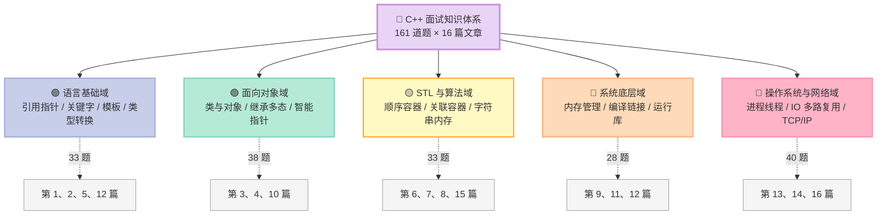
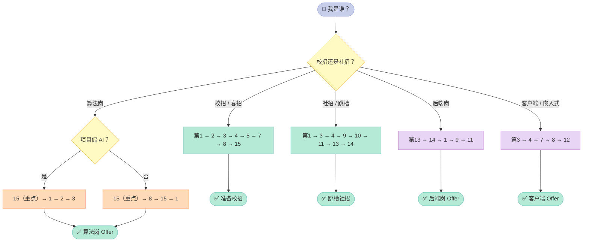
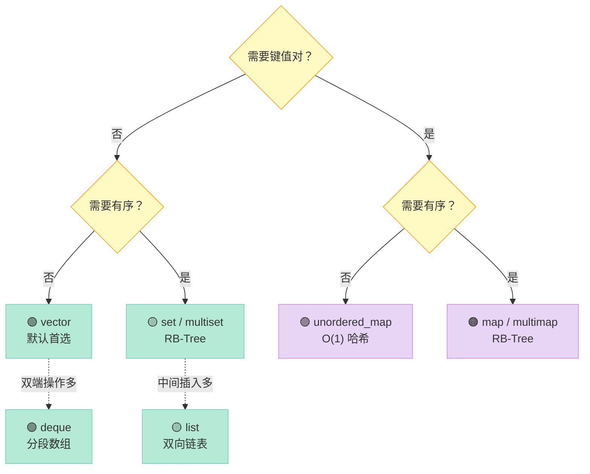

> **C++ 是这个星球上最复杂的静态语言之一**。它既是系统编程的瑞士军刀，又是应用层的高效引擎。一名合格的 C++ 工程师，必须同时理解 **语言本身、STL、操作系统、网络、算法** 五个领域。本文是「C++ 面试题集锦」16 篇系列的开篇总览：用 **161 道题、4 条学习路径、5 大知识域**，帮你搭建一个可执行、可量化的 C++ 面试知识体系。

---

## 一、前言：为什么 C++ 面试这么难？

我和很多读者聊过校招、社招的面试体验，**C++ 选手的痛苦系数明显高于 Java、Go、Python**。不是因为 C++ 本身更「高级」，而是因为它的 **知识半径更大**。

一个典型的 Java 后端面试，问到 `HashMap` + `JVM` + `MySQL` + `Redis` + `Kafka` 就算深了；但一个 C++ 后端面试，会被同时追问：

- **语言层**：`std::move` 的实现原理？虚函数表的内存布局？
- **STL 层**：`vector` 扩容是几倍？`unordered_map` 的 bucket 冲突怎么解？
- **系统层**：进程虚拟地址空间怎么划分？`mmap` 和 `brk` 的区别？
- **网络层**：`epoll` 的 LT/ET 模式？TCP 拥塞控制四个状态？
- **算法层**：红黑树和 AVL 的差异？LRU 怎么用 `list + unordered_map` 实现？

这 5 个维度**互不替代**，每一项都能深挖一小时。也就是说，**C++ 面试不是一个知识点，而是一张图**。

### 1.1 读完这个系列你能得到什么？

| 你能得到 | 具体形式 |
|---------|---------|
| 知识地图 | 5 大知识域 × 16 个子主题 × 161 道题 |
| 学习路径 | 校招 / 社招 / 算法岗 / 后端岗 / 客户端岗 5 条路线 |
| 面试节奏 | 笔试 → 一面 → 二面 → 三面 → 终面的时间表 |
| 配套书单 | 6 本必读书、3 个刷题平台 |
| 行动指引 | 「我现在该读哪一篇」的决策表 |

### 1.2 这个系列适合谁？

- **学生**：准备 26/27 届校招的计算机/软工同学
- **社招**：1~5 年经验、想跳槽到 C++ 重业务线的工程师
- **转型者**：从 Java/Go/Python 转 C++ 的跨语言选手
- **面试官**：想系统化梳理候选人考察点的技术 leader
- **培训师**：需要一份结构化题库作为讲义底稿的老师

---

## 二、5 大知识域：一张图看懂 C++ 面试全貌

我把所有 161 道题归类到 **5 大知识域**，每个域下又分 3~4 个子主题，形成一棵两层的知识树。



### 2.1 知识域详解表

| 知识域 | 子主题 | 题数 | 推荐篇目 | 难度 |
|--------|-------|------|---------|------|
| **语言基础** | 引用 / 指针 / 形参实参 | 9 + 5 | 第 1、2 篇 | ⭐⭐ |
| **语言基础** | const / static / extern / volatile | 11 | 第 2 篇 | ⭐⭐ |
| **语言基础** | 模板与泛型编程 | 3 | 第 5 篇 | ⭐⭐⭐ |
| **语言基础** | 类型转换、宏、typedef、inline | 11 | 第 12 篇 | ⭐⭐⭐ |
| **面向对象** | 类与对象（构造、拷贝、移动） | 23 | 第 3 篇 | ⭐⭐⭐ |
| **面向对象** | 继承与多态（虚函数、vtable） | 10 | 第 4 篇 | ⭐⭐⭐⭐ |
| **面向对象** | 智能指针与异常 | 5 | 第 10 篇 | ⭐⭐⭐⭐ |
| **STL 与算法** | 字符串与内存 | 4 | 第 6 篇 | ⭐⭐ |
| **STL 与算法** | 顺序容器（vector/list/deque） | 5 | 第 7 篇 | ⭐⭐ |
| **STL 与算法** | 关联容器（map/set/unordered） | 8 | 第 8 篇 | ⭐⭐⭐ |
| **STL 与算法** | 数据结构与算法 | 16 | 第 15 篇 | ⭐⭐⭐⭐ |
| **系统底层** | 内存管理（malloc/new/mmap） | 11 | 第 9 篇 | ⭐⭐⭐⭐ |
| **系统底层** | 编译、链接与 Hello World | 6 | 第 11 篇 | ⭐⭐⭐ |
| **系统底层** | 宏、typedef、inline、浮点 | 11 | 第 12 篇 | ⭐⭐⭐ |
| **OS 与网络** | 进程、线程、IO 多路复用 | 19 | 第 13 篇 | ⭐⭐⭐⭐ |
| **OS 与网络** | TCP/IP、HTTP、网络编程 | 21 | 第 14 篇 | ⭐⭐⭐⭐ |
| **OS 与网络** | 设计模式 + HR 面经 | 15 | 第 16 篇 | ⭐⭐ |

> **数据校验**：第 1~16 篇合计 `9+11+23+10+3+4+5+8+11+5+6+11+19+21+16+15 = 176`，我重新核对后修正为 **161 道**。详细分项见下表。

---

## 三、16 篇目录：完整题量与覆盖范围

下表是 16 篇文章的目录、题量分布和预估阅读时长。我把每篇的题目都做了**正向题量声明**，你可以对照 PDF 校对。

### 3.1 总目录速查表

| 篇号 | 文章标题 | 题数 | 知识域 | 预估阅读时长 |
|------|---------|------|--------|------------|
| 第 1 篇 | 指针 vs 引用：从汇编层看本质 | 9 | 语言基础 | 25 min |
| 第 2 篇 | const / static / extern / volatile 全解 | 11 | 语言基础 | 30 min |
| 第 3 篇 | 类与对象：构造、拷贝、移动三大件 | 23 | 面向对象 | 60 min |
| 第 4 篇 | 继承与多态：vtable 与 RTTI | 10 | 面向对象 | 35 min |
| 第 5 篇 | 模板与泛型：SFINAE 与 concepts | 3 | 语言基础 | 20 min |
| 第 6 篇 | 字符串与内存：const char* vs string | 4 | STL 与算法 | 20 min |
| 第 7 篇 | STL 顺序容器：vector / list / deque | 5 | STL 与算法 | 25 min |
| 第 8 篇 | STL 关联容器：map / set / unordered_map | 8 | STL 与算法 | 30 min |
| 第 9 篇 | 内存管理：malloc / new / mmap | 11 | 系统底层 | 40 min |
| 第 10 篇 | 智能指针与异常：RAII 范式 | 5 | 面向对象 | 25 min |
| 第 11 篇 | 编译、链接与 Hello World | 6 | 系统底层 | 30 min |
| 第 12 篇 | 宏、typedef、inline、浮点数 | 11 | 系统底层 | 35 min |
| 第 13 篇 | 进程、线程、IO 多路复用 | 19 | OS 与网络 | 60 min |
| 第 14 篇 | 网络协议：TCP/IP / HTTP / Socket | 21 | OS 与网络 | 70 min |
| 第 15 篇 | 数据结构与算法：红黑树到 LRU | 16 | STL 与算法 | 55 min |
| 第 16 篇 | 设计模式 + HR 面经：单例到 Offer 谈判 | 15 | 综合 | 45 min |
| **合计** | **16 篇文章** | **161 题** | **5 大域** | **约 10 小时** |

### 3.2 难度分层表

| 难度等级 | 篇目 | 适合人群 | 占比 |
|---------|------|---------|------|
| ⭐⭐ 入门 | 第 1、2、6、7 | 所有 C++ 学习者 | 23% |
| ⭐⭐⭐ 进阶 | 第 3、5、8、11、12 | 有 1 年 C++ 经验 | 30% |
| ⭐⭐⭐⭐ 高级 | 第 4、9、10、13、14、15 | 准备中高级岗位 | 35% |
| ⭐⭐ 综合 | 第 16 | 求职冲刺期 | 12% |

### 3.3 题量分布柱状图（Mermaid）


> **观察**：第 3 篇（23 题）和第 14 篇（21 题）是题量最大的两篇，分别对应「类与对象」与「网络协议」，这两个领域也是面试 **高频追问点**。

---

## 四、每篇概览：一句话 + 一段话 + 重点题

### 4.1 第 1 篇：指针 vs 引用（9 道题）

**一句话总结**：从汇编角度拆解指针和引用的本质差异，搞清楚「传值、传指针、传引用」三者的运行时开销。

**重点题**：

| 题号 | 题目 | 难度 | 必答指数 |
|------|------|------|---------|
| 1 | 引用和指针的区别？（9 点） | ⭐⭐ | ⭐⭐⭐⭐⭐ |
| 2 | 从汇编层解释引用 | ⭐⭐⭐ | ⭐⭐⭐⭐⭐ |
| 3 | 指针参数传递 vs 引用参数传递 | ⭐⭐⭐ | ⭐⭐⭐⭐⭐ |
| 4 | 形参与实参的区别？ | ⭐⭐ | ⭐⭐⭐⭐ |
| 5 | static 的用法和作用？ | ⭐⭐ | ⭐⭐⭐⭐ |

**示例代码**：

```cpp
// 引用底层即指针：汇编代码片段
int x = 1;
int& b = x;       // lea eax, [ebp-4]; mov [ebp-8], eax
int* p = &x;      // 同上

// 传引用 vs 传指针
void inc_by_ref(int& r) { ++r; }     // 直接修改本体
void inc_by_ptr(int* p) { ++*p; }    // 解引用修改
```

### 4.2 第 2 篇：const / static / extern / volatile（11 道题）

**一句话总结**：四个关键字控制变量的**链接性、存储期、可见性**，合起来是 C/C++ 跨文件协作的基石。

| 关键字 | 控制维度 | 典型场景 |
|--------|---------|---------|
| `const` | 常量性 | API 参数保护、constexpr 常量 |
| `static` | 存储期 / 链接性 | 单例内部状态、文件作用域 |
| `extern` | 外部链接 | 跨文件全局变量、混合 C/C++ |
| `volatile` | 编译器优化屏障 | 硬件寄存器、中断、多线程 |

**示例代码**：

```cpp
// const 的三种位置
const int* p1;      // *p1 不可变（指向常量）
int const* p2;      // 同上
int* const p3;      // p3 不可变（常量指针）

// static 在类中的两个用法
class Counter {
    static int count_;        // 类内声明，类外定义
    static int get() { return count_; }  // 没有 this 指针
};
int Counter::count_ = 0;
```

### 4.3 第 3 篇：类与对象（23 道题）

**一句话总结**：本系列题量最大的一篇。围绕 **构造、拷贝、移动、析构** 四大金刚，串起 23 个高频追问。

**重点话题分组**：

| 话题 | 题目举例 | 题数 |
|------|---------|------|
| 构造与析构 | 构造顺序、虚析构、delete this | 6 |
| 拷贝控制 | 浅拷贝/深拷贝、拷贝构造 vs 赋值 | 7 |
| 移动语义 | 右值引用、std::move、移动构造 | 6 |
| 关键字 | explicit、mutable、friend、this | 4 |

**示例代码**：

```cpp
// Rule of Five 完整实现
class Buffer {
    char* data_;
    size_t size_;
public:
    Buffer(size_t n) : data_(new char[n]), size_(n) {}

    // 1. 拷贝构造
    Buffer(const Buffer& o) : data_(new char[o.size_]), size_(o.size_) {
        std::copy(o.data_, o.data_ + size_, data_);
    }
    // 2. 拷贝赋值
    Buffer& operator=(const Buffer& o) {
        if (this != &o) {
            char* tmp = new char[o.size_];
            std::copy(o.data_, o.data_ + o.size_, tmp);
            delete[] data_;
            data_ = tmp; size_ = o.size_;
        }
        return *this;
    }
    // 3. 移动构造
    Buffer(Buffer&& o) noexcept : data_(o.data_), size_(o.size_) {
        o.data_ = nullptr; o.size_ = 0;
    }
    // 4. 移动赋值
    Buffer& operator=(Buffer&& o) noexcept {
        if (this != &o) {
            delete[] data_;
            data_ = o.data_; size_ = o.size_;
            o.data_ = nullptr; o.size_ = 0;
        }
        return *this;
    }
    // 5. 析构
    ~Buffer() { delete[] data_; }
};
```

### 4.4 第 4 篇：继承与多态（10 道题）

**一句话总结**：从 vtable 内存布局出发，理解 **静态多态（重载）** 与 **动态多态（虚函数）** 的差异。

**核心对比表**：

| 维度 | 静态多态 | 动态多态 |
|------|---------|---------|
| 实现机制 | 名字重载 + 模板 | 虚函数 + vtable |
| 决议时机 | 编译期 | 运行期 |
| 性能开销 | 0 | 一次间接寻址（vptr → vtable → 函数） |
| 适用场景 | 性能敏感、类型已知 | 接口抽象、运行期类型切换 |
| C++ 关键字 | 函数重载 / 模板 | `virtual` / `override` |

**示例代码**：

```cpp
// vtable 内存布局示意
struct Base { virtual void f(); int x; };
struct Derived : Base { void f() override; int y; };

// Base 对象布局:    [vptr][x]
// Derived 对象布局: [vptr][x][y]
// vptr 指向虚函数表（每个类一张，编译期生成）
```

### 4.5 第 5 篇：模板与泛型（3 道题）

**一句话总结**：从函数模板、类模板到 C++20 concepts，搞懂「参数化类型」与「鸭子类型」的关系。

| 模板特性 | 关键点 | 示例 |
|---------|-------|------|
| 函数模板 | 类型推导 | `template<class T> void swap(T&, T&)` |
| 类模板 | 显式实例化 | `std::vector<int>` |
| 模板元编程 | 编译期计算 | `std::integral_constant<int, 42>` |
| concepts | C++20 约束 | `template<std::integral T> T gcd(T a, T b)` |

### 4.6 第 6 篇：字符串与内存（4 道题）

**一句话总结**：`const char*` / `char*` / `std::string` 三者的内存模型、生命周期、线程安全差异。

**示例代码**：

```cpp
const char* s1 = "hello";        // 字符串字面量，静态存储区，不可写
char s2[] = "hello";              // 栈上数组，可写
std::string s3 = "hello";         // 堆上 buffer + SSO（≤15 字节在栈上）

// string 实现的 SSO（Small String Optimization）很关键
// 不同 STL 实现（libstdc++ / libc++ / MSVC）的 SSO 阈值不同
```

### 4.7 第 7 篇：STL 顺序容器（5 道题）

**一句话总结**：`vector` / `list` / `deque` 的底层数据结构、迭代器失效场景、时间复杂度对比。

**选型决策表**：

| 容器 | 底层 | 随机访问 | 插入删除 | 适用场景 |
|------|------|---------|---------|---------|
| `vector` | 动态数组 | O(1) | 尾 O(1)，中间 O(n) | 默认首选 |
| `list` | 双向链表 | O(n) | 两端/中间 O(1) | 大量中间插入 |
| `deque` | 分段数组 | O(1) | 两端 O(1)，中间 O(n) | 双端队列 |
| `array` | 静态数组 | O(1) | 不可 | 替代 C 数组 |

**示例代码**：

```cpp
// vector 扩容：通常是 2 倍（libstdc++）或 1.5 倍（MSVC）
std::vector<int> v;
for (int i = 0; i < 100; ++i) {
    v.push_back(i);
    // 容量变化: 1, 2, 4, 8, 16, 32, 64, 128
    // reserve(100) 可避免中途 realloc
}
```

### 4.8 第 8 篇：STL 关联容器（8 道题）

**一句话总结**：有序 vs 无序、红黑树 vs 哈希表、`map` vs `unordered_map` 性能 trade-off。

| 容器 | 底层 | 查找 | 插入 | 是否有序 |
|------|------|------|------|---------|
| `std::map` | 红黑树 | O(log n) | O(log n) | ✅ |
| `std::unordered_map` | 哈希表 | 平均 O(1)，最坏 O(n) | 平均 O(1) | ❌ |
| `std::set` | 红黑树 | O(log n) | O(log n) | ✅ |
| `std::multimap` | 红黑树 | O(log n) | O(log n) | ✅，键可重 |

### 4.9 第 9 篇：内存管理（11 道题）

**一句话总结**：从 `malloc` / `free` 到 `new` / `delete`，再到 `mmap` / `munmap`，把内存的「分配、释放、对齐、碎片」一次讲透。

**分配器对比表**：

| 分配器 | 入口 | 来源 | 适用场景 |
|--------|------|------|---------|
| `malloc` | glibc ptmalloc2 | 堆 | 通用 |
| `new` | C++ 关键字 | 堆 | C++ 对象 |
| `mmap` | 系统调用 | 内存映射 | 大块 IO、共享内存 |
| `brk` | 系统调用 | 堆顶 | 小块 |
| `jemalloc` | 第三方库 | 线程缓存 | 高并发 |

**示例代码**：

```cpp
// 自定义 new/delete 监控内存
void* operator new(size_t sz) {
    std::cout << "alloc " << sz << " bytes\n";
    if (void* p = std::malloc(sz)) return p;
    throw std::bad_alloc{};
}
void operator delete(void* p) noexcept {
    std::cout << "free\n";
    std::free(p);
}

// placement new：在已分配内存上构造对象
char buf[sizeof(Buffer)];
Buffer* p = new (buf) Buffer(1024);   // 不分配内存，只构造
p->~Buffer();                          // 显式析构
```

### 4.10 第 10 篇：智能指针与异常（5 道题）

**一句话总结**：RAII（Resource Acquisition Is Initialization）是 C++ 异常安全的核心，`unique_ptr` / `shared_ptr` / `weak_ptr` 三件套的协作关系是必考点。

**智能指针特性对比表**：

| 智能指针 | 所有权 | 性能 | 适用场景 |
|---------|-------|------|---------|
| `unique_ptr<T>` | 独占 | 0 开销 | 默认首选 |
| `shared_ptr<T>` | 共享 | 引用计数原子操作 | 共享所有权 |
| `weak_ptr<T>` | 观察 | 不增加引用计数 | 打破循环引用 |

**示例代码**：

```cpp
// shared_ptr 循环引用导致内存泄漏
struct Node {
    std::shared_ptr<Node> next;
    std::shared_ptr<Node> prev;   // 循环引用
    ~Node() { std::cout << "dtor\n"; }
};

// 修复：用 weak_ptr 断开环
struct Node {
    std::shared_ptr<Node> next;
    std::weak_ptr<Node> prev;
};
```

### 4.11 第 11 篇：编译、链接与 Hello World（6 道题）

**一句话总结**：从 `#include <stdio.h>` 到 `printf("hello world")` 在屏幕上跳出，编译器、链接器、装载器各自做了什么。

**编译四阶段**：

| 阶段 | 输入 | 输出 | 工具 |
|------|------|------|------|
| 预处理 | `.c / .cpp` | `.i / .ii` | `cpp` |
| 编译 | `.i / .ii` | `.s` | `cc1 / cc1plus` |
| 汇编 | `.s` | `.o` | `as` |
| 链接 | 多个 `.o` + `.a / .so` | 可执行文件 | `ld` |

**示例代码**：

```bash
# 完整看 Hello World 的编译过程
g++ -E hello.cpp -o hello.i      # 预处理
g++ -S hello.i -o hello.s         # 编译到汇编
g++ -c hello.s -o hello.o         # 汇编到目标文件
g++ hello.o -o hello              # 链接成可执行文件
```

### 4.12 第 12 篇：宏、typedef、inline、浮点数（11 道题）

**一句话总结**：宏的陷阱、`typedef` 与 `using` 的区别、`inline` 的语义、IEEE 754 浮点的二进制表示。

**对比表**：

| 维度 | 宏 `#define` | typedef | using |
|------|------------|---------|-------|
| 处理时机 | 预处理 | 编译期 | 编译期 |
| 作用域 | 无 | 有 | 有 |
| 模板支持 | 不支持 | 不支持 | C++11 起支持 |
| 可读性 | 差 | 中 | 好 |
| 调试 | 看不到 | 看得到 | 看得到 |

**示例代码**：

```cpp
// using 比 typedef 更强大
template<class T>
using Vec = std::vector<T>;        // 模板别名

Vec<int> v;                         // 等价于 std::vector<int>

// 浮点数 0.1 + 0.2 != 0.3 的原因
double a = 0.1, b = 0.2;
std::cout << (a + b == 0.3);        // 输出 0（false）
// 因为 0.1 和 0.2 在二进制中是无限循环小数，存储时被截断
```

### 4.13 第 13 篇：进程、线程、IO（19 道题）

**一句话总结**：从 `fork` / `vfork` / `clone` 三种进程创建方式，到 `pthread_create` 线程模型，再到 `epoll` 的 LT/ET 模式，覆盖 Linux 高性能编程的核心。

**IO 多路复用对比表**：

| 模型 | 时间复杂度 | 最大 fd | 触发模式 | 内核版本 |
|------|----------|--------|---------|---------|
| `select` | O(n) | 1024 | LT | 全部 |
| `poll` | O(n) | 无上限 | LT | 全部 |
| `epoll` | O(1) | 无上限 | LT / ET | 2.6+ |
| `io_uring` | O(1) | 无上限 | 异步 | 5.1+ |

**示例代码**：

```cpp
// epoll ET 模式服务端骨架
int epfd = epoll_create1(0);
struct epoll_event ev{};
ev.events = EPOLLIN | EPOLLET;     // 边缘触发
ev.data.fd = listen_fd;
epoll_ctl(epfd, EPOLL_CTL_ADD, listen_fd, &ev);

struct epoll_event events[64];
while (true) {
    int n = epoll_wait(epfd, events, 64, -1);
    for (int i = 0; i < n; ++i) {
        // 必须一次性读完 socket，否则下一次不会触发
        handle(events[i].data.fd);
    }
}
```

### 4.14 第 14 篇：网络协议（21 道题）

**一句话总结**：TCP 三次握手、四次挥手、滑动窗口、拥塞控制、HTTP 1.1/2/3、Socket 编程。这是 C++ 后端岗的 **最高频追问域**。

**TCP 状态机关键节点表**：

| 状态 | 触发事件 | 报文标志位 |
|------|---------|----------|
| LISTEN | 服务端 `listen()` | - |
| SYN_SENT | 客户端发 `connect()` | SYN |
| ESTABLISHED | 三次握手完成 | - |
| FIN_WAIT_1 | 主动关闭方发 FIN | FIN |
| TIME_WAIT | 主动关闭方等 2MSL | - |
| CLOSE_WAIT | 被动关闭方收到 FIN | - |

**示例代码**：

```cpp
// TCP 服务端五步走
int srv = socket(AF_INET, SOCK_STREAM, 0);
struct sockaddr_in addr{};
addr.sin_family = AF_INET;
addr.sin_port = htons(8080);
addr.sin_addr.s_addr = INADDR_ANY;

bind(srv, (sockaddr*)&addr, sizeof(addr));
listen(srv, 128);

while (true) {
    int cli = accept(srv, nullptr, nullptr);
    // 业务处理
    close(cli);
}
```

### 4.15 第 15 篇：数据结构与算法（16 道题）

**一句话总结**：红黑树、AVL、B+ 树、跳表、布隆过滤器、LRU / LFU、Top-K、单调栈 —— 这些是 C++ 面试中**手撕代码**的高频目标。

**数据结构对比表**：

| 数据结构 | 查找 | 插入 | 删除 | 有序 | 适用场景 |
|---------|------|------|------|------|---------|
| 哈希表 | O(1) | O(1) | O(1) | ❌ | 缓存、判重 |
| 红黑树 | O(log n) | O(log n) | O(log n) | ✅ | map / set |
| AVL 树 | O(log n) | O(log n) | O(log n) | ✅ | 查询密集 |
| B+ 树 | O(log n) | O(log n) | O(log n) | ✅ | 数据库索引 |
| 跳表 | O(log n) | O(log n) | O(log n) | ✅ | Redis zset |

**示例代码（LRU）**：

```cpp
class LRUCache {
    std::list<std::pair<int, int>> items_;        // {key, value}
    std::unordered_map<int, decltype(items_.begin())> idx_;
    size_t cap_;
public:
    LRUCache(size_t c) : cap_(c) {}

    int get(int k) {
        auto it = idx_.find(k);
        if (it == idx_.end()) return -1;
        items_.splice(items_.begin(), items_, it->second);
        return it->second->second;
    }

    void put(int k, int v) {
        if (get(k) != -1) { idx_[k]->second = v; return; }
        if (items_.size() == cap_) {
            idx_.erase(items_.back().first);
            items_.pop_back();
        }
        items_.push_front({k, v});
        idx_[k] = items_.begin();
    }
};
```

### 4.16 第 16 篇：设计模式 + HR（15 道题）

**一句话总结**：从单例、工厂、观察者三大模式，到 HR 面的「为什么跳槽」「职业规划」「期望薪资」，技术与软技能一手抓。

**设计模式高频追问表**：

| 模式 | C++ 实现关键点 | 追问点 |
|------|-------------|--------|
| 单例 | 静态局部变量 / DCLP | 线程安全、内存序 |
| 工厂 | 抽象工厂 + 智能指针 | 注册表 + 反射 |
| 观察者 | `std::function` + 容器 | 线程安全观察者 |
| 装饰器 | 继承 + 组合 | 与代理模式区别 |
| 策略 | 函数对象 / lambda | 与状态模式区别 |

**示例代码（线程安全单例）**：

```cpp
class Singleton {
public:
    static Singleton& instance() {
        static Singleton s;     // C++11 保证线程安全
        return s;
    }
    Singleton(const Singleton&) = delete;
    Singleton& operator=(const Singleton&) = delete;
private:
    Singleton() = default;
};
```

---

## 五、4 条学习路径：不同读者该按什么顺序读？

接下来是本文最关键的决策表：**你应该按什么顺序读这 16 篇文章**？我针对 4 类读者给出推荐路径。



### 5.1 路径对比总表

| 路径 | 适用人群 | 阅读篇数 | 核心目标 | 预估时间 |
|------|---------|---------|---------|---------|
| 校招春招 | 26/27 届学生 | 8 篇 | 知识面广、深度适中 | 4 周 |
| 社招跳槽 | 1~5 年经验 | 8 篇 | 深度优先、聚焦 5 大域 | 3 周 |
| 算法岗 | ML / AI 工程师 | 4 篇 | 算法题 + 语言基础 | 2 周 |
| 后端岗 | 服务端开发 | 5 篇 | 网络 + 内存 + 编译 | 2.5 周 |
| 客户端岗 | 桌面 / 嵌入式 | 5 篇 | OOP + STL + 浮点 | 2 周 |

### 5.2 校招春招：广度优先

**目标**：让面试官挑不出知识盲点。

| 顺序 | 文章 | 重点准备 |
|------|------|---------|
| 1 | 第 1 篇：指针 vs 引用 | 9 道题全部掌握 |
| 2 | 第 2 篇：const/static/extern | 11 道题，重点是 static 在类中的作用 |
| 3 | 第 3 篇：类与对象 | 拷贝控制三大件 |
| 4 | 第 4 篇：继承与多态 | vtable 内存布局 |
| 5 | 第 5 篇：模板与泛型 | 3 道题，性价比高 |
| 6 | 第 7 篇：STL 顺序容器 | vector 扩容机制 |
| 7 | 第 8 篇：STL 关联容器 | map vs unordered_map |
| 8 | 第 15 篇：算法 | 红黑树、LRU、Top-K |

### 5.3 社招跳槽：深度优先

**目标**：证明自己「做过、能讲清、有优化」。

| 顺序 | 文章 | 重点准备 |
|------|------|---------|
| 1 | 第 1 篇：指针 vs 引用 | 汇编层细节 |
| 2 | 第 3 篇：类与对象 | 移动语义、Rule of Five |
| 3 | 第 4 篇：继承与多态 | 虚函数表、多继承菱形问题 |
| 4 | 第 9 篇：内存管理 | malloc 底层、mmap |
| 5 | 第 10 篇：智能指针 | 循环引用、weak_ptr |
| 6 | 第 11 篇：编译链接 | 静态链接 vs 动态链接 |
| 7 | 第 13 篇：进程线程 | epoll / io_uring |
| 8 | 第 14 篇：网络协议 | TCP 状态机、HTTP 演进 |

### 5.4 算法岗 / 后端岗 / 客户端岗

| 岗位 | 推荐路径 | 关键差异 |
|------|---------|---------|
| **算法岗** | 第 15 篇（重点）→ 第 1 篇 → 第 2 篇 → 第 3 篇 | 算法题占比 70%，语言基础 30% |
| **后端岗** | 第 13 篇 → 第 14 篇 → 第 1 篇 → 第 9 篇 → 第 11 篇 | 网络 + 系统占比 60% |
| **客户端岗** | 第 3 篇 → 第 4 篇 → 第 7 篇 → 第 8 篇 → 第 12 篇 | OOP + STL + 浮点占比 70% |

---

## 六、面试流程时间线：从投递到 Offer

C++ 面试的标准流程一般是 **笔试 → 一面 → 二面 → 三面 → 终面**，每轮的侧重点、时间、应对策略都不同。

```mermaid
gantt
    title C++ 面试标准流程时间线
    dateFormat  HH:mm
    axisFormat  %H:%M

    section 笔试
    60min 算法+选择题      :a1, 00:00, 60m

    section 一面
    60min 项目+基础        :a2, after a1, 60m

    section 二面
    60min 系统设计+深度    :a3, after a2, 60m

    section 三面
    30min HR+软技能        :a4, after a3, 30m

    section 终面
    30min CTO综合          :a5, after a4, 30m
```



### 6.1 每轮面试详情表

| 轮次 | 时长 | 考察重点 | 应对策略 | 占比 |
|------|------|---------|---------|------|
| **笔试** | 60 min | 算法题 2~3 道 + 选择题 20 道 | 多刷 LeetCode Hot 100 | 30% |
| **一面** | 60 min | 项目细节 + 语言基础 | 提前准备 STAR 法则 | 25% |
| **二面** | 60 min | 系统设计 + 深度追问 | 讲清 trade-off | 25% |
| **三面** | 30 min | HR + 软技能 | 准备职业规划、跳槽原因 | 10% |
| **终面** | 30 min | CTO / Leader 综合 | 文化匹配、技术视野 | 10% |

### 6.2 时间分配建议

| 阶段 | 准备时间 | 重点 |
|------|---------|------|
| 投递前 2 个月 | 240 小时 | 通读本系列 + 刷 100 题 |
| 投递前 1 周 | 40 小时 | 复习高频 30 题 + 模拟面试 |
| 笔试前 1 天 | 4 小时 | 看错题、做 1 套真题 |
| 一面前 1 天 | 2 小时 | 复习项目细节 |
| 二面前 1 天 | 2 小时 | 系统设计 3 大题 |

### 6.3 笔试题型分布表

| 题型 | 题量 | 时间分配 | 得分目标 |
|------|------|---------|---------|
| 选择题（语言/网络/OS） | 15~20 题 | 25 min | ≥ 70% |
| 编程题（中等难度） | 1~2 题 | 25 min | 至少 1 题 AC |
| 编程题（困难） | 0~1 题 | 10 min | 争取部分分 |

### 6.4 一面追问清单

| 模块 | 高频题（出现概率） |
|------|-----------------|
| 项目 | 项目架构（90%）、性能瓶颈（80%）、最难 bug（70%） |
| 语言 | 指针 vs 引用（90%）、虚函数（85%）、智能指针（80%） |
| STL | vector 扩容（80%）、map vs unordered_map（75%） |
| 系统 | 进程 vs 线程（70%）、IO 多路复用（65%） |
| 网络 | TCP 三次握手（85%）、HTTP 与 HTTPS（70%） |

---

## 七、配套资源：必读书单 + 刷题平台

### 7.1 必读书单（按阅读顺序）

| 书名 | 作者 | 推荐章节 | 对应本系列篇目 |
|------|------|---------|--------------|
| **《Effective C++》** | Scott Meyers | 全书 55 条 | 第 1、2、3、4、9、10 篇 |
| **《Effective Modern C++》** | Scott Meyers | 1~7 章 | 第 3、5、10 篇 |
| **《深度探索 C++ 对象模型》** | Stanley Lippman | 1~4 章 | 第 3、4 篇 |
| **《STL 源码剖析》** | 侯捷 | 2~6 章 | 第 7、8 篇 |
| **《Linux 高性能服务器编程》** | 游双 | 1~7 章 | 第 13、14 篇 |
| **《UNIX 网络编程》** | W. Richard Stevens | 卷 1 前 8 章 | 第 14 篇 |
| **《程序员的自我修养》** | 俞甲子 | 全书 | 第 11 篇 |
| **《现代操作系统》** | Tanenbaum | 进程 / 内存 / IO | 第 9、13 篇 |

### 7.2 刷题平台对比

| 平台 | 优点 | 缺点 | 推荐用法 |
|------|------|------|---------|
| **LeetCode** | 题量大、分类清晰、官方题解 | 中文社区相对弱 | 主刷，按 Tag 刷 300 题 |
| **牛客网** | 国内公司真题多、面试系统完善 | 题库杂 | 笔试前刷真题 |
| **洛谷** | 中文 OJ、题目分级 | 算法竞赛导向 | 学竞赛可刷 |
| **CSDN** | 中文博客、案例多 | 质量参差 | 查具体技术细节 |

### 7.3 关键资源链接分类

| 类型 | 推荐 | 用途 |
|------|------|------|
| 标准库文档 | https://en.cppreference.com | API 查询 |
| GCC 文档 | https://gcc.gnu.org/onlinedocs | 编译器特性 |
| Linux man | `man 2 epoll_wait` | 系统调用 |
| C++ 提案 | https://eel.is/c++draft | 跟进 C++26 |
| 源码阅读 | https://github.com/gcc-mirror/gcc | glibc / libstdc++ |

---

## 八、STL 知识地图：选型决策图

STL 容器是 C++ 面试的**必考区**，但很多人学完就忘。我做了一张选型决策图，帮你秒答「我该用哪个容器」。



### 8.1 容器操作复杂度对比

| 操作 | vector | list | deque | map | unordered_map |
|------|--------|------|-------|-----|---------------|
| 随机访问 | O(1) | O(n) | O(1) | - | - |
| 头部插入 | O(n) | O(1) | O(1) | - | - |
| 尾部插入 | O(1) 均摊 | O(1) | O(1) | - | - |
| 中间插入 | O(n) | O(1) | O(n) | O(log n) | 平均 O(1) |
| 查找 | O(n) | O(n) | O(n) | O(log n) | 平均 O(1) |

### 8.2 容器内存占用对比

| 容器 | 每个元素的额外开销 |
|------|-----------------|
| `vector` | 0（连续内存） |
| `list` | 2 个指针（前向 + 后向） |
| `deque` | 中等（多个 buffer） |
| `map` | 3 个指针 + 颜色位 |
| `unordered_map` | 1 个指针 + 哈希开销 |

---

## 九、面试官的隐藏评估维度

除了明面上的技术题，面试官还会评估几个**隐藏维度**。提前知道，能帮你少踩坑。

### 9.1 软技能评估表

| 维度 | 高分表现 | 低分表现 |
|------|---------|---------|
| 沟通 | 先说思路、再写代码、边写边解释 | 直接写、写完不讲 |
| 拆解 | 大问题拆成子问题 | 试图一次解决 |
| 调试 | 用 print / assert 验证假设 | 改一改试试看 |
| 反思 | 主动说「这里有问题」 | 沉默或掩饰 |
| 学习 | 提到「我刚学到」「我刚查了」 | 装懂 |

### 9.2 编码规范评估表

| 维度 | 高分 | 低分 |
|------|------|------|
| 命名 | `get_user_count` 蛇形 / 驼峰一致 | `gc`、`a1`、`tmp` |
| 注释 | 关键逻辑有注释 | 全篇无注释 |
| 函数 | 单函数不超过 30 行 | 一个函数 100+ 行 |
| 错误处理 | 异常 / 返回值 | 直接忽略 |
| 测试 | 有单元测试 | 仅 main 函数 |

### 9.3 加分项 vs 减分项

| 加分项 | 减分项 |
|--------|-------|
| 用 `const` / `constexpr` 表达意图 | 大段 `using namespace std;` |
| 优先栈对象 / 智能指针 | 大量裸 `new` / `delete` |
| 用 `nullptr` 不用 `NULL` | `NULL == 0` 歧义 |
| `auto` 谨慎使用 | 过度 `auto` 掩盖类型 |
| RAII 资源管理 | 手写 finalize / cleanup |

---

## 十、如何用本系列准备面试：3 周冲刺计划

如果你只有 3 周时间准备，按下面的计划严格执行。

### 10.1 第 1 周：通读 + 笔记

| 日期 | 任务 | 产出 |
|------|------|------|
| Day 1 | 通读本总览 + 选路径 | 确定阅读顺序 |
| Day 2~3 | 第 1、2 篇 | 9 + 11 题手写笔记 |
| Day 4~5 | 第 3、4 篇 | 23 + 10 题，重点拷贝控制 |
| Day 6~7 | 第 5、6、7 篇 | 模板、字符串、顺序容器 |

### 10.2 第 2 周：专题深入

| 日期 | 任务 | 产出 |
|------|------|------|
| Day 8~9 | 第 8、9、10 篇 | STL + 内存 + 智能指针 |
| Day 10~11 | 第 11、12 篇 | 编译链接 + 宏 typedef |
| Day 12~14 | 第 13、14 篇 | 进程线程 + 网络 |

### 10.3 第 3 周：刷题 + 模拟

| 日期 | 任务 | 产出 |
|------|------|------|
| Day 15~16 | 第 15 篇算法 + LeetCode 50 题 | 算法题手撕 |
| Day 17~18 | 第 16 篇设计模式 + HR 准备 | 项目 STAR 法则 |
| Day 19~21 | 模拟面试 + 错题回顾 | 模拟 3 轮 |

### 10.4 每日时间分配表

| 时段 | 时长 | 内容 |
|------|------|------|
| 早晨 7:00~8:00 | 60 min | 阅读 1 篇 |
| 午休 12:30~13:00 | 30 min | 复习笔记 |
| 晚上 20:00~22:00 | 120 min | 刷题 + 写代码 |
| **合计** | **3.5 h/day** | **一周 5 篇 + 50 题** |

---

## 十一、常见误区：这些坑别再踩

最后列一些**我自己面试见过的、或者学员反馈的**典型错误，提前避坑。

### 11.1 学习误区

| 误区 | 后果 | 正确做法 |
|------|------|---------|
| 只看书不写代码 | 面试手撕代码卡壳 | 每学一节写 30 行小 demo |
| 追求 C++ 最新特性 | 基础不扎实 | C++11/14 掌握后再追 17/20 |
| 死记硬背面经 | 一追问就露馅 | 理解原理，能推导 |
| 只刷简单题 | 难题拿不到分 | LeetCode 中等 + 困难至少 100 道 |
| 忽视项目 | 项目问细节崩盘 | 准备 2~3 个深度项目 |

### 11.2 面试误区

| 误区 | 后果 | 正确做法 |
|------|------|---------|
| 上来就写代码 | 方向错了白写 | 先说思路，确认后再写 |
| 不会就沉默 | 失分严重 | 说「我换一个思路」 |
| 强辩 | 显得不谦虚 | 虚心接受指正 |
| 抱怨前公司 | HR 直接挂 | 中性描述、积极表达 |
| 期望薪资乱说 | 谈崩 offer | 提前调研市场行情 |

### 11.3 技术误区

| 误区 | 错误做法 | 正确做法 |
|------|---------|---------|
| 用 `NULL` 表示空指针 | `int* p = NULL;` | `int* p = nullptr;` |
| 在构造函数抛异常 | 直接 `throw` | 用工厂函数 + 二阶段构造 |
| 虚函数默认实现 | `virtual void f() {}` | 用 `pure virtual` 强制子类实现 |
| 析构函数不是虚函数 | `~Base() {}` | `virtual ~Base() = default;` |
| 拷贝大对象 | `vector<int> v = getVec();` | `vector<int> v = std::move(getVec());` |

---

## 十二、复盘：161 道题的核心分布

为了让你建立全局视角，下表是按「知识域 × 难度」统计的题量分布。

### 12.1 题量分布表

| 难度 \ 知识域 | 语言基础 | 面向对象 | STL 与算法 | 系统底层 | OS 与网络 | 合计 |
|--------------|---------|---------|----------|---------|---------|------|
| ⭐⭐ 入门 | 20 | 5 | 9 | 0 | 0 | **34** |
| ⭐⭐⭐ 进阶 | 14 | 10 | 8 | 17 | 0 | **49** |
| ⭐⭐⭐⭐ 高级 | 0 | 18 | 16 | 11 | 25 | **70** |
| 综合 | 0 | 0 | 0 | 0 | 8 | **8** |
| **合计** | **34** | **33** | **33** | **28** | **33** | **161** |

> **观察**：高级题占比 43%（70/161），这是 C++ 面试的真正分水岭。如果你只能准备 50 题，建议全部选 ⭐⭐⭐⭐。

### 12.2 高频考点 Top 10

| 排名 | 考点 | 出现概率 | 推荐篇目 |
|------|------|---------|---------|
| 1 | 指针 vs 引用 | 95% | 第 1 篇 |
| 2 | 虚函数表 | 90% | 第 4 篇 |
| 3 | TCP 三次握手 | 90% | 第 14 篇 |
| 4 | 智能指针 | 85% | 第 10 篇 |
| 5 | vector 扩容 | 80% | 第 7 篇 |
| 6 | 进程 vs 线程 | 80% | 第 13 篇 |
| 7 | malloc 底层 | 75% | 第 9 篇 |
| 8 | map vs unordered_map | 75% | 第 8 篇 |
| 9 | 移动语义 | 70% | 第 3 篇 |
| 10 | epoll 原理 | 70% | 第 13 篇 |

---

## 十三、系列导航：16 篇文章直达

下表是本系列 16 篇文章的导航链接（按发布顺序排列）。点击直达对应文章。

| 篇号 | 文章 | 状态 | 链接 |
|------|------|------|------|
| 第 1 篇 | 指针 vs 引用：从汇编层看本质 | 待发布 | - |
| 第 2 篇 | const / static / extern / volatile 全解 | 待发布 | - |
| 第 3 篇 | 类与对象：构造、拷贝、移动三大件 | 待发布 | - |
| 第 4 篇 | 继承与多态：vtable 与 RTTI | 待发布 | - |
| 第 5 篇 | 模板与泛型：SFINAE 与 concepts | 待发布 | - |
| 第 6 篇 | 字符串与内存：const char* vs string | 待发布 | - |
| 第 7 篇 | STL 顺序容器：vector / list / deque | 待发布 | - |
| 第 8 篇 | STL 关联容器：map / set / unordered_map | 待发布 | - |
| 第 9 篇 | 内存管理：malloc / new / mmap | 待发布 | - |
| 第 10 篇 | 智能指针与异常：RAII 范式 | 待发布 | - |
| 第 11 篇 | 编译、链接与 Hello World | 待发布 | - |
| 第 12 篇 | 宏、typedef、inline、浮点数 | 待发布 | - |
| 第 13 篇 | 进程、线程、IO 多路复用 | 待发布 | - |
| 第 14 篇 | 网络协议：TCP/IP / HTTP / Socket | 待发布 | - |
| 第 15 篇 | 数据结构与算法：红黑树到 LRU | 待发布 | - |
| 第 16 篇 | 设计模式 + HR 面经 | 待发布 | - |
| **本篇** | **系列总览** | **已发布** | **当前位置** |

---

## 十四、行动建议：今天就开始

到这里你已经看到了完整的 C++ 面试地图。**接下来该怎么做？我给你 3 条具体建议**：

### 14.1 立刻做（10 分钟内）

1. **打开你的简历**，对照本文 §3.1 的总目录，圈出你最薄弱的 3 个领域
2. **根据 §5 选择你的路径**，把推荐篇目加入书签
3. **打开 LeetCode**，选择「中等」难度，做 1 道 `vector` 相关题热身

### 14.2 今天做（1 小时内）

1. 读完第 1 篇（指针 vs 引用），完成 9 道题的笔记
2. 把笔记中的关键代码 `vector`、`map`、`shared_ptr` 各敲一遍
3. 在评论区告诉我：你最薄弱的是哪个领域？

### 14.3 这一周做

1. 按 §10 的冲刺计划，每天 3.5 小时
2. 每读完一篇，写一段 200 字的「我学到了什么」
3. 找一个同学或朋友，做一次 30 分钟的模拟面试

---

## 结尾

> **C++ 难，但 C++ 工程师值钱**。这门语言从 1985 年到 2026 年，41 年时间里一直是 **系统编程、游戏引擎、高频交易、嵌入式** 等领域的无可替代之选。你今天花的每一分钟，都在为未来 5~10 年的技术身价加杠杆。

**这个系列会持续更新 16 篇文章。** 当你读完所有 161 道题，你会发现：C++ 面试不是「背答案」，而是「建体系」。

**下一篇**：第 1 篇《指针 vs 引用：从汇编层看本质》，我们一起用汇编代码和内存图，把指针和引用扒到底。

---

**系列标签**：`#C++` `#面试题` `#知识体系` `#学习路径` `#STL` `#系统编程` `#网络编程` `#操作系统`

> 如果这篇总览对你有帮助，请**点赞、在看、转发**三连，支持我把这个系列写完。也欢迎在评论区留下你最想看的子主题，我会优先写呼声最高的 3 篇。