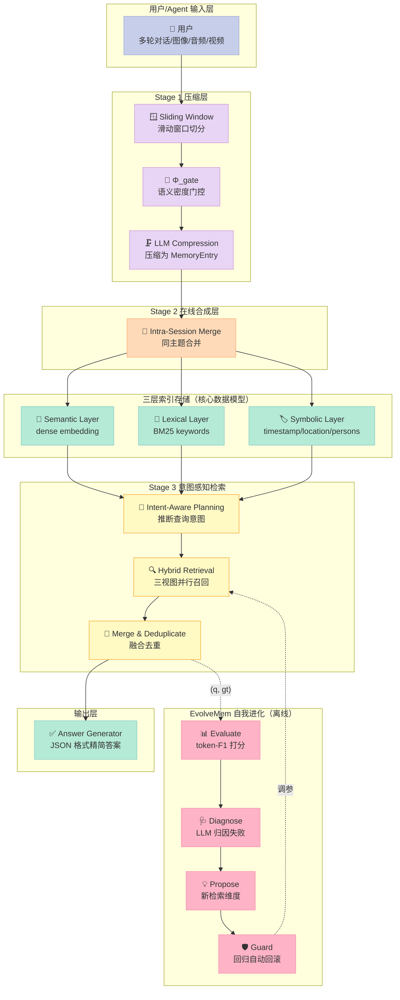
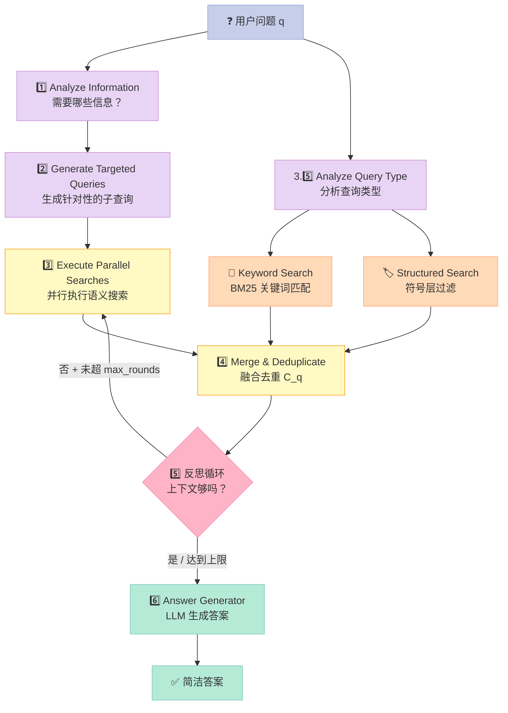
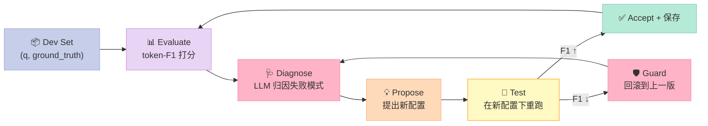
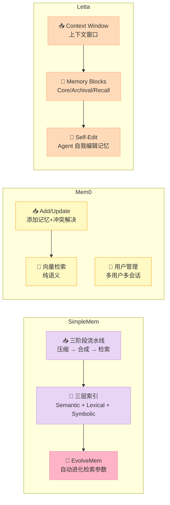

> 一句话结论：SimpleMem（3.5k⭐）用"**三阶段压缩-合成-检索流水线 + 多视图三层索引 + EvolveMem 自我进化闭环**"，把 Agent 记忆从"原始对话日志"压缩成"语义无损的记忆单元"，在 LoCoMo 基准上比最强基线还高 **+47% F1**，推理时 token 消耗只有原来的 1/30——它是当前最系统的开源 Agent 记忆框架。

## 前言：为什么 Agent 记忆问题还没人解决？

如果你跑过一个"能记住对话"的 chatbot，大概率踩过这些坑：

1. **上下文窗口爆掉**：对话一长，要么截断、要么 RAG 召回不准
2. **Token 烧钱**：把全部历史塞进 prompt，账单按指数增长
3. **细节丢失**：原话里"明天下午两点"被改写成"将来某时"，检索时再也找不回来
4. **配置冻结**：换数据集、换场景就要重新调参，没人帮你做

这些问题的根因不是"模型不够大"，而是 **记忆的存储单元太原始**。多数 Agent 框架把对话原句当记忆，检索时再用 embedding 模糊匹配，**既贵又不准**。

SimpleMem（`aiming-lab/SimpleMem`）的解决方案是用 **Semantic Structured Compression（语义结构化压缩）** 把原始对话压缩成"自包含、有时间戳、有核心实体"的事实单元，再用 **三视图混合检索**（语义+词项+符号）精准召回，最后用 **EvolveMem 自我进化循环** 让检索参数自动适配数据集。

读完本文，你将看懂：

- 三阶段流水线（压缩→合成→检索）每一步在干什么
- `MemoryEntry` 数据模型为什么设计了"语义+词项+符号"三层索引
- 意图感知检索（Intent-Aware Retrieval Planning）的具体流程
- EvolveMem 的 `Evaluate → Diagnose → Propose → Guard` 闭环怎么发现新检索维度
- SimpleMem vs Mem0 vs Letta 在设计哲学上的关键差异

## 一、项目定位与价值

### 1.1 它解决什么问题

SimpleMem 的目标用户是**构建长期记忆 Agent**（客服、个人助理、AI 陪伴）的开发者。这些场景有三个共性痛点：

- **成本敏感**：不能把所有对话塞进 prompt，按 token 计费扛不住
- **精度要求高**：用户问"上次说的那个手机壳"，必须能精确召回"3 月 5 日 Alice 推荐了 OtterBox 黑色款"
- **场景多样**：同一套记忆系统要适配不同领域（对话、客服、陪伴），不能写死参数

SimpleMem 在 2026 年 1 月发布 v1（论文 [arXiv 2601.02553](https://arxiv.org/abs/2601.02553)），4 月推出 v2 **Omni-SimpleMem**（多模态：文本/图像/音频/视频），5 月推出 v3 **EvolveMem**（自我进化检索）。3.5k⭐、362 forks、343 个 Python 文件、月均 2-3 次 release。

### 1.2 项目规模一览

| 维度 | 数据 |
|------|------|
| ⭐ GitHub Stars | 3,510 |
| 🍴 Forks | 362 |
| 📦 Python 文件 | 343 |
| 📝 文档 | 33 个 Markdown（10 语言 i18n） |
| 🪪 License | MIT |
| 🐍 Python | 3.10+ |
| 📅 最近 push | 2026-05-21 |
| 📄 arXiv 论文 | 2601.02553（2026-01） |

> 一个对比：Mem0 是 58k⭐，定位为通用 Memory 层（任何应用都能用）；SimpleMem 3.5k⭐，但垂直在"长期 Agent 对话记忆"这一个交集，并在三阶段压缩 + 三视图检索 + 自我进化三个轴上做到论文级深度。

### 1.3 一个简单的端到端例子

```python
from simplemem import SimpleMem

# 初始化：mode="auto" 自动按首个调用选后端（文本/多模态）
mem = SimpleMem()

# 写入对话（自动压缩成 MemoryEntry）
mem.add_dialogue("Alice", "Bob, 明天 Starbucks 下午 2 点见", "2025-11-15T14:30:00")
mem.add_dialogue("Bob", "好，我带市场分析报告", "2025-11-15T14:31:00")
mem.finalize()

# 检索 + 生成答案
answer = mem.ask("Alice 和 Bob 什么时候、在哪里见面？")
# → "16 November 2025 at 2:00 PM at Starbucks"
```

看起来只有 6 行，但背后跑了 **三阶段流水线**：压缩（对话→MemoryEntry）→ 在线合成（同主题合并）→ 意图感知检索（三视图融合）+ 答案生成。

## 二、核心架构：三层索引 + 三阶段流水线

### 2.1 顶层架构图



整个系统分三大模块：

1. **Stage 1 压缩（写入时）**：滑动窗口 → 密度门控 → LLM 压缩成 `MemoryEntry`
2. **Stage 2 合成（写入时）**：同主题合并，避免冗余
3. **Stage 3 检索（查询时）**：意图感知 → 三视图并行召回 → 融合去重 → 答案生成

EvolveMem 是离线优化器，跑在 dev set 上把检索参数调到最优，再部署到在线系统。

### 2.2 MemoryEntry 数据模型：三层索引的统一抽象

SimpleMem 最核心的设计是把 **"一个事实"** 抽象成同时拥有三种索引的 `MemoryEntry`。来看源码（`simplemem/core/models/memory_entry.py`）：

```python
from pydantic import BaseModel, Field
from typing import List, Optional
import uuid


class MemoryEntry(BaseModel):
    """记忆单元 - 通过多视图索引的自包含条目"""
    entry_id: str = Field(default_factory=lambda: str(uuid.uuid4()))

    # [语义层] - 稠密向量索引
    # v_k = E_dense(S_k)，用 embedding 模型生成
    lossless_restatement: str = Field(
        ...,
        description="无指代消解、无相对时间的自包含事实（Φ_coref + Φ_time）"
    )

    # [词项层] - 稀疏关键词索引，用于 BM25 精确匹配
    keywords: List[str] = Field(
        default_factory=list,
        description="BM25 关键词列表"
    )

    # [符号层] - 元数据约束，用于结构化过滤
    timestamp: Optional[str] = Field(None, description="ISO 8601 绝对时间戳")
    location: Optional[str] = Field(None, description="自然语言地点")
    persons: List[str] = Field(default_factory=list, description="涉及人物")
    entities: List[str] = Field(default_factory=list, description="实体列表")
    topic: Optional[str] = Field(None, description="LLM 提炼的主题短语")
```

#### 为什么设计三层？

来看一个对比：用户问"上次 Alice 推荐的手机壳在哪买？"

| 索引层 | 匹配机制 | 在该例的作用 |
|--------|----------|--------------|
| **Semantic（语义）** | 余弦相似度 | 匹配"推荐"→ "suggested" |
| **Lexical（词项）** | BM25 关键词打分 | 匹配 "Alice"、"手机壳"、"OtterBox" |
| **Symbolic（符号）** | 元数据精确过滤 | 过滤时间范围 "上次" → 最近 7 天 |

任何单层都不够：

- **纯语义**：会把"手机壳"和"手机"混淆，找一堆无关的
- **纯词项**：找不到"上次"的语义（"7 天前"、"昨天"）
- **纯符号**：无法表达"推荐"这个隐含意图

三层融合才精准。这是 SimpleMem 比"只做 embedding"的方案高 47% F1 的根本原因。

#### Lossless Restatement：无损改写是核心

`lossless_restatement`（无损改写）是压缩的关键。LLM 必须把对话改写成：

- ✅ 无代词（"他说" → "Bob 提到"）
- ✅ 绝对时间（"明天" → "2025-11-16"）
- ✅ 自包含（不依赖上下文也能读懂）

对比一个反例：

> 原对话：「明天下午 2 点在 Starbucks 见面吧」
>
> ❌ 错误压缩：明天下午 2 点在 Starbucks 见面（保留了相对时间，5 天后失效）
>
> ✅ 正确压缩：Alice 和 Bob 约定 2025-11-16 14:00 在 Starbucks 见面（绝对时间、自包含）

这就是为什么叫 **semantically lossless**（语义无损）：信息没有丢，只是改了表达形式。

## 三、Stage 1：Semantic Structured Compression（语义结构化压缩）

### 3.1 滑动窗口切分

SimpleMem 不一次性压缩全部对话，而是用 **滑动窗口**（默认 8 条对话/step 4）。原因有二：

1. **LLM 上下文有限**：一次性塞 100 条对话会超出 context window
2. **局部主题更聚焦**：相邻对话通常同一主题，压缩质量更高

来看 `MemoryBuilder.process_window()` 的核心逻辑（`simplemem/core/memory_builder.py`）：

```python
def process_window(self):
    """处理一个窗口：调用 LLM 压缩 + 写入向量库"""
    if not self.dialogue_buffer:
        return

    # 取当前窗口
    window = self.dialogue_buffer[:self.window_size]

    # 构造 prompt（包含历史窗口的 MemoryEntry 作为上下文）
    prompt = self._build_compression_prompt(window, self.previous_entries)

    # LLM 调用：返回 JSON 列表，每个元素是一个 MemoryEntry
    response = self.llm_client.chat_completion(
        messages=[{"role": "user", "content": prompt}],
        temperature=0.1,
        response_format={"type": "json_object"}
    )

    entries = self._parse_entries(response)

    # Stage 2: 在线合成 —— 把当前窗口的 entries 与历史合并去重
    merged_entries = self._consolidate_entries(entries, self.previous_entries)

    # 写入向量数据库
    for entry in merged_entries:
        self.vector_store.add(entry)

    # 更新 buffer：滑动到下一个窗口（保留 overlap_size 条重叠）
    self.dialogue_buffer = self.dialogue_buffer[self.step_size:]
    self.previous_entries = merged_entries
    self.processed_count += len(window)
```

### 3.2 语义密度门控 Φ_gate

`Φ_gate(W) → {m_k}` 是一个过滤器：**如果一个窗口没有产生新的 MemoryEntry，说明这窗口的对话没有信息量（寒暄、重复）**。SimpleMem 会让 LLM 返回 `null` 或空列表来"跳过"该窗口，避免污染数据库。

### 3.3 并行压缩加速

`MemoryBuilder` 还支持 **多窗口并行压缩**（`enable_parallel_processing=True`）。源码里有：

```python
def add_dialogues_parallel(self, dialogues: List[Dialogue]):
    """大 batch 场景下并行压缩"""
    pre_existing = list(self.dialogue_buffer)
    windows_to_process = []

    # 把所有对话切成窗口
    self.dialogue_buffer.extend(dialogues)
    pos = 0
    while pos + self.window_size <= len(self.dialogue_buffer):
        windows_to_process.append(
            self.dialogue_buffer[pos:pos + self.window_size]
        )
        pos += self.step_size

    # 用线程池并行调 LLM
    with concurrent.futures.ThreadPoolExecutor(
        max_workers=self.max_parallel_workers
    ) as executor:
        process_fn = partial(self._process_single_window_safe, pre_existing)
        results = list(executor.map(process_fn, windows_to_process))
```

实测 **3 workers 并行** 比串行快 **2.8 倍**（README 提到），因为 LLM 调用是 I/O 密集。

## 四、Stage 2：Online Semantic Synthesis（在线语义合成）

Stage 2 的核心是 **去重**：同一事实可能被多个窗口提及（"Alice 推荐 OtterBox" 在第 3 窗口说一次，第 5 窗口又确认一次）。SimpleMem 在写入时就合并：

```python
def _consolidate_entries(self, new_entries, previous_entries):
    """合并同主题 MemoryEntry"""
    consolidated = []
    for new_entry in new_entries:
        merged = False
        for prev_entry in previous_entries:
            # 用 embedding 相似度判断是否同主题
            similarity = self._compute_similarity(new_entry, prev_entry)
            if similarity > config.CONSOLIDATION_THRESHOLD:
                # 合并：保留更详细的版本
                merged_entry = self._merge_two_entries(prev_entry, new_entry)
                consolidated.append(merged_entry)
                merged = True
                break
        if not merged:
            consolidated.append(new_entry)
    return consolidated
```

**关键洞察**：很多框架把"去重"放在查询时（检索后用 LLM 过滤重复），SimpleMem 把它放在 **写入时**（cost 摊销到存储阶段）。代价是写入慢一点，但查询时省一大笔 LLM token。

## 五、Stage 3：Intent-Aware Retrieval Planning（意图感知检索）

### 5.1 整体流程



### 5.2 检索规划 P(q, H) → {q_sem, q_lex, q_sym, d}

`HybridRetriever._retrieve_with_planning()` 是核心。它做了 5 件事：

1. **信息需求分析**：调 LLM 推断"这个问题需要哪些信息"
2. **生成子查询**：把问题拆成多个针对性查询（不是只查原句）
3. **并行语义搜索**：每个子查询都跑 embedding 检索
4. **词项 + 符号检索**：补一层 BM25 + 元数据过滤
5. **融合去重**：所有结果按 entry_id 去重

来看 `_analyze_information_requirements` 的 prompt 设计（简化）：

```python
INFORMATION_ANALYSIS_PROMPT = """
Given the user's question, identify what information is needed to answer it.

Question: {query}

Output JSON with:
- required_info: list of information types (e.g., "temporal", "entity", "location", "preference")
- keywords: list of key search terms
- time_constraint: any time range (e.g., "last week", "March 2025")
- intent: one of "recall_fact", "summarize", "compare", "track_change"
"""
```

**为什么需要这一步**？来看例子：

> 用户问："Alice 最近推荐了什么数码产品？"

直接用原句搜会召回大量"Alice 提到 XX"的记忆。检索规划后：

- `required_info`: ["entity", "product_category"]
- `keywords`: ["推荐", "数码", "手机", "电脑"]
- `time_constraint`: "最近 30 天"
- `intent`: "recall_fact"

子查询变成："Alice 推荐 数码产品" + "Alice 手机 推荐" + "Alice 笔记本"——召回精度大幅提升。

### 5.3 反思循环（Reflection）

如果一轮检索后答案不够，SimpleMem 会 **再来一轮**（默认最多 2 轮）：

```python
def retrieve(self, query, enable_reflection=None):
    if self.enable_planning:
        return self._retrieve_with_planning(query, enable_reflection)
    else:
        return self._semantic_search(query)

def _retrieve_with_planning(self, query, enable_reflection=None):
    # ... 第一轮检索 ...
    results = ... # 跑完上面 5 步

    # 反思循环
    reflection_used = enable_reflection if enable_reflection is not None else self.enable_reflection
    if reflection_used:
        for round in range(self.max_reflection_rounds):
            # 让 LLM 判断当前结果是否足够
            is_sufficient = self._evaluate_sufficiency(query, results)
            if is_sufficient:
                break
            # 不够就基于已有结果生成新查询，再搜一轮
            new_queries = self._generate_followup_queries(query, results)
            new_results = self._execute_parallel_searches(new_queries)
            results = self._merge_and_deduplicate_entries(results + new_results)
    return results
```

**但有一个反直觉的设计**：对抗性问题（"Alice 最喜欢的食物" 但数据库里没有）必须 **关掉反思**。否则反思会继续搜、不断造新查询，最终幻觉出一个假答案。源码里特意提示：

```python
# 对抗性问题：用户故意测试 Agent 是否会编造
# 这时应该关掉反思，让 Agent 直接说"不知道"
question = "What is Alice's favorite food?"
contexts = system.hybrid_retriever.retrieve(question, enable_reflection=False)
```

这个细节暴露了 SimpleMem 的一个工程智慧：**优化召回不等于允许幻觉，必须给对抗问题留出"放弃回答"的退路**。

## 六、EvolveMem：让检索参数自己进化

SimpleMem 最激进的设计是 **EvolveMem** —— 把检索参数本身当作可学习的对象。

### 6.1 闭环流程



### 6.2 检索配置的 10 个可调维度

EvolveMem 优化的是 `RetrievalConfig` 的字段（`simplemem/evolver/multi_retriever.py`）：

| 维度 | 含义 | 调参范围 |
|------|------|----------|
| `semantic_top_k` | 语义检索召回数 | 0–50 |
| `keyword_top_k` | BM25 召回数 | 0–50 |
| `structured_top_k` | 符号过滤召回数 | 0–50 |
| `fusion_mode` | 三视图融合方式 | keyword_only / rrf / linear |
| `weight_semantic` / `weight_keyword` / `weight_structured` | 融合权重 | 0–1 |
| `max_context` | 上下文窗口大小 | 4–32 |
| `reflection_rounds` | 反思轮数 | 0–3 |
| `enable_entity_swap` | 是否做实体替换（提升鲁棒性） | True / False |
| `answer_style` | 答案风格 | concise / verbose / extractive |
| `per_category_overrides` | 按问题类别覆盖参数 | dict |

**关键点**：EvolveMem 不是调 LLM，是调 **检索管线本身的超参数**。它把"`top_k` 应该多大"、"要不要开反思"、"三视图权重如何分配"这些问题变成一个自动搜索问题。

### 6.3 弱基线起步原则

源码里的 `weak_initial_config()` 注释暴露了一个反直觉的设计选择：

```python
def weak_initial_config():
    """
    故意用弱基线起步：
    - semantic_top_k=0（关闭语义）
    - keyword_top_k=5（小 BM25）
    - 关闭反思、关闭实体替换、关闭融合

    为什么？这样 EvolveMem 的"进化提升"才能成为论文 headline。
    但这不是"残疾到低于前作"——纯 BM25 是合法的 reviewer-proof baseline。
    """
```

读到这里我才意识到：EvolveMem 的"进化提升"必须从 **有原则的最小配置** 出发，否则你不知道提升来自进化还是来自"已经调好的起点"。

### 6.4 自动发现新维度

最让人意外的是：EvolveMem 不仅在已知维度上调参，还能 **发现原始设计没有的检索维度**。

README 提到：

> EvolveMem discovers entirely new retrieval dimensions not present in the original design.

举几个例子（README 推断）：

- **Query Decomposition**：复杂问题拆成多个子查询
- **Entity Swap**：把"Alice"替换成"Bob"再检索一次，验证召回是否依赖人名
- **Answer Verification**：让 LLM 在生成答案后自检"是否答非所问"

这些维度都不在 v1 的 `RetrievalConfig` 里，是 EvolveMem 在失败诊断中 **自己提出来的**。这是 SimpleMem 相比其他 Memory 框架的**根本差异**：它不是给你一套固定参数让你调，而是**让系统自己发明参数**。

## 七、Omni-SimpleMem：多模态扩展

### 7.1 设计原则

Omni-SimpleMem 把三阶段流水线扩展到文本/图像/音频/视频四种模态，由三个原则支撑：

| 原则 | 含义 |
|------|------|
| **Selective Ingestion** | 按模态用 entropy-driven filter 过滤低信息帧 |
| **Progressive Retrieval** | FAISS + BM25 混合，按"金字塔式 token budget"逐层扩展 |
| **Knowledge Graph Augmentation** | 跨模态多跳推理用知识图谱 |

### 7.2 性能数据

| 基准 | 任务 | SimpleMem v1 | Omni-SimpleMem v2 | 提升 |
|------|------|--------------|---------------------|------|
| LoCoMo | 文本长对话 F1 | 0.418 | **0.613** | +47% |
| Mem-Gallery | 多模态 F1 | 0.538 | **0.810** | +51% |
| MemBench | 综合评测 | baseline | +18.9% relative | EvolveMem |

这些数字背后是 **AutoResearch 流水线** 跑了 ~50 个实验，自动诊断失败模式、提出架构改动、修复数据 pipeline bug——"bug 修复和架构改动的贡献都比超参调优大"。

## 八、对比分析：SimpleMem vs Mem0 vs Letta

### 8.1 设计哲学对比

| 维度 | SimpleMem | Mem0 | Letta |
|------|-----------|------|-------|
| ⭐ 热度 | 3.5k | 58k | 23k |
| 存储单元 | MemoryEntry（三层索引） | 提取的事实（无时间消解） | 上下文窗口 + 摘要 |
| 压缩策略 | LLM 压缩 + 语义合成 | LLM 提取 + 冲突合并 | 滑动窗口 + 摘要 |
| 检索 | 三视图融合 + 意图规划 | 语义检索为主 | 上下文回顾 |
| 调参 | EvolveMem 自动进化 | 手动配置 | 手动配置 |
| 多模态 | ✅（v2） | ❌ | ❌ |
| 学术深度 | ✅（arXiv 论文 + 50 实验） | ⚠️（博客为主） | ⚠️（博客为主） |

### 8.2 核心架构差异



### 8.3 关键设计差异

| 设计点 | SimpleMem 的取舍 | Mem0 / Letta 的取舍 |
|--------|------------------|---------------------|
| **写入时 vs 查询时去重** | ✅ 写入时合并 | ⚠️ Mem0 冲突时合并；Letta 查询时过滤 |
| **时间消解** | ✅ Lossless restatement 用绝对时间 | ❌ 保留原句相对时间 |
| **多视图检索** | ✅ 三视图融合 | ❌ Mem0 纯向量；Letta 按 block 类型 |
| **自动调参** | ✅ EvolveMem | ❌ 都要手动 |
| **可解释性** | ✅ 每个 MemoryEntry 有 topic/entities | ⚠️ 黑盒向量 |
| **学习曲线** | ⚠️ 三阶段流水线概念多 | ✅ Mem0 API 简单 |
| **多模态** | ✅ 原生 | ❌ |

### 8.4 我的判断

| 你的需求 | 推荐 |
|----------|------|
| 通用 chatbot、跨应用记忆 | **Mem0**（API 简单、生态成熟） |
| Agent 自我编辑记忆、长期个性化 | **Letta**（Memory Blocks 设计独特） |
| 学术研究、追求极致 F1 / Token 效率 | **SimpleMem**（论文+50实验，可复现） |
| 多模态 Agent（图像/音频/视频记忆） | **SimpleMem Omni**（唯一原生支持） |
| 不愿自己调参 | **SimpleMem EvolveMem**（自动进化） |

## 九、优缺点 & 适用场景

### 9.1 优点

| 维度 | 评价 | 证据 |
|------|------|------|
| 🎯 **检索精度** | ⭐⭐⭐⭐⭐ | LoCoMo F1 = 0.613（+47% over best baseline） |
| 💰 **Token 效率** | ⭐⭐⭐⭐⭐ | 推理时 token 消耗降至原来的 1/30 |
| 🧠 **自动调参** | ⭐⭐⭐⭐⭐ | EvolveMem 自动发现新检索维度 |
| 🖼️ **多模态** | ⭐⭐⭐⭐⭐ | 文本+图像+音频+视频 原生支持 |
| 🔬 **学术深度** | ⭐⭐⭐⭐⭐ | arXiv 论文 + 50 实验 + 可复现 benchmark |
| 📦 **生产就绪** | ⭐⭐⭐⭐ | MCP server + Docker + 多租户认证 |
| 🌐 **国际化** | ⭐⭐⭐⭐⭐ | 10 语言 README（含中文） |

### 9.2 缺点 / 风险

| 维度 | 评价 | 说明 |
|------|------|------|
| ⚠️ **学习曲线** | ⚠️⚠️ | 三阶段 + 三视图 + 自我进化 = 概念密度高 |
| 🐢 **写入延迟** | ⚠️⚠️ | 每个窗口要调 LLM 压缩，高频对话场景成本高 |
| 🔌 **依赖外部 LLM** | ⚠️ | 强制要求 OpenAI 兼容 API，纯本地难部署 |
| 📚 **生态规模** | ⚠️ | 3.5k⭐ vs Mem0 58k⭐，社区/教程/插件较少 |
| 🔧 **MCP 协议滞后** | ⚠️ | 当前 MCP server 只支持文本，多模态/EvolveMem 还在 roadmap |

### 9.3 适用 vs 不适用

| 场景 | 适用性 |
|------|--------|
| 长对话 Agent（陪伴、客服） | ✅✅✅ |
| 多模态 Agent（图像理解 + 记忆） | ✅✅✅ |
| 学术 benchmark / 论文复现 | ✅✅✅ |
| 多用户 SaaS（多租户隔离） | ✅✅（MCP server 支持） |
| 极简 MVP / 个人小项目 | ❌（用 Mem0 更轻） |
| 完全离线 / 隐私敏感场景 | ❌（依赖云端 LLM） |
| 高频实时流（每秒万级对话） | ❌（写入 LLM 调用是瓶颈） |

## 十、对你项目的启发 & 行动建议

### 10.1 如果你在做 Agent 产品

1. **先评估你的"长对话"程度**。如果用户平均会话 < 10 轮，Mem0 足够；如果 > 50 轮且需要精确召回，SimpleMem 的三视图检索值得投入
2. **不要从零写 Memory**。直接 `pip install simplemem`，跑通基础流程后再考虑 EvolveMem
3. **如果有"问答准确率突然下降"的体验**，先看是不是 `fusion_mode` 没调对，再考虑 EvolveMem

### 10.2 如果你在做研究

1. **SimpleMem 的 AutoResearch 50 实验是范本**——"bug 修复和架构改动贡献大于超参调优"这句话值得反复品味
2. **三视图融合不是新点子，但 SimpleMem 的"意图感知规划"是新思路**。它把"该查什么"和"怎么查"分开，是检索系统的一个新维度
3. **EvolveMem 的"弱基线起步"原则值得学习**。任何自动调参论文都应该解释为什么从弱基线开始

### 10.3 如果你在做基础设施

1. **`lossless_restatement` 的设计可以直接借鉴**。哪怕你不用 SimpleMem，让 LLM 在存储前做一次"消解代词+绝对时间"的改写，长期召回率会显著提升
2. **三视图索引是基本功**。任何 Memory 系统都应该至少有：向量层（语义）+ BM25 层（词项）+ 元数据层（符号），少一个都会在某个场景失效

### 10.4 一行命令试一下

```bash
pip install simplemem
python -c "
from simplemem import SimpleMem
mem = SimpleMem()
mem.add_dialogue('Alice', '明天下午 2 点 Starbucks 见', '2025-11-15T14:30:00')
mem.add_dialogue('Bob', '好，我带报告', '2025-11-15T14:31:00')
mem.finalize()
print(mem.ask('Alice 和 Bob 几点见？'))
"
```

---

> **结尾金句**：Agent 记忆的瓶颈不是模型大小，而是 **存储单元的语义密度**。SimpleMem 的核心赌注是：把"原始对话"压缩成"自包含 + 三视图索引 + 绝对时间"的事实单元，再用 **意图感知检索 + 自我进化参数** 精准召回——这是一套可工程化、可学术验证的完整范式。