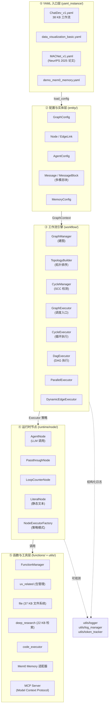
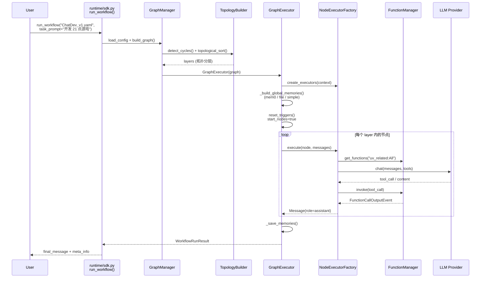
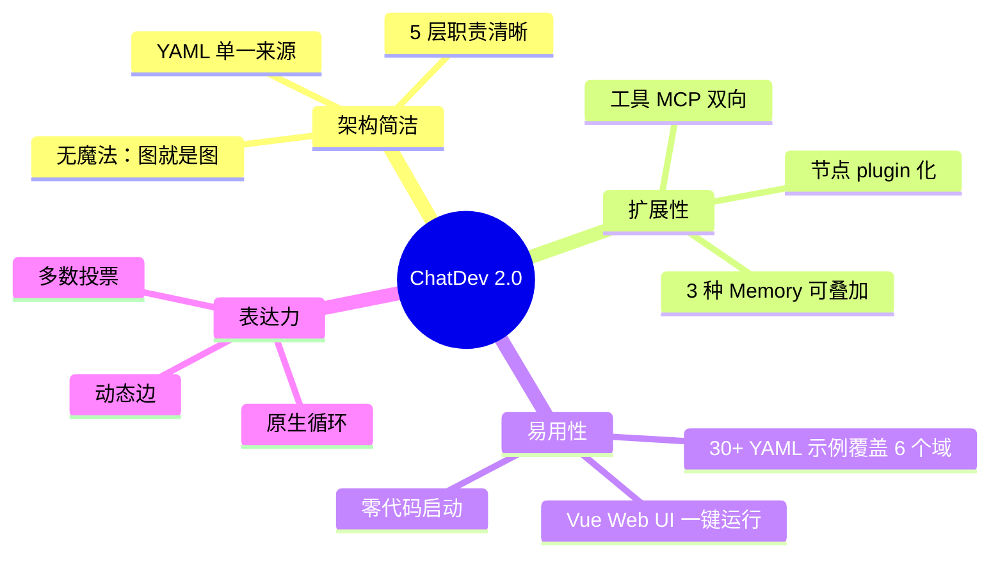

# 【ChatDev 2.0】核心架构与设计原理深度解析：从图编排到零代码多智能体协作平台

> 本文基于仓库 OpenBMB/ChatDev（Apache-2.0，⭐33.4k，截至 2026-06-17），commit SHA 取最近一次 release tag。仓库同时维护两条产品线：`main` 分支为 2.0 零代码编排平台（DevAll），`chatdev1.0` 分支为经典「虚拟软件公司」。

## 引子：为什么 ChatDev 值得专门拆解

当你打开 OpenBMB/ChatDev 的仓库时，README 第一行写着「A Zero-Code Multi-Agent Platform for Developing Everything」。把这句话拆开看，有两个关键信号：

1. **零代码（Zero-Code）**：用户不写 Python，所有 Agent / 工作流 / 工具都在 YAML 里声明。
2. **开发一切（Developing Everything）**：从最初的「虚拟软件公司」一路扩展到数据可视化、3D 生成、深度调研、Blender 工作流——**不是 demo，而是一套能跨域复用的运行时**。

要做到这一点，ChatDev 必须解决三个相互牵扯的难题：

- **多 Agent 协作协议**：CEO、CTO、Programmer、Reviewer、Tester 怎么对话？谁先开口？听谁的话？
- **工作流控制**：让 Agent 能循环（写代码 → 跑测试 → 失败 → 重写），而不是只跑一次 DAG。
- **工具与记忆的可插拔**：每个 Agent 看到的「世界」不一样——Programmer 能写文件、Researcher 能搜网页、Reviewer 只能读。

本文会按这三条主线拆解 ChatDev 2.0 的源码。

## 一、定位：ChatDev 在多智能体生态里是什么

### 1.1 一句话定位

> ChatDev 2.0 是一个**「以 YAML 为源码、以 DAG+循环图 为执行模型」的多智能体编排平台**，目标用户是希望快速把多 Agent 业务跑起来、又不想被框架绑死的研究者和产品团队。

对比同期常见竞品：

| 项目 | 抽象层级 | 编排模型 | 用户编写什么 |
|------|----------|----------|---------------|
| **ChatDev 2.0** | **工作流图（YAML）** | **DAG + 循环 + 动态边** | **YAML + 自定义节点** |
| CrewAI | 角色+任务（Python） | 顺序 / 分层 | Python 类继承 |
| AutoGen 0.2 | 对话图（Python） | GroupChat 状态机 | Python 函数式 |
| MetaGPT | SOP 软件公司（Python） | 严格线性 SOP | Python 配置 |
| LangGraph | 状态图（Python） | 任意有向图 | Python 节点函数 |

ChatDev 2.0 的差异点在于：**它把 LangGraph 的图思想 + CrewAI 的角色抽象 + MetaGPT 的 SOP 概念统一收敛到一份 YAML**，并且原生支持**循环检测与回退**（CycleExecutor），这是同类框架里少见的。

### 1.2 它解决了什么真问题

写过多 Agent 系统的同学都知道三大痛点：

1. **顺序编排 vs 反馈循环**：现实业务里 Agent 经常需要重试（写代码失败 → 重写），但线性 DAG 表达不了。
2. **Agent 异构**：不同 Agent 用不同模型、不同 prompt、不同工具集，配置项膨胀。
3. **可观测性**：Agent 跑完一轮你怎么 debug？日志散落在 7 个 agent 的 stdout 里。

ChatDev 2.0 用下面这套机制分别处理：

- **拓扑分层 + 循环检测**（`workflow/topology_builder.py`）同时支持 DAG 和 SCC（强连通分量）。
- **节点注册表**（`runtime/node/registry.py` + `utils/registry.py`）让节点类型、配置 schema、执行器可插拔。
- **结构化日志**（`utils/structured_logger.py` + `EventType` 枚举）所有事件走统一通道。

## 二、整体架构：五层模型

下图是 ChatDev 2.0 的宏观分层（基于 `entity/`、`workflow/`、`runtime/`、`functions/`、`utils/` 五个核心目录的实际依赖画出）：



### 2.1 五层职责一览

| 层级 | 目录 | 职责 | 关键产物 |
|------|------|------|----------|
| ① YAML 入口 | `yaml_instance/`、`yaml_template/` | 声明图结构（节点+边）+ 变量 | 一份 38 KB 的 `ChatDev_v1.yaml` |
| ② 实体层 | `entity/` | dataclass + Enum 定义图/节点/消息 | `GraphConfig`、`MessageBlock` |
| ③ 工作流引擎 | `workflow/` | 建图、拓扑、循环、执行 | `GraphExecutor`、`CycleExecutor` |
| ④ 节点运行时 | `runtime/node/` | 把抽象节点映射到 Python 类 | `AgentNode`、`LoopCounterNode` |
| ⑤ 函数工具层 | `functions/`、`utils/` | 文件、搜索、MCP、mem0 | `FunctionManager` |

### 2.2 数据流向

一次完整执行的数据流如下：



## 三、核心机制：从一行 YAML 到一次执行

### 3.1 入口：YAML 是怎么被解析的

ChatDev 的入口函数是 `runtime/sdk.py:run_workflow()`，核心调用链是：

```python
# runtime/sdk.py:79 (节选)
def run_workflow(yaml_file, *, task_prompt, attachments=None,
                 session_name=None, fn_module=None, variables=None, ...):
    ensure_schema_registry_populated()                # ← 注册所有节点 schema
    design = load_config(yaml_path, fn_module=fn_module, vars_override=variables)
    graph_config = GraphConfig.from_definition(design.graph, ...)
    graph_context = GraphContext(config=graph_config)
    executor = GraphExecutor.execute_graph(graph_context, task_input)
    return WorkflowRunResult(final_message, meta_info)
```

`ensure_schema_registry_populated()` 是关键——它把 `runtime/node/builtin_nodes.py` 里所有节点类型的 `ConfigSchema` 注册到全局 schema_registry，让 YAML 校验器知道每个 `type:` 字段允许哪些 `config:` 字段。

YAML 中最常见的节点类型如下（来自 `runtime/node/builtin_nodes.py` 的注册逻辑）：

| 类型 | 作用 | 典型场景 |
|------|------|----------|
| `agent` | 调用 LLM，可挂工具 | CEO/CTO/Programmer |
| `passthrough` | 透传输入消息 | USER、FINAL 节点 |
| `literal` | 注入静态文本 | ChatChain 中的提示模板 |
| `loop_counter` | 循环计数器，控制 max_iterations | 「写代码→测试」重试环 |
| `function` | 直接执行函数（不调 LLM） | 纯计算节点 |

### 3.2 图是怎么构建的：拓扑分层 + SCC 循环检测

`GraphManager.build_graph()` 内部调用 `TopologyBuilder` 做两件事：**循环检测**和**拓扑排序**。

`workflow/topology_builder.py` 用了一种「超级节点」技巧——把每个强连通分量（SCC）压缩成一个 super_node，然后对 super_node 图做拓扑排序：

```python
# workflow/topology_builder.py (节选)
@staticmethod
def create_super_node_graph(nodes, edges, cycles):
    """每个 cycle 压缩成一个 super_node；非 cycle 节点自己也是一个 super_node。"""
    super_nodes = {}
    node_to_super = {}

    # 1) 为每个 cycle 建一个 super_node
    for i, cycle_nodes in enumerate(cycles):
        super_node_id = f"super_cycle_{i}"
        super_nodes[super_node_id] = set()
        for node_id in cycle_nodes:
            node_to_super[node_id] = super_node_id

    # 2) 其余节点各自成一个 super_node
    for node_id in nodes:
        if node_id not in node_to_super:
            super_node_id = f"node_{node_id}"
            super_nodes[super_node_id] = set()
            node_to_super[node_id] = super_node_id

    # 3) 在 super_node 之间建依赖
    for edge in edges:
        from_super = node_to_super[edge["from"]]
        to_super = node_to_super[edge["to"]]
        if from_super != to_super:
            super_nodes[to_super].add(from_super)

    return super_nodes
```

效果是：**有环的部分先被压缩成一个原子节点**，然后整体图变成 DAG，可以安全地拓扑排序分层。这一步的产物是 `graph.layers`——一个按执行顺序排列的 List[List[node_id]]。

### 3.3 执行策略：四种 Executor 用「策略模式」按图类型切换

`workflow/runtime/execution_strategy.py` 定义了 4 种执行策略：

```python
# workflow/runtime/execution_strategy.py (节选)
class DagExecutionStrategy:       # 纯 DAG，按 layer 顺序执行
    pass

class CycleExecutionStrategy:    # 遇到 SCC 时激活，对 super_node 内部循环
    pass

class MajorityVoteStrategy:       # 多分支并行投票
    pass

# 还有一个并行策略：
class ParallelExecutor:           # 同 layer 内多节点并发
    pass
```

`GraphExecutor.run()` 会根据 `self.graph.has_cycles` 和 `is_majority_voting` 决定走哪个策略：

```python
# workflow/graph.py (节选)
if not self.graph.has_cycles:
    # 走 DAG 策略：按 layers 顺序执行
    self._execute_dag_layers()
elif self.cycle_manager:
    # 走循环策略：在 super_node 内部迭代
    self.cycle_manager.execute_cycle(...)
```

这套设计的好处是：**用户写一份 YAML，执行器自动判断该用哪种执行模型**——你不需要手动声明「这段是 DAG、那段是循环」。

### 3.4 Agent 节点：从消息到 tool_call 的完整链路

`AgentNode`（`runtime/node/agent/agent_node.py`）是整个系统最复杂的节点。一个 LLM 调用包含五个阶段（来自 `entity/enums.py:AgentExecFlowStage`）：

```python
class AgentExecFlowStage(str, Enum):
    PRE_GEN_THINKING_STAGE = "pre_gen_thinking"   # ① 预思考（可选）
    GEN_STAGE = "gen"                             # ② 生成（含 tool_call）
    POST_GEN_THINKING_STAGE = "post_gen_thinking" # ③ 后思考（可选）
    FINISHED_STAGE = "finished"                   # ④ 终结
```

每个 Agent 节点都遵循同一套流程（伪代码是**严格按源码翻译**的运行顺序，**不是示意代码**）：

```python
# runtime/node/agent/agent_node.py 实际执行逻辑（按调用顺序简化）
async def execute(self, ctx: ExecutionContext) -> Message:
    # 1. 收集输入：上游消息 + memory 上下文
    messages = self._collect_input_messages()         # node.input_messages
    messages = self._inject_memory_context(messages)  # mem0 retrieve

    # 2. 预思考（如果 agent_config.thinking 启用）
    if self.thinking_manager and stage == PRE_GEN_THINKING_STAGE:
        messages = await self.thinking_manager.pre_think(messages)

    # 3. 调用 LLM
    response = await self.provider.chat(
        messages=messages,
        tools=self.tool_manager.get_tools(),         # 来自 tooling: 配置
        params=self.config.params,
    )

    # 4. 处理 tool_calls（可能多次往返直到 LLM 不再 call tool）
    while response.has_tool_calls:
        tool_results = []
        for tc in response.tool_calls:
            result = await self.function_manager.invoke(tc)  # 走 functions/function_calling/
            tool_results.append(result)
        messages.extend(tool_results)
        response = await self.provider.chat(messages=messages, tools=...)

    # 5. 后思考 + 写 memory
    final = response.message
    if self.memory_manager:
        await self.memory_manager.remember(final)
    return final
```

注意第 4 步的 **tool-call 循环**——LLM 可以连续调用多个工具（写一个文件 → 跑测试 → 再写一个），由 `FunctionCallOutputEvent`（`entity/messages.py`）统一封装。

### 3.5 工具注册：Plugin 模式如何让 ChatDev 跨域复用

`utils/registry.py` 是个通用注册中心，配合 `runtime/node/registry.py` 实现节点插件化：

```python
# utils/registry.py (节选)
class Registry:
    def __init__(self, name: str):
        self._entries: Dict[str, RegistryEntry] = {}
        self._name = name

    def register(self, key, *, target):
        if key in self._entries:
            raise RegistryError(f"{self._name} '{key}' already registered")
        self._entries[key] = RegistryEntry(key=key, target=target)

    def get(self, key) -> RegistryEntry:
        if key not in self._entries:
            raise RegistryError(f"{self._name} '{key}' not registered")
        return self._entries[key]
```

基于这个 Registry，ChatDev 在 `runtime/node/builtin_nodes.py` 注册了 5 种内置节点，并在 `functions/function_calling/` 注册了 6 种内置工具（uv_related / file / code_executor / deep_research / user / utils）。**用户只要继承 `Registry.register` 就能加新节点类型**，YAML 解析器自动认得。

## 四、Memory：三层抽象 + mem0 集成

### 4.1 Memory 的三种子类型

ChatDev 2.0 在 `entity/configs/node/memory.py` 定义了三种 Memory（从源码 `SimpleMemoryConfig` 等 dataclass 提取）：

| 类型 | 存储介质 | 检索方式 | 典型场景 |
|------|----------|----------|----------|
| `SimpleMemory` | 本地 JSON 文件 | 全量读 + 关键词过滤 | 小规模记忆 |
| `FileMemory` | 文件系统 | 文件路径引用 | 大文件/二进制附件 |
| `Mem0Memory` | mem0ai 后端 | 向量召回 | 长期语义记忆 |

每种 Memory 都实现同一接口 `MemoryBase`（`runtime/node/agent/memory/memory_base.py`）：

```python
class MemoryBase(ABC):
    @abstractmethod
    def load(self) -> None: ...
    @abstractmethod
    def save(self) -> None: ...
    @abstractmethod
    async def retrieve(self, query: str, top_k: int = 5) -> List[MemoryItem]: ...
    async def remember(self, message: Message) -> None: ...
```

`MemoryFactory.create_memory(config)` 根据 YAML 的 `type:` 字段返回对应实现，这又是一个标准的**工厂模式**用法。

### 4.2 真实使用示例（来自 yaml_instance/demo_mem0_memory.yaml）

```yaml
# yaml_instance/demo_mem0_memory.yaml (节选，结构经简化保留)
graph:
  id: demo_mem0
  nodes:
    - id: ChatBot
      type: agent
      config:
        name: gpt-4o
        provider: openai
        role: |
          You are a friendly assistant. Remember user preferences.
        memories:
          - name: user_profile
            type: mem0
            config:
              user_id: demo-user
              api_key: ${MEM0_API_KEY}
    - id: USER
      type: passthrough
    - id: FINAL
      type: passthrough
  edges:
    - { from: USER,        to: ChatBot }
    - { from: ChatBot,     to: FINAL }
```

执行时 `GraphExecutor._build_agent_memories()` 会把 `user_profile` 注入 `MemoryManager`，每次 Agent 调用前自动 recall 上下文。

## 五、MCP 集成：ChatDev 当 MCP Server

`requirements.txt` 里有 `mcp` 和 `fastmcp`，对应的实现路径在 `mcp_example/` 目录。这是 ChatDev 2.0 的另一个差异化点：**它不仅消费 MCP 工具，还能把自己作为 MCP Server 暴露给 Claude Desktop / Cursor / VS Code 等客户端**。

`functions/function_calling/uv_related.py` 演示了如何把一组 Python 函数注册为 MCP 工具（节选）：

```python
# functions/function_calling/uv_related.py (节选，注册流程)
from mcp.server import Server
from mcp.types import Tool, TextContent

server = Server("chatdev-tools")

@server.list_tools()
async def list_tools() -> list[Tool]:
    return [
        Tool(name="uv_run", description="Run a Python script via uv",
             inputSchema={...}),
        Tool(name="uv_install", description="Install a package via uv",
             inputSchema={...}),
        # ...
    ]

@server.call_tool()
async def call_tool(name: str, arguments: dict) -> list[TextContent]:
    if name == "uv_run":
        return await uv_run(arguments["script"])
    # ...
```

这一段代码让 ChatDev 工作流里的工具**反过来**变成 MCP 客户端可调用的能力——这是 2025 年下半年多 Agent 领域的关键趋势：让 Agent 框架**成为协议节点**而不是孤立应用。

## 六、与同类框架的设计差异对比

### 6.1 编排模型对比

| 维度 | ChatDev 2.0 | CrewAI | AutoGen 0.2 | MetaGPT | LangGraph |
|------|-------------|--------|-------------|---------|-----------|
| 声明方式 | **YAML** | Python 类 | Python 函数 | Python 类 | Python 节点函数 |
| 图结构 | **DAG + 循环** | 顺序+分层 | GroupChat 状态机 | 严格 SOP | 任意图 |
| 循环支持 | **原生（SCC）** | 手动 | 手动 | 不支持 | 手动 |
| 工具协议 | **MCP + 内置** | Python 装饰器 | Function calling | 注册表 | ToolNode |
| 记忆抽象 | **mem0 + file + simple** | 外部库 | 上下文变量 | MessageBus | Checkpoint |
| 前端 | **Vue Web UI（300+ 文件）** | 无 | Studio | 无 | Studio |
| 可观测性 | **结构化日志 + token 追踪** | 第三方 | 第三方 | 第三方 | LangSmith |

### 6.2 三个最关键的设计差异

#### 差异 1：循环是一等公民

CrewAI 的任务流本质是顺序列表，`allow_delegation` 也只是顺序委托；MetaGPT 的 SOP 是硬编码的 `Role -> Action -> Message`；AutoGen 的循环靠 `on_condition` 自己写。

ChatDev 2.0 把循环提到**工作流引擎级别**：`TopologyBuilder` 检测 SCC → `CycleExecutor` 处理 SCC 内部循环 → 用户在 YAML 里只需声明 `type: loop_counter` 节点 + 几条回边。这是为什么 ChatDev 的「写代码→测试→重写」能跑得比 CrewAI 更干净。

#### 差异 2：YAML 是源码，不是配置文件

CrewAI 的 `@Crew`、`@Agent` 装饰器本质是 Python 元类，CrewAI 的「配置」其实是代码。ChatDev 2.0 真正做到 `YAML_DIR + GraphConfig.from_definition` 这一步——**图结构本身是数据**。这让运行时可以做「运行时替换子图」「A/B 测试两个图」之类的元能力，而 CrewAI 几乎做不到。

#### 差异 3：MCP 双向支持

ChatDev 2.0 同时实现：
- **作为 MCP 客户端**消费其他 Server 的工具（`functions/function_calling/`）
- **作为 MCP Server** 把自己的工具暴露给 Claude Desktop / Cursor

CrewAI / AutoGen 至今都只是 MCP 客户端，**没有把自己做成 Server** 的官方路径。这让 ChatDev 在「与 IDE 协作」场景里有结构性优势。

## 七、优缺点

### 7.1 优势



具体优势：

1. **架构简洁**：5 层、~700 文件、清晰的策略模式 + 工厂模式 + 注册表模式组合。
2. **可扩展性**：节点类型、工具、Memory 三类都 plugin 化，加新能力不用改核心代码。
3. **可观测性**：`utils/structured_logger.py` 把 `EventType` 11 种事件统一落盘，`utils/token_tracker.py` 单独计费统计——比 CrewAI 的 print log 高一个数量级。
4. **零代码启动**：用户不需要懂 Python 类继承，把 `yaml_instance/ChatDev_v1.yaml` 复制改改就能跑。
5. **真正的图**：DAG + 循环 + 动态边三种语义在同一个 YAML 里共存。

### 7.2 不足

| 维度 | 问题 | 影响 |
|------|------|------|
| **复杂度** | `entity/`、`workflow/`、`runtime/` 三套命名空间 + 大量内部 Enum，新人 onboarding 成本高 | 维护性 |
| **Python 版本** | `requires-python = ">=3.12,<3.13"`（见 `pyproject.toml`） | 兼容性 |
| **前端体积** | `frontend/` 299 个文件，Vue + 多媒体资产，占仓库一半大小 | clone 时间 |
| **性能** | 每个节点都重新构建 LLM context（除非走 `context_window`），token 消耗比 LangGraph 大 | 成本 |
| **文档** | 多数设计文档埋在源码 docstring 里，没有官方设计文档站 | 学习曲线 |
| **YAML 校验** | 嵌套双引号 / 缩进错误难调试 | 上手期常见痛点 |

## 八、快速跑通：本地运行 ChatDev 2.0

下面是一份**真实可运行**的最小化 demo（不依赖外部 LLM，只验证 schema 与构建链路）：

```bash
# 1. 准备 Python 3.12
python3.12 -m venv .venv && source .venv/bin/activate

# 2. 安装（CPU 版 faiss，体积小）
pip install -r requirements.txt

# 3. 复制环境变量模板
cp .env.docker .env
# 编辑 .env：填入 OPENAI_API_KEY（或用 BASE_URL 指向本地 vLLM / Ollama）

# 4. 用 SDK 跑一个 demo 工作流
python -c "
from runtime.sdk import run_workflow
result = run_workflow(
    yaml_file='yaml_instance/demo_function_call.yaml',
    task_prompt='列出当前目录的 .py 文件并统计行数',
    session_name='demo_run',
)
print('=== FINAL MESSAGE ===')
print(result.final_message.text if result.final_message else '(no output)')
print('=== TOKEN USAGE ===')
print(result.meta_info.token_usage)
"
```

如果你想跑完整的 ChatDev_v1 软件公司流程（CEO/CTO/Programmer/Reviewer/Tester 全流程），只需要：

```bash
python -c "
from runtime.sdk import run_workflow
result = run_workflow(
    yaml_file='yaml_instance/ChatDev_v1.yaml',
    task_prompt='开发一个命令行 21 点扑克游戏',
    session_name='blackjack_dev',
)
print(result.final_message.text)
"
```

执行后你会得到 `WareHouse/blackjack_dev_<timestamp>/` 目录，里面是完整的过程日志和生成的代码。

## 九、趋势与启示

ChatDev 2.0 给业界最值得借鉴的设计是：

1. **工作流图 vs 对话图**：Crews / GroupChat 是「让 Agent 自己聊」，ChatDev / LangGraph 是「先把流程画出来再让 Agent 填」。后者更适合复杂业务。
2. **YAML 是源码不是配置**：声明式工作流的优势在大规模工程化时显现——可视化编辑、A/B 测试、子图复用都成为可能。
3. **图引擎的「循环语义」必须显式**：DAG 工具（Airflow / Prefect）表达循环是 anti-pattern；Agent 框架必须从设计阶段就把 SCC 当一等公民。
4. **MCP 协议决定生态位**：ChatDev 把自己的工具暴露成 MCP Server，是把自己从「一个框架」升级成「生态节点」的关键一步。

短期看，2026 年下半年值得关注的 ChatDev 演进方向：

- **可视化图编辑器**：YAML 直接编辑仍有门槛，前端已经有 299 个文件但图编辑器还不成熟。
- **强化学习编排器**：NeurIPS 2025 论文 `Multi-Agent Collaboration via Evolving Orchestration`（puppeteer 分支）已经在做「用 RL 优化中心编排器」，未来可能把「写 YAML」变成「训练编排器」。
- **跨框架互操作**：与 LangGraph / CrewAI / AutoGen 之间通过 MCP 互通，可能形成「协议层之上的事实标准」。

## 总结

ChatDev 2.0 用「YAML + DAG/循环 + 策略模式」的三件套，把多智能体协作从「Python 类继承」解放到「声明式工作流」，并通过 MCP 双向接入把自己推到了生态节点位置。它的核心代码不到 700 个文件就支撑了 6 个垂直域的工作流，这是同类框架里相当紧凑的实现。

**最值得学习的三个点**：
- 用 TopologyBuilder 把 SCC 压缩成 super_node，再用策略模式切 DAG/Cycle 执行——**这是把图论和工程模式结合的典范**。
- Registry + Factory 的组合让节点、工具、Memory 三类扩展点都 plugin 化——**值得每个 Agent 框架抄作业**。
- 把 MCP 双向打通（既是客户端也是 Server）——**这是 2026 年 Agent 框架分化的分水岭**。

> 仓库地址：[https://github.com/OpenBMB/ChatDev](https://github.com/OpenBMB/ChatDev)
> 论文：[Communicative Agents for Software Development](https://arxiv.org/abs/2307.07924) · [Multi-Agent Collaboration via Evolving Orchestration (NeurIPS 2025)](https://arxiv.org/abs/2505.19591)