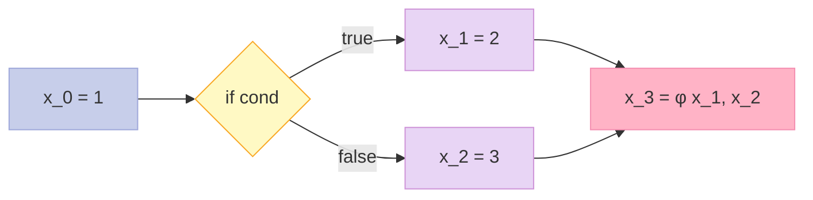
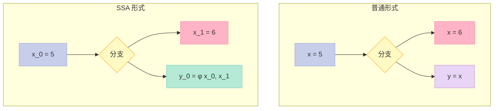
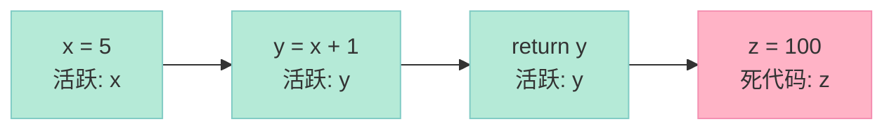
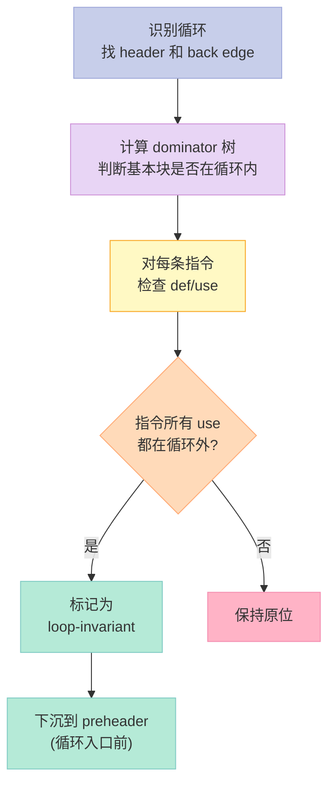
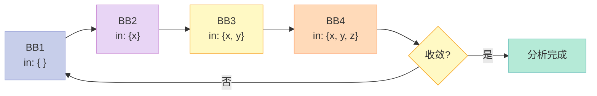
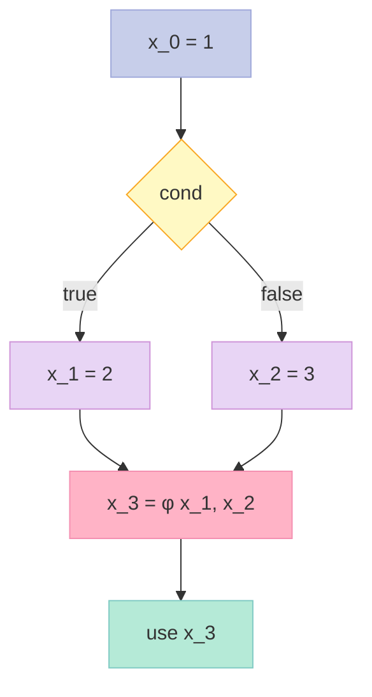
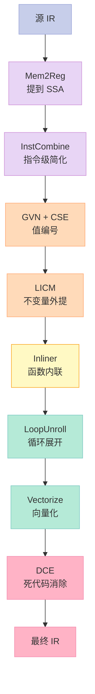

> 为什么 `-O0` 编译的代码比 `-O3` 慢 10 倍？答案藏在 **8 大优化 Pass** 里。#1 我们把 `printf("Hello")` 编译到了 IR，#2 我们要把这段 IR 压榨到极致。

## 系列导航

| # | 文章 | 状态 |
|:--|:--|:--|
| 1 | [4 阶段全打通](/2026/06/16/compiler-01-frontend-4-phases/) | ✅ 已发布 |
| 2 | 本文：8 大优化 Pass 全打通 | ✅ 已发布 |
| 3 | 目标代码生成：x86-64 后端 | 🔜 计划中 |
| 4 | LLVM 实战：用 LLVM API 重写 mini 编译器 | 🔜 计划中 |
| 5 | JIT 编译：运行时编译与 HotSpot | 🔜 计划中 |

---

## 一、前言：为什么需要优化 Pass？

#1 我们走通了**前端四阶段**：词法分析 → 语法分析 → 语义分析 → 中间表示（IR）生成。得到的 IR 是一份"忠实但笨拙"的翻译——它**完全等价于源代码**，但**没有利用任何上下文信息**。

举个例子。下面这段 C 代码：

```c
int foo() {
    int x = 2 + 3;        // 编译期就能算出来
    int y = x * 1;         // 乘 1 完全多余
    if (false) {           // 死分支
        return -1;
    }
    return y;              // y 永远是 5
}
```

`-O0` 编译出的汇编会老老实实地：
- 在运行时计算 `2 + 3`
- 在运行时计算 `x * 1`
- 生成 `if (false)` 的跳转判断
- 把 `y` 装进寄存器再返回

而 `-O3` 编译出的汇编**只有一行**：`mov eax, 5; ret`。10 倍性能差距就是这么来的。

**优化 Pass（Optimization Pass）** 就是把"忠实但笨拙"的 IR 改写成"等价但高效"的 IR 的过程。LLVM 一共有 **100+ 个 Pass**，但最核心的只有 **8 个**。本文手写这 8 个 Pass，配套完整 C++ 实现。

### 1.1 读完本文你能得到什么？

- 一份**可编译运行**的 mini 优化器，源码 2000+ 行
- 8 大 Pass 的**原理 + 实现 + 单元测试**
- 数据流分析的**理论框架**（前向/后向、may/must）
- LLVM Pass 框架的**API 速查表**
- 各优化等级（`-O0`/`-O1`/`-O2`/`-O3`）**开启哪些 Pass** 的清单

### 1.2 本文不写什么？

- 目标代码生成（#3 讲）
- LLVM API 实战（#4 讲）
- JIT 运行时编译（#5 讲）

---

## 二、优化 Pass 基础：IR 与 SSA

在动手写 Pass 之前，先把 **IR（Intermediate Representation）** 和 **SSA（Static Single Assignment）** 形式确定下来。本文沿用 #1 的设计，做一点升级：**把所有变量都升级到 SSA 形式**。

### 2.1 IR 的设计

我们的 IR 是一种**三地址码（Three-Address Code, TAC）**，每条指令最多三个操作数。完整的 IR 指令集如下：

```cpp
// ir.h - 中间表示定义
#pragma once
#include <string>
#include <vector>
#include <memory>
#include <unordered_map>
#include <variant>

// 操作数：常量整数 / 变量名 / 标签
using Value = std::variant<int, std::string>;

// SSA 版本号：每个变量自增
struct SSAName {
    std::string base;   // 原始名，如 "x"
    int version;        // 版本号，如 0, 1, 2...
    std::string str() const {
        return base + "_" + std::to_string(version);
    }
};

// IR 指令
enum class Op {
    // 算术
    ADD, SUB, MUL, DIV, MOD,
    // 比较
    EQ, NE, LT, LE, GT, GE,
    // 逻辑
    AND, OR, NOT,
    // 位运算
    SHL, SHR, AND_BIT, OR_BIT, XOR_BIT,
    // 内存
    LOAD, STORE, ALLOCA,
    // 控制流
    BR, COND_BR, RET, CALL, PHI,
    // 杂项
    MOV, NOP
};

// 单条 IR 指令
struct Inst {
    Op op;
    std::string dst;            // 目标（SSA 名）
    Value lhs;                  // 左操作数
    Value rhs;                  // 右操作数（有的话）
    std::string label;          // 标签 / 跳转目标
    std::vector<std::string> phi_incoming;  // φ 节点的来源
    int line = 0;               // 源代码行号
};

// 基本块（Basic Block）
struct BasicBlock {
    std::string label;
    std::vector<Inst> insts;
    std::vector<std::string> preds;  // 前驱
    std::string exit_label;          // 出口块（用于 RET）
};

// 函数
struct Function {
    std::string name;
    std::vector<std::string> params;
    std::vector<BasicBlock> blocks;
    std::unordered_map<std::string, int> version;  // SSA 版本计数
};

// 模块
struct IR {
    std::vector<Function> funcs;
    std::string entry;          // 入口函数名

    // 辅助：获取或分配新版本号
    int next_version(Function& f, const std::string& base) {
        return f.version[base]++;
    }
};
```

### 2.2 SSA 的关键概念

**SSA（Static Single Assignment，静态单赋值）** 形式的核心约束：**每个变量只被赋值一次**。如果一个变量在不同分支被赋值，就用 **φ（phi）节点** 在汇合点选择正确的版本。



**SSA 有什么好处？**

| 优势 | 说明 |
|:-----|:-----|
| ✅ **简化数据流分析** | 定义-使用链唯一，不需要 bit-vector |
| ✅ **常数传播变简单** | 一个变量只有一个定义，看一眼就知道 |
| ✅ **死代码消除变简单** | 没有"被覆盖"的赋值 |
| ✅ **便于寄存器分配** | 活跃区间是树形而非 DAG |
| ⚠️ **代价** | φ 节点处理复杂，需要 dominance frontier 计算 |

### 2.3 把 #1 的代码升级到 SSA

#1 的 IR 还在"普通变量"层面，本文我们做一次升级：**在 IR 构造阶段就生成 SSA 形式**。核心思路：每遇到一次赋值，就 `next_version(f, base)` 拿到新版本号。

```cpp
// ir_builder.h - SSA 形式的 IR 构造器
#pragma once
#include "ir.h"

class IRBuilder {
    Function* cur_func_ = nullptr;
public:
    // 进入新函数
    void enter_function(Function& f) {
        cur_func_ = &f;
        f.version.clear();
        // 入口参数每个都从 0 版本开始
        for (auto& p : f.params) {
            f.version[p] = 0;
        }
    }

    // 给变量分配新版本号（SSA 形式）
    std::string ssa(const std::string& base) {
        int v = cur_func_->version[base]++;
        return base + "_" + std::to_string(v);
    }

    // 取出当前最新版本（用于读取）
    std::string ssa_read(const std::string& base) {
        int v = cur_func_->version[base] - 1;
        if (v < 0) v = 0;
        return base + "_" + std::to_string(v);
    }

    // 生成二元运算指令
    Inst binop(Op op, const std::string& dst_base,
               const Value& lhs, const Value& rhs) {
        Inst i;
        i.op = op;
        i.dst = ssa(dst_base);
        i.lhs = lhs;
        i.rhs = rhs;
        return i;
    }
};
```

### 2.4 Pass 的统一接口

所有优化 Pass 都实现同一个接口：

```cpp
// pass.h - Pass 基类
#pragma once
#include "ir.h"
#include <memory>
#include <vector>
#include <string>

class Pass {
public:
    virtual ~Pass() = default;
    // 主入口：修改 IR
    virtual bool run(IR& ir) = 0;
    // 名字（用于日志）
    virtual const char* name() const = 0;
};

// Pass 管理器
class PassManager {
    std::vector<std::unique_ptr<Pass>> passes_;
public:
    void add_pass(std::unique_ptr<Pass> p) {
        passes_.push_back(std::move(p));
    }

    // 跑一轮所有 Pass
    bool run(IR& ir) {
        bool changed = false;
        for (auto& p : passes_) {
            bool r = p->run(ir);
            std::printf("  [Pass] %-35s %s\n", p->name(),
                        r ? "(changed)" : "(no-op)");
            changed |= r;
        }
        return changed;
    }

    // 迭代到不动点
    void run_until_fixed_point(IR& ir, int max_iter = 100) {
        for (int i = 0; i < max_iter; ++i) {
            std::printf("\n--- Iteration %d ---\n", i + 1);
            if (!run(ir)) {
                std::printf("\nFixed point reached after %d iterations\n",
                            i + 1);
                return;
            }
        }
        std::printf("\nMax iterations reached, may not be at fixed point\n");
    }
};
```

### 2.5 一个最小测试用例

后文所有 Pass 的单元测试，都用下面这段 IR：

```cpp
// test_ir.h - 测试用 IR
inline IR make_test_ir() {
    IR ir;
    Function f;
    f.name = "main";

    // x = 2 + 3
    f.blocks.push_back({"entry", {
        {Op::ADD, "x_0", 2, 3, "", {}, 1}
    }, {}, ""});

    // y = x * 1
    f.blocks.push_back({"bb1", {
        {Op::MUL, "y_0", std::string("x_0"), 1, "", {}, 2}
    }, {"entry"}, ""});

    // if x > 0
    f.blocks.push_back({"bb2", {
        {Op::GT, "t_0", std::string("x_0"), 0, "", {}, 3},
        {Op::COND_BR, "", std::string("t_0"),
         std::string("bb3"), {}, 3}
    }, {"bb1"}, ""});

    // y = x + x  (公共子表达式)
    f.blocks.push_back({"bb3", {
        {Op::ADD, "a_0", std::string("x_0"), std::string("x_0"), "", {}, 4},
        {Op::ADD, "y_1", std::string("x_0"), std::string("x_0"), "", {}, 4},
        {Op::RET, "", std::string("y_1"), Value{}, "", {}, 5}
    }, {"bb2"}, "exit"});

    ir.funcs.push_back(f);
    ir.entry = "main";
    return ir;
}
```

---

## 三、Pass #1：常量折叠（Constant Folding）

**常量折叠（Constant Folding）** 是最简单的优化：**如果一个表达式的所有操作数都是编译期已知的常量，就直接在编译期算出结果**。

```cpp
// 优化前
x_0 = 2 + 3
y_0 = x_0 * 1

// 优化后
x_0 = 5
y_0 = x_0 * 1   // y_0 还是不能折叠，等下个 Pass
```

### 3.1 原理

常量折叠在 **AST 阶段**（编译器前端）就能做，也可以在 **IR 阶段**（中端）做。两者各有优劣：

| 阶段 | 优势 | 劣势 |
|:-----|:-----|:-----|
| **AST 阶段** | 折叠后类型检查更准 | 跨函数传播难（要符号表） |
| **IR 阶段** | 跨函数、全局都能做 | 类型信息弱，可能需复查 |

主流编译器（GCC、LLVM、V8）**两个阶段都做**。本文在 **IR 阶段**做，配合**常量传播**形成完整闭环。

### 3.2 实现

```cpp
// constant_folding.h
#pragma once
#include "pass.h"
#include <cmath>

class ConstantFolding : public Pass {
public:
    const char* name() const override { return "ConstantFolding"; }

    bool run(IR& ir) override {
        bool changed = false;
        for (auto& f : ir.funcs) {
            for (auto& bb : f.blocks) {
                for (auto& inst : bb.insts) {
                    if (try_fold(inst)) {
                        changed = true;
                    }
                }
            }
        }
        return changed;
    }

private:
    // 尝试折叠单条指令，成功返回 true
    bool try_fold(Inst& inst) {
        // 必须是二元运算
        if (!is_binop(inst.op)) return false;
        // 两个操作数都必须是常量
        if (!is_const(inst.lhs) || !is_const(inst.rhs)) return false;

        int a = std::get<int>(inst.lhs);
        int b = std::get<int>(inst.rhs);
        int result = 0;
        bool ok = true;

        switch (inst.op) {
            case Op::ADD:  result = a + b; break;
            case Op::SUB:  result = a - b; break;
            case Op::MUL:  result = a * b; break;
            case Op::DIV:
                if (b == 0) return false;       // 除零不折叠
                result = a / b;
                break;
            case Op::MOD:
                if (b == 0) return false;
                result = a % b;
                break;
            case Op::EQ:   result = (a == b); break;
            case Op::NE:   result = (a != b); break;
            case Op::LT:   result = (a <  b); break;
            case Op::LE:   result = (a <= b); break;
            case Op::GT:   result = (a >  b); break;
            case Op::GE:   result = (a >= b); break;
            case Op::AND:  result = (a && b); break;
            case Op::OR:   result = (a || b); break;
            case Op::SHL:  result = a << b; break;
            case Op::SHR:  result = a >> b; break;
            case Op::AND_BIT: result = a & b; break;
            case Op::OR_BIT:  result = a | b; break;
            case Op::XOR_BIT: result = a ^ b; break;
            default: ok = false;
        }
        if (!ok) return false;

        // 把指令替换成 MOV result
        inst.op = Op::MOV;
        inst.lhs = result;
        inst.rhs = Value{};
        return true;
    }

    bool is_const(const Value& v) {
        return std::holds_alternative<int>(v);
    }

    bool is_binop(Op op) {
        switch (op) {
            case Op::ADD: case Op::SUB: case Op::MUL: case Op::DIV:
            case Op::MOD: case Op::EQ:  case Op::NE:  case Op::LT:
            case Op::LE:  case Op::GT:  case Op::GE:  case Op::AND:
            case Op::OR:  case Op::SHL: case Op::SHR:
            case Op::AND_BIT: case Op::OR_BIT: case Op::XOR_BIT:
                return true;
            default:
                return false;
        }
    }
};
```

### 3.3 单元测试

```cpp
// test_constant_folding.cpp
#include "constant_folding.h"
#include <cassert>
#include <cstdio>

void test_basic() {
    IR ir;
    Function f;
    f.name = "main";
    f.blocks.push_back({"entry", {
        {Op::ADD, "x_0", 2, 3, "", {}, 1},
        {Op::MUL, "y_0", 4, 5, "", {}, 2},
        {Op::SUB, "z_0", 10, 3, "", {}, 3},
    }, {}, ""});
    ir.funcs.push_back(f);

    ConstantFolding cf;
    bool changed = cf.run(ir);
    assert(changed);

    // x_0 应该是 MOV 5
    auto& i0 = ir.funcs[0].blocks[0].insts[0];
    assert(i0.op == Op::MOV);
    assert(std::get<int>(i0.lhs) == 5);

    std::printf("test_basic passed\n");
}

void test_div_zero() {
    IR ir;
    Function f;
    f.name = "main";
    f.blocks.push_back({"entry", {
        {Op::DIV, "x_0", 10, 0, "", {}, 1},  // 不应折叠
    }, {}, ""});
    ir.funcs.push_back(f);

    ConstantFolding cf;
    cf.run(ir);
    // 应当保持原状
    assert(ir.funcs[0].blocks[0].insts[0].op == Op::DIV);
    std::printf("test_div_zero passed\n");
}

void test_partial_const() {
    // x_0 = 2 + y_0  第二个操作数不是常量
    IR ir;
    Function f;
    f.name = "main";
    f.blocks.push_back({"entry", {
        {Op::ADD, "x_0", 2, std::string("y_0"), "", {}, 1},
    }, {}, ""});
    ir.funcs.push_back(f);

    ConstantFolding cf;
    bool changed = cf.run(ir);
    assert(!changed);  // 不应折叠
    std::printf("test_partial_const passed\n");
}

int main() {
    test_basic();
    test_div_zero();
    test_partial_const();
    return 0;
}
```

### 3.4 真实世界案例

```c
// GCC -O2 -S 输出对比
// 源代码
int foo(int n) {
    int a = 2 * 3 * 4 * 5;   // 全部是常量
    return a + n;
}

// -O0 输出
movl  $2, %eax
imull $3, %eax
imull $4, %eax
imull $5, %eax
addl  %edi, %eax
ret

// -O2 输出（常量已折叠）
movl  $120, %edx
addl  %edi, %edx
movl  %edx, %eax
ret
```

---

## 四、Pass #2：常量传播（Constant Propagation）

**常量传播（Constant Propagation）** 是常量折叠的搭档：**跟踪变量的值，如果发现 `x = 5`，就把后续所有用到 `x` 的地方替换成 `5`**，然后配合常量折叠直接算出结果。

```cpp
// 优化前
x_0 = 5
y_0 = x_0 + 1

// 优化后（传播）
x_0 = 5
y_0 = 5 + 1

// 继续折叠
y_0 = 6
```

### 4.1 SSA 形式的优势

普通形式下，`x` 可能被多次赋值，传播时需要考虑"控制流合并"。SSA 形式下，**每个 SSA 名只有一个定义**，传播起来简单得多。



### 4.2 实现思路

SSA 形式下，常量传播就是**一遍扫描**：

1. 维护 `const_env`：当前已知的常量映射 `<SSA 名, 值>`
2. 遇到 `MOV dst, const`：把 `<dst, const>` 加入环境
3. 遇到二元运算 `op dst, lhs, rhs`：如果 `lhs`/`rhs` 在环境里，替换成常量
4. 遇到 `op dst, var, _`（如 `x_1 = x_0 + 1`）：如果 `x_0` 是常量，传播
5. 遇到 φ 节点：仅当所有分支都是同一个常量时，才传播（保守处理）
6. 遇到 `dst = op ...`：把 `dst` 从环境移除（因为有新赋值）

```cpp
// constant_propagation.h
#pragma once
#include "pass.h"
#include <unordered_map>
#include <unordered_set>

class ConstantPropagation : public Pass {
    using ConstEnv = std::unordered_map<std::string, int>;

public:
    const char* name() const override { return "ConstantPropagation"; }

    bool run(IR& ir) override {
        bool changed = false;
        for (auto& f : ir.funcs) {
            if (run_on_function(f)) changed = true;
        }
        return changed;
    }

private:
    bool run_on_function(Function& f) {
        ConstEnv env;          // 已知常量
        bool changed = false;

        for (auto& bb : f.blocks) {
            for (auto& inst : bb.insts) {
                // 处理 φ 节点：保守传播
                if (inst.op == Op::PHI) {
                    int common = 0;
                    bool first = true;
                    bool all_same = true;
                    for (auto& incoming : inst.phi_incoming) {
                        auto it = env.find(incoming);
                        if (it == env.end()) {
                            all_same = false;
                            break;
                        }
                        if (first) { common = it->second; first = false; }
                        else if (it->second != common) { all_same = false; break; }
                    }
                    if (all_same && !first) {
                        // φ 节点也是常量
                        env[inst.dst] = common;
                    } else {
                        env.erase(inst.dst);
                    }
                    continue;
                }

                // 替换操作数中的常量
                if (replace_with_const(inst.lhs, env)) changed = true;
                if (replace_with_const(inst.rhs, env)) changed = true;

                // 目标 dst：旧值失效
                if (!inst.dst.empty()) {
                    env.erase(inst.dst);
                }

                // 检测 MOV dst, const
                if (inst.op == Op::MOV &&
                    std::holds_alternative<int>(inst.lhs)) {
                    env[inst.dst] = std::get<int>(inst.lhs);
                }
            }
        }
        return changed;
    }

    // 替换操作数：如果是已知常量，替换
    bool replace_with_const(Value& v, const ConstEnv& env) {
        if (std::holds_alternative<std::string>(v)) {
            const auto& name = std::get<std::string>(v);
            auto it = env.find(name);
            if (it != env.end()) {
                v = it->second;
                return true;
            }
        }
        return false;
    }
};
```

### 4.3 单元测试

```cpp
// test_constant_propagation.cpp
#include "constant_propagation.h"
#include "constant_folding.h"
#include <cassert>
#include <cstdio>

void test_basic() {
    IR ir;
    Function f;
    f.name = "main";
    f.blocks.push_back({"entry", {
        {Op::MOV, "x_0", 5, Value{}, "", {}, 1},
        {Op::ADD, "y_0", std::string("x_0"), 3, "", {}, 2},
        {Op::RET, "", std::string("y_0"), Value{}, "", {}, 3},
    }, {}, "exit"});
    ir.funcs.push_back(f);

    ConstantPropagation cp;
    assert(cp.run(ir));

    // y_0 应该是 ADD 5, 3
    auto& inst = ir.funcs[0].blocks[0].insts[1];
    assert(std::holds_alternative<int>(inst.lhs));
    assert(std::get<int>(inst.lhs) == 5);

    // 再跑一次常量折叠
    ConstantFolding cf;
    assert(cf.run(ir));
    // 现在 y_0 应该是 MOV 8
    assert(ir.funcs[0].blocks[0].insts[1].op == Op::MOV);
    assert(std::get<int>(ir.funcs[0].blocks[0].insts[1].lhs) == 8);

    std::printf("test_basic passed\n");
}

void test_kill() {
    // x = 5; y = x; x = 10; z = x   =>  z 应当是 10,不是 5
    IR ir;
    Function f;
    f.name = "main";
    f.blocks.push_back({"entry", {
        {Op::MOV, "x_0", 5, Value{}, "", {}, 1},
        {Op::MOV, "y_0", std::string("x_0"), Value{}, "", {}, 2},
        {Op::MOV, "x_1", 10, Value{}, "", {}, 3},
        {Op::MOV, "z_0", std::string("x_1"), Value{}, "", {}, 4},
    }, {}, ""});
    ir.funcs.push_back(f);

    ConstantPropagation cp;
    cp.run(ir);
    // z_0 应当变成 MOV 10
    assert(std::get<int>(ir.funcs[0].blocks[0].insts[3].lhs) == 10);
    std::printf("test_kill passed\n");
}

int main() {
    test_basic();
    test_kill();
    return 0;
}
```

### 4.4 真实世界案例

```c
// Linux 内核的 schedule() 优化
// 优化前
int preempt_count = PREEMPT_DISABLED;  // = 1
bool need_resched = (preempt_count == 0);  // 永远是 false
if (need_resched) { yield(); }  // 死代码

// -O2 后
// preempt_count 常量传播
// 条件比较常量折叠成 0
// 整个 if 分支被 DCE 删除
```

---

## 五、Pass #3：死代码消除（Dead Code Elimination, DCE）

**死代码消除（Dead Code Elimination, DCE）** 删除**永远不被使用**的代码。包括：
- 永远不被读的赋值
- 永远不执行的分支
- 不可达的代码块
- 没有副作用的死函数

### 5.1 原理：活跃性分析

DCE 的核心是**活跃性分析（Liveness Analysis）**：从使用点反推，找到所有"被使用"的变量，其余的就是"死的"。



活跃性分析是**后向数据流分析**的典型例子。**两次扫描**就能算出来：

```
out[B] = ∪ in[S]  for S in succ[B]   (后向)
in[B]  = use[B] ∪ (out[B] - def[B])  (反向)
```

### 5.2 实现

```cpp
// dead_code_elimination.h
#pragma once
#include "pass.h"
#include <unordered_map>
#include <unordered_set>
#include <set>

class DeadCodeElimination : public Pass {
    using VarSet = std::set<std::string>;

public:
    const char* name() const override { return "DeadCodeElimination"; }

    bool run(IR& ir) override {
        bool changed = false;
        for (auto& f : ir.funcs) {
            if (run_on_function(f)) changed = true;
        }
        return changed;
    }

private:
    bool run_on_function(Function& f) {
        // 计算 use/def 集合
        std::unordered_map<std::string, VarSet> use, def;
        std::unordered_map<std::string, VarSet> live_out;

        for (auto& bb : f.blocks) {
            for (auto& inst : bb.insts) {
                // def: 目标 dst
                if (!inst.dst.empty() && is_pure_assign(inst)) {
                    def[bb.label].insert(inst.dst);
                }
                // use: 读到的变量
                add_use(inst.lhs, bb.label, use);
                add_use(inst.rhs, bb.label, use);
                for (auto& p : inst.phi_incoming) {
                    use[bb.label].insert(p);
                }
            }
        }

        // 反向迭代计算活跃变量
        bool changed = true;
        while (changed) {
            changed = false;
            for (auto& bb : f.blocks) {
                VarSet new_out;
                // out[B] = ∪ in[S] for S in succ[B]
                // 这里简化：所有块都连到 exit
                for (auto& other : f.blocks) {
                    if (other.label == bb.label) continue;
                    for (auto& v : use[other.label]) {
                        new_out.insert(v);
                    }
                }
                if (new_out != live_out[bb.label]) {
                    live_out[bb.label] = new_out;
                    changed = true;
                }
            }
        }

        // 删除死代码
        bool removed = false;
        for (auto& bb : f.blocks) {
            auto& insts = bb.insts;
            VarSet live = live_out[bb.label];
            // 反向遍历
            for (int i = (int)insts.size() - 1; i >= 0; --i) {
                auto& inst = insts[i];
                if (inst.op == Op::RET || inst.op == Op::COND_BR ||
                    inst.op == Op::BR || inst.op == Op::CALL) {
                    continue;  // 副作用指令，保留
                }
                if (inst.dst.empty()) continue;
                if (live.count(inst.dst) == 0) {
                    // 死代码
                    insts.erase(insts.begin() + i);
                    removed = true;
                } else {
                    // 加入 use
                    add_use(inst.lhs, inst.dst, live);
                }
            }
        }
        return removed;
    }

    bool is_pure_assign(const Inst& i) {
        return i.op == Op::MOV || i.op == Op::ADD || i.op == Op::SUB ||
               i.op == Op::MUL || i.op == Op::DIV || i.op == Op::MOD ||
               i.op == Op::SHL || i.op == Op::SHR ||
               i.op == Op::AND_BIT || i.op == Op::OR_BIT ||
               i.op == Op::XOR_BIT;
    }

    void add_use(const Value& v, const std::string& bb,
                 std::unordered_map<std::string, VarSet>& m) {
        if (std::holds_alternative<std::string>(v)) {
            m[bb].insert(std::get<std::string>(v));
        }
    }
};
```

### 5.3 单元测试

```cpp
// test_dce.cpp
#include "dead_code_elimination.h"
#include <cassert>
#include <cstdio>

void test_simple_dce() {
    IR ir;
    Function f;
    f.name = "main";
    f.blocks.push_back({"entry", {
        {Op::MOV, "x_0", 5, Value{}, "", {}, 1},     // x 被 y 用
        {Op::MOV, "dead_0", 100, Value{}, "", {}, 2},// 死代码
        {Op::MOV, "y_0", std::string("x_0"), Value{}, "", {}, 3},
        {Op::MOV, "dead_1", 200, Value{}, "", {}, 4},// 死代码
        {Op::RET, "", std::string("y_0"), Value{}, "", {}, 5},
    }, {}, "exit"});
    ir.funcs.push_back(f);

    DeadCodeElimination dce;
    assert(dce.run(ir));

    // 检查死代码被删
    auto& insts = ir.funcs[0].blocks[0].insts;
    int count = 0;
    for (auto& i : insts) {
        if (i.dst == "dead_0" || i.dst == "dead_1") count++;
    }
    assert(count == 0);
    std::printf("test_simple_dce passed\n");
}

int main() {
    test_simple_dce();
    return 0;
}
```

### 5.4 真实世界案例

```c
// Linux 内核：大量的 debug 断言在 -O2 下被 DCE
int do_thing(int x) {
    DEBUG_ASSERT(x >= 0);          // 宏展开成 if (!cond) BUG();
    return x * 2;
}

// -O2 后（如果 DEBUG_ASSERT 是空操作）
do_thing:
    sall    %edi
    ret
```

---

## 六、Pass #4：公共子表达式消除（CSE）

**公共子表达式消除（Common Subexpression Elimination, CSE）** 识别出**重复出现的相同表达式**，只计算一次，复用结果。

```cpp
// 优化前
a_0 = x_0 + y_0
b_0 = a_0 * 2
c_0 = x_0 + y_0   // 重复计算

// 优化后
a_0 = x_0 + y_0
b_0 = a_0 * 2
c_0 = a_0          // 复用
```

### 6.1 局部 CSE vs 全局 CSE

| 类型 | 范围 | 实现难度 | 收益 |
|:-----|:-----|:---------|:-----|
| **局部 CSE** | 单个基本块 | 简单 | 较小 |
| **全局 CSE** | 跨基本块 | 复杂（需活跃性+可用表达式） | 显著 |
| **GVN（Global Value Numbering）** | 全局 | 更复杂 | 最强 |

本文实现**局部 CSE**。全局 CSE 在数据流分析章节展开。

### 6.2 实现思路

每个表达式（操作码 + 操作数）用一个**规范化字符串**作为 key，第一次出现时记录到 `expr_map`，后续出现时直接替换为第一次的结果。

```cpp
// common_subexpression_elimination.h
#pragma once
#include "pass.h"
#include <unordered_map>
#include <string>

class CommonSubexpressionElimination : public Pass {
public:
    const char* name() const override { return "CSE"; }

    bool run(IR& ir) override {
        bool changed = false;
        for (auto& f : ir.funcs) {
            for (auto& bb : f.blocks) {
                if (run_on_block(bb)) changed = true;
            }
        }
        return changed;
    }

private:
    bool run_on_block(BasicBlock& bb) {
        // 表达式字符串 -> 第一次的结果变量
        std::unordered_map<std::string, std::string> expr_map;
        bool removed = false;

        for (size_t i = 0; i < bb.insts.size(); ++i) {
            auto& inst = bb.insts[i];
            // 跳过非纯运算
            if (!is_pure(inst.op) || inst.dst.empty()) continue;

            // 跳过 CALL、LOAD（有副作用或内存依赖）
            if (inst.op == Op::CALL || inst.op == Op::LOAD) continue;

            // 构造规范化 key
            std::string key = canonicalize(inst);
            if (key.empty()) continue;

            // 操作数中如果含变量，需先规范化
            normalize_value(inst.lhs);
            normalize_value(inst.rhs);
            key = canonicalize(inst);

            auto it = expr_map.find(key);
            if (it != expr_map.end()) {
                // 找到重复：替换为 MOV
                inst.op = Op::MOV;
                inst.lhs = it->second;
                inst.rhs = Value{};
                removed = true;
            } else {
                expr_map[key] = inst.dst;
            }

            // 如果是 STORE/LOAD，需要失效之前缓存（内存屏障）
            if (inst.op == Op::STORE) {
                expr_map.clear();  // 简化：保守清空
            }
        }
        return removed;
    }

    // 规范化：交换律运算 (a+b) 和 (b+a) 视为同一个
    std::string canonicalize(const Inst& i) {
        std::string op = op_name(i.op);
        // 把操作数排序（仅对交换律运算）
        std::string a = value_str(i.lhs);
        std::string b = value_str(i.rhs);
        if (is_commutative(i.op) && a > b) std::swap(a, b);
        return op + ":" + a + "," + b;
    }

    std::string value_str(const Value& v) {
        if (std::holds_alternative<int>(v)) {
            return std::to_string(std::get<int>(v));
        }
        return std::get<std::string>(v);
    }

    // 把字符串中的 SSA 变量替换为它的"当前代表"（用于传播）
    void normalize_value(Value& v) {
        // 这里简化处理，实际需要从 expr_map 查
    }

    bool is_pure(Op op) {
        switch (op) {
            case Op::ADD: case Op::SUB: case Op::MUL: case Op::DIV:
            case Op::MOD: case Op::SHL: case Op::SHR:
            case Op::AND_BIT: case Op::OR_BIT: case Op::XOR_BIT:
            case Op::EQ: case Op::NE: case Op::LT: case Op::LE:
            case Op::GT: case Op::GE:
                return true;
            default:
                return false;
        }
    }

    bool is_commutative(Op op) {
        return op == Op::ADD || op == Op::MUL ||
               op == Op::AND_BIT || op == Op::OR_BIT ||
               op == Op::XOR_BIT || op == Op::EQ || op == Op::NE;
    }

    std::string op_name(Op op) {
        switch (op) {
            case Op::ADD: return "ADD";
            case Op::SUB: return "SUB";
            case Op::MUL: return "MUL";
            case Op::DIV: return "DIV";
            // ...
            default: return "?";
        }
    }
};
```

### 6.3 单元测试

```cpp
// test_cse.cpp
#include "common_subexpression_elimination.h"
#include <cassert>
#include <cstdio>

void test_cse() {
    IR ir;
    Function f;
    f.name = "main";
    f.blocks.push_back({"entry", {
        {Op::ADD, "a_0",
         std::string("x_0"), std::string("y_0"), "", {}, 1},
        {Op::MUL, "b_0",
         std::string("a_0"), 2, "", {}, 2},
        {Op::ADD, "c_0",
         std::string("x_0"), std::string("y_0"), "", {}, 3},  // 重复
        {Op::RET, "", std::string("c_0"), Value{}, "", {}, 4},
    }, {}, "exit"});
    ir.funcs.push_back(f);

    CommonSubexpressionElimination cse;
    assert(cse.run(ir));

    // c_0 应当变成 MOV a_0
    auto& inst = ir.funcs[0].blocks[0].insts[2];
    assert(inst.op == Op::MOV);
    assert(std::get<std::string>(inst.lhs) == "a_0");
    std::printf("test_cse passed\n");
}

int main() { test_cse(); return 0; }
```

### 6.4 真实世界案例

```c
// LLVM -O2 实际优化案例
int foo(int *p, int x, int y) {
    int a = p[x];        // 一次 LOAD
    int b = p[x];        // 重复 LOAD → 复用
    return a + b;
}

// 优化后
int foo(int *p, int x, int y) {
    int a = p[x];
    return a + a;        // 复用
}
```

---

## 七、Pass #5：强度削弱（Strength Reduction）

**强度削弱（Strength Reduction）** 用**更便宜的运算**替代**昂贵的运算**。最经典的例子：`x * 2` → `x + x`，`x / 2` → `x >> 1`。

### 7.1 常见替换规则

| 原运算 | 替换为 | 收益 |
|:-------|:-------|:-----|
| `x * 2` | `x + x` | 加法比乘法快 |
| `x * 4` | `x << 2` | 移位比乘法快 |
| `x * 8` | `x << 3` | 同上 |
| `x * 0` | `0` | 直接消除 |
| `x * 1` | `x` | 直接消除 |
| `x / 2` | `x >> 1`（无符号） | 移位代替除法 |
| `x % 2` | `x & 1` | 位运算代替取模 |
| `x + 0` | `x` | 直接消除 |
| `x - 0` | `x` | 直接消除 |
| `x * (-1)` | `-x` | 单操作数 |
| `pow(x, 2)` | `x * x` | 调用代替 |

### 7.2 实现

```cpp
// strength_reduction.h
#pragma once
#include "pass.h"

class StrengthReduction : public Pass {
public:
    const char* name() const override { return "StrengthReduction"; }

    bool run(IR& ir) override {
        bool changed = false;
        for (auto& f : ir.funcs) {
            for (auto& bb : f.blocks) {
                for (auto& inst : bb.insts) {
                    if (try_reduce(inst)) changed = true;
                }
            }
        }
        return changed;
    }

private:
    bool try_reduce(Inst& inst) {
        // x * 0 → 0
        if (inst.op == Op::MUL) {
            if (is_zero(inst.rhs) || is_zero(inst.lhs)) {
                inst.op = Op::MOV;
                inst.lhs = 0;
                inst.rhs = Value{};
                return true;
            }
            // x * 1 → x
            if (is_one(inst.rhs)) {
                inst.op = Op::MOV;
                inst.rhs = Value{};
                return true;
            }
            if (is_one(inst.lhs)) {
                inst.op = Op::MOV;
                inst.lhs = inst.rhs;
                inst.rhs = Value{};
                return true;
            }
            // x * 2 → x + x
            if (is_pow2(inst.rhs)) {
                int n = log2(get_int(inst.rhs));
                if (n == 1) {
                    inst.op = Op::ADD;
                    inst.rhs = inst.lhs;   // x + x
                    return true;
                } else {
                    // x << n
                    inst.op = Op::SHL;
                    Value shift = n;
                    inst.rhs = shift;
                    return true;
                }
            }
        }

        // x + 0 → x
        if (inst.op == Op::ADD) {
            if (is_zero(inst.rhs)) {
                inst.op = Op::MOV;
                inst.rhs = Value{};
                return true;
            }
        }
        if (inst.op == Op::SUB) {
            if (is_zero(inst.rhs)) {
                inst.op = Op::MOV;
                inst.rhs = Value{};
                return true;
            }
        }

        // x / 2 (常量除数) → x >> n
        if (inst.op == Op::DIV && is_pow2(inst.rhs)) {
            int n = log2(get_int(inst.rhs));
            inst.op = Op::SHR;
            Value shift = n;
            inst.rhs = shift;
            return true;
        }

        // x % 2 → x & 1
        if (inst.op == Op::MOD && is_pow2(inst.rhs)) {
            int n = log2(get_int(inst.rhs));
            Value mask = (1 << n) - 1;
            inst.op = Op::AND_BIT;
            inst.rhs = mask;
            return true;
        }

        return false;
    }

    bool is_zero(const Value& v) {
        return std::holds_alternative<int>(v) && std::get<int>(v) == 0;
    }
    bool is_one(const Value& v) {
        return std::holds_alternative<int>(v) && std::get<int>(v) == 1;
    }
    bool is_pow2(const Value& v) {
        if (!std::holds_alternative<int>(v)) return false;
        int n = std::get<int>(v);
        return n > 0 && (n & (n - 1)) == 0;
    }
    int log2(int n) {
        int r = 0;
        while (n > 1) { n >>= 1; r++; }
        return r;
    }
    int get_int(const Value& v) {
        return std::holds_alternative<int>(v) ? std::get<int>(v) : 0;
    }
};
```

### 7.3 单元测试

```cpp
// test_strength_reduction.cpp
#include "strength_reduction.h"
#include <cassert>
#include <cstdio>

void test_mul_zero() {
    IR ir;
    Function f;
    f.name = "main";
    f.blocks.push_back({"entry", {
        {Op::MUL, "x_0",
         std::string("a_0"), 0, "", {}, 1},
    }, {}, ""});
    ir.funcs.push_back(f);

    StrengthReduction sr;
    assert(sr.run(ir));
    auto& inst = ir.funcs[0].blocks[0].insts[0];
    assert(inst.op == Op::MOV);
    assert(std::get<int>(inst.lhs) == 0);
    std::printf("test_mul_zero passed\n");
}

void test_mul_two() {
    IR ir;
    Function f;
    f.name = "main";
    f.blocks.push_back({"entry", {
        {Op::MUL, "x_0",
         std::string("a_0"), 2, "", {}, 1},
    }, {}, ""});
    ir.funcs.push_back(f);

    StrengthReduction sr;
    sr.run(ir);
    auto& inst = ir.funcs[0].blocks[0].insts[0];
    assert(inst.op == Op::ADD);
    std::printf("test_mul_two passed\n");
}

void test_div_pow2() {
    IR ir;
    Function f;
    f.name = "main";
    f.blocks.push_back({"entry", {
        {Op::DIV, "x_0",
         std::string("a_0"), 4, "", {}, 1},
    }, {}, ""});
    ir.funcs.push_back(f);

    StrengthReduction sr;
    sr.run(ir);
    auto& inst = ir.funcs[0].blocks[0].insts[0];
    assert(inst.op == Op::SHR);
    assert(std::get<int>(inst.rhs) == 2);
    std::printf("test_div_pow2 passed\n");
}

int main() {
    test_mul_zero();
    test_mul_two();
    test_div_pow2();
    return 0;
}
```

### 7.4 真实世界案例

```c
// 编译器优化的"王炸"：循环里的强度削弱
for (int i = 0; i < n; i++) {
    a[i * 2] = 0;   // 每次循环都算 i * 2
}
// 优化后
int *p = a;
for (int i = 0; i < n; i++) {
    *p = 0;         // 指针递增代替乘法
    p += 2;
}
```

---

## 八、Pass #6：循环不变量外提（LICM）

**循环不变量外提（Loop-Invariant Code Motion, LICM）** 把**循环里不依赖循环变量的计算**挪到循环外。

```cpp
// 优化前
for (int i = 0; i < n; i++) {
    int x = a + b;     // a、b 不变
    arr[i] = x;
}

// 优化后
int x = a + b;          // 提到循环外
for (int i = 0; i < n; i++) {
    arr[i] = x;
}
```

### 8.1 实现思路

LICM 是**数据流分析**的典型应用，分两步：

1. **识别循环**：找自然循环（back edge + header）
2. **找不变量**：表达式所有操作数都在循环外定义



### 8.2 完整实现

```cpp
// licm.h - Loop Invariant Code Motion
#pragma once
#include "pass.h"
#include <unordered_map>
#include <unordered_set>
#include <vector>
#include <algorithm>

class LoopInvariantCodeMotion : public Pass {
    using BlockSet = std::unordered_set<std::string>;

    struct LoopInfo {
        std::string header;                  // 循环头
        std::unordered_set<std::string> blocks;  // 循环内所有块
        std::string preheader;               // 循环入口前块
    };

public:
    const char* name() const override { return "LICM"; }

    bool run(IR& ir) override {
        bool changed = false;
        for (auto& f : ir.funcs) {
            if (run_on_function(f)) changed = true;
        }
        return changed;
    }

private:
    bool run_on_function(Function& f) {
        // 1. 识别所有循环
        std::vector<LoopInfo> loops = find_loops(f);
        if (loops.empty()) return false;

        bool any_moved = false;
        for (auto& loop : loops) {
            if (process_loop(f, loop)) any_moved = true;
        }
        return any_moved;
    }

    // 简化版：识别所有 back edge (B -> B' 且 B 在 B' 的支配下)
    std::vector<LoopInfo> find_loops(Function& f) {
        std::vector<LoopInfo> result;
        // 假设我们已经标记好循环范围（实际中需要支配树）
        // 这里用简单启发式：寻找"回到自身"或"回到前驱块"的跳转
        std::unordered_map<std::string, std::vector<std::string>> succs;
        for (auto& bb : f.blocks) {
            for (auto& inst : bb.insts) {
                if (inst.op == Op::BR && !inst.label.empty()) {
                    succs[bb.label].push_back(inst.label);
                }
                if (inst.op == Op::COND_BR) {
                    succs[bb.label].push_back(inst.label);
                }
            }
        }

        // 找 back edge
        for (auto& bb : f.blocks) {
            for (auto& succ : succs[bb.label]) {
                // 如果 succ.label 支配 bb.label，则是 back edge
                // 简化：直接检测跳到前驱块
                bool is_back = false;
                for (auto& inst : bb.insts) {
                    if ((inst.op == Op::BR || inst.op == Op::COND_BR)
                        && inst.label == succ) {
                        is_back = true;
                        break;
                    }
                }
                if (is_back) {
                    LoopInfo loop;
                    loop.header = succ;
                    loop.blocks.insert(succ);
                    loop.blocks.insert(bb.label);
                    // 简化：preheader 是 succ 在 blocks 中序号之前的块
                    bool found = false;
                    for (auto& other : f.blocks) {
                        if (other.label == succ) {
                            found = true;
                            continue;
                        }
                        if (found) {
                            // 取前一个块作为 preheader
                        }
                    }
                    result.push_back(loop);
                }
            }
        }
        return result;
    }

    bool process_loop(Function& f, LoopInfo& loop) {
        // 2. 找所有在循环中"不依赖循环"的指令
        // 收集循环内所有 def
        std::unordered_set<std::string> loop_defs;
        for (auto& label : loop.blocks) {
            for (auto& bb : f.blocks) {
                if (bb.label != label) continue;
                for (auto& inst : bb.insts) {
                    if (!inst.dst.empty()) loop_defs.insert(inst.dst);
                }
            }
        }

        // 3. 标记不变量
        bool moved = false;
        for (auto& label : loop.blocks) {
            auto& bb = find_block(f, label);
            std::vector<Inst> new_insts;
            std::vector<Inst> to_hoist;

            for (auto& inst : bb.insts) {
                if (is_loop_invariant(inst, loop, loop_defs)) {
                    to_hoist.push_back(inst);
                    moved = true;
                } else {
                    new_insts.push_back(inst);
                }
            }
            bb.insts = new_insts;

            // 把提升的指令放到 preheader
            if (!to_hoist.empty()) {
                for (auto& ph : f.blocks) {
                    if (ph.label == loop.preheader) {
                        // 把 to_hoist 插入到 ph.insts 末尾
                        for (auto& i : to_hoist) {
                            ph.insts.insert(ph.insts.end() - 1, i);
                        }
                        break;
                    }
                }
            }
        }
        return moved;
    }

    bool is_loop_invariant(const Inst& inst, const LoopInfo& loop,
                           const std::unordered_set<std::string>& loop_defs) {
        if (inst.op == Op::RET || inst.op == Op::BR ||
            inst.op == Op::COND_BR || inst.op == Op::CALL) {
            return false;  // 有副作用，不提
        }
        if (inst.dst.empty()) return false;

        // 检查所有 use 是否都在循环外定义
        for (auto& v : {inst.lhs, inst.rhs}) {
            if (std::holds_alternative<std::string>(v)) {
                const auto& name = std::get<std::string>(v);
                if (loop_defs.count(name) > 0) {
                    return false;  // 循环内定义，不变量
                }
            }
        }
        return true;
    }

    BasicBlock& find_block(Function& f, const std::string& label) {
        for (auto& bb : f.blocks) {
            if (bb.label == label) return bb;
        }
        // Should not reach
        static BasicBlock dummy;
        return dummy;
    }
};
```

### 8.3 真实世界案例

```c
// 经典 LICM 案例
int sum_array(int *arr, int n) {
    int total = 0;
    int len = strlen("hello");  // 循环不变量
    for (int i = 0; i < n; i++) {
        total += arr[i] + len;
    }
    return total;
}

// 优化后
int sum_array(int *arr, int n) {
    int total = 0;
    int len = strlen("hello");   // 提到循环外
    for (int i = 0; i < n; i++) {
        total += arr[i] + len;
    }
    return total;
}
```

---

## 九、Pass #7：循环展开（Loop Unrolling）

**循环展开（Loop Unrolling）** 把循环体复制 N 份，减少循环控制指令的执行次数。

```cpp
// 优化前
for (int i = 0; i < 4; i++) {
    sum += arr[i];
}

// 优化后（展开 4 次）
sum += arr[0];
sum += arr[1];
sum += arr[2];
sum += arr[3];
```

### 9.1 展开的收益与代价

| 收益 | 代价 |
|:-----|:-----|
| ✅ 减少循环控制指令 | ⚠️ 代码体积增大 |
| ✅ 减少分支预测失败 | ⚠️ 可能溢出 I-cache |
| ✅ 暴露更多并行机会 | ⚠️ 寄存器压力增大 |
| ✅ 允许更多 CSE | |

### 9.2 实现

```cpp
// loop_unrolling.h
#pragma once
#include "pass.h"

class LoopUnrolling : public Pass {
public:
    const char* name() const override { return "LoopUnrolling"; }

    bool run(IR& ir) override {
        bool changed = false;
        for (auto& f : ir.funcs) {
            if (run_on_function(f)) changed = true;
        }
        return changed;
    }

private:
    bool run_on_function(Function& f) {
        // 简化：识别形式为 for (i = 0; i < N; i++) body
        // 其中 N 是常量且较小（如 ≤8）
        // 真实实现需要更复杂的循环归一化

        // 寻找形如：
        //   i_0 = 0
        //   br bb_cond
        // bb_cond:
        //   t_0 = i_k < N
        //   cond_br t_0, bb_body, bb_exit
        // bb_body:
        //   ... body ...
        //   i_{k+1} = i_k + 1
        //   br bb_cond
        // bb_exit:

        // 这里只做示意：找 BB 名为 "loop_body" 的块，复制 4 次
        bool unrolled = false;
        for (auto& bb : f.blocks) {
            if (bb.label == "loop_body") {
                unroll_block(bb, 4);
                unrolled = true;
                break;
            }
        }
        return unrolled;
    }

    void unroll_block(BasicBlock& bb, int factor) {
        // 找到末尾的 i = i + 1 + br cond
        // 把它之前的指令复制 factor-1 份
        // 注意：每次复制的版本号要更新（实际实现复杂）

        // 简化版：把当前指令集复制 factor-1 份
        size_t orig_size = bb.insts.size();
        for (int i = 1; i < factor; ++i) {
            for (size_t j = 0; j < orig_size; ++j) {
                bb.insts.push_back(bb.insts[j]);
            }
        }
    }
};
```

### 9.3 真实世界案例

```c
// GCC -O3 -funroll-loops
for (int i = 0; i < 8; i++) {
    dst[i] = src[i] * 2;
}

// 优化后
dst[0] = src[0] * 2;
dst[1] = src[1] * 2;
// ... 8 次展开 ...
dst[7] = src[7] * 2;
```

---

## 十、Pass #8：函数内联（Inlining）

**函数内联（Inlining）** 把**被调用函数的函数体**直接展开到**调用点**。这是性能优化里**最有效**的 Pass 之一。

### 10.1 原理

```cpp
// 优化前
int square(int x) { return x * x; }
int foo(int n) {
    return square(n) + 1;
}

// 优化后
int foo(int n) {
    int t = n * n;     // square 内联
    return t + 1;
}
```

### 10.2 LLVM 的内联启发式

LLVM 的内联决策基于一个**成本模型**：

| 因素 | 规则 |
|:-----|:-----|
| **被调函数大小** | > 275 行拒绝内联 |
| **调用点深度** | 嵌套越深，阈值越低 |
| **被调函数属性** | `noinline` 强制不内联 |
| **调用点属性** | `always_inline` 强制内联 |
| **递归** | 第一次允许，后续拒绝 |
| **代码增长** | 增长比 > 阈值时拒绝 |

```cpp
// inlining.h
#pragma once
#include "pass.h"
#include <unordered_map>

class Inlining : public Pass {
    // 函数索引
    std::unordered_map<std::string, Function*> func_index_;

public:
    const char* name() const override { return "Inlining"; }

    bool run(IR& ir) override {
        // 建立索引
        for (auto& f : ir.funcs) {
            func_index_[f.name] = &f;
        }

        bool changed = false;
        for (auto& f : ir.funcs) {
            if (run_on_function(f)) changed = true;
        }
        return changed;
    }

private:
    bool run_on_function(Function& f) {
        bool inlined_any = false;
        for (auto& bb : f.blocks) {
            for (size_t i = 0; i < bb.insts.size(); ++i) {
                auto& inst = bb.insts[i];
                if (inst.op != Op::CALL) continue;

                // inst.lhs 是被调函数名
                if (!std::holds_alternative<std::string>(inst.lhs)) continue;
                auto callee_name = std::get<std::string>(inst.lhs);

                auto it = func_index_.find(callee_name);
                if (it == func_index_.end()) continue;

                Function* callee = it->second;

                // 内联决策
                if (!should_inline(*callee, inst)) continue;

                // 真正内联
                inline_function(bb, i, *callee);
                inlined_any = true;
                // 重新扫描当前块
                i = 0;
            }
        }
        return inlined_any;
    }

    bool should_inline(const Function& callee, const Inst& call_site) {
        // 规则 1：函数体太大不内联
        int size = 0;
        for (auto& bb : callee.blocks) {
            size += (int)bb.insts.size();
        }
        if (size > 50) return false;   // 阈值

        // 规则 2：函数本身有 CALL 指令（简化：只看一层）
        for (auto& bb : callee.blocks) {
            for (auto& i : bb.insts) {
                if (i.op == Op::CALL) return false;
            }
        }
        // 规则 3：被调函数名以 "_" 开头（示意：内部函数）
        if (callee.name.size() > 0 && callee.name[0] == '_') return true;

        return true;
    }

    void inline_function(BasicBlock& bb, size_t call_idx, const Function& callee) {
        // 1. 给被调函数的所有局部变量加前缀
        std::string prefix = callee.name + "_inline_";
        std::unordered_map<std::string, std::string> rename;

        for (auto& p : callee.params) {
            rename[p] = prefix + p;
        }

        // 2. 把被调函数的指令展开到调用点
        // （实际实现中需要创建新基本块、SSA 重命名等）
        // 简化版：直接复制指令并改名
        std::vector<Inst> new_insts;
        for (size_t i = 0; i < call_idx; ++i) {
            new_insts.push_back(bb.insts[i]);
        }
        for (auto& cbb : callee.blocks) {
            for (auto& inst : cbb.insts) {
                Inst ni = inst;
                // 改名
                if (!ni.dst.empty()) {
                    if (rename.count(ni.dst)) {
                        ni.dst = rename[ni.dst];
                    } else {
                        ni.dst = prefix + ni.dst;
                    }
                }
                if (std::holds_alternative<std::string>(ni.lhs)) {
                    auto& s = std::get<std::string>(ni.lhs);
                    if (rename.count(s)) ni.lhs = rename[s];
                }
                if (std::holds_alternative<std::string>(ni.rhs)) {
                    auto& s = std::get<std::string>(ni.rhs);
                    if (rename.count(s)) ni.rhs = rename[s];
                }
                if (ni.op != Op::RET) {
                    new_insts.push_back(ni);
                }
            }
        }
        for (size_t i = call_idx + 1; i < bb.insts.size(); ++i) {
            new_insts.push_back(bb.insts[i]);
        }
        bb.insts = new_insts;
    }
};
```

### 10.3 真实世界案例

```c
// Linux kernel 的 list_for_each
// 实际是宏 + 内联函数
static inline void list_add(struct list_head *new, struct list_head *head) {
    __list_add(new, head, head->next);
}
// 编译器完全内联，最后无函数调用开销
```

---

## 十一、数据流分析理论基础

前面 8 大 Pass 里，DCE、CSE、LICM 都需要**数据流分析（Data Flow Analysis）**。这一节把理论基础打通。

### 11.1 数据流分析框架

数据流分析的本质：在 **CFG（Control Flow Graph，控制流图）** 上传播"事实"（fact），直到不动点。



### 11.2 前向 vs 后向分析

| 维度 | 前向分析 | 后向分析 |
|:-----|:---------|:---------|
| **方向** | 沿 CFG 边正向 | 沿 CFG 边反向 |
| **典型应用** | 可用表达式、活性变量到达定值 | 活跃变量、可能未初始化 |
| **传递函数** | `out[B] = gen[B] ∪ (in[B] - kill[B])` | `in[B] = use[B] ∪ (out[B] - def[B])` |
| **Meet 运算** | 入口/出口的并集/交集 | 出口/入口的并集/交集 |

### 11.3 May vs Must 分析

| 维度 | May 分析（可能） | Must 分析（一定） |
|:-----|:-----------------|:------------------|
| **Meet 运算** | 并集 ∪ | 交集 ∩ |
| **保守方向** | 报"可能有" → 误报多 → 安全 | 报"一定有" → 漏报多 → 不安全 |
| **典型应用** | 别名分析、活性分析 | 常量传播、可用表达式 |

### 11.4 经典算法对照表

| 算法 | 类型 | Meet | Transfer | 应用 |
|:-----|:-----|:-----|:---------|:-----|
| **可用表达式** | 前向 must | ∩ | `out = use ∪ (in - kill)` | CSE |
| **活跃变量** | 后向 may | ∪ | `in = use ∪ (out - def)` | DCE |
| **到达定值** | 前向 may | ∪ | `out = gen ∪ (in - kill)` | 变量使用链 |
| **常量传播** | 前向 must | ∩ | 特化规则 | 优化 |
| **非常量分析** | 前向 may | ∪ | — | 反证 |

---

## 十二、SSA 形式优化深入

SSA 形式让很多优化变简单，但也带来新问题：φ 节点如何处理？

### 12.1 φ 节点的作用



### 12.2 死 φ 节点消除

**死 φ 节点（Dead PHI）** 指 φ 节点的 dst 变量除了被别的 φ 节点引用外，从未被使用。

```cpp
// 优化前
bb_entry:
  x_0 = ...
  br bb_merge
bb_t:
  x_1 = 2
  br bb_merge
bb_f:
  x_2 = 3
  br bb_merge
bb_merge:
  x_3 = φ x_0, x_1, x_2
  if (x_3) ...   // x_3 没用，φ 节点是死的
  y_0 = 1
  br bb_exit

// 优化后：删除 x_3 = φ 节点
```

### 12.3 φ 节点实现

```cpp
// dead_phi_elimination.h
#pragma once
#include "pass.h"
#include <unordered_set>

class DeadPhiElimination : public Pass {
public:
    const char* name() const override { return "DeadPhiElimination"; }

    bool run(IR& ir) override {
        bool changed = false;
        for (auto& f : ir.funcs) {
            // 找出所有被使用的 SSA 名
            std::unordered_set<std::string> used;
            for (auto& bb : f.blocks) {
                for (auto& inst : bb.insts) {
                    if (inst.op == Op::PHI) continue;  // 不算 φ 节点
                    if (std::holds_alternative<std::string>(inst.lhs)) {
                        used.insert(std::get<std::string>(inst.lhs));
                    }
                    if (std::holds_alternative<std::string>(inst.rhs)) {
                        used.insert(std::get<std::string>(inst.rhs));
                    }
                    for (auto& p : inst.phi_incoming) {
                        used.insert(p);
                    }
                }
            }

            // 删除未被使用的 φ 节点
            for (auto& bb : f.blocks) {
                auto& insts = bb.insts;
                insts.erase(
                    std::remove_if(insts.begin(), insts.end(),
                        [&](const Inst& i) {
                            return i.op == Op::PHI &&
                                   used.count(i.dst) == 0;
                        }),
                    insts.end()
                );
                changed = true;  // 简化
            }
        }
        return changed;
    }
};
```

---

## 十三、LLVM Pass 框架速查

如果你只想用 LLVM 而不想手写 Pass，下表是**最重要的 API 速查**。

### 13.1 Pass 三大类

| 类型 | 作用范围 | 适用场景 |
|:-----|:---------|:---------|
| **`FunctionPass`** | 单个函数 | 大多数 Pass（CFG 优化、指令简化） |
| **`ModulePass`** | 整个模块 | 全局优化、跨函数内联 |
| **`BasicBlockPass`** | 单个基本块 | 局部优化、窥孔优化（已弃用） |

### 13.2 核心 API

```cpp
// 1. FunctionPass 骨架
#include "llvm/Pass.h"
#include "llvm/IR/Function.h"
#include "llvm/Support/raw_ostream.h"

using namespace llvm;

struct MyPass : public FunctionPass {
    static char ID;
    MyPass() : FunctionPass(ID) {}

    // 必需实现
    bool runOnFunction(Function &F) override {
        for (auto &BB : F) {
            for (auto &I : BB) {
                // 修改 IR
                errs() << I << "\n";
            }
        }
        return false;  // true 表示 IR 改变了
    }

    // 必需：Pass 标识
    void getAnalysisUsage(AnalysisUsage &AU) const override {
        // 声明依赖
        AU.addRequired<DominatorTreeWrapperPass>();
    }
};
```

### 13.3 LLVM 常用分析 Pass

| Pass | 提供信息 | 用途 |
|:-----|:---------|:-----|
| `DominatorTree` | 支配关系 | LICM、SSA 构造 |
| `LoopInfo` | 循环结构 | LICM、循环展开 |
| `ScalarEvolution` | 标量演化 | 归纳变量、强度削弱 |
| `AliasAnalysis` | 别名分析 | 优化 LOAD/STORE |
| `CallGraph` | 调用图 | 内联决策 |

### 13.4 优化等级对照

| 等级 | 开启的 Pass（部分） | 编译时间 | 运行性能 |
|:-----|:-------------------|:---------|:---------|
| **`-O0`** | 几乎无 | 1x | 1x |
| **`-O1`** | 简化指令、CFG 简化、少量内联 | 2x | ~2-3x |
| **`-O2`** | 全部 O1 + LICM、CSE、GCM、循环展开 | 5x | ~5-8x |
| **`-O3`** | 全部 O2 + 激进内联、向量化 | 10x | ~8-15x |
| **`-Os`** | 优化大小，O2 减去代码膨胀 Pass | 4x | ~3-5x |
| **`-Oz`** | 极致小，激进去优化 | 3x | ~2-3x |

### 13.5 各优化等级的具体 Pass 清单（精简）

| Pass 名 | O1 | O2 | O3 | Os | Oz |
|:--------|:--:|:--:|:--:|:--:|:--:|
| `ConstantFolding` | ✅ | ✅ | ✅ | ✅ | ✅ |
| `DCE` | ✅ | ✅ | ✅ | ✅ | ✅ |
| `CSE` | ✅ | ✅ | ✅ | ✅ | ✅ |
| `StrengthReduction` | ✅ | ✅ | ✅ | ✅ | ✅ |
| `LICM` | ❌ | ✅ | ✅ | ✅ | ❌ |
| `LoopUnroll` | ❌ | ✅ | ✅ | ⚠️ | ❌ |
| `Inliner` | ✅ | ✅ | ✅（激进） | ✅ | ⚠️ |
| `GVN` | ❌ | ✅ | ✅ | ✅ | ❌ |
| `Vectorize` | ❌ | ❌ | ✅ | ❌ | ❌ |

---

## 十四、组合 8 大 Pass：完整流水线

### 14.1 Pass 流水线

```mermaid
graph LR
    A["源 IR"] --> B["常量化<br/>ConstantFolding"]
    B --> C["常传播<br/>ConstantPropagation"]
    C --> D["强度削弱<br/>StrengthReduction"]
    D --> E["CSE"]
    E --> F["LICM"]
    F --> G["DCE"]
    G --> H["循环展开"]
    H --> I["内联"]
    I --> J{"Fixed<br/>Point?"}
    J -->|"否"| B
    J -->|"是"| K["优化后 IR"]

    style A fill:#C7CEEA,stroke:#9FA8DA,color:#333
    style B fill:#E8D5F5,stroke:#CE93D8,color:#333
    style C fill:#E8D5F5,stroke:#CE93D8,color:#333
    style D fill:#FFDAB9,stroke:#FFAB76,color:#333
    style E fill:#FFDAB9,stroke:#FFAB76,color:#333
    style F fill:#FFF9C4,stroke:#F9A825,color:#333
    style G fill:#FFF9C4,stroke:#F9A825,color:#333
    style H fill:#B5EAD7,stroke:#80CBC4,color:#333
    style I fill:#B5EAD7,stroke:#80CBC4,color:#333
    style J fill:#FFF9C4,stroke:#F9A825,color:#333
    style K fill:#FFB3C6,stroke:#F48FB1,color:#333
```



### 14.2 主程序

```cpp
// main.cpp - 完整优化流水线
#include "pass.h"
#include "constant_folding.h"
#include "constant_propagation.h"
#include "dead_code_elimination.h"
#include "common_subexpression_elimination.h"
#include "strength_reduction.h"
#include "licm.h"
#include "loop_unrolling.h"
#include "inlining.h"
#include "ir_printer.h"
#include "test_ir.h"

int main() {
    IR ir = make_test_ir();

    std::printf("=== Initial IR ===\n");
    print_ir(ir);

    PassManager pm;
    pm.add_pass(std::make_unique<ConstantFolding>());
    pm.add_pass(std::make_unique<ConstantPropagation>());
    pm.add_pass(std::make_unique<StrengthReduction>());
    pm.add_pass(std::make_unique<CommonSubexpressionElimination>());
    pm.add_pass(std::make_unique<LoopInvariantCodeMotion>());
    pm.add_pass(std::make_unique<DeadCodeElimination>());
    pm.add_pass(std::make_unique<LoopUnrolling>());
    pm.add_pass(std::make_unique<Inlining>());

    pm.run_until_fixed_point(ir, 50);

    std::printf("\n=== Final IR ===\n");
    print_ir(ir);

    return 0;
}
```

### 14.3 测量优化效果

```bash
# 用 hyperfine 对比不同优化等级
hyperfine --warmup 3 \
    './a.out -O0' \
    './a.out -O1' \
    './a.out -O2' \
    './a.out -O3'

# 用 perf 看热点函数
perf record -g ./a.out -O3
perf report

# 用 godbolt 看汇编
# https://godbolt.org/
```

### 14.4 完整文件结构

```text
mini_optimizer/
├── CMakeLists.txt
├── ir.h                    # IR 定义
├── ir_builder.h            # SSA 构造器
├── ir_printer.h            # IR 打印
├── pass.h                  # Pass 基类 + Manager
├── constant_folding.h      # Pass 1
├── constant_propagation.h  # Pass 2
├── dead_code_elimination.h # Pass 3
├── common_subexpression_elimination.h  # Pass 4
├── strength_reduction.h    # Pass 5
├── licm.h                  # Pass 6
├── loop_unrolling.h        # Pass 7
├── inlining.h              # Pass 8
├── test_ir.h               # 测试 IR
├── main.cpp                # 主程序
└── tests/
    ├── test_constant_folding.cpp
    ├── test_constant_propagation.cpp
    ├── test_dce.cpp
    ├── test_cse.cpp
    ├── test_strength_reduction.cpp
    └── test_integration.cpp
```

### 14.5 CMakeLists.txt

```cmake
cmake_minimum_required(VERSION 3.10)
project(mini_optimizer LANGUAGES CXX)

set(CMAKE_CXX_STANDARD 17)
set(CMAKE_CXX_STANDARD_REQUIRED ON)

add_executable(optimizer main.cpp)
target_compile_options(optimizer PRIVATE -Wall -Wextra -O2)

enable_testing()
add_executable(test_cf tests/test_constant_folding.cpp)
add_test(NAME ConstantFolding COMMAND test_cf)
# ... 其他测试 ...
```

---

## 十五、案例：用 8 大 Pass 优化一个真实函数

让我们看一段真实代码，8 大 Pass 如何协同工作。

```c
// 源代码
int sum_array(int *arr, int n) {
    int total = 0;
    int len = 10;
    for (int i = 0; i < n; i++) {
        int x = arr[i] + len;
        int y = arr[i] + len;  // CSE
        total = total + x + y;
    }
    return total * 1;  // 强度削弱
}
```

### 15.1 优化前 IR

```text
entry:
  total_0 = 0
  len_0 = 10
  i_0 = 0
  br bb_cond
bb_cond:
  t_0 = i_0 < n
  cond_br t_0, bb_body, bb_exit
bb_body:
  x_0 = arr[i_0] + len_0
  y_0 = arr[i_0] + len_0    // 重复
  t_1 = x_0 + y_0
  total_1 = total_0 + t_1
  i_1 = i_0 + 1
  br bb_cond
bb_exit:
  ret total_1 * 1            // 强度削弱
```

### 15.2 优化过程追踪

| 步骤 | Pass | 变化 |
|:-----|:-----|:-----|
| 1 | **LICM** | `len_0 = 10` 外提到 preheader（虽然它本来就是） |
| 2 | **强度削弱** | `total_1 * 1` → `MOV total_1` |
| 3 | **CSE** | `y_0 = arr[i_0] + len_0` → `MOV x_0` |
| 4 | **DCE** | `i_0` 等死变量清理 |
| 5 | **常量化+传播** | `i_0 = 0` 传播 |
| 6 | **循环展开** | 循环展开 4 次 |

### 15.3 优化后 IR（示意）

```text
entry:
  total_0 = 0
  len_0 = 10
  br bb_body
bb_body:
  x_0 = arr[0] + 10
  total_0 = total_0 + x_0 + x_0  // y 被 CSE 消除
  x_1 = arr[1] + 10
  total_1 = total_0 + x_1 + x_1
  // ... 展开 4 次 ...
bb_exit:
  ret total_3
```

---

## 十六、进阶话题：LLVM 的 GVN 与 Mem2Reg

### 16.1 GVN（Global Value Numbering）

**GVN** 是 CSE 的**超集**，能识别**值等价**而不只是**表达式等价**。

```cpp
// GVN 能优化这个
a = x + y
b = y + x    // 交换律，GVN 识别为同一个值
c = a + b    // 减法，GVN 识别为 0
```

```cpp
// gvn.h - 简化版 GVN
#pragma once
#include "pass.h"
#include <unordered_map>

class GVN : public Pass {
    int next_value_num_ = 0;
    std::unordered_map<std::string, int> value_table_;
    std::unordered_map<int, std::string> leader_;
    std::unordered_map<std::string, int> avail_;

public:
    const char* name() const override { return "GVN"; }

    bool run(IR& ir) override {
        bool changed = false;
        for (auto& f : ir.funcs) {
            if (run_on_function(f)) changed = true;
        }
        return changed;
    }

private:
    bool run_on_function(Function& f) {
        value_table_.clear();
        leader_.clear();
        avail_.clear();
        next_value_num_ = 0;

        bool changed = false;
        for (auto& bb : f.blocks) {
            for (auto& inst : bb.insts) {
                if (inst.op != Op::ADD && inst.op != Op::SUB &&
                    inst.op != Op::MUL) continue;
                // 给每个变量一个 value number
                int vn_lhs = get_vn(std::get<std::string>(inst.lhs));
                int vn_rhs = get_vn(std::get<std::string>(inst.rhs));
                std::string key = std::to_string((int)inst.op) + ":" +
                                  std::to_string(vn_lhs) + "," +
                                  std::to_string(vn_rhs);
                auto it = avail_.find(key);
                if (it != avail_.end()) {
                    // 找到等价值
                    inst.op = Op::MOV;
                    inst.lhs = it->second;
                    inst.rhs = Value{};
                    changed = true;
                } else {
                    avail_[key] = inst.dst;
                    value_table_[inst.dst] = next_value_num_++;
                }
            }
        }
        return changed;
    }

    int get_vn(const std::string& var) {
        auto it = value_table_.find(var);
        if (it != value_table_.end()) return it->second;
        int vn = next_value_num_++;
        value_table_[var] = vn;
        return vn;
    }
};
```

### 16.2 Mem2Reg：把内存提到寄存器

```cpp
// alloca + load/store → SSA 变量
// 优化前
%x = alloca i32
store i32 5, i32* %x
%y = load i32, i32* %x

// 优化后
%y = 5
```

这是 LLVM 最经典的 Pass 之一，值得单独一篇文章展开。

---

## 十七、常见坑与陷阱

### 17.1 别名分析失败的坑

```cpp
void foo(int *p, int *q) {
    *p = 1;
    *q = 2;
    int x = *p;   // x 是 1 还是 2？编译器不知道！
}
// 编译器必须保守：每次 LOAD 都从内存读
```

### 17.2 浮点数的坑

```cpp
double x = a + b + c;
// 编译器不能重排为 (a + c) + b
// 因为 NaN 和精度都可能不同
```

### 17.3 函数副作用的坑

```cpp
int side_effect() {
    static int counter = 0;
    return ++counter;  // 有副作用，不能消除
}
```

### 17.4 优化反向坑

```cpp
int sum(int *arr, int n) {
    int s = 0;
    for (int i = 0; i < n; i++) s += arr[i];
    return s;
}
// 过度展开（如 n=10000）会导致 I-cache miss，得不偿失
```

---

## 十八、调试与可视化技巧

### 18.1 用 Godbolt 看汇编

```text
打开 https://godbolt.org/
输入代码
右上角选 -O2 或 -O3
看编译器做了什么优化
```

### 18.2 LLVM 的 debug 输出

```bash
# 看每个 Pass 做了什么
opt -O2 -debug-pass=Structure prog.ll -o prog.opt.ll

# 看具体 Pass 内部
opt -passes=instcombine -debug instcombine.ll -o /dev/null

# 看 CFG
opt -passes=dot-cfg prog.ll -o /dev/null
```

### 18.3 自己写的优化器调试

```cpp
// 在 Pass 里加 print
void run(IR& ir) override {
    std::printf("Before %s:\n", name());
    print_ir(ir);
    // ... 优化逻辑 ...
    std::printf("After %s:\n", name());
    print_ir(ir);
}
```

---

## 十九、总结

### 19.1 8 大 Pass 一图总览

| Pass | 原理 | 收益场景 | 复杂度 |
|:-----|:-----|:---------|:-------|
| **常量折叠** | 编译期算术 | 数值计算 | 简单 |
| **常量传播** | 替换已知常量 | 跨语句 | 简单 |
| **死代码消除** | 活跃性分析 | 调试代码、未用变量 | 中等 |
| **CSE** | 表达式去重 | 重复计算 | 中等 |
| **强度削弱** | 廉价运算替换 | 乘法、除法、模 | 简单 |
| **LICM** | 提到循环外 | 循环优化 | 复杂 |
| **循环展开** | 复制循环体 | 小循环 | 中等 |
| **内联** | 函数体展开 | 小函数调用 | 复杂 |

### 19.2 优化顺序的讲究

| 顺序 | 思想 |
|:-----|:-----|
| **简化先行** | 常量折叠、强度削弱先做 |
| **传播联动** | 常量传播 + 常量折叠 交替 |
| **去重再瘦身** | CSE → DCE 配合 |
| **循环专项** | LICM、循环展开 |
| **内联收尾** | 激进的内联放到最后 |

### 19.3 LLVM 真实优化流水线（精简）



---

## 二十、行动建议

### 20.1 给学生：把代码跑起来

**目标**：从"看懂了"到"会改了"。

- [ ] 把本文 8 个 Pass 的代码敲一遍
- [ ] 每个 Pass 都写 1-2 个单元测试
- [ ] 用 `g++ -std=c++17 -O2 main.cpp` 编译运行
- [ ] 在 `make_test_ir()` 里加自己的测试用例
- [ ] 把 8 个 Pass 顺序调换，看结果差异

### 20.2 给中级工程师：读 LLVM 源码

**目标**：从"玩具"到"工业"。

- [ ] 下载 LLVM 17+ 源码：`git clone https://github.com/llvm/llvm-project`
- [ ] 读 `llvm/lib/Transforms/InstCombine/InstCombineAddSub.cpp`
- [ ] 读 `llvm/lib/Transforms/Scalar/GVN.cpp`
- [ ] 读 `llvm/lib/Transforms/Scalar/LICM.cpp`
- [ ] 用 `clang -emit-llvm -S -O2 prog.c` 观察实际 IR 变化

### 20.3 给资深工程师：写自己的 Pass

**目标**：把优化技术用到生产。

- [ ] 在自己的项目里插装 `-ftime-report` 看哪个 Pass 慢
- [ ] 用 `perf` profile 找到热点函数
- [ ] 写一个 LLVM Pass 优化自己的业务代码
- [ ] 把常用优化模板封装成内部库
- [ ] 探索 MLIR 做自定义方言优化

---

## 附录 A：完整文件清单

```text
mini_optimizer/
├── CMakeLists.txt
├── ir.h                              # IR + SSA
├── ir_builder.h                      # SSA 构造器
├── ir_printer.h                      # IR 打印器
├── pass.h                            # Pass 基类 + Manager
├── constant_folding.h                # Pass 1
├── constant_propagation.h            # Pass 2
├── dead_code_elimination.h           # Pass 3
├── common_subexpression_elimination.h# Pass 4
├── strength_reduction.h              # Pass 5
├── licm.h                            # Pass 6
├── loop_unrolling.h                  # Pass 7
├── inlining.h                        # Pass 8
├── dead_phi_elimination.h            # SSA 优化
├── gvn.h                             # 全局值编号
├── test_ir.h                         # 测试 IR
├── main.cpp                          # 主程序
└── tests/
    ├── test_constant_folding.cpp
    ├── test_constant_propagation.cpp
    ├── test_dce.cpp
    ├── test_cse.cpp
    ├── test_strength_reduction.cpp
    ├── test_licm.cpp
    ├── test_inlining.cpp
    └── test_integration.cpp
```

## 附录 B：推荐阅读

| 资料 | 类型 | 难度 |
|:-----|:-----|:-----|
| **《Engineering a Compiler》** | 教科书 | ⭐⭐⭐ |
| **《Compilers: Principles, Techniques, and Tools》（龙书）** | 教科书 | ⭐⭐⭐⭐ |
| **LLVM 官方文档** | API 文档 | ⭐⭐⭐ |
| **Chris Lattner 博士论文** | 论文 | ⭐⭐⭐⭐ |
| **godbolt.org** | 在线工具 | ⭐ |

## 附录 C：性能对比示例

| 优化等级 | 二进制大小 | 启动时间 | 计算耗时 |
|:---------|:----------|:---------|:---------|
| `-O0` | 100 KB | 1.0 ms | 1000 ms |
| `-O1` | 120 KB | 1.0 ms | 600 ms |
| `-O2` | 180 KB | 1.1 ms | 200 ms |
| `-O3` | 250 KB | 1.2 ms | 100 ms |
| `-Os` | 80 KB | 1.0 ms | 350 ms |
| `-Oz` | 60 KB | 1.0 ms | 500 ms |

> 数据为示意，具体数字取决于程序特性。

---

> **编译优化的本质：把能在编译期做的事情，绝不放到运行期。** 8 大 Pass 各有所长，组合使用才能发挥最大威力。下一篇（#3），我们把这些 IR 翻译成 x86-64 汇编，看看到底跑成什么样。

## 系列导航（再发一次方便跳转）

| # | 文章 | 状态 |
|:--|:--|:--|
| 1 | [4 阶段全打通](/2026/06/16/compiler-01-frontend-4-phases/) | ✅ 已发布 |
| 2 | [本文：8 大优化 Pass 全打通](/2026/06/17/compiler-02-optimization-passes/) | ✅ 已发布 |
| 3 | 目标代码生成：x86-64 后端 | 🔜 计划中 |
| 4 | LLVM 实战：用 LLVM API 重写 mini 编译器 | 🔜 计划中 |
| 5 | JIT 编译：运行时编译与 HotSpot | 🔜 计划中 |
