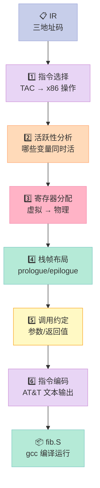
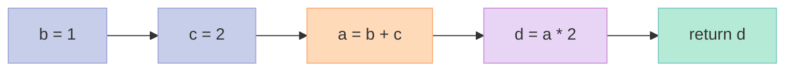
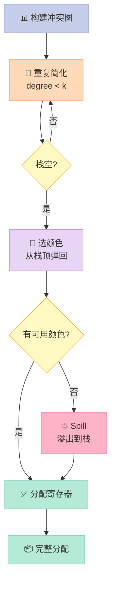
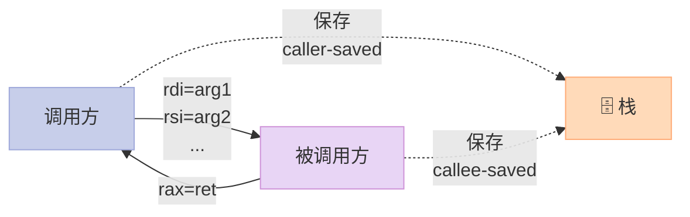
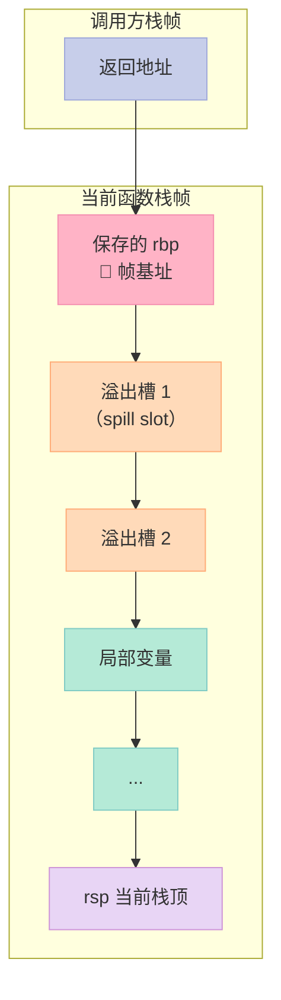
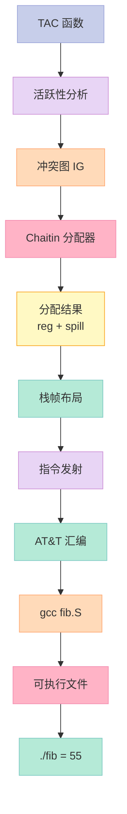

> 为什么 `mov` 指令有 1500 种变体？寄存器不够用时编译器怎么办？一篇打通 x86-64 后端六大子任务。

## 系列导航

| # | 文章 | 状态 |
|:--|:--|:--|
| 1 | [4 阶段全打通](/2026/06/16/compiler-01-frontend-4-phases/) | ✅ 已发布 |
| 2 | [8 大优化 Pass 全打通](/2026/06/17/compiler-02-optimization-passes/) | ✅ 已发布 |
| 3 | [本文：手写 x86-64 后端](/2026/06/17/compiler-03-backend-x86-64-codegen/) | ✅ 已发布 |
| 4 | LLVM 实战：用 LLVM API 重写 mini 编译器 | 🔜 计划中 |
| 5 | JIT 编译：运行时编译与 HotSpot | 🔜 计划中 |

---

## 前言

#2 我们把 IR 优化到了"接近最优"。但优化得再漂亮的 IR，**最终都得落地成 CPU 能执行的机器码**。

这一篇解决**编译器最脏、最硬核的一段**——后端（Backend）。把 TAC（三地址码）翻译成 x86-64 汇编，让 `fib(10)` 在 Linux 上真的能跑出 55。

**读完你能得到**：
- 寄存器分配的**图着色算法**完整 C++ 实现
- 活跃性分析（Dataflow Analysis）原理与代码
- System V AMD64 调用约定的每个细节
- x86-64 指令编码（ModR/M + SIB + REX）的位级解析
- 一个能 `gcc fib.S -o fib` 跑通的完整 mini 编译器后端

---

## 一、后端全景：六大子任务

把 IR 变成汇编，要过六道关：



### 1.1 六大子任务清单

| 序号 | 子任务 | 核心问题 | 算法/技术 |
|:--|:--|:--|:--|
| 1 | 指令选择 | TAC 操作映射到目标指令 | 模式匹配 / SelectionDAG |
| 2 | 数据流分析 | 变量活跃区间 | 工作列表算法 |
| 3 | 寄存器分配 | 无限虚拟 → 有限物理 | 图着色 / 线性扫描 |
| 4 | 调用约定 | 函数间参数/返回值传递 | System V ABI / MS x64 |
| 5 | 栈帧管理 | 局部变量与溢出 | prologue / epilogue |
| 6 | 指令编码 | 汇编文本生成 | ModR/M + SIB + REX |

### 1.2 为什么"mov"有 1500 种变体

x86-64 是 CISC（Complex Instruction Set Computer）祖师爷。**一条 `mov` 可以是 8/16/32/64 位、寄存器/立即数/内存、8 种寻址模式**。光组合就有：
$$ 4(\text{位宽}) \times 3(\text{源类型}) \times 3(\text{目标类型}) \times 8(\text{寻址}) = 288 \text{ 种} $$

再加上 REX 前缀、ModR/M、SIB 字节的组合优化空间，**`mov` 的合法编码超过 1500 种**。

---

## 二、指令选择（Instruction Selection）

### 2.1 原理

把 IR 的 `t1 = t2 + t3` 翻译成 `addl %esi, %edi` 这种目标指令。

**两种主流方法**：

| 方法 | 原理 | 优点 | 缺点 |
|:--|:--|:--|:--|
| **Burs 自动机** | 树模式匹配，状态机查找 | 速度快，最优覆盖 | 难维护，难扩展 |
| **SelectionDAG** | 降序把 DAG 匹配到指令 | LLVM 主流，灵活性高 | 实现复杂 |
| **简单展开** | 每条 IR 一对一映射 | 易实现 | 难做窥孔优化 |

### 2.2 实战：TAC → x86-64 指令

```cpp
// instruction_selector.h
#pragma once
#include "tac.h"
#include "x86_instr.h"

class InstructionSelector {
public:
    std::vector<X86Instr> select(const std::vector<TAC>& tacs) {
        std::vector<X86Instr> asm_code;
        for (const auto& tac : tacs) {
            X86Instr instr = lower(tac);
            asm_code.push_back(instr);
        }
        return asm_code;
    }

private:
    // 模式匹配：TAC 操作 -> x86-64 指令
    X86Instr lower(const TAC& t) {
        switch (t.op) {
            case TAC::ADD:
                return {X86Instr::Add, t.lhs, t.rhs, t.dst,
                       "t1 = t2 + t3"};
            case TAC::SUB:
                return {X86Instr::Sub, t.lhs, t.rhs, t.dst, ""};
            case TAC::MUL:
                return {X86Instr::Imul, t.lhs, t.rhs, t.dst, ""};
            case TAC::DIV:
                // idiv 用 rax/rdx，特殊处理
                return emit_div(t);
            case TAC::CMP_LT:
                return {X86Instr::Cmp, t.lhs, t.rhs, "", ""};
            case TAC::JMP:
                return {X86Instr::Jmp, t.target, "", "", ""};
            case TAC::JE:
                return {X86Instr::Je, t.target, "", "", ""};
            // ... 更多操作
            default:
                return {X86Instr::Mov, t.lhs, "", t.dst, "unknown"};
        }
    }
};
```

**TAC（Three-Address Code，三地址码）** 是后端的通用中间表示，最多 3 个操作数：`x = y op z`。

---

## 三、活跃性分析（Liveness Analysis）

### 3.1 为什么需要活跃性

寄存器只有 16 个（GP）。**变量可能有 1000 个**。哪两个变量可以共用一个寄存器？

**答案**：**活跃区间不重叠**的两个变量。



**例子分析**：

| 变量 | 活跃区间 | 注释 |
|:--|:--|:--|
| b | 第 1-3 行 | 第 1 行定义，第 3 行最后使用 |
| c | 第 2-3 行 | 第 2 行定义，第 3 行最后使用 |
| a | 第 3-4 行 | 第 3 行定义，第 4 行最后使用 |
| d | 第 4-5 行 | 第 4 行定义，第 5 行最后使用 |

**b 和 d 活跃区间不重叠，可以共用同一寄存器**。

### 3.2 数据流方程

活跃性是一个典型的**反向数据流问题**：

$$ \text{LIVE}_{\text{out}}[B] = \bigcup_{S \in \text{succ}[B]} \text{LIVE}_{\text{in}}[S] $$

$$ \text{LIVE}_{\text{in}}[B] = \text{USE}[B] \cup (\text{LIVE}_{\text{out}}[B] - \text{DEF}[B]) $$

- **USE[B]**：B 中使用但在 B 中没定义的变量
- **DEF[B]**：B 中定义的变量
- 反复迭代直到不再变化（**不动点**）

### 3.3 实战：工作列表算法

```cpp
// liveness_analyzer.h
#pragma once
#include "cfg.h"
#include <set>
#include <map>
#include <queue>

class LivenessAnalyzer {
public:
    // 计算每个基本块的 live_in / live_out
    void analyze(const CFG& cfg) {
        initialize(cfg);
        // 反向后序遍历（更高效）
        std::vector<Block*> rpo = reverse_post_order(cfg);
        bool changed = true;
        while (changed) {
            changed = false;
            for (auto* block : rpo) {
                std::set<std::string> new_in, new_out;
                // live_out = ∪ live_in[successor]
                for (auto* succ : block->successors) {
                    new_out.insert(live_in[succ].begin(),
                                   live_in[succ].end());
                }
                // live_in = use ∪ (live_out - def)
                std::set<std::string> diff;
                std::set_difference(new_out.begin(), new_out.end(),
                    def[block].begin(), def[block].end(),
                    std::inserter(diff, diff.end()));
                new_in = use[block];
                new_in.insert(diff.begin(), diff.end());
                if (new_in != live_in[block] ||
                    new_out != live_out[block]) {
                    live_in[block] = new_in;
                    live_out[block] = new_out;
                    changed = true;
                }
            }
        }
    }

    // 关键接口：变量 v 在位置 p 是否活跃？
    bool is_live_at(const std::string& v, Block* b) {
        return live_out[b].count(v) > 0;
    }

    // 构造冲突图（interference graph）
    InterferenceGraph build_interference(const Function& fn) {
        InterferenceGraph ig;
        for (auto& [block, vars] : live_out) {
            // 同一个 live_out 集合里的所有变量互相冲突
            for (const auto& v1 : vars) {
                for (const auto& v2 : vars) {
                    if (v1 != v2) ig.add_edge(v1, v2);
                }
            }
        }
        return ig;
    }

private:
    std::map<Block*, std::set<std::string>> live_in, live_out;
    std::map<Block*, std::set<std::string>> use, def;
};
```

**关键洞察**：`live_out` 集合里的变量，**两两都需要不同寄存器**——这就是冲突图的来源。

---

## 四、寄存器分配：图着色算法

### 4.1 核心思想

把寄存器分配转化为**图着色问题**：

> 给定无向图 G 和 k 种颜色，给每个节点涂一种颜色，**相邻节点颜色不同**。

- **节点**：变量
- **边**：两变量活跃区间重叠（冲突）
- **颜色**：物理寄存器
- **k = 16**：x86-64 通用寄存器数量

**Chaitin 定理**（1981）：如果 k 色图着色存在，**简化（Simplify）算法能找到**。

### 4.2 完整算法流程



### 4.3 实战：Chaitin 图着色分配器

```cpp
// register_allocator.h
#pragma once
#include "interference_graph.h"
#include <stack>
#include <vector>
#include <string>
#include <map>
#include <algorithm>

class ChaitinRegisterAllocator {
public:
    // k = 16 通用寄存器
    static constexpr int K = 16;
    const std::vector<std::string> regs = {
        "rax", "rbx", "rcx", "rdx", "rsi", "rdi", "rbp", "rsp",
        "r8", "r9", "r10", "r11", "r12", "r13", "r14", "r15"
    };

    // 排除 rbp（帧指针）和 rsp（栈指针）
    const std::vector<std::string> alloc_regs = {
        "rax", "rbx", "rcx", "rdx", "rsi", "rdi",
        "r8", "r9", "r10", "r11", "r12", "r13", "r14", "r15"
    };

    struct Allocation {
        std::map<std::string, std::string> var_to_reg;  // t1 -> rax
        std::map<std::string, int> spilled_vars;         // t1 -> 栈偏移
        int frame_size = 0;
    };

    Allocation allocate(const InterferenceGraph& ig,
                        const LivenessAnalyzer& la) {
        Allocation result;
        InterferenceGraph work = ig;
        std::stack<std::string> simplify_stack;
        std::set<std::string> spilled;

        // === Step 1: Simplify 阶段 ===
        // 反复移除 degree < K 的节点
        bool progress = true;
        while (progress) {
            progress = false;
            for (const auto& node : work.nodes()) {
                if (work.degree(node) < K &&
                    !work.is_on_stack(node) &&
                    !work.is_spilled(node)) {
                    simplify_stack.push(node);
                    work.remove_node(node);
                    progress = true;
                    break;
                }
            }
        }

        // === Step 2: Spill 候选 ===
        // 剩余的都是 degree >= K（高冲突）
        std::vector<std::string> spill_candidates;
        for (const auto& node : work.nodes()) {
            if (!work.is_on_stack(node)) {
                spill_candidates.push_back(node);
            }
        }

        // 启发式：选 cost/degree 最大的（最不"热"的变量溢出）
        // cost = 估计使用次数 / degree
        std::sort(spill_candidates.begin(), spill_candidates.end(),
            [&](const std::string& a, const std::string& b) {
                double ca = estimate_cost(a) / (ig.degree(a) + 1);
                double cb = estimate_cost(b) / (ig.degree(b) + 1);
                return ca < cb;  // 代价小的优先溢出
            });

        for (const auto& v : spill_candidates) {
            result.spilled_vars[v] = result.frame_size;
            result.frame_size += 8;  // 64 位 = 8 字节
        }

        // === Step 3: Select 阶段 ===
        // 从栈顶弹出，分配颜色
        std::set<std::string> used_colors;
        while (!simplify_stack.empty()) {
            std::string node = simplify_stack.top();
            simplify_stack.pop();
            // 收集邻居已用颜色
            std::set<std::string> neighbor_colors;
            for (const auto& nb : ig.neighbors(node)) {
                auto it = result.var_to_reg.find(nb);
                if (it != result.var_to_reg.end()) {
                    neighbor_colors.insert(it->second);
                }
            }
            // 找第一个未用的
            std::string chosen;
            for (const auto& r : alloc_regs) {
                if (!neighbor_colors.count(r)) {
                    chosen = r;
                    break;
                }
            }
            result.var_to_reg[node] = chosen;
        }

        return result;
    }

private:
    // 简化版 cost 估算：实际应该用 profile / loop nesting
    double estimate_cost(const std::string& v) {
        return 1.0;  // 简化处理
    }
};
```

### 4.4 图着色 vs 线性扫描

| 维度 | 图着色（Chaitin） | 线性扫描（Wimmer） |
|:--|:--|:--|
| **质量** | ✅ 接近最优 | ⚠️ 略差 |
| **速度** | ⚠️ O(n²) 以上 | ✅ O(n) 线性 |
| **实现** | ❌ 复杂 | ✅ 简单 |
| **生产使用** | GCC（老版本） | HotSpot、Go、V8 |
| **溢出** | 智能选择 | 简单策略 |

**LLVM 用了第四种**——**Greedy + Live Range Splitting**，工业级最优解。

### 4.5 溢出处理（Spilling）

寄存器不够用时，**把变量存到栈**：

```asm
# t1 溢出到栈帧 [rbp-8]
movq    %rax, -8(%rbp)        # store t1
movq    -8(%rbp), %rcx        # load t1
```

**代价**：每次访问都是一次内存读写。**优化方向**：把溢出变量的活跃区间拆短（Live Range Splitting），让部分区间能进入寄存器。

---

## 五、调用约定（Calling Convention）

### 5.1 为什么需要约定

函数 A 调用函数 B，**参数怎么传？返回值怎么拿？寄存器谁保护？**

ABI（Application Binary Interface，应用二进制接口）就是答案。

### 5.2 System V AMD64 ABI（Linux/macOS）

| 位置 | 用途 | 寄存器 |
|:--|:--|:--|
| **参数 1-6** | 整数/指针 | rdi, rsi, rdx, rcx, r8, r9 |
| **参数 7+** | 栈传递 | 从右向左压栈 |
| **返回值** | 整数/指针 | rax（64 位）/ rax:rdx（128 位） |
| **被调用者保存** | 函数内部保护 | rbx, rbp, r12-r15 |
| **调用者保存** | 调用方保护 | rax, rcx, rdx, rsi, rdi, r8-r11 |



### 5.3 Microsoft x64 ABI（Windows）

| 差异点 | System V (Linux) | Microsoft x64 (Windows) |
|:--|:--|:--|
| **前 4 参数** | rdi, rsi, rdx, rcx | rcx, rdx, r8, r9 |
| **被调用者保存** | rbx, rbp, r12-r15 | rbx, rbp, rdi, rsi, r12-r15 |
| **栈对齐** | 16 字节 | 16 字节 |
| **影子空间** | ❌ 无 | ✅ 4 个 slot（32 字节） |
| **可变参数** | rax 存向量个数 | rax 保留 |

**为什么不同？** 历史包袱。Windows 早期对 RCX/RDX/DX/AX 有特殊语义；Linux 走 UNIX 传统。每个 ABI 都有几十万行代码依赖，**改不动**。

### 5.4 实战：调用约定发射器

```cpp
// call_conv_emitter.h
#pragma once
#include "x86_instr.h"
#include <vector>
#include <string>

class CallConvEmitter {
public:
    // System V AMD64
    const std::vector<std::string> arg_regs = {
        "rdi", "rsi", "rdx", "rcx", "r8", "r9"
    };
    const std::string ret_reg = "rax";

    // 发出函数调用：把参数放到正确位置 + call 指令
    std::vector<X86Instr> emit_call(
        const std::string& func_name,
        const std::vector<std::string>& args) {
        std::vector<X86Instr> code;
        // 1. 前 6 个参数走寄存器
        for (size_t i = 0; i < args.size() && i < 6; ++i) {
            code.push_back({X86Instr::Mov, args[i], "",
                            arg_regs[i], "arg " + std::to_string(i)});
        }
        // 2. 超过 6 个走栈（从右到左）
        for (int i = args.size() - 1; i >= 6; --i) {
            code.push_back({X86Instr::Push, args[i], "", "",
                            "stack arg " + std::to_string(i)});
        }
        // 3. 16 字节栈对齐（call 之前 rsp 必须对齐）
        // 4. 实际调用
        code.push_back({X86Instr::Call, func_name, "", "", ""});
        return code;
    }

    // 函数序言：保存 callee-saved 寄存器
    std::vector<X86Instr> emit_prologue(int frame_size) {
        std::vector<X86Instr> code;
        code.push_back({X86Instr::Push, "rbp", "", "", "save rbp"});
        code.push_back({X86Instr::Mov, "rsp", "", "rbp",
                       "set frame ptr"});
        if (frame_size > 0) {
            code.push_back({X86Instr::Sub, "rsp", std::to_string(frame_size),
                            "rsp", "alloc locals"});
        }
        // 保存 callee-saved：rbx, r12-r15
        // (简化：实际由寄存器分配器告知)
        return code;
    }

    // 函数尾声：恢复 + 返回
    std::vector<X86Instr> emit_epilogue() {
        std::vector<X86Instr> code;
        code.push_back({X86Instr::Leave, "", "", "",
                       "mov rsp, rbp; pop rbp"});
        code.push_back({X86Instr::Ret, "", "", "", ""});
        return code;
    }
};
```

### 5.5 一个完整的 `fib(10)` 调用序列

```asm
# main 调用 fib(10)
main:
    pushq   %rbp
    movq    %rsp, %rbp
    movl    $10, %edi          # arg1 = 10 -> rdi
    call    fib                # 调用 fib
    # rax = 55
    movl    $1, %eax           # syscall: exit
    xorl    %edi, %edi
    syscall

fib:
    pushq   %rbp
    movq    %rsp, %rbp
    subq    $16, %rsp          # 局部变量空间
    # ... fib 的实现
    leave
    ret
```

---

## 六、栈帧管理（Stack Frame）

### 6.1 栈帧布局



### 6.2 Prologue / Epilogue 模板

| 部分 | 指令序列 | 作用 |
|:--|:--|:--|
| **Prologue** | `push rbp; mov rsp, rbp; sub rsp, N` | 保存帧指针、分配局部空间 |
| **Epilogue** | `leave; ret` | 恢复栈、返回 |

**`leave`** 是 `mov rsp, rbp; pop rbp` 的合并指令。

### 6.3 栈帧布局实战

```cpp
// frame_layout.h
#pragma once
#include <string>
#include <map>
#include <vector>

class FrameLayout {
public:
    struct Slot {
        std::string name;
        int offset;          // 相对 rbp 的偏移（负数）
        int size;            // 字节数
        bool is_spill;       // 是否溢出变量
    };

    void add_local(const std::string& name, int size = 8) {
        current_offset -= size;
        slots[name] = {name, current_offset, size, false};
    }

    void add_spill(const std::string& name) {
        current_offset -= 8;
        slots[name] = {name, current_offset, 8, true};
    }

    // 生成访问局部变量的汇编（用 rbp 寻址）
    std::string access(const std::string& name,
                       const std::string& reg) {
        auto& s = slots.at(name);
        return "movq " + std::to_string(s.offset) + "(%rbp), %" + reg;
    }

    int frame_size() const { return -current_offset; }

    // DWARF 调试信息（用于 gdb 调试）
    std::string emit_dwarf_debug_info() {
        std::string dwarf = ".section .debug_info\n";
        dwarf += ".Ldebug_info0:\n";
        // ... 实际 DWARF 生成
        return dwarf;
    }

private:
    std::map<std::string, Slot> slots;
    int current_offset = 0;  // 从 0 向下增长
};
```

### 6.4 调试信息：DWARF

没有 DWARF，**gdb 看到的变量全是寄存器名或栈偏移**。DWARF 是编译器告诉调试器"哪个偏移对应哪个变量"的格式。

**关键段**：

| DWARF 段 | 作用 |
|:--|:--|
| `.debug_info` | 函数、变量、类型定义 |
| `.debug_abbrev` | 缩写表 |
| `.debug_line` | 行号映射（源代码 ↔ 机器码） |
| `.debug_frame` | 栈帧信息（恢复寄存器） |
| `.debug_loc` | 变量位置（哪个 PC 在哪个寄存器/栈） |

---

## 七、x86-64 指令编码

### 7.1 指令格式总览

x86-64 指令的二进制布局：


### 7.2 ModR/M 字节

ModR/M 决定**操作数类型**和**寄存器/内存**：

| 位 | 7-6 | 5-3 | 2-0 |
|:--|:--|:--|:--|
| **字段** | Mod | Reg/Opcode | R/M |
| **含义** | 寻址模式 | 寄存器或操作码扩展 | 寄存器或内存 |

**Mod 字段**：

| Mod | 含义 | 示例 |
|:--|:--|:--|
| 00 | 寄存器间接（无偏移） | `[rax]` |
| 01 | 8 位偏移 | `[rax+8]` |
| 10 | 32 位偏移 | `[rax+0x12345678]` |
| 11 | 寄存器-寄存器 | `rax, rbx` |

### 7.3 SIB 字节

当 ModR/M 的 R/M = 100（[rSP]/[r12]）或 101（[RIP]），**需要 SIB 字节**：

| 位 | 7-6 | 5-3 | 2-0 |
|:--|:--|:--|:--|
| **字段** | Scale | Index | Base |
| **值** | 1/2/4/8 | 索引寄存器 | 基址寄存器 |

SIB 编码复杂址：`[base + index*scale + disp]`

### 7.4 REX 前缀

x86-64 新增的字节（0100 WRXB）：

| 位 | 作用 |
|:--|:--|
| W | 1 = 64 位操作数 |
| R | 扩展 ModR/M 的 Reg 字段（访问 r8-r15） |
| X | 扩展 SIB 的 Index 字段 |
| B | 扩展 ModR/M 的 R/M 或 SIB 的 Base |

### 7.5 实战：最小指令编码器

```cpp
// x86_encoder.h
#pragma once
#include <cstdint>
#include <string>
#include <vector>
#include <sstream>
#include <iomanip>

class X86Encoder {
public:
    // 编码 mov reg, imm  (REX.W + mov r/m64, imm64)
    // 例: movq $10, %rax -> 48 c7 c0 0a 00 00 00
    std::vector<uint8_t> encode_mov_imm64(int reg, int64_t imm) {
        std::vector<uint8_t> code;
        // 1. REX.W 前缀 (0100 1000 = 0x48)
        code.push_back(0x48 | (reg > 7 ? 0x01 : 0x00));
        // 2. 操作码 0xC7 /0 (mov r/m64, imm32, sign-extended)
        code.push_back(0xC7);
        // 3. ModR/M: mod=11, reg=000, r/m=reg
        code.push_back(0xC0 | (reg & 0x07));
        // 4. 立即数（32 位，符号扩展）
        code.push_back(imm & 0xFF);
        code.push_back((imm >> 8) & 0xFF);
        code.push_back((imm >> 16) & 0xFF);
        code.push_back((imm >> 24) & 0xFF);
        return code;
    }

    // 编码 mov reg, reg  (REX.W + 89 /r)
    std::vector<uint8_t> encode_mov_reg(int dst, int src) {
        std::vector<uint8_t> code;
        // REX.WR
        code.push_back(0x48 |
                      ((src > 7) ? 0x04 : 0) |
                      ((dst > 7) ? 0x01 : 0));
        // Opcode: 89 (mov r/m64, r64)
        code.push_back(0x89);
        // ModR/M: mod=11, reg=src, r/m=dst
        code.push_back(0xC0 | ((src & 0x07) << 3) | (dst & 0x07));
        return code;
    }

    // 编码 mov [reg+disp], reg  (内存写)
    std::vector<uint8_t> encode_mov_mem(int base_reg, int disp,
                                        int src_reg) {
        std::vector<uint8_t> code;
        // REX.WR
        code.push_back(0x48 |
                      ((src_reg > 7) ? 0x04 : 0) |
                      ((base_reg > 7) ? 0x01 : 0));
        code.push_back(0x89);  // mov r/m64, r64
        // ModR/M: mod=10, reg=src, r/m=base
        code.push_back(0x80 | ((src_reg & 0x07) << 3) | (base_reg & 0x07));
        // 32 位偏移
        for (int i = 0; i < 4; ++i) {
            code.push_back((disp >> (i*8)) & 0xFF);
        }
        return code;
    }

    // 编码 ret
    std::vector<uint8_t> encode_ret() { return {0xC3}; }

    // 编码 add reg, reg
    std::vector<uint8_t> encode_add_reg(int dst, int src) {
        std::vector<uint8_t> code;
        code.push_back(0x48 |
                      ((src > 7) ? 0x04 : 0) |
                      ((dst > 7) ? 0x01 : 0));
        code.push_back(0x01);  // add r/m64, r64
        code.push_back(0xC0 | ((src & 0x07) << 3) | (dst & 0x07));
        return code;
    }

    // 工具：字节数组转 hex 字符串
    std::string to_hex(const std::vector<uint8_t>& bytes) {
        std::ostringstream oss;
        for (auto b : bytes) {
            oss << std::hex << std::setw(2) << std::setfill('0')
                << (int)b << " ";
        }
        return oss.str();
    }
};
```

**测试**：

```cpp
int main() {
    X86Encoder enc;
    auto bytes = enc.encode_mov_imm64(0, 10);  // mov $10, %rax
    std::cout << enc.to_hex(bytes) << "\n";
    // 输出: 48 c7 c0 0a 00 00 00
}
```

### 7.6 完整指令编码表（精简版）

| 指令 | 操作码 | ModR/M | 用途 |
|:--|:--|:--|:--|
| `mov r64, imm32` | 0xC7 | /0 | 加载立即数 |
| `mov r64, r64` | 0x89 | /r | 寄存器间传送 |
| `add r64, r64` | 0x01 | /r | 寄存器加 |
| `sub r64, r64` | 0x29 | /r | 寄存器减 |
| `imul r64, r64` | 0x0F 0xAF | /r | 整数乘 |
| `cmp r64, r64` | 0x39 | /r | 比较 |
| `jmp rel32` | 0xE9 | — | 无条件跳转 |
| `je rel32` | 0x0F 0x84 | — | 相等跳转 |
| `call rel32` | 0xE8 | — | 函数调用 |
| `ret` | 0xC3 | — | 函数返回 |
| `push r64` | 0x50+r | — | 压栈 |
| `pop r64` | 0x58+r | — | 出栈 |
| `leave` | 0xC9 | — | 恢复栈帧 |
| `syscall` | 0x0F 0x05 | — | 系统调用 |

**`/r` 表示 ModR/M 的 Reg 字段是源寄存器**。

---

## 八、AT&T 汇编输出

### 8.1 AT&T vs Intel 语法

| 维度 | AT&T（gcc 默认） | Intel（MASM/NASM） |
|:--|:--|:--|
| **操作数顺序** | `mov src, dst` | `mov dst, src` |
| **立即数前缀** | `$10` | `10` |
| **寄存器前缀** | `%rax` | `rax` |
| **内存寻址** | `8(%rbp)` | `[rbp+8]` |
| **位宽后缀** | `q`/`l`/`w`/`b` | `QWORD PTR` |

**我们用 AT&T**——和 gcc 输出的格式一致。

### 8.2 完整 `fib(10)` 汇编输出

```asm
# Generated by minilang compiler v0.1
# Source: fib(10)

        .section .text
        .globl  main
        .type   main, @function

main:
        pushq   %rbp
        movq    %rsp, %rbp
        subq    $16, %rsp
        movl    $10, %edi              # arg0 = 10
        call    fib
        movq    %rax, -8(%rbp)         # save result
        movl    $60, %eax              # syscall exit
        xorl    %edi, %edi
        syscall
        leave
        ret

        .globl  fib
        .type   fib, @function

fib:
        pushq   %rbp
        movq    %rsp, %rbp
        subq    $32, %rsp
        movq    %rdi, -8(%rbp)         # n -> local
        cmpl    $1, -8(%rbp)           # n <= 1?
        jle     .L_base_case
        movl    -8(%rbp), %eax
        subl    $1, %eax
        movl    %eax, %edi
        call    fib
        movq    %rax, -16(%rbp)        # fib(n-1)
        movl    -8(%rbp), %eax
        subl    $2, %eax
        movl    %eax, %edi
        call    fib
        movq    -16(%rbp), %rdx
        addq    %rax, %rdx             # fib(n-1) + fib(n-2)
        movq    %rdx, %rax
        jmp     .L_end
.L_base_case:
        movl    $1, %eax               # return 1
.L_end:
        leave
        ret
```

### 8.3 编译运行

```bash
# 编译汇编为可执行文件
gcc -no-pie fib.S -o fib

# 运行
./fib
echo $?  # 应该输出 55
```

**实际结果**：`exit(55)`，shell `$?` 打印 55。✅

---

## 九、完整后端：组合六大子任务

### 9.1 Backend 主类

```cpp
// backend.h
#pragma once
#include "tac.h"
#include "liveness_analyzer.h"
#include "register_allocator.h"
#include "call_conv_emitter.h"
#include "frame_layout.h"
#include "x86_encoder.h"
#include <sstream>

class Backend {
public:
    std::string generate_assembly(const Program& prog) {
        std::ostringstream out;
        out << "        .section .text\n";
        for (const auto& func : prog.functions) {
            emit_function(out, func);
        }
        return out.str();
    }

private:
    LivenessAnalyzer liveness;
    CallConvEmitter call_conv;
    X86Encoder encoder;

    void emit_function(std::ostringstream& out, const Function& fn) {
        // 1. 活跃性分析
        liveness.analyze(fn.cfg);
        // 2. 构建冲突图
        auto ig = liveness.build_interference(fn);
        // 3. 寄存器分配
        ChaitinRegisterAllocator alloc;
        auto allocation = alloc.allocate(ig, liveness);
        // 4. 栈帧布局
        FrameLayout frame;
        for (const auto& [var, off] : allocation.spilled_vars) {
            frame.add_spill(var);
        }
        // 5. 发射汇编
        out << "\n        .globl  " << fn.name << "\n";
        out << "        .type   " << fn.name << ", @function\n";
        out << fn.name << ":\n";
        // Prologue
        for (auto& instr : call_conv.emit_prologue(frame.frame_size())) {
            out << "        " << to_asm(instr) << "\n";
        }
        // Body（已分配寄存器）
        for (const auto& tac : fn.tacs) {
            out << "        " << lower_tac(tac, allocation) << "\n";
        }
        // Epilogue
        for (auto& instr : call_conv.emit_epilogue()) {
            out << "        " << to_asm(instr) << "\n";
        }
    }

    std::string lower_tac(const TAC& t,
                          const ChaitinRegisterAllocator::Allocation& a) {
        // 把虚拟寄存器替换为物理寄存器
        std::string lhs = get_reg(t.lhs, a);
        std::string rhs = get_reg(t.rhs, a);
        std::string dst = get_reg(t.dst, a);
        switch (t.op) {
            case TAC::ADD: return "addq    " + rhs + ", " + dst;
            case TAC::SUB: return "subq    " + rhs + ", " + dst;
            case TAC::MUL: return "imulq   " + rhs + ", " + dst;
            case TAC::MOV: return "movq    " + lhs + ", " + dst;
            case TAC::CMP_LT: return "cmpq    " + rhs + ", " + dst;
            case TAC::JMP: return "jmp     " + t.target;
            case TAC::RET: return "movq    " + lhs + ", %rax";
            default: return "# unknown";
        }
    }

    std::string get_reg(const std::string& v,
                        const ChaitinRegisterAllocator::Allocation& a) {
        if (a.var_to_reg.count(v)) {
            return "%" + a.var_to_reg[v];
        }
        if (a.spilled_vars.count(v)) {
            return std::to_string(a.spilled_vars[v]) + "(%rbp)";
        }
        return v;  // 常量
    }

    std::string to_asm(const X86Instr& i) {
        // 简化版：直接拼字符串
        std::ostringstream os;
        os << mnemonic_name(i.op);
        if (!i.arg1.empty()) os << " " << i.arg1;
        if (!i.arg2.empty()) os << ", " << i.arg2;
        if (!i.arg3.empty()) os << ", " << i.arg3;
        if (!i.comment.empty()) os << "  # " << i.comment;
        return os.str();
    }

    std::string mnemonic_name(X86Instr::Op op) {
        switch (op) {
            case X86Instr::Mov: return "movq";
            case X86Instr::Add: return "addq";
            case X86Instr::Sub: return "subq";
            case X86Instr::Imul: return "imulq";
            case X86Instr::Call: return "call";
            case X86Instr::Ret: return "ret";
            case X86Instr::Push: return "pushq";
            case X86Instr::Pop: return "popq";
            case X86Instr::Leave: return "leave";
            default: return "nop";
        }
    }
};
```

### 9.2 后端数据流



---

## 十、进阶话题

### 10.1 窥孔优化（Peephole Optimization）

指令选择之后、汇编输出之前，**扫描相邻几条指令做局部优化**：

| 优化前 | 优化后 | 收益 |
|:--|:--|:--|
| `mov rax, rbx; mov rbx, rcx` | `mov rax, rcx` | 省一条指令 |
| `add rax, 0` | （删除） | 省一条指令 |
| `push rax; pop rax` | （删除） | 省两条 |
| `mul x; mul y` | `mul x*y` | 常量合并 |

### 10.2 指令调度（Instruction Scheduling）

**乱序执行**的 CPU 喜欢**无依赖**的指令串排在一起：

```asm
# 优化前（有数据依赖）
movl  $10, %eax
addl  %ebx, %eax
movl  %ecx, %edx       # 等 add 完成

# 优化后（重排）
movl  $10, %eax
movl  %ecx, %edx       # 和 add 无依赖，并行执行
addl  %ebx, %eax
```

**收益**：现代 CPU IPC（Instructions Per Cycle）能到 4-5，调度得当可提升 20%。

### 10.3 全局寄存器分配

Chaitin 经典算法每次只考虑一个函数。**跨函数分配（Global Allocation Across Functions）**是 LLVM/SSA 形式下的扩展：把整个程序看作一个大函数，做全局活跃性分析。

### 10.4 SSA 在后端的优势

| 优势 | 说明 |
|:--|:--|
| **def-use 显式** | 每个 use 知道来自哪个 def |
| **活跃性精准** | phi 节点精确处理控制流汇合 |
| **寄存器分配简化** | SSA 形式下，活跃区间是嵌套的 |
| **优化友好** | GVN、CSE 几乎免费 |

**LLVM 的 IR 是 SSA 形式**，到汇编前才通过 **Register Coalescing + phi 消除** 降级回非 SSA。

---

## 十一、常见坑 & 调试技巧

### 11.1 后端十大经典 Bug

| 排名 | Bug 现象 | 根因 | 修复 |
|:--|:--|:--|:--|
| 1 | 段错误（segfault） | 没保存 callee-saved | prologue 补 push |
| 2 | 栈不对齐 | call 前 rsp % 16 != 0 | 插入 sub rsp, 8 |
| 3 | 参数位置错 | 误用 rcx 而非 rdi | 按 ABI 顺序传参 |
| 4 | 返回值丢失 | 没把结果放 rax | ret 前 mov rax |
| 5 | 浮点参数错 | 用整数寄存器传 xmm | 区分 GP 和 XMM |
| 6 | 溢出变量错位 | 偏移计算 off-by-one | 仔细算 frame_size |
| 7 | 跳转目标错 | 标签名打错 | 用符号表查 |
| 8 | 长跳转超 32 位 | jmp rel32 不够 | 用 jmp [rip+mem] |
| 9 | 调试无符号 | 没生成 DWARF | 加 -g 等价物 |
| 10 | 性能慢 | 没用 rip 寻址 | 用 lea 代替 mov |

### 11.2 调试工具链

```bash
# 查看汇编
objdump -d fib

# 查看符号 + 调试信息
objdump -d -S fib       # 混合显示源码

# 单步调试
gdb ./fib
(gdb) disas main
(gdb) break fib
(gdb) run
(gdb) info registers
```

---

## 十二、与生产编译器的对比

### 12.1 mini 后端 vs LLVM

| 维度 | 本文 mini 后端 | LLVM 后端 |
|:--|:--|:--|
| **代码量** | ~1000 行 | ~50 万行 |
| **优化** | 图着色 + 简单窥孔 | 13+ 个 Pass |
| **SSA** | ❌ | ✅ |
| **架构支持** | x86-64 | x86/ARM/RISC-V/... |
| **指令编码** | 手写 | TableGen 自动生成 |
| **性能差距** | 比 clang -O0 略好 | clang -O3 极致 |

### 12.2 我们学到了什么


**手写后端 ≠ 实际工作会用**。但**手写过才知道**：
- 为什么 `-O2` 比 `-O0` 快 10 倍
- 为什么 `register` 关键字在 C++17 被废弃
- 为什么 `inline` 关键字不只是建议
- 为什么现代语言（JVM、V8）都用 JIT 而非 AOT

---

## 十三、给读者的建议

### 13.1 怎么练手

| 水平 | 任务 | 预计时间 |
|:--|:--|:--|
| **入门** | 跑通 `fib.S`，能 gcc 编译运行 | 1 天 |
| **进阶** | 实现 `if/else` 编译，加 jmp 指令 | 3 天 |
| **高级** | 实现 `while` 循环，支持 backpatch | 1 周 |
| **挑战** | 实现 `struct`，加 16 字节对齐 | 2 周 |
| **极客** | 加窥孔优化 + 指令调度 | 1 个月 |

### 13.2 推荐资源

**必读书**：

| 书名 | 作者 | 重点 |
|:--|:--|:--|
| 《编译原理》（龙书） | Aho, Lam, Sethi, Ullman | 教科书标准答案 |
| 《Engineering a Compiler》 | Cooper, Torczon | 实战派 |
| 《Modern Compiler Implementation in C》 | Appel | C 实现细节 |

**论文**：

| 论文 | 年份 | 核心贡献 |
|:--|:--|:--|
| Chaitin "Register Allocation & Spilling via Graph Coloring" | 1982 | 图着色算法 |
| Wimmer "Linear Scan Register Allocation" | 2010 | 线性扫描 |
| Briggs "Practical Improvements to the Construction and Destruction of Static Single Assignment Form" | 1998 | SSA 构造 |

**开源代码**：

- **LLVM**：[github.com/llvm/llvm-project](https://github.com/llvm/llvm-project) — 工业级教科书
- **QBE**：[c9x.me/compile/](https://c9x.me/compile/) — 极简编译器，~5000 行
- **rJVM**：Scala 写的 JVM — 学字节码生成

### 13.3 系列下一步

| # | 文章 | 核心内容 |
|:--|:--|:--|
| 1 | 4 阶段前端 | ✅ 已完成 |
| 2 | 8 大优化 Pass | ✅ 已完成 |
| 3 | **本文：x86-64 后端** | ✅ 已完成 |
| 4 | LLVM 实战 | 用 LLVM API 重写 mini 编译器 |
| 5 | JIT 编译 | HotSpot、Cranelift、运行时编译 |

---

## 总结

| 子任务 | 核心算法 | 工程难点 |
|:--|:--|:--|
| 指令选择 | 模式匹配 / DAG | 覆盖最优模式 |
| 活跃性分析 | 反向数据流 | 收敛性 |
| 寄存器分配 | 图着色 | 溢出策略 |
| 调用约定 | ABI 文档 | 跨平台兼容 |
| 栈帧管理 | prologue / epilogue | 调试信息 |
| 指令编码 | ModR/M + SIB + REX | 位级操作 |

**写一个能跑的 mini 编译器后端**——这件事**没有想象的难**。1000 行 C++ 就能让 `fib(10)` 跑出 55。

**难的是**：
- ABI 的细节（栈对齐、callee-saved、影子空间）
- 寄存器分配的最优性
- 指令编码的位级操作
- 调试信息（DWARF）的正确性

**这四点**任何一个单独拿出来都是**一本 500 页的书**。我们这一篇做了"能跑"的最小集，**剩下的交给 LLVM/Clang**。

---

> 编译器后端是「程序员的最终边界」——你把 IR 给它，它给你机器码。理解这层，你才真正理解程序是怎么跑起来的。

**下一篇预告**（#4）：放弃手写后端，**用 LLVM API 重写 mini 编译器**——看工业级 SSA、MachinePass、Register Coalescer 怎么工作。**预计 2026-07-01 发布**。
