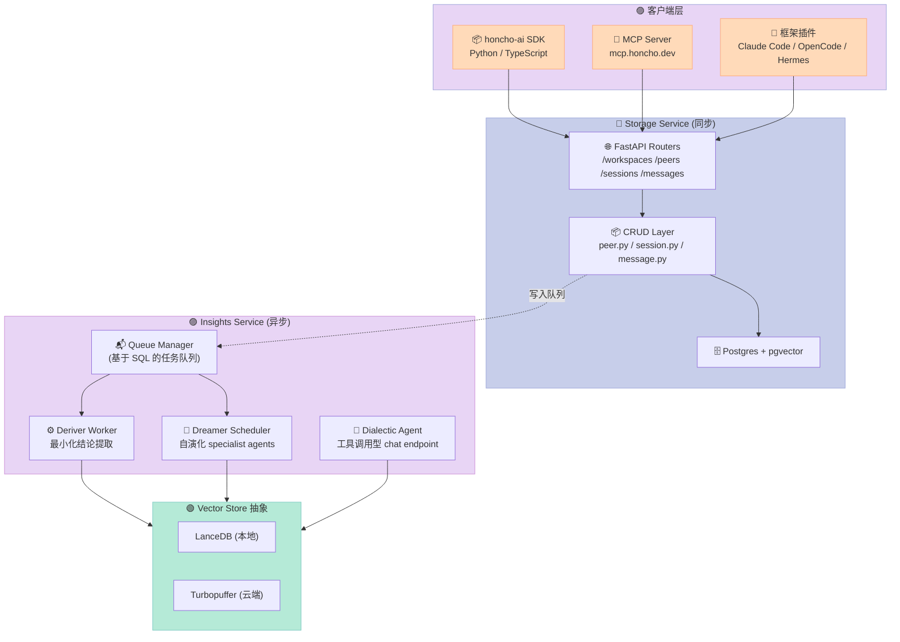
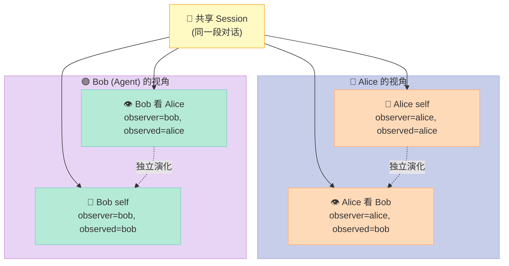
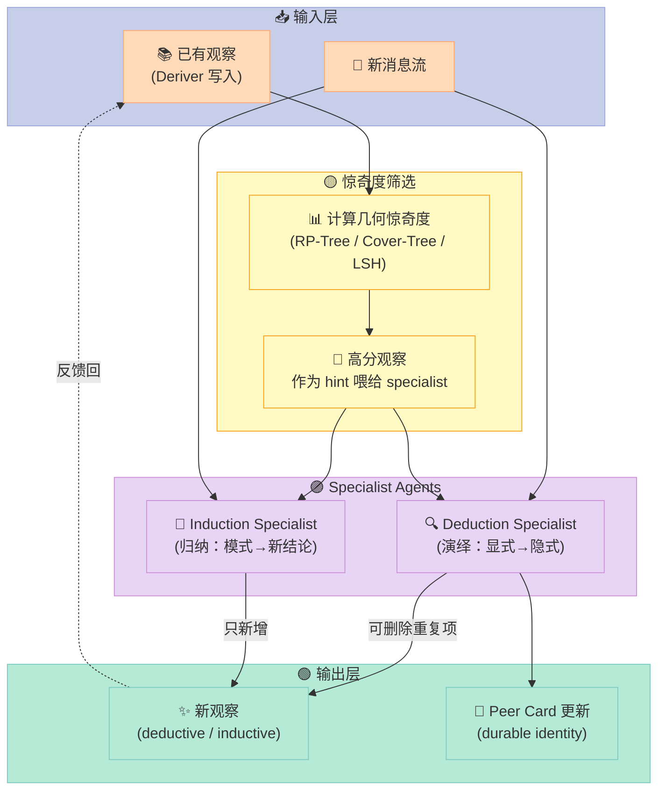

> 一句话核心结论：Honcho 把"Agent 记忆"从单纯的消息存档，提升为一个**以 Peer 为中心、可推理、可演化**的状态层——它不只是存聊天记录，而是在后台异步蒸馏出"Alice 喜欢视觉化讲解""Bob 习惯用命令式表达"这类可被检索的人格化结论。

---

## 前言：为什么 Agent 记忆值得专门做一套基础设施？

写一个能聊天的 LLM 应用很简单，写一个"记得住用户"的 LLM 应用很难。难在哪里？我观察过至少三种翻车模式：

1. **滑动窗口式**：把最近 N 轮对话塞进 context，超过就丢。结果：用户三周前说过"我对青霉素过敏"，第二次问诊时 AI 一脸茫然。
2. **向量检索式**：把所有消息 embed 后塞进向量库，问的时候做 RAG 检索。结果：能召回原文，但**无法归纳**——你能找到那条"我对青霉素过敏"，但找不到"用户的禁忌清单"。
3. **手工总结式**：让 LLM 每隔 N 轮总结一次。结果：总结内容陈旧、互相覆盖、无法处理矛盾更新（用户改主意了怎么办？）。

Honcho 的作者把这三类问题归因到一个更深的根源：**没有"谁在看、谁被看"的视角模型**。如果把"用户 Alice"和"Agent 助手 Bob"都视为对等的 Peer，并且让每个 Peer 都有一套独立演化的内部表示（representation），记忆就不再是"消息列表 + 向量库"，而是"一段持续生长的、关于对方是谁的理解"。

这就是 plastic-labs/honcho 想做的事。它在 GitHub 上拿到了 5.2k star，最近一个月几乎每天都在 commit（最新提交就在昨天），v3 架构稳定下来后已经支持 Claude Code、OpenCode、OpenClaw、Hermes 这些主流 Agent 客户端直接接入。

这篇文章会从源码层面拆开它的整套设计：双服务架构、Deriver 推理流水线、Dreamer 自演化循环、Dialectic 工具调用型 chat endpoint，以及 (observer, observed) Peer 视角下独特的命名空间设计。

---

## 一、Honcho 在解决什么问题

### 1.1 定位

官方 README 的原话是：

> **Honcho is memory infrastructure for building stateful agents that understand changing people, agents, groups, projects, and ideas over time.**

关键词三个：

| 关键词 | 含义 | 行业里的对位 |
|---|---|---|
| **Memory infrastructure** | 不是应用，是基础设施 | 对位 Pinecone/Qdrant（向量基础设施） |
| **Stateful agents** | Agent 长期有状态 | 对位 LangGraph（短期状态机） |
| **Changing over time** | 状态随时间演化、可被修正 | 对位 MemGPT/Letta（情景记忆），但更通用 |

### 1.2 与同类项目的边界

| 项目 | 核心抽象 | 记忆类型 | Honcho 的差异 |
|---|---|---|---|
| **LangChain Memory** | 会话缓冲 | 短期消息列表 | 没有异步推理和人格建模 |
| **MemGPT / Letta** | 分层内存（core/archival/recall） | 分页式文本记忆 | Honcho 用 Peer 视角而非文件视角 |
| **Pinecone / Qdrant** | 向量集合 | 原始 embedding | Honcho 内置"推理层"，不只检索 |
| **Mem0** | 用户事实提取 | 抽取式 facts | Honcho 支持 (observer, observed) 双向建模 |

简单说：**Honcho = 向量基础设施 + 推理层 + Peer 视角** 三合一。它不是在和 LangChain 竞争，而是在和"用 LangChain + LangGraph + Qdrant + 自己的 prompts 自己拼一套" 这种模式竞争——把后者的胶水代码直接做成了一个产品。

### 1.3 真正跑起来的代价

最让人意外的是 Honcho 的接入成本：核心 API 只要 5 个调用就能跑通——`honcho.peer()`、`session.add_messages()`、`peer.chat()`、`session.context()`、`session.search()`。README 里的最小可运行样例 22 行 Python：

```python
from honcho import Honcho

honcho = Honcho(workspace_id="my-app-testing", api_key=os.environ["HONCHO_API_KEY"])

# 1. Store
alice  = honcho.peer("alice")
tutor  = honcho.peer("tutor")
session = honcho.session("session-1")
session.add_messages([
    alice.message("帮我看看数学作业？"),
    tutor.message("好呀，发过来吧！"),
])

# 2. Reason — happens asynchronously in the background.

# 3. Query
answer  = alice.chat("用户最容易被哪种讲解方式打动？")
context = session.context(summary=True, tokens=10_000)

# 4. Inject — hand the context to your model of choice
from openai import OpenAI
completion = OpenAI().chat.completions.create(
    model="gpt-4o-mini",
    messages=context.to_openai(assistant=tutor),
)
```

对比一下，如果用 LangChain + LangGraph 自己拼，至少要写一个 retriever、两个 prompt template、一个 memory summarizer、一份 session state schema——大概 200 行。

---

## 二、整体架构：Storage 与 Insights 的双服务切分

Honcho 把整套系统切成两条独立的流水线：**Storage（同步 API）** 和 **Insights（异步后台）**。

### 2.1 双服务架构图



### 2.2 Storage 服务（同步路径）

路径：用户调用 `POST /sessions/{id}/messages` → `src/routers/messages.py` → `src/crud/message.py` 写入 Postgres → 同步返回结果。

这套路径是**纯数据库操作**，延迟在毫秒级。它包含的核心原语：

- **Workspace**：顶层租户隔离单元（v3 之前叫 "App"，更名是为了避免和一般意义的"应用"混淆）。
- **Peer**：任何参与者——人类、AI agent、bot、服务都可以。第一类公民。
- **Session**：会话上下文，Peer 之间多对多关系，通过 `session_peers_table` 关联表维护。
- **Message**：原子数据单元，属于某个 Session，带源 Peer 标签，可以是用户消息、agent 回复，也可以是上传的文档 chunk。

`src/models.py` 里定义了所有 SQLAlchemy ORM 模型，其中最巧妙的是 `session_peers_table`——它带 `configuration` 和 `internal_metadata` 两个 JSONB 字段，**每个 Peer 在每个 Session 中可以有独立的观察设置**（`observe_me`、`observe_others`）。这是 Honcho 实现"双向人格建模"的关键——Alice 想不想让 Bob 的 representation 包含自己说过的话，是可以在会话级别配置的。

### 2.3 Insights 服务（异步路径）

消息写入后会异步进入队列，被三类 worker 消费：

| Worker | 触发条件 | 输出 |
|---|---|---|
| **Deriver** | 新消息进入 | 原子化结论（explicit facts）存入 `(observer, observed)` 集合 |
| **Dreamer** | 累积观察超过阈值 | 高阶归纳/演绎结论（inductive/deductive facts） |
| **Dialectic** | 用户调用 `peer.chat()` | 工具调用型 chat response |

为什么这套异步架构很关键？因为**推理是昂贵的**。如果同步做，用户每发一条消息要等 2-5 秒 LLM 总结才能拿到 response——体验极差。Honcho 的解法是：**写立刻成功，推理后台排队，最后异步反映到 representation/chat/search 上**。这和数据库的"读写分离"思路完全一致。

---

## 三、核心机制：Peer 视角 + (observer, observed) 双向命名空间

Honcho 最具识别度的设计是 **Peer 视角**。

### 3.1 为什么是 Peer 而不是 User？

传统记忆系统围绕"用户"展开：每个用户有一份记忆。Honcho 不这么做——它把"用户"和"Agent"都视为 **Peer**（同等的一等公民），并且定义了**观察关系** `(observer, observed)`。

这个二维视角解决了真实场景里的两类问题：

1. **多 Agent 协作**：Alice 在和 Bob、Cathy 三个 agent 同时对话，每个 agent 对 Alice 的理解应该不一样——B 觉得 Alice 很专业，C 觉得 Alice 很情绪化。两个 representation 应该独立演化。
2. **用户自己的视角 vs 别人眼中的用户**：Alice 自己的 self-representation（`observer=alice, observed=alice`）和 Bob 对 Alice 的认知（`observer=bob, observed=alice`）是两个不同的文档。

Honcho 把这套抽象实现成了内部**集合（collections）**——每个 (observer, observed) 对应一个 vector collection 命名空间，存的是该视角下的观察文档。`README` 里有句很克制的话：

> Internally, Honcho stores peer-related observations in **collections** of vector-embedded **documents**. Collections are keyed by `(observer, observed)` peer pairs. These primitives are not exposed directly; the Conclusions API is the public surface.

注意"not exposed directly"——这是有意为之的架构决策。内部实现细节归内部，对外暴露的是统一的高阶抽象（peer.chat、session.context、conclusions）。

### 3.2 命名空间生成：固定长度哈希

存储后端是 LanceDB（本地）或 Turbopuffer（云端），两者对命名空间都有约束。`src/vector_store/__init__.py` 里的 `_hash_namespace_components` 函数很关键：

```python
def _hash_namespace_components(*parts: str) -> str:
    """Hash workspace/observer/observed → 43-char base64url 字符串。"""
    combined = ".".join(parts)
    hash_bytes = hashlib.sha256(combined.encode("utf-8")).digest()
    return base64.urlsafe_b64encode(hash_bytes).decode("ascii").rstrip("=")
```

输出恒为 43 个字符（base64url SHA-256 截断）。这样无论 workspace/peer 名字多长，命名空间都落在 Turbopuffer 的 128 字符限制内。这种"先定长度上限再哈希"的设计，在云原生数据库里很常见——Cloudflare Worker 的 Durable Object namespace 也是类似套路。

### 3.3 Peer 视角的关系建模



### 3.4 数据流：从消息到结论

```mermaid
flowchart LR
    M["💬 新消息<br/>session.add_messages()"] --> W["📝 写入 Storage<br/>(同步，毫秒)"]
    W --> Q["📬 队列入队<br/>queue_item"]
    Q --> D1["⚙️ Deriver Worker<br/>最小 prompt 提取"]
    D1 --> E["🧠 Embedding<br/>text-embedding-3-small"]
    E --> C["📚 (observer, observed)<br/>collection"]
    C --> S["🔍 Search / Representation<br/>(查询时使用)"]
    S --> R["🤖 Dialectic Agent<br/>工具检索 → 回答"]
    R --> U["✨ 用户获得<br/>个性化回答"]

    style M fill:#C7CEEA,stroke:#9FA8DA,color:#333
    style W fill:#C7CEEA,stroke:#9FA8DA,color:#333
    style Q fill:#FFDAB9,stroke:#FFAB76,color:#333
    style D1 fill:#E8D5F5,stroke:#CE93D8,color:#333
    style E fill:#E8D5F5,stroke:#CE93D8,color:#333
    style C fill:#FFF9C4,stroke:#F9A825,color:#333
    style S fill:#FFF9C4,stroke:#F9A825,color:#333
    style R fill:#B5EAD7,stroke:#80CBC4,color:#333
    style U fill:#B5EAD7,stroke:#80CBC4,color:#333
```



Deriver 是这条流水线上的核心 worker。它从 `src/deriver/prompts.py` 读 prompt 模板，对每条新消息生成**显式原子结论**——例如："Alice 在 2026-03-15 提到对青霉素过敏"。

最关键的工程决策是**最小化 prompt**——README 里明确说：

> This module contains simplified prompt templates focused only on observation extraction. **NO peer card instructions, NO working representation** — just extract observations.

为什么要"最小化"？因为 Deriver 在高频路径上跑（每条消息都要过），prompt 越短 token 越省、延迟越低。而 peer card / working representation 这些高阶操作移到 Dreamer 异步跑。这是非常成熟的成本优化思路。

---

## 四、Dreamer：让记忆"自演化"

如果 Deriver 只做"提取显式事实"，那它和"用 LLM 做 IE（信息抽取）"没区别。Honcho 的真正杀手锏是 **Dreamer**——一个让结论**自己生长**的子系统。

### 4.1 Dream 的核心思想

README 给的定义：

> Specialists are self-directed agents that explore the observation space and create higher-level observations. When surprisal sampling finds interesting observations, they're passed as hints, but specialists are free to follow the evidence wherever it leads.

"Surprisal"（惊奇度）是 Dreamer 的核心概念：哪些观察"奇怪到值得深挖"？Dreamer 用几何惊奇度（geometric surprisal）来打分，把分数高的观察喂给 specialist agents。

`src/dreamer/orchestrator.py` 的完整周期是：

```python
async def run_dream(workspace_name, observer, observed, session_name=None, ...):
    # 0. [可选] Surprisal 采样：高惊奇度的观察作为 hint
    # 1. Deduction specialist：从显式事实演绎出更深的事实
    # 2. Induction specialist：从模式归纳出新结论
```

### 4.2 Specialist 是会调用工具的 Agent

这不是普通的 prompt 链，而是真正的 agentic 循环——specialist 可以调用工具去搜索观察、创建新观察、甚至删除重复项：

```python
class BaseSpecialist(ABC):
    name: str = "base"
    can_update_peer_card: bool = True

    @abstractmethod
    def get_tools(self, *, peer_card_enabled: bool = True) -> list[dict[str, Any]]:
        """返回工具 schema（OpenAI function calling 格式）。"""
        ...

    @abstractmethod
    def get_model_config(self) -> ConfiguredModelSettings:
        """决定用哪个 LLM。"""
        ...
```

具体到 deduction 和 induction 两个 specialist，它们的工具集在 `src/utils/agent_tools.py` 里——`DEDUCTION_SPECIALIST_TOOLS` 和 `INDUCTION_SPECIALIST_TOOLS`。这两个工具集**不一样**：deduction 允许删除重复项（"哦这条和已有的其实是同一件事"），induction 不允许（归纳只能新增）。这种细节体现了设计者对"什么是归纳、什么是演绎"的清晰区分。

### 4.3 惊奇度的几何计算

`src/dreamer/trees/` 目录实现了一组树结构用来高效估算惊奇度——`rptree.py`（随机投影树）、`covertree.py`（覆盖树）、`lsh.py`（局部敏感哈希）。这些不是数据库索引，而是**在向量空间中找"密度低的点"**——也就是"远离已有观察簇的新观察"，它们往往是值得深挖的。

### 4.4 Dreamer 的自演化闭环



### 4.5 Dreamer 调度的去重

`src/dreamer/dream_scheduler.py` 用 `src/reconciler/scheduler.py` 里的任务调度机制保证**同一时刻只有一个 Dream 在跑**——通过 SQL `QueueItem` 表 + work_unit_key 实现分布式锁。这比 Redis 锁更轻量，适合已经在用 Postgres 的部署。

---

## 五、Dialectic：工具调用型的 Chat Endpoint

`peer.chat()` 是 Honcho 的旗舰 API。它和普通的 RAG 问答不一样：**它是 agentic**——可以调用工具去多次查询。

### 5.1 DialecticAgent 的核心循环

`src/dialectic/core.py` 里的 `DialecticAgent` 类：

```python
class DialecticAgent:
    def __init__(self, workspace_name, session_name, observer, observed, ...):
        # 初始化系统 prompt
        self.messages = [
            {"role": "system", "content": prompts.agent_system_prompt(
                observer, observed, observer_peer_card, observed_peer_card
            )},
        ]
        # 工具集：DIALECTIC_TOOLS 或 DIALECTIC_TOOLS_MINIMAL
```

`src/dialectic/core.py` 里的核心循环是：

```python
async def _step(self):
    """每一步：调用 LLM，可能执行工具调用。"""
    response = await honcho_llm_call(...)
    if response.tool_calls:
        for tool_call in response.tool_calls:
            result = await self.tool_executor(tool_call)
            self.messages.append({"role": "tool", "content": result})
    return response
```

这意味着 **Dialectic 不只是"先搜集所有 context 再问一次"**，而是 **多轮**：agent 自己决定"我需要查 Bob 关于 Alice 的结论"，调用 `search_memory` 工具，再"我还需要看 Bob 对 Alice 在 2026-03 那段对话的具体观察"，再调用 `get_documents` 工具……直到它认为信息够了再回答。

### 5.2 推理层级：minimal/low/medium/high/max

Honcho 配置里有一个 `ReasoningLevel` 枚举：

```python
ThinkingEffortLevel = Literal[
    "none", "minimal", "low", "medium", "high", "xhigh", "max"
]
```

不同 level 用不同模型和不同 tool 集合：

```python
def _get_dialectic_level_model_config(reasoning_level: ReasoningLevel) -> ConfiguredModelSettings:
    return settings.DIALECTIC.LEVELS[reasoning_level].MODEL_CONFIG
```

| Level | 工具集 | 默认模型（README 推断） |
|---|---|---|
| `minimal` | `DIALECTIC_TOOLS_MINIMAL`（只读、只 search） | Gemini |
| `low/medium` | `DIALECTIC_TOOLS`（可创建新观察） | Gemini/Anthropic |
| `high/max` | 同上 + 多轮反思 | Anthropic Claude |

这套设计的好处：**用户用 `peer.chat(..., reasoning_level="minimal")` 就能强制走"快路径"**，跳过工具调用，直接给一个基于 representation 的快速回答。对延迟敏感的场景很有用。

---

## 六、关键代码演示：用 Honcho 搭一个跨会话的记忆应用

下面这段代码是真实可运行的（来自 `sdks/python/examples/multi_user_representations.py`），展示了 Honcho 最惊艳的能力——**多 Peer 视角下的矛盾更新**：

```python
import time
import uuid
from honcho import Honcho
from honcho.session import SessionPeerConfig

honcho = Honcho(environment="local")
alice = honcho.peer("alice")
bob = honcho.peer("bob")

# 会话 1：Alice 说她早餐吃了煎饼
session = honcho.session("chat_test_" + str(uuid.uuid4()))
session.add_peers([
    (alice, SessionPeerConfig(observe_me=True, observe_others=True)),
    (bob,   SessionPeerConfig(observe_me=True, observe_others=True)),
])
session.add_messages([
    alice.message("我今天早餐吃得很丰盛！"),
    bob.message("吃了啥？"),
    alice.message("煎饼、鸡蛋和培根。"),
])
time.sleep(5)  # 让时间戳错开

# 会话 2：Alice 改口说其实没吃早餐
session2 = honcho.session("chat_test_" + str(uuid.uuid4()))
session2.add_peers([
    (alice, SessionPeerConfig(observe_me=True, observe_others=True)),
    (bob,   SessionPeerConfig(observe_me=True, observe_others=True)),
])
session2.add_messages([
    alice.message("还记得我说早餐吃得好吗？我骗你了，我其实没吃早餐。"),
    bob.message("你有病吧？！"),
])

# 关键演示：从不同 Peer 视角问同一个问题，得到不同答案
print(alice.chat("Alice 早餐吃了啥？", session=session))         # alice 的全局视角
print(bob.chat("Alice 早餐吃了啥？", target=alice, session=session))  # bob 在会话 1 的视角
print(bob.chat("Alice 早餐吃了啥？", target=alice, session=session2)) # bob 在会话 2 的视角
print(bob.chat("Alice 早餐吃了啥？", target=alice))              # bob 的全局视角
```

四次问同样的问题，Honcho 会基于 (observer, observed, session) 三元组返回**不同的结论**——这才是 Peer 视角真正值钱的地方。同一个事实，在不同观察者、不同时间会有不同的"权重"。这种细粒度的人格建模，是普通的 RAG 方案根本做不到的。

---

## 七、与同类项目的对比

Honcho 不是凭空冒出来的。我把它和三个最常被拿来对比的项目放在一起：

### 7.1 四方对比表

| 维度 | **Honcho** | **Letta (MemGPT)** | **Mem0** | **Pinecone + LangChain** |
|---|---|---|---|---|
| **核心抽象** | Peer + (observer, observed) 集合 | 分层内存（core/archival/recall） | 用户 + 事实列表 | 向量集合 |
| **存储后端** | Postgres + pgvector / LanceDB / Turbopuffer | Postgres + pgvector | 自有存储 + 向量库 | 任意向量库 |
| **推理层** | 异步 Deriver + 异步 Dreamer + 同步 Dialectic | 同步 LLM 调用 | 异步 fact 提取 | 无（用户自己写） |
| **多视角建模** | ✅ 一等公民 | ❌ 单用户视角 | ❌ 单用户视角 | ❌ 自己实现 |
| **矛盾更新** | ✅ 时间戳 + 双向 collection | ⚠️ 部分（archival 可编辑） | ⚠️ 部分（mem_update） | ❌ 完全自己实现 |
| **工具调用型 chat** | ✅ DialecticAgent | ❌ 直接生成 | ❌ 直接生成 | ⚠️ 自己拼 |
| **MCP 原生支持** | ✅ mcp.honcho.dev | ⚠️ 社区版 | ✅ 有 MCP server | ❌ |
| **开源协议** | AGPL-3.0 | Apache-2.0 | Apache-2.0（核心）+ 商业 | 看具体组件 |
| **自托管难度** | 🟡 中（需要 Postgres + 可选 Turbopuffer） | 🟢 简单（Docker） | 🟢 简单 | 🟢 看你用啥 |

### 7.2 设计差异：为什么 Honcho 的抽象更"对"

对比的核心是**抽象选择**：

1. **Honcho 用 Peer 视角而非 User 视角**：让"我对你的理解"和"你对自己的理解"成为两个独立可查询的对象。这是 Letta/Mem0 都没有的。
2. **Honcho 把异步推理做成基础设施而非"自己写的 worker"**：Deriver/Dreamer 都是产品化组件，用户不用关心。Mem0 的 fact extraction 也是异步的，但只做一层（extract → store），没有 Honcho 的两层（extract → dream/induce）。
3. **Honcho 的 Dialectic 是真正的 agentic chat**：它不是"先 RAG 再生成"，而是"agent 自己决定查什么"。这让它在复杂查询（比如"Bob 觉得 Alice 对什么话题最兴奋"）上比纯 RAG 准很多。

但 Honcho 也有明显短板：
- **抽象成本**：要理解 Peer/Session/(observer, observed) 才能上手，比 Mem0 的"user + facts"心智负担大。
- **协议**：AGPL-3.0 协议对商业化产品不友好（任何修改都要开源）。如果想做成 SaaS，要么买商业授权、要么用托管版 `api.honcho.dev`。
- **依赖多**：默认依赖 Postgres + pgvector + LanceDB/Turbopuffer + 至少一个 LLM provider（Gemini 默认做 deriver，Anthropic 默认做 dialectic），自托管的全栈成本高于纯 Python 包的 Letta。

---

## 八、优缺点：架构 / 扩展性 / 易用性 vs 性能 / 复杂度 / 维护性

### 8.1 架构简洁性 vs 性能

| 维度 | 评分 | 说明 |
|---|---|---|
| **架构简洁性** | ⭐⭐⭐ | 双服务切分清晰，但模块数多（`deriver`/`dreamer`/`dialectic`/`reconciler` 各自一个目录），新贡献者需要一周才能摸清数据流。 |
| **扩展性** | ⭐⭐⭐⭐⭐ | Vector store 抽象（`src/vector_store/`）支持 LanceDB 和 Turbopuffer，未来加 Qdrant/Weaviate 只多一个文件。LLM provider 同理（`src/llm/backends/`）。 |
| **易用性** | ⭐⭐⭐⭐ | SDK 5 个调用就能跑通；MCP 接入 1 行命令。扣分项是 v3 命名变更（App→Workspace、User→Peer）让老教程过时。 |
| **性能** | ⭐⭐⭐⭐ | 异步推理 + 增量更新避免了同步 LLM 调用；最小化 Deriver prompt 控制了 token 成本。扣分项是 Dialectic 在 `high/max` level 下多轮工具调用，延迟可达 10s+。 |
| **复杂度** | ⭐⭐ | 自托管需要 Postgres + pgvector + Turbopuffer/LanceDB + 多个 LLM API key；新人部署的"5 分钟跑起来"是个伪命题。 |
| **维护性** | ⭐⭐⭐⭐ | 自带 reconciler（`src/reconciler/scheduler.py`）做软删除清理和向量同步，相当于自带"自愈"机制。但版本迭代快（v1→v2→v3），breaking change 多。 |

### 8.2 适用场景与不适用场景

✅ **适合**：
- 多 Agent 协作的产品（agent 之间需要共享对用户的理解）
- 长生命周期 AI 伴侣 / AI 导师（用户和 AI 关系演化数月）
- 需要"用户自我认知"和"agent 对用户的认知"分开建模的场景
- 想用 Claude Code / Cursor 这类 coding agent 但希望它"记得住项目背景"的团队

❌ **不适合**：
- 一次性单轮对话（一次性 RAG 就够了）
- 极低延迟要求的实时语音（10s+ 的 high-level Dialectic 不能接受）
- 想做商业 SaaS 又不想被 AGPL 传染的场景
- 数据主权要求"全本地"的场景（除非用 LanceDB 部署，否则 Turbopuffer 是云服务）

---

## 九、给你的行动建议

### 9.1 选型决策树

```
你的 Agent 需要"长期记忆"吗？
├── 不需要 → 用 LangChain 的 BufferMemory 就行
└── 需要
    ├── 是单用户、单 Agent？ → Mem0 更轻量
    ├── 是多 Agent、共享用户认知？ → Honcho 的 (observer, observed) 抽象值这个复杂度
    └── 是 coding agent 想记住项目上下文？ → Honcho 的 Claude Code 插件直接装
```

### 9.2 接入 Honcho 的最小路径

```bash
# 1. 安装 SDK
pip install honcho-ai

# 2. 注册拿 API key（$100 免费额度）
#    https://app.honcho.dev

# 3. 接入 Claude Code（如果你是用 Claude Code 写代码）
/plugin marketplace add plastic-labs/claude-honcho
/plugin install honcho@honcho

# 4. 或者接入 MCP（任何 MCP 客户端）
claude mcp add honcho \
  --transport http \
  --url "https://mcp.honcho.dev" \
  --header "Authorization: Bearer hch-yo...ere" \
  --header "X-Honcho-User-Name: YourName"
```

### 9.3 自托管路径（如果你想要全栈可控）

```bash
git clone https://github.com/plastic-labs/honcho.git
cd honcho
cp docker-compose.yml.example docker-compose.yml
cp .env.template .env
# 填入 LLM_GEMINI_API_KEY / LLM_ANTHROPIC_API_KEY / LLM_OPENAI_API_KEY
docker compose up
```

然后 SDK 指向本地：

```python
honcho = Honcho(workspace_id="my-app", base_url="http://localhost:8000")
```

### 9.4 趋势判断

Honcho 现在处于一个有趣的临界点：

- **一边**是 v3 架构稳定后，主流 coding agent（Claude Code、OpenCode、Hermes）都开始内置 Honcho 插件，说明**业界对"有状态 agent"的真实需求已经验证**。
- **另一边**是 Mem0、Letta、SuperMemory 等同类项目融资活跃、商业化更快。Honcho 选择 AGPL-3.0 是开放信仰，但也是商业化的天花板。

我个人的判断是：**2026 年下半年，Agent Memory 赛道会出现"基础设施层 vs 应用层"的分裂**——Honcho 这类做基础设施的会被 LangChain、LlamaIndex 这种应用框架收购或深度集成；而 Mem0、Letta 这类更偏应用的，会被拿来当 SDK 直接嵌入产品。选哪个，取决于你想做"管道工"还是"水管工"。

---

## 结尾

回到开头的核心观点：**Honcho 不只是"消息存档"，它是 Peer 视角下的状态演化层**。它的 (observer, observed) 双向命名空间、异步 Deriver + 自演化 Dreamer、agentic Dialectic chat endpoint，三者共同构成了"让 agent 真的记得住用户"的完整方案。

如果你正在做一个长生命周期的 AI 产品（AI 导师、AI 伴侣、AI 客服、AI coding agent），Honcho 值得花一个周末尝试。它的复杂度是有回报的——你不再需要在每个产品里重新发明"记忆"这个轮子。

> **下一步行动**：
> 1. 跑通 README 的 22 行最小样例（5 分钟）
> 2. 用 `peer.chat(target=other_peer)` 体验双向视角（15 分钟）
> 3. 给自己的 coding agent 装上 Claude Code 插件，写一周代码看 Honcho 学到了什么（1 周）
>
> 体验完之后，欢迎回来告诉我 Honcho 帮你省了多少行 memory 代码——以及踩了哪些坑。

---

## 参考资料

- **Honcho GitHub**: https://github.com/plastic-labs/honcho （5.2k ⭐, AGPL-3.0）
- **官方文档**: https://honcho.dev/docs/v3
- **Pareto Frontier 论文/视频**: https://honcho.dev/evals/
- **LangGraph 集成示例**: https://github.com/plastic-labs/honcho/tree/main/examples/langgraph
- **托管服务**: https://api.honcho.dev
