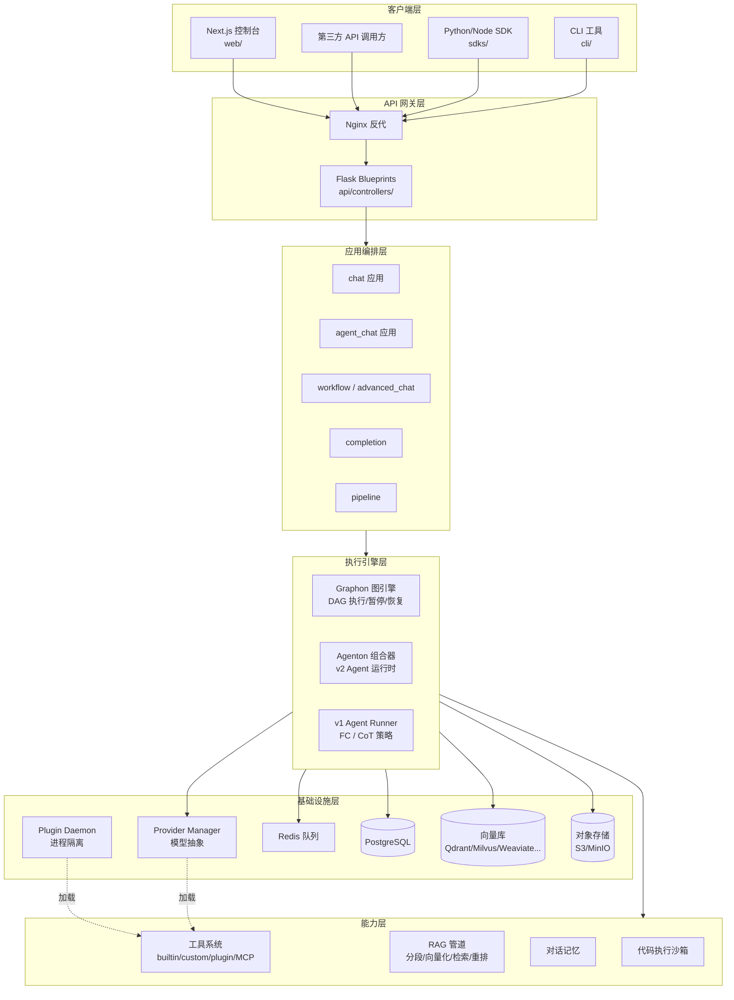
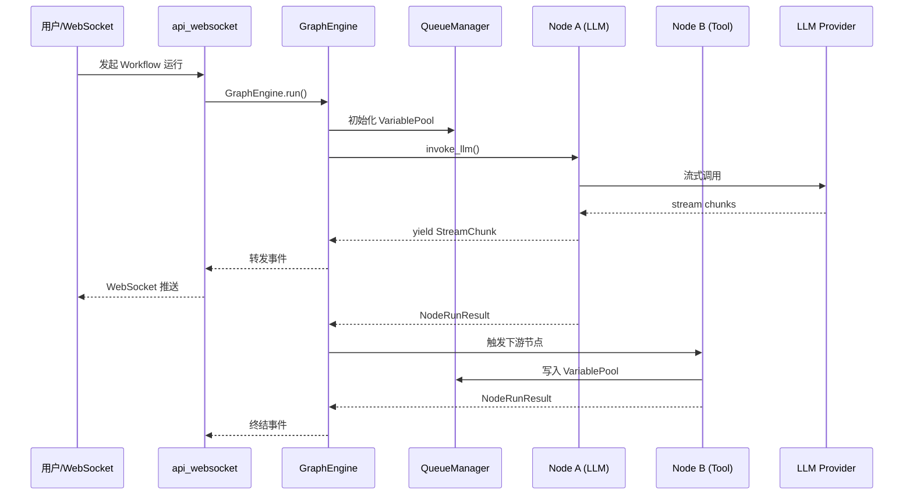
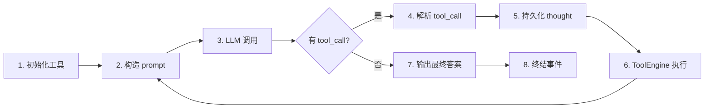
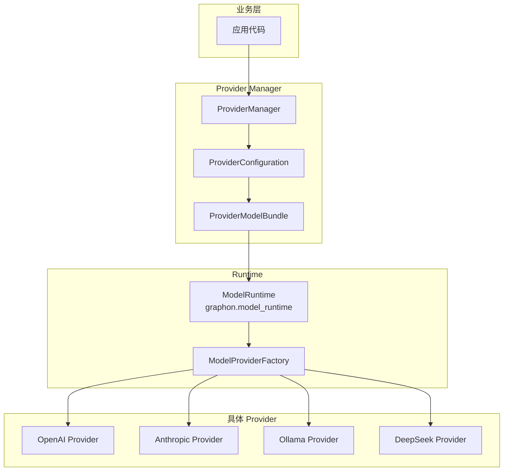
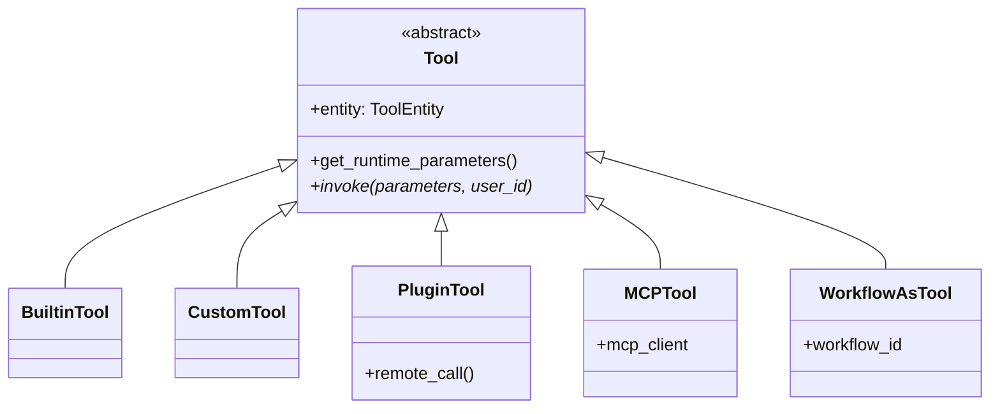
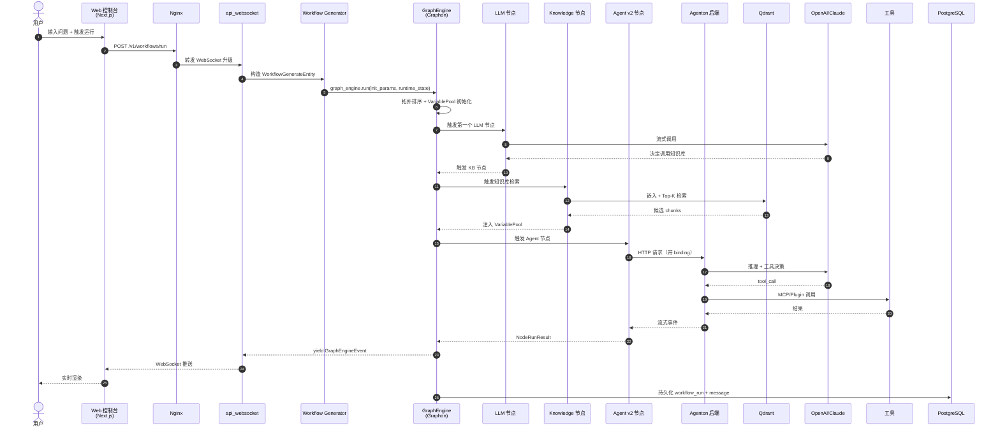

# 【Dify】核心架构与设计原理深度解析：开源 LLM 应用平台的工程化范式

## 引子：当 LLM 应用开发进入「平台化」时代

2024 年初，开源 LLM 应用开发框架如雨后春笋般涌现：LangChain 提供了原子化的能力组合，LangGraph 引入了有状态图执行，LlamaIndex 聚焦数据接入。然而当我们把视角拉远、思考「一个不懂代码的产品经理想搭一个生产可用的 AI 应用」时，**单纯的 SDK 远远不够**——我们需要的是 **LLM Application Platform**。

Dify（**D**o **I**t **F**or **Y**ou）正是这一品类的代表。截至 2026 年 6 月，它在 GitHub 上已经积累了 **145k+ stars**、**22.9k+ forks**，被 LF AI 收录为 Incubating Project，是目前最成功的开源 LLM 应用平台之一。与 LangChain 系列的「开发者工具库」定位不同，Dify 走的是 **BaaS（Backend-as-a-Service） + 可视化编排** 的路线——前端是 Next.js 写的控制台，后端是 Python（Flask + SQLAlchemy + Celery），外加一套独立演进的图执行引擎 **Graphon** 与 Agent 运行时 **Agenton**。

本文将系统拆解 Dify 的内部架构，覆盖：

- **6 种应用类型**（chat / completion / agent_chat / advanced_chat / workflow / pipeline）的统一抽象
- **Graphon 图引擎**：DAG 节点的执行调度、状态管理、暂停/恢复
- **Agenton 组合器模式**：如何把 LLM、工具、记忆、Guardrails 拆成可组合的 Layer
- **Provider 抽象层**：数百个模型/工具/向量库的对接范式
- **MCP 双向集成**：作为 Server 与 Client 同时支持

读完本文，你将对「LLM 应用平台」这一品类的工程复杂度形成完整认知。

---

## 1. 项目定位与核心价值

### 1.1 一句话定义

> **Dify 是一个开箱即用的 LLM 应用开发平台，把 Workflow 编排、Agent 构建、RAG 管道、模型管理、可观测性封装成可视化产品 + 后端 API。**

它把自己定位为「Production-ready platform for agentic workflow development」，与单纯的开发框架（LangChain、LlamaIndex）形成清晰的差异化：

| 维度 | Dify | LangChain / LangGraph |
|------|------|----------------------|
| 形态 | 完整产品（含 UI、API、Worker） | 库/SDK |
| 目标用户 | 产品经理 / 业务 / 开发者 | 开发者 |
| 应用模式 | 可视化编排 + 代码双轨 | 代码 |
| 多租户 | 内置（Workspace / App / Tenant） | 无 |
| 可观测性 | LLMOps（日志、标注、成本） | 需集成 Langfuse 等 |
| 部署方式 | Docker Compose / Helm | 嵌入业务代码 |

### 1.2 核心能力矩阵

来自 `README.md` 的官方描述（[GitHub](https://github.com/langgenius/dify)）：

- **Workflow**：可视化画布，组合 LLM、知识库、工具、条件分支
- **Comprehensive model support**：数百个 LLM 提供商（OpenAI、Anthropic、Azure、Gemini、DeepSeek、Qwen、本地 Ollama…）
- **Prompt IDE**：可视化编写、对比、回滚
- **RAG Pipeline**：从文档摄入到检索，含 PDF/PPT 解析、分段、向量化、重排
- **Agent capabilities**：基于 Function Calling 或 ReAct 策略，内置 50+ 工具，支持 MCP
- **LLMOps**：日志、性能、成本监控，数据驱动的迭代
- **Backend-as-a-Service**：所有能力通过 REST API 暴露

### 1.3 仓库规模与活跃度

| 指标 | 数值 |
|------|------|
| Stars | 145,631 |
| Forks | 22,906 |
| 主语言 | TypeScript（前端）+ Python（后端） |
| Topics | agent, agentic-ai, llm, rag, mcp, low-code, no-code, workflow |
| 许可证 | NOASSERTION（自定义，含商业限制） |
| 最近 Push | 2026-06-18（每日活跃） |
| 仓库体积 | ~405 MB（包含前端 build artifacts） |
| 提交频率 | 高（多团队协作，commit 数量庞大） |

---

## 2. 整体架构：分层与模块职责

Dify 的代码组织体现了「前后端分离 + 引擎外置 + 多端复用」的现代工程实践。核心目录：

```
dify/
├── api/                    # Python 后端（Flask + SQLAlchemy + Celery）
│   ├── core/               # 核心领域逻辑
│   │   ├── app/            # 6 种应用类型
│   │   ├── workflow/       # 工作流执行入口（Graphon 包装）
│   │   ├── agent/          # v1 Agent（FC / CoT 策略）
│   │   ├── rag/            # RAG 管道（分段/向量化/检索/重排）
│   │   ├── tools/          # 工具系统（builtin / custom / plugin / MCP）
│   │   ├── provider_manager.py
│   │   └── model_manager.py
│   ├── controllers/        # HTTP 接口（Flask Blueprints）
│   ├── tasks/              # Celery 异步任务
│   ├── models/             # SQLAlchemy ORM
│   └── libs/ services/     # 工具与服务
├── web/                    # Next.js 前端
├── docker/                 # Docker Compose 部署
├── sdks/                   # 多语言 SDK
├── cli/                    # 命令行工具
├── dify-agent/             # Agenton 运行时（独立子项目）
│   └── src/agenton/        # 组合器模式核心
└── packages/               # 共享 npm 包
```

**最关键的依赖是 `graphon==0.5.2`**（私有 PyPI 包），它是工作流图执行引擎；以及独立的 **Agenton 框架**（在 `dify-agent/src/agenton/` 目录下），用于 v2 Agent 节点的运行。

### 2.1 顶层架构图



### 2.2 后端服务拆分（Docker Compose）

`docker/docker-compose.yaml` 揭示了生产部署的真实形态：

```yaml
# 摘录核心服务
services:
  api:           # Flask 主 API（Gunicorn 多 worker）
  api_websocket: # WebSocket 通道（流式响应）
  worker:        # Celery 异步任务
  worker_beat:   # Celery Beat 定时
  web:           # Next.js 前端
  plugin_daemon: # 插件进程隔离（gRPC 通信）
  ssrf_proxy:    # SSRF 防护代理
  sandbox:       # 代码执行沙箱
  db_postgres / db_mysql  # 主库
  redis:         # 队列 + 缓存
  weaviate / milvus / qdrant / chroma / ...  # 可选向量库
  nginx:         # 统一入口
```

注意 **plugin_daemon** 与 **sandbox**：Dify 把插件执行与代码执行都放到独立进程中，通过 gRPC 通信。这是为了解决 Python 生态的**依赖地狱**——每个插件可以自带不同的依赖版本，通过进程隔离避免冲突。

---

## 3. 应用类型：6 种编排范式的统一抽象

Dify 的精髓在于**它把所有 LLM 应用模式抽象成 6 种类型**，并复用同一套执行栈。这 6 种类型实现在 `api/core/app/apps/` 目录下：

```
api/core/app/apps/
├── chat/              # 基础对话应用
├── completion/        # 文本生成应用
├── agent_chat/        # 带 Agent 的对话应用（v1）
├── agent_app/         # 独立 Agent 应用（v1）
├── advanced_chat/     # 工作流驱动的对话（v2）
├── workflow/          # 工作流应用
└── pipeline/          # 数据处理管道
```

### 3.1 共同基类：base_app_generator

所有应用类型继承自 `BaseAppGenerator`（`api/core/app/apps/base_app_generator.py`），统一接口：

```python
# 简化伪代码（api/core/app/apps/base_app_generator.py 核心契约）
class BaseAppGenerator(Generic[TAppConfig]):
    def generate(self, ...) -> Generator[StreamResponse, None, None]:
        """流式生成响应，子类实现具体策略"""
        raise NotImplementedError

    def _generate(
        self,
        app_model: App,
        workflow: Workflow,
        user: Account,
        args: GenerateAppQuery,
    ) -> Union[Workflow, None]:
        """同步入口，返回执行实例或 None"""
        raise NotImplementedError
```

设计上采用了**「生成器（Generator）模式」**——所有响应以流式 chunk 形式产出，前端通过 WebSocket/SSE 接收。这种统一性使得：

- **HTTP 接口层**无需关心应用类型
- **前端 UI** 只需一个通用的 Stream 渲染组件
- **可观测性** 在队列层（`base_app_queue_manager.py`）统一埋点

### 3.2 应用类型对比

| 类型 | 入口 | 核心引擎 | 典型场景 |
|------|------|----------|----------|
| `chat` | 用户消息 → LLM | 直接 LLM 调用 + 记忆 | FAQ 机器人 |
| `completion` | 提示词模板 → LLM | Prompt Engineering | 文本生成 |
| `agent_chat` | 对话 + 工具调用 | v1 Agent（FC/ReAct） | 联网搜索助手 |
| `agent_app` | 任务 → 工具调用 | v1 Agent | 自动化任务 |
| `advanced_chat` | 对话 + Workflow | Graphon 工作流 | 多步骤客服 |
| `workflow` | 触发器 → 节点链 | Graphon | ETL、自动化 |
| `pipeline` | 批量数据流 | Graphon + 持久化 | 文档处理 |

### 3.3 关键设计：Generator + Queue 双通道

每个应用类型在 `api/core/app/apps/` 下还有配套的：

- `xxx_app_generator.py`：入口 + 响应生成
- `xxx_app_runner.py`：实际执行逻辑（消费队列、调用 LLM、处理工具）
- `xxx_app_queue_manager.py`：通过 Redis 维护执行队列与状态

**WebSocket 通道独立部署**（`api_websocket` 服务）的原因：长连接 + 大文件 + 流式渲染，主 API 进程不适合持有这些 socket。

---

## 4. 核心引擎一：Graphon 工作流执行

Dify 的 Workflow 引擎是平台最复杂的部分。**Graphon** 是其私有 Python 包（`graphon==0.5.2`），专门做有向无环图（DAG）执行。

### 4.1 入口：workflow_entry.py

`api/core/workflow/workflow_entry.py` 是工作流执行的总入口，导入 Graphon 的核心 API：

```python
# 来自 api/core/workflow/workflow_entry.py
from graphon.entities import GraphInitParams
from graphon.entities.graph_config import NodeConfigDictAdapter
from graphon.graph import Graph
from graphon.graph_engine import GraphEngine, GraphEngineConfig
from graphon.graph_engine.command_channels import CommandChannel, InMemoryChannel
from graphon.graph_engine.layers import DebugLoggingLayer, ExecutionLimitsLayer
from graphon.graph_events import GraphEngineEvent, GraphNodeEventBase, GraphRunFailedEvent
from graphon.nodes import BuiltinNodeTypes
from graphon.runtime import GraphRuntimeState, VariablePool
from graphon.variable_loader import load_into_variable_pool
```

可以看到，**Dify 在业务层做了大量适配工作**（`DifyGraphInitContext`、`DifyNodeFactory` 等），把内部的模型、文件、SSRF、Quota、Observability 等能力注入到 Graphon 引擎中。

### 4.2 14+ 内置节点类型

`api/core/workflow/nodes/` 目录列出了 Graphon 支持的内置节点：

```
api/core/workflow/nodes/
├── agent/           # v1 Agent 节点（兼容）
├── agent_v2/        # v2 Agent 节点（推荐）
├── code/            # Python/JS 代码执行
├── datasource/      # 数据源节点
├── http_request/    # HTTP 调用
├── if_else/         # 条件分支
├── iteration/       # 循环
├── knowledge_index/ # 知识库写入
├── knowledge_retrieval/ # 知识库检索
├── llm/             # LLM 调用
├── parameter_extractor/ # 参数提取
├── question_classifier/  # 意图分类
├── template_transform/  # 模板渲染
├── trigger_plugin/  # 插件触发器
├── trigger_schedule/ # 定时触发器
├── trigger_webhook/  # Webhook 触发器
└── variable_aggregator/ # 变量聚合
```

### 4.3 节点执行：graphon 的核心抽象

Graphon 的设计哲学：**节点是纯函数 + 上下文**，Dify 包装的 `DifyNodeFactory` 把配置（`NodeConfigDict`）转化为具体的 Node 实例：

```python
# 简化伪代码：节点执行流程
class DifyNodeFactory:
    def create_node(
        self,
        node_config: NodeConfigDict,
        graph_init_params: GraphInitParams,
        graph_runtime_state: GraphRuntimeState,
    ) -> Node:
        node_type = node_config["data"]["type"]
        match node_type:
            case BuiltinNodeTypes.LLM:
                return LLMNode(...)
            case BuiltinNodeTypes.KNOWLEDGE_RETRIEVAL:
                return KnowledgeRetrievalNode(...)
            case BuiltinNodeTypes.AGENT:
                return DifyAgentNode(...)  # 来自 agent_v2/
            case BuiltinNodeTypes.CODE:
                return CodeNode(...)
            # ... 14+ 节点类型
```

每个节点都遵循统一接口：

```python
class Node(Generic[TNodeData]):
    def run(self) -> Generator[NodeEvent, None, None]:
        """流式 yield 事件（开始/流式/结束/错误）"""
        ...

    @property
    def status(self) -> WorkflowNodeExecutionStatus:
        ...
```

### 4.4 图拓扑验证

`api/core/workflow/graph_topology.py` 提供了图结构校验能力，这是 Dify 在 2025 年底从 agent_v2 模块抽出的公共组件（注释里提到 `ENG-615` 内部 ticket）：

```python
# 来自 api/core/workflow/graph_topology.py
class WorkflowGraphTopology:
    """Draft-workflow graph topology helper."""

    def __init__(self, *, node_ids: set[str], incoming: Mapping[str, Sequence[str]]):
        self._node_ids = node_ids
        self._incoming = incoming

    @classmethod
    def from_graph(cls, graph: Mapping[str, Any]) -> "WorkflowGraphTopology":
        """从 graph JSON 解析拓扑结构（nodes + edges）"""
        node_ids = cls._node_ids_from_graph(graph)
        incoming: dict[str, list[str]] = defaultdict(list)
        for edge in graph.get("edges", []):
            if isinstance(edge, Mapping):
                source = edge.get("source")
                target = edge.get("target")
                if isinstance(source, str) and isinstance(target, str):
                    incoming[target].append(source)
        return cls(node_ids=node_ids, incoming=incoming)

    def upstream_node_ids(self, target_node_id: str) -> set[str]:
        """BFS 找出目标节点的所有上游节点（用于依赖检查）"""
        visited: set[str] = set()
        queue: deque[str] = deque(self._incoming.get(target_node_id, ()))
        while queue:
            candidate = queue.popleft()
            if candidate in visited:
                continue
            visited.add(candidate)
            queue.extend(self._incoming.get(candidate, ()))
        visited.discard(target_node_id)
        return visited & self._node_ids
```

这个拓扑校验器在两个场景复用：**v2 Agent 发布前的依赖检查**、**Composer 候选端点的合法性校验**。这体现了「提取公共组件」的良好工程实践。

### 4.5 执行流：状态机 + 事件流

Graphon 引擎的运行模型可以简化为：



**暂停/恢复（Human-in-the-Loop）**：v2 Agent 节点引入了 `PauseRequestedEvent` 与 `SchedulingPause`，允许在 LLM 调用前暂停等待用户输入。这对 HITL（Human-in-the-Loop）场景至关重要。

---

## 5. 核心引擎二：Agenton 组合器（v2 Agent 运行时）

Dify 在 2025-2026 年推出了 **v2 Agent 节点**（`api/core/workflow/nodes/agent_v2/`），这是相对 v1 的一次重大架构升级。v1 的 Agent（`api/core/agent/`）是在应用层直接调度的，v2 把它统一到工作流图里——**「Agent 即节点」**。

### 5.1 核心思想：组合器模式（Compositor Pattern）

v2 Agent 不再是单一 Runner，而是一组可组合的 **Layer**。这部分的核心实现在独立的 `dify-agent/src/agenton/` 子项目里：

```python
# 来自 dify-agent/docs/agenton/guide/index.md 的核心抽象
from agenton.layers import LayerConfig, NoLayerDeps, PlainLayer
from agenton.compositor import Compositor, CompositorConfig, LayerNodeConfig, LayerProvider


class GreetingConfig(LayerConfig):
    prefix: str
    model_config = ConfigDict(extra="forbid")


@dataclass(slots=True)
class GreetingLayer(PlainLayer[NoLayerDeps, GreetingConfig]):
    type_id = "example.greeting"
    prefix: str

    @classmethod
    @override
    def from_config(cls, config: GreetingConfig) -> Self:
        return cls(prefix=config.prefix)

    @property
    @override
    def prefix_prompts(self) -> list[str]:
        return [self.prefix]
```

**Layer 体系的设计哲学**（来自官方文档）：

> The core is state-only: a `Compositor` stores no live layer instances, clients, cleanup stacks, or run state. Each `Compositor.enter(...)` call creates a fresh `CompositorRun` with new layer instances, direct dependency bindings, lifecycle state, and an optional hydrated session snapshot.

**关键约束**：

1. **Config 可序列化**：Layer 配置是纯数据，可存入数据库/快照
2. **Runtime State 可序列化**：每层有 `runtime_state` 字段，保存运行中间状态
3. **Live Resources 归调用方所有**：HTTP 客户端、文件、socket 不进 Agenton 核心

这种「状态 vs 资源」分离的设计，使得 Agenton 可以：
- **跨进程/跨服务恢复**（序列化状态 + 重建 Layer）
- **调试/回放**（状态机快照）
- **测试友好**（不依赖真实 IO）

### 5.2 v2 Agent Node 的执行

回到 Dify 主项目，`api/core/workflow/nodes/agent_v2/agent_node.py` 是 v2 Agent 节点的核心：

```python
# 来自 api/core/workflow/nodes/agent_v2/agent_node.py（节选）
class DifyAgentNode(Node[DifyAgentNodeData]):
    node_type = BuiltinNodeTypes.AGENT

    def __init__(
        self,
        node_id: str,
        data: DifyAgentNodeData,
        *,
        graph_init_params: GraphInitParams,
        graph_runtime_state: GraphRuntimeState,
        binding_resolver: WorkflowAgentBindingResolver,
        runtime_request_builder: WorkflowAgentRuntimeRequestBuilder,
        agent_backend_client: AgentBackendRunClient,
        event_adapter: AgentBackendRunEventAdapter,
        output_adapter: WorkflowAgentOutputAdapter,
        type_checker: PerOutputTypeChecker,
        failure_orchestrator: OutputFailureOrchestrator,
        session_store: WorkflowAgentRuntimeSessionStore | None = None,
    ):
        ...
```

注意它的**依赖注入清单**——9 个协作组件：

| 组件 | 职责 |
|------|------|
| `binding_resolver` | 解析工作流变量 → Agent 输入 |
| `runtime_request_builder` | 构造 Agenton 运行请求 |
| `agent_backend_client` | 远程 Agent 后端通信（HTTP） |
| `event_adapter` | 事件流转换（后端 → Dify 内部） |
| `output_adapter` | 输出适配到工作流变量 |
| `type_checker` | 输出类型校验（JSON / 文本 / 文件） |
| `failure_orchestrator` | 失败处理（重试 / 降级） |
| `session_store` | 会话状态持久化 |

这种「**编排节点做协调，具体能力通过注入**」的模式，让 v2 Agent 节点本身保持轻量。

### 5.3 v1 vs v2 Agent 对比

| 维度 | v1（fc_agent_runner） | v2（agent_v2 + agenton） |
|------|----------------------|-------------------------|
| 抽象 | 单 Runner 类 | Compositor + Layer 组合 |
| 执行 | 同步 Generator 循环 | 远程 Agent Backend + 事件流 |
| 状态管理 | 进程内 | 可序列化 + 跨进程恢复 |
| 工具调用 | FC 协议直接对接 | 通过 Layer 抽象 |
| HITL 暂停 | 不支持 | 原生支持（`PauseRequestedEvent`） |
| 多 Agent | 弱（手工协作） | 原生（Layer 依赖图） |
| 调试 | 困难 | 状态快照可回放 |

**v1 仍在维护**（向后兼容），新工作推荐 v2。

---

## 6. 核心引擎三：v1 Agent 循环

虽然 v2 是方向，但 **v1 Agent 仍然在生产环境大量使用**。理解它的工作原理对阅读 Dify 源码很关键。

### 6.1 Function Call Agent Runner

`api/core/agent/fc_agent_runner.py` 实现了 Function Calling 策略的 Agent 循环：

```python
# 来自 api/core/agent/fc_agent_runner.py（节选）
class FunctionCallAgentRunner(BaseAgentRunner):
    def run(self, message: Message, query: str, **kwargs: Any) -> Generator[LLMResultChunk, None, None]:
        # 1. 初始化工具与提示
        tool_instances, prompt_messages_tools = self._init_prompt_tools()
        iteration_step = 1
        max_iteration_steps = min(app_config.agent.max_iteration, 99) + 1

        # 2. 主循环：直到不再产生 tool call
        while function_call_state and iteration_step <= max_iteration_steps:
            # 3. 构造 messages（system + history + user）
            prompt_messages = self._organize_prompt_messages()
            self.recalc_llm_max_tokens(self.model_config, prompt_messages)

            # 4. 调用 LLM
            chunks = model_instance.invoke_llm(
                prompt_messages=prompt_messages,
                tools=prompt_messages_tools,  # FC 协议的工具定义
                stream=self.stream_tool_call,
            )

            # 5. 解析 LLM 输出：content + tool_calls
            for chunk in chunks:
                if self.check_tool_calls(chunk):
                    function_call_state = True
                    tool_calls.extend(self.extract_tool_calls(chunk) or [])
                # 累积 response

            # 6. 持久化 thought
            self.save_agent_thought(
                agent_thought_id=agent_thought_id,
                tool_name=tool_call_names,
                tool_input=tool_call_inputs,
                thought=response,
                observation=...,
            )

            # 7. 执行工具调用
            for tool_call_id, tool_call_name, tool_call_args in tool_calls:
                tool_response = ToolEngine.agent_invoke(
                    tool=tool_instances[tool_call_name],
                    tool_parameters=tool_call_args,
                    ...
                )
                # 把工具结果加入 messages

            iteration_step += 1

        # 8. 终结事件
        self.queue_manager.publish(QueueMessageEndEvent(...))
```

**循环的 8 步拆解**：



### 6.2 CoT Agent Runner

除了 FC，还有 **CoT（Chain-of-Thought）Agent Runner**：

- `cot_agent_runner.py`：通用版
- `cot_chat_agent_runner.py`：对话场景
- `cot_completion_agent_runner.py`：补全场景

CoT 策略让 LLM 输出 `Thought: ... Action: ... Observation: ...` 文本格式，正则解析出工具名与参数。**适用不支持原生 FC 的模型**（如早期开源模型）。

### 6.3 Tool Engine：工具执行的中枢

`api/core/tools/tool_engine.py` 统一了所有工具调用路径：

```python
# 简化伪代码
class ToolEngine:
    @staticmethod
    def agent_invoke(
        tool: Tool,
        tool_parameters: Union[str, dict],
        user_id: str,
        tenant_id: str,
        ...
    ) -> tuple[str, list[str], ToolInvokeMeta]:
        """Agent 调用工具的统一入口"""
        # 1. 触发 on_tool_start 回调
        # 2. 调用 _invoke 实际执行
        # 3. 处理 ToolInvokeMessage（文本/文件/JSON）
        # 4. 返回结果 + 元数据
        ...

    @staticmethod
    def _invoke(tool, tool_parameters, user_id, ...):
        # 抽象方法：4 种 tool 类型各自实现
        # builtin_tool / custom_tool / plugin_tool / mcp_tool / workflow_as_tool
        ...
```

**5 种工具类型**（`api/core/tools/` 下的子目录）：

```
api/core/tools/
├── builtin_tool/      # 内置工具（Google Search、DALL·E、Wolfram…）
├── custom_tool/       # 用户自定义（OpenAPI Schema 导入）
├── plugin_tool/       # 插件市场（gRPC 远程进程）
├── mcp_tool/          # MCP 工具
└── workflow_as_tool/  # 把工作流本身作为工具
```

这 5 种类型都实现 `Tool` 抽象类，对外暴露统一的 `invoke(parameters, user_id) -> ToolInvokeMessage`。

---

## 7. Provider 抽象层：数百模型的统一接口

Dify 支持 100+ LLM 提供商、20+ 向量库、10+ 文件存储、10+ 监控系统——靠的就是 `Provider Manager` 的抽象设计。

### 7.1 三级抽象



### 7.2 ProviderManager 的实现

`api/core/provider_manager.py`（57KB，~1300 行）实现了多租户、多凭据、负载均衡的 Provider 管理：

```python
# 来自 api/core/provider_manager.py
class ProviderManager:
    """
    ProviderManager manages tenant-scoped model provider configuration.

    The runtime adapter is injected by the composition layer so this class stays
    focused on configuration assembly instead of constructing plugin runtimes.
    Request-bound managers may carry caller identity in that runtime, and the
 resulting ``ProviderConfiguration`` objects must reuse it for downstream
 model-type and schema lookups.

 Configuration assembly is cached per manager instance so call chains that
 share one request-scoped manager can reuse the same provider graph instead
 of rebuilding it for every lookup.
 """

    def __init__(self, model_runtime: ModelRuntime):
        self._model_runtime = model_runtime
        self._configurations_cache: dict[str, ProviderConfigurations] = {}

    def get_configurations(
        self, tenant_id: str, ...
    ) -> ProviderConfigurations:
        """获取某租户的所有 Provider 配置（含凭据、模型列表）"""
        if tenant_id in self._configurations_cache:
            return self._configurations_cache[tenant_id]
        # ... 从 DB 加载、加密凭据、组装 ProviderConfiguration
```

**关键能力**：

1. **多租户隔离**：每个 Tenant 有独立的 Provider 凭据
2. **凭据加密**：使用 RSA + AES 加密存储敏感信息
3. **多凭据/负载均衡**：同一模型可配置多个 API Key，调用时轮询
4. **优先级与配额**：`TenantPreferredModelProvider`、`TenantDefaultModel`
5. **运行时缓存**：避免每次请求都重读数据库

### 7.3 Model Provider Factory 模式

Dify 把每种 Provider 的实现放在 `graphon.model_runtime.model_providers.<provider_name>/` 下，遵循统一目录结构：

```
graphon/model_runtime/model_providers/
├── openai/
│   ├── openai.py           # LargeLanguageModel 子类
│   ├── speech2text.py
│   ├── text_embedding.py
│   ├── rerank.py
│   └── _position.yaml      # 元数据（图标、帮助链接）
├── anthropic/
├── google/
├── ollama/
├── deepseek/
└── ... 100+ providers
```

每个 provider 实现 4 类能力：
- `LargeLanguageModel`：对话/补全
- `TextEmbeddingModel`：嵌入
- `RerankModel`：重排
- `SpeechToTextModel` / `TextToSpeechModel`：语音

**`ModelProviderFactory`** 通过类发现机制（importlib + pkgutil）自动注册所有 provider，无需手工注册表。

---

## 8. 工具系统与 MCP 集成

### 8.1 工具分类与抽象

Dify 把所有可执行能力（除了 LLM）抽象为「工具」：



### 8.2 Plugin Daemon：进程隔离

`plugin_daemon` 是个独立的 Go 进程（不在 Python 仓库中），通过 gRPC 与 Dify API 通信。它的作用：

- **依赖隔离**：每个插件装在自己的 venv / 容器里
- **语言无关**：插件可以是 Python、Go、Node…
- **安全沙箱**：限制插件对文件、网络的访问
- **热加载**：插件更新无需重启主服务

### 8.3 MCP 双向集成

`api/core/mcp/` 与 `api/core/tools/mcp_tool/` 实现了 MCP（Model Context Protocol）支持：

- **作为 MCP Server**：Dify 应用通过 `api/controllers/mcp/` 暴露为 MCP Server
- **作为 MCP Client**：在 v2 Agent 节点中调用外部 MCP 服务

这一双向能力让 Dify 可以：
- **复用现有 MCP 工具**（无需重复实现）
- **把可视化编排的工作流** 暴露给 Claude Desktop 等支持 MCP 的客户端

---

## 9. RAG 管道：分段、嵌入、检索、重排

### 9.1 RAG 模块划分

```
api/core/rag/
├── extractor/           # 文档解析（PDF/PPT/Word/Excel/图片 OCR）
├── splitter/            # 文本分段（通用/Markdown/父子分段）
├── embedding/           # 嵌入模型缓存与批处理
├── retrieval/           # 检索策略（关键词/向量/混合）
├── rerank/              # 重排模型
├── docstore/            # 文档存储抽象
├── data_post_processor/ # 检索后处理
├── index_processor/     # 索引写入
├── summary_index/       # 摘要索引（用于长文档问答）
└── pipeline/            # RAG 管道编排
```

### 9.2 索引流程（`indexing_runner.py`）

`api/core/indexing_runner.py` 是 RAG 写入的主流程：

```python
# 简化伪代码：文档索引的核心流程
class IndexingRunner:
    def run(self, dataset: Dataset, document: Document):
        # 1. 解析文件（PDF/PPT/...）
        text_docs = self.extractor.extract(document.file)

        # 2. 文本分段
        chunks = self.splitter.split(
            text_docs,
            processor=self.index_processor,  # 通用 / 父子 / QA
            rules=dataset.segmentation_rules,
        )

        # 3. 批量嵌入
        embeddings = self.embedder.embed_chunks(
            [c.text for c in chunks],
            embedding_model=dataset.embedding_model,
            batch_size=20,
        )

        # 4. 写入向量库 + 文档库
        self.vector_store.add(embeddings, chunks)
        self.doc_store.add(chunks)

        # 5. 触发 summary_index 更新（异步）
        self.summary_index.delay_update(dataset)
```

**Dify 的 4 种索引模式**（在 `index_processor/processor/` 下）：

1. **paragraph_index_processor**（通用分段）：经典 RAG
2. **paragraph_index_processor** + Parent-Child：父子索引，检索小段时返回大段
3. **qa_index_processor**：把文档转成 QA 对，适合 FAQ
4. **summary_index_processor**：先生成摘要再嵌入，节省空间

### 9.3 检索流程

`api/core/rag/retrieval/` 实现了 3 种检索策略：

| 策略 | 实现 | 适用 |
|------|------|------|
| 关键词 | BM25 / 全文索引 | 精确词匹配 |
| 向量 | Embedding 相似度 | 语义搜索 |
| 混合 | RRF 融合 | 综合 |

检索后通过 **Rerank** 模型（`rerank/`）对 Top-K 重排，提高精度。

---

## 10. 数据流：一次完整调用的旅程

把上述所有模块串起来，看一次 **「用户在 Web UI 提问，触发 Workflow（含 Agent 节点 + 知识库检索 + 工具调用）」** 的完整数据流：



**关键观察**：

1. **生成器贯穿全链路**——从 `Workflow` 到 `Node` 到 `LLM` 都是 `Generator`，确保流式可观察
2. **状态完全可序列化**——`VariablePool` 是 dict-like，支持暂停/恢复
3. **DAG 并行执行**——无依赖的节点会自动并行（如多个知识库同时检索）
4. **失败可恢复**——`GraphRuntimeState` 持久化到数据库，下次可以从中断点继续

---

## 11. 与同类项目对比

### 11.1 对比对象

选取 **n8n**、**Langflow**、**Flowise** 三个同样定位「可视化 AI 工作流」的项目进行对比。

| 项目 | Stars | 主语言 | 形态 | 核心引擎 | 模型支持 | RAG |
|------|-------|--------|------|----------|----------|-----|
| **Dify** | 145k | Python + TS | 完整平台 | Graphon（自研） | 100+ | 内置 |
| **n8n** | 100k+ | TS | 通用自动化 | n8n Core | 通过节点 | 弱 |
| **Langflow** | ~150k | Python + TS | 可视化 IDE | LangChain | LangChain 全集 | 强 |
| **Flowise** | 35k+ | TS | 可视化 IDE | LangChain.js | 50+ | 中 |

### 11.2 核心设计差异

**Dify vs Langflow**：

| 维度 | Dify | Langflow |
|------|------|----------|
| 定位 | 平台（BaaS） | IDE（开发工具） |
| 多租户 | ✅ 原生 | ❌ 单用户 |
| 工作流引擎 | 自研 Graphon | LangChain LCEL |
| 插件系统 | Plugin Daemon（Go） | Python 包 |
| 部署 | Docker Compose / Helm | Docker |
| LLMOps | 内置 | 需外部集成 |

**Dify 的差异化**：

1. **Graphon 是真正的「图」引擎**——支持 DAG 并行、暂停/恢复、状态持久化。Langflow 复用 LangChain 的链式调用，本质仍是同步顺序。
2. **生产级多租户**——账号、Workspace、App、API Key 的完整体系
3. **可观测性内置**——所有 LLM 调用都入库，支持标注与回放
4. **BaaS 形态**——前端是完整产品，不是开发 IDE

### 11.3 架构选型视角

如果你要选型：

- **想要快速搭 MVP** → Langflow / Flowise（更轻量）
- **想要生产平台** → Dify（多租户、LLMOps、API）
- **想要完全控制** → 自建 LangGraph + 自研 UI
- **想要 Node 生态** → n8n（非 LLM 场景为主）

---

## 12. 优缺点分析

### 12.1 架构简洁性 / 扩展性 / 易用性

| 优点 | 说明 |
|------|------|
| **统一的应用抽象** | 6 种应用类型共享 Generator + Queue + Runner 模式，新类型易扩展 |
| **可插拔 Provider** | 新增模型只需实现 4 个接口（LLM/Embedding/Rerank/STT） |
| **节点化 Workflow** | 新节点只需继承 `Node` 类，框架负责调度 |
| **可视化 + 代码双轨** | DSL（YAML）保存到 DB，前端画布编辑，兼容 API 调用 |
| **开箱即用的部署** | Docker Compose 一键启动，包含所有依赖 |

### 12.2 性能 / 复杂度 / 维护性

| 缺点 | 说明 |
|------|------|
| **重 Python 单体** | 主 API 进程 + Celery Worker，水平扩展粒度粗 |
| **私有依赖 graphon** | 核心引擎闭源，bug 修复依赖官方；版本升级不透明 |
| **前端构建产物巨大** | 405MB 仓库体积，98% 是 Next.js 构建产物 |
| **Graphon 与业务耦合** | 节点与 graphon 内部 API 深度绑定，升级可能 break |
| **Plugin Daemon 复杂度** | 多语言插件需 gRPC 通信，调试链路长 |
| **多租户开销** | 每请求需查 DB 加载 Provider 配置（虽然有缓存） |
| **Node.js + Python 双栈** | 前端 TS、后端 Python，全栈开发门槛高 |

### 12.3 适用与不适用

**适合**：

- 企业内部 AI 应用平台搭建
- 多业务线的 LLM 应用管理（客服、内容生成、数据问答）
- 需要 LLMOps 的场景（日志、成本、标注）
- 想要 MCP 集成的现有 AI 客户端

**不适合**：

- 极简 MVP（Langflow / Flowise 更轻）
- 强定制复杂工作流（自建 LangGraph 更灵活）
- 纯 Node 生态项目（避免 Python 依赖）

---

## 13. 实践：Dify 部署与第一个应用

### 13.1 快速启动（Docker Compose）

```bash
# 克隆仓库
git clone https://github.com/langgenius/dify.git
cd dify/docker

# 复制环境变量
cp .env.example .env

# 启动
docker compose up -d

# 等待 30 秒，访问 http://localhost/install
# 完成初始化向导
```

启动后会有这些服务：

```bash
docker compose ps
# NAME                  SERVICE        STATUS
# dify-api-1            api            Up
# dify-api_websocket-1  api_websocket  Up
# dify-worker-1         worker         Up
# dify-web-1            web            Up
# dify-db_postgres-1    db_postgres    Up
# dify-redis-1          redis          Up
```

### 13.2 通过 API 创建第一个应用

```python
import requests

# 1. 登录获取 token
session = requests.post(
    "http://localhost/v1/login",
    json={"email": "you@example.com", "password": "your-password"},
)
token = session.json()["data"]["access_token"]
headers = {"Authorization": f"Bearer {token}"}

# 2. 创建 Chatbot 应用
app = requests.post(
    "http://localhost/v1/apps",
    headers=headers,
    json={
        "name": "我的客服机器人",
        "mode": "chat",
        "model_config": {
            "provider": "langgenius/openai/openai",
            "name": "gpt-4o-mini",
        },
    },
)
app_id = app.json()["data"]["id"]
print(f"App created: {app_id}")

# 3. 调用对话接口
resp = requests.post(
    f"http://localhost/v1/chat-messages",
    headers=headers,
    json={
        "inputs": {},
        "query": "你好，请介绍一下你自己",
        "response_mode": "blocking",  # 或 "streaming"
        "conversation_id": "",
        "user": "user-001",
    },
)
print(resp.json()["answer"])
```

### 13.3 通过 SDK 创建 Workflow

```python
from dify_client import DifyClient

client = DifyClient(api_key="app-xxxxxxxxxxxx")

# 流式调用
for chunk in client.chat_messages(
    inputs={},
    query="用一句话总结 Q4 财报要点",
    user="user-001",
    response_mode="streaming",
):
    print(chunk.get("answer", ""), end="", flush=True)
```

---

## 14. 趋势与展望

### 14.1 v2 Agent 全面铺开

v2 Agent 节点（基于 Agenton 组合器）是 Dify 当前的战略重点：

- ✅ **HITL 原生支持**：`PauseRequestedEvent` + `SchedulingPause` 暂停/恢复
- ✅ **远程 Agent Backend**：可水平扩展的 Agent 服务
- ✅ **可序列化的 Layer 状态**：跨进程/跨服务恢复

未来 v1 会被逐步废弃，新工作推荐 v2。

### 14.2 MCP 双向化

Dify 是首批同时支持 **MCP Server + MCP Client** 的平台：

- Server：把工作流暴露为 MCP 工具，Claude Desktop 可直接调用
- Client：在 v2 Agent 中复用社区 MCP 工具

这意味着 Dify 正在把自己定位为 **MCP 生态的中枢**——既消费 MCP，也生产 MCP。

### 14.3 Plugin Daemon 化

插件系统正在从 Python in-process 演进到 **Go Plugin Daemon + gRPC**：

- 解决依赖冲突
- 支持多语言插件
- 沙箱安全

未来 Dify 可能成为「插件化的 LLM 应用平台」，与 VS Code、JetBrains 插件市场对标。

### 14.4 自托管 SaaS 双轨

- **Dify Cloud**（https://dify.ai）：托管服务，按调用计费
- **Community / Enterprise 自托管**：Docker Compose / Helm

这种「Open Core + Hosted Service」模式与 GitLab、Supabase 一致。

---

## 15. 总结

Dify 不是一个简单的 LLM 工具库，而是一个**完整的 LLM 应用平台**。它通过以下设计解决了生产环境 LLM 应用的关键挑战：

1. **6 种应用类型 + 统一 Generator 模式**：覆盖 90% 的 LLM 应用场景
2. **Graphon 图引擎 + Agenton 组合器**：可扩展的 DAG 执行与 Agent 运行时
3. **Provider Manager + Plugin Daemon**：100+ 模型与工具的统一抽象
4. **可视化 + 代码双轨**：降低使用门槛，同时保持 API 灵活性
5. **多租户 + LLMOps**：开箱即用的企业级能力

它的**核心工程经验**值得每个 LLM 平台开发者学习：

- **抽象边界的确定**（业务层 vs 引擎层）
- **状态可序列化的设计**（支持暂停/恢复/调试）
- **生成器（Generator）模式**（流式 + 统一性）
- **依赖注入 + 组合器模式**（v2 Agent 的清晰分层）
- **进程隔离 + gRPC 通信**（解决依赖地狱）

如果你正在考虑搭建 LLM 应用平台，Dify 是最值得研究的开源参考实现。

---

## 附录：关键资源

- **GitHub**: https://github.com/langgenius/dify
- **官网**: https://dify.ai
- **官方文档**: https://docs.dify.ai
- **Plugin Daemon**: https://github.com/langgenius/dify-plugin-daemon
- **SDK**: https://github.com/langgenius/dify-python-sdk / dify-node-sdk
- **License**: Dify Open Source License（含商业限制，详见 LICENSE）
- **Dify 文档（中文）**: https://docs.dify.ai/zh-hans

**技术标签**：`#Dify` `#LLM` `#Agent` `#Workflow` `#GraphEngine` `#MCP` `#RAG` `#可视化编排` `#LLMOps` `#开源平台`
