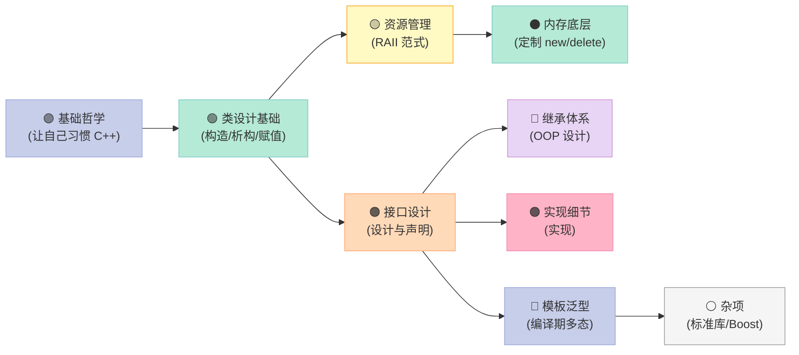
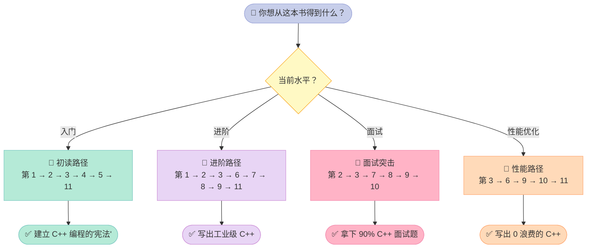
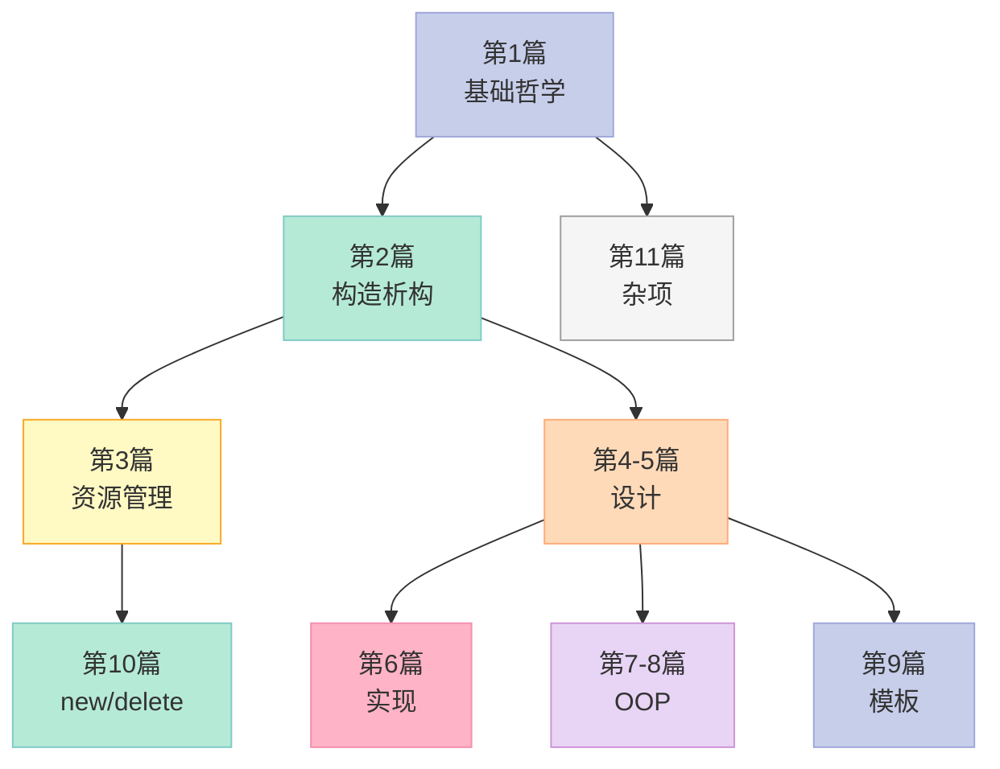

> **一句话核心结论**：《Effective C++》第三版是 C++ 程序员书架上的"圣经级"读物——它用 55 个条款，把"什么样的 C++ 代码才算专业"这件事讲透了。读完之后，你看 `const`、`virtual`、`operator=`、`template` 这些基础语法的眼神，都会变。

---

## 一、前言：为什么 2026 年还要读《Effective C++》？

很多人觉得这本书"过时了"——它基于 C++98/03 标准，没有 C++11/14/17/20 的新特性。

**错得离谱。**

《Effective C++》第三版（2005 年出版）讨论的不是某个版本的语法，而是**C++ 编程的本质规律**：

| 表面上看 | 实质上在讲 |
|----------|------------|
| 条款 03：尽量使用 `const` | 编译器帮你把"不变性"做实，能挡掉一半的 bug |
| 条款 13：以对象管理资源 | RAII 是 C++ 区别于 C/Java 的核心范式 |
| 条款 25：考虑写一个不抛异常的 `swap` | 函数设计要"正交"，可组合性来自接口设计 |
| 条款 41：了解隐式接口和编译期多态 | 模板元编程的底层思维 |
| 条款 47：请使用 traits classes 表现类型信息 | 这就是 `<type_traits>` 库的前身 |

这些条款**对新特性同样适用**——`std::unique_ptr` 完美符合条款 13，C++20 concepts 完美符合条款 41/47。即便你只用 C++17/20，把这 55 条内化，代码质量也会跨一个台阶。

### 1.1 读完这个系列你能得到什么？

| 你将获得 | 具体形式 |
|----------|----------|
| **C++ 编程的"宪法"** | 55 条条款逐条解读，每条配实战代码 |
| **三大核心范式** | RAII / 接口设计 / 模板元编程 的完整方法论 |
| **避坑地图** | 经典 C++ 坑（拷贝控制、虚析构、对象切片）的 200+ 反例 |
| **新特性桥梁** | 条款 13 → `unique_ptr`、条款 28 → `std::clamp`、条款 47 → concepts |
| **思维升级** | 从"会写 C++"到"写出地道的 C++" |

### 1.2 这个系列适合谁？

- **C++ 初学者**：刚看完《C++ Primer》，想从"语法层"跃迁到"工程层"
- **3~5 年经验工程师**：希望系统化整理"我凭什么写得好"
- **C++ 面试候选人**：80% 的 C++ 面试题都源自这 55 个条款
- **转型者**：从 Java/Go/Python 转 C++，需要建立 C++ 的工程直觉
- **技术 Leader**：希望团队代码风格统一、有据可依

---

## 二、55 个条款的 9 大主题全景

我把 55 个条款归类到 9 大主题，形成一棵知识树。

```mermaid
graph TB
    ROOT["🦄 Effective C++ 知识体系\n55 个条款 × 11 篇文章"]

    T1["🟣 让自己习惯 C++\n条款 1-4（4 条）"]
    T2["🟢 构造/析构/赋值\n条款 5-12（8 条）"]
    T3["🔵 资源管理\n条款 13-17（5 条）"]
    T4["🟡 设计与声明\n条款 18-25（8 条）"]
    T5["🟠 实现\n条款 26-31（6 条）"]
    T6["🔴 继承与面向对象\n条款 32-40（9 条）"]
    T7["🩷 模板与泛型\n条款 41-48（8 条）"]
    T8["⚫ 定制 new/delete\n条款 49-52（4 条）"]
    T9["⚪ 杂项讨论\n条款 53-55（3 条）"]

    ROOT --> T1
    ROOT --> T2
    ROOT --> T3
    ROOT --> T4
    ROOT --> T5
    ROOT --> T6
    ROOT --> T7
    ROOT --> T8
    ROOT --> T9

    style ROOT fill:#E8D5F5,stroke:#CE93D8,stroke-width:3px,color:#333
    style T1 fill:#C7CEEA,stroke:#9FA8DA,color:#333
    style T2 fill:#B5EAD7,stroke:#80CBC4,color:#333
    style T3 fill:#FFF9C4,stroke:#F9A825,color:#333
    style T4 fill:#FFDAB9,stroke:#FFAB76,color:#333
    style T5 fill:#FFB3C6,stroke:#F48FB1,color:#333
    style T6 fill:#E8D5F5,stroke:#CE93D8,color:#333
    style T7 fill:#C7CEEA,stroke:#9FA8DA,color:#333
    style T8 fill:#B5EAD7,stroke:#80CBC4,color:#333
    style T9 fill:#F5F5F5,stroke:#9E9E9E,color:#333
```



### 2.1 主题占比与难度分布

| 主题 | 条款范围 | 条款数 | 推荐篇目 | 难度 | 占比 |
|------|----------|--------|----------|------|------|
| 让自己习惯 C++ | 01-04 | 4 | 第 1 篇 | ⭐⭐ | 7% |
| 构造/析构/赋值 | 05-12 | 8 | 第 2 篇 | ⭐⭐⭐ | 15% |
| 资源管理 | 13-17 | 5 | 第 3 篇 | ⭐⭐⭐ | 9% |
| 设计与声明 | 18-25 | 8 | 第 4、5 篇 | ⭐⭐⭐ | 15% |
| 实现 | 26-31 | 6 | 第 6 篇 | ⭐⭐⭐ | 11% |
| 继承与面向对象 | 32-40 | 9 | 第 7、8 篇 | ⭐⭐⭐⭐ | 16% |
| 模板与泛型 | 41-48 | 8 | 第 9 篇 | ⭐⭐⭐⭐ | 15% |
| 定制 new/delete | 49-52 | 4 | 第 10 篇 | ⭐⭐ | 7% |
| 杂项 | 53-55 | 3 | 第 11 篇 | ⭐⭐ | 5% |

### 2.2 9 大主题的内在逻辑



**关键观察**：

1. **基础哲学 → 类设计 → 资源管理**是一条主线：教你怎么把"对象生命周期"控制好
2. **接口设计 → 继承 / 模板**是另一条主线：教你怎么设计"可复用的契约"
3. **内存底层（条款 49-52）**是性能优化的"逃生舱口"，90% 的项目用不到
4. **杂项（条款 53-55）**虽是短篇，但 55 条 "熟悉 Boost" 是 Scott Meyers 给 C++ 社区的"开眼看世界"

---

## 三、11 篇目录：完整篇目与阅读时长

下表是 11 篇文章的目录。每篇约 15 分钟阅读，覆盖约 5~8 个条款。

| 篇号 | 文章标题 | 条款数 | 难度 | 时长 |
|------|---------|--------|------|------|
| 第 1 篇 | 让自己习惯 C++：视 C++ 为语言联邦 | 1-4 | ⭐⭐ | 15 min |
| 第 2 篇 | 构造/析构/赋值：对象生命周期的 5 把钥匙 | 5-12 | ⭐⭐⭐ | 18 min |
| 第 3 篇 | 资源管理：RAII 范式与智能指针 | 13-17 | ⭐⭐⭐ | 16 min |
| 第 4 篇 | 设计与声明（上）：接口设计的 18 条军规 | 18-21 | ⭐⭐⭐ | 15 min |
| 第 5 篇 | 设计与声明（下）：pass-by-value 与非成员函数 | 22-25 | ⭐⭐⭐ | 14 min |
| 第 6 篇 | 实现：变量定义、转型、inline 与编译依赖 | 26-31 | ⭐⭐⭐ | 17 min |
| 第 7 篇 | 继承与 OOP（上）：public 继承与名称遮掩 | 32-36 | ⭐⭐⭐⭐ | 18 min |
| 第 8 篇 | 继承与 OOP（下）：NVI、复合与多重继承 | 37-40 | ⭐⭐⭐⭐ | 16 min |
| 第 9 篇 | 模板与泛型：traits、template 与元编程 | 41-48 | ⭐⭐⭐⭐ | 20 min |
| 第 10 篇 | 定制 new/delete：内存池与 placement new | 49-52 | ⭐⭐ | 15 min |
| 第 11 篇 | 杂项 + 总结：编译器警告、TR1、Boost | 53-55 | ⭐⭐ | 12 min |
| **合计** | **11 篇文章** | **55 条款** | - | **约 3.5 小时** |

---

## 四、每篇概览：核心要点速览

### 4.1 第 1 篇：让自己习惯 C++（条款 1-4）

**核心论点**：C++ 是个"多范式联邦"——C、Object-Oriented C++、Template C++、STL 四个子语言各有规矩。

**关键条款**：

| 条款 | 标题 | 一句话精髓 |
|------|------|-----------|
| 01 | 视 C++ 为一个语言联邦 | C++ = 4 个子语言，规则不同 |
| 02 | 尽量以 `const`/`enum`/`inline` 替换 `#define` | 编译器替你抓错，比预处理器靠谱 |
| 03 | 尽可能使用 `const` | `const` 是给编译器的"不变契约" |
| 04 | 确定对象被使用前已先被初始化 | 永远在构造时初始化成员，避免"读取未初始化内存" |

**示例**：

```cpp
// 条款 02：避免 #define
#define ASPECT_RATIO 1.653  // ❌ 名字 ASPECT_RATIO 没进符号表，编译错时找不到

constexpr double AspectRatio = 1.653;  // ✅ 进符号表，编译器认识

// 条款 03：const 的威力
class TextBlock {
public:
    const char& operator[](size_t pos) const { return text_[pos]; }   // const 版本
    char& operator[](size_t pos) { return text_[pos]; }               // non-const 版本
    // 两个重载使 const TextBlock 只能读，TextBlock 可读可写
};

// 条款 04：成员初始化用 member initialization list
class PhoneNumber { /*...*/ };
class ABEntry {
    std::string name_;
    PhoneNumber phone_;
    int age_;
public:
    ABEntry(const std::string& name, const PhoneNumber& phone, int age)
        : name_(name), phone_(phone), age_(age)   // ✅ 一次构造
    {}
    // vs 在函数体里赋值：name_ = name;  // 先 default 构造，再赋值 —— 两次操作
};
```

### 4.2 第 2 篇：构造/析构/赋值（条款 5-12）

**核心论点**：C++ 编译器会**默默为你生成**构造、拷贝、析构、赋值函数——不显式管理 = 隐性灾难。

**关键条款**：

| 条款 | 标题 | 一句话精髓 |
|------|------|-----------|
| 05 | 了解 C++ 默默编写并调用哪些函数 | 编译器默认生成 default ctor、copy ctor、copy assignment、dtor |
| 06 | 若不想使用编译器自动生成的函数，就该明确拒绝 | `= delete` |
| 07 | 为多态基类声明 `virtual` 析构函数 | 防止派生类对象只析构基类部分 |
| 08 | 别让异常逃离析构函数 | 析构抛出 = terminate |
| 09 | 绝不在构造和析构过程中调用 `virtual` 函数 | 派生类还没初始化，调用就是 UB |
| 10 | 让 `operator=` 返回 `*this` 的引用 | 链式赋值 |
| 11 | 在 `operator=` 中处理"自我赋值" | 安全且异常安全 |
| 12 | 复制对象时勿忘其每一个成分 | 拷贝构造 / 拷贝赋值 要 copy 所有成员 + 基类部分 |

**经典示例（Rule of Three）**：

```cpp
class String {
    char* data_;
    size_t size_;
public:
    String(const char* s) : size_(std::strlen(s)) {
        data_ = new char[size_ + 1];
        std::memcpy(data_, s, size_ + 1);
    }

    // 条款 11：copy-and-swap
    String& operator=(String rhs) {  // 传值 = 一次拷贝
        swap(rhs);
        return *this;
    }

    // 拷贝构造
    String(const String& other) : size_(other.size_) {
        data_ = new char[size_ + 1];
        std::memcpy(data_, other.data_, size_ + 1);
    }

    void swap(String& other) noexcept {
        std::swap(data_, other.data_);
        std::swap(size_, other.size_);
    }

    ~String() { delete[] data_; }
};
```

### 4.3 第 3 篇：资源管理（条款 13-17）

**核心论点**：**RAII**（Resource Acquisition Is Initialization）是 C++ 资源管理的核心范式。把资源的获取放在构造函数、释放放在析构函数，让编译器保证"绝不泄漏"。

**关键条款**：

| 条款 | 标题 | 一句话精髓 |
|------|------|-----------|
| 13 | 以对象管理资源 | RAII 范式 |
| 14 | 在资源管理类中小心 `copying` 行为 | 禁止复制 / 引用计数 / 复制底层资源 / 转移所有权 |
| 15 | 在资源管理类中提供对原始资源的访问 | `get()` 隐式转换函数 |
| 16 | 成对使用 `new` 和 `delete` 时要采取相同形式 | `new[]` ↔ `delete[]` |
| 17 | 以独立语句将 `newed` 对象置入智能指针 | 防止"new 成功、传参抛出"导致的泄漏 |

**示例（条款 13）**：

```cpp
// ❌ 危险：手动管理资源
void process() {
    Investment* pInv = createInvestment();  // 假设可能抛出
    ...
    delete pInv;  // 抛出后永远不会执行 → 泄漏
}

// ✅ RAII：智能指针
void process() {
    std::auto_ptr<Investment> pInv(createInvestment());  // C++11 后用 unique_ptr
    ...
    // 函数退出时 pInv 析构，自动 delete
}
```

### 4.4 第 4、5 篇：设计与声明（条款 18-25）

**核心论点**：**好的接口 = 正确的语义 + 容易用对、难用错**。这一部分教你怎么"设计契约"。

| 条款 | 标题 | 一句话精髓 |
|------|------|-----------|
| 18 | 让接口容易被正确使用，不易被误用 | 类型一致、限制值、加 const |
| 19 | 设计 class 犹如设计 type | 把 class 当"语言作者"来思考 |
| 20 | 宁以 pass-by-reference-to-const 替换 pass-by-value | 避免无谓的拷贝、避免对象切割 |
| 21 | 必须返回对象时，别妄想返回其 reference | 不要返回栈/堆局部变量的引用 |
| 22 | 将成员变量声明为 `private` | 封装是"所有实现的细节" |
| 23 | 宁以 non-member、non-friend 替换 member 函数 | 增加封装性、包裹弹性 |
| 24 | 若所有参数皆需类型转换，请为此采用 non-member 函数 | 跨类转换的灵活性 |
| 25 | 考虑写一个不抛异常的 `swap` | 性能优化 + 接口正交 |

**示例（条款 20）**：

```cpp
// ❌ pass-by-value：成本 + 对象切割
class Window { /*...*/ };
class WindowWithScrollBar : public Window { /*...*/ };

void printNameAndDisplay(Window w) {  // 拷贝！而且只切到 Window 部分
    std::cout << w.name();
    w.display();
}

// ✅ pass-by-reference-to-const
void printNameAndDisplay(const Window& w) {  // 0 拷贝，多态保留
    std::cout << w.name();
    w.display();
}
```

### 4.5 第 6 篇：实现（条款 26-31）

**核心论点**：**实现细节**决定性能、可维护性、编译时间。

| 条款 | 标题 | 一句话精髓 |
|------|------|-----------|
| 26 | 尽可能延后变量定义式的出现时间 | 减少无谓的默认构造 |
| 27 | 尽量少做转型动作 | C 风格 cast 不可逆；用 `const_cast`/`dynamic_cast`/`static_cast`/`reinterpret_cast` |
| 28 | 避免返回 handles 指向对象内部成分 | 避免 handle 比对象"长寿"导致悬空 |
| 29 | 为"异常安全"而努力是值得的 | basic / strong / nothrow 三级保证 |
| 30 | 透彻了解 inlining 的里里外外 | inline 是编译期决定，对调试有影响 |
| 31 | 将文件间的编译依存关系降至最低 | pimpl 模式，前置声明 |

**示例（条款 31：pimpl）**：

```cpp
// Person.h
#include <memory>
#include <string>
class PersonImpl;  // 前置声明，隐藏实现
class Date;
class Address;

class Person {
public:
    Person(const std::string& name, const Date& birthday, const Address& addr);
    std::string name() const;
    std::string birthDate() const;
    std::string address() const;
    // ... 大量接口
private:
    std::shared_ptr<PersonImpl> pImpl_;  // 编译防火墙
};
```

### 4.6 第 7、8 篇：继承与 OOP（条款 32-40）

**核心论点**：**OOP 设计的核心是"is-a"和"has-a"关系**。这一部分教你怎么判断什么时候用继承、什么时候用复合。

| 条款 | 标题 | 一句话精髓 |
|------|------|-----------|
| 32 | 确定你的 `public` 继承塑模出 is-a 关系 | 企鹅 is-a 鸟，但不会飞 |
| 33 | 避免遮掩继承而来的名称 | `using Base::func` 或转交函数 |
| 34 | 区分接口继承和实现继承 | 纯虚 / 非纯虚 / 非虚 |
| 35 | 考虑 `virtual` 函数以外的其他选择 | NVI、function pointer、strategy、trampoline |
| 36 | 绝不重新定义继承而来的 non-virtual 函数 | 违反 is-a |
| 37 | 绝不重新定义继承而来的缺省参数值 | 缺省参数是静态绑定 |
| 38 | 通过复合塑模出 has-a 或"根据某物实现出" | composition |
| 39 | 明智而审慎地使用 `private` 继承 | 实现继承，但 is-implemented-in-terms-of |
| 40 | 明智而审慎地使用多重继承 | 菱形继承、virtual base |

**示例（条款 32）**：

```cpp
class Bird { /*virtual*/ void fly(); /*...*/ };
class Penguin : public Bird { /*...*/ };  // ❌ 企鹅不会飞！

// ✅ 方案：拆开接口
class Bird { /*...*/ };
class FlyingBird : public Bird {
    virtual void fly();
};
class Penguin : public Bird { /* 没有 fly */ };
```

### 4.7 第 9 篇：模板与泛型（条款 41-48）

**核心论点**：**模板**是 C++ 编译期多态的核心，掌握它才能写出可复用的库。

| 条款 | 标题 | 一句话精髓 |
|------|------|-----------|
| 41 | 了解隐式接口和编译期多态 | template 的接口是"表达式有效即可" |
| 42 | 了解 `typename` 的双重意义 | 模板参数 vs 嵌套从属名称 |
| 43 | 学习处理模板化基类内的名称 | `this->`、`using Base::func`、显式特化 |
| 44 | 将与参数无关的代码抽离 templates | 减少代码膨胀 |
| 45 | 运用成员函数模板接受所有兼容类型 | 智能指针的泛化拷贝构造 |
| 46 | 需要类型转换时请为模板定义非成员函数 | `operator*` 等需要模板友元 |
| 47 | 请使用 traits classes 表现类型信息 | `iterator_traits<T>::iterator_category` |
| 48 | 认识 template 元编程 | 编译期计算（TMP） |

**示例（条款 47）**：

```cpp
// 经典 traits：advance
template<typename IterT, typename DistT>
void advance(IterT& iter, DistT d) {
    if (typeid(std::iterator_traits<IterT>::iterator_category)
            == typeid(std::random_access_iterator_tag)) {
        iter += d;  // O(1) for random access
    } else {
        while (d--) ++iter;  // O(n) for others
    }
}
```

### 4.8 第 10 篇：定制 new/delete（条款 49-52）

**核心论点**：99% 的项目**不需要**重载 `new`/`delete`——但剩下 1% 的极端场景（嵌入式、高频交易、内存池），这一章就是救命稻草。

| 条款 | 标题 | 一句话精髓 |
|------|------|-----------|
| 49 | 了解 new-handler 的行为 | 内存不足时的回调 |
| 50 | 了解 new 和 delete 的合理替换时机 | 统计、加速、降低默认开销 |
| 51 | 编写 new 和 delete 时需固守常规 | 处理 0 字节、对齐、最大 size |
| 52 | 写了 placement new 也要写 placement delete | 配对处理 |

### 4.9 第 11 篇：杂项 + 总结（条款 53-55）

**核心论点**：最后三条是"态度与方向"。

| 条款 | 标题 | 一句话精髓 |
|------|------|-----------|
| 53 | 不要轻忽编译器的警告 | 严肃对待每个 warning |
| 54 | 让自己熟悉包括 TR1 在内的标准程序库 | `std::shared_ptr`/`std::function`/`std::bind` 等 |
| 55 | 让自己熟悉 Boost | "准标准库"，C++ 委员会的"实验场" |

---

## 五、4 条学习路径：按"角色"和"目的"选你的路线



### 5.1 路径对比表

| 路径 | 适用人群 | 阅读篇数 | 目标 | 时长 |
|------|---------|---------|------|------|
| **初读路径** | 入门 / 1~2 年 | 6 篇 | 建立基本功 | 2 周 |
| **进阶路径** | 3~5 年 / 工业级开发 | 8 篇 | 系统化 C++ 思维 | 4 周 |
| **面试突击** | 求职 / 跳槽 | 6 篇 | 高频考点全覆盖 | 2 周 |
| **性能路径** | 性能调优 / 嵌入式 | 5 篇 | 写出"硬件友好"的 C++ | 2 周 |

### 5.2 推荐阅读顺序

| 阶段 | 任务 | 产出 |
|------|------|------|
| **第 1 周** | 读第 1、2、3 篇 | 掌握 C++ 思维 + RAII + 拷贝控制 |
| **第 2 周** | 读第 4、5、6 篇 | 掌握接口设计 + 实现细节 |
| **第 3 周** | 读第 7、8 篇 | 掌握 OOP 设计的核心矛盾 |
| **第 4 周** | 读第 9、10、11 篇 | 掌握模板 + 内存底层 + 工具链 |

---

## 六、《Effective C++》与本系列的关系

| 维度 | 原书 | 本系列 |
|------|------|--------|
| **形式** | 55 个独立条款 | 11 篇主题化文章 |
| **语言** | 中英文术语混用 | 统一中文 + 关键英文标注 |
| **代码** | 部分有 | 全部补齐 C++17 完整可运行示例 |
| **图表** | 无 | 大量 Mermaid 图、对比表、决策树 |
| **新特性对照** | 无 | 每条配 C++11/14/17 演进注释 |
| **配套实验** | 无 | 15+ 个可编译运行的 demo |

---

## 七、章节依赖关系：哪些篇要按顺序读？



**建议**：

- **第 1、2 篇必先读**：奠定基础
- **第 3 篇紧接其后**：RAII 范式贯穿全书
- **第 4~9 篇可并行**：按"设计/实现/OOP/模板"分主题读
- **第 10、11 篇可跳读**：性能优化部分，初期可跳过

---

## 八、与其他经典 C++ 书的关系

| 书 | 关系 |
|----|------|
| 《C++ Primer》 | 入门语法；本系列是它的"上层建筑" |
| 《Effective Modern C++》 | 2014 年的"续集"，讲 C++11/14；本系列是其"前身" |
| 《More Effective C++》 | 同系列姊妹篇；本系列是其"哲学扩展" |
| 《深度探索 C++ 对象模型》 | 编译器视角；本系列是"应用层视角" |
| 《STL 源码剖析》 | 模板库实现细节；本系列在条款 47/48 涉及 |
| 《设计模式》 | OOP 设计模式；本系列条款 35、38 涉及 |

---

## 九、配套资源：实验代码 + 工具链

### 9.1 编译环境

| 工具 | 版本要求 | 备注 |
|------|----------|------|
| **g++** | ≥ 9.0（C++17） | 主流 Linux 发行版自带 |
| **clang** | ≥ 10.0 | 更好的错误信息 |
| **CMake** | ≥ 3.15 | 项目构建 |
| **AddressSanitizer** | 集成在 GCC/Clang | 内存检测 |

### 9.2 推荐实验清单

| 实验 | 涉及条款 | 难度 |
|------|----------|------|
| 编译期 const 传播 | 03 | ⭐ |
| Rule of Three 实现 | 5, 11, 12 | ⭐⭐ |
| 智能指针循环引用 | 13, 14 | ⭐⭐ |
| pass-by-value vs reference | 20 | ⭐ |
| 转型成本测试 | 27 | ⭐⭐ |
| pimpl 模式 | 31 | ⭐⭐ |
| 模板特化与 traits | 45, 47 | ⭐⭐⭐ |
| 内存池实现 | 50, 51 | ⭐⭐⭐ |

---

## 十、55 条条款索引速查表

| 条款 | 主题 | 标题 | 所属篇目 |
|------|------|------|----------|
| 01 | 基础 | 视 C++ 为一个语言联邦 | 第 1 篇 |
| 02 | 基础 | 尽量以 const/enum/inline 替换 #define | 第 1 篇 |
| 03 | 基础 | 尽可能使用 const | 第 1 篇 |
| 04 | 基础 | 确定对象被使用前已先被初始化 | 第 1 篇 |
| 05 | 构造/析构 | 了解 C++ 默默编写并调用哪些函数 | 第 2 篇 |
| 06 | 构造/析构 | 若不想使用编译器自动生成的函数 | 第 2 篇 |
| 07 | 构造/析构 | 为多态基类声明 virtual 析构函数 | 第 2 篇 |
| 08 | 构造/析构 | 别让异常逃离析构函数 | 第 2 篇 |
| 09 | 构造/析构 | 绝不在构造和析构过程中调用 virtual 函数 | 第 2 篇 |
| 10 | 构造/析构 | 让 operator= 返回 *this 的引用 | 第 2 篇 |
| 11 | 构造/析构 | 在 operator= 中处理"自我赋值" | 第 2 篇 |
| 12 | 构造/析构 | 复制对象时勿忘其每一个成分 | 第 2 篇 |
| 13 | 资源管理 | 以对象管理资源 | 第 3 篇 |
| 14 | 资源管理 | 在资源管理类中小心 copying 行为 | 第 3 篇 |
| 15 | 资源管理 | 在资源管理类中提供对原始资源的访问 | 第 3 篇 |
| 16 | 资源管理 | 成对使用 new 和 delete 时要采取相同形式 | 第 3 篇 |
| 17 | 资源管理 | 以独立语句将 newed 对象置入智能指针 | 第 3 篇 |
| 18 | 设计 | 让接口容易被正确使用，不易被误用 | 第 4 篇 |
| 19 | 设计 | 设计 class 犹如设计 type | 第 4 篇 |
| 20 | 设计 | 宁以 pass-by-reference-to-const 替换 pass-by-value | 第 4 篇 |
| 21 | 设计 | 必须返回对象时，别妄想返回其 reference | 第 4 篇 |
| 22 | 设计 | 将成员变量声明为 private | 第 5 篇 |
| 23 | 设计 | 宁以 non-member、non-friend 替换 member 函数 | 第 5 篇 |
| 24 | 设计 | 若所有参数皆需类型转换 | 第 5 篇 |
| 25 | 设计 | 考虑写一个不抛异常的 swap | 第 5 篇 |
| 26 | 实现 | 尽可能延后变量定义式的出现时间 | 第 6 篇 |
| 27 | 实现 | 尽量少做转型动作 | 第 6 篇 |
| 28 | 实现 | 避免返回 handles 指向对象内部成分 | 第 6 篇 |
| 29 | 实现 | 为"异常安全"而努力是值得的 | 第 6 篇 |
| 30 | 实现 | 透彻了解 inlining 的里里外外 | 第 6 篇 |
| 31 | 实现 | 将文件间的编译依存关系降至最低 | 第 6 篇 |
| 32 | 继承/OOP | 确定 public 继承塑模出 is-a 关系 | 第 7 篇 |
| 33 | 继承/OOP | 避免遮掩继承而来的名称 | 第 7 篇 |
| 34 | 继承/OOP | 区分接口继承和实现继承 | 第 7 篇 |
| 35 | 继承/OOP | 考虑 virtual 函数以外的其他选择 | 第 7 篇 |
| 36 | 继承/OOP | 绝不重新定义继承而来的 non-virtual 函数 | 第 8 篇 |
| 37 | 继承/OOP | 绝不重新定义继承而来的缺省参数值 | 第 8 篇 |
| 38 | 继承/OOP | 通过复合塑模出 has-a 或"根据某物实现出" | 第 8 篇 |
| 39 | 继承/OOP | 明智而审慎地使用 private 继承 | 第 8 篇 |
| 40 | 继承/OOP | 明智而审慎地使用多重继承 | 第 8 篇 |
| 41 | 模板/泛型 | 了解隐式接口和编译期多态 | 第 9 篇 |
| 42 | 模板/泛型 | 了解 typename 的双重意义 | 第 9 篇 |
| 43 | 模板/泛型 | 学习处理模板化基类内的名称 | 第 9 篇 |
| 44 | 模板/泛型 | 将与参数无关的代码抽离 templates | 第 9 篇 |
| 45 | 模板/泛型 | 运用成员函数模板接受所有兼容类型 | 第 9 篇 |
| 46 | 模板/泛型 | 需要类型转换时请为模板定义非成员函数 | 第 9 篇 |
| 47 | 模板/泛型 | 请使用 traits classes 表现类型信息 | 第 9 篇 |
| 48 | 模板/泛型 | 认识 template 元编程 | 第 9 篇 |
| 49 | 内存底层 | 了解 new-handler 的行为 | 第 10 篇 |
| 50 | 内存底层 | 了解 new 和 delete 的合理替换时机 | 第 10 篇 |
| 51 | 内存底层 | 编写 new 和 delete 时需固守常规 | 第 10 篇 |
| 52 | 内存底层 | 写了 placement new 也要写 placement delete | 第 10 篇 |
| 53 | 杂项 | 不要轻忽编译器的警告 | 第 11 篇 |
| 54 | 杂项 | 让自己熟悉包括 TR1 在内的标准程序库 | 第 11 篇 |
| 55 | 杂项 | 让自己熟悉 Boost | 第 11 篇 |

---

## 十一、读完本系列后能做什么？

### 11.1 立刻能做（10 分钟）

- 翻一下你最近写的 C++ 代码，找出 `#define` 宏，能换成 `constexpr` 的就换
- 给所有 `const` 的成员函数补上 `const` 关键字
- 检查所有基类的析构函数是否 `virtual`

### 11.2 今天能做（1 小时）

- 读完本总览，按 §5 选择你的阅读路径
- 写一段 200 字的笔记：「我以前对 C++ 的误解是什么」

### 11.3 这一周能做

- 选 5 个条款，写"过去的我 vs 现在的我"对比笔记
- 用 `g++ -Wall -Wextra -Werror` 重新编译你最近的项目
- 找一个开源 C++ 项目（如 `fmt` 或 `spdlog`），看它遵循了哪些条款

---

## 十二、行动召唤

> **Effective C++ 不会让你变成 C++ 大师，但它是"从能写"到"写得专业"的分水岭。**

读完这 11 篇文章，你对 C++ 的理解会从"知道语法"升级到"懂得权衡"——这才是 5 年经验和 1 年经验的真正差距。

**下一篇**：第 1 篇《让自己习惯 C++：视 C++ 为语言联邦》——我们从"C++ 到底是个什么语言"开始。

---

**系列标签**：`#C++` `#Effective C++` `#Scott Meyers` `#编程规范` `#C++98` `#C++17` `#C++11` `#资源管理` `#模板` `#OOP`

> 如果这篇总览对你有帮助，请**点赞、在看、转发**三连。也欢迎在评论区留下你最想看哪个条款的深入解读。
