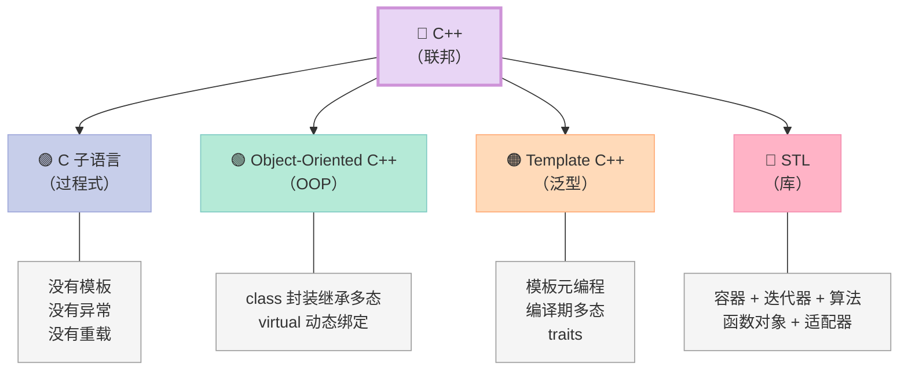
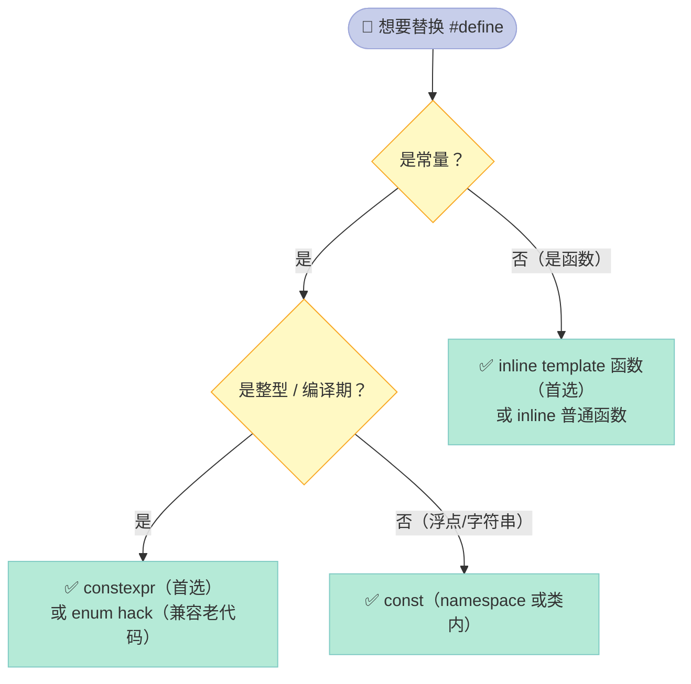
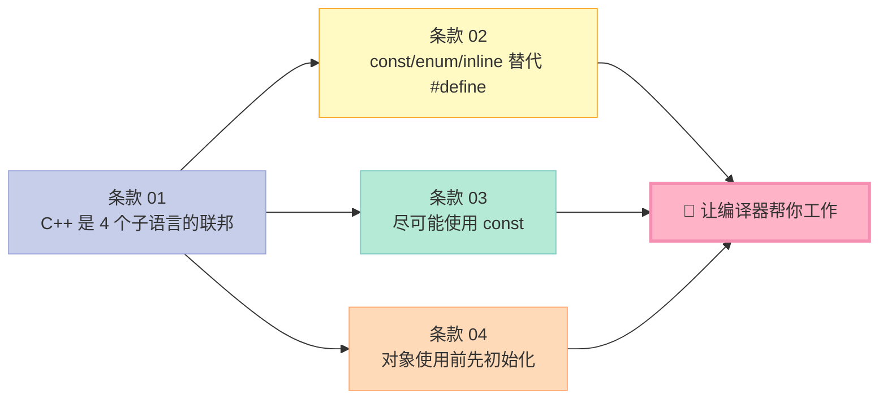

> **一句话核心结论**：C++ 不是"一个语言"，而是 **C、Object-Oriented C++、Template C++、STL** 四个子语言组成的联邦。写好 C++ 的第一步，是先认清"我现在在哪个子语言里"，然后用那个子语言的规则写代码——`const` 是给编译器的契约，初始化是给运行时的人身保险。

---

## 系列导航

| # | 文章 | 状态 |
|:--|:--|:--|
| 0 | [系列总览：55 个条款 × 11 篇文章](/2026/06/18/effective-cpp-00-series-index/) | ✅ 已发布 |
| 1 | [本文：让自己习惯 C++](/2026/06/18/effective-cpp-01-accustom-cplusplus/) | ✅ 已发布 |
| 2 | 构造/析构/赋值：对象生命周期的 5 把钥匙 | 🔜 计划中 |
| 3 | 资源管理：RAII 范式与智能指针 | 🔜 计划中 |
| ... | ... | ... |
| 11 | 杂项 + 总结：编译器警告、TR1、Boost | 🔜 计划中 |

---

## 前言：为什么从"让自己习惯 C++"开始？

Scott Meyers 把全书**第一章**叫"Accustoming Yourself to C++"——"让自己习惯 C++"。这绝不是谦虚地说"先打好基础"。

他在说：**如果你不先改变思维方式，后面 54 个条款你都学不会**。

C++ 程序员最常犯的错，是把它当成"加了 class 的 C"——用 C 的思路写 C++，然后惊讶于"为什么代码这么难维护"。

这一章 4 个条款，是 C++ 思维的"启动器"：

| 条款 | 一句话 |
|------|--------|
| 01 | C++ 是个多范式联邦，规则因地而异 |
| 02 | 让编译器帮你工作，少用 `#define` |
| 03 | `const` 是无敌的——它能让编译器替你挡 50% 的 bug |
| 04 | 永远初始化，**没有例外** |

---

## 一、条款 01：视 C++ 为一个语言联邦

### 1.1 反常识的真相

大部分人以为 C++ 是"一个语言"，包含：

- C 的语法
- class
- template
- STL

但 Scott Meyers 说：**C++ 是 4 个子语言的联邦**——



**关键**：每个子语言的**高效编程守则**不同！

### 1.2 四大子语言的"行为准则"

| 子语言 | 核心思想 | 典型准则 |
|--------|----------|----------|
| **C 子语言** | 过程式 + 内置类型 | 没有模板、没有异常、没有重载；C 的规则 |
| **Object-Oriented C++** | class + 继承 + virtual | 多态、虚函数、public 继承 is-a |
| **Template C++** | 泛型 + 编译期 | 模板元编程、traits、编译期多态 |
| **STL** | 容器 + 迭代器 + 算法 + 函数对象 | 值传递、迭代器代替下标、函数对象代替函数指针 |

### 1.3 实战：同一段代码，4 个子语言的不同写法

```cpp
// ========== C 子语言 ==========
// 过程式思维：函数 + struct，无 class
typedef struct Point { double x, y; } Point;
double dist(Point a, Point b) {
    double dx = a.x - b.x, dy = a.y - b.y;
    return sqrt(dx*dx + dy*dy);
}

// ========== Object-Oriented C++ ==========
// OOP 思维：封装、隐藏实现
class Point {
    double x_, y_;
public:
    Point(double x, double y) : x_(x), y_(y) {}
    double dist(const Point& other) const {
        double dx = x_ - other.x_, dy = y_ - other.y_;
        return std::sqrt(dx*dx + dy*dy);
    }
    // pass-by-reference-to-const（条款 20）
};

// ========== Template C++ ==========
// 泛型：编译期多态，对任何"支持 - 运算"的类型
template<typename T>
T dist(const T& a, const T& b) {
    T dx = a - b;  // 只要 T 支持 - 即可
    return std::sqrt(dx * dx);   // 假设 T 也支持 * 和 sqrt
}

// ========== STL ==========
#include <complex>
// STL：值传递 + 算法 + 容器 + 迭代器
std::complex<double> p1(1.0, 2.0), p2(3.0, 4.0);
double d = std::abs(p1 - p2);  // 内置算法 + 函数对象
```

### 1.4 为什么"子语言不同"这么重要？

因为**同一段代码，在 4 个子语言里"好"的标准不同**：

| 准则 | C | OOP C++ | Template C++ | STL |
|------|---|---------|--------------|-----|
| 参数传递 | 值 | const 引用 | const 引用 | **值**（STL 风格） |
| 错误处理 | 返回码 | 异常 | 异常 | 异常（容器）或函数对象 |
| 复用单位 | 函数 | class | 模板 | 容器 + 算法 |
| 多态 | 函数指针 | 虚函数 | 模板特化 | 迭代器 + 函数对象 |

**一个反例**：

```cpp
// ❌ 在 STL 里用 OOP 思维：传引用给算法
void process(const std::vector<int>& vec) {  // OOP 思维：传引用
    std::sort(vec.begin(), vec.end());
}

// ✅ STL 风格：值传递
// STL 容器被设计为"拷贝很便宜"
void process(std::vector<int> vec) {  // STL 思维：值传递
    std::sort(vec.begin(), vec.end());
    // 调用方需要保留原值时，编译器自动处理 move/copy
}
```

**核心思想**：写代码前先问自己——"我**现在**在哪个子语言里？"

---

## 二、条款 02：尽量以 const、enum、inline 替换 #define

### 2.1 为什么 `#define` 不好？

`#define` 是**预处理器**指令——它做的是简单的文本替换，**不进入编译器的符号表**。

```cpp
#define ASPECT_RATIO 1.653
```

这行代码的问题：

1. **编译错误找不到 `ASPECT_RATIO`**：编译器看到的 `1.653`，符号表里没有 `ASPECT_RATIO`
2. **不会进入调试器**：断点、单步都看不到这个"宏"
3. **不能限定作用域**：除非你 `#undef`，否则全局可见
4. **没有类型检查**：可以拼到任何地方

### 2.2 解决方案 1：`const` 替代宏常量

```cpp
// ❌ #define
#define ASPECT_RATIO 1.653

// ✅ const 常量
const double AspectRatio = 1.653;       // 全局
// 或
const std::string AuthorName = "Scott"; // 字符串同理

// ✅ C++11 起更推荐 constexpr
constexpr double AspectRatio = 1.653;  // 编译期常量，可用于模板参数
```

**对比**：

| 维度 | `#define` | `const` / `constexpr` |
|------|-----------|----------------------|
| 进入符号表 | ❌ | ✅ |
| 调试可见 | ❌ | ✅ |
| 有类型 | ❌ | ✅ |
| 限定作用域 | ❌（除非 `#undef`） | ✅（命名空间、类） |
| 编译器检查 | ❌ | ✅ |

### 2.3 特殊情况：类内的常量

```cpp
class GamePlayer {
    // ❌ 宏不能类内私有
    // #define NUM_TURNS 5

    // ✅ 方案 1：static const 类内声明，类外定义
    static const int NumTurns = 5;   // 声明（一般不放初值，但 const int 是 integral 允许）

    // ✅ 方案 2：C++17 起 inline 变量
    static inline const int NumTurns2 = 5;

    int scores_[NumTurns];
};

// 如果一定要在类外定义
const int GamePlayer::NumTurns;  // C++11 起不需要重复初值
```

**注意**：旧标准下需要类外提供定义。但 `static const int` 作为 integral type 的特例，可以直接取地址。

### 2.4 解决方案 2：`enum` 替代宏的"私有常量"

```cpp
class GamePlayer {
    // ❌ 宏版本
    // #define NUM_TURNS 5

    // ✅ enum hack：行为更像 #define
    enum { NumTurns = 5 };
    int scores_[NumTurns];
};
```

`enum hack` 的两个好处：

1. **不可被取地址**：更接近 `#define` 的行为
2. **不会被 ODR（One Definition Rule）使用**：避免某些模板/继承场景的麻烦

**但**：`enum hack` 是 C++98 时代的"妥协方案"，C++11/14/17 后基本可以用 `constexpr`/`static inline` 替代。

### 2.5 解决方案 3：`inline` 替代宏函数

```cpp
// ❌ 宏函数：参数无类型、不会求值两次
#define MAX(a, b) ((a) > (b) ? (a) : (b))

int x = 5, y = 10;
int m1 = MAX(x++, y++);  // x++ 多次求值！结果不可预期

// ✅ 模板 inline 函数
template<typename T>
inline T max(T a, T b) {  // 编译器会内联
    return a > b ? a : b;
}

int m2 = max(x, y);  // 类型安全、行为可预期
```

**`inline` 的作用**：

| 维度 | `#define` 宏 | `inline` 函数 |
|------|--------------|----------------|
| 类型检查 | ❌ | ✅ |
| 多次求值问题 | ⚠️ 有 | ✅ 没有 |
| 可调试 | ❌ | ✅ |
| 作用域 | 全局 | 命名空间内 |

### 2.6 三种替代的"决策树"



---

## 三、条款 03：尽可能使用 const

### 3.1 `const` 的"无所不能"

`const` 是 C++ 里**最强大的关键字之一**。它可以修饰：

- 指针
- 迭代器
- 函数参数
- 函数返回值
- 成员函数
- 局部变量

```cpp
// 1. 修饰指针
const char* p1 = "hello";      // *p1 不可变（指向 const 数据）
char const* p2 = "hello";      // 同上（const 在 * 左侧）
char* const p3;                // p3 不可变（const 指针）
const char* const p4 = "...";  // 都不可变

// 口诀："*" 左侧是数据，右侧是指针
// const 在 * 左 = 数据 const
// const 在 * 右 = 指针 const

// 2. 修饰迭代器
const std::vector<int>::iterator it = vec.begin();  // it 不可变（类似 T* const）
*it = 10;  // ✅ 可以
++it;      // ❌ 错误

std::vector<int>::const_iterator cit = vec.begin();  // 指向 const 数据
*cit = 10;  // ❌ 错误
++cit;      // ✅ 可以
```

### 3.2 const 成员函数：让编译器替你抓错

```cpp
class TextBlock {
    std::string text_;
public:
    TextBlock(const std::string& t) : text_(t) {}

    // const 版本：返回 const char&，不能改
    const char& operator[](size_t pos) const {
        return text_[pos];
    }

    // non-const 版本：返回 char&，可以改
    char& operator[](size_t pos) {
        return text_[pos];
    }
};

void print(const TextBlock& tb) {
    std::cout << tb[0];  // 调用 const 版本
    tb[0] = 'X';         // ❌ 编译错误！
}
```

**两个 `operator[]` 重载的妙用**：

```cpp
TextBlock tb("Hello");
const TextBlock ctb("World");

tb[0] = 'h';   // ✅ 调用 non-const 版本，返回 char&
ctb[0] = 'w';  // ❌ 编译错误，const TextBlock 只能调用 const 版本
```

这就是 **const 正确性（const correctness）**——让你的代码"自描述"，让编译器帮你挡住非法操作。

### 3.3 const 成员函数能不能修改成员？—— `mutable`

```cpp
class CachedData {
    mutable std::mutex mu_;  // mutable：const 函数中也能修改
    mutable int cache_value_;  // 缓存变量：逻辑上是"读"，但物理上是"写"
    int compute() const;
public:
    int get_value() const {
        std::lock_guard<std::mutex> lock(mu_);
        if (cache_valid_) return cache_value_;
        cache_value_ = compute();  // const 函数中也能写
        cache_valid_ = true;
        return cache_value_;
    }
};
```

**`mutable` 释放了 const 函数的"非物理修改"限制**——但你**必须**保证"用户感知不到修改"。

### 3.4 const 成员函数 vs non-const 成员函数：避免代码重复

```cpp
class TextBlock {
    std::string text_;
public:
    const char& operator[](size_t pos) const {
        // ... 大量代码
        return text_[pos];
    }

    // ✅ 复用 const 版本：转型 + 调用
    char& operator[](size_t pos) {
        return const_cast<char&>(
            static_cast<const TextBlock&>(*this)[pos]
        );
    }
};
```

**反向调用原则**：non-const 版本调用 const 版本（用 `const_cast` 去掉 const），不要反过来。

---

## 四、条款 04：确定对象被使用前已先被初始化

### 4.1 C++ 初始化的"恐怖现实"

C++ 里"对象的初始化"是**最容易出错**的地方——因为 C++ 保证：

> **对内置类型，初始化是程序员的责任；对类类型，初始化由构造函数负责。**

但现实是：

```cpp
// ❌ 未初始化
int x;                  // x 的值是"不确定的"（栈上残留值）
char* buf = new char[1024];  // buf 指向未初始化的 1024 字节

// ❌ "未初始化的非成员对象"：C++ 不会帮你做
int* p;  // p 指向哪里？不知道！

class Widget {
    int i_;  // 如果不写构造函数，i_ 的值是？
};
```

### 4.2 初始化 vs 赋值的本质区别

```cpp
// ❌ 赋值（看似初始化，实则先默认构造再赋值）
class PhoneNumber { /*...*/ };

class ABEntry {
    std::string name_;
    PhoneNumber phone_;
    int age_;
public:
    ABEntry(const std::string& name, const PhoneNumber& phone, int age) {
        name_ = name;        // 1. 调用 string 默认构造
        phone_ = phone;      // 2. 调用 PhoneNumber 默认构造
        age_ = age;          // 3. 赋值
        // 4. 函数体执行
    }
};
```

**这个版本做了什么？**

1. `name_` 用 `string()` 默认构造
2. `phone_` 用 `PhoneNumber()` 默认构造
3. `age_` 是内置类型，**不构造**（值不确定）
4. 然后才是赋值

**等等！** `age_` 在赋值前还是不确定的吗？是的——对内置类型成员，C++ **不保证**它在赋值前是 0。

### 4.3 正确的写法：成员初始化列表

```cpp
// ✅ 成员初始化列表：一步构造
class ABEntry {
    std::string name_;
    PhoneNumber phone_;
    int age_;
public:
    ABEntry(const std::string& name, const PhoneNumber& phone, int age)
        : name_(name), phone_(phone), age_(age)   // 一次构造，参数直接传入
    {}
};
```

**成员初始化列表的优势**：

| 维度 | 函数体内赋值 | 成员初始化列表 |
|------|-------------|----------------|
| 次数 | 默认构造 + 赋值 | 一次构造 |
| 性能 | 低（额外一次构造） | 高 |
| 内置类型 | **不保证**初始化前是 0 | 保证已初始化 |
| const 成员 | 不能赋值 | 必须用列表 |
| 引用成员 | 不能赋值 | 必须用列表 |

### 4.4 成员初始化的顺序：声明顺序决定！

**经典坑**：

```cpp
// ❌ 顺序错误：构造函数看起来是 b_ → a_
class Widget {
    int a_;
    int b_;
public:
    Widget(int val) : b_(val), a_(b_) {}  // 灾难！
};
```

**实际初始化顺序**：按**类中成员声明的顺序**进行，与初始化列表顺序无关！

```cpp
// 类中声明顺序：a_ 在前，b_ 在后
// 所以：先 a_(b_)，后 b_(val)
// 1. a_ 用 b_ 的值初始化 → b_ 还没初始化！
// 2. b_ 用 val 初始化

// ❌ 实际结果：a_ 是不确定值，b_ 是 val
```

**最佳实践**：初始化列表顺序与声明顺序**保持一致**，编译器会发出 `-Wreorder` 警告。

### 4.5 "非成员对象" 的初始化

```cpp
// ❌ 文件作用域的对象："static initialization order fiasco"
class FileSystem { /*...*/ };
FileSystem theFileSystem;  // 什么时候构造？什么时候销毁？

// 解决方案 1：把"全局对象"放进函数（Singleton 模式）
class FileSystem { /*...*/ };
FileSystem& getFileSystem() {
    static FileSystem fs;  // 第一次调用时构造，C++11 后线程安全
    return fs;
}

// 解决方案 2：用 Nifty Counter / Schwarz Counter 模式（少见）
```

**核心原则**：**避免文件作用域的对象**——它们的初始化顺序不可控。

### 4.6 跨编译单元的初始化顺序问题

```cpp
// a.cpp
extern Widget w;  // 声明
// 实际定义在 b.cpp
```

`w` 在 `a.cpp` 使用时，可能在 `b.cpp` 中的 `w` 还没构造完成！

**解决方案**：用函数包装（见 4.5）。

### 4.7 综合实践：完美的类设计模板

```cpp
class PerfectClass {
    // 1. 成员按声明顺序排列（先 const，后普通）
    const int max_size_;
    std::string name_;
    int counter_;
    std::vector<int> data_;

public:
    // 2. 默认构造：使用 in-class 初始化
    PerfectClass()
        : max_size_(100),        // 3. 显式列出来
          name_("default"),
          counter_(0),
          data_()                // 4. 总是初始化 vector
    {}

    // 5. 参数化构造：成员初始化列表
    PerfectClass(const std::string& name, int max_size)
        : max_size_(max_size),    // 6. 顺序与声明一致
          name_(name),
          counter_(0),
          data_()
    {}

    // 7. 拷贝构造 / 拷贝赋值 / 析构 留到条款 5-12
};
```

**核心原则**：

1. 永远用成员初始化列表
2. 初始化顺序与声明顺序一致
3. 内置类型也要在初始化列表里显式初始化
4. 避免文件作用域对象

---

## 五、4 个条款的内在联系



**三个条款的共同主题**：

> **让编译器做你应做的工作**——而不是把责任推给运行时。
>
> - 条款 02：让编译器知道常量（而不是预处理器）
> - 条款 03：让编译器保证不变性（而不是文档）
> - 条款 04：让构造函数保证初始化（而不是运行时检查）

---

## 六、常见误区与陷阱

### 6.1 `const` 误用 1：把 `const` 放在错误位置

```cpp
// ❌ 反例：把 const 放在函数后面（误以为是返回类型）
const int foo() const {  // 两个 const：返回 const int + 函数是 const 成员
    return 42;
}

// ✅ 完整 const 成员函数
class Widget {
    int x_;
public:
    int getX() const { return x_; }  // 函数不修改 *this
};
```

### 6.2 `const` 误用 2：忘了 `const` 修饰函数参数

```cpp
// ❌ 参数是 const，应该用 const 引用
void process(std::string s);  // 传值，拷贝

// ✅ 避免拷贝 + 承诺不修改
void process(const std::string& s);
```

### 6.3 初始化误用 1：在构造函数体内初始化

```cpp
// ❌ 默认构造 + 赋值（低效）
class Widget {
    std::string name_;
public:
    Widget(const std::string& name) { name_ = name; }  // 先默认构造，再赋值
};

// ✅ 直接构造（高效）
class Widget {
    std::string name_;
public:
    Widget(const std::string& name) : name_(name) {}  // 一次构造
};
```

### 6.4 初始化误用 2：成员初始化顺序错乱

```cpp
// ❌ 顺序错乱（编译器会警告 -Wreorder）
class Widget {
    int a_;
    int b_;
public:
    Widget() : b_(1), a_(b_) {}  // 灾难！a_ 用未初始化的 b_ 初始化
};

// ✅ 顺序正确
class Widget {
    int a_;
    int b_;
public:
    Widget() : a_(1), b_(2) {}  // 与声明顺序一致
};
```

### 6.5 `#define` 滥用 1：宏函数中的副作用

```cpp
// ❌ 宏函数：参数多次求值
#define SQUARE(x) ((x) * (x))

int i = 5;
int s = SQUARE(i++);  // 实际：i++ * (i++ + 1) 或类似，结果不可预期

// ✅ 内联函数
inline int square(int x) { return x * x; }
int s2 = square(i++);  // i 一定 +1 一次，结果可预期
```

---

## 七、C++11/14/17 的演进

| 条款 | C++98 时代 | C++11/14/17 时代 |
|------|------------|-----------------|
| 01 | "C with classes" 思维 | 加入 `auto`、lambda、concepts |
| 02 | `enum hack` 解决 | `constexpr`、`static inline` 替代 |
| 03 | 手动 const 正确性 | `constexpr` 函数、概念约束 |
| 04 | 成员初始化列表 | "in-class 初始化" 更方便 |

**示例：in-class 初始化（C++11 起）**：

```cpp
class Widget {
    // C++11 起：可以直接在类内给初值
    int x_ = 0;
    std::string name_ = "default";
    std::vector<int> data_ = {1, 2, 3};  // 直接初始化

public:
    // 构造函数可以只关心"与默认不同的部分"
    Widget() = default;
    Widget(const std::string& name) : name_(name) {}  // 只覆盖 name_
};
```

---

## 八、面试高频考点

### 8.1 必背题

| 题目 | 答案要点 |
|------|----------|
| C++ 是面向对象的语言吗？ | 不是，它是**多范式联邦**——C/OOP/Template/STL |
| `#define` 和 `const` 有什么区别？ | `#define` 是预处理器，**不进入符号表**；`const` 是编译器管理，有类型检查 |
| `const char*` 和 `char* const` 区别？ | 前者数据不可变，后者指针不可变 |
| 成员初始化列表 vs 函数体内赋值？ | 列表**一次构造**；赋值是**默认构造 + 赋值**，低效 |
| 为什么内置类型也要在初始化列表里？ | C++ 不保证内置类型在赋值前是 0 |

### 8.2 高频追问

| 追问 | 关键点 |
|------|--------|
| `const` 成员函数能修改 `mutable` 成员吗？ | 可以——`mutable` 是为 const 函数的"逻辑常量"准备的 |
| 静态成员变量怎么初始化？ | 类内声明，类外定义（C++17 起 `inline` 变量例外） |
| 跨编译单元的全局对象初始化顺序？ | 不可控！避免使用文件作用域对象，用函数包装 |
| `constexpr` 和 `const` 区别？ | `constexpr` 一定是编译期常量；`const` 可能是运行时常量 |
| in-class 初始化 vs 成员初始化列表？ | in-class 给默认值，列表覆盖——两者结合效果最佳 |

---

## 九、配套实验

### 9.1 实验 1：const 的"无所不能"

```cpp
// 文件：const_demo.cpp
#include <iostream>
#include <vector>
#include <string>

class TextBlock {
    std::string text_;
public:
    TextBlock(const std::string& t) : text_(t) {}

    // const 和 non-const 两个版本
    const char& operator[](size_t pos) const {
        std::cout << "  [const version called]\n";
        return text_[pos];
    }
    char& operator[](size_t pos) {
        std::cout << "  [non-const version called]\n";
        return text_[pos];
    }
};

int main() {
    TextBlock tb("Hello");
    const TextBlock ctb("World");

    char c1 = tb[0];         // 调用 non-const
    const char& c2 = ctb[0]; // 调用 const

    tb[0] = 'h';             // ✅ OK
    // ctb[0] = 'w';        // ❌ 编译错误

    return 0;
}
```

**编译运行**：

```bash
g++ -std=c++17 -Wall const_demo.cpp -o const_demo
./const_demo
```

### 9.2 实验 2：成员初始化顺序

```cpp
// 文件：init_order.cpp
#include <iostream>

class Widget {
    int a_;
    int b_;
public:
    Widget(int val) : b_(val), a_(b_) {  // ❌ 错误的顺序
        std::cout << "a_ = " << a_ << ", b_ = " << b_ << "\n";
    }
};

int main() {
    Widget w(10);  // a_ 是不确定值！
    return 0;
}
```

**编译警告**：

```bash
g++ -std=c++17 -Wall -Wextra init_order.cpp -o init_order
# warning: 'Widget::b_' will be initialized after [-Wreorder]
# warning: 'Widget::a_' [-Wreorder]
```

### 9.3 实验 3：语言联邦的"风格切换"

```cpp
// 文件：federation.cpp
#include <iostream>
#include <vector>
#include <algorithm>
#include <complex>

int main() {
    // ====== C 子语言风格 ======
    int arr[] = {5, 2, 8, 1, 9};
    std::sort(arr, arr + 5);  // 指针 + 长度

    // ====== OOP C++ 风格 ======
    std::vector<int> vec = {5, 2, 8, 1, 9};
    std::sort(vec.begin(), vec.end());  // 迭代器

    // ====== STL 风格 ======
    std::sort(vec.begin(), vec.end(),
              [](int a, int b) { return a > b; });  // 函数对象

    // ====== Template C++ 风格 ======
    auto max_val = [](auto a, auto b) { return a > b ? a : b; };
    std::cout << max_val(3, 5) << "\n";

    return 0;
}
```

---

## 十、回到条款：4 条黄金法则

| 条款 | 黄金法则 |
|------|----------|
| 01 | 先想"我在哪个子语言"，再写代码 |
| 02 | `#define` 用于条件编译，**不用于常量和函数** |
| 03 | `const` 是你的朋友，**能加就加** |
| 04 | 永远用成员初始化列表，**顺序与声明一致** |

---

## 十一、结尾思考题

> **思考题 1**：以下代码的 `sizeof(Widget)` 是多少？为什么？

```cpp
class Widget {
    const int kMaxSize;
    int data_;
    mutable int access_count_;
    static int total_count_;
public:
    Widget() : kMaxSize(100), data_(0), access_count_(0) {}
};
```

> **思考题 2**：为什么 C++ 不保证内置类型成员被自动初始化？C++11/17 之后有什么改进吗？

> **思考题 3**：以下代码是 const 正确的吗？哪里可以改进？

```cpp
class Matrix {
    double data_[4][4];
public:
    double& at(int i, int j) { return data_[i][j]; }
    double at(int i, int j) const { return data_[i][j]; }
};
```

> **思考题 4**：C++ 的"语言联邦"模型，对你现在的项目有什么启示？

---

## 十二、本篇速查表

| 主题 | 关键 API / 模式 | 适用场景 |
|------|----------------|----------|
| 4 个子语言 | C / OOP C++ / Template C++ / STL | 决定编码风格 |
| `const` 修饰 | 指针、迭代器、参数、返回值、成员函数 | 所有"承诺不变"的地方 |
| `constexpr` | 编译期常量 | 数组大小、模板参数 |
| `enum hack` | 类内私有整型常量 | 兼容老代码、避免取地址 |
| 成员初始化列表 | `: member_(value)` | **所有构造函数必须用** |
| in-class 初始化 | `int x_ = 0;` | C++11 起的默认初值 |
| `mutable` | `mutable T x_;` | const 函数的"逻辑修改" |
| `inline` 函数 | `template<typename T> inline T f(...)` | 替代宏函数 |

---

## 十三、系列导航

| # | 文章 | 状态 |
|:--|:--|:--|
| 0 | [系列总览](/2026/06/18/effective-cpp-00-series-index/) | ✅ 已发布 |
| 1 | [本文：让自己习惯 C++](/2026/06/18/effective-cpp-01-accustom-cplusplus/) | ✅ 已发布 |
| 2 | 构造/析构/赋值：对象生命周期的 5 把钥匙 | 🔜 计划中 |
| 3 | 资源管理：RAII 范式与智能指针 | 🔜 计划中 |
| ... | ... | ... |
| 11 | 杂项 + 总结 | 🔜 计划中 |

---

**下一篇**：第 2 篇《构造/析构/赋值：对象生命周期的 5 把钥匙》——条款 5-12 一起讲透 C++ 对象的"生老病死"：编译器默默生成的 4 个函数、虚析构的必要性、operator= 的自我赋值陷阱、Rule of Three 的完整实现。

> **行动建议**：
> 1. **今天**：翻一下你的 C++ 项目，把所有 `#define` 常量替换成 `const`/`constexpr`
> 2. **今天**：给所有"只读"的成员函数补上 `const` 关键字
> 3. **本周**：把所有"裸成员"加上 in-class 默认初始化
> 4. **思考**：你的项目里哪些地方应该加 `mutable`？哪些不该加？
