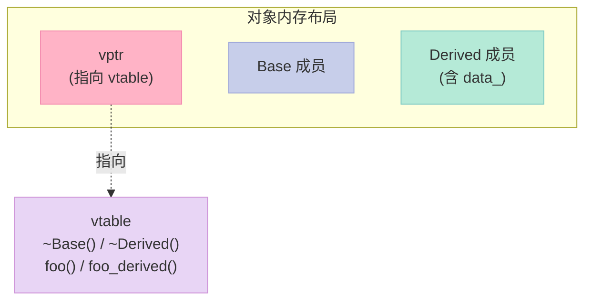

> **一句话核心结论**：C++ 编译器会**默默为你**生成默认构造、拷贝构造、拷贝赋值、析构 4 个函数——但**默默生成 ≠ 默默正确**。本章 8 个条款教你怎么把"对象生命周期"这 5 把钥匙握在自己手里：`virtual` 析构、`= delete`、构造析构中勿调虚函数、`operator=` 的 copy-and-swap 范式、Rule of Three 的完整实现。

---

## 系列导航

| # | 文章 | 状态 |
|:--|:--|:--|
| 0 | [系列总览](/2026/06/18/effective-cpp-00-series-index/) | ✅ 已发布 |
| 1 | [让自己习惯 C++](/2026/06/18/effective-cpp-01-accustom-cplusplus/) | ✅ 已发布 |
| 2 | [本文：构造/析构/赋值](/2026/06/18/effective-cpp-02-constructors-destructors/) | ✅ 已发布 |
| 3 | 资源管理：RAII 范式与智能指针 | 🔜 计划中 |
| ... | ... | ... |

---

## 前言：为什么"对象生命周期"是 C++ 最难的部分？

C 是面向过程的——`malloc` 给你一块内存，`free` 还给系统。配对好，game over。

C++ 是面向对象的——你**声明**一个对象，编译器帮你**构造**；你**不再使用**，编译器帮你**析构**。看起来"自动"，但**所有的"自动"都隐含了选择**：

- 谁来构造？（编译器生成的默认构造？用户编写的？）
- 怎么拷贝？（浅拷贝？深拷贝？禁止拷贝？）
- 怎么析构？（栈展开？delete？`virtual`？）
- 异常时怎么清理？（栈展开时析构顺序？）

**对象生命周期（Object Lifetime）** 是 C++ 区别于 C、Java 的核心复杂度。本章 8 个条款就是这本"生命周期手册"。

---

## 一、条款 05：了解 C++ 默默编写并调用哪些函数

### 1.1 一个反常识的实验

```cpp
// 空的类，编译器会做什么？
class Empty {};

Empty e1;           // 默认构造
Empty e2(e1);       // 拷贝构造
Empty e3 = e1;      // 拷贝构造（初始化语义）
e1 = e2;            // 拷贝赋值
// e1.~Empty();    // 析构（隐式调用）
```

**反常识的答案**：编译器**默默为你写了 4 个函数**：

```cpp
// 编译器实际生成的版本（简化）
class Empty {
public:
    Empty() = default;                           // 默认构造
    Empty(const Empty& other) = default;          // 拷贝构造
    Empty& operator=(const Empty& other) = default; // 拷贝赋值
    ~Empty() = default;                           // 析构
};
```

### 1.2 这 4 个函数何时被"默默生成"？

| 函数 | 触发条件 | 是否总是生成？ |
|------|----------|----------------|
| **默认构造** | 类中没有**任何**用户声明的构造函数 | 否——一旦你写了构造函数，默认构造就不存在 |
| **拷贝构造** | 类中没有**用户声明**的拷贝构造（即 `T(const T&)`） | 仅在用到时生成 |
| **拷贝赋值** | 类中没有**用户声明**的拷贝赋值（即 `operator=(const T&)`） | 仅在用到时生成 |
| **析构** | 类中没有**用户声明**的析构 | C++11 起**总是**生成（即使你不写） |

**C++11 之前的细微差别**：C++98 中，如果基类的析构是 `virtual`，派生类的"默默析构"也总是 `virtual`。C++11 起这条规则泛化。

### 1.3 "默默生成"的内容是什么？

**对内置类型成员**：直接拷贝二进制（浅拷贝）。

```cpp
class NameObject {
public:
    std::string nameValue;
    int objectValue;
};

// 编译器生成的拷贝构造
// NameObject(const NameObject& other)
//     : nameValue(other.nameValue),      // string 的拷贝构造
//       objectValue(other.objectValue)   // int 的拷贝（位拷贝）
// {}
```

**对类类型成员**：调用该成员的拷贝构造。

**对引用成员和 const 成员**：

```cpp
class Widget {
    std::string& nameRef_;  // 引用成员
    const int id_;           // const 成员
};

Widget w1, w2;
w1 = w2;  // ❌ 编译错误：nameRef_ 不能被赋值（引用不可重新绑定）
            // id_ 不能被赋值（const）
```

**编译器不会为"含有引用或 const 成员"的类生成 `operator=`**——但它**仍然会生成拷贝构造**（拷贝构造可以初始化引用和 const）。

### 1.4 关键的"非生成"情况

```cpp
class Base {
public:
    Base(const Base&) = delete;  // 显式禁止
};

class Derived : public Base {
    // 编译器不会为 Derived 生成拷贝构造！
    // 因为基类的拷贝构造被 delete 了
};

Derived d1, d2(d1);  // ❌ 编译错误
```

C++11 之前的旧标准下，基类的"私有拷贝构造"会让派生类无法生成拷贝构造——这是经典的"悄悄崩盘"陷阱。

### 1.5 实战应用：什么时候依赖"默默生成"？

**可以依赖的情况**：

```cpp
// ✅ 类内只有内置类型 / 值语义的成员
class Point {
    int x_, y_;
    // 编译器生成的拷贝/赋值 = 内存拷贝 = 正确
};

// ✅ 类的所有成员都正确实现了拷贝
class Person {
    std::string name_;
    int age_;
    // string 正确处理深拷贝，int 是值类型
    // 编译器生成的拷贝 = 成员逐一拷贝 = 正确
};
```

**不能依赖的情况**：

```cpp
// ❌ 含"原始指针"成员
class String {
    char* data_;
    size_t size_;
    // 编译器生成的拷贝 = 浅拷贝 = 灾难！
    // 两个 String 会指向同一块内存
};
```

### 1.6 编译器生成的函数 vs `= default`

```cpp
class Widget {
public:
    Widget() = default;  // 显式要求编译器生成
    Widget(const Widget&) = default;
    Widget& operator=(const Widget&) = default;
    ~Widget() = default;
};
```

`= default` 告诉编译器："**我显式要求你按默认方式生成**"——这在 C++11 之后是更清晰的写法。

### 1.7 关键启示

1. **不要相信"空类没成本"**——空类也有 1 字节大小（确保不同对象有不同地址）
2. **C++ 的"零规则"是首选**——成员都是值语义的，就让编译器生成 4 个函数
3. **遇到"原始指针"成员，立即警觉**——可能需要 Rule of Three

---

## 二、条款 06：若不想使用编译器自动生成的函数，就该明确拒绝

### 2.1 经典场景：不可拷贝的类

```cpp
// 场景：每个公司只有唯一的 CEO，类不应该被拷贝
class CEO {
    std::string name_;
    // 不写任何拷贝函数——但编译器会"贴心"地生成
};

CEO a, b;
a = b;  // 灾难：现在有两个 CEO
```

### 2.2 解决方案：C++11 之前的"友元 + 私有"

```cpp
class CEO {
public:
    CEO() = default;
private:
    CEO(const CEO&);             // 私有拷贝构造
    CEO& operator=(const CEO&);  // 私有拷贝赋值
    // 注意：只声明，不定义！
};

// 使用
CEO a, b;
a = b;           // ❌ 编译错误：operator= 是 private
CEO c(a);        // ❌ 编译错误：拷贝构造是 private
```

**为什么"只声明不定义"？** 防止"友元函数不小心调用拷贝构造"——如果函数有定义，友元函数能访问 private 成员；如果只有声明，链接会失败（未定义符号）。

### 2.3 解决方案：C++11 起的 `= delete`

```cpp
class CEO {
public:
    CEO() = default;
    CEO(const CEO&) = delete;             // 显式禁止
    CEO& operator=(const CEO&) = delete;  // 显式禁止
    // 不需要 private 了
};
```

`= delete` 的优势：

| 维度 | 友元 + 私有 | `= delete` |
|------|--------------|------------|
| 错误信息 | "private 不可访问" | "已删除函数"——更清晰 |
| 友元能调用吗？ | 能（虽然罕见） | **不能**——任何情况都拒绝 |
| C++98 兼容 | ✅ | ❌（C++11+） |

### 2.4 `= delete` 的更多用途

```cpp
// 1. 禁止特定类型的重载
void process(int x);
void process(double x) = delete;   // 禁止 double

process(3.14);  // ❌ 编译错误

// 2. 禁止模板特化
template<typename T> void foo(T*);  // 通用版本
template<> void foo<void>(void*) = delete;  // 禁止 void*

// 3. 禁止不期望的隐式转换
class Widget {
public:
    Widget(int) {}            // 允许 int
    Widget(double) = delete;  // 禁止 double（避免精度问题）
};

Widget w(3.14);  // ❌ 编译错误
```

### 2.5 派生类中的"拒绝"会被继承

```cpp
class Base {
public:
    Base(const Base&) = delete;
};

class Derived : public Base {
    // 自动拒绝拷贝——不需要再次 delete
};

Derived d1, d2(d1);  // ❌ 编译错误
```

**反过来的"陷阱"**：

```cpp
class Base {
public:
    Base(const Base&) = default;  // 允许
};

class Derived : public Base {
public:
    Derived(const Derived&) = delete;  // 显式拒绝
};

Derived d1, d2(d1);  // ❌ 编译错误

// 但：基类的拷贝构造仍然能调用（通过切片）
Derived d;
Base& b = d;  // OK
Base b2(d);   // 不会调用 Derived 的拷贝构造（已被 delete）
```

### 2.6 关键启示

1. **遇到"独一无二"语义的对象，第一时间想到 `= delete`**
2. **`= delete` 应该在声明时就写**——而不是等出现 bug 再补
3. **C++11 之前用"友元 + 私有"**——C++11 之后用 `= delete`

---

## 三、条款 07：为多态基类声明 virtual 析构函数

### 3.1 经典灾难：派生类对象只析构基类部分

```cpp
// ❌ 反例：基类析构不是 virtual
class Base {
public:
    ~Base() { std::cout << "~Base()\n"; }
};

class Derived : public Base {
    int* data_;
public:
    Derived() : data_(new int[100]) {}
    ~Derived() {
        std::cout << "~Derived()\n";
        delete[] data_;  // 释放派生类独有的资源
    }
};

Derived* p = new Derived();
Base* pb = p;  // 隐式 upcast（多态）
delete pb;     // 灾难！只调用 ~Base()，~Derived() 中的 delete[] 不会执行
```

**输出**：

```text
~Base()
```

`~Derived()` 没被调用，`data_` 指向的 100 个 int 泄漏了！

### 3.2 解决方案：virtual 析构

```cpp
// ✅ 方案：基类析构是 virtual
class Base {
public:
    virtual ~Base() { std::cout << "~Base()\n"; }
};

class Derived : public Base {
    int* data_;
public:
    Derived() : data_(new int[100]) {}
    ~Derived() override {  // C++11 后加 override 更安全
        std::cout << "~Derived()\n";
        delete[] data_;
    }
};

Base* pb = new Derived();
delete pb;  // ✅ 调用 ~Derived()，然后 ~Base()
```

**输出**：

```text
~Derived()
~Base()
```

### 3.3 virtual 析构的工作原理



`delete pb` 的执行流程：

1. 通过 `pb` 找到对象的 `vptr`
2. 查 `vtable` 找到**实际类型**（Derived）的析构函数
3. 调用 `~Derived()`（释放 `data_`）
4. 调用 `~Base()`（析构基类部分）

### 3.4 什么时候**不需要** virtual 析构？

不是所有基类都要 `virtual` 析构。判断标准：

| 场景 | 析构是否 virtual？ |
|------|---------------------|
| **多态基类**（有其他虚函数） | ✅ 必须是 virtual |
| **作为基类被继承 + 通过基类指针删除** | ✅ 必须是 virtual |
| **不被继承**（如 `std::string`、`std::vector`） | ❌ 不要 virtual |
| **纯资源容器**（如 RAII 包装） | ❌ 不要 virtual |
| **`final` 类**（C++11 起） | ❌ 不会被继承 |

**反例**：

```cpp
// ❌ 不要给"不会被继承的类"加 virtual
class Point {
    int x_, y_;
public:
    virtual ~Point();  // 浪费 vptr 空间（+8 bytes），还降低性能
};
```

**反例**：

```cpp
// ❌ 标准库的类几乎都不设计为基类
std::string s;  // s 的析构不是 virtual
class MyString : public std::string {};  // 灾难！delete via base* 会有 UB
```

### 3.5 抽象基类的"纯虚析构"

有时候你想让基类**无法被实例化**（抽象），但又需要"析构"语义：

```cpp
// ✅ 纯虚析构：类成为抽象，且派生类必须实现
class AbstractBase {
public:
    virtual ~AbstractBase() = 0;  // 纯虚析构
};

AbstractBase::~AbstractBase() = default;  // 必须提供定义！

// 派生类
class Concrete : public AbstractBase {
public:
    ~Concrete() override {
        // 析构逻辑
    }
};

// AbstractBase ab;  // ❌ 抽象类，不能实例化
Concrete c;          // ✅ OK
```

**陷阱**：纯虚析构**必须**在类外提供定义——否则链接器报"undefined reference"。

### 3.6 virtual 析构的"成本"

| 成本 | 数量级 | 说明 |
|------|--------|------|
| vptr 指针 | 8 bytes/对象 | 每个对象多一个指针 |
| vtable 项 | 8 bytes/类 | 每张 vtable 多一项 |
| 调用开销 | 一次间接寻址 | 几乎可忽略（编译器会优化） |
| 阻止空基类优化 | 视情况 | 可能影响内存布局 |

**一般原则**：能接受这 8 bytes 的，就用 virtual。

### 3.7 关键启示

1. **多态基类的析构必须是 virtual**——这是 C++ 的一条"铁律"
2. **不要给"不会被继承"的类加 virtual**——浪费内存
3. **C++ 标准库的类（除 `std::enable_shared_from_this` 等少数）都不是多态基类**——不要继承它们

---

## 四、条款 08：别让异常逃离析构函数

### 4.1 析构函数抛异常的灾难

```cpp
// ❌ 析构函数抛出异常
class Widget {
public:
    ~Widget() {
        if (!connection_.close()) {
            throw std::runtime_error("Connection close failed");
        }
    }
};
```

**问题 1：C++ 析构期间**（stack unwinding）**有第二个异常 → `std::terminate`**

```cpp
void process() {
    Widget w1, w2;  // 局部对象
    throw std::runtime_error("oops");  // 1. 抛出异常
    // 栈展开：调用 w2.~Widget()
    // w2.~Widget() 抛出异常！→ std::terminate
}
```

**问题 2：析构函数"应该"完成清理工作，抛异常会破坏不变量**

### 4.2 解决方案 1：吞下异常 + 记录

```cpp
// ✅ 方案 1：析构函数吞下异常
class Widget {
public:
    ~Widget() {
        try {
            connection_.close();
        } catch (const std::exception& e) {
            // 记录日志，但不抛
            std::cerr << "Failed to close: " << e.what() << "\n";
            // 吞下异常
        }
    }
};
```

### 4.3 解决方案 2：把操作放在普通函数中

```cpp
// ✅ 方案 2：把"可能抛异常"的操作放在普通函数
class Widget {
public:
    // 普通函数：让用户处理异常
    void close() {
        if (!connection_.close()) {
            throw std::runtime_error("close failed");
        }
        closed_ = true;
    }

    // 析构函数：兜底，最坏情况吞异常
    ~Widget() {
        if (!closed_) {
            try {
                connection_.close();
            } catch (...) {
                // 记录 + 吞下
                std::cerr << "Close failed in dtor\n";
            }
        }
    }
};

void process() {
    Widget w;
    w.close();  // 用户主动调用，能处理异常
    // ...
    // 析构：兜底
}
```

**两种方案的对比**：

| 方案 | 优点 | 缺点 |
|------|------|------|
| 吞下异常 | 简单 | 错误被吞掉，调试困难 |
| 普通函数 + 析构兜底 | 显式，让用户处理 | 需要用户记得调用 |

### 4.4 更复杂的场景：两个对象都析构

```cpp
void process() {
    Widget w1, w2;
    // ... 抛异常
    // 栈展开：w2.~Widget() 抛异常 → 已经在栈展开中 → terminate
}
```

**核心原则**：

> **析构函数应该"承诺不抛"——通过 `noexcept` 明确告诉编译器。**

```cpp
class Widget {
public:
    ~Widget() noexcept;  // C++11 起：明确声明
};
```

### 4.5 关键启示

1. **析构函数绝对不应该抛异常**——这是 C++ 的一条铁律
2. **C++11 起的析构函数默认 `noexcept`**——明确写出来更好
3. **把"可能失败"的操作抽到普通函数**——让用户主动调用

---

## 五、条款 09：绝不在构造和析构过程中调用 virtual 函数

### 5.1 反常识的实验

```cpp
class Base {
public:
    Base() {
        std::cout << "Base ctor\n";
        init();
    }
    virtual void init() {
        std::cout << "Base::init()\n";
    }
    virtual ~Base() {
        std::cout << "Base dtor\n";
        cleanup();
    }
    virtual void cleanup() {
        std::cout << "Base::cleanup()\n";
    }
};

class Derived : public Base {
public:
    Derived() {
        std::cout << "Derived ctor\n";
    }
    void init() override {
        std::cout << "Derived::init()\n";
    }
    ~Derived() {
        std::cout << "Derived dtor\n";
    }
    void cleanup() override {
        std::cout << "Derived::cleanup()\n";
    }
};

// 测试
Derived d;
```

**输出**：

```text
Base ctor
Base::init()      ← 灾难！调的是 Base::init()，不是 Derived::init()！
Derived ctor
Derived dtor
Base dtor
Base::cleanup()   ← 同样，调的是 Base::cleanup()！
```

**为什么？** 构造 Derived 时，**先构造 Base 部分**——此时对象的类型是"正在构造的 Base"，**vptr 指向 Base 的 vtable**。Derived 部分还没初始化。

### 5.2 这个 bug 的危险性

```cpp
class Base {
    int x_;
public:
    Base() {
        // 调用虚函数，期望派生类重写
        // 但此时派生类的成员还没初始化！
        logConstruction();
    }
    virtual void logConstruction() {
        std::cout << "Base constructed, x_ = " << x_ << "\n";
    }
};

class Derived : public Base {
    std::string data_;  // 派生类独有的成员
public:
    Derived() : Base(), data_("hello") {
        // 此时 data_ 还没构造！
    }
    void logConstruction() override {
        std::cout << "Derived constructed, data_ = " << data_ << "\n";
        // 灾难：data_ 是未初始化的 string！
    }
};
```

### 5.3 解决方案：两段式构造

```cpp
// ✅ 方案 1：把"调用虚函数"改为"调用普通函数"
class Base {
    int x_;
public:
    Base() : x_(0) {
        // 不调虚函数
    }
    // 普通函数：派生类可以重写
    void logConstruction() {
        std::cout << "Base constructed, x_ = " << x_ << "\n";
    }
};

class Derived : public Base {
    std::string data_;
public:
    Derived() : Base(), data_("hello") {
        // 派生类构造时，data_ 已初始化
        logConstruction();  // ✅ OK
    }
};
```

### 5.4 解决方案：让派生类主动调用

```cpp
// ✅ 方案 2：派生类的构造函数主动调用
class Base {
public:
    Base() {
        // 不要在这里调虚函数
    }
    virtual void onConstruction() {
        // 虚函数
    }
};

class Derived : public Base {
public:
    Derived() : Base() {
        // 派生类构造完后再调
        onConstruction();
    }
};
```

### 5.5 关键启示

1. **构造和析构中禁止调虚函数**——vptr 没指向"正确"的 vtable
2. **两段式构造**：基类构造（纯 C++ 操作）+ 派生类构造（再调虚函数）
3. **NVI 模式**（Non-Virtual Interface）：用 public non-virtual 包 private virtual，从根上断绝"构造时调虚函数"的可能

---

## 六、条款 10：让 `operator=` 返回 `*this` 的引用

### 6.1 链式赋值的语义

```cpp
int a, b, c;
a = b = c = 10;  // 链式赋值：c=10 → b=(c=10) → a=(b=(c=10))
```

C/C++ 的内置类型，`operator=` 返回**引用**——这样才能支持连续赋值。

### 6.2 C++ 类应该模仿这个语义

```cpp
// ✅ 返回 *this 的引用
class Widget {
public:
    Widget& operator=(const Widget& rhs) {
        // ... 赋值操作
        return *this;  // 返回当前对象的引用
    }

    // 也适用于 +=, -=, *=, /=
    Widget& operator+=(const Widget& rhs) {
        // ...
        return *this;
    }

    Widget& operator*=(int factor) {
        // ...
        return *this;
    }
};
```

### 6.3 不这么写会怎样？

```cpp
// ❌ 假设 operator= 返回 void
class BadWidget {
public:
    void operator=(const BadWidget& rhs) {
        // ...
    }
};

BadWidget a, b, c;
(a = b) = c;  // ❌ 编译错误：void 不能赋值
a = b = c;    // ❌ 编译错误
```

### 6.4 关键启示

> 这是一个**协议性**的条款——虽然你的类可能不需要链式赋值，但**所有 `operator=` 都应该返回 `*this` 的引用**。这样能避免用户在别处链式赋值时翻车。

### 6.5 标准库和所有内置类型的约定

| 操作符 | 应返回 |
|--------|--------|
| `+=` `-=` `*=` `/=` `%=` | `*this` 引用 |
| `<<=` `>>=` `&=` `|=` `^=` | `*this` 引用 |
| `++` `--`（前置） | `*this` 引用 |
| 解引用、箭头、函数调用 | 见相关条款 |

---

## 七、条款 11：在 `operator=` 中处理"自我赋值"

### 7.1 自我赋值的危险

```cpp
// ❌ 自我赋值的典型 bug
class Bitmap { /*...*/ };

class Widget {
    Bitmap* pb_;
public:
    Widget& operator=(const Widget& rhs) {
        delete pb_;             // 1. 释放当前位图
        pb_ = new Bitmap(*rhs.pb_);  // 2. 复制 rhs 的位图
        return *this;
    }
};

// 灾难
Widget w;
w = w;  // 1. delete pb_; 2. new Bitmap(*pb_); — 用了已删除的指针！
```

**问题**：先 `delete` 了 `pb_`，然后想用 `*rhs.pb_` 复制——但 `rhs` 就是 `*this`，`rhs.pb_` 就是已删除的 `pb_`。

### 7.2 解决方案 1：证同测试（Identity Test）

```cpp
// ✅ 方案 1：先检查是不是自己
Widget& operator=(const Widget& rhs) {
    if (this == &rhs) return *this;  // 自我赋值，直接返回
    delete pb_;
    pb_ = new Bitmap(*rhs.pb_);
    return *this;
}
```

**问题**：如果 `new Bitmap` 抛异常，`pb_` 指向已删除的内存——**异常不安全**。

### 7.3 解决方案 2：精心安排语句顺序

```cpp
// ✅ 方案 2：先复制，再删除
Widget& operator=(const Widget& rhs) {
    Bitmap* pOrig = pb_;
    pb_ = new Bitmap(*rhs.pb_);  // 先复制
    delete pOrig;                 // 再删除旧的
    return *this;
}
```

**问题**：还是不够好——如果 `new Bitmap` 抛异常，原 `pb_` 没被删除（但也没被破坏）。比方案 1 安全。

### 7.4 终极方案：copy-and-swap

```cpp
// ✅ 终极方案：copy-and-swap
class Widget {
    Bitmap* pb_;
public:
    // 1. 拷贝构造（按值传参会调用它）
    Widget(const Widget& rhs) : pb_(rhs.pb_ ? new Bitmap(*rhs.pb_) : nullptr) {}

    // 2. swap 友元
    void swap(Widget& other) noexcept {
        std::swap(pb_, other.pb_);
    }

    // 3. operator= 用 pass-by-value
    Widget& operator=(Widget rhs) {  // 传值 = 一次拷贝（或移动）
        swap(rhs);                    // 交换 *this 和 rhs
        return *this;
        // rhs 是局部变量，析构时释放旧 pb_
    }
};
```

**为什么这是终极方案？**

| 维度 | 证同测试 | 精心安排 | copy-and-swap |
|------|----------|----------|---------------|
| 自我赋值安全 | ✅ | ✅（要小心） | ✅（天然） |
| 异常安全 | ❌ | ⚠️ | ✅（strong） |
| 代码简洁 | 5 行 | 5 行 | 5 行 |
| 自动处理 self-move | ❌ | ❌ | ✅ |

### 7.5 self-move 的问题

C++11 起，`std::move` 可能导致"自我移动"：

```cpp
Widget w;
w = std::move(w);  // 自我移动！
```

**copy-and-swap 天然处理**：`rhs` 是 `w` 的拷贝/移动版本，与 `*this` 是不同对象。

### 7.6 关键启示

1. **任何管理资源的类，operator= 都要处理"自我赋值"**
2. **copy-and-swap 是最佳方案**——代码简洁、异常安全、自然处理 self-move
3. **"传值"是核心技巧**——`Widget rhs` 接受 const& 或&&，编译器自动选择拷贝/移动

---

## 八、条款 12：复制对象时勿忘其每一个成分

### 8.1 反例：拷贝时漏掉成员

```cpp
// ❌ 漏掉成员的拷贝
class Customer {
    std::string name_;
    // ❌ 新增了 phone_ 字段，但忘了在拷贝构造中复制它
    std::string phone_;  // ← 漏了
public:
    Customer(const Customer& rhs)
        : name_(rhs.name_)  // 漏了 phone_
    {}

    Customer& operator=(const Customer& rhs) {
        name_ = rhs.name_;  // 漏了 phone_
        return *this;
    }
};
```

**结果**：

```cpp
Customer c1("Alice", "555-1234");
Customer c2(c1);
std::cout << c2.phone();  // 输出空字符串！
```

### 8.2 编译器为什么不报警？

`phone_` 已经被默认初始化（`std::string` 的默认构造）——**不会触发编译错误**，只能靠"程序员自觉"。

### 8.3 解决方案：拷贝 + 赋值用一个函数

```cpp
// ✅ 把"拷贝"的逻辑放在一个 private 函数
class Customer {
    std::string name_;
    std::string phone_;
    int priority_;
public:
    Customer(const Customer& rhs)
        : name_(rhs.name_), phone_(rhs.phone_), priority_(rhs.priority_)
    {}

    Customer& operator=(const Customer& rhs) {
        copyFrom(rhs);  // 调用统一函数
        return *this;
    }

private:
    void copyFrom(const Customer& rhs) {
        name_ = rhs.name_;
        phone_ = rhs.phone_;
        priority_ = rhs.priority_;
    }
};
```

**为什么这样？** 加新字段时，只改 `copyFrom` 一处——不会漏。

### 8.4 派生类的"拷贝"陷阱

```cpp
// ❌ 派生类漏掉基类部分的拷贝
class Base {
    int x_;
public:
    Base(int x) : x_(x) {}
    // 没显式写拷贝构造——编译器会生成
};

class Derived : public Base {
    int y_;
public:
    Derived(const Derived& rhs) : y_(rhs.y_) {
        // ❌ 漏了基类部分！x_ 是未初始化
    }
};
```

**正确做法**：

```cpp
Derived(const Derived& rhs) : Base(rhs), y_(rhs.y_) {
    // ✅ 显式拷贝基类部分
}

Derived& operator=(const Derived& rhs) {
    Base::operator=(rhs);  // ✅ 显式调用基类的 operator=
    y_ = rhs.y_;
    return *this;
}
```

**为什么 operator= 不能用初始化列表？** 因为初始化列表是"构造新对象"用的，`operator=` 是"修改已存在对象"——必须显式调用基类的 `operator=`。

### 8.5 关键启示

1. **拷贝构造 / 拷贝赋值 = 拷贝每一个成员**（包括基类）
2. **抽取统一的 `copyFrom` 函数**——避免漏改
3. **派生类的拷贝**：拷贝构造用基类构造，operator= 用 `Base::operator=`
4. **新加字段时，立即更新所有相关函数**——这是审 code review 的必查项

---

## 九、综合实战：Rule of Three 的完整实现

### 9.1 Rule of Three 是什么？

> **如果一个类需要"析构函数"，它几乎一定也需要"拷贝构造"和"拷贝赋值"**。这三件事要么都不写（让编译器生成），要么都自己写。

### 9.2 经典 String 实现

```cpp
class String {
    char* data_;
    size_t size_;

public:
    // ========== 1. 构造 ==========
    String() : data_(new char[1]{'\0'}), size_(0) {}

    String(const char* s) : size_(std::strlen(s)) {
        data_ = new char[size_ + 1];
        std::memcpy(data_, s, size_ + 1);
    }

    String(size_t n, char c) : size_(n) {
        data_ = new char[size_ + 1];
        std::memfill(data_, c, size_);
        data_[size_] = '\0';
    }

    // ========== 2. 拷贝构造 ==========
    String(const String& other) : size_(other.size_) {
        data_ = new char[size_ + 1];
        std::memcpy(data_, other.data_, size_ + 1);
    }

    // ========== 3. 拷贝赋值（copy-and-swap）==========
    String& operator=(String rhs) {  // 传值
        swap(rhs);
        return *this;
    }

    // ========== 4. swap ==========
    void swap(String& other) noexcept {
        std::swap(data_, other.data_);
        std::swap(size_, other.size_);
    }

    // ========== 5. 析构 ==========
    ~String() {
        delete[] data_;
    }

    // ========== 6. 接口 ==========
    size_t size() const { return size_; }
    const char* c_str() const { return data_; }

    char& operator[](size_t i) { return data_[i]; }
    const char& operator[](size_t i) const { return data_[i]; }
};

// 全局 swap
void swap(String& a, String& b) noexcept {
    a.swap(b);
}
```

### 9.3 测试

```cpp
int main() {
    String s1("hello");
    String s2 = s1;            // 拷贝构造
    String s3("world");
    s3 = s1;                   // 拷贝赋值（self-assign 也安全）
    s1 = String("temporary");  // 与临时对象赋值（移动）

    std::cout << s1.c_str() << "\n";  // "temporary"
    std::cout << s2.c_str() << "\n";  // "hello"
    std::cout << s3.c_str() << "\n";  // "hello"
    return 0;
}
```

### 9.4 Rule of Three 的现代扩展：Rule of Five

C++11 起，加入移动语义：

```cpp
class String {
    // ... 同上 ...

    // 7. 移动构造
    String(String&& other) noexcept
        : data_(other.data_), size_(other.size_) {
        other.data_ = new char[1]{'\0'};
        other.size_ = 0;
    }

    // 8. 移动赋值
    String& operator=(String&& rhs) noexcept {
        if (this != &rhs) {
            delete[] data_;
            data_ = rhs.data_;
            size_ = rhs.size_;
            rhs.data_ = new char[1]{'\0'};
            rhs.size_ = 0;
        }
        return *this;
    }
};
```

**5 个函数**：

| 函数 | 何时写 |
|------|--------|
| 析构 | 类管理资源 |
| 拷贝构造 | 析构 + 拷贝构造 = 完整 |
| 拷贝赋值 | 同上 |
| 移动构造 | 类管理资源，且移动比拷贝快 |
| 移动赋值 | 同上 |

### 9.5 Rule of Zero：最好的情况

```cpp
// ✅ 用 RAII 包装原始资源
class String {
    std::unique_ptr<char[]> data_;
    size_t size_;
public:
    String(const char* s) : size_(std::strlen(s)) {
        data_ = std::make_unique<char[]>(size_ + 1);
        std::memcpy(data_.get(), s, size_ + 1);
    }
    // 编译器生成的 5 个函数 = 全对
    // unique_ptr 自动处理深拷贝/移动
};
```

**"Rule of Zero"**：**把资源管理交给标准库，自己不写 5 个函数**——这是最现代、最推荐的写法。

---

## 十、8 个条款的"生命周期"全景

```mermaid
graph TB
    A["对象出生\n（构造）"] --> A1["条款 05：编译器生成默认构造？"]
    A --> A2["条款 06：拒绝拷贝？"]
    A --> A3["条款 09：构造中勿调虚函数"]

    B["对象使用\n（拷贝/赋值）"] --> B1["条款 10：operator= 返回 *this"]
    B --> B2["条款 11：自我赋值？copy-and-swap"]
    B --> B3["条款 12：拷贝每个成分"]

    C["对象死亡\n（析构）"] --> C1["条款 07：多态基类 virtual 析构"]
    C --> C2["条款 08：析构不抛异常"]
    C --> C3["条款 09：析构中勿调虚函数"]

    style A fill:#C7CEEA,stroke:#9FA8DA,color:#333
    style A1 fill:#B5EAD7,stroke:#80CBC4,color:#333
    style A2 fill:#B5EAD7,stroke:#80CBC4,color:#333
    style A3 fill:#B5EAD7,stroke:#80CBC4,color:#333
    style B fill:#E8D5F5,stroke:#CE93D8,color:#333
    style B1 fill:#FFDAB9,stroke:#FFAB76,color:#333
    style B2 fill:#FFDAB9,stroke:#FFAB76,color:#333
    style B3 fill:#FFDAB9,stroke:#FFAB76,color:#333
    style C fill:#FFB3C6,stroke:#F48FB1,color:#333
    style C1 fill:#FFF9C4,stroke:#F9A825,color:#333
    style C2 fill:#FFF9C4,stroke:#F9A825,color:#333
    style C3 fill:#FFF9C4,stroke:#F9A825,color:#333
```



**核心思路**：

- **出生**：让编译器帮我们写，但小心"构造期间调虚函数"
- **使用**：让 operator= 链式可用、异常安全、考虑自我赋值
- **死亡**：多态基类必须 virtual 析构，析构不抛异常

---

## 十一、常见误区与陷阱

### 11.1 误区 1：依赖"默默生成"的拷贝函数

```cpp
// ❌ 类的成员有"原始指针"，但靠"编译器生成的拷贝"是浅拷贝
class Buffer {
    char* data_;
    size_t size_;
public:
    Buffer(size_t n) : data_(new char[n]), size_(n) {}
    // 没写拷贝构造——编译器会"贴心"地浅拷贝！
};

Buffer b1(100);
Buffer b2 = b1;  // b1.data_ 和 b2.data_ 指向同一块内存
// b1 析构 → b2.data_ 悬空
```

### 11.2 误区 2：多态基类析构不加 virtual

```cpp
class Shape {  // 多态基类
public:
    ~Shape() {}  // ❌ 不是 virtual
};
class Circle : public Shape {
    double* vertices_;
public:
    ~Circle() { delete[] vertices_; }
};

Shape* s = new Circle();
delete s;  // ❌ 只调用 ~Shape()，~Circle() 没执行，泄漏
```

### 11.3 误区 3：析构函数抛异常

```cpp
// ❌ 析构函数中抛异常
class FileHandle {
    FILE* fp_;
public:
    ~FileHandle() {
        if (fp_) {
            if (std::fclose(fp_) != 0) {
                throw std::runtime_error("close failed");  // ❌
            }
        }
    }
};

void process() {
    FileHandle f;
    throw std::runtime_error("oops");
    // 析构抛异常 + 栈展开抛异常 → std::terminate
}
```

### 11.4 误区 4：构造/析构中调虚函数

```cpp
class Base {
public:
    Base() { init(); }  // ❌
    virtual void init() {}
};
class Derived : public Base {
    int* data_;
public:
    Derived() : data_(new int[10]) {}
    void init() override { /* 用 data_ */ }  // ❌ data_ 还没构造
};
```

### 11.5 误区 5：operator= 返回 void

```cpp
class BadWidget {
public:
    void operator=(const BadWidget&) { /*...*/ }  // ❌
};

BadWidget a, b, c;
a = b = c;  // ❌ 编译错误
```

### 11.6 误区 6：拷贝赋值漏掉基类

```cpp
class Base { /*...*/ };
class Derived : public Base {
    int y_;
public:
    Derived& operator=(const Derived& rhs) {
        y_ = rhs.y_;  // ❌ 漏了基类部分
        return *this;
    }
};
```

---

## 十二、C++11/14/17 的演进

| 条款 | C++98 时代 | C++11/14/17 时代 |
|------|------------|-----------------|
| 05 | 编译器生成 4 个函数 | `= default` 显式要求 |
| 06 | 友元 + 私有 | `= delete` |
| 07 | virtual 析构 | `final` 类不需要 virtual |
| 08 | try/catch 吞异常 | `noexcept` 显式声明 |
| 09 | 两段式构造 | `final` 阻止继承 |
| 10 | 链式赋值 | 不变 |
| 11 | 证同测试 | copy-and-swap 更优 |
| 12 | 手动同步 | 自动化工具辅助 |

**C++11/17 的新写法**：

```cpp
class Widget {
public:
    // 显式 default
    Widget() = default;
    Widget(const Widget&) = default;
    Widget& operator=(const Widget&) = default;
    ~Widget() = default;

    // 显式 delete
    Widget& operator=(const Widget&&) = delete;  // 禁止移动

    // 显式 noexcept
    ~Widget() noexcept { /*...*/ }

    // override 关键字（条款 07 配套）
    void init() override;  // 编译器检查：父类是否有同名虚函数
};
```

---

## 十三、面试高频考点

### 13.1 必背题

| 题目 | 答案要点 |
|------|----------|
| 编译器会为"空类"生成哪些函数？ | 默认构造、拷贝构造、拷贝赋值、析构（C++11 起总是生成析构） |
| `= delete` 和 `private` 拷贝构造的区别？ | `= delete` 任何场景都拒绝；private 仍可被友元调用 |
| 多态基类为什么必须 `virtual` 析构？ | 否则 `delete base_ptr` 不会调用派生类析构，导致泄漏 |
| 析构函数能抛异常吗？ | 不能——析构抛异常 + 栈展开抛异常 = terminate |
| 构造/析构中能调虚函数吗？ | 不能——vptr 还没指向派生类 vtable，调用的是基类版本 |
| 什么是 Rule of Three？ | 拷贝构造、拷贝赋值、析构 三者要么都不写，要么都自己写 |
| 什么是 copy-and-swap？ | operator= 传值 + swap，天然处理自我赋值和异常安全 |
| `operator=` 为什么要返回 `*this`？ | 支持链式赋值（`a = b = c`） |

### 13.2 高频追问

| 追问 | 关键点 |
|------|--------|
| 引用成员的类能生成 `operator=` 吗？ | 不能——引用不能重新绑定 |
| 派生类的拷贝构造怎么写？ | 显式调用基类的拷贝构造：`Derived(const D& rhs) : Base(rhs), ...` |
| 派生类的 operator= 怎么写？ | 显式调用基类的 operator=：`Base::operator=(rhs);` |
| `final` 类的析构要 `virtual` 吗？ | 不需要——不能被继承 |
| self-move 会怎么样？ | 取决于实现；copy-and-swap 天然处理 |
| Rule of Five 是什么？ | 拷贝构造、拷贝赋值、移动构造、移动赋值、析构 |
| 什么是 Rule of Zero？ | 不写这 5 个函数，让标准库（智能指针）管理资源 |

---

## 十四、配套实验

### 14.1 实验 1：Rule of Three 完整实现

```cpp
// 文件：rule_of_three.cpp
#include <iostream>
#include <cstring>
#include <algorithm>

class String {
    char* data_;
    size_t size_;
public:
    // 构造
    String() : data_(new char[1]{'\0'}), size_(0) {
        std::cout << "Default ctor\n";
    }
    String(const char* s) : size_(std::strlen(s)) {
        data_ = new char[size_ + 1];
        std::memcpy(data_, s, size_ + 1);
        std::cout << "C-string ctor: " << s << "\n";
    }

    // 拷贝构造
    String(const String& other) : size_(other.size_) {
        data_ = new char[size_ + 1];
        std::memcpy(data_, other.data_, size_ + 1);
        std::cout << "Copy ctor\n";
    }

    // 拷贝赋值：copy-and-swap
    String& operator=(String rhs) {
        std::cout << "Copy assignment (swap)\n";
        swap(rhs);
        return *this;
    }

    // swap
    void swap(String& other) noexcept {
        std::swap(data_, other.data_);
        std::swap(size_, other.size_);
    }

    // 析构
    ~String() {
        std::cout << "Dtor: " << (size_ ? data_ : "<empty>") << "\n";
        delete[] data_;
    }

    const char* c_str() const { return data_; }
    size_t size() const { return size_; }
};

int main() {
    String s1("hello");
    String s2 = s1;            // 拷贝构造
    String s3("world");
    s3 = s1;                   // 拷贝赋值

    // self-assignment 测试
    s1 = s1;                   // ✅ copy-and-swap 不会崩

    return 0;
}
```

**编译运行**：

```bash
g++ -std=c++17 -Wall rule_of_three.cpp -o rule_of_three
./rule_of_three
```

### 14.2 实验 2：多态基类的 virtual 析构

```cpp
// 文件：virtual_dtor.cpp
#include <iostream>

class Base {
public:
    Base() { std::cout << "Base ctor\n"; }
    virtual ~Base() { std::cout << "Base dtor\n"; }
};

class Derived : public Base {
    int* data_;
public:
    Derived() : data_(new int[100]) {
        std::cout << "Derived ctor\n";
    }
    ~Derived() override {
        std::cout << "Derived dtor (free data_)\n";
        delete[] data_;
    }
};

int main() {
    Base* pb = new Derived();
    std::cout << "--- about to delete ---\n";
    delete pb;  // ✅ 调用 ~Derived() 然后 ~Base()
    return 0;
}
```

### 14.3 实验 3：= delete 的威力

```cpp
// 文件：delete_demo.cpp
#include <iostream>

class Unique {
public:
    Unique() = default;
    Unique(const Unique&) = delete;
    Unique& operator=(const Unique&) = delete;
};

int main() {
    Unique u1;
    // Unique u2 = u1;       // ❌ 编译错误：拷贝构造被删除
    // Unique u3(u1);        // ❌ 编译错误
    // u1 = u1;              // ❌ 编译错误
    return 0;
}
```

---

## 十五、回到 8 条黄金法则

| 条款 | 黄金法则 |
|------|----------|
| 05 | 编译器生成 4 个函数：**不要盲目依赖**，检查你的成员 |
| 06 | 想禁止拷贝？立刻 `= delete` |
| 07 | 多态基类析构 = `virtual` |
| 08 | 析构函数绝对不抛异常（`noexcept`） |
| 09 | 构造/析构中**绝不**调虚函数 |
| 10 | 所有 `operator=` 家族返回 `*this` 引用 |
| 11 | operator= 用 **copy-and-swap**（最优雅） |
| 12 | 拷贝时勿忘**每个成分**（含基类） |

---

## 十六、结尾思考题

> **思考题 1**：以下代码会输出什么？为什么？

```cpp
class A {
public:
    A() { std::cout << "A ctor\n"; }
    ~A() { std::cout << "A dtor\n"; }
};

class B : public A {
public:
    B() { std::cout << "B ctor\n"; }
    ~B() { std::cout << "B dtor\n"; }
};

int main() {
    A* p = new B();
    delete p;
}
```

> **思考题 2**：为什么 `operator=` 通常不用 `noexcept` 标记，但 `swap` 通常用 `noexcept` 标记？

> **思考题 3**：copy-and-swap 看起来很好，但有没有它解决不了的问题？

> **思考题 4**：你的项目里，有哪些类应该用 `Rule of Zero` 改写？

---

## 十七、本篇速查表

| 主题 | 关键 API / 模式 | 适用场景 |
|------|----------------|----------|
| 编译器生成的 4 个函数 | 默认构造 / 拷贝构造 / 拷贝赋值 / 析构 | 类内只有值类型成员 |
| `= delete` | `T(const T&) = delete;` | 不可拷贝、不可移动、禁止特定重载 |
| `= default` | `T() = default;` | 显式要求编译器生成 |
| `virtual` 析构 | `virtual ~T() {}` | 多态基类 |
| `= 0` 纯虚析构 | `virtual ~T() = 0;` | 抽象基类 |
| `noexcept` 析构 | `~T() noexcept;` | 显式承诺不抛 |
| 构造中勿调虚函数 | 两段式构造 | 所有继承体系 |
| `operator=` 返回 `*this` | `return *this;` | 所有赋值类操作 |
| copy-and-swap | `T& operator=(T rhs) { swap(rhs); ... }` | 异常安全的赋值 |
| `copyFrom` 统一函数 | 私有 `void copyFrom(const T&);` | 避免拷贝漏字段 |
| Rule of Three | 拷贝 + 赋值 + 析构 | 管理资源的类 |
| Rule of Five | + 移动构造 + 移动赋值 | C++11 起的现代 C++ |
| Rule of Zero | 让标准库管资源 | 优先方案 |

---

## 十八、系列导航

| # | 文章 | 状态 |
|:--|:--|:--|
| 0 | [系列总览](/2026/06/18/effective-cpp-00-series-index/) | ✅ 已发布 |
| 1 | [让自己习惯 C++](/2026/06/18/effective-cpp-01-accustom-cplusplus/) | ✅ 已发布 |
| 2 | [本文：构造/析构/赋值](/2026/06/18/effective-cpp-02-constructors-destructors/) | ✅ 已发布 |
| 3 | 资源管理：RAII 范式与智能指针 | 🔜 计划中 |
| ... | ... | ... |
| 11 | 杂项 + 总结 | 🔜 计划中 |

---

**下一篇**：第 3 篇《资源管理：RAII 范式与智能指针》——条款 13-17 一起讲透 C++ 资源管理：为什么 `auto_ptr` 被淘汰、`unique_ptr` 的所有权独占、`shared_ptr` 的引用计数、`weak_ptr` 打破循环引用、自定义 deleter、智能指针在 STL 容器中的正确用法。

> **行动建议**：
> 1. **今天**：检查你的多态基类，析构是不是 `virtual`
> 2. **今天**：检查你的"独一无二"语义类，是否用了 `= delete`
> 3. **本周**：把所有"原始指针 + 手动 delete"的代码，改造成 `unique_ptr`/`shared_ptr`
> 4. **本周**：把所有 `operator=` 改写成 copy-and-swap 模式
> 5. **思考**：你的项目里，哪些类应该用 `Rule of Zero` 改写？
