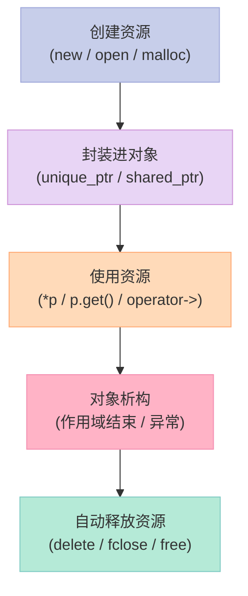
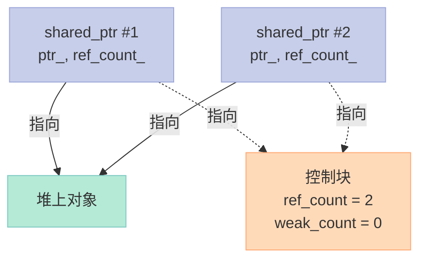
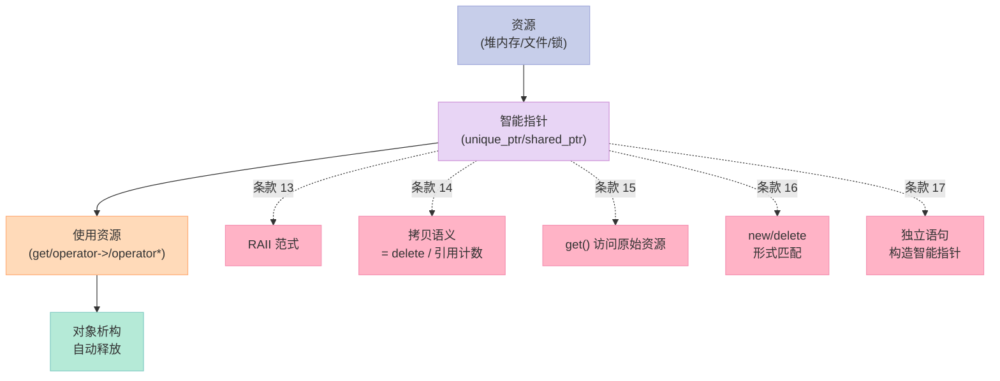

> **一句话核心结论**：C++ 资源管理的核心是 **RAII（Resource Acquisition Is Initialization）**——把资源的获取放在构造函数、释放放在析构函数，让对象的生命周期替你"自动管理"资源。`unique_ptr`（独占）+ `shared_ptr`（共享）+ `weak_ptr`（观察）三件套，覆盖 99% 的场景，**直接淘汰 `auto_ptr` 和裸 `new`/`delete`**。

---

## 系列导航

| # | 文章 | 状态 |
|:--|:--|:--|
| 0 | [系列总览](/2026/06/18/effective-cpp-00-series-index/) | ✅ 已发布 |
| 1 | [让自己习惯 C++](/2026/06/18/effective-cpp-01-accustom-cplusplus/) | ✅ 已发布 |
| 2 | [构造/析构/赋值](/2026/06/18/effective-cpp-02-constructors-destructors/) | ✅ 已发布 |
| 3 | [本文：资源管理](/2026/06/18/effective-cpp-03-resource-management/) | ✅ 已发布 |
| 4 | 设计与声明：让接口易用且不易被误用 | 🔜 计划中 |
| ... | ... | ... |

---

## 前言：为什么资源管理是 C++ 的"生死线"？

C++ 给了你**完全的控制权**——这意味着你也承担了**完全的责任**。

C# / Java 程序员习惯 `try/finally`：

```csharp
// C#
using (var conn = new SqlConnection(...)) {
    // 用 conn
}  // 自动 close
```

C++ 程序员用 **RAII**：

```cpp
// C++
{
    std::unique_ptr<Connection> conn(createConnection());
    // 用 conn
}  // 自动析构
```

**RAII** 是 Bjarne Stroustrup 提出的核心思想——**把"资源获取"和"对象构造"绑定，把"资源释放"和"对象析构"绑定**。C++ 的析构函数是"自动的"（无论正常退出还是异常），这就让"资源一定被释放"成为语言级别的保证。

本章 5 个条款会彻底讲透：

- 为什么 `auto_ptr` 是个"怪胎"？
- `unique_ptr` 的零开销是怎么做到的？
- `shared_ptr` 的循环引用陷阱
- `weak_ptr` 怎么"打破循环"？
- 智能指针在 `pimpl` 模式、STL 容器里的正确用法

---

## 一、条款 13：以对象管理资源

### 1.1 经典 C 式资源管理

```cpp
// ❌ 典型的"裸 new + 裸 delete"
void processInvestment(Investment* p, int days) {
    Investment* pInv = new Investment();
    // ... 一堆业务逻辑
    if (days > 30) {
        return;  // 灾难！new 了没 delete
    }
    delete pInv;  // 可能在 throw 时也不执行
}
```

**问题**：

1. 提前 `return` 时，`delete pInv` 不执行
2. 业务逻辑中 `throw`，`delete pInv` 不执行
3. 代码重复、容易遗漏

**结论**：**靠"程序员记性"管理资源，是不可靠的**。

### 1.2 RAII 范式

```cpp
// ✅ RAII：用智能指针管理
void processInvestment(int days) {
    std::unique_ptr<Investment> pInv(createInvestment());
    // ... 一堆业务逻辑
    if (days > 30) {
        return;  // ✅ unique_ptr 自动 delete
    }
    // 不需要手动 delete
}
```

**RAII 的核心**：



### 1.3 RAII 的"两条铁律"

1. **构造函数获取资源，析构函数释放资源**
2. **资源的所有权在对象内部**——外部不直接持有原始指针

### 1.4 自己写 RAII 类

```cpp
// 自己实现一个 unique_ptr 类似的类
template<typename T>
class UniquePtr {
    T* ptr_;
public:
    explicit UniquePtr(T* p = nullptr) : ptr_(p) {}
    ~UniquePtr() { delete ptr_; }
    UniquePtr(const UniquePtr&) = delete;
    UniquePtr& operator=(const UniquePtr&) = delete;
    UniquePtr(UniquePtr&& other) noexcept : ptr_(other.ptr_) {
        other.ptr_ = nullptr;
    }
    UniquePtr& operator=(UniquePtr&& other) noexcept {
        if (this != &other) {
            delete ptr_;
            ptr_ = other.ptr_;
            other.ptr_ = nullptr;
        }
        return *this;
    }
    T* get() const { return ptr_; }
    T& operator*() const { return *ptr_; }
    T* operator->() const { return ptr_; }
    explicit operator bool() const { return ptr_ != nullptr; }
};
```

**C++11 之后，你不需要自己写**——用 `std::unique_ptr` 即可。

### 1.5 RAII 的延伸：管理任何"成对操作"

| 资源 | RAII 包装（C++ 标准库） |
|------|-------------------------|
| 堆内存 | `unique_ptr` / `shared_ptr` |
| 文件 | `std::ifstream` / `ofstream` |
| 互斥锁 | `std::lock_guard` / `unique_lock` |
| 数据库连接 | 第三方库（如 `mysqlx::Connection`） |
| Socket | `std::unique_ptr` + 自定义 deleter |
| OpenGL 对象 | 第三方库（如 `gsl::unique_ptr`） |

### 1.6 关键启示

1. **任何"成对操作"（new/delete, open/close, lock/unlock）都应该用 RAII 包装**
2. **优先用 `std::` 的智能指针**——不要自己写
3. **RAII 是"异常安全"的基础**——析构是"自动的"（即使异常）

---

## 二、条款 14：在资源管理类中小心 `copying` 行为

### 2.1 问题：RAII 类的"拷贝"怎么处理？

```cpp
class Mutex {
    pthread_mutex_t m_;
public:
    void lock() { /*...*/ }
    void unlock() { /*...*/ }
};

// RAII 包装锁
class Lock {
    Mutex& m_;
public:
    Lock(Mutex& m) : m_(m) { m_.lock(); }
    ~Lock() { m_.unlock(); }
    // 没有处理"拷贝"
};
```

**问题**：

```cpp
Mutex m;
Lock lock1(m);
// ... 复制 lock1 到 lock2？怎么办？
```

### 2.2 4 种处理方案

| 方案 | 含义 | 适用场景 |
|------|------|----------|
| **禁止拷贝** | `= delete` | 互斥锁、文件句柄、独占资源 |
| **引用计数** | `shared_ptr` | 共享所有权 |
| **深拷贝** | 复制底层资源 | 资源可复制（如动态数组） |
| **转移所有权** | `std::move` | unique_ptr 风格 |

### 2.3 方案 1：禁止拷贝

```cpp
class Lock {
    Mutex& m_;
public:
    Lock(Mutex& m) : m_(m) { m_.lock(); }
    ~Lock() { m_.unlock(); }
    Lock(const Lock&) = delete;
    Lock& operator=(const Lock&) = delete;
};
```

**这是 80% 场景下的答案**——大多数 RAII 类"不该被复制"。

### 2.4 方案 2：引用计数（用 `shared_ptr`）

```cpp
// 罕见的例子：锁可以被多个对象持有
class Lock {
    // shared_ptr 管理 Mutex*，引用计数
    std::shared_ptr<Mutex> sp_;
public:
    Lock(Mutex* m) : sp_(m) {
        if (sp_) sp_->lock();
    }
    ~Lock() {
        if (sp_) sp_->unlock();  // 最后一个 Lock 析构时才 unlock
    }
    Lock(const Lock& other) = default;  // 浅拷贝 + 引用计数
};

Mutex* m = new Mutex();
{
    Lock l1(m);
    Lock l2 = l1;  // 引用计数 +1
    // l1 和 l2 都持有锁
    // 最后一个析构时 unlock
}
```

**C++ 标准库 `std::lock_guard` 内部就是这种思路**——`shared_ptr<Mutex>` + 删除器。

### 2.5 方案 3：深拷贝（拷贝底层资源）

```cpp
class String {
    char* data_;
    size_t size_;
public:
    String(const String& other) : size_(other.size_) {
        data_ = new char[size_ + 1];
        std::memcpy(data_, other.data_, size_ + 1);  // 深拷贝
    }
    // ...
};
```

**适用**：资源本身就是"可复制"的（如 `std::string`、`std::vector`）。

### 2.6 方案 4：转移所有权

```cpp
class UniqueHandle {
    int handle_;
public:
    UniqueHandle(int h) : handle_(h) {}
    ~UniqueHandle() { closeHandle(handle_); }
    UniqueHandle(const UniqueHandle&) = delete;
    UniqueHandle& operator=(const UniqueHandle&) = delete;
    UniqueHandle(UniqueHandle&& other) noexcept : handle_(other.handle_) {
        other.handle_ = -1;  // 标记为"空"
    }
    UniqueHandle& operator=(UniqueHandle&& other) noexcept {
        if (this != &other) {
            closeHandle(handle_);
            handle_ = other.handle_;
            other.handle_ = -1;
        }
        return *this;
    }
};
```

**适用**：`unique_ptr` 风格——只允许移动，不允许拷贝。

### 2.7 关键启示

1. **RAII 类的拷贝语义要明确**——沉默的"编译器生成拷贝"是灾难
2. **优先禁止拷贝（`= delete`）**——大多数 RAII 类"不可复制"
3. **真的需要共享？用 `shared_ptr` + 删除器**——简单且不易错
4. **`std::lock_guard`、`std::unique_ptr`、`std::shared_ptr` 都是 RAII 典范**——学习它们的源码

---

## 三、条款 15：在资源管理类中提供对原始资源的访问

### 3.1 问题：智能指针的"接口缺口"

```cpp
std::unique_ptr<Investment> pInv(createInvestment());
// 用 pInv 大部分时候 OK
pInv->compute();  // ✅

// 但有些 API 接受原始指针
void legacyAPI(Investment* raw);
legacyAPI(pInv);   // ❌ 编译错误：unique_ptr 不能隐式转 Investment*
legacyAPI(pInv.get());  // ✅ 显式 get
```

### 3.2 方案：`get()` 成员函数

```cpp
class Investment {
    // ...
public:
    void compute();
};

std::unique_ptr<Investment> pInv(createInvestment());
pInv->compute();          // ✅ 用 operator->
pInv.get()->compute();    // ✅ 等价写法
pInv->compute();          // 推荐写法
```

`std::unique_ptr` 提供了：

| 函数 | 返回 | 用途 |
|------|------|------|
| `get()` | `T*` | 获取原始指针（不转移所有权） |
| `operator->()` | `T*` | 像指针一样访问成员 |
| `operator*()` | `T&` | 像指针一样解引用 |

### 3.3 隐式转换？显式转换？

```cpp
// ❌ 隐式转换（危险的）
class Resource {
public:
    operator Resource*() { return handle_; }  // 隐式
};

Resource r;
Resource* p = r;  // 看起来"无害"——但 Resource 已经析构了，p 悬空！
```

```cpp
// ✅ 显式转换（推荐）
class Resource {
public:
    explicit operator Resource*() { return handle_; }
};

Resource* p = static_cast<Resource*>(r);  // 显式
```

`std::unique_ptr` 选择了**不提供隐式转换**——`get()` 是显式调用。

### 3.4 与原生指针的对比

| 维度 | 原生指针 | 智能指针 |
|------|----------|----------|
| 自动释放 | ❌ | ✅ |
| 类型安全 | ⚠️ | ✅ |
| 隐式转换 | ✅（危险） | ❌（强制显式） |
| `get()` 访问原始资源 | N/A | ✅ |
| 性能 | 最优 | 接近最优（unique_ptr 零开销） |

### 3.5 关键启示

1. **RAII 类不应该"完全隐藏"底层资源**——需要 `get()` 提供访问
2. **`get()` 不转移所有权**——调用方用完不能再 delete
3. **优先"显式"**——避免隐式转换导致意外生命周期问题

---

## 四、条款 16：成对使用 `new` 和 `delete` 时要采取相同形式

### 4.1 经典陷阱

```cpp
// ❌ 错配
std::string* arr = new std::string[10];  // 数组形式
delete arr;                                // 单一形式 —— UB!

std::string* p = new std::string;          // 单一形式
delete[] p;                                // 数组形式 —— UB!
```

**问题**：`new[]` 通常会在内存前面存一个"元素个数"（用于 `delete[]` 时知道调用多少次析构），而 `delete` 只调用一次析构——结果就是"部分元素没析构"。

### 4.2 形式对照表

| 分配 | 必须配对的释放 |
|------|----------------|
| `new T` | `delete p` |
| `new T[n]` | `delete[] p` |
| `new T(args)` | `delete p` |
| `new T[n]()` | `delete[] p` |
| `malloc(n)` | `free(p)` |
| `calloc(n, size)` | `free(p)` |
| `::operator new(...)` | `::operator delete(...)` |

**重要**：

- `new[]` 的指针 = `delete[]` 的指针
- 不要在指针上做算术后再 `delete`（会绕过元素计数）

### 4.3 实战中如何"避免出错"？

**直接用智能指针 + `make_unique`/`make_shared`**：

```cpp
// ✅ 推荐：智能指针 + make_xxx
auto p1 = std::make_unique<std::string>("hello");   // 自动 delete
auto arr = std::make_unique<std::string[]>(10);     // 自动 delete[]

auto p2 = std::make_shared<std::string>("world");   // 自动 delete
```

**为什么这样不会出错？**

- `make_unique` 内部用 `new`，外部 `unique_ptr` 析构时按对应形式 `delete`
- `make_unique<T[]>(n)` 内部用 `new T[n]`，析构时按 `delete[]` 释放
- **你根本不用手写 `delete`**——形式自动匹配

### 4.4 typedef 陷阱

```cpp
// ❌ typedef 隐藏了"数组"信息
typedef std::string AddressLines[4];
std::string* pal = new AddressLines;  // 实际是 new string[4]
delete pal;                           // ❌ 错配！应该是 delete[]
```

**解法**：

```cpp
// ✅ 用 std::array 替代
using AddressLines = std::array<std::string, 4>;
auto pal = std::make_unique<AddressLines>();
// pal.reset() / 析构时自动 delete[]
```

### 4.5 关键启示

1. **永远成对使用**——`new` / `delete`，`new[]` / `delete[]`，`malloc` / `free`
2. **优先 `make_unique` / `make_shared`**——避免手写 `new` / `delete`
3. **typedef 别用数组**——`std::array` 是更好的选择
4. **智能指针是"形式自动匹配"的**——`unique_ptr<T[]>` 自动 `delete[]`

---

## 五、条款 17：以独立语句将 `new`ed 对象置入智能指针

### 5.1 经典陷阱

```cpp
// ❌ 危险写法
void processWidget(std::shared_ptr<Widget> pw, int priority);

processWidget(std::shared_ptr<Widget>(new Widget),  // 表达式 1
              computePriority());                    // 表达式 2
```

**问题**：C++ 编译器**不保证** `processWidget` 的实参计算顺序！可能：

1. `new Widget` 分配内存
2. `computePriority()` 执行（抛异常）
3. **未执行**：`shared_ptr` 构造 → 内存泄漏！

**原因**：C++ 标准允许**实参计算顺序自由**（编译器优化时打乱顺序）——这是 C++ 的一大坑。

### 5.2 解决方案：独立语句

```cpp
// ✅ 解决方案
auto pw = std::make_shared<Widget>();  // 独立语句
processWidget(pw, computePriority());   // 调用不会泄漏
```

**为什么这样安全？**

- 第一步：`make_shared` 在一行内完成"分配 + 构造 shared_ptr"
- 第二步：调用 `processWidget`——只可能是 `computePriority` 抛异常
- 如果第二步抛异常：`pw`（智能指针）已经构造，异常会正确清理它

### 5.3 完整的"三步构造"流程

```cpp
// 实际的执行流程：
std::shared_ptr<Widget> pw(new Widget);
// 步骤 1：operator new 分配内存
// 步骤 2：Widget 构造
// 步骤 3：shared_ptr 接管内存
```

**如果步骤 3 没发生（因为步骤 1 和 2 之间抛了异常），就会泄漏**。

### 5.4 完整对比

```cpp
// ❌ 错：实参顺序不确定
processWidget(std::shared_ptr<Widget>(new Widget), computePriority());

// ✅ 对：先构造智能指针
auto pw = std::make_shared<Widget>();
processWidget(pw, computePriority());
```

### 5.5 关键启示

1. **智能指针的构造必须独立成语句**——不能在实参列表中"边 new 边包装"
2. **优先 `make_shared` / `make_unique`**——它们天然就是"独立语句"
3. **C++ 实参计算顺序是"未指定"的**——所有多实参函数都要小心

---

## 六、`auto_ptr` 的"陨落"与现代智能指针三件套

### 6.1 `auto_ptr`：C++98 的"怪胎"

```cpp
// C++98 时代的智能指针——已废弃！
std::auto_ptr<std::string> p1(new std::string("hello"));
std::auto_ptr<std::string> p2 = p1;  // 所有权"转移"！
*p2 = "world";  // OK
std::cout << *p1;  // ❌ p1 已经是 nullptr！
```

**问题**：

1. **拷贝 = 转移所有权**——这违反了"拷贝语义"的直觉
2. **不能用于 STL 容器**——`vector<auto_ptr<T>>` 排序时会破坏元素
3. **C++11 起被 `= delete`**——编译器会警告

### 6.2 现代三件套

| 智能指针 | 语义 | 性能 | 用途 |
|----------|------|------|------|
| `std::unique_ptr<T>` | 独占所有权 | **零开销** | 90% 场景 |
| `std::shared_ptr<T>` | 共享所有权（引用计数） | 一次原子操作 | 多所有者 |
| `std::weak_ptr<T>` | 观察（不影响生命周期） | 接近零开销 | 打破循环引用 |

### 6.3 `unique_ptr`：独占所有权的典范

```cpp
#include <memory>

// 1. 基础用法
std::unique_ptr<Investment> pInv(createInvestment());

// 2. 转移所有权（C++11 后 move 语义）
auto pInv2 = std::move(pInv);
// pInv 现在为 nullptr，pInv2 持有所有权

// 3. 自定义删除器
auto fileDeleter = [](FILE* fp) {
    if (fp) std::fclose(fp);
};
std::unique_ptr<FILE, decltype(fileDeleter)> fp(
    std::fopen("test.txt", "r"),
    fileDeleter
);

// 4. 数组特化（C++11 后）
std::unique_ptr<int[]> arr(new int[10]);
arr[0] = 42;  // ✅
```

**为什么零开销？**

- **栈上**：`unique_ptr<T>` 的大小 = 一个指针（8 bytes on 64-bit）
- **堆上**：`T` 对象本身的内存（不增加）
- **没有引用计数**——比 `shared_ptr` 更快
- **没有虚函数**——编译期多态

### 6.4 `unique_ptr` 的 API 速查

| API | 用途 |
|-----|------|
| `unique_ptr<T> p;` | 默认构造（持有 nullptr） |
| `unique_ptr<T> p(new T(...));` | 用原始指针构造 |
| `make_unique<T>(...)` | C++14 推荐（C++11 用 `new`） |
| `p.get()` | 获取原始指针（不转移所有权） |
| `p.release()` | 放弃所有权，返回原始指针 |
| `p.reset()` | 释放当前对象，置空 |
| `p.reset(newPtr)` | 释放当前对象，持有新指针 |
| `p.swap(other)` | 交换 |
| `std::move(p)` | 转移所有权（C++11） |

### 6.5 `shared_ptr`：共享所有权的"双刃剑"

```cpp
std::shared_ptr<Investment> p1 = std::make_shared<Investment>();
{
    std::shared_ptr<Investment> p2 = p1;  // 引用计数 = 2
    std::cout << p1.use_count();  // 2
}  // p2 析构，引用计数 = 1

std::cout << p1.use_count();  // 1
// p1 析构，引用计数 = 0，对象被释放
```

**实现原理**：



**控制块**（Control Block）：

- **引用计数**（`ref_count`）：当前有多少 `shared_ptr` 指向它
- **弱引用计数**（`weak_count`）：当前有多少 `weak_ptr` 观察它

**对象释放时机**：`ref_count` 降到 0 → 调用删除器 + 释放控制块

### 6.6 `shared_ptr` 的 API 速查

| API | 用途 |
|-----|------|
| `shared_ptr<T> p;` | 默认构造（持有 nullptr） |
| `make_shared<T>(...)` | 推荐（C++11） |
| `p.get()` | 获取原始指针（不转移所有权） |
| `p.use_count()` | 引用计数（仅用于测试/调试） |
| `p.unique()` | 是否独占（`use_count() == 1`） |
| `p.reset()` | 释放当前对象，置空 |
| `p.reset(newPtr)` | 释放当前对象，持有新指针 |
| `std::move(p)` | 转移所有权（C++11） |

### 6.7 `shared_ptr` 的陷阱

#### 陷阱 1：循环引用 → 内存泄漏

```cpp
// ❌ 循环引用
struct Node {
    std::shared_ptr<Node> next;
    std::shared_ptr<Node> prev;
};

auto n1 = std::make_shared<Node>();
auto n2 = std::make_shared<Node>();
n1->next = n2;   // n2 的 ref_count = 2
n2->prev = n1;   // n1 的 ref_count = 2
// 析构 n1 / n2 时，各自的引用计数 = 1（对方还持有）
// 永远泄漏！
```

#### 陷阱 2：同一个原始指针传给多个 shared_ptr

```cpp
// ❌ 双删除
Investment* raw = new Investment();
std::shared_ptr<Investment> p1(raw);
std::shared_ptr<Investment> p2(raw);  // 灾难！会 double-delete
```

**正确做法**：用 `make_shared` 或者从一个 shared_ptr 拷贝。

#### 陷阱 3：this 指针的"自引用"

```cpp
// ❌ 错误
class Widget {
    std::shared_ptr<Widget> self_;  // 用 this 构造
public:
    void track() {
        self_ = this;  // 灾难：自引用循环
    }
};
```

**正确做法**：用 `std::enable_shared_from_this<Widget>`（条款 18 配套）。

### 6.8 `weak_ptr`：观察者

```cpp
// 解决循环引用
struct Node {
    std::shared_ptr<Node> next;
    std::weak_ptr<Node> prev;  // ✅ weak_ptr 观察
};

auto n1 = std::make_shared<Node>();
auto n2 = std::make_shared<Node>();
n1->next = n2;   // n2 的 ref_count = 2
n2->prev = n1;   // n1 的 ref_count = 1（weak_ptr 不增加）
// 析构 n1 / n2 时：n1 的 ref_count = 0（释放）→ n2 的 ref_count = 1 → 释放 n2
// 全部释放！
```

**API 速查**：

| API | 用途 |
|-----|------|
| `weak_ptr<T> wp(sp);` | 从 `shared_ptr` 构造 |
| `wp.lock()` | 返回 `shared_ptr`（如果对象还活着） |
| `wp.expired()` | 对象是否还活着 |
| `wp.use_count()` | 关联的 shared_ptr 数量 |

```cpp
// 典型用法
std::shared_ptr<int> sp = std::make_shared<int>(42);
std::weak_ptr<int> wp = sp;

if (auto locked = wp.lock()) {
    std::cout << *locked;  // 42
}
```

### 6.9 智能指针使用建议

| 场景 | 选哪个？ |
|------|----------|
| 默认情况 | `unique_ptr` |
| 容器元素（值语义） | 值类型即可 |
| 共享所有权 | `shared_ptr` |
| 观察者（不增加引用计数） | `weak_ptr` |
| 类的成员（拥有所有权） | `unique_ptr`（首选）/ `shared_ptr` |
| pimpl 模式 | `unique_ptr` |
| 多态（指向基类的派生类对象） | `unique_ptr<Base>` + `make_unique<Derived>` |

### 6.10 关键启示

1. **`auto_ptr` 已被废弃**——C++11 之后不要再用
2. **90% 场景用 `unique_ptr`**——零开销、明确所有权
3. **不要随意用 `shared_ptr`**——引入循环引用的风险
4. **`weak_ptr` 是"打破循环"的工具**——是观察者，不是所有者

---

## 七、智能指针实战：5 个常见模式

### 7.1 模式 1：工厂函数返回 `unique_ptr`

```cpp
class Investment {
public:
    virtual ~Investment() = default;
    virtual void compute() = 0;
};

class Stock : public Investment {
public:
    void compute() override { /*...*/ }
};

class Bond : public Investment {
public:
    void compute() override { /*...*/ }
};

// ✅ 工厂函数
std::unique_ptr<Investment> createInvestment(const std::string& type) {
    if (type == "stock") return std::make_unique<Stock>();
    if (type == "bond")  return std::make_unique<Bond>();
    return nullptr;
}

// 使用
auto pInv = createInvestment("stock");
pInv->compute();
```

**为什么用 `unique_ptr<Investment>`？** 多态——`Investment` 是基类，实际对象是 `Stock` 或 `Bond`。

### 7.2 模式 2：pimpl 习惯用法

```cpp
// widget.h
class Widget {
    struct Impl;  // 前向声明
    std::unique_ptr<Impl> pImpl_;  // pimpl
public:
    Widget();
    ~Widget();
    // 拷贝构造/赋值需要手动实现（unique_ptr 不可拷贝）
    Widget(Widget&&) noexcept;
    Widget& operator=(Widget&&) noexcept;
    void draw();
};

// widget.cpp
struct Widget::Impl {
    std::string name_;
    int data_;
    void drawImpl() { /*...*/ }
};

Widget::Widget() : pImpl_(std::make_unique<Impl>()) {}
Widget::~Widget() = default;  // 必须在 .cpp 看到 Impl 的完整定义
Widget::Widget(Widget&&) noexcept = default;
Widget& Widget::operator=(Widget&&) noexcept = default;
void Widget::draw() { pImpl_->drawImpl(); }
```

**为什么 `~Widget` 必须在 .cpp？** 因为 `~unique_ptr<Impl>` 会调用 `delete Impl*`，需要看到 `Impl` 的完整定义。

### 7.3 模式 3：自定义删除器（文件、网络）

```cpp
// 文件管理
auto fileDeleter = [](FILE* fp) {
    if (fp) {
        std::fclose(fp);
        std::cout << "File closed\n";
    }
};

std::unique_ptr<FILE, decltype(fileDeleter)> fp(
    std::fopen("test.txt", "r"),
    fileDeleter
);

// 网络 socket
auto socketDeleter = [](int* fd) {
    if (*fd >= 0) {
        ::close(*fd);
    }
};
std::unique_ptr<int, decltype(socketDeleter)> sock(
    new int(::socket(AF_INET, SOCK_STREAM, 0)),
    socketDeleter
);
```

**注意**：`shared_ptr` 的删除器**不影响**智能指针的大小——`shared_ptr` 用类型擦除实现。

### 7.4 模式 4：别名构造函数（Aliasing Constructor）

```cpp
struct Person {
    std::string name;
    int age;
};

auto p = std::make_shared<Person>();
p->name = "Alice";
p->age = 30;

// 只想"共享" name 字段
std::shared_ptr<std::string> nameRef(p, &p->name);
// nameRef 持有 p 的引用计数；指向 p->name
// p 析构时，nameRef 还活着 → Person 不被释放
```

**用途**：当一个对象有多个子对象，多个组件"共享"同一个 owner 但指向不同部分。

### 7.5 模式 5：智能指针容器

```cpp
std::vector<std::unique_ptr<Shape>> shapes;
shapes.push_back(std::make_unique<Circle>(2.0));
shapes.push_back(std::make_unique<Square>(3.0));

for (const auto& s : shapes) {
    s->draw();  // 多态调用
}
// shapes 析构时，每个 unique_ptr 自动释放
```

**不要这样**：

```cpp
// ❌ 错误的容器
std::vector<Shape*> shapes;  // 容器不知道所有权
shapes.push_back(new Circle());
// 析构时不会自动 delete！
```

---

## 八、5 个条款的"资源管理"全景



**核心思路**：

- **任何"成对操作"用 RAII 包装**（条款 13）
- **明确"拷贝"语义**（条款 14）——禁止、共享、深拷、移动
- **保留对原始资源的访问**（条款 15）——`get()`
- **new/delete 形式匹配**（条款 16）——用 `make_unique`/`make_shared` 避免
- **构造独立成语句**（条款 17）——避免顺序未定义导致的泄漏

---

## 九、常见误区与陷阱

### 9.1 误区 1：手动 `delete` 智能指针管理的对象

```cpp
// ❌ 错
std::unique_ptr<Widget> p = std::make_unique<Widget>();
delete p.get();  // 灾难：p 析构时 double-delete
```

### 9.2 误区 2：智能指针 + 数组忘记 `[]`

```cpp
// ❌ C++11 之前 unique_ptr 没有数组版本
std::unique_ptr<Widget> arr(new Widget[10]);  // 析构时只 delete 一次
// 修正
std::unique_ptr<Widget[]> arr(new Widget[10]);  // ✅ C++11 后
// 或更好
auto arr = std::make_unique<Widget[]>(10);     // ✅ C++14 后
```

### 9.3 误区 3：从 `this` 构造 `shared_ptr`

```cpp
// ❌ 自引用
class Widget : public std::enable_shared_from_this<Widget> {
    std::shared_ptr<Widget> self_;
public:
    void track() {
        self_ = this;  // 灾难：自引用循环
    }
};
```

**正确**：

```cpp
class Widget : public std::enable_shared_from_this<Widget> {
    std::weak_ptr<Widget> self_;  // ✅ 用 weak_ptr
public:
    void track() {
        self_ = shared_from_this();
    }
};
```

### 9.4 误区 4：`shared_ptr` 用同一个原始指针多次构造

```cpp
// ❌ 双删除
Investment* raw = new Investment();
std::shared_ptr<Investment> p1(raw);
std::shared_ptr<Investment> p2(raw);  // 灾难
```

### 9.5 误区 5：循环引用导致泄漏

```cpp
// ❌ 循环引用
struct Node {
    std::shared_ptr<Node> next;
    std::shared_ptr<Node> prev;  // 改用 weak_ptr
};
```

### 9.6 误区 6：在容器中存裸指针

```cpp
// ❌ 容器不知道所有权
std::vector<Widget*> widgets;
widgets.push_back(new Widget());
// 泄漏！

// ✅ 用 unique_ptr
std::vector<std::unique_ptr<Widget>> widgets;
widgets.push_back(std::make_unique<Widget>());
```

---

## 十、C++11/14/17 的演进

| 主题 | C++98 时代 | C++11/14/17 时代 |
|------|------------|-----------------|
| 智能指针 | `auto_ptr`（已废弃） | `unique_ptr` + `shared_ptr` + `weak_ptr` |
| 创建 | `new T(...)` | `make_unique<T>()` / `make_shared<T>()` |
| 移动 | 手动转移 | `std::move` |
| pimpl | 手动管理 + 私有析构 | `unique_ptr<Impl>` + 移动构造 |
| 数组特化 | 需要自定义 | `unique_ptr<T[]>` |
| 删除器 | 函数指针 | lambda / 函数对象（零开销） |
| 自引用 | 手动 | `std::enable_shared_from_this` |

---

## 十一、面试高频考点

### 11.1 必背题

| 题目 | 答案要点 |
|------|----------|
| 什么是 RAII？ | Resource Acquisition Is Initialization：构造获取资源，析构释放资源 |
| 智能指针有哪些？ | `unique_ptr`（独占）/ `shared_ptr`（共享）/ `weak_ptr`（观察） |
| `unique_ptr` 为什么零开销？ | 只有一个指针大小，无虚函数、无引用计数 |
| `shared_ptr` 的循环引用怎么解决？ | 用 `weak_ptr` 打破循环 |
| `auto_ptr` 有什么问题？ | 拷贝 = 转移所有权，违反直觉，已废弃 |
| `new[]` 配什么？ | `delete[]`——错配会 UB |
| 智能指针的 `get()` 转移所有权吗？ | 不转移——只是"观察" |
| `make_shared` 有什么好处？ | 一次分配（对象 + 控制块）、异常安全 |

### 11.2 高频追问

| 追问 | 关键点 |
|------|--------|
| `shared_ptr` 的实现原理？ | 引用计数 + 控制块，原子操作 |
| `weak_ptr` 怎么判断对象还活着？ | `lock()` 返回 `shared_ptr`（对象已死则返回空） |
| `unique_ptr` 的删除器影响大小吗？ | 影响——删除器是模板参数 |
| `shared_ptr` 的删除器影响大小吗？ | 不影响——类型擦除 |
| pimpl 模式为什么要 `unique_ptr`？ | 隐藏实现、加速编译、ABI 稳定 |
| 工厂函数返回什么？ | `unique_ptr`（首选）或 `shared_ptr`（需共享时） |
| `enable_shared_from_this` 怎么用？ | 继承 + `shared_from_this()`（必须已有 shared_ptr 持有 this） |
| 什么时候用 `make_unique` vs `make_shared`？ | 默认 `make_unique`；需要共享 + 弱引用才用 `make_shared` |

### 11.3 实战题

| 题目 | 关键点 |
|------|--------|
| 实现一个简单的 `unique_ptr` | 模板类 + `= delete` 拷贝 + 移动 |
| 解释 `shared_ptr` 的循环引用并解决 | 父 → 子：shared_ptr；子 → 父：weak_ptr |
| pimpl 模式的完整实现 | 前向声明 + `unique_ptr<Impl>` + 移动构造/赋值 |
| `make_shared` 和 `shared_ptr(new T)` 的区别 | 一次 vs 两次分配、异常安全 |

---

## 十二、配套实验

### 12.1 实验 1：智能指针三件套

```cpp
// 文件：smart_pointer_demo.cpp
#include <iostream>
#include <memory>
#include <vector>

class Investment {
public:
    virtual ~Investment() { std::cout << "~Investment\n"; }
    virtual void compute() const = 0;
};

class Stock : public Investment {
public:
    ~Stock() override { std::cout << "~Stock\n"; }
    void compute() const override {
        std::cout << "Stock::compute()\n";
    }
};

class Bond : public Investment {
public:
    ~Bond() override { std::cout << "~Bond\n"; }
    void compute() const override {
        std::cout << "Bond::compute()\n";
    }
};

std::unique_ptr<Investment> createInvestment(const std::string& type) {
    if (type == "stock") return std::make_unique<Stock>();
    if (type == "bond")  return std::make_unique<Bond>();
    return nullptr;
}

int main() {
    // 1. unique_ptr 转移所有权
    auto p1 = createInvestment("stock");
    p1->compute();

    auto p2 = std::move(p1);
    std::cout << "p1 is " << (p1 ? "not empty" : "empty") << "\n";
    p2->compute();
    // p2 析构时自动释放

    // 2. shared_ptr 共享所有权
    auto sp1 = std::make_shared<Stock>();
    {
        auto sp2 = sp1;
        std::cout << "use_count: " << sp1.use_count() << "\n";
    }  // sp2 析构
    std::cout << "use_count: " << sp1.use_count() << "\n";

    // 3. 容器中的 unique_ptr
    std::vector<std::unique_ptr<Investment>> portfolio;
    portfolio.push_back(createInvestment("stock"));
    portfolio.push_back(createInvestment("bond"));
    for (const auto& inv : portfolio) {
        inv->compute();
    }

    return 0;
}
```

**编译运行**：

```bash
g++ -std=c++17 -Wall smart_pointer_demo.cpp -o smart_pointer_demo
./smart_pointer_demo
```

### 12.2 实验 2：循环引用 vs weak_ptr

```cpp
// 文件：circular_ref.cpp
#include <iostream>
#include <memory>

struct BadNode {
    std::shared_ptr<BadNode> next;
    std::shared_ptr<BadNode> prev;
    ~BadNode() { std::cout << "~BadNode\n"; }
};

struct GoodNode {
    std::shared_ptr<GoodNode> next;
    std::weak_ptr<GoodNode> prev;  // ✅ weak_ptr
    ~GoodNode() { std::cout << "~GoodNode\n"; }
};

int main() {
    // ❌ 循环引用
    {
        auto n1 = std::make_shared<BadNode>();
        auto n2 = std::make_shared<BadNode>();
        n1->next = n2;
        n2->prev = n1;
        // 离开作用域时 n1, n2 引用计数都 = 1，泄漏
    }
    std::cout << "BadNode 测试结束（可能泄漏）\n";

    // ✅ weak_ptr 打破循环
    {
        auto n1 = std::make_shared<GoodNode>();
        auto n2 = std::make_shared<GoodNode>();
        n1->next = n2;
        n2->prev = n1;
        // 离开作用域时全部释放
    }
    std::cout << "GoodNode 测试结束（正确释放）\n";

    return 0;
}
```

### 12.3 实验 3：pimpl 完整实现

```cpp
// 文件：widget.h
#pragma once
#include <memory>
#include <string>

class Widget {
public:
    Widget();
    ~Widget();
    Widget(Widget&&) noexcept;
    Widget& operator=(Widget&&) noexcept;
    Widget(const Widget&) = delete;
    Widget& operator=(const Widget&) = delete;

    void setName(const std::string& name);
    std::string getName() const;
    void draw() const;

private:
    struct Impl;
    std::unique_ptr<Impl> pImpl_;
};

// widget.cpp
#include "widget.h"
#include <iostream>

struct Widget::Impl {
    std::string name_;
    int data_ = 0;
    void drawImpl() const {
        std::cout << "Widget: " << name_ << "\n";
    }
};

Widget::Widget() : pImpl_(std::make_unique<Impl>()) {}
Widget::~Widget() = default;  // 必须在 .cpp 看到 Impl
Widget::Widget(Widget&&) noexcept = default;
Widget& Widget::operator=(Widget&&) noexcept = default;
void Widget::setName(const std::string& name) { pImpl_->name_ = name; }
std::string Widget::getName() const { return pImpl_->name_; }
void Widget::draw() const { pImpl_->drawImpl(); }

// main.cpp
#include "widget.h"
int main() {
    Widget w;
    w.setName("hello");
    w.draw();
    return 0;
}
```

---

## 十三、回到 5 条黄金法则

| 条款 | 黄金法则 |
|------|----------|
| 13 | 任何资源用 RAII 包装——智能指针是首选 |
| 14 | RAII 类的拷贝语义：禁止 / 引用计数 / 深拷 / 移动——必须明确 |
| 15 | 提供 `get()` 访问原始资源——但不要隐式转换 |
| 16 | `new`/`delete`、`new[]`/`delete[]`、`malloc`/`free` 严格成对 |
| 17 | 智能指针的构造必须独立成语句——避免实参顺序未定义 |

---

## 十四、结尾思考题

> **思考题 1**：以下代码有什么问题？

```cpp
void process() {
    Investment* raw = new Investment();
    std::shared_ptr<Investment> p1(raw);
    std::shared_ptr<Investment> p2(raw);
}
```

> **思考题 2**：实现一个简单的 `unique_ptr<T>`（支持移动，不支持拷贝）。

> **思考题 3**：`shared_ptr` 的 `make_shared` 和 `new T` + 包装有什么区别？哪个更推荐？

> **思考题 4**：用 `weak_ptr` 解决"父子对象"的循环引用问题——画出对象关系图。

> **思考题 5**：pimpl 模式中，`~Widget()` 为什么必须在 `.cpp` 中实现？不能在 `.h` 中 `= default` 吗？

---

## 十五、本篇速查表

| 主题 | 关键 API / 模式 | 适用场景 |
|------|----------------|----------|
| RAII 范式 | 构造 / 析构 配对管理资源 | 任何"成对操作" |
| 智能指针三件套 | `unique_ptr` / `shared_ptr` / `weak_ptr` | 替代 `auto_ptr` 和裸指针 |
| `make_unique` | C++14 | 创建 `unique_ptr` |
| `make_shared` | C++11 | 创建 `shared_ptr`（更高效） |
| 工厂函数 | `unique_ptr<T> createT(...)` | 多态对象创建 |
| pimpl 模式 | `unique_ptr<Impl> pImpl_` | 隐藏实现 + 加速编译 |
| 容器所有权 | `vector<unique_ptr<T>>` | 多态对象集合 |
| 循环引用 | `weak_ptr` 替代 `shared_ptr` | 父子、链表等 |
| 自引用 | `enable_shared_from_this` | 类内部获取 `shared_ptr` |
| 删除器 | lambda / `function` / 函数指针 | 文件、socket、自定义资源 |

---

## 十六、系列导航

| # | 文章 | 状态 |
|:--|:--|:--|
| 0 | [系列总览](/2026/06/18/effective-cpp-00-series-index/) | ✅ 已发布 |
| 1 | [让自己习惯 C++](/2026/06/18/effective-cpp-01-accustom-cplusplus/) | ✅ 已发布 |
| 2 | [构造/析构/赋值](/2026/06/18/effective-cpp-02-constructors-destructors/) | ✅ 已发布 |
| 3 | [本文：资源管理](/2026/06/18/effective-cpp-03-resource-management/) | ✅ 已发布 |
| 4 | 设计与声明：让接口易用且不易被误用 | 🔜 计划中 |
| ... | ... | ... |
| 11 | 杂项 + 总结 | 🔜 计划中 |

---

**下一篇**：第 4 篇《设计与声明：让接口易用且不易被误用》——条款 18-25 一起讲透接口设计哲学：参数类型的选择、const 正确性、inline 的代价、命名习惯、模板 vs 继承、友元的边界、成员函数 vs 非成员函数、类型转换。

> **行动建议**：
> 1. **今天**：把所有"裸 `new`/`delete`"代码改成 `unique_ptr`/`make_unique`
> 2. **今天**：把"有循环引用的 `shared_ptr`"改成 `weak_ptr`
> 3. **本周**：识别你项目中的"重复 new/delete"，用 RAII 包装
> 4. **本周**：用 pimpl 模式重写一个"头文件依赖太重"的类
> 5. **思考**：你的项目里，哪些类需要禁止拷贝？哪些需要深拷贝？哪些需要共享？
