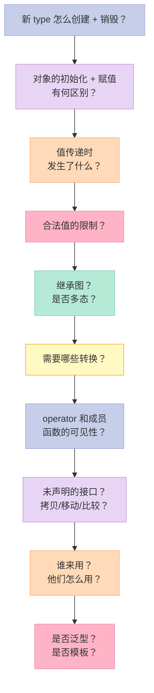
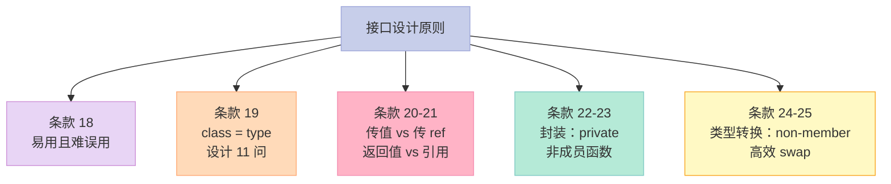

> **一句话核心结论**：好的 C++ 接口设计有一条核心原则——**让对的用法亮起来，让错的用法编译失败**。本章 8 个条款教你掌握：类的本质（class = type）、参数传递的最优姿势（pass-by-const-ref）、成员函数 vs 非成员函数的取舍、类型转换的克制、namespace 与友元的边界、模板 vs 继承的工程选择。

---

## 系列导航

| # | 文章 | 状态 |
|:--|:--|:--|
| 0 | [系列总览](/2026/06/18/effective-cpp-00-series-index/) | ✅ 已发布 |
| 1 | [让自己习惯 C++](/2026/06/18/effective-cpp-01-accustom-cplusplus/) | ✅ 已发布 |
| 2 | [构造/析构/赋值](/2026/06/18/effective-cpp-02-constructors-destructors/) | ✅ 已发布 |
| 3 | [资源管理](/2026/06/18/effective-cpp-03-resource-management/) | ✅ 已发布 |
| 4 | [本文：设计与声明](/2026/06/18/effective-cpp-04-designs-and-declarations/) | ✅ 已发布 |
| 5 | 实现：让类"用得顺手" | 🔜 计划中 |
| ... | ... | ... |

---

## 前言：什么是"好的接口"？

C++ 是一门"接口密集"的语言——你每天都在写 class、function、template，每一个都是**给其他程序员（或未来的自己）的契约**。

一个"好"的接口：

- ✅ **正确表达意图**——名字、参数、返回值都"自解释"
- ✅ **易用**——`vector::push_back(x)` 看上去就知道干什么
- ✅ **难误用**——`Date(int day, int month, int year)` 比 `Date(int, int, int)` 不易错
- ✅ **高内聚、低耦合**——只暴露必需的"承诺"

一个"差"的接口：

- ❌ **隐式转换**——`string s = "hello" + 5;` 看上去很怪
- ❌ **传值陷阱**——`void f(std::vector<int> v);` 调用时拷贝整个 vector
- ❌ **紧耦合**——友元、继承关系错综复杂

本章 8 个条款会逐一击破这些"坏接口"的设计。

---

## 一、条款 18：让接口容易被正确使用，不易被误用

### 1.1 案例：日期类的接口

```cpp
// ❌ 坏的接口
class Date {
public:
    Date(int year, int month, int day);
    // 调用时：
    // Date d(30, 3, 2024);  // ❌ 顺序错了
    // Date d(3, 30, 2024);  // ❌ 看起来对，但月份 30？
    // Date d(2024, 3, 30);  // 正确，但谁记得顺序？
};
```

**问题**：参数都是 `int`——编译器无法验证"月份在 1-12 之间"，"日"和"月"顺序可以颠倒。

### 1.2 解决方案 1：导入新类型

```cpp
// ✅ 用 enum 区分年/月/日
enum class Year { ... };
enum class Month { Jan = 1, Feb, ..., Dec };
enum class Day { /*...*/ };

class Date {
public:
    Date(Year y, Month m, Day d);
    // 调用时：
    Date d(Year{2024}, Month::Mar, Day{30});  // ✅ 顺序不会错
};
```

### 1.3 解决方案 2：限制类型

```cpp
// ✅ 限制"月份"类型
struct Month {
    int val;
    // 显式工厂
    static Month Jan() { return {1}; }
    static Month Feb() { return {2}; }
    // ...
    // 禁止隐式转换
};

class Date {
public:
    Date(int year, Month month, int day);
    // 防止 int 隐式转 Month
};
```

### 1.4 解决方案 3：const 正确性

```cpp
// ✅ 返回 const 指针——防止外部修改
const Investment* createInvestment();  // 外部不能 delete
```

### 1.5 解决方案 4：与"内建类型"行为一致

```cpp
// STL 容器的接口风格
std::vector<int> v;
v.size();           // size() 是 const 成员函数
v.push_back(42);    // 名字直白
v[0] = 10;          // 下标访问返回引用
```

**好的接口应该和"用户已经熟悉的接口"一致**——这样学习成本最低。

### 1.6 "trading C API 兼容性"的实战

```cpp
// 假设你有一个 C API：int createInvestment(int type)
// 如何用 C++ 包装？

// ✅ 方案 1：enum 替换 magic number
enum class InvestmentType { Stock, Bond, RealEstate };

Investment* createInvestment(InvestmentType type) {
    switch (type) {
        case InvestmentType::Stock:   return new Stock();
        case InvestmentType::Bond:    return new Bond();
        case InvestmentType::RealEstate: return new RealEstate();
        default: return nullptr;
    }
}
```

**优势**：

1. 编译器强制 enum——`int` 不行
2. 防止"魔法数字"——`createInvestment(2)` 看不懂
3. 增加新类型时编译器会警告"未处理所有 case"

### 1.7 关键启示

1. **防止"对的代码看起来像错的"**——如 `Date d(30, 3, 2024)` 顺序颠倒
2. **防止"错的代码看起来像对的"**——如 `Date d(2024, 13, 30)` 编译通过
3. **类型系统是"编译期验证"的工具**——多用 `enum class`、struct wrapper

---

## 二、条款 19：设计 class 犹如设计 type

### 2.1 C++ class 的"超能力"

C++ 的 class 不是 C 的 struct + 函数那么"单薄"——它支持：

- **新类型的创建**：自己的构造函数、析构函数
- **运算符重载**：operator+、operator[]、operator-> 自定义
- **内存管理**：new/delete 重载、placement new
- **继承与多态**：virtual 函数
- **模板参数化**：类模板
- **类型转换**：operator T() 隐式转换、explicit 阻止

**"设计 class = 设计 type"**——这意味着你必须**像设计语言内建类型一样**思考。

### 2.2 设计 checklist



### 2.3 11 个设计问题

| # | 问题 | 影响 |
|:--|------|------|
| 1 | 对象如何**创建**和**销毁**？ | 构造函数、析构函数、内存分配 |
| 2 | **初始化**和**赋值**有什么区别？ | 构造 vs operator= |
| 3 | **值传递**时意味着什么？ | 拷贝构造的实现成本 |
| 4 | 什么是对象的**合法值**？ | 不变量、setter 检查 |
| 5 | 你的 class 是否需要**继承**？ | virtual 析构、virtual 函数 |
| 6 | 你的 class 需要哪些**类型转换**？ | operator T() 隐式转换 |
| 7 | 哪些**运算符**和**成员函数**合理？ | operator+、operator[] |
| 8 | 哪些**成员**应该 private？哪些 public？ | 封装、信息隐藏 |
| 9 | **未声明**的接口？ | 拷贝、相等、swap、< 自实现 |
| 10 | 谁是你的**用户**？ | 嵌入式 / 库 / 应用 |
| 11 | **泛型**吗？是否需要模板？ | 模板类 |

### 2.4 实战：设计一个 "Rational"（有理数）类

```cpp
// 11 个问题的答案
class Rational {
public:
    // 1. 构造 + 析构
    Rational(int numerator = 0, int denominator = 1);
    ~Rational() = default;

    // 7. 运算符
    Rational operator+(const Rational& rhs) const;
    Rational operator-(const Rational& rhs) const;
    Rational operator*(const Rational& rhs) const;
    Rational operator/(const Rational& rhs) const;

    // 9. 拷贝/移动/相等
    Rational(const Rational&) = default;
    Rational(Rational&&) = default;
    Rational& operator=(const Rational&) = default;
    Rational& operator=(Rational&&) = default;
    bool operator==(const Rational& rhs) const;
    bool operator!=(const Rational& rhs) const;

    // 2. 初始化 vs 赋值
    // 构造时初始化（避免"未初始化的中间状态"）

    // 3. 值传递
    // operator+ 返回 Rational（值类型）

    // 4. 合法值
    // 不允许 denominator == 0；构造时检查

    // 5. 继承
    // 不被继承 → 析构不用 virtual

    // 6. 类型转换
    // 不允许 Rational → int 的隐式转换（避免精度损失）

    // 8. 成员
private:
    int numerator_;
    int denominator_;
};
```

### 2.5 关键启示

1. **C++ class 是"超类型的构造"**——几乎可以做任何事
2. **每次新 class 都要回答 11 个问题**——这是 checklist
3. **未声明的接口同样重要**——拷贝、相等、swap

---

## 三、条款 20：宁以 pass-by-reference-to-const 替换 pass-by-value

### 3.1 经典反例

```cpp
// ❌ pass-by-value
class Window {
    std::string name_;
    std::vector<Shape*> shapes_;
    // ... 一堆成员
};

void printWindow(Window w) {  // ❌ 拷贝整个 Window！
    std::cout << w.name();
}

// 调用
printWindow(myWindow);  // 拷贝 Window 的所有 string、vector、...
```

**问题**：

1. **性能差**——`string`、`vector` 拷贝可能分配内存
2. **切断多态**——`void f(Window w);` 传派生类会**切片**（派生部分丢失）

### 3.2 解决方案：pass-by-const-reference

```cpp
// ✅ pass-by-const-ref
void printWindow(const Window& w) {  // 传引用 + 不可修改
    std::cout << w.name();
}
```

**优势**：

| 维度 | pass-by-value | pass-by-const-ref |
|------|---------------|-------------------|
| 性能 | 拷贝（可能很贵） | 传一个指针（8 bytes） |
| 多态 | 切片（派生类变基类） | 保留派生类型 |
| 安全性 | 副本可修改（不一定是优点） | const 保护 |

### 3.3 什么时候用 pass-by-value？

并非永远 `const&`——这些场景 pass-by-value **更合理**：

#### 场景 1：内置类型

```cpp
void f(int x);                  // 4 bytes，传值比传引用快
void f(double x);               // 8 bytes
void f(std::int64_t x);         // 8 bytes
```

#### 场景 2：STL 迭代器 / 函数对象

```cpp
// 迭代器本质是指针——传值更便宜
template<typename Iter>
void advance(Iter it, int n);  // pass-by-value

// 函数对象是"轻量级"——传值
std::for_each(v.begin(), v.end(), Compare{});  // Compare 是 lambda/函数对象
```

#### 场景 3：明确需要"副本"的小型值类型

```cpp
struct Point { int x, y; };  // 8 bytes
void draw(Point p);          // 传值比 const& 更直观
```

### 3.4 性能实测对比

```cpp
// 大型类的对比
class Big {
    std::array<char, 1024> data_;  // 1KB
};

void f1(Big b);          // 拷贝 1KB
void f2(const Big& b);   // 传 8 字节指针
```

| 调用 | f1 | f2 |
|------|----|----|
| 1000 次循环 | ~1ms（拷贝） | ~0.001ms（传引用） |
| 优势 | 直觉性 | 性能 |

### 3.5 "多态切片"问题

```cpp
class Shape { public: virtual void draw() = 0; };
class Circle : public Shape {
    double radius_;
public:
    void draw() override { /* 用 radius_ */ }
};

void process(Shape s);            // ❌ 传值会"切片"
void process(const Shape& s);     // ✅ 传引用保留多态
```

**切片**（Object Slicing）：

```cpp
Circle c;
process(c);  // 传值：把 c 的 Shape 部分拷贝（丢失 radius_）
             // process 内部调 s.draw() 调的是 Shape::draw()（pure virtual，UB）
```

### 3.6 关键启示

1. **默认用 `const&`**——直到测量显示传值更快
2. **内置类型、迭代器、函数对象用传值**——性能可能更好
3. **多态基类必须传引用**——否则切片
4. **小类型（< 16 字节）传值也合理**——但 const& 也不亏

---

## 四、条款 21：必须返回对象时，别妄想返回其 reference

### 4.1 经典陷阱：返回 local 对象的引用

```cpp
// ❌ 错：返回 local 对象的引用
const Rational& operator*(const Rational& lhs, const Rational& rhs) {
    Rational result(lhs.n() * rhs.n(), lhs.d() * rhs.d());
    return result;  // result 是局部对象！函数结束时销毁
}

Rational a, b;
Rational c = a * b;  // ❌ c 的来源已经不存在了——UB
```

### 4.2 常见"自作聪明"的反例

```cpp
// ❌ 反例 1：返回 heap 对象
const Rational& operator*(const Rational& lhs, const Rational& rhs) {
    Rational* result = new Rational(lhs.n() * rhs.n(), lhs.d() * rhs.d());
    return *result;  // 谁来 delete？
}

// ❌ 反例 2：返回 static 对象
const Rational& operator*(const Rational& lhs, const Rational& rhs) {
    static Rational result;  // 共享一个！永远是最后一次的结果
    result = Rational(lhs.n() * rhs.n(), lhs.d() * rhs.d());
    return result;
}

Rational a, b, c, d;
(a * b) = c;  // 改的是 static 对象！绝不该允许
```

### 4.3 正确做法：返回"新对象"（值类型）

```cpp
// ✅ 返回值
inline const Rational operator*(const Rational& lhs, const Rational& rhs) {
    return Rational(lhs.n() * rhs.n(), lhs.d() * rhs.d());
}
```

**为什么没问题？**

- 编译器会做 **RVO**（Return Value Optimization）——直接构造到目标位置
- 即使没有 RVO，移动构造（C++11）也很快
- 编译器甚至能完全消除拷贝

### 4.4 RVO / NRVO 优化

```cpp
// 编译器会"省略"拷贝——直接在 c 的位置构造
Rational c = a * b;

// 等价于：
// Rational c;
// 用 a 和 b 的乘积直接构造 c
```

**RVO**（Return Value Optimization）：

```cpp
Rational makeRational() {
    return Rational(1, 2);  // ✅ 编译器直接在调用方位置构造
}
```

**NRVO**（Named Return Value Optimization）：

```cpp
Rational makeRational() {
    Rational result(1, 2);
    return result;  // ✅ 编译器尽量省略拷贝
}
```

### 4.5 何时"必须"返回 reference？

几乎没有——除了以下场景：

```cpp
// operator[] 通常返回引用（让用户能改）
std::vector<int> v(10);
v[0] = 42;  // 必须返回引用

// 链式调用的 getter
class Window {
public:
    const std::string& name() const { return name_; }  // 返回 const ref
    Window& setName(const std::string& n) { name_ = n; return *this; }  // 链式
};
```

### 4.6 关键启示

1. **绝不要返回 local 对象的引用**——UB
2. **绝不要返回 heap 对象的引用**——所有权混乱
3. **绝不要返回 static 对象的引用**——多线程不安全 + 共享
4. **值返回** + **RVO** + **移动构造** = 性能最优
5. **"返回引用"仅在"语义上必须"**（如 `operator[]`）

---

## 五、条款 22：将成员变量声明为 private

### 5.1 三大"封装"层级

| 关键字 | 访问性 | 封装度 |
|--------|--------|--------|
| `public` | 谁都能访问 | ❌ 无 |
| `protected` | 派生类 + 自己的成员 | ⚠️ 部分 |
| `private` | 仅自己的成员 | ✅ 最高 |

### 5.2 为什么"protected"不好？

```cpp
// protected 的问题：影响"所有现在 + 未来的派生类"
class Base {
protected:
    int x_;
};

class Derived : public Base {
    void foo() {
        x_ = 10;  // 假设有"x_ 必须在 0-100 之间"的不变量
    }
    // Derived 改了 x_，但 Base 完全不知道
};
```

**封装被破坏**：

- 改 `x_` 的代码可以分布在**任何派生类**中
- Base 完全无法保证"修改后 x_ 仍然有效"
- 派生类数量增加时，不变量越来越难维护

**public 同理**——直接破坏封装。

### 5.3 private 的"封装力"

```cpp
class Window {
private:
    int x_, y_;
    std::string name_;

public:
    // 通过"成员函数"访问——可以加检查、加日志、加同步
    void setX(int x) {
        if (x < 0 || x > 100) throw std::out_of_range("x");
        x_ = x;
    }
    int x() const { return x_; }

    void setName(const std::string& n) {
        // 验证、通知、缓存
        name_ = n;
        // onNameChanged();  // 预留扩展点
    }
};
```

**优势**：

1. **不变量**——"x 在 0-100"在 setX 中强制
2. **扩展性**——以后加日志、缓存、信号——只改一处
3. **向后兼容**——`x()` 变 `x()` 接口不变
4. **同步**——可以加锁

### 5.4 实战对比

```cpp
// ❌ public 数据
class Point {
public:
    double x, y;
};
// 后果：Point 的用户依赖"x, y 是 double"
// 改成 std::pair<double, double>？所有用户都要改

// ✅ private 数据 + 访问函数
class Point {
private:
    double x_, y_;
public:
    double x() const { return x_; }
    void setX(double x) { x_ = x; }
};
// 改实现？不用改接口——用户调用 x() 不用变
```

### 5.5 关键启示

1. **成员变量永远是 `private`**——别用 `protected` 或 `public`
2. **`private` 是"封装"的最低门槛**——给不变量、扩展点、向后兼容
3. **`protected` 不比 `public` 安全多少**——派生类数量一多，就和 public 一样危险
4. **getter / setter 是封装的"接口"**——加验证、加日志、加同步都可以

---

## 六、条款 23：宁以 non-member、non-friend 替换 member 函数

### 6.1 案例：WebBrowser 的"清理缓存"功能

```cpp
class WebBrowser {
public:
    void clearCache();       // 成员函数 1
    void clearHistory();     // 成员函数 2
    void clearCookies();     // 成员函数 3

    // 方案 A：成员函数
    void clearEverything() {
        clearCache();
        clearHistory();
        clearCookies();
    }
};
```

**问题**：

- `clearEverything` 必须能访问 `clearCache`、`clearHistory`、`clearCookies`
- 但 `clearEverything` 和它们是"独立"的功能——不需要访问类的内部数据
- 用成员函数增加了"耦合"（也能访问私有成员）

### 6.2 方案 B：non-member、non-friend 函数

```cpp
// ✅ 方案 B：non-member、non-friend
void clearBrowser(WebBrowser& browser) {
    browser.clearCache();
    browser.clearHistory();
    browser.clearCookies();
}
```

**优势**：

1. **更少耦合**——`clearBrowser` 不能访问 WebBrowser 的私有成员
2. **更好封装**——只通过"公开接口"操作 WebBrowser
3. **可扩展**——可以放在不同头文件，按需 include
4. **STL 风格**——`std::begin`、`std::end`、`std::size` 都是 non-member

### 6.3 什么时候用 member？

如果函数**必须**访问类的私有数据——用 member：

```cpp
class Window {
public:
    int x() const { return x_; }  // 必须访问 x_ → member
    void setX(int x) { x_ = x; }   // 必须访问 x_ → member
};
```

### 6.4 决策表

| 维度 | member | non-member、non-friend |
|------|--------|------------------------|
| 访问私有数据 | ✅ | ❌ |
| 封装性 | 较弱 | 较强 |
| 耦合 | 较紧 | 较松 |
| 扩展性 | 难（要改类） | 易（加新函数） |
| namespace 组织 | ❌ 必须在类内 | ✅ 可以放 namespace |
| 测试 | 较难 | 较易 |

### 6.5 实战：STL 的设计哲学

STL 中很多"看起来像成员"的函数都是 non-member：

```cpp
// std::swap、std::begin、std::end、std::size、std::hash 都是 non-member

// std::swap 通过 ADL（Argument-Dependent Lookup）找到类的 swap
namespace std {
    template<typename T>
    void swap(T& a, T& b) {
        T tmp = std::move(a);
        a = std::move(b);
        b = std::move(tmp);
    }
}

// 用户可以为自定义类型特化 std::swap，或在自己的 namespace 提供 swap
// （通过 Koenig lookup 自动找到）
```

### 6.6 关键启示

1. **优先 non-member、non-friend**——只要能这么做
2. **member 函数仅在"必须访问私有数据"时用**——不要多
3. **把"工具函数"放在 namespace**——按模块化拆分
4. **STL 的 swap、begin、end 是典范**——学习它

---

## 七、条款 24：若所有参数皆需类型转换，请为此采用 non-member 函数

### 7.1 案例：Number 类 + operator*

```cpp
// ❌ 成员函数版本
class Number {
    int val_;
public:
    Number(int val) : val_(val) {}

    // 成员函数：左侧隐式转换
    const Number operator*(const Number& rhs) const {
        return Number(val_ * rhs.val_);
    }
};

Number n(5);
n * 3;      // ✅ n.operator*(3) —— 3 隐式转 Number
3 * n;      // ❌ 编译错误：3.operator*(n) 不存在
```

**问题**：

- 成员函数的"左侧"是 `*this`，只能从 `this` 隐式转换
- `3 * n` 中 `3` 不会被自动转 `Number`（如果 `operator*` 是成员函数）

### 7.2 解决方案：non-member 函数

```cpp
// ✅ non-member 函数
class Number {
    int val_;
public:
    Number(int val) : val_(val) {}
    int val() const { return val_; }
};

// non-member
const Number operator*(const Number& lhs, const Number& rhs) {
    return Number(lhs.val() * rhs.val());
}

Number n(5);
n * 3;      // ✅ 3 隐式转 Number
3 * n;      // ✅ 3 隐式转 Number
```

### 7.3 为什么 non-member 支持"所有参数转换"？

```cpp
// 成员函数：lhs 必须是 Number 类型
// n.operator*(3) 等价于 n.operator*(Number(3)) —— 3 隐式转 Number

// non-member：lhs 和 rhs 都允许隐式转换
// operator*(3, n) 中 3 隐式转 Number（因为是参数）
// operator*(n, 3) 中 3 也隐式转 Number
```

**C++ 的"隐式转换"规则**：

| 位置 | 是否支持隐式转换 |
|------|-----------------|
| 函数参数 | ✅ 是（non-member） |
| 成员函数的 `this` | ❌ 否（member） |

### 7.4 类似的"类型转换"问题

| 操作符 | 应放哪？ |
|--------|----------|
| `operator+` `-` `*` `/` | **non-member** |
| `operator==` `!=` `<` `>` | **non-member**（条款 25 配套） |
| `operator<<` `>>` | **non-member**（必须有左侧 ostream） |
| `operator=` `[]` `()` | **member**（必须是成员） |
| `operator->` | **member**（必须是成员） |
| `operator++` `--` | **member**（必须是成员） |

### 7.5 关键启示

1. **operator==/!=/</>/operator+ 等"对称"操作符用 non-member**
2. **operator=/[]/()/-> 必须是 member**
3. **如果想让"两侧都支持隐式转换"，用 non-member**
4. **"对称"操作符 = 两侧都该是合法类型**——支持双向转换

---

## 八、条款 25：考虑写一个不抛异常的 swap 函数

### 8.1 什么是 swap？

```cpp
namespace std {
    template<typename T>
    void swap(T& a, T& b) {
        T tmp = std::move(a);
        a = std::move(b);
        b = std::move(tmp);
    }
}
```

**对内置类型和"小类"很高效**——3 次移动。

### 8.2 问题：对于"重"的类，std::swap 效率低

```cpp
class String {
    char* data_;
    size_t size_;
public:
    String(const String& other) : size_(other.size_) {
        data_ = new char[size_ + 1];
        std::memcpy(data_, other.data_, size_ + 1);
    }
    String& operator=(const String& rhs) {
        if (this != &rhs) {
            delete[] data_;
            data_ = new char[rhs.size_ + 1];
            std::memcpy(data_, rhs.data_, rhs.size_ + 1);
            size_ = rhs.size_;
        }
        return *this;
    }
    // ...
};

String s1("hello"), s2("world");
std::swap(s1, s2);  // 3 次拷贝 = 3 次 new + 3 次 delete = 慢！
```

### 8.3 解决方案：特化 std::swap

```cpp
// ✅ 为你的类特化 std::swap
namespace std {
    template<>
    void swap<String>(String& a, String& b) {
        a.swap(b);
    }
}

class String {
    // ... 同上 ...
public:
    void swap(String& other) noexcept {
        std::swap(data_, other.data_);
        std::swap(size_, other.size_);
    }
};

// 调用
String s1("hello"), s2("world");
std::swap(s1, s2);  // 调特化版本 = 3 次指针交换 = 极快！
```

### 8.4 pimpl 模式的 swap 实践

```cpp
// widget.h
class Widget {
public:
    Widget(const Widget& rhs);
    Widget& operator=(const Widget& rhs) {
        Widget temp(rhs);  // 拷贝
        swap(temp);         // 交换
        return *this;
        // temp 析构，释放旧 Widget
    }
    void swap(Widget& other) noexcept {
        using std::swap;  // ADL 习惯
        swap(pImpl_, other.pImpl_);
    }
private:
    struct Impl;
    std::unique_ptr<Impl> pImpl_;
};

// 全局 swap（非 member）
void swap(Widget& a, Widget& b) noexcept {
    a.swap(b);  // 调成员 swap
}
```

**C++11 之前**：必须特化 `std::swap` 或提供 `WidgetSwap` 命名空间函数。
**C++11 之后**：移动构造 + 移动赋值，std::swap 自动高效（用移动而非拷贝）。

### 8.5 关键启示

1. **对于"重"的类，提供 swap**——避免 std::swap 的 3 次拷贝
2. **swap 应是 noexcept**——绝不能抛
3. **成员 swap + 非成员 swap**——C++11 后优先非成员
4. **C++11 后**：`unique_ptr` / `shared_ptr` / `string` / `vector` 都有"廉价 swap"
5. **pimpl 习惯用 swap 实现"copy assignment"**——copy-and-swap

---

## 九、8 个条款的"接口设计"全景



**核心思路**：

- **对外**：易用、难误用、不易被破坏
- **对内**：明确所有权、明确类型转换、明确性能

---

## 十、常见误区与陷阱

### 10.1 误区 1：返回 local 对象的引用

```cpp
// ❌
const std::string& bad() {
    std::string s = "hello";
    return s;  // 灾难
}
```

### 10.2 误区 2：传值大型对象

```cpp
void process(std::vector<int> v);  // ❌ 拷贝整个 vector
void process(const std::vector<int>& v);  // ✅
```

### 10.3 误区 3：把成员变量设为 public

```cpp
class Point {
public:
    double x, y;  // ❌ 失去封装
};
```

### 10.4 误区 4：operator== 用 member

```cpp
// ❌ member 版本
class Number {
public:
    bool operator==(const Number& rhs) const;  // 不能 5 == n
};

// ✅ non-member 版本
bool operator==(const Number& lhs, const Number& rhs);  // 5 == n 也行
```

### 10.5 误区 5：忘记 noexcept swap

```cpp
// ❌ 不 noexcept
void swap(String& a, String& b);  // 不 noexcept

// ✅ noexcept
void swap(String& a, String& b) noexcept;
```

---

## 十一、面试高频考点

### 11.1 必背题

| 题目 | 答案要点 |
|------|----------|
| pass-by-value vs pass-by-const-ref？ | 默认 const&；内置类型 / 迭代器 / 函数对象用值 |
| 为什么不要返回 local 对象的引用？ | UB——函数结束时对象析构 |
| 什么时候用 member / non-member？ | 必须访问私有数据用 member；对称操作符用 non-member |
| 为什么 operator== 应该是 non-member？ | 支持两侧都隐式转换 |
| 成员变量应该 public / protected / private？ | 永远是 private |
| 什么是 RVO？ | 编译器省略拷贝——直接在调用方位置构造 |
| 什么时候写 swap？ | "重"类（拷贝代价高），或 pimpl 模式 |

### 11.2 高频追问

| 追问 | 关键点 |
|------|--------|
| 什么是"对象切片"？ | pass-by-value 多态会丢失派生部分 |
| 什么是"ADL"？ | Argument-Dependent Lookup，编译器通过参数类型找函数 |
| 友元 vs 公开接口？ | 友元破坏封装——慎用 |
| 如何设计易用的接口？ | 强类型、const 正确性、与内建类型行为一致 |
| namespace vs class？ | namespace 用于"模块化"，class 用于"对象" |

---

## 十二、配套实验

### 12.1 实验 1：pass-by-const-ref

```cpp
// 文件：const_ref_demo.cpp
#include <iostream>
#include <string>
#include <vector>
#include <chrono>

class BigObject {
    std::array<char, 1024> data_;
public:
    void fill() { data_.fill('x'); }
};

void processByValue(BigObject obj) {
    // 模拟处理
}

void processByRef(const BigObject& obj) {
    // 模拟处理
}

int main() {
    BigObject obj;
    obj.fill();

    // 测试 pass-by-value
    auto start = std::chrono::steady_clock::now();
    for (int i = 0; i < 100000; ++i) {
        processByValue(obj);
    }
    auto end = std::chrono::steady_clock::now();
    auto valueTime = std::chrono::duration_cast<std::chrono::microseconds>(end - start).count();

    // 测试 pass-by-const-ref
    start = std::chrono::steady_clock::now();
    for (int i = 0; i < 100000; ++i) {
        processByRef(obj);
    }
    end = std::chrono::steady_clock::now();
    auto refTime = std::chrono::duration_cast<std::chrono::microseconds>(end - start).count();

    std::cout << "pass-by-value: " << valueTime << " μs\n";
    std::cout << "pass-by-const-ref: " << refTime << " μs\n";
    std::cout << "Speedup: " << (double)valueTime / refTime << "x\n";

    return 0;
}
```

### 12.2 实验 2：operator* 的成员 vs 非成员

```cpp
// 文件：operator_star.cpp
#include <iostream>

class Number {
    int val_;
public:
    Number(int val = 0) : val_(val) {}
    int val() const { return val_; }

    // 成员函数版本
    const Number operator*(const Number& rhs) const {
        return Number(val_ * rhs.val_);
    }
};

int main() {
    Number n(5);

    // 成员函数版本：只能 n * 3，不能 3 * n
    Number a = n * 3;  // ✅ n.operator*(3)
    // Number b = 3 * n;  // ❌ 3.operator*(n) 不存在

    std::cout << "n * 3 = " << a.val() << "\n";
    return 0;
}
```

**输出**：

```text
n * 3 = 15
```

### 12.3 实验 3：non-member operator*

```cpp
// 文件：non_member_op.cpp
#include <iostream>

class Number {
    int val_;
public:
    Number(int val = 0) : val_(val) {}
    int val() const { return val_; }
};

const Number operator*(const Number& lhs, const Number& rhs) {
    return Number(lhs.val() * rhs.val());
}

int main() {
    Number n(5);
    Number a = n * 3;  // ✅ 3 隐式转 Number
    Number b = 3 * n;  // ✅ 3 隐式转 Number

    std::cout << "n * 3 = " << a.val() << "\n";
    std::cout << "3 * n = " << b.val() << "\n";
    return 0;
}
```

---

## 十三、回到 8 条黄金法则

| 条款 | 黄金法则 |
|------|----------|
| 18 | 接口要**易用、难误用**——强类型、限制值、const 正确性 |
| 19 | C++ class = type——设计前回答 11 问 |
| 20 | 默认 `pass-by-const-ref`——除了内置类型 / 迭代器 / 函数对象 |
| 21 | 绝不要返回 local 对象的引用——值返回 + RVO 最优 |
| 22 | 成员变量永远 `private`——给不变量、扩展点、向后兼容 |
| 23 | 优先 `non-member、non-friend`——更少耦合、更好封装 |
| 24 | 对称操作符用 `non-member`——支持两侧都隐式转换 |
| 25 | "重"类提供 `noexcept swap`——避免 3 次拷贝 |

---

## 十四、结尾思考题

> **思考题 1**：以下代码的输出是什么？为什么？

```cpp
class Number {
    int val_;
public:
    Number(int val) : val_(val) {}
    int val() const { return val_; }

    // 成员函数
    const Number operator+(const Number& rhs) const {
        return Number(val_ + rhs.val_);
    }
};

int main() {
    Number n(5);
    Number result = 3 + n;  // 编译能过吗？
    return 0;
}
```

> **思考题 2**：实现一个 String 类，包括：`swap`、`operator+`、`operator==`，其中 `operator+` 和 `operator==` 应该是 non-member。

> **思考题 3**：为什么 STL 的 `std::swap` 用 3 次移动，而不是 1 次拷贝 + 2 次移动？

> **思考题 4**：pimpl 模式中，`operator=` 的 copy-and-swap 怎么用？和"普通类的 copy-and-swap"有什么区别？

> **思考题 5**：你的项目里，有哪些接口是"易误用"的？如何用类型系统改进？

---

## 十五、本篇速查表

| 主题 | 关键 API / 模式 | 适用场景 |
|------|----------------|----------|
| 易用且难误用 | 强类型 + 限制值 | API 设计 |
| class = type | 11 问 checklist | 设计新类 |
| pass-by-const-ref | `void f(const T&)` | 默认参数传递 |
| 值返回 | RVO + 移动 | 绝大多数场景 |
| private 成员 | 永远不用 public/protected | 封装 |
| non-member、non-friend | 工具函数、STL 风格 | 工具方法 |
| 对称操作符 | non-member `operator==` | 双向隐式转换 |
| noexcept swap | 成员 swap + 全局 swap | "重"类 / pimpl |

---

## 十六、系列导航

| # | 文章 | 状态 |
|:--|:--|:--|
| 0 | [系列总览](/2026/06/18/effective-cpp-00-series-index/) | ✅ 已发布 |
| 1 | [让自己习惯 C++](/2026/06/18/effective-cpp-01-accustom-cplusplus/) | ✅ 已发布 |
| 2 | [构造/析构/赋值](/2026/06/18/effective-cpp-02-constructors-destructors/) | ✅ 已发布 |
| 3 | [资源管理](/2026/06/18/effective-cpp-03-resource-management/) | ✅ 已发布 |
| 4 | [本文：设计与声明](/2026/06/18/effective-cpp-04-designs-and-declarations/) | ✅ 已发布 |
| 5 | 实现：让类"用得顺手" | 🔜 计划中 |
| 6 | 继承与面向对象 | 🔜 计划中 |
| 7 | 模板与泛型 | 🔜 计划中 |
| 8 | 定制 new / delete | 🔜 计划中 |
| 9 | 杂项 + 总结 | 🔜 计划中 |

---

**下一篇**：第 5 篇《实现：让类"用得顺手"》——条款 26-31 一起讲透实现细节：变量初始化顺序、隐式转换的利弊、名字查找、编译期依赖、复合 == 三原则、inline 的代价、降低编译依赖。

> **行动建议**：
> 1. **今天**：把你项目的"传值大型对象"改成 `const&`
> 2. **今天**：把 `operator==` 改成 `non-member` 版本
> 3. **本周**：识别你项目中的"成员变量 public"代码——改成 private
> 4. **本周**：写一个"重"类的 `swap` 方法
> 5. **思考**：你的类设计 checklist 通过了 11 问吗？
