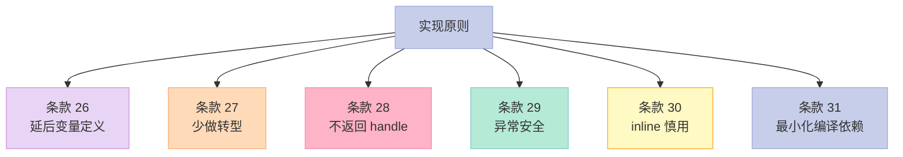

> **一句话核心结论**：C++ 实现细节有 6 个"看不见但影响巨大"的工程点：变量定义时机、隐式转换、namespace 与友元边界、编译期依赖、复合（inheritance vs composition vs private inheritance）、inline 的隐性代价。**掌握这 6 点，你的代码会从"能跑"升级到"跑得快、编译快、维护快"**。

---

## 系列导航

| # | 文章 | 状态 |
|:--|:--|:--|
| 0 | [系列总览](/2026/06/18/effective-cpp-00-series-index/) | ✅ 已发布 |
| 1 | [让自己习惯 C++](/2026/06/18/effective-cpp-01-accustom-cplusplus/) | ✅ 已发布 |
| 2 | [构造/析构/赋值](/2026/06/18/effective-cpp-02-constructors-destructors/) | ✅ 已发布 |
| 3 | [资源管理](/2026/06/18/effective-cpp-03-resource-management/) | ✅ 已发布 |
| 4 | [设计与声明](/2026/06/18/effective-cpp-04-designs-and-declarations/) | ✅ 已发布 |
| 5 | [本文：实现](/2026/06/18/effective-cpp-05-implementations/) | ✅ 已发布 |
| 6 | 继承与 OOP | 🔜 计划中 |
| ... | ... | ... |

---

## 前言：什么是 C++ 的"实现"？

C++ 的"实现"是**写类内部代码的工程哲学**——和"设计"对应：

- **设计**：class 的对外接口（用户看到什么）
- **实现**：class 的内部细节（用户看不到，但影响**性能、编译时间、可维护性**）

本章 6 个条款覆盖 6 个核心点：

1. **变量定义时机**（条款 26）——能晚就晚
2. **隐式转换**（条款 27）——少用 explicit 改用 const&
3. **namespace 与友元**（条款 28）——分文件、避友元
4. **编译依赖**（条款 31）——pimpl 模式
5. **复合 vs 继承**（条款 32 预览）——三种关系
6. **inline**（条款 30）——不是"想 inline 就 inline"

---

## 一、条款 26：尽可能延后变量定义式的出现

### 1.1 反例：提前定义可能不用的变量

```cpp
// ❌ 反例
void process(const std::string& password) {
    std::string encrypted;          // 提前定义
    if (password.size() < 8) {
        throw std::invalid_argument("password too short");
        // encrypted 没用到
    }
    encrypted = encrypt(password);
    // ... 用 encrypted
}
```

**问题**：

1. `encrypted` 构造了一次
2. `password` 短时抛异常——`encrypted` 构造"白做"
3. `encrypted = encrypt(password)` 是赋值（不是构造）——效率更低

### 1.2 解决方案：延后定义

```cpp
// ✅ 延后到"使用前"
void process(const std::string& password) {
    if (password.size() < 8) {
        throw std::invalid_argument("password too short");
    }
    std::string encrypted = encrypt(password);  // ✅ 只在需要时构造
    // ... 用 encrypted
}
```

**优势**：

- 构造一次（直接初始化）
- 不会"白做"
- 代码更易读

### 1.3 循环中的"延后"

```cpp
// 方案 A：循环外定义 + 赋值
Widget w;
for (int i = 0; i < n; ++i) {
    w = someWidget(i);  // n 次赋值
    // ...
}

// 方案 B：循环内定义
for (int i = 0; i < n; ++i) {
    Widget w = someWidget(i);  // n 次构造 + n 次析构
    // ...
}
```

**哪个更好？**

| 维度 | 方案 A | 方案 B |
|------|--------|--------|
| 构造次数 | 1 | n |
| 析构次数 | 1 | n |
| 赋值次数 | n | 0 |
| 总成本 | 1 构 + 1 析 + n 赋值 | n 构 + n 析 + 0 赋值 |
| 适用 | `Widget` 拷贝赋值便宜 | `Widget` 拷贝构造便宜 |

**经验法则**：

- `Widget` 是"轻"类型——`int`、`double`、小 struct——用方案 A
- `Widget` 是"重"类型（拷贝很贵）——用方案 B
- 难判断？用方案 A（更通用）

### 1.4 关键启示

1. **变量定义尽量延后到使用前**——避免"白构造"
2. **能用"直接初始化"（`= someValue`），不要"先默认构造再赋值"**——少一次默认构造
3. **循环中的定义是经典问题**——权衡"n 次构造"和"n 次赋值"

---

## 二、条款 27：尽量少做转型动作

### 2.1 C++ 的 4 种转型

| 转型 | 用途 | 安全性 |
|------|------|--------|
| `const_cast<T>(expr)` | 移除 const / volatile | ⚠️ 仅有的"改 const"方式 |
| `dynamic_cast<T>(expr)` | 安全的下行转型（运行时检查） | ✅ 安全（有 RTTI） |
| `reinterpret_cast<T>(expr)` | 位级重解释（指针转 int、void*） | ❌ 极不安全 |
| `static_cast<T>(expr)` | 隐式转换、显式类型转换 | ⚠️ 编译期，不检查 |

**C 风格转型 `(T)expr` 等价于上述之一**（视上下文）。

### 2.2 反例 1：dynamic_cast 滥用

```cpp
// ❌ 反例
class Window { /*...*/ };
class SpecialWindow : public Window {
public:
    void blink();
};

void process(Window* w) {
    if (auto* sw = dynamic_cast<SpecialWindow*>(w)) {  // ❌ 性能差
        sw->blink();
    }
}
```

**问题**：

1. `dynamic_cast` 要查 RTTI（运行时类型信息）——慢
2. 频繁调用是性能瓶颈
3. 通常意味着设计有问题——用虚函数更好

**正确做法**：

```cpp
// ✅ 虚函数
class Window {
public:
    virtual void onTick() {}  // 基类默认空实现
};
class SpecialWindow : public Window {
public:
    void onTick() override {
        // 调 blink 等
        blink();
    }
};

void process(Window* w) {
    w->onTick();  // ✅ 多态调用，无转型
}
```

### 2.3 反例 2：static_cast 与多态

```cpp
// ❌ static_cast 多态
class Window { /* 基类 */ };
class SpecialWindow : public Window { /*...*/ };

void process(Window* w) {
    // ❌ 这是"硬性下转"——如果 w 真的不是 SpecialWindow，UB
    auto* sw = static_cast<SpecialWindow*>(w);
    sw->blink();
}
```

**问题**：

- 编译期不检查类型
- 如果 `w` 不是 `SpecialWindow*`——UB（未定义行为）

### 2.4 反例 3：把转型当"转换算法"

```cpp
// ❌ 把 double 转 int 当"取整"
double d = 3.14;
int i = static_cast<int>(d);  // 3
// 应该用 std::lround / std::floor
int i = static_cast<int>(std::floor(d + 0.5));  // 4（四舍五入）
```

### 2.5 反例 4：把转型当"函数重载"

```cpp
// ❌ 反例
class Window { /*...*/ };
typedef std::vector<std::shared_ptr<Window>> VP;
typedef std::vector<std::shared_ptr<SpecialWindow>> VSP;

VSP vsp;
VP vp(vsp.begin(), vsp.end());  // ❌ 用迭代器构造，类型不匹配
```

**正确做法**：

```cpp
// ✅ 用算法替代转型
VSP vsp;
for (const auto& sp : vsp) {
    vp.push_back(std::static_pointer_cast<Window>(sp));
}
```

### 2.6 必备规则

| 规则 | 原因 |
|------|------|
| 优先"无转型"的设计 | 用虚函数替代 dynamic_cast |
| 必须用 `const_cast`？避免 | 真的 const 不要改——重新设计 |
| 必须用 `dynamic_cast`？ | 优先用虚函数；真的需要再考虑 |
| `reinterpret_cast`？几乎不用 | 仅用于底层（驱动、序列化） |
| 避免 C 风格转型 | 用 `xxx_cast<>` 明确意图 |

### 2.7 关键启示

1. **转型是 C++ 设计的"坏味道"**——能避免就避免
2. **`dynamic_cast` 慢 + 意味设计问题**——用虚函数
3. **C 风格转型不明确**——用 `xxx_cast<>`
4. **`const_cast` 几乎总在掩盖 bug**——重新设计

---

## 三、条款 28：避免返回 handles 指向对象内部成分

### 3.1 什么是 handle？

```cpp
class Window {
    std::vector<Shape*> shapes_;
public:
    std::vector<Shape*>& shapes() { return shapes_; }  // 返回 handle
};
```

**handle**：指针、引用、迭代器——**访问对象内部**的"把手"。

### 3.2 反例：返回 handle 导致"悬挂引用"

```cpp
// ❌ 反例
class Window {
    std::vector<Shape*> shapes_;
public:
    // 返回内部容器的引用
    std::vector<Shape*>& shapes() { return shapes_; }
};

Window w;
auto& shapes = w.shapes();
w.someMethodThatFreesShapes();  // shapes_ 被清空
shapes.push_back(new Shape());  // ❌ shapes 引用悬空
```

### 3.3 反例 2：const 引用也能"修改对象"

```cpp
// ❌ 反例 2
class String {
    char* data_;
    size_t size_;
public:
    const char& operator[](size_t i) const { return data_[i]; }
};

const String s("hello");
const char& c = s[0];   // c 是 s[0] 的引用
s = "world";             // s 改了
std::cout << c;          // ❌ c 引用悬空
```

**为什么悬空？** `s` 的赋值可能让 `data_` 指向新内存——`c` 还引用旧地址。

### 3.4 解决方案

| 方案 | 做法 | 适用 |
|------|------|------|
| **返回 const 引用** | 限制修改 | 仍有悬挂问题 |
| **返回"拷贝"** | 值返回 | 性能低 |
| **用"代理"** | 代理类 | 复杂 |
| **干脆不返回 handle** | 改成成员函数 | 最佳 |

### 3.5 实战：日期类的"今天"是 static

```cpp
// ❌ 反例
class Calendar {
    Date today_;
public:
    const Date& today() const { return today_; }  // OK，但
};

const Date& d = cal.today();  // cal 析构后 d 悬空
```

**改进**：

```cpp
// ✅ 方案 1：返回新对象
Date today() const { return today_; }  // 值返回

// ✅ 方案 2：把 today 设为 static（生命周期等于程序）
class Calendar {
public:
    static const Date& today() {
        static Date d = getCurrentDate();
        return d;
    }
};
```

### 3.6 关键启示

1. **返回 handle（指针/引用/迭代器）= 把"对象内部成分"借出去**
2. **外部使用期间，对象可能析构/重赋值——handle 悬空**
3. **优先"不返回 handle"**——返回新对象或不用 handle
4. **`operator[]` 必须返回引用**——但要清楚"对象赋值后引用失效"

---

## 四、条款 29：为"异常安全"而努力

### 4.1 三个保证等级

| 等级 | 含义 | 例子 |
|------|------|------|
| **基本保证** | 异常时，对象处于有效状态（不变），但状态可能改变 | 异常后对象可析构、可赋值 |
| **强烈保证** | 异常时，对象状态**完全回滚**（像没调用过） | copy-and-swap 模式 |
| **不抛保证** | 异常时，函数**绝不会**抛异常（`noexcept`） | 析构函数、`swap` |

### 4.2 反例：异常不安全

```cpp
// ❌ 异常不安全
class PrettyMenu {
    std::shared_ptr<Image> bg_;
    int changeCount_;
public:
    void changeBackground(std::istream& imgSrc) {
        ++changeCount_;           // (1) 修改状态
        bg_.reset(new Image(imgSrc));  // (2) 可能抛 bad_alloc
        // 如果 (2) 抛异常：
        //   - changeCount_ 已经 +1
        //   - bg_ 是旧 image
        //   - 对象状态不一致！
    }
};
```

### 4.3 解决方案：copy-and-swap（强烈保证）

```cpp
// ✅ 异常安全
class PrettyMenu {
    std::shared_ptr<Image> bg_;
    int changeCount_;
public:
    void changeBackground(std::istream& imgSrc) {
        using std::swap;
        // 1. 先在临时对象上做所有可能抛的操作
        std::shared_ptr<Image> pNew(new Image(imgSrc));
        ++changeCount_;
        // 2. 不抛异常的部分最后做
        swap(bg_, pNew);  // noexcept swap
    }
};
```

**保证**：

- 如果 `new Image` 抛异常：`changeCount_` 没改、`bg_` 没改——对象状态回滚
- 如果 `swap` 抛（一般不会）：`noexcept`

### 4.4 不抛保证的 4 个准则

```cpp
// 1. 析构函数：默认 noexcept，不要抛
~T() noexcept;

// 2. swap：声明 noexcept
void swap(T& other) noexcept;

// 3. 移动构造/赋值：能 noexcept 就 noexcept
T(T&&) noexcept;
T& operator=(T&&) noexcept;

// 4. 内部状态修改：先在临时对象上做
T& operator=(const T& rhs) {
    T tmp(rhs);   // 拷贝——可能抛
    swap(tmp);    // noexcept
    return *this;
}
```

### 4.5 关键启示

1. **任何"修改多个内部状态"的函数都要想"异常安全"**
2. **优先"强烈保证"**（copy-and-swap 模式）
3. **实在不行给"基本保证"**——但绝不能"无保证"（资源泄漏、不变量破坏）
4. **析构、swap、移动 默认 noexcept**

---

## 五、条款 30：透彻了解 inlining 的里里外外

### 5.1 什么是 inline？

**inline 关键字** = **请求**编译器把函数体直接插入调用点，避免函数调用开销。

```cpp
inline int add(int a, int b) { return a + b; }  // inline 函数
int x = add(3, 4);  // 编译器可能展开为：int x = 3 + 4;
```

### 5.2 80% 的开发者不知道的事

**"inline" 不是"必须 inline"**——是**"允许编译器在多个编译单元定义"**的许可。

| 情况 | 行为 |
|------|------|
| 函数体在 class 内部 | 隐式 inline（成员函数定义在 class 内） |
| `inline` 关键字 | 显式请求 + 允许多定义 |
| 编译器决定 | 最终是否 inline 由编译器决定（看优化） |

**反直觉**：

```cpp
class Widget {
public:
    void f() { /*...*/ }  // 隐式 inline（类内定义）
    void g();             // 普通函数
};
```

**`inline` 函数可能在编译时被"忽略"**——编译器认为不合适就不 inline。

### 5.3 inline 的代价

| 代价 | 数量级 | 说明 |
|------|--------|------|
| **代码膨胀** | 每次调用一份机器码 | 大函数 inline 后二进制变大 |
| **指令 cache miss** | 性能反而下降 | 大函数展开后 cache 命中率低 |
| **调试困难** | debugger 跳不进内联函数 | 设置断点没反应 |
| **修改影响** | 修改 inline 函数 = 重新编译所有用到它的 TU | 编译时间长 |

### 5.4 inline 的"正确使用"

```cpp
// ✅ 适合 inline
class Point {
    int x_, y_;
public:
    // 1. 简单 getter/setter：class 内隐式 inline
    int x() const { return x_; }
    void setX(int x) { x_ = x; }
};

// 2. 简单算法函数：显式 inline
inline int max(int a, int b) { return a > b ? a : b; }

// 3. 模板函数：通常放在头文件
template<typename T>
inline T square(T x) { return x * x; }
```

```cpp
// ❌ 不适合 inline
inline void processHugeData(...) {  // 1000 行代码
    // ...
}
// 后果：每个调用点都展开一份 1000 行的代码！
```

### 5.5 inline 与"非成员函数"

```cpp
// inline 非成员函数
inline void swap(T& a, T& b) {
    T tmp = std::move(a);
    a = std::move(b);
    b = std::move(tmp);
}

// 必须放在头文件（多编译单元可见）
```

### 5.6 函数模板与 inline

```cpp
// 模板函数通常也是 inline 的
template<typename T>
void swap(T& a, T& b) {
    T tmp = std::move(a);
    a = std::move(b);
    b = std::move(tmp);
}
```

**因为模板在实例化时需要"完整定义"**——所以放在头文件。

### 5.7 关键启示

1. **inline 不是"一定 inline"**——是请求 + 多定义许可
2. **类内定义的成员函数隐式 inline**
3. **小函数适合 inline，大函数不适合**
4. **inline 函数的修改会触发**"**重新编译所有客户端**"（ABI 不稳定）
5. **调试时可能"跳不进"**——临时禁用 inline 重新编译

---

## 六、条款 31：将文件间的编译依存关系降至最低

### 6.1 问题：头文件依赖 = 编译依赖

```cpp
// widget.h
#include <string>
#include <vector>
#include "complex_internal_class.h"  // 重型头文件

class Widget {
    std::string name_;
    std::vector<int> data_;
    ComplexInternalClass impl_;  // 完整定义必须
};
```

**问题**：

- `widget.h` 改了 `ComplexInternalClass`——所有 include `widget.h` 的文件要重编译
- "小改动"导致"长编译时间"

### 6.2 解决方案 1：前向声明 + 引用/指针

```cpp
// widget.h
#include <string>
#include <vector>

class ComplexInternalClass;  // 前向声明即可

class Widget {
    std::string name_;
    std::vector<int> data_;
    ComplexInternalClass* impl_;  // 指针——只需前向声明
};
```

**优势**：

- `widget.h` 不再 include "重型头文件"
- 编译 `widget.h` 的客户端不需要知道 `ComplexInternalClass` 的完整定义

### 6.3 解决方案 2：pimpl 习惯用法

```cpp
// widget.h
#pragma once
#include <memory>
#include <string>

class Widget {
public:
    Widget();
    ~Widget();
    Widget(Widget&&) noexcept;
    Widget& operator=(Widget&&) noexcept;
    Widget(const Widget&) = delete;
    Widget& operator=(const Widget&) = delete;

    void setName(const std::string& name);
    std::string getName() const;
    void draw() const;

private:
    struct Impl;  // 前向声明
    std::unique_ptr<Impl> pImpl_;  // 指针
};

// widget.cpp
#include "widget.h"
#include "complex_internal_class.h"  // 完整定义只在 .cpp

struct Widget::Impl {
    std::string name_;
    ComplexInternalClass helper_;  // 完整定义
    void drawImpl() const { /*...*/ }
};

Widget::Widget() : pImpl_(std::make_unique<Impl>()) {}
Widget::~Widget() = default;
Widget::Widget(Widget&&) noexcept = default;
Widget& Widget::operator=(Widget&&) noexcept = default;
void Widget::setName(const std::string& name) { pImpl_->name_ = name; }
std::string Widget::getName() const { return pImpl_->name_; }
void Widget::draw() const { pImpl_->drawImpl(); }
```

**pimpl 的优势**：

1. **头文件极简**——客户端只看见 `Widget` 接口
2. **实现完全隐藏**——`Impl` 是"private 嵌套类"
3. **修改 `Impl` 不影响客户端**——重新编译 `widget.cpp` 即可
4. **ABI 稳定**——`Widget` 的二进制布局（`unique_ptr` 的大小）固定

### 6.4 pimpl 的代价

| 代价 | 数量级 | 说明 |
|------|--------|------|
| 一次额外堆分配 | small | 每次构造 `Widget` 都要 new Impl |
| 一次额外间接寻址 | small | 每次访问都要 `pImpl_->xxx` |
| 移动构造要小心 | 必做 | `unique_ptr` 的移动 OK；其他需手动实现 |
| 代码量增加 | 必有 | 头/源分离 + 转发函数 |

### 6.5 解决方案 3：抽象基类 + 工厂（动态多态）

```cpp
// widget_abstract.h
#pragma once
#include <memory>

class Widget {
public:
    virtual ~Widget() = default;
    virtual void draw() const = 0;
    static std::unique_ptr<Widget> create();
};
// 注意：没有具体成员
```

**这是 Java/C# 的接口风格**——多态在运行时确定，但编译依赖最小。

### 6.6 三种方案对比

| 维度 | 包含头文件 | 前向声明 + 指针/引用 | pimpl | 抽象基类 |
|------|------------|----------------------|-------|----------|
| 性能 | 最佳 | 最佳 | 一次间接寻址 | 虚函数 + 一次间接寻址 |
| 编译依赖 | 最高 | 中 | 最低 | 最低 |
| 内存开销 | 0 | 0 | 一个指针 | vptr |
| 实现隐藏 | ❌ | ❌ | ✅ | ✅ |
| ABI 稳定 | ❌ | ❌ | ✅ | ✅ |

### 6.7 关键启示

1. **头文件依赖 = 编译依赖**——尽量少 include
2. **优先前向声明 + 指针/引用**——避免完整定义
3. **重型实现用 pimpl 模式**——隐藏 + 加速编译
4. **接口用抽象基类**——多态 + ABI 稳定
5. **C++20 modules 是终极方案**——"模块化头文件"

---

## 七、6 个条款的"实现"全景



**核心思路**：

- **延后**：能晚定义就晚定义
- **少转**：能避免转型就避免
- **不借**：不把 handle 借出去
- **异常安全**：copy-and-swap 模式
- **慎 inline**：大函数不要 inline
- **最小依赖**：pimpl + 前向声明

---

## 八、常见误区与陷阱

### 8.1 误区 1：提前定义不用的变量

```cpp
// ❌
void f() {
    std::vector<int> v;  // 提前
    if (cond) return;    // v 没用上
    v = compute();
}
```

### 8.2 误区 2：dynamic_cast 滥用

```cpp
// ❌ dynamic_cast 是"设计坏味道"
if (auto* sw = dynamic_cast<SpecialWindow*>(w)) { /*...*/ }
// ✅ 改用虚函数
w->onTick();
```

### 8.3 误区 3：返回内部容器引用

```cpp
// ❌
std::vector<Shape*>& shapes() { return shapes_; }
// ✅ 改为 const 引用 or 值返回
const std::vector<Shape*>& shapes() const { return shapes_; }
```

### 8.4 误区 4：忽略异常安全

```cpp
// ❌ 多步操作无异常安全
++changeCount_;
bg_.reset(new Image(imgSrc));  // 可能抛
// ✅ copy-and-swap
auto pNew = std::make_shared<Image>(imgSrc);
++changeCount_;
swap(bg_, pNew);
```

### 8.5 误区 5：把大函数 inline

```cpp
// ❌ 1000 行的 inline
inline void processAll() { /* 1000 行 */ }  // 灾难
```

### 8.6 误区 6：头文件 include "重型"内容

```cpp
// ❌
#include <iostream>
#include <boost/spirit/include/qi.hpp>  // 巨型头文件
class Widget { /*...*/ };

// ✅ 前向声明
class QiParser;  // 前向声明
class Widget {
    QiParser* parser_;
};
```

---

## 九、C++11/14/17 的演进

| 主题 | C++98 时代 | C++11/14/17 时代 |
|------|------------|-----------------|
| 转型 | 主要是 C 风格 + `static_cast` 等 | `xxx_cast` + `std::move` |
| 异常安全 | 手写 | 移动构造 + `noexcept` + RAII |
| 编译依赖 | `#pragma once` + 前向声明 | **C++20 modules**——真正模块化 |
| inline | 类内 + 关键字 | 模板默认 inline |
| 抽象 | 抽象基类 | `std::function` / `std::any` |

**C++20 modules 预览**：

```cpp
// widget.cppm
export module widget;
import <string>;
import <vector>;
import "complex_internal";

export class Widget {
    std::string name_;
    ComplexInternalClass* impl_;
public:
    void draw();
};
```

**优势**：

- 模块编译一次，多次使用
- 不暴露宏 / 内部 include
- 编译时间可能减少 50%+

---

## 十、面试高频考点

### 10.1 必背题

| 题目 | 答案要点 |
|------|----------|
| 为什么要延后变量定义？ | 避免"白构造" + 提升可读性 |
| C++ 的 4 种转型是哪些？ | `const_cast` / `dynamic_cast` / `reinterpret_cast` / `static_cast` |
| `dynamic_cast` 慢在哪？ | RTTI 查询（运行时类型信息） |
| 异常安全的 3 个保证？ | 基本 / 强烈（copy-and-swap） / 不抛（noexcept） |
| inline 是"一定 inline"吗？ | 不一定——是请求 + 多定义许可 |
| 什么是 pimpl？ | 私有 Impl + `unique_ptr`——隐藏实现 + 加速编译 |
| 前向声明什么时候够用？ | 当使用"指针/引用"时——不需完整定义 |
| 函数体在 class 内隐式是什么？ | inline（成员函数） |

### 10.2 高频追问

| 追问 | 关键点 |
|------|--------|
| 循环外还是循环内定义变量？ | 重类型：循环内；轻类型：循环外 |
| 析构为什么 noexcept？ | 否则可能 std::terminate |
| pimpl 模式中，~Widget 必须在 .cpp 吗？ | 必须——unique_ptr 需要看到完整定义 |
| C 风格转型和 C++ 转型区别？ | C 风格不明确；C++ 转型明确意图 |
| inline 函数调试困难？ | 是的——可能"跳过"函数体 |
| 模块（modules）能完全替代头文件吗？ | C++20 起是目标，但生态还在迁移 |

---

## 十一、配套实验

### 11.1 实验 1：异常安全的 copy-and-swap

```cpp
// 文件：exception_safety.cpp
#include <iostream>
#include <memory>
#include <stdexcept>

class Image {
public:
    Image() { std::cout << "Image ctor\n"; }
    Image(const Image&) { std::cout << "Image copy ctor\n"; }
    ~Image() { std::cout << "Image dtor\n"; }
};

class PrettyMenu {
    std::shared_ptr<Image> bg_;
    int changeCount_ = 0;
public:
    void changeBackgroundBad() {
        ++changeCount_;
        bg_.reset(new Image());  // 可能抛
    }

    void changeBackgroundGood() {
        using std::swap;
        std::shared_ptr<Image> pNew = std::make_shared<Image>();
        ++changeCount_;
        swap(bg_, pNew);  // noexcept
    }

    void show() const {
        std::cout << "count=" << changeCount_ << " hasBg=" << (bg_ != nullptr) << "\n";
    }
};

int main() {
    PrettyMenu m;
    m.show();
    m.changeBackgroundGood();
    m.show();
    return 0;
}
```

### 11.2 实验 2：pimpl 完整实现

```cpp
// 文件：widget_pimpl.h
#pragma once
#include <memory>
#include <string>

class Widget {
public:
    Widget();
    ~Widget();
    Widget(Widget&&) noexcept;
    Widget& operator=(Widget&&) noexcept;
    Widget(const Widget&) = delete;
    Widget& operator=(const Widget&) = delete;

    void setName(const std::string& name);
    std::string getName() const;
    void draw() const;

private:
    struct Impl;
    std::unique_ptr<Impl> pImpl_;
};

// 文件：widget_pimpl.cpp
#include "widget_pimpl.h"
#include <iostream>

struct Widget::Impl {
    std::string name_;
    int data_ = 0;
    void drawImpl() const {
        std::cout << "Widget: " << name_ << "\n";
    }
};

Widget::Widget() : pImpl_(std::make_unique<Impl>()) {}
Widget::~Widget() = default;
Widget::Widget(Widget&&) noexcept = default;
Widget& Widget::operator=(Widget&&) noexcept = default;
void Widget::setName(const std::string& name) { pImpl_->name_ = name; }
std::string Widget::getName() const { return pImpl_->name_; }
void Widget::draw() const { pImpl_->drawImpl(); }

// 文件：main.cpp
#include "widget_pimpl.h"
int main() {
    Widget w;
    w.setName("hello");
    w.draw();
    return 0;
}
```

### 11.3 实验 3：4 种转型对比

```cpp
// 文件：casts_demo.cpp
#include <iostream>

class Base { public: virtual ~Base() = default; };
class Derived : public Base { public: void hello() { std::cout << "hello\n"; } };

int main() {
    Base* b = new Derived();

    // 1. dynamic_cast
    if (auto* d = dynamic_cast<Derived*>(b)) {
        d->hello();  // ✅ 运行时检查
    }

    // 2. static_cast
    auto* d2 = static_cast<Derived*>(b);
    d2->hello();  // ⚠️ 编译期假设 b 是 Derived*

    // 3. const_cast
    const int x = 42;
    int& y = const_cast<int&>(x);  // ⚠️ 改 const 是 UB

    // 4. reinterpret_cast
    intptr_t addr = reinterpret_cast<intptr_t>(b);  // 极不安全
    std::cout << "addr = " << addr << "\n";

    delete b;
    return 0;
}
```

---

## 十二、回到 6 条黄金法则

| 条款 | 黄金法则 |
|------|----------|
| 26 | 变量定义尽量延后到使用前 |
| 27 | 少做转型——优先虚函数替代 dynamic_cast |
| 28 | 不返回 handle 指向对象内部 |
| 29 | 异常安全：copy-and-swap 模式（强烈保证） |
| 30 | inline 是请求而非命令——大函数不 inline |
| 31 | 最小化编译依赖：前向声明 + pimpl |

---

## 十三、结尾思考题

> **思考题 1**：以下代码有什么问题？

```cpp
class Window {
    std::vector<Shape*> shapes_;
public:
    std::vector<Shape*>& shapes() { return shapes_; }
};

Window w;
auto& shapes = w.shapes();
w.reset();
shapes.push_back(new Shape());  // ?
```

> **思考题 2**：实现一个异常安全的 `changeBackground`，要求"强烈保证"。

> **思考题 3**：以下函数应该 inline 吗？为什么？

```cpp
inline void processAllData() {
    // 500 行代码
}
```

> **思考题 4**：pimpl 模式中，`~Widget()` 为什么必须在 `.cpp` 中实现？`= default` 行不行？

> **思考题 5**：如何用 C++20 modules 改造一个"重型"头文件？写出示例。

---

## 十四、本篇速查表

| 主题 | 关键 API / 模式 | 适用场景 |
|------|----------------|----------|
| 延后变量定义 | 用前再定义 | 任何函数 |
| 4 种转型 | `xxx_cast<>` | 明确意图 |
| 不返回 handle | const 引用 / 值 | 内部数据保护 |
| 异常安全 | copy-and-swap | 修改多状态 |
| inline | 类内定义 | 小函数 / 模板 |
| pimpl | `unique_ptr<Impl>` | 重型实现 |
| 前向声明 | `class T;` | 指针/引用成员 |

---

## 十五、系列导航

| # | 文章 | 状态 |
|:--|:--|:--|
| 0 | [系列总览](/2026/06/18/effective-cpp-00-series-index/) | ✅ 已发布 |
| 1 | [让自己习惯 C++](/2026/06/18/effective-cpp-01-accustom-cplusplus/) | ✅ 已发布 |
| 2 | [构造/析构/赋值](/2026/06/18/effective-cpp-02-constructors-destructors/) | ✅ 已发布 |
| 3 | [资源管理](/2026/06/18/effective-cpp-03-resource-management/) | ✅ 已发布 |
| 4 | [设计与声明](/2026/06/18/effective-cpp-04-designs-and-declarations/) | ✅ 已发布 |
| 5 | [本文：实现](/2026/06/18/effective-cpp-05-implementations/) | ✅ 已发布 |
| 6 | 继承与 OOP | 🔜 计划中 |
| 7 | 模板与泛型 | 🔜 计划中 |
| 8 | 定制 new / delete | 🔜 计划中 |
| 9 | 杂项 + 总结 | 🔜 计划中 |

---

**下一篇**：第 6 篇《继承与 OOP：33 个条款讲透 C++ 继承体系》——条款 32-40 一起讲透：public 继承的语义、复合的三原则、private 继承、virtual 函数实现的 NVI 模式、模板方法、避免遮蔽、重载 vs 缺省参数、多重继承与虚继承。

> **行动建议**：
> 1. **今天**：把你项目里"提前定义但不立即使用"的变量延后
> 2. **今天**：用虚函数替换你的 `dynamic_cast`
> 3. **本周**：识别你项目里的"返回 handle"接口——改成 const 引用 / 值
> 4. **本周**：用 copy-and-swap 改造一个"异常不安全"的多步函数
> 5. **思考**：你的类有没有"不必要的 include"？用前向声明 + pimpl 优化
