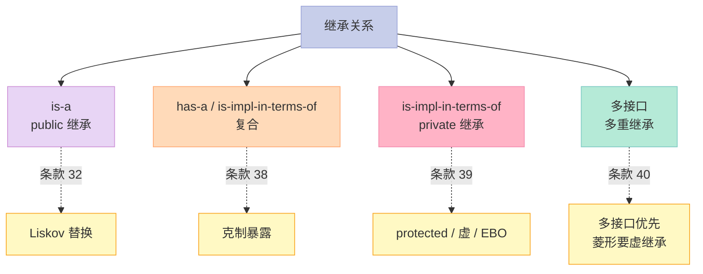
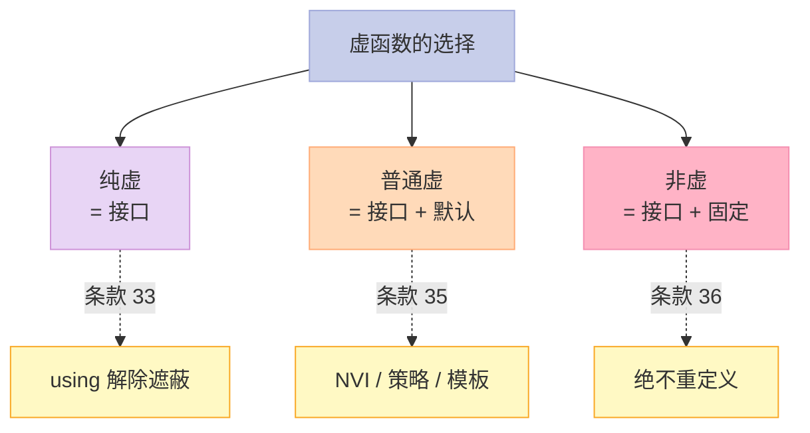

> **一句话核心结论**：C++ 继承有三种关系——**is-a（public 继承）、has-a / is-implemented-in-terms-of（复合）、is-implemented-in-terms-of（private 继承）**。本章 9 个条款讲透：什么时候用 public 继承、什么时候复合更好、private 继承的边界、虚函数的 7 个工程点、模板方法模式、多重继承的虚继承、避免遮蔽名字、virtual 函数替代方案。

---

## 系列导航

| # | 文章 | 状态 |
|:--|:--|:--|
| 0 | [系列总览](/2026/06/18/effective-cpp-00-series-index/) | ✅ 已发布 |
| 1 | [让自己习惯 C++](/2026/06/18/effective-cpp-01-accustom-cplusplus/) | ✅ 已发布 |
| 2 | [构造/析构/赋值](/2026/06/18/effective-cpp-02-constructors-destructors/) | ✅ 已发布 |
| 3 | [资源管理](/2026/06/18/effective-cpp-03-resource-management/) | ✅ 已发布 |
| 4 | [设计与声明](/2026/06/18/effective-cpp-04-designs-and-declarations/) | ✅ 已发布 |
| 5 | [实现](/2026/06/18/effective-cpp-05-implementations/) | ✅ 已发布 |
| 6 | [本文：继承与 OOP](/2026/06/18/effective-cpp-06-inheritance-and-oop/) | ✅ 已发布 |
| 7 | 模板与泛型 | 🔜 计划中 |
| ... | ... | ... |

---

## 前言：为什么"继承"是 C++ 最难的部分？

Java / C# 程序员：继承就是 `extends` —— 一个类继承另一个类。

C++ 程序员：**继承分 5 种**（public / protected / private）、**关系分 3 种**（is-a / has-a / is-implemented-in-terms-of）、**多态分 2 种**（编译期 / 运行期）、**虚继承处理菱形**——

C++ 的"继承"是一整套**哲学体系**，用错一种就是坑。

本章 9 个条款的核心问题：

- **什么时候用 public 继承？**（is-a 关系）
- **什么时候用复合？**（has-a / is-implemented-in-terms-of）
- **什么时候用 private 继承？**（实现继承）
- **什么时候用多重继承？**（接口 + 实现）
- **虚函数怎么设计才不出错？**

---

## 一、条款 32：确定你的 public 继承塑模出 is-a 关系

### 1.1 什么是 is-a？

```cpp
// "Student is a Person"（学生是人）
class Person { /*...*/ };
class Student : public Person { /*...*/ };  // ✅ 正确
```

**is-a** 的严格定义：

> **任何**使用基类对象的地方，**都能**用派生类对象替换——而不破坏逻辑。

**Liskov 替换原则**（LSP）：

```cpp
void process(const Person& p) { /* 用 p */ }
Person p;
Student s;
process(p);  // ✅
process(s);  // ✅ 学生也是人
```

### 1.2 反例：违反 is-a 的灾难

```cpp
// ❌ 反例：Square "is a" Rectangle？
class Rectangle {
public:
    virtual void setWidth(double w) { width_ = w; }
    virtual void setHeight(double h) { height_ = h; }
    double area() const { return width_ * height_; }
private:
    double width_, height_;
};

class Square : public Rectangle {
public:
    void setWidth(double w) override {
        width_ = height_ = w;  // 正方形边长相等
    }
    void setHeight(double h) override {
        width_ = height_ = h;
    }
};

void test(Rectangle& r) {
    r.setWidth(5);
    r.setHeight(4);
    assert(r.area() == 20);  // 5 * 4 = 20
}

Square s;
test(s);  // 灾难！setHeight(4) 之后 width_ 也变 4
            // area = 4 * 4 = 16，断言失败
```

**为什么违反？**

- "Rectangle" 的不变量：width 和 height 独立
- "Square" 的不变量：width == height
- Square 不能**完全**做 Rectangle 能做的事

**正确做法**：

```cpp
// ✅ 不让 Square 继承 Rectangle——让它们都继承 Shape
class Shape {
public:
    virtual double area() const = 0;
};
class Rectangle : public Shape { /*...*/ };
class Square : public Shape { /*...*/ };
```

### 1.3 真实世界：鸟的"is-a"问题

```cpp
// ❌ 反例：企鹅"is a"鸟？
class Bird {
public:
    virtual void fly() { /* 飞 */ }
};
class Penguin : public Bird {
    // 企鹅不能飞——fly() 怎么办？
};

// 方案 A：抛异常（运行时失败）
void Penguin::fly() override {
    throw std::runtime_error("Penguins can't fly");
}

// 方案 B：根本不让 Penguin 继承 Bird
class Bird { /* 不会飞 */ };
class FlyingBird : public Bird {
public:
    virtual void fly();
};
class Penguin : public Bird { /* 不会飞 */ };
class Sparrow : public FlyingBird { /*...*/ };
```

**启示**：**is-a 必须是真的"每一个属性都成立"**——不能有"特例"。

### 1.4 关键启示

1. **public 继承 = is-a**——不可妥协
2. **Liskov 替换原则**——派生类必须能完全替代基类
3. **违反 is-a 的常见征兆**：基类有"派生类做不到"的方法
4. **遇到违反时**：重新设计继承关系（用 abstract 中间层）

---

## 二、条款 33：避免遮蔽继承而来的名字

### 2.1 问题：派生类的名字"遮蔽"基类

```cpp
class Base {
public:
    virtual void mf1() const;
    virtual void mf1(int) const;  // 重载
    void mf3() const;
    void mf4() const;
};

class Derived : public Base {
public:
    void mf1() const override;  // 遮蔽 Base::mf1
    void mf5() const;
};

Derived d;
d.mf1();         // ✅ Derived::mf1
d.mf1(42);       // ❌ Derived::mf1 遮蔽了 Base::mf1(int)
d.mf3();         // ✅ Base::mf3
d.mf4();         // ✅ Base::mf4
d.mf5();         // ✅ Derived::mf5
```

**问题**：`Derived::mf1` 遮蔽了 `Base::mf1` 的**所有重载**——即使参数不同。

### 2.2 解决方案 1：using 声明

```cpp
class Derived : public Base {
public:
    using Base::mf1;  // ✅ 让 Base::mf1 在 Derived 可见
    void mf1() const override;
};

Derived d;
d.mf1();         // ✅ Derived::mf1
d.mf1(42);       // ✅ Base::mf1(int)
```

### 2.3 解决方案 2：转发函数

```cpp
class Derived : public Base {
public:
    void mf1() const override;
    // 转发函数
    void mf1(int x) const { Base::mf1(x); }
};
```

**适用**：只想"重载"部分基类方法时。

### 2.4 关键启示

1. **派生类的同名函数会遮蔽基类**——即使参数不同
2. **using 声明** 是首选——简单
3. **转发函数** 是精确控制——复杂但灵活
4. **不要用 using 让"所有继承名字"暴露**——按需

---

## 三、条款 34：区分接口继承和实现继承

### 3.1 虚函数的 4 种语义

```cpp
class Shape {
public:
    // (1) 纯虚函数：派生类必须实现
    virtual void draw() const = 0;

    // (2) 普通虚函数：派生类可重写
    virtual void error(const std::string& msg);

    // (3) 非虚函数：派生类不能重写
    int objectID() const;
};
```

| 类型 | 接口 | 实现 |
|------|------|------|
| **纯虚函数** | ✅ 必须继承 | ❌ 无默认实现 |
| **普通虚函数** | ✅ 继承 | ✅ 提供默认实现（可重写） |
| **非虚函数** | ✅ 继承 | ✅ 固定（不允许改） |

### 3.2 案例：3 种虚函数的"用错"

```cpp
// ❌ 反例：纯虚函数有实现
class Shape {
public:
    virtual void draw() const = 0;
};

void Shape::draw() const {  // 纯虚函数也能有实现
    // 默认实现
}

class Circle : public Shape {
    // 漏了 draw() 实现
};
Circle c;  // ❌ 不能实例化（pure virtual）
```

**反直觉**：纯虚函数**可以**有实现——但派生类**必须**重写才能实例化。

### 3.3 案例：普通虚函数 vs 纯虚函数 + 默认实现

```cpp
// 方案 A：普通虚函数（接口 + 默认实现）
class Shape {
public:
    virtual void draw() const {
        // 默认实现：什么都不做
    }
};

class Derived : public Shape {
    // 可以不重写 draw——继承默认实现
};
// 问题：Derived 可能"忘记"重写——静默 bug

// 方案 B：纯虚函数 + 默认实现
class Shape {
public:
    virtual void draw() const = 0;
};
void Shape::draw() const {
    // 默认实现
}

class Derived : public Shape {
public:
    void draw() const override {
        Shape::draw();  // 显式调用基类默认实现
    }
};
// 优势：Derived 必须"主动选择"用默认实现
```

### 3.4 案例：非虚函数的"is-a 不可改"

```cpp
class Shape {
public:
    int objectID() const;  // 非虚
};

class Circle : public Circle {
    // 不能重写 objectID——所有 Shape 对象的 ID 行为必须一致
};
```

**非虚函数表达**：这个行为**对所有派生类都一样**——不可定制。

### 3.5 关键启示

1. **纯虚函数** = 接口继承（"必须重写"）
2. **普通虚函数** = 接口 + 默认实现（"可重写"）
3. **非虚函数** = 接口 + 固定实现（"不能改"）
4. **默认实现用纯虚 + 实现体**——避免"忘记重写"

---

## 四、条款 35：考虑 virtual 函数以外的其他选择

### 4.1 NVI 模式（Non-Virtual Interface）

```cpp
// ✅ NVI：public non-virtual 包 private virtual
class GameCharacter {
public:
    // public non-virtual 是"接口"
    int healthValue() const {
        // 前置处理
        int ret = doHealthValue();
        // 后置处理
        return ret;
    }
private:
    // private virtual 是"实现"
    virtual int doHealthValue() const {
        // 默认计算
    }
};

class Hero : public GameCharacter {
private:
    int doHealthValue() const override {
        // 英雄的算法
    }
};
```

**NVI 的优势**：

1. **基类可以加"模板代码"**——前置/后置处理
2. **虚函数是 private**——明确"派生类只能重写实现，不能改变接口"
3. **public 函数是 non-virtual**——派生类不能改"外部调用"的形式

### 4.2 策略模式（Strategy Pattern）

```cpp
// 健康计算的"策略"
class HealthCalcFunc {
public:
    virtual int calc(const GameCharacter& gc) const = 0;
    virtual ~HealthCalcFunc() = default;
};

class SlowHealthLoser : public HealthCalcFunc { /*...*/ };
class FastHealthLoser : public HealthCalcFunc { /*...*/ };

class GameCharacter {
    std::shared_ptr<HealthCalcFunc> healthFunc_;
public:
    explicit GameCharacter(std::shared_ptr<HealthCalcFunc> hcf = defaultHealthFunc())
        : healthFunc_(std::move(hcf)) {}

    int healthValue() const {
        return healthFunc_->calc(*this);
    }
};
```

**优势**：

- **运行时可换**——切换策略
- **多个对象共享**——同一策略
- **可测试**——传不同策略

### 4.3 传统虚函数 vs NVI vs 策略

| 维度 | 虚函数 | NVI | 策略 |
|------|--------|-----|------|
| 运行时替换 | ❌ | ❌ | ✅ |
| 模板代码 | ❌ | ✅ | ✅ |
| 编译时绑定 | ✅ | ✅ | ❌（间接） |
| 复杂度 | 低 | 中 | 高 |

### 4.4 关键启示

1. **NVI 模式 = public non-virtual + private virtual**——加模板代码
2. **策略模式 = "对象组合"**——运行时可换
3. **函数对象（functor）替代虚函数**——编译期多态
4. **std::function 也行**——更灵活

---

## 五、条款 36：绝不重新定义继承而来的 non-virtual 函数

### 5.1 反例

```cpp
class Base {
public:
    void mf() const { std::cout << "Base::mf\n"; }
};

class Derived : public Base {
public:
    void mf() const { std::cout << "Derived::mf\n"; }  // ❌ 遮蔽
};

Base* pb = new Derived();
pb->mf();  // ❌ 输出 "Base::mf"
delete pb;
```

**问题**：

- 静态类型是 `Base*`——调 `Base::mf`
- 期望派生类重写？no——非虚函数不能"动态分派"！

### 5.2 为什么"绝不"重新定义？

```cpp
// 重新定义掩盖了"非虚函数的语义"
class Base {
public:
    void mf() const {
        // 不变行为：所有 Base 对象都一样
    }
};

class Derived : public Base {
public:
    void mf() const {  // ❌ 破坏不变量
        // 改成了别的行为——但调用 Base* 时还是原来的！
    }
};
```

**is-a 的矛盾**：

- 如果 `Derived::mf` 必须"和 `Base::mf` 一样"——重新定义就是冗余
- 如果 `Derived::mf` 必须"和 `Base::mf` 不一样"——`mf` 不应该是 non-virtual
- 所以：**任何场景都不该重新定义**

### 5.3 关键启示

1. **non-virtual 函数 = "对所有派生类都一样"**——不要重写
2. **重写 non-virtual = 编译期遮蔽**——调用静态类型版本
3. **想让派生类定制？改成 virtual**

---

## 六、条款 37：绝不重新定义继承而来的缺省参数值

### 6.1 经典陷阱

```cpp
class Shape {
public:
    enum class Color { Red, Green, Blue };
    virtual void draw(Color c = Color::Red) const = 0;  // ❌ 缺省参数
};

class Circle : public Circle {
public:
    void draw(Color c = Color::Green) const override {  // ❌ 重新定义缺省
        // ...
    }
};

Shape* ps = new Circle();
ps->draw();  // ❌ 调 Circle::draw，Color 是 Red（基类决定）
delete ps;
```

**为什么？** 缺省参数是**静态绑定**——按**静态类型**决定。

### 6.2 解决方案 1：NVI 模式

```cpp
// ✅ NVI：缺省参数在 public，private virtual 不再带缺省
class Shape {
public:
    void draw(Color c = Color::Red) const {  // 缺省在这里
        doDraw(c);
    }
private:
    virtual void doDraw(Color c) const = 0;  // private virtual 无缺省
};
```

**优势**：

- `Shape*` / `Circle*` 调 `draw()`——都是 `Red`
- 派生类不重写缺省——避免陷阱

### 6.3 关键启示

1. **缺省参数是静态绑定**——按静态类型
2. **虚函数 + 缺省 = 易踩坑**——避免
3. **NVI 模式**——public 函数带缺省，private virtual 不带

---

## 七、条款 38：通过复合塑模出 has-a 或 "is-implemented-in-terms-of"

### 7.1 复合的两种语义

**has-a**（有一个）：

```cpp
class Address { /*...*/ };
class Person {
private:
    Address address_;  // Person has a Address
};
```

**is-implemented-in-terms-of**（用...实现）：

```cpp
// Set 用 list 实现
template<typename T>
class Set {
private:
    std::list<T> rep_;  // Set is implemented in terms of list
public:
    bool add(const T& item) { /* 用 list 的操作 */ }
};
```

### 7.2 复合 vs 继承：决策表

| 关系 | 用什么？ |
|------|----------|
| **is-a** | public 继承 |
| **has-a** | 复合（值成员） |
| **is-implemented-in-terms-of** | 复合（私有成员）或 private 继承 |

### 7.3 实战：复合优于继承的案例

```cpp
// ❌ 反例：用 public 继承实现 Set
template<typename T>
class Set : public std::list<T> {
public:
    void add(const T& item) { push_back(item); }
    bool contains(const T& item) const {
        return std::find(begin(), end(), item) != end();
    }
};

Set<int> s;
s.add(1);
s.contains(1);  // ✅
s.push_back(2); // ❌ Set 不应该有顺序的语义（但 list 提供 push_back）
```

**问题**：

- 派生类**暴露**了基类的所有 public 接口
- `Set` 不应该有"顺序"语义，但 `list` 有

**正确做法**：

```cpp
// ✅ 用复合
template<typename T>
class Set {
private:
    std::list<T> rep_;  // 私有成员
public:
    void add(const T& item) { rep_.push_back(item); }
    bool contains(const T& item) const {
        return std::find(rep_.begin(), rep_.end(), item) != rep_.end();
    }
};

Set<int> s;
s.add(1);
s.contains(1);  // ✅
s.push_back(2); // ❌ Set 没有 push_back
```

### 7.4 关键启示

1. **复合比继承更"克制"**——只暴露你要的接口
2. **has-a / is-implemented-in-terms-of = 复合**
3. **is-a = public 继承**（不可替代）
4. **优先复合**——继承是"最后手段"

---

## 八、条款 39：明智而审慎地使用 private 继承

### 8.1 private 继承 vs 复合

```cpp
// private 继承
class Widget : private Timer {
    // Widget 用 Timer 实现，但不"是"Timer
};

// 复合
class Widget {
private:
    Timer t_;  // Widget 含有一个 Timer
};
```

**两者都能表达** "Widget is implemented in terms of Timer"。

### 8.2 private 继承的语义

| 维度 | public 继承 | private 继承 |
|------|------------|--------------|
| 派生类"是"基类？ | ✅ | ❌（只是"用基类实现"） |
| 隐式 upcast？ | ✅ | ❌（基类成员变 private） |
| 默认继承 | N/A | private（class） / public（struct） |

### 8.3 什么时候用 private 继承？

#### 场景 1：需要访问基类的 protected 成员

```cpp
class Timer {
public:
    virtual void onTick() const;
protected:
    int currentTick() const;
};

class Widget : private Timer {
    // 假设 Widget 想用 Timer 的 protected currentTick()
    // 复合的话：需要 friend 声明
    // private 继承：直接访问

    void f() {
        int t = currentTick();  // ✅ private 继承可访问
    }
};
```

#### 场景 2：需要重写基类的虚函数

```cpp
class Widget : private Timer {
private:
    void onTick() const override;  // 重写虚函数
};
```

#### 场景 3：空基类优化（EBO）

```cpp
class Empty {};  // 1 字节

class WithMember {
    Empty e_;  // 1 字节
};

class WithPrivateInherit : private Empty {
    // EBO：0 字节（空基类不占空间）
};
```

**C++ 规则**：复合不能 EBO，private 继承可以。

### 8.4 默认用复合

```cpp
// 默认用复合
class Widget {
private:
    Timer timer_;
    // ...
};

// 仅在以下场景用 private 继承：
// 1. 需要 protected 成员
// 2. 需要重写虚函数
// 3. 需要 EBO
```

### 8.5 关键启示

1. **private 继承 = "用基类实现"**——比 public 继承弱
2. **默认用复合**——更灵活
3. **3 个例外**——protected 访问 / 虚函数重写 / EBO
4. **复合 + friend** 也能达到 private 继承的效果

---

## 九、条款 40：明智而审慎地使用多重继承

### 9.1 多重继承的"正常"用法：多接口

```cpp
// ✅ 多个接口
class ISerializable {
public:
    virtual void serialize(std::ostream&) const = 0;
    virtual void deserialize(std::istream&) = 0;
};

class IPrintable {
public:
    virtual void print() const = 0;
};

class Document : public ISerializable, public IPrintable {
    // Document 是"可序列化 + 可打印"
    void serialize(std::ostream&) const override;
    void deserialize(std::istream&) override;
    void print() const override;
};
```

**这是 MI 的"清洁"用法**——多个纯接口。

### 9.2 菱形继承的灾难

```cpp
// ❌ 菱形继承
class File { /*...*/ };
class InputFile : public File { /*...*/ };
class OutputFile : public File { /*...*/ };
class IOFile : public InputFile, public OutputFile {
    // IOFile 有 2 份 File 子对象！
};
```

**问题**：

- `IOFile` 包含**两份** `File`（从 `InputFile` 和 `OutputFile`）
- 内存浪费 + 转换歧义

### 9.3 虚继承解决菱形

```cpp
// ✅ 虚继承
class File { /*...*/ };
class InputFile : virtual public File { /*...*/ };  // 虚继承
class OutputFile : virtual public File { /*...*/ };
class IOFile : public InputFile, public OutputFile {
    // IOFile 只有 1 份 File
};
```

**虚继承的代价**：

- 访问基类成员**变慢**（间接寻址）
- 构造/析构**复杂**
- 设计变难

### 9.4 多重继承的"反模式"

```cpp
// ❌ 反例：MI 用于"实现继承"
class DebugMsg {
public:
    void printDebug() { /*...*/ }
};

class MyClass : public DebugMsg { /*...*/ };

// 错的 2 个理由：
// 1. 不需要 public 继承（MyClass "is-a" DebugMsg？未必）
// 2. 应该用复合：MyClass 含一个 DebugMsg
```

### 9.5 关键启示

1. **多个接口 = 多重继承**——清洁用法
2. **菱形继承 = 虚继承**——但有性能代价
3. **避免"实现继承"的 MI**——用复合
4. **MI 的设计要谨慎**——能用单继承 + 接口代替就代替

---

## 十、9 个条款的"继承与 OOP"全景



**虚函数的设计**：



---

## 十一、常见误区与陷阱

### 11.1 误区 1：Square 继承 Rectangle

```cpp
// ❌ Square 不是 Rectangle——违反 is-a
class Square : public Rectangle { /*...*/ };
```

### 11.2 误区 2：重写 non-virtual 函数

```cpp
class Base {
public:
    void mf() { /*...*/ }
};
class Derived : public Base {
    void mf() { /*...*/ }  // ❌ 静默遮蔽
};
```

### 11.3 误区 3：虚函数 + 缺省参数

```cpp
virtual void draw(Color c = Red) const;  // ❌ 缺省参数静态绑定
```

### 11.4 误区 4：用继承做"实现"（用复合更好）

```cpp
// ❌
class Set : public std::list<T> { /*...*/ };
// ✅
class Set {
    std::list<T> rep_;
};
```

### 11.5 误区 5：菱形继承忘了 virtual

```cpp
// ❌
class IOFile : public InputFile, public OutputFile { /*...*/ };
// ✅
class InputFile : virtual public File { /*...*/ };
```

---

## 十二、C++11/14/17 的演进

| 主题 | C++98 时代 | C++11/14/17 时代 |
|------|------------|-----------------|
| 虚函数 | virtual + override（手动） | `override` 关键字 + `final` 关键字 |
| 多重继承 | 接口 + 实现混合 | 多接口 + 抽象基类 |
| 缺省参数 | 静态绑定 | 同 C++98（仍静态绑定） |
| 模板方法 | 虚函数实现 | 虚函数 / 模板 / std::function |
| EBO | 仅 private 继承 | 同 C++98 |
| 虚继承 | 慢 + 复杂 | 同 C++98 |

**C++11 的 `final` 关键字**：

```cpp
class Base {
public:
    virtual void f() final;  // 不能再被重写
};
```

**C++11 的 `override` 关键字**：

```cpp
class Derived : public Base {
public:
    void f() override;  // 编译器检查：父类有 f() 吗？
};
```

---

## 十三、面试高频考点

### 13.1 必背题

| 题目 | 答案要点 |
|------|----------|
| 什么是 is-a？ | public 继承表达的关系：派生类**完全**能做基类的事 |
| 复合 vs 继承怎么选？ | is-a 用继承；has-a / is-impl 用复合 |
| private 继承什么时候用？ | protected 访问 / 虚函数重写 / EBO |
| 多重继承的菱形问题？ | 虚继承解决，但有性能代价 |
| 虚函数的缺省参数能重写吗？ | 不能（静态绑定）——用 NVI 模式 |
| 纯虚函数可以有实现吗？ | 可以——派生类必须重写才能实例化 |
| NVI 模式是什么？ | public non-virtual + private virtual |
| Square 继承 Rectangle 对吗？ | 不对——违反 Liskov |

### 13.2 高频追问

| 追问 | 关键点 |
|------|--------|
| 为什么 NVI 优于普通虚函数？ | public 不可重写，virtual 是 private 细节 |
| 策略模式 vs 虚函数？ | 策略 = 运行时可换；虚函数 = 编译期绑定 |
| 什么是 EBO？ | Empty Base Optimization——空基类不占空间 |
| 模板方法 vs 虚函数？ | 模板方法用继承 + 虚函数；模板用编译期多态 |
| 如何判断是否 is-a？ | 代入：基类的所有不变量，派生类必须满足 |

---

## 十四、配套实验

### 14.1 实验 1：NVI 模式

```cpp
// 文件：nvi_demo.cpp
#include <iostream>

class GameCharacter {
public:
    int healthValue() const {
        // 前置：日志
        std::cout << "Computing health...\n";
        int ret = doHealthValue();
        // 后置：缓存
        return ret;
    }
private:
    virtual int doHealthValue() const = 0;
};

class Hero : public GameCharacter {
private:
    int doHealthValue() const override {
        return 100;  // 英雄满血
    }
};

class Monster : public GameCharacter {
private:
    int doHealthValue() const override {
        return 50;  // 怪物半血
    }
};

int main() {
    Hero h;
    Monster m;
    std::cout << "Hero HP: " << h.healthValue() << "\n";
    std::cout << "Monster HP: " << m.healthValue() << "\n";
    return 0;
}
```

### 14.2 实验 2：复合 vs 继承

```cpp
// 文件：composition_vs_inheritance.cpp
#include <iostream>
#include <list>
#include <algorithm>

// ❌ 反例：public 继承
class BadSet : public std::list<int> {
public:
    void add(int x) { push_back(x); }
    bool contains(int x) const {
        return std::find(begin(), end(), x) != end();
    }
};

// ✅ 正确：复合
class GoodSet {
    std::list<int> rep_;
public:
    void add(int x) { rep_.push_back(x); }
    bool contains(int x) const {
        return std::find(rep_.begin(), rep_.end(), x) != rep_.end();
    }
};

int main() {
    BadSet bs;
    bs.add(1);
    bs.push_back(2);  // ❌ 暴露了 list 的接口——不是 Set 该有的
    std::cout << "BadSet contains 2: " << bs.contains(2) << "\n";

    GoodSet gs;
    gs.add(1);
    // gs.push_back(2);  // ❌ 不存在
    std::cout << "GoodSet contains 1: " << gs.contains(1) << "\n";
    return 0;
}
```

### 14.3 实验 3：多重继承 + 虚继承

```cpp
// 文件：mi_demo.cpp
#include <iostream>

// ❌ 菱形继承
class File { public: int data_ = 42; };
class InputFile : public File { /*...*/ };
class OutputFile : public File { /*...*/ };
class BadIOFile : public InputFile, public OutputFile {
    // 含 2 份 File——歧义
};

// ✅ 虚继承
class GoodInputFile : virtual public File { /*...*/ };
class GoodOutputFile : virtual public File { /*...*/ };
class GoodIOFile : public GoodInputFile, public GoodOutputFile {
    // 含 1 份 File
};

int main() {
    // ❌ BadIOFile b;  // b.InputFile::data_ 和 b.OutputFile::data_ 歧义

    GoodIOFile g;
    std::cout << "data_ = " << g.data_ << "\n";  // ✅ 单一

    return 0;
}
```

---

## 十五、回到 9 条黄金法则

| 条款 | 黄金法则 |
|------|----------|
| 32 | public 继承 = is-a（Liskov 替换） |
| 33 | 派生类同名函数会遮蔽基类——using 声明解除 |
| 34 | 区分纯虚 / 普通虚 / 非虚——三种语义 |
| 35 | NVI / 策略 / 函数对象——替代虚函数 |
| 36 | 绝不重定义 non-virtual |
| 37 | 绝不重定义缺省参数——用 NVI 模式 |
| 38 | 复合 > 继承——除非真的 is-a |
| 39 | private 继承仅 3 个场景：protected / 虚 / EBO |
| 40 | MI 用于多接口——菱形用虚继承 |

---

## 十六、结尾思考题

> **思考题 1**：Square 能不能继承 Rectangle？为什么？

> **思考题 2**：实现一个 Shape 继承体系：用 NVI 模式 + 模板方法。

> **思考题 3**：什么时候应该用 private 继承？写出一个实际场景。

> **思考题 4**：虚函数的缺省参数为什么是"静态绑定"？这有什么实际影响？

> **思考题 5**：NVI 模式、策略模式、std::function 三种方式实现"健康值计算"——比较优劣。

---

## 十七、本篇速查表

| 主题 | 关键 API / 模式 | 适用场景 |
|------|----------------|----------|
| is-a | public 继承 | "完全" 替换 |
| has-a / is-impl | 复合 | 成员 |
| is-impl | private 继承 | protected / 虚 / EBO |
| 多接口 | MI | 多个纯接口 |
| 菱形 | virtual public | 共享基类 |
| 遮蔽解决 | using 声明 | 解除遮蔽 |
| 虚函数语义 | 纯 / 普通 / 非虚 | 三种语义 |
| NVI | public non-virtual + private virtual | 模板代码 |
| 策略模式 | `std::function` / 抽象策略类 | 运行时切换 |
| 模板方法 | 继承 + 虚函数 | 框架设计 |

---

## 十八、系列导航

| # | 文章 | 状态 |
|:--|:--|:--|
| 0 | [系列总览](/2026/06/18/effective-cpp-00-series-index/) | ✅ 已发布 |
| 1 | [让自己习惯 C++](/2026/06/18/effective-cpp-01-accustom-cplusplus/) | ✅ 已发布 |
| 2 | [构造/析构/赋值](/2026/06/18/effective-cpp-02-constructors-destructors/) | ✅ 已发布 |
| 3 | [资源管理](/2026/06/18/effective-cpp-03-resource-management/) | ✅ 已发布 |
| 4 | [设计与声明](/2026/06/18/effective-cpp-04-designs-and-declarations/) | ✅ 已发布 |
| 5 | [实现](/2026/06/18/effective-cpp-05-implementations/) | ✅ 已发布 |
| 6 | [本文：继承与 OOP](/2026/06/18/effective-cpp-06-inheritance-and-oop/) | ✅ 已发布 |
| 7 | 模板与泛型 | 🔜 计划中 |
| 8 | 定制 new / delete | 🔜 计划中 |
| 9 | 杂项 + 总结 | 🔜 计划中 |

---

**下一篇**：第 7 篇《模板与泛型：编译期多态的 8 大设计》——条款 41-48 一起讲透 C++ 模板：隐式接口与编译期多态、typename 的双重含义、模板参数推导、显式指定模板参数、智能指针的 helper 函数、模板元编程、SFINAE、traits classes。

> **行动建议**：
> 1. **今天**：检查你的类继承关系——真的有 is-a 关系吗？
> 2. **今天**：把虚函数 + 缺省参数改成 NVI 模式
> 3. **本周**：识别你项目里的"复合好于继承"场景
> 4. **本周**：用 using 声明解决你项目里"派生类遮蔽基类"的问题
> 5. **思考**：你的多态是用虚函数还是策略模式？
