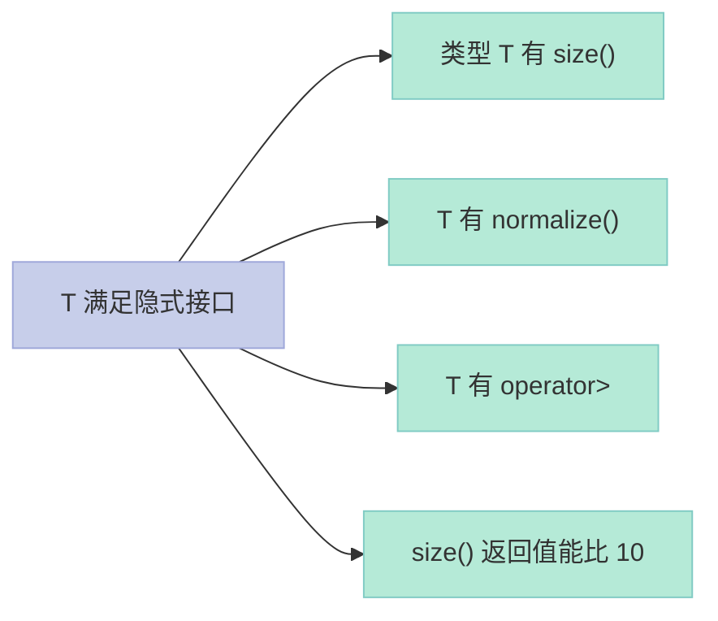
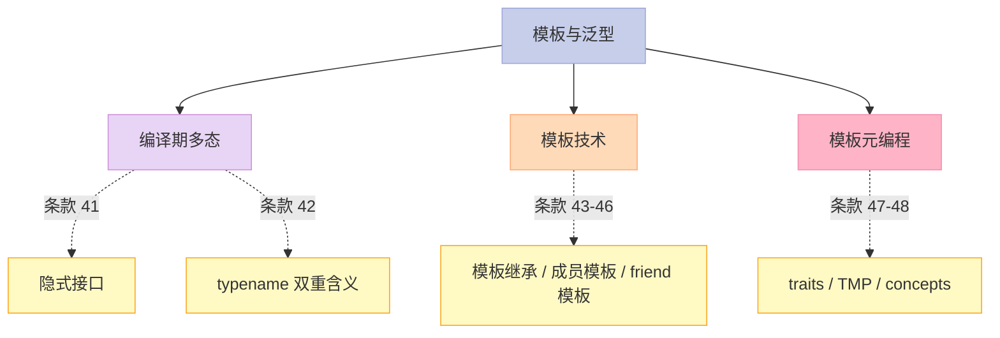

> **一句话核心结论**：C++ 模板是**编译期多态**的载体——所有"参数类型"和"行为"都在编译期决定。掌握**隐式接口、typename、参数推导、traits、SFINAE、模板元编程**这 8 大工程设计，你就能写出**STL 风格**的通用代码，比 Java 泛型更强大。

---

## 系列导航

| # | 文章 | 状态 |
|:--|:--|:--|
| 0 | [系列总览](/2026/06/18/effective-cpp-00-series-index/) | ✅ 已发布 |
| 1 | [让自己习惯 C++](/2026/06/18/effective-cpp-01-accustom-cplusplus/) | ✅ 已发布 |
| 2 | [构造/析构/赋值](/2026/06/18/effective-cpp-02-constructors-destructors/) | ✅ 已发布 |
| 3 | [资源管理](/2026/06/18/effective-cpp-03-resource-management/) | ✅ 已发布 |
| 4 | [设计与声明](/2026/06/18/effective-cpp-04-designs-and-declarations/) | ✅ 已发布 |
| 5 | [实现](/2026/06/18/effective-cpp-05-implementations/) | ✅ 已发布 |
| 6 | [继承与 OOP](/2026/06/18/effective-cpp-06-inheritance-and-oop/) | ✅ 已发布 |
| 7 | [本文：模板与泛型](/2026/06/18/effective-cpp-07-templates-and-generics/) | ✅ 已发布 |
| 8 | 定制 new / delete | 🔜 计划中 |
| 9 | 杂项 + 总结 | 🔜 计划中 |

---

## 前言：模板的"超能力"是什么？

C++ 模板的"超能力"在 3 个维度：

1. **类型参数化**——写一个"类族"，不是"一个类"
2. **编译期计算**——`constexpr`、模板元编程
3. **编译期多态**——比虚函数更快

**C++ vs Java 泛型**：

| 维度 | C++ 模板 | Java 泛型 |
|------|----------|-----------|
| 实现 | 编译期展开 / 类型推导 | 类型擦除 + 装箱 |
| 性能 | 零开销 | 装箱有开销 |
| 特化 | 支持 | 不支持 |
| constexpr 计算 | ✅ | ❌ |
| 编译期多态 | ✅ | ❌ |

C++ 模板是"真正的" 泛型——Java 泛型本质是"类型擦除 + 强制转型"。

本章 8 个条款覆盖模板的核心工程点。

---

## 一、条款 41：了解隐式接口和编译期多态

### 1.1 OOP vs 模板：两种多态

```cpp
// OOP 多态（运行期）
class Widget {
public:
    virtual std::size_t size() const = 0;
    virtual void normalize() = 0;
};

void process(Widget& w) {
    if (w.size() > 10) w.normalize();
}

// 模板多态（编译期）
template<typename T>
void process(T& x) {
    if (x.size() > 10) x.normalize();
}
```

**两个版本的差异**：

| 维度 | OOP | 模板 |
|------|-----|------|
| 接口 | **显式**（virtual 签名） | **隐式**（编译期检查） |
| 多态时机 | 运行期（vtable） | 编译期（类型推导） |
| 接口要求 | "必须继承自 Widget" | "必须有 size() 和 normalize()" |
| 类型 | 动态类型 | 静态类型 |

### 1.2 隐式接口的"灵活性"

```cpp
template<typename T>
void process(T& x) {
    if (x.size() > 10) x.normalize();
}
```

`T` 不需要继承自特定类——只要有 `size()` 和 `normalize()`：

- `T` 是 `std::vector<int>`——有 `size()`
- `T` 是 `std::string`——有 `size()`（`normalize()` 呢？可能没有）

**问题**：如果 `T` 没有 `normalize()`——编译错误。

### 1.3 隐式接口的组成

```cpp
// 隐式接口 = 一组"约束"
// 1. 类型约束：T 必须有 size()、normalize()、operator>
// 2. 值约束：size() > 10 必须是合法的
// 3. 表达式的合法性：normalize() 必须是可调用的
```



### 1.4 OOP vs 模板的"心智模型"

**OOP**：

- 关注"对象"——一个明确继承体系
- 接口在运行期查 vtable
- "一个对象有动态类型"

**模板**：

- 关注"类型"——一组满足约束的类型
- 接口在编译期验证
- "类型满足一组表达式"

### 1.5 关键启示

1. **OOP = 显式接口 + 运行期多态**
2. **模板 = 隐式接口 + 编译期多态**
3. **模板更"开放"**——不强制继承关系
4. **模板编译错误可能很"深"**——错误信息难读（用 concepts 改善）

---

## 二、条款 42：了解 typename 的双重含义

### 2.1 typename 的两种角色

```cpp
template<typename T>
class Widget {
    // T 是模板参数——typename 或 class 都可以
};

// C++98 之前：template<class T>
// C++98 起：template<typename T>  // 推荐
```

**注意**：`typename` 和 `class` 在模板参数列表中**完全等价**——只是历史习惯。

### 2.2 typename 的"真正"用途

```cpp
template<typename T>
void print(const T& container) {
    // ❌ 错：编译器不知道 T::const_iterator 是类型还是成员
    T::const_iterator iter(container.begin());
}
```

**问题**：在模板内部，`T::xxx` 默认被当作**值**（而非类型）——除非显式 `typename`：

```cpp
template<typename T>
void print(const T& container) {
    // ✅ 显式告诉编译器：T::const_iterator 是类型
    typename T::const_iterator iter(container.begin());
    // ...
}
```

### 2.3 "typename 必须"的两种场景

#### 场景 1：模板内部使用"嵌套从属类型"

```cpp
template<typename T>
void f() {
    typename T::value_type x;  // 必须 typename
}
```

#### 场景 2：模板内部使用"嵌套从属模板"

```cpp
template<typename T>
void f() {
    T::template foo<int>();  // 必须 template
}
```

### 2.4 反例：typename 用在"非从属"位置

```cpp
template<typename T>
void f() {
    // ❌ 错：int 不是从属名称——typename 是冗余的
    typename int x = 42;
}
```

### 2.5 实战：STL 的 iterator

```cpp
template<typename Iter>
void doSomething(Iter it) {
    // Iter::value_type 是"嵌套从属类型"
    typename Iter::value_type val = *it;
    // ...
}
```

**C++11 后**：用 `auto` 简化：

```cpp
template<typename Iter>
void doSomething(Iter it) {
    auto val = *it;  // 编译器推导
}
```

### 2.6 关键启示

1. **模板参数列表中 `typename` 和 `class` 等价**
2. **模板内部使用"嵌套从属类型"必须 `typename`**
3. **`T::template foo<>()` 的 `template` 关键字也类似**
4. **`auto` 是更好的选择**——避免显式 typename

---

## 三、条款 43：学习处理模板化基类内的名称

### 3.1 模板继承的"难题"

```cpp
template<typename T>
class Base {
public:
    void foo() {
        // T 特定的实现
    }
};

template<typename T>
class Derived : public Base<T> {
public:
    void bar() {
        foo();  // ❌ 编译错误：基类依赖模板参数
    }
};
```

**问题**：编译器在 `Derived<T>` 中无法知道 `Base<T>::foo()` 是否存在（取决于 T）。

### 3.2 解决方案 1：this->

```cpp
template<typename T>
class Derived : public Base<T> {
public:
    void bar() {
        this->foo();  // ✅ 推迟到实例化时
    }
};
```

### 3.3 解决方案 2：using 声明

```cpp
template<typename T>
class Derived : public Base<T> {
public:
    using Base<T>::foo;  // ✅ 告诉编译器：基类有 foo
    void bar() {
        foo();
    }
};
```

### 3.4 解决方案 3：显式限定

```cpp
template<typename T>
class Derived : public Base<T> {
public:
    void bar() {
        Base<T>::foo();  // ✅ 显式限定
    }
};
```

### 3.5 对比

| 方案 | 优点 | 缺点 |
|------|------|------|
| `this->` | 最简洁 | 可能意外继承"未声明"的虚函数 |
| `using` | 显式表达 | 不能让派生类"重命名"基类方法 |
| `Base<T>::` | 最显式 | 调用虚函数会关闭"动态绑定" |

### 3.6 关键启示

1. **模板继承时，基类的"非虚成员"是"未确认存在"**——编译器保守
2. **`this->`、`using`、`Base<T>::` 三种方法**——告诉编译器"基类有这名字"
3. **C++11 的 `final` + override**——也能解决部分问题

---

## 四、条款 44：将与参数无关的代码抽离 templates

### 4.1 模板的"代码膨胀"问题

```cpp
template<typename T, std::size_t N>
class SquareMatrix {
public:
    void invert();  // 矩阵求逆
private:
    T data_[N][N];
};

SquareMatrix<double, 5> sm1;
SquareMatrix<float, 5> sm2;
SquareMatrix<double, 10> sm3;
// 编译器为每个实例生成 3 份 invert() 代码
```

**问题**：每个 `<T, N>` 组合都生成独立代码——二进制膨胀。

### 4.2 解决方案：抽取"非类型参数无关"代码

```cpp
template<typename T>
class SquareMatrixBase {
protected:
    void invert(std::size_t n, T* data);  // 共享实现
private:
    T* data_;
    std::size_t n_;
};

template<typename T, std::size_t N>
class SquareMatrix : private SquareMatrixBase<T> {
public:
    void invert() {
        SquareMatrixBase<T>::invert(N, data_);  // 调用共享实现
    }
private:
    T data_[N][N];
};
```

**优势**：

- `invert()` 共享一份代码
- `SquareMatrix<T, N>` 只关心"数据存储"

### 4.3 关键启示

1. **模板 = "显式实例化"**——每个 `<T, N>` 都是一个类
2. **避免"模板参数差异"导致"代码重复"**——抽基类
3. **常见手法**：模板继承一个"非模板基类"——共享实现

---

## 五、条款 45：运用成员函数模板接受所有兼容类型

### 5.1 智能指针的"万能构造"

```cpp
// shared_ptr 的万能构造
template<typename T>
class shared_ptr {
public:
    // 任意"兼容类型"指针都能构造
    template<typename U>
    explicit shared_ptr(U* p);
    // ...
};

shared_ptr<Base> pb(new Derived());  // ✅ 接受 Derived*
```

### 5.2 实现：成员函数模板

```cpp
template<typename T>
class SmartPtr {
public:
    // 接受任何"指向 T 派生类"的指针
    template<typename U>
    SmartPtr(const SmartPtr<U>& other)
        : heldPtr_(other.get()) { /*...*/ }

    // 赋值同
    template<typename U>
    SmartPtr& operator=(const SmartPtr<U>& other) {
        // ...
        return *this;
    }
};
```

### 5.3 反例：构造函数不能"覆盖"

```cpp
class Base {};
class Derived : public Base {};

SmartPtr<Base> pb(new Derived());  // ✅
// SmartPtr<Derived> pd = pb;     // ❌ 默认拷贝构造不允许"逆向"
```

**成员函数模板**允许这种"基类 ↔ 派生类"的"灵活拷贝"。

### 5.4 关键启示

1. **成员函数模板 = "通用版本"**——覆盖所有类型组合
2. **智能指针（`shared_ptr` / `unique_ptr`）大量使用**——支持派生类指针赋值
3. **避免"泛型拷贝构造"与"默认拷贝构造"二选一**——用 `enable_if` 排除

---

## 六、条款 46：需要类型转换时请为模板定义非成员函数

### 6.1 问题：模板不支持"隐式类型转换"

```cpp
// 之前条款 24 的非模板版本
template<typename T>
const Rational<T> operator*(const Rational<T>& lhs, const Rational<T>& rhs);

// 调用
Rational<int> a(1, 2), b(3, 4);
Rational<int> c = a * b;       // ✅ 推导为 operator*(a, b)
Rational<int> d = a * 2;       // ❌ T 推导不一致
Rational<int> e = 2 * a;       // ❌ 同上
```

**问题**：模板参数推导时，**不会**进行"隐式类型转换"——所以 `a * 2` 中 `2` 不会被转 `Rational<int>`。

### 6.2 解决方案：friend 函数（模板版本）

```cpp
template<typename T>
class Rational {
public:
    Rational(const T& numerator = 0, const T& denominator = 1) : n_(numerator), d_(denominator) {}

    // 友元函数：编译器在类内自动实例化
    friend const Rational operator*(const Rational& lhs, const Rational& rhs) {
        return Rational(lhs.n_ * rhs.n_, lhs.d_ * rhs.d_);
    }

private:
    T n_, d_;
};

Rational<int> a(1, 2);
Rational<int> c = a * 2;   // ✅ 2 隐式转 Rational<int>
Rational<int> d = 2 * a;   // ✅ 同上
```

**为什么 friend？** 模板函数定义在类内，会**只在用到的参数类型上实例化**——解决了模板"类型推导"不转换的问题。

### 6.3 关键启示

1. **模板参数推导时不进行隐式转换**——这是和函数的差异
2. **friend 函数（模板版本）能解决**——编译器在调用点实例化
3. **C++11 之后的 inline 友元模板**——更清晰的写法

---

## 七、条款 47：请使用 traits classes 表现类型信息

### 7.1 什么是 traits？

**traits** = 编译期"类型特性查询"——"告诉我这个类型有什么属性"。

```cpp
template<typename T>
struct iterator_traits {
    using iterator_category = typename T::iterator_category;
    using value_type = typename T::value_type;
    using difference_type = typename T::difference_type;
    using pointer = typename T::pointer;
    using reference = typename T::reference;
};
```

### 7.2 案例：STL 的 advance

```cpp
template<typename Iter, typename Dist>
void advance(Iter& it, Dist d) {
    if (is_random_access(it)) {
        it += d;  // O(1)：随机访问
    } else {
        while (d--) ++it;  // O(N)：单向迭代
    }
}
```

`is_random_access` 怎么实现？

**方法 1：重载 + traits**

```cpp
// 标签分派
template<typename Iter, typename Dist>
void doAdvance(Iter& it, Dist d, std::random_access_iterator_tag) {
    it += d;
}

template<typename Iter, typename Dist>
void doAdvance(Iter& it, Dist d, std::bidirectional_iterator_tag) {
    if (d > 0) while (d--) ++it;
    else while (d++) --it;
}

template<typename Iter, typename Dist>
void doAdvance(Iter& it, Dist d, std::input_iterator_tag) {
    while (d--) ++it;
}

template<typename Iter, typename Dist>
void advance(Iter& it, Dist d) {
    doAdvance(it, d, typename std::iterator_traits<Iter>::iterator_category());
}
```

### 7.3 traits 的 5 个常见种类

| traits | 含义 |
|--------|------|
| `iterator_traits` | 迭代器的特性 |
| `char_traits` | 字符类型的特性 |
| `numeric_limits` | 数字类型的极值 |
| `is_integral`、`is_pointer` | 类型谓词 |
| `enable_if` | 条件启用 |

### 7.4 自定义 traits

```cpp
// 自定义 traits
template<typename T>
struct MyTraits {
    using category = typename T::my_category;
};

// 默认特化（指针）
template<typename T>
struct MyTraits<T*> {
    using category = std::random_access_iterator_tag;
};
```

### 7.5 关键启示

1. **traits = 编译期类型查询**
2. **STL 大量使用**——`iterator_traits`、`char_traits`
3. **自定义 traits**——为你的类型定义特性
4. **C++20 concepts**——更现代的替代

---

## 八、条款 48：认识 template 元编程

### 8.1 什么是模板元编程（TMP）？

**TMP** = 用模板实现"编译期计算"。

```cpp
// 编译期阶乘
template<unsigned N>
struct Factorial {
    static constexpr unsigned value = N * Factorial<N-1>::value;
};

template<>
struct Factorial<0> {
    static constexpr unsigned value = 1;
};

int main() {
    constexpr unsigned f5 = Factorial<5>::value;  // 120（编译期）
    return 0;
}
```

### 8.2 TMP 的威力

```cpp
// 编译期 if（type traits）
template<typename T>
void process(T x) {
    if constexpr (std::is_integral_v<T>) {
        // 整数分支
    } else {
        // 其他分支
    }
}
```

**C++17 起的 `if constexpr`**——TMP 终于"可读"了。

### 8.3 TMP 的 3 个特点

| 特点 | 说明 |
|------|------|
| **编译期执行** | 所有计算在编译时完成 |
| **类型安全** | 编译错误立即报 |
| **零运行时开销** | 编译后只剩"结果" |

### 8.4 TMP 的"反面"——难读、难调试

```cpp
// 复杂的 SFINAE——典型 TMP 难题
template<typename T, typename = void>
struct hasSerialize : std::false_type {};

template<typename T>
struct hasSerialize<T, std::void_t<decltype(std::declval<T>().serialize())>> : std::true_type {};
```

**C++20 concepts**——"声明式"约束：

```cpp
template<typename T>
concept Serializable = requires(T x) {
    x.serialize();
};

template<Serializable T>
void save(T x) {
    x.serialize();
}
```

### 8.5 关键启示

1. **TMP = 编译期计算**——零运行时开销
2. **C++17 `if constexpr`**——TMP 的"语法糖"
3. **C++20 concepts**——TMP 的"现代化"
4. **TMP 难读**——能用 constexpr 函数就别用 TMP

---

## 九、8 个条款的"模板与泛型"全景



**核心思路**：

- **多态**——模板多态 vs OOP 多态（运行/编译）
- **typename**——`T::xxx` 嵌套类型必须显式
- **traits**——编译期类型查询
- **TMP**——编译期计算（C++17+ 用 `if constexpr`）

---

## 十、常见误区与陷阱

### 10.1 误区 1：忘记 typename

```cpp
template<typename T>
void f() {
    T::value_type x;  // ❌ 编译错误
    typename T::value_type y;  // ✅
}
```

### 10.2 误区 2：模板继承时不用 `this->`

```cpp
template<typename T>
class Derived : public Base<T> {
    void f() {
        foo();  // ❌ 编译错误
        this->foo();  // ✅
    }
};
```

### 10.3 误区 3：模板版本 operator* 不支持隐式转换

```cpp
// ❌ 模板版本不能 2 * rational
Rational<int> a;
auto c = 2 * a;  // 编译错误

// ✅ 用 friend 模板
friend const Rational operator*(const Rational& lhs, const Rational& rhs);
```

### 10.4 误区 4：模板代码膨胀

```cpp
// 模板 + 多种类型 → 二进制膨胀
// 用"基类共享实现"避免
```

### 10.5 误区 5：TMP 过度使用

```cpp
// ❌ 复杂的 SFINAE 表达式——难读
// ✅ 用 if constexpr / concepts
```

---

## 十一、C++11/14/17/20 的演进

| 主题 | C++98 时代 | C++11/14/17/20 时代 |
|------|------------|---------------------|
| 类型推导 | 显式 `<T>` | `auto` + 模板别名 |
| 模板别名 | typedef | `using` 别名 |
| 模板继承 | `this->` / `using` | 同 C++98 |
| 友元模板 | 复杂 | inline 友元模板 |
| traits | type_traits | `is_xxx_v` 变量模板 |
| TMP | 复杂 | `if constexpr` |
| 约束 | SFINAE | **C++20 concepts** |

**C++20 concepts 预览**：

```cpp
template<typename T>
concept Hashable = requires(T a) {
    { std::hash<T>{}(a) } -> std::convertible_to<std::size_t>;
};

template<Hashable T>
void process(const T& x) { /*...*/ }
```

---

## 十二、面试高频考点

### 12.1 必背题

| 题目 | 答案要点 |
|------|----------|
| OOP 多态 vs 模板多态？ | OOP = 显式接口 + 运行期；模板 = 隐式接口 + 编译期 |
| typename 在模板里的作用？ | 标识"嵌套从属类型"——告诉编译器 T::xxx 是类型 |
| 模板继承时基类方法怎么调？ | `this->` / `using` / `Base<T>::` |
| 模板 operator* 不支持隐式转换？ | 用 friend 模板函数 |
| 什么是 traits？ | 编译期类型查询 |
| 什么是 TMP？ | Template Meta-Programming——编译期计算 |
| 模板代码膨胀怎么避免？ | 抽基类共享实现 |
| C++20 concepts 是什么？ | 模板约束的"声明式"语法 |

### 12.2 高频追问

| 追问 | 关键点 |
|------|--------|
| SFINAE 是什么？ | Substitution Failure Is Not An Error——编译期"匹配"机制 |
| enable_if 怎么用？ | `enable_if_t<cond, T>`——条件启用模板 |
| if constexpr vs 普通 if？ | if constexpr 在编译期决定分支；普通 if 在运行期 |
| std::declval 干什么？ | 给编译器"假想的值"——用于 decltype |
| 模板与虚函数能组合吗？ | 能——虚函数模板（C++14+） |
| void_t 是什么？ | SFINAE 工具——任意"合法 SFINAE 表达式" → void |

---

## 十三、配套实验

### 13.1 实验 1：模板的多态

```cpp
// 文件：template_polymorphism.cpp
#include <iostream>
#include <vector>
#include <list>
#include <string>

template<typename T>
void process(const T& container) {
    std::cout << "size = " << container.size() << "\n";
}

int main() {
    std::vector<int> v = {1, 2, 3};
    std::list<std::string> l = {"a", "b"};
    std::string s = "hello";

    process(v);  // 隐式接口：size()
    process(l);
    process(s);
    return 0;
}
```

### 13.2 实验 2：traits 实战

```cpp
// 文件：traits_demo.cpp
#include <iostream>
#include <iterator>
#include <vector>
#include <list>

template<typename Iter>
void advance(Iter& it, int d) {
    // 通过 iterator_traits 获取 iterator_category
    using Category = typename std::iterator_traits<Iter>::iterator_category;

    if constexpr (std::is_same_v<Category, std::random_access_iterator_tag>) {
        std::cout << "Random access: += " << d << "\n";
        it += d;
    } else {
        std::cout << "Other: " << d << " times ++it\n";
        while (d--) ++it;
    }
}

int main() {
    std::vector<int> v = {1, 2, 3, 4, 5};
    auto vit = v.begin();
    advance(vit, 3);

    std::list<int> l = {1, 2, 3, 4, 5};
    auto lit = l.begin();
    advance(lit, 3);

    return 0;
}
```

### 13.3 实验 3：编译期阶乘

```cpp
// 文件：factorial.cpp
#include <iostream>

template<unsigned N>
struct Factorial {
    static constexpr unsigned value = N * Factorial<N-1>::value;
};

template<>
struct Factorial<0> {
    static constexpr unsigned value = 1;
};

int main() {
    constexpr unsigned f5 = Factorial<5>::value;  // 120
    constexpr unsigned f10 = Factorial<10>::value;  // 3628800

    std::cout << "5! = " << f5 << "\n";
    std::cout << "10! = " << f10 << "\n";
    return 0;
}
```

### 13.4 实验 4：C++20 concepts 预览

```cpp
// 文件：concepts_demo.cpp
#include <iostream>
#include <type_traits>

// 类似 C++20 concept 的简化实现
template<typename T, typename = void>
struct is_iterable : std::false_type {};

template<typename T>
struct is_iterable<T, std::void_t<
    decltype(std::declval<T>().begin()),
    decltype(std::declval<T>().end())
>> : std::true_type {};

template<typename T>
void process(const T& x) {
    if constexpr (is_iterable<T>::value) {
        for (const auto& elem : x) {
            std::cout << elem << " ";
        }
        std::cout << "\n";
    } else {
        std::cout << x << "\n";
    }
}

int main() {
    std::vector<int> v = {1, 2, 3};
    process(v);
    process(42);
    return 0;
}
```

---

## 十四、回到 8 条黄金法则

| 条款 | 黄金法则 |
|------|----------|
| 41 | 模板 = 隐式接口 + 编译期多态（vs OOP 显式接口 + 运行期） |
| 42 | `T::xxx` 在模板内必须 `typename`（嵌套从属类型） |
| 43 | 模板继承基类方法：this-> / using / 显式限定 |
| 44 | 模板代码膨胀：抽基类共享实现 |
| 45 | 成员函数模板接受所有兼容类型 |
| 46 | 模板 operator* 需 friend 模板支持隐式转换 |
| 47 | traits classes = 编译期类型查询 |
| 48 | TMP 编译期计算——C++17 `if constexpr` + C++20 concepts |

---

## 十五、结尾思考题

> **思考题 1**：解释"OOP 显式接口 + 运行期多态"和"模板隐式接口 + 编译期多态"的差异。

> **思考题 2**：为什么 `T::value_type` 在模板内必须加 `typename`？编译器有什么"顾虑"？

> **思考题 3**：实现一个 `is_pointer` traits（用 SFINAE 或 `if constexpr`）。

> **思考题 4**：为什么模板版本的 `operator*(Rational, Rational)` 不支持 `2 * rational`？如何用 friend 模板解决？

> **思考题 5**：用 C++20 concepts 写一个"序列"概念——能 begin/end、size、索引访问。

---

## 十六、本篇速查表

| 主题 | 关键 API / 模式 | 适用场景 |
|------|----------------|----------|
| 模板多态 | 隐式接口 + 编译期 | 通用算法 |
| typename | 嵌套从属类型 | 模板内部 |
| this-> / using | 模板继承 | 基类依赖 T |
| 模板 + 基类共享 | `Base<T>` 抽基类 | 减少代码膨胀 |
| 成员函数模板 | 万能构造 | 智能指针 |
| friend 模板 | 隐式类型转换 | operator 模板 |
| traits | 编译期类型查询 | STL 算法 |
| TMP | 编译期计算 | 高性能库 |
| concepts | 模板约束 | C++20 现代化 |

---

## 十七、系列导航

| # | 文章 | 状态 |
|:--|:--|:--|
| 0 | [系列总览](/2026/06/18/effective-cpp-00-series-index/) | ✅ 已发布 |
| 1 | [让自己习惯 C++](/2026/06/18/effective-cpp-01-accustom-cplusplus/) | ✅ 已发布 |
| 2 | [构造/析构/赋值](/2026/06/18/effective-cpp-02-constructors-destructors/) | ✅ 已发布 |
| 3 | [资源管理](/2026/06/18/effective-cpp-03-resource-management/) | ✅ 已发布 |
| 4 | [设计与声明](/2022026/06/18/effective-cpp-04-designs-and-declarations/) | ✅ 已发布 |
| 5 | [实现](/2026/06/18/effective-cpp-05-implementations/) | ✅ 已发布 |
| 6 | [继承与 OOP](/2026/06/18/effective-cpp-06-inheritance-and-oop/) | ✅ 已发布 |
| 7 | [本文：模板与泛型](/2026/06/18/effective-cpp-07-templates-and-generics/) | ✅ 已发布 |
| 8 | 定制 new / delete | 🔜 计划中 |
| 9 | 杂项 + 总结 | 🔜 计划中 |

---

**下一篇**：第 8 篇《定制 new / delete：内存管理的 4 大工程化》——条款 49-52 一起讲透 C++ 内存管理：new-handler 机制、自定义 operator new、内存池、placement new 的应用、new/delete 的可继承性。

> **行动建议**：
> 1. **今天**：用 `auto` 替换你模板里的 `typename T::value_type`
> 2. **今天**：用 `if constexpr` 简化你的 SFINAE 表达式
> 3. **本周**：识别你项目里"模板代码膨胀"的地方——抽基类共享
> 4. **本周**：用 friend 模板支持你的 operator 隐式转换
> 5. **思考**：你的项目能用 C++20 concepts 改造吗？
