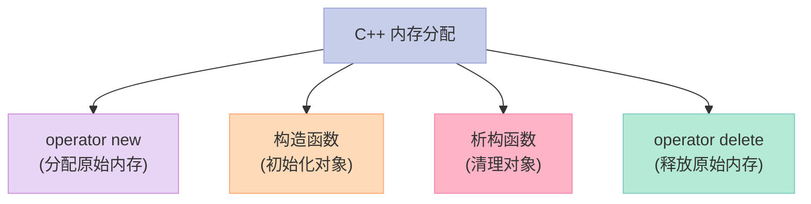
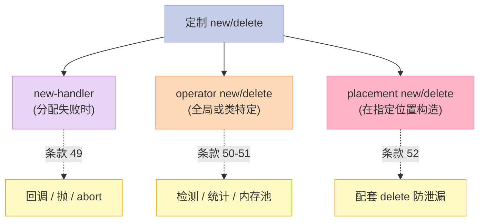

> **一句话核心结论**：C++ 让你**完全控制内存管理**——通过重载 `operator new` / `operator delete`，可以构建内存池、debug 内存、统计分配。C++11 的 `std::allocator` + 智能指针让 99% 的场景不需要定制，本章 4 个条款帮你**理解原理 + 知道何时该用**。

---

## 系列导航

| # | 文章 | 状态 |
|:--|:--|:--|
| 0 | [系列总览](/2026/06/18/effective-cpp-00-series-index/) | ✅ 已发布 |
| 1 | [让自己习惯 C++](/2026/06/18/effective-cpp-01-accustom-cplusplus/) | ✅ 已发布 |
| 2 | [构造/析构/赋值](/2026/06/18/effective-cpp-02-constructors-destructors/) | ✅ 已发布 |
| 3 | [资源管理](/2026/06/18/effective-cpp-03-resource-management/) | ✅ 已发布 |
| 4 | [设计与声明](/2026/06/18/effective-cpp-04-designs-and-declarations/) | ✅ 已发布 |
| 5 | [实现](/2026/06/18/effective-cpp-05-implementations/) | ✅ 已发布 |
| 6 | [继承与 OOP](/2026/06/18/effective-cpp-06-inheritance-and-oop/) | ✅ 已发布 |
| 7 | [模板与泛型](/2026/06/18/effective-cpp-07-templates-and-generics/) | ✅ 已发布 |
| 8 | [本文：定制 new / delete](/2026/06/18/effective-cpp-08-customizing-new-delete/) | ✅ 已发布 |
| 9 | 杂项 + 总结 | 🔜 计划中 |

---

## 前言：为什么"内存"是 C++ 的"硬骨头"？

C++ 让程序员**贴近硬件**——包括内存。



**为什么有时要定制？**

1. **性能**——频繁 new/delete 触发系统调用（malloc/free），慢
2. **debug**——统计分配、检测越界
3. **对齐**——特定对齐要求（SIMD、GPU）
4. **特殊场景**——共享内存、内存映射文件

**什么时候不要定制？**

- 99% 的应用代码——用 `std::allocator` + 智能指针
- 性能调优——先 profiler 找瓶颈，再决定

---

## 一、条款 49：了解 new-handler 的行为

### 1.1 什么是 new-handler？

当 `operator new` 抛出 `std::bad_alloc` **之前**——会调用一个**回调函数**：new-handler。

```cpp
namespace std {
    typedef void (*new_handler)();
    new_handler set_new_handler(new_handler p) noexcept;
}
```

### 1.2 new-handler 的 3 种应对策略

```cpp
void customNewHandler() {
    // 策略 1：让更多内存可用
    freeList.releaseMemory();

    // 策略 2：装入另一个 new-handler
    // std::set_new_handler(anotherHandler);

    // 策略 3：抛 bad_alloc（或其派生）
    // throw std::bad_alloc();

    // 策略 4：abort
    // std::abort();
}
```

### 1.3 实现一个 new-handler

```cpp
class Widget {
public:
    static std::new_handler set_new_handler(std::new_handler p) noexcept;
    static void* operator new(std::size_t size) throw(std::bad_alloc);
private:
    static std::new_handler currentHandler_;
};

std::new_handler Widget::currentHandler_ = nullptr;

std::new_handler Widget::set_new_handler(std::new_handler p) noexcept {
    std::new_handler old = currentHandler_;
    currentHandler_ = p;
    return old;
}

void* Widget::operator new(std::size_t size) throw(std::bad_alloc) {
    // 1. 安装自己的 new-handler
    std::new_handler oldHandler = std::set_new_handler(currentHandler_);

    // 2. 实际分配（可能抛 bad_alloc）
    void* mem;
    try {
        mem = ::operator new(size);
    } catch (...) {
        // 3. 恢复 oldHandler，传播异常
        std::set_new_handler(oldHandler);
        throw;
    }

    // 4. 恢复 oldHandler
    std::set_new_handler(oldHandler);
    return mem;
}
```

### 1.4 "类特定 new-handler" 的 4 个组件

| 组件 | 用途 |
|------|------|
| `set_new_handler` | 设置/替换 |
| `operator new` | 调自己 handler 后分配 |
| 静态成员 | 保存 handler 指针 |
| 默认值 | 设为 `nullptr` |

### 1.5 C++11 后的 `std::bad_alloc`

```cpp
// 不抛异常的 new（C++11 起）
void* operator new(std::size_t size, const std::nothrow_t&) noexcept;
```

**用法**：

```cpp
Widget* p = new (std::nothrow) Widget();  // 不抛，返回 nullptr
```

### 1.6 关键启示

1. **new-handler = "分配失败时的回调"**——可以释放内存、抛异常、abort
2. **类特定的 new-handler**——只影响该类
3. **C++11 的 `nothrow` new**——返回 `nullptr` 而非抛异常
4. **`operator new` 的实现要保证"恢复 oldHandler"**——避免影响其他类

---

## 二、条款 50：了解 new 和 delete 的合理替换时机

### 2.1 定制 `operator new` / `operator delete` 的 6 个理由

| # | 理由 | 例子 |
|:--|------|------|
| 1 | **检测错误** | 越界、double-delete 探测 |
| 2 | **收集统计** | 分配大小、次数、模式 |
| 3 | **提高分配速度** | 专用分配器（如游戏） |
| 4 | **减少额外开销** | 默认分配器有额外空间 |
| 5 | **弥补默认分配的碎片化** | 内存池 |
| 6 | **特殊对齐** | SIMD 的 16/32-byte 对齐 |

### 2.2 案例：检测内存错误

```cpp
static const int signature = 0xDEADBEEF;
typedef unsigned char Byte;

void* operator new(std::size_t size) {
    // 1. 多分配"签名 + 长度"空间
    std::size_t extra = sizeof(int) * 2;
    std::size_t total = size + extra;

    void* mem = malloc(total);
    if (!mem) throw std::bad_alloc();

    // 2. 写签名（前后都写）
    Byte* pb = static_cast<Byte*>(mem);
    *(int*)pb = signature;                                  // 前
    *(int*)(pb + sizeof(int) + size) = signature;          // 后
    *(std::size_t*)(pb + sizeof(int)) = size;              // 长度

    // 3. 返回"中间"区域
    return pb + sizeof(int) * 2;
}

void operator delete(void* mem) noexcept {
    if (!mem) return;

    Byte* pb = static_cast<Byte*>(mem) - sizeof(int) * 2;
    int sig1 = *(int*)pb;
    int sig2 = *(int*)(pb + sizeof(int) + *(std::size_t*)(pb + sizeof(int)));

    if (sig1 != signature || sig2 != signature) {
        std::cerr << "Memory corruption detected!\n";
        std::abort();
    }

    free(pb);
}
```

### 2.3 案例：内存池

```cpp
// 简单的"对象池"
class WidgetPool {
    static constexpr std::size_t CHUNK = 4096;
    struct Chunk {
        Chunk* next;
    };
    Chunk* freeList_ = nullptr;
public:
    void* allocate(std::size_t n) {
        if (!freeList_) {
            // 一次性分配大块
            char* mem = new char[CHUNK];
            Chunk* c = reinterpret_cast<Chunk*>(mem);
            c->next = freeList_;
            freeList_ = c;
        }
        void* result = freeList_;
        freeList_ = freeList_->next;
        return result;
    }
    void deallocate(void* p) {
        Chunk* c = static_cast<Chunk*>(p);
        c->next = freeList_;
        freeList_ = c;
    }
};
```

### 2.4 关键启示

1. **定制 new/delete 之前，先用现成的工具**——sanitizers、profilers
2. **性能有真实需求？**——再做内存池
3. **检测错误**——debug 阶段值得做
4. **特殊对齐**——SIMD 场景需要

---

## 三、条款 51：编写 new 和 delete 时需固守常规

### 3.1 编写 new/delete 的 8 条"铁律"

| # | 规则 | 说明 |
|:--|------|------|
| 1 | **`operator new` 应该无限循环** | 不够内存时调 new-handler |
| 2 | **即使 0 字节也要返回合法指针** | `new(0)` 返回有效指针 |
| 3 | **处理"派生类用基类 new"** | 基类 new 要处理 size 错误 |
| 4 | **delete 必须处理 nullptr** | `delete nullptr` 是 no-op |
| 5 | **避免遮蔽"正常版本"** | 默认版本可以正确处理 |
| 6 | **继承 new 时调 `::operator new`** | 不要递归 |
| 7 | **size 错误时调标准 new** | 派生类用基类 new 时 |
| 8 | **析构后调 `::operator delete`** | 同样不能递归 |

### 3.2 标准的 `operator new` 实现

```cpp
void* Base::operator new(std::size_t size) throw(std::bad_alloc) {
    if (size != sizeof(Base)) {
        return ::operator new(size);  // 处理派生类用 Base new 的情况
    }

    // 1. 循环：失败时调 new-handler
    while (true) {
        void* mem = malloc(sizeof(Base));
        if (mem) return mem;

        // 2. 调用 new-handler
        std::new_handler h = std::get_new_handler();
        if (h) {
            h();  // 可能释放更多内存
        } else {
            throw std::bad_alloc();
        }
    }
}
```

### 3.3 标准的 `operator delete` 实现

```cpp
void Base::operator delete(void* mem) noexcept {
    if (!mem) return;  // 必做：处理 nullptr

    if (mem != correctAddressForBase) {
        // 派生类用 Base delete 的情况——可能调 ::operator delete
        ::operator delete(mem);
        return;
    }

    free(mem);
}
```

### 3.4 "new 0 字节"的特殊处理

```cpp
// 标准要求：new(0) 返回合法指针
void* operator new(std::size_t size) throw(std::bad_alloc) {
    if (size == 0) size = 1;  // 必做：避免 0 字节
    // ...
}
```

### 3.5 关键启示

1. **`operator new` 要循环 + new-handler**——保证"总能成功（除非 abort）"
2. **`operator new(0)` 返回合法指针**——size 转为 1
3. **`operator delete` 必须处理 nullptr**——C++ 允许 `delete nullptr`
4. **基类 new 处理派生类 size 错误**——用 `::operator new`

---

## 四、条款 52：写了 placement new 也要写 placement delete

### 4.1 什么是 placement new？

```cpp
// "placement new" = 带额外参数的 operator new
void* operator new(std::size_t size, void* ptr) throw() {
    return ptr;
}
```

**经典版本**：在已分配的内存上构造对象。

```cpp
char buffer[sizeof(Widget)];
Widget* w = new (buffer) Widget();
// 在 buffer 上构造 Widget
// 不分配新内存
```

### 4.2 配套的 placement delete

```cpp
// placement new → 配套 placement delete
void* operator new(std::size_t size, void* ptr) throw();
void operator delete(void* ptr, void*) throw();
```

### 4.3 为什么 placement delete 必须存在？

```cpp
class Widget {
public:
    Widget(int val);
    void* operator new(std::size_t size, std::ostream& logStream) throw(std::bad_alloc);
    // ❌ 没写对应的 placement delete
    // 如果 Widget 构造时抛异常 + new 已分配内存——泄漏！
};

void process(std::ostream& logStream) {
    Widget* p = new (logStream) Widget(42);
    // 假设 Widget 构造抛异常
    // 1. operator new 已分配内存
    // 2. Widget 构造失败
    // 3. 内存泄漏！——因为没有对应的 placement delete
}
```

**正确做法**：

```cpp
class Widget {
public:
    Widget(int val);
    void* operator new(std::size_t size, std::ostream& logStream) throw(std::bad_alloc);
    void operator delete(void* ptr, std::ostream& logStream) throw();  // ✅
    // 同时保留"标准 delete"——处理普通 new 出来的对象
    void operator delete(void* ptr) throw();
};
```

### 4.4 实战：内存池的 placement new

```cpp
class Airplane {
public:
    // placement new：从内存池分配
    void* operator new(std::size_t size) {
        return pool_.allocate(size);
    }
    // placement delete：从内存池释放
    void operator delete(void* ptr, std::size_t size) {
        pool_.deallocate(ptr, size);
    }
private:
    static MemoryPool pool_;
};

Airplane* p = new Airplane();  // 从 pool 分配
delete p;                       // 归还给 pool
```

### 4.5 关键启示

1. **placement new 必须配套 placement delete**——否则异常时内存泄漏
2. **placement delete 是"构造失败时调用"**——不是用户手动调用
3. **标准 `operator new(size, ...)` 的额外参数必须唯一**——避免签名冲突
4. **同时保留标准 `operator delete`**——处理普通 new 出来的对象

---

## 五、4 个条款的"定制 new/delete"全景



**核心思路**：

- **new-handler**：分配失败时给你"补救机会"
- **operator new/delete**：性能 / 调试 / 特殊场景
- **placement new**：在指定位置构造，**必须配套 placement delete**

---

## 六、常见误区与陷阱

### 6.1 误区 1：定制 new/delete 但忘记 size=0

```cpp
// ❌ new(0) 行为未定义
void* operator new(std::size_t size) {
    return malloc(size);  // 0 字节 malloc 行为不可预测
}

// ✅ 修正
void* operator new(std::size_t size) {
    if (size == 0) size = 1;
    return malloc(size);
}
```

### 6.2 误区 2：operator new 忘记循环

```cpp
// ❌ 失败时直接抛
void* operator new(std::size_t size) {
    void* mem = malloc(size);
    if (!mem) throw std::bad_alloc();
    return mem;
}

// ✅ 失败时调 new-handler
void* operator new(std::size_t size) {
    while (true) {
        void* mem = malloc(size);
        if (mem) return mem;
        std::new_handler h = std::get_new_handler();
        if (h) h();
        else throw std::bad_alloc();
    }
}
```

### 6.3 误区 3：placement new 忘了 placement delete

```cpp
// ❌ 异常时泄漏
class Widget {
    void* operator new(std::size_t size, void* ptr) throw();
    // 漏了 placement delete
};

// ✅ 配套
class Widget {
    void* operator new(std::size_t size, void* ptr) throw();
    void operator delete(void* ptr, void*) throw();  // 必须配套
};
```

### 6.4 误区 4：基类 new 处理派生类 size 时递归

```cpp
// ❌ 递归调用
class Base {
    void* operator new(std::size_t size) {
        if (size != sizeof(Base)) {
            return operator new(size);  // ❌ 递归！
        }
    }
};

// ✅ 用 ::operator new
class Base {
    void* operator new(std::size_t size) {
        if (size != sizeof(Base)) {
            return ::operator new(size);  // ✅ 全局版本
        }
    }
};
```

---

## 七、C++11/14/17 的演进

| 主题 | C++98 时代 | C++11/14/17 时代 |
|------|------------|-----------------|
| new 异常 | `throw(bad_alloc)` 规范 | 默认抛 `bad_alloc`，`nothrow` 不抛 |
| 内存工具 | `auto_ptr` | `unique_ptr` / `allocator` |
| allocator | `std::allocator<T>` | 同样的接口 |
| 检测工具 | 自己写 | ASan / Valgrind / TSAN |
| C++17 `std::aligned_alloc` | 不可移植 | C++17 起标准化 |
| C++17 `if constexpr` | 无 | 编译期决定"哪种分配策略" |

**C++11 后的 `noexcept` 替代 `throw()`**：

```cpp
// C++98
void* operator new(std::size_t size) throw(std::bad_alloc);
// C++11+
void* operator new(std::size_t size);  // 默认抛 bad_alloc
void* operator new(std::size_t size, const std::nothrow_t&) noexcept;  // 不抛
```

---

## 八、面试高频考点

### 8.1 必背题

| 题目 | 答案要点 |
|------|----------|
| 什么是 new-handler？ | 分配失败时调用的回调 |
| new-handler 的 3 种策略？ | 释放内存 / 换 handler / 抛异常 |
| 什么时候定制 operator new？ | 检测错误、统计、性能、内存池 |
| 标准的 operator new 要循环吗？ | 要——失败时调 new-handler 释放内存 |
| 0 字节 new 怎么处理？ | 返回合法指针——内部 size 设为 1 |
| 什么是 placement new？ | 在指定位置构造对象 |
| placement new 配套的 delete 叫什么？ | placement delete——构造失败时调用 |
| operator new/delete 在派生类如何继承？ | 派生类继承基类的版本 |

### 8.2 高频追问

| 追问 | 关键点 |
|------|--------|
| 自定义 operator new 后，编译器还会自动生成 operator delete 吗？ | 会——operator new 和 operator delete 是独立的 |
| 内存池的经典实现？ | 一次性大块分配 + 链表管理 |
| 智能指针能用自定义 allocator 吗？ | 能——`std::allocate_shared` |
| 为什么 placement delete 不常被"显式调用"？ | 编译器自动在构造失败时调 |
| 派生类用基类 new/delete 怎么正确？ | size != sizeof(Base) 时调 ::operator new |
| 调试内存错误用什么工具？ | AddressSanitizer / Valgrind |

---

## 九、配套实验

### 9.1 实验 1：自定义 new-handler

```cpp
// 文件：new_handler_demo.cpp
#include <iostream>
#include <new>

int allocationCount = 0;
const int MAX_ALLOCATIONS = 5;

void customNewHandler() {
    std::cerr << "Out of memory! (allocation " << allocationCount << ")\n";
    if (allocationCount >= MAX_ALLOCATIONS) {
        std::cerr << "Giving up!\n";
        std::abort();
    }
    // 策略：抛 bad_alloc
    throw std::bad_alloc();
}

int main() {
    std::set_new_handler(customNewHandler);

    try {
        for (int i = 0; i < 10; ++i) {
            ++allocationCount;
            char* mem = new char[1000];
            std::cout << "Allocation " << i << " succeeded\n";
        }
    } catch (const std::bad_alloc& e) {
        std::cout << "Caught bad_alloc: " << e.what() << "\n";
    }
    return 0;
}
```

### 9.2 实验 2：内存池（简化版）

```cpp
// 文件：memory_pool.cpp
#include <iostream>
#include <cstddef>

class MemoryPool {
    static constexpr std::size_t CHUNK = 4096;
    struct Block {
        Block* next;
    };
    Block* freeList_ = nullptr;
public:
    void* allocate(std::size_t n) {
        if (n > CHUNK - sizeof(Block)) return nullptr;
        if (!freeList_) {
            char* mem = new char[CHUNK];
            Block* c = reinterpret_cast<Block*>(mem);
            c->next = freeList_;
            freeList_ = c;
        }
        void* result = freeList_;
        freeList_ = freeList_->next;
        return result;
    }
    void deallocate(void* p) {
        if (!p) return;
        Block* c = static_cast<Block*>(p);
        c->next = freeList_;
        freeList_ = c;
    }
};

MemoryPool pool;

class Widget {
public:
    static void* operator new(std::size_t size) {
        std::cout << "Widget::new(size=" << size << ")\n";
        return pool.allocate(size);
    }
    static void operator delete(void* p, std::size_t size) {
        std::cout << "Widget::delete(size=" << size << ")\n";
        pool.deallocate(p);
    }
    Widget() { std::cout << "Widget ctor\n"; }
    ~Widget() { std::cout << "Widget dtor\n"; }
};

int main() {
    Widget* w = new Widget();
    delete w;
    return 0;
}
```

### 9.3 实验 3：placement new

```cpp
// 文件：placement_new.cpp
#include <iostream>
#include <new>

class Widget {
public:
    Widget() { std::cout << "Widget ctor\n"; }
    ~Widget() { std::cout << "Widget dtor\n"; }
    void hello() { std::cout << "Hello!\n"; }
};

int main() {
    // 1. 分配 buffer
    alignas(Widget) char buffer[sizeof(Widget)];

    // 2. placement new：在 buffer 上构造
    Widget* w = new (buffer) Widget();
    w->hello();

    // 3. 显式调用析构
    w->~Widget();

    return 0;
}
```

---

## 十、回到 4 条黄金法则

| 条款 | 黄金法则 |
|------|----------|
| 49 | new-handler = 分配失败时的回调；类特定 + 公共 new-handler |
| 50 | 定制 new/delete 之前先考虑现成工具：sanitizers、profilers |
| 51 | 标准 operator new 要循环 + new-handler；size=0 转 1 |
| 52 | placement new 必配套 placement delete——构造失败时调用 |

---

## 十一、结尾思考题

> **思考题 1**：实现一个 new-handler，策略是"释放一个内部 cache"。

> **思考题 2**：为什么 0 字节 new 要特殊处理？标准是怎么规定的？

> **思考题 3**：基类 operator new 处理派生类 size 时，为什么要调 `::operator new` 而不是 `operator new`？

> **思考题 4**：placement new + placement delete 的"构造失败时"具体指什么情况？

> **思考题 5**：设计一个固定大小对象的内存池，支持：allocate、deallocate、统计当前使用数。

---

## 十二、本篇速查表

| 主题 | 关键 API / 模式 | 适用场景 |
|------|----------------|----------|
| new-handler | `std::set_new_handler` | 分配失败处理 |
| 自定义 operator new | `void* operator new(size_t)` | 内存池、检测 |
| 自定义 operator delete | `void operator delete(void*)` | 配套 new |
| 内存池 | 一次性大块 + 链表 | 高频小对象 |
| placement new | `new(ptr) T(...)` | 栈/共享内存构造 |
| placement delete | `operator delete(void*, void*)` | 构造失败时调用 |
| 检测内存错误 | 签名 + 长度 | debug 阶段 |
| 统计分配 | 全局计数 | 性能调优 |
| 对齐分配 | `std::aligned_alloc` | SIMD |

---

## 十三、系列导航

| # | 文章 | 状态 |
|:--|:--|:--|
| 0 | [系列总览](/2026/06/18/effective-cpp-00-series-index/) | ✅ 已发布 |
| 1 | [让自己习惯 C++](/2026/06/18/effective-cpp-01-accustom-cplusplus/) | ✅ 已发布 |
| 2 | [构造/析构/赋值](/2026/06/18/effective-cpp-02-constructors-destructors/) | ✅ 已发布 |
| 3 | [资源管理](/2026/06/18/effective-cpp-03-resource-management/) | ✅ 已发布 |
| 4 | [设计与声明](/2026/06/18/effective-cpp-04-designs-and-declarations/) | ✅ 已发布 |
| 5 | [实现](/2026/06/18/effective-cpp-05-implementations/) | ✅ 已发布 |
| 6 | [继承与 OOP](/2026/06/18/effective-cpp-06-inheritance-and-oop/) | ✅ 已发布 |
| 7 | [模板与泛型](/2026/06/18/effective-cpp-07-templates-and-generics/) | ✅ 已发布 |
| 8 | [本文：定制 new / delete](/2026/06/18/effective-cpp-08-customizing-new-delete/) | ✅ 已发布 |
| 9 | 杂项 + 总结 | 🔜 计划中 |

---

**下一篇**：第 9 篇《杂项讨论 + 总结：55 条款的工程哲学》——条款 53-55 加上整个系列的回顾、4 大实战主题、面试宝典、资源推荐。

> **行动建议**：
> 1. **今天**：用 AddressSanitizer 跑一遍你的代码——找内存错误
> 2. **今天**：检查你项目的 new/delete 调用——能否用智能指针替代
> 3. **本周**：识别你项目里的"高频小对象"——考虑内存池
> 4. **本周**：用 placement new 实现一个"栈上构造大对象"
> 5. **思考**：你的项目里哪些 new/delete 是不必要的？能否改成栈对象 / 智能指针？
