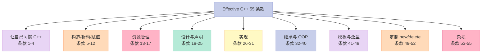
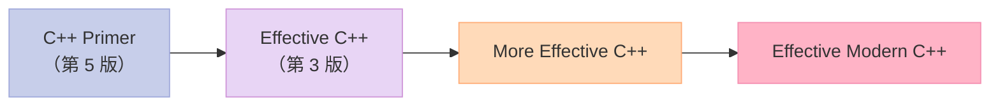
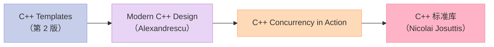
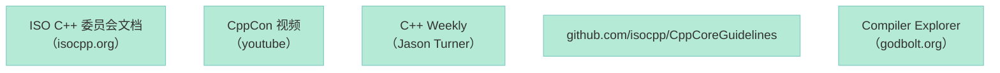
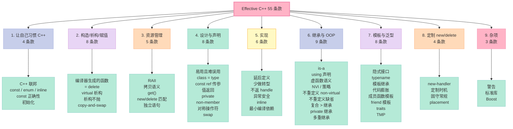

> **一句话核心结论**：C++ 55 个条款的核心哲学可以浓缩为 4 句话——**"编译器是你的朋友，不是敌人"**、**"RAII 是 C++ 资源管理的灵魂"**、**"const 是契约，类型是文档"**、**"标准库是最好的老师，Boost 是 C++ 的未来"**。本章 3 个条款 + 全文总结带你走完 Effective C++ 第三版之旅。

---

## 系列导航

| # | 文章 | 状态 |
|:--|:--|:--|
| 0 | [系列总览](/2026/06/18/effective-cpp-00-series-index/) | ✅ 已发布 |
| 1 | [让自己习惯 C++](/2026/06/18/effective-cpp-01-accustom-cplusplus/) | ✅ 已发布 |
| 2 | [构造/析构/赋值](/2026/06/18/effective-cpp-02-constructors-destructors/) | ✅ 已发布 |
| 3 | [资源管理](/2026/06/18/effective-cpp-03-resource-management/) | ✅ 已发布 |
| 4 | [设计与声明](/2026/06/18/effective-cpp-04-designs-and-declarations/) | ✅ 已发布 |
| 5 | [实现](/2026/06/18/effective-cpp-05-implementations/) | ✅ 已发布 |
| 6 | [继承与 OOP](/2026/06/18/effective-cpp-06-inheritance-and-oop/) | ✅ 已发布 |
| 7 | [模板与泛型](/2026/06/18/effective-cpp-07-templates-and-generics/) | ✅ 已发布 |
| 8 | [定制 new / delete](/2026/06/18/effective-cpp-08-customizing-new-delete/) | ✅ 已发布 |
| 9 | [本文：杂项 + 总结](/2026/06/18/effective-cpp-09-miscellany-and-summary/) | ✅ 已发布 |

---

## 前言：为什么"杂项"也重要？

Effective C++ 第 9 章只有 3 个条款——但每一个都是"看不见但致命"的工程哲学：

- **Compiler warnings**——你写的代码"对未来编译器"是错的
- **标准库**——不要重复发明轮子
- **Boost**——C++ 的"未来标准"

这 3 个条款是"价值观"——决定了你的代码是否能**活得久、跑得稳、跟得上时代**。

---

## 一、条款 53：不要轻视编译器的警告

### 1.1 案例：warning 不是噪音

```cpp
class Base {
public:
    virtual void f() const;
};

class Derived : public Base {
public:
    virtual void f();  // ❌ 缺 const
};

void process(const Base& b) {
    b.f();  // 调用 Base::f（const），不是 Derived::f（非 const）
}
```

**编译器的 warning**：

```text
warning: 'Derived::f' hides virtual 'Base::f' [-Woverloaded-virtual]
```

### 1.2 警告 vs 错误

| 类型 | 含义 | 行动 |
|------|------|------|
| **error** | 编译失败 | 必须修 |
| **warning** | 编译通过，但"可能有问题" | **应该**修 |

**反直觉**：

- 警告是"未来版本的错误"——升级编译器就报错
- 警告是"跨平台的错误"——某些平台/编译器/版本会失败
- 警告是"优化的线索"——编译器比你更懂

### 1.3 实战原则

```cpp
// 1. 最高警告等级
g++ -Wall -Wextra -Wpedantic

// 2. 把 warning 当 error
g++ -Wall -Wextra -Wpedantic -Werror

// 3. 跨编译器测试
clang++ -Wall -Wextra -Wpedantic
MSVC /W4
```

### 1.4 "不沉默"的最高境界

```cpp
// ❌ 沉默的 bug
class Widget {
    int data_;
    Widget(const Widget& w) : data_(w.data_) {}  // 漏了其他成员
};

// ✅ 警告是"指针"
class Widget {
    int data_;
    std::string name_;
    Widget(const Widget& w) : data_(w.data_), name_(w.name_) {}  // 完整
};
// -Wuninitialized 可能会警告
```

### 1.5 关键启示

1. **warning 是"编译器想告诉你的事"**——不要忽视
2. **开发期 `-Werror`**——把 warning 当 error
3. **跨编译器测试**——不同编译器找不同问题
4. **CI 加 ASan / UBSan / TSan**——找运行期问题

---

## 二、条款 54：让自己熟悉包括 TR1 在内的标准程序库

### 2.1 C++ 标准库的全景（C++11 之后）

| 类别 | 包含 |
|------|------|
| **容器** | `vector`、`list`、`deque`、`map`、`set`、`unordered_map`、`array`、`forward_list` |
| **算法** | `sort`、`find`、`transform`、`accumulate` |
| **迭代器** | `iterator`、`reverse_iterator`、`move_iterator` |
| **函数对象** | `function`、`bind`、`function`、`hash` |
| **智能指针** | `unique_ptr`、`shared_ptr`、`weak_ptr` |
| **正则** | `regex` |
| **随机数** | `random`、`default_random_engine` |
| **时间** | `chrono::duration`、`chrono::time_point` |
| **并发** | `thread`、`mutex`、`condition_variable`、`atomic` |
| **文件系统**（C++17） | `filesystem::path`、`directory_iterator` |
| **可选类型**（C++17） | `optional`、`variant`、`any` |
| **协程**（C++20） | `co_await`、`co_yield` |
| **模块**（C++20） | `import` / `export` |

### 2.2 "自己造轮子"的反例

```cpp
// ❌ 自己写 unique_ptr
template<typename T>
class MyUniquePtr { /* 100 行 */ };

// ✅ 用 std::unique_ptr
std::unique_ptr<Widget> p = std::make_unique<Widget>();
```

**优势**：

- 标准库经过**亿级项目**验证
- 编译器**深度优化**标准库
- 代码**可读性**更高
- **跨平台**一致

### 2.3 何时"自己造"？

- 标准库**没有**（如 GPU 内存管理）
- 标准库**太慢**（需要 profile 证实）
- 标准库**语义不对**（如自定义内存池）

### 2.4 关键启示

1. **先看标准库**——90% 已有
2. **不会用？查 cppreference.com**
3. **C++11/14/17/20** 加了很多好用的库
4. **"不重复造轮子"是金科玉律**

---

## 三、条款 55：让自己熟悉 Boost

### 3.1 什么是 Boost？

**Boost** = 准标准 C++ 库——很多 Boost 库最终被纳入 C++ 标准（如 `shared_ptr`、`function`、`unordered_map` 都来自 Boost）。

### 3.2 Boost 库的 3 大类

| 类别 | 例子 |
|------|------|
| **C++ 标准的"预演"** | `shared_ptr`、`function`、`regex` |
| **跨平台的"工具"** | `filesystem`、`thread`、`asio`（网络） |
| **前沿研究** | `hana`（元编程）、`spirit`（解析器） |

### 3.3 Boost 中的"明星库"

| 库 | 用途 | 标准？ |
|-----|------|--------|
| `boost::shared_ptr` | 智能指针 | C++11 |
| `boost::function` | 函数包装 | C++11 |
| `boost::bind` | 函数绑定 | C++11 `std::bind` |
| `boost::unordered_map` | 哈希表 | C++11 |
| `boost::regex` | 正则 | C++11 |
| `boost::thread` | 线程 | C++11 |
| `boost::filesystem` | 文件系统 | C++17 |
| `boost::asio` | 网络 | 第三方 |
| `boost::hana` | 元编程 | 第三方 |
| `boost::spirit` | 解析器 | 第三方 |

### 3.4 实战：用 Boost.Asio 写一个 echo server

```cpp
#include <boost/asio.hpp>
using boost::asio::ip::tcp;

int main() {
    boost::asio::io_context io;
    tcp::acceptor acceptor(io, tcp::endpoint(tcp::v4(), 8080));

    while (true) {
        tcp::socket socket(io);
        acceptor.accept(socket);
        // 处理 socket
    }
}
```

### 3.5 关键启示

1. **Boost = C++ 标准的"候选库"**——质量高
2. **Boost.Asio** 是网络编程的事实标准
3. **学习 Boost = 学习 C++ 的前沿**
4. **boost.org**——找库的最好地方

---

## 四、整个 Effective C++ 系列的回顾

### 4.1 9 大主题回顾



### 4.2 55 条款的"4 大哲学"

**哲学 1：编译器是你的朋友**

- 条款 05-06：编译器生成/拒绝函数
- 条款 12：复制对象时勿忘成分
- 条款 30：inline 是请求
- 条款 31：最小化编译依赖
- 条款 53：不要忽视警告

**哲学 2：RAII 是 C++ 资源管理的灵魂**

- 条款 13-17：5 个 RAII 条款
- 条款 25：noexcept swap
- 条款 29：异常安全

**哲学 3：const 是契约，类型是文档**

- 条款 03-04：const 正确性
- 条款 18：易用且难误用
- 条款 19：class = type
- 条款 22：private 成员
- 条款 24：对称操作符
- 条款 27：少做转型

**哲学 4：标准库是最好的老师**

- 条款 23：non-member、non-friend
- 条款 32-40：继承的 3 种关系
- 条款 41-48：模板的力量
- 条款 54：熟悉标准库
- 条款 55：熟悉 Boost

### 4.3 55 条款的"3 个层次"

```mermaid
graph TB
    A["55 条款的 3 个层次"] --> B["基础层\n（C++ 的"是什么"）"]
    A --> C["进阶层\n（C++ 的"怎么用"）"]
    A --> D["哲学层\n（C++ 的"为什么"）"]

    B --> B1["条款 1-4\n基本习惯"]
    B --> B2["条款 5-12\n对象生命周期"]
    B --> B3["条款 13-17\nRAII"]

    C --> C1["条款 18-25\n接口设计"]
    C --> C2["条款 26-31\n实现细节"]
    C --> C3["条款 49-52\n内存管理"]

    D --> D1["条款 32-40\n继承与 OOP"]
    D --> D2["条款 41-48\n模板与泛型"]
    D --> D3["条款 53-55\n杂项 / 标准库"]

    style A fill:#C7CEEA,stroke:#9FA8DA,color:#333
    style B fill:#E8D5F5,stroke:#CE93D8,color:#333
    style C fill:#FFDAB9,stroke:#FFAB76,color:#333
    style D fill:#FFB3C6,stroke:#F48FB1,color:#333
    style B1 fill:#B5EAD7,stroke:#80CBC4,color:#333
    style B2 fill:#B5EAD7,stroke:#80CBC4,color:#333
    style B3 fill:#B5EAD7,stroke:#80CBC4,color:#333
    style C1 fill:#B5EAD7,stroke:#80CBC4,color:#333
    style C2 fill:#B5EAD7,stroke:#80CBC4,color:#333
    style C3 fill:#B5EAD7,stroke:#80CBC4,color:#333
    style D1 fill:#B5EAD7,stroke:#80CBC4,color:#333
    style D2 fill:#B5EAD7,stroke:#80CBC4,color:#333
    style D3 fill:#B5EAD7,stroke:#80CBC4,color:#333
```

### 4.4 55 条款一览表

| 条款 | 主题 | 关键词 |
|:-----|:-----|:-------|
| 01 | C++ 是语言联邦 | 4 个子语言 |
| 02 | const/enum/inline 替代 #define | 编译器视角 |
| 03 | 尽可能使用 const | const 正确性 |
| 04 | 对象使用前先初始化 | 构造顺序 |
| 05 | 编译器默默生成的函数 | 4 个函数 |
| 06 | 拒绝编译器自动生成的函数 | `= delete` |
| 07 | 多态基类声明 virtual 析构 | 多态删除 |
| 08 | 别让异常逃离析构 | noexcept |
| 09 | 构造/析构中勿调 virtual | vptr 时机 |
| 10 | operator= 返回 *this | 链式赋值 |
| 11 | operator= 处理自我赋值 | copy-and-swap |
| 12 | 复制对象勿忘每个成分 | 拷贝完整 |
| 13 | 以对象管理资源 | RAII |
| 14 | 资源管理类的 copying | 拷贝语义 |
| 15 | 提供对原始资源的访问 | get() |
| 16 | new/delete 形式匹配 | 数组 vs 标量 |
| 17 | 独立语句 new 出智能指针 | 异常安全 |
| 18 | 接口易用且难误用 | 类型系统 |
| 19 | class 犹如 type | 11 问 |
| 20 | pass-by-const-ref 替代 value | 性能 |
| 21 | 返回对象时别返回 ref | RVO |
| 22 | 成员变量声明为 private | 封装 |
| 23 | non-member、non-friend | 工具函数 |
| 24 | 类型转换时用 non-member | 对称操作符 |
| 25 | noexcept swap | copy-and-swap |
| 26 | 延后变量定义 | 避免白构造 |
| 27 | 少做转型 | 4 种 cast |
| 28 | 避免返回 handles | 内部成分 |
| 29 | 异常安全 | 3 个保证 |
| 30 | 了解 inline | 隐式 inline |
| 31 | 最小化编译依赖 | pimpl |
| 32 | public 继承塑模 is-a | Liskov |
| 33 | 避免遮蔽继承的名字 | using |
| 34 | 接口继承与实现继承 | 3 种虚函数 |
| 35 | virtual 以外的选择 | NVI / 策略 |
| 36 | 绝不重定义 non-virtual | 静态绑定 |
| 37 | 绝不重定义缺省参数 | 静态绑定 |
| 38 | 复合塑模 has-a / is-impl | 优先复合 |
| 39 | 审慎使用 private 继承 | 3 个场景 |
| 40 | 审慎使用多重继承 | 多接口 |
| 41 | 隐式接口与编译期多态 | 模板多态 |
| 42 | typename 的双重含义 | 嵌套类型 |
| 43 | 模板化基类的名称 | this-> / using |
| 44 | 抽离与参数无关的代码 | 模板膨胀 |
| 45 | 成员函数模板接受兼容类型 | 智能指针 |
| 46 | 类型转换时模板用 friend | operator |
| 47 | traits classes 表现类型信息 | 编译期查询 |
| 48 | 认识 template 元编程 | 编译期计算 |
| 49 | 了解 new-handler | 失败回调 |
| 50 | new/delete 替换时机 | 6 个理由 |
| 51 | new/delete 固守常规 | 8 条铁律 |
| 52 | placement new 配套 delete | 异常安全 |
| 53 | 不要轻视编译警告 | 跨平台 |
| 54 | 熟悉标准库 | 不造轮子 |
| 55 | 熟悉 Boost | C++ 未来 |

---

## 五、C++ 工程实战：4 大主题

### 5.1 主题 1：性能优化

| 优化点 | 条款 | 关键点 |
|--------|------|--------|
| 传值 → 传 const ref | 20 | 默认参数传递 |
| 拷贝 → 移动 | 25, 41 | RVO + 移动构造 |
| 虚函数 → 模板 | 35, 41 | 编译期多态 |
| 模板膨胀 | 44 | 抽基类共享 |
| 内存池 | 50, 51 | 自定义 new/delete |
| 内联 | 30 | 小函数 / 模板 |

### 5.2 主题 2：内存安全

| 安全点 | 条款 | 关键点 |
|--------|------|--------|
| 拒绝拷贝 | 06 | `= delete` |
| 资源管理 | 13-17 | 智能指针 |
| 异常安全 | 29 | copy-and-swap |
| 析构不抛 | 08 | noexcept |
| placement delete | 52 | 配套使用 |
| 内存池 | 50, 51 | 减少碎片 |

### 5.3 主题 3：API 设计

| 设计点 | 条款 | 关键点 |
|--------|------|--------|
| 易用且难误用 | 18 | 强类型 |
| 接口易扩展 | 19, 22-23 | private + non-member |
| 编译稳定 | 31 | pimpl + 前向声明 |
| 性能承诺 | 25, 29 | noexcept + 强异常保证 |
| 模板友好 | 41-48 | traits + 隐式接口 |

### 5.4 主题 4：现代 C++

| 现代化 | 条款 | 关键点 |
|--------|------|--------|
| `= default` / `= delete` | 05, 06 | C++11 |
| 智能指针 | 13-17 | C++11 |
| 移动语义 | 25, 29, RVO | C++11 |
| `auto` | 41-48 | C++11 |
| `if constexpr` | 47-48 | C++17 |
| `concepts` | 41-48 | C++20 |
| `modules` | 31 | C++20 |
| `std::span` / `std::format` | 18 | C++20 |

---

## 六、面试宝典

### 6.1 顶级 C++ 面试题（55 条款浓缩）

#### 基础（5 题）

1. **C++ 是什么？**——"语言联邦"：C / OOP C++ / Template C++ / STL
2. **为什么 const 重要？**——契约、文档、编译器优化
3. **什么是 RAII？**——Resource Acquisition Is Initialization
5. **智能指针有哪些？**——`unique_ptr` / `shared_ptr` / `weak_ptr`

#### 进阶（10 题）

1. **Rule of Three**——析构 + 拷贝构造 + 拷贝赋值 三者要么都不写，要么都写
2. **Rule of Five**——C++11 起：+ 移动构造 + 移动赋值
3. **Rule of Zero**——用标准库管资源，自己不写
4. **多态基类为什么 virtual 析构？**——`delete base_ptr` 才正确
5. **什么是 pimpl？**——`unique_ptr<Impl>` 隐藏实现
6. **operator= 怎么处理自我赋值？**——copy-and-swap
7. **pass-by-value vs pass-by-const-ref？**——默认 const&，内置类型/迭代器传值
8. **什么时候用 private 继承？**——protected 访问 / 虚函数重写 / EBO
9. **什么是 copy-and-swap？**——`T& operator=(T rhs) { swap(rhs); return *this; }`
10. **NVI 模式？**——public non-virtual 包 private virtual

#### 高阶（10 题）

1. **Liskov 替换原则？**——派生类必须能完全替代基类
2. **public 继承 vs 复合？**——is-a 用继承；has-a/is-impl 用复合
3. **菱形继承怎么处理？**——虚继承
4. **虚函数的缺省参数为什么不能重写？**——静态绑定
5. **为什么模板不支持隐式转换？**——参数推导时不做；用 friend 模板
6. **什么是 traits？**——编译期类型查询
7. **什么是 TMP？**——Template Meta-Programming；C++17+ 用 `if constexpr`
8. **placement new 配套什么？**——placement delete
9. **operator new 失败时调什么？**——new-handler
10. **C++20 concepts 是什么？**——模板约束的"声明式"语法

### 6.2 实战题（5 题）

1. **实现一个 `unique_ptr`**（核心：移动构造 + `= delete` 拷贝）
2. **实现一个 `shared_ptr`**（核心：引用计数 + 循环引用）
3. **实现 `pimpl` 模式**（核心：前向声明 + 移动语义）
4. **实现一个简单的 traits**（核心：模板特化）
5. **实现一个异常安全的 operator=**（核心：copy-and-swap）

---

## 七、学习路径推荐

### 7.1 初学者路径（3-6 个月）



### 7.2 进阶路径（6-12 个月）



### 7.3 高手路径（持续）



### 7.4 推荐资源

| 资源 | 类型 | 适合 |
|------|------|------|
| **C++ Primer** | 入门 | 0 基础入门 |
| **Effective C++** | 进阶 | 写代码 6 个月后 |
| **Effective Modern C++** | 进阶 | 写代码 1 年后 |
| **cppreference.com** | 工具 | 查询语法 |
| **godbolt.org** | 工具 | 看汇编、调代码 |
| **isocpp.org** | 资源 | 标准、提案 |
| **CppCon** | 视频 | 前沿、实践 |
| **C++ Core Guidelines** | 规范 | 团队规范 |

---

## 八、回到 55 条款的"4 大哲学"

### 哲学 1：编译器是你的朋友

> **不要和编译器作对——相信它、依赖它、配合它**。

- 条款 05：编译器生成 4 个函数 = 不要重复造轮子
- 条款 12：复制对象时勿忘成分 = 编译器警告会提醒你
- 条款 30：inline = 编译器决定是否 inline
- 条款 31：最小化编译依赖 = 编译器只编译你需要的
- 条款 53：不要忽视警告 = 编译器在"帮"你

### 哲学 2：RAII 是灵魂

> **C++ 资源管理的核心范式——构造获取，析构释放**。

- 条款 13-17：5 个 RAII 条款
- 条款 25：noexcept swap
- 条款 29：异常安全 = RAII 的延伸
- 条款 52：placement new 配套 placement delete

### 哲学 3：const 是契约，类型是文档

> **C++ 的类型系统是"编译期验证"——让对的代码亮起来**。

- 条款 03-04：const 正确性
- 条款 18：易用且难误用
- 条款 19：class = type
- 条款 22：private 成员
- 条款 24：对称操作符
- 条款 27：少做转型
- 条款 47：traits 表现类型信息

### 哲学 4：标准库是最好的老师

> **不重复造轮子——90% 的需求标准库已有**。

- 条款 23：non-member、non-friend（STL 风格）
- 条款 32-40：继承的 3 种关系（标准库 + Boost）
- 条款 41-48：模板的力量（STL = 模板的范本）
- 条款 49-52：内存管理（标准库 + 自定义）
- 条款 54-55：熟悉标准库 + Boost

---

## 九、Effective C++ 9 大章节一图概览



---

## 十、55 条款的"5 道终极题"

> **这 5 道题，如果你都能清晰回答，说明 Effective C++ 真的读懂了**。

### 终极题 1：什么是 C++？

**答案要点**：

- 4 个子语言的联邦（C / OOP C++ / Template C++ / STL）
- 编译期多态 + 运行期多态
- 资源管理 + 异常安全
- 类型系统 + 模板元编程
- 兼容 C + 零开销抽象

### 终极题 2：什么是 RAII？

**答案要点**：

- Resource Acquisition Is Initialization
- 构造获取资源，析构释放资源
- 异常安全 + 自动清理
- 智能指针、lock_guard、fstream 都是 RAII

### 终极题 3：什么是 Rule of Three / Five / Zero？

**答案要点**：

- Rule of Three：析构 + 拷贝构造 + 拷贝赋值
- Rule of Five：+ 移动构造 + 移动赋值
- Rule of Zero：用标准库管资源（不自己写）

### 终极题 4：什么是 pimpl？

**答案要点**：

- Private Implementation
- `unique_ptr<Impl> pImpl_`
- 隐藏实现、加速编译、ABI 稳定
- `~T()` 必须在 .cpp 中实现

### 终极题 5：C++ 的"未来"是什么？

**答案要点**：

- C++17：filesystem、variant、optional、string_view
- C++20：concepts、modules、coroutines、ranges
- C++23：expected、mdspan、flat_map
- Boost 是 C++ 标准的"候选库"

---

## 十一、本篇速查表

| 主题 | 关键 API / 模式 | 适用场景 |
|------|----------------|----------|
| 编译器警告 | `-Wall -Werror` | 跨平台开发 |
| 标准库 | `std::vector` / `std::unique_ptr` | 90% 场景 |
| Boost | `boost::asio` / `boost::filesystem` | 跨平台工具 |
| 性能优化 | RVO / 移动 / 模板 | 性能调优 |
| 内存安全 | 智能指针 / RAII | 异常安全 |
| API 设计 | const ref / private / non-member | 接口设计 |
| 现代 C++ | `auto` / `if constexpr` / concepts | C++11/17/20 |
| 编译优化 | pimpl / forward declaration | 编译时间 |
| 内存池 | 自定义 new/delete | 高频小对象 |
| 异常安全 | copy-and-swap | 强异常保证 |

---

## 十二、系列导航

| # | 文章 | 状态 |
|:--|:--|:--|
| 0 | [系列总览](/2026/06/18/effective-cpp-00-series-index/) | ✅ 已发布 |
| 1 | [让自己习惯 C++](/2026/06/18/effective-cpp-01-accustom-cplusplus/) | ✅ 已发布 |
| 2 | [构造/析构/赋值](/2026/06/18/effective-cpp-02-constructors-destructors/) | ✅ 已发布 |
| 3 | [资源管理](/2026/06/18/effective-cpp-03-resource-management/) | ✅ 已发布 |
| 4 | [设计与声明](/2026/06/18/effective-cpp-04-designs-and-declarations/) | ✅ 已发布 |
| 5 | [实现](/2026/06/18/effective-cpp-05-implementations/) | ✅ 已发布 |
| 6 | [继承与 OOP](/2026/06/18/effective-cpp-06-inheritance-and-oop/) | ✅ 已发布 |
| 7 | [模板与泛型](/2026/06/18/effective-cpp-07-templates-and-generics/) | ✅ 已发布 |
| 8 | [定制 new / delete](/2026/06/18/effective-cpp-08-customizing-new-delete/) | ✅ 已发布 |
| 9 | [本文：杂项 + 总结](/2026/06/18/effective-cpp-09-miscellany-and-summary/) | ✅ 已发布 |

---

## 十三、结尾金句

> **"C++ 是一门让你成为更好程序员（或者更糟）的语言。"** —— Scott Meyers

> **"Effective C++ 的 55 个条款，是 C++ 程序员从"能用"到"用好"的必经之路。"**

> **"不要害怕 C++ 的复杂性——理解它、驯服它、享受它。"**

---

## 行动召唤

1. **今天**：检查你的代码——有"忽视 warning"的地方吗？开启 `-Werror`
2. **今天**：列出你项目里所有"裸 new/delete"——准备改成智能指针
3. **本周**：阅读 1-2 个 Boost 库的源码——学习标准库之外的"高质量 C++"
4. **本月**：用 Effective C++ 的 9 大主题，code review 一次你的项目
5. **持续**：把 Effective C++ 的 4 大哲学融入你的日常编码

---

## 写在最后

Effective C++ 是一本**改变你 C++ 编码习惯**的书——从"我能写 C++"到"我**会**写 C++"。

**9 篇博客、9 大主题、55 个条款、4 大哲学**——这趟旅程我们一起走完了。

**下一篇预告**：将开启**More Effective C++** 系列——35 个条款，深入 35 个"改善编程与设计"的有效方法。包括：基础议题、操作符、异常、效率、技术、杂项。

> **C++ 之难，难在哲学；C++ 之美，美在哲学。**
>
> 让我们一起，做"懂哲学"的 C++ 程序员。

---

> **维护者**：Xu Qi
> **最后更新**：2026-06-18
> **许可**：CC BY 4.0
