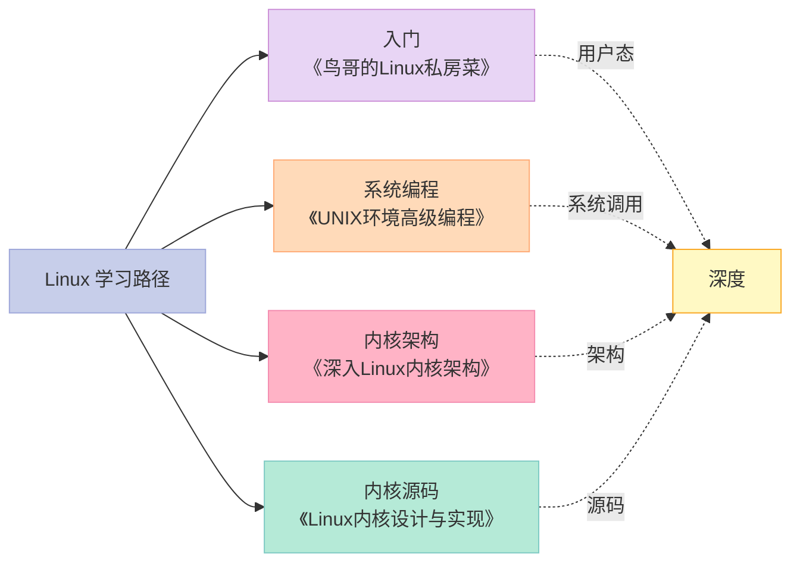
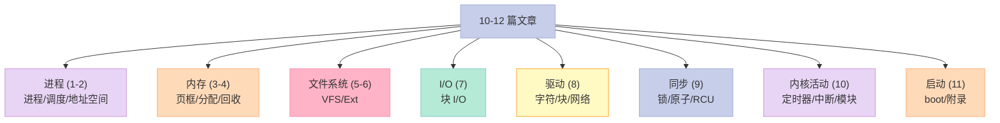
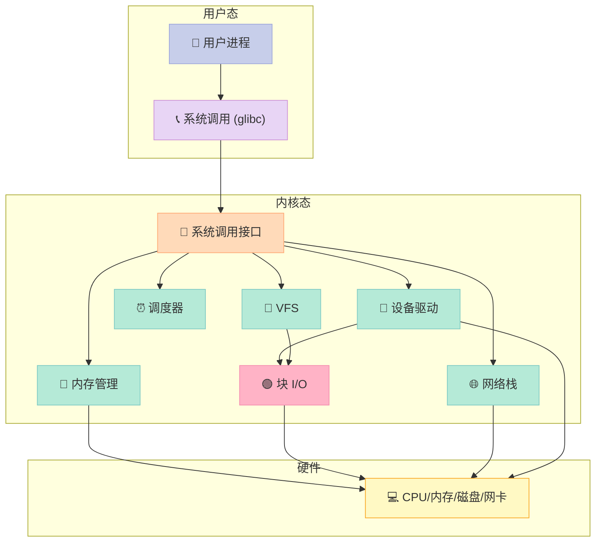
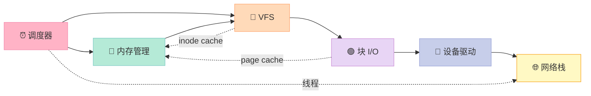

> **一句话核心结论**：本书是**Linux 内核架构的"百科全书"**——19 章覆盖**进程管理、内存管理、VFS、块 I/O、设备驱动、网络栈、内核同步、启动与调试**等所有核心子系统，加上 6 附录讲解**数据结构、配置选项、汇编、内核调试、术语表**。本系列用 **10-12 篇博客** 把它讲透。

---

## 一、本书定位



### 1.1 与同类书对比

| 书 | 视角 | 难度 | 适合 |
|---|------|------|------|
| **深入 Linux 内核架构**（Mauerer） | **架构** | ⭐⭐⭐⭐ | 想理解内核子系统如何协作 |
| Linux 内核设计与实现（Love） | 源码导读 | ⭐⭐⭐ | 想快速入门内核源码 |
| Linux 内核完全注释 | 逐行注释 | ⭐⭐⭐⭐⭐ | 想逐行读懂内核 |
| Understanding the Linux Kernel | 架构 | ⭐⭐⭐⭐ | 与本书齐名的另一经典 |
| Linux Device Drivers | 驱动开发 | ⭐⭐⭐ | 想写驱动 |

### 1.2 本书特色

- ✅ **架构优先**——讲"为什么这样设计"
- ✅ **图示丰富**——大量 ASCII 图和流程图
- ✅ **覆盖全面**——19 章涵盖所有子系统
- ✅ **附录实用**——数据结构、汇编、配置选项速查

---

## 二、19 章全景

```mermaid
graph TB
    A["深入 Linux 内核架构 19 章"] --> B["概览 (1)\n内核/用户态/体系结构"]
    A --> C["进程管理 (2-3)\nschedule/fork/exec"]
    A --> D["内存管理 (4-6)\nmalloc/slab/页表"]
    A --> E["VFS (7-8)\n文件系统抽象"]
    A --> F["块 I/O (9)\nbio/scheduler"]
    A --> G["设备驱动 (10-12)\n字符/块/网络"]
    A --> H["网络栈 (13)\nsocket/netfilter"]
    A --> I["同步 (14)\n锁/原子/RCU"]
    A --> J["内核活动 (15-17)\n中断/软中断/tasklet"]
    A --> K["启动 (18-19)\nboot/模块"]
    A --> L["附录 (A-F)\n数据结构/汇编/调试"]

    style A fill:#C7CEEA,stroke:#9FA8DA,color:#333
    style B fill:#E8D5F5,stroke:#CE93D8,color:#333
    style C fill:#FFDAB9,stroke:#FFAB76,color:#333
    style D fill:#FFB3C6,stroke:#F48FB1,color:#333
    style E fill:#B5EAD7,stroke:#80CBC4,color:#333
    style F fill:#FFF9C4,stroke:#F9A825,color:#333
    style G fill:#C7CEEA,stroke:#9FA8DA,color:#333
    style H fill:#E8D5F5,stroke:#CE93D8,color:#333
    style I fill:#FFDAB9,stroke:#FFAB76,color:#333
    style J fill:#FFB3C6,stroke:#F48FB1,color:#333
    style K fill:#B5EAD7,stroke:#80CBC4,color:#333
    style L fill:#FFF9C4,stroke:#F9A825,color:#333
```



---

## 三、19 章目录速览

### 3.1 第一部分：概览

| 章 | 标题 | 核心内容 |
|:--|:--|:--|
| 1 | **简介与概述** | 内核/用户态、单/多核、ARM/x86 差异、源码结构 |

### 3.2 第二部分：进程管理与调度

| 章 | 标题 | 核心内容 |
|:--|:--|:--|
| 2 | **进程管理与调度** | 进程描述符、调度器、O(1)、CFS、实时调度 |
| 3 | **进程地址空间** | VMA、mm_struct、缺页、COW |

### 3.3 第三部分：内存管理

| 章 | 标题 | 核心内容 |
|:--|:--|:--|
| 4 | **内存管理** | 页框分配、伙伴系统、kmalloc、vmalloc |
| 5 | **内核中的内存分配与回收** | slab、kmem_cache、内存回收 |
| 6 | **物理页的换出与换入** | 页面置换、LRU、kswapd、swap |

### 3.4 第四部分：文件系统

| 章 | 标题 | 核心内容 |
|:--|:--|:--|
| 7 | **虚拟文件系统** | VFS 抽象、超级块、inode、dentry |
| 8 | **Ext 文件系统族** | Ext2/3/4 实现、磁盘布局、日志 |

### 3.5 第五部分：块 I/O

| 章 | 标题 | 核心内容 |
|:--|:--|:--|
| 9 | **块 I/O 层** | bio、请求队列、调度器（CFQ/Deadline） |

### 3.6 第六部分：设备驱动

| 章 | 标题 | 核心内容 |
|:--|:--|:--|
| 10 | **设备驱动程序** | 字符/块设备、kobject、sysfs |
| 11 | **字符设备** | tty、终端、串口 |
| 12 | **网络设备** | NIC 驱动、netif |

### 3.7 第七部分：网络栈

| 章 | 标题 | 核心内容 |
|:--|:--|:--|
| 13 | **网络栈** | socket、TCP/IP、netfilter、路由 |

### 3.8 第八部分：内核同步

| 章 | 标题 | 核心内容 |
|:--|:--|:--|
| 14 | **内核同步** | 自旋锁、信号量、RCU、原子操作 |

### 3.9 第九部分：内核活动

| 章 | 标题 | 核心内容 |
|:--|:--|:--|
| 15 | **定时器与时间管理** | jiffies、定时器、时钟中断 |
| 16 | **软中断、tasklet 与工作队列** | bottom half、softirq、workqueue |
| 17 | **内核中数据结构的补充** | 链表、红黑树、基数树 |

### 3.10 第十部分：启动与模块

| 章 | 标题 | 核心内容 |
|:--|:--|:--|
| 18 | **模块** | 动态加载、依赖、EXPORT_SYMBOL |
| 19 | **内核移植与启动** | boot、压缩内核、initramfs |

### 3.11 附录

| 附录 | 标题 |
|:--|:--|
| A | 内核相关的数据结构 |
| B | 内核相关的高级数据结构 |
| C | 汇编语言基础 |
| D | 与体系结构相关 |
| E | 内核配置选项 |
| F | 术语表 |

---

## 四、本系列规划：10-12 篇博客

### 4.1 文章地图

| # | 文章 | 涵盖章节 | 状态 |
|:--|:--|:--|:--|
| 0 | [系列总览](/2026/06/18/linux-kernel-architecture-00-series-index/) | 全书 | ✅ 已发布 |
| 1 | 内核架构总览 + 进程管理 | 第 1-2 章 | 🔜 计划中 |
| 2 | 进程地址空间 | 第 3 章 | 🔜 计划中 |
| 3 | 内存管理基础 | 第 4 章 | 🔜 计划中 |
| 4 | 内存分配器与回收 | 第 5-6 章 | 🔜 计划中 |
| 5 | 虚拟文件系统 VFS | 第 7 章 | 🔜 计划中 |
| 6 | Ext 文件系统族 | 第 8 章 | 🔜 计划中 |
| 7 | 块 I/O 层 | 第 9 章 | 🔜 计划中 |
| 8 | 设备驱动 + 网络栈 | 第 10-13 章 | 🔜 计划中 |
| 9 | 内核同步 + 定时器 | 第 14-15 章 | 🔜 计划中 |
| 10 | 中断下半部 + 模块 | 第 16-18 章 | 🔜 计划中 |
| 11 | 内核启动 + 附录速查 | 第 19 章 + 附录 A-F | 🔜 计划中 |

### 4.2 文章主题分布



---

## 五、本系列核心概念图

### 5.1 Linux 内核架构



### 5.2 子系统依赖关系



---

## 六、阅读建议

### 6.1 适合读者

- ✅ 想理解 Linux 内核架构的开发者
- ✅ 操作系统课程的延伸阅读
- ✅ 准备 Linux 内核开发岗位面试
- ✅ 内核贡献者的入门读物

### 6.2 不适合读者

- ❌ 想"速成"内核开发——请先看《Linux 内核设计与实现》
- ❌ 想写 Linux 驱动——请看《Linux Device Drivers》
- ❌ 想学用户态编程——请看《UNIX 环境高级编程》

### 6.3 推荐路径


---

## 七、本书与面试

### 7.1 高频考点

| 主题 | 面试问得最多的问题 |
|------|--------------------|
| 进程管理 | 进程 vs 线程、CFS 调度、fork/exec |
| 内存管理 | 虚拟地址、页表、伙伴系统、slab |
| VFS | inode/dentry/super_block 关系 |
| 块 I/O | bio 调度器、page cache、buffer cache |
| 同步 | 自旋锁 vs 信号量、RCU、原子操作 |
| 中断 | 上下半部、softirq、workqueue |
| 网络栈 | TCP 三次握手、socket 层次、netfilter |

### 7.2 经验数据

- 一线大厂后端岗位：30-40% 问内核相关
- 操作系统岗位：60-70% 问内核
- 内核开发岗位：必考

---

## 八、本系列写作约定

### 8.1 术语对照

| 中文 | 英文 |
|------|------|
| 进程 | Process |
| 调度器 | Scheduler |
| 内存管理 | Memory Management |
| 虚拟文件系统 | Virtual File System (VFS) |
| 块 I/O | Block I/O |
| 设备驱动 | Device Driver |
| 网络栈 | Network Stack |
| 内核同步 | Kernel Synchronization |
| 页框 | Page Frame |
| 伙伴系统 | Buddy System |
| 写时复制 | Copy-on-Write (COW) |

### 8.2 内核版本约定

本书基于 **Linux 2.6** 撰写，但**核心思想到 Linux 5.x/6.x 仍然适用**：

- ✅ 调度器（CFS）：仍然核心
- ✅ 内存管理（伙伴系统 + slab）：仍然核心（slab 已演化为 slub）
- ✅ VFS：基本不变
- ✅ 同步（RCU）：增强但核心不变
- ⚠️ 时间管理：`tickless` 系统等新特性
- ⚠️ 模块：`module` 已经成熟

### 8.3 源码参考

建议对照以下源码：

```bash
git clone git://git.kernel.org/pub/scm/linux/kernel/git/torvalds/linux.git
cd linux
git checkout v6.0  # 或你喜欢的版本
```

---

## 九、系列导航

| # | 文章 | 状态 |
|:--|:--|:--|
| 0 | **本文：系列总览** | ✅ 已发布 |
| 1 | [内核架构总览 + 进程管理](/2026/06/18/linux-kernel-architecture-01-process-management/) | 🔜 计划中 |
| 2 | [进程地址空间](/2026/06/18/linux-kernel-architecture-02-process-address-space/) | 🔜 计划中 |
| 3 | [内存管理基础](/2026/06/18/linux-kernel-architecture-03-memory-management-basics/) | 🔜 计划中 |
| 4 | [内存分配器与回收](/2026/06/18/linux-kernel-architecture-04-memory-allocation/) | 🔜 计划中 |
| 5 | [虚拟文件系统 VFS](/2026/06/18/linux-kernel-architecture-05-vfs/) | 🔜 计划中 |
| 6 | [Ext 文件系统族](/2026/06/18/linux-kernel-architecture-06-ext-filesystem/) | 🔜 计划中 |
| 7 | [块 I/O 层](/2026/06/18/linux-kernel-architecture-07-block-io/) | 🔜 计划中 |
| 8 | [设备驱动 + 网络栈](/2026/06/18/linux-kernel-architecture-08-drivers-network/) | 🔜 计划中 |
| 9 | [内核同步 + 定时器](/2026/06/18/linux-kernel-architecture-09-synchronization-timers/) | 🔜 计划中 |
| 10 | [中断下半部 + 模块](/2026/06/18/linux-kernel-architecture-10-interrupts-modules/) | 🔜 计划中 |
| 11 | [内核启动 + 附录速查](/2026/06/18/linux-kernel-architecture-11-boot-appendix/) | 🔜 计划中 |

---

**下一篇**：第 1 篇《内核架构总览 + 进程管理》——从内核/用户态、源码结构讲起，深入剖析进程描述符、调度器（CFS/O(1)）、实时调度、fork/exec 系统调用。

> **行动建议**：
> 1. **克隆 Linux 源码**——对照阅读
> 2. **准备 Linux 环境**——VM 或 WSL 2
> 3. **本书与《Linux 内核设计与实现》对比阅读**——架构 vs 源码
> 4. **每个子系统动手实验**——写个字符设备
> 5. **C 语言复习**——内核全 C + 汇编
