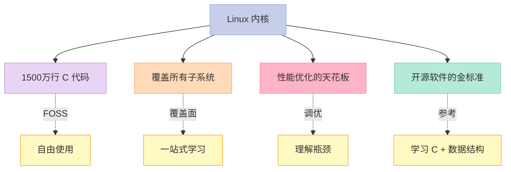
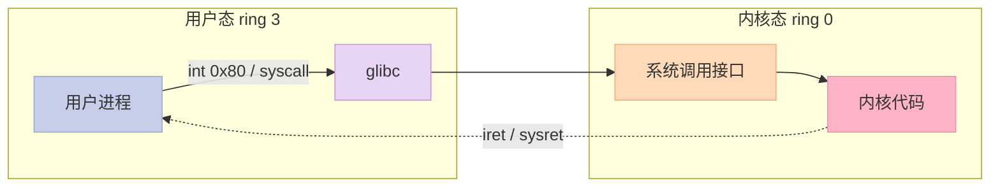
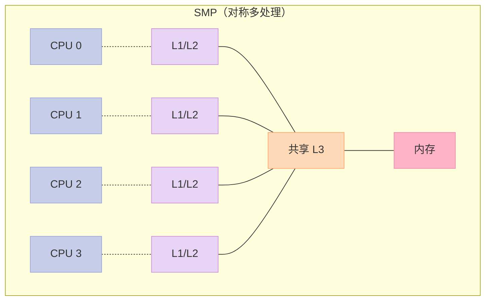
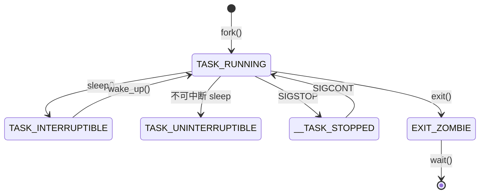
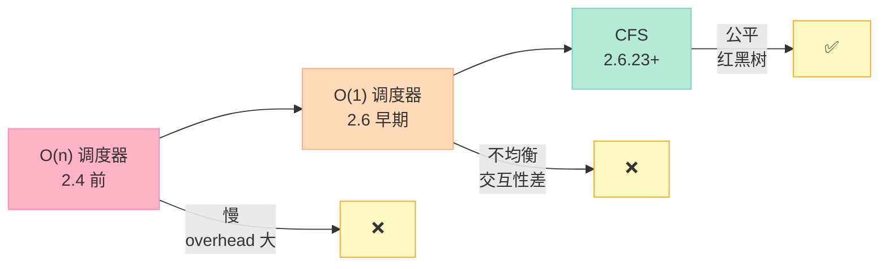
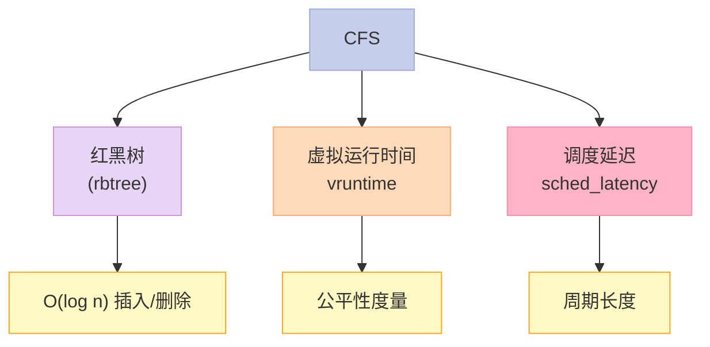
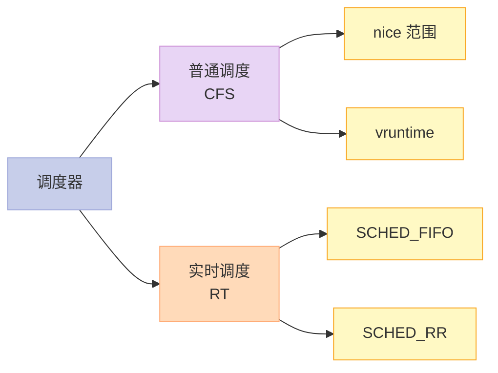
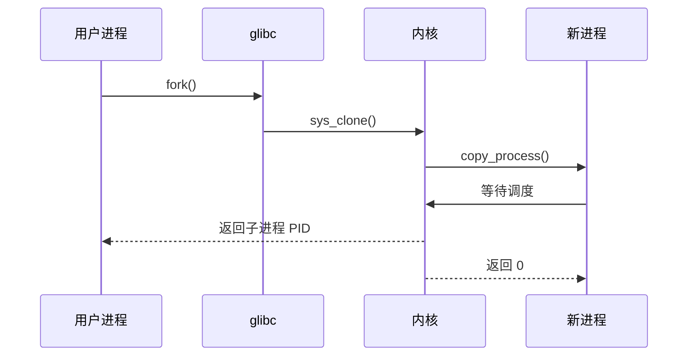
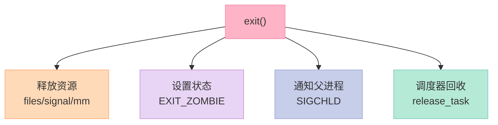
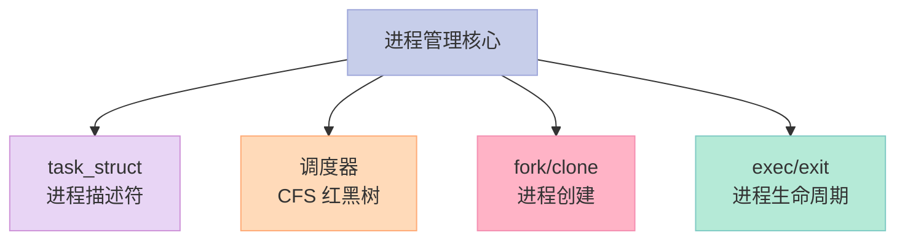

> **一句话核心结论**：Linux 内核的"开篇"——**内核态 vs 用户态**（特权级切换）、**源码结构**（arch/kernel/fs/drivers/net/mm），**进程描述符 `task_struct`** 是内核的"中心数据结构"，**调度器** 决定哪个进程跑——从 **O(1)** 到 **CFS** 的演进。

---

## 系列导航

| # | 文章 | 状态 |
|:--|:--|:--|
| 0 | [系列总览](/2026/06/18/linux-kernel-architecture-00-series-index/) | ✅ 已发布 |
| 1 | **本文：内核架构总览 + 进程管理** | ✅ 已发布 |
| 2 | [进程地址空间](/2026/06/18/linux-kernel-architecture-02-process-address-space/) | 🔜 计划中 |
| 3 | [内存管理基础](/2026/06/18/linux-kernel-architecture-03-memory-management-basics/) | 🔜 计划中 |
| 4 | [内存分配器与回收](/2026/06/18/linux-kernel-architecture-04-memory-allocation/) | 🔜 计划中 |
| 5 | [虚拟文件系统 VFS](/2026/06/18/linux-kernel-architecture-05-vfs/) | 🔜 计划中 |
| 6 | [Ext 文件系统族](/2026/06/18/linux-kernel-architecture-06-ext-filesystem/) | 🔜 计划中 |
| 7 | [块 I/O 层](/2026/06/18/linux-kernel-architecture-07-block-io/) | 🔜 计划中 |
| 8 | [设备驱动 + 网络栈](/2026/06/18/linux-kernel-architecture-08-drivers-network/) | 🔜 计划中 |
| 9 | [内核同步 + 定时器](/2026/06/18/linux-kernel-architecture-09-synchronization-timers/) | 🔜 计划中 |
| 10 | [中断下半部 + 模块](/2026/06/18/linux-kernel-architecture-10-interrupts-modules/) | 🔜 计划中 |
| 11 | [内核启动 + 附录速查](/2026/06/18/linux-kernel-architecture-11-boot-appendix/) | 🔜 计划中 |

---

## 前言：为什么读 Linux 内核源码？



**数据**（截至 2026 年）：

- Linux 6.0：约 3500 万行代码（包括工具、文档）
- 内核本身：约 1500 万行
- 贡献者：超过 5000 人
- 发布历史：1991 年至今 30+ 年

---

## 一、第 1 章：简介与概述

### 1.1 内核态 vs 用户态



| 项 | 用户态（ring 3） | 内核态（ring 0） |
|----|----------------|----------------|
| 特权级 | 低 | 高 |
| 内存 | 受限 | 全部 |
| I/O | 必须经系统调用 | 直接访问硬件 |
| 中断 | 被屏蔽 | 可响应 |
| 代码 | 用户程序 | 内核代码 |
| 崩溃 | 进程死 | 系统死 |

### 1.2 单内核 vs 微内核


| 维度 | 单内核（Linux） | 微内核 |
|------|----------------|--------|
| 性能 | 快（直接调用） | 慢（IPC） |
| 稳定 | 差（一个崩全部崩） | 好（隔离） |
| 设计 | 简单 | 复杂 |
| 例子 | Linux, BSD | QNX, L4, Minix |

**Linux 是单内核**——但借鉴了微内核的"模块化"思想（可加载模块）。

### 1.3 多核架构



**Linux 是 SMP（Symmetric Multi-Processing）友好的**——所有 CPU 平等，调度器考虑 CPU 亲和性。

### 1.4 内核源码结构

```bash
linux/
├── arch/           # 架构相关代码
│   ├── x86/
│   ├── arm64/
│   └── ...
├── kernel/         # 内核核心（调度、模块、中断）
├── mm/             # 内存管理
├── fs/             # 文件系统（VFS + 具体 FS）
├── drivers/        # 设备驱动
├── net/            # 网络栈
├── include/        # 头文件
├── lib/            # 通用库
├── ipc/            # 进程间通信
├── init/           # 启动
└── scripts/        # 构建脚本
```

### 1.5 关键启示

1. **用户态 vs 内核态**——特权级切换（系统调用）
2. **单内核 + 模块化**——Linux 的折中
3. **SMP 支持**——多核架构
4. **源码结构清晰**——按子系统划分

---

## 二、第 2 章：进程管理与调度

### 2.1 进程描述符 `task_struct`

```c
// 简化版
struct task_struct {
    pid_t pid;                          // 进程 ID
    pid_t tgid;                         // 线程组 ID
    struct thread_info *thread_info;    // 线程信息
    volatile long state;                // 状态
    void *stack;                        // 栈指针
    struct mm_struct *mm;               // 内存描述符
    struct files_struct *files;         // 打开文件
    struct signal_struct *signal;       // 信号
    struct task_struct *real_parent;    // 父进程
    pid_t pid;                          // PID
    char comm[TASK_COMM_LEN];           // 进程名
    // ... 100+ 字段
};
```

**`task_struct` 约 4-8 KB**——是内核的"中心数据结构"。

### 2.2 进程状态

```c
// include/linux/sched.h
#define TASK_RUNNING        0
#define TASK_INTERRUPTIBLE  1
#define TASK_UNINTERRUPTIBLE 2
#define __TASK_STOPPED      4
#define __TASK_TRACED       8
#define EXIT_DEAD           16
#define EXIT_ZOMBIE         32
```



### 2.3 进程标识符（PID）

| 字段 | 含义 |
|------|------|
| `pid` | 进程 ID（线程组 leader） |
| `tgid` | 线程组 ID |
| `tid` | 线程 ID（gettid()） |

**线程 = 共享地址空间的进程**——在 Linux 里，线程就是 `CLONE_VM` 的进程。

### 2.4 调度器历史演进



### 2.5 O(1) 调度器（2.6 早期）

```c
// 140 个优先级队列（0-139）
// 每个队列是一个 bitmap
struct runqueue {
    struct prio_array *active;
    struct prio_array *expired;
    // ...
};

// 选择下一个进程：O(1)
next = active->queue[highest_priority].first;
```

**优势**：调度决策 O(1)，与进程数无关。
**缺点**：交互性差——长任务"饿死"短任务。

### 2.6 CFS（Completely Fair Scheduler）



**CFS 核心思想**：

- 不维护"时间片"——用 **vruntime**（虚拟运行时间）
- vruntime 最小的进程先跑——保证公平
- 用 **红黑树** 维护——按 vruntime 排序

```c
// 简化版 CFS pick_next
struct task_struct* pick_next_task(struct rq *rq) {
    struct sched_entity *se = rb_first_cached(&rq->cfs.tasks_timeline);
    return container_of(se, struct task_struct, se);
}
```

**公平性证明**：

```
调度延迟 = 6ms
进程 A 权重 1024（nice 0）
进程 B 权重 2048（nice -5）
A 跑的时间 = 6 × 1024/(1024+2048) = 2ms
B 跑的时间 = 6 × 2048/(1024+2048) = 4ms
```

### 2.7 实时调度

```c
// 两种实时策略
// 1. SCHED_FIFO：先进先出，跑完为止
// 2. SCHED_RR：时间片轮转
```



**优先级**（数字越小优先级越高）：

| 优先级 | 调度策略 |
|--------|----------|
| 0 | 保留 |
| 1-99 | 实时（SCHED_FIFO/RR） |
| 100-139 | 普通（CFS） |

### 2.8 进程创建：`fork()`、`vfork()`、`clone()`



```c
// include/linux/sched.h
pid_t kernel_clone(struct kernel_clone_args *args);

// arch/x86/entry/syscalls/syscall_64.tbl
// 56  sys_clone           sys_clone
// 57  sys_fork            sys_fork
// 58  sys_vfork           sys_vfork
```

**`fork()`、`vfork()`、`clone()` 的差异**：

| 系统调用 | 共享内容 | 用途 |
|----------|----------|------|
| `fork()` | 无（完全拷贝） | 创建独立进程 |
| `vfork()` | 共享 + 父阻塞 | 创建短命子进程 |
| `clone(flags)` | 按 flags 共享 | 线程、容器 |

```c
// clone() flags
CLONE_VM        // 共享内存（线程）
CLONE_FS        // 共享文件系统信息
CLONE_FILES     // 共享文件描述符
CLONE_SIGHAND   // 共享信号处理
CLONE_THREAD    // 同线程组
```

### 2.9 进程执行：`exec()`

```c
// exec 族：替换进程映像
int execve(const char *pathname, char *const argv[], char *const envp[]);

// 6 个变体
execl  execv  execle  execve  execlp  execvp
```

**步骤**：

1. 释放原 `mm_struct`
2. 解析 ELF 文件
3. 设置新的栈、堆、bss
4. 加载动态链接器
5. 跳到入口点

### 2.10 进程终止：`exit()`



### 2.11 关键启示

1. **`task_struct`**——进程的"身份证"
2. **进程状态机**——RUNNING/INTERRUPTIBLE/STOPPED/ZOMBIE
3. **调度器**：O(n) → O(1) → CFS
4. **CFS = 红黑树 + vruntime**——公平调度
5. **线程 = CLONE_VM 的进程**

---

## 三、Linux 内核的"进程/线程"差异

### 3.1 在 Linux 里，线程就是进程

```c
// 线程和进程都是 task_struct
// 区别：CLONE flags 不同

// 线程（共享大部分）
clone(CLONE_VM | CLONE_FS | CLONE_FILES | CLONE_SIGHAND | CLONE_THREAD, ...)

// 进程（拷贝）
clone(0, ...)  // 等同 fork
```

### 3.2 进程 vs 线程对照

| 维度 | 进程 | 线程 |
|------|------|------|
| `task_struct` | ✅ | ✅ |
| `mm_struct` | 独立 | 共享 |
| 文件描述符表 | 独立 | 共享 |
| 信号处理 | 独立 | 共享 |
| PID | 不同 | 共享 tgid |
| 资源占用 | 大 | 小 |

---

## 四、调度器对比表

| 调度器 | 数据结构 | 复杂度 | 公平性 | 适用 |
|--------|----------|--------|--------|------|
| O(n) | 数组 | O(n) | 差 | 2.4 前 |
| O(1) | bitmap + 数组 | O(1) | 中 | 2.6 早期 |
| **CFS** | **红黑树** | **O(log n)** | **好** | **2.6.23+ 至今** |
| BFS | 桶 | O(1) | 中 | Con Kolivas |
| MuQSS | 链表 | O(1) | 中 | Con Kolivas |

---

## 五、面试高频考点

### 5.1 必背题

| 题目 | 答案要点 |
|------|----------|
| 内核态和用户态的区别？ | 特权级、内存、I/O |
| 进程描述符？ | `task_struct` |
| 进程状态？ | RUNNING / INTERRUPTIBLE / STOPPED / ZOMBIE |
| CFS 怎么保证公平？ | 红黑树 + vruntime |
| fork 和 vfork 的区别？ | vfork 父子共享内存，父阻塞 |
| 线程和进程的区别？ | Linux 里线程就是 CLONE_VM 的进程 |
| 调度器演进？ | O(n) → O(1) → CFS |

### 5.2 高频追问

| 追问 | 关键点 |
|------|--------|
| 进程创建流程？ | fork → copy_process → schedule |
| vruntime 怎么算？ | vruntime += delta_exec × NICE_0_LOAD / weight |
| CFS 红黑树怎么用？ | 按 vruntime 排序，最左节点 = 下个任务 |
| 实时调度优先级？ | 1-99 数字越小越高 |
| O(1) 为什么被 CFS 取代？ | 交互性差，长任务饿死短任务 |
| 调度延迟是什么？ | 调度周期内每个任务至少跑一次 |

---

## 六、配套实验

### 6.1 实验 1：查看进程描述符

```bash
# /proc 暴露内核信息
ls /proc/self/

# 查看 task_struct 部分信息
cat /proc/self/status | head -30

# 输出：
# Name:	bash
# Umask:	0002
# State:	S (sleeping)
# Tgid:	12345
# Ngid:	0
# Pid:	12345
# PPid:	12340
# ...
```

### 6.2 实验 2：观察调度器

```bash
# 查看进程的调度信息
cat /proc/<pid>/sched | head -20

# 输出（简化）：
# bash (12345, #threads: 1)
# se.exec_start                      :       12345678.901234
# se.vruntime                       :          1234.567890
# se.sum_exec_runtime                :       100000.123456
# ...
```

### 6.3 实验 3：进程创建观察

```c
// 文件：fork_demo.c
#include <stdio.h>
#include <unistd.h>
#include <sys/wait.h>

int main() {
    pid_t pid = fork();

    if (pid < 0) {
        perror("fork");
        return 1;
    }

    if (pid == 0) {
        // 子进程
        printf("Child: PID=%d, PPID=%d\n", getpid(), getppid());
        // 子进程做不同事
        execlp("ls", "ls", "-l", NULL);
        perror("exec");
        return 1;
    } else {
        // 父进程
        printf("Parent: PID=%d, child PID=%d\n", getpid(), pid);
        wait(NULL);  // 等待子进程
        printf("Child finished\n");
    }

    return 0;
}
```

```bash
gcc fork_demo.c -o fork_demo
./fork_demo
```

### 6.4 实验 4：进程优先级

```c
// 文件：priority_demo.c
#include <stdio.h>
#include <sys/resource.h>

int main() {
    // 普通优先级
    printf("Default priority: %d\n", getpriority(PRIO_PROCESS, 0));

    // 设置 nice 值
    if (setpriority(PRIO_PROCESS, 0, 10) == -1) {
        perror("setpriority");
    }

    printf("New priority: %d\n", getpriority(PRIO_PROCESS, 0));
    return 0;
}
```

### 6.5 实验 5：观察 CFS

```bash
# 查看 CFS 信息
cat /proc/sched_debug | head -40

# 输出：
# cpu#0, 2500.000 MHz
# nr_running                    :                 2
# nr_uninterruptible            :                 0
# cfs_rq[0]:/cfs_rq/
# .exec_clock                    :     12345678.901
# .min_vruntime                  :       1000.000
# .tasks_timeline->rb_root...
```

---

## 七、回到 4 个核心要点



---

## 八、结尾思考题

> **思考题 1**：在你的 Linux 系统上，`/proc/self/status` 显示什么状态？为什么？

> **思考题 2**：写一个多进程程序，用 `getpriority`/`setpriority` 设置 nice 值，观察调度行为。

> **思考题 3**：CFS 为什么用红黑树？不用堆？不用 B+ 树？

> **思考题 4**：线程和进程在 Linux 里本质相同——为什么还要区分？

> **思考题 5**：实时调度（SCHED_FIFO/RR）和 CFS 能同时跑吗？谁优先？

---

## 九、本篇速查表

| 主题 | 关键点 | 内核文件 |
|------|--------|----------|
| 内核态/用户态 | 特权级 ring | arch/x86/kernel/entry_64.S |
| 进程描述符 | `task_struct` | include/linux/sched.h |
| 调度器 | CFS | kernel/sched/fair.c |
| 进程创建 | fork/clone | kernel/fork.c |
| 进程终止 | exit/wait | kernel/exit.c |
| 实时调度 | SCHED_FIFO/RR | kernel/sched/rt.c |

---

## 十、系列导航

| # | 文章 | 状态 |
|:--|:--|:--|
| 0 | [系列总览](/2026/06/18/linux-kernel-architecture-00-series-index/) | ✅ 已发布 |
| 1 | **本文：内核架构总览 + 进程管理** | ✅ 已发布 |
| 2 | [进程地址空间](/2026/06/18/linux-kernel-architecture-02-process-address-space/) | 🔜 计划中 |
| 3 | [内存管理基础](/2026/06/18/linux-kernel-architecture-03-memory-management-basics/) | 🔜 计划中 |
| 4 | [内存分配器与回收](/2026/06/18/linux-kernel-architecture-04-memory-allocation/) | 🔜 计划中 |
| 5 | [虚拟文件系统 VFS](/2026/06/18/linux-kernel-architecture-05-vfs/) | 🔜 计划中 |
| 6 | [Ext 文件系统族](/2026/06/18/linux-kernel-architecture-06-ext-filesystem/) | 🔜 计划中 |
| 7 | [块 I/O 层](/2026/06/18/linux-kernel-architecture-07-block-io/) | 🔜 计划中 |
| 8 | [设备驱动 + 网络栈](/2026/06/18/linux-kernel-architecture-08-drivers-network/) | 🔜 计划中 |
| 9 | [内核同步 + 定时器](/2026/06/18/linux-kernel-architecture-09-synchronization-timers/) | 🔜 计划中 |
| 10 | [中断下半部 + 模块](/2026/06/18/linux-kernel-architecture-10-interrupts-modules/) | 🔜 计划中 |
| 11 | [内核启动 + 附录速查](/2026/06/18/linux-kernel-architecture-11-boot-appendix/) | 🔜 计划中 |

---

**下一篇**：第 2 篇《进程地址空间》——`mm_struct`、`vm_area_struct`、缺页中断、写时复制（COW）、`fork/exec/mmap` 的地址空间管理。

> **行动建议**：
> 1. **克隆 Linux 源码**——对照阅读 `kernel/sched/fair.c`
> 2. **在你的 Linux 上跑 strace**——看 fork/exec 真实行为
> 3. **读 `/proc/self/sched`**——理解 CFS 的 vruntime
> 4. **写多进程程序**——观察调度公平性
> 5. **查 nice vs nice 19** 的 CPU 时间差异
