> **一句话核心结论**：每个进程都有**独立的虚拟地址空间**——内核用 `mm_struct` 描述整个空间、用 `vm_area_struct` 描述一段连续区域。`fork()` 用 **写时复制（COW）** 节省内存，`mmap()` 把文件映射到内存，`exec()` 加载 **ELF** 到进程空间。

---

## 系列导航

| # | 文章 | 状态 |
|:--|:--|:--|
| 0 | [系列总览](/2026/06/18/linux-kernel-architecture-00-series-index/) | ✅ 已发布 |
| 1 | [内核架构总览 + 进程管理](/2026/06/18/linux-kernel-architecture-01-process-management/) | ✅ 已发布 |
| 2 | **本文：进程地址空间** | ✅ 已发布 |
| 3 | [内存管理基础](/2026/06/18/linux-kernel-architecture-03-memory-management-basics/) | 🔜 计划中 |
| 4 | [内存分配器与回收](/2026/06/18/linux-kernel-architecture-04-memory-allocation/) | 🔜 计划中 |
| 5 | [虚拟文件系统 VFS](/2026/06/18/linux-kernel-architecture-05-vfs/) | 🔜 计划中 |
| 6 | [Ext 文件系统族](/2026/06/18/linux-kernel-architecture-06-ext-filesystem/) | 🔜 计划中 |
| 7 | [块 I/O 层](/2026/06/18/linux-kernel-architecture-07-block-io/) | 🔜 计划中 |
| 8 | [设备驱动 + 网络栈](/2026/06/18/linux-kernel-architecture-08-drivers-network/) | 🔜 计划中 |
| 9 | [内核同步 + 定时器](/2026/06/18/linux-kernel-architecture-09-synchronization-timers/) | 🔜 计划中 |
| 10 | [中断下半部 + 模块](/2026/06/18/linux-kernel-architecture-10-interrupts-modules/) | 🔜 计划中 |
| 11 | [内核启动 + 附录速查](/2026/06/18/linux-kernel-architecture-11-boot-appendix/) | 🔜 计划中 |

---

## 前言：为什么需要虚拟地址空间？


**虚拟地址空间的 4 大优势**：

1. **隔离**：进程之间互不干扰
2. **简化**：程序员不需要关心物理内存
3. **共享**：通过映射实现内存共享
4. **换出**：把不活跃的页换到磁盘

---

## 一、`mm_struct` 与 `vm_area_struct`

### 1.1 `mm_struct`：进程地址空间的"总控"

```c
// include/linux/mm_types.h
struct mm_struct {
    struct vm_area_struct *mmap;      // VMA 链表
    struct rb_root mm_rb;             // VMA 红黑树
    unsigned long start_code;         // 代码段起始
    unsigned long end_code;           // 代码段结束
    unsigned long start_data;         // 数据段起始
    unsigned long end_data;           // 数据段结束
    unsigned long start_brk;          // 堆起始
    unsigned long brk;                // 堆当前
    unsigned long start_stack;        // 栈起始
    unsigned long arg_start;          // 参数起始
    unsigned long arg_end;            // 参数结束
    unsigned long env_start;          // 环境变量起始
    unsigned long env_end;            // 环境变量结束
    unsigned long total_vm;           // 总虚拟页数
    unsigned long locked_vm;          // 锁定页数
    unsigned long pinned_vm;          // 钉住页数
    unsigned long data_vm;            // 数据页
    unsigned long exec_vm;            // 可执行页
    unsigned long stack_vm;           // 栈页
    // ... 100+ 字段
};
```

### 1.2 `vm_area_struct`：虚拟内存区域

```c
struct vm_area_struct {
    unsigned long vm_start;           // VMA 起始（用户虚拟地址）
    unsigned long vm_end;             // VMA 结束
    struct vm_area_struct *vm_next;   // 链表下一个
    struct rb_node vm_rb;             // 红黑树节点
    unsigned long vm_pgoff;           // 文件偏移（页）
    struct file *vm_file;             // 映射的文件
    struct mm_struct *vm_mm;          // 所属 mm
    const struct vm_operations_struct *vm_ops;  // 操作
    unsigned long vm_flags;           // 标志
    // ...
};
```

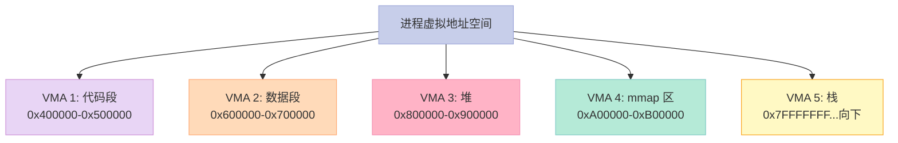

### 1.3 VMA 标志 `vm_flags`

```c
// include/linux/mm.h
#define VM_READ     0x00000001  // 可读
#define VM_WRITE    0x00000002  // 可写
#define VM_EXEC     0x00000004  // 可执行
#define VM_SHARED   0x00000008  // 共享
#define VM_MAYREAD  0x00000010  // 可设为可读
#define VM_MAYWRITE 0x00000020  // 可设为可写
#define VM_MAYEXEC  0x00000040  // 可设为可执行
#define VM_MAYSHARE 0x00000080  // 可设为共享
#define VM_GROWSDOWN 0x00000100  // 向下增长（栈）
#define VM_GROWSUP  0x00000200  // 向上增长（堆）
#define VM_LOCKED   0x00002000  // 锁定在内存
#define VM_HUGEPAGE 0x10000000  // 大页
```

---

## 二、进程虚拟地址空间布局

### 2.1 经典布局（32 位 x86）

```
0xFFFFFFFF  +------------------+
            |    内核空间       |
            |    (1GB)         |
0xC0000000  +------------------+
            |   栈 (向下增长)   |
            |       ↓          |
            |       ↓          |
            |                  |
            |       ↑          |
            |       ↑          |
            |    堆 (向上增长)  |
            |                  |
            |   mmap 区        |
            |                  |
            |   BSS            |
            |   数据段          |
            |   代码段 (text)   |
0x08048000  +------------------+
            |   保留           |
0x00000000  +------------------+
```

### 2.2 64 位布局（简化）

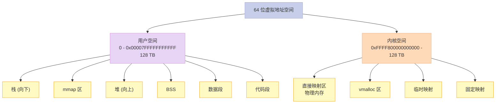

### 2.3 各区域作用

| 区域 | 起始 | 增长方向 | 内容 |
|------|------|----------|------|
| **代码段** | 0x08048000 | - | 程序代码、`.text` |
| **数据段** | - | - | 初始化数据 `.data` |
| **BSS** | - | - | 未初始化数据 `.bss` |
| **堆** | `start_brk` | 向上 | `malloc`/`new` 分配 |
| **mmap** | 共享库起点 | 向下 | 动态库、mmap 文件 |
| **栈** | 高地址 | 向下 | 局部变量、调用栈 |
| **内核** | 0xC0000000 | - | 内核代码 + 数据 |

---

## 三、写时复制（Copy-on-Write, COW）

### 3.1 什么是 COW？

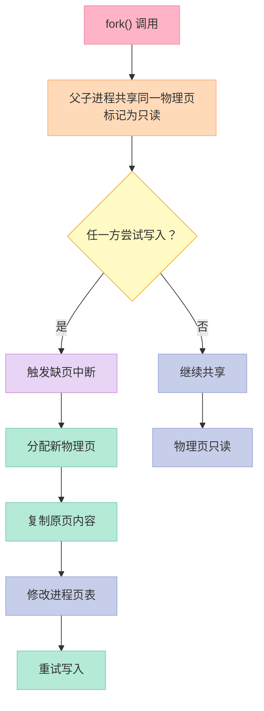

### 3.2 COW 核心数据结构

```c
// 物理页帧
struct page {
    atomic_t _refcount;     // 引用计数
    // ...
};

// 页表项 PTE
// bit 1: R/W (0=只读)
// Linux 利用 PTE 只读位实现 COW
```

### 3.3 COW 缺页处理（内核代码）

```c
// mm/memory.c (简化)
static vm_fault_t handle_pte_fault(struct vm_fault *vmf) {
    pte_t entry;
    // ...

    if (vmf->flags & FAULT_FLAG_WRITE) {
        if (!pte_write(entry)) {
            // PTE 只读，但进程要写
            if (vmf->vma->vm_flags & VM_SHARED) {
                return do_shared_fault(vmf);
            }
            // COW
            return do_wp_page(vmf);
        }
    }

    return 0;
}
```

```c
// do_wp_page - 处理写时复制
static vm_fault_t do_wp_page(struct vm_fault *vmf) {
    // 1. 检查 page->_refcount
    // 2. 如果只有 1 个引用——直接设为可写
    // 3. 否则——分配新页，复制内容
    // 4. 修改页表
    // 5. 释放旧页引用
}
```

### 3.4 COW 实战：fork 性能

```bash
# 不写时——fork 很快
time (for i in {1..1000}; do : & done; wait)
# 0.5s

# 立即 exec——根本不需要 COW
time (for i in {1..1000}; do /bin/true & done; wait)
# 1.0s（exec 替换了地址空间）

# 父子都要写——会触发 COW
```

### 3.5 关键启示

1. **COW = 延迟复制**——节省内存 + 加速 fork
2. **触发条件**：父子任一方写
3. **实现方式**：PTE 只读 + 引用计数
4. **缺页异常处理**：分配新页 + 复制 + 修改页表

---

## 四、`mmap`：内存映射

### 4.1 `mmap` 系统调用

```c
// 系统调用
void *mmap(void *addr, size_t length, int prot, int flags, int fd, off_t offset);

// 参数
// addr   : 期望地址（通常 NULL 让内核选）
// length : 长度
// prot   : PROT_READ / PROT_WRITE / PROT_EXEC
// flags  : MAP_SHARED / MAP_PRIVATE / MAP_ANONYMOUS
// fd     : 文件描述符（匿名映射 = -1）
// offset : 文件偏移
```

### 4.2 mmap 4 大用途

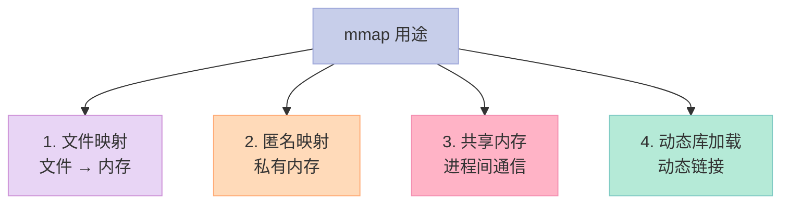

### 4.3 匿名映射（malloc 大块时使用）

```c
// glibc malloc 大块 → mmap
void *p = mmap(NULL, 4*1024*1024, PROT_READ|PROT_WRITE, MAP_PRIVATE|MAP_ANONYMOUS, -1, 0);

// 释放
munmap(p, 4*1024*1024);
```

### 4.4 文件映射（高性能 I/O）

```c
// 1. 打开文件
int fd = open("data.bin", O_RDONLY);

// 2. mmap 映射
void *p = mmap(NULL, file_size, PROT_READ, MAP_PRIVATE, fd, 0);

// 3. 像访问内存一样访问文件
memcpy(buffer, p, file_size);

// 4. 解除映射
munmap(p, file_size);
close(fd);
```

**优势**：

- 避免 `read`/`write` 的用户/内核态切换
- 内核可以预读（readahead）
- 多个进程共享同一文件

### 4.5 共享内存（IPC）

```c
// shm_open + mmap（POSIX）
int fd = shm_open("/my_shm", O_CREAT | O_RDWR, 0666);
ftruncate(fd, SIZE);
void *p = mmap(NULL, SIZE, PROT_READ | PROT_WRITE, MAP_SHARED, fd, 0);

// 进程 A 写入
strcpy((char*)p, "Hello");

// 进程 B 读取
printf("%s\n", (char*)p);  // "Hello"
```

### 4.6 动态库加载

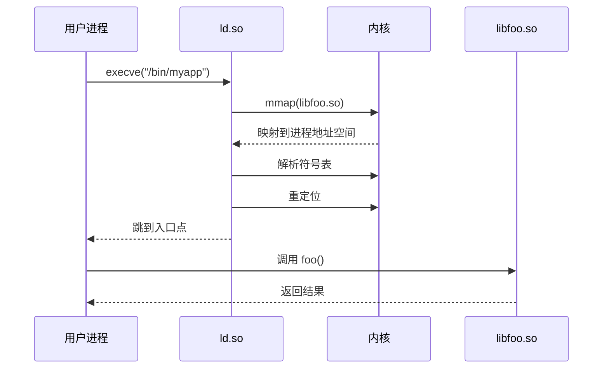

---

## 五、缺页中断（Page Fault）

### 5.1 缺页的两种类型

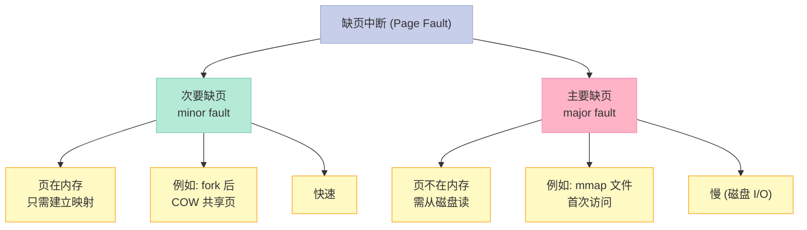

### 5.2 缺页处理流程

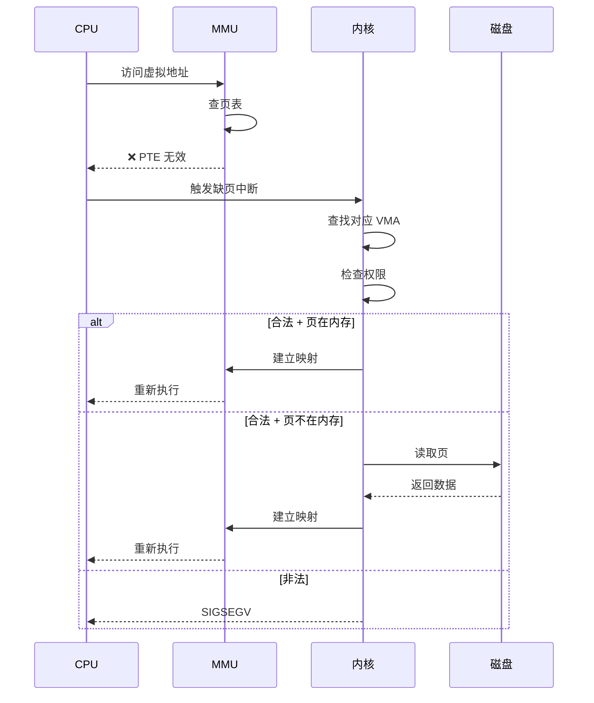

### 5.3 缺页统计

```bash
# 查看进程的缺页统计
cat /proc/self/status | grep -i fault

# 输出：
# voluntary_ctxt_switches:    1234
# nonvoluntary_ctxt_switches: 567
# min_flt:                    8901    # 次要缺页
# maj_flt:                    12      # 主要缺页
```

### 5.4 缺页与性能

**优化建议**：

1. **预读**（readahead）：提前把页读入内存
2. **mlock**：锁定关键页在内存（避免换出）
3. **madvise**：告诉内核访问模式
4. **大页（HugePage）**：减少页表项数

---

## 六、`fork` / `exec` 的地址空间管理

### 6.1 `fork` 的 COW

```c
// kernel/fork.c
int copy_mm(struct task_struct *tsk) {
    struct mm_struct *mm;
    // 父子共享同一 mm_struct
    // 但各自有 page tables（最初相同）
    // PTE 设为只读 + COW
    task_lock(current);
    mm = current->mm;
    if (!mm) {
        // 内核线程
        tsk->mm = NULL;
        tsk->active_mm = NULL;
    } else {
        atomic_inc(&mm->mm_users);
        tsk->mm = mm;
    }
    task_unlock(current);
    return 0;
}
```

### 6.2 `exec` 的完整地址空间替换

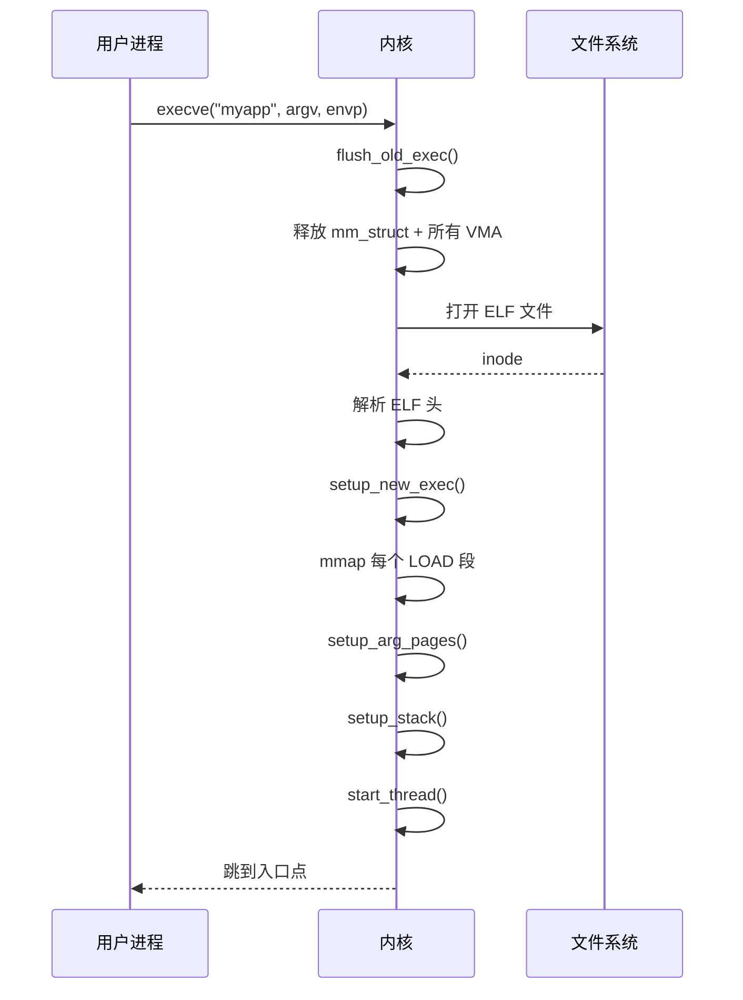

### 6.3 ELF 加载

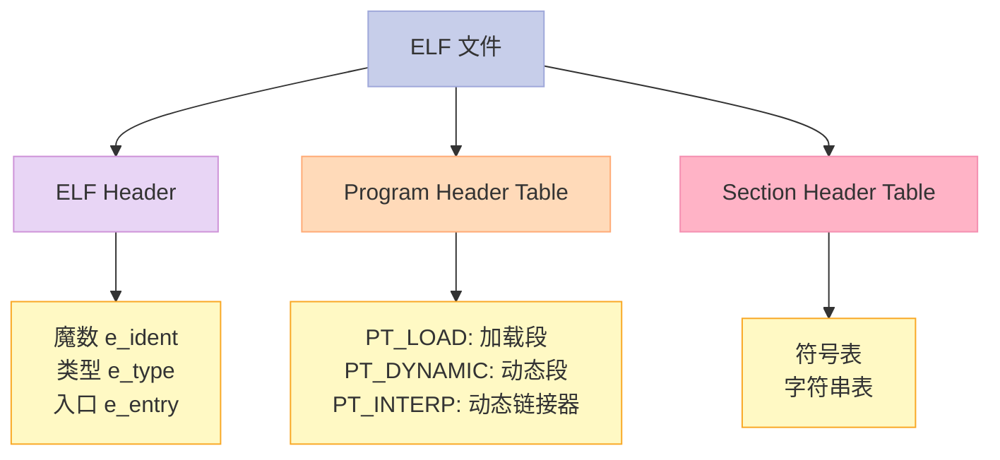

---

## 七、堆与栈

### 7.1 堆：`malloc` / `free`

```c
// glibc malloc 实现（ptmalloc2）
// 小块（< 256KB）：从 arenas 分配（sbrk/mmap）
// 大块（>= 256KB）：mmap 匿名

void *p = malloc(1024);  // 堆分配
free(p);                 // 堆释放
```

**brk / sbrk**（传统方式）：

```c
// 调整 program break（堆顶）
int brk(void *addr);     // 设置堆顶
void *sbrk(intptr_t inc); // 增加堆顶
```

### 7.2 栈：自动分配

```c
void func() {
    int x = 1;       // 栈分配
    char buf[1024];  // 栈分配
    // 函数返回时自动释放
}
```

**栈帧结构**：

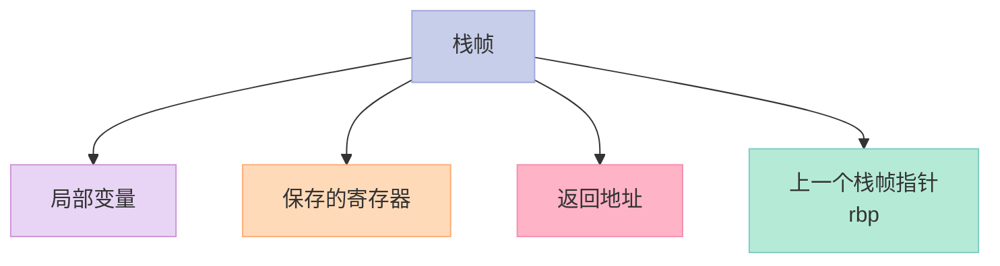

### 7.3 堆 vs 栈

| 维度 | 堆 | 栈 |
|------|----|----|
| 分配速度 | 慢（malloc） | 快（CPU 指令） |
| 大小限制 | 系统内存 | 通常 8 MB |
| 碎片 | 有 | 无 |
| 生命周期 | 手动 | 自动 |
| 访问 | 全局 | 函数级 |
| 线程安全 | 需要 | 线程私有 |

---

## 八、面试高频考点

### 8.1 必背题

| 题目 | 答案要点 |
|------|----------|
| 虚拟地址空间的好处？ | 隔离、简化、共享、换出 |
| `mm_struct` vs `vm_area_struct`？ | 描述整个空间 vs 描述一段区域 |
| 进程虚拟地址布局？ | 代码段、数据段、BSS、堆、mmap、栈 |
| COW 是什么？ | 写时复制，节省内存 |
| 缺页中断分几类？ | 次要（在内存）+ 主要（需读盘） |
| mmap 用途？ | 文件映射、匿名映射、共享内存、动态库 |
| fork 性能优化？ | COW + 早期 exec |
| malloc 大块怎么实现？ | mmap 匿名 |
| 栈溢出？ | 局部变量过大 + 无限递归 |

### 8.2 高频追问

| 追问 | 关键点 |
|------|--------|
| COW 触发流程？ | 写 → 缺页 → 复制 → 改页表 |
| mmap 文件映射 vs read/write？ | 省去用户/内核拷贝 |
| 大页（HugePage）的好处？ | 减少页表项 + 减少 TLB miss |
| 进程栈最大多大？ | 默认 8 MB（可 ulimit -s） |
| exec 替换了哪些？ | mm_struct + VMA + 栈 |
| 共享库的代码段怎么共享？ | mmap MAP_PRIVATE |
| 缺页与 swap 的关系？ | swap = 主动换出 + 缺页时换入 |

---

## 九、配套实验

### 9.1 实验 1：查看进程内存映射

```bash
# 查看进程的内存映射
cat /proc/self/maps

# 输出示例：
# 00400000-00401000 r-xp 00000000 08:01 1234567  /bin/cat
# 00600000-00601000 r--p 00000000 08:01 1234567  /bin/cat
# 00601000-00602000 rw-p 00001000 08:01 1234567  /bin/cat
# 7ffff7dca000-7ffff7dcd000 rw-p 00000000 00:00 0
# 7ffff7dcd000-7ffff7dd1000 r--p 00000000 08:01 1234567  /lib/x86_64-linux-gnu/libc.so.6
# 7ffff7dd1000-7ffff7df5000 r-xp 00004000 08:01 1234567  /lib/x86_64-linux-gnu/libc.so.6
# ...
# 7ffffffde000-7ffffffff000 rw-p 00000000 00:00 0   [stack]
```

格式：`起始-结束 权限 偏移 设备 inode 路径`

### 9.2 实验 2：COW 验证

```c
// 文件：cow_demo.c
#include <stdio.h>
#include <stdlib.h>
#include <string.h>
#include <unistd.h>
#include <sys/wait.h>

int main() {
    // 大数组——观察 COW
    const int SIZE = 100 * 1024 * 1024;  // 100 MB
    int *data = malloc(SIZE);
    memset(data, 0, SIZE);

    pid_t pid = fork();

    if (pid == 0) {
        // 子进程——修改前 sleep
        printf("Child: before write, RSS=%ld KB\n", getRss());
        sleep(1);

        // 修改——触发 COW
        data[0] = 1;
        printf("Child: after write, RSS=%ld KB\n", getRss());
        return 0;
    } else {
        // 父进程
        printf("Parent: after fork, RSS=%ld KB\n", getRss());
        sleep(2);
        printf("Parent: after child write, RSS=%ld KB\n", getRss());
        wait(NULL);
    }

    return 0;
}
```

### 9.3 实验 3：mmap 文件映射

```c
// 文件：mmap_file.c
#include <stdio.h>
#include <stdlib.h>
#include <sys/mman.h>
#include <sys/stat.h>
#include <fcntl.h>
#include <unistd.h>

int main(int argc, char **argv) {
    if (argc < 2) return 1;

    int fd = open(argv[1], O_RDONLY);
    struct stat st;
    fstat(fd, &st);

    void *p = mmap(NULL, st.st_size, PROT_READ, MAP_PRIVATE, fd, 0);
    if (p == MAP_FAILED) {
        perror("mmap");
        return 1;
    }

    // 像字符串一样访问文件
    printf("File contents:\n%.*s\n", (int)st.st_size, (char*)p);

    munmap(p, st.st_size);
    close(fd);
    return 0;
}
```

### 9.4 实验 4：查看缺页统计

```c
// 文件：page_fault.c
#include <stdio.h>
#include <stdlib.h>
#include <string.h>
#include <sys/resource.h>

int main() {
    struct rusage usage;
    getrusage(RUSAGE_SELF, &usage);

    printf("Before allocation:\n");
    printf("  Minor faults: %ld\n", usage.ru_minflt);
    printf("  Major faults: %ld\n", usage.ru_majflt);

    // 分配并访问——触发缺页
    const int SIZE = 100 * 1024 * 1024;  // 100 MB
    char *p = malloc(SIZE);
    memset(p, 'A', SIZE);  // 触发缺页

    getrusage(RUSAGE_SELF, &usage);
    printf("After allocation:\n");
    printf("  Minor faults: %ld\n", usage.ru_minflt);
    printf("  Major faults: %ld\n", usage.ru_majflt);

    free(p);
    return 0;
}
```

---

## 十、回到 5 个核心要点

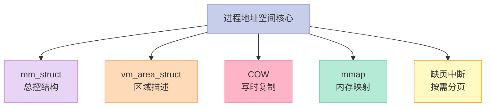

---

## 十一、结尾思考题

> **思考题 1**：查看你自己的进程的内存映射，能识别代码段、数据段、堆、栈吗？

> **思考题 2**：写一段代码，分配 1 GB 内存但不访问，观察 RSS 为什么不变。

> **思考题 3**：用 mmap 读取一个大文件，和 read 对比性能。

> **思考题 4**：COW 在什么情况下会失效？举 3 个例子。

> **思考题 5**：大页（HugePage）解决了什么问题？为什么？

---

## 十二、本篇速查表

| 主题 | 关键点 | 内核文件 |
|------|--------|----------|
| mm_struct | 进程地址空间总控 | include/linux/mm_types.h |
| vm_area_struct | 区域描述符 | include/linux/mm_types.h |
| COW | 写时复制 | mm/memory.c |
| mmap | 内存映射 | mm/mmap.c |
| 缺页中断 | 按需分页 | mm/memory.c |
| ELF 加载 | exec 解析 | fs/binfmt_elf.c |
| brk/sbrk | 堆管理 | mm/mmap.c |

---

## 十三、系列导航

| # | 文章 | 状态 |
|:--|:--|:--|
| 0 | [系列总览](/2026/06/18/linux-kernel-architecture-00-series-index/) | ✅ 已发布 |
| 1 | [内核架构总览 + 进程管理](/2026/06/18/linux-kernel-architecture-01-process-management/) | ✅ 已发布 |
| 2 | **本文：进程地址空间** | ✅ 已发布 |
| 3 | [内存管理基础](/2026/06/18/linux-kernel-architecture-03-memory-management-basics/) | 🔜 计划中 |
| 4 | [内存分配器与回收](/2026/06/18/linux-kernel-architecture-04-memory-allocation/) | 🔜 计划中 |
| 5 | [虚拟文件系统 VFS](/2026/06/18/linux-kernel-architecture-05-vfs/) | 🔜 计划中 |
| 6 | [Ext 文件系统族](/2026/06/18/linux-kernel-architecture-06-ext-filesystem/) | 🔜 计划中 |
| 7 | [块 I/O 层](/2026/06/18/linux-kernel-architecture-07-block-io/) | 🔜 计划中 |
| 8 | [设备驱动 + 网络栈](/2026/06/18/linux-kernel-architecture-08-drivers-network/) | 🔜 计划中 |
| 9 | [内核同步 + 定时器](/2026/06/18/linux-kernel-architecture-09-synchronization-timers/) | 🔜 计划中 |
| 10 | [中断下半部 + 模块](/2026/06/18/linux-kernel-architecture-10-interrupts-modules/) | 🔜 计划中 |
| 11 | [内核启动 + 附录速查](/2026/06/18/linux-kernel-architecture-11-boot-appendix/) | 🔜 计划中 |

---

**下一篇**：第 3 篇《内存管理基础》——页框分配、伙伴系统（Buddy System）、`kmalloc` / `vmalloc` 的差异、内存管理的"分层"思想。

> **行动建议**：
> 1. **看 `/proc/self/maps`**——理解你的进程的地址空间
> 2. **写一个 COW 验证程序**——观察 RSS 变化
> 3. **用 mmap 读一个大文件**——和 read 对比
> 4. **读 `mm/memory.c` 的缺页处理代码**——COW 的内核实现
> 5. **看 `pmap <pid>` 输出**——比 /proc/maps 更友好
