> **一句话核心结论**：Linux 内核内存管理的"4 大基石"——**页框（page frame）** 是基本单位、**伙伴系统（Buddy System）** 解决外部碎片、**slab 分配器** 解决内部碎片、`vmalloc` 映射非连续物理内存。NUMA 架构下，还要考虑**节点（node）** 和 **区域（zone）** 的层次。

---

## 系列导航

| # | 文章 | 状态 |
|:--|:--|:--|
| 0 | [系列总览](/2026/06/18/linux-kernel-architecture-00-series-index/) | ✅ 已发布 |
| 1 | [内核架构总览 + 进程管理](/2026/06/18/linux-kernel-architecture-01-process-management/) | ✅ 已发布 |
| 2 | [进程地址空间](/2026/06/18/linux-kernel-architecture-02-process-address-space/) | ✅ 已发布 |
| 3 | **本文：内存管理基础** | ✅ 已发布 |
| 4 | [内存分配器与回收](/2026/06/18/linux-kernel-architecture-04-memory-allocation/) | 🔜 计划中 |
| 5 | [虚拟文件系统 VFS](/2026/06/18/linux-kernel-architecture-05-vfs/) | 🔜 计划中 |
| 6 | [Ext 文件系统族](/2026/06/18/linux-kernel-architecture-06-ext-filesystem/) | 🔜 计划中 |
| 7 | [块 I/O 层](/2026/06/18/linux-kernel-architecture-07-block-io/) | 🔜 计划中 |
| 8 | [设备驱动 + 网络栈](/2026/06/18/linux-kernel-architecture-08-drivers-network/) | 🔜 计划中 |
| 9 | [内核同步 + 定时器](/2026/06/18/linux-kernel-architecture-09-synchronization-timers/) | 🔜 计划中 |
| 10 | [中断下半部 + 模块](/2026/06/18/linux-kernel-architecture-10-interrupts-modules/) | 🔜 计划中 |
| 11 | [内核启动 + 附录速查](/2026/06/18/linux-kernel-architecture-11-boot-appendix/) | 🔜 计划中 |

---

## 前言：内存管理的"3 个核心问题"

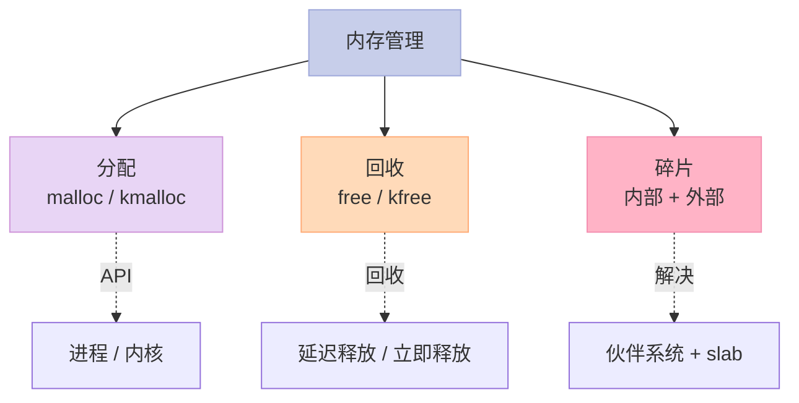

**3 个问题**：

1. **如何高效分配内存**？
2. **如何及时回收内存**？
3. **如何减少碎片**？

---

## 一、页框（Page Frame）

### 1.1 什么是页框？


**页框 = 物理内存的最小分配单位**：

- x86：默认 4 KB（可配置 2 MB / 1 GB 大页）
- ARM：4 KB / 16 KB / 64 KB

### 1.2 `struct page`：页框描述符

```c
// include/linux/mm_types.h
struct page {
    unsigned long flags;          // 标志：脏/锁定/活跃/引用...
    atomic_t _refcount;           // 引用计数
    struct address_space *mapping;// 所属 address_space（page cache）
    struct list_head lru;         // LRU 链表
    void *virtual;                // 虚拟地址（vmalloc）
    // ...
};
```

**`struct page` 约 64 字节**——一个 4 GB 系统有 100 万个 `struct page`，占用 ~64 MB。

### 1.3 页标志（flags）

```c
// include/linux/page-flags.h
enum pageflags {
    PG_locked,        // 锁定
    PG_referenced,    // 刚被访问过
    PG_uptodate,      // 数据是最新的
    PG_dirty,         // 脏页（需写回磁盘）
    PG_lru,           // 在 LRU 链表中
    PG_active,        // 在活跃 LRU
    PG_slab,          // slab 分配器使用
    PG_swapcache,     // 在 swap 缓存
    // ...
};
```

### 1.4 关键启示

1. **`struct page` 描述每个物理页**
2. **页标志（PG_*）描述页的状态**
3. **引用计数 + LRU 链表**——基础管理结构

---

## 二、节点与区域（NUMA 视角）

### 2.1 UMA vs NUMA

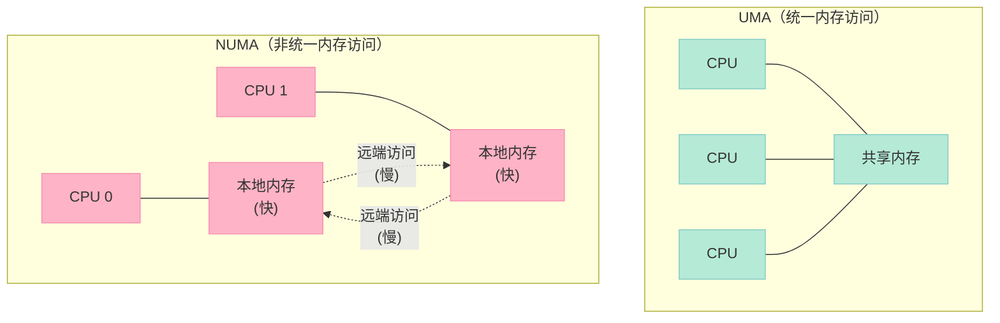

**Linux 内核数据结构**：

```c
// include/linux/mmzone.h
struct pglist_data {  // NUMA 节点
    struct zone node_zones[MAX_NR_ZONES];
    struct zonelist node_zonelists[MAX_ZONELISTS];
    int nr_zones;
    // ...
};

struct zone {  // 区域
    unsigned long watermark[NR_WMARK];  // 水位
    struct free_area free_area[MAX_ORDER]; // 伙伴系统
    spinlock_t lock;
    // ...
};
```

### 2.2 区域（zone）

```c
// include/linux/mmzone.h
enum zone_type {
    ZONE_DMA,        // 0-16 MB（ISA DMA）
    ZONE_DMA32,      // 16 MB-4 GB（32-bit DMA）
    ZONE_NORMAL,     // 普通内存
    ZONE_HIGHMEM,    // 高端内存（> 896 MB，仅 32-bit）
    ZONE_MOVABLE,    // 可迁移（用于内存热插拔）
    __MAX_NR_ZONES
};
```

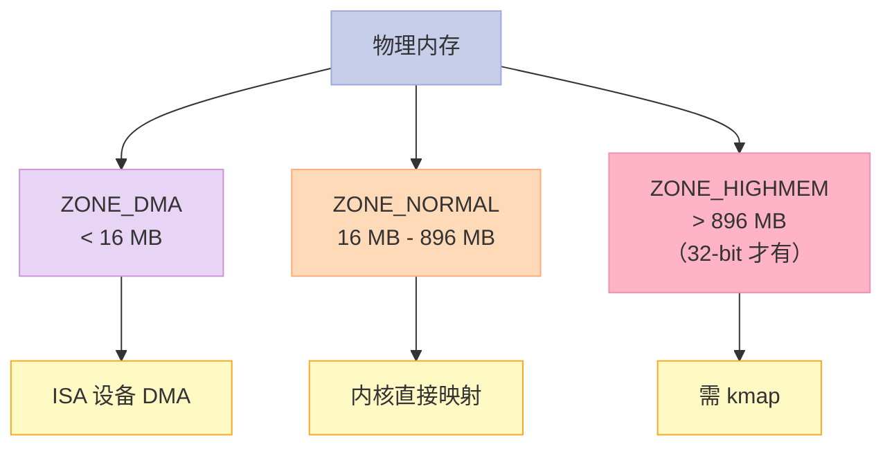

### 2.3 水位（watermark）

```c
// 水位——决定内存压力
#define WMARK_MIN   0  // 最低水位——分配失败
#define WMARK_LOW   1  // 低水位——kswapd 唤醒
#define WMARK_HIGH  2  // 高水位——kswapd 休眠
```

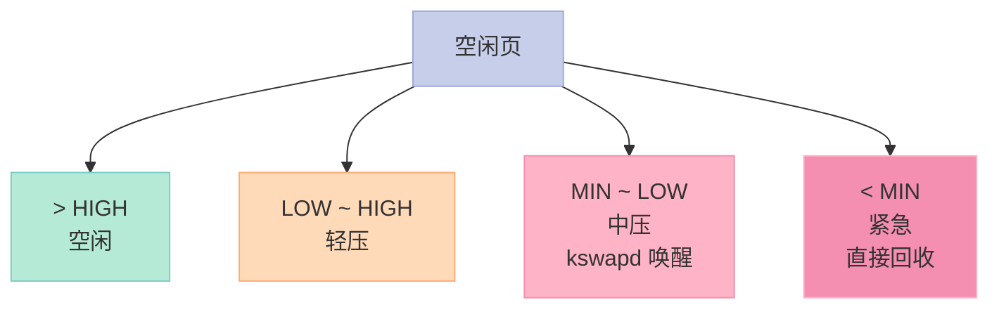

### 2.4 关键启示

1. **NUMA = 多节点**——每个 CPU 有"本地"内存
2. **区域** = 不同性质的内存（DMA、普通、高端）
3. **水位**——控制内存压力响应
4. **分配策略**：本地节点 → 远端节点

---

## 三、伙伴系统（Buddy System）

### 3.1 为什么需要伙伴系统？

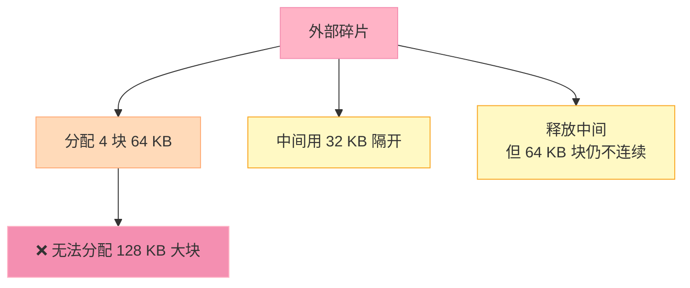

**伙伴系统的目标**：把物理页按 2 的幂次组织，避免外部碎片。

### 3.2 伙伴系统原理

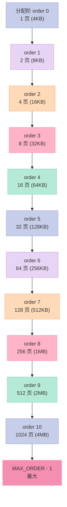

### 3.3 分配算法

```c
// 分配 2^order 个连续页
struct page *alloc_pages(gfp_t gfp_mask, unsigned int order) {
    return __alloc_pages(gfp_mask, order, &preferred_zone);
}

// 核心：分配策略
// 1. 检查高水位
// 2. 慢路径——回收 + 重试
// 3. 失败——OOM
```

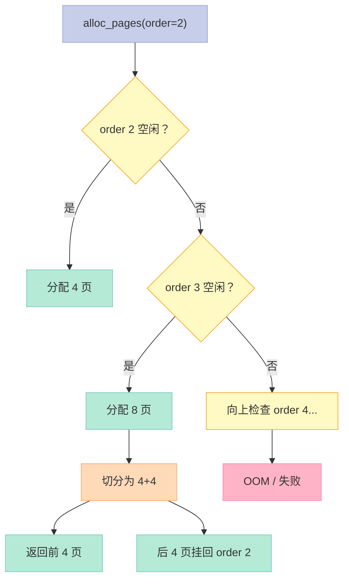

### 3.4 释放算法（合并伙伴）

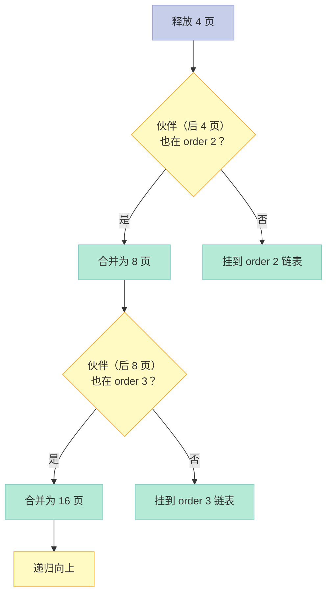

### 3.5 关键启示

1. **伙伴系统 = 2 的幂次链表**
2. **分配**：找到合适 order → 找不到大块 → 拆分大块
3. **释放**：找到伙伴 → 合并 → 递归向上
4. **解决外部碎片**——但有内部碎片（按 2 的幂次对齐）

---

## 四、`kmalloc` / `vmalloc` / `vmalloc`

### 4.1 三大分配 API 对比

| API | 物理连续？ | 大小限制 | 用途 |
|-----|-----------|---------|------|
| `alloc_pages` | ✅ | ~4 MB | 内核高级 |
| `kmalloc` | ✅ | ~4 MB | 内核通用（基于 buddy + slab） |
| `vmalloc` | ❌ | 大 | 大块虚拟连续但物理不必连续 |

### 4.2 `kmalloc`

```c
// include/linux/slab.h
void *kmalloc(size_t size, gfp_t flags);

// flags:
// GFP_KERNEL  : 进程上下文，可能睡眠
// GFP_ATOMIC  : 原子上下文，不能睡眠
// GFP_DMA     : DMA 区域
// GFP_HIGHUSER: 用户高端内存
```

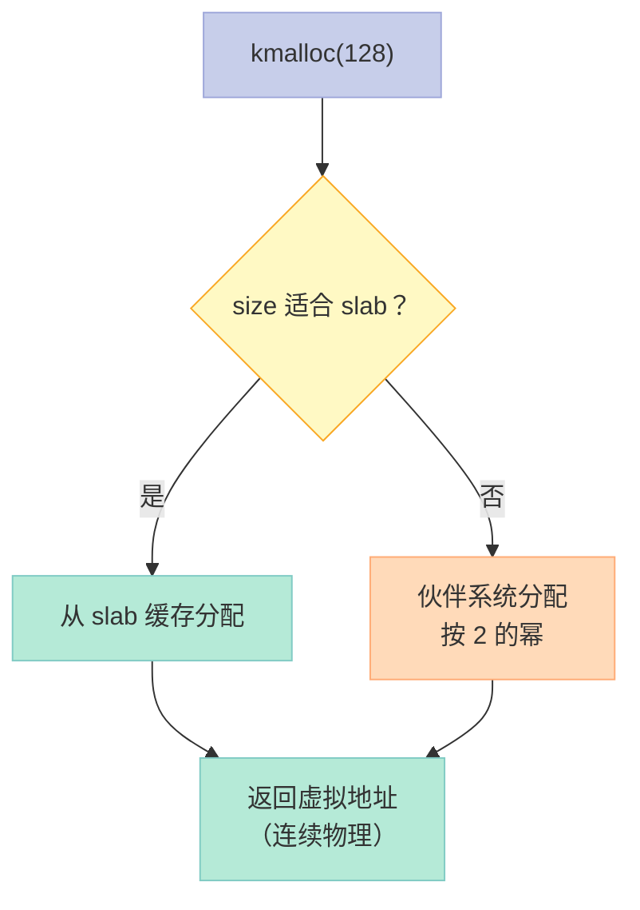

### 4.3 `vmalloc`

```c
// include/linux/vmalloc.h
void *vmalloc(unsigned long size);

// 分配非连续物理内存 + 连续虚拟内存
```

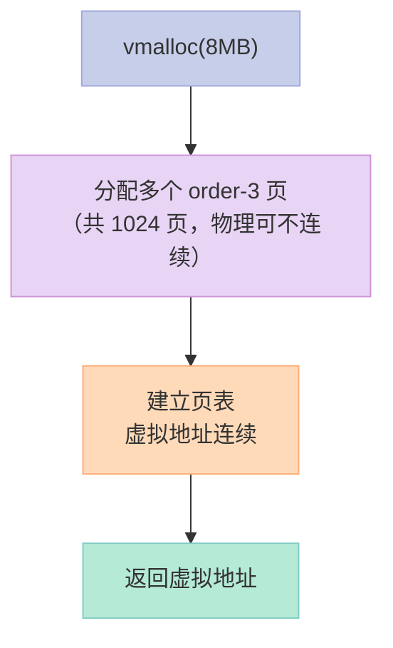

### 4.4 何时用哪个？

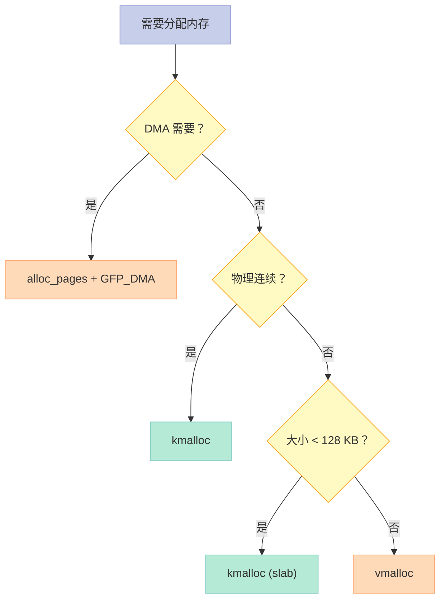

### 4.5 关键启示

1. **`kmalloc`**：物理连续，限制 ~4 MB
2. **`vmalloc`**：虚拟连续，物理不连续，大块
3. **`alloc_pages`**：最底层，返回 `struct page`
4. **选 API**：DMA、连续性、大小

---

## 五、Slab 分配器（解决内部碎片）

### 5.1 什么是内部碎片？

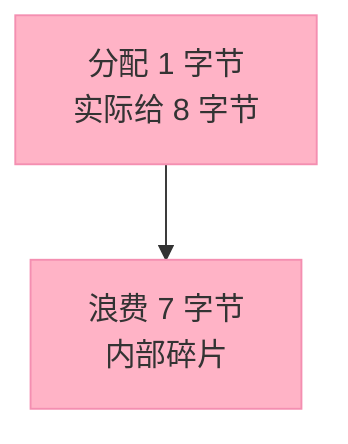

**伙伴系统问题**：按 2 的幂次分配，小对象浪费大。

### 5.2 Slab 原理

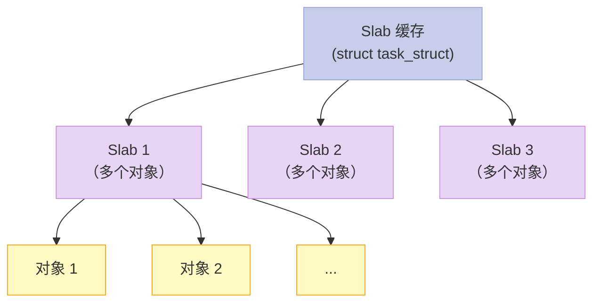

**Slab 3 个状态**：

- `FULL`：全部分配完
- `PARTIAL`：部分分配
- `FREE`：全空闲（可回收）

### 5.3 Slab API

```c
// 创建 slab 缓存
struct kmem_cache *kmem_cache_create(const char *name, size_t size,
                                      size_t align, slab_flags_t flags,
                                      void (*ctor)(void *));

// 分配
void *kmem_cache_alloc(struct kmem_cache *cache, gfp_t flags);

// 释放
void kmem_cache_free(struct kmem_cache *cache, void *objp);

// 销毁
void kmem_cache_destroy(struct kmem_cache *cache);
```

### 5.4 Slab vs Buddy

| 维度 | Buddy | Slab |
|------|-------|------|
| 单位 | 页 | 对象 |
| 碎片 | 内部 | 极少 |
| 用途 | 大块 | 小对象 |
| 性能 | 一般 | 快（对象预分配） |

### 5.5 Slab 演进

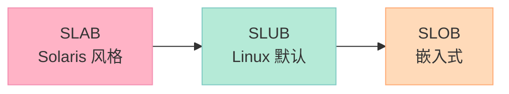

### 5.6 关键启示

1. **Slab = 对象缓存**——预分配 + 复用
2. **3 种状态**：FULL / PARTIAL / FREE
3. **解决内部碎片**——伙伴系统的补充
4. **Linux 5.x+ 默认 SLUB**

---

## 六、内存管理的"5 层模型"

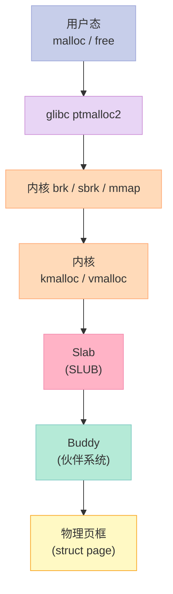

---

## 七、`gfp_t` 标志

### 7.1 常用 gfp 标志

```c
// 内存区域
#define ___GFP_DMA      0x01u
#define ___GFP_HIGHMEM  0x02u

// 行为
#define ___GFP_ZERO     0x100u  // 清零
#define ___GFP_ATOMIC   0x200u  // 原子上下文
#define ___GFP_IO       0x40u   // 可启动 I/O
#define ___GFP_FS       0x80u   // 可执行 FS 操作
#define ___GFP_COLD     0x8000u // 冷页（非热点）
#define ___GFP_NOWARN   0x200u  // 失败不警告
#define ___GFP_REPEAT   0x400u  // 重试
#define ___GFP_NOFAIL   0x800u  // 必须成功

// 组合
#define GFP_ATOMIC      (__GFP_HIGH|__GFP_ATOMIC|__GFP_KSWAPD_RECLAIM)
#define GFP_KERNEL      (__GFP_RECLAIM | __GFP_IO | __GFP_FS)
#define GFP_USER        (__GFP_RECLAIM | __GFP_IO | __GFP_FS | __GFP_HARDWALL)
```

### 7.2 选择建议

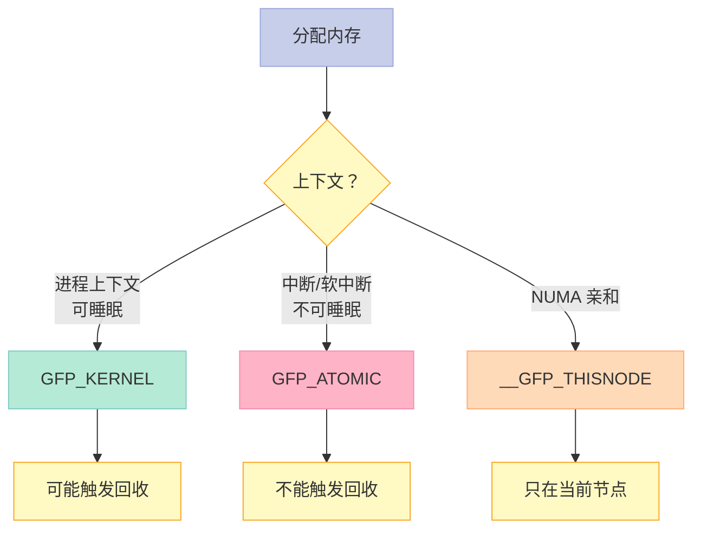

---

## 八、面试高频考点

### 8.1 必背题

| 题目 | 答案要点 |
|------|----------|
| 页框是什么？ | 物理内存最小单位（4 KB） |
| `struct page` 字段？ | flags / refcount / mapping / lru |
| 伙伴系统原理？ | 2 的幂次链表，避免外部碎片 |
| 内部碎片 vs 外部碎片？ | Slab 解决内部，buddy 解决外部 |
| kmalloc vs vmalloc？ | 物理连续 vs 虚拟连续 |
| slab 的 3 种状态？ | FULL / PARTIAL / FREE |
| gfp_t 选哪个？ | GFP_KERNEL（可睡）/ GFP_ATOMIC（不可睡） |
| NUMA vs UMA？ | 多节点本地内存 vs 共享内存 |

### 8.2 高频追问

| 追问 | 关键点 |
|------|--------|
| 伙伴系统如何合并？ | 释放时检查伙伴（异或），合并向上 |
| 为什么按 2 的幂？ | O(1) 找伙伴，合并简单 |
| 内部碎片多大？ | 平均 50%（最坏情况） |
| vmalloc 性能？ | 比 kmalloc 慢——需建立页表 |
| slab 比 buddy 快多少？ | 测得 100-200 倍 |
| 高端内存怎么用？ | kmap 临时映射（32-bit 系统） |

---

## 九、配套实验

### 9.1 实验 1：查看系统内存

```bash
# /proc/meminfo
cat /proc/meminfo

# 输出示例：
# MemTotal:       16384000 kB
# MemFree:         2048000 kB
# MemAvailable:    8192000 kB
# Buffers:          512000 kB
# Cached:          4096000 kB
# SwapCached:            0 kB
# Active:          5120000 kB
# Inactive:        2048000 kB
# Active(anon):    2048000 kB
# Inactive(anon):   512000 kB
# Active(file):    3072000 kB
# Inactive(file):  1536000 kB
# SwapTotal:       2097152 kB
# SwapFree:        2097152 kB
# Dirty:               100 kB
# ...
```

### 9.2 实验 2：NUMA 节点

```bash
# 查看 NUMA 拓扑
numactl --hardware

# 输出：
# available: 2 nodes (0-1)
# node 0 cpus: 0 1 2 3 4 5 6 7
# node 0 size: 8191 MB
# node 0 free: 4096 MB
# node 1 cpus: 8 9 10 11 12 13 14 15
# node 1 size: 8192 MB
# node 1 free: 2048 MB
# node distances:
# node   0   1
#   0:  10  20
#   1:  20  10
```

### 9.3 实验 3：slab 信息

```bash
# /proc/slabinfo
slabinfo - Version: 2.1
# name            <active_objs> <num_objs> <objsize> <objperslab> <pagesperslab> : tunables <limit> <batchcount> <sharedfactor> : slabdata <active_slabs> <num_slabs> <sharedavail>
# task_struct         128    128   3584   9    8 : tunables    0    0    0 : slabdata     14     14      0
# kmalloc-256        1024   1024    256   32    2 : tunables    0    0    0 : slabdata     32     32      0
# ...
```

### 9.4 实验 4：编写内核模块

```c
// 文件：test_kmalloc.c
#include <linux/module.h>
#include <linux/slab.h>
#include <linux/gfp.h>

static int __init test_init(void) {
    void *p1, *p2, *p3;

    // 小块：slab
    p1 = kmalloc(64, GFP_KERNEL);
    printk("kmalloc 64: %p\n", p1);
    kfree(p1);

    // 中块：slab
    p2 = kmalloc(2048, GFP_KERNEL);
    printk("kmalloc 2048: %p\n", p2);
    kfree(p2);

    // 大块：vmalloc
    p3 = vmalloc(4 * 1024 * 1024);
    printk("vmalloc 4MB: %p\n", p3);
    vfree(p3);

    return 0;
}

static void __exit test_exit(void) {
    printk("Module unloaded\n");
}

module_init(test_init);
module_exit(test_exit);
MODULE_LICENSE("GPL");
```

```bash
# Makefile
obj-m += test_kmalloc.o

all:
    make -C /lib/modules/$(shell uname -r)/build M=$(PWD) modules

clean:
    make -C /lib/modules/$(shell uname -r)/build M=$(PWD) clean
```

```bash
# 编译 + 加载
make
sudo insmod test_kmalloc.ko
dmesg | tail -5
sudo rmmod test_kmalloc
```

### 9.5 实验 5：观察分配行为

```c
// 文件：vmstat_demo.c
#include <stdio.h>
#include <stdlib.h>
#include <string.h>

int main() {
    // 1. 启动另一个 terminal: vmstat 1
    // 2. 跑这段程序观察 si/so/bi/bo

    const int SIZE = 100 * 1024 * 1024;  // 100 MB
    char *p = malloc(SIZE);
    memset(p, 'A', SIZE);
    printf("Allocated 100MB\n");

    // sleep 触发 swap
    sleep(5);

    free(p);
    return 0;
}
```

---

## 十、回到 5 个核心要点

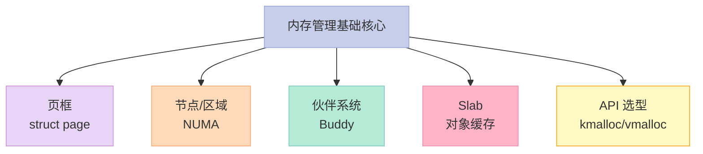

---

## 十一、结尾思考题

> **思考题 1**：你的 Linux 是 NUMA 还是 UMA？怎么查？

> **思考题 2**：写一个测试程序，比较 `kmalloc` vs `vmalloc` 1 MB 内存的速度。

> **思考题 3**：伙伴系统的最坏碎片率是多少？为什么？

> **思考题 4**：观察 `/proc/slabinfo`，哪个 slab 最大？为什么？

> **思考题 5**：slab 和 buddy 各解决什么问题？为什么两者都要？

---

## 十二、本篇速查表

| 主题 | 关键点 | 内核文件 |
|------|--------|----------|
| `struct page` | 页框描述符 | include/linux/mm_types.h |
| 节点/区域 | NUMA 数据结构 | include/linux/mmzone.h |
| 伙伴系统 | mm/page_alloc.c | mm/page_alloc.c |
| kmalloc | 小块分配 | mm/slab.c, mm/slub.c |
| vmalloc | 大块虚拟连续 | mm/vmalloc.c |
| Slab | 对象缓存 | mm/slab.c, mm/slub.c |
| gfp_t | 分配标志 | include/linux/gfp.h |

---

## 十三、系列导航

| # | 文章 | 状态 |
|:--|:--|:--|
| 0 | [系列总览](/2026/06/18/linux-kernel-architecture-00-series-index/) | ✅ 已发布 |
| 1 | [内核架构总览 + 进程管理](/2026/06/18/linux-kernel-architecture-01-process-management/) | ✅ 已发布 |
| 2 | [进程地址空间](/2026/06/18/linux-kernel-architecture-02-process-address-space/) | ✅ 已发布 |
| 3 | **本文：内存管理基础** | ✅ 已发布 |
| 4 | [内存分配器与回收](/2026/06/18/linux-kernel-architecture-04-memory-allocation/) | 🔜 计划中 |
| 5 | [虚拟文件系统 VFS](/2026/06/18/linux-kernel-architecture-05-vfs/) | 🔜 计划中 |
| 6 | [Ext 文件系统族](/2026/06/18/linux-kernel-architecture-06-ext-filesystem/) | 🔜 计划中 |
| 7 | [块 I/O 层](/2026/06/18/linux-kernel-architecture-07-block-io/) | 🔜 计划中 |
| 8 | [设备驱动 + 网络栈](/2026/06/18/linux-kernel-architecture-08-drivers-network/) | 🔜 计划中 |
| 9 | [内核同步 + 定时器](/2026/06/18/linux-kernel-architecture-09-synchronization-timers/) | 🔜 计划中 |
| 10 | [中断下半部 + 模块](/2026/06/18/linux-kernel-architecture-10-interrupts-modules/) | 🔜 计划中 |
| 11 | [内核启动 + 附录速查](/2026/06/18/linux-kernel-architecture-11-boot-appendix/) | 🔜 计划中 |

---

**下一篇**：第 4 篇《内存分配器与回收》——kmalloc/slab 深度分析、内核内存回收（kswapd）、页面置换（LRU）、swap 机制。

> **行动建议**：
> 1. **看 `/proc/meminfo`**——理解你的系统内存
> 2. **写一个内核模块**——测试 kmalloc / vmalloc
> 3. **用 slabtop**——查看 slab 缓存实时状态
> 4. **读 `mm/page_alloc.c`**——伙伴系统的实现
> 5. **观察 `/proc/vmstat`**——内存回收压力
