> **一句话核心结论**：内存管理的"进与出"——**Slab 分配器**（对象缓存 + per-CPU 优化）负责"进"（小对象高效分配）；**LRU + kswapd** 负责"出"（回收不活跃页）。**swap** 是内存的最后一道防线——把冷页换出到磁盘。

---

## 系列导航

| # | 文章 | 状态 |
|:--|:--|:--|
| 0 | [系列总览](/2026/06/18/linux-kernel-architecture-00-series-index/) | ✅ 已发布 |
| 1 | [内核架构总览 + 进程管理](/2026/06/18/linux-kernel-architecture-01-process-management/) | ✅ 已发布 |
| 2 | [进程地址空间](/2026/06/18/linux-kernel-architecture-02-process-address-space/) | ✅ 已发布 |
| 3 | [内存管理基础](/2026/06/18/linux-kernel-architecture-03-memory-management-basics/) | ✅ 已发布 |
| 4 | **本文：内存分配器与回收** | ✅ 已发布 |
| 5 | [虚拟文件系统 VFS](/2026/06/18/linux-kernel-architecture-05-vfs/) | 🔜 计划中 |
| 6 | [Ext 文件系统族](/2026/06/18/linux-kernel-architecture-06-ext-filesystem/) | 🔜 计划中 |
| 7 | [块 I/O 层](/2026/06/18/linux-kernel-architecture-07-block-io/) | 🔜 计划中 |
| 8 | [设备驱动 + 网络栈](/2026/06/18/linux-kernel-architecture-08-drivers-network/) | 🔜 计划中 |
| 9 | [内核同步 + 定时器](/2026/06/18/linux-kernel-architecture-09-synchronization-timers/) | 🔜 计划中 |
| 10 | [中断下半部 + 模块](/2026/06/18/linux-kernel-architecture-10-interrupts-modules/) | 🔜 计划中 |
| 11 | [内核启动 + 附录速查](/2026/06/18/linux-kernel-architecture-11-boot-appendix/) | 🔜 计划中 |

---

## 前言：内存管理的"两扇门"

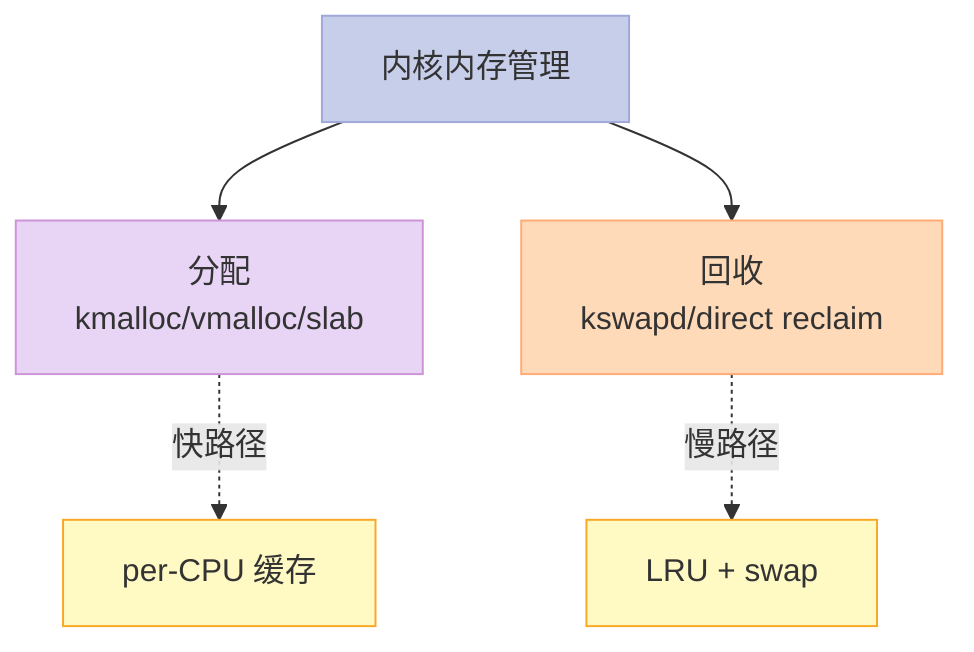

**两个核心问题**：

1. **如何快速分配小块对象？**——Slab + per-CPU 缓存
2. **如何在内存紧张时回收？**——LRU + kswapd + swap

---

## 一、第 5 章：Slab 分配器深入

### 1.1 Slab 的本质

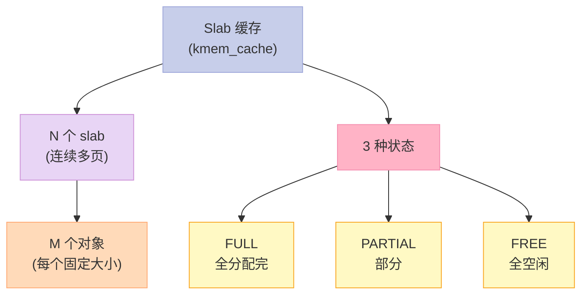

### 1.2 Slab 内部结构（SLUB）

```c
// mm/slub.c
struct kmem_cache {
    struct kmem_cache_cpu *cpu_slab;     // per-CPU 缓存
    unsigned long flags;
    unsigned long min_partial;
    int size;                            // 对象大小
    int object_size;                     // 实际对象大小
    int offset;                          // 空闲指针偏移
    int order;                           // 伙伴系统阶
    // ...
};

// per-CPU 缓存（关键优化）
struct kmem_cache_cpu {
    void **freelist;        // 空闲对象链表
    struct page *page;      // 当前 slab 页
    int node;               // NUMA 节点
    unsigned int offset;    // 下一个空闲对象偏移
};
```

### 1.3 Slab 分配的"3 级路径"

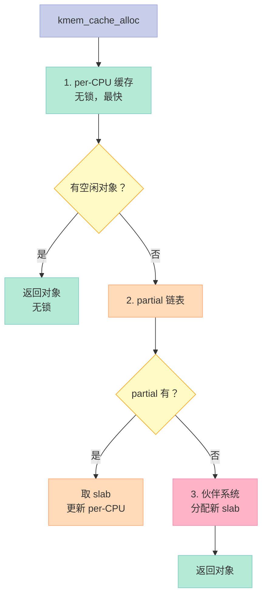

**关键点**：

- **per-CPU 缓存**——无锁分配，最快路径
- **partial 链表**——多核争用，效率高
- **伙伴系统**——慢路径，分配新页

### 1.4 为什么 per-CPU 缓存快？

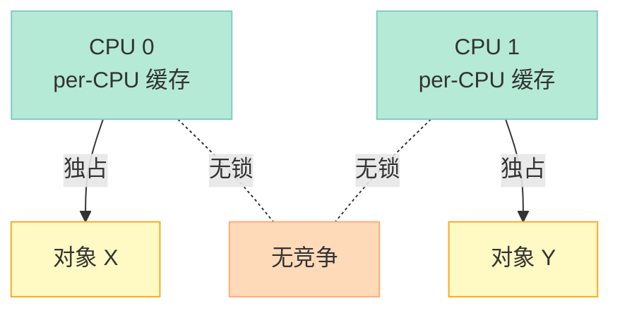

**优势**：

- 无锁（避免 cache bouncing）
- CPU 局部性好（对象常被同一 CPU 用）
- 分配延迟可预测

### 1.5 `kmalloc` 与 slab 的关系

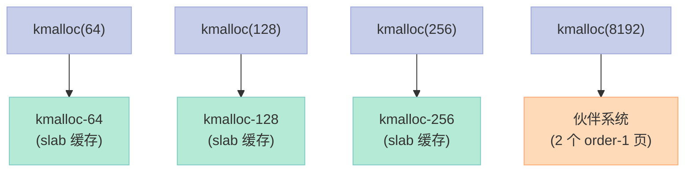

**为什么 `kmalloc-64`、`kmalloc-128`... 而不是按字节分**？

- 减少 slab 缓存数（避免过多元数据）
- 对齐到 2 的幂次（CPU 缓存友好）

### 1.6 关键启示

1. **Slab = 对象缓存**——按类型缓存
2. **per-CPU 缓存**——无锁快路径
3. **3 种状态**——FULL / PARTIAL / FREE
4. **kmalloc 走 slab**——小对象专用

---

## 二、专用 slab 缓存

### 2.1 `task_struct` 专用缓存

```c
// fork.c
struct task_struct *alloc_task_struct_node(int node) {
    return kmem_cache_alloc(task_struct_cachep, GFP_KERNEL);
}

void free_task_struct(struct task_struct *tsk) {
    kmem_cache_free(task_struct_cachep, tsk);
}

// 启动时创建
void task_struct_init(void) {
    task_struct_cachep = kmem_cache_create("task_struct",
        sizeof(struct task_struct),
        offsetof(struct task_struct, slab) - sizeof(struct task_struct *),
        SLAB_PANIC | SLAB_ACCOUNT, NULL);
}
```

### 2.2 各种内置 slab

```bash
# 查看常见 slab
slabtop -s c

# 输出：
#  Slab              ...
#   1 task_struct      ...
#   2 kmalloc-256      ...
#   3 kmalloc-128      ...
#   4 vm_area_struct   ...
#   5 file             ...
#   6 inode_cache      ...
#   7 dentry           ...
```

### 2.3 关键启示

1. **专用缓存**——关键对象（task_struct、inode、dentry）
2. **避免元数据浪费**——对象大小已知
3. **提升 CPU 缓存命中**——同一类对象相邻

---

## 三、第 6 章：物理页的换出与换入

### 3.1 为什么需要页面回收？

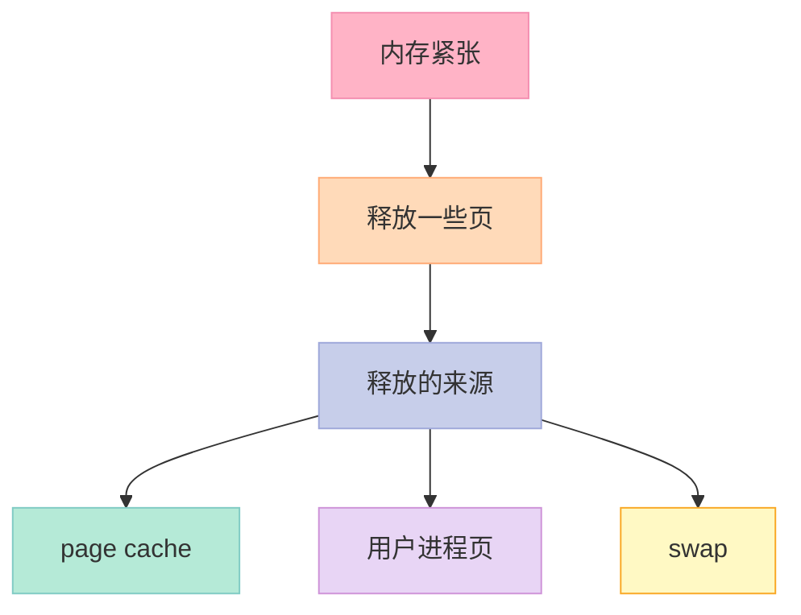

### 3.2 LRU（最近最少使用）

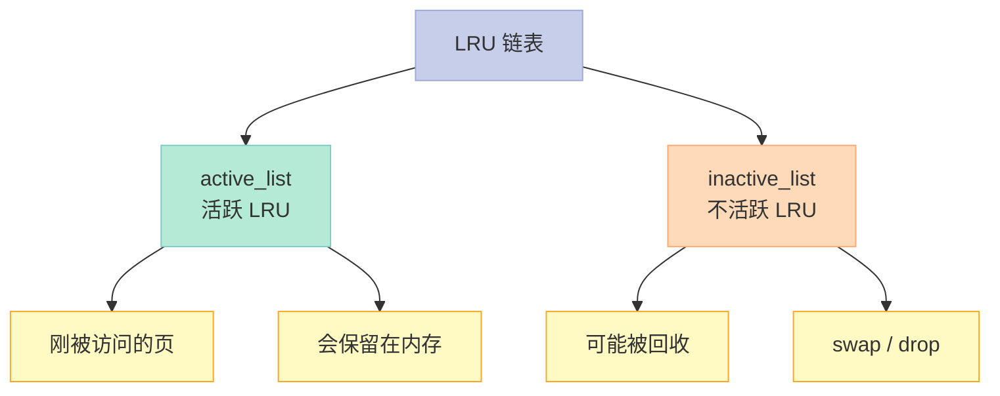

### 3.3 Linux 4.8+：多代 LRU（Multi-Gen LRU）


**多代 LRU 优势**：

- 减少扫描（只扫描老代）
- 抗扫描抗性强（避免颠簸）
- 更精确的 LRU 决策

### 3.4 页面标记

```c
// mm/vmscan.c
enum lru_list {
    LRU_INACTIVE_ANON,    // 不活跃匿名页（可 swap）
    LRU_ACTIVE_ANON,      // 活跃匿名页
    LRU_INACTIVE_FILE,    // 不活跃文件页（可 drop）
    LRU_ACTIVE_FILE,      // 活跃文件页
    LRU_UNEVICTABLE,      // 不可回收（如 mlock）
    NR_LRU_LISTS
};

// 页标志（PG_*）
PG_active       // 在活跃 LRU
PG_referenced   // 被访问过
PG_dirty        // 脏页（需写回）
```

### 3.5 关键启示

1. **LRU = 最近最少使用**——基础回收算法
2. **4 个 LRU 链表**——匿名/文件 × 活跃/不活跃
3. **多代 LRU**（Linux 4.8+）——抗颠簸

---

## 四、kswapd 内核线程

### 4.1 什么是 kswapd？

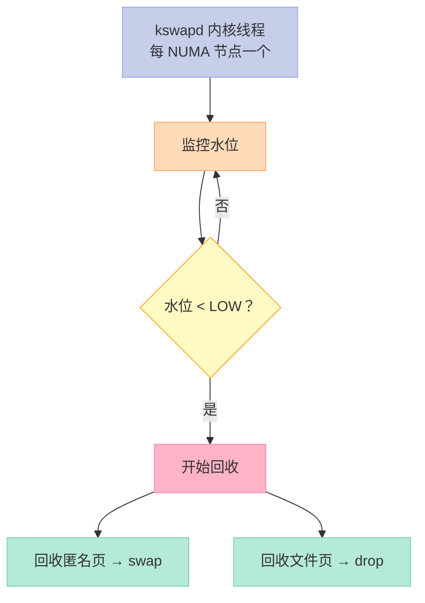

### 4.2 kswapd 回收流程

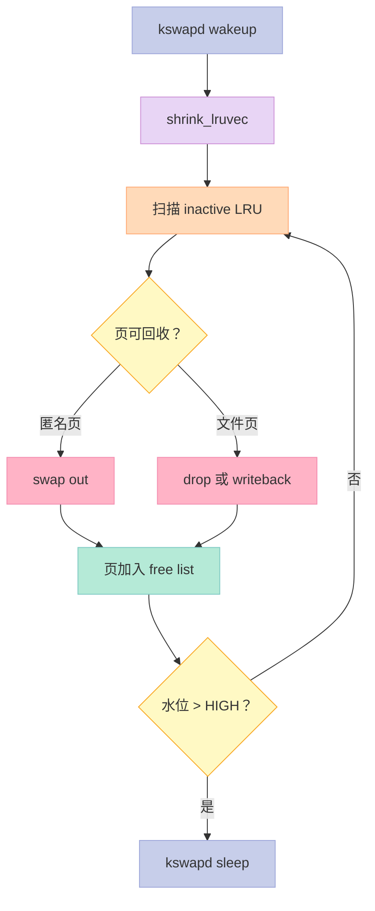

### 4.3 直接回收（Direct Reclaim）

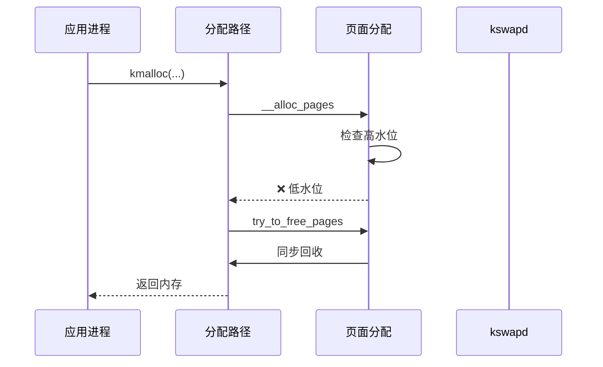

**两种回收模式对比**：

| 维度 | kswapd | 直接回收 |
|------|--------|----------|
| 触发 | 异步（水位低） | 同步（分配时） |
| 性能影响 | 后台 | 阻塞进程 |
| 优先级 | 低 | 高 |

### 4.4 关键启示

1. **kswapd = 后台回收**——提前回收到高水位
2. **直接回收 = 同步**——分配路径上同步回收
3. **NUMA 每节点一个**——并行回收
4. **OOM 是最后手段**——回收不出来就杀进程

---

## 五、Swap 机制

### 5.1 Swap 是什么？


**Swap = 把不活跃的匿名页换出到磁盘**。

### 5.2 Swap 设备 vs Swap 文件

| 维度 | Swap 设备 | Swap 文件 |
|------|-----------|----------|
| 性能 | 更快（连续） | 稍慢（碎片） |
| 灵活性 | 低（独立分区） | 高（任意文件） |
| 空间管理 | 简单 | 复杂 |

### 5.3 Swap 触发条件

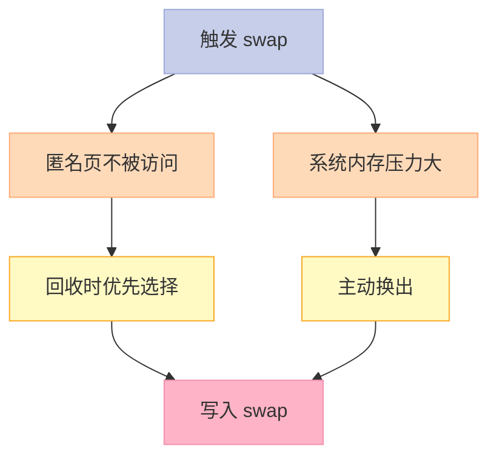

### 5.4 Swap 算法

```c
// mm/swap.c
// Linux 4.0+：基于时钟的 swap 算法
// 不再用纯 LRU——避免"循环颠簸"
```

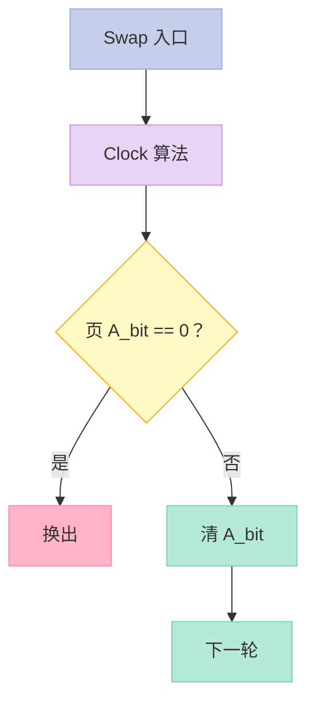

### 5.5 关键启示

1. **Swap = 内存的"延展"**——磁盘当内存用
2. **匿名页 swap**——文件页 drop/writeback
3. **Swap 不是越多越好**——过度 swap 会颠簸
4. **现代建议**：禁用 swap 或小 swap

---

## 六、内存回收的优先级

### 6.1 4 大回收源

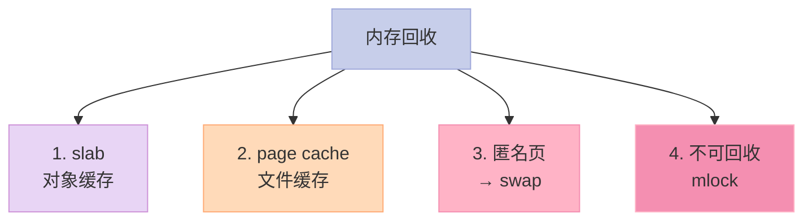

**回收优先级**：

```c
#define IOPRIO_CLASS_RT     0  // 实时（先回收）
#define IOPRIO_CLASS_BE     2  // 尽力而为
#define IOPRIO_CLASS_IDLE   3  // 空闲（最后回收）

// 实际：
// 1. 先回收 clean page cache（最便宜）
// 2. 然后回收 dirty page cache（写回）
// 3. 然后 swap out 匿名页（写磁盘）
// 4. 最后 OOM killer
```

### 6.2 关键启示

1. **clean page cache 最便宜**——直接丢弃
2. **dirty page cache 要写回**——I/O
3. **swap out 代价最高**——慢设备
4. **OOM 是最后手段**——杀进程

---

## 七、OOM Killer

### 7.1 什么是 OOM？

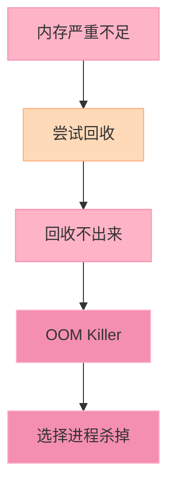

### 7.2 OOM 选择算法

```c
// mm/oom_kill.c
static int oom_badness(struct task_struct *p, struct mem_cgroup *memcg) {
    long points;
    long adj = 0;

    // 进程 RSS + swap
    points = get_mm_rss(p->mm) + get_mm_counter(p->mm, MM_SWAPENTS);

    // 调整 oom_score_adj
    adj = (long)p->signal->oom_score_adj;
    if (adj == OOM_SCORE_ADJ_MIN) {
        task_unlock(p);
        return 0;
    }
    points -= adj;

    return points;
}

// 选 oom_score 最高的进程杀掉
```

**评分因素**：

- 进程使用的内存（RSS + swap）
- `oom_score_adj`（用户可调）
- 子进程、父进程关系

### 7.3 关键启示

1. **OOM = 内存不足**——最后手段
2. **选最大进程**——最可能释放足够内存
3. **`oom_score_adj`**——保护关键进程
4. **`oom_adj`**——影响选择（-1000 到 1000）

---

## 八、面试高频考点

### 8.1 必背题

| 题目 | 答案要点 |
|------|----------|
| slab 分配的 3 级路径？ | per-CPU → partial → 伙伴系统 |
| LRU 算法？ | 4 个 LRU 链表 + 多代 LRU |
| kswapd 何时唤醒？ | 水位 < LOW 时 |
| 直接回收 vs kswapd？ | 同步 vs 异步 |
| swap 是什么？ | 把匿名页换到磁盘 |
| swap 何时触发？ | 内存压力大 |
| OOM 选哪个进程？ | oom_score 最高的 |
| swap 的代价？ | 磁盘 I/O 慢 1000 倍 |

### 8.2 高频追问

| 追问 | 关键点 |
|------|--------|
| per-CPU 缓存好处？ | 无锁 + CPU 局部 |
| 多代 LRU 优势？ | 减少扫描 + 抗颠簸 |
| dirty page 怎么处理？ | writeback + 标记 PG_dirty |
| swap 太多会怎样？ | 颠簸（swap in/out 风暴） |
| 现代系统用 swap 吗？ | 仍有，但更多用 zram |
| OOM 怎么保护关键进程？ | oom_score_adj = -1000 |

---

## 九、配套实验

### 9.1 实验 1：查看 slab

```bash
# slab 实时状态
slabtop -s c -d 1

# /proc/slabinfo（更详细）
sudo cat /proc/slabinfo | head -20
```

### 9.2 实验 2：触发 swap

```bash
# 1. 创建 swap 文件
sudo fallocate -l 2G /swapfile
sudo chmod 600 /swapfile
sudo mkswap /swapfile
sudo swapon /swapfile

# 2. 查看
free -h

# 输出：
#               total        used        free      shared  buff/cache   available
# Mem:           16Gi        2Gi       14Gi        0Mi        1Gi        ...
# Swap:          2Gi          0Mi        2Gi  # ← swap 已启用
```

### 9.3 实验 3：触发 OOM

```c
// 文件：oom_demo.c
#include <stdio.h>
#include <stdlib.h>
#include <string.h>

int main() {
    // 持续分配直到 OOM
    int i = 0;
    while (1) {
        void *p = malloc(100 * 1024 * 1024);  // 100 MB
        if (!p) {
            printf("OOM at %d MB\n", i * 100);
            return 1;
        }
        memset(p, 0, 100 * 1024 * 1024);  // 触发缺页
        printf("Allocated %d MB\n", ++i * 100);
    }
}
```

```bash
# 编译运行——另一个 terminal 观察 dmesg
gcc oom_demo.c -o oom_demo
./oom_demo

# dmesg 会看到 OOM Killer 选择
dmesg | grep -i oom
```

### 9.4 实验 4：观察内存压力

```bash
# vmstat 1
procs -----------memory---------- ---swap-- -----io---- -system-- ------cpu-----
 r  b   swpd   free   buff  cache   si   so    bi    bo   in   cs us sy id wa st
 0  0      0 2048000 512000 4096000    0    0     0     0  100  200  5  3 92  0  0

# si/so: swap in/out
# bi/bo: block in/out
```

### 9.5 实验 5：调整 OOM 评分

```bash
# 保护关键进程（不杀）
echo -1000 > /proc/<pid>/oom_score_adj

# 优先级杀掉
echo 1000 > /proc/<pid>/oom_score_adj

# 查
cat /proc/<pid>/oom_score
cat /proc/<pid>/oom_score_adj
```

### 9.6 实验 6：观察 slab 行为（内核模块）

```c
// 文件：test_slab.c
#include <linux/module.h>
#include <linux/slab.h>

struct my_struct {
    int a;
    char b[60];
};

static struct kmem_cache *my_cache;

static int __init my_init(void) {
    my_cache = kmem_cache_create("my_struct",
        sizeof(struct my_struct),
        0, SLAB_HWCACHE_ALIGN, NULL);
    if (!my_cache) return -ENOMEM;

    // 分配 / 释放
    int i;
    for (i = 0; i < 100; i++) {
        struct my_struct *p = kmem_cache_alloc(my_cache, GFP_KERNEL);
        p->a = i;
    }

    printk("Created my_struct cache\n");
    return 0;
}

static void __exit my_exit(void) {
    // 释放
    kmem_cache_destroy(my_cache);
    printk("Destroyed my_struct cache\n");
}

module_init(my_init);
module_exit(my_exit);
MODULE_LICENSE("GPL");
```

---

## 十、回到 5 个核心要点

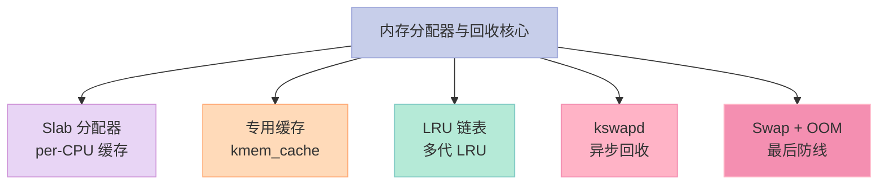

---

## 十一、结尾思考题

> **思考题 1**：你的 Linux 系统有 swap 吗？大小合适吗？

> **思考题 2**：写一个程序，分配内存后不释放，观察 kswapd 行为。

> **思考题 3**：OOM Killer 会选择哪个进程？为什么？

> **思考题 4**：per-CPU 缓存为什么快？NUMA 下有问题吗？

> **思考题 5**：多代 LRU 相比传统 LRU 的优势是什么？性能差多少？

---

## 十二、本篇速查表

| 主题 | 关键点 | 内核文件 |
|------|--------|----------|
| Slab | 对象缓存 | mm/slub.c |
| per-CPU 缓存 | 无锁快路径 | mm/slub.c |
| LRU | 4 链表 / 多代 | mm/vmscan.c |
| kswapd | 后台回收 | mm/vmscan.c |
| Swap | 匿名页换出 | mm/swap.c |
| OOM | 杀进程 | mm/oom_kill.c |

---

## 十三、系列导航

| # | 文章 | 状态 |
|:--|:--|:--|
| 0 | [系列总览](/2026/06/18/linux-kernel-architecture-00-series-index/) | ✅ 已发布 |
| 1 | [内核架构总览 + 进程管理](/2026/06/18/linux-kernel-architecture-01-process-management/) | ✅ 已发布 |
| 2 | [进程地址空间](/2026/06/18/linux-kernel-architecture-02-process-address-space/) | ✅ 已发布 |
| 3 | [内存管理基础](/2026/06/18/linux-kernel-architecture-03-memory-management-basics/) | ✅ 已发布 |
| 4 | **本文：内存分配器与回收** | ✅ 已发布 |
| 5 | [虚拟文件系统 VFS](/2026/06/18/linux-kernel-architecture-05-vfs/) | 🔜 计划中 |
| 6 | [Ext 文件系统族](/2026/06/18/linux-kernel-architecture-06-ext-filesystem/) | 🔜 计划中 |
| 7 | [块 I/O 层](/2026/06/18/linux-kernel-architecture-07-block-io/) | 🔜 计划中 |
| 8 | [设备驱动 + 网络栈](/2026/06/18/linux-kernel-architecture-08-drivers-network/) | 🔜 计划中 |
| 9 | [内核同步 + 定时器](/2026/06/18/linux-kernel-architecture-09-synchronization-timers/) | 🔜 计划中 |
| 10 | [中断下半部 + 模块](/2026/06/18/linux-kernel-architecture-10-interrupts-modules/) | 🔜 计划中 |
| 11 | [内核启动 + 附录速查](/2026/06/18/linux-kernel-architecture-11-boot-appendix/) | 🔜 计划中 |

---

**下一篇**：第 5 篇《虚拟文件系统 VFS》——超级块、inode、dentry、文件系统抽象、文件操作 `open/read/write` 的内核流程。

> **行动建议**：
> 1. **看 `slabtop`**——理解你的系统的对象缓存
> 2. **看 `/proc/meminfo` + `free -h`**——内存 + swap 状态
> 3. **写一个内核模块**——测试 slab 分配
> 4. **手动触发 OOM**——理解 OOM 选择逻辑
> 5. **读 `mm/slub.c`**——per-CPU 缓存的实现
