> **一句话核心结论**：VFS = **统一抽象层**——把 ext4、NFS、proc、tmpfs 等不同文件系统隐藏在统一接口下。核心数据结构：**超级块（super_block）** 描述文件系统、**inode** 描述文件、**dentry** 描述目录项、**file** 描述打开的文件。

---

## 系列导航

| # | 文章 | 状态 |
|:--|:--|:--|
| 0 | [系列总览](/2026/06/18/linux-kernel-architecture-00-series-index/) | ✅ 已发布 |
| 1 | [内核架构总览 + 进程管理](/2026/06/18/linux-kernel-architecture-01-process-management/) | ✅ 已发布 |
| 2 | [进程地址空间](/2026/06/18/linux-kernel-architecture-02-process-address-space/) | ✅ 已发布 |
| 3 | [内存管理基础](/2026/06/18/linux-kernel-architecture-03-memory-management-basics/) | ✅ 已发布 |
| 4 | [内存分配器与回收](/2026/06/18/linux-kernel-architecture-04-memory-allocation/) | ✅ 已发布 |
| 5 | **本文：虚拟文件系统 VFS** | ✅ 已发布 |
| 6 | [Ext 文件系统族](/2026/06/18/linux-kernel-architecture-06-ext-filesystem/) | 🔜 计划中 |
| 7 | [块 I/O 层](/2026/06/18/linux-kernel-architecture-07-block-io/) | 🔜 计划中 |
| 8 | [设备驱动 + 网络栈](/2026/06/18/linux-kernel-architecture-08-drivers-network/) | 🔜 计划中 |
| 9 | [内核同步 + 定时器](/2026/06/18/linux-kernel-architecture-09-synchronization-timers/) | 🔜 计划中 |
| 10 | [中断下半部 + 模块](/2026/06/18/linux-kernel-architecture-10-interrupts-modules/) | 🔜 计划中 |
| 11 | [内核启动 + 附录速查](/2026/06/18/linux-kernel-architecture-11-boot-appendix/) | 🔜 计划中 |

---

## 前言：为什么需要 VFS？

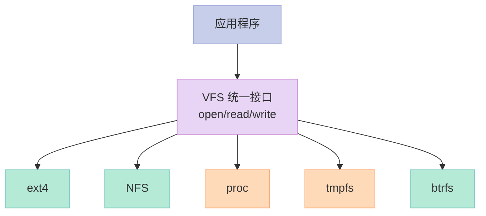

**没有 VFS**：

- 每个 FS 都要自己的 API
- 应用开发者要学习多种 FS
- 难以做统一抽象

**有了 VFS**：

- 一个 API 适用于所有 FS
- 应用无感知
- 易于添加新 FS

---

## 一、VFS 四大核心数据结构

### 1.1 4 大对象总览

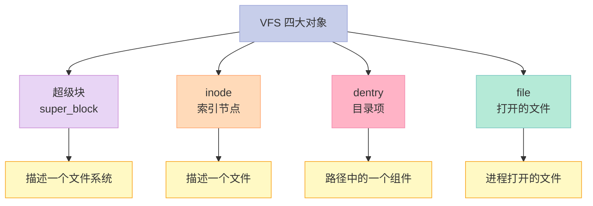

### 1.2 超级块 `super_block`

```c
// include/linux/fs.h
struct super_block {
    struct list_head s_list;          // 所有 super_block 链表
    dev_t s_dev;                      // 设备标识
    unsigned char s_blocksize_bits;
    unsigned long s_blocksize;        // 块大小
    loff_t s_maxbytes;                // 最大文件大小
    struct file_system_type *s_type;  // 文件系统类型
    const struct super_operations *s_op;  // 超级块操作
    struct inode *s_root;             // 根 inode
    struct list_head s_inodes;        // inode 链表
    struct list_head s_mounts;        // 挂载点链表
    struct hlist_bl_head s_anon;      // 匿名 dentry
    struct list_head s_dentry_lru;    // 未用 dentry LRU
    struct super_block *s_umount;     // 准备卸载
    // ... 100+ 字段
};
```

**超级块操作**：

```c
struct super_operations {
    struct inode *(*alloc_inode)(struct super_block *sb);
    void (*destroy_inode)(struct inode *);
    void (*dirty_inode)(struct inode *, int flags);
    int (*write_inode)(struct inode *, struct writeback_control *);
    void (*drop_inode)(struct inode *);
    void (*evict_inode)(struct inode *);
    int (*sync_fs)(struct super_block *, int);
    int (*freeze_fs)(struct super_block *);
    int (*unfreeze_fs)(struct super_block *);
    int (*statfs)(struct dentry *, struct kstatfs *);
    // ...
};
```

### 1.3 inode（索引节点）

```c
struct inode {
    umode_t i_mode;                   // 文件类型 + 权限
    unsigned short i_opflags;
    kuid_t i_uid;
    kgid_t i_gid;
    unsigned int i_flags;
    const struct inode_operations *i_op;
    struct super_block *i_sb;         // 所属超级块
    struct address_space *i_mapping;  // page cache
    unsigned long i_ino;              // inode 号
    dev_t i_dev;
    loff_t i_size;                    // 文件大小
    struct timespec i_atime;          // 访问时间
    struct timespec i_mtime;          // 修改时间
    struct timespec i_ctime;          // 元数据修改时间
    unsigned int i_nlink;             // 硬链接数
    struct inode *i_link_next;
    union {
        struct hlist_head i_dentry;   // dentry 链表
        struct rcu_head i_rcu;
    };
    // ...
};
```

**inode 关键点**：

- 唯一标识一个文件（在同一 FS 内）
- 包含元数据（权限、时间戳、大小等）
- **不包含文件名**——文件名在 dentry 中

### 1.4 dentry（目录项）

```c
struct dentry {
    unsigned int d_flags;
    struct super_block *d_sb;
    struct inode *d_inode;            // 关联 inode
    struct hlist_bl_node d_hash;      // 哈希表节点
    struct dentry *d_parent;          // 父 dentry
    const struct qstr d_name;         // 文件名
    struct list_head d_child;         // 子 dentry 链表
    struct list_head d_subdirs;       // 子目录链表
    struct inode *d_inode;
    // ...
};

struct qstr {
    unsigned int hash;
    unsigned int len;
    const char *name;
};
```

**dentry 的作用**：

- 把 `/home/user/file.txt` 解析为 inode
- 缓存路径解析结果（dcache）
- 组织目录树

### 1.5 file（打开的文件）

```c
struct file {
    union {
        struct llist_node fu_llist;
        struct rcu_head fu_rcuhead;
    } f_u;
    struct path f_path;               // 路径
    struct inode *f_inode;
    const struct file_operations *f_op;  // 文件操作
    loff_t f_pos;                     // 文件偏移
    unsigned int f_flags;             // O_RDONLY 等
    fmode_t f_mode;                   // 访问模式
    struct mutex f_pos_lock;
    // ...
};
```

**file 关键点**：

- 进程打开文件时创建
- 包含**当前文件偏移**
- 不同进程打开同一个文件：各自的 file，但共享 inode

### 1.6 4 大对象关系图

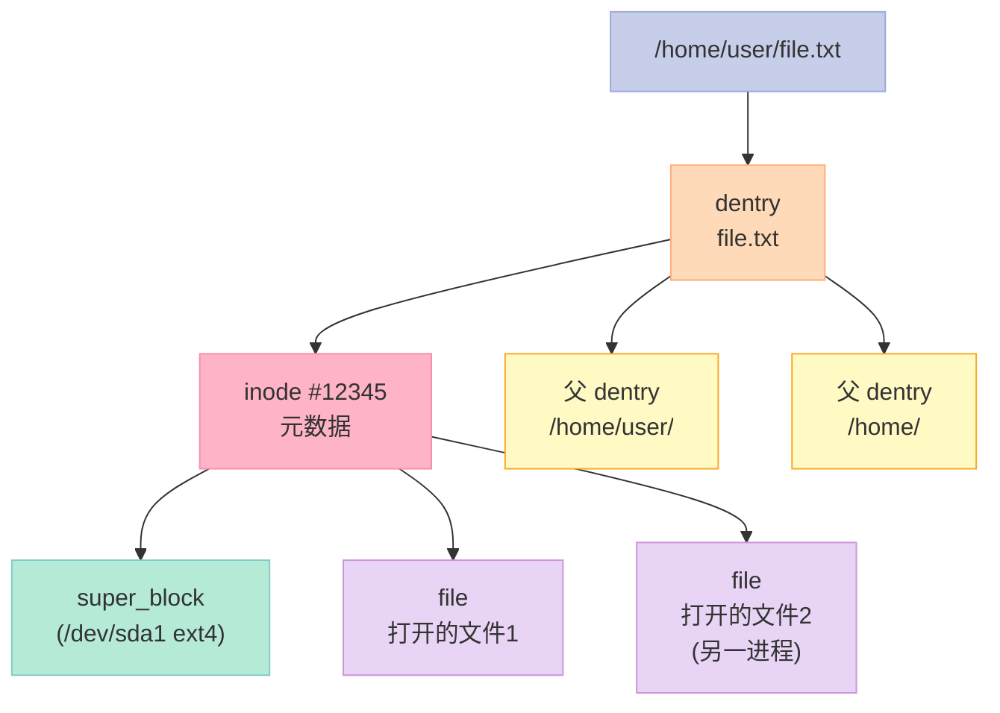

---

## 二、文件系统注册

### 2.1 `file_system_type`

```c
// include/linux/fs.h
struct file_system_type {
    const char *name;                  // "ext4", "nfs", ...
    int fs_flags;
    int (*init_fs_context)(struct fs_context *);  // 5.x 新
    const struct fs_parameter_spec *parameters;
    struct file_system_type *next;
    struct hlist_head fs_supers;
    // ...
};

#define REGISTER_FILESYSTEM(fs) \
    register_filesystem(fs)
#define UNREGISTER_FILESYSTEM(fs) \
    unregister_filesystem(fs)
```

### 2.2 注册 ext4

```c
// fs/ext4/super.c
static struct file_system_type ext4_fs_type = {
    .owner    = THIS_MODULE,
    .name     = "ext4",
    .mount    = ext4_mount,
    .kill_sb  = ext4_kill_sb,
    .fs_flags = FS_REQUIRES_DEV | FS_EXT4,
};
MODULE_ALIAS_FS("ext4");

static int __init ext4_init(void) {
    ...
    err = register_filesystem(&ext4_fs_type);
    ...
}
```

### 2.3 挂载文件系统

```c
// fs/super.c
struct vfsmount *vfs_kern_mount(struct file_system_type *type,
                                int flags,
                                const char *name,
                                void *data);
```

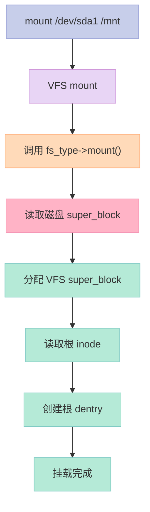

---

## 三、`open` 系统调用

### 3.1 用户态调用链

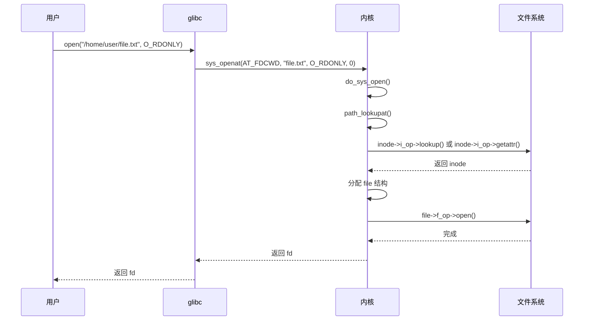

### 3.2 内核路径解析

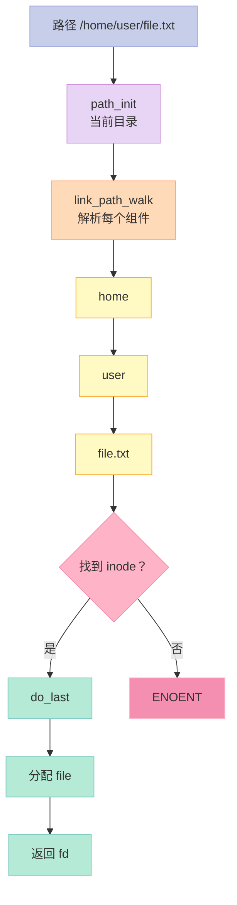

### 3.3 dcache 缓存

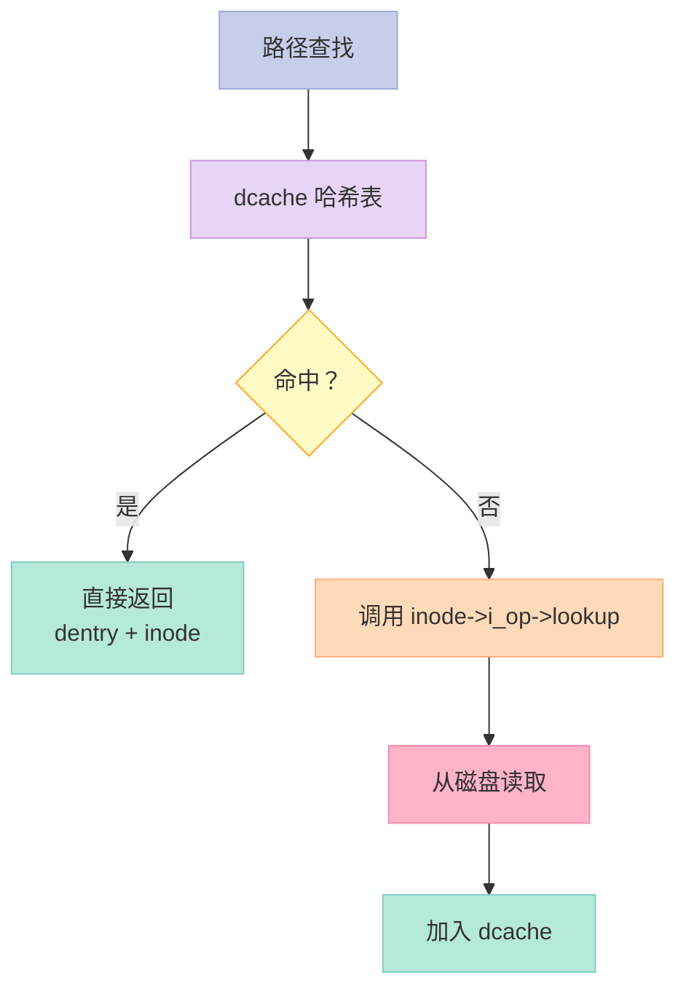

**dcache 的作用**：

- 缓存路径 → inode 的映射
- 避免每次路径都查 inode 表
- 大幅加速 `open()` / `stat()`

---

## 四、`read` / `write` 系统调用

### 4.1 `read` 调用链

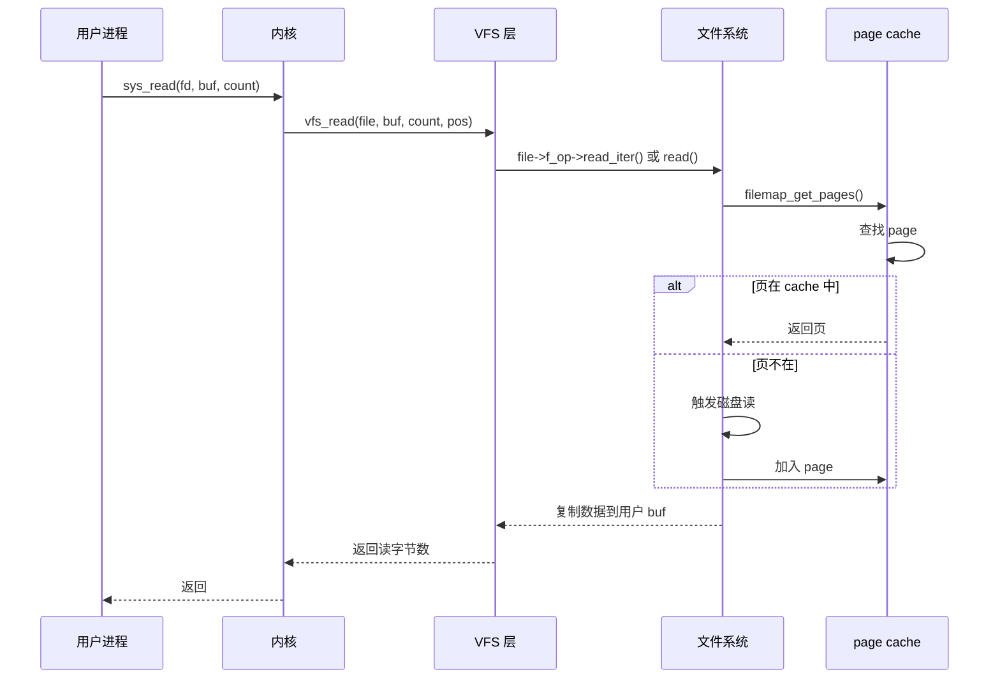

### 4.2 `file_operations`

```c
struct file_operations {
    struct module *owner;
    loff_t (*llseek)(struct file *, loff_t, int);
    ssize_t (*read)(struct file *, char __user *, size_t, loff_t *);
    ssize_t (*write)(struct file *, const char __user *, size_t, loff_t *);
    int (*open)(struct inode *, struct file *);
    int (*flush)(struct file *, fl_owner_t id);
    int (*release)(struct inode *, struct file *);
    int (*fsync)(struct file *, loff_t, loff_t, int datasync);
    long (*unlocked_ioctl)(struct file *, unsigned int, unsigned long);
    // ...
};
```

### 4.3 ext4 的 file_operations

```c
// fs/ext4/file.c
const struct file_operations ext4_file_operations = {
    .llseek     = ext4_llseek,
    .read_iter  = ext4_file_read_iter,
    .write_iter = ext4_file_write_iter,
    .unlocked_ioctl = ext4_ioctl,
    .mmap       = ext4_file_mmap,
    .open       = ext4_file_open,
    .release    = ext4_release_file,
    .fsync      = ext4_sync_file,
    // ...
};
```

### 4.4 page cache

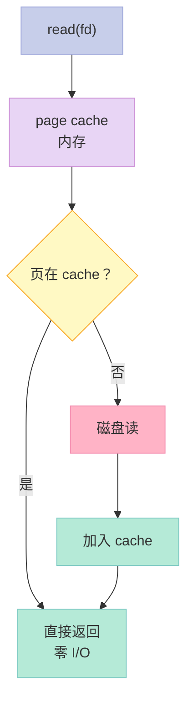

**page cache 核心结构**：

```c
// include/linux/fs.h
struct address_space {
    struct inode *host;            // 所属 inode
    struct rb_root_cached i_mmap;  // 内存映射
    struct rw_semaphore invalidate_lock;
    atomic_t i_mmap_readonly_count;
    struct list_head i_private_list;
    // ...
};
```

### 4.5 关键启示

1. **`file_operations`**——VFS 调用 FS 的接口
2. **page cache**——文件内容的内存缓存
3. **fsync**——强制刷盘（绕过 cache）

---

## 五、inode 操作

### 5.1 `inode_operations`

```c
struct inode_operations {
    struct dentry *(*lookup)(struct inode *, struct dentry *, unsigned int);
    const char *(*get_link)(struct dentry *, struct inode *, struct delayed_call *);
    int (*permission)(struct inode *, int);
    int (*setattr)(struct dentry *, struct iattr *);
    int (*getattr)(struct path *, struct kstat *, u32, unsigned int);
    ssize_t (*listxattr)(struct dentry *, char *, size_t);
    int (*fiemap)(struct inode *, struct fiemap_extent_info *, u64 start, u64 len);
    // ...
};
```

### 5.2 关键操作说明

| 操作 | 作用 |
|------|------|
| `lookup` | 路径查找——dentry → inode |
| `permission` | 权限检查 |
| `setattr` / `getattr` | 设置 / 获取属性（权限、时间戳） |
| `listxattr` | 列出扩展属性 |

---

## 六、文件系统的"挂载"

### 6.1 挂载流程

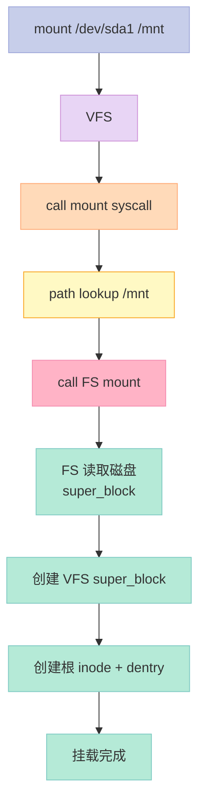

### 6.2 挂载点链表

```bash
# 查看所有挂载点
mount

# 输出：
# /dev/sda1 on / type ext4 (rw,relatime)
# tmpfs on /run type tmpfs (rw,nosuid,nodev,size=...)
# /dev/sda2 on /home type ext4 (rw,relatime)
# proc on /proc type proc (rw,nosuid,nodev,noexec)
# ...
```

---

## 七、Linux 支持的文件系统

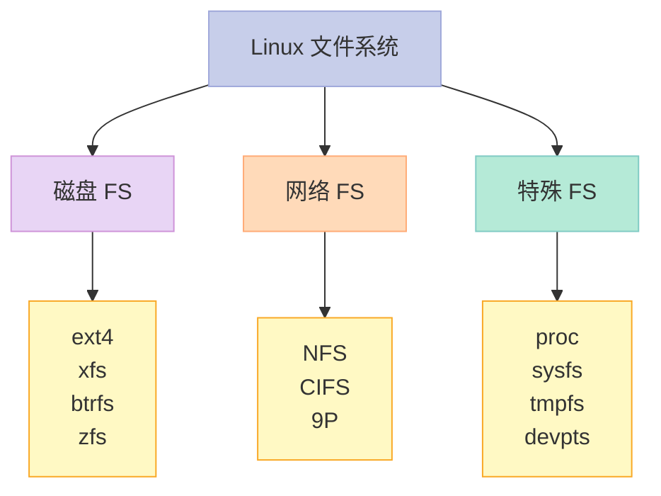

---

## 八、面试高频考点

### 8.1 必背题

| 题目 | 答案要点 |
|------|----------|
| VFS 是什么？ | 虚拟文件系统，统一抽象 |
| 四大对象？ | super_block / inode / dentry / file |
| inode 不包含什么？ | 文件名 |
| dentry 是什么？ | 路径分量缓存 |
| file vs inode？ | file 是打开的，inode 是文件本身 |
| dcache 作用？ | 加速路径查找 |
| page cache 是什么？ | 文件内容缓存 |
| open 流程？ | path lookup → inode → file |

### 8.2 高频追问

| 追问 | 关键点 |
|------|--------|
| 硬链接 vs 软链接？ | 同一 inode vs 不同 inode + 路径 |
| inode 满了怎么删文件？ | 创建文件失败，需删除 |
| 删除文件后空间不释放？ | 被进程持有（fuser） |
| 软链接跨 FS？ | 可以（按路径解析） |
| 硬链接跨 FS？ | 不可以 |
| 文件系统类型？ | ext4/xfs/btrfs/nfs/proc |
| mount 发生了什么？ | 读 super_block + 创建 VFS 对象 |

---

## 九、配套实验

### 9.1 实验 1：查看文件系统

```bash
# 挂载信息
mount | head -10

# /proc/mounts
cat /proc/mounts

# /proc/filesystems（支持哪些）
cat /proc/filesystems
```

### 9.2 实验 2：查看 inode

```bash
# inode 信息
stat /etc/passwd

# 输出：
#   File: /etc/passwd
#   Size: 1234       Blocks: 8          IO Block: 4096   regular file
# Device: 801h/2049d Inode: 1234567     Links: 1
# Access: (0644/-rw-r--r--)  Uid: (    0/    root)
# ...

# inode 使用情况
df -i
```

### 9.3 实验 3：观察 page cache

```bash
# page cache 大小
cat /proc/meminfo | grep -i cached

# 输出：
# Cached:         4096000 kB

# 清空 page cache（谨慎！）
echo 1 > /proc/sys/vm/drop_caches
```

### 9.4 实验 4：文件系统操作追踪

```bash
# 1. 编译运行（前面 fork_demo 之类）
# 2. strace 跟踪

strace -e trace=open,openat,read,write,close ./myapp

# 输出：
# openat(AT_FDCWD, "/etc/ld.so.cache", O_RDONLY|O_CLOEXEC) = 3
# read(3, "\177ELF...", 832) = 832
# close(3) = 0
```

### 9.5 实验 5：VFS 缓存命中率

```bash
# /proc/stat 提取
cat /proc/stat | grep -i cache

# 输出（示例）：
# cache_swap_full: 0
# cache_swap_misses: 1234
```

### 9.6 实验 6：写一个简单的 FS（内核模块）

```c
// 文件：hello_fs.c
#include <linux/fs.h>
#include <linux/init.h>

#define HELLO_MAGIC 0x12345678

static int hello_getattr(struct path *p, struct kstat *st, u32 m, unsigned int f) {
    generic_fillattr(d_backing_inode(p->dentry), st);
    return 0;
}

static const struct inode_operations hello_inode_ops = {
    .getattr = hello_getattr,
};

static int hello_fill_super(struct super_block *sb, void *data, int silent) {
    sb->s_magic = HELLO_MAGIC;
    sb->s_op = &hello_super_ops;
    sb->s_root = d_make_root(inode_init_always(sb, NULL, S_IFDIR | 0755, 0));
    if (!sb->s_root) return -ENOMEM;
    return 0;
}

static struct dentry *hello_mount(struct file_system_type *fs_type,
                                   int flags, const char *dev_name, void *data) {
    return mount_single(fs_type, flags, data, hello_fill_super);
}

static struct file_system_type hello_fs_type = {
    .owner    = THIS_MODULE,
    .name     = "hello_fs",
    .mount    = hello_mount,
    .kill_sb  = kill_litter_super,
};
MODULE_ALIAS_FS("hello_fs");

static int __init hello_init(void) {
    return register_filesystem(&hello_fs_type);
}

static void __exit hello_exit(void) {
    unregister_filesystem(&hello_fs_type);
}

module_init(hello_init);
module_exit(hello_exit);
MODULE_LICENSE("GPL");
```

---

## 十、回到 4 个核心要点

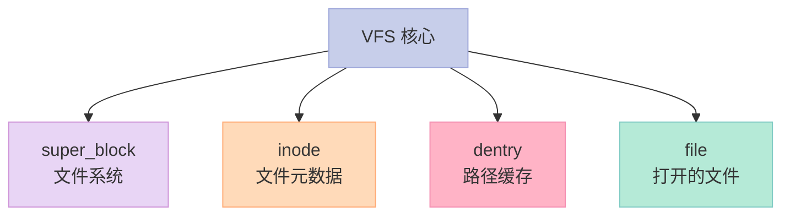

---

## 十一、结尾思考题

> **思考题 1**：你的 Linux 用了哪些文件系统？proc / sysfs 为什么是 FS？

> **思考题 2**：写一个程序，跟踪 `open`/`read` 系统调用，列出 VFS 调用链。

> **思考题 3**：硬链接 vs 软链接——inode 行为差异？

> **思考题 4**：dcache 满了会怎样？用什么策略回收？

> **思考题 5**：实现一个最小 VFS 模块——支持 `mkdir` / `create` 文件。

---

## 十二、本篇速查表

| 主题 | 关键点 | 内核文件 |
|------|--------|----------|
| super_block | 文件系统元数据 | fs/super.c |
| inode | 文件元数据 | fs/inode.c |
| dentry | 路径缓存 | fs/dcache.c |
| file | 打开的文件 | fs/file_table.c |
| file_operations | 文件操作 | include/linux/fs.h |
| dcache | 路径缓存 | fs/dcache.c |
| page cache | 文件内容缓存 | mm/filemap.c |

---

## 十三、系列导航

| # | 文章 | 状态 |
|:--|:--|:--|
| 0 | [系列总览](/2026/06/18/linux-kernel-architecture-00-series-index/) | ✅ 已发布 |
| 1 | [内核架构总览 + 进程管理](/2026/06/18/linux-kernel-architecture-01-process-management/) | ✅ 已发布 |
| 2 | [进程地址空间](/2026/06/18/linux-kernel-architecture-02-process-address-space/) | ✅ 已发布 |
| 3 | [内存管理基础](/2026/06/18/linux-kernel-architecture-03-memory-management-basics/) | ✅ 已发布 |
| 4 | [内存分配器与回收](/2026/06/18/linux-kernel-architecture-04-memory-allocation/) | ✅ 已发布 |
| 5 | **本文：虚拟文件系统 VFS** | ✅ 已发布 |
| 6 | [Ext 文件系统族](/2026/06/18/linux-kernel-architecture-06-ext-filesystem/) | 🔜 计划中 |
| 7 | [块 I/O 层](/2026/06/18/linux-kernel-architecture-07-block-io/) | 🔜 计划中 |
| 8 | [设备驱动 + 网络栈](/2026/06/18/linux-kernel-architecture-08-drivers-network/) | 🔜 计划中 |
| 9 | [内核同步 + 定时器](/2026/06/18/linux-kernel-architecture-09-synchronization-timers/) | 🔜 计划中 |
| 10 | [中断下半部 + 模块](/2026/06/18/linux-kernel-architecture-10-interrupts-modules/) | 🔜 计划中 |
| 11 | [内核启动 + 附录速查](/2026/06/18/linux-kernel-architecture-11-boot-appendix/) | 🔜 计划中 |

---

**下一篇**：第 6 篇《Ext 文件系统族》——ext2/3/4 的磁盘布局、super_block、inode 表、数据块、目录、日志机制（journaling）。

> **行动建议**：
> 1. **读 `stat`**——理解 inode 信息
> 2. **看 `/proc/filesystems`**——你系统支持哪些 FS
> 3. **用 strace**——跟踪 open/read 系统调用
> 4. **读 `fs/open.c` 的 do_sys_open**——理解 open 流程
> 5. **读 `fs/dcache.c`**——理解 dcache 缓存
