> **一句话核心结论**：Ext 系列是 Linux 最早、最稳定的文件系统——**Ext2** 是基础（无日志）、**Ext3** 加日志（崩溃恢复）、**Ext4** 加 Extent（提升大文件性能）。核心磁盘布局：**引导块 → 块组描述符表 → 块组（super_block 副本 + inode 位图 + 数据位图 + inode 表 + 数据块）**。

---

## 系列导航

| # | 文章 | 状态 |
|:--|:--|:--|
| 0 | [系列总览](/2026/06/18/linux-kernel-architecture-00-series-index/) | ✅ 已发布 |
| 1 | [内核架构总览 + 进程管理](/2026/06/18/linux-kernel-architecture-01-process-management/) | ✅ 已发布 |
| 2 | [进程地址空间](/2026/06/18/linux-kernel-architecture-02-process-address-space/) | ✅ 已发布 |
| 3 | [内存管理基础](/2026/06/18/linux-kernel-architecture-03-memory-management-basics/) | ✅ 已发布 |
| 4 | [内存分配器与回收](/2026/06/18/linux-kernel-architecture-04-memory-allocation/) | ✅ 已发布 |
| 5 | [虚拟文件系统 VFS](/2026/06/18/linux-kernel-architecture-05-vfs/) | ✅ 已发布 |
| 6 | **本文：Ext 文件系统族** | ✅ 已发布 |
| 7 | [块 I/O 层](/2026/06/18/linux-kernel-architecture-07-block-io/) | 🔜 计划中 |
| 8 | [设备驱动 + 网络栈](/2026/06/18/linux-kernel-architecture-08-drivers-network/) | 🔜 计划中 |
| 9 | [内核同步 + 定时器](/2026/06/18/linux-kernel-architecture-09-synchronization-timers/) | 🔜 计划中 |
| 10 | [中断下半部 + 模块](/2026/06/18/linux-kernel-architecture-10-interrupts-modules/) | 🔜 计划中 |
| 11 | [内核启动 + 附录速查](/2026/06/18/linux-kernel-architecture-11-boot-appendix/) | 🔜 计划中 |

---

## 前言：Ext 家族进化史

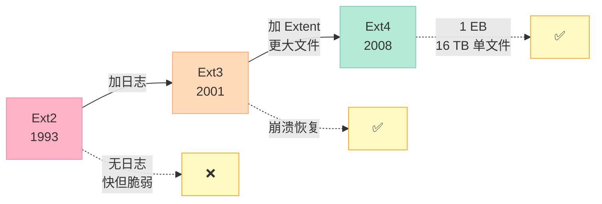

**对比**：

| 特性 | Ext2 | Ext3 | Ext4 |
|------|------|------|------|
| 最大文件 | 2 TB | 2 TB | 16 TB |
| 最大 FS | 16 TB | 16 TB | 1 EB |
| 日志 | ❌ | ✅ | ✅ |
| Extent | ❌ | ❌ | ✅ |
| 多块分配 | ❌ | ❌ | ✅ |
| 延迟分配 | ❌ | ❌ | ✅ |
| 在线碎片整理 | ❌ | ❌ | ✅ |

---

## 一、Ext4 磁盘布局

### 1.1 整体布局

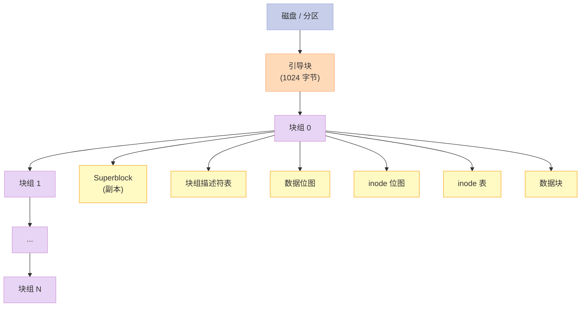

### 1.2 块（Block）

- **基本单位**——磁盘读写最小单位
- 大小：1 KB、2 KB、4 KB（默认）、8 KB

### 1.3 块组（Block Group）

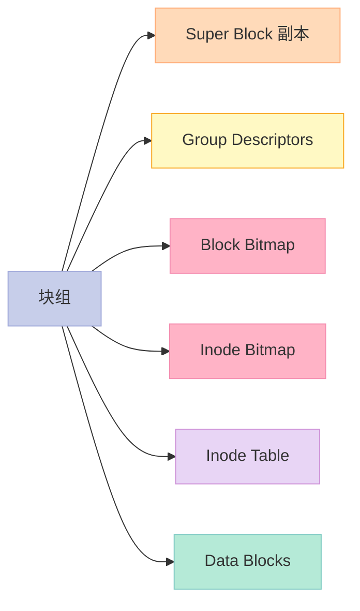

**块组的好处**：

- 减少 inode 跨块组访问
- 提高局部性
- 减少磁盘寻道

---

## 二、Ext4 Superblock

### 2.1 超级块结构

```c
// fs/ext4/ext4.h
struct ext4_super_block {
    __le32  s_inodes_count;        // inode 总数
    __le32  s_blocks_count;        // 块总数
    __le32  s_r_blocks_count;      // 保留块数
    __le32  s_free_blocks_count;   // 空闲块数
    __le32  s_free_inodes_count;   // 空闲 inode 数
    __le32  s_first_data_block;    // 第一个数据块
    __le32  s_log_block_size;      // 块大小 = 1024 << s_log_block_size
    __le32  s_log_frag_size;       // 片段大小
    __le32  s_blocks_per_group;    // 每组块数
    __le32  s_frags_per_group;     // 每组片段数
    __le32  s_inodes_per_group;    // 每组 inode 数
    __le32  s_mtime;               // mount 时间
    __le32  s_wtime;               // write 时间
    __le16  s_mnt_count;           // mount 次数
    __le16  s_max_mnt_count;       // 最大 mount 次数
    __le16  s_magic;               // 0xEF53
    __le16  s_state;               // 状态
    __le16  s_errors;              // 错误处理
    __le32  s_lastcheck;           // 最后检查时间
    __le32  s_checkinterval;       // 检查间隔
    // ... 100+ 字段
};
```

### 2.2 关键字段

| 字段 | 含义 |
|------|------|
| `s_magic` | 0xEF53（Ext 魔数） |
| `s_blocks_count` | 总块数 |
| `s_inodes_count` | 总 inode 数 |
| `s_log_block_size` | 块大小（1024 << n） |
| `s_state` | EXT4_VALID_FS / EXT4_ERROR_FS |

### 2.3 块组描述符

```c
struct ext4_group_desc {
    __le32  bg_block_bitmap_lo;    // 块位图块号（低 32 位）
    __le32  bg_inode_bitmap_lo;    // inode 位图块号
    __le32  bg_inode_table_lo;     // inode 表块号
    __le16  bg_free_blocks_count_lo;
    __le16  bg_free_inodes_count_lo;
    __le16  bg_used_dirs_count_lo;
    __le16  bg_flags;
    __le32  bg_checksum;           // 校验和
    // ... 64-bit 部分
};
```

---

## 三、inode 结构

### 3.1 inode 256 字节布局

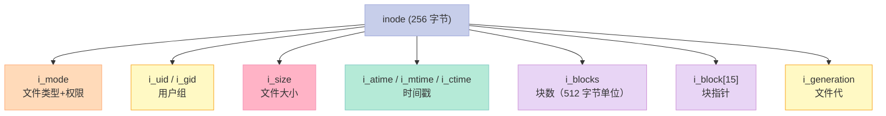

### 3.2 Ext4 Extent（替代块指针）

```c
// 替代 Ext2/3 的 i_block[15] 直接块指针
struct ext4_extent_header {
    __le16  eh_magic;       // 0xF30A
    __le16  eh_entries;     // 有效 extent 数
    __le16  eh_max;         // 最大 extent 数
    __le16  eh_depth;       // 树深度（0=叶子）
    __le32  eh_generation;
};

struct ext4_extent {
    __le32  ee_block;       // 起始逻辑块
    __le16  ee_len;         // 块数
    __le16  ee_start_hi;    // 起始物理块（高 16 位）
    __le32  ee_start_lo;    // 起始物理块（低 32 位）
};
```

**Extent 优势**：

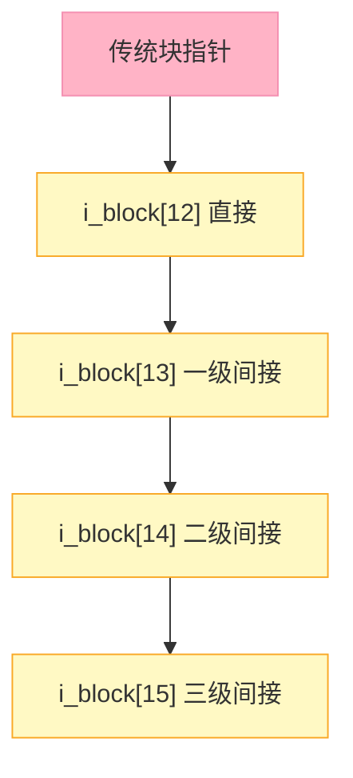

**块指针的问题**：

- 每个 i_block 表示一个块
- 1 GB 文件需要 25 万个 i_block 单元
- 不可能塞进 inode → 必须多级间接

**Extent 优势**：

- 一个 extent 表示连续块范围
- 1 GB 文件：128 KB extent 块 = 8192 个 extent
- 直接塞进 inode（最多 4 个 extent）

### 3.3 Extent 树

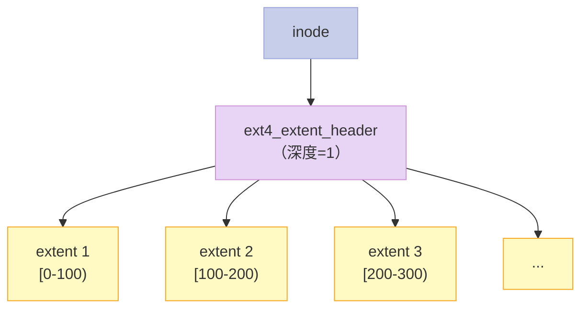

**深度 > 0 时 = 索引节点**：

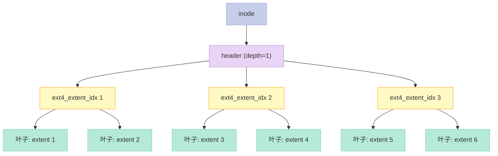

---

## 四、目录结构

### 4.1 目录实现：HTree

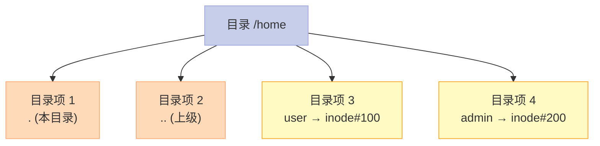

### 4.2 目录项结构

```c
struct ext4_dir_entry_2 {
    __le32  inode;           // inode 号
    __le16  rec_len;         // 本项长度
    __le8   name_len;        // 文件名长度
    __le8   file_type;       // 文件类型
    char    name[];          // 文件名（变长）
};
```

### 4.3 HTree 索引（大目录优化）

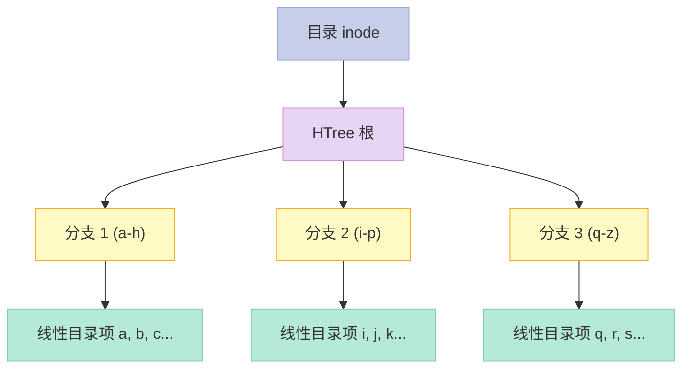

**HTree 优势**：

- 大目录查找从 O(n) → O(log n)
- 哈希索引
- 4 KB 块最多 1M 个目录项

---

## 五、Journaling（日志机制）

### 5.1 为什么需要日志？

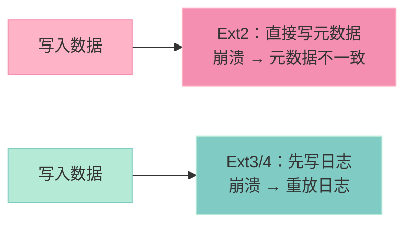

### 5.2 日志模式

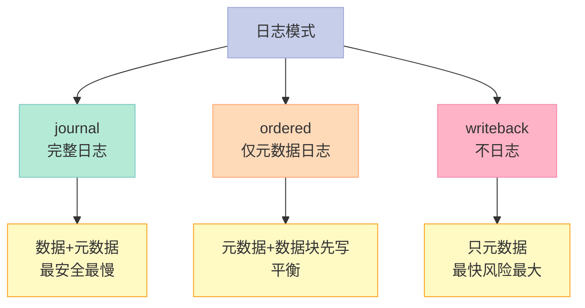

### 5.3 Journal 工作流

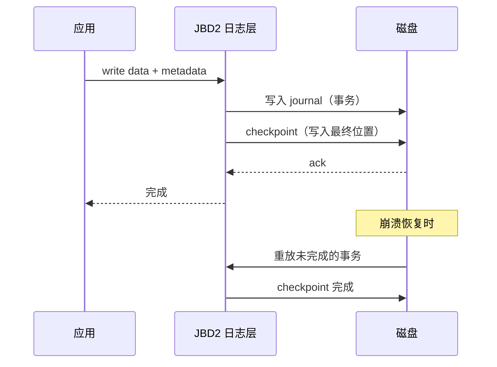

### 5.4 JBD2 关键概念

```c
// fs/jbd2/journal.c
struct journal_s {
    unsigned long j_flags;
    tid_t j_transaction_sequence;  // 当前事务号
    struct transaction *j_running_transaction;  // 当前事务
    struct transaction *j_committing_transaction; // 提交中
    struct list_head j_checkpoint_transactions;  // 检查点
    // ...
};
```

**事务状态**：

- `running`：进行中
- `committed`：已提交但未 checkpoint
- `checkpoint`：已 checkpoint（可回收）

### 5.5 关键启示

1. **日志 = 崩溃恢复**——先写日志，再写数据
2. **3 种日志模式**——安全 vs 性能 trade-off
3. **JBD2** = Journaling Block Device 2
4. **Checkpoint 回收日志空间**

---

## 六、Ext4 的关键改进

### 6.1 多块分配（Multiblock Allocator）

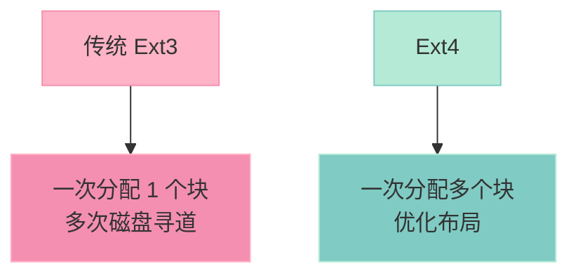

### 6.2 延迟分配（Delayed Allocation）

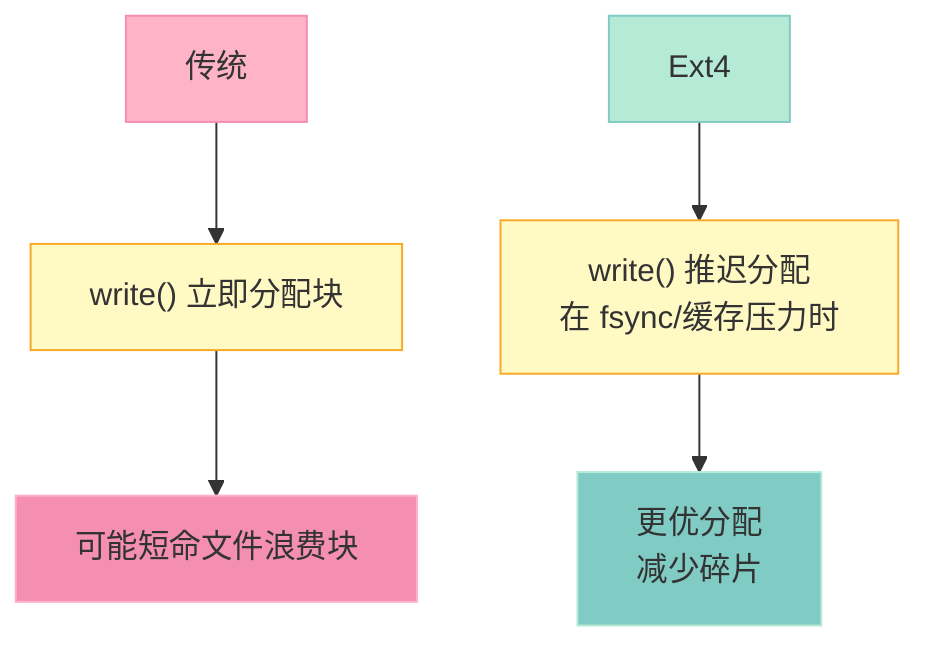

### 6.3 其他 Ext4 特性

| 特性 | 说明 |
|------|------|
| **Extent** | 替代块指针 |
| **多块分配** | 一次分配多块 |
| **延迟分配** | 推迟到合适时机 |
| **快速 fsck** | 不扫描整个磁盘 |
| **在线碎片整理** | `e4defrag` |
| **纳秒级时间戳** | 精度提升 |

---

## 七、文件操作流程（ext4）

### 7.1 创建文件

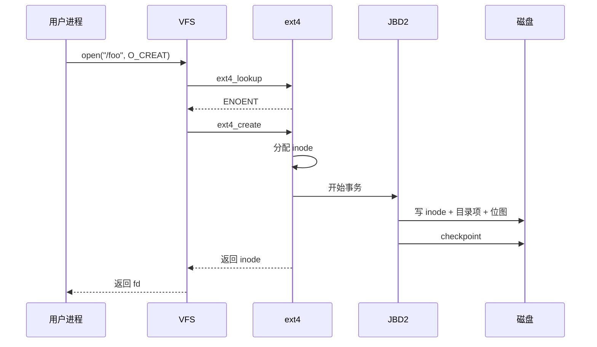

### 7.2 写入文件

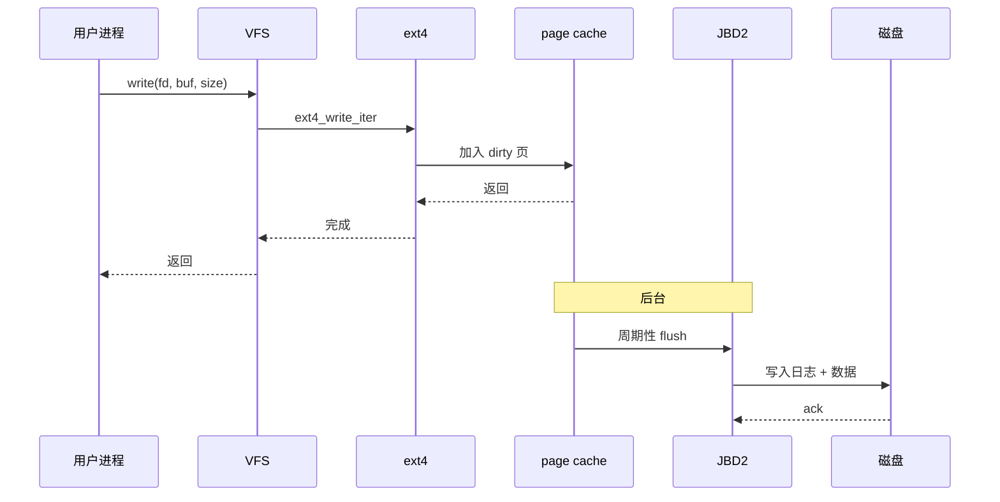

---

## 八、面试高频考点

### 8.1 必背题

| 题目 | 答案要点 |
|------|----------|
| Ext4 的磁盘布局？ | 引导块 + 块组 × N |
| inode 包含什么？ | 元数据（不含文件名） |
| Extent 优势？ | 减少 inode 大小，支持大文件 |
| 日志机制？ | Journal / Ordered / Writeback |
| Ext2 vs Ext3？ | Ext3 加日志 |
| Ext3 vs Ext4？ | Ext4 加 Extent + 多块 + 延迟 |
| 块组的作用？ | 减少 inode 跨块访问 |
| dcache vs inode cache？ | 路径缓存 vs inode 缓存 |

### 8.2 高频追问

| 追问 | 关键点 |
|------|--------|
| HTree 是什么？ | 大目录哈希索引 |
| fsync 做了什么？ | 强制 page cache 刷盘 |
| 软链接跨 FS？ | 可以 |
| 硬链接跨 FS？ | 不可以 |
| 删除文件流程？ | unlink + free inode + free blocks |
| 文件系统大小限制？ | Ext4 = 1 EB |
| 日志大小？ | 通常 128 MB 左右 |

---

## 九、配套实验

### 9.1 实验 1：查看 Ext4 信息

```bash
# 文件系统信息
dumpe2fs /dev/sda1 | head -50

# 输出（示例）：
# Filesystem volume name:   /
# Last mounted on:          /
# Filesystem UUID:          abc-def-ghi
# Filesystem magic number:  0xEF53
# Filesystem revision #:    1 (dynamic)
# Filesystem features:      has_journal ext_attr resize_inode dir_index filetype extent 64bit flex_bg sparse_super large_file huge_file dir_nlink extra_isize
# Filesystem flags:         signed_directory_hash
# Default mount options:    user_xattr acl
# Filesystem state:         clean
# ...
```

### 9.2 实验 2：inode 和块使用

```bash
# inode 使用情况
df -i /

# 输出：
# Filesystem      Inodes  IUsed   IFree IUse% Mounted on
# /dev/sda1      6553600 234567 6319033    4% /

# 块使用
df -h /

# 输出：
# Filesystem      Size  Used Avail Use% Mounted on
# /dev/sda1        50G   20G   28G  42% /
```

### 9.3 实验 3：调试文件系统

```bash
# tune2fs 调整参数
sudo tune2fs -l /dev/sda1

# 修改 label
sudo tune2fs -L "MyRoot" /dev/sda1

# 修改最大 mount 次数
sudo tune2fs -c 100 /dev/sda1

# 启用/禁用日志
sudo tune2fs -O ^has_journal /dev/sda1
```

### 9.4 实验 4：创建 Ext4 文件系统

```bash
# 创建 loop 设备
dd if=/dev/zero of=/tmp/ext4.img bs=1M count=100
sudo mkfs.ext4 /tmp/ext4.img

# 挂载
mkdir /mnt/myext4
sudo mount -o loop /tmp/ext4.img /mnt/myext4

# 使用
sudo touch /mnt/myext4/test
ls -la /mnt/myext4/

# 卸载
sudo umount /mnt/myext4
```

### 9.5 实验 5：观察 Journal

```bash
# 查看日志
sudo dumpe2fs /dev/sda1 | grep -i journal
# Journal size:             128M
# Journal inode:            8
# Journal device:           0x801

# 用 debugfs 看 journal
sudo debugfs -R "logdump -b" /dev/sda1 | head -30
```

### 9.6 实验 6：性能测试

```bash
# 顺序写测试
dd if=/dev/zero of=/mnt/myext4/test bs=1M count=1000 oflag=direct

# 随机读测试
fio --name=randread --ioengine=libaio --direct=1 \
    --filename=/mnt/myext4/test --bs=4k --size=1G \
    --rw=randread --numjobs=4 --runtime=30
```

---

## 十、回到 5 个核心要点

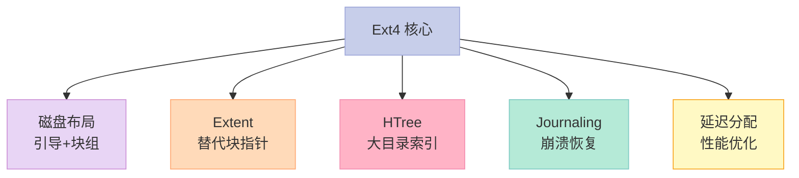

---

## 十一、结尾思考题

> **思考题 1**：你的 Linux 用的是 Ext4 吗？怎么确认？

> **思考题 2**：为什么 Ext4 比 Ext3 快？具体哪些改进？

> **思考题 3**：日志模式 `ordered` 为什么比 `journal` 快？

> **思考题 4**：创建 1 亿个小文件——Ext4 表现如何？

> **思考题 5**：`e4defrag` 怎么用？什么时候需要碎片整理？

---

## 十二、本篇速查表

| 主题 | 关键点 | 内核文件 |
|------|--------|----------|
| Superblock | 文件系统元数据 | fs/ext4/super.c |
| Inode | 文件元数据 | fs/ext4/inode.c |
| Extent | 大文件优化 | fs/ext4/extents.c |
| HTree | 大目录优化 | fs/ext4/dir.c |
| Journaling | 崩溃恢复 | fs/ext4/ext4_jbd2.c |
| 写流程 | write_iter | fs/ext4/file.c |

---

## 十三、系列导航

| # | 文章 | 状态 |
|:--|:--|:--|
| 0 | [系列总览](/2026/06/18/linux-kernel-architecture-00-series-index/) | ✅ 已发布 |
| 1 | [内核架构总览 + 进程管理](/2026/06/18/linux-kernel-architecture-01-process-management/) | ✅ 已发布 |
| 2 | [进程地址空间](/2026/06/18/linux-kernel-architecture-02-process-address-space/) | ✅ 已发布 |
| 3 | [内存管理基础](/2026/06/18/linux-kernel-architecture-03-memory-management-basics/) | ✅ 已发布 |
| 4 | [内存分配器与回收](/2026/06/18/linux-kernel-architecture-04-memory-allocation/) | ✅ 已发布 |
| 5 | [虚拟文件系统 VFS](/2026/06/18/linux-kernel-architecture-05-vfs/) | ✅ 已发布 |
| 6 | **本文：Ext 文件系统族** | ✅ 已发布 |
| 7 | [块 I/O 层](/2026/06/18/linux-kernel-architecture-07-block-io/) | 🔜 计划中 |
| 8 | [设备驱动 + 网络栈](/2026/06/18/linux-kernel-architecture-08-drivers-network/) | 🔜 计划中 |
| 9 | [内核同步 + 定时器](/2026/06/18/linux-kernel-architecture-09-synchronization-timers/) | 🔜 计划中 |
| 10 | [中断下半部 + 模块](/2026/06/18/linux-kernel-architecture-10-interrupts-modules/) | 🔜 计划中 |
| 11 | [内核启动 + 附录速查](/2026/06/18/linux-kernel-architecture-11-boot-appendix/) | 🔜 计划中 |

---

**下一篇**：第 7 篇《块 I/O 层》——bio 结构、请求队列、调度器（CFQ/Deadline/noop）、page cache 与 buffer cache 的区别、I/O 调度算法。

> **行动建议**：
> 1. **看 `dumpe2fs`**——理解你的 Ext4 文件系统
> 2. **用 `df -i`**——观察 inode 使用
> 3. **创建 loop 设备**——动手玩 Ext4
> 4. **用 `strace`**——跟踪文件系统调用
> 5. **读 `fs/ext4/extents.c`**——extent 实现
