> **一句话核心结论**：块 I/O 层是 VFS 和磁盘驱动之间的"桥梁"——**bio** 描述一次 I/O 请求，**请求队列** 排序和合并请求，**I/O 调度器**（CFQ / Deadline / noop）决定 I/O 顺序，**page cache** 把磁盘块缓存到内存。

---

## 系列导航

| # | 文章 | 状态 |
|:--|:--|:--|
| 0 | [系列总览](/2026/06/18/linux-kernel-architecture-00-series-index/) | ✅ 已发布 |
| 1 | [内核架构总览 + 进程管理](/2026/06/18/linux-kernel-architecture-01-process-management/) | ✅ 已发布 |
| 2 | [进程地址空间](/2026/06/18/linux-kernel-architecture-02-process-address-space/) | ✅ 已发布 |
| 3 | [内存管理基础](/2026/06/18/linux-kernel-architecture-03-memory-management-basics/) | ✅ 已发布 |
| 4 | [内存分配器与回收](/2026/06/18/linux-kernel-architecture-04-memory-allocation/) | ✅ 已发布 |
| 5 | [虚拟文件系统 VFS](/2026/06/18/linux-kernel-architecture-05-vfs/) | ✅ 已发布 |
| 6 | [Ext 文件系统族](/2026/06/18/linux-kernel-architecture-06-ext-filesystem/) | ✅ 已发布 |
| 7 | **本文：块 I/O 层** | ✅ 已发布 |
| 8 | [设备驱动 + 网络栈](/2026/06/18/linux-kernel-architecture-08-drivers-network/) | 🔜 计划中 |
| 9 | [内核同步 + 定时器](/2026/06/18/linux-kernel-architecture-09-synchronization-timers/) | 🔜 计划中 |
| 10 | [中断下半部 + 模块](/2026/06/18/linux-kernel-architecture-10-interrupts-modules/) | 🔜 计划中 |
| 11 | [内核启动 + 附录速查](/2026/06/18/linux-kernel-architecture-11-boot-appendix/) | 🔜 计划中 |

---

## 前言：块 I/O 在内核中的位置

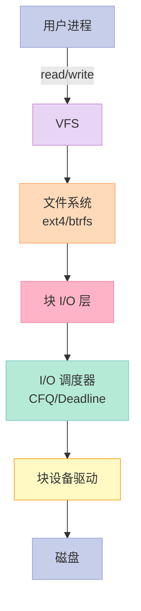

**块 I/O 的核心目标**：

1. **合并请求**——减少磁盘寻道
2. **排序请求**——按物理位置顺序
3. **缓存**——page cache 减少磁盘访问
4. **延迟调度**——提升吞吐量

---

## 一、`bio`：块 I/O 请求

### 1.1 bio 结构

```c
// include/linux/bio.h
struct bio {
    struct bio *bi_next;        // 请求链表
    struct block_device *bi_bdev; // 块设备
    unsigned int bi_opf;        // 操作标志（REQ_OP_READ/WRITE 等）
    unsigned short bi_flags;
    unsigned short bi_ioprio;
    void (*bi_end_io)(struct bio *); // 完成回调
    atomic_t __bi_remaining;    // 剩余引用
    struct bvec_iter bi_iter;   // 当前迭代器
    bio_end_io_t *bi_end_io;
    struct bio_vec *bi_io_vec;  // 数据段数组
    struct bio_set *bi_pool;
    struct bio_integrity_payload *bi_integrity;
    // ...
};
```

### 1.2 `bio_vec`：I/O 数据段

```c
struct bio_vec {
    struct page *bv_page;       // 页指针
    unsigned int bv_len;        // 长度
    unsigned int bv_offset;     // 页内偏移
};
```

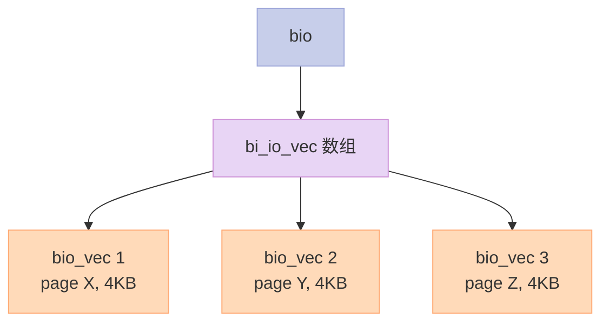

**关键点**：

- 一个 bio 可以包含多个 `bio_vec`（分散/聚集 I/O）
- 每个 `bio_vec` 引用一个 page（不复制数据）
- page cache 天然支持这种模式

### 1.3 bio 的"三段式"

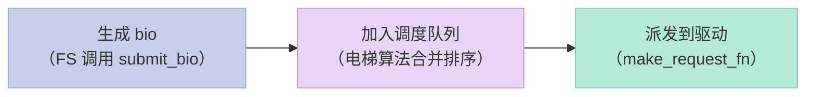

---

## 二、请求队列（Request Queue）

### 2.1 `request_queue`

```c
// include/linux/blkdev.h
struct request_queue {
    struct elevator_queue *elevator;  // 调度器
    struct request *last_merge;
    struct request *end_sector;
    // ...

    // 操作
    request_fn_proc *request_fn;       // 驱动回调
    make_request_fn *make_request_fn;  // 默认 bio → request
    prep_rq_fn *prep_rq_fn;
    softirq_done_fn *softirq_done_fn;
    // ...
};
```

### 2.2 request 结构

```c
struct request {
    struct request_queue *q;
    struct blk_cmd_nr cmd_flags;  // 操作类型
    sector_t sector;              // 起始扇区
    unsigned int nr_sectors;      // 扇区数
    unsigned int __data_len;
    unsigned short ioprio;
    struct bio *bio;              // 关联 bio
    struct bio *biotail;
    struct list_head queuelist;   // 链表节点
    struct rb_node rb_node;       // 红黑树节点
    // ...
};
```

---

## 三、I/O 调度器

### 3.1 调度器的作用

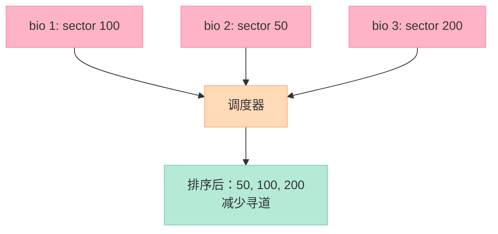

### 3.2 4 大调度器对比

| 调度器 | 算法 | 适用 | 特点 |
|--------|------|------|------|
| **noop** | 简单 FIFO | SSD、NVMe | 无开销 |
| **deadline** | 截止时间优先 | 数据库 | 防饥饿 |
| **cfq** | 完全公平队列 | 桌面 | 多任务公平（已废弃） |
| **bfq** | 预算公平队列 | 桌面、低延迟 | cfq 替代品 |

### 3.3 noop


**优点**：极简、零开销
**缺点**：不排序，磁头来回寻道
**适用**：SSD（无需排序，磁盘本身很快）

### 3.4 Deadline

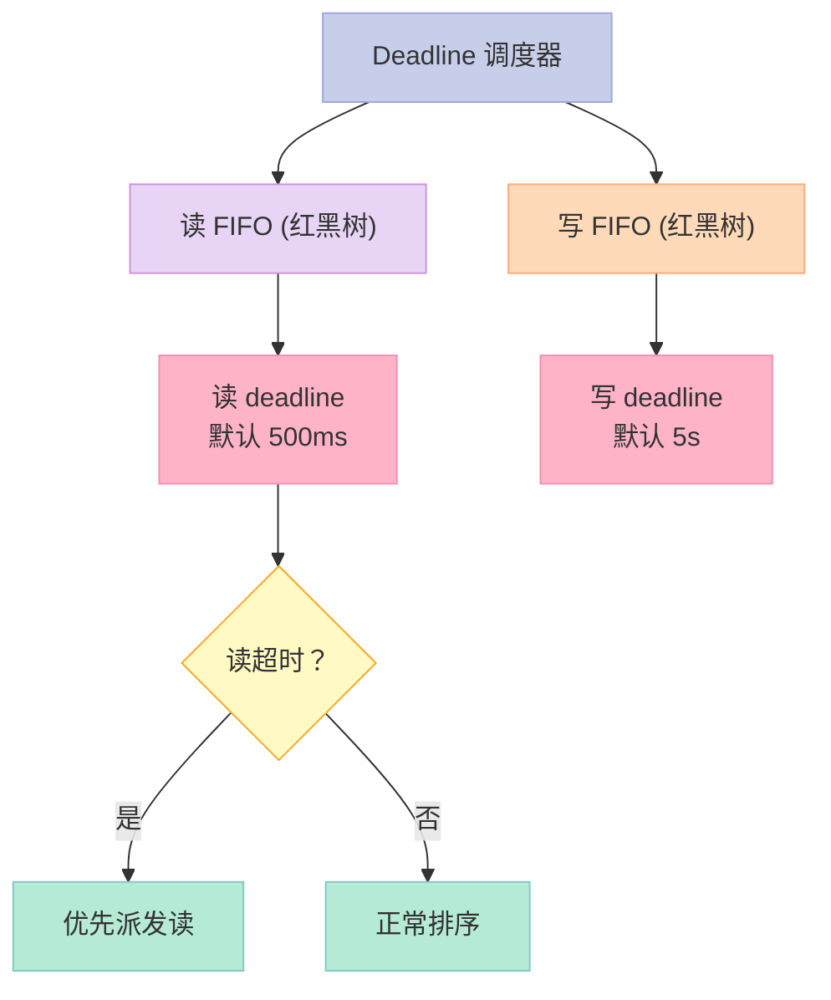

**优点**：保证读延迟（写饥饿时可让读优先）
**缺点**：吞吐量不如 CFQ
**适用**：数据库（读敏感）

### 3.5 CFQ（已废弃）/ BFQ

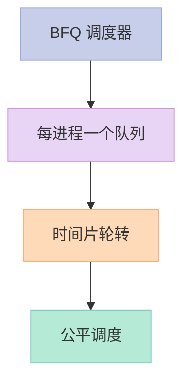

**优点**：公平、低延迟
**缺点**：复杂度高
**适用**：桌面、交互式系统

### 3.6 现代默认：mq-deadline + BFQ

Linux 5.x 后默认：

- **单队列设备**：BFQ
- **多队列设备**（NVMe）：mq-deadline / kyber

### 3.7 查看 / 修改调度器

```bash
# 查看
cat /sys/block/sda/queue/scheduler
# 输出：
# [mq-deadline] kyber bfq none

# 修改
echo "bfq" | sudo tee /sys/block/sda/queue/scheduler

# 持久化（grub）
elevator=bfq
```

---

## 四、Page Cache

### 4.1 Page Cache 的作用

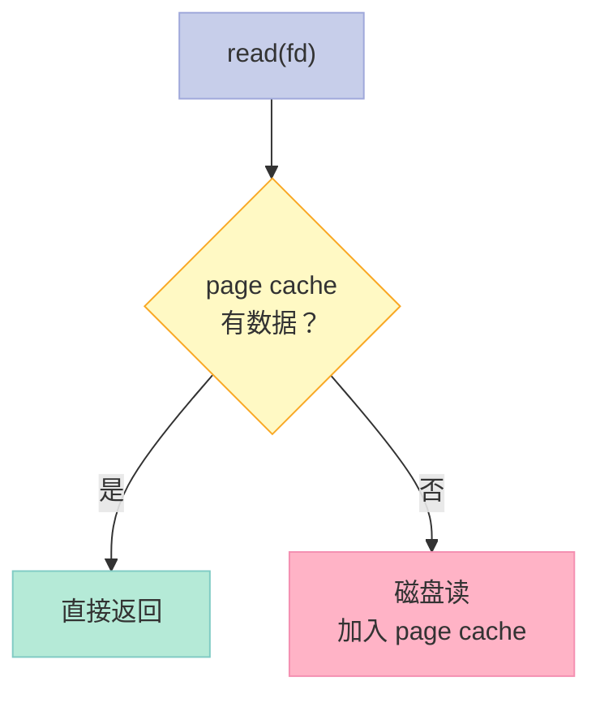

### 4.2 Page Cache 关键结构

```c
// include/linux/fs.h
struct address_space {
    struct inode *host;
    struct rb_root_cached i_mmap;  // 内存映射的红黑树
    struct rw_semaphore invalidate_lock;
    atomic_t i_mmap_readonly_count;
    struct list_head i_private_list;
    // ...
};

// include/linux/pagemap.h
struct page {
    struct address_space *mapping;  // 所属 address_space
    pgoff_t index;                  // 在 mapping 中的偏移
    // ...
};
```

### 4.3 Page Cache vs Buffer Cache

| 维度 | Page Cache | Buffer Cache |
|------|-----------|--------------|
| 单位 | 页 | 块（buffer_head） |
| 大小 | 4 KB | 512 字节 - 1 个块 |
| 用途 | 文件内容 | 块设备元数据 |
| 现状 | 主用 | 已弱化（VFS 层用） |

**Linux 2.4+ 合并**：buffer cache 由 page cache 统一管理。

### 4.4 关键启示

1. **Page Cache = 文件内容缓存**——基于页
2. **Buffer Cache = 块缓存**——Linux 2.4+ 弱化
3. **写回策略**：writeback（后台）+ fsync（强制）

---

## 五、I/O 流程（read）

### 5.1 完整 read 流程

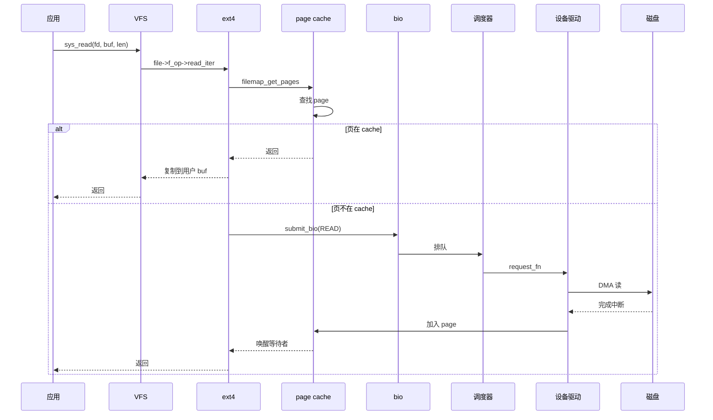

### 5.2 O_DIRECT（绕过 page cache）

```c
// 绕过 page cache 直接 I/O
int fd = open("file", O_RDONLY | O_DIRECT);
read(fd, buf, size);
```

**适用场景**：

- 自管理缓存的数据库
- 大文件顺序 I/O
- 不希望 page cache 污染

---

## 六、I/O 合并与排序

### 6.1 I/O 合并

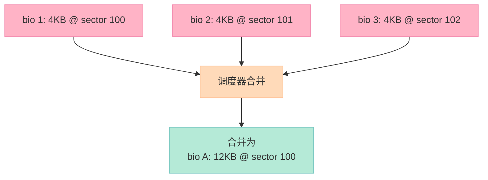

**合并策略**：

- **前向合并**：相邻 bio 合并
- **后向合并**：和正在处理的合并
- **跨 bio 合并**：多个 bio 合并

### 6.2 电梯算法

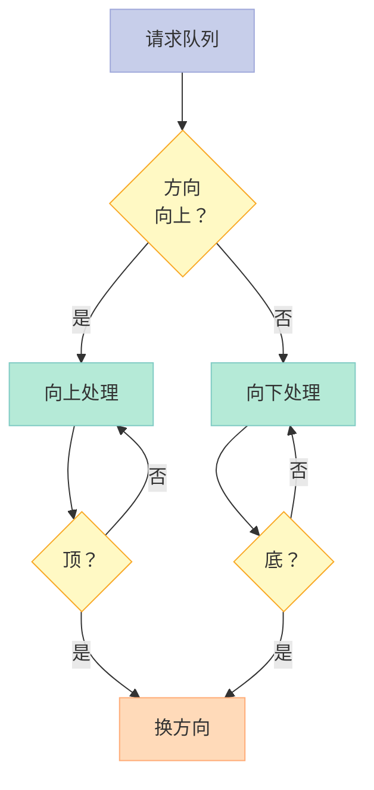

---

## 七、I/O 性能监控

### 7.1 关键指标

```bash
# iostat
iostat -x 1

# 输出：
# Device   r/s     w/s    rkB/s    wkB/s  ...  await  svctm  %util
# sda      0.50    2.00   20.00    100.00 ...  5.00   1.00   2.50
# nvme0n1  100.00  200.00 1024.00  2048.00 ... 0.50   0.10   3.00
```

**关键指标**：

- `await`：平均 I/O 延迟
- `%util`：设备利用率
- `r/s`、`w/s`：每秒读写次数

### 7.2 监控 page cache

```bash
# /proc/meminfo
cat /proc/meminfo | grep -E "Cached|Buffers"

# 输出：
# Cached:          4096000 kB
# Buffers:          512000 kB

# vmstat
vmstat 1

# 输出（关注 bi/bo）：
# procs ---memory--- ---swap-- ---io--- -system-- ...
#  r  b   swpd   free  buff  cache   si   so   bi   bo
#  0  0      0  2g    500m  4g      0    0   20  100
```

### 7.3 iotop

```bash
# 看哪个进程在 I/O
sudo iotop

# 输出：
# Total DISK READ:      0.00 B/s | Total DISK WRITE:     10.00 K/s
#   PID  PRIO  USER     DISK READ  DISK WRITE  COMMAND
#  1234 be/4 root       0.00 B/s   10.00 K/s  mysqld
```

---

## 八、面试高频考点

### 8.1 必背题

| 题目 | 答案要点 |
|------|----------|
| bio 是什么？ | 块 I/O 请求描述符 |
| 请求队列作用？ | 排序、合并 I/O |
| 4 大 I/O 调度器？ | noop / deadline / cfq / bfq |
| page cache 是什么？ | 文件内容内存缓存 |
| buffer cache 呢？ | 块缓存（已弱化） |
| O_DIRECT 何时用？ | 自管理缓存 / 大文件顺序 I/O |
| 何时用 noop？ | SSD（无寻道） |
| 何时用 deadline？ | 数据库（读敏感） |

### 8.2 高频追问

| 追问 | 关键点 |
|------|--------|
| I/O 合并如何工作？ | 前向/后向合并相邻 bio |
| 电梯算法？ | 单向扫描到底再换向 |
| 多队列设备？ | NVMe：每个 CPU 一个队列 |
| bio vs request？ | bio = 逻辑 I/O，request = 物理 I/O |
| 写回策略？ | writeback 后台 + fsync 强制 |
| 直通 I/O vs 普通 I/O？ | 绕 vs 不绕 page cache |

---

## 九、配套实验

### 9.1 实验 1：查看 I/O 调度器

```bash
# 当前调度器
cat /sys/block/sda/queue/scheduler

# 各设备的调度器
for d in /sys/block/*/queue/scheduler; do echo "$d: $(cat $d)"; done
```

### 9.2 实验 2：性能测试（dd）

```bash
# 顺序写测试
dd if=/dev/zero of=/tmp/test bs=1M count=1024 oflag=direct

# 输出：
# 1073741824 bytes (1.1 GB) copied, 5.123 s, 210 MB/s

# 顺序读测试
dd if=/tmp/test of=/dev/null bs=1M count=1024 iflag=direct

# 随机 I/O 测试（fio）
fio --name=randwrite --ioengine=libaio --direct=1 \
    --filename=/tmp/test --bs=4k --size=1G \
    --rw=randwrite --numjobs=4 --runtime=30
```

### 9.3 实验 3：观察 page cache 效果

```bash
# 清空 page cache
sync
echo 3 > /proc/sys/vm/drop_caches

# 第一次读（冷）
time dd if=/tmp/test of=/dev/null bs=1M count=1024
# 慢

# 第二次读（热）
time dd if=/tmp/test of=/dev/null bs=1M count=1024
# 快
```

### 9.4 实验 4：iostat 监控

```bash
# 实时监控
iostat -xmt 1

# 指定设备
iostat -xmt 1 sda
```

### 9.5 实验 5：blktrace 跟踪 I/O

```bash
# 1. 安装
sudo apt install blktrace

# 2. 跟踪
sudo blktrace -d /dev/sda -o trace &

# 3. 跑 I/O
dd if=/dev/sda of=/dev/null bs=1M count=100

# 4. 停止
sudo killall blktrace

# 5. 解析
blkparse trace.blktrace.* | head -30

# 6. 看延迟统计
btt -i trace.blktrace.*
```

### 9.6 实验 6：切换调度器

```bash
# 切换到 noop（SSD）
echo "noop" | sudo tee /sys/block/sda/queue/scheduler

# 切回 mq-deadline
echo "mq-deadline" | sudo tee /sys/block/sda/queue/scheduler

# 持久化（grub 启动参数）
# /etc/default/grub: GRUB_CMDLINE_LINUX="elevator=bfq"
```

---

## 十、回到 5 个核心要点

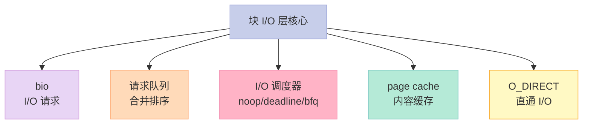

---

## 十一、结尾思考题

> **思考题 1**：你的 Linux 用什么调度器？为什么？

> **思考题 2**：对比 SSD 和 HDD，应该用哪个调度器？

> **思考题 3**：page cache 占用多少内存合适？怎么调整？

> **思考题 4**：`O_DIRECT` 在什么场景使用？和普通 I/O 性能差多少？

> **思考题 5**：用 `blktrace` 跟踪一次 dd，观察 I/O 合并和调度过程。

---

## 十二、本篇速查表

| 主题 | 关键点 | 内核文件 |
|------|--------|----------|
| bio | I/O 请求 | block/bio.c |
| request queue | 请求队列 | block/blk-core.c |
| I/O 调度器 | 合并排序 | block/ |
| noop | 简单 FIFO | block/mq-deadline.c |
| deadline | 截止时间 | block/mq-deadline.c |
| bfq | 公平队列 | block/bfq-iosched.c |
| page cache | 文件内容缓存 | mm/filemap.c |

---

## 十三、系列导航

| # | 文章 | 状态 |
|:--|:--|:--|
| 0 | [系列总览](/2026/06/18/linux-kernel-architecture-00-series-index/) | ✅ 已发布 |
| 1 | [内核架构总览 + 进程管理](/2026/06/18/linux-kernel-architecture-01-process-management/) | ✅ 已发布 |
| 2 | [进程地址空间](/2026/06/18/linux-kernel-architecture-02-process-address-space/) | ✅ 已发布 |
| 3 | [内存管理基础](/2026/06/18/linux-kernel-architecture-03-memory-management-basics/) | ✅ 已发布 |
| 4 | [内存分配器与回收](/2026/06/18/linux-kernel-architecture-04-memory-allocation/) | ✅ 已发布 |
| 5 | [虚拟文件系统 VFS](/2026/06/18/linux-kernel-architecture-05-vfs/) | ✅ 已发布 |
| 6 | [Ext 文件系统族](/2026/06/18/linux-kernel-architecture-06-ext-filesystem/) | ✅ 已发布 |
| 7 | **本文：块 I/O 层** | ✅ 已发布 |
| 8 | [设备驱动 + 网络栈](/2026/06/18/linux-kernel-architecture-08-drivers-network/) | 🔜 计划中 |
| 9 | [内核同步 + 定时器](/2026/06/18/linux-kernel-architecture-09-synchronization-timers/) | 🔜 计划中 |
| 10 | [中断下半部 + 模块](/2026/06/18/linux-kernel-architecture-10-interrupts-modules/) | 🔜 计划中 |
| 11 | [内核启动 + 附录速查](/2026/06/18/linux-kernel-architecture-11-boot-appendix/) | 🔜 计划中 |

---

**下一篇**：第 8 篇《设备驱动 + 网络栈》——字符设备 / 块设备 / 网络设备驱动模型、kobject / sysfs、socket 通信、TCP/IP、netfilter。

> **行动建议**：
> 1. **看 `cat /sys/block/sda/queue/scheduler`**——理解你的调度器
> 2. **用 iostat**——观察 I/O 性能
> 3. **测试 dd + page cache**——理解缓存效果
> 4. **用 fio**——做性能基准测试
> 5. **用 blktrace**——深入跟踪 I/O
