> **一句话核心结论**：**设备驱动模型**（kobject / device / driver / bus）是 Linux 驱动开发的"基础设施"——**网络栈**（socket / TCP/IP / netfilter）是 Linux 最复杂的子系统——通过分层设计处理 TCP/IP、路由、防火墙。

---

## 系列导航

| # | 文章 | 状态 |
|:--|:--|:--|
| 0 | [系列总览](/2026/06/18/linux-kernel-architecture-00-series-index/) | ✅ 已发布 |
| 1 | [内核架构总览 + 进程管理](/2026/06/18/linux-kernel-architecture-01-process-management/) | ✅ 已发布 |
| 2 | [进程地址空间](/2026/06/18/linux-kernel-architecture-02-process-address-space/) | ✅ 已发布 |
| 3 | [内存管理基础](/2026/06/18/linux-kernel-architecture-03-memory-management-basics/) | ✅ 已发布 |
| 4 | [内存分配器与回收](/2026/06/18/linux-kernel-architecture-04-memory-allocation/) | ✅ 已发布 |
| 5 | [虚拟文件系统 VFS](/2026/06/18/linux-kernel-architecture-05-vfs/) | ✅ 已发布 |
| 6 | [Ext 文件系统族](/2026/06/18/linux-kernel-architecture-06-ext-filesystem/) | ✅ 已发布 |
| 7 | [块 I/O 层](/2026/06/18/linux-kernel-architecture-07-block-io/) | ✅ 已发布 |
| 8 | **本文：设备驱动 + 网络栈** | ✅ 已发布 |
| 9 | [内核同步 + 定时器](/2026/06/18/linux-kernel-architecture-09-synchronization-timers/) | 🔜 计划中 |
| 10 | [中断下半部 + 模块](/2026/06/18/linux-kernel-architecture-10-interrupts-modules/) | 🔜 计划中 |
| 11 | [内核启动 + 附录速查](/2026/06/18/linux-kernel-architecture-11-boot-appendix/) | 🔜 计划中 |

---

## 前言：内核的两大子系统

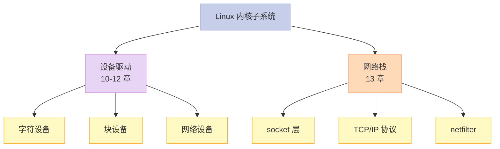

---

## 一、第 10 章：设备驱动程序

### 1.1 Linux 设备分类

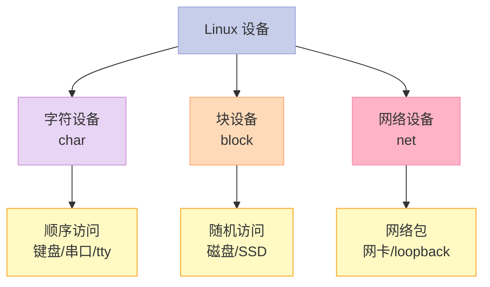

### 1.2 设备驱动模型（核心）

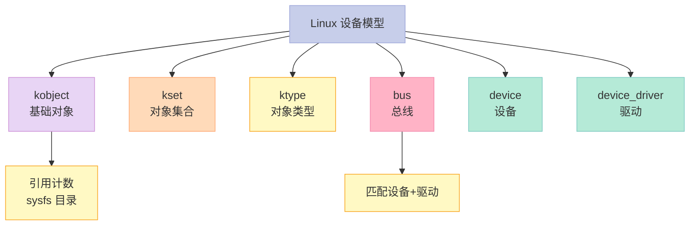

### 1.3 `kobject` 核心结构

```c
// include/linux/kobject.h
struct kobject {
    const char *name;           // 在 sysfs 中的名字
    struct list_head entry;     // kset 链表
    struct kobject *parent;     // 父对象
    struct kset *kset;          // 所属 kset
    struct kobj_type *ktype;    // 类型
    struct kernfs_node *sd;     // sysfs 目录项
    struct kref kref;           // 引用计数
    // ...
};
```

**kobject 的作用**：

- 所有内核对象的基类
- 提供引用计数
- 在 sysfs 中创建目录

### 1.4 `kset` vs `ktype`

```c
struct kset {
    struct list_head list;       // kobject 链表
    spinlock_t list_lock;
    struct kobject kobj;         // 自身也是一个 kobject
    const struct kset_uevent_ops *uevent_ops;
};

struct kobj_type {
    void (*release)(struct kobject *kobj);
    const struct sysfs_ops *sysfs_ops;
    const struct attribute_group **default_groups;
    const struct kobj_ns_type_operations *namespace;
};
```

### 1.5 `bus` / `device` / `driver`

```c
struct bus_type {
    const char *name;
    const char *dev_name;
    struct device *dev_root;
    // ...
    int (*match)(struct device *dev, struct device_driver *drv);
    int (*probe)(struct device *dev);
    int (*remove)(struct device *dev);
    // ...
};

struct device {
    struct kobject kobj;        // 继承 kobject
    struct bus_type *bus;
    struct device_driver *driver;
    void *driver_data;
    // ...
};

struct device_driver {
    const char *name;
    struct bus_type *bus;
    struct module *owner;
    // ...
    int (*probe)(struct device *dev);
    int (*remove)(struct device *dev);
    // ...
};
```

### 1.6 设备模型的关系

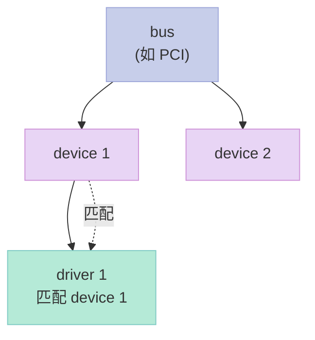

**匹配流程**：

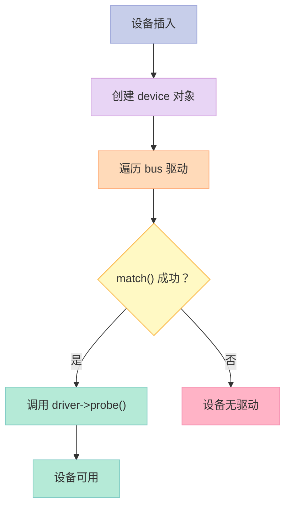

### 1.7 sysfs：内核到用户态的接口

```bash
# 查看 sysfs
ls /sys/

# 主要子目录
/sys/bus/         # 总线
/sys/devices/     # 设备
/sys/class/       # 设备类（按功能分类）
/sys/block/       # 块设备
/sys/kernel/      # 内核对象
```

```bash
# 看一个块设备
ls /sys/block/sda/
# alignment_offset  bdi  capability  dev  device  events  ...
# holders  inflight  integrity  power  queue  range  removable  ro  size  slaves  stat  subsystem  trace  uevent

# 看磁盘大小
cat /sys/block/sda/size
# 209715200
```

### 1.8 关键启示

1. **kobject 是基础**——所有内核对象的基类
2. **bus / device / driver**——驱动模型核心
3. **sysfs**——内核对象到用户态的接口
4. **probe() 是核心**——设备和驱动匹配的入口

---

## 二、字符设备驱动

### 2.1 字符设备 API

```c
// 1. 分配主设备号
alloc_chrdev_region(&devno, 0, 1, "mychardev");

// 2. 初始化
cdev_init(&my_cdev, &fops);
my_cdev.owner = THIS_MODULE;

// 3. 添加
cdev_add(&my_cdev, devno, 1);

// 4. 自动创建设备文件
class_create(THIS_MODULE, "myclass");
device_create(my_class, NULL, devno, NULL, "mychardev");
```

### 2.2 file_operations

```c
static struct file_operations my_fops = {
    .owner   = THIS_MODULE,
    .open    = my_open,
    .release = my_close,
    .read    = my_read,
    .write   = my_write,
    .unlocked_ioctl = my_ioctl,
};

static int my_open(struct inode *inode, struct file *filp) {
    printk("my_open\n");
    return 0;
}

static ssize_t my_read(struct file *filp, char __user *buf,
                       size_t count, loff_t *ppos) {
    char msg[] = "Hello from kernel!\n";
    int len = min(count, sizeof(msg));
    if (copy_to_user(buf, msg, len)) return -EFAULT;
    return len;
}
```

### 2.3 关键启示

1. **字符设备** = 顺序字节流
2. **`file_operations`** 定义设备行为
3. **`cdev` + 主次设备号** 注册到内核

---

## 三、块设备驱动

### 3.1 块设备 API

```c
// 1. 分配 gendisk
struct gendisk *disk = alloc_disk(1);

// 2. 设置队列
disk->queue = blk_init_queue(my_request_fn, &my_lock);

// 3. 设置其他属性
disk->major = my_major;
disk->first_minor = 0;
disk->fops = &my_block_fops;
set_capacity(disk, size_in_sectors);

// 4. 注册
add_disk(disk);
```

### 3.2 关键启示

1. **块设备** = 随机访问块（512/4096 字节）
2. **`gendisk` + `request_queue`** 注册
3. **现代方式**：bio + 多队列

---

## 四、网络设备驱动

### 4.1 net_device 结构

```c
struct net_device {
    char name[IFNAMSIZ];        // 设备名 (eth0)
    struct net_device_stats stats;
    const struct net_device_ops *netdev_ops;
    unsigned long state;
    struct net *nd_net;          // 网络命名空间
    // ...
};
```

### 4.2 net_device_ops

```c
static const struct net_device_ops my_netdev_ops = {
    .ndo_open       = my_open,
    .ndo_stop       = my_stop,
    .ndo_start_xmit = my_start_xmit,
    .ndo_get_stats  = my_get_stats,
    .ndo_set_mac_address = my_set_mac,
};

static netdev_tx_t my_start_xmit(struct sk_buff *skb,
                                  struct net_device *dev) {
    // 发送数据包
    // ...
    return NETDEV_TX_OK;
}
```

### 4.3 接收数据包

```c
// 中断中收到包
static irqreturn_t my_interrupt(int irq, void *dev_id) {
    struct net_device *dev = dev_id;
    struct sk_buff *skb;

    // 1. 分配 skb
    skb = dev_alloc_skb(len + 2);
    skb_reserve(skb, 2);

    // 2. 复制数据
    memcpy(skb_put(skb, len), data, len);

    // 3. 设置协议
    skb->dev = dev;
    skb->protocol = eth_type_trans(skb, dev);

    // 4. 提交网络栈
    netif_rx(skb);

    return IRQ_HANDLED;
}
```

### 4.4 关键启示

1. **net_device**——网络设备核心结构
2. **net_device_ops**——设备操作
3. **sk_buff**——网络包的核心数据结构

---

## 五、第 13 章：网络栈

### 5.1 网络栈分层

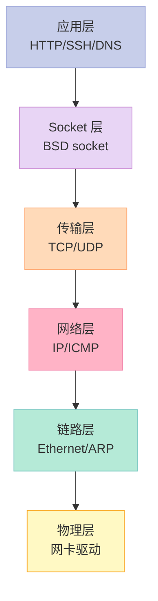

### 5.2 `sk_buff`：网络包核心

```c
// include/linux/skbuff.h
struct sk_buff {
    struct sk_buff *next;
    struct sk_buff *prev;

    struct sock *sk;             // 所属 socket
    struct net_device *dev;      // 设备

    unsigned int len;            // 数据总长
    unsigned int data_len;       // 分片长度
    unsigned short protocol;     // 上层协议
    __u16 transport_header;
    __u16 network_header;
    __u16 mac_header;

    void *head, *data, *tail, *end;  // skb 内的指针

    // ...
};
```

### 5.3 sk_buff 内部布局


**关键操作**：

```c
// 头部预留
skb_reserve(skb, headroom);

// 添加数据
skb_put(skb, len);     // tail += len

// 移除数据
skb_pull(skb, len);    // data += len（去掉头）

// 克隆
skb_clone(skb);        // 浅拷贝

// 复制
skb_copy(skb);         // 深拷贝
```

### 5.4 TCP/IP 数据包发送

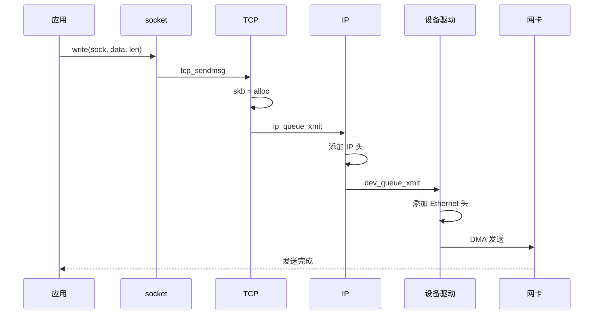

### 5.5 TCP/IP 数据包接收

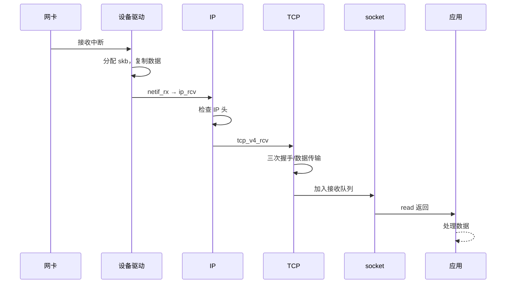

### 5.6 TCP 三次握手

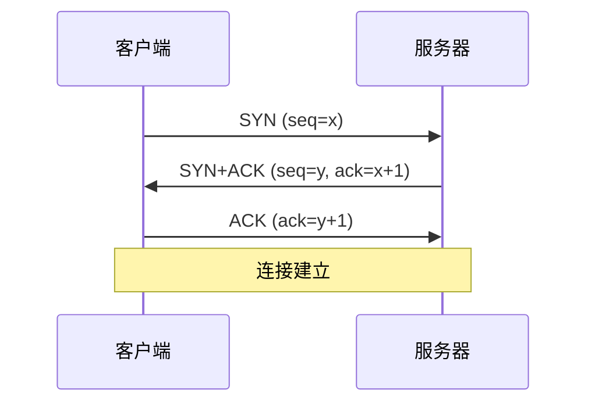

### 5.7 关键启示

1. **网络栈分层**——Socket / TCP / IP / 驱动
2. **`sk_buff`**——包的核心，零拷贝的关键
3. **TCP 三次握手**——建立可靠连接

---

## 六、Netfilter 框架

### 6.1 Netfilter 5 个钩子点

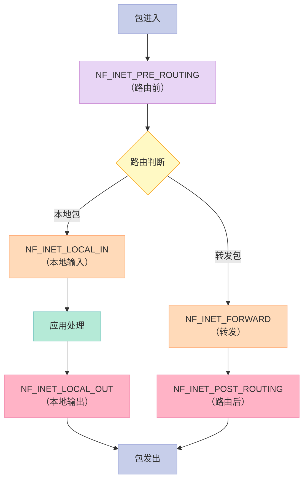

### 6.2 钩子函数

```c
unsigned int my_hook(void *priv, struct sk_buff *skb,
                     const struct nf_hook_state *state) {
    // 接受 / 丢弃 / 排队
    return NF_ACCEPT;  // NF_DROP / NF_QUEUE / NF_STOLEN
}

// 注册
static struct nf_hook_ops my_nfho = {
    .hook     = my_hook,
    .pf       = NFPROTO_IPV4,
    .hooknum  = NF_INET_PRE_ROUTING,
    .priority = NF_IP_PRI_FIRST,
};
nf_register_net_hook(&init_net, &my_nfho);
```

### 6.3 iptables（基于 netfilter）

```bash
# 查看规则
sudo iptables -L -n

# 允许 SSH
sudo iptables -A INPUT -p tcp --dport 22 -j ACCEPT

# 拒绝其他
sudo iptables -A INPUT -j DROP
```

### 6.4 关键启示

1. **5 个钩子点**——数据包生命周期的关键点
2. **netfilter**——防火墙 / NAT 的基础
3. **iptables / nftables**——用户态配置工具

---

## 七、Tty 驱动（第 11 章）

### 7.1 Tty 层次结构

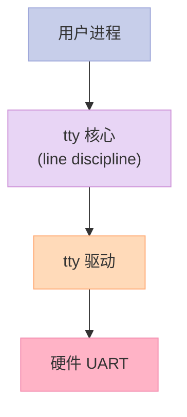

### 7.2 Line Discipline（行规则）

- **N_TTY**：标准终端（编辑、回显、控制字符）
- **N_PPP**：PPP 协议
- **N_HDLC**：HDLC 帧

### 7.3 关键启示

1. **tty = 终端设备**——串口、控制台
2. **行规则** = 处理输入/输出字符
3. **串口驱动** = 经典字符设备

---

## 八、面试高频考点

### 8.1 必背题

| 题目 | 答案要点 |
|------|----------|
| Linux 设备分类？ | 字符 / 块 / 网络 |
| kobject 是什么？ | 内核对象基类 |
| sysfs 作用？ | 内核对象到用户态 |
| sk_buff 是什么？ | 网络包核心数据结构 |
| TCP 三次握手？ | SYN → SYN+ACK → ACK |
| netfilter 钩子？ | PRE_ROUTING / LOCAL_IN / FORWARD / LOCAL_OUT / POST_ROUTING |
| iptables 链？ | PREROUTING / INPUT / FORWARD / OUTPUT / POSTROUTING |
| socket 类型？ | SOCK_STREAM（TCP）/ SOCK_DGRAM（UDP） |

### 8.2 高频追问

| 追问 | 关键点 |
|------|--------|
| probe() vs init()？ | 总线匹配 vs 手动注册 |
| 网络包零拷贝？ | sk_buff 共享页 |
| TCP vs UDP？ | 面向连接 vs 无连接 |
| iptables 表？ | filter / nat / mangle / raw |
| 网络命名空间？ | 容器网络隔离 |
| 字符设备和文件？ | 文件操作符映射到字符设备 |

---

## 九、配套实验

### 9.1 实验 1：查看设备

```bash
# 所有设备
ls /sys/devices/

# PCI 设备
lspci

# USB 设备
lsusb

# 块设备
lsblk

# 网络设备
ip link
```

### 9.2 实验 2：写一个字符设备

```c
// 文件：hello_chardev.c
#include <linux/module.h>
#include <linux/fs.h>
#include <linux/cdev.h>
#include <linux/uaccess.h>

#define DEVICE_NAME "hello_chardev"
static dev_t devno;
static struct cdev my_cdev;

static int my_open(struct inode *inode, struct file *filp) {
    printk(KERN_INFO "hello_chardev opened\n");
    return 0;
}

static ssize_t my_read(struct file *filp, char __user *buf,
                       size_t count, loff_t *ppos) {
    char msg[] = "Hello from kernel!\n";
    int len = min(count, sizeof(msg));
    if (copy_to_user(buf, msg, len)) return -EFAULT;
    return len;
}

static struct file_operations fops = {
    .owner = THIS_MODULE,
    .open  = my_open,
    .read  = my_read,
};

static int __init my_init(void) {
    alloc_chrdev_region(&devno, 0, 1, DEVICE_NAME);
    cdev_init(&my_cdev, &fops);
    cdev_add(&my_cdev, devno, 1);
    printk(KERN_INFO "hello_chardev loaded: %d\n", MAJOR(devno));
    return 0;
}

static void __exit my_exit(void) {
    cdev_del(&my_cdev);
    unregister_chrdev_region(devno, 1);
}

module_init(my_init);
module_exit(my_exit);
MODULE_LICENSE("GPL");
```

```bash
# Makefile
obj-m += hello_chardev.o

all:
    make -C /lib/modules/$(shell uname -r)/build M=$(PWD) modules

clean:
    make -C /lib/modules/$(shell uname -r)/build M=$(PWD) clean
```

```bash
# 编译 + 加载
make
sudo insmod hello_chardev.ko
dmesg | tail
sudo mknod /dev/hello_chardev c <major> 0
sudo chmod 666 /dev/hello_chardev
cat /dev/hello_chardev  # "Hello from kernel!"
sudo rmmod hello_chardev
```

### 9.3 实验 3：查看网络栈

```bash
# 网络接口
ip addr show

# 路由
ip route show

# 套接字统计
ss -s

# TCP 连接
ss -tan

# 抓包
sudo tcpdump -i any -n port 80
```

### 9.4 实验 4：跟踪系统调用

```bash
# strace 跟踪网络调用
strace -e trace=network curl http://example.com

# 输出：
# socket(AF_INET, SOCK_STREAM, IPPROTO_TCP) = 3
# connect(3, {sa_family=AF_INET, sin_port=htons(80), sin_addr=inet_addr("93.184.216.34")}, 16) = 0
# sendto(3, "GET / HTTP/1.0\r\n\r\n", 18, 0, NULL, 0) = 18
# recvfrom(3, "HTTP/1.0 200 OK\r\n...", 4096, 0, NULL, NULL) = 1234
```

### 9.5 实验 5：iptables 试验

```bash
# 添加一条规则
sudo iptables -A INPUT -p tcp --dport 22 -j ACCEPT

# 查看
sudo iptables -L -n -v

# 测试：阻止某个 IP
sudo iptables -I INPUT -s 192.168.1.100 -j DROP

# 删除
sudo iptables -D INPUT -s 192.168.1.100 -j DROP
```

### 9.6 实验 6：netstat / ss

```bash
# 旧版
netstat -tan

# 新版（更快）
ss -tan

# 详细
ss -tanp
```

---

## 十、回到 5 个核心要点

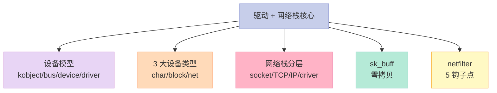

---

## 十一、结尾思考题

> **思考题 1**：写一个字符设备驱动，实现 read/write 接口。

> **思考题 2**：用 `strace` 跟踪 `curl http://example.com`，列出网络栈调用链。

> **思考题 3**：`sk_buff` 怎么实现零拷贝？页缓存怎么利用？

> **思考题 4**：iptables 和 nftables 的关系？哪个更好？

> **思考题 5**：写一个 netfilter 模块，丢弃特定端口的包。

---

## 十二、本篇速查表

| 主题 | 关键点 | 内核文件 |
|------|--------|----------|
| 设备模型 | kobject/bus/driver | drivers/base/ |
| 字符设备 | cdev + fops | drivers/char/ |
| 块设备 | gendisk + queue | drivers/block/ |
| 网络设备 | net_device + ops | drivers/net/ |
| socket | BSD socket | net/socket.c |
| TCP | 协议实现 | net/ipv4/tcp*.c |
| IP | 协议实现 | net/ipv4/ip_input.c |
| netfilter | 5 钩子 | net/netfilter/ |

---

## 十三、系列导航

| # | 文章 | 状态 |
|:--|:--|:--|
| 0 | [系列总览](/2026/06/18/linux-kernel-architecture-00-series-index/) | ✅ 已发布 |
| 1 | [内核架构总览 + 进程管理](/2026/06/18/linux-kernel-architecture-01-process-management/) | ✅ 已发布 |
| 2 | [进程地址空间](/2026/06/18/linux-kernel-architecture-02-process-address-space/) | ✅ 已发布 |
| 3 | [内存管理基础](/2026/06/18/linux-kernel-architecture-03-memory-management-basics/) | ✅ 已发布 |
| 4 | [内存分配器与回收](/2026/06/18/linux-kernel-architecture-04-memory-allocation/) | ✅ 已发布 |
| 5 | [虚拟文件系统 VFS](/2026/06/18/linux-kernel-architecture-05-vfs/) | ✅ 已发布 |
| 6 | [Ext 文件系统族](/2026/06/18/linux-kernel-architecture-06-ext-filesystem/) | ✅ 已发布 |
| 7 | [块 I/O 层](/2026/06/18/linux-kernel-architecture-07-block-io/) | ✅ 已发布 |
| 8 | **本文：设备驱动 + 网络栈** | ✅ 已发布 |
| 9 | [内核同步 + 定时器](/2026/06/18/linux-kernel-architecture-09-synchronization-timers/) | 🔜 计划中 |
| 10 | [中断下半部 + 模块](/2026/06/18/linux-kernel-architecture-10-interrupts-modules/) | 🔜 计划中 |
| 11 | [内核启动 + 附录速查](/2026/06/18/linux-kernel-architecture-11-boot-appendix/) | 🔜 计划中 |

---

**下一篇**：第 9 篇《内核同步 + 定时器》——自旋锁、信号量、RCU、原子操作、jiffies、定时器、时钟中断。

> **行动建议**：
> 1. **写一个字符设备**——动手实践
> 2. **用 strace + tcpdump**——跟踪网络包
> 3. **玩 iptables**——理解 netfilter
> 4. **看 `/sys/devices/`**——理解设备模型
> 5. **读 `drivers/char/mem.c`**——最简单的字符设备
