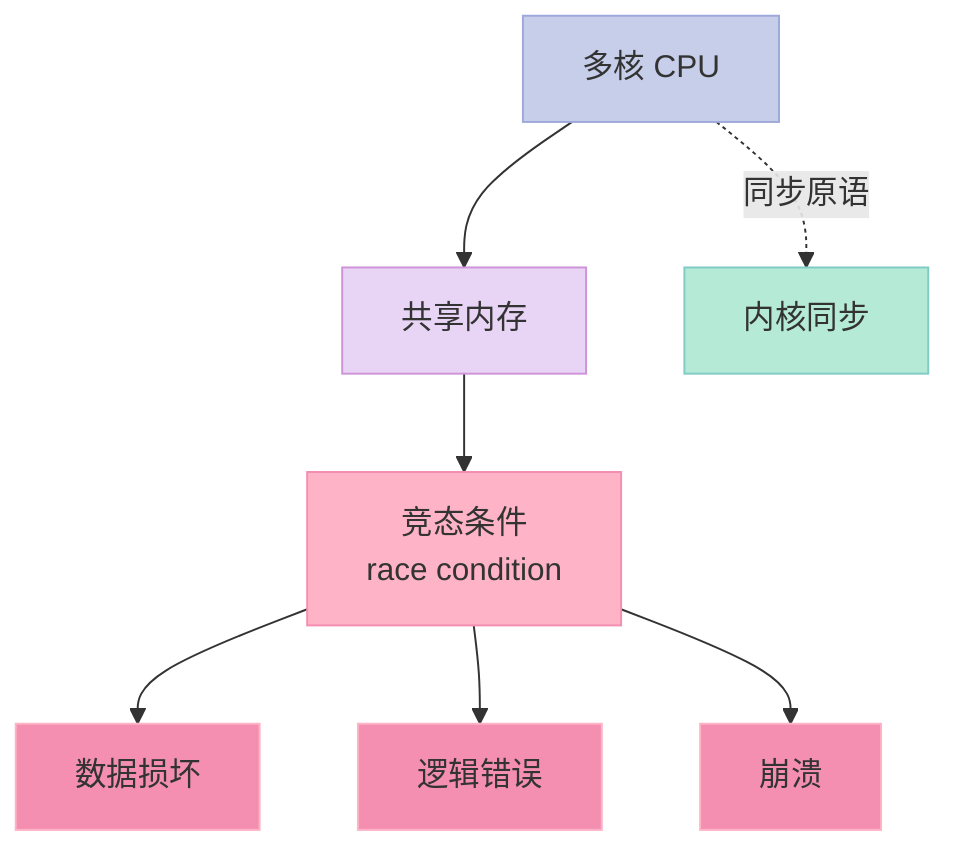
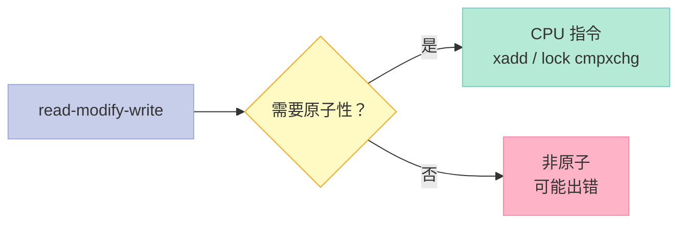
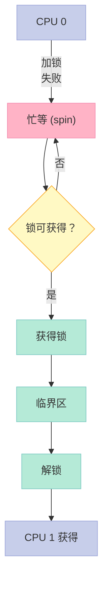
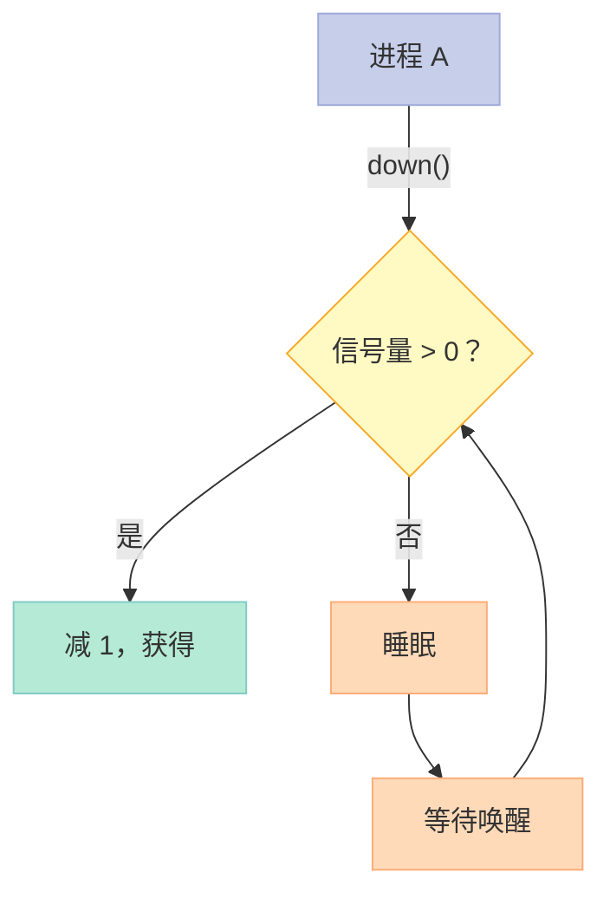
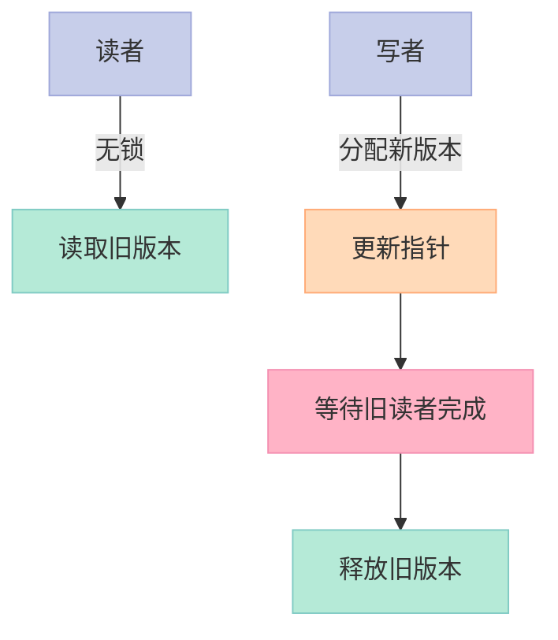
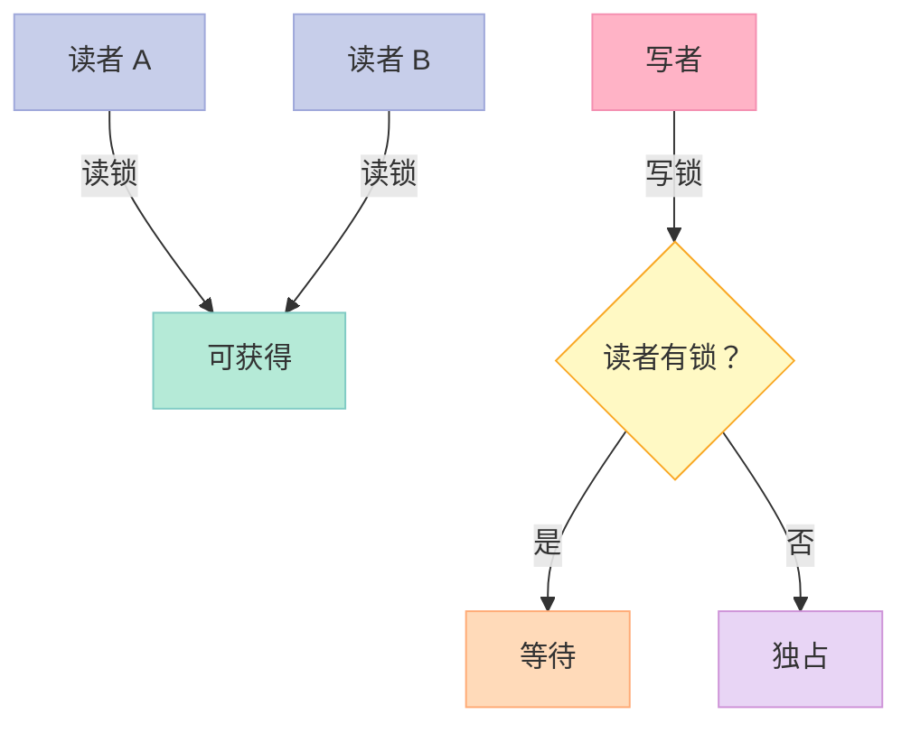
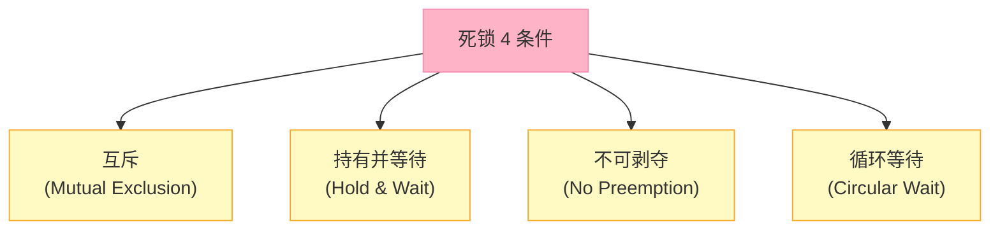
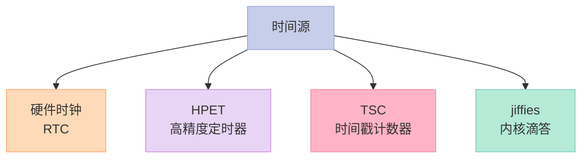
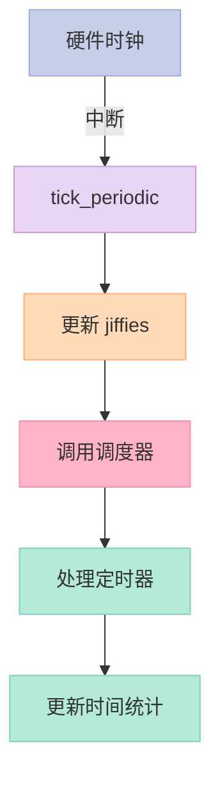
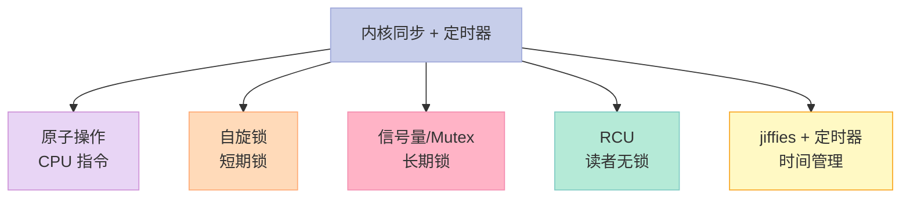

> **一句话核心结论**：内核同步的"4 大武器"——**原子操作**（CPU 指令保证）、**自旋锁**（短期锁，忙等）、**信号量**（长期锁，可睡眠）、**RCU**（读者无锁，写者复制）。**定时器**基于 jiffies + 时钟中断，是内核"时间"的来源。

---

## 系列导航

| # | 文章 | 状态 |
|:--|:--|:--|
| 0 | [系列总览](/2026/06/18/linux-kernel-architecture-00-series-index/) | ✅ 已发布 |
| 1 | [内核架构总览 + 进程管理](/2026/06/18/linux-kernel-architecture-01-process-management/) | ✅ 已发布 |
| 2 | [进程地址空间](/2026/06/18/linux-kernel-architecture-02-process-address-space/) | ✅ 已发布 |
| 3 | [内存管理基础](/2026/06/18/linux-kernel-architecture-03-memory-management-basics/) | ✅ 已发布 |
| 4 | [内存分配器与回收](/2026/06/18/linux-kernel-architecture-04-memory-allocation/) | ✅ 已发布 |
| 5 | [虚拟文件系统 VFS](/2026/06/18/linux-kernel-architecture-05-vfs/) | ✅ 已发布 |
| 6 | [Ext 文件系统族](/2026/06/18/linux-kernel-architecture-06-ext-filesystem/) | ✅ 已发布 |
| 7 | [块 I/O 层](/2026/06/18/linux-kernel-architecture-07-block-io/) | ✅ 已发布 |
| 8 | [设备驱动 + 网络栈](/2026/06/18/linux-kernel-architecture-08-drivers-network/) | ✅ 已发布 |
| 9 | **本文：内核同步 + 定时器** | ✅ 已发布 |
| 10 | [中断下半部 + 模块](/2026/06/18/linux-kernel-architecture-10-interrupts-modules/) | 🔜 计划中 |
| 11 | [内核启动 + 附录速查](/2026/06/18/linux-kernel-architecture-11-boot-appendix/) | 🔜 计划中 |

---

## 前言：为什么内核需要同步？



**同步的 3 个核心问题**：

1. **竞态条件**——多个执行流同时访问共享数据
2. **死锁**——互相等待对方持有的资源
3. **内存屏障**——CPU/编译器重排

---

## 一、原子操作

### 1.1 什么是原子操作？

```c
// 整数原子操作
atomic_t v = ATOMIC_INIT(0);
atomic_inc(&v);
atomic_dec(&v);
atomic_add(5, &v);
atomic_read(&v);
atomic_set(&v, 100);

// 位原子操作（Linux 4.x 起）
void set_bit(int nr, volatile unsigned long *addr);
void clear_bit(int nr, volatile unsigned long *addr);
int test_and_set_bit(int nr, volatile unsigned long *addr);
int test_and_clear_bit(int nr, volatile unsigned long *addr);
```

### 1.2 原子性的实现



**x86 原子指令**：

- `LOCK` 前缀
- `XADD`：原子交换 + 加
- `CMPXCHG`：原子比较交换

### 1.3 关键启示

1. **原子操作 = CPU 指令保证**
2. **轻量**——无锁
3. **适合计数器、标志位**

---

## 二、自旋锁（Spin Lock）

### 2.1 原理



### 2.2 自旋锁 API

```c
#include <linux/spinlock.h>

DEFINE_SPINLOCK(my_lock);
spinlock_t my_lock;

unsigned long flags;

// 进程上下文
spin_lock(&my_lock);
// 临界区
spin_unlock(&my_lock);

// 中断上下文（禁用中断）
spin_lock_irqsave(&my_lock, flags);
// ...
spin_unlock_irqrestore(&my_lock, flags);

// 中断上下文（已知中断状态）
spin_lock_irq(&my_lock);
// ...
spin_unlock_irq(&my_lock);

// bh 上下文（禁用软中断）
spin_lock_bh(&my_lock);
// ...
spin_unlock_bh(&my_lock);
```

### 2.3 自旋锁 vs 信号量

| 维度 | 自旋锁 | 信号量 |
|------|--------|--------|
| 等待方式 | 忙等 | 睡眠 |
| 适用上下文 | 不可睡眠 | 可睡眠 |
| 临界区时长 | 短 | 长 |
| 持有者 | 中断可打断 | 中断不可打断 |
| 优先级反转 | 可能 | 可能 |

### 2.4 关键启示

1. **自旋锁 = 忙等锁**——短期临界区
2. **可在中断上下文**——不能用睡眠
3. **`spin_lock_irqsave`**——同时禁用中断

---

## 三、信号量（Semaphore）

### 3.1 原理



### 3.2 信号量 API

```c
#include <linux/semaphore.h>

struct semaphore sem;
sema_init(&sem, 1);  // 初始计数 1（互斥）

// P 操作（等待）
down(&sem);          // 不可中断
down_interruptible(&sem);  // 可被信号打断
down_trylock(&sem);  // 非阻塞

// V 操作（释放）
up(&sem);
```

### 3.3 互斥锁（Mutex）

```c
#include <linux/mutex.h>

struct mutex my_mutex;
mutex_init(&my_mutex);

mutex_lock(&my_mutex);
// 临界区（可睡眠）
mutex_unlock(&my_mutex);

mutex_trylock(&my_mutex);  // 非阻塞
```

**Mutex vs 信号量**：

- Mutex：默认 1 个持有者（更强）
- 信号量：N 个持有者（计数）

### 3.4 关键启示

1. **信号量 = 睡眠锁**——长期临界区
2. **Mutex 替代信号量**——更严格
3. **不能用于中断上下文**

---

## 四、RCU（Read-Copy-Update）

### 4.1 RCU 的思想



### 4.2 RCU API

```c
#include <linux/rcupdate.h>

// 读侧
rcu_read_lock();
p = rcu_dereference(global_ptr);
// 读 p
rcu_read_unlock();

// 写侧
new_ptr = kmalloc(...);
*new_ptr = ...;
rcu_assign_pointer(global_ptr, new_ptr);
synchronize_rcu();  // 等待所有读者完成
kfree(old_ptr);     // 释放旧版本
```

### 4.3 RCU 的优势

| 场景 | 自旋锁 | RCU |
|------|--------|-----|
| 读多写少 | 慢（每次加锁） | 快（无锁） |
| 写多读少 | 差不多 | 慢（写者开销大） |
| 实时性 | 差（可睡眠） | 好（读者确定） |

### 4.4 关键启示

1. **RCU = 读者无锁**——读多写少场景
2. **写者开销大**——分配 + 等待 + 释放
3. **链表删除的标准做法**

---

## 五、读写锁

### 5.1 读写锁原理



### 5.2 读写锁 API

```c
#include <linux/rwlock.h>

DEFINE_RWLOCK(my_rwlock);

// 读者
read_lock(&my_rwlock);
// 读操作
read_unlock(&my_rwlock);

// 写者
write_lock(&my_rwlock);
// 写操作
write_unlock(&my_rwlock);
```

### 5.3 关键启示

1. **读共享 / 写独占**
2. **适用于读多写少**
3. **RCU 更优**——读侧完全无锁

---

## 六、其他同步原语

### 6.1 Seqlock

```c
#include <linux/seqlock.h>

DEFINE_SEQLOCK(my_seqlock);

// 读者
unsigned int seq;
do {
    seq = read_seqbegin(&my_seqlock);
    // 读数据
} while (read_seqretry(&my_seqlock, seq));

// 写者
write_seqlock(&my_seqlock);
// 写数据
write_sequnlock(&my_seqlock);
```

**适用**：写少读多 + 写者要求及时

### 6.2 Per-CPU 变量

```c
#include <linux/percpu.h>

DEFINE_PER_CPU(int, my_counter);

// 访问
int *p = this_cpu_ptr(&my_counter);
*p = 100;
```

**优势**：无锁（每个 CPU 独立）

### 6.3 完成量（Completion）

```c
#include <linux/completion.h>

DECLARE_COMPLETION(my_comp);

// 等待者
wait_for_completion(&my_comp);

// 完成者
complete(&my_comp);
```

**适用**：进程间同步

### 6.4 内存屏障

```c
#include <linux/compiler.h>

// 通用屏障
barrier();

// 读屏障（防止读重排）
rmb();

// 写屏障
wmb();

// 全屏障
mb();

// SMP 屏障
smp_mb();
smp_rmb();
smp_wmb();
```

---

## 七、死锁

### 7.1 死锁的 4 个条件



### 7.2 锁的顺序

```c
// ❌ 错：不同顺序
// 线程 A：lock1, lock2
// 线程 B：lock2, lock1  // 死锁！

// ✅ 对：相同顺序
// 所有线程：先 lock1，后 lock2
```

### 7.3 lockdep 内核死锁检测

```bash
# 启用
echo 1 > /proc/sys/kernel/lock_stat

# 查看锁统计
cat /proc/lock_stat
```

### 7.4 关键启示

1. **死锁 4 条件**——必须避免任一
2. **统一锁顺序**——避免循环
3. **lockdep**——内核自带检测

---

## 八、第 15 章：定时器与时间管理

### 8.1 时间源



### 8.2 jiffies

```c
#include <linux/jiffies.h>

extern u64 jiffies_64;        // 64 位 jiffies（推荐）
extern u32 jiffies;           // 32 位（可能溢出）

// 转换
unsigned long time = jiffies;          // 当前 jiffies
unsigned long later = jiffies + HZ;    // 1 秒后

// jiffies ↔ 时间
unsigned long ms = jiffies_to_msecs(jiffies);
unsigned long us = jiffies_to_usecs(jiffies);

// 比较
time_after(a, b);     // a > b ？（考虑溢出）
time_before(a, b);    // a < b ？
```

### 8.3 HZ

```c
// HZ = 每秒中断次数
// x86 默认 HZ = 250 或 1000
// 1 jiffy = 1/HZ 秒
// HZ=1000 → 1 jiffy = 1 ms
```

### 8.4 定时器 API

```c
#include <linux/timer.h>

struct timer_list my_timer;

// 初始化
timer_setup(&my_timer, my_timer_callback, 0);

// 设置过期时间
my_timer.expires = jiffies + HZ;  // 1 秒后
add_timer(&my_timer);

// 修改
mod_timer(&my_timer, jiffies + 5*HZ);

// 删除
del_timer(&my_timer);

// 回调函数
static void my_timer_callback(struct timer_list *t) {
    printk("Timer fired!\n");
    // 重新设置（如需要）
    mod_timer(&my_timer, jiffies + HZ);
}
```

### 8.5 高精度定时器（hrtimer）

```c
#include <linux/hrtimer.h>

static struct hrtimer my_hrtimer;

enum hrtimer_restart my_hrtimer_callback(struct hrtimer *timer) {
    printk("hrtimer fired!\n");
    return HRTIMER_NORESTART;  // 或 HRTIMER_RESTART
}

static int __init my_init(void) {
    hrtimer_init(&my_hrtimer, CLOCK_MONOTONIC, HRTIMER_MODE_REL);
    my_hrtimer.function = my_hrtimer_callback;
    hrtimer_start(&my_hrtimer, ms_to_ktime(100), HRTIMER_MODE_REL);
    // 100ms 后触发
    return 0;
}
```

### 8.6 时钟中断



**Tickless 系统**：空闲时跳过时钟中断，节省功耗（CONFIG_NO_HZ）。

### 8.7 关键启示

1. **jiffies = 内核时间**——HZ 频率递增
2. **HZ 决定粒度**——默认 1 ms
3. **定时器 = 软中断实现**——基于 jiffies
4. **hrtimer** = 高精度（纳秒级）

---

## 九、面试高频考点

### 9.1 必背题

| 题目 | 答案要点 |
|------|----------|
| 自旋锁 vs 信号量？ | 忙等 vs 睡眠 |
| 什么时候用自旋锁？ | 短期、不可睡眠、中断上下文 |
| 什么时候用信号量？ | 长期、可睡眠 |
| 什么是 RCU？ | 读无锁、写复制 |
| 死锁的 4 条件？ | 互斥、持有等待、不可剥夺、循环等待 |
| 原子操作实现？ | CPU 指令（LOCK、CMPXCHG） |
| jiffies 是什么？ | 内核时钟滴答 |
| HZ 是多少？ | 100-1000（配置相关） |

### 9.2 高频追问

| 追问 | 关键点 |
|------|--------|
| 优先级反转？ | 高优先级等待低优先级持锁 |
| 顺序锁 vs 读写锁？ | seqlock 写优先 |
| Per-CPU 优势？ | 无锁 |
| spin_lock_irqsave vs spin_lock？ | 前者关中断 |
| 内存屏障？ | 防止 CPU/编译器重排 |
| hrtimer vs timer？ | 纳秒 vs 毫秒 |

---

## 十、配套实验

### 10.1 实验 1：查看 jiffies 和 HZ

```bash
# 查看 HZ
getconf CLK_TCK

# 或查看内核配置
zgrep HZ /proc/config.gz

# 输出：
# CONFIG_HZ=1000
```

### 10.2 实验 2：定时器模块

```c
// 文件：test_timer.c
#include <linux/module.h>
#include <linux/timer.h>

static struct timer_list my_timer;
static int count = 0;

static void my_timer_callback(struct timer_list *t) {
    printk("Timer fired! count=%d\n", ++count);
    mod_timer(&my_timer, jiffies + HZ);  // 1 秒后再触发
}

static int __init my_init(void) {
    timer_setup(&my_timer, my_timer_callback, 0);
    my_timer.expires = jiffies + HZ;
    add_timer(&my_timer);
    printk("Timer module loaded\n");
    return 0;
}

static void __exit my_exit(void) {
    del_timer(&my_timer);
    printk("Timer module unloaded, total=%d\n", count);
}

module_init(my_init);
module_exit(my_exit);
MODULE_LICENSE("GPL");
```

### 10.3 实验 3：自旋锁性能测试

```c
// 文件：spin_test.c
#include <linux/module.h>
#include <linux/spinlock.h>
#include <linux/time.h>

static DEFINE_SPINLOCK(my_lock);
static unsigned long counter = 0;

static int __init my_init(void) {
    struct timespec64 start, end;
    int i;

    ktime_get_real_ts64(&start);
    for (i = 0; i < 10000000; i++) {
        spin_lock(&my_lock);
        counter++;
        spin_unlock(&my_lock);
    }
    ktime_get_real_ts64(&end);

    printk("Spin lock: %lld ns/op\n",
        timespec64_to_ns(&end) - timespec64_to_ns(&start)) / 10000000);
    return 0;
}

module_init(my_init);
MODULE_LICENSE("GPL");
```

### 10.4 实验 4：lockdep 演示

```bash
# 启用锁统计
sudo bash -c "echo 1 > /proc/sys/kernel/lock_stat"

# 跑一些有锁的程序
./your_program

# 查看
sudo cat /proc/lock_stat | head -20
```

### 10.5 实验 5：高精度定时

```bash
# cyclictest 测延迟
sudo cyclictest -l 1000000 -m -S -p 90 -i 1000 -h 200

# 输出：
# T: 0 (   1234) P:90 I:1000 C:1000000 Min:      1 Act:    3 Avg:    2 Max:      25
```

---

## 十一、回到 5 个核心要点



---

## 十二、结尾思考题

> **思考题 1**：自旋锁和信号量分别在什么场景下使用？

> **思考题 2**：RCU 的"读者无锁"为什么能成立？

> **思考题 3**：死锁的 4 个条件中，你能破坏哪一个？

> **思考题 4**：你的系统 HZ 是多少？影响什么？

> **思考题 5**：写一个内核模块，分别用自旋锁、信号量、RCU 实现计数器。

---

## 十三、本篇速查表

| 主题 | 关键点 | 内核文件 |
|------|--------|----------|
| 原子操作 | CPU 指令 | arch/x86/include/asm/atomic.h |
| 自旋锁 | 短期锁 | kernel/locking/spinlock.c |
| 信号量 | 长期锁 | kernel/locking/semaphore.c |
| Mutex | 严格互斥 | kernel/locking/mutex.c |
| RCU | 读者无锁 | kernel/rcu/ |
| 读写锁 | 读共享写独占 | include/linux/rwlock.h |
| jiffies | 内核时钟 | kernel/time/jiffies.c |
| timer_list | 定时器 | kernel/time/timer.c |
| hrtimer | 高精度定时器 | kernel/time/hrtimer.c |

---

## 十四、系列导航

| # | 文章 | 状态 |
|:--|:--|:--|
| 0 | [系列总览](/2026/06/18/linux-kernel-architecture-00-series-index/) | ✅ 已发布 |
| 1 | [内核架构总览 + 进程管理](/2026/06/18/linux-kernel-architecture-01-process-management/) | ✅ 已发布 |
| 2 | [进程地址空间](/2026/06/18/linux-kernel-architecture-02-process-address-space/) | ✅ 已发布 |
| 3 | [内存管理基础](/2026/06/18/linux-kernel-architecture-03-memory-management-basics/) | ✅ 已发布 |
| 4 | [内存分配器与回收](/2026/06/18/linux-kernel-architecture-04-memory-allocation/) | ✅ 已发布 |
| 5 | [虚拟文件系统 VFS](/2026/06/18/linux-kernel-architecture-05-vfs/) | ✅ 已发布 |
| 6 | [Ext 文件系统族](/2026/06/18/linux-kernel-architecture-06-ext-filesystem/) | ✅ 已发布 |
| 7 | [块 I/O 层](/2026/06/18/linux-kernel-architecture-07-block-io/) | ✅ 已发布 |
| 8 | [设备驱动 + 网络栈](/2026/06/18/linux-kernel-architecture-08-drivers-network/) | ✅ 已发布 |
| 9 | **本文：内核同步 + 定时器** | ✅ 已发布 |
| 10 | [中断下半部 + 模块](/2026/06/18/linux-kernel-architecture-10-interrupts-modules/) | 🔜 计划中 |
| 11 | [内核启动 + 附录速查](/2026/06/18/linux-kernel-architecture-11-boot-appendix/) | 🔜 计划中 |

---

**下一篇**：第 10 篇《中断下半部 + 模块》——softirq / tasklet / workqueue、内核模块机制、`module_param`、`EXPORT_SYMBOL`。

> **行动建议**：
> 1. **写定时器模块**——练习 timer API
> 2. **比较自旋锁 vs RCU 性能**——实战
> 3. **观察 lockdep 报告**——理解死锁检测
> 4. **用 cyclictest**——测定时延迟
> 5. **读 `kernel/locking/`**——理解锁实现
