> **一句话核心结论**：中断处理的"3 种延后执行"——**softirq**（静态、确定、极快）、**tasklet**（基于 softirq、动态）、**workqueue**（进程上下文、可睡眠）。**内核模块** = 动态可加载的代码——通过 `insmod` / `rmmod` / `modprobe` 装载/卸载。

---

## 系列导航

| # | 文章 | 状态 |
|:--|:--|:--|
| 0 | [系列总览](/2026/06/18/linux-kernel-architecture-00-series-index/) | ✅ 已发布 |
| 1 | [内核架构总览 + 进程管理](/2026/06/18/linux-kernel-architecture-01-process-management/) | ✅ 已发布 |
| 2 | [进程地址空间](/2026/06/18/linux-kernel-architecture-02-process-address-space/) | ✅ 已发布 |
| 3 | [内存管理基础](/2026/06/18/linux-kernel-architecture-03-memory-management-basics/) | ✅ 已发布 |
| 4 | [内存分配器与回收](/2026/06/18/linux-kernel-architecture-04-memory-allocation/) | ✅ 已发布 |
| 5 | [虚拟文件系统 VFS](/2026/06/18/linux-kernel-architecture-05-vfs/) | ✅ 已发布 |
| 6 | [Ext 文件系统族](/2026/06/18/linux-kernel-architecture-06-ext-filesystem/) | ✅ 已发布 |
| 7 | [块 I/O 层](/2026/06/18/linux-kernel-architecture-07-block-io/) | ✅ 已发布 |
| 8 | [设备驱动 + 网络栈](/2026/06/18/linux-kernel-architecture-08-drivers-network/) | ✅ 已发布 |
| 9 | [内核同步 + 定时器](/2026/06/18/linux-kernel-architecture-09-synchronization-timers/) | ✅ 已发布 |
| 10 | **本文：中断下半部 + 模块** | ✅ 已发布 |
| 11 | [内核启动 + 附录速查](/2026/06/18/linux-kernel-architecture-11-boot-appendix/) | 🔜 计划中 |

---

## 前言：中断处理的挑战

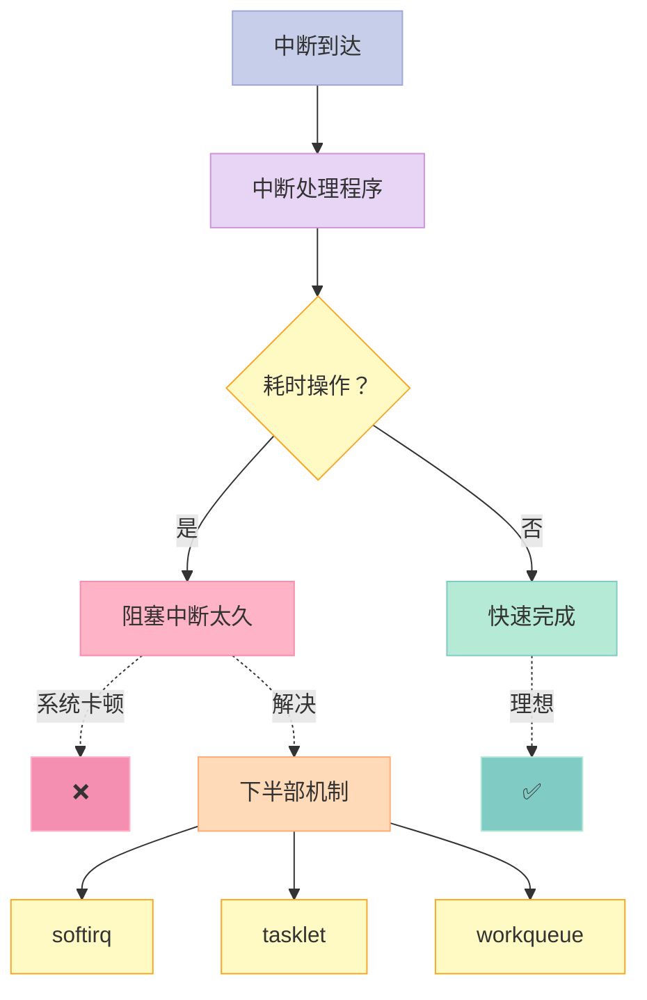

**核心原则**：

- 中断处理 = 快进快出（不阻塞）
- 耗时操作 = 推迟到下半部
- 中断上下文不可睡眠 → 下半部也要分"可睡眠/不可睡眠"

---

## 一、中断上下半部模型

### 1.1 经典模型

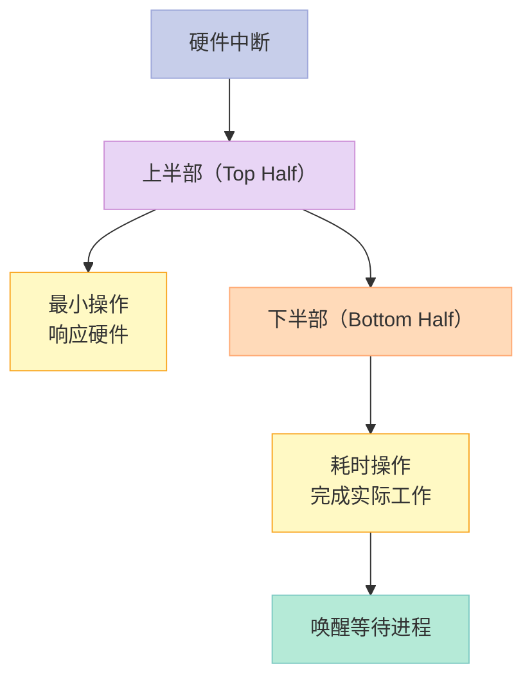

### 1.2 网络收包示例

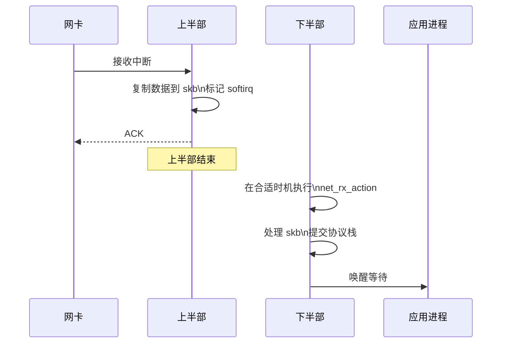

---

## 二、Softirq

### 2.1 原理

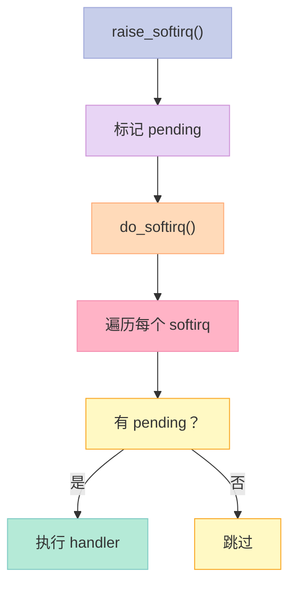

### 2.2 内核定义的 10 个 softirq

```c
// include/linux/interrupt.h
enum {
    HI_SOFTIRQ = 0,            // 高优先级 tasklet
    TIMER_SOFTIRQ,             // 定时器
    NET_TX_SOFTIRQ,            // 网络发送
    NET_RX_SOFTIRQ,            // 网络接收
    BLOCK_SOFTIRQ,             // 块 I/O
    IRQ_POLL_SOFTIRQ,          // IRQ poll
    TASKLET_SOFTIRQ,           // 普通 tasklet
    SCHED_SOFTIRQ,             // 调度器
    HRTIMER_SOFTIRQ,           // 高精度定时器
    RCU_SOFTIRQ,               // RCU
    NR_SOFTIRQS
};
```

### 2.3 自定义 softirq（不推荐）

```c
#include <linux/interrupt.h>

static void my_softirq_handler(struct softirq_action *h) {
    // 处理工作
}

static int __init my_init(void) {
    open_softirq(MY_SOFTIRQ, my_softirq_handler);
    return 0;
}

// 触发
raise_softirq(MY_SOFTIRQ);
```

### 2.4 softirq 的执行时机

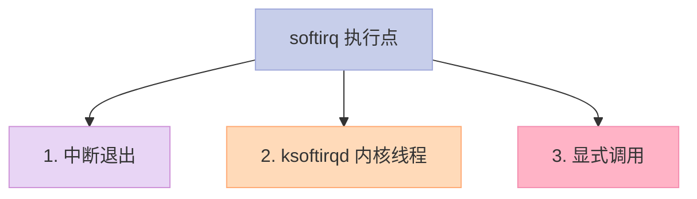

**注意**：softirq 在中断上下文执行——不能睡眠。

### 2.5 关键启示

1. **softirq = 最快下半部**
2. **静态注册**（内核预定义 10 个）
3. **不可睡眠**

---

## 三、Tasklet

### 3.1 原理

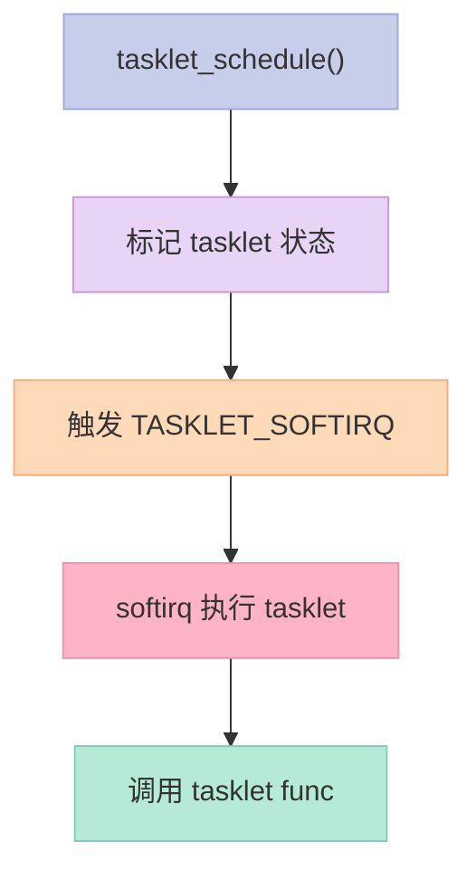

### 3.2 Tasklet API

```c
#include <linux/interrupt.h>

// 静态定义
static void my_tasklet_func(unsigned long data) {
    printk("tasklet: data=%lu\n", data);
}

DECLARE_TASKLET(my_tasklet, my_tasklet_func, 100);

// 调度
tasklet_schedule(&my_tasklet);

// 禁用/启用
tasklet_disable(&my_tasklet);
tasklet_enable(&my_tasklet);

// 杀 tasklet
tasklet_kill(&my_tasklet);
```

### 3.3 tasklet vs softirq

| 维度 | softirq | tasklet |
|------|---------|---------|
| 注册 | 静态（内核固定） | 动态（模块内） |
| 并发执行 | 同类型可在多 CPU 并发 | 同一 tasklet 不可并发 |
| 锁需求 | 需要 | 自动禁用 |
| 灵活性 | 低 | 高 |

### 3.4 关键启示

1. **tasklet = 基于 softirq 的封装**
2. **更易用**——自动序列化
3. **不推荐新代码**——workqueue 更佳

---

## 四、Workqueue

### 4.1 原理

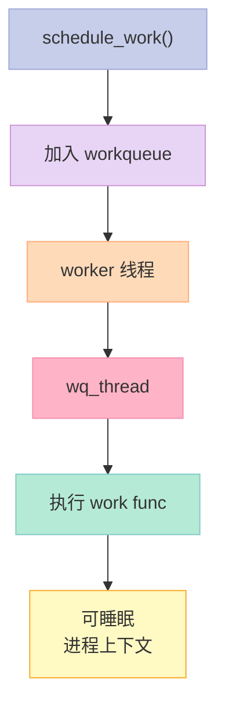

### 4.2 Workqueue API

```c
#include <linux/workqueue.h>

static void my_work_func(struct work_struct *work) {
    printk("work executed\n");
    // 可睡眠、可阻塞
}

static DECLARE_WORK(my_work, my_work_func);

// 调度
schedule_work(&my_work);

// 同步等待
flush_work(&my_work);
```

### 4.3 延迟 workqueue（延迟执行）

```c
struct delayed_work my_delayed_work;

INIT_DELAYED_WORK(&my_delayed_work, my_work_func);
schedule_delayed_work(&my_delayed_work, msecs_to_jiffies(100));
// 100 ms 后执行
```

### 4.4 自定义 workqueue

```c
struct workqueue_struct *my_wq;

my_wq = alloc_workqueue("my_wq", WQ_UNBOUND | WQ_MEM_RECLAIM, 1);

queue_work(my_wq, &my_work);
flush_workqueue(my_wq);

destroy_workqueue(my_wq);
```

### 4.5 关键启示

1. **workqueue = 进程上下文执行**
2. **可以睡眠**——能做阻塞操作
3. **新代码推荐 workqueue**

---

## 五、3 种下半部对比

| 维度 | softirq | tasklet | workqueue |
|------|---------|---------|-----------|
| 上下文 | 中断 | 中断 | 进程 |
| 可睡眠 | ❌ | ❌ | ✅ |
| 并发 | 同类型可并发 | 同一不可并发 | 由调度决定 |
| 复杂度 | 高 | 中 | 低 |
| 现代推荐 | 内核内部 | 旧 API | ✅ 新代码 |

**选择建议**：

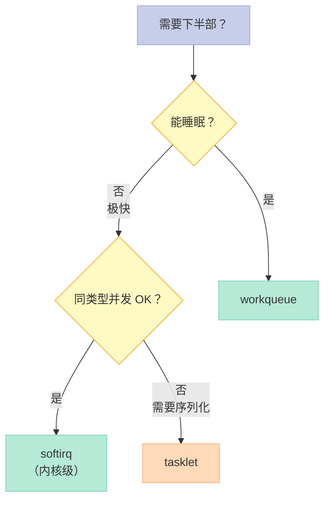

---

## 六、第 18 章：内核模块

### 6.1 什么是内核模块？

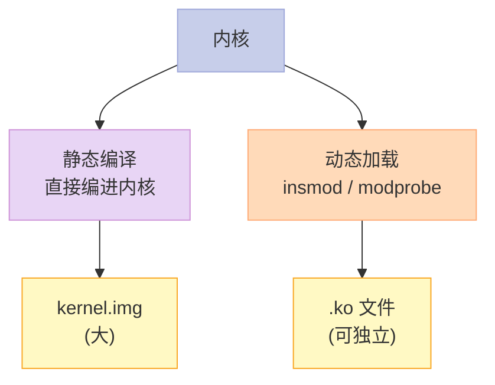

### 6.2 最小内核模块

```c
#include <linux/module.h>
#include <linux/init.h>

static int __init hello_init(void) {
    printk(KERN_INFO "Hello, kernel module!\n");
    return 0;  // 0 = 成功
}

static void __exit hello_exit(void) {
    printk(KERN_INFO "Goodbye, kernel module!\n");
}

module_init(hello_init);   // 注册 init 函数
module_exit(hello_exit);   // 注册 exit 函数

MODULE_LICENSE("GPL");           // 许可证
MODULE_AUTHOR("Your Name");      // 作者
MODULE_DESCRIPTION("Hello Demo");// 描述
MODULE_VERSION("1.0");           // 版本
```

### 6.3 编译（Makefile）

```makefile
obj-m += hello.o

all:
	make -C /lib/modules/$(shell uname -r)/build M=$(PWD) modules

clean:
	make -C /lib/modules/$(shell uname -r)/build M=$(PWD) clean

load:
	sudo insmod hello.ko
unload:
	sudo rmmod hello
info:
	modinfo hello.ko
```

```bash
make           # 编译
make load      # 加载
dmesg | tail   # 查看
make unload    # 卸载
make clean     # 清理
```

### 6.4 模块参数

```c
#include <linux/moduleparam.h>

static int my_int = 100;
static char *my_string = "hello";
static int my_array[5] = {1, 2, 3, 4, 5};
static int arr_argc = 0;

module_param(my_int, int, 0644);
MODULE_PARM_DESC(my_int, "An integer parameter");

module_param(my_string, charp, 0644);
MODULE_PARM_DESC(my_string, "A string parameter");

module_param_array(my_array, int, &arr_argc, 0644);
MODULE_PARM_DESC(my_array, "An array of integers");
```

```bash
# 加载时传参
sudo insmod mymod.ko my_int=200 my_string="world" my_array=1,2,3,4,5

# /sys/module/mymod/parameters/
ls /sys/module/mymod/parameters/
# my_int  my_string  my_array
```

### 6.5 模块导出符号

```c
// 模块 A 导出
EXPORT_SYMBOL(my_function);
EXPORT_SYMBOL_GPL(my_gpl_function);

// 模块 B 使用
extern void my_function(void);
my_function();
```

### 6.6 模块依赖

```bash
# 模块依赖关系
cat /lib/modules/$(uname -r)/modules.dep | head

# 自动加载（解决依赖）
sudo modprobe mymod  # 自动加载 mymod 依赖的其他模块
```

### 6.7 模块相关命令

```bash
# 查看已加载模块
lsmod

# 模块信息
modinfo hello.ko

# 加载 / 卸载
sudo insmod hello.ko
sudo rmmod hello

# 智能加载（解决依赖）
sudo modprobe hello

# 强制卸载
sudo rmmod -f hello

# 阻止加载特定模块
echo "blacklist hello" | sudo tee /etc/modprobe.d/blacklist.conf
```

### 6.8 关键启示

1. **模块 = 动态可加载代码**
2. **`module_init` / `module_exit`**——入口出口
3. **`EXPORT_SYMBOL`**——模块间共享
4. **`module_param`**——模块参数

---

## 七、内核模块的文件格式

### 7.1 `.ko` 文件本质

```bash
# .ko = ELF relocatable object
file hello.ko
# hello.ko: ELF 64-bit LSB relocatable, x86-64, ...

# 包含符号表
nm hello.ko | head

# 包含版本信息
modinfo hello.ko
```

### 7.2 模块包含的段

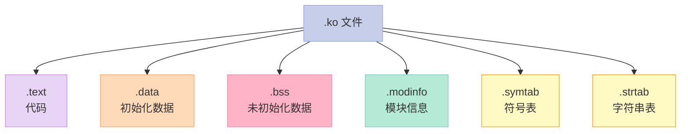

### 7.3 模块加载过程

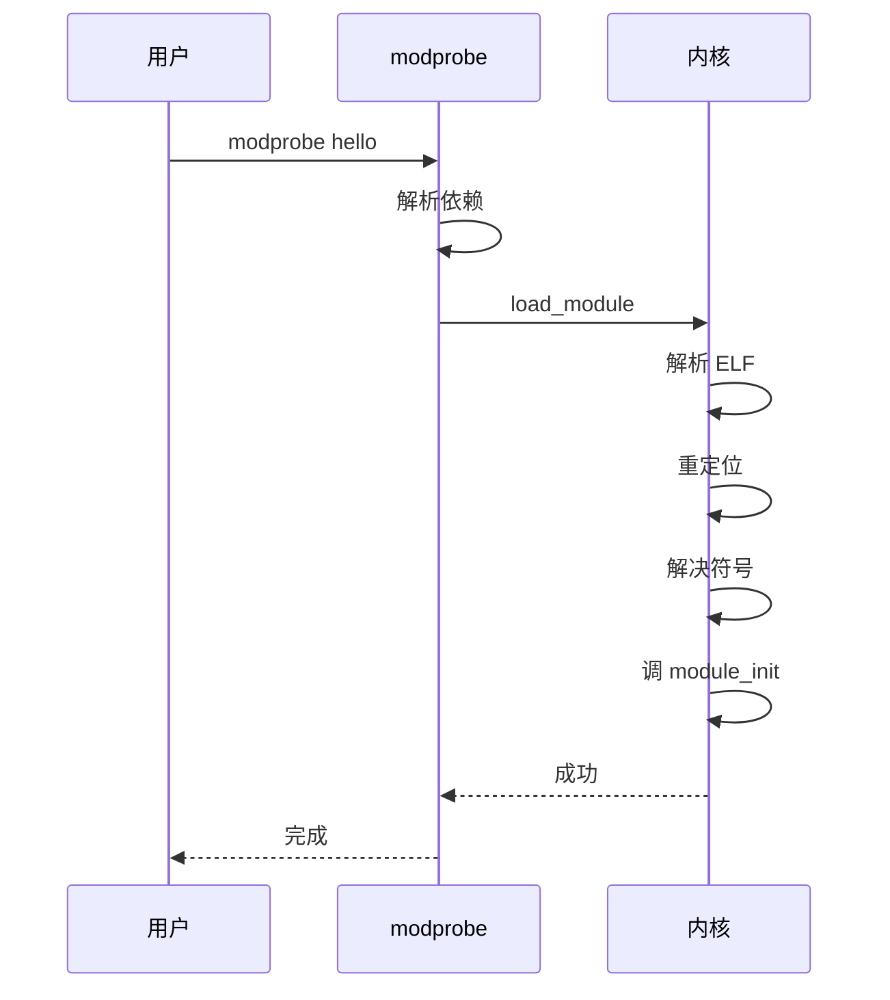

---

## 八、内核模块的常见问题

### 8.1 GPL 许可证

```c
// ❌ 无许可证：可能被污染
// MODULE_LICENSE("");  // 默认私有

// ✅ GPL 兼容
MODULE_LICENSE("GPL");           // GPL v2
MODULE_LICENSE("GPL v2");
MODULE_LICENSE("GPL and additional rights");
MODULE_LICENSE("Dual BSD/GPL");
MODULE_LICENSE("Proprietary");
```

### 8.2 符号未导出

```bash
# 编译错误: 'func' undeclared
# 解决：在导出模块加 EXPORT_SYMBOL
EXPORT_SYMBOL(func);
```

### 8.3 版本不兼容

```bash
# insmod: disagrees about version of symbol
# 解决：编译时用相同内核版本
make -C /lib/modules/$(uname -r)/build M=$(PWD) modules
```

### 8.4 关键启示

1. **GPL 许可证**——保护开源
2. **`EXPORT_SYMBOL`**——跨模块调用
3. **版本必须匹配**——内核头文件

---

## 九、面试高频考点

### 9.1 必背题

| 题目 | 答案要点 |
|------|----------|
| 中断上下半部？ | 上半部快，下半部处理耗时 |
| 3 种下半部？ | softirq / tasklet / workqueue |
| softirq vs tasklet？ | 静态 vs 动态；同类型并发 vs 不可并发 |
| workqueue 特点？ | 进程上下文、可睡眠 |
| 内核模块怎么加载？ | insmod / modprobe |
| 模块参数怎么传？ | module_param + 加载时赋值 |
| 导出符号？ | EXPORT_SYMBOL |
| GPL 许可证意义？ | 防止内核被私有模块污染 |

### 9.2 高频追问

| 追问 | 关键点 |
|------|--------|
| softirq 在哪执行？ | 中断退出 + ksoftirqd |
| tasklet 不可并发的实现？ | atomic state 标记 |
| 什么时候用 workqueue？ | 需要睡眠/阻塞 |
| 编写模块需要什么？ | 内核头 + Makefile |
| modprobe vs insmod？ | 自动解决依赖 |
| 模块签名？ | CONFIG_MODULE_SIG |

---

## 十、配套实验

### 10.1 实验 1：查看已加载模块

```bash
# 所有模块
lsmod | head -20

# 模块数量
lsmod | wc -l

# 依赖关系
lsmod | grep -E "nfs|cifs"
```

### 10.2 实验 2：写最小模块

```c
// 文件：hello.c
#include <linux/module.h>
#include <linux/init.h>

static int __init hello_init(void) {
    printk(KERN_INFO "Hello from kernel module!\n");
    return 0;
}

static void __exit hello_exit(void) {
    printk(KERN_INFO "Goodbye from kernel module!\n");
}

module_init(hello_init);
module_exit(hello_exit);
MODULE_LICENSE("GPL");
MODULE_AUTHOR("Your Name");
MODULE_DESCRIPTION("Hello Module");
MODULE_VERSION("1.0");
```

```makefile
# Makefile
obj-m += hello.o
all:
	make -C /lib/modules/$(shell uname -r)/build M=$(PWD) modules
clean:
	make -C /lib/modules/$(shell uname -r)/build M=$(PWD) clean
```

### 10.3 实验 3：workqueue 模块

```c
// 文件：wq_demo.c
#include <linux/module.h>
#include <linux/workqueue.h>
#include <linux/delay.h>

static struct workqueue_struct *my_wq;
static DECLARE_WORK(my_work, NULL);

static void my_work_func(struct work_struct *work) {
    printk("Work started, sleeping...\n");
    msleep(1000);  // 可睡眠
    printk("Work done!\n");
}

static int __init my_init(void) {
    my_wq = alloc_workqueue("my_wq", WQ_UNBOUND, 0);
    INIT_WORK(&my_work, my_work_func);
    queue_work(my_wq, &my_work);
    return 0;
}

static void __exit my_exit(void) {
    flush_workqueue(my_wq);
    destroy_workqueue(my_wq);
}

module_init(my_init);
module_exit(my_exit);
MODULE_LICENSE("GPL");
```

### 10.4 实验 4：模块参数

```c
// 文件：param_demo.c
#include <linux/module.h>
#include <linux/moduleparam.h>

static int my_int = 100;
static char *my_string = "default";

module_param(my_int, int, 0644);
MODULE_PARM_DESC(my_int, "An integer");
module_param(my_string, charp, 0644);
MODULE_PARM_DESC(my_string, "A string");

static int __init my_init(void) {
    printk("my_int=%d, my_string=%s\n", my_int, my_string);
    return 0;
}

static void __exit my_exit(void) {
    printk("Module unloaded\n");
}

module_init(my_init);
module_exit(my_exit);
MODULE_LICENSE("GPL");
```

```bash
# 编译
make

# 加载
sudo insmod param_demo.ko my_int=200 my_string="hello"

# 查看
cat /sys/module/param_demo/parameters/my_int
# 200
cat /sys/module/param_demo/parameters/my_string
# hello

# 卸载
sudo rmmod param_demo
```

### 10.5 实验 5：tasklet 模块

```c
// 文件：tasklet_demo.c
#include <linux/module.h>
#include <linux/interrupt.h>

static void my_tasklet_func(unsigned long data) {
    printk("Tasklet fired: data=%lu\n", data);
}

static DECLARE_TASKLET(my_tasklet, my_tasklet_func, 999);

static int __init my_init(void) {
    tasklet_schedule(&my_tasklet);
    return 0;
}

static void __exit my_exit(void) {
    tasklet_kill(&my_tasklet);
}

module_init(my_init);
module_exit(my_exit);
MODULE_LICENSE("GPL");
```

### 10.6 实验 6：查看模块信息

```bash
# 模块详细信息
modinfo hello.ko

# 输出：
# filename:       /path/to/hello.ko
# version:        1.0
# description:    Hello Module
# author:         Your Name
# license:        GPL
# depends:
# vermagic:       6.0.0-xxx SMP preempt mod_unload
# ...
```

---

## 十一、回到 5 个核心要点

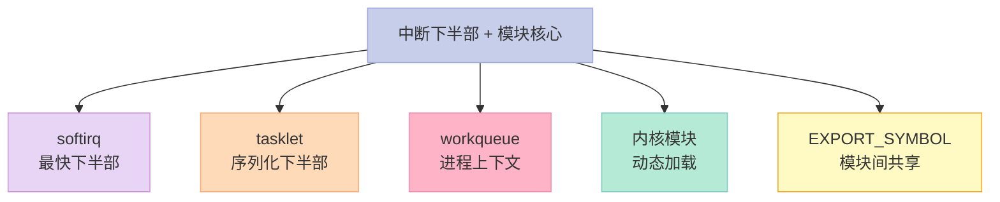

---

## 十二、结尾思考题

> **思考题 1**：什么场景必须用 workqueue 而不是 softirq？

> **思考题 2**：写一个内核模块，实现定时器 + workqueue。

> **思考题 3**：模块 A 导出符号，模块 B 引用——怎么编译加载？

> **思考题 4**：为什么内核模块必须声明许可证？GPL 有什么意义？

> **思考题 5**：用什么方法可以查看某个模块的所有导出符号？

---

## 十三、本篇速查表

| 主题 | 关键点 | 内核文件 |
|------|--------|----------|
| softirq | 静态、并发 | kernel/softirq.c |
| tasklet | 软中断封装 | kernel/softirq.c |
| workqueue | 进程上下文 | kernel/workqueue.c |
| 模块加载 | insmod | kernel/module.c |
| 模块参数 | module_param | include/linux/moduleparam.h |
| 符号导出 | EXPORT_SYMBOL | include/linux/export.h |

---

## 十四、系列导航

| # | 文章 | 状态 |
|:--|:--|:--|
| 0 | [系列总览](/2026/06/18/linux-kernel-architecture-00-series-index/) | ✅ 已发布 |
| 1 | [内核架构总览 + 进程管理](/2026/06/18/linux-kernel-architecture-01-process-management/) | ✅ 已发布 |
| 2 | [进程地址空间](/2026/06/18/linux-kernel-architecture-02-process-address-space/) | ✅ 已发布 |
| 3 | [内存管理基础](/2026/06/18/linux-kernel-architecture-03-memory-management-basics/) | ✅ 已发布 |
| 4 | [内存分配器与回收](/2026/06/18/linux-kernel-architecture-04-memory-allocation/) | ✅ 已发布 |
| 5 | [虚拟文件系统 VFS](/2026/06/18/linux-kernel-architecture-05-vfs/) | ✅ 已发布 |
| 6 | [Ext 文件系统族](/2026/06/18/linux-kernel-architecture-06-ext-filesystem/) | ✅ 已发布 |
| 7 | [块 I/O 层](/2026/06/18/linux-kernel-architecture-07-block-io/) | ✅ 已发布 |
| 8 | [设备驱动 + 网络栈](/2026/06/18/linux-kernel-architecture-08-drivers-network/) | ✅ 已发布 |
| 9 | [内核同步 + 定时器](/2026/06/18/linux-kernel-architecture-09-synchronization-timers/) | ✅ 已发布 |
| 10 | **本文：中断下半部 + 模块** | ✅ 已发布 |
| 11 | [内核启动 + 附录速查](/2026/06/18/linux-kernel-architecture-11-boot-appendix/) | 🔜 计划中 |

---

**下一篇**：第 11 篇《内核启动 + 附录速查》——内核启动流程（BIOS → GRUB → vmlinuz → initramfs → init）、附录 A-F 数据结构、汇编、调试速查。

> **行动建议**：
> 1. **写一个 hello 模块**——动手实践
> 2. **玩模块参数**——传参、修改
> 3. **写 workqueue 模块**——掌握进程上下文
> 4. **用 modinfo**——看模块信息
> 5. **读 `kernel/module.c`**——理解模块机制
