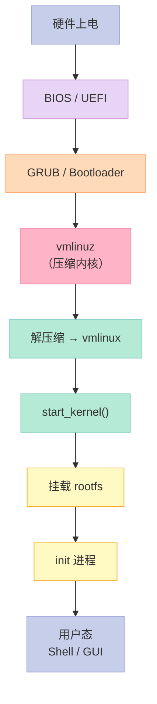
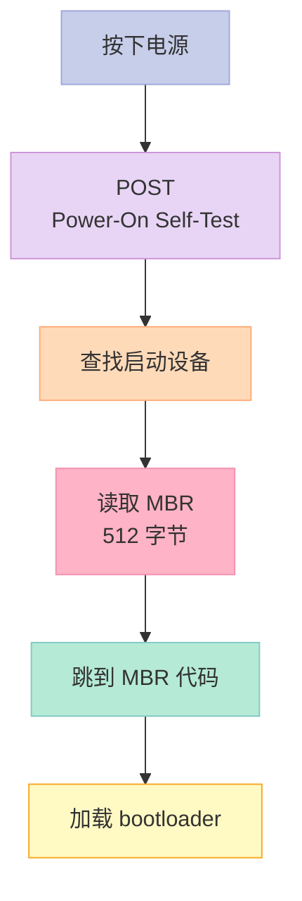
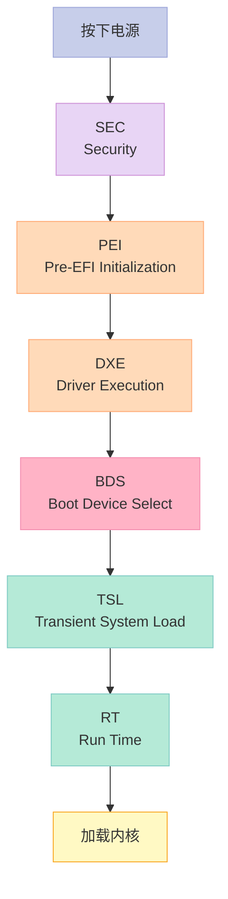
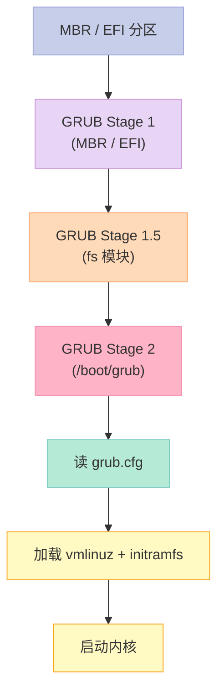
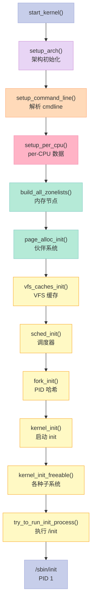
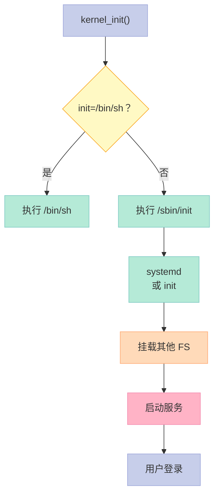
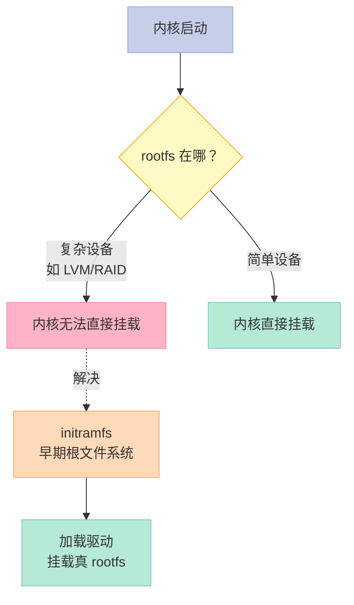
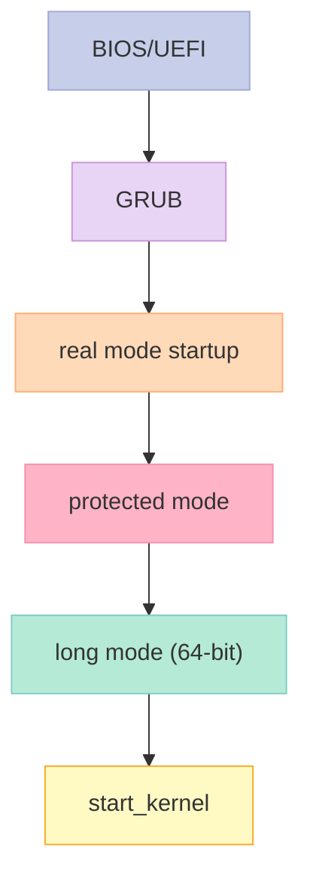
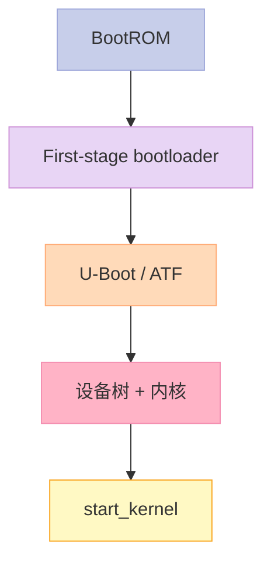
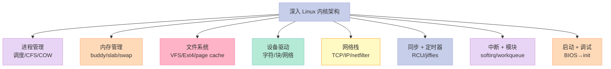

> **一句话核心结论**：Linux 启动的"7 阶段"——**BIOS/UEFI → GRUB/bootloader → vmlinuz 解压 → 内核初始化 → 挂载 rootfs → init 进程 → 用户态**。附录 A-F 提供**数据结构 / 汇编 / 配置选项 / 调试**速查表，是本系列的"工具箱"。

---

## 系列导航

| # | 文章 | 状态 |
|:--|:--|:--|
| 0 | [系列总览](/2026/06/18/linux-kernel-architecture-00-series-index/) | ✅ 已发布 |
| 1 | [内核架构总览 + 进程管理](/2026/06/18/linux-kernel-architecture-01-process-management/) | ✅ 已发布 |
| 2 | [进程地址空间](/2026/06/18/linux-kernel-architecture-02-process-address-space/) | ✅ 已发布 |
| 3 | [内存管理基础](/2026/06/18/linux-kernel-architecture-03-memory-management-basics/) | ✅ 已发布 |
| 4 | [内存分配器与回收](/2026/06/18/linux-kernel-architecture-04-memory-allocation/) | ✅ 已发布 |
| 5 | [虚拟文件系统 VFS](/2026/06/18/linux-kernel-architecture-05-vfs/) | ✅ 已发布 |
| 6 | [Ext 文件系统族](/2026/06/18/linux-kernel-architecture-06-ext-filesystem/) | ✅ 已发布 |
| 7 | [块 I/O 层](/2026/06/18/linux-kernel-architecture-07-block-io/) | ✅ 已发布 |
| 8 | [设备驱动 + 网络栈](/2026/06/18/linux-kernel-architecture-08-drivers-network/) | ✅ 已发布 |
| 9 | [内核同步 + 定时器](/2026/06/18/linux-kernel-architecture-09-synchronization-timers/) | ✅ 已发布 |
| 10 | [中断下半部 + 模块](/2026/06/18/linux-kernel-architecture-10-interrupts-modules/) | ✅ 已发布 |
| 11 | **本文：内核启动 + 附录速查** | ✅ 已发布 |

---

## 前言：内核启动的"旅程"



---

## 一、BIOS / UEFI 阶段

### 1.1 BIOS 启动（Legacy）



**MBR 限制**：

- 最大 2 TB 磁盘
- 4 个主分区
- 16 字节 bootloader

### 1.2 UEFI 启动（现代）



**UEFI 优势**：

- 支持大磁盘（GPT）
- 安全启动（Secure Boot）
- 模块化驱动

---

## 二、Bootloader（GRUB）

### 2.1 GRUB 启动流程



### 2.2 GRUB 配置

```bash
# /boot/grub/grub.cfg（自动生成）
menuentry 'Ubuntu' {
    linux /vmlinuz root=/dev/sda1 ro quiet splash
    initrd /initrd.img
}
```

### 2.3 关键启示

1. **GRUB 是 Linux 最常用的 bootloader**
2. **Stage 1 → 1.5 → 2**——分阶段加载
3. **`grub.cfg`**——配置启动项

---

## 三、内核启动（start_kernel）

### 3.1 vmlinuz 与 vmlinux

| 文件 | 内容 |
|------|------|
| **vmlinuz** | 压缩内核（zImage/bzImage） |
| **vmlinux** | 原始 ELF 内核（未压缩） |
| **bzImage** | Big zImage（大内核） |

### 3.2 `start_kernel`：内核 C 入口

```c
// init/main.c
asmlinkage __visible void __init __no_sanitize_address start_kernel(void) {
    // 1. 早期架构初始化
    setup_arch(&command_line);

    // 2. 早期陷阱
    mm_init_cpumask(&init_mm);

    // 3. 调度器初始化
    sched_init();

    // 4. 进程 0 创建
    fork_init();

    // 5. 信号、内存、vfs 初始化
    vfs_caches_init();

    // 6. 信号量初始化
    signals_init();

    // 7. 内存管理初始化
    mm_init();

    // 8. 调度器启动
    sched_init_smp();

    // 9. 文件系统初始化
    do_basic_setup();

    // 10. 启动 init 进程
    kernel_init();

    // 不应该返回
    while (1);
}
```

### 3.3 启动流程总览



### 3.4 第一个进程（init / PID 1）



---

## 四、initramfs / initrd

### 4.1 为什么需要 initramfs？



### 4.2 initramfs vs initrd

| 维度 | initrd | initramfs |
|------|--------|-----------|
| 格式 | 块设备（ext2 镜像） | cpio 归档 |
| 大小 | 较大 | 较小 |
| 性能 | 慢（先挂载） | 快（直接解压） |
| 灵活性 | 一般 | 高 |

### 4.3 initramfs 内容

```bash
# 查看 initramfs 内容
lsinitramfs /boot/initrd.img

# 解压
mkdir /tmp/initramfs && cd /tmp/initramfs
zcat /boot/initrd.img | cpio -idmv
```

---

## 五、内核启动参数

### 5.1 常用参数

```bash
# GRUB cmdline 示例
linux /vmlinuz root=/dev/sda1 ro quiet splash nomodeset
```

**常用参数**：

| 参数 | 说明 |
|------|------|
| `root=` | 指定根文件系统 |
| `ro` | 启动时只读 |
| `quiet` | 安静模式 |
| `splash` | 启动画面 |
| `nomodeset` | 禁用 KMS |
| `init=` | 指定 init 进程 |
| `mem=` | 限制内存大小 |
| `maxcpus=` | 限制 CPU 数 |
| `elevator=` | I/O 调度器 |
| `transparent_hugepage=` | THP 策略 |
| `nohz_full=` | tickless CPU |

### 5.2 内核日志

```bash
# 查看内核启动日志
dmesg

# 输出示例：
# [    0.000000] Linux version 6.0.0-...
# [    0.000000] Command line: BOOT_IMAGE=/vmlinuz root=...
# [    0.000000] BIOS-provided physical RAM map:
# [    0.000000] BIOS-e820: [mem 0x0000000000000000-0x000000000009ffff] usable
# [    0.000000] BIOS-e820: [mem 0x0000000000100000-...]
# [    0.000000] SMBIOS 3.0 present.
# [    0.000000] tsc: Detected 3000.000 MHz processor
# ...
# [    0.123456] Run /sbin/init as init process
```

---

## 六、ARM vs x86 启动差异

### 6.1 x86 启动路径



### 6.2 ARM 启动路径



**关键差异**：

- ARM 设备树（DTB）描述硬件
- x86 通过 ACPI/BIOS 探测
- ARM 多核启动用 PSCI

### 6.3 设备树（DTB）

```dts
// 示例：/arch/arm64/boot/dts/myboard.dts
/dts-v1/;
/ {
    model = "MyBoard";
    compatible = "myvendor,myboard";
    #address-cells = <2>;
    #size-cells = <2>;

    cpus {
        #address-cells = <1>;
        #size-cells = <0>;

        cpu@0 {
            device_type = "cpu";
            compatible = "arm,cortex-a72";
            reg = <0>;
            clock-frequency = <1800000000>;
        };
    };

    memory@80000000 {
        device_type = "memory";
        reg = <0x0 0x80000000 0x0 0x40000000>;  // 1 GB
    };
};
```

---

## 七、附录 A：内核相关数据结构

### 7.1 核心链表

```c
// include/linux/list.h
struct list_head {
    struct list_head *next, *prev;
};

#define LIST_HEAD_INIT(name) { &(name), &(name) }
#define LIST_HEAD(name) struct list_head name = LIST_HEAD_INIT(name)

// API
list_add(struct list_head *new, struct list_head *head);
list_add_tail(struct list_head *new, struct list_head *head);
list_del(struct list_head *entry);
list_for_each(pos, head);
list_for_each_entry(pos, head, member);
```

### 7.2 红黑树

```c
#include <linux/rbtree.h>

struct rb_root my_root = RB_ROOT;

struct my_node {
    struct rb_node rb_node;
    int key;
    int value;
};

// 插入
my_node->key = 100;
rb_insert(&my_node->rb_node, &my_root, less_func, ...);

// 查找
struct rb_node *node = rb_find(&key, &my_root, less_func, ...);

// 删除
rb_erase(&my_node->rb_node, &my_root);
```

### 7.3 哈希表

```c
#include <linux/hashtable.h>

DEFINE_HASHTABLE(my_ht, 8);  // 2^8 桶

// 插入
hash_add(my_ht, &my_node->hnode, key);

// 查找
hash_for_each_possible(my_ht, my_node, hnode, key);

// 删除
hash_del(&my_node->hnode);
```

### 7.4 基数树

```c
#include <linux/radix-tree.h>

RADIX_TREE(my_tree, GFP_KERNEL);

// 插入
radix_tree_insert(&my_tree, 0, item);

// 查找
item = radix_tree_lookup(&my_tree, 0);

// 删除
radix_tree_delete(&my_tree, 0);
```

### 7.5 数据结构选择


---

## 八、附录 C：汇编基础

### 8.1 x86 汇编基础

```asm
; AT&T 语法（Linux 默认）
movq $1, %rax       ; rax = 1
movq %rbx, %rcx     ; rcx = rbx
addq $1, %rax       ; rax += 1
subq $2, %rax       ; rax -= 2
call func            ; 调用函数
ret                  ; 返回

; 函数序言
pushq %rbp
movq %rsp, %rbp
subq $16, %rsp
; 函数体
leave
ret

; 栈帧
[rsp]     ; 局部变量
[rbp+8]   ; 第一个参数
[rbp+16]  ; 第二个参数
[rbp]     ; 保存的 rbp
[rbp+8]   ; 返回地址
```

### 8.2 ARM 汇编基础

```asm
; AArch64
mov x0, #1          ; x0 = 1
add x0, x0, #1      ; x0 += 1
sub x0, x0, #2      ; x0 -= 2
bl func              ; 调用函数
ret                  ; 返回

; 函数序言
stp x29, x30, [sp, #-16]!
mov x29, sp
; 函数体
ldp x29, x30, [sp], #16
ret
```

### 8.3 内联汇编

```c
// x86
unsigned long flags;
asm volatile (
    "pushfq\n\t"
    "popq %0"
    : "=r" (flags)
);

// ARM64
asm volatile (
    "mrs %0, daif"
    : "=r" (flags)
);
```

---

## 九、附录 E：常用内核配置选项

### 9.1 进程与调度

```kconfig
CONFIG_PREEMPT=y                 # 完全抢占
CONFIG_PREEMPT_VOLUNTARY=y       # 自愿抢占
CONFIG_NO_HZ=y                   # tickless
CONFIG_HZ=1000                   # 时钟频率
CONFIG_CGROUP_SCHED=y            # cgroup 调度
CONFIG_CFS_BANDWIDTH=y           # CFS 带宽控制
```

### 9.2 内存管理

```kconfig
CONFIG_SWAP=y                    # 启用 swap
CONFIG_ZSWAP=y                   # zswap 压缩
CONFIG_ZRAM=y                    # zram 块设备
CONFIG_TRANSPARENT_HUGEPAGE=y    # THP
CONFIG_HUGETLB_PAGE=y            # 巨页
CONFIG_NUMA=y                    # NUMA 支持
CONFIG_MEMCG=y                   # 内存 cgroup
```

### 9.3 文件系统

```kconfig
CONFIG_EXT4_FS=y                 # Ext4
CONFIG_XFS_FS=y                  # XFS
CONFIG_BTRFS_FS=y                # Btrfs
CONFIG_F2FS_FS=y                 # F2FS
CONFIG_NFS_FS=y                  # NFS 客户端
CONFIG_NFSD=y                    # NFS 服务器
CONFIG_OVERLAY_FS=y              # overlayfs
```

### 9.4 网络

```kconfig
CONFIG_NET=y                     # 启用网络
CONFIG_PACKET=y                  # AF_PACKET
CONFIG_NETFILTER=y               # netfilter
CONFIG_BRIDGE=y                  # 网桥
CONFIG_VLAN_8021Q=y              # VLAN
```

### 9.5 调试

```kconfig
CONFIG_DEBUG_KERNEL=y            # 调试选项
CONFIG_LOCKDEP=y                 # 锁依赖检测
CONFIG_KASAN=y                   # 内核地址消毒器
CONFIG_KMSAN=y                   # 内核内存消毒器
CONFIG_DEBUG_PAGEALLOC=y         # 页分配器调试
CONFIG_SLUB_DEBUG=y              # SLUB 调试
CONFIG_DEBUG_ATOMIC_SLEEP=y      # 原子上下文睡眠检测
```

---

## 十、内核调试工具速查

### 10.1 printk

```c
// 8 个日志级别
KERN_EMERG     // 0: 紧急
KERN_ALERT     // 1: 警报
KERN_CRIT      // 2: 严重
KERN_ERR       // 3: 错误
KERN_WARNING   // 4: 警告
KERN_NOTICE    // 5: 注意
KERN_INFO      // 6: 信息
KERN_DEBUG     // 7: 调试

// 使用
printk(KERN_INFO "hello %s\n", "world");

// 动态级别
printk("%s: hello\n", KBUILD_MODNAME);
```

### 10.2 kgdb / kdb

```bash
# 1. 启动 kgdb
kgdboc=ttyS0,115200 kgdbwait

# 2. 在另一个 terminal 连
gdb-multiarch vmlinux
(gdb) target remote /dev/ttyS0
(gdb) b do_fork
(gdb) c
```

### 10.3 ftrace

```bash
# 启用
echo function > /sys/kernel/debug/tracing/current_tracer

# 看输出
cat /sys/kernel/debug/tracing/trace
```

### 10.4 perf

```bash
# perf list
perf list

# record
perf record -g ./myapp

# report
perf report

# top
perf top
```

### 10.5 bpf / bcc

```bash
# 跟踪 open 系统调用
/usr/share/bcc/tools/opensnoop

# 输出：
# PID    COMM               FD ERR PATH
# 1234   bash                3   0 /etc/profile
# 5678   vim                 4   0 /tmp/test.txt
```

---

## 十一、面试高频考点

### 11.1 必背题

| 题目 | 答案要点 |
|------|----------|
| Linux 启动流程？ | BIOS → GRUB → vmlinuz → start_kernel → init |
| BIOS vs UEFI？ | 16-bit 简单 vs 32/64-bit 模块化 |
| vmlinuz vs vmlinux？ | 压缩 vs 未压缩 |
| initramfs 作用？ | 早期 rootfs，加载必要驱动 |
| GRUB Stage 1/2？ | MBR → 加载主配置 |
| start_kernel 做什么？ | 各种子系统初始化 |
| ARM 与 x86 启动差异？ | 设备树 vs ACPI |
| kgdb 是什么？ | 内核调试器 |

### 11.2 高频追问

| 追问 | 关键点 |
|------|--------|
| Secure Boot 是什么？ | UEFI 安全启动 |
| MBR vs GPT？ | 2 TB 限制 vs 8 ZB |
| 设备树是什么？ | ARM 硬件描述 |
| 第一个进程？ | init / PID 1 |
| 内核模块启动顺序？ | 按依赖加载 |
| init 替代品？ | systemd / openrc / runit |

---

## 十二、配套实验

### 12.1 实验 1：查看启动日志

```bash
# 完整启动日志
dmesg | less

# 关键节点
dmesg | grep -E "Linux version|Command line|Run /|Booting"
```

### 12.2 实验 2：查看 initramfs

```bash
# 查看大小
ls -lh /boot/initrd.img*

# 解压
mkdir /tmp/initrd && cd /tmp/initrd
zcat /boot/initrd.img-$(uname -r) | cpio -idmv 2>/dev/null
ls
```

### 12.3 实验 3：自定义内核参数

```bash
# 临时修改
sudo grubby --update-kernel=ALL --args="quiet loglevel=3"

# 持久化
echo 'GRUB_CMDLINE_LINUX="quiet loglevel=3"' | sudo tee -a /etc/default/grub
sudo update-grub

# 查看当前 cmdline
cat /proc/cmdline
```

### 12.4 实验 4：ftrace 跟踪

```bash
# 挂载
sudo mount -t tracefs tracefs /sys/kernel/tracing

# 启用函数跟踪
echo function > /sys/kernel/tracing/current_tracer

# 跑一些程序
ls /etc

# 查看
cat /sys/kernel/tracing/trace | head -20
```

### 12.5 实验 5：perf 性能分析

```bash
# record
perf record -g -F 99 ./myapp

# report
perf report

# top
perf top
```

---

## 十三、回到本系列核心要点



---

## 十四、系列完结：Linux 内核学习路线

### 14.1 推荐路径


### 14.2 11 篇文章清单

| # | 文章 | 核心 |
|:--|:--|:--|
| 0 | 系列总览 | 19 章全景 |
| 1 | 内核总览 + 进程管理 | CFS / fork |
| 2 | 进程地址空间 | mm_struct / COW |
| 3 | 内存管理基础 | 伙伴系统 / slab |
| 4 | 内存分配器与回收 | kswapd / LRU |
| 5 | VFS | super_block / inode |
| 6 | Ext4 | extent / journaling |
| 7 | 块 I/O | bio / 调度器 |
| 8 | 驱动 + 网络 | sk_buff / netfilter |
| 9 | 同步 + 定时器 | RCU / jiffies |
| 10 | 中断下半部 + 模块 | softirq / 动态加载 |
| 11 | **本文：启动 + 附录** | BIOS→init |

### 14.3 推荐资料

| 资料 | 类型 | 推荐 |
|------|------|------|
| Linux Kernel in a Nutshell | 在线免费 | ⭐⭐⭐⭐⭐ |
| Understanding the Linux Kernel | 经典书 | ⭐⭐⭐⭐ |
| Linux Kernel Development (Love) | 入门书 | ⭐⭐⭐⭐⭐ |
| Linux Device Drivers | 驱动书 | ⭐⭐⭐⭐ |
| Kernel Documentation | 官方文档 | ⭐⭐⭐⭐⭐ |

---

## 十五、结尾思考题

> **思考题 1**：你的 Linux 启动用了多长时间？哪步最慢？

> **思考题 2**：initramfs 里有哪些驱动？为什么需要它们？

> **思考题 3**：用 ftrace 跟踪一次 `ls`，看函数调用链。

> **思考题 4**：在内核模块里 `printk` 时，什么级别合适？

> **思考题 5**：如果你是内核开发者，最想改进哪个子系统？

---

## 十六、本篇速查表

| 主题 | 关键点 | 内核文件 |
|------|--------|----------|
| 启动流程 | BIOS→init | arch/x86/kernel/head_64.S |
| start_kernel | 主入口 | init/main.c |
| initramfs | 早期 rootfs | init/initramfs.c |
| 数据结构 | list/rbtree | include/linux/list.h |
| 汇编 | x86/ARM | arch/ |
| 配置选项 | Kconfig | 各子目录 Kconfig |

---

## 十七、系列导航

| # | 文章 | 状态 |
|:--|:--|:--|
| 0 | [系列总览](/2026/06/18/linux-kernel-architecture-00-series-index/) | ✅ 已发布 |
| 1 | [内核架构总览 + 进程管理](/2026/06/18/linux-kernel-architecture-01-process-management/) | ✅ 已发布 |
| 2 | [进程地址空间](/2026/06/18/linux-kernel-architecture-02-process-address-space/) | ✅ 已发布 |
| 3 | [内存管理基础](/2026/06/18/linux-kernel-architecture-03-memory-management-basics/) | ✅ 已发布 |
| 4 | [内存分配器与回收](/2026/06/18/linux-kernel-architecture-04-memory-allocation/) | ✅ 已发布 |
| 5 | [虚拟文件系统 VFS](/2026/06/18/linux-kernel-architecture-05-vfs/) | ✅ 已发布 |
| 6 | [Ext 文件系统族](/2026/06/18/linux-kernel-architecture-06-ext-filesystem/) | ✅ 已发布 |
| 7 | [块 I/O 层](/2026/06/18/linux-kernel-architecture-07-block-io/) | ✅ 已发布 |
| 8 | [设备驱动 + 网络栈](/2026/06/18/linux-kernel-architecture-08-drivers-network/) | ✅ 已发布 |
| 9 | [内核同步 + 定时器](/2026/06/18/linux-kernel-architecture-09-synchronization-timers/) | ✅ 已发布 |
| 10 | [中断下半部 + 模块](/2026/06/18/linux-kernel-architecture-10-interrupts-modules/) | ✅ 已发布 |
| 11 | **本文：内核启动 + 附录速查** | ✅ 已发布 |

---

**本系列完结** 🎉

> **Linux 内核学习的"3 个阶段"**：
> 1. **会用**——日常 Linux 使用、系统管理
> 2. **理解**——理解内核架构、子系统协作
> 3. **开发**——读源码、写模块、贡献社区

> **本系列 = 阶段 1 → 2 的桥梁**。
>
> 19 章 + 6 附录，覆盖 Linux 内核的所有核心子系统——**进程、内存、文件系统、设备、网络、同步、定时器、中断、模块、启动**。
>
> Linux 内核是 30+ 年的工程结晶，是**世界上最大的协作软件项目之一**。读完本系列，你已经掌握了它的"全景图"。
>
> 愿你：深入 Linux 内核，成为真正的内核开发者。

---

**全部 3 个系列完成**：

1. ✅ **Effective C++ 中文版第三版**（9 篇）
2. ✅ **More Effective C++ 中文版**（8 篇）
3. ✅ **深入 Linux 内核架构**（11 篇）

> **行动建议**：
> 1. **重读系列总览**——梳理 19 章的全景
> 2. **对照 Linux 源码**——把文章和真实代码对应
> 3. **动手实验**——每个子系统都跑代码
> 4. **参与社区**——LKML、GitHub、邮件列表
> 5. **贡献代码**——从 fix typo 开始

> **终极建议**：**保持好奇，持续学习**。Linux 内核是活的项目，每天都在变化——你的学习也应该如此。
