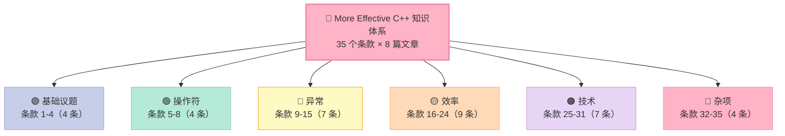
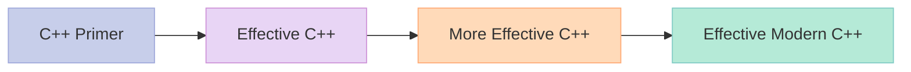

> **一句话核心结论**：《More Effective C++》是《Effective C++》的"进阶版"——它深入 35 个具体的 C++ 编程问题，从"指针语义"到"异常安全"，从"效率优化"到"高级技术"。如果说《Effective C++》教你怎么"写对"，《More Effective C++》教你怎么"写好"。

---

## 一、前言：为什么 2026 年还要读《More Effective C++》？

《Effective C++》已经覆盖了 55 个"基础"条款——但 C++ 的"进阶"问题没讲完：

- **智能指针**只讲了 `auto_ptr`（C++11 之前）——什么是引用计数？
- **异常**没系统讲——什么是异常安全？什么是 RAII？
- **效率**没深入——什么是 lazy evaluation？什么是 temporary objects？
- **高级技术**没涉及——什么是 pimpl？什么是 reference counting？

**《More Effective C++》** 就是答案——Scott Meyers 用 35 个"进阶条款"补齐了这些内容。

**为什么 2026 年还要读？**

| 表面上看 | 实质上在讲 |
|----------|------------|
| 条款 17：考虑使用 lazy evaluation | 这是现代"按需加载"的思想 |
| 条款 25-29：虚拟构造函数 / 智能指针 / 引用计数 | 现代 C++ 的核心设计模式 |
| 条款 31：让函数根据一个以上的对象类型来决定 | 双重分派（visitor 模式前身） |
| 条款 32：在未来时态下发展程序 | "前向兼容"设计 |

这些条款**对 C++11/14/17/20 仍然适用**——`std::move` 是 lazy evaluation 的极致，`std::shared_ptr` 是引用计数的"标准实现"。

### 1.1 读完这个系列你能得到什么？

| 你将获得 | 具体形式 |
|----------|----------|
| **C++ 进阶的"工具箱"** | 35 条进阶条款，每条配实战代码 |
| **四大核心范式** | RAII / 异常安全 / 效率优化 / 高级技术 |
| **现代 C++ 桥接** | `auto_ptr` → `unique_ptr`/`shared_ptr`、`std::move`、`std::function` |
| **性能洞察** | lazy evaluation / 临时对象 / 内存池 / 前置声明 |
| **设计能力** | 双重分派 / 智能指针 / 引用计数 / 命名空间 |

### 1.2 这个系列适合谁？

- **已读完《Effective C++》**：想从"会写"到"精通"
- **3~5 年 C++ 经验**：希望系统化整理"性能优化、异常安全"
- **C++ 面试候选人**：进阶面试题 80% 源自这 35 条
- **技术 Leader**：希望团队写出"地道的高性能 C++"

---

## 二、35 个条款的 6 大主题全景

### 2.1 6 大主题一句话

| 主题 | 核心论点 |
|------|----------|
| **基础议题** | 指针 / 引用 / 类型转换 / 增量 vs 前置 |
| **操作符** | 运算符重载、用户定义转换、operator= 的"深度思考" |
| **异常** | 异常安全 + RAII 范式 + throw 规范 |
| **效率** | lazy evaluation / 临时对象 / 内存 / 缓式优化 |
| **技术** | 智能指针 / 引用计数 / 双重分派 / proxy class |
| **杂项** | 未来时态 / 标准库 / 命名空间 / 临时对象 |

---

## 三、8 篇目录：完整篇目与阅读时长

下表是 8 篇文章的目录。每篇约 25 分钟阅读，覆盖 4~9 个条款。

| 篇号 | 文章标题 | 条款数 | 难度 | 时长 |
|------|---------|--------|------|------|
| 第 1 篇 | 基础议题：指针、引用、类型转换、增量 | 1-4 | ⭐⭐ | 25 min |
| 第 2 篇 | 操作符：用户定义转换、operator=、operator() 深度思考 | 5-8 | ⭐⭐⭐ | 25 min |
| 第 3 篇 | 异常（上）：异常安全的 3 大保证 + RAII | 9-12 | ⭐⭐⭐ | 25 min |
| 第 4 篇 | 异常（下）：异常规格、throw 列表、构造函数中的异常 | 13-15 | ⭐⭐⭐ | 22 min |
| 第 5 篇 | 效率（上）：lazy evaluation、临时对象、返回值优化 | 16-20 | ⭐⭐⭐⭐ | 28 min |
| 第 6 篇 | 效率（下）：重载、operator new、内存池、inline | 21-24 | ⭐⭐⭐⭐ | 26 min |
| 第 7 篇 | 技术：虚拟构造、智能指针、引用计数、双重分派、proxy | 25-31 | ⭐⭐⭐⭐⭐ | 32 min |
| 第 8 篇 | 杂项 + 总结：未来时态、标准库、命名空间、临时对象 | 32-35 | ⭐⭐⭐ | 25 min |
| **合计** | **8 篇文章** | **35 条款** | - | **约 3.5 小时** |

---

## 四、每篇概览：核心要点速览

### 4.1 第 1 篇：基础议题（条款 1-4）

**核心论点**：C++ 的"基础"——指针 vs 引用、转型、增量 vs 前置的"性能真相"。

| 条款 | 标题 | 一句话精髓 |
|------|------|-----------|
| 01 | 仔细区别 pointers 和 references | pointer 可为空、可改；reference 必须有且不变 |
| 02 | 最好使用 C++ 转型操作符 | `xxx_cast<>` 比 C 风格转型更明确 |
| 03 | 绝不要以多态方式处理数组 | 多态 + 数组 = UB（虚函数无数组版本） |
| 04 | 非必要不提供 default constructor | 没有默认构造 = 更明确的不变量 |

### 4.2 第 2 篇：操作符（条款 5-8）

**核心论点**：运算符重载的"深水区"——`operator=` 的"复制 vs 引用"、`operator()` 的"函数对象"本质。

| 条款 | 标题 | 一句话精髓 |
|------|------|-----------|
| 05 | 对定制的 "类型转换函数" 保持警觉 | 用户定义转换可能"静默"发生 |
| 06 | 区别 increment/decrement 操作符的前置和后置形式 | 前置是"先加后用"，后置是"先用后加" |
| 07 | 千万不要重载 &&, \|\|, 和 , 操作符 | 重载后会破坏"短路求值"和"逗号表达式"语义 |
| 08 | 了解 new/delete 的不同意义 | `new operator` ≠ `operator new` ≠ `placement new` |

### 4.3 第 3 篇：异常（上）（条款 9-12）

**核心论点**：C++ 异常的"完整图景"——异常安全的 3 大保证、RAII 是异常的"救生圈"。

| 条款 | 标题 | 一句话精髓 |
|------|------|-----------|
| 09 | 利用 destructor 避免泄漏资源 | RAII 是 C++ 异常安全的基石 |
| 10 | 在 constructor 内阻止资源泄漏 | 构造失败时析构不会调——要 try/catch |
| 11 | 禁止异常（exception）流出 destructor | 否则 `std::terminate` |
| 12 | 理解 "抛出一个 exception" 与 "传递一个参数" 的不同 | 抛异常的拷贝次数可能是 1 次、2 次、3 次 |

### 4.4 第 4 篇：异常（下）（条款 13-15）

**核心论点**：异常的"细节"——异常规格、`noexcept`、构造函数中的异常。

| 条款 | 标题 | 一句话精髓 |
|------|------|-----------|
| 13 | 以 by reference 方式捕捉 exceptions | 比 by value / by pointer 强 |
| 14 | 明智运用 exception specifications | C++11 起改用 `noexcept` |
| 15 | 了解异常处理的成本 | try/catch 在"无异常"时几乎零开销 |

### 4.5 第 5 篇：效率（上）（条款 16-20）

**核心论点**：C++ 效率优化的"5 大法则"——lazy evaluation、临时对象、返回值优化、inline。

| 条款 | 标题 | 一句话精髓 |
|------|------|-----------|
| 16 | 谨记 80-20 法则 | 80% 的时间花在 20% 的代码上 |
| 17 | 考虑使用 lazy evaluation | 4 大场景：引用计数 / 区分读/写 / lazy fetch / 表达式缓算 |
| 18 | 分期摊还预期的计算成本 | 提前计算 vs 缓算（trade-off） |
| 19 | 了解临时对象的来源 | 隐式转换 + 传值参数 |
| 20 | 协助完成 "返回值优化（RVO）" | 返回对象时让编译器优化 |

### 4.6 第 6 篇：效率（下）（条款 21-24）

**核心论点**：函数重载、operator new、内存池、inline 的"性能真相"。

| 条款 | 标题 | 一句话精髓 |
|------|------|-----------|
| 21 | 利用重载技术避免隐式类型转换 | 重载 `const char*` 避免 `string` 隐式转 |
| 22 | 考虑以操作符复合形式（op=）取代其单独形式（op） | `a += b` 比 `a = a + b` 少一次拷贝 |
| 23 | 考虑使用其他程序库 | 不同库的性能差异巨大 |
| 24 | 了解 virtual functions、multiple inheritance、virtual base classes、runtime type identification 的成本 | 虚函数 + RTTI 的"真实代价" |

### 4.7 第 7 篇：技术（条款 25-31）

**核心论点**：C++ 的"高级技术"——虚拟构造、智能指针、引用计数、双重分派、proxy class。

| 条款 | 标题 | 一句话精髓 |
|------|------|-----------|
| 25 | 将 constructor 和 non-member functions 虚化 | virtual constructor 模式 |
| 26 | 限制某个 class 所能产生的对象数量 | printer / pool 模式 |
| 27 | 要求（或禁止）对象产生于 heap 中 | new 探测 / 析构限制 |
| 28 | 智能指针（Smart Pointers） | `std::auto_ptr` 的"前世今生" |
| 29 | Reference counting | 引用计数 + 写时复制 |
| 30 | Proxy classes | 区分 `[]` 的左值/右值 |
| 31 | 让函数根据一个以上的对象类型来决定 | 双重分派（visitor 模式） |

### 4.8 第 8 篇：杂项 + 总结（条款 32-35）

**核心论点**：C++ 的"软件工程"——未来时态、命名空间、临时对象、标准库。

| 条款 | 标题 | 一句话精髓 |
|------|------|-----------|
| 32 | 在未来时态下发展程序 | 为"未来"留好接口 |
| 33 | 将非尾端类设计为抽象类 | 防止"非我所愿"的派生 |
| 34 | 如何在同一个程序中结合 C++ 和 C | `extern "C"` 的细节 |
| 35 | 让自己习惯于标准 C++ 语言 | ISO/ANSI C++ 标准 |

---

## 五、35 条款的"4 大核心范式"

### 5.1 范式 1：RAII（资源获取即初始化）

> **C++ 资源管理的核心范式——构造获取，析构释放**。

- 条款 09：destructor 避免泄漏
- 条款 10：constructor 内阻止泄漏
- 条款 11：destructor 不抛异常
- 条款 13：by reference 捕捉
- 条款 14：noexcept

### 5.2 范式 2：异常安全

> **异常的"3 大保证"**——基本、强烈、不抛。

- 条款 09-15：所有异常条款
- 条款 12：异常拷贝的成本
- 条款 13：by reference 捕捉
- 条款 14：异常规格（`noexcept`）
- 条款 15：异常的成本

### 5.3 范式 3：效率优化

> **80-20 法则**——找到瓶颈再优化。

- 条款 16：80-20 法则
- 条款 17：lazy evaluation
- 条款 18：分期摊还
- 条款 19-20：临时对象 + RVO
- 条款 21-24：重载 / 复合操作符 / 库选择 / 虚函数成本

### 5.4 范式 4：高级技术

> **C++ 的"杀手锏"**——智能指针、引用计数、双重分派。

- 条款 25-27：构造/对象控制
- 条款 28-29：智能指针 + 引用计数
- 条款 30-31：proxy + 双重分派

---

## 六、35 条款的"现代 C++ 桥接"

| More Effective C++ | 现代 C++ 替代 |
|---------------------|---------------|
| `auto_ptr`（条款 28） | `unique_ptr` / `shared_ptr` |
| 引用计数（条款 29） | `std::shared_ptr` |
| lazy evaluation（条款 17） | `std::move` / `std::optional` |
| 异常规格（条款 14） | `noexcept` |
| temporary objects（条款 19） | `const&` 参数 + RVO |
| 双重分派（条款 31） | `std::variant` + `std::visit` |
| proxy class（条款 30） | `std::span` / `std::reference_wrapper` |
| 未来时态（条款 32） | `concepts` / 模块 |

---

## 七、学习路径推荐

### 7.1 必读顺序

### 7.2 系列内推荐顺序

---

## 八、面试宝典

### 8.1 顶级 More Effective C++ 面试题（10 题）

1. **指针 vs 引用的区别？**——指针可空可改；引用必须绑定
2. **什么是 lazy evaluation？**——4 大场景：引用计数 / 读写区分 / 缓取 / 表达式缓算
3. **异常安全的 3 大保证？**——基本 / 强烈 / 不抛
4. **RAII 是什么？**——构造获取，析构释放
5. **`operator=` 的"复制 vs 引用"？**——按值返回 + 引用参数
6. **什么是 RVO？**——编译器省略返回值的拷贝
7. **虚函数的成本？**——vptr + 间接寻址 + 阻止空基类优化
8. **auto_ptr 有什么问题？**——拷贝 = 转移所有权
9. **什么是双重分派？**——根据两个对象的类型决定行为
10. **什么是 proxy class？**——区分 `[]` 的左值/右值

### 8.2 实战题（5 题）

1. **实现一个 `unique_ptr`**——`auto_ptr` 的现代版本
2. **实现一个引用计数**——`shared_ptr` 的简化版本
3. **实现 RVO**——返回新对象
4. **实现双重分派**——visitor 模式
5. **实现 lazy evaluation**——按需计算

---

## 九、配套资源

| 资源 | 类型 | 用途 |
|------|------|------|
| **C++ 沉思录**（Andrew Koenig） | 进阶书 | 配套阅读 |
| **Effective Modern C++**（Meyers） | 进阶书 | C++11+ 进阶 |
| **C++ Templates（Dargnino）** | 模板书 | 模板元编程 |
| **cppreference.com** | 工具 | 语法查询 |
| **godbolt.org** | 工具 | 看汇编 |
| **CppCon 视频** | 视频 | 前沿实践 |

---

## 十、本篇速查表

| 主题 | 关键 API / 模式 | 适用场景 |
|------|----------------|----------|
| 基础议题 | 指针 vs 引用 / 转型 / 增量 | 编码基础 |
| 操作符 | 重载 / 用户转换 / operator= | 类设计 |
| 异常 | RAII / 异常安全 / noexcept | 异常处理 |
| 效率 | lazy / RVO / 临时对象 | 性能调优 |
| 技术 | 智能指针 / 引用计数 / 双重分派 | 高级设计 |
| 杂项 | 未来时态 / 标准库 / 命名空间 | 工程实践 |

---

## 系列导航

| # | 文章 | 状态 |
|:--|:--|:--|
| 0 | [本文：系列总览](/2026/06/18/more-effective-cpp-00-series-index/) | ✅ 已发布 |
| 1 | 基础议题：指针、引用、转型、增量 | 🔜 计划中 |
| 2 | 操作符：用户定义转换、operator= 深度思考 | 🔜 计划中 |
| 3 | 异常（上）：异常安全 + RAII | 🔜 计划中 |
| 4 | 异常（下）：异常规格、throw 列表、构造异常 | 🔜 计划中 |
| 5 | 效率（上）：lazy evaluation、临时对象、RVO | 🔜 计划中 |
| 6 | 效率（下）：重载、operator new、内存池、inline | 🔜 计划中 |
| 7 | 技术：虚拟构造、智能指针、引用计数、双重分派 | 🔜 计划中 |
| 8 | 杂项 + 总结：未来时态、标准库、命名空间、临时对象 | 🔜 计划中 |

---

> **维护者**：Xu Qi
> **最后更新**：2026-06-18
> **许可**：CC BY 4.0
