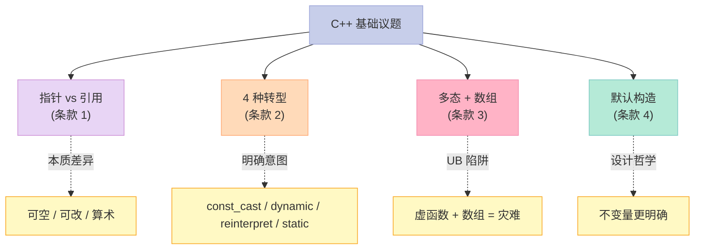
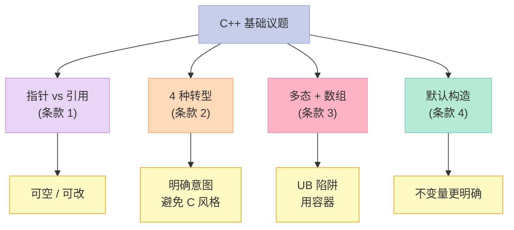

> **一句话核心结论**：C++ 的"基础"远不止是语法——**指针与引用的本质区别**、**4 种转型操作符**的明确意图、**多态与数组的危险**、**default constructor 的"非必要不提供"**——这 4 个"基础议题"决定了你是"会写 C++"还是"懂 C++"。

---

## 系列导航

| # | 文章 | 状态 |
|:--|:--|:--|
| 0 | [系列总览](/2026/06/18/more-effective-cpp-00-series-index/) | ✅ 已发布 |
| 1 | [本文：基础议题](/2026/06/18/more-effective-cpp-01-basics/) | ✅ 已发布 |
| 2 | 操作符：用户定义转换、operator= 深度思考 | 🔜 计划中 |
| 3 | 异常（上）：异常安全 + RAII | 🔜 计划中 |
| ... | ... | ... |

---

## 前言：为什么"基础议题"也重要？

每个 C++ 程序员都学过指针、引用、转型——但**学懂**和**会用**是两码事。



---

## 一、条款 1：仔细区别 pointers 和 references

### 1.1 指针 vs 引用：4 大本质差异

```cpp
// 指针：可空、可改、可做算术
int a = 42;
int* p = &a;        // 指向 a
int* p2 = nullptr;  // ✅ 可以为空
p = nullptr;        // ✅ 可以改指向
p++;                // ✅ 可以做算术（危险！）

// 引用：必须有、不可改、不能算术
int& r = a;         // 绑定到 a
// int& r2;         // ❌ 引用必须绑定对象
// r = nullptr;     // ❌ 引用不能为空
// r++;             // ⚠️ 这是修改 a 的值，不是改引用
```

| 维度 | 指针 | 引用 |
|------|------|------|
| **可空** | ✅（`nullptr`） | ❌（必须绑定） |
| **可改** | ✅（可重新指向） | ❌（不能重新绑定） |
| **算术** | ✅（`p++` 等） | ❌ |
| **大小** | 8 bytes（64-bit） | 通常是"别名"——不占空间 |

### 1.2 4 个"用错"案例

#### 案例 1：引用绑定到 local 对象

```cpp
// ❌ 反例
const std::string& bad() {
    std::string s = "hello";
    return s;  // 灾难：s 析构后引用悬空
}

// ✅ 正解
const std::string good() {
    return "hello";  // 值返回
}
```

#### 案例 2：指针 vs 引用的选择

```cpp
// 当"可空"有意义时——用指针
void f(int* p);  // 传 nullptr 表示"无值"
f(nullptr);      // ✅ 明确

// 当"必须有"有意义时——用引用
void f(int& r);  // 调用方必须传有效 int
f(x);            // 不会"忘记检查"
```

#### 案例 3：指针 vs 引用的"实现成本"

```cpp
// 引用通常被实现为"const 指针"——汇编中没区别
int& r = a;     // 编译为：lea r, [a] + 类型标记
int* p = &a;    // 编译为：lea p, [a]

// 但 C++ 语义不同：
// - 引用"不能为空"——编译器可以优化
// - 引用"不能改"——编译器可以缓存
```

#### 案例 4：操作符重载的引用

```cpp
// ✅ operator[] 返回引用——支持赋值
class Vector {
    double data_[10];
public:
    double& operator[](int i) { return data_[i]; }
};

Vector v;
v[0] = 3.14;  // ✅ 等价于 v.data_[0] = 3.14
```

### 1.3 实战决策表

| 场景 | 用什么？ |
|------|----------|
| 可空 | 指针 |
| 必须有 | 引用 |
| 算术 | 指针 |
| 操作符 `[]` 返回 | 引用（要支持赋值） |
| 实现 operator= | 引用（链式赋值） |
| 迭代器 | 看情况（指针-like） |
| `const` 参数 | `const T&`（避免拷贝） |

### 1.4 关键启示

1. **指针 = "可空可改"**——有"特殊值"的语义
2. **引用 = "必须有且不变"**——有"必然存在"的语义
3. **优先用引用**（`const T&`）——除非真的需要指针
4. **绝不要返回 local 对象的引用**——UB

---

## 二、条款 2：最好使用 C++ 转型操作符

### 2.1 4 种 C++ 转型操作符

```cpp
// 1. const_cast：移除 const / volatile
const int* p = &x;
int* q = const_cast<int*>(p);

// 2. dynamic_cast：安全的下行转型（运行时检查）
Base* pb = new Derived();
Derived* pd = dynamic_cast<Derived*>(pb);  // 失败时返回 nullptr

// 3. reinterpret_cast：位级重解释
int* p = ...;
intptr_t addr = reinterpret_cast<intptr_t>(p);

// 4. static_cast：隐式转换、显式类型转换
double d = 3.14;
int i = static_cast<int>(d);  // 3
```

### 2.2 为什么不用 C 风格转型？

```cpp
// C 风格转型（不推荐）
int* p = (int*)ptr;  // 不知道做了什么——const_cast? reinterpret? static?
```

**问题**：

1. **不明确**——读者不知道"具体做了什么"
2. **可能是"多种之一"**——编译器选择
3. **隐藏 bug**——`const_cast` 误用不易发现

### 2.3 各转型的"能力"对比

| 转型 | 改 const | 改类型 | 安全性 | 速度 |
|------|----------|--------|--------|------|
| `const_cast` | ✅ | ❌（仅 const） | ⚠️（破坏 const） | 最快 |
| `dynamic_cast` | ❌ | ✅（多态下行） | ✅（运行时检查） | 慢 |
| `reinterpret_cast` | ❌ | ✅（位重解释） | ❌（极不安全） | 最快 |
| `static_cast` | ❌ | ✅（隐式转换） | ⚠️（编译期） | 快 |

### 2.4 反例 1：dynamic_cast 误用

```cpp
// ❌ 反例：dynamic_cast 是"设计坏味道"
class Window { public: virtual ~Window() = default; };
class SpecialWindow : public Window { public: void blink(); };

void process(Window* w) {
    if (auto* sw = dynamic_cast<SpecialWindow*>(w)) {  // ❌ 慢 + 设计差
        sw->blink();
    }
}

// ✅ 正解：虚函数
class Window {
public:
    virtual void onTick() {}  // 多态
};
class SpecialWindow : public Window {
    void onTick() override { blink(); }
};

void process(Window* w) {
    w->onTick();  // ✅ 多态
}
```

### 2.5 反例 2：static_cast 误用

```cpp
// ❌ 反例：static_cast 多态下行
class Base { /*...*/ };
class Derived : public Base { /*...*/ };

void process(Base* b) {
    // ❌ 编译期假设 b 是 Derived*——如果错，UB
    auto* d = static_cast<Derived*>(b);
    d->something();
}
```

### 2.6 反例 3：reinterpret_cast 误用

```cpp
// ❌ 反例：reinterpret_cast 几乎总在掩盖 bug
int* p = ...;
char* c = reinterpret_cast<char*>(p);  // 想"看字节"
```

**为什么危险？**

- 编译器不再检查类型
- 跨平台可能错（endianness、alignment）
- 隐藏真正的 bug

### 2.7 关键启示

1. **优先用 `xxx_cast<>`**——明确意图
2. **`dynamic_cast` = 设计坏味道**——用虚函数
3. **`reinterpret_cast` = 极危险**——仅底层
4. **`const_cast` = 改 const**——几乎总在掩盖 bug

---

## 三、条款 3：绝不要以多态方式处理数组

### 3.1 经典陷阱

```cpp
// ❌ 反例：多态 + 数组
class Base { public: virtual ~Base() = default(); };
class Derived : public Base { public: int x_; };

Base* arr[10];  // 静态类型是 Base*
// 假设每个都是 Derived*——Derived 比 Base 大
for (int i = 0; i < 10; ++i) {
    arr[i] = new Derived();  // 实际大小 > Base
}

// 用 Base 数组"步进"算 Derived 数组
Derived* d = static_cast<Derived*>(arr[0]);
// arr[1] 不等于 "Base* 步进 Derived 大小"——灾难
```

**问题**：

- `sizeof(Base) != sizeof(Derived)`——指针步进不一致
- `Base* arr[i]` 假设"步进 sizeof(Base)"——但实际对象是 Derived
- 内存访问错位——灾难

### 3.2 案例：拷贝构造函数被多态"切片"

```cpp
void processArray(ostream& s, const Base arr[], int n) {
    s << "count = " << n << "\n";
    for (int i = 0; i < n; ++i) {
        s << "value = " << arr[i] << "\n";  // 假设 operator<<
    }
}

// 调用
Derived derived[10];
processArray(cout, derived, 10);  // ❌ 切片
```

**问题**：

- `Derived[10]` → `Base*` 隐式转换——切片（派生部分丢失）
- `arr[i]` 步进按 `sizeof(Base)`——但内存布局是 `sizeof(Derived)`
- **可能**"暂时"工作——但完全错

### 3.3 解决方案

```cpp
// ✅ 方案 1：用容器 + 智能指针
std::vector<std::unique_ptr<Base>> vec;
vec.push_back(std::make_unique<Derived>());

// ✅ 方案 2：自己实现"多态数组"
template<typename T>
class Array {
    T* data_;
    size_t size_;
public:
    Array(size_t n) : data_(new T[n]), size_(n) {}
    T& operator[](size_t i) { return data_[i]; }
    // ...
};

Array<Derived> arr(10);
processArray(cout, arr, 10);  // ✅ 类型安全
```

### 3.4 实战原则

```cpp
// 1. 数组的元素类型 = 静态类型
Derived arr[10];   // ✅ OK
Base* arr[10];     // ❌ 多态数组

// 2. 多态对象用容器
std::vector<std::unique_ptr<Base>> vec;  // ✅

// 3. 多态对象的"数组"——其实是"指针数组"
Derived* arr[10];  // ✅ 静态类型是 Derived*
```

### 3.5 关键启示

1. **多态 + 裸数组 = UB**——指针步进错
2. **多态用容器**——`vector<unique_ptr<Base>>`
3. **数组元素的静态类型 = 数组的静态类型**——一致
4. **多态处理时用 `vector<Base*>` 或 `vector<unique_ptr<Base>>`**——但要小心步进

---

## 四、条款 4：非必要不提供 default constructor

### 4.1 什么是 default constructor？

```cpp
class Widget {
    int x_;
    int y_;
public:
    // 默认构造：可无参调用
    Widget() : x_(0), y_(0) {}

    // 用户构造
    Widget(int x, int y) : x_(x), y_(y) {}
};

Widget w1;          // 默认构造
Widget w2(1, 2);    // 用户构造
```

### 4.2 没有默认构造的类

```cpp
// 没有默认构造——必须传值
class Connection {
    std::string host_;
    int port_;
public:
    Connection(const std::string& host, int port)
        : host_(host), port_(port) {}
    // 没有默认构造
};

Connection c("localhost", 8080);  // ✅
Connection c;                    // ❌
```

### 4.3 "非必要不提供"的理由

```cpp
// ❌ 反例：提供默认构造 = 隐含"无参也合法"
class PhoneNumber {
    std::string number_;
public:
    PhoneNumber() : number_("") {}  // ❌ 空 phone number 不合法
    PhoneNumber(const std::string& n) : number_(n) {}
};

PhoneNumber p;       // ❌ 不合法但通过编译
p.sendCall();        // 用空 number 发——灾难
```

**问题**：

- 默认构造隐含"无值也合法"
- "不变量"被破坏

### 4.4 解决方案

```cpp
// ✅ 方案 1：不提供默认构造
class PhoneNumber {
    std::string number_;
public:
    explicit PhoneNumber(const std::string& n) : number_(n) {}
    // 没默认构造
};

// ✅ 方案 2：提供有意义的默认
class PhoneNumber {
    std::string number_;
    static const std::string DEFAULT;
public:
    PhoneNumber() : number_(DEFAULT) {}  // "000-0000"
    explicit PhoneNumber(const std::string& n) : number_(n) {}
};
```

### 4.5 实战：没有默认构造的影响

```cpp
// 影响 1：不能用于某些容器
class NoDefault {
    int x_;
public:
    NoDefault(int x) : x_(x) {}
};

// std::vector<NoDefault> v(10);  // ❌ 没有默认构造，不能 resize

// 影响 2：不能用于某些算法
std::set<NoDefault> s;  // ❌ 必须传 NoDefault 对象

// 影响 3：必须显式构造
class Widget {
    NoDefault n_;  // ❌ Widget 也不能有默认构造
public:
    Widget(int x) : n_(x) {}
    // 必须显式初始化 n_
};
```

### 4.6 关键启示

1. **不提供默认构造 = 强制用户给值**——更明确
2. **默认构造隐含"无值合法"**——可能破坏不变量
3. **没有默认构造的类不能用 `vector<T>(n)`**——必须 `vector<T>(n, value)`
4. **"非必要不提供"是设计哲学**——清晰胜过便利

---

## 五、4 个条款的"基础议题"全景



**核心思路**：

- **指针 vs 引用**：可空可改 → 用指针；必须有且不变 → 用引用
- **4 种转型**：明确意图，避免 C 风格的"模糊"
- **多态 + 数组**：用容器替代裸数组
- **默认构造**：非必要不提供——强制明确不变量

---

## 六、常见误区与陷阱

### 6.1 误区 1：返回 local 对象的引用

```cpp
// ❌
const std::string& bad() {
    std::string s = "hello";
    return s;
}

// ✅
const std::string good() {
    return "hello";  // 值返回
}
```

### 6.2 误区 2：动态转型用 static_cast

```cpp
// ❌ 编译期假设——错时 UB
auto* d = static_cast<Derived*>(b);

// ✅ 运行时检查
auto* d = dynamic_cast<Derived*>(b);
if (d) { /*...*/ }
```

### 6.3 误区 3：多态数组

```cpp
// ❌ 步进错
Base* arr[10];  // 实际是 Derived*——UB

// ✅ 用容器
std::vector<std::unique_ptr<Base>> vec;
```

### 6.4 误区 4：所有类都提供默认构造

```cpp
// ❌ 默认构造 = 隐含"无值合法"
class Connection {
    Connection() {}  // 不合法
};

// ✅ 强制传值
class Connection {
    Connection(const std::string& host, int port);
};
```

---

## 七、C++11/14/17 的演进

| 主题 | C++98 时代 | C++11/14/17 时代 |
|------|------------|-----------------|
| 转型 | `xxx_cast<>` | 同 |
| 智能指针 | `auto_ptr` | `unique_ptr` / `shared_ptr` |
| 容器 | 裸数组 | 容器 + 范围 for |
| 引用 | 引用 | 右值引用 + 移动语义 |
| 数组 | `T arr[N]` | `std::array` / `std::vector` |
| default | `Widget() {}` | `Widget() = default;` |
| 构造 | 普通 | `explicit` / 委托构造 |

**C++11 的右值引用**：

```cpp
void f(int& lref);        // 接受左值
void f(int&& rref);       // 接受右值
f(42);                    // 调 f(int&&)
f(x);                     // 调 f(int&)
```

**C++11 的 `= default`**：

```cpp
class Widget {
public:
    Widget() = default;  // 显式要求编译器生成
    Widget(int x) : x_(x) {}
private:
    int x_ = 0;  // 默认成员初始化
};
```

---

## 八、面试高频考点

### 8.1 必背题

| 题目 | 答案要点 |
|------|----------|
| 指针 vs 引用的区别？ | 指针可空可改；引用必须有不变 |
| 4 种 C++ 转型？ | const_cast / dynamic_cast / reinterpret_cast / static_cast |
| 为什么不推荐 C 风格转型？ | 不明确，编译器自动选 |
| dynamic_cast 慢在哪？ | RTTI 运行时检查 |
| 多态 + 数组为什么是 UB？ | 指针步进按静态类型，内存布局按动态类型 |
| 什么时候不提供默认构造？ | 类有"必须有值"的不变量时 |
| operator[] 返回什么？ | 引用——支持赋值 |
| 引用可以为空吗？ | 不可以——必须绑定对象 |

### 8.2 高频追问

| 追问 | 关键点 |
|------|--------|
| 引用是 const 指针吗？ | 编译器通常这样实现，但语义不同 |
| dynamic_cast 失败返回什么？ | 指针：nullptr；引用：抛 bad_cast |
| reinterpret_cast 危险在哪？ | 不检查类型，跨平台可能错 |
| 为什么多态 + 数组是 UB？ | 步进按 sizeof(Base)，实际是 sizeof(Derived) |
| 没有默认构造的类能用 vector 吗？ | 能，但不能用 `vector<T>(n)` |
| 委托构造是 C++11 的什么？ | 一个构造调另一个构造 |

---

## 九、配套实验

### 9.1 实验 1：指针 vs 引用的本质

```cpp
// 文件：pointer_vs_reference.cpp
#include <iostream>

int main() {
    int a = 42;

    // 指针
    int* p = &a;
    int* p2 = nullptr;  // ✅ 可空
    p = nullptr;        // ✅ 可改
    // p++;             // ⚠️ 算术（修改指针指向）

    // 引用
    int& r = a;
    // int& r2;        // ❌ 必须绑定
    // r = nullptr;    // ❌ 引用不能为空
    // r++;            // ⚠️ 是修改 a，不是引用

    std::cout << "a = " << a << "\n";
    std::cout << "p = " << (p ? "valid" : "null") << "\n";
    std::cout << "r = " << r << "\n";

    return 0;
}
```

### 9.2 实验 2：4 种转型

```cpp
// 文件：four_casts.cpp
#include <iostream>

class Base { public: virtual ~Base() = default; };
class Derived : public Base { public: int x = 42; };

int main() {
    Base* b = new Derived();

    // 1. dynamic_cast：安全下行
    if (auto* d = dynamic_cast<Derived*>(b)) {
        std::cout << "dynamic_cast OK: " << d->x << "\n";
    }

    // 2. static_cast：编译期假设
    auto* d2 = static_cast<Derived*>(b);
    std::cout << "static_cast: " << d2->x << "\n";

    // 3. const_cast
    const int* cp = &d2->x;
    int* np = const_cast<int*>(cp);
    *np = 100;  // ⚠️ 改 const——可能 UB
    std::cout << "after const_cast: " << d2->x << "\n";

    // 4. reinterpret_cast
    intptr_t addr = reinterpret_cast<intptr_t>(b);
    std::cout << "address: 0x" << std::hex << addr << "\n";

    delete b;
    return 0;
}
```

### 9.3 实验 3：多态 + 数组的危险

```cpp
// 文件：polymorphic_array_ub.cpp
#include <iostream>

class Base {
public:
    virtual ~Base() = default;
    virtual int size() const { return 4; }
};

class Derived : public Base {
public:
    int extra_;
    Derived() : extra_(100) {}
    int size() const override { return sizeof(Derived); }
};

int main() {
    // ❌ 多态数组——UB
    Base* arr[3];
    for (int i = 0; i < 3; ++i) {
        arr[i] = new Derived();
    }

    // 用 Base 步进 Derived 数组——灾难
    std::cout << "arr[0] size = " << arr[0]->size() << "\n";
    std::cout << "arr[1] size = " << arr[1]->size() << "\n";
    std::cout << "arr[2] size = " << arr[2]->size() << "\n";
    // 实际是巧合：数组的"基类指针步进"是 sizeof(Base)
    // 但每"步"实际跳过了 sizeof(Derived) 的内存

    // 清理
    for (int i = 0; i < 3; ++i) {
        delete arr[i];  // ✅ 调虚析构
    }

    return 0;
}
```

### 9.4 实验 4：默认构造的设计

```cpp
// 文件：default_ctor_design.cpp
#include <iostream>
#include <string>

// ❌ 反例：提供默认构造——隐含"无值合法"
class BadEmail {
    std::string address_;
public:
    BadEmail() : address_("") {}  // ❌ 空 email
    explicit BadEmail(const std::string& a) : address_(a) {}
    void send() const {
        if (address_.empty()) {
            std::cerr << "No email!\n";
            return;
        }
        std::cout << "Send to: " << address_ << "\n";
    }
};

// ✅ 正例：不提供默认构造——强制有值
class GoodEmail {
    std::string address_;
public:
    explicit GoodEmail(const std::string& a) : address_(a) {
        if (a.empty()) throw std::invalid_argument("empty email");
    }
    void send() const {
        std::cout << "Send to: " << address_ << "\n";
    }
};

int main() {
    BadEmail b1;  // 编译通过——但语义上不合法
    b1.send();    // "No email!"

    // GoodEmail g1;  // ❌ 编译错误
    GoodEmail g2("alice@example.com");
    g2.send();

    return 0;
}
```

---

## 十、回到 4 条黄金法则

| 条款 | 黄金法则 |
|------|----------|
| 01 | 指针 = "可空可改"；引用 = "必须有且不变" |
| 02 | 优先用 `xxx_cast<>`——明确意图 |
| 03 | 多态 + 数组 = UB；用容器 + 智能指针 |
| 04 | 非必要不提供默认构造——强制不变量明确 |

---

## 十一、结尾思考题

> **思考题 1**：以下代码有什么问题？

```cpp
class Base { public: virtual ~Base() = default(); };
class Derived : public Base { public: int x; Derived() : x(42) {} };

Base* arr = new Derived[10];
for (int i = 0; i < 10; ++i) {
    // 用 arr[i] 处理...
}
delete[] arr;
```

> **思考题 2**：实现一个 `String` 类，要求：不能默认构造（必须有初始值）。

> **思考题 3**：为什么 `dynamic_cast` 在 C++ 中被认为是"设计坏味道"？怎么用虚函数替代？

> **思考题 4**：指针和引用在汇编层是同一个东西吗？C++ 做了什么"额外"的事？

> **思考题 5**：你的项目里有哪些"提供默认构造但应该不提供"的类？举例说明。

---

## 十二、本篇速查表

| 主题 | 关键 API / 模式 | 适用场景 |
|------|----------------|----------|
| 指针 vs 引用 | 指针可空可改；引用必须不变 | 函数参数、变量定义 |
| 4 种转型 | `const_cast` / `dynamic_cast` / `reinterpret_cast` / `static_cast` | 明确意图 |
| 多态 + 数组 | 用容器替代 | 任何"多态集合" |
| 默认构造 | 非必要不提供 | 设计哲学 |
| operator[] | 返回引用 | 容器 |
| `const T&` | 传引用不拷贝 | 函数参数 |

---

## 十三、系列导航

| # | 文章 | 状态 |
|:--|:--|:--|
| 0 | [系列总览](/2026/06/18/more-effective-cpp-00-series-index/) | ✅ 已发布 |
| 1 | [本文：基础议题](/2026/06/18/more-effective-cpp-01-basics/) | ✅ 已发布 |
| 2 | 操作符：用户定义转换、operator= 深度思考 | 🔜 计划中 |
| 3 | 异常（上）：异常安全 + RAII | 🔜 计划中 |
| 4 | 异常（下）：异常规格、throw 列表、构造异常 | 🔜 计划中 |
| 5 | 效率（上）：lazy evaluation、临时对象、RVO | 🔜 计划中 |
| 6 | 效率（下）：重载、operator new、内存池、inline | 🔜 计划中 |
| 7 | 技术：虚拟构造、智能指针、引用计数、双重分派 | 🔜 计划中 |
| 8 | 杂项 + 总结：未来时态、标准库、命名空间 | 🔜 计划中 |

---

**下一篇**：第 2 篇《操作符：用户定义转换、operator= 深度思考》——条款 5-8 一起讲透：C++ 操作符的"深水区"——用户定义转换的"静默"陷阱、increment/decrement 的前置 vs 后置、绝不要重载 `&&` `||` `,`、`new` `delete` 的"3 个意义"。

> **行动建议**：
> 1. **今天**：用 `const_cast` / `dynamic_cast` / `static_cast` 替换你项目里的 C 风格转型
> 2. **今天**：检查你的多态数组——改用 `vector<unique_ptr<Base>>`
> 3. **本周**：识别你项目里"不必要提供默认构造"的类
> 4. **本周**：把所有"用 C 风格转型"的地方改成 C++ 转型
> 5. **思考**：你的项目里有哪些"指针可以改为引用"的地方？
