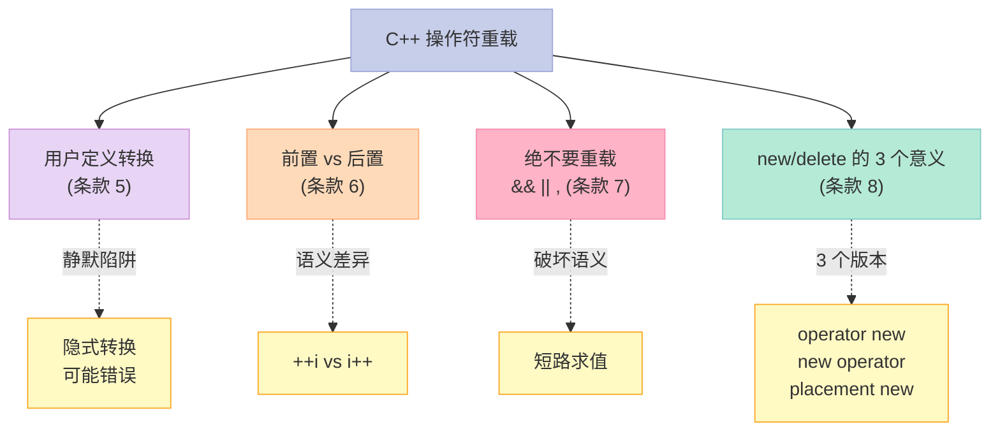
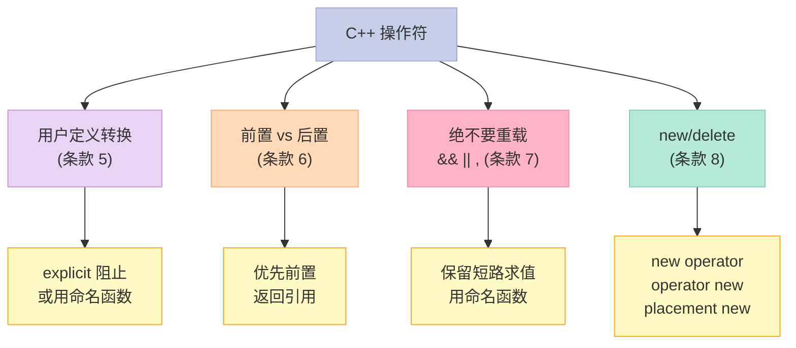

> **一句话核心结论**：C++ 操作符重载的"深水区"——**用户定义转换会"静默"发生**、**前置 vs 后置的语义差异**、**`&&` `||` `,` 绝不要重载**、**`new` `delete` 的 3 个意义**。这 4 个条款决定了你写的"重载"是"地道"还是"踩坑"。

---

## 系列导航

| # | 文章 | 状态 |
|:--|:--|:--|
| 0 | [系列总览](/2026/06/18/more-effective-cpp-00-series-index/) | ✅ 已发布 |
| 1 | [基础议题](/2026/06/18/more-effective-cpp-01-basics/) | ✅ 已发布 |
| 2 | [本文：操作符](/2026/06/18/more-effective-cpp-02-operators/) | ✅ 已发布 |
| 3 | 异常（上）：异常安全 + RAII | 🔜 计划中 |
| ... | ... | ... |

---

## 前言：操作符重载的"深水区"

C++ 操作符重载是 C 的"超能力"——但**用得不对 = 灾难**。



---

## 一、条款 5：对定制的"类型转换函数"保持警觉

### 1.1 两种用户定义转换

```cpp
// 1. 单参数构造（隐式转换）
class String {
public:
    String(const char* s);  // 隐式：const char* → String
};

void process(const String& s);

process("hello");  // ✅ 隐式转换
```

```cpp
// 2. operator T() 转换函数
class Rational {
public:
    operator double() const;  // 隐式：Rational → double
};

Rational r(1, 2);
double d = r;  // ✅ 隐式转换
```

### 1.2 反例 1：静默转换的灾难

```cpp
// ❌ 反例
class Rational {
public:
    Rational(int numerator = 0, int denominator = 1) : n_(numerator), d_(denominator) {}
    operator double() const { return static_cast<double>(n_) / d_; }
private:
    int n_, d_;
};

Rational r(1, 2);
double d = r;  // ✅ 0.5
// 但：

Rational r1(100, 1);
Rational r2(8, 1);
double d = r1 / r2;  // ❌ 调 operator double()，再相除
                     // 100 / 8 = 12.5——但 r1/r2 在 Rational 语义下应该是 100/8 = 12.5/1
                     // 这里"巧合"——但很多场景下会出错
```

### 1.3 反例 2：模板中的"静默"转换

```cpp
// ❌ 灾难：operator double() 让模板推导"误入歧途"
template<typename T>
void process(const T& x) {
    // ...
}

Rational r(1, 2);
process(r);  // T 推导为 Rational（✅）

// 但如果：
double d = 3.14;
process(d);  // T 推导为 double（✅）

// 问题场景：
void f(Rational r);
f(3.14);  // ❌ 3.14 → double → Rational？——实际是 double → Rational 通过单参数构造
```

### 1.4 解决方案：用 explicit 阻止隐式

```cpp
// ✅ 方案 1：explicit 转换函数（C++11 起）
class Rational {
public:
    explicit operator double() const { return static_cast<double>(n_) / d_; }
    // ...
};

Rational r(1, 2);
// double d = r;  // ❌ 显式转换函数不能隐式
double d = static_cast<double>(r);  // ✅ 显式
```

```cpp
// ✅ 方案 2：explicit 构造
class String {
public:
    explicit String(const char* s);
};

void process(const String& s);

process("hello");        // ❌ 隐式转换被阻止
process(String("hello")); // ✅ 显式
```

### 1.5 替代方案：命名函数

```cpp
// ✅ 方案 3：用命名函数代替转换函数
class Rational {
public:
    double asDouble() const { return static_cast<double>(n_) / d_; }
    // ...
};

Rational r(1, 2);
double d = r.asDouble();  // 显式意图
```

### 1.6 关键启示

1. **用户定义转换会"静默"**——编译器默默转换
2. **优先用 `explicit`**——避免隐式转换
3. **优先用命名函数**——比转换函数更明确
4. **C++11 起的 `explicit`**——单参数构造 + 转换函数

---

## 二、条款 6：区别 increment/decrement 操作符的前置和后置形式

### 2.1 前置 vs 后置的语义

```cpp
// i++（后置）
// 1. 保存当前值
// 2. i 增加
// 3. 返回保存的值（"原值"）

// ++i（前置）
// 1. i 增加
// 2. 返回 i（"新值"）
```

**C++ 中**：

```cpp
int i = 0;
int a = i++;  // a = 0, i = 1
int b = ++i;  // b = 2, i = 2
```

### 2.2 重载前置和后置

```cpp
class Counter {
    int value_;
public:
    Counter(int v = 0) : value_(v) {}

    // 前置 ++i：返回引用
    Counter& operator++() {
        ++value_;
        return *this;
    }

    // 后置 i++：返回新对象（"原值"）
    Counter operator++(int) {  // int 是占位参数——区分前置
        Counter temp(*this);
        ++value_;
        return temp;
    }
};
```

**关键差异**：

| 维度 | 前置 | 后置 |
|------|------|------|
| 返回类型 | `T&` | `T`（值） |
| 实现 | 直接修改 | 保存+修改+返回临时 |
| 性能 | 优 | 劣（拷贝） |
| 语义 | "先加后用" | "先用后加" |

### 2.3 性能对比

```cpp
// ✅ 优先前置
++counter;        // O(1)
counter++;        // O(1) + 一次构造 + 一次析构

// 为什么？
// 后置要：保存当前对象 + 修改 + 返回临时对象
// 多了一次构造 + 一次析构 + 一次拷贝
```

### 2.4 实战：迭代器的 `++`

```cpp
// STL 迭代器通常前置更高效
std::vector<int> v = {1, 2, 3, 4, 5};
auto it = v.begin();

while (it != v.end()) {
    // ✅ 前置
    std::cout << *it++ << "\n";  // 等价于 *(it++),后置
}

// 优化版本（少一次"假装"修改）
while (it != v.end()) {
    std::cout << *it << "\n";
    ++it;
}
```

### 2.5 重载 `-` `-=`

```cpp
class Counter {
    int value_;
public:
    Counter& operator--() {       // 前置
        --value_;
        return *this;
    }
    Counter operator--(int) {    // 后置
        Counter temp(*this);
        --value_;
        return temp;
    }

    // 复合操作符
    Counter& operator+=(int n) { value_ += n; return *this; }
    Counter& operator-=(int n) { value_ -= n; return *this; }
};
```

### 2.6 关键启示

1. **前置返回引用**——效率高
2. **后置返回值**——有拷贝成本
3. **优先前置 `++i`/`--i`**——除非真的需要"原值"
4. **重载后置的 `int` 是占位参数**——编译器用签名区分

---

## 三、条款 7：千万不要重载 `&&`, `||` 和 `,`

### 3.1 为什么这 3 个不能重载？

| 操作符 | 原本语义 | 重载后问题 |
|--------|----------|------------|
| `&&` | **短路求值** | 重载后变成"函数调用"——所有参数必先求值 |
| `\|\|` | **短路求值** | 同上 |
| `,` | **从左到右求值** | 重载后变成"函数调用"——求值顺序改变 |

### 3.2 反例 1：`&&` 的短路求值

```cpp
// 内置类型——短路求值
int* p = ...;
if (p && p->isValid()) {  // p 为 nullptr 时，不调 isValid
    // ...
}

// 重载 &&——失去短路
class Widget {
public:
    operator bool() const;  // 让 Widget 能"在 bool 上下文"
};

Widget w1, w2;
if (w1 && w2) {  // ❌ 不是"短路求值"
    // w1 && w2 是"函数调用"——两个参数都先求值
    // w1 和 w2 的 operator bool() 都被调
}
```

### 3.3 反例 2：`,` 的求值顺序

```cpp
// 内置类型——从左到右
int a, b;
(a = 1, b = 2);  // a=1, b=2, 表达式值 = 2

// 重载 ,——求值顺序不可预期
class Widget {
public:
    Widget& operator,(const Widget& rhs);  // ❌ 灾难
};

Widget w1, w2;
(w1, w2);  // 函数调用——求值顺序依赖编译器
```

### 3.4 解决方案

```cpp
// ❌ 不要重载
class Widget {
    bool operator&&(const Widget& rhs);  // 灾难
};

// ✅ 用命名函数
class Widget {
public:
    bool bothValid(const Widget& rhs) const;
};

if (w1.bothValid(w2)) { /*...*/ }  // 明确
```

### 3.5 关键启示

1. **`&&` / `||` 重载 = 失去短路**——静默 bug
2. **`,` 重载 = 失去求值顺序**——不可预期
3. **用命名函数**——明确意图
4. **`&` 和 `|` 可以重载**——但要小心

---

## 四、条款 8：了解 new/delete 的不同意义

### 4.1 3 个 new 的含义

```cpp
// 1. new operator（C++ 语言操作符）
Widget* p = new Widget(42);
// 实际做 3 件事：
// 1) 调用 operator new 分配内存
// 2) 调用 Widget 构造函数
// 3) 返回指针

// 2. operator new（普通函数）
void* mem = operator new(sizeof(Widget));
// 只分配内存——不调用构造

// 3. placement new（带额外参数）
void* mem2 = operator new(sizeof(Widget), somePtr);
// 在 somePtr 上构造（不分配新内存）
```

### 4.2 对应的 3 个 delete

```cpp
// 1. delete operator
delete p;  // 调析构 + 调 operator delete

// 2. operator delete
operator delete(mem);  // 只释放内存

// 3. placement delete
operator delete(mem, somePtr);  // 配套 placement new
```

### 4.3 实战 1：自定义 operator new

```cpp
// 类特定的 operator new
class Widget {
public:
    static void* operator new(std::size_t size) {
        std::cout << "Widget::new(size=" << size << ")\n";
        return ::operator new(size);
    }
    static void operator delete(void* p) {
        std::cout << "Widget::delete\n";
        ::operator delete(p);
    }
    // ...
};

Widget* w = new Widget();  // 调 Widget::operator new
delete w;                  // 调 Widget::operator delete
```

### 4.4 实战 2：placement new

```cpp
// 栈上构造大对象
class BigObject { /*...*/ };

alignas(BigObject) char buffer[sizeof(BigObject)];

// placement new：在 buffer 上构造
BigObject* obj = new (buffer) BigObject();

// 显式析构
obj->~BigObject();

// 不用 delete——buffer 是栈上的
```

### 4.5 实战 3：内存池

```cpp
class MemoryPool {
    static constexpr std::size_t CHUNK = 4096;
    // ...
public:
    void* allocate(std::size_t n);
    void deallocate(void* p);
};

class PooledObject {
public:
    static void* operator new(std::size_t size) {
        return pool_.allocate(size);
    }
    static void operator delete(void* p, std::size_t size) {
        pool_.deallocate(p, size);
    }
private:
    static MemoryPool pool_;
};
```

### 4.6 关键启示

1. **`new` operator** = 分配 + 构造
2. **`operator new`** = 只分配
3. **`placement new`** = 在指定位置构造
4. **配套的 delete**——placement new 必配套 placement delete

---

## 五、4 个条款的"操作符"全景



---

## 六、常见误区与陷阱

### 6.1 误区 1：用户定义转换不阻止隐式

```cpp
// ❌
class String {
    String(const char* s);  // 隐式
};
void process(const String&);
process("hello");  // 隐式——可能"意外"

// ✅
class String {
    explicit String(const char* s);
};
```

### 6.2 误区 2：用后置 ++ 在循环中

```cpp
// ❌ 性能差
for (auto it = v.begin(); it != v.end(); it++) { /*...*/ }

// ✅ 优先前置
for (auto it = v.begin(); it != v.end(); ++it) { /*...*/ }
```

### 6.3 误区 3：重载 `&&` `||`

```cpp
class Widget {
    bool operator&&(const Widget& rhs);  // ❌ 失去短路
};
```

### 6.4 误区 4：placement new 漏 placement delete

```cpp
// ❌
class Widget {
    void* operator new(std::size_t size, void* ptr);
    // 漏了 placement delete
};

// ✅
class Widget {
    void* operator new(std::size_t size, void* ptr);
    void operator delete(void* ptr, void*);  // 配套
};
```

---

## 七、C++11/14/17 的演进

| 主题 | C++98 时代 | C++11/14/17 时代 |
|------|------------|-----------------|
| 转换函数 | 默认允许隐式 | `explicit` 阻止 |
| 单参数构造 | 默认隐式 | `explicit` 阻止 |
| ++ 后置 | 返回值 | 同 |
| 重载 `&&` `\|\|` | 不推荐 | 同 |
| new | 3 个意义 | 同 |
| placement new | 用于栈构造 | 同 + 内存池 |
| 自定义 new | 类特定 | 同 |
| 智能指针 | `auto_ptr` | `unique_ptr` + placement 配合 |

**C++11 的 `explicit` 转换函数**：

```cpp
class Widget {
public:
    explicit operator bool() const;
    // 不能再做隐式转换
};
```

---

## 八、面试高频考点

### 8.1 必背题

| 题目 | 答案要点 |
|------|----------|
| 什么是用户定义转换？ | 单参数构造 + operator T() |
| 为什么用 explicit？ | 阻止隐式转换，避免"静默" |
| 前置 vs 后置 ++？ | 前置返回引用，效率高；后置返回值 |
| 为什么不能重载 && \|\| , ？ | 失去短路求值 / 求值顺序 |
| new 的 3 个意义？ | new operator / operator new / placement new |
| 什么是 placement new？ | 在指定位置构造对象 |
| placement new 配套什么？ | placement delete |

### 8.2 高频追问

| 追问 | 关键点 |
|------|--------|
| `++i` 比 `i++` 快在哪？ | 后置多一次构造+析构+拷贝 |
| 重载 `&&` 的具体问题？ | 失去短路——所有参数都求值 |
| 为什么 `,` 不能重载？ | 改变求值顺序 |
| new operator 做了什么？ | 分配 + 构造 + 返回 |
| operator new 可以被重载吗？ | 可以——类特定 / 全局 |

---

## 九、配套实验

### 9.1 实验 1：explicit 阻止隐式

```cpp
// 文件：explicit_demo.cpp
#include <iostream>
#include <string>

class String {
    std::string s_;
public:
    explicit String(const char* s) : s_(s) {}
    const std::string& data() const { return s_; }
};

void process(const String& s) {
    std::cout << s.data() << "\n";
}

int main() {
    // process("hello");  // ❌ 隐式转换被阻止
    process(String("hello"));  // ✅ 显式
    return 0;
}
```

### 9.2 实验 2：前置 vs 后置 ++

```cpp
// 文件：pre_post_increment.cpp
#include <iostream>

class Counter {
    int value_ = 0;
public:
    Counter& operator++() {       // 前置
        ++value_;
        return *this;
    }
    Counter operator++(int) {    // 后置
        Counter temp(*this);
        ++value_;
        return temp;
    }
    int value() const { return value_; }
};

int main() {
    Counter c;
    ++c;  // 前置
    std::cout << "after ++c: " << c.value() << "\n";

    c++;  // 后置
    std::cout << "after c++: " << c.value() << "\n";

    Counter c2 = ++c;  // c 先 +1，再赋值给 c2
    std::cout << "c=" << c.value() << " c2=" << c2.value() << "\n";

    Counter c3 = c++;  // c 先 +1，再把"原值"赋给 c3
    std::cout << "c=" << c.value() << " c3=" << c3.value() << "\n";

    return 0;
}
```

### 9.3 实验 3：placement new

```cpp
// 文件：placement_new_demo.cpp
#include <iostream>
#include <new>

class BigObject {
    int data_ = 42;
public:
    BigObject() { std::cout << "BigObject ctor\n"; }
    ~BigObject() { std::cout << "BigObject dtor\n"; }
    int data() const { return data_; }
};

int main() {
    alignas(BigObject) char buffer[sizeof(BigObject)];

    BigObject* obj = new (buffer) BigObject();
    std::cout << "data = " << obj->data() << "\n";

    // 显式析构
    obj->~BigObject();
    return 0;
}
```

### 9.4 实验 4：3 种 new 的区别

```cpp
// 文件：three_news.cpp
#include <iostream>
#include <new>

class Widget {
    int x_;
public:
    Widget(int x) : x_(x) { std::cout << "Widget(" << x << ") ctor\n"; }
    ~Widget() { std::cout << "Widget(" << x_ << ") dtor\n"; }
    int x() const { return x_; }
};

int main() {
    // 1. new operator（分配 + 构造）
    std::cout << "=== new operator ===\n";
    Widget* w1 = new Widget(1);  // 调 operator new + Widget(1)
    delete w1;                   // 调 ~Widget + operator delete

    // 2. operator new（只分配）
    std::cout << "\n=== operator new ===\n";
    void* mem = operator new(sizeof(Widget));
    Widget* w2 = new (mem) Widget(2);  // 用 operator new 分配的内存
    w2->~Widget();
    operator delete(mem);

    // 3. placement new（在指定位置）
    std::cout << "\n=== placement new ===\n";
    alignas(Widget) char buf[sizeof(Widget)];
    Widget* w3 = new (buf) Widget(3);  // 在 buf 上构造
    w3->~Widget();

    return 0;
}
```

---

## 十、回到 4 条黄金法则

| 条款 | 黄金法则 |
|------|----------|
| 05 | 转换函数要 explicit——避免"静默"转换 |
| 06 | 优先前置 `++i`/`--i`——返回引用，效率高 |
| 07 | 绝不重载 `&&` `\|\|` `,`——保留短路与求值顺序 |
| 08 | 区分 `new` 的 3 个意义：new operator / operator new / placement new |

---

## 十一、结尾思考题

> **思考题 1**：为什么 `operator double()` 在 Rational 类里是"危险"的？用 `explicit` + 命名函数改进。

> **思考题 2**：`i++` 比 `++i` 慢在哪里？给出反汇编对比。

> **思考题 3**：实现一个简单的 `Counter` 类，前置/后置都重载。`++c` 和 `c++` 在汇编层的差异是什么？

> **思考题 4**：解释 `new operator` 做了哪 3 件事。如果自定义 `operator new` 但不重载 `new operator`，结果会怎样？

> **思考题 5**：placement new + placement delete 的"构造失败时"具体指什么？

---

## 十二、本篇速查表

| 主题 | 关键 API / 模式 | 适用场景 |
|------|----------------|----------|
| 用户定义转换 | `explicit` / 命名函数 | 避免隐式 |
| 前置 ++ | 返回引用 | 性能 |
| 后置 ++ | 返回值（"原值"） | "先用后加" |
| 重载 `&&` `\|\|` | 绝不做 | 保留短路 |
| 重载 `,` | 绝不做 | 保留求值顺序 |
| new operator | 分配 + 构造 | 日常 |
| operator new | 只分配 | 自定义内存管理 |
| placement new | 指定位置 | 栈构造 / 内存池 |

---

## 十三、系列导航

| # | 文章 | 状态 |
|:--|:--|:--|
| 0 | [系列总览](/2026/06/18/more-effective-cpp-00-series-index/) | ✅ 已发布 |
| 1 | [基础议题](/2026/06/18/more-effective-cpp-01-basics/) | ✅ 已发布 |
| 2 | [本文：操作符](/2026/06/18/more-effective-cpp-02-operators/) | ✅ 已发布 |
| 3 | 异常（上）：异常安全 + RAII | 🔜 计划中 |
| 4 | 异常（下）：异常规格、throw 列表、构造异常 | 🔜 计划中 |
| 5 | 效率（上）：lazy evaluation、临时对象、RVO | 🔜 计划中 |
| 6 | 效率（下）：重载、operator new、内存池、inline | 🔜 计划中 |
| 7 | 技术：虚拟构造、智能指针、引用计数、双重分派 | 🔜 计划中 |
| 8 | 杂项 + 总结：未来时态、标准库、命名空间 | 🔜 计划中 |

---

**下一篇**：第 3 篇《异常（上）：异常安全的 3 大保证 + RAII》——条款 9-12 一起讲透 C++ 异常的"完整图景"：destructor 避免泄漏、constructor 内阻止泄漏、禁止 exception 流出 destructor、抛 exception 与传参的差异。

> **行动建议**：
> 1. **今天**：用 `explicit` 替换你单参数构造
> 2. **今天**：把所有 `i++` 改为 `++i`（如果不需要"原值"）
> 3. **本周**：检查你的项目——是否误重载了 `&&` `||`
> 4. **本周**：用 placement new 实现"栈上构造大对象"
> 5. **思考**：你的项目里有哪些"用户定义转换在静默发生"？
