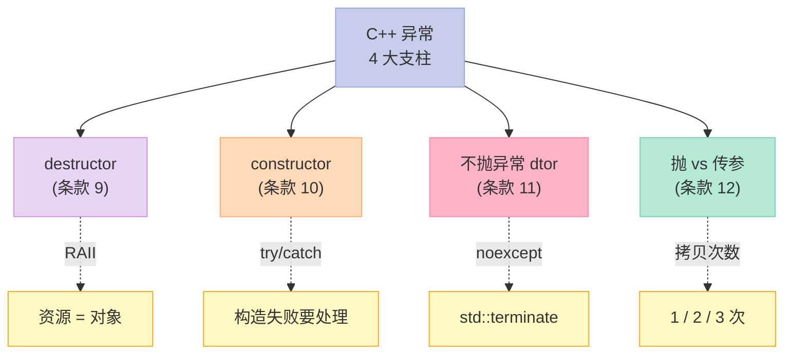
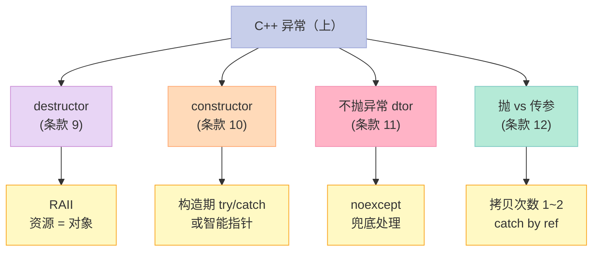

> **一句话核心结论**：C++ 异常安全的**4 大支柱**：**destructor 释放资源**（RAII）、**constructor 内阻止泄漏**（try/catch）、**禁止异常流出 destructor**（`noexcept`）、**理解抛异常 vs 传参的差异**（拷贝次数 1/2/3）。这 4 个条款是 C++ 程序员写"安全代码"的底线。

---

## 系列导航

| # | 文章 | 状态 |
|:--|:--|:--|
| 0 | [系列总览](/2026/06/18/more-effective-cpp-00-series-index/) | ✅ 已发布 |
| 1 | [基础议题](/2026/06/18/more-effective-cpp-01-basics/) | ✅ 已发布 |
| 2 | [操作符](/2026/06/18/more-effective-cpp-02-operators/) | ✅ 已发布 |
| 3 | [本文：异常（上）](/2026/06/18/more-effective-cpp-03-exceptions-part1/) | ✅ 已发布 |
| 4 | 异常（下）：异常规格、throw 列表、构造异常 | 🔜 计划中 |
| ... | ... | ... |

---

## 前言：为什么"异常"是 C++ 的"深水区"？

C++ 异常 = **控制流的"高速通道"**——可以"瞬间"跨越多层函数。但这条通道**有副作用**：资源可能泄漏、不变量可能破坏、析构可能抛异常导致 `std::terminate`。



---

## 一、条款 9：利用 destructor 避免泄漏资源

### 1.1 经典反例

```cpp
// ❌ 反例：手动管理资源 + 异常
void process() {
    Investment* pInv = createInvestment();
    // ... 业务逻辑可能 throw
    delete pInv;  // 可能不执行——泄漏
}
```

**问题**：

- 业务逻辑抛异常 → `delete pInv` 不执行
- 提前 `return` → 同上
- `Investment*` 的所有权在函数内——"散落"在多行

### 1.2 解决方案：智能指针（RAII）

```cpp
// ✅ 方案：RAII 包装
void process() {
    std::unique_ptr<Investment> pInv(createInvestment());
    // ... 业务逻辑
    // pInv 析构自动释放——无论正常退出还是异常
}
```

**为什么 RAII 一定释放？**

- C++ 异常发生时**栈展开**（stack unwinding）
- 栈展开过程中，**所有局部对象的析构函数被调**
- `unique_ptr` 的析构 → `delete` 资源

### 1.3 RAII 的"完整版"模板

```cpp
template<typename T>
class UniquePtr {
    T* ptr_;
public:
    explicit UniquePtr(T* p = nullptr) : ptr_(p) {}
    ~UniquePtr() { delete ptr_; }  // 析构释放

    // 禁止拷贝
    UniquePtr(const UniquePtr&) = delete;
    UniquePtr& operator=(const UniquePtr&) = delete;

    // 允许移动
    UniquePtr(UniquePtr&& other) noexcept : ptr_(other.ptr_) {
        other.ptr_ = nullptr;
    }
    UniquePtr& operator=(UniquePtr&& other) noexcept {
        if (this != &other) {
            delete ptr_;
            ptr_ = other.ptr_;
            other.ptr_ = nullptr;
        }
        return *this;
    }

    T* get() const { return ptr_; }
    T& operator*() const { return *ptr_; }
    T* operator->() const { return ptr_; }
};
```

### 1.4 RAII 的"资源"概念扩展

```cpp
// 锁
class LockGuard {
    Mutex& m_;
public:
    explicit LockGuard(Mutex& m) : m_(m) { m_.lock(); }
    ~LockGuard() { m_.unlock(); }  // 自动解锁
};

{
    LockGuard lg(m);
    // ... 临界区
}  // 自动解锁
```

```cpp
// 文件
class FileHandle {
    FILE* fp_;
public:
    explicit FileHandle(const char* path) : fp_(std::fopen(path, "r")) {
        if (!fp_) throw std::runtime_error("open failed");
    }
    ~FileHandle() {
        if (fp_) std::fclose(fp_);
    }
    FILE* get() const { return fp_; }
};
```

### 1.5 关键启示

1. **资源 = 对象**——构造获取，析构释放
2. **优先用 `std::unique_ptr` / `std::shared_ptr`**——不要自己写
3. **RAII 适用于任何"成对操作"**——文件、锁、连接、socket
4. **异常安全 = 析构"自动"**——C++ 语言的保证

---

## 二、条款 10：在 constructor 内阻止资源泄漏

### 2.1 构造函数的"特殊"问题

```cpp
// ❌ 反例：构造函数中资源泄漏
class Investment {
    Image* pi_;
    Audio* pa_;
public:
    Investment(const std::string& imgPath, const std::string& audioPath) {
        pi_ = new Image(imgPath);
        pa_ = new Audio(audioPath);  // ❌ 假设抛异常
        // pi_ 泄漏！因为 Investment 还没构造完，析构不会调
    }
    ~Investment() {
        delete pi_;
        delete pa_;
    }
};
```

**问题**：

- `new Audio` 抛异常 → 构造函数退出
- 对象没构造完 → **析构函数不调**
- `pi_` 资源泄漏

### 2.2 解决方案 1：try/catch

```cpp
// ✅ 方案 1：try/catch
class Investment {
    Image* pi_;
    Audio* pa_;
public:
    Investment(const std::string& imgPath, const std::string& audioPath) {
        try {
            pi_ = new Image(imgPath);
            pa_ = new Audio(audioPath);
        } catch (...) {
            delete pi_;
            delete pa_;
            throw;  // 重新抛
        }
    }
    ~Investment() {
        delete pi_;
        delete pa_;
    }
};
```

### 2.3 解决方案 2：智能指针（更优）

```cpp
// ✅ 方案 2：智能指针（构造期不抛 = 自动释放）
class Investment {
    std::unique_ptr<Image> pi_;
    std::unique_ptr<Audio> pa_;
public:
    Investment(const std::string& imgPath, const std::string& audioPath)
        : pi_(std::make_unique<Image>(imgPath))    // 1
        , pa_(std::make_unique<Audio>(audioPath))  // 2 — 失败时 pi_ 自动析构
    {}
    // 析构不需要写——unique_ptr 自动
};
```

**为什么更优？**

- 不用手写 try/catch
- 不用手写"反向释放"
- C++11 后的首选

### 2.4 反例 3：构造期多步资源

```cpp
// ❌ 反例：3 个资源
class Resource {
    A* a_;
    B* b_;
    C* c_;
public:
    Resource() {
        a_ = new A();
        b_ = new B();  // 假设抛
        c_ = new C();
        // a_ 泄漏——b 抛异常时
    }
};

// ✅ 方案：智能指针
class Resource {
    std::unique_ptr<A> a_;
    std::unique_ptr<B> b_;
    std::unique_ptr<C> c_;
public:
    Resource() : a_(std::make_unique<A>())  // 顺序构造
              , b_(std::make_unique<B>())  // 失败时 a_ 自动析构
              , c_(std::make_unique<C>()) {}
};
```

### 2.5 关键启示

1. **构造期资源泄漏 = 析构不会调**——必须手动处理
2. **优先智能指针**——不用手写 try/catch
3. **C++11 后**：`make_unique` + `unique_ptr` 是标配
4. **绝对不要**在构造函数里"裸 new"

---

## 三、条款 11：禁止异常（exception）流出 destructor

### 3.1 析构抛异常的灾难

```cpp
// ❌ 反例：析构抛异常
class Widget {
public:
    ~Widget() {
        try {
            connection_.close();  // 可能抛
        } catch (...) {
            // 吞下或记录
        }
    }
};
```

**问题场景**：

```cpp
void process() {
    Widget w1, w2;
    throw std::runtime_error("oops");
    // 栈展开：
    // 1. 调 w2.~Widget()
    // 2. 假设 ~w2 抛异常（w1 还没析构）
    // 3. 但栈展开时正在抛异常 → std::terminate
}
```

### 3.2 解决方案 1：try/catch 吞下

```cpp
// ✅ 方案 1：析构里 catch 所有异常
class Widget {
public:
    ~Widget() noexcept {
        try {
            connection_.close();
        } catch (...) {
            // 记录日志，不抛
            log("close failed");
        }
    }
};
```

### 3.3 解决方案 2：把"可能抛"的操作放普通函数

```cpp
// ✅ 方案 2：分离 close 与析构
class Widget {
    bool closed_ = false;
public:
    // 用户主动调：可能抛
    void close() {
        if (!closed_) {
            connection_.close();  // 抛
            closed_ = true;
        }
    }

    // 析构：兜底，绝不抛
    ~Widget() noexcept {
        if (!closed_) {
            try {
                connection_.close();
            } catch (...) {
                log("close failed in dtor");
            }
        }
    }
};
```

### 3.4 解决方案 3：把"可能抛"的操作放资源管理对象

```cpp
// ✅ 方案 3：转移给 RAII 包装
class Connection {
    // 自己的析构吞异常
    ~Connection() noexcept {
        try { close(); } catch (...) {}
    }
};

class Widget {
    Connection conn_;
public:
    ~Widget() = default;  // 不会抛
};
```

### 3.5 C++11 的 `noexcept`

```cpp
class Widget {
public:
    // C++11 起的标准析构：默认 noexcept
    ~Widget() noexcept {
        // 任何 throw 都会 std::terminate
    }
};
```

### 3.6 关键启示

1. **析构函数绝不要抛异常**——C++ 标准规定
2. **析构抛异常 + 栈展开抛异常 = `std::terminate`**
3. **C++11 起：析构默认 `noexcept`**——写出来更明确
4. **把"可能抛"的操作抽到普通函数**——让用户主动调

---

## 四、条款 12：理解"抛出一个 exception"与"传递一个参数"的差异

### 4.1 表面上看

```cpp
// 传参
void f(const std::string& s);

// 抛异常
throw std::string("error");
```

**表面上**都是"传一个对象给 catch 子句"。

### 4.2 5 大本质差异

#### 差异 1：拷贝次数

```cpp
// 传参：1 次拷贝（构造参数）
void f(Widget w);  // 1 次拷贝
f(w);

// 抛异常：1 次拷贝 + 1 次拷贝到 catch 参数 = 2 次（最少）
void f() {
    Widget local;
    throw local;  // 1. 拷贝到 exception object（编译器优化后可能消除）
}
// catch 块：
// 2. 拷贝到 catch 参数（如果 catch by value）
catch (Widget w) { /* 2 次拷贝 */ }
catch (const Widget& w) { /* 1 次拷贝（构造 + 引用） */ }
```

**实际次数**：

| catch 方式 | 拷贝次数 |
|------------|----------|
| `catch (Widget w)` | 1（构造 exception） + 1（catch 参数） = 2 |
| `catch (Widget& w)` | 1（构造 exception） + 0（引用） = 1 |
| `catch (const Widget& w)` | 1（构造 exception） + 0（引用） = 1 |

**关键**：

- 编译器可以做 NRVO 类似优化——有时能消除 1 次拷贝
- 但**最坏情况是 2 次**

#### 差异 2：类型转换

```cpp
// 传参：可以隐式转换
void f(double d);
f(42);  // int → double（隐式）

// 抛异常：要求精确匹配
throw 42;       // int
catch (double)  // ❌ 不匹配——不调
catch (int)     // ✅ 匹配
```

**关键**：

- 传参支持"标准转换"（int → double）
- 抛异常只支持"精确匹配" + 少量（base class、const&）

#### 差异 3：catch 子句的顺序

```cpp
// 传参：函数重载——编译器选"最佳匹配"
// 抛异常：catch 子句是"按顺序匹配"——**第一个匹配**

try {
    throw Derived();
} catch (Base& b) {  // ✅ 第一个匹配
    // ...
} catch (Derived& d) {  // ❌ 永远不到
    // ...
}
```

#### 差异 4：传参是"控制流"，抛异常是"错误流"

```cpp
// 传参：正常控制流
void f(int n);  // n 是"普通数据"
f(42);

// 抛异常：错误流
throw 42;  // 表示"出了错"
```

#### 差异 5：拷贝构造的特殊性

```cpp
// 抛异常时，异常对象的类型是"静态类型"
class Base { public: virtual ~Base() {} };
class Derived : public Base {};

Derived d;
try {
    throw d;  // 类型是 Derived（不是 Base）
} catch (Base& b) {  // ✅ 多态切片——但能 catch
    // b 的动态类型仍是 Derived
}
```

### 4.3 实战：异常对象的设计

```cpp
// ✅ 异常类设计
class MyException : public std::exception {
    std::string msg_;
public:
    explicit MyException(const std::string& msg) : msg_(msg) {}
    const char* what() const noexcept override {
        return msg_.c_str();
    }
};

try {
    throw MyException("oops");
} catch (const std::exception& e) {
    std::cout << e.what() << "\n";
}
```

### 4.4 关键启示

1. **抛异常 = 拷贝 = 1~2 次**——避免 catch by value
2. **抛异常要求精确匹配**——传参支持标准转换
3. **catch 按"第一个匹配"**——基类 catch 要放最后
4. **catch by reference**——避免切片 + 避免拷贝

---

## 五、4 个条款的"异常（上）"全景



**核心思路**：

- **资源 = 对象**：destructor 释放
- **构造期**：智能指针替代 try/catch
- **析构不抛**：`noexcept` + 兜底
- **catch by reference**：避免拷贝

---

## 六、异常安全的 3 大保证

### 6.1 三级保证

```cpp
// 基本保证：异常后对象有效，但状态可能改变
void basicGuarantee();

// 强烈保证：异常后对象状态完全回滚（copy-and-swap）
void strongGuarantee();

// 不抛保证（nothrow / noexcept）：函数绝不抛
void noThrowGuarantee() noexcept;
```

### 6.2 copy-and-swap 模式

```cpp
class PrettyMenu {
    std::shared_ptr<Image> bg_;
    int changeCount_;
public:
    void changeBackground(std::istream& imgSrc) {
        // 1. 先在临时对象上做所有可能抛的操作
        std::shared_ptr<Image> pNew(new Image(imgSrc));
        ++changeCount_;
        // 2. 最后 swap
        bg_.swap(pNew);
    }
};
```

**保证**：

- 如果 `new Image` 抛异常 → `changeCount_` 没改、`bg_` 没改
- 对象状态完全回滚（**强烈保证**）

### 6.3 关键启示

1. **3 大保证**：基本 / 强烈 / nothrow
2. **强烈保证 = copy-and-swap**——标准模式
3. **析构、swap、移动**默认 noexcept
4. **优先强烈保证**——实在不行给基本保证

---

## 七、常见误区与陷阱

### 7.1 误区 1：析构不 noexcept

```cpp
// ❌ 析构抛异常
class Widget {
    ~Widget() {  // 默认 noexcept，但 throw 会 terminate
        riskyOperation();
    }
};

// ✅
~Widget() noexcept {
    try { riskyOperation(); } catch (...) {}
}
```

### 7.2 误区 2：构造期裸 new

```cpp
// ❌ 构造泄漏
class A {
    B* b_;
    A() {
        b_ = new B();
        c_ = new C();  // 抛
    }
};

// ✅ 智能指针
class A {
    std::unique_ptr<B> b_;
    std::unique_ptr<C> c_;
    A() : b_(std::make_unique<B>()), c_(std::make_unique<C>()) {}
};
```

### 7.3 误区 3：catch by value

```cpp
// ❌ catch by value——拷贝 + 切片
catch (std::exception e) { /* 切片 + 拷贝 */ }

// ✅ catch by reference
catch (const std::exception& e) { /* 引用，无拷贝 */ }
```

### 7.4 误区 4：catch 子句顺序错

```cpp
// ❌
catch (Base& b) { /*...*/ }  // 第一个匹配
catch (Derived& d) { /*...*/ }  // ❌ 不到

// ✅
catch (Derived& d) { /*...*/ }  // 派生类先
catch (Base& b) { /*...*/ }    // 基类后
```

---

## 八、C++11/14/17 的演进

| 主题 | C++98 时代 | C++11/14/17 时代 |
|------|------------|-----------------|
| 析构 | `throw()` | `noexcept`（默认） |
| 智能指针 | `auto_ptr` | `unique_ptr` / `shared_ptr` |
| 构造期资源 | 手动 try/catch | `make_unique` / `make_shared` |
| 异常规格 | `throw(T1, T2)` | `noexcept` / `noexcept(expr)` |
| 异常类 | 自定义 | `std::system_error` 等 |
| exception_ptr | 无 | `std::exception_ptr` |
| nested_exception | 无 | `std::nested_exception` |

**C++11 的 `noexcept` vs `throw()`**：

```cpp
// C++98
void f() throw();  // 不抛

// C++11
void f() noexcept;  // 不抛——更明确
void f() noexcept(true);  // 同上
void f() noexcept(false);  // 可能抛
```

**`noexcept` 表达式的优势**：

```cpp
template<typename T>
void f() noexcept(std::is_nothrow_move_constructible_v<T>);
```

---

## 九、面试高频考点

### 9.1 必背题

| 题目 | 答案要点 |
|------|----------|
| 什么是 RAII？ | 构造获取资源，析构释放资源 |
| 为什么析构不抛异常？ | 否则栈展开可能 std::terminate |
| 构造期资源泄漏怎么解决？ | 智能指针 / try/catch |
| 抛异常 vs 传参的差异？ | 拷贝次数 1~2、类型转换、catch 顺序 |
| catch by value 有什么问题？ | 拷贝 + 切片 |
| 异常安全的 3 大保证？ | 基本 / 强烈 / nothrow |
| copy-and-swap 怎么实现？ | 临时对象 + swap |
| 析构默认 noexcept 吗？ | 是——C++11 起 |

### 9.2 高频追问

| 追问 | 关键点 |
|------|--------|
| 异常对象的拷贝次数？ | 1~2 次（构造 exception + catch by value） |
| catch by reference 的优势？ | 避免拷贝 + 避免切片 |
| 析构吞异常的策略？ | try/catch + 记录 + 不抛 |
| 为什么 noexcept 重要？ | 编译器优化 + API 承诺 |
| exception_ptr 是什么？ | 跨线程传递异常 |

---

## 十、配套实验

### 10.1 实验 1：RAII 完整实现

```cpp
// 文件：raii_demo.cpp
#include <iostream>
#include <memory>

// 简单的 RAII 包装
template<typename T>
class UniquePtr {
    T* ptr_;
public:
    explicit UniquePtr(T* p = nullptr) : ptr_(p) {}
    ~UniquePtr() { delete ptr_; }

    UniquePtr(const UniquePtr&) = delete;
    UniquePtr& operator=(const UniquePtr&) = delete;

    UniquePtr(UniquePtr&& other) noexcept : ptr_(other.ptr_) {
        other.ptr_ = nullptr;
    }
    UniquePtr& operator=(UniquePtr&& other) noexcept {
        if (this != &other) {
            delete ptr_;
            ptr_ = other.ptr_;
            other.ptr_ = nullptr;
        }
        return *this;
    }

    T* get() const { return ptr_; }
    T& operator*() const { return *ptr_; }
    T* operator->() const { return ptr_; }
};

class Resource {
public:
    Resource() { std::cout << "Resource ctor\n"; }
    ~Resource() { std::cout << "Resource dtor\n"; }
    void hello() { std::cout << "Hello!\n"; }
};

int main() {
    // 1. 基本用法
    UniquePtr<Resource> p1(new Resource());
    p1->hello();

    // 2. 移动
    UniquePtr<Resource> p2 = std::move(p1);
    // p1 现在是 nullptr

    // 3. 异常场景
    try {
        UniquePtr<Resource> p3(new Resource());
        throw std::runtime_error("oops");
        // p3 析构——自动释放
    } catch (const std::exception& e) {
        std::cout << "Caught: " << e.what() << "\n";
    }

    return 0;
}
```

### 10.2 实验 2：构造期资源管理

```cpp
// 文件：ctor_resource.cpp
#include <iostream>
#include <memory>

// ❌ 反例：构造期裸 new
class BadResource {
    int* a_;
    int* b_;
public:
    BadResource() {
        a_ = new int[10];
        b_ = new int[10];  // 假设抛——a_ 泄漏
    }
    ~BadResource() {
        delete[] a_;
        delete[] b_;
    }
};

// ✅ 正例：智能指针
class GoodResource {
    std::unique_ptr<int[]> a_;
    std::unique_ptr<int[]> b_;
public:
    GoodResource() : a_(std::make_unique<int[]>(10))
                  , b_(std::make_unique<int[]>(10)) {}
    // 析构不需要写
};

int main() {
    try {
        GoodResource r;  // 假设 a_ 抛，b_ 没构造——没有泄漏
    } catch (const std::exception& e) {
        std::cout << "Caught: " << e.what() << "\n";
    }
    return 0;
}
```

### 10.3 实验 3：析构不抛异常

```cpp
// 文件：noexcept_dtor.cpp
#include <iostream>
#include <stdexcept>

class Risky {
    bool fail_;
public:
    explicit Risky(bool fail) : fail_(fail) {}
    ~Risky() noexcept {
        if (fail_) {
            // 析构里抛——std::terminate
            throw std::runtime_error("dtor failed");
        }
    }
};

class Safe {
    bool fail_;
public:
    explicit Safe(bool fail) : fail_(fail) {}
    ~Safe() noexcept {
        try {
            if (fail_) throw std::runtime_error("dtor");
        } catch (...) {
            std::cout << "Caught in dtor\n";
        }
    }
};

int main() {
    std::cout << "Test 1: Risky\n";
    try {
        Safe s1(false);
        Risky r(true);  // 析构会抛
        throw std::runtime_error("outer");
    } catch (const std::exception& e) {
        std::cout << "Caught: " << e.what() << "\n";
    }

    std::cout << "\nTest 2: Safe\n";
    try {
        Safe s1(false);
        Safe s2(true);  // 析构吞异常
        throw std::runtime_error("outer");
    } catch (const std::exception& e) {
        std::cout << "Caught: " << e.what() << "\n";
    }

    return 0;
}
```

### 10.4 实验 4：copy-and-swap 模式

```cpp
// 文件：copy_and_swap.cpp
#include <iostream>
#include <memory>
#include <stdexcept>

class Image {
public:
    Image() { std::cout << "Image ctor\n"; }
    ~Image() { std::cout << "Image dtor\n"; }
};

class PrettyMenu {
    std::shared_ptr<Image> bg_;
    int changeCount_ = 0;
public:
    void changeBackgroundBad() {
        ++changeCount_;
        bg_.reset(new Image());  // 抛时 changeCount_ 已 +1——不一致
    }

    void changeBackgroundGood() {
        // 1. 先在临时对象上做
        std::shared_ptr<Image> pNew = std::make_shared<Image>();
        // 假设抛：changeCount_ 没动、bg_ 没变
        ++changeCount_;
        // 2. 最后 swap
        bg_.swap(pNew);
    }

    void show() const {
        std::cout << "count=" << changeCount_ << " hasBg=" << (bg_ != nullptr) << "\n";
    }
};

int main() {
    PrettyMenu m;
    m.show();
    m.changeBackgroundGood();
    m.show();
    return 0;
}
```

---

## 十一、回到 4 条黄金法则

| 条款 | 黄金法则 |
|------|----------|
| 09 | 资源 = 对象——destructor 释放（RAII） |
| 10 | 构造期资源用智能指针 / try/catch |
| 11 | 析构不抛异常——`noexcept` + 兜底 |
| 12 | catch by reference——避免切片 + 拷贝 |

---

## 十二、结尾思考题

> **思考题 1**：实现一个 `LockGuard` 类，构造 lock，析构 unlock。异常时能正确 unlock 吗？

> **思考题 2**：为什么构造函数里"裸 new"是危险的？用智能指针改造一段反例。

> **思考题 3**：析构函数可以声明 `noexcept(false)` 吗？这样做会怎样？

> **思考题 4**：`throw "hello";` 和 `throw std::string("hello");` 的差异是什么？`catch (const char*)` 能 catch 吗？

> **思考题 5**：实现一个 copy-and-swap 模式的 `operator=`。对比"先检查后操作"的反例。

---

## 十三、本篇速查表

| 主题 | 关键 API / 模式 | 适用场景 |
|------|----------------|----------|
| RAII | `unique_ptr` / `shared_ptr` | 资源管理 |
| 构造期安全 | `make_unique` / `make_shared` | 构造期多步资源 |
| 析构不抛 | `noexcept` | 析构函数 |
| 异常对象 | `std::exception` 派生 | 自定义异常 |
| catch by ref | `catch (const T& e)` | 避免切片 + 拷贝 |
| copy-and-swap | 临时 + swap | 强烈异常保证 |

---

## 十四、系列导航

| # | 文章 | 状态 |
|:--|:--|:--|
| 0 | [系列总览](/2026/06/18/more-effective-cpp-00-series-index/) | ✅ 已发布 |
| 1 | [基础议题](/2026/06/18/more-effective-cpp-01-basics/) | ✅ 已发布 |
| 2 | [操作符](/2026/06/18/more-effective-cpp-02-operators/) | ✅ 已发布 |
| 3 | [本文：异常（上）](/2026/06/18/more-effective-cpp-03-exceptions-part1/) | ✅ 已发布 |
| 4 | 异常（下）：异常规格、throw 列表、构造异常 | 🔜 计划中 |
| 5 | 效率（上）：lazy evaluation、临时对象、RVO | 🔜 计划中 |
| 6 | 效率（下）：重载、operator new、内存池、inline | 🔜 计划中 |
| 7 | 技术：虚拟构造、智能指针、引用计数、双重分派 | 🔜 计划中 |
| 8 | 杂项 + 总结：未来时态、标准库、命名空间 | 🔜 计划中 |

---

**下一篇**：第 4 篇《异常（下）：异常规格、throw 列表、构造函数中的异常》——条款 13-15 一起讲透：catch by reference 三大优势、异常规格的演进、构造函数中的异常、异常处理的成本分析。

> **行动建议**：
> 1. **今天**：用智能指针替换你项目里所有"裸 new + delete"
> 2. **今天**：把所有 catch 子句改为 `const T&` 形式
> 3. **本周**：检查你的析构函数——确保不抛异常
> 4. **本周**：把所有"析构里 throw"的地方用 try/catch 兜底
> 5. **思考**：你的项目里有哪些"强烈异常保证"可以优化？
