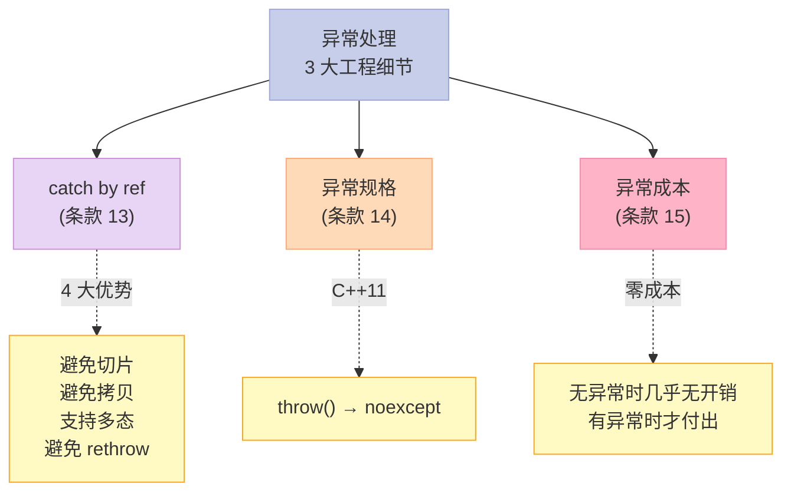
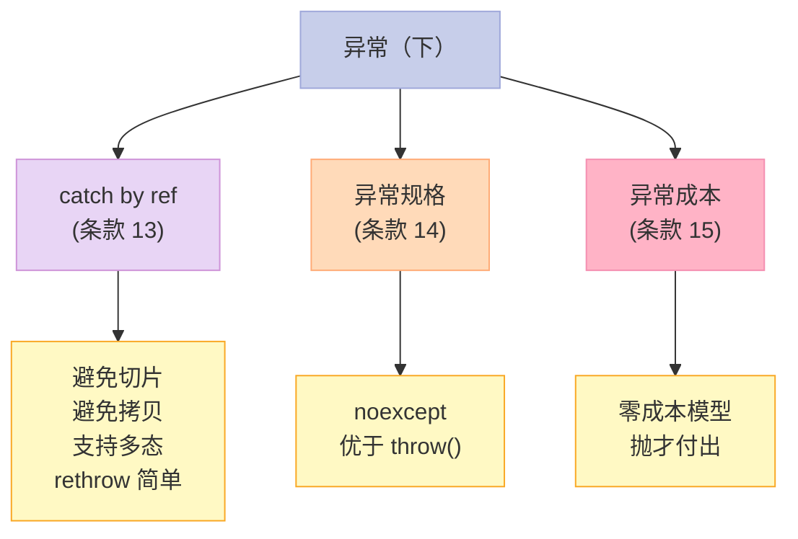

> **一句话核心结论**：C++ 异常的下半部分讲 3 个工程细节——**catch by reference** 的 4 大优势（避免切片、避免拷贝、支持多态、避免重新抛出对象问题）、**异常规格**的演进（`throw()` → `noexcept`）、**异常处理的真实成本**（"零成本"模型 + try 块的代码膨胀）。

---

## 系列导航

| # | 文章 | 状态 |
|:--|:--|:--|
| 0 | [系列总览](/2026/06/18/more-effective-cpp-00-series-index/) | ✅ 已发布 |
| 1 | [基础议题](/2026/06/18/more-effective-cpp-01-basics/) | ✅ 已发布 |
| 2 | [操作符](/2026/06/18/more-effective-cpp-02-operators/) | ✅ 已发布 |
| 3 | [异常（上）](/2026/06/18/more-effective-cpp-03-exceptions-part1/) | ✅ 已发布 |
| 4 | [本文：异常（下）](/2026/06/18/more-effective-cpp-04-exceptions-part2/) | ✅ 已发布 |
| 5 | 效率（上）：lazy evaluation、临时对象、RVO | 🔜 计划中 |
| ... | ... | ... |

---

## 前言：异常处理的"最后一块拼图"

第 3 篇讲了异常的"4 大支柱"（RAII、构造期安全、析构不抛、catch by ref）。

本篇**深入 3 个工程细节**——

1. **catch by reference** 为什么是"最优"？
2. **异常规格** `throw(T1, T2)` 为什么被废弃？
3. **try/catch 的真实成本**是什么？



---

## 一、条款 13：以 by reference 方式捕捉 exceptions

### 1.1 3 种 catch 方式对比

```cpp
try {
    // ...
} catch (Widget w) {           // 1. by value
    // ...
} catch (Widget& w) {          // 2. by reference
    // ...
} catch (Widget* w) {          // 3. by pointer（不推荐）
    // ...
}
```

### 1.2 by value 的 3 大问题

#### 问题 1：切片

```cpp
class Base { public: virtual void foo(); };
class Derived : public Base { public: int x; };

try {
    throw Derived();
} catch (Base b) {  // ❌ 切片——Derived 部分丢失
    b.foo();  // 调 Base::foo（不是 Derived::foo）
}
```

**问题**：

- `catch (Base b)` 按值接收——构造一个新 Base 对象
- 派生部分被"切掉"
- 多态丢失

#### 问题 2：拷贝 2 次

```cpp
try {
    throw Widget();  // 1. 构造 exception object
} catch (Widget w) {  // 2. 拷贝到 catch 参数
    // 总共 2 次拷贝
}
```

#### 问题 3：重新抛出时可能拷贝

```cpp
try {
    // ...
} catch (Widget w) {  // 拷贝 1 次
    // 修改 w（不影响原 exception）
    throw;  // 重新抛出——可能再拷贝（编译器可能优化）
}
```

### 1.3 by reference 的 4 大优势

```cpp
// ✅ 最佳实践
try {
    // ...
} catch (const Widget& w) {  // by const reference
    // 1. 避免切片——保留多态
    // 2. 避免拷贝——0 次
    // 3. 支持多态——调虚函数正确版本
    // 4. 重新抛出简单——throw; 即可
}
```

**4 大优势**：

| 优势 | 说明 |
|------|------|
| **避免切片** | 接收的是原对象，不是拷贝 |
| **避免拷贝** | 0 次拷贝（引用） |
| **支持多态** | 调虚函数保留动态类型 |
| **rethrow 简单** | `throw;` 直接传原对象 |

### 1.4 by pointer 的特殊情况

```cpp
// ❌ 大多数场景不推荐
catch (Widget* w) {  // 指针
    // 问题 1：必须保证 catch 时对象还活着
    // 问题 2：throw nullptr 也合法
}

// 唯一适用：抛指针的场景（如 Qt 的 error codes）
```

**反例**：

```cpp
void f() {
    Widget w;
    try {
        throw &w;  // 抛指针
    } catch (Widget* p) {
        // p 指向 w——但 w 还在吗？
    }
    // w 已析构——p 悬空
}
```

### 1.5 实战：异常类的设计

```cpp
// ✅ 异常类应该这样 catch
class MyException : public std::exception {
    std::string msg_;
    int code_;
public:
    MyException(const std::string& msg, int code) : msg_(msg), code_(code) {}
    const char* what() const noexcept override {
        return msg_.c_str();
    }
    int code() const noexcept { return code_; }
};

try {
    throw MyException("oops", 42);
} catch (const std::exception& e) {
    // 1. 避免切片（如果是 std::exception 也能 catch）
    // 2. 避免拷贝
    // 3. 支持多态
    // 4. 重新抛出简单
    std::cout << e.what() << "\n";
}
```

### 1.6 关键启示

1. **catch by reference**——首选
2. **catch by value**——除了最简单的异常类型，避免
3. **catch by pointer**——几乎不推荐
4. **`const T&`**——最佳：不可修改、避免拷贝、支持多态

---

## 二、条款 14：明智运用 exception specifications

### 2.1 C++98 的异常规格

```cpp
// C++98：声明函数可能抛的异常类型
void f() throw(std::runtime_error);  // 只可能抛 runtime_error
void g() throw();                    // 不抛
void h();                            // 可能抛任何异常
```

### 2.2 异常规格的问题

```cpp
// ❌ 异常规格的"反作用"
class Widget {
public:
    void f() throw(int);  // 承诺只抛 int
};

void Widget::f() {
    // 假设内部调用了 std::string::operator+
    // std::string::operator+ 可能抛 std::bad_alloc
    // 抛了 std::bad_alloc 怎么办？
    // C++98 标准：调用 std::unexpected()
    // std::unexpected 默认调 std::terminate
}
```

**问题**：

- 异常规格是"承诺"——违反承诺 → `std::unexpected` → `std::terminate`
- 编译器生成的代码会"检查"——**有运行时成本**
- 维护困难——函数改了，规格忘了改

### 2.3 C++11 的解决方案：`noexcept`

```cpp
// ✅ C++11：noexcept 替代 throw()
void f() noexcept;        // 不抛
void g() noexcept(true);  // 不抛（同上）
void h() noexcept(false); // 可能抛
```

**C++11 的 `noexcept` 优势**：

| 维度 | `throw()` | `noexcept` |
|------|-----------|-----------|
| 表达 | 类型列表 | bool 表达式 |
| 验证 | 编译期 + 运行期 | 编译期 |
| 违反后果 | `std::unexpected` | `std::terminate` |
| 优化 | 编译器保守 | 编译器激进（不抛 = 优化） |
| 表达式 | 否 | `noexcept(expr)` |

### 2.4 `noexcept` 表达式

```cpp
// noexcept 接受 bool 表达式
template<typename T>
void swap(T& a, T& b) noexcept(std::is_nothrow_move_constructible_v<T>);

// 实际应用：标准库的某些函数根据类型特性决定 noexcept
template<typename T>
class vector {
    void push_back(const T& x);  // 不 noexcept——T 的拷贝可能抛
    void push_back(T&& x) noexcept(std::is_nothrow_move_constructible_v<T>);
    // 移动构造不抛时，push_back 也不抛
};
```

### 2.5 实战：什么时候用 `noexcept`？

```cpp
// ✅ 适合 noexcept
class Widget {
    ~Widget() noexcept;     // 析构默认 noexcept
    void swap(Widget& other) noexcept;  // swap 几乎不抛
    Widget(Widget&& other) noexcept;   // 移动构造通常不抛
};

// ❌ 不适合 noexcept
class Database {
    void query() noexcept;  // ❌ 数据库可能抛
    void connect() noexcept;  // ❌ 网络可能抛
};
```

**原则**：

- **不抛的函数** → `noexcept`
- **可能抛的函数** → 不加 `noexcept`
- **绝不要"为了 noexcept 而 noexcept"**——会 terminate

### 2.6 noexcept 的"5 大好处"

```cpp
// 1. 编译器优化
void f() noexcept;  // 编译器知道"不抛"——可以激进优化
// 2. 标准库优化
std::vector<T>::push_back(T&&) noexcept(...);  // 移动不抛时直接转移
// 3. clear() / 析构 都不抛
// 4. swap 不抛
// 5. 移动构造/赋值 不抛（如果可以）
```

### 2.7 关键启示

1. **`noexcept` 优于 `throw()`**——C++11 标准
2. **不抛的函数加 `noexcept`**——帮助编译器优化
3. **不要"为了 noexcept 而 noexcept"**——违反会 terminate
4. **`noexcept(expr)`**——条件性 noexcept

---

## 三、条款 15：了解异常处理的成本

### 3.1 零成本模型（Zero-Cost Model）

```cpp
// C++ 的异常处理是"零成本"的
// 即：在"不抛异常"时，几乎没有额外开销
//     在"抛异常"时，才付出代价
```

**这是和 Java 的最大区别**：

- **Java 异常**：try/catch 块本身有开销
- **C++ 异常**：try/catch 块几乎零成本，throw 时才付出

### 3.2 零成本模型的实现

```cpp
// 编译器生成"异常表"（exception table）
// 函数入口的"范围" + 异常处理信息
// 用类似 DWARF 的格式

// 无异常时：CPU 不查表
// 有异常时：CPU 查表 + 栈展开
```

**汇编层面**：

```asm
; 无异常时
main:
    call foo       ; 不抛异常
    ; 继续
; 有异常时
foo:
    call bar
    ; 假设 bar 抛异常
    ; CPU 查 exception table
    ; 跳转到 catch 子句
```

### 3.3 try 块的真实成本

```cpp
void f() {
    // 无 try：直接执行
    foo();
    bar();
    baz();
}

void g() {
    // 有 try：执行路径几乎相同
    try {
        foo();
        bar();
        baz();
    } catch (...) {
        // ...
    }
}
```

**汇编对比**：

- `f()` 和 `g()` 的执行路径几乎相同
- `g()` 多一点栈空间（异常表）
- 实际"额外开销"几乎为 0

### 3.4 真正"贵"的操作

```cpp
// ❌ throw 本身很贵
void f() {
    if (error) {
        throw std::runtime_error("...");  // ~10x 慢于正常函数调用
    }
}

// ❌ catch by value（拷贝）
catch (Widget w) { }  // 拷贝

// ❌ 析构中可能的资源清理
```

**真实成本**：

| 操作 | 相对成本 |
|------|----------|
| 正常函数调用 | 1x |
| 抛异常 + 捕获 | ~10-100x |
| 异常对象拷贝 | 1-2x |
| 栈展开（每层） | 较小 |

### 3.5 "异常 vs 错误码" 的决策

```cpp
// 用异常的场景
void connect() {
    // 网络操作——失败是"不正常"的情况
    if (failed) throw std::runtime_error("connect failed");
}

// 用错误码的场景
bool tryParseInt(const std::string& s, int& result) {
    // 解析失败是"预期"的情况
    // 用错误码——避免异常成本
    if (failed) return false;
    return true;
}
```

**原则**：

- **异常**：错误"罕见"且"严重"
- **错误码**：错误"常见"且"用户可恢复"

### 3.6 实战：异常性能的 4 个建议

```cpp
// 1. 不要把"控制流"用异常
if (i == 0) throw std::runtime_error("zero");  // ❌ 这是控制流

// 2. 不要"过度"抛异常
for (int i = 0; i < n; ++i) {
    if (i == 0) throw;  // ❌ 1000 次循环里抛——慢
}

// 3. 异常对象尽量小
throw std::string("error");  // ❌ 字符串拷贝
throw MyException();  // ✅ 小对象

// 4. noexcept 标记"不抛"——帮编译器优化
void f() noexcept;  // 编译器会激进优化
```

### 3.7 关键启示

1. **零成本模型**——无异常时几乎零开销
2. **抛异常本身很贵**——比函数调用慢 10-100 倍
3. **不要把异常当"控制流"**——性能杀手
4. **noexcept 帮编译器优化**——但不要"为了 noexcept 而 noexcept"

---

## 四、3 个条款的"异常（下）"全景



**核心思路**：

- **catch by ref**：4 大优势，避免切片 + 拷贝
- **noexcept**：C++11 优于 `throw()`，编译器优化
- **零成本模型**：无异常时几乎零开销

---

## 五、常见误区与陷阱

### 5.1 误区 1：catch by value

```cpp
// ❌
catch (Widget w) { /* 切片 + 拷贝 */ }

// ✅
catch (const Widget& w) { /* 多态 + 无拷贝 */ }
```

### 5.2 误区 2：滥用 noexcept

```cpp
// ❌
void connect() noexcept {  // 实际可能抛
    // ...
}

// ✅
void connect() {  // 可能抛——不加 noexcept
    // ...
}
```

### 5.3 误区 3：用异常当控制流

```cpp
// ❌ 性能杀手
for (int i = 0; i < 1000; ++i) {
    try { ... } catch (...) { ... }  // 循环里用异常
}

// ✅
for (int i = 0; i < 1000; ++i) {
    if (cond) { ... }  // 普通 if
}
```

### 5.4 误区 4：rethrow 时改对象

```cpp
// ❌ catch by value 后修改
catch (Widget w) {
    w.modify();
    throw;  // 抛的是原 exception——w 的修改不影响
}

// ✅ catch by ref 后修改
catch (Widget& w) {
    w.modify();
    throw;  // 抛的是同一对象（catch 看到的）
}
```

---

## 六、C++11/14/17/20 的演进

| 主题 | C++98 时代 | C++11/14/17/20 时代 |
|------|------------|---------------------|
| 异常规格 | `throw(T1, T2)` | `noexcept` / `noexcept(expr)` |
| 抛出意外异常 | `std::unexpected` | `std::terminate` |
| 异常对象 | 自定义 | `std::system_error` |
| `current_exception` | 无 | `std::current_exception()` |
| `exception_ptr` | 无 | `std::exception_ptr` |
| `nested_exception` | 无 | `std::nested_exception` |
| 性能 | "零成本" | 同 + 更激进优化 |

**C++17 的 `std::uncaught_exceptions()`**：

```cpp
class ScopeGuard {
    int uncaughtAtConstruction_;
public:
    ScopeGuard() : uncaughtAtConstruction_(std::uncaught_exceptions()) {}
    ~ScopeGuard() {
        if (std::uncaught_exceptions() > uncaughtAtConstruction_) {
            // 析构发生在栈展开中——做"异常时清理"
        } else {
            // 正常析构
        }
    }
};
```

**C++11 的 `std::current_exception()`**：

```cpp
try {
    // ...
} catch (...) {
    auto eptr = std::current_exception();  // 捕获当前异常
    // 跨线程传递 eptr
    // 在另一个线程重新抛出
}
```

---

## 七、面试高频考点

### 7.1 必背题

| 题目 | 答案要点 |
|------|----------|
| catch by ref 的优势？ | 避免切片、避免拷贝、支持多态、rethrow 简单 |
| noexcept vs throw()？ | noexcept 编译期 + 编译器优化 |
| 异常处理的成本？ | 零成本模型：无异常时几乎零开销 |
| 抛异常本身很贵吗？ | 是——比函数调用慢 10-100 倍 |
| 为什么不用异常当控制流？ | 性能杀手 |
| noexcept 违反会怎样？ | std::terminate |
| rethrow 怎么写？ | `throw;`（不带表达式） |
| 异常对象的大小？ | 看 catch by value 还是 by ref |

### 7.2 高频追问

| 追问 | 关键点 |
|------|--------|
| catch (T) 切片？ | 是——按值构造新对象 |
| noexcept 表达式的优势？ | 条件性 noexcept |
| 异常表的实现？ | 类似 DWARF，函数入口+范围 |
| std::uncaught_exceptions 干什么？ | 判断"析构是否在栈展开中" |
| 跨线程传异常？ | `std::exception_ptr` |
| 异常性能 10-100x 慢在哪？ | 栈展开 + 异常对象构造 + catch 处理 |

---

## 八、配套实验

### 8.1 实验 1：catch 3 种方式对比

```cpp
// 文件：catch_ways.cpp
#include <iostream>

class Base {
public:
    virtual ~Base() = default;
    virtual void who() const { std::cout << "Base\n"; }
};

class Derived : public Base {
public:
    void who() const override { std::cout << "Derived\n"; }
    void special() const { std::cout << "Derived::special\n"; }
};

int main() {
    // 1. catch by value
    std::cout << "=== catch by value ===\n";
    try {
        throw Derived();
    } catch (Base b) {  // ❌ 切片
        b.who();  // Base（不是 Derived）
    }

    // 2. catch by reference
    std::cout << "\n=== catch by reference ===\n";
    try {
        throw Derived();
    } catch (Base& b) {  // ✅ 多态
        b.who();  // Derived
    }

    // 3. catch by const ref
    std::cout << "\n=== catch by const ref ===\n";
    try {
        throw Derived();
    } catch (const Base& b) {  // ✅ 多态 + const
        b.who();  // Derived
    }

    return 0;
}
```

### 8.2 实验 2：noexcept 表达

```cpp
// 文件：noexcept_demo.cpp
#include <iostream>
#include <type_traits>

class Widget {
public:
    ~Widget() noexcept = default;  // 析构不抛

    // 移动构造：可能抛（如果成员是 std::string）
    Widget(Widget&&) = default;

    void swap(Widget& other) noexcept {
        using std::swap;
        // 假设成员都是 noexcept swap 类型
    }
};

template<typename T>
void safeSwap(T& a, T& b) noexcept(std::is_nothrow_swappable_v<T>) {
    using std::swap;
    swap(a, b);
}

int main() {
    std::cout << "Widget nothrow swappable: "
              << std::is_nothrow_swappable_v<Widget> << "\n";

    int a = 1, b = 2;
    safeSwap(a, b);  // noexcept
    std::cout << "a=" << a << " b=" << b << "\n";

    return 0;
}
```

### 8.3 实验 3：异常成本实测

```cpp
// 文件：exception_cost.cpp
#include <iostream>
#include <chrono>

// 正常函数
int normalFunc() {
    return 42;
}

// 抛异常函数
int exceptionFunc(int shouldThrow) {
    if (shouldThrow) {
        throw std::runtime_error("oops");
    }
    return 42;
}

int main() {
    // 1. 测正常函数
    auto start = std::chrono::steady_clock::now();
    for (int i = 0; i < 1000000; ++i) {
        int x = normalFunc();
        (void)x;
    }
    auto end = std::chrono::steady_clock::now();
    auto normalTime = std::chrono::duration_cast<std::chrono::microseconds>(end - start).count();
    std::cout << "Normal: " << normalTime << " μs\n";

    // 2. 测异常（不抛）
    start = std::chrono::steady_clock::now();
    for (int i = 0; i < 1000000; ++i) {
        try {
            int x = exceptionFunc(0);
            (void)x;
        } catch (...) {
            // ...
        }
    }
    end = std::chrono::steady_clock::now();
    auto noExceptionTime = std::chrono::duration_cast<std::chrono::microseconds>(end - start).count();
    std::cout << "Try block (no throw): " << noExceptionTime << " μs\n";

    return 0;
}
```

### 8.4 实验 4：noexcept 违反 = terminate

```cpp
// 文件：noexcept_terminate.cpp
#include <iostream>
#include <stdexcept>

class NoThrow {
public:
    ~NoThrow() noexcept(false) {  // ❌ 违反 noexcept
        throw std::runtime_error("dtor");
    }
};

class SafeThrow {
public:
    ~SafeThrow() noexcept {
        try {
            throw std::runtime_error("dtor");
        } catch (...) {
            std::cout << "Caught in dtor\n";
        }
    }
};

int main() {
    std::cout << "Test 1: NoThrow (will terminate)\n";
    try {
        // NoThrow n;  // ❌ 析构会 terminate
    } catch (...) {
        std::cout << "Won't reach\n";
    }

    std::cout << "\nTest 2: SafeThrow (OK)\n";
    SafeThrow s;  // 析构吞异常

    return 0;
}
```

---

## 九、回到 3 条黄金法则

| 条款 | 黄金法则 |
|------|----------|
| 13 | catch by `const T&`——避免切片 + 拷贝 + 多态 |
| 14 | `noexcept` 优于 `throw()`——编译器优化 |
| 15 | 异常是"零成本"——只在抛时付出 |

---

## 十、结尾思考题

> **思考题 1**：`catch (Base b)` 和 `catch (const Base& b)` 的差异是什么？多态 + 拷贝方面。

> **思考题 2**：实现一个 `noexcept` 标记的移动构造函数，验证其性能优势。

> **思考题 3**：C++ 异常处理是"零成本模型"——这意味着什么？和无异常时性能对比。

> **思考题 4**：`rethrow;` 和 `rethrow e;` 的差异是什么？哪个是惯用法？

> **思考题 5**：你的项目里有哪些"用异常当控制流"的地方？如何优化？

---

## 十一、本篇速查表

| 主题 | 关键 API / 模式 | 适用场景 |
|------|----------------|----------|
| catch by ref | `catch (const T& e)` | 几乎所有 catch |
| catch by value | `catch (T e)` | 简单类型 + 不需要多态 |
| noexcept | `void f() noexcept;` | 不抛的函数 |
| noexcept(expr) | `noexcept(is_nothrow_xxx<T>)` | 条件性 noexcept |
| 异常零成本 | 几乎零开销 | 日常编码 |
| 抛异常成本 | ~10-100x | 谨慎使用 |

---

## 十二、系列导航

| # | 文章 | 状态 |
|:--|:--|:--|
| 0 | [系列总览](/2026/06/18/more-effective-cpp-00-series-index/) | ✅ 已发布 |
| 1 | [基础议题](/2026/06/18/more-effective-cpp-01-basics/) | ✅ 已发布 |
| 2 | [操作符](/2026/06/18/more-effective-cpp-02-operators/) | ✅ 已发布 |
| 3 | [异常（上）](/2026/06/18/more-effective-cpp-03-exceptions-part1/) | ✅ 已发布 |
| 4 | [本文：异常（下）](/2026/06/18/more-effective-cpp-04-exceptions-part2/) | ✅ 已发布 |
| 5 | 效率（上）：lazy evaluation、临时对象、RVO | 🔜 计划中 |
| 6 | 效率（下）：重载、operator new、内存池、inline | 🔜 计划中 |
| 7 | 技术：虚拟构造、智能指针、引用计数、双重分派 | 🔜 计划中 |
| 8 | 杂项 + 总结：未来时态、标准库、命名空间 | 🔜 计划中 |

---

**下一篇**：第 5 篇《效率（上）：80-20 法则、lazy evaluation、临时对象、RVO》——条款 16-20 一起讲透 C++ 效率优化：80-20 法则的工程意义、lazy evaluation 的 4 大场景、分期摊还、临时对象、返回值优化 RVO。

> **行动建议**：
> 1. **今天**：把所有 catch 子句改为 `const T&` 形式
> 2. **今天**：把不抛的析构、swap、移动构造标 `noexcept`
> 3. **本周**：识别你项目里的"用异常当控制流"——改用错误码
> 4. **本周**：用 `noexcept(is_nothrow_xxx<T>)` 标记模板函数
> 5. **思考**：你的项目里哪些函数应该标记 `noexcept`？
