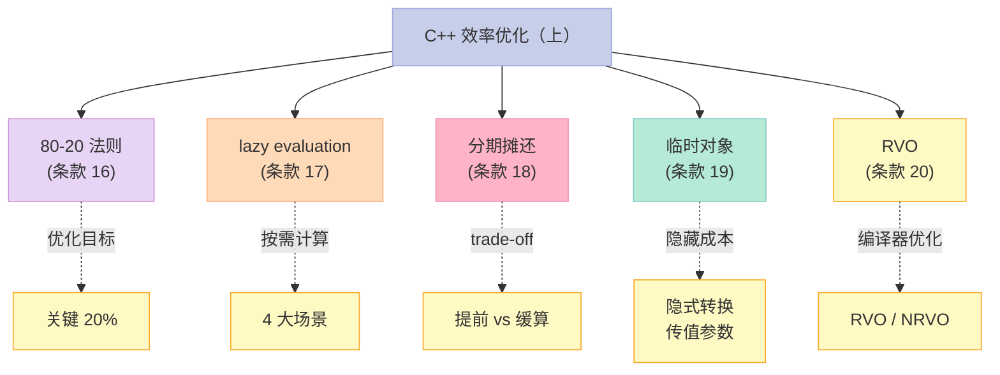
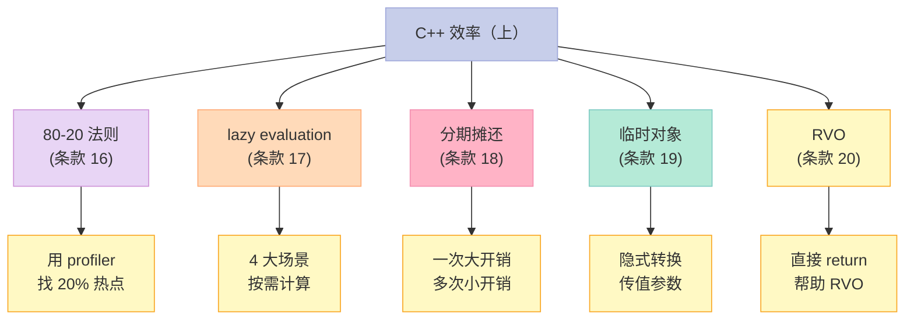

> **一句话核心结论**：C++ 效率优化的"上半部分"——**80-20 法则**告诉你优化要从"关键 20%"入手，**lazy evaluation** 让你"按需计算"节省 80% 的浪费，**分期摊还**让你"提前 vs 缓算"做 trade-off，**临时对象**是隐藏的"性能小偷"，**RVO** 是 C++ 编译器的"神器"。这 5 个条款是性能调优的"工具箱"。

---

## 系列导航

| # | 文章 | 状态 |
|:--|:--|:--|
| 0 | [系列总览](/2026/06/18/more-effective-cpp-00-series-index/) | ✅ 已发布 |
| 1 | [基础议题](/2026/06/18/more-effective-cpp-01-basics/) | ✅ 已发布 |
| 2 | [操作符](/2026/06/18/more-effective-cpp-02-operators/) | ✅ 已发布 |
| 3 | [异常（上）](/2026/06/18/more-effective-cpp-03-exceptions-part1/) | ✅ 已发布 |
| 4 | [异常（下）](/2026/06/18/more-effective-cpp-04-exceptions-part2/) | ✅ 已发布 |
| 5 | [本文：效率（上）](/2026/06/18/more-effective-cpp-05-efficiency-part1/) | ✅ 已发布 |
| 6 | 效率（下）：重载、operator new、内存池、inline | 🔜 计划中 |
| 7 | 技术：虚拟构造、智能指针、引用计数、双重分派 | 🔜 计划中 |
| 8 | 杂项 + 总结：未来时态、标准库、命名空间 | 🔜 计划中 |

---

## 前言：为什么"效率"是 More Effective C++ 的核心？

Effective C++ 关注**正确性**——你怎么写"对的" C++。

More Effective C++ 关注**性能**——你怎么写"快"的 C++。



---

## 一、条款 16：谨记 80-20 法则

### 1.1 什么是 80-20 法则？

```text
程序 80% 的时间，花在 20% 的代码上。
```

**这个 20% 通常是**：

- 热点循环（hot loop）
- 频繁调用的函数
- IO / 网络 / 内存分配
- 复杂算法

**剩下 80% 的代码 = 1 次执行或很少执行**——优化它们**没有意义**。

### 1.2 案例：优化一个"慢"程序

```cpp
// 程序总时间：10 秒
// - 90% 时间花在 processItems()（循环）
// - 10% 时间花在 setup()（启动）

void processItems(const std::vector<Item>& items) {
    for (const auto& item : items) {
        // 假设有 100 万次循环
        expensiveCalculation(item);  // 每次 1 微秒
    }
}

void setup() {
    // 一次性设置
    loadConfig();
    initDatabase();
}
```

**错误优化**：

```cpp
// ❌ 优化 setup（只 1 次）
void setup() {
    // 优化到极致——减少 5 秒
}
```

**结果**：setup 从 1 秒 → 0.01 秒，省 0.99 秒。**总时间从 10 秒 → 9.01 秒**——肉眼无感。

**正确优化**：

```cpp
// ✅ 优化 processItems（100 万次循环）
void processItems(const std::vector<Item>& items) {
    // 把 expensiveCalculation 优化到极致
    // 每次节省 0.5 微秒
}
```

**结果**：每次 0.5 微秒 × 100 万 = **0.5 秒**。**总时间从 10 秒 → 9.5 秒**——更不明显但**针对性强**。

**真正大的优化**：

```cpp
// ✅✅ 找出"另外 10%"的真实热点
// 用 profiler 找到真正的 20%
// 例如：发现 std::string 的频繁构造占 50% 时间
// 优化：改成 const std::string& 传参
// 节省 5 秒
```

### 1.3 实战：用 Profiler 找热点

```bash
# Linux perf
perf record -g ./myprogram
perf report

# 找到 top 20% 的热点函数
# 针对优化
```

```cpp
// 或者用 gperftools
#include <gperftools/profiler.h>

ProfilerStart("myprogram.prof");
// 跑代码
ProfilerStop();
```

### 1.4 关键启示

1. **80-20 法则**——优化要从"关键 20%"入手
2. **不要凭直觉优化**——用 profiler
3. **优化 1 次执行的代码**——毫无意义
4. **优化 100 万次循环**——10 倍收益

---

## 二、条款 17：考虑使用 lazy evaluation

### 2.1 什么是 lazy evaluation？

```cpp
// 不用 lazy：立即计算
std::string bigString = computeExpensiveString();  // 立即算

// 用 lazy：按需计算
LazyString bigString = [] { return computeExpensiveString(); };
// 只有用 bigString.value() 时才真的算
```

### 2.2 lazy 的 4 大场景

#### 场景 1：引用计数（写时复制）

```cpp
// ❌ 不用 copy-on-write
class String {
    char* data_;
public:
    String(const String& other) {
        data_ = new char[other.size_];
        std::memcpy(data_, other.data_, other.size_);
        // 立即拷贝——即使 other 之后只读不改
    }
};

// ✅ 用 copy-on-write
class String {
    std::shared_ptr<std::string> data_;
public:
    String(const String& other) : data_(other.data_) {
        // 共享底层 string——不拷贝
    }

    void modify(const char* newData) {
        if (data_.use_count() > 1) {
            // 有人在用——深拷贝
            data_ = std::make_shared<std::string>(*data_);
        }
        *data_ = newData;
        // 写时复制
    }
};
```

#### 场景 2：区分读 / 写

```cpp
// ❌ 不用 lazy
class Matrix {
    double data_[N][N];
public:
    double& operator[](int i, int j) { return data_[i][j]; }
    // 不知道调用方是读还是写——返回引用
};

Matrix m;
m[0][0] = 3.14;  // 写
double x = m[0][0];  // 读——也走 operator[]

// ✅ 用 proxy class 区分（More Effective 条款 30）
class MatrixElement {
    Matrix& m_;
    int i_, j_;
public:
    operator double() const { /* 读 */ return m_.data_[i_][j_]; }
    MatrixElement& operator=(double v) { /* 写 */ m_.data_[i_][j_] = v; return *this; }
};
```

#### 场景 3：lazy fetch（数据库场景）

```cpp
// ❌ 立即获取
class Employee {
    std::string name_;
    std::vector<Project> projects_;  // 假设 1000 个项目
public:
    Employee(int id) {
        // 立即加载 1000 个项目——可能用不到
        loadAllProjects();
    }
};

// ✅ 缓式获取
class Employee {
    int id_;
    std::optional<std::vector<Project>> projects_;
public:
    Employee(int id) : id_(id) {}
    const std::vector<Project>& projects() {
        if (!projects_) {
            projects_ = loadAllProjects();
        }
        return *projects_;
    }
};
```

#### 场景 4：表达式缓算

```cpp
// ❌ 立即计算所有项
std::vector<int> bigVec(1000000);
int sum = 0;
for (int i = 0; i < 1000000; ++i) {
    sum += bigVec[i] * 2 + 1;
}

// ✅ 表达式模板
template<typename L, typename R>
class VecExpr {
    L lhs_;
    R rhs_;
public:
    auto operator[](size_t i) const { return lhs_[i] * 2 + 1; }
};
// 编译器把 sum 循环"合并"——1 次循环
```

### 2.3 实战：lazy 的"代价"

```cpp
// ❌ lazy 也有成本
class LazyString {
    std::function<std::string()> compute_;
    std::optional<std::string> cached_;
public:
    const std::string& value() {
        if (!cached_) {
            cached_ = compute_();
        }
        return *cached_;
    }
};
// 成本：
// 1. 多一次 std::optional 检查
// 2. 第一次访问才计算
// 3. 代码复杂
```

**判断标准**：

- 计算**真的昂贵**（如 DB 查询）
- 计算**结果可能不用**（如异常分支）
- 调用**不频繁**

否则——**直接计算**更简单。

### 2.4 关键启示

1. **lazy = 按需计算**——节省"用不到"的浪费
2. **4 大场景**：引用计数 / 读 vs 写 / lazy fetch / 表达式缓算
3. **有成本**：optional + 函数调用 + 代码复杂
4. **不要"为了 lazy 而 lazy"**——简单优先

---

## 三、条款 18：分期摊还预期的计算成本

### 3.1 什么是分期摊还（Amortize）？

```cpp
// 一次大开销 → 分摊到多次小开销
// 例子：vector 扩容
// 1 次 realloc（拷贝 1M 元素）→ 分摊到 1M 次 push_back
// 平均每次：拷贝 1 个元素
```

### 3.2 案例 1：vector 扩容

```cpp
// 假设 vector 每次扩容 *2
// 容量变化：1, 2, 4, 8, 16, ..., 1M
// 拷贝次数：1, 2, 4, 8, 16, ..., 1M
// 总拷贝 = 2M - 1 ≈ 2M
// 1M 次 push_back
// 平均每次 = 2 次拷贝（摊销）
```

**数学上**：摊销 = O(1) / push_back。

### 3.3 案例 2：字符串的 `c_str()` 调用

```cpp
// ❌ 不用 amortize
class String {
    char* data_;
public:
    const char* c_str() {
        return data_;  // 直接返回
    }
};

// 问题：c_str() 每次都返回 pointer——如果 user 修改，可能 UB
```

```cpp
// ✅ 用 amortize：标记"是否需要加 \0"
class String {
    std::vector<char> data_;
    mutable bool needsNull_ = true;
public:
    const char* c_str() const {
        if (needsNull_) {
            data_.push_back('\0');
            needsNull_ = false;
        }
        return data_.data();
    }
};
// 第一次 c_str() 多一次 push_back，后续 c_str() 直接返回
```

### 3.4 案例 3：cache 友好的数据结构

```cpp
// ✅ 用 cache 预取
class LRUCache {
    std::list<int> lru_;  // 热点数据
    std::unordered_map<int, int> cache_;
public:
    int get(int key) {
        // 假设热点数据在 lru_ 头部
        // 第一次访问较慢——但之后摊销快
        if (cache_.count(key)) {
            // 把 key 移到 lru_ 头部——摊销成本
            lru_.splice(lru_.begin(), lru_, cache_[key]);
        }
        return cache_[key];
    }
};
```

### 3.5 案例 4：数据库连接池

```cpp
// ✅ 一次建连接 → 多次复用
class ConnectionPool {
    std::vector<Connection> pool_;
public:
    Connection& get() {
        if (pool_.empty()) {
            pool_.push_back(Connection::create());
            // 摊销建连接成本
        }
        return pool_.back();
    }
};
```

### 3.6 关键启示

1. **分期摊还** = 一次大开销 → 多次小开销
2. **典型场景**：vector 扩容 / 缓存 / 连接池
3. **好处**：平均成本低
4. **代价**：偶尔有"长尾"延迟

---

## 四、条款 19：了解临时对象的来源

### 4.1 什么是临时对象？

```cpp
// 临时对象 = 没有名字的对象
std::string("hello");  // 临时 std::string
// 生命周期：表达式结束
```

### 4.2 临时对象的 4 大来源

#### 来源 1：隐式类型转换

```cpp
// ❌ 隐式转换 → 临时对象
void f(const std::string& s);
f("hello");  // const char* → std::string（临时）

// ✅ 显式构造
f(std::string("hello"));  // 仍是临时——但更明确
```

**开销**：构造 + 析构 = 2 次操作。

#### 来源 2：传值参数

```cpp
// ❌ 传值 → 拷贝
void f(std::string s);  // 拷贝构造临时 s
std::string original = "hello";
f(original);  // 1 次拷贝

// ✅ 传 const ref
void f(const std::string& s);  // 0 次拷贝
f(original);
```

#### 来源 3：函数返回值

```cpp
// 返回值
std::string makeString() {
    return "hello";  // 临时对象
}

std::string s = makeString();  // 1 次拷贝（RVO 可能优化掉）
```

#### 来源 4：运算结果

```cpp
// 算术运算 → 临时
int a = 1, b = 2;
int c = a + b;  // a + b 是临时
```

### 4.3 临时对象的"成本"

```cpp
// 大型类的临时对象很贵
class Matrix {
    double data_[100][100];  // 80KB
};

// 每次隐式转换 = 80KB 拷贝
void f(Matrix m);
f(Matrix(...));  // 80KB 拷贝
```

### 4.4 实战：减少临时对象

```cpp
// ❌ 反例：链式运算 → 多个临时
std::string s1 = "a";
std::string s2 = "b";
std::string s3 = "c";
std::string result = s1 + s2 + s3;
// 临时：s1 + s2 → temp1
// 临时：temp1 + s3 → temp2
// result = temp2

// ✅ 优化：reserve
std::string result;
result.reserve(s1.size() + s2.size() + s3.size());
result = s1;
result += s2;
result += s3;
// 0 个临时（除 result）
```

### 4.5 关键启示

1. **临时对象 = 隐式转换 + 传值 + 返回 + 运算**
2. **隐式转换最危险**——看似"没成本"
3. **大类的临时对象很贵**——传 const ref
4. **reserve + append** 比 `+` 链高效

---

## 五、条款 20：协助完成"返回值优化（RVO）"

### 5.1 什么是 RVO？

```cpp
// RVO = Return Value Optimization
// 编译器省略"返回值的拷贝构造"——直接在调用方位置构造

std::string makeString() {
    return "hello";
}

std::string s = makeString();
// 编译器可能：直接在 s 的位置构造——0 次拷贝
```

### 5.2 RVO vs NRVO

```cpp
// RVO（Return Value Optimization）——返回值无名
std::string makeString() {
    return "hello";  // 匿名——RVO
}

// NRVO（Named Return Value Optimization）——返回值有名
std::string makeString() {
    std::string s = "hello";
    return s;  // 命名——NRVO
}
```

**C++17 起**：RVO 几乎**强制**——编译器必须省略拷贝。

### 5.3 反例：阻止 RVO 的写法

```cpp
// ❌ 阻止 RVO
std::string makeString(bool ok) {
    std::string a = "yes";
    std::string b = "no";
    return ok ? a : b;  // ❌ 条件返回——编译器不能 NRVO
}

// ✅ 帮助 RVO
std::string makeString(bool ok) {
    if (ok) {
        return "yes";  // RVO
    } else {
        return "no";  // RVO
    }
}
```

### 5.4 实战：怎么"协助"RVO？

```cpp
// 1. 直接 return 一个构造
return Widget(1, 2, 3);  // RVO

// 2. 直接 return 一个字面值
return "hello";  // RVO

// 3. 直接 return 局部对象（同类型）
Widget make() {
    Widget w(...);
    return w;  // NRVO
}

// ❌ 不要 return 引用/指针
Widget& make() { /*...*/ }  // 返回 local 引用——UB
```

### 5.5 C++11 的 std::move

```cpp
// ❌ 不必要的 std::move
std::string make() {
    std::string s = "hello";
    return std::move(s);  // ❌ 阻止 NRVO
}

// ✅ 直接 return
std::string make() {
    std::string s = "hello";
    return s;  // ✅ NRVO（编译器优化）
}
```

**为什么？** `std::move(s)` 是 `static_cast<Widget&&>(s)`——告诉编译器"我能被移走"——编译器**不再**做 NRVO。

### 5.6 关键启示

1. **RVO = 编译器优化**——消除返回值的拷贝
2. **C++17 起**——RVO 几乎强制
3. **直接 return**——帮助 RVO
4. **不要 return std::move**——阻止优化

---

## 六、5 个条款的"效率（上）"全景



---

## 七、常见误区与陷阱

### 7.1 误区 1：凭直觉优化

```cpp
// ❌ 优化 1 次执行的代码
void setup() {
    // 优化到极致
}

// ✅ 用 profiler
// 找到 80% 时间花在哪儿
```

### 7.2 误区 2：滥用 lazy

```cpp
// ❌ 简单计算也 lazy
Lazy<int> x = []{ return 1 + 2; };  // 反而更慢
```

### 7.3 误区 3：传值大型对象

```cpp
// ❌ 传值大对象
void f(std::vector<int> v);  // 拷贝

// ✅ 传 const ref
void f(const std::vector<int>& v);
```

### 7.4 误区 4：阻止 RVO

```cpp
// ❌ return std::move
std::string make() {
    std::string s = "hello";
    return std::move(s);  // 阻止 NRVO
}
```

---

## 八、C++11/14/17 的演进

| 主题 | C++98 时代 | C++11/14/17/20 时代 |
|------|------------|---------------------|
| 80-20 法则 | 不变 | 不变 |
| lazy | 手写 | 概念依旧 |
| 分期摊还 | 不变 | 不变 |
| 临时对象 | 隐式转换 | `std::move` / `std::forward` |
| RVO | 编译器"允许" | **C++17 强制** RVO |
| 移动语义 | 无 | `std::move` + RVO 协作 |
| 表达式模板 | 手写 | 概念依旧 |

**C++17 的"强制 RVO"**：

```cpp
// C++17 前：编译器"允许"省略拷贝
// C++17 后：编译器"必须"省略（prvalue 场景）
Widget make() {
    return Widget(1, 2, 3);  // ✅ 必须 RVO——0 次拷贝
}
```

---

## 九、面试高频考点

### 9.1 必背题

| 题目 | 答案要点 |
|------|----------|
| 80-20 法则？ | 80% 时间花在 20% 代码 |
| 怎么找 20%？ | Profiler（perf / gprof / callgrind） |
| 什么是 lazy？ | 按需计算——4 大场景 |
| 临时对象的来源？ | 隐式转换 / 传值 / 返回 / 运算 |
| 什么是 RVO？ | 编译器省略返回值的拷贝 |
| NRVO vs RVO？ | 命名 vs 匿名 |
| C++17 强制 RVO？ | 是——prvalue 场景 |
| 怎么帮 RVO？ | 直接 return 构造对象 |

### 9.2 高频追问

| 追问 | 关键点 |
|------|--------|
| lazy 的 4 大场景？ | 引用计数 / 读写区分 / lazy fetch / 表达式缓算 |
| 分期摊还的例子？ | vector 扩容 / LRU cache / 连接池 |
| 临时对象怎么减少？ | 传 const ref / reserve+append |
| std::move vs 直接 return？ | move 阻止 NRVO |
| 移动语义 vs RVO？ | 移动是语言特性；RVO 是编译器优化 |
| 强制 RVO 的条件？ | C++17 prvalue + 直接 return |

---

## 十、配套实验

### 10.1 实验 1：RVO vs 拷贝

```cpp
// 文件：rvo_demo.cpp
#include <iostream>

class Widget {
    int x_;
public:
    Widget(int x) : x_(x) { std::cout << "ctor\n"; }
    Widget(const Widget& w) : x_(w.x_) { std::cout << "copy ctor\n"; }
    Widget(Widget&& w) noexcept : x_(w.x_) { w.x_ = 0; std::cout << "move ctor\n"; }
    ~Widget() { std::cout << "dtor\n"; }
};

// ❌ 阻止 RVO
Widget makeBad(bool b) {
    Widget a(1);
    Widget c(2);
    return b ? a : c;  // 编译器不知道 return 哪个
}

// ✅ 帮助 RVO
Widget makeGood(bool b) {
    if (b) {
        return Widget(1);  // RVO
    } else {
        return Widget(2);  // RVO
    }
}

int main() {
    std::cout << "=== Bad ===\n";
    Widget w1 = makeBad(true);
    std::cout << "\n=== Good ===\n";
    Widget w2 = makeGood(true);
    return 0;
}
```

### 10.2 实验 2：临时对象来源

```cpp
// 文件：temp_object.cpp
#include <iostream>
#include <string>

class Tracker {
    int id_;
public:
    Tracker(int id) : id_(id) { std::cout << "ctor " << id_ << "\n"; }
    Tracker(const Tracker& t) : id_(t.id_) { std::cout << "copy ctor " << id_ << "\n"; }
    ~Tracker() { std::cout << "dtor " << id_ << "\n"; }
    int id() const { return id_; }
};

void f(Tracker t) {
    std::cout << "f: " << t.id() << "\n";
}

int main() {
    // 来源 1：传值
    std::cout << "=== pass by value ===\n";
    Tracker t(1);
    f(t);  // 1 次拷贝

    // 来源 2：隐式转换
    std::cout << "\n=== implicit conversion ===\n";
    // f(2);  // Tracker(2) 临时

    // 来源 3：返回值
    std::cout << "\n=== return value ===\n";
    auto makeTracker = []() { return Tracker(3); };
    Tracker t2 = makeTracker();  // 可能 RVO

    return 0;
}
```

### 10.3 实验 3：lazy evaluation

```cpp
// 文件：lazy_demo.cpp
#include <iostream>
#include <optional>
#include <functional>

// 昂贵的计算
int expensiveComputation(int n) {
    std::cout << "Doing expensive computation...\n";
    int sum = 0;
    for (int i = 0; i < n; ++i) sum += i;
    return sum;
}

// ✅ lazy 包装
class LazyInt {
    std::function<int()> compute_;
    std::optional<int> cached_;
public:
    explicit LazyInt(std::function<int()> c) : compute_(std::move(c)) {}
    int value() {
        if (!cached_) {
            cached_ = compute_();
        }
        return *cached_;
    }
};

int main() {
    // 不用 lazy
    std::cout << "=== eager ===\n";
    int x = expensiveComputation(1000);
    std::cout << "x = " << x << "\n";

    // 用 lazy
    std::cout << "\n=== lazy ===\n";
    LazyInt l([] { return expensiveComputation(1000); });
    std::cout << "Created lazy\n";
    // 不会执行 expensiveComputation

    if (false) {
        // 假设我们可能用
        std::cout << l.value() << "\n";
    }

    return 0;
}
```

---

## 十一、回到 5 条黄金法则

| 条款 | 黄金法则 |
|------|----------|
| 16 | 80-20 法则——用 profiler 找 20% 热点 |
| 17 | lazy = 按需计算——4 大场景：引用计数 / 读写区分 / lazy fetch / 表达式缓算 |
| 18 | 分期摊还——一次大开销 → 多次小开销 |
| 19 | 临时对象 = 隐式转换 / 传值 / 返回 / 运算 |
| 20 | RVO = 编译器优化——直接 return 帮助 RVO |

---

## 十二、结尾思考题

> **思考题 1**：用 perf / gprof 找你项目的热点函数——通常 20% 在哪？

> **思考题 2**：实现 copy-on-write 字符串 + 引用计数。什么时候深拷贝？

> **思考题 3**：用 RVO + 移动语义优化一个返回 `std::vector<int>` 的函数。

> **思考题 4**：你的项目里哪些"传值大型对象"可以改成 `const T&`？

> **思考题 5**：解释 `return std::move(s);` 为什么会阻止 NRVO。

---

## 十三、本篇速查表

| 主题 | 关键 API / 模式 | 适用场景 |
|------|----------------|----------|
| 80-20 法则 | Profiler | 性能调优 |
| lazy evaluation | `std::optional` + lambda | 按需计算 |
| 分期摊还 | vector 扩容 / cache | 平均 O(1) |
| 临时对象 | 隐式转换 / 传值 | 减少拷贝 |
| RVO | 直接 return | C++17 强制 |
| 移动语义 | `std::move` | 配合 RVO |

---

## 十四、系列导航

| # | 文章 | 状态 |
|:--|:--|:--|
| 0 | [系列总览](/2026/06/18/more-effective-cpp-00-series-index/) | ✅ 已发布 |
| 1 | [基础议题](/2026/06/18/more-effective-cpp-01-basics/) | ✅ 已发布 |
| 2 | [操作符](/2026/06/18/more-effective-cpp-02-operators/) | ✅ 已发布 |
| 3 | [异常（上）](/2026/06/18/more-effective-cpp-03-exceptions-part1/) | ✅ 已发布 |
| 4 | [异常（下）](/2026/06/18/more-effective-cpp-04-exceptions-part2/) | ✅ 已发布 |
| 5 | [本文：效率（上）](/2026/06/18/more-effective-cpp-05-efficiency-part1/) | ✅ 已发布 |
| 6 | 效率（下）：重载、operator new、内存池、inline | 🔜 计划中 |
| 7 | 技术：虚拟构造、智能指针、引用计数、双重分派 | 🔜 计划中 |
| 8 | 杂项 + 总结：未来时态、标准库、命名空间 | 🔜 计划中 |

---

**下一篇**：第 6 篇《效率（下）：重载、operator new、内存池、inline》——条款 21-24 一起讲透 C++ 效率的"下半部分"：利用重载避免隐式转换、op= 优于 op、了解其他库的成本、虚函数 / 多重继承 / RTTI 的真实成本。

> **行动建议**：
> 1. **今天**：用 profiler 找你的项目热点
> 2. **今天**：把"传值大型对象"改成 `const T&`
> 3. **本周**：识别你项目里的 lazy 机会（数据库查询 / 文件 IO）
> 4. **本周**：把所有"阻止 RVO"的地方改为"直接 return"
> 5. **思考**：你的项目里哪些操作可以分期摊还？
