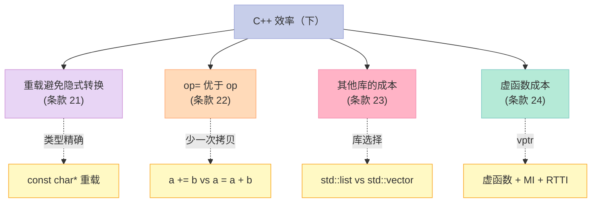
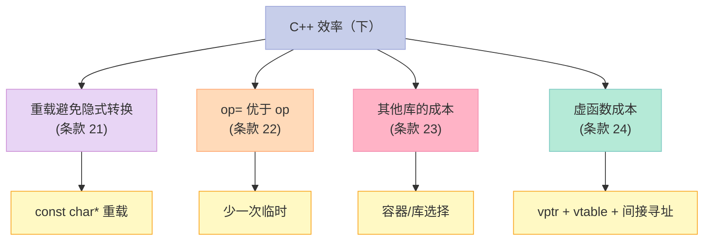

> **一句话核心结论**：C++ 效率优化的"下半部分"——**重载避免隐式转换**、**op= 优于 op**（少一次拷贝）、**不同库的性能差异巨大**、**虚函数 + 多重继承 + RTTI 的"真实成本"**（vptr + 间接寻址 + 阻止 EBO）。这 4 个条款是性能调优的"最后一块拼图"。

---

## 系列导航

| # | 文章 | 状态 |
|:--|:--|:--|
| 0 | [系列总览](/2026/06/18/more-effective-cpp-00-series-index/) | ✅ 已发布 |
| 1 | [基础议题](/2026/06/18/more-effective-cpp-01-basics/) | ✅ 已发布 |
| 2 | [操作符](/2026/06/18/more-effective-cpp-02-operators/) | ✅ 已发布 |
| 3 | [异常（上）](/2026/06/18/more-effective-cpp-03-exceptions-part1/) | ✅ 已发布 |
| 4 | [异常（下）](/2026/06/18/more-effective-cpp-04-exceptions-part2/) | ✅ 已发布 |
| 5 | [效率（上）](/2026/06/18/more-effective-cpp-05-efficiency-part1/) | ✅ 已发布 |
| 6 | [本文：效率（下）](/2026/06/18/more-effective-cpp-06-efficiency-part2/) | ✅ 已发布 |
| 7 | 技术：虚拟构造、智能指针、引用计数、双重分派 | 🔜 计划中 |
| 8 | 杂项 + 总结：未来时态、标准库、命名空间 | 🔜 计划中 |

---

## 前言：效率优化的"4 大工具"

第 5 篇讲了 5 大"软优化"——80-20、lazy、摊销、临时对象、RVO。

本篇讲 4 大"硬优化"——重载、op=、库选择、虚函数成本。



---

## 一、条款 21：利用重载技术避免隐式类型转换

### 1.1 经典反例

```cpp
// ❌ 隐式转换 → 临时对象
class String {
public:
    String(const char* s);
    // 隐式：const char* → String
};

class Database {
public:
    void add(const String& s);
};

Database db;
db.add("hello");  // ❌ const char* 隐式转 String（临时对象）
```

**问题**：

- `db.add("hello")` 中 `"hello"` 是 `const char*`
- 隐式构造临时 `String("hello")`
- 拷贝/移动到 `add` 参数
- 3 次操作（构造 + 移动 + 析构）

### 1.2 解决方案：重载 `const char*`

```cpp
// ✅ 重载 const char* 避免隐式
class Database {
public:
    void add(const String& s);
    void add(const char* s);  // 新增重载
};

Database db;
db.add("hello");  // ✅ 直接调 add(const char*)，0 次临时
db.add(String("hello"));  // ✅ 也 OK
```

### 1.3 实战：string 的常见重载

```cpp
// 标准 string 的"重载思维"
class BetterString {
    std::string s_;
public:
    // 单参数构造
    BetterString(const char* s) : s_(s) {}  // 显式
    BetterString(const std::string& s) : s_(s) {}

    // find 的重载
    size_t find(const char* s) const;
    size_t find(const std::string& s) const;
    size_t find(char c) const;  // 找单个字符

    // 多种重载，避免隐式
};
```

### 1.4 案例：complex 的算术

```cpp
// ❌ 反例
class Complex {
public:
    Complex(double r, double i);
    Complex operator+(const Complex& rhs) const;
};

Complex c(1.0, 2.0);
Complex d = c + 3.0;  // ❌ 3.0 隐式转 Complex
Complex e = 3.0 + c;  // ❌ 同上

// ✅ 重载 double
class Complex {
public:
    Complex operator+(const Complex& rhs) const;
    Complex operator+(double r) const;  // 新增
};
```

### 1.5 关键启示

1. **隐式转换 = 临时对象**——可能很贵
2. **重载精确类型**——避免隐式
3. **`const char*` 重载**是常见模式
4. **不要"为了避免重载"放过隐式**——性能是硬指标

---

## 二、条款 22：考虑以操作符复合形式（op=）取代其单独形式（op）

### 2.1 复合 vs 单独的差异

```cpp
// 单独形式
a = a + b;  // 1. a + b → 临时  2. 拷贝到 a  3. 析构临时

// 复合形式
a += b;     // 1. 直接 a += b → 原地操作
```

**对比**：

| 维度 | `a + b` | `a += b` |
|------|---------|----------|
| 临时对象 | 1 个 | 0 个 |
| 拷贝次数 | 1~2 | 0 |
| 实现 | `a + b` 返回临时 | `a += b` 原地 |

### 2.2 性能对比

```cpp
// 假设 Widget 是大型类（80KB）
Widget a, b;
a = a + b;  // 80KB 临时 + 80KB 拷贝 = 160KB 操作
a += b;     // 0 临时 + 0 拷贝 = 原地操作（极快）
```

### 2.3 实战：实现 `+=`

```cpp
class Matrix {
    double data_[N][N];
public:
    Matrix& operator+=(const Matrix& rhs) {
        for (int i = 0; i < N; ++i) {
            for (int j = 0; j < N; ++j) {
                data_[i][j] += rhs.data_[i][j];
            }
        }
        return *this;
    }

    // 单独形式可以基于 += 实现
    Matrix operator+(const Matrix& rhs) const {
        Matrix tmp(*this);  // 拷贝
        tmp += rhs;          // 复用 +=
        return tmp;          // RVO
    }
};
```

### 2.4 案例：string 的 `+=`

```cpp
std::string s = "hello";
// ❌ 链式 +
std::string result = s + " " + "world";
// 临时：s + " " → temp1
// 临时：temp1 + "world" → temp2
// result = temp2

// ✅ reserve + +=
std::string result;
result.reserve(s.size() + 1 + 5);
result += s;
result += " ";
result += "world";
// 0 临时
```

### 2.5 关键启示

1. **`op=` 优于 `op`**——少 1 次临时
2. **大型类尤其重要**——80KB 拷贝 vs 原地操作
3. **基于 `+=` 实现 `+`**——DRY + 性能
4. **`string` 用 `+=` 优于 `+`**——避免临时

---

## 三、条款 23：考虑使用其他程序库

### 3.1 不同库的性能差异

```cpp
// std::vector vs std::list：插入性能差 1000 倍
std::vector<int> v;
std::list<int> l;

// 头部插入
v.insert(v.begin(), 1);  // O(N) —— 1000 个元素
l.push_front(1);         // O(1)

// 但随机访问：
v[500];  // O(1)
l[500];  // ❌ list 没有 operator[]——必须遍历 O(N)
```

### 3.2 实战：不同容器的"性能地图"

| 操作 | vector | list | deque | map | unordered_map |
|------|--------|------|-------|-----|---------------|
| 头部插入 | O(N) | O(1) | O(1) | log N | O(1) avg |
| 尾部插入 | O(1) amortized | O(1) | O(1) | log N | O(1) avg |
| 中间插入 | O(N) | O(1) | O(N) | log N | O(1) avg |
| 随机访问 | O(1) | O(N) | O(1) | O(N) | O(1) avg |
| 查找 | O(N) | O(N) | O(N) | O(log N) | O(1) avg |
| 内存 | 连续 | 离散 | 分段 | 树 | 哈希 |

### 3.3 案例：std::string 的 SSO

```cpp
// 小字符串优化（SSO）
std::string s = "hello";  // 短字符串——不分配堆
std::string big = "a" * 1000;  // 长字符串——分配堆

// 短字符串（≤15 字节）通常存在 std::string 内部——0 次堆分配
// 长字符串才分配堆
```

### 3.4 实战：不同库的选择

```cpp
// JSON 库对比
nlohmann::json j;     // 易用，慢
rapidjson::Document d;  // 快
simdjson::ondemand::parser p;  // 最快

// 日志库对比
std::cout << "log\n";         // 慢
spdlog::info("log {}", x);    // 快（异步）
Quill::LOG_INFO("log");       // 更快

// 数学库对比
std::valarray<double> v;      // 标准
Eigen::VectorXd v;            // 矩阵运算超快
```

### 3.5 案例：标准库 vs Boost

```cpp
// std::shared_ptr vs boost::shared_ptr
// 现代 C++：std::shared_ptr 性能更好（C++11+）

// std::thread vs boost::thread
// 现代 C++：std::thread 性能更好

// std::array vs boost::array
// 几乎相同——std::array 是标准

// std::variant vs boost::variant
// C++17 的 std::variant 更优
```

### 3.6 关键启示

1. **不同库性能差异巨大**——可能 1000x
2. **选择合适的容器**——vector vs list
3. **选择合适的库**——标准库不一定最快
4. **用 benchmark 测**——别凭直觉

---

## 四、条款 24：了解 virtual functions、multiple inheritance、virtual base classes、runtime type identification 的成本

### 4.1 虚函数的成本

```cpp
// 虚函数的"4 大成本"
class Base {
public:
    virtual void foo();  // 1. vptr（每个对象 8 bytes）
    // 2. vtable（每个类 8 bytes）
    // 3. 间接寻址（调虚函数时查 vtable）
    // 4. 阻止空基类优化（EBO）
};
```

#### 成本 1：vptr 空间

```cpp
// 每个对象多一个 vptr
class Base {
    int x_;
    virtual void f();  // 加 vptr
};
// sizeof(Base) = 16（int 4 + padding 4 + vptr 8）

class NoVirtual {
    int x_;
};
// sizeof(NoVirtual) = 4
```

#### 成本 2：vtable 空间

```cpp
// 每个类多一份 vtable
class Base {
    virtual void f1();
    virtual void f2();
    virtual void f3();
};
// vtable 占 24 bytes（3 个函数指针）
```

#### 成本 3：间接寻址

```cpp
Base* pb = new Derived();
pb->f1();
// 汇编：
// mov rax, [pb]        ; 加载 vptr
// call [rax + 0]       ; 间接寻址
// vs 直接调用
// call Base::f1
```

**性能影响**：

- 虚函数调用 ≈ 直接调用的 1.5-2x 慢
- 但编译器可以"devirtualize"——在某些场景下消除间接寻址

#### 成本 4：阻止 EBO

```cpp
// EBO（Empty Base Optimization）
class Empty {};

class WithEBO : private Empty {
    int x_;
};
// sizeof(WithEBO) = 4（Empty 不占空间）

class WithMember {
    Empty e_;
    int x_;
};
// sizeof(WithMember) = 8（Empty 占 1 + padding + int 4）

// 虚函数会阻止 EBO
class WithVirtual {
    virtual void f();
    int x_;
};
// 即使继承 Empty，sizeof 也会是 16
```

### 4.2 多重继承的成本

```cpp
// 多重继承：多个 vptr
class A {
    int a_;
    virtual void f();
};

class B {
    int b_;
    virtual void g();
};

class C : public A, public B {
    int c_;
};
// sizeof(C) = 8 + 8 + 4 = 20（不一定是 24，依赖 ABI）
// C 有 2 个 vptr（A 和 B 各一个）
```

**成本**：

- 多个 vptr
- 指针转换需要调整（`A*` → `B*` 偏移）

### 4.3 虚基类的成本

```cpp
// 菱形继承
class File {
    int data_;
    virtual void f();
};

class InputFile : virtual public File {  // 虚继承
    // ...
};

class OutputFile : virtual public File {  // 虚继承
    // ...
};

class IOFile : public InputFile, public OutputFile {
    // 1 份 File（虚继承保证）
};
```

**成本**：

- 虚基类指针（vbptr）
- 访问虚基类成员是间接寻址
- 构造/析构复杂

### 4.4 RTTI 的成本

```cpp
// RTTI = Runtime Type Information
class Base { virtual ~Base() {} };  // 至少 1 个虚函数才有 RTTI
class Derived : public Base { /*...*/ };

Base* pb = new Derived();
auto* pd = dynamic_cast<Derived*>(pb);  // RTTI 查询
```

**成本**：

- 编译时：每个有虚函数的类存一个 `type_info`
- 运行时：`dynamic_cast` 查 type_info（strcmp）

**RTTI 关闭**：

```bash
g++ -fno-rtti myprogram.cpp  # 关闭 RTTI
```

### 4.5 实战：什么时候用虚函数？

```cpp
// ✅ 用虚函数：需要运行时多态
class Shape {
public:
    virtual void draw() const = 0;
    virtual ~Shape() = default;
};

// ❌ 不用虚函数：单态 + 性能敏感
class Point {
    int x_, y_;
    // 不需要虚函数
};
```

### 4.6 替代方案：模板 + 编译期多态

```cpp
// ✅ 模板——编译期多态，零运行时开销
template<typename T>
void process(const T& x) {
    x.draw();  // 编译期确定
}
// vs 虚函数——运行期间接寻址
```

### 4.7 关键启示

1. **虚函数 = vptr + vtable + 间接寻址 + 阻止 EBO**
2. **多重继承 = 多个 vptr + 指针调整**
3. **虚继承 = vbptr + 间接访问**
4. **RTTI = type_info + dynamic_cast 查询**
5. **性能敏感场景用模板**——编译期多态

---

## 五、4 个条款的"效率（下）"全景



---

## 六、常见误区与陷阱

### 6.1 误区 1：不重载 const char*

```cpp
// ❌ 隐式转换
class Database {
    void add(const String& s);
};
db.add("hello");  // 临时 String

// ✅ 重载
class Database {
    void add(const String& s);
    void add(const char* s);
};
```

### 6.2 误区 2：用 `+` 而非 `+=`

```cpp
// ❌ 链式 +
std::string s = a + b + c;  // 多次临时

// ✅ reserve + +=
std::string s;
s.reserve(a.size() + b.size() + c.size());
s += a; s += b; s += c;
```

### 6.3 误区 3：用 list 做随机访问

```cpp
// ❌ 错用 list
std::list<int> v;
int x = v[500];  // O(N) —— list 没有 operator[]

// ✅ 用 vector
std::vector<int> v;
int x = v[500];  // O(1)
```

### 6.4 误区 4：性能场景用虚函数

```cpp
// ❌ 性能敏感用虚函数
class MathOp {
public:
    virtual double apply(double a, double b) = 0;
};

// ✅ 用模板
template<typename Op>
double compute(Op op, double a, double b) {
    return op(a, b);
}
```

---

## 七、C++11/14/17 的演进

| 主题 | C++98 时代 | C++11/14/17/20 时代 |
|------|------------|---------------------|
| 重载 | 隐式转换 | 显式构造 + 模板重载 |
| op= | `+=` 等 | 同 + 移动 `+=` |
| 库选择 | 标准库 | + Boost + 第三方 |
| 虚函数 | 必要 | 概念（concepts）+ 模板替代 |
| 容器 | `auto_ptr` | `unique_ptr` + `vector` |
| 字符串 | `std::string` | `std::string` + SSO |
| 哈希 | 无 | `std::unordered_*` |
| RTTI | 必要 | `std::any` / `std::variant` |

**C++17 的 `std::string_view`**：

```cpp
// ✅ 避免不必要的 string 构造
void process(std::string_view s);  // 不分配
process("hello");  // 0 次分配
```

**C++20 的 concepts**：

```cpp
template<typename T>
concept Drawable = requires(T x) { x.draw(); };

template<Drawable T>
void process(const T& x) { x.draw(); }  // 编译期多态
```

---

## 八、面试高频考点

### 8.1 必背题

| 题目 | 答案要点 |
|------|----------|
| 怎么避免隐式转换？ | 重载精确类型 |
| op= vs op？ | op= 少一次临时 |
| vector vs list？ | vector 适合随机访问；list 适合频繁插入 |
| 虚函数的成本？ | vptr + vtable + 间接寻址 + 阻止 EBO |
| 多重继承的成本？ | 多个 vptr + 指针调整 |
| RTTI 怎么关闭？ | `-fno-rtti` |
| 怎么减少虚函数成本？ | 模板 / final / 性能分析 |
| SSO 是什么？ | 小字符串优化——存在 string 内部 |

### 8.2 高频追问

| 追问 | 关键点 |
|------|--------|
| 虚函数调用比直接调用慢多少？ | ~1.5-2x |
| 怎么消除虚函数？ | 模板 / CRTP / type erasure |
| 虚继承的代价？ | vbptr + 间接访问 |
| dynamic_cast 慢在哪？ | 查 type_info |
| -fno-rtti 能做什么？ | 减小二进制 + 加速 |
| 移动语义 vs 拷贝？ | 移动更快（无实际复制） |

---

## 九、配套实验

### 9.1 实验 1：op= vs op

```cpp
// 文件：op_compound.cpp
#include <iostream>
#include <chrono>

class BigArray {
    static constexpr int N = 100000;
    int data_[N];
public:
    BigArray() : data_{} {}
    BigArray& operator+=(const BigArray& rhs) {
        for (int i = 0; i < N; ++i) data_[i] += rhs.data_[i];
        return *this;
    }
    BigArray operator+(const BigArray& rhs) const {
        BigArray tmp(*this);
        tmp += rhs;
        return tmp;
    }
};

int main() {
    BigArray a, b;
    a += b;  // 测试 +=
    a = a + b;  // 测试 +
    return 0;
}
```

### 9.2 实验 2：vector vs list

```cpp
// 文件：vector_vs_list.cpp
#include <iostream>
#include <vector>
#include <list>
#include <chrono>

int main() {
    const int N = 100000;

    // vector 头部插入
    {
        auto start = std::chrono::steady_clock::now();
        std::vector<int> v;
        for (int i = 0; i < N; ++i) {
            v.insert(v.begin(), i);
        }
        auto end = std::chrono::steady_clock::now();
        auto us = std::chrono::duration_cast<std::chrono::microseconds>(end - start).count();
        std::cout << "vector insert head: " << us << " μs\n";
    }

    // list 头部插入
    {
        auto start = std::chrono::steady_clock::now();
        std::list<int> l;
        for (int i = 0; i < N; ++i) {
            l.push_front(i);
        }
        auto end = std::chrono::steady_clock::now();
        auto us = std::chrono::duration_cast<std::chrono::microseconds>(end - start).count();
        std::cout << "list push_front: " << us << " μs\n";
    }

    return 0;
}
```

### 9.3 实验 3：虚函数成本

```cpp
// 文件：virtual_cost.cpp
#include <iostream>
#include <chrono>

class NoVirtual {
public:
    void foo() { /*...*/ }
};

class WithVirtual {
public:
    virtual void foo() { /*...*/ }
};

int main() {
    std::cout << "sizeof(NoVirtual) = " << sizeof(NoVirtual) << "\n";
    std::cout << "sizeof(WithVirtual) = " << sizeof(WithVirtual) << "\n";
    return 0;
}
```

### 9.4 实验 4：重载避免隐式

```cpp
// 文件：overload_avoid_implicit.cpp
#include <iostream>
#include <string>

class String {
    std::string s_;
public:
    explicit String(const char* s) : s_(s) {}
    explicit String(const std::string& s) : s_(s) {}
    const std::string& data() const { return s_; }
};

class Database {
public:
    // ✅ 重载 const char* 避免隐式
    void add(const String& s) {
        std::cout << "add String: " << s.data() << "\n";
    }
    void add(const char* s) {  // 直接接受 const char*
        std::cout << "add const char*: " << s << "\n";
    }
};

int main() {
    Database db;
    db.add("hello");           // ✅ 调 add(const char*)
    db.add(String("world"));   // ✅ 调 add(const String&)
    return 0;
}
```

---

## 十、回到 4 条黄金法则

| 条款 | 黄金法则 |
|------|----------|
| 21 | 重载精确类型——避免隐式转换 |
| 22 | `op=` 优于 `op`——少一次临时 |
| 23 | 库选择 = 性能选择——不同库差异巨大 |
| 24 | 虚函数 + MI + RTTI = 真实成本——性能敏感用模板 |

---

## 十一、结尾思考题

> **思考题 1**：用 perf / gprof 找你的项目虚函数调用——是热点吗？

> **思考题 2**：把 `a = a + b` 改为 `a += b`，实测性能差异。

> **思考题 3**：比较 `std::vector` / `std::list` / `std::deque` 在你的场景下的性能。

> **思考题 4**：你的项目能关闭 RTTI 吗？`-fno-rtti` 有什么收益？

> **思考题 5**：用 CRTP 改写一个虚函数体系——对比虚函数的开销。

---

## 十二、本篇速查表

| 主题 | 关键 API / 模式 | 适用场景 |
|------|----------------|----------|
| 重载避免隐式 | `const char*` 重载 | 大型类 |
| op= vs op | `a += b` | 性能 |
| 库选择 | vector / list / unordered_map | 不同场景 |
| 虚函数成本 | vptr + vtable | 性能分析 |
| 模板替代 | 编译期多态 | 性能敏感 |
| 关闭 RTTI | `-fno-rtti` | 嵌入式 |

---

## 十三、系列导航

| # | 文章 | 状态 |
|:--|:--|:--|
| 0 | [系列总览](/2026/06/18/more-effective-cpp-00-series-index/) | ✅ 已发布 |
| 1 | [基础议题](/2026/06/18/more-effective-cpp-01-basics/) | ✅ 已发布 |
| 2 | [操作符](/2026/06/18/more-effective-cpp-02-operators/) | ✅ 已发布 |
| 3 | [异常（上）](/2026/06/18/more-effective-cpp-03-exceptions-part1/) | ✅ 已发布 |
| 4 | [异常（下）](/2026/06/18/more-effective-cpp-04-exceptions-part2/) | ✅ 已发布 |
| 5 | [效率（上）](/2026/06/18/more-effective-cpp-05-efficiency-part1/) | ✅ 已发布 |
| 6 | [本文：效率（下）](/2026/06/18/more-effective-cpp-06-efficiency-part2/) | ✅ 已发布 |
| 7 | 技术：虚拟构造、智能指针、引用计数、双重分派 | 🔜 计划中 |
| 8 | 杂项 + 总结：未来时态、标准库、命名空间 | 🔜 计划中 |

---

**下一篇**：第 7 篇《技术：虚拟构造、智能指针、引用计数、双重分派》——条款 25-31 一起讲透 C++ 高级技术：虚拟构造、对象计数、heap 限制、智能指针、引用计数、proxy class、双重分派。

> **行动建议**：
> 1. **今天**：用 `+=` 替换你项目里的 `+` 链
> 2. **今天**：重载你的 `add` / `find` 等接受 `const char*`
> 3. **本周**：用 benchmark 测你项目用的库——可能换库能快 10x
> 4. **本周**：识别你项目的虚函数成本——考虑模板替代
> 5. **思考**：你的项目能关闭 RTTI / 异常吗？
