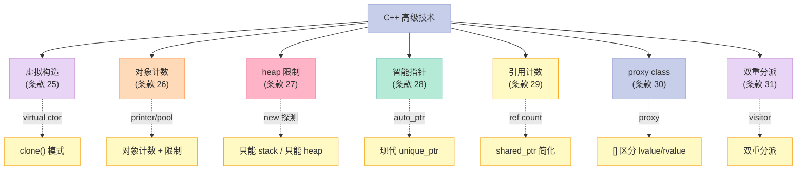
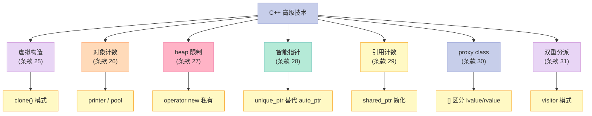

> **一句话核心结论**：C++ 高级技术的"7 大工程模式"——**虚拟构造**（virtual constructor 模式）、**对象计数与限制**（printer / pool 模式）、**heap 限制**（new 探测 / 析构限制）、**智能指针**（`auto_ptr` 的前世今生 + 现代 `unique_ptr`）、**引用计数**（`shared_ptr` 的简化版本）、**proxy class**（区分 `[]` 的左值/右值）、**双重分派**（visitor 模式）。

---

## 系列导航

| # | 文章 | 状态 |
|:--|:--|:--|
| 0 | [系列总览](/2026/06/18/more-effective-cpp-00-series-index/) | ✅ 已发布 |
| 1 | [基础议题](/2026/06/18/more-effective-cpp-01-basics/) | ✅ 已发布 |
| 2 | [操作符](/2026/06/18/more-effective-cpp-02-operators/) | ✅ 已发布 |
| 3 | [异常（上）](/2026/06/18/more-effective-cpp-03-exceptions-part1/) | ✅ 已发布 |
| 4 | [异常（下）](/2026/06/18/more-effective-cpp-04-exceptions-part2/) | ✅ 已发布 |
| 5 | [效率（上）](/2026/06/18/more-effective-cpp-05-efficiency-part1/) | ✅ 已发布 |
| 6 | [效率（下）](/2026/06/18/more-effective-cpp-06-efficiency-part2/) | ✅ 已发布 |
| 7 | [本文：技术](/2026/06/18/more-effective-cpp-07-techniques/) | ✅ 已发布 |
| 8 | 杂项 + 总结：未来时态、标准库、命名空间 | 🔜 计划中 |

---

## 前言：C++ 高级技术的"工具箱"

前面的章节讲了**正确性**、**性能**——本篇讲**设计**。



---

## 一、条款 25：将 constructor 和 non-member functions 虚化

### 1.1 为什么构造函数不能是 virtual？

```cpp
// ❌ 编译错误
class Widget {
public:
    virtual Widget();  // ❌ 构造函数不能是 virtual
};
```

**原因**：

- 构造函数的工作是**创建对象**——vptr 还没初始化
- 派生类的构造函数调用前，基类的构造函数必须先完成

### 1.2 解决方案：Virtual Constructor Pattern

```cpp
// ✅ 虚拟构造：返回基类指针/引用，但指向"自己"的新对象
class Base {
public:
    virtual ~Base() = default;
    virtual Base* clone() const = 0;  // "虚拟构造函数"
};

class Derived : public Base {
public:
    Base* clone() const override {
        return new Derived(*this);  // 拷贝自己
    }
};

// 使用
void process(Base* pb) {
    Base* copy = pb->clone();  // 多态拷贝——不关心实际类型
    // 用 copy
    delete copy;
}
```

### 1.3 实战：文档处理

```cpp
class Document {
public:
    virtual ~Document() = default;
    virtual Document* clone() const = 0;
    virtual void open(const std::string& path) = 0;
};

class PdfDocument : public Document {
public:
    Document* clone() const override { return new PdfDocument(*this); }
    void open(const std::string& path) override {
        std::cout << "Open PDF: " << path << "\n";
    }
};

class WordDocument : public Document {
public:
    Document* clone() const override { return new WordDocument(*this); }
    void open(const std::string& path) override {
        std::cout << "Open Word: " << path << "\n";
    }
};

// 工厂 + 虚拟构造
std::unique_ptr<Document> openDocument(const std::string& path) {
    std::unique_ptr<Document> doc = makeDocument(path);
    doc->open(path);
    return doc;
}
```

### 1.4 虚拟非成员函数

```cpp
// 通过 "virtual + non-member friend" 实现
class Base {
public:
    virtual ~Base() = default;
    virtual std::ostream& print(std::ostream& os) const = 0;

    // 非成员友元
    friend std::ostream& operator<<(std::ostream& os, const Base& b) {
        return b.print(os);
    }
};

class Derived : public Base {
public:
    std::ostream& print(std::ostream& os) const override {
        return os << "Derived";
    }
};

Derived d;
std::cout << d;  // "Derived"——operator<< 实际调 print
```

### 1.5 关键启示

1. **构造函数不能 virtual**——但可以"虚拟构造"（`clone()`）
2. **`clone()` 模式**——返回基类指针，指向"自己"的拷贝
3. **非成员虚拟**——`friend operator<<` + virtual print
4. **常见场景**：工厂、拷贝、序列化

---

## 二、条款 26：限制某个 class 所能产生的对象数量

### 2.1 问题：什么时候限制对象数量？

```cpp
// 场景 1：打印机——同时只有 1 个
class Printer {
public:
    static Printer& getInstance();  // 单例
};

// 场景 2：连接池——最多 10 个
class ConnectionPool {
    static constexpr int MAX = 10;
public:
    static Connection* acquire();  // 池管理
};
```

### 2.2 解决方案 1：构造函数私有 + 计数

```cpp
class Printer {
    static int count_;
    Printer();  // 私有
public:
    static Printer& getInstance() {
        static Printer instance;  // 单例
        return instance;
    }
};

int Printer::count_ = 0;
Printer::Printer() {
    if (++count_ > 1) {
        throw std::runtime_error("only 1 Printer");
    }
}
```

### 2.3 解决方案 2：对象计数（用于统计）

```cpp
class Widget {
    static int count_;
public:
    Widget() { ++count_; }
    ~Widget() { --count_; }
    static int count() { return count_; }
};

int Widget::count_ = 0;

// 使用
Widget w1, w2;
std::cout << Widget::count();  // 2
```

### 2.4 解决方案 3：限制数量的对象池

```cpp
class ConnectionPool {
    static constexpr int MAX = 10;
    Connection* pool_[MAX];
    bool used_[MAX] = {false};
public:
    Connection* acquire() {
        for (int i = 0; i < MAX; ++i) {
            if (!used_[i]) {
                used_[i] = true;
                return pool_[i];
            }
        }
        return nullptr;  // 池满
    }
    void release(Connection* c) {
        for (int i = 0; i < MAX; ++i) {
            if (pool_[i] == c) {
                used_[i] = false;
                return;
            }
        }
    }
};
```

### 2.5 关键启示

1. **限制数量 = 单例 / 池**——`getInstance` + 私有构造
2. **对象计数 = 静态成员**——构造 +1，析构 -1
3. **应用场景**：打印机、连接池、数据库连接、单例

---

## 三、条款 27：要求（或禁止）对象产生于 heap 中

### 3.1 场景 1：要求对象在 heap 中

```cpp
// 场景：对象太大，必须在 heap
class BigObject {
    // 100MB 成员
public:
    // 1. 构造函数 public
    BigObject() = default;
    // 2. 析构函数 protected
protected:
    ~BigObject() = default;
};

// 使用：必须 new
auto p = std::make_unique<BigObject>();
// 不用 delete——unique_ptr 自动
```

**原理**：

- 栈对象在作用域结束时调析构——析构不可见
- 析构 protected 后，栈对象无法调（编译器拒绝）
- 只能 new + 智能指针

### 3.2 场景 2：禁止对象在 heap 中

```cpp
// 场景：栈对象管理
class StackOnly {
public:
    StackOnly() = default;
    // 关键：operator new 私有
private:
    static void* operator new(std::size_t);
    static void operator delete(void*);
};

StackOnly s;  // ✅
// auto p = new StackOnly();  // ❌ operator new 私有
```

### 3.3 实战：组合

```cpp
// 禁止拷贝 + 只在 heap
class NonCopyableHeap {
    NonCopyableHeap() = default;
    NonCopyableHeap(const NonCopyableHeap&) = delete;
    NonCopyableHeap& operator=(const NonCopyableHeap&) = delete;
protected:
    ~NonCopyableHeap() = default;
public:
    static std::unique_ptr<NonCopyableHeap> create() {
        return std::make_unique<NonCopyableHeap>();
    }
};
```

### 3.4 关键启示

1. **必须在 heap**——析构 `protected` + 智能指针
2. **禁止在 heap**——`operator new/delete` 私有
3. **组合**：单例 + 不可拷贝 + 必须 heap
4. **替代方案**：工厂函数 + `unique_ptr`

---

## 四、条款 28：智能指针（Smart Pointers）

### 4.1 `auto_ptr`：C++98 的"怪胎"

```cpp
// C++98 的智能指针
std::auto_ptr<Widget> p1(new Widget());
std::auto_ptr<Widget> p2 = p1;  // ❌ 拷贝 = 转移所有权
*p2 = "hello";
// p1 已经是 nullptr
```

**问题**：

- 拷贝 = 转移所有权（违反直觉）
- 不能用于 STL 容器（`vector<auto_ptr<T>>` 排序破坏）
- C++11 起被 `= delete` 替代

### 4.2 `unique_ptr`：C++11 的"独占"指针

```cpp
// ✅ C++11 起：std::unique_ptr
std::unique_ptr<Widget> p1 = std::make_unique<Widget>();
// auto p2 = p1;  // ❌ 拷贝被删除
auto p2 = std::move(p1);  // ✅ 转移所有权
// p1 现在为 nullptr
```

**优势**：

- 零开销
- 明确"独占"语义
- 可用于 STL 容器

### 4.3 `shared_ptr`：C++11 的"共享"指针

```cpp
std::shared_ptr<Widget> p1 = std::make_shared<Widget>();
{
    auto p2 = p1;  // 引用计数 +1
    // p2 析构，引用计数 -1
}  // p1 还在——Widget 还活着
// p1 析构——Widget 释放
```

### 4.4 `weak_ptr`：打破循环引用

```cpp
struct Node {
    std::shared_ptr<Node> next;
    std::weak_ptr<Node> prev;  // ✅ weak_ptr 观察
};
```

### 4.5 智能指针的"前世今生"对照

| More Effective C++ | 现代 C++ |
|---------------------|----------|
| `auto_ptr`（条款 28） | `unique_ptr` / `shared_ptr` |
| 自己实现引用计数（条款 29） | `std::shared_ptr` |
| `auto_ptr` 的"陷阱" | `unique_ptr` 编译期拒绝拷贝 |

### 4.6 实战：迁移 auto_ptr → unique_ptr

```cpp
// C++98
std::auto_ptr<Widget> p(new Widget());
p->doSomething();

// C++11+
std::unique_ptr<Widget> p = std::make_unique<Widget>();
p->doSomething();
```

### 4.7 关键启示

1. **`auto_ptr` 已废弃**——别用
2. **`unique_ptr` 默认首选**——零开销
3. **共享所有权？`shared_ptr`**——小心循环引用
4. **`weak_ptr` 打破循环**——观察者

---

## 五、条款 29：Reference counting

### 5.1 什么是引用计数？

```cpp
// 共享同一个对象，多个指针引用
// 最后一个引用析构时——对象释放

class String {
    struct StringData {
        char* data_;
        size_t refCount_;  // 引用计数
    };
    StringData* data_;
public:
    String(const char* s) {
        data_ = new StringData;
        data_->data_ = strdup(s);
        data_->refCount_ = 1;
    }
    String(const String& other) : data_(other.data_) {
        ++data_->refCount_;
    }
    ~String() {
        if (--data_->refCount_ == 0) {
            free(data_->data_);
            delete data_;
        }
    }
};
```

### 5.2 写时复制（Copy-on-Write）

```cpp
// 修改时如果多人在用——先深拷贝
void String::modify(const char* newData) {
    if (data_->refCount_ > 1) {
        // 有人共用——深拷贝
        StringData* newData = new StringData;
        newData->data_ = strdup(data_->data_);
        newData->refCount_ = 1;
        --data_->refCount_;
        data_ = newData;
    }
    // 写
    strcpy(data_->data_, newData);
}
```

### 5.3 现代 C++：`std::shared_ptr`

```cpp
// std::shared_ptr = 线程安全的引用计数
std::shared_ptr<Widget> p1 = std::make_shared<Widget>();
auto p2 = p1;  // 引用计数 +1（原子操作）
// ...
// 引用计数 = 0 时——Widget 释放
```

### 5.4 引用计数的"4 大问题"

| 问题 | 说明 |
|------|------|
| **循环引用** | `shared_ptr` 互相引用——永远不释放 |
| **线程安全** | 计数加减需原子操作 |
| **destructor 慢** | 引用计数操作 |
| **内存不释放** | 一个大对象，多个引用 |

### 5.5 关键启示

1. **引用计数 = 共享所有权**——`shared_ptr` 的本质
2. **写时复制（COW）**——节省内存
3. **C++11 用 `std::shared_ptr`**——不用手写
4. **避免循环引用**——用 `weak_ptr`

---

## 六、条款 30：Proxy classes

### 6.1 什么是 proxy class？

```cpp
// proxy = 代理类——"假装"是另一种类型
// 经典用途：区分 operator[] 的左值/右值

class Matrix {
    double data_[N][N];
public:
    // 不用 proxy
    double& operator[](int i, int j) { return data_[i][j]; }
    // 缺点：m[i][j] = 3.14; 和 double x = m[i][j]; 走同一条路径
};

// 用 proxy
class Matrix {
public:
    // proxy 类
    class Element {
        Matrix& m_;
        int i_, j_;
    public:
        Element(Matrix& m, int i, int j) : m_(m), i_(i), j_(j) {}
        // 读
        operator double() const { return m_.data_[i_][j_]; }
        // 写
        Element& operator=(double v) {
            m_.data_[i_][j_] = v;
            return *this;
        }
    };

    Element operator[](int i, int j) { return Element(*this, i, j); }
};

Matrix m;
m[0][0] = 3.14;  // 调 Element::operator=
double x = m[0][0];  // 调 Element::operator double
```

### 6.2 经典应用：智能引用

```cpp
// ✅ proxy 实现"智能引用"
class String {
    std::string s_;
public:
    class CharProxy {
        String& s_;
        size_t pos_;
    public:
        CharProxy(String& s, size_t pos) : s_(s), pos_(pos) {}
        operator char() const { return s_.s_[pos_]; }  // 读
        CharProxy& operator=(char c) { /* 写时复制 */ s_.s_[pos_] = c; return *this; }  // 写
    };

    CharProxy operator[](size_t i) { return CharProxy(*this, i); }
};
```

### 6.3 现代 C++：`std::reference_wrapper` + `std::span`

```cpp
// C++11: std::reference_wrapper
std::reference_wrapper<int> r = std::ref(x);

// C++20: std::span——非所有权的引用
void process(std::span<int> data);
```

### 6.4 关键启示

1. **proxy = 代理类型**——"假装"是另一种类型
2. **区分 operator[] 的左值/右值**——主要应用
3. **替代方案**：`std::reference_wrapper` / `std::span`
4. **C++20 `std::span`**——更现代

---

## 七、条款 31：让函数根据一个以上的对象类型来决定

### 7.1 什么是双重分派（Double Dispatch）？

```cpp
// 场景：碰撞检测——Circle vs Circle、Circle vs Square 等
class Shape { /*...*/ };
class Circle : public Shape { /*...*/ };
class Square : public Shape { /*...*/ };

void process(const Shape& s1, const Shape& s2) {
    // 根据 s1 和 s2 的"组合"决定
    // 单分派（virtual）只支持 1 个——s1
    // 双重分派支持 2 个——s1 和 s2
}
```

### 7.2 经典反例：虚函数只支持单分派

```cpp
class Shape {
public:
    virtual bool intersect(const Shape& other) const = 0;
};

class Circle : public Shape {
public:
    bool intersect(const Shape& other) const override {
        // other 不知道是 Circle 还是 Square
        // 必须 dynamic_cast——慢
        if (auto* c = dynamic_cast<const Circle*>(&other)) {
            return circleCircle(c);
        }
        if (auto* s = dynamic_cast<const Square*>(&other)) {
            return circleSquare(s);
        }
        return false;
    }
};
```

**问题**：

- `dynamic_cast` 慢
- 不是"真正"的双重分派
- 类型扩展性差

### 7.3 解决方案：Visitor 模式

```cpp
class Circle;
class Square;

class Visitor {
public:
    virtual void visit(Circle& c) = 0;
    virtual void visit(Square& s) = 0;
};

class Shape {
public:
    virtual ~Shape() = default;
    virtual void accept(Visitor& v) = 0;  // 第一重分派
};

class Circle : public Shape {
public:
    void accept(Visitor& v) override { v.visit(*this); }  // 第二重分派
};

class Square : public Shape {
public:
    void accept(Visitor& v) override { v.visit(*this); }
};

// 具体 Visitor：碰撞检测
class CollisionVisitor : public Visitor {
public:
    void visit(Circle& c) override {
        std::cout << "Circle\n";
    }
    void visit(Square& s) override {
        std::cout << "Square\n";
    }
};

void detectCollision(Shape& s1, Shape& s2) {
    CollisionVisitor v;
    s1.accept(v);  // 第一次分派：s1 的 accept
    s2.accept(v);  // 第二次分派：s2 的 accept
}
```

### 7.4 现代 C++：`std::variant` + `std::visit`

```cpp
// ✅ C++17 起：std::variant + std::visit
using Shape = std::variant<Circle, Square>;

class CollisionVisitor {
public:
    void operator()(Circle& c) { std::cout << "Circle\n"; }
    void operator()(Square& s) { std::cout << "Square\n"; }
};

void detectCollision(Shape& s1, Shape& s2) {
    std::visit(CollisionVisitor{}, s1, s2);  // 双重分派
}
```

### 7.5 关键启示

1. **单分派** = 1 个 virtual（`f(x)` 中 x 决定）
2. **双重分派** = 2 个 virtual（`f(x, y)` 中 x, y 决定）
3. **经典实现** = Visitor 模式
4. **C++17 现代实现** = `std::variant` + `std::visit`

---

## 八、7 个条款的"技术"全景



---

## 九、常见误区与陷阱

### 9.1 误区 1：用 `auto_ptr` 在容器中

```cpp
// ❌
std::vector<std::auto_ptr<Widget>> v;  // 排序破坏

// ✅
std::vector<std::unique_ptr<Widget>> v;  // OK
```

### 9.2 误区 2：循环引用

```cpp
// ❌
struct Node {
    std::shared_ptr<Node> next;
    std::shared_ptr<Node> prev;  // 循环
};

// ✅
struct Node {
    std::shared_ptr<Node> next;
    std::weak_ptr<Node> prev;  // weak_ptr
};
```

### 9.3 误区 3：双重分派用 dynamic_cast

```cpp
// ❌
bool intersect(const Shape& other) {
    if (auto* c = dynamic_cast<const Circle*>(&other)) {
        return circleCircle(c);
    }
    // 慢 + 难扩展
}

// ✅ Visitor 模式 或 std::variant
```

---

## 十、C++11/14/17 的演进

| 主题 | C++98 时代 | C++11/14/17/20 时代 |
|------|------------|---------------------|
| 智能指针 | `auto_ptr` | `unique_ptr` / `shared_ptr` / `weak_ptr` |
| 引用计数 | 自己写 | `std::shared_ptr` |
| 双重分派 | Visitor 模式 | `std::variant` + `std::visit` |
| proxy | 自己写 | `std::reference_wrapper` / `std::span` |
| 虚拟构造 | `clone()` 模式 | `std::function` / 工厂 |
| 单例 | `static` + 私有构造 | `std::call_once` + `static` |

**C++17 的 `std::variant`**：

```cpp
using Shape = std::variant<Circle, Square>;
std::visit(visitor, shape);  // 双重分派
```

**C++20 的 `std::span`**：

```cpp
void process(std::span<int> data);  // 非所有权的引用
```

---

## 十一、面试高频考点

### 11.1 必背题

| 题目 | 答案要点 |
|------|----------|
| 虚拟构造怎么实现？ | `clone()` 模式 |
| `auto_ptr` 有什么问题？ | 拷贝 = 转移所有权 |
| `unique_ptr` vs `shared_ptr`？ | 独占 vs 共享 |
| 循环引用怎么解决？ | `weak_ptr` |
| 什么是双重分派？ | 根据 2 个对象类型决定 |
| Visitor 模式？ | 双重分派的经典实现 |
| 引用计数有什么问题？ | 循环引用 + 线程安全 |
| 什么是 proxy？ | 代理类，区分 lvalue/rvalue |

### 11.2 高频追问

| 追问 | 关键点 |
|------|--------|
| clone() 模式怎么用？ | 返回基类指针，指向"自己"的新对象 |
| 单例怎么写？ | `static` + 私有构造 + 计数 |
| heap 限制怎么实现？ | 析构 `protected` 或 `operator new` 私有 |
| 写时复制（COW）？ | 引用计数 + 修改时深拷贝 |
| std::variant 怎么用？ | 类型安全的 union + visit |
| Visitor 模式 vs std::visit？ | Visitor 是面向对象；visit 是模板元编程 |

---

## 十二、配套实验

### 12.1 实验 1：clone() 模式

```cpp
// 文件：clone_pattern.cpp
#include <iostream>
#include <memory>

class Shape {
public:
    virtual ~Shape() = default;
    virtual std::unique_ptr<Shape> clone() const = 0;
    virtual void draw() const = 0;
};

class Circle : public Shape {
public:
    std::unique_ptr<Shape> clone() const override {
        return std::make_unique<Circle>(*this);
    }
    void draw() const override {
        std::cout << "Circle\n";
    }
};

class Square : public Shape {
public:
    std::unique_ptr<Shape> clone() const override {
        return std::make_unique<Square>(*this);
    }
    void draw() const override {
        std::cout << "Square\n";
    }
};

int main() {
    std::vector<std::unique_ptr<Shape>> shapes;
    shapes.push_back(std::make_unique<Circle>());
    shapes.push_back(std::make_unique<Square>());

    for (const auto& s : shapes) {
        auto copy = s->clone();  // 多态克隆
        copy->draw();
    }

    return 0;
}
```

### 12.2 实验 2：智能指针迁移

```cpp
// 文件：smartptr_migration.cpp
#include <iostream>
#include <memory>

class Widget {
public:
    Widget() { std::cout << "Widget ctor\n"; }
    ~Widget() { std::cout << "Widget dtor\n"; }
    void hello() { std::cout << "Hello!\n"; }
};

int main() {
    // unique_ptr
    auto p1 = std::make_unique<Widget>();
    p1->hello();

    // shared_ptr
    auto sp1 = std::make_shared<Widget>();
    {
        auto sp2 = sp1;
        std::cout << "use_count: " << sp1.use_count() << "\n";
    }
    std::cout << "use_count: " << sp1.use_count() << "\n";

    return 0;
}
```

### 12.3 实验 3：双重分派

```cpp
// 文件：double_dispatch.cpp
#include <iostream>
#include <variant>
#include <vector>

class Circle;
class Square;

class CollisionVisitor {
public:
    void operator()(Circle& a, Circle& b) {
        std::cout << "Circle vs Circle\n";
    }
    void operator()(Circle& a, Square& b) {
        std::cout << "Circle vs Square\n";
    }
    void operator()(Square& a, Circle& b) {
        std::cout << "Square vs Circle\n";
    }
    void operator()(Square& a, Square& b) {
        std::cout << "Square vs Square\n";
    }
};

class Circle { public: int r = 1; };
class Square { public: int s = 2; };

using Shape = std::variant<Circle, Square>;

int main() {
    std::vector<Shape> shapes = {Circle{}, Square{}, Circle{}};

    for (size_t i = 0; i < shapes.size(); ++i) {
        for (size_t j = 0; j < shapes.size(); ++j) {
            std::visit(CollisionVisitor{}, shapes[i], shapes[j]);
        }
    }

    return 0;
}
```

### 12.4 实验 4：proxy 区分 lvalue/rvalue

```cpp
// 文件：proxy_demo.cpp
#include <iostream>
#include <vector>

class Matrix {
    std::vector<std::vector<double>> data_;
public:
    Matrix(int rows, int cols) : data_(rows, std::vector<double>(cols, 0)) {}

    // proxy 类
    class Element {
        Matrix& m_;
        int i_, j_;
    public:
        Element(Matrix& m, int i, int j) : m_(m), i_(i), j_(j) {}
        // 读
        operator double() const { return m_.data_[i_][j_]; }
        // 写
        Element& operator=(double v) {
            m_.data_[i_][j_] = v;
            return *this;
        }
    };

    Element operator[](int i, int j) {
        return Element(*this, i, j);
    }
};

int main() {
    Matrix m(3, 3);
    m[0][0] = 1.0;       // 写——调 operator=
    double x = m[0][0];  // 读——调 operator double
    std::cout << "m[0][0] = " << x << "\n";
    return 0;
}
```

---

## 十三、回到 7 条黄金法则

| 条款 | 黄金法则 |
|------|----------|
| 25 | 虚拟构造 = `clone()` 模式 |
| 26 | 限制数量 = 单例 / 池 / 计数 |
| 27 | heap 限制 = 析构 `protected` 或 `operator new` 私有 |
| 28 | 智能指针 = `unique_ptr` 替代 `auto_ptr` |
| 29 | 引用计数 = `shared_ptr` 简化 |
| 30 | proxy = 区分 `[]` 的左值/右值 |
| 31 | 双重分派 = Visitor 模式 / `std::variant` + `std::visit` |

---

## 十四、结尾思考题

> **思考题 1**：实现一个 `clone()` 模式的多态工厂。

> **思考题 2**：把代码里的 `auto_ptr` 迁移到 `unique_ptr` / `shared_ptr`。

> **思考题 3**：用 `std::variant` + `std::visit` 实现一个表达式求值器（支持 int、double、string）。

> **思考题 4**：Visitor 模式和 `std::visit` 的差异是什么？各自的优劣。

> **思考题 5**：你的项目里有哪些"循环引用"？用 `weak_ptr` 改写。

---

## 十五、本篇速查表

| 主题 | 关键 API / 模式 | 适用场景 |
|------|----------------|----------|
| 虚拟构造 | `clone()` 模式 | 多态工厂 |
| 对象限制 | 单例 / 池 | 资源限制 |
| heap 限制 | 析构 protected | 内存控制 |
| unique_ptr | `std::make_unique` | 默认智能指针 |
| shared_ptr | `std::make_shared` | 共享所有权 |
| weak_ptr | 观察者 | 打破循环 |
| 双重分派 | Visitor / `std::visit` | 碰撞检测 |

---

## 十六、系列导航

| # | 文章 | 状态 |
|:--|:--|:--|
| 0 | [系列总览](/2026/06/18/more-effective-cpp-00-series-index/) | ✅ 已发布 |
| 1 | [基础议题](/2026/06/18/more-effective-cpp-01-basics/) | ✅ 已发布 |
| 2 | [操作符](/2026/06/18/more-effective-cpp-02-operators/) | ✅ 已发布 |
| 3 | [异常（上）](/2026/06/18/more-effective-cpp-03-exceptions-part1/) | ✅ 已发布 |
| 4 | [异常（下）](/2026/06/18/more-effective-cpp-04-exceptions-part2/) | ✅ 已发布 |
| 5 | [效率（上）](/2026/06/18/more-effective-cpp-05-efficiency-part1/) | ✅ 已发布 |
| 6 | [效率（下）](/2026/06/18/more-effective-cpp-06-efficiency-part2/) | ✅ 已发布 |
| 7 | [本文：技术](/2026/06/18/more-effective-cpp-07-techniques/) | ✅ 已发布 |
| 8 | 杂项 + 总结：未来时态、标准库、命名空间 | 🔜 计划中 |

---

**下一篇**：第 8 篇《杂项 + 总结：未来时态、标准库、命名空间、临时对象》——条款 32-35 一起讲透 C++ 杂项：在未来时态下发展程序、将非尾端类设计为抽象类、C++ 和 C 混合编程、让自己习惯于标准 C++ 语言。

> **行动建议**：
> 1. **今天**：用 `unique_ptr` 替换你项目里的 `auto_ptr`
> 2. **今天**：识别你项目的循环引用——改用 `weak_ptr`
> 3. **本周**：用 Visitor 模式或 `std::visit` 优化你的双重分派
> 4. **本周**：用 clone() 模式设计你的多态工厂
> 5. **思考**：你的项目能用 `std::variant` 替代 union + 类型标志吗？
