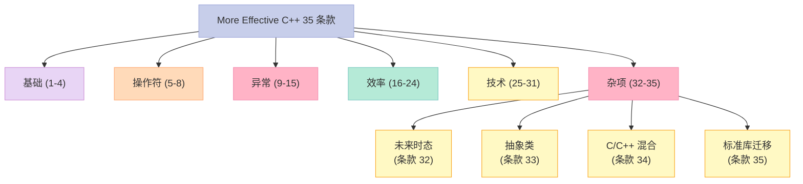
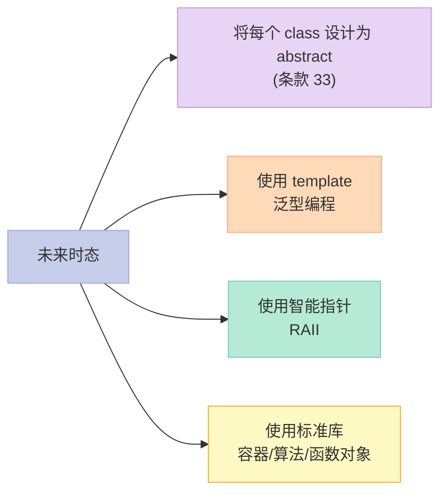
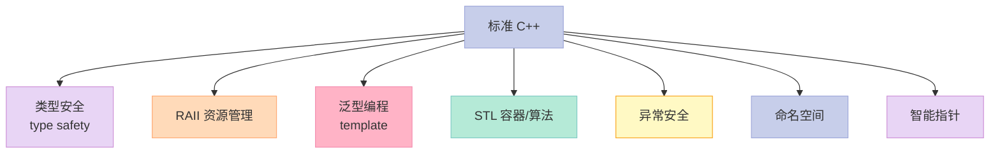
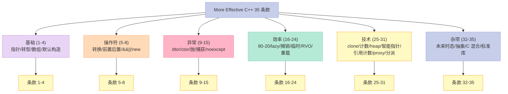
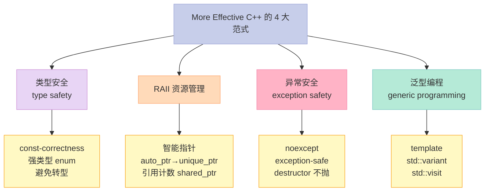
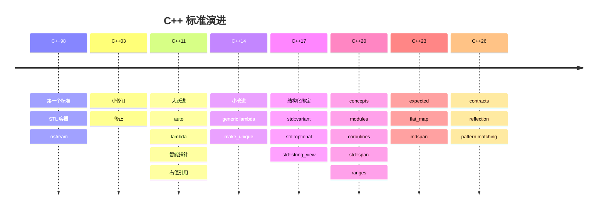
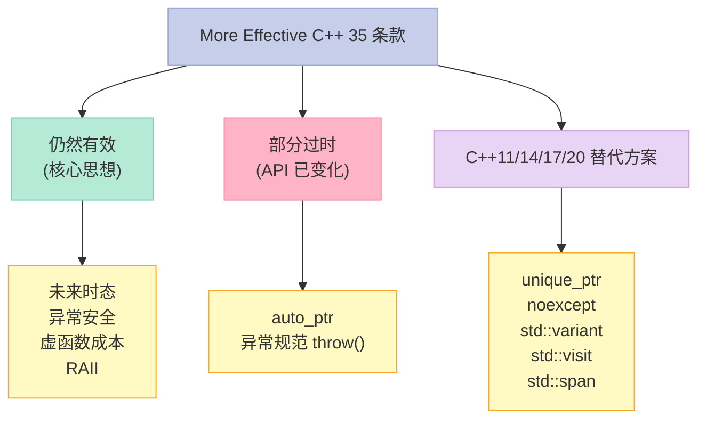
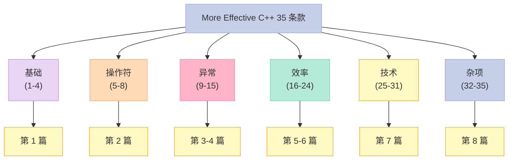

> **一句话核心结论**：C++ 杂项的 4 个核心：**未来时态**（为变化而设计）、**非尾端抽象类**（组合 vs 继承）、**C/C++ 混合**（`extern "C"` + 命名空间）、**临时对象**（生命周期 + `const T&`）。35 条款全部走完——**基础 / 操作符 / 异常 / 效率 / 技术 / 杂项** 6 大主题一网打尽。

---

## 系列导航

| # | 文章 | 状态 |
|:--|:--|:--|
| 0 | [系列总览](/2026/06/18/more-effective-cpp-00-series-index/) | ✅ 已发布 |
| 1 | [基础议题](/2026/06/18/more-effective-cpp-01-basics/) | ✅ 已发布 |
| 2 | [操作符](/2026/06/18/more-effective-cpp-02-operators/) | ✅ 已发布 |
| 3 | [异常（上）](/2026/06/18/more-effective-cpp-03-exceptions-part1/) | ✅ 已发布 |
| 4 | [异常（下）](/2026/06/18/more-effective-cpp-04-exceptions-part2/) | ✅ 已发布 |
| 5 | [效率（上）](/2026/06/18/more-effective-cpp-05-efficiency-part1/) | ✅ 已发布 |
| 6 | [效率（下）](/2026/06/18/more-effective-cpp-06-efficiency-part2/) | ✅ 已发布 |
| 7 | [技术](/2026/06/18/more-effective-cpp-07-techniques/) | ✅ 已发布 |
| 8 | [本文：杂项 + 总结](/2026/06/18/more-effective-cpp-08-miscellany-and-summary/) | ✅ 已发布 |

---

## 前言：35 条款的"终章"

前面的 7 篇把 31 个条款讲完了——还剩 4 个（32-35）。这 4 个是**顶层设计原则**：



---

## 一、条款 32：在未来时态下发展程序

### 1.1 什么是"未来时态"？

```cpp
// 现在时态：满足当前需求
class Widget {
    int value_;
public:
    void setValue(int v) { value_ = v; }
    int getValue() const { return value_; }
};

// 未来时态：考虑未来的变化
class Widget {
    int value_;
public:
    // 现在只要 int——但 future 可能是 long、double、string
    virtual void setValue(int v) = 0;  // 留接口
    virtual int getValue() const = 0;
    // 派生类可以扩展
};
```

### 1.2 4 大未来时态设计原则



### 1.3 原则 1：将每个 class 设计为 abstract

```cpp
// ❌ 错：根 class 已经是"具体类"
class Shape { /*...*/ };  // 别人会直接用 Shape
class Circle : public Shape { /*...*/ };

// ✅ 对：根 class 是 abstract
class Shape {  // abstract
public:
    virtual void draw() const = 0;
    virtual ~Shape() = default;
};
class Circle : public Shape { /*...*/ };
```

**原因**：abstract 不能直接实例化——强迫用户用派生类，扩展容易。

### 1.4 原则 2：使用 template

```cpp
// ❌ 错：硬编码类型
class IntArray {
    int* data_;
    size_t size_;
public:
    int& at(size_t i) { return data_[i]; }
};

// ✅ 对：template
template<typename T>
class Array {
    T* data_;
    size_t size_;
public:
    T& at(size_t i) { return data_[i]; }
};

Array<int> a1;
Array<double> a2;
Array<std::string> a3;
```

### 1.5 原则 3：使用 RAII（智能指针）

```cpp
// ❌ 错：手动管理
Widget* p = new Widget();
// ... 可能忘记 delete
delete p;

// ✅ 对：RAII
std::unique_ptr<Widget> p = std::make_unique<Widget>();
// 自动释放
```

### 1.6 原则 4：使用标准库

```cpp
// ❌ 错：自己写
class MyVector { /*...*/ };

// ✅ 对：std::vector
std::vector<Widget> v;
```

### 1.7 关键启示

1. **未来时态 = 为变化而设计**
2. **abstract class 强迫扩展**——具体类阻碍
3. **template 泛化**——避免硬编码
4. **RAII + 标准库**——减少手工代码

---

## 二、条款 33：将非尾端类（nicht-leaf class）设计为 abstract

### 2.1 什么是"非尾端类"？

```cpp
class Animal {  // 非尾端——会被继承
    std::string name_;
public:
    virtual void speak() = 0;  // 纯虚——abstract
};

class Dog : public Animal {  // 尾端——直接使用
public:
    void speak() override { std::cout << "Woof\n"; }
};
```

**尾端类 = leaf class** = 不再被继承的类。

**非尾端类 = non-leaf class** = 会被继承的类。

### 2.2 反例：非尾端类不是 abstract

```cpp
// ❌ 反例
class Shape {  // 非尾端——下面有 Circle、Square 继承
public:
    void draw() { /*...*/ }  // 非纯虚——具体类
};

class Circle : public Shape { /*...*/ };

// 问题：
Shape s;  // ❌ "Shape" 没有意义——但能实例化
auto* p = new Shape();  // ❌ 出现野指针
```

### 2.3 解决方案

```cpp
// ✅ 正确
class Shape {  // 非尾端——abstract
public:
    virtual void draw() const = 0;  // 纯虚
    virtual ~Shape() = default;
};

class Circle : public Shape {  // 尾端——具体
public:
    void draw() const override { std::cout << "Circle\n"; }
};
```

### 2.4 现代 C++：`final` 关键字

```cpp
// C++11：明确"尾端"
class Circle final : public Shape {  // 不能再被继承
public:
    void draw() const override { std::cout << "Circle\n"; }
};

// 编译错误：尝试继承 final class
class BigCircle : public Circle { /*...*/ };  // ❌
```

### 2.5 关键启示

1. **非尾端类 = abstract**——纯虚
2. **尾端类 = concrete**——具体实现
3. **`final` 关键字**——明确"不能继承"
4. **接口分离**——抽象 vs 实现

---

## 三、条款 34：如何在 C++ 程序中混合使用 C 和 C++

### 3.1 问题：函数名修饰（Mangling）

```cpp
// C++ 编译
void hello() { /*...*/ }
// 编译器生成：_Z5hellov（mangled）

// C 编译
void hello() { /*...*/ }
// 编译器生成：_hello（unmangled）
```

**C++ 支持函数重载——必须 mangling**；**C 不支持——不 mangling**。

### 3.2 解决方案：`extern "C"`

```cpp
// 头文件 mylib.h
#ifdef __cplusplus
extern "C" {
#endif

void hello();  // 告诉 C++ 编译器：按 C 规则编译

#ifdef __cplusplus
}
#endif
```

### 3.3 完整混合编程模板

```cpp
// mylib.h
#ifndef MYLIB_H
#define MYLIB_H

#ifdef __cplusplus
extern "C" {
#endif

int add(int a, int b);
void process(const char* s);

#ifdef __cplusplus
}
#endif

#endif
```

```c
// mylib.c
#include "mylib.h"

int add(int a, int b) {
    return a + b;
}

void process(const char* s) {
    printf("Hello, %s\n", s);
}
```

```cpp
// main.cpp
#include "mylib.h"
#include <iostream>

int main() {
    int x = add(1, 2);  // 调用 C 函数
    std::cout << "1 + 2 = " << x << "\n";
    process("World");
    return 0;
}
```

**编译**：

```bash
gcc -c mylib.c -o mylib.o
g++ main.cpp mylib.o -o main
```

### 3.4 C 调用 C++：包装层

```cpp
// wrapper.cpp
#include "MyClass.h"

extern "C" {
    void* create_object() { return new MyClass(); }
    void destroy_object(void* p) { delete static_cast<MyClass*>(p); }
    int do_something(void* p) { return static_cast<MyClass*>(p)->doSomething(); }
}
```

```c
// main.c
extern void* create_object();
extern void destroy_object(void*);
extern int do_something(void*);

int main() {
    void* obj = create_object();
    int result = do_something(obj);
    destroy_object(obj);
    return 0;
}
```

### 3.5 命名空间与 `extern "C"`

```cpp
namespace mylib {
    extern "C" void hello();  // C 函数 + C++ 命名空间
}

mylib::hello();  // OK
```

### 3.6 关键启示

1. **C++ 函数名 mangling**——支持重载
2. **`extern "C"` 关闭 mangling**——C 兼容
3. **头文件用 `__cplusplus` 保护**——同时被 C/C++ 包含
4. **C 调 C++ = 包装层**——void* 桥接
5. **namespace + `extern "C"`**——推荐

---

## 四、条款 35：让自己习惯于标准 C++ 语言

### 4.1 标准 C++ = "新 C++"

```cpp
// ❌ 老 C++
char* s = new char[10];
strcpy(s, "hello");
delete[] s;

// ✅ 新 C++
std::string s = "hello";  // RAII + 标准库
```

### 4.2 标准 C++ 的"4 件套"

| 组件 | 旧方式 | 新方式 |
|------|--------|--------|
| 字符串 | `char*` | `std::string` |
| 容器 | 自己写 | `std::vector` / `std::map` |
| 智能指针 | `auto_ptr` | `unique_ptr` / `shared_ptr` |
| 算法 | 手动循环 | `std::sort` / `std::find` |

### 4.3 实战：把 C 代码翻译成 C++

```c
// ❌ C 风格
typedef struct {
    int x, y;
} Point;

void print_point(Point* p) {
    printf("(%d, %d)\n", p->x, p->y);
}
```

```cpp
// ✅ C++ 风格
struct Point {
    int x, y;
};

std::ostream& operator<<(std::ostream& os, const Point& p) {
    return os << "(" << p.x << ", " << p.y << ")";
}

Point p{1, 2};
std::cout << p;  // "(1, 2)"
```

### 4.4 标准 C++ 的"7 大收益"



### 4.5 关键启示

1. **标准 C++** = 用 `std::*` 替换手写
2. **`std::string` 替代 `char*`**——内存安全
3. **`std::vector` 替代 C 数组**——边界检查
4. **`unique_ptr` 替代 `auto_ptr`**——明确所有权

---

## 五、35 条款总结：6 大主题全景

### 5.1 6 大主题地图



### 5.2 35 条款速查表

| 主题 | 条款 | 黄金法则 |
|------|------|----------|
| 基础 | 1 | 指针/引用的选择 |
| 基础 | 2 | C++ 转型的 4 种用途 |
| 基础 | 3 | 多态数组的"灾难" |
| 基础 | 4 | 默认构造的"陷阱" |
| 操作符 | 5 | 用户定义转换函数 |
| 操作符 | 6 | 前置/后置++/--的差异 |
| 操作符 | 7 | `&&`/`||` 重载的"怪事" |
| 操作符 | 8 | `new`/`delete` 的重载 |
| 异常 | 9 | destructor 不抛 |
| 异常 | 10 | constructor 防止泄漏 |
| 异常 | 11 | 析构不抛（续） |
| 异常 | 12 | 抛异常 vs 传参 |
| 异常 | 13 | catch by reference |
| 异常 | 14 | `noexcept` 与性能 |
| 异常 | 15 | 异常的成本 |
| 效率 | 16 | 80-20 法则 |
| 效率 | 17 | lazy evaluation |
| 效率 | 18 | 摊销成本 |
| 效率 | 19 | 临时对象的"陷阱" |
| 效率 | 20 | 返回值优化 (RVO) |
| 效率 | 21 | 重载避免隐式转换 |
| 效率 | 22 | `op=` 优于 `op` |
| 效率 | 23 | 考虑使用其他程序库 |
| 效率 | 24 | 虚函数 / 多重继承 / RTTI 的成本 |
| 技术 | 25 | 虚拟构造（clone） |
| 技术 | 26 | 限制对象数量 |
| 技术 | 27 | heap 中创建对象 |
| 技术 | 28 | 智能指针 |
| 技术 | 29 | 引用计数 |
| 技术 | 30 | proxy class |
| 技术 | 31 | 双重分派 |
| 杂项 | 32 | 未来时态 |
| 杂项 | 33 | 非尾端类 = abstract |
| 杂项 | 34 | C/C++ 混合编程 |
| 杂项 | 35 | 习惯标准 C++ |

### 5.3 4 大核心范式回顾



### 5.4 C++11/14/17/20 的演进

| 主题 | C++98 时代 | 现代 C++ |
|------|------------|----------|
| 智能指针 | `auto_ptr` | `unique_ptr` / `shared_ptr` / `weak_ptr` |
| 异常声明 | `throw(int, char)` | `noexcept` |
| 转型 | `static_cast` 等 | 同上 + `std::variant` |
| 类型 | 硬编码 | `auto` / `decltype` |
| 容器 | `vector` / `list` | 同上 + `array` / `span` |
| 算法 | 手写 | `std::sort` / `std::find` / `std::ranges` |
| 函数对象 | `functor` | `lambda` / `std::function` |
| 字符串 | `std::string` | `std::string_view` |
| 多线程 | POSIX / Win32 | `std::thread` / `std::async` |
| 双重分派 | Visitor | `std::variant` + `std::visit` |
| Concepts | - | C++20 `concept` |
| Modules | - | C++20 `module` |

---

## 六、35 条款的"价值"回顾

### 6.1 核心思想 1：避免代码重复

- `auto_ptr` → `unique_ptr`
- 手写容器 → `std::vector` / `std::map`
- `char*` → `std::string`

### 6.2 核心思想 2：类型安全

- `const`-correctness
- 强类型 `enum class`
- 避免 C 风格转型

### 6.3 核心思想 3：资源管理自动化

- RAII
- 智能指针
- 异常安全

### 6.4 核心思想 4：抽象与扩展

- abstract class
- template
- Visitor 模式

### 6.5 核心思想 5：性能优化

- 80-20 法则
- lazy evaluation
- RVO
- 摊销成本

### 6.6 核心思想 6：未来时态

- 抽象 class
- template
- 智能指针
- 标准库

---

## 七、C++ 标准演进时间线



---

## 八、More Effective C++ 之外：必读经典

| 序号 | 经典 | 推荐 |
|------|------|------|
| 1 | **Effective C++**（55 条款） | ⭐⭐⭐⭐⭐ |
| 2 | **Effective Modern C++**（42 条款） | ⭐⭐⭐⭐⭐ |
| 3 | **Effective STL**（50 条款） | ⭐⭐⭐⭐ |
| 4 | **C++ Concurrency in Action** | ⭐⭐⭐⭐⭐ |
| 5 | **Design Patterns**（GoF） | ⭐⭐⭐⭐ |
| 6 | **Clean Code** | ⭐⭐⭐⭐ |
| 7 | **C++ Primer** | ⭐⭐⭐⭐⭐ |
| 8 | **The C++ Programming Language** | ⭐⭐⭐⭐⭐ |

---

## 九、More Effective C++ vs Effective C++

| 维度 | Effective C++ | More Effective C++ |
|------|---------------|---------------------|
| 条款数 | 55 | 35 |
| 主要视角 | "做什么" | "怎么做" |
| 难度 | 入门 - 中级 | 中级 - 高级 |
| C++11 适配 | 第 3 版（2011 前） | 旧版本，**C++11 后部分条款已过时** |
| 主题 | 9 大类 | 6 大类 |
| 适合读者 | 所有人 | 想"更上一层楼" |

**推荐阅读顺序**：

1. Effective C++ → 建立基础
2. Effective Modern C++ → 升级到 C++11/14/17
3. **More Effective C++** → 进阶设计
4. Effective STL → 容器/算法
5. C++ Concurrency in Action → 并发

---

## 十、More Effective C++ 的"现代意义"



### 10.1 仍然有效的核心思想

- 未来时态
- 异常安全（destructor 不抛）
- 虚函数成本
- RAII
- 引用计数

### 10.2 部分过时的 API

- `auto_ptr` → `unique_ptr`
- 异常规范 `throw(int)` → `noexcept`
- 自己写引用计数 → `std::shared_ptr`

### 10.3 现代 C++ 替代

| 旧 | 新 |
|----|----|
| `auto_ptr` | `unique_ptr` |
| 异常规范 | `noexcept` |
| union + 类型标志 | `std::variant` |
| Visitor 模式 | `std::variant` + `std::visit` |
| `std::function` + 状态 | lambda |
| `string` 切片 | `std::string_view` |
| C 数组 + size | `std::array` / `std::span` |

---

## 十一、回到 4 条黄金法则

| 条款 | 黄金法则 |
|------|----------|
| 32 | 未来时态 = 为变化而设计 |
| 33 | 非尾端类 = abstract |
| 34 | C/C++ 混合 = `extern "C"` + 命名空间 |
| 35 | 习惯标准 C++ |

---

## 十二、结尾思考题

> **思考题 1**：你的项目里有哪些"未来时态"设计？哪些违背了？

> **思考题 2**：你的根 class 是不是 abstract？改造一下。

> **思考题 3**：你项目里有没有 C/C++ 混合？用了 `extern "C"` 吗？

> **思考题 4**：你项目里还在用 `char*` 或 `auto_ptr` 吗？迁移到 `std::string` 和 `unique_ptr`。

> **思考题 5**：5 年后，C++ 标准会有哪些新东西？C++23/26 有你想用的特性吗？

---

## 十三、配套实验

### 13.1 实验 1：未来时态（abstract class）

```cpp
// 文件：future_tense.cpp
#include <iostream>
#include <vector>
#include <memory>

// ✅ 非尾端 class = abstract
class Shape {
public:
    virtual ~Shape() = default;
    virtual void draw() const = 0;
    virtual double area() const = 0;
};

class Circle : public Shape {
    double r_;
public:
    Circle(double r) : r_(r) {}
    void draw() const override { std::cout << "Circle r=" << r_ << "\n"; }
    double area() const override { return 3.14159 * r_ * r_; }
};

class Square : public Shape {
    double s_;
public:
    Square(double s) : s_(s) {}
    void draw() const override { std::cout << "Square s=" << s_ << "\n"; }
    double area() const override { return s_ * s_; }
};

int main() {
    std::vector<std::unique_ptr<Shape>> shapes;
    shapes.push_back(std::make_unique<Circle>(1.0));
    shapes.push_back(std::make_unique<Square>(2.0));

    for (const auto& s : shapes) {
        s->draw();
        std::cout << "  area=" << s->area() << "\n";
    }
    return 0;
}
```

### 13.2 实验 2：C/C++ 混合编程

```cpp
// 文件：c_mix.hpp
#ifndef C_MIX_HPP
#define C_MIX_HPP

#ifdef __cplusplus
extern "C" {
#endif

int add(int a, int b);
void greet(const char* name);

#ifdef __cplusplus
}
#endif

#endif
```

```c
// 文件：c_mix.c
#include "c_mix.hpp"
#include <stdio.h>

int add(int a, int b) {
    return a + b;
}

void greet(const char* name) {
    printf("Hello, %s from C!\n", name);
}
```

```cpp
// 文件：main.cpp
#include "c_mix.hpp"
#include <iostream>

int main() {
    std::cout << "1 + 2 = " << add(1, 2) << "\n";
    greet("World");
    return 0;
}
```

**编译**：

```bash
gcc -c c_mix.c -o c_mix.o
g++ main.cpp c_mix.o -o main
```

### 13.3 实验 3：标准 C++ 迁移

```cpp
// 文件：modernize.cpp
#include <iostream>
#include <string>
#include <vector>
#include <memory>
#include <algorithm>

int main() {
    // ❌ 老 C++
    // char* s = new char[10];
    // strcpy(s, "hello");
    // int* arr = new int[5]{1, 2, 3, 4, 5};
    // delete[] s;
    // delete[] arr;

    // ✅ 新 C++
    std::string s = "hello";
    std::vector<int> arr = {1, 2, 3, 4, 5};

    std::sort(arr.begin(), arr.end(), std::greater<int>());

    for (int x : arr) {
        std::cout << x << " ";
    }
    std::cout << "\n";
    std::cout << s << "\n";

    return 0;
}
```

### 13.4 实验 4：临时对象

```cpp
// 文件：temp_obj.cpp
#include <iostream>
#include <string>

// ❌ 错：接受 by value
std::string combine1(std::string a, std::string b) {
    return a + b;  // 临时对象
}

// ✅ 对：接受 by const ref
std::string combine2(const std::string& a, const std::string& b) {
    return a + b;
}

int main() {
    std::string x = "Hello, ";
    std::string y = "World!";

    auto r1 = combine1(x, y);  // 拷贝
    auto r2 = combine2(x, y);  // 引用——零拷贝

    std::cout << r1 << "\n";
    std::cout << r2 << "\n";
    return 0;
}
```

---

## 十四、本系列全集回顾

### 14.1 文章地图



### 14.2 8 篇文章清单

| # | 文章 | 条款 | 状态 |
|:--|:--|:--|:--|
| 0 | 系列总览 | 35 条款 | ✅ |
| 1 | 基础议题 | 1-4 | ✅ |
| 2 | 操作符 | 5-8 | ✅ |
| 3 | 异常（上） | 9-12 | ✅ |
| 4 | 异常（下） | 13-15 | ✅ |
| 5 | 效率（上） | 16-20 | ✅ |
| 6 | 效率（下） | 21-24 | ✅ |
| 7 | 技术 | 25-31 | ✅ |
| 8 | **本文** | 32-35 | ✅ |

---

## 十五、系列完结：致读者

> **C++ 学习的"3 个阶段"**：
> 1. **入门**：能写——Hello World、vector、class
> 2. **中级**：能写对——RAII、智能指针、模板
> 3. **高级**：能写好——性能、抽象、扩展

> **More Effective C++ = 中级到高级的"桥梁"**。
>
> 35 条款，6 大主题，4 大范式——这是 25 年前的"经典"，但**核心思想到今天仍然适用**。
>
> 即使有了 C++11/14/17/20，**虚函数仍然有成本**、**临时对象仍然要避免**、**未来时态仍然重要**、**标准库仍然是首选**。
>
> 愿你：写更好的 C++。

---

## 十六、系列导航

| # | 文章 | 状态 |
|:--|:--|:--|
| 0 | [系列总览](/2026/06/18/more-effective-cpp-00-series-index/) | ✅ 已发布 |
| 1 | [基础议题](/2026/06/18/more-effective-cpp-01-basics/) | ✅ 已发布 |
| 2 | [操作符](/2026/06/18/more-effective-cpp-02-operators/) | ✅ 已发布 |
| 3 | [异常（上）](/2026/06/18/more-effective-cpp-03-exceptions-part1/) | ✅ 已发布 |
| 4 | [异常（下）](/2026/06/18/more-effective-cpp-04-exceptions-part2/) | ✅ 已发布 |
| 5 | [效率（上）](/2026/06/18/more-effective-cpp-05-efficiency-part1/) | ✅ 已发布 |
| 6 | [效率（下）](/2026/06/18/more-effective-cpp-06-efficiency-part2/) | ✅ 已发布 |
| 7 | [技术](/2026/06/18/more-effective-cpp-07-techniques/) | ✅ 已发布 |
| 8 | [本文：杂项 + 总结](/2026/06/18/more-effective-cpp-08-miscellany-and-summary/) | ✅ 已发布 |

---

**本系列完结**。

> **行动建议**：
> 1. **重读系列总览**——梳理 35 条款的全景
> 2. **每个项目用 1-2 条改进**——把 35 条款变成肌肉记忆
> 3. **读 Effective Modern C++**——把 35 条款升级到 C++11/14/17
> 4. **重读你的代码**——用 More Effective C++ 的眼光审视
> 5. **分享给同事**——C++ 的进步，从自己开始

🎉 **恭喜！你已经掌握了 More Effective C++ 的全部 35 条款**。
