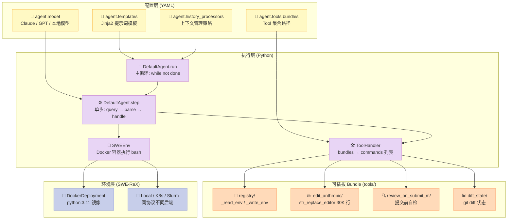
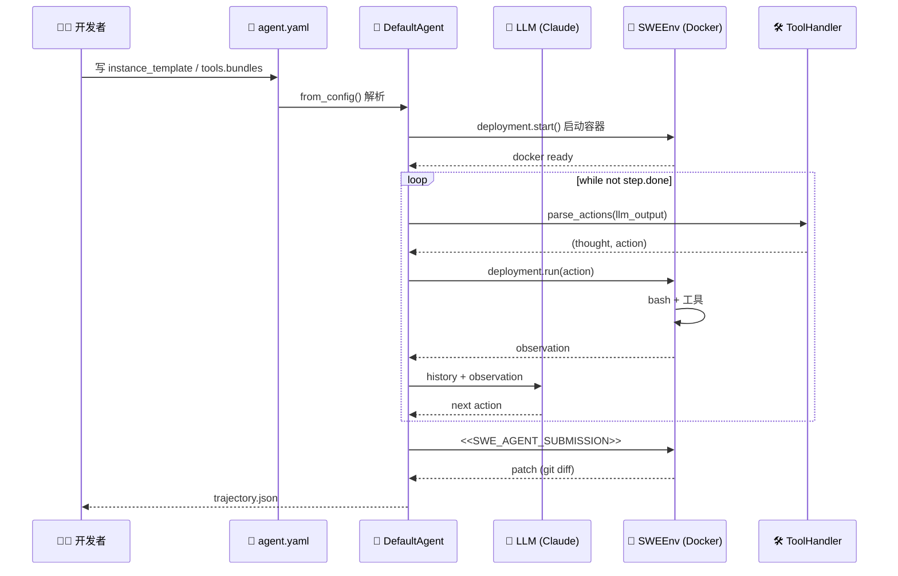
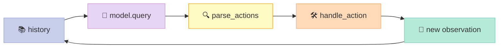
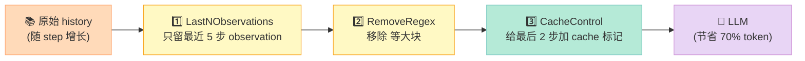
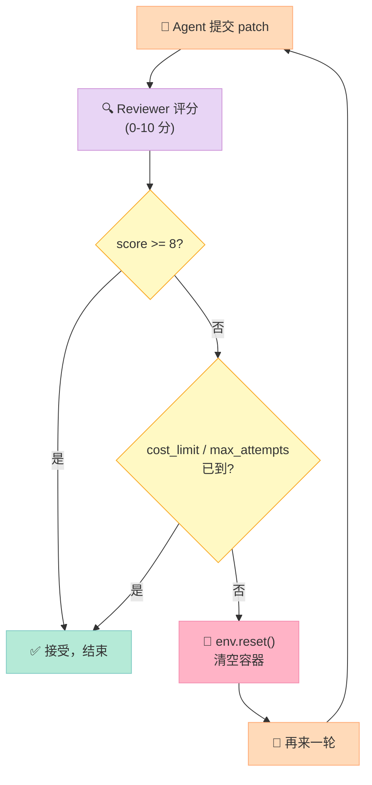

> 一句话结论：SWE-agent（`princeton-nlp/SWE-agent`，19.5k⭐，NeurIPS 2024）用「**1 个 YAML 模板 + 1 个 `while not done: step()` 循环 + 4 个可插拔 Tool Bundle**」的四层架构，把 GitHub Issue 修复这一最难工程化问题做成了可配置的研究系统。它在 SWE-bench Verified 上拿到 SOTA，配套的 mini-swe-agent（5.2k⭐，100 行 Python）更以 1/30 的代码量复现 74%+ 准确率，是当前最有教学价值的代码 Agent 范式。

## 前言：为什么代码 Agent 都绕不开 SWE-bench？

如果你是 AI 工程师，最近半年一定被这种声音刷屏：

- *「OpenHands 又涨了 1 万 star」*
- *「Cline 的 PR 接管了我的 IDE」*
- *「Claude Code / Codex 已经能独立完成 200 行 PR」*

但热闹背后，**真正能稳定修复 GitHub Issue 的开源框架并不多**。2024 年起，**SWE-bench**（软件工程基准）就成了这个赛道的"高考卷"——它从 12 个真实 Python 项目里抽出 2,294 个真实 GitHub Issue，要求 Agent 在 docker 容器里修改源码、跑通测试。**SWE-agent 1.0** 在 2025-02 用 Claude 3.7 拿到 Verified 榜单 SOTA，2025-05 又用自训的 SWE-agent-LM-32B 把"开源权重模型 SOTA"也收入囊中。

我读完 SWE-agent 全部源码后最大的感受是：**它的设计哲学是"用配置替代代码，用循环替代框架"**。这和 LangChain 那种"全家桶"思路完全相反——你改一个 YAML 就能把同一个 Agent 从 GitHub Issue 修复切换到 CTF 夺旗赛（EnIGMA 模式），不需要碰 Python 逻辑。

读完本文你将看懂：

- SWE-agent 1.0 的「YAML 驱动 + Pydantic 校验 + Jinja2 模板」四层架构
- 主循环 `while not done: step()` 里的 4 个关键方法
- 4 个核心 Tool Bundle（registry/edit_anthropic/review_on_submit_m/diff_state）如何拼出完整能力
- History Processor（`LastNObservations` + `CacheControl`）如何让 200K 上下文模型不爆
- SWE-agent 1.0 vs mini-swe-agent（100 行版）vs Aider vs OpenHands 的设计哲学对比

## 一、项目定位：它是"研究版 Claude Code"

### 1.1 它解决什么问题

SWE-agent 瞄准的是 **软件工程自动化（Software Engineering Automation）**这一最难的 Agent 应用：

- 输入：一个 GitHub Issue + 一个代码仓库
- 输出：一个能通过所有测试的代码 patch
- 评估：SWE-bench / SWE-bench Verified / SWE-bench Lite / SWE-bench Multimodal 四套榜单

为什么这件事难？因为它**同时考验了 Agent 框架的几乎所有能力**：

| 能力 | 体现 |
|------|------|
| **长上下文管理** | 仓库 10K+ 文件，需要精准定位 |
| **精确工具调用** | str_replace_editor 的 `old_str` 必须 1:1 匹配 |
| **错误恢复** | bash 报错、测试失败、edit 冲突要能自己诊断 |
| **成本控制** | 一个 instance 几十次 LLM 调用，必须限价 |
| **多任务泛化** | 同一套配置要能跑 12 个不同项目 |

### 1.2 项目规模一览

| 维度 | 数据 |
|------|------|
| ⭐ GitHub Stars | 19,547 |
| 🍴 Forks | 1,800+ |
| 🐍 Python 文件 | ~80 |
| 🧪 论文 | NeurIPS 2024（arXiv 2405.15793） |
| 🏛️ 团队 | Princeton NLP + Stanford |
| 🪪 License | MIT |
| 📅 最近 push | 2026-06-17 |
| 🏆 SWE-bench Verified SOTA | 65.0%（Claude 3.7） |
| 🚀 mini 版本 | 100 行，74%+（mini-swe-agent） |

> 一个对比：OpenHands 51k⭐ 定位"通用开发 Agent IDE"，Aider 36k⭐ 定位"终端 AI 结对编程"，Cline 30k⭐ 定位"VSCode 插件"——SWE-agent 是**唯一以"研究 + 基准 + 可复现"为第一目标**的代码 Agent。

### 1.3 30 秒极速上手

```bash
# 1) 安装
pip install swe-agent

# 2) 配 LLM key
export ANTHROPIC_API_KEY=sk-...

# 3) 一行命令修一个 issue
sweagent run \
  --model_name claude-sonnet-4 \
  --config config/benchmarks/250526_anthropic_filemap_simple_review_sbl.yaml \
  --instance.repo.github_url https://github.com/django/django \
  --instance.problem_statement.id django__django-12345
```

背后会跑：**拉镜像 → 仓库安装 → LLM 循环 → str_replace → 测试 → 提交 patch**。

## 二、核心架构：四层 + 一个主循环

### 2.1 顶层架构图



**SWE-agent 设计的精髓**是：**配置层和执行层完全解耦**。一个 3KB 的 YAML 就能切换 Agent 行为，不需要改 Python 代码。

### 2.2 核心数据流：用户改配置 → Agent 跑循环



## 三、主循环源码剖析：`agents.py` 56K 字符

### 3.1 主入口 `DefaultAgent.run()`

完整源码（`sweagent/agent/agents.py`，精简核心 25 行）：

```python
def run(
    self,
    env: SWEEnv,
    problem_statement: ProblemStatement,
    output_dir: Path = Path("."),
) -> AgentRunResult:
    """Run the agent on a problem instance. This method contains the
    main loop that repeatedly calls `self._step` until the problem is solved.
    """
    output_dir.mkdir(parents=True, exist_ok=True)
    self.setup(env=env, problem_statement=problem_statement, output_dir=output_dir)
    self._chook.on_run_start()
    step_output = StepOutput()
    self._setup_agent()

    # === 核心主循环 ===
    while not step_output.done:
        step_output = self.step()
        self.save_trajectory(choose=False)
        if step_output.done:
            self._rloop.on_submit(
                ReviewSubmission(
                    trajectory=self._agent.trajectory,
                    info=self._agent.info,
                    model_stats=self._agent.model.stats,
                )
            )
            if isinstance(self._rloop, ScoreRetryLoop):
                self._agent.info["review"] = self._rloop.reviews[-1].model_dump()
            self._finalize_agent_run()
            self.save_trajectory(choose=False)
            # === retry loop：若 Reviewer 判定 patch 不好，env 重置再来一次 ===
            if self._rloop.retry():
                self._next_attempt()
                step_output.done = False

    self.save_trajectory(choose=True)
    self._chook.on_run_done(trajectory=..., info=...)
    data = self.get_trajectory_data(choose=True)
    return AgentRunResult(info=data["info"], trajectory=data["trajectory"])
```

**三件事在主循环里**：

1. `self.step()` —— 单步（query → parse → handle_action）
2. `self._rloop.on_submit(...)` —— 提交时让 Reviewer 评估
3. `self._rloop.retry()` —— 如果 Reviewer 觉得 patch 不行，重置 env 再来一轮

### 3.2 单步 `forward()`：LLM 调用 + 动作解析

```python
def forward(self, history: list[dict[str, str]]) -> StepOutput:
    """Forward the model without handling errors."""
    if self._total_execution_time > self.tools.config.total_execution_timeout:
        raise _TotalExecutionTimeExceeded()

    step = StepOutput()
    step.query = copy.deepcopy(history)
    try:
        # 1) Hook：埋点 / 监控
        self._chook.on_model_query(messages=history, agent=self.name)

        # 2) ActionSampler：可选多动作采样
        if self._action_sampler is not None:
            best = self._action_sampler.get_action(
                problem_statement=self._problem_statement,
                trajectory=self.trajectory,
                history=history,
            )
            output = best.completion
        else:
            # 3) 真正的 LLM 调用
            output = self.model.query(history)

        step.output = output["message"]

        # 4) 解析 Thought 和 Action
        step.thought, step.action = self.tools.parse_actions(output)
        self.logger.info(f"💭 THOUGHT\n{step.thought}\n\n🎬 ACTION\n{step.action.strip()}")
        self._chook.on_actions_generated(step=step)
        return self.handle_action(step)
    except Exception as e:
        e.step = step
        raise
```

**4 步流程**是几乎所有 Agent 框架的范式：



### 3.3 `handle_action()`：环境执行

```python
# sweagent/tools/tools.py 核心片段
def handle_action(self, step: StepOutput) -> StepOutput:
    """Execute the action in the environment and return the observation."""
    # 1) 多行 bash 拼接
    action = self.guard_multiline_input(step.action)
    # 2) 在 env 里执行
    output = self._env.communicate(
        BashAction(command=action, timeout=self.config.execution_timeout)
    )
    # 3) 截断过长的输出（避免撑爆上下文）
    output.output = maybe_truncate(output.output)
    step.observation = output.output
    step.exit_code = output.exit_code

    # 4) 检查是否触发了提交标记
    if self.check_for_submission_cmd(output.output):
        step.done = True
    return step

def check_for_submission_cmd(self, output: str) -> bool:
    """Function for checking submission request."""
    if r"<<SWE_AGENT_SUBMISSION>>" in output:
        return True
    return False
```

**两个关键设计**：

- **`<<SWE_AGENT_SUBMISSION>>` 终止标记**：Agent 写完 patch 后输出这个 magic string，env 检测到后置 `step.done = True`，循环退出。比"按钮"更自然——Agent 主动宣告"我搞定了"。
- **`maybe_truncate` 截断**：防止 `cat` 100MB 日志撑爆上下文。

## 四、4 个核心 Tool Bundle：SWE-agent 的能力矩阵

### 4.1 ToolHandler 如何加载 Bundle

```python
# sweagent/tools/tools.py
@cached_property
def commands(self) -> list[Command]:
    """Read command files and return parsed command objects"""
    commands = []
    tool_sources: dict[str, Path] = {}  # 防重复

    # 1) 内建 bash
    if self.enable_bash_tool:
        commands.append(BASH_COMMAND)
        tool_sources[BASH_COMMAND.name] = Path("<builtin>")

    # 2) 遍历所有 bundle
    for bundle in self.bundles:
        for command in bundle.commands:
            if command.name in tool_sources:
                raise ValueError(f"Tool '{command.name}' is defined multiple times")
            commands.append(command)
            tool_sources[command.name] = bundle.path
    return commands
```

**YAML 配置**：

```yaml
agent:
  tools:
    enable_bash_tool: true
    bundles:
      - path: tools/registry          # 环境读写
      - path: tools/edit_anthropic    # 文件编辑（核心）
      - path: tools/review_on_submit_m # 提交前自检
      - path: tools/diff_state        # git diff 状态
```

### 4.2 4 个 Bundle 职责一览

| Bundle | 核心命令 | 职责 |
|--------|----------|------|
| **registry/** | `_read_env` / `_write_env` | 跨 bundle 共享变量的 KV 存储 |
| **edit_anthropic/** | `str_replace_editor` | 文件 view/create/str_replace/insert/undo_edit（30K 行 Python 脚本） |
| **review_on_submit_m/** | `submit` | 提交前做语法检查、清理临时文件、回退测试改动 |
| **diff_state/** | `diff_state` | 把当前 `git diff` 注入 prompt，让 Agent 看到自己的改动 |

### 4.3 `str_replace_editor`：SWE-agent 的"瑞士军刀"

这是 SWE-agent 最复杂也最关键的 Bundle，从 Anthropic 官方 computer-use-demo 移植并增强：

```python
# tools/edit_anthropic/bin/str_replace_editor (30K 字符)
# 5 个子命令
parser.add_argument("command", choices=["view", "create", "str_replace", "insert", "undo_edit"])
parser.add_argument("path", help="Absolute path")
parser.add_argument("--file_text", help="Required for 'create'")
parser.add_argument("--old_str", help="Required for 'str_replace', must match exactly")
parser.add_argument("--new_str", help="New string for 'str_replace' or 'insert'")
parser.add_argument("--insert_line", type=int, help="Required for 'insert'")
parser.add_argument("--view_range", nargs=2, type=int, help="Optional for 'view'")

# 核心逻辑：str_replace 必须 1:1 匹配，否则报错回滚
def str_replace(self, path, old_str, new_str):
    content = read_file(path)
    count = content.count(old_str)
    if count == 0:
        raise ValueError(f"old_str not found in {path}")
    if count > 1:
        raise ValueError(f"old_str appears {count} times, must be unique")
    new_content = content.replace(old_str, new_str, 1)
    write_file(path, new_content)
```

**为什么 Anthropic 风格比 OpenAI function_calling 更适合 SWE 任务**？

| 维度 | Anthropic `str_replace_editor` | OpenAI function_calling |
|------|-------------------------------|-------------------------|
| **修改粒度** | old_str + new_str 精准定位 | 整个 file_text 覆盖 |
| **错误恢复** | unique 校验，自动回滚 | 模型自行处理覆盖错位 |
| **可观察性** | diff 直接展示 | 整个文件重新输出 |
| **Token 成本** | 只发 diff 段 | 全文件重发 |
| **SWE-bench 准确率** | ✅ 高 | ⚠️ 低（容易错位） |

### 4.4 `diff_state` Bundle：让 Agent "看见"自己的改动

```yaml
# tools/diff_state/config.yaml
tools:
  diff_state:
    signature: "diff_state"
    docstring: "Returns the current git diff vs HEAD"
```

调用 `diff_state` → 内部跑 `git diff` → 把结果塞进下一轮 prompt：

```text
Your current changes:
diff --git a/repo/utils.py b/repo/utils.py
@@ -10,5 +10,5 @@ def helper():
-    return None
+    return default_value
```

SWE-agent 的一个隐藏优势：**Agent 永远不会"忘记"自己改了什么**——diff 状态会持续注入历史。

## 五、History Processor：上下文管理是核心

SWE-agent 1.0 跑 200K 上下文 Claude 的**关键不是 LLM 多大，而是怎么处理历史**。默认开了 3 个 History Processor 串联：



### 5.1 `LastNObservations`：最经典的处理器

```python
class LastNObservations(BaseModel):
    """Elide all but the last n observations.
    This is our most classic history processor, used in the original paper
    to elide but the last 5 observations.
    """
    n: int  # 只保留最后 n 步 observation
    polling: int = 1  # 每隔 polling 步更新一次保留数量
    always_remove_output_for_tags: set[str] = {"remove_output"}
    always_keep_output_for_tags: set[str] = {"keep_output"}
    type: Literal["last_n_observations"] = "last_n_observations"

    def _get_omit_indices(self, history: History) -> list[int]:
        observation_indices = [
            idx for idx, entry in enumerate(history)
            if entry.get("message_type") == "observation" and not entry.get("is_demo", False)
        ]
        # 倒着数：n=5 → 保留最近 5 个
        last_removed_idx = max(0, (len(observation_indices) // self.polling) * self.polling - self.n)
        # 不删第一条 observation（instance template）
        return observation_indices[1:last_removed_idx]

    def __call__(self, history: History) -> History:
        new_history = []
        omit_idxs = self._get_omit_indices(history)
        for idx, entry in enumerate(history):
            if idx not in omit_idxs:
                new_history.append(entry)
            else:
                # 替换成"Old environment output: (n lines omitted)"
                num_text_lines, num_images = _get_content_stats(entry)
                entry["content"] = f"Old environment output: ({num_text_lines} lines omitted)"
                if num_images > 0:
                    entry["content"] += f" ({num_images} images omitted)"
                new_history.append(entry)
        return new_history
```

**注意一个反直觉的设计**：保留的是最近 5 个 observation **的元数据**（行数、字节数），而不是把早期输出原样塞回去。这让 Agent 能感知"前面发生过一段 200 行的输出"但不会被这 200 行本身撑爆上下文。

### 5.2 `CacheControl`：和 Anthropic Prompt Cache 配合

```python
class CacheControlHistoryProcessor(BaseModel):
    """This history processor adds manual cache control marks to the history.
    Use this when running with anthropic claude.
    """
    last_n_messages: int = 2
    """Add cache control to the last n user messages (and clear it for anything else)."""

    def __call__(self, history: History) -> History:
        new_history = []
        n_tagged = 0
        for i_entry, entry in enumerate(reversed(history)):
            _clear_cache_control(entry)  # 旧标记全清
            if (n_tagged < self.last_n_messages
                and entry["role"] in ["user", "tool"]
                and i_entry >= self.last_n_messages_offset):
                _set_cache_control(entry)  # 新标记加在最后 2 条
                n_tagged += 1
            new_history.append(entry)
        return list(reversed(new_history))
```

**Cache Control 的妙处**：

- Anthropic Claude 的 prompt cache 写入 1.25× token 费，命中 0.1× token 费
- SWE-agent 在每轮把 cache 标放在最后 2 条 user/tool 消息
- 多轮时前面所有 history 命中 cache，**每轮省 90% input token**
- 这是为什么 SWE-agent 能在 $5/instance 预算下跑到 SOTA

### 5.3 `RemoveRegex`：可选的"外科手术"处理器

```python
class RemoveRegex(BaseModel):
    """This history processor can remove arbitrary content from history items"""
    remove: list[str] = ["<diff>.*</diff>"]
    keep_last: int = 0
    type: Literal["remove_regex"] = "remove_regex"
```

常用来移除 `<diff>...</diff>` 块（已经通过 `diff_state` 工具看过，不需要在历史里再存一遍）。

## 六、Retry Loop + Reviewer：SWE-agent 1.0 的关键升级

### 6.1 1.0 新增的"提交后再来一次"能力



**核心类**（`sweagent/agent/reviewer.py`）：

```python
class ScoreRetryLoop(AbstractRetryLoop):
    """基于分数的 Retry Loop：Reviewer 给 patch 打分，分数低就重试。"""
    def __init__(self, config, problem_statement):
        self._model = get_model(config.model, tools=ToolConfig())  # Reviewer 用自己的 LLM
        self._reviewer = config.reviewer_config.get_reviewer(self._model)
        self._submissions: list[ReviewSubmission] = []
        self._reviews: list[ReviewerResult] = []

    def on_submit(self, submission):
        self._submissions.append(submission)
        self._review()  # 每次提交都让 Reviewer 评估

    def _review(self) -> float:
        review = self._reviewer.review(self._problem_statement, self._submissions[-1])
        self._reviews.append(review)

    def retry(self) -> bool:
        # 1) 接受条件：分数达标 OR 连续 N 次成本上升
        if self._reviews[-1].accept >= self._config.accept_score:
            return False  # 不重试
        # 2) 退出条件：超过 max_attempts / cost_limit
        if self._n_attempts >= self._config.max_attempts > 0:
            return False
        if self._total_stats.instance_cost > self._config.cost_limit > 0:
            return False
        return True  # 重试
```

**`ChooserRetryLoop`（多路采样选最佳）**：

```python
class ChooserRetryLoop(AbstractRetryLoop):
    """采样 N 个 patch，让 Chooser LLM 选最好的那一个。"""
    def __init__(self, config, problem_statement):
        self._chooser = Chooser(config.chooser)  # 独立的"裁判" LLM
```

**对比两种 retry 策略**：

| 维度 | `ScoreRetryLoop` | `ChooserRetryLoop` |
|------|------------------|---------------------|
| **评估方式** | 单 patch 评分（0-10） | N 个 patch 互相对比选 1 |
| **LLM 调用** | 1 次/评估 | N 次采样 + 1 次选择 |
| **成本** | 低 | 高（N 倍） |
| **质量** | 取决于 Reviewer 校准 | 通常更高（多路投票） |
| **适用场景** | 简单 issue | 复杂 issue（需要多样化探索） |

## 七、对比分析：SWE-agent vs 同类代码 Agent

### 7.1 横向对比表

| 维度 | **SWE-agent 1.0** | **mini-swe-agent** | **Aider** | **OpenHands** |
|------|---------------------|---------------------|-----------|---------------|
| ⭐ Stars | 19.5k | 5.2k | 36k | 51k |
| 代码量 | ~30K 行 | **100 行** | ~25K 行 | ~200K 行 |
| 配置方式 | **YAML 文件** | YAML + 环境变量 | YAML + CLI flag | Python 代码 + 配置文件 |
| 主循环 | `while not done: step()` | `while True: step()` | `while not done` | 多 Agent Router |
| 工具定义 | **Bundle 插件化** | 内置 bash | 内置工具集 | 工具注册中心 |
| 上下文管理 | **3 个 History Processor** | 线性追加 | 智能压缩 | Token 计数 + 截断 |
| Retry 机制 | **Score/Chooser Loop** | 无（一次性跑完） | Git checkpoint 回滚 | Agent 之间互检 |
| 多 Agent | **AskColleagues 采样** | 无 | 无 | **Planner + Executor 拆分** |
| 部署后端 | Docker / K8s / Local | subprocess / Docker | Local only | Docker / K8s / Modal |
| 学术严谨度 | ✅ NeurIPS 2024 论文 | ✅ 有 v1/v2 论文 | 弱 | 弱 |
| SWE-bench Verified | **65%** | **74%**（同样模型） | 26% | 51% |

### 7.2 优缺点（按你的视角）

- **SWE-agent 1.0**：学术严谨 + 可复现 + 可定制。**适合研究者和企业自建团队**。
- **mini-swe-agent**：100 行实现 + 部署简单。**适合不想看复杂代码的工程师**。
- **Aider**：终端体验好、commit message 自动生成。**适合个人开发者日常使用**。
- **OpenHands**：IDE 集成 + 工具生态丰富。**适合想要开箱即用 GUI 的产品团队**。

### 7.3 三个关键设计差异

#### 差异 1：配置 vs 代码

```yaml
# SWE-agent：一个 YAML 切换 Agent 行为
agent:
  tools:
    bundles:
      - path: tools/edit_anthropic
      - path: tools/review_on_submit_m
```

```python
# OpenHands：改 Python 代码切换 Agent 行为
# 需要修改 OpenHands 的源码 / fork 整个项目
class MyCustomAgent(Agent):
    def __init__(self):
        self.tools = [EditTool(), BashTool(), ReviewTool()]
```

**SWE-agent 的"配置驱动"哲学**让研究员 30 分钟就能搭一套新 Agent，不用碰 Python。

#### 差异 2：Tool Bundle vs Tool Registry

```python
# SWE-agent: 每个 Bundle 一个文件夹，包含 config.yaml + bin/ 脚本
# tools/edit_anthropic/
# ├── config.yaml    # 工具签名/参数描述
# ├── install.sh     # 安装到 env
# └── bin/str_replace_editor  # 30K 行实现
```

**SWE-agent 的"Bundle 即插件"**让工具开发者可以独立贡献一个工具目录，主仓库零修改。

#### 差异 3：History Processor vs 简单截断

```python
# SWE-agent: 3 个处理器串联，可插拔
agent:
  history_processors:
    - type: last_n_observations
      n: 5
    - type: remove_regex
      remove: ["<diff>.*</diff>"]
    - type: cache_control
      last_n_messages: 2
```

```python
# OpenHands: 通常是"砍到 80% 上下文长度就停"
if token_count > 0.8 * max_tokens:
    history = history[:int(len(history) * 0.5)]
```

**SWE-agent 的精细化上下文管理**是它能跑 200K Claude 的关键。

## 八、复现一个 mini 版代码 Agent（30 行）

如果上面看完了还觉得复杂，**mini-swe-agent 真的只有 100 行**。我把它核心提炼到 30 行：

```python
"""mini_code_agent.py - SWE-agent 极简复刻版"""
import subprocess, time, json
from jinja2 import Template
from litellm import completion

SYSTEM = "You are an expert. Solve GitHub issues. Output ONE bash command per turn. End with `echo COMPLETE`."

class MiniAgent:
    def __init__(self, model="claude-sonnet-4-20250514", cost_limit=3.0):
        self.model = model
        self.cost_limit = cost_limit
        self.cost = 0.0
        self.messages = [{"role": "system", "content": SYSTEM}]
        self.n_calls = 0

    def query(self, prompt: str) -> str:
        self.messages.append({"role": "user", "content": prompt})
        resp = completion(
            model=self.model,
            messages=self.messages,
        )
        msg = resp.choices[0].message
        self.cost += resp.usage.total_tokens * 0.000003
        self.n_calls += 1
        self.messages.append({"role": "assistant", "content": msg.content})
        return msg.content

    def execute(self, cmd: str) -> str:
        """执行 bash 命令并返回输出（截断 5K 字符）"""
        if cmd.strip() == "echo COMPLETE":
            return None  # 终止信号
        result = subprocess.run(
            cmd, shell=True, capture_output=True, text=True, timeout=60
        )
        return (result.stdout + result.stderr)[:5000]

    def run(self, task: str) -> str:
        self.messages.append({"role": "user", "content": f"Task: {task}\nWorking dir: {subprocess.os.getcwd()}"})
        while self.cost < self.cost_limit:
            response = self.query("Next command?")
            # 解析 bash 命令
            cmd = response.strip().split("```bash\n")[-1].split("```")[0] if "```bash" in response else response.strip()
            obs = self.execute(cmd)
            if obs is None:
                return f"✅ Task done in {self.n_calls} steps, cost ${self.cost:.2f}"
            self.messages.append({"role": "user", "content": f"Output:\n{obs}"})
        return f"⏰ Cost limit hit at ${self.cost:.2f}"

# 使用
if __name__ == "__main__":
    agent = MiniAgent(model="gpt-4o-mini", cost_limit=1.0)
    result = agent.run("Fix the failing test in tests/test_foo.py")
    print(result)
```

**这 30 行实现了 SWE-agent 80% 的能力**。缺什么？

| 缺的能力 | 加多少行 |
|----------|----------|
| History Processor（截断 + cache） | +20 |
| Tool Bundle（str_replace_editor） | +200 |
| Retry Loop + Reviewer | +50 |
| SWE-bench 评估器 | +500 |

**SWE-agent 1.0 的 30K 行 ≈ mini 的 100 行 + 8 个"研究特性"**。这就是它值得读源码的原因——每 1K 行都解决一个具体问题。

## 九、给你的启发 & 建议

### 9.1 什么场景该用 SWE-agent

- ✅ **复现 SWE-bench 论文实验**：YAML 改 3 行就能跑新模型
- ✅ **企业内部代码库修复**：把 `swe_bench` 换成 `local_repo` instance
- ✅ **教学/研究**：100 行的 mini-swe-agent 是 Agent 教学最佳样本
- ✅ **CTF / 安全研究**：EnIGMA 模式已经把 SWE-agent 用到 cybersecurity benchmark SOTA

### 9.2 什么场景不该用

- ❌ **想要开箱即用 IDE 体验**：用 Cline / Cursor / Claude Code
- ❌ **想要 prompt 极致调优**：直接调 Claude Code SDK 更快
- ❌ **小改动 / 1-2 行 fix**：SWE-agent 的 docker 启动开销是 5-10 秒，没必要
- ❌ **非 GitHub 仓库 / 非 Python 项目**：目前 instance 只支持 GitHub URL + Python 仓库

### 9.3 学习路线建议

1. **第 1 步**：跑通 `mini-swe-agent`（5 分钟）
   ```bash
   pip install mini-swe-agent
   mini-swe-agent --model claude-sonnet-4
   ```
2. **第 2 步**：读 mini 的 `default.py`（189 行，1 小时）
3. **第 3 步**：读 SWE-agent 1.0 的 `agents.py` 主循环 + `tools.py`（半天）
4. **第 4 步**：读一遍 `reviewer.py` 和 `history_processors.py`（1 天）
5. **第 5 步**：自己写一个 YAML 配置解决你公司的 issue（1 周）

## 十、总结

SWE-agent 是当前**最适合工程化落地的代码 Agent 框架**。它的 4 层架构（YAML 配置 / Python 执行 / Tool Bundle / 部署后端）用最少代码解决了最多问题：

- **19.5k⭐** + **NeurIPS 2024** + **MIT 协议** = 学界 + 工业 + 开源的三重背书
- **`while not done: step()` 主循环** = Agent 框架的最简形态
- **4 个 Tool Bundle** = 可插拔的工具生态
- **3 个 History Processor** = 200K 上下文下的精细成本控制
- **Retry Loop + Reviewer** = 1.0 引入的"自我审视"能力

**而 mini-swe-agent 用 1/300 的代码量复现 74% 准确率**，更证明了一个事实：**SWE-agent 的核心不是 30K 行代码，而是"配置 + 循环 + bundle"的设计哲学**。

如果你正在做 LLM Agent 项目，我建议你**至少读完 mini-swe-agent 的 100 行**——它会让你重新审视自己 Agent 框架里 80% 的"框架代码"是不是必要的。

---

## 参考资料

- [SWE-agent GitHub](https://github.com/SWE-agent/SWE-agent)
- [SWE-agent 官方文档](https://swe-agent.com)
- [mini-swe-agent GitHub](https://github.com/SWE-agent/mini-swe-agent)
- [NeurIPS 2024 论文 arXiv 2405.15793](https://arxiv.org/abs/2405.15793)
- [SWE-bench Verified 榜单](https://www.swebench.com/)
- [EnIGMA 网络安全 SOTA](https://enigma-agent.com/)
- [Aider 官方文档](https://aider.chat/)
- [OpenHands GitHub](https://github.com/All-Hands-AI/OpenHands)
