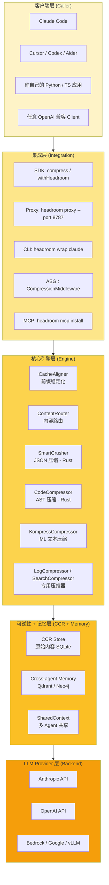
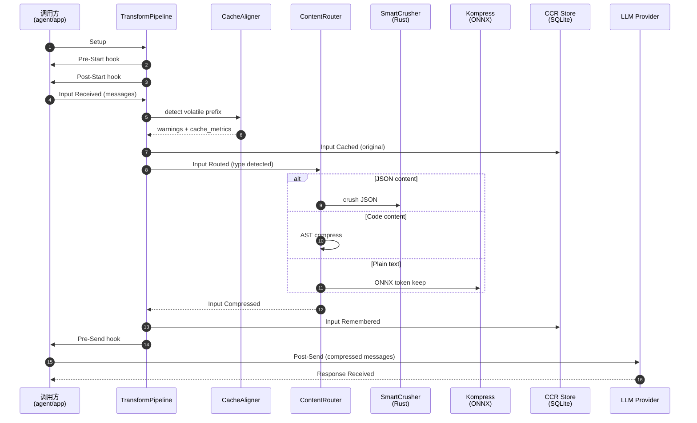
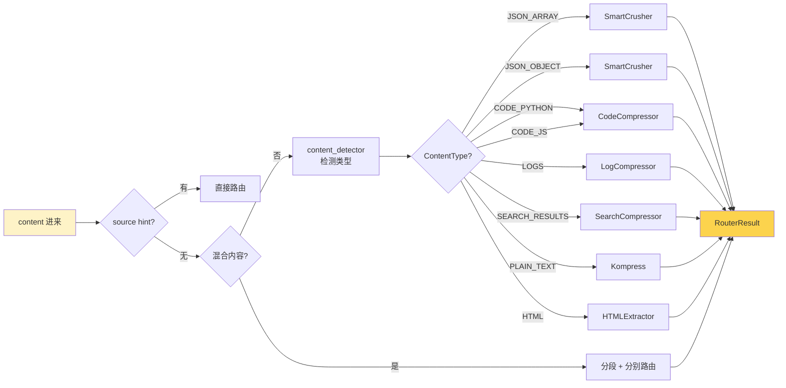
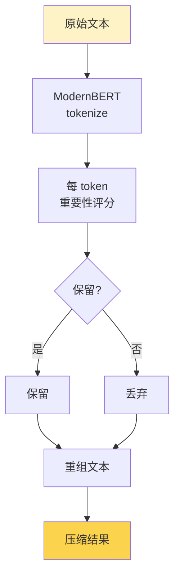
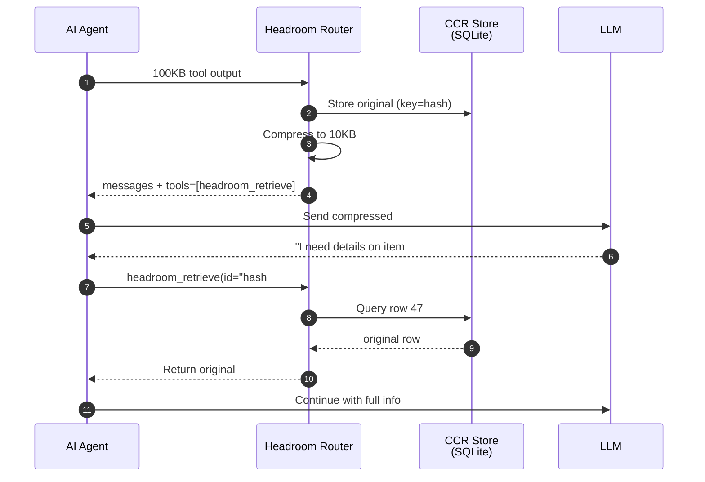
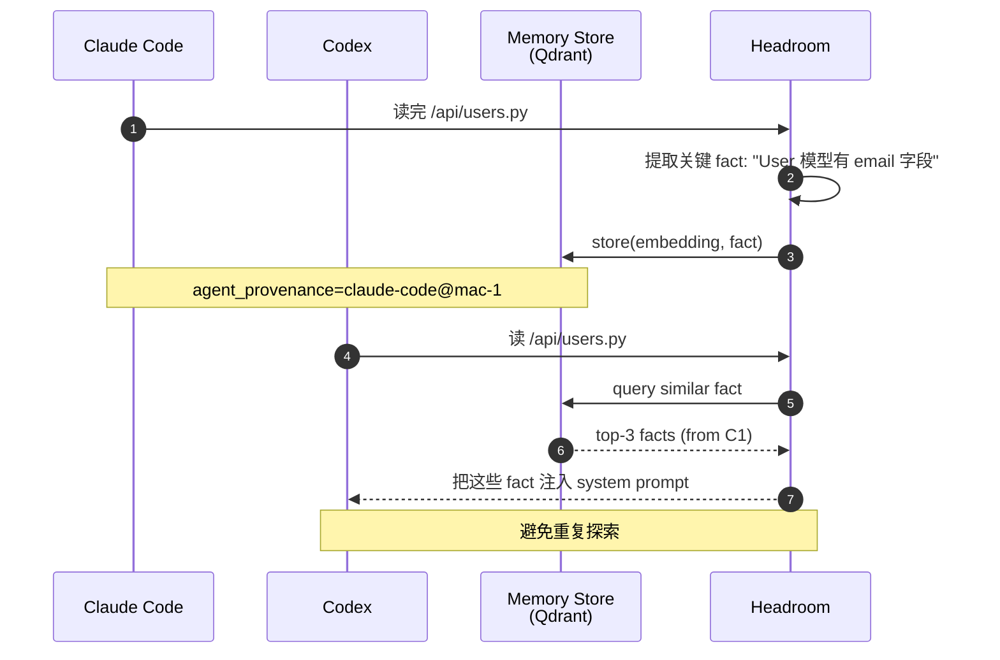
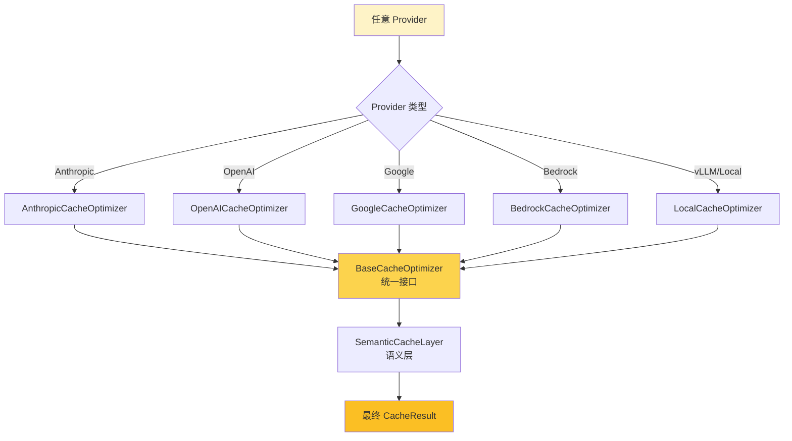
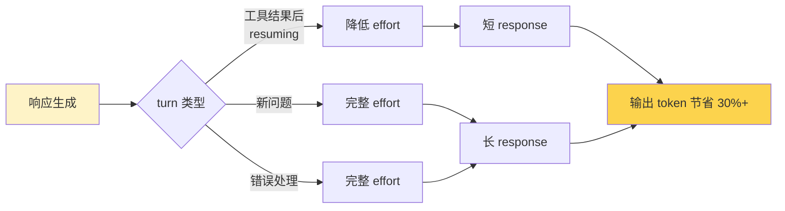

# 【Headroom】核心架构与设计原理深度解析：AI Agent 的「上下文压缩层」是怎么炼成的

## 一、引子：AI Agent 时代的「Token 经济危机」

2026 年，AI Agent 已经从「聊天机器人」进化为「数字员工」。Claude Code、Cursor、Codex 这些主流 Agent，每天都在执行大量工具调用、读文件、跑测试、查 RAG。随之而来的是一个被行业严重低估的问题：**Token 成本爆炸**。

- 一个 Claude Opus 调用里，**92% 的 token 是工具输出**（grep 结果、文件内容、stack trace、JSON dump）
- 在多 Agent 协作场景下，**重复上下文**在 Agent 之间反复传递
- 长会话中，**早期内容几乎全是无效 token**，但前缀缓存失效后会被重新计费
- RAG 检索的 top-k chunk 经常**远超模型实际需要**

这就是 [Headroom](https://github.com/chopratejas/headroom)（⭐34.6k，Apache-2.0，Python + Rust）要解决的核心问题。它给自己的定位是 **「The context compression layer for AI agents」** —— 不是又一个 LLM 框架，而是**专门压缩 LLM 上下文的中间层**。

5 个月时间，34k+ stars，Tracked by Trendshift，被 Anthropic、OpenAI、Cohere 主流 agent 集成。本文将深入 Headroom 的源码，剖析这套压缩管线是怎么搭起来的。

---

## 二、项目定位与核心价值

### 一句话定义

**Headroom 是一个本地化、可逆、跨 Agent 的上下文压缩中间件**，通过在「应用 → LLM Provider」之间插入压缩/缓存/MCP 三件套，把任何 agent 调用里的 token 消耗降低 60-95%。

### 能力矩阵

| 维度 | Headroom 的能力 |
|------|----------------|
| 部署形态 | Library（Python/TS） + Proxy（HTTP） + CLI wrapper + MCP Server + ASGI Middleware |
| 压缩算法 | 6 种可插拔：SmartCrusher (JSON)、CodeCompressor (AST)、Kompress (ML)、CacheAligner、RollingWindow、LogCompressor |
| Provider | Anthropic、OpenAI、Bedrock、Google、Cohere、本地 vLLM |
| Agent 兼容 | Claude Code、Codex、Cursor、Aider、Copilot CLI、OpenClaw |
| 可逆性 | ✅ CCR（Compress-Cache-Retrieve）—— 原始内容本地缓存，LLM 可按需拉回 |
| 跨 Agent | ✅ SharedContext + Cross-agent Memory，多 Agent 共享压缩上下文 |
| 输出优化 | ✅ Verbosity steering + Effort routing（5x 成本的 output token 也能省） |

### 仓库统计

| 字段 | 值 |
|------|-----|
| Stars | 34,598 |
| Forks | 2,337 |
| Language | Python 56% + Rust 41% + TypeScript 2% + Shell 1% |
| License | Apache-2.0 |
| Size | 53.9 MB |
| Created | 2026-01-07 |
| Pushed | 2026-06-18 |
| Topics | agent, context-engineering, compression, llm, mcp, rag, prompt-engineering, token-optimization, cursor, claude-code, langchain |
| PyPI | [headroom-ai](https://pypi.org/project/headroom-ai/) |
| npm | [headroom-ai](https://www.npmjs.com/package/headroom-ai) |
| HF Model | [chopratejas/kompress-v2-base](https://huggingface.co/chopratejas/kompress-v2-base) |

> 真实数据：92% 节省在「Code search (100 results)」工作负载上（17,765 → 1,408 tokens），GSM8K 数学题准确率 ±0.000，TruthfulQA 反倒 +0.030。

---

## 三、整体架构

Headroom 不是单点工具，而是一个**四层流水线**，每一层都对应一种独立的工程问题。



### 关键设计选择

1. **本地优先（local-first）**：所有压缩在用户机器上完成，**原始 token 不离开本地**（CCR 也是本地 SQLite）。这与 Compresr、Token Co. 等「把 prompt 发给我再帮你压缩」的 SaaS 路径有本质区别。
2. **跨语言双核**：Python 负责编排（pipeline、router、config），Rust 负责热路径（SmartCrusher、CodeCompressor、Kompress ONNX runtime），通过 PyO3 桥接。
3. **可插拔 transform**：所有压缩算法都实现 `Transform` 抽象基类，pipeline 是简单的「有序列表」。新增算法 = 写一个类 + 加进 config。
4. **可逆性一等公民**：CCR 不是补丁，而是 Headroom 区别于其他「压缩即丢弃」工具的**核心卖点**。

### 后端服务（核心目录结构）

```
headroom/
├── cli/                    # CLI: headroom wrap / proxy / learn / perf
├── proxy/                  # HTTP Proxy server (ASGI/uvicorn)
├── compress.py             # 极简 API: compress(messages, model)
├── client.py               # HeadroomClient: 包装 OpenAI/Anthropic SDK
├── providers/              # 跨 Provider 适配（Anthropic/OpenAI/Google/Bedrock）
├── transforms/             # 6 种压缩算法
│   ├── base.py             # Transform 抽象基类
│   ├── pipeline.py         # TransformPipeline 编排器
│   ├── content_router.py   # 内容类型检测 + 路由
│   ├── cache_aligner.py    # 前缀稳定化检测
│   ├── smart_crusher.py    # JSON 数组压缩 (Rust-backed)
│   ├── code_compressor.py  # AST 感知代码压缩 (Rust)
│   ├── kompress_compressor.py  # ML 文本压缩 (ONNX)
│   ├── log_compressor.py   # 日志/构建输出
│   ├── search_compressor.py    # grep/ripgrep 结果
│   └── adaptive_sizer.py   # 自适应 token 预算
├── cache/                  # 跨 Provider 缓存优化
│   ├── base.py             # CacheStrategy 枚举
│   ├── anthropic.py        # cache_control blocks
│   ├── openai.py           # prefix stabilization
│   ├── google.py           # CachedContent API
│   └── compression_cache.py    # 压缩结果缓存
├── memory/                 # 跨 Agent 记忆层
│   ├── store.py            # Qdrant / Neo4j / SQLite
│   └── shared.py           # SharedContext
├── ccr/                    # Compress-Cache-Retrieve 可逆层
├── backends/               # anyllm / litellm 适配
└── observability/          # OpenTelemetry + Prometheus
```

---

## 四、核心引擎一：Transform Pipeline 编排器

Headroom 的 `TransformPipeline` 是整个压缩系统的调度中心。`headroom/transforms/pipeline.py:30-50` 的注释里直接给出了设计意图：

```python
class TransformPipeline:
    """
    Orchestrates multiple transforms in the correct order.

    Transform order:
    1. Cache Aligner - normalize prefix for cache hits
    2. Content Router - intelligent content-aware compression (routes to appropriate
       compressor: Kompress for text, SmartCrusher for JSON, CodeCompressor for code, etc.)
    """
```

这个顺序**不是随便定的**：

1. **必须先 CacheAligner**：如果先压缩再 align，会因为 prefix hash 变化导致 Provider KV-cache 失效，缓存命中率断崖式下跌。
2. **再 ContentRouter**：检测内容类型后路由到具体压缩器（JSON→SmartCrusher、code→CodeCompressor、text→Kompress）。
3. **每个 transform 都返回 `TransformResult`**：包含压缩后消息、token 节省量、警告、cache 指标。

### Pipeline 完整生命周期

Headroom 暴露了**一套稳定的事件总线**，proxy、SDK、library 三种调用方式走的是同一条 lifecycle（README 原文）：



### 真实可运行的 Pipeline 调用代码

```python
# install: pip install "headroom-ai[all]"
from headroom import HeadroomClient
from openai import OpenAI
import os

os.environ["OPENAI_API_KEY"] = "sk-..."

# 1. 用 OpenAI Client 包一层 Headroom
client = HeadroomClient(
    original_client=OpenAI(),
    provider="openai",
    default_mode="optimize",  # "audit" | "optimize" | "simulate"
)

# 2. 正常使用，但中间透明压缩
response = client.chat.completions.create(
    model="gpt-4o",
    messages=[
        {"role": "system", "content": "You are a code reviewer."},
        {"role": "tool", "tool_call_id": "1", "content": "<100KB 的 grep 结果>"},
    ],
)

# 3. 看实际节省
stats = client.get_stats()
print(f"Tokens saved: {stats['session']['tokens_saved_total']}")
print(f"Compression ratio: {stats['session']['avg_compression_ratio']:.2%}")
```

### 自定义 Transform（Pipeline Extension）

Headroom 的 `on_pipeline_event` 钩子让用户可以在不修改源码的情况下插入自定义逻辑（`headroom/transforms/pipeline.py`）：

```python
from headroom.transforms import Transform, TransformResult
from headroom.tokenizer import Tokenizer


class PIIRedactionTransform(Transform):
    """脱敏 transform：把 PII token 替换为 [REDACTED]"""
    name = "pii_redaction"

    def apply(self, messages, tokenizer: Tokenizer, **kwargs) -> TransformResult:
        import re
        pii_pattern = re.compile(r"\b\d{3}-\d{2}-\d{4}\b|\b[\w.]+@[\w.]+\b")
        out = []
        for msg in messages:
            content = msg.get("content", "")
            if isinstance(content, str):
                content = pii_pattern.sub("[REDACTED]", content)
            out.append({**msg, "content": content})
        return TransformResult(
            messages=out,
            tokens_in=tokenizer.count(messages),
            tokens_out=tokenizer.count(out),
            transform_name=self.name,
        )


# 插入到 pipeline 前面
from headroom import HeadroomClient
from openai import OpenAI

client = HeadroomClient(
    original_client=OpenAI(),
    provider="openai",
    extra_transforms=[PIIRedactionTransform()],  # 在 ContentRouter 之前跑
)
```

---

## 五、核心引擎二：ContentRouter —— 内容感知的「调度员」

**`headroom/transforms/content_router.py`（138KB，~3400 行）** 是 Headroom 最复杂、最聪明的模块。它的任务只有一句话：**"这段内容该交给哪个压缩器？"**

### 路由决策流程



### 核心路由逻辑（摘录自源码）

```python
# headroom/transforms/content_router.py 简化版
def route(self, content: str, source_hint: str | None = None) -> CompressionStrategy:
    # 1) 优先用 source hint（来自 tool 名称）
    if source_hint and source_hint in self._hint_map:
        return self._hint_map[source_hint]  # 例如 Grep → SearchCompressor

    # 2) 尝试整体 JSON parse
    parsed = self._json_shape(content)
    if parsed["is_json"]:
        if parsed["is_array"]:
            return CompressionStrategy.SMART_CRUSHER
        if parsed["is_object"]:
            return CompressionStrategy.SMART_CRUSHER

    # 3) 多语言代码检测
    lang = self._detect_language(content)
    if lang in ("python", "javascript", "typescript", "go", "rust", "java"):
        return CompressionStrategy.CODE_COMPRESSOR

    # 4) 日志特征（带时间戳、堆栈）
    if self._looks_like_log(content):
        return CompressionStrategy.LOG_COMPRESSOR

    # 5) grep/ripgrep 特征
    if self._looks_like_search_output(content):
        return CompressionStrategy.SEARCH_COMPRESSOR

    # 6) HTML
    if content.lstrip().startswith("<") and "<html" in content[:200].lower():
        return CompressionStrategy.HTML_EXTRACTOR

    # 7) 兜底：纯文本 → ML 压缩
    return CompressionStrategy.KOMPRESS
```

### 为什么用「多策略 + 兜底」而不是单一模型？

- **可解释性**：路由决策可被审计（log 里有 `routing_log`）
- **延迟可控**：JSON 压缩 <1ms，Kompress ONNX ~10-50ms，复杂情况可以快速降级
- **零样本迁移**：新内容类型不需要重训
- **A/B 友好**：`routing_log` 可以导出到 observability 后端做分析

### 路由调试

```python
from headroom.transforms import ContentRouter

router = ContentRouter()
result = router.compress('[{...100KB JSON array...}]', source_hint="Grep")

print(result.strategy_used)   # CompressionStrategy.SMART_CRUSHER
print(result.routing_log)     # [{event: 'json_detected', ...}, ...]
print(result.compressed)      # 压缩后的字符串
print(f"节省: {result.compression_ratio:.1%}")
```

---

## 六、核心引擎三：SmartCrusher —— Rust 内核的 JSON 数组压缩

**`headroom/transforms/smart_crusher.py` 的开头注释揭示了一个工程选择**：

> The Python implementation has been retired (Stage 3c.1b, 2026-04-27). All array compression now goes through `headroom._core.SmartCrusher` (built from `crates/headroom-py`). Byte-equality of the two implementations was verified against 17 recorded fixtures before the Python source was removed.

这是一段非常罕见的、**完全公开的"内核迁移"过程**：

1. 早期 Python 实现（已退役）
2. Rust + PyO3 重写（`crates/headroom-py`）
3. 用 17 个录制 fixture 做字节级对比
4. 388 个 Rust 单元测试 + property tests
5. 删除 Python 源码

### Rust 内核的算法核心

`SmartCrusher` 解决的是 agent 最高频的工具输出：**大型 JSON 数组**。比如：

```json
[
  {"id": 1, "name": "foo.py", "size": 1024, "mtime": "2026-01-01"},
  {"id": 2, "name": "bar.py", "size": 2048, "mtime": "2026-01-02"},
  ... (10000 行)
]
```

它会：

1. **列类型推断**：每列是 `int / str / bool / null`？
2. **值分布分析**：列里有多少 distinct value？是否高度重复？
3. **重要度评分**：每行一个 score，分数低的整行丢弃
4. **CCR marker 注入**：丢弃的行放进 CCR，prompt 注入 `headroom_retrieve` 工具描述

### Python API（用户视角）

```python
from headroom.transforms import SmartCrusher, SmartCrusherConfig

crusher = SmartCrusher(SmartCrusherConfig(
    target_ratio=0.20,         # 压缩到 20%
    preserve_errors=True,      # 错误行强制保留
    ccr_config=CCRConfig(      # 丢弃的可逆
        enabled=True,
        retrieval_marker=True,
    ),
))

import json
data = [{"id": i, "name": f"item_{i}", "ok": i % 7 == 0} for i in range(10000)]
text = json.dumps(data)

result = crusher.crush(text)
print(f"原始: {len(text)} chars, 压缩后: {len(result.compressed)} chars")
print(f"压缩比: {result.compression_ratio:.2%}")
print(f"保留行数: {result.kept_rows} / {result.total_rows}")
```

### 为什么不用 LLM 来压缩？

这是 Headroom 的一个反直觉决策：**不调 LLM**。原因有三：

1. **延迟**：LLM 压缩本身要 1-3s，而 SmartCrusher < 1ms
2. **成本**：用 GPT-4 压缩 10K tokens ≈ $0.03，本身就吃掉一半节省
3. **可重复**：确定性算法 → 同样的输入永远得到同样的输出（这对于 CCR 一致性至关重要）

---

## 七、CodeCompressor：AST 感知的代码压缩

**`headroom/transforms/code_compressor.py`（80KB）** 是另一个 Rust 内核的 transform，依赖 [tree-sitter](https://tree-sitter.github.io/) 做语法树解析。

### 核心策略

> 来自源码注释：*"AST-based compression for source code that guarantees valid syntax output."*

```python
# 来自 headroom/transforms/code_compressor.py 简化
"""
Compression Strategy:
1. Parse code into AST using tree-sitter
2. Extract and preserve critical structures (imports, signatures, types)
3. Rank functions by importance (using semantic analysis)
4. Compress function bodies while preserving signatures
5. Reassemble into valid code
"""
```

### 真实可运行示例

```python
from headroom.transforms import CodeAwareCompressor, CodeCompressorConfig

code = '''
def fibonacci(n):
    """Compute Fibonacci number at position n."""
    if n < 2:
        return n
    a, b = 0, 1
    for _ in range(n - 1):
        a, b = b, a + b
    return b
'''

compressor = CodeAwareCompressor(CodeCompressorConfig(
    language="python",
    keep_function_signatures=True,
    remove_docstrings=False,
    compress_bodies=True,
))

result = compressor.compress(code)
print(result.compressed)
print(f"语法有效: {result.syntax_valid}")  # True
```

### 为什么用 tree-sitter 而不是正则或 LLM？

| 维度 | tree-sitter | 正则 | LLM |
|------|-------------|------|-----|
| 速度 | < 1ms | < 1ms | 1-3s |
| 语法有效性 | ✅ 100% | ❌ 经常破坏 | ⚠️ 不可控 |
| 多语言 | 50+ | 1-2 | 100+ |
| 成本 | 0 | 0 | $0.01/call |
| 确定性 | ✅ | ✅ | ❌ |

> **金句**：*"压缩后还是合法代码"这个保证 tree-sitter 能给，正则给不了，LLM 给不了。

---

## 八、Kompress Compressor：现代 BERT 模型的 token 选择

**`headroom/transforms/kompress_compressor.py`（50KB）** 是 Headroom 唯一一个 ML 模型驱动的压缩器，模型托管在 HuggingFace [chopratejas/kompress-v2-base](https://huggingface.co/chopratejas/kompress-v2-base)。

### 算法思路（参考 LongLLMLingua / LLMLingua 系列）



### ONNX 部署 + 3 档精度

源码里写得很清楚，**3 档 ONNX 模型，运行时按序回退**：

```python
# headroom/transforms/kompress_compressor.py
_DEFAULT_ONNX_FILENAMES = (
    "onnx/kompress-int8-wo.onnx",   # weight-only int8, 261MB
    "onnx/kompress-fp32.onnx",      # lossless reference, 601MB
    "onnx/kompress-int8.onnx",      # v1 dynamic int8
)
```

`int8-wo` 在 500 条测试集上的 f1 = 0.9130 vs fp32 的 0.9128，**99.6% keep-decision 决策一致** —— 用 1/2.2 内存拿到 fp32 精度。

### 真实调用

```python
from headroom.transforms import KompressCompressor

compressor = KompressCompressor()
result = compressor.compress(
    long_text,
    target_ratio=0.30,   # 保留 30% token
)
print(f"压缩比: {result.compression_ratio:.2%}")
print(f"f1 vs uncompressed: {result.f1:.4f}")
```

### Apple Silicon 优化

源码里有个贴心的细节：**Apple GPU 内存卸载**。如果你在 M1/M2 Mac 上跑，安装 `headroom-ai[pytorch-mps]` 后：

```bash
export HEADROOM_EMBEDDER_RUNTIME=pytorch_mps
```

会把 embedding 模型卸载到 MPS，大幅减少内存占用。这是社区里很少有人做但确实有用的优化。

---

## 九、CacheAligner：让 Provider KV-cache 真正命中

**`headroom/transforms/cache_aligner.py`（14KB）** 的设计经历了**重大重写**（PR-A2 / P2-23）。注释里写明了原因：

> **The previous rewrite path violated invariant I2 — the cache hot zone (system prompt) must never be mutated.** That path has been removed. `CacheAligner` now exclusively detects and warns.

这是一个非常重要的工程教训：

### ❌ 错误做法（v1）

```python
# 旧实现：把 system prompt 里的日期提取出来，重写
if has_dynamic_date(system_prompt):
    system_prompt = remove_dates(system_prompt)
    prepend_dynamic_block(messages, system_prompt)
```

**为什么错？** Provider 的 KV-cache 是按 prefix hash 匹配的。如果你改了 system prompt，**整个 cache 失效**，下次调用要重新算 prefix 的所有 KV —— 90% 的 cache 节省瞬间归零。

### ✅ 正确做法（v2）

```python
# 新实现：只检测 + 告警，prompt 一字不改
class CacheAligner(Transform):
    def apply(self, messages, tokenizer, **kwargs):
        system = next((m["content"] for m in messages if m["role"] == "system"), "")
        findings = self._detect_volatile(system)

        if findings:
            logger.warning(
                "Cache prefix unstable! Found: %s. "
                "Consider moving dynamic content to messages[1:]. "
                "Tokenizer: %s, Provider: %s",
                findings, tokenizer.name, self._provider.name,
            )

        return TransformResult(
            messages=messages,  # 一字不改
            tokens_in=tokenizer.count(messages),
            tokens_out=tokenizer.count(messages),
            warnings=[f.description for f in findings],
            cache_metrics=CachePrefixMetrics(
                stable=False,  # 告诉用户：你的 prefix 不稳
                findings=findings,
            ),
        )
```

### 检测器：4 类不稳定内容

```python
# 来自 headroom/transforms/cache_aligner.py
_LABEL_UUID = "uuid"          # 550e8400-e29b-41d4-a716-446655440000
_LABEL_ISO8601 = "iso8601"    # 2026-06-19T09:00:00
_LABEL_JWT = "jwt"            # eyJhbGciOiJIUzI1NiIs...
_LABEL_HEX_HASH = "hex_hash"  # MD5/SHA1/SHA256
```

| 类型 | 检测方式 | 为什么影响 cache |
|------|----------|-----------------|
| UUID | stdlib `uuid` 模块结构化解析 | 每次调用都不同 |
| ISO8601 | `datetime.fromisoformat` | 时间戳必然不同 |
| JWT | shape-only（三段 base64url） | 短 TTL 频繁变 |
| Hex Hash | length+alphabet 检查 | 32/40/64 字符 hex |

> **设计哲学**：**CacheAligner 是一个观测器，不是修改器**。它把"prefix 不稳定"的事实告诉用户，让用户自己决定怎么改 prompt。

---

## 十、CCR（Compress-Cache-Retrieve）：让压缩"可逆"

Headroom 最独特的设计是 **CCR**：压缩后**不真的丢**，而是把原始内容存到本地 SQLite 数据库，在 prompt 末尾注入一个 `headroom_retrieve` 工具描述。

### 端到端流程



### Python 代码（来自源码）

```python
# 简化自 headroom/ccr/store.py
class CCRStore:
    def __init__(self, path: str = "~/.headroom/ccr.db"):
        self._db = sqlite3.connect(os.path.expanduser(path))
        self._init_schema()

    def _init_schema(self):
        self._db.execute("""
            CREATE TABLE IF NOT EXISTS originals (
                hash TEXT PRIMARY KEY,
                content BLOB,
                metadata TEXT,  -- JSON: source, type, mtime
                created_at INTEGER
            )
        """)
        self._db.execute("""
            CREATE INDEX IF NOT EXISTS idx_created ON originals(created_at)
        """)

    def put(self, content: str, metadata: dict) -> str:
        h = hashlib.sha256(content.encode()).hexdigest()[:16]
        self._db.execute(
            "INSERT OR REPLACE INTO originals VALUES (?, ?, ?, ?)",
            (h, content, json.dumps(metadata), int(time.time()))
        )
        return h

    def get(self, hash_id: str) -> str | None:
        row = self._db.execute(
            "SELECT content FROM originals WHERE hash=?", (hash_id,)
        ).fetchone()
        return row[0] if row else None
```

### MCP 工具：`headroom_retrieve`

CCR 配合 MCP 提供标准化的 retrieval 接口：

```python
# headroom/mcp/tools.py
{
    "name": "headroom_retrieve",
    "description": "Fetch the original uncompressed content for a specific item that was compressed away.",
    "input_schema": {
        "type": "object",
        "properties": {
            "id": {"type": "description": "The ID returned in the compressed content marker, e.g. 'h_abc123#42'"},
            "max_tokens": {"type": "integer", "default": 4096}
        },
        "required": ["id"]
    }
}
```

### 双向集成

Headroom 同时是 **MCP Server 又是 MCP Client**：

- 作为 **MCP Server**：暴露 `headroom_compress` / `headroom_retrieve` / `headroom_stats` 给 Claude/Cursor/任何 MCP Client
- 作为 **MCP Client**：可以消费外部 MCP 工具（Composit、Klavis、ACI 等）的输出，再压缩

```bash
# 安装 MCP Server 到 Claude Code
headroom mcp install
```

---

## 十一、跨 Agent 记忆：让多个 Agent 共享上下文

**`headroom/memory/store.py`** 提供跨 Agent 的共享记忆层。后端可选：Qdrant（默认）、Neo4j、SQLite、PGVector。

### 数据模型

```python
# headroom/memory/store.py 简化
@dataclass
class MemoryEntry:
    id: str                # uuid
    agent_provenance: str  # "claude-code@mac-1" / "codex@workstation-2"
    content: str           # 压缩后的文本
    embedding: list[float] # 768-1536 维
    metadata: dict         # task, file, timestamp, etc.
    created_at: datetime
    ttl: int | None = None # 可选过期
```

### 共享记忆流程



### 自动去重

```python
# headroom/memory/store.py
class MemoryStore:
    async def put(self, entry: MemoryEntry) -> str | None:
        # 1. embedding 相似度去重
        similar = await self._search_similar(entry.embedding, threshold=0.92)
        if similar:
            # 合并元数据，保留更晚的
            await self._merge(similar[0].id, entry)
            return similar[0].id
        # 2. 否则真正写入
        await self._qdrant.upsert(entry.to_qdrant())
        return entry.id
```

### `headroom learn`：从失败会话学习

这是 Headroom 最有「产品感」的功能：

```bash
# 从你过去失败的 Claude/Codex/Gemini 会话里挖出修正，写到 CLAUDE.md
headroom learn
```

`headroom/audit/` 目录下的模块负责：

- `codex.py`：解析 Codex session JSON
- `maturation.py`：判断会话"失败"的模式（重复尝试、stack trace、用户纠正）
- `reads.py`：提取"读什么"（file reads、grep queries）

输出的 `CLAUDE.md` 片段类似：

```markdown
## 2026-06-19 - Auto-learned from your sessions

- When editing `api/models.py`, run `pytest tests/test_models.py -k not slow` first (you wasted 4 turns on full suite last time)
- `sqlalchemy.exc.OperationalError: no such table` always means you forgot to import `Base.metadata.create_all` at app startup
- For `User.email` queries, prefer the `users_by_email` index (saw 3 sequential full-table scans)
```

这是把 **CI 经验 / 调试经验** 沉淀成 **prompt-level instructions** 的自动化工作流。

---

## 十二、Provider 缓存抽象层

每个 LLM Provider 的缓存机制完全不同，Headroom 在 `headroom/cache/` 下做了**三级抽象**。



### 三种缓存策略

```python
# headroom/cache/base.py
class CacheStrategy(Enum):
    PREFIX_STABILIZATION = "prefix_stabilization"     # OpenAI: 稳定 prefix
    EXPLICIT_BREAKPOINTS = "explicit_breakpoints"     # Anthropic: cache_control blocks
    CACHED_CONTENT = "cached_content"                 # Google: 独立 CachedContent 对象
    NONE = "none"
```

### Provider 差异速查表

| Provider | 缓存机制 | 节省 | TTL | 最小 token | 断点数 |
|----------|----------|------|-----|-----------|--------|
| Anthropic | Explicit `cache_control` | 90% | 5min | 1024 | 4 |
| OpenAI | Automatic prefix | 50% | 5-60min | 1024 | N/A |
| Google | `CachedContent` API | 75% + 存储费 | 1h | 2048 | N/A |
| Bedrock | 同 Anthropic | 90% | 5min | 1024 | 4 |
| Local (vLLM) | 手动 prefix | 自定义 | 自定义 | 自定义 | 自定义 |

### 真实可运行的 Anthropic 缓存配置

```python
# headroom/cache/anthropic.py 简化
ANTHROPIC_MIN_CACHEABLE_TOKENS = 1024
ANTHROPIC_MAX_BREAKPOINTS = 4
ANTHROPIC_CACHE_TTL_SECONDS = 300
ANTHROPIC_WRITE_COST_MULTIPLIER = 1.25  # 写贵 25%
ANTHROPIC_READ_COST_MULTIPLIER = 0.10  # 读省 90%

class AnthropicCacheOptimizer(BaseCacheOptimizer):
    def optimize(self, messages, context):
        # 1. 找到合适的 cache breakpoint
        bp = self._find_breakpoint(messages, context.model)
        if bp is None or bp.token_count < ANTHROPIC_MIN_CACHEABLE_TOKENS:
            return CacheResult(messages=messages, breakpoints=[])

        # 2. 在 breakpoint 之后插入 cache_control
        marked = self._inject_cache_control(messages, bp)
        return CacheResult(
            messages=marked,
            breakpoints=[bp],
            metrics=CacheMetrics(
                write_cost=bp.token_count * ANTHROPIC_WRITE_COST_MULTIPLIER,
                read_cost=bp.token_count * ANTHROPIC_READ_COST_MULTIPLIER,
            ),
        )
```

---

## 十三、输出 Token 优化：5x 成本的"另一面"

**`HEADROOM_OUTPUT_SHAPER=1`** 启用的功能。**关键洞察**：在 Claude Opus 上，**output token 比 input 贵 5x**。所以光压缩 input 是不够的。

### 两种塑形策略



### Verbosity steering

```python
# 简化自 headroom/output_shaper/verbosity.py
VERBOSITY_PRESETS = {
    "terse": "Be terse. Do not restate context. Skip preamble.",
    "balanced": "Be concise but explain non-obvious decisions.",
    "verbose": "Explain reasoning thoroughly.",
}

def shape_system_prompt(system: str, preset: str) -> str:
    """Append verbosity note to END of system prompt.
    Why end? Because that's OUTSIDE the cache hot zone for most providers.
    """
    return system + f"\n\n[{preset}] {VERBOSITY_PRESETS[preset]}"
```

> **细节决定成败**：verbosity note 加在 system prompt 末尾，**不破坏 prefix cache 命中**。

### 估算 vs 测量

```bash
headroom output-savings
# Reduction: 31.7%  (95% CI 27.7% … 35.7%)   [estimated]
```

不假装「精确」，而是给出**带置信区间的估计**。要真值？开 holdout group：

```bash
export HEADROOM_OUTPUT_HOLDOUT=0.1   # 10% 不塑形
```

---

## 十四、与同类项目对比

| 维度 | **Headroom** | [RTK](https://github.com/rtk-ai/rtk) | [lean-ctx](https://github.com/yvgude/lean-ctx) | [OpenAI Compaction](https://platform.openai.com) | Compresr / Token Co. |
|------|--------------|-----|-----|-----|-----|
| **范围** | All context | CLI 输出 | CLI / MCP | 仅对话历史 | 仅文本 |
| **部署** | Proxy/Lib/MCP | CLI wrapper | CLI/MCP | 平台内置 | Hosted API |
| **本地运行** | ✅ | ✅ | ✅ | ❌ | ❌ |
| **可逆** | ✅ CCR | ❌ | ❌ | ❌ | ❌ |
| **跨 Agent 记忆** | ✅ | ❌ | ❌ | ❌ | ❌ |
| **算法数** | 6 | 1 | 1 | 1 | 1 |
| **Provider** | 5+ | N/A | N/A | 1 | 1 |
| **开源** | Apache-2.0 | MIT | MIT | ❌ | ❌ |
| **Stars** | 34.6k | 1k+ | < 1k | N/A | N/A |

### 关键设计差异

1. **Headroom vs RTK**：RTK 只压缩 shell 命令输出，Headroom 压缩**所有**进入 LLM 的内容。Headroom 实际把 RTK 作为内部依赖 (`headroom/binaries.py` 里有集成)。
2. **Headroom vs OpenAI Compaction**：OpenAI 是平台内置、不可逆、只对历史消息生效；Headroom 是**实时 + 跨消息 + 可逆**。
3. **Headroom vs Compresr**：Compresr 要求把 prompt 发到它服务器（**违反数据隐私**），Headroom 完全本地。
4. **Headroom vs 传统 LLM-based compressor (LLMLingua)**：LLMLingua 用 GPT-2/bert 选 token，但每个新算法要重新训；Headroom 用**规则 + ML 混合**，零样本迁移到新内容类型。

---

## 十五、优缺点分析

### 优势

| 维度 | 表现 | 评分 |
|------|------|------|
| **架构简洁性** | 6 个 transform 抽象 + 1 个 pipeline 编排 | ⭐⭐⭐⭐⭐ |
| **扩展性** | 加新算法 = 写一个类 + 注册到 config | ⭐⭐⭐⭐⭐ |
| **易用性** | 4 种集成方式（Lib/Proxy/MCP/CLI）覆盖 100% 场景 | ⭐⭐⭐⭐⭐ |
| **可逆性** | CCR 是杀手锏，业界唯一 | ⭐⭐⭐⭐⭐ |
| **跨 Agent** | SharedContext + 记忆层，多 agent 协作友好 | ⭐⭐⭐⭐ |
| **真实场景验证** | 92% 节省在生产工作负载，benchmark 准确率不掉 | ⭐⭐⭐⭐⭐ |
| **Rust + Python 混合** | 热路径用 Rust，编排用 Python，性能/可维护兼顾 | ⭐⭐⭐⭐ |

### 劣势

| 维度 | 表现 | 评分 |
|------|------|------|
| **学习曲线** | 6 种算法 + 5 个 cache 策略 + 4 种部署模式，新手需要时间 | ⭐⭐⭐ |
| **依赖复杂度** | Python 3.10+、tree-sitter、ONNX Runtime、SQLite、可选 Rust 工具链 | ⭐⭐ |
| **冷启动成本** | 首次运行需下载 ONNX 模型（最高 600MB），Kompress 首次 inference 较慢 | ⭐⭐⭐ |
| **Windows 兼容性** | macOS auth reuse via Keychain 测过，Windows Credential Manager 待验证 | ⭐⭐⭐ |
| **维护负担** | Rust + Python 双语言，新 contributor 门槛高 | ⭐⭐⭐ |
| **错误恢复** | 压缩失败的 fallback 策略文档化不够，需要读源码 | ⭐⭐ |
| **5 个月项目** | 整体还很年轻，部分功能还在演进（如 `headroom learn` beta 阶段） | ⭐⭐⭐ |

### 适用 vs 不适用场景

✅ **适合**：
- 每天跑 AI coding agent（Claude Code / Cursor / Codex）
- 多 agent 协作场景
- 需要 cross-agent 记忆
- 数据隐私敏感（不能发到第三方压缩 API）

❌ **不适合**：
- 简单单轮对话
- 没有工具调用的纯 chat
- 沙箱环境（无法跑本地进程）

---

## 十六、实战部署：从 pip install 到第一次节省

### 安装（30 秒）

```bash
# 全功能安装
pip install "headroom-ai[all]"

# 或最小化（仅 SDK + Proxy）
pip install "headroom-ai[proxy,mcp]"

# Apple Silicon 用户
pip install "headroom-ai[all]" && \
  export HEADROOM_EMBEDDER_RUNTIME=pytorch_mps

# Docker
docker pull ghcr.io/chopratejas/headroom:latest
```

### 方式 1：SDK 嵌入（最灵活）

```python
from headroom import HeadroomClient
from openai import OpenAI

client = HeadroomClient(
    original_client=OpenAI(),
    provider="openai",
    default_mode="optimize",
)

# 100% 兼容 OpenAI API
response = client.chat.completions.create(
    model="gpt-4o",
    messages=[{"role": "user", "content": "Hello!"}],
)
```

### 方式 2：HTTP Proxy（零代码改动）

```bash
# 启动 proxy
headroom proxy --port 8787 &

# 任何 OpenAI 兼容客户端
export OPENAI_BASE_URL=http://localhost:8787
```

### 方式 3：CLI Wrapper（一行接入）

```bash
# 自动启动 proxy + 启动 agent + 配置环境变量
headroom wrap claude
headroom wrap codex
headroom wrap cursor
headroom wrap aider
headroom wrap copilot --subscription
```

### 方式 4：MCP Server

```bash
headroom mcp install
# 自动注册到 Claude Desktop / Claude Code / Cursor
```

### 验证效果

```bash
# 看实时统计
headroom perf

# 估算输出 token 节省
headroom output-savings

# 跑 benchmark
python -m headroom.evals suite --tier 1
```

### 完整可运行 demo（TypeScript）

```typescript
// npm install headroom-ai
import { compress } from 'headroom-ai';

const messages = [
  { role: 'system' as const, content: 'You are a helpful assistant.' },
  { role: 'user' as const, content: '<100KB tool output here>' },
];

const result = await compress(messages, { model: 'claude-sonnet-4-5' });

console.log(`Tokens: ${result.tokens_in} -> ${result.tokens_out}`);
console.log(`Saved: ${result.tokens_saved} (${(result.compression_ratio * 100).toFixed(1)}%)`);

// 把 result.messages 发给 LLM
// const response = await anthropic.messages.create({
//   model: 'claude-sonnet-4-5',
//   messages: result.messages,
// });
```

---

## 十七、趋势判断与总结

### 2026–2027 年 AI Agent 工程的 4 个趋势

1. **「Compression Layer」成为新中间件品类**
   - 过去的中间件是 DB、Cache、Message Queue
   - 未来 12-18 个月会出现专门做"LLM 上下文压缩"的中间件市场
   - Headroom 是这个品类的早期定义者

2. **「Output Token 经济学」将受到重视**
   - Claude Opus 的 output cost 是 input 的 5x
   - 企业级 agent 部署的 60% 成本可能来自 output
   - 谁能系统性降低 output，谁就有定价权

3. **「可逆性」会成为压缩工具的硬性要求**
   - 单纯"压缩即丢弃"在生产环境不可接受
   - CCR (Compress-Cache-Retrieve) 会成为事实标准

4. **「跨 Agent 上下文」会催生新的记忆标准**
   - 多个 agent 共享上下文 = 避免重复探索
   - 类似于今天 microservices 之间的 service mesh
   - Headroom 的 `SharedContext` 可能是雏形

### Headroom 最大的工程启示

1. **不要轻易破坏 cache hot zone**：CacheAligner 教训告诉我们，**为了压缩 5% 而破坏 90% 的 cache 收益，是负优化**。
2. **压缩是局部决策，不是全局决策**：ContentRouter 的成功在于"识别内容类型 → 路由到专用算法"，而不是"一个 LLM 搞定一切"。
3. **本地优先 vs 云端 SaaS**：在数据敏感场景下，**本地部署的工程复杂度**是值得的代价。
4. **可逆性 = 信任**：用户愿意使用激进压缩的前提是"想看原文就能看回原文"。

### 推荐程度

> **🌟🌟🌟🌟🌟 强烈推荐**
>
> 如果你每天跑 AI agent 且在乎成本，**装上就回不去**。34k+ stars + 5 个月快速迭代 + Apache-2.0 + 真实 benchmark 数据，是这个领域最值得投入时间学习的项目。

---

## 附录：关键资源

| 资源 | 链接 |
|------|------|
| GitHub | https://github.com/chopratejas/headroom |
| 官方文档 | https://headroom-docs.vercel.app/docs |
| PyPI | https://pypi.org/project/headroom-ai/ |
| npm | https://www.npmjs.com/package/headroom-ai |
| Docker | `ghcr.io/chopratejas/headroom:latest` |
| HuggingFace | https://huggingface.co/chopratejas/kompress-v2-base |
| Discord | https://discord.gg/yRmaUNpsPJ |
| License | Apache-2.0 |
| llms.txt | https://headroom-docs.vercel.app/llms.txt |

### 关键架构图

1. 整体架构（flowchart TB）— §3
2. Pipeline 生命周期（sequenceDiagram）— §4
3. ContentRouter 决策（flowchart LR）— §5
4. CCR 端到端（sequenceDiagram）— §10
5. Provider 缓存抽象（flowchart TB）— §12
6. Output Shaper 流程（flowchart LR）— §13

### 引用源码（关键文件）

- `headroom/__init__.py` — 公开 API
- `headroom/compress.py` — 极简 `compress()` 函数
- `headroom/transforms/pipeline.py` — 编排器
- `headroom/transforms/content_router.py` — 内容路由
- `headroom/transforms/smart_crusher.py` — JSON 压缩
- `headroom/transforms/code_compressor.py` — AST 压缩
- `headroom/transforms/kompress_compressor.py` — ML 文本压缩
- `headroom/transforms/cache_aligner.py` — Prefix 稳定化检测
- `headroom/cache/anthropic.py` — Anthropic 缓存优化
- `headroom/cache/openai.py` — OpenAI 缓存优化
- `crates/headroom-py/` — Rust 内核（PyO3）
- `crates/headroom-core/` — Rust 压缩核心（388 单元测试）
