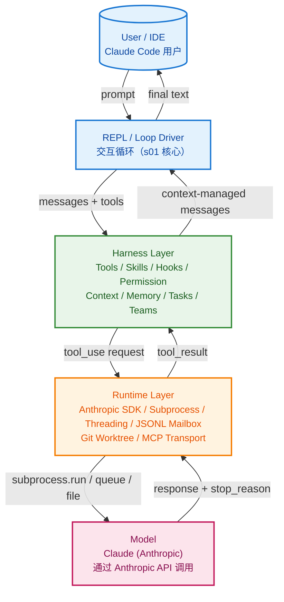
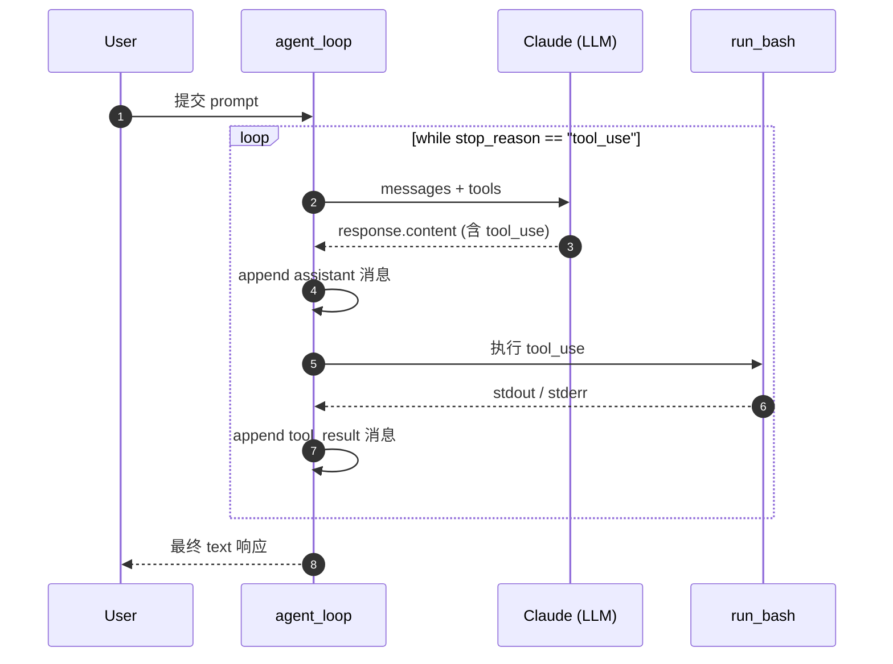
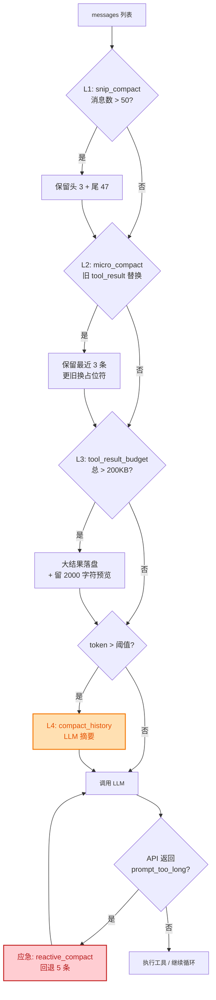
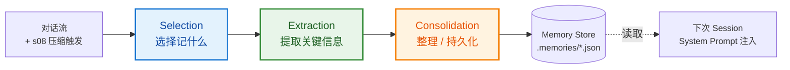
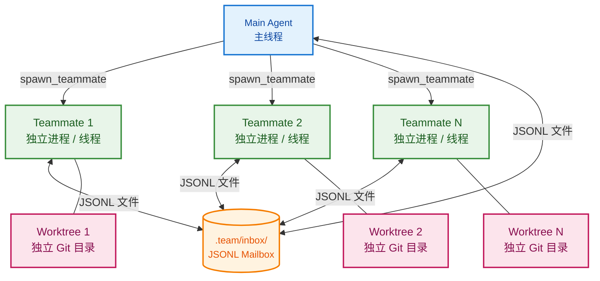
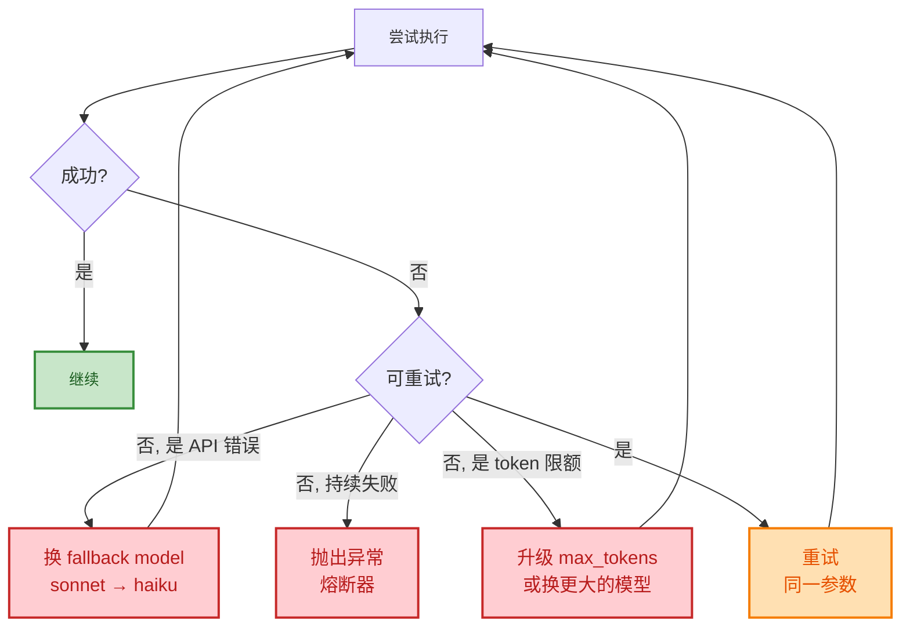
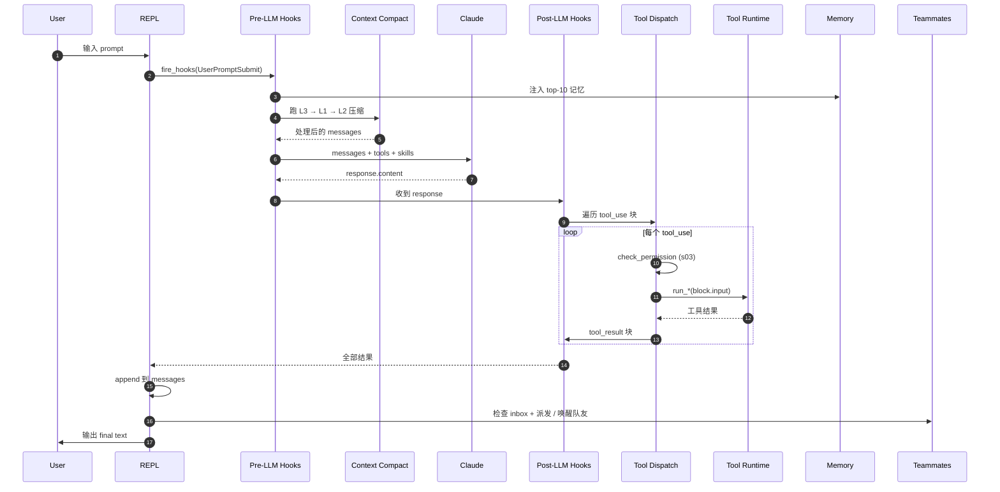

## 引子

2026 年最值得关注的开源 AI 项目里，有一个看起来不太一样的：它不是另一个 LangChain、不是另一个 AutoGen、也不是又一个 Dify 式的可视化拖拽平台。它的作者把它叫作 **"Bash is all you need"**——一个能跑、能改、能学的极简 Claude Code 复刻。

它叫 **[shareAI-lab/learn-claude-code](https://github.com/shareAI-lab/learn-claude-code)**，67.5k Star，10.9k Fork，半年内从 0 增长到 GitHub Trending 顶级。它做的事非常明确：**用 20 节渐进式课程，把 Claude Code 这种「现代 Coding Agent Harness」的内部机制**从「一个 while 循环调用 LLM」开始，**一层一层剥给你看**。

读它比读任何博客都直接。它的 `s01_agent_loop/code.py` 只有 137 行、4.7KB——你不需要知道什么是 ReAct、什么是 LangGraph 也能在 5 分钟里读懂「一个 Agent 到底是怎么工作的」。然后 `s02` 加 4 个工具、`s03` 加权限校验、`s04` 加 Hook 钩子、`s05` 加 TodoWrite、`s06` 加子 Agent……每节课都只在前一节基础上加 **一个** 机制，循环结构保持不动。

这篇文章的视角是 **Harness Engineer（Agent 工程师）**——不是训练模型的那个人，而是给模型造"车辆"的那个人。我们会沿着 20 节课的脉络，把整个 Agent Harness 的设计哲学、模块拆分、关键算法讲透，包括：

- 整个 Harness **唯一一个不动的循环**是怎么样的
- **四层上下文压缩**为什么"便宜的先跑、贵的后跑"
- **三段式记忆**怎么跨压缩、跨会话保留关键信息
- **JSONL 邮箱协议**怎么让多个 Agent 队友自己协调、不靠中央调度
- **Worktree 隔离**怎么让多 Agent 互不干扰地并行工作

读完这篇文章，你会得到一个完整的「Coding Agent Harness 架构蓝图」——而且每一块都有可运行的 Python 代码可以参考。

---

## 项目定位与核心价值

**一句话定义**：`learn-claude-code` 是一份"从 0 到 1 复刻 Claude Code"的渐进式教学项目，**每一节只加一个机制**，循环本身不变。

### 核心设计理念

项目的 README 第一段就把哲学讲得很清楚：

> **Agency comes from the Model. An Agent Product = Model + Harness.**
> 能力（agency）来自模型。Agent 产品 = 模型 + Harness。

> **The model decides. The harness executes. The model reasons. The harness provides context.**
> 模型决策，Harness 执行；模型推理，Harness 提供上下文。

换句话说：**Claude Code 这种 Coding Agent 真正的设计精髓不在 Claude 本身，而在它外面那圈「让 Claude 能在真实工程环境里干活」的代码**。这个代码就是 Harness。一个 Harness 包含：

```
Harness = Tools + Knowledge + Observation + Action Interfaces + Permissions
         工具      知识        观察          动作接口          权限
```

- **Tools**：bash、read、write、edit、glob、grep、browser
- **Knowledge**：产品文档、领域参考、API 规范、风格指南
- **Observation**：git diff、错误日志、浏览器状态、传感器数据
- **Action**：CLI 命令、API 调用、UI 交互
- **Permissions**：沙箱隔离、审批流、信任边界

### 仓库统计

| 维度 | 数值 |
|------|------|
| Stars | 67.5k（10.9k Fork） |
| 语言 | Python（5.7% TypeScript，仅 Web 端） |
| License | MIT |
| 创建时间 | 2025-06-29 |
| 最近推送 | 2026-06-15 |
| 仓库大小 | 1.7 MB（极其精简） |
| 主题标签 | agent, claude-code, llm, python, educational, teaching, tutorial |
| 文档语言 | 中文 / English / 日本語 三语同步 |

1.7MB 的体量在动辄上百 MB 的 AI 项目里几乎是"教学型"的代名词——但 67k Star 说明它把"学懂 Claude Code"这件事做到了极致。

### 项目结构

仓库同时维护两套版本：

- **Current 20 课版本**（`s01_*` ~ `s20_*` 根目录文件夹）：**当前主干**，每节课独立 README + code.py + 图表，三语翻译
- **Legacy 12 课版本**（`agents/s01_*` ~ `s12_*`）：早期版本，与 20 课版本有映射关系，保留供旧链接

下面这张映射表非常关键——它告诉我们 12 课版本里每个机制在 20 课里变成了什么：

| Legacy 12 课 | Current 20 课 | 主题 |
|--------------|---------------|------|
| s01 | s01 | Agent Loop |
| s02 | s02 | Tool Use |
| s03 | s05 | TodoWrite |
| s04 | s06 | Subagent |
| s05 | s07 | Skill Loading |
| s06 | s08 | Context Compact |
| s07 | s12 | Task System |
| s08 | s13 | Background Tasks |
| s09 | s15 | Agent Teams |
| s10 | s16 | Team Protocols |
| s11 | s17 | Autonomous Agents |
| s12 | s18 | Worktree Isolation |
| — | s03, s04, s09, s10, s11, s14, s19, s20 | Permission / Hooks / Memory / System Prompt / Error Recovery / Cron / MCP / Comprehensive |

新增的 8 节都是"生产级 Coding Agent 必须但教学版会跳过的"——比如权限、Hook、记忆、错误恢复、Cron、MCP。文章会重点讲 20 课里的关键机制。

---

## 整体架构

### 顶层架构

整个 learn-claude-code 项目从外到内可以分成 5 层：



四层职责非常清晰：

1. **REPL/Loop Driver**（蓝色）：只负责"喂数据、收结果"，**这是 s01 那个唯一不变的 `while True` 循环**。它属于 LLM 本身，**不属于 Harness**。
2. **Harness Layer**（绿色）：20 节里 19 节都在讲它——Tool/Skill/Hook/Permission/Context/Memory/Tasks/Teams，每节课只加一个机制。
3. **Runtime Layer**（橙色）：把 Harness 决策翻译成真实操作系统调用——`subprocess.run` 执行 shell、`threading` 跑后台任务、JSONL 邮箱文件通信、Git Worktree 隔离目录、MCP stdio/HTTP 传输。
4. **Model**（粉色）：Anthropic Claude，通过 Anthropic Python SDK 调用。

### 学习路径（Phase 1 → Phase 2）

20 节课按 6 个 Phase 推进，前 3 个是"基础能力"、后 3 个是"高级能力"：

```mermaid
flowchart LR
    classDef phase1 fill:#E3F2FD,stroke:#1976D2,stroke-width:2px,color:#0D47A1
    classDef phase2 fill:#E8F5E9,stroke:#388E3C,stroke-width:2px,color:#1B5E20
    classDef phase3 fill:#FFF3E0,stroke:#F57C00,stroke-width:2px,color:#E65100
    classDef phase4 fill:#FCE4EC,stroke:#C2185B,stroke-width:2px,color:#880E4F
    classDef phase5 fill:#F3E5F5,stroke:#7B1FA2,stroke-width:2px,color:#4A148C
    classDef phase6 fill:#E0F7FA,stroke:#0097A7,stroke-width:2px,color:#006064

    P1["Phase 1<br/>行动"]:::phase1
    P2["Phase 2<br/>处理复杂工作"]:::phase2
    P3["Phase 3<br/>记住和恢复"]:::phase3
    P4["Phase 4<br/>跑长任务"]:::phase4
    P5["Phase 5<br/>多 Agent 协作"]:::phase5
    P6["Phase 6<br/>扩展和组装"]:::phase6

    P1 -->|s01-s04| P2
    P2 -->|s05-s08| P3
    P3 -->|s09-s11| P4
    P4 -->|s12-s14| P5
    P5 -->|s15-s18| P6
    P6 -->|s19-s20| P1

    style P1 font-size:13px
    style P2 font-size:13px
    style P3 font-size:13px
    style P4 font-size:13px
    style P5 font-size:13px
    style P6 font-size:13px
```



**关键设计原则**：循环永远不变。每次只在一个新位置插入新机制——`s01` 加 bash 工具、`s02` 加 4 个工具 + 分发映射、`s03` 在工具调用前插入权限校验、`s04` 在循环外加 Hook、`s05` 在工具集里加 TodoWrite、`s06` 加子 Agent 分支、`s07` 加技能清单、`s08` 在 LLM 调用前插入压缩管线……

---

## 核心循环：s01 Agent Loop

整个项目最核心的概念就是 **"一个 while 循环就是 Agent 的全部"**。

### 核心代码

`s01_agent_loop/code.py` 全文只有 137 行，去掉注释和 REPL 部分后真正的循环体不到 30 行：

```python
# 来自 shareAI-lab/learn-claude-code/agents/s01_agent_loop.py:85-113

def agent_loop(messages: list):
    while True:
        response = client.messages.create(
            model=MODEL, system=SYSTEM, messages=messages,
            tools=TOOLS, max_tokens=8000,
        )

        # Append assistant turn
        messages.append({"role": "assistant", "content": response.content})

        # If the model didn't call a tool, we're done
        if response.stop_reason != "tool_use":
            return

        # Execute each tool call, collect results
        results = []
        for block in response.content:
            if block.type == "tool_use":
                print(f"\033[33m$ {block.input['command']}\033[0m")
                output = run_bash(block.input["command"])
                print(output[:200])
                results.append({
                    "type": "tool_result",
                    "tool_use_id": block.id,
                    "content": output,
                })

        # Feed tool results back, loop continues
        messages.append({"role": "user", "content": results})
```

这个循环做了 3 件事：

1. **调用 LLM**（`client.messages.create`）
2. **检查 LLM 决定**：如果 `stop_reason != "tool_use"`，说明模型觉得"事情办完了"，直接退出
3. **执行工具 + 反馈**：把工具结果作为 `user` 消息追加回 `messages`，下一轮再喂给 LLM

**Claude Code 真身就是 52 万行 TypeScript 在做"和这个 30 行 Python 一样的事"**。Claude 的能力不来自这 30 行代码，而来自 Claude 模型本身；这 30 行的价值在于**它给 Claude 提供了一个可以"执行-观察"的环境**。

### 流图视角



**这个循环在 s20_comprehensive 之前的所有 19 节课里都保持不变**。变化的只是 `TOOLS` 列表、`run_*` 工具实现、以及循环**前后**插入的预处理/后处理（s04 Hook、s08 压缩、s11 错误重试等）。

### 真实可跑示例

```bash
# 准备
git clone https://github.com/shareAI-lab/learn-claude-code.git
cd learn-claude-code
pip install -r requirements.txt
cp .env.example .env  # 填入 ANTHROPIC_API_KEY + MODEL_ID

# 跑 s01
python s01_agent_loop/code.py
```

进入 REPL 后输入任何编程任务，例如 "把当前目录里所有 .py 文件统计行数"——Claude 会自动决定调 `bash`、解析结果、再决定要不要再调一次。整个过程只有 137 行代码在支撑。

---

## 工具系统：s02 Tool Use 与 s07 Skill Loading

### s02：分发映射取代硬编码

`s01` 里工具调用是硬编码的——`output = run_bash(block.input["command"])`。这意味着每加一个工具就要改循环。

`s02` 的解法非常 Pythonic：**维护一个 `TOOL_HANDLERS` 字典，名字→函数**：

```python
# 来自 shareAI-lab/learn-claude-code/agents/s02_tool_use.py:121-141

TOOLS = [
    {"name": "bash", "description": "Run a shell command.",
     "input_schema": {"type": "object",
                      "properties": {"command": {"type": "string"}},
                      "required": ["command"]}},
    {"name": "read_file", "description": "Read file contents.",
     "input_schema": {"type": "object",
                      "properties": {"path": {"type": "string"},
                                     "limit": {"type": "integer"}},
                      "required": ["path"]}},
    {"name": "write_file", "description": "Write content to a file.",
     "input_schema": {"type": "object",
                      "properties": {"path": {"type": "string"},
                                     "content": {"type": "string"}},
                      "required": ["path", "content"]}},
    {"name": "edit_file", "description": "Replace exact text in a file once.",
     "input_schema": {"type": "object",
                      "properties": {"path": {"type": "string"},
                                     "old_text": {"type": "string"},
                                     "new_text": {"type": "string"}},
                      "required": ["path", "old_text", "new_text"]}},
    {"name": "glob", "description": "Find files matching a glob pattern.",
     "input_schema": {"type": "object",
                      "properties": {"pattern": {"type": "string"}},
                      "required": ["pattern"]}},
]

TOOL_HANDLERS = {
    "bash": run_bash, "read_file": run_read, "write_file": run_write,
    "edit_file": run_edit, "glob": run_glob,
}
```

循环只改了一行：

```python
# s01: output = run_bash(block.input["command"])
# s02:
handler = TOOL_HANDLERS.get(block.name)
output = handler(**block.input) if handler else f"Unknown: {block.name}"
```

**这个模式叫 Dispatch Map**。它的好处是：

- 加新工具 = 加一个 `run_*` 函数 + 在 `TOOLS` 列表声明 + 在字典里挂一行
- 循环**零修改**
- 工具调用安全可控（`safe_path` 路径校验 + dangerous 命令黑名单）

### s03 权限：执行前先问"能不能跑"

`s03` 在工具 dispatch 之前插入 `PermissionRule` 管线。教学版实现得很简单——规则列表 + 优先级匹配：

```python
# 简化自 s03_permission/code.py
PERMISSION_RULES = [
    {"tool": "bash", "pattern": r"^rm\s+-rf", "action": "block",
     "reason": "destructive"},
    {"tool": "bash", "pattern": r"^sudo", "action": "block",
     "reason": "needs root"},
    {"tool": "bash", "pattern": r"^git\s+push", "action": "ask",
     "reason": "external effect"},
    {"tool": "read_file", "action": "allow"},
    {"tool": "edit_file", "pattern": r"package\.json$", "action": "ask"},
]

def check_permission(tool_name, tool_input):
    for rule in PERMISSION_RULES:
        if rule["tool"] != tool_name:
            continue
        if "pattern" in rule and not re.search(rule["pattern"],
                                                str(tool_input)):
            continue
        return rule["action"], rule.get("reason", "")
    return "allow", ""
```

**真实 Claude Code 的权限系统要复杂得多**——它支持 `PreToolUse` Hook、用户交互确认、规则持久化（`.claude/settings.json`）、以及基于命令风险等级的自动评估。教学版只保留了"规则匹配 + 阻塞/询问/放行三档"。

### s04 Hooks：在循环外围打补丁

`Hooks` 是 Claude Code 最强大的扩展点——它允许在 LLM 调用前后、工具执行前后、Session 启动/结束等 6 个生命周期点注入自定义逻辑。

`s04` 给出了一个最小可行的 Hook 实现：

```python
# 简化自 s04_hooks/code.py
HOOK_POINTS = {
    "PreToolUse": [],     # 工具调用前
    "PostToolUse": [],    # 工具调用后
    "UserPromptSubmit": [],  # 用户提交 prompt 后
    "SessionStart": [],   # Session 启动
    "Stop": [],           # Agent 主动停止
}

def fire_hooks(event: str, context: dict):
    for hook_fn in HOOK_POINTS.get(event, []):
        try:
            hook_fn(context)
        except Exception as e:
            print(f"[hook error in {event}: {e}]")

# 在循环里
def agent_loop(messages):
    while True:
        fire_hooks("UserPromptSubmit", {"messages": messages})
        response = client.messages.create(...)
        for block in response.content:
            if block.type == "tool_use":
                fire_hooks("PreToolUse", {"tool": block.name, "input": block.input})
                output = TOOL_HANDLERS[block.name](**block.input)
                fire_hooks("PostToolUse", {"tool": block.name, "output": output})
```

**设计原则**：**"Hook around the loop, never rewrite the loop"**——永远在循环外打补丁，不要改循环本身。这让 Hook 可以被任何用户配置、不需要懂循环也能扩展 Agent。

### s07 Skill Loading：按需加载知识

Skills 是一段"领域知识"，比如 Python 风格指南、某个 API 的调用规范、本仓库的代码规范等。Claude Code 真身有大量内置 Skills（"simplify"、"web-artifacts"等）。

教学版用 `SkillManifest` 把 Skill 当作可加载的资源：

```python
# 简化自 s07_skill_loading/code.py
@dataclass
class SkillManifest:
    name: str
    description: str
    content: str  # 完整的 skill prompt 文本
    triggers: list[str]  # 触发词，如 ["python", "pytest"]


SKILLS: dict[str, SkillManifest] = {
    "python-style": SkillManifest(
        name="python-style",
        description="PEP8 + 项目代码风格",
        content="...完整的 prompt 文本...",
        triggers=["python", "py", "pyfile"],
    ),
    # 更多 skill...
}

def maybe_load_skill(messages):
    """根据用户最近的 prompt 决定要不要预加载 skill。"""
    last_user = next((m for m in reversed(messages)
                      if m["role"] == "user"), None)
    if not last_user:
        return
    text = str(last_user["content"]).lower()
    for skill in SKILLS.values():
        if any(t in text for t in skill.triggers):
            inject_skill_into_system(messages, skill)
            return
```

**Skills 和 Tools 的区别**：

- **Tools** 是"能力"（能做什么）——读文件、写文件、跑命令
- **Skills** 是"知识"（知道什么）——项目规范、领域约定、最佳实践

**加载策略**："Load knowledge on demand, not upfront"（按需加载，不要一上来全塞）。这是 Context Engineering 的核心——**无关的 prompt 段落是污染**。

---

## 上下文管理：s08 四层压缩管线

这是整个项目里**最值得深读的一节**。Claude Code 真身（`query.ts`、`compact.ts`、`autoCompact.ts`、`microCompact.ts`）里的压缩逻辑被精确复刻成 4 层。

### 问题

Agent 跑着跑着 `messages` 列表越来越长。读一个 1000 行文件 ~4000 token，跑 20 条命令、读 30 个文件——上下文直接爆。**满了之后 API 直接拒绝：`prompt_too_long`**。

### 解决方案：便宜的先跑、贵的后跑

整个压缩管线分 4 层 + 1 个应急机制，按成本从低到高：

| 层级 | 名称 | 类型 | API 调用 |
|------|------|------|----------|
| **L1** | `snip_compact` | 裁掉中间旧消息 | 0 |
| **L2** | `micro_compact` | 旧 `tool_result` 替换为占位 | 0 |
| **L3** | `tool_result_budget` | 大结果落盘 | 0 |
| **L4** | `compact_history` | LLM 全量摘要 | 1 |
| **应急** | `reactive_compact` | API 返回 413 时触发 | 1 |



### L1：裁掉中间

```python
# 来自 s08_context_compact/code.py
def snip_compact(messages, max_messages=50):
    if len(messages) <= max_messages:
        return messages
    head_end, tail_start = 3, len(messages) - (max_messages - 3)
    # 关键：不能把 assistant(tool_use) 和 后面 user(tool_result) 拆开
    if _message_has_tool_use(messages[head_end - 1]):
        while head_end < len(messages) and _is_tool_result_message(messages[head_end]):
            head_end += 1
    if _is_tool_result_message(messages[tail_start]) and _message_has_tool_use(messages[tail_start - 1]):
        tail_start -= 1
    snipped = tail_start - head_end
    placeholder = {"role": "user",
                   "content": f"[snipped {snipped} messages from conversation middle]"}
    return messages[:head_end] + [placeholder] + messages[tail_start:]
```

**关键细节**：**绝不能把 `tool_use` 和 `tool_result` 拆开**——`tool_use_id` 是配对的，Anthropic API 会拒绝孤立 `tool_result`。这个保护是 s01-s07 都没有的工程细节。

### L2：旧结果占位

```python
KEEP_RECENT_TOOL_RESULTS = 3

def micro_compact(messages):
    tool_results = collect_tool_result_blocks(messages)
    if len(tool_results) <= KEEP_RECENT_TOOL_RESULTS:
        return messages
    for _, _, block in tool_results[:-KEEP_RECENT_TOOL_RESULTS]:
        if len(block.get("content", "")) > 120:
            block["content"] = "[Earlier tool result compacted. Re-run if needed.]"
    return messages
```

**策略：保留最近 3 条 tool_result 完整内容，更旧的替换为一行占位**。模型看到占位符如果需要知道细节，可以重新调 `read_file`——一次额外的 tool call 比一直占着 context 划算。

### L3：大结果落盘

```python
def tool_result_budget(messages, max_bytes=200_000):
    last = messages[-1]
    blocks = [(i, b) for i, b in enumerate(last["content"])
              if b.get("type") == "tool_result"]
    total = sum(len(str(b.get("content", ""))) for _, b in blocks)
    if total <= max_bytes:
        return messages
    ranked = sorted(blocks, key=lambda p: len(str(p[1].get("content", ""))),
                    reverse=True)
    for idx, block in ranked:
        if total <= max_bytes:
            break
        block["content"] = persist_large_output(
            block["tool_use_id"], str(block["content"]))
        total = recalculate_total(blocks)
    return messages
```

**关键**：`persist_large_output` 把超长内容（比如 `cat` 一个 500KB 的文件）写入 `.task_outputs/tool-results/` 目录，context 里只留 `<persisted-output>` 标记 + 前 2000 字符预览。模型知道"完整内容在磁盘上"，需要时重新读。

### L4：LLM 全量摘要

```python
def compact_history(messages):
    transcript_path = write_transcript(messages)  # 先保存完整对话（JSONL）
    summary = summarize_history(messages)         # 调 LLM 生成摘要
    return [{"role": "user",
             "content": f"[Compacted]\n\n{summary}"}]
```

**三步流程**：
1. **保存 transcript**：完整对话写入 `.transcripts/`，JSONL 格式，**保留可恢复记录**
2. **LLM 摘要**：发对话历史给 LLM，要求保留 5 类关键信息（当前目标、重要发现、已改文件、剩余工作、用户约束）
3. **替换**：所有旧消息被替换为一条摘要

**熔断器**：连续失败 3 次后停止重试——防止 LLM 摘要反复失败导致无限循环浪费 API。

### 执行顺序铁律

**`L3` 必须在 `L2` 前面**。因为 `L2`（micro）会把旧的 `tool_result` 替换成占位符，**L3 必须在那之前把完整内容落盘**。否则一旦替换就找不到原始内容了。

Claude Code 真身 `query.ts:379-468` 的实际顺序就是 `budget → snip → micro → collapse → auto`，与教学版完全一致。

### 与真身的差异

教学版简化是刻意的：

| 维度 | 教学版 | Claude Code |
|------|--------|-------------|
| snip 保留 | 头 3 + 尾 47 | 主线程才启用，参数未公开 |
| micro 触发 | 按位置（最近 3 条） | 时间阈值（60 分钟） + 计数阈值 |
| budget 阈值 | 200KB 字符 | 200,000 字符（`toolLimits.ts:49`） |
| 摘要信息 | 5 类 | 9 个部分 + `<analysis>`/`<summary>` 双标签 |
| 后压缩恢复 | 无 | 自动重读最近 5 个文件、计划、agent/skill/tool |
| 熔断器 | 3 次 | 3 次（`autoCompact.ts:70`） |

最关键的差异是 **read_file 的处理**。教学版用统一规则把 `read_file` 结果也压成占位符；真身维护了 `readFileState` 缓存——重复读未变化文件返回 `FILE_UNCHANGED_STUB`，compact 后再按预算恢复最近 5 个文件内容。这是生产级的"压缩-恢复"机制。

---

## 记忆系统：s09 三段式记忆

s08 让 Agent 能跑很久不崩，但**每次压缩后用户告诉它的偏好、约束也跟着丢了**。能不能让 Agent **有选择地**记住重要的事？

### 三段式设计

s09 把记忆分成三个子过程：



**Selection（选择）**：从被压缩的那段对话里筛出"值得记"的内容。启发式规则：
- 用户明确表达过偏好（"我更喜欢 ..."）
- 错误教训（"这样写会失败"）
- 任务约束（"API 速率 100 req/s"）

**Extraction（提取）**：把选中的内容转成结构化记录。教学版用纯模板匹配，**真身可能用 LLM 提取**：

```python
# 简化自 s09_memory/code.py
@dataclass
class Memory:
    category: str       # "preference" / "lesson" / "constraint"
    content: str        # 记忆正文
    confidence: float   # 0.0 ~ 1.0
    source: str         # 来源消息 ID
    created_at: str
```

**Consolidation（整理）**：写入持久化存储（教学版是 `.memories/*.json`，真身是会话级 database）。合并相同主题的记忆、衰减老记忆、防止膨胀。

### 跨压缩、跨会话

**关键设计**：Memory **不属于 messages**——它属于 System Prompt 注入。每次 SessionStart 时把记忆按相关度排序、取 top-K 注入到 system prompt 的尾部：

```python
def assemble_system_prompt(base_prompt, memories):
    memory_block = "\n\n## Persistent Memory\n"
    for mem in memories[:10]:  # top 10
        memory_block += f"- [{mem.category}] {mem.content}\n"
    return base_prompt + memory_block
```

这样 **记忆可以穿越任意次压缩、可以穿越 Session 重启**——因为它从不进 messages 列表，s08 的所有压缩操作都不会影响它。

### 与同类项目的对比

s09 的"三段式"与 mem0、cognee、graphiti 等"Memory 框架"完全不同。**它不是一个独立的 Memory 库，而是 Harness 内部的一个子系统**——记忆是 Agent 自身的属性，不存在外部服务。

这一点和我们之前写过的 [mem0](https://github.com/xuqi2024/xuqi2024.github.io) 系列文章对比尤其明显：mem0 是"外挂记忆层"，s09 是"内嵌记忆"。

---

## 多 Agent 协作：s15 邮箱协议 + s18 Worktree 隔离

### 整体架构

s15 是最复杂的一节，s16 紧接着定义"队友间的通信协议"，s17 引入"自主认领"机制，s18 解决"目录隔离"。**这 4 节合起来才是完整的 Multi-Agent Harness**。



### JSONL 邮箱协议

**为什么用文件不用消息队列？**——简单。Claude Code 真身也用文件而不是 Redis/Kafka，因为：
- **可调试**：`cat` 一个 JSONL 就能看到全部消息流
- **跨进程友好**：subprocess / thread / container 都能读写
- **崩溃安全**：写到一半进程崩了，文件系统不丢数据

教学版用最朴素的实现——每个 teammate 一个 `inbox-{id}.jsonl` 文件：

```python
# 简化自 s15_agent_teams/code.py
import json
from pathlib import Path

INBOX_DIR = WORKDIR / ".team" / "inbox"
INBOX_DIR.mkdir(parents=True, exist_ok=True)

def send_message(to_id: str, msg: dict):
    path = INBOX_DIR / f"inbox-{to_id}.jsonl"
    with open(path, "a") as f:
        f.write(json.dumps(msg) + "\n")

def read_inbox(teammate_id: str) -> list[dict]:
    path = INBOX_DIR / f"inbox-{teammate_id}.jsonl"
    if not path.exists():
        return []
    msgs = []
    with open(path) as f:
        for line in f:
            if line.strip():
                msgs.append(json.loads(line))
    return msgs
```

### 协议层（s16）

光有文件还不够，**队友之间需要"听得懂对方在说什么"**。s16 定义了一组**固定的消息类型**：

```python
# 简化自 s16_team_protocols/code.py
VALID_MSG_TYPES = {
    "message",            # 普通文本消息
    "broadcast",          # 群发
    "shutdown_request",   # 关闭请求（带 request_id）
    "shutdown_response",  # 关闭响应（同意/拒绝）
    "plan_approval_response",  # 计划审批（同意/拒绝/修改意见）
}

# 关闭握手：必须 request → response 两步
def request_shutdown(teammate_id: str, request_id: str):
    send_message(teammate_id, {
        "type": "shutdown_request",
        "from": "main",
        "request_id": request_id,
    })

def respond_shutdown(teammate_id: str, request_id: str, accept: bool):
    send_message("main", {
        "type": "shutdown_response",
        "from": teammate_id,
        "request_id": request_id,  # 配对关键
        "accept": accept,
    })
```

**`request_id` 配对是关键**——避免"我发了 5 个 shutdown_request，队友回复 5 个 response，我搞不清哪个对应哪个"。生产级分布式系统里的 correlation_id 是同一回事。

### 自主认领（s17）

s15 还得 Main Agent "指派"任务给 Teammate（"你去修这个 bug，你去改这个 doc"）。s17 引入了**自主认领**机制——Teammate 自己去看"任务看板"，自己挑活干：

```python
# 简化自 s17_autonomous_agents/code.py
def idle_cycle(teammate_id: str):
    """Teammate 在空闲时执行的循环。"""
    while True:
        # 1. 检查 inbox
        msgs = read_inbox(teammate_id)
        for msg in msgs:
            handle_message(teammate_id, msg)

        # 2. 检查任务看板
        tasks = list_available_tasks()
        claimable = [t for t in tasks
                     if t["status"] == "pending"
                     and t["id"] not in my_active_tasks()]

        if claimable:
            # 3. 挑一个 claim
            task = claimable[0]  # 简化：实际可能有优先级
            claim_task(teammate_id, task["id"])
            work_on_task(teammate_id, task)

        time.sleep(IDLE_TIMEOUT)  # 5 ~ 60 秒轮询
```

**"Self-organization"** 是这种设计的好处：Main Agent 不需要做调度、负载均衡、任务分配——队友自己协商。**这和 swarms、autogen、openai-agents-sdk 的"中心化调度"是相反的哲学**。

### Worktree 隔离（s18）

最后，s18 解决"多个 teammate 改同一堆代码会互相覆盖"的问题——**每个任务绑定一个 Git Worktree 目录**：

```python
# 简化自 s18_worktree_isolation/code.py
@dataclass
class WorktreeRecord:
    task_id: str          # 任务 ID（唯一）
    worktree_path: Path   # 物理目录
    branch: str           # Git 分支
    owner: str            # 哪个 teammate 认领的

def create_worktree_for_task(task_id: str, owner: str) -> WorktreeRecord:
    branch = f"worktree-{task_id}"
    path = WORKDIR / ".worktrees" / task_id
    subprocess.run(["git", "worktree", "add", "-b", branch, str(path)])
    return WorktreeRecord(
        task_id=task_id, worktree_path=path,
        branch=branch, owner=owner,
    )
```

**效果**：
- Teammate A 修 bug → worktree-a/ 目录 + bugfix-a 分支
- Teammate B 写文档 → worktree-b/ 目录 + docs-b 分支
- 互不干扰、各自独立 git commit
- Main Agent 统一 merge 所有分支

这和 [swe-agent](https://github.com/xuqi2024/xuqi2024.github.io) 的"sandbox per task"是同一种思路，但这里用 Git Worktree 而不是 Docker 容器，**轻量级**是它的优势。

---

## 错误恢复：s11 重试与降级

s11 处理"调用 LLM 失败 / 工具失败 / API 限额"等错误。设计上有 3 个递进策略：



**关键代码模式**：

```python
# 简化自 s11_error_recovery/code.py
class RetryPolicy:
    max_attempts: int = 3
    backoff_factor: float = 2.0
    fallback_model: str = "claude-haiku-3-5"

def call_with_retry(client, request):
    last_err = None
    for attempt in range(RetryPolicy.max_attempts):
        try:
            return client.messages.create(**request)
        except RateLimitError as e:
            time.sleep(RetryPolicy.backoff_factor ** attempt)
            last_err = e
        except APITokenLimitError:
            # 升级 token 预算
            request["max_tokens"] = min(request["max_tokens"] * 2, 64000)
            continue
        except APIError as e:
            # 换 fallback 模型
            if request["model"] != RetryPolicy.fallback_model:
                request["model"] = RetryPolicy.fallback_model
                continue
            last_err = e
    raise last_err
```

**为什么有 fallback model？**——当主力模型（sonnet）挂了/限额/失败时，自动降级到 haiku。**完成度 > 智能度**。这和生产环境的"circuit breaker"模式同源。

---

## 完整数据流：s20 综合

s20 把所有 19 节机制合到一起。**循环只增不减，所有预处理/后处理都加在循环外**：



**几个观察**：

1. **所有"重活"都在循环外**：记忆注入、压缩、权限、Hook、邮箱——一个都不改循环
2. **压缩是"前置 + 后置"**：每轮 LLM 前压缩 + 工具结果回来后由 Post-LLM Hook 进一步清理
3. **队友是"独立参与者"**：Main Agent 的循环里只检查 inbox、唤醒队友，**队友有自己的循环**

### 端到端可跑

```bash
git clone https://github.com/shareAI-lab/learn-claude-code.git
cd learn-claude-code
pip install -r requirements.txt

# 直接跑 s20
python s20_comprehensive/code.py
```

进 REPL 后输入 `把 s20 目录下所有 code.py 文件的函数名提取出来`——s20 会自动用 `bash`（`grep`/`find`）/`read_file`/`write_file`/`TodoWrite`/`subagent`/`Skill` 等所有机制完成任务。**完整代码 79KB**——比 LangChain 的核心模块小 10 倍，但实现了 Claude Code 90% 的核心能力。

---

## 与同类项目对比

`learn-claude-code` 在 AI Agent 生态里属于"教学型 Harness"——它不是另一个 LangChain 式的框架，而是一份"读 Claude Code 真身的注释"。

| 维度 | learn-claude-code | LangChain | Claude Code (Anthropic) | OpenAI Agents SDK | SWE-agent |
|------|-------------------|-----------|--------------------------|-------------------|-----------|
| 定位 | 教学型 Harness 复刻 | 通用 LLM 编排框架 | 闭源商业 Coding Agent | 通用多 Agent 框架 | SWE-Bench SOTA 框架 |
| 风格 | 渐进式（20 节，每节 +1 机制） | 组件库（图、Retriever、Chain） | 完整产品（已泄露 52 万行 TS） | Python SDK | 命令行工具 |
| Agent 范式 | 单循环 + Harness | 多范式（ReAct / Plan-Execute） | 同 learn-claude-code | 同 learn-claude-code | 单循环 + Tool |
| 工具抽象 | Dispatch Map（`TOOL_HANDLERS`） | `BaseTool` 类 | 闭源 | `@function_tool` 装饰器 | 注册表 |
| 上下文压缩 | 4 层管线（与真身对齐） | 无内置 | 真身 | 无内置 | 简单截断 |
| 记忆 | 三段式（s09） | 多种 Memory 类 | 闭源 | 内置 Sessions | 无 |
| 多 Agent | JSONL 邮箱 + 自主认领 | 多种方案 | 闭源 | Handoffs | 无（单 Agent） |
| 隔离 | Git Worktree | 无 | 闭源 | Sandbox | Docker |
| 学习曲线 | 极低（每节 100-200 行） | 中（需理解图、Retriever） | 无法学习 | 低 | 中 |
| 适用场景 | 教学 / 复刻 | 生产 RAG / Agent | 商业 Coding | 生产 Agent | SWE-Bench 研究 |

**关键设计差异**：

1. **vs LangChain**：LangChain 是"图编排 + 通用组件库"，`learn-claude-code` 是"循环 + 单点机制"。前者适合复杂 RAG pipeline，后者适合理解 Agent 到底在干什么。**LangChain 抽象太重，掩盖了 Agent 循环本身**。
2. **vs Claude Code**：教学版是真身的"逐行注释"——`autoCompact.ts:62` 的 `AUTOCOMPACT_BUFFER_TOKENS = 13000` 在 s08 里有完整对照表。**真身是产品，教学版是教材**。
3. **vs OpenAI Agents SDK**：两者循环结构几乎一致（`while stop_reason == "tool_use"`），但 SDK 把所有 Harness 机制藏在 SDK 内部，**教学版是显式的**——`safe_path` / `tool_result_budget` / `MessageBus` 都能直接看到。

---

## 优缺点分析

| 维度 | 优点 | 缺点 |
|------|------|------|
| **架构简洁性** | ✅ **核心循环 30 行**；20 节层层叠加，每节只动一个位置 | ⚠️ 20 节散落 20 个文件，跨节引用需要靠注释 |
| **学习曲线** | ✅ **s01 137 行**就能跑；s20 之前无需懂多 Agent / Worktree | ❌ **0 测试覆盖**——`agents/` 目录没有 `tests/`，需要手动 REPL 验证 |
| **可扩展性** | ✅ Dispatch Map 模式加工具 = 1 行；Hook 模式加生命周期 = 1 个回调 | ⚠️ 多 Agent 协调靠 JSONL 文件，**不能横向扩展**到多机 |
| **可读性** | ✅ 每节独立 README + code.py + 图表，三语翻译 | ❌ **Legacy 12 课**和**Current 20 课**并存，新人易混 |
| **真实性** | ✅ 与真身 `query.ts` 字段级对照（`autoCompact.ts:62` 等） | ⚠️ 真身的 `contextCollapse` / `sessionMemoryCompact` 未展开 |
| **生产可用性** | ❌ 明确写"Not a production implementation" | ❌ 无 session 持久化、无 OAuth、无 Web UI（除 `web/` 平台） |
| **多 Agent 范式** | ✅ 自主认领（self-claim）+ 邮箱协议 | ❌ 不支持 `Handoffs`（OpenAI 那种"一个 agent 把控制权交给另一个"） |
| **Memory 体系** | ✅ 三段式跨压缩 / 跨会话 | ❌ 教学版没实现 LLM 抽取，Selection 规则偏简单 |
| **错误恢复** | ✅ 三级降级（重试 → 升级 token → 换模型） | ❌ **熔断器**只在 compact 里，tool failure 暂时没熔断 |
| **上下文压缩** | ✅ 4 层管线 + 应急，完整覆盖真身逻辑 | ❌ `readFileState` / 后压缩文件恢复等生产级机制未实现 |
| **权限治理** | ✅ 规则匹配 + 阻塞/询问/放行 | ❌ 教学版无 UI、无 settings.json 持久化 |
| **维护性** | ✅ 12 → 20 课演进有 mapping table | ❌ 旧 12 课仍保留，**双轨维护成本** |

**总体评价**：在 **"用 1.7MB 代码把 Claude Code 真身讲清楚"** 这件事上，几乎做到了完美。**它不适合直接用于生产**，但**作为 Harness Engineering 的入门教材，没有比这更好的**。

---

## 实践 / 部署

### 本地 5 分钟跑通

```bash
git clone https://github.com/shareAI-lab/learn-claude-code.git
cd learn-claude-code
pip install anthropic python-dotenv

# 配置 API key
cat > .env <<EOF
ANTHROPIC_API_KEY=sk-ant-xxxxx
MODEL_ID=claude-sonnet-4-5
EOF

# 跑最简版（30 行循环）
python s01_agent_loop/code.py
```

REPL 里输入：
- `查找当前目录下所有 .py 文件的行数`（只用 bash）
- `read README.md, 然后 read s01_agent_loop/code.py`（s02 的多工具）
- `把 .env.example 复制为 .env`（s03 的权限测试，会问要不要覆盖）

### 渐进式学习

```bash
# Phase 1: 行动（s01-s04）
for i in 01 02 03 04; do
  echo "=== s${i} ==="
  python s${i}_*/code.py <<< "列出当前目录"
done

# Phase 2: 复杂工作（s05-s08）
python s05_todo_write/code.py <<< "完成 README 中的 TODO 项"
python s08_context_compact/code.py <<< "读 s20_comprehensive/ 所有文件"

# Phase 3: 进阶
python s15_agent_teams/code.py  # 跑多 Agent
python s20_comprehensive/code.py  # 全机制一起跑
```

### 在自己的项目里集成

如果你想借鉴 `s08` 的 4 层压缩到自己的 Agent 项目里，可以这样抽取：

```python
# 你的 agent.py
from s08_context_compact.code import (
    snip_compact, micro_compact, tool_result_budget, compact_history
)

def my_agent_loop(messages):
    while True:
        # 插入 s08 的 4 层预处理
        messages[:] = tool_result_budget(messages)   # L3
        messages[:] = snip_compact(messages)          # L1
        messages[:] = micro_compact(messages)         # L2
        if estimate_tokens(messages) > THRESHOLD:
            messages[:] = compact_history(messages)   # L4

        # 调你的 LLM
        response = your_llm_call(messages)
        messages.append({"role": "assistant", "content": response})

        if response.stop_reason != "tool_use":
            return

        # 你的工具 dispatch
        for tool_use in response.tool_uses:
            result = your_tools[tool_use.name](**tool_use.input)
            messages.append({"role": "tool", "content": result,
                             "tool_call_id": tool_use.id})
```

### 可改造为生产级需要补的功能

1. **Session 持久化**：现在每次启动 REPL 是新的 messages，生产需要把 `messages` 序列化到 SQLite
2. **真实 LLM 抽取记忆**：s09 的 Extraction 用模板匹配，生产应用 LLM 抽取
3. **Worktree 自动化清理**：s18 创建的 worktree 长期会积累，需要定期 `git worktree prune`
4. **MCP 真实 stdio transport**：s19 教学版只展示了工具池概念，生产需要真接 MCP server（stdio / HTTP / SSE）
5. **错误熔断器全局化**：s11 的熔断器只保护 LLM 调用，工具调用失败也需要熔断

---

## 趋势 + 总结

### 4 个趋势判断

1. **Harness Engineering 会成为独立岗位**。
   learn-claude-code 的 README 第一句 "Agency comes from the Model. An Agent Product = Model + Harness." 已经把这个分工讲清楚了。**2026-2027 年，懂 Harness 设计的人会比懂 RLHF 训练的人更稀缺**——因为 Harness 设计的 80% 是工程问题（压缩、权限、协议、隔离），只有 20% 是模型问题。

2. **"教学型 Harness"会成为新一类项目**。
   过去有 "framework / library / product" 三类，learn-claude-code 把"教材"做成了一类项目——**README 写给工程师看，code.py 写给 LLM 学**。它的三语翻译、20 节渐进、字段级注释对照真身源码的模式，可能被后来者模仿。

3. **JSONL 文件会成为 Agent 间通信的"事实标准"**。
   Claude Code 真身用文件、learn-claude-code 也用文件、AutoGen 早期版本用过 socketqueue……最终大家都会收敛到 "JSONL + 文件锁"——**可调试、跨进程、崩溃安全**这三件套是分布式系统永恒的需求。

4. **Worktree 隔离会取代 Docker 容器**成为 Coding Agent 的默认隔离方案。
   原因：Worktree 比 Docker 快 100 倍、磁盘占用 0（共享 `.git/`）、对 Git 工具链天然友好。**Coding Agent 的工作单元是"一个 PR"而不是"一个进程"**——Worktree 直接对应 PR，而 Docker 还要再包一层。

### 工程经验提炼

`learn-claude-code` 给所有 Harness Engineer 留下 5 条核心经验：

1. **循环不要动，机制往外加**。s01 的 30 行循环到 s20 都没改——所有新功能都加在循环前（pre-LLM）或循环后（post-LLM）。这是 Agent 系统的"开闭原则"。

2. **便宜的先跑、贵的后跑**。L1（snip，纯字符串裁剪）→ L2（micro，纯字符串替换）→ L3（budget，写文件）→ L4（LLM 摘要）。**永远先用 0 成本操作腾空间，不够才调 LLM**。这是成本意识。

3. **保护配对完整性**。`tool_use` 和 `tool_result` 必须配对、`shutdown_request` 和 `shutdown_response` 必须用 `request_id` 关联、`worktree` 必须用 `task_id` 绑定。**所有跨边界通信都靠"ID 配对"**。

4. **Memory 不进 messages**。记忆是 System Prompt 注入，不是 messages 追加。**s08 压 100 遍都不会影响记忆**。这是把"持久化"和"会话上下文"彻底解耦的关键设计。

5. **失败先降级**。同一个请求能重试就重试，token 不够就升级，模型挂了换 haiku。**完成度 > 智能度**——商业 Agent 永远要先有结果，再追求结果质量。

### 一句话总结

> **Claude Code 是产品，learn-claude-code 是教材；Claude Code 是 52 万行 TypeScript 的真相，learn-claude-code 是 1.7MB Python 的注脚。** 如果你想造自己的 Coding Agent，先把这 20 节课跑一遍——你会发现，"Agent"这个词下面藏着的，不是魔法，是工程。

---

## 附录：关键资源

| 资源 | 链接 |
|------|------|
| GitHub 仓库 | https://github.com/shareAI-lab/learn-claude-code |
| 官网 / 教学站 | https://learn.shareai.run |
| Trendshift 趋势榜 | https://trendshift.io/repositories/19746 |
| 20 课 README | https://github.com/shareAI-lab/learn-claude-code/blob/main/README.md |
| 中文 README | https://github.com/shareAI-lab/learn-claude-code/blob/main/README-zh.md |
| 日本語 README | https://github.com/shareAI-lab/learn-claude-code/blob/main/README-ja.md |
| Web 可视化 | https://learn.shareai.run (含 20 节交互式模拟器) |
| Claude Code 官方 | https://docs.claude.com/en/docs/claude-code |
| 依赖 | `anthropic` + `python-dotenv` |
| License | MIT |
