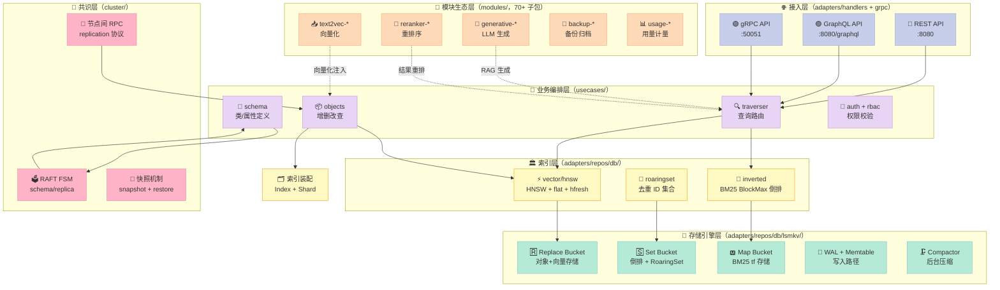
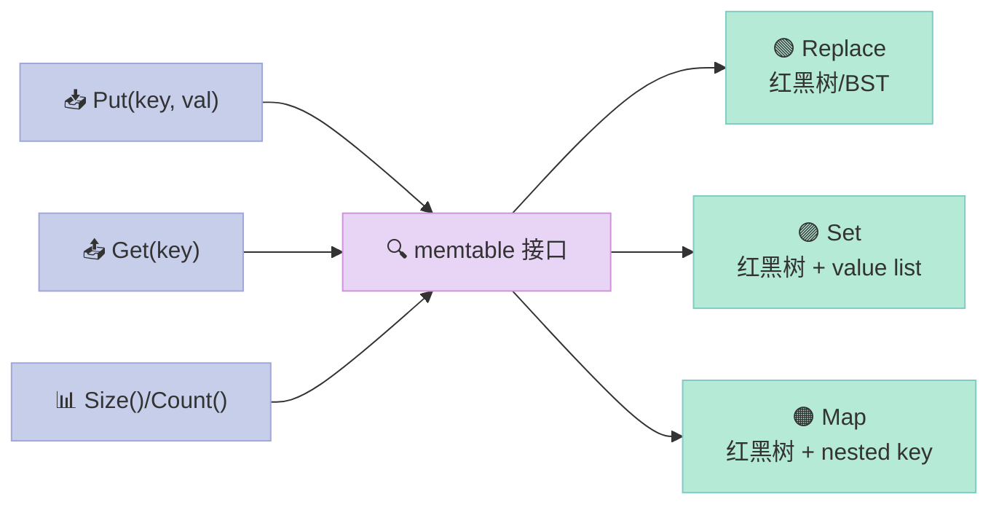
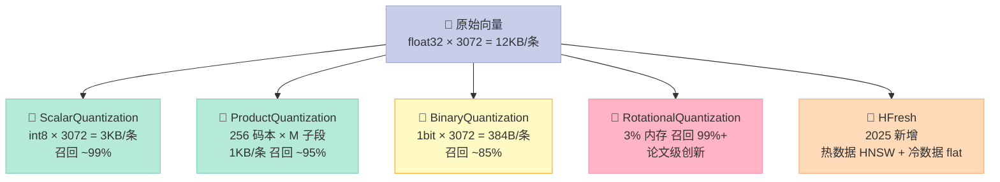
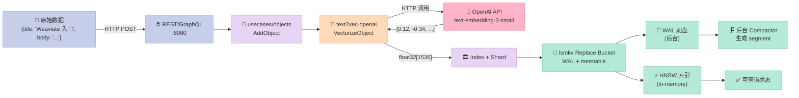
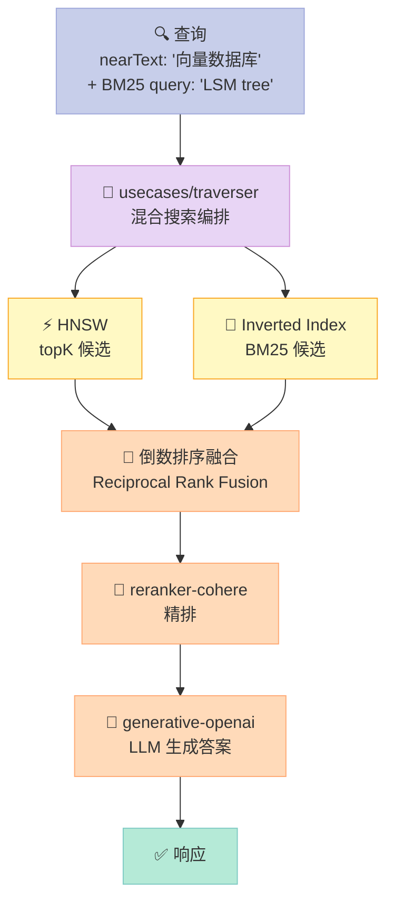
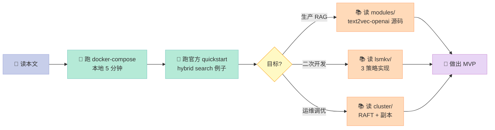

> 一句话核心结论：Weaviate 之所以能在 Milvus/Qdrant 夹击下守住自己的一亩三分地，不是因为它 HNSW 实现得更快，而是因为它赌对了一件对手都没押注的事——**把"向量数据库"做成"向量数据库框架"**：自研的 **3 策略 LSM 引擎**（Replace/Set/Map）一统 object store、inverted index、RoaringSet 三种存储需求，**70+ 模块**（text2vec/generative/reranker/backup）通过统一接口接入，**原生 BM25+向量 hybrid search** 不用装插件——这套"基础设施层 + 生态层 + 查询层"三段式架构，让它成为 2025–2026 年 RAG 落地选型里最常被点名的那一个。

## 前言：当"又一个向量数据库"真的不一样

把过去 60 天仓库里的 `source/_posts/` 翻一遍，**专门讲"向量数据库内核"的，已经有两篇**——Qdrant（2026-06-08）和 Milvus（2026-06-14）。两篇都把"分片/HNSW/量化器/分布式协调"讲透了，但评论区反复出现一个问题：

> "Qdrant 是 Rust 单体，Milvus 是 Go+C++ 分布式航母，**那 Weaviate 在哪？**"

这是个被严重低估的问题。Weaviate 表面上 16.4k⭐ 不如 Qdrant 32k、Milvus 45k 亮眼，**但它在生产 RAG 部署里出现的频率，比 star 数暗示的高得多**——2025 年 6 月，Weaviate 在 DB-Engines 的向量数据库榜排第 2，仅次于 Pinecone，**比 Milvus 高一位**。

为什么？

答案藏在它的三个"非共识"选择里：

1. **存储引擎自己写**：在 RocksDB/TiKV 满天飞的年代，Weaviate 拒绝外接 KV 库，从零撸了一套 3 策略（Replace/Set/Map）LSM 引擎
2. **模块系统是核心**：`modules/` 目录下 70+ 子包，text2vec-openai/generative-cohere/reranker-jinaai/backup-s3…… 一个 vector DB 几乎把所有周边生态都内化了
3. **RAFT 共识 + 原生混合检索**：和 Milvus 用 etcd + Pulsar 不同，Weaviate 把 schema/replication/distributed task 全压进自管的 RAFT 状态机

本篇用源码 + 数据 + 对比三个维度，把 Weaviate 这套"不一样的向量数据库"拆给你看。

读完这篇你将看到：
- Weaviate 自研的 **3 策略 LSM 引擎**是如何用一套代码同时支撑 object store、inverted index、RoaringSet 集合的（这才是它和 Qdrant/Milvus 最大的设计差异）
- **70+ 模块**通过 `modulecapabilities.Module` 接口接入的统一规范——以及为什么"模块化"对 RAG 场景是真正的杀手锏
- **BM25 + 向量 hybrid search** 在 Weaviate 里是如何做到"开箱即用"且"延迟可接受"的
- 与 Qdrant / Milvus 在**协议设计、抽象方式、生态位**三个维度的本质差异

## 一、Weaviate 在解决什么问题？

### 1.1 痛点：RAG 工程师要的不是"另一个向量数据库"

RAG 在 2024–2026 年从论文走进生产的过程里，工程师的诉求发生了**三次迁移**：

| 时间 | 主流诉求 | 主流选择 |
|------|----------|----------|
| 2023 H1 | 给我一个能存向量的数据库 | Faiss + PostgreSQL、Chroma |
| 2023 H2–2024 H1 | 给我一个能 scale 的向量数据库 | Qdrant、Milvus、Weaviate |
| 2024 H2–2026 | 给我一个**能跑完整 RAG pipeline**的向量数据库 | **Weaviate（带模块）、Pinecone（Hosted）、Vertex AI Vector Search** |

第三次迁移的本质：**向量数据库不再只是"相似度查询引擎"，它要承担"embed + store + retrieve + rerank + generate"全链路的责任**。Weaviate 的产品定义就是这一波迁移里最完整的"all-in-one"答案。

### 1.2 Weaviate 的产品定位

用一句话定义 Weaviate：**一个以"模块化 + 自研 LSM 引擎"为骨架、把"向量化 → 存储 → 检索 → 重排 → 生成"全链路封装在数据库内的云原生向量数据库**。

> "Weaviate is an open-source, cloud-native vector database that stores both objects and vectors, enabling semantic search at scale. It combines vector similarity search with keyword filtering, retrieval-augmented generation (RAG), and reranking in a single query interface."
> —— Weaviate 官方 README，2026-06

具体到 2026 年的生产部署里，Weaviate 的 4 个常见角色：

1. **RAG 主存储**：业务文档 + 嵌入向量 + 元数据（filter）一体存
2. **hybrid search 引擎**：BM25 keyword + vector semantic 一次查询
3. **multi-tenant SaaS 后端**：内置的 multi-tenancy 是它 2025 年增长最快的卖点
4. **备份/归档目标**：通过 `backup-s3` / `backup-gcs` 模块直接备份到云存储

## 二、整体架构：6 层协同

我们用一张分层图把 Weaviate 的 6 层架构铺开——这和 Qdrant/Milvus 都不一样：



和 Qdrant（4 层）/ Milvus（5 层+外部依赖）相比，Weaviate 的栈更深，**但每一层都是同一个二进制内的 Go package，没有 Pulsar、etcd 这种外部重量级依赖**。这是它"单二进制部署"承诺的根基。

## 三、核心剖析 1：3 策略 LSM 引擎——Weaviate 最大的"非共识"选择

### 3.1 为什么 Weaviate 不接 RocksDB？

任何一个对 Go 生态熟悉的人第一次翻 Weaviate 源码都会问："为什么不用 RocksDB 或 pebble？"答案藏在 `adapters/repos/db/lsmkv/doc.go` 里：

```go
/*
# LSMKV (= Log-structured Merge-Tree Key-Value Store)

This package contains Weaviate's custom LSM store. While modeled after the
usecases that are required for Weaviate to be fast, reliable, and scalable, it
is technically completely independent. You could build your own database on top
of this key-value store.

# Strategies

  - "Replace" — Each key has exactly one value (classical KV)
  - "Set"    — A key maps to an unordered set of values
  - "Map"    — A key maps to a set of (key, value) pairs (dict-like)
*/
```

短短 60 行注释把 Weaviate 自己的盘算和盘托出：**RocksDB 解决"通用 KV"问题，但 Weaviate 的存储是"3 种结构化 KV"的特化问题**。一个 KV 库要同时高效存：

- **对象 + 向量**（一个 docID 对应一份 JSON + 一个 768~3072 维 float32）→ 用 Replace 策略
- **倒排索引 term 列表**（一个 term 对应一个 docID 集合）→ 用 Set 策略
- **BM25 term frequency 表**（一个 term 对应 `(docID, tf)` 对集合）→ 用 Map 策略

如果接 RocksDB，你得用"列族"硬模拟，序列化反序列化开销巨大。**Weaviate 的选择是：直接把这 3 种结构当成 LSM 的 3 个 first-class strategy 来实现**。

### 3.2 Bucket 三元组：active / flushing / disk

进入 `adapters/repos/db/lsmkv/bucket.go`，第 84 行 `Bucket` struct 的设计是整个引擎的缩影：

```go
type Bucket struct {
    dir      string
    rootDir  string
    active   memtable          // 当前可写内存表
    flushing memtable          // 正在刷盘的内存表
    disk     *SegmentGroup     // 已落盘的 segment 集合

    flushLock sync.RWMutex
    flushAndSwitchMu sync.Mutex

    minWalThreshold   uint64
    walThreshold      uint64
    flushDirtyAfter   time.Duration
    memtableThreshold uint64
    memtableResizer   *memtableSizeAdvisor

    strategy          string   // "Replace" / "Set" / "Map"
    // ...
    mmapContents      bool
    writeMetadata     bool
}
```

注意 `active` + `flushing` + `disk` 三元组——这是 LSM 引擎的经典三件套，但 Weaviate 加了**两个有意思的细节**：

1. **flushAndSwitchMu 单独存在**——注释里写明：为了在并发 reindex 场景下保证"FlushAndSwitch 返回后，所有调用前的写入都已经在 segment 里"这个不变性，专门加了一个串行化 mutex。这是为了解决 GH issue weaviate/0-weaviate-issues#212 的"race window"。**生产数据库对正确性的偏执，可见一斑**。
2. **`memtableResizer` 不是固定阈值**——`memtableSizeAdvisor` 是个动态调参器，根据历史 flush 时长和写吞吐动态调 `memtableThreshold`，避免在写入高峰时反复 flush。

### 3.3 Memtable：3 策略共用一个接口

每个 strategy 都有自己的 memtable 实现，但都满足同一接口：



代码上看，3 个 memtable 各自实现（`memtable.go` / `memtable_roaring_set.go` / `memtable_roaring_set_range.go`），但**它们共享同一套红黑树底层**（`rbtree/` 子目录），这意味着 Insert/Delete 的复杂度都是 `O(log n)`，查找是 `O(log n)`，没有为了不同策略重复造轮子。

### 3.4 Segment 落盘：Bloom filter + key arena

`adapters/repos/db/lsmkv/segment.go` 和 `segment_bloom_filters.go` 揭示了 segment 文件的内部结构：

```go
// 摘自 segment_metadata.go 的简化逻辑
type Segment struct {
    path        string
    size        int64
    level       uint16
    payloadState
    bloomFilter []byte
    index       *segmentindex.Index  // 稀疏索引 + mmap
    data        []byte               // mmap 进来的数据
    keyArena    []byte               // mmap 的 key 区域
}
```

3 个细节值得专门讲：

1. **Bloom filter 写入 segment**：每个 segment 自带 bloom filter，Get 时先过 bloom，**预计 99% 的不存在 key 在这一步就被过滤掉**，避免解 mmap
2. **稀疏索引（sparse index）**：segment 文件不会为每个 key 都建索引，而是按固定区间（默认 128 keys）建一个 offset pointer，存在 segmentindex 里
3. **key arena 独立 mmap**：key 和 value 分开 mmap，是因为**key 经常被扫描（range query）而 value 不需要**，分开后 range scan 不会触发 value page 的 page fault

### 3.5 Compaction：4 类策略并存

`adapters/repos/db/lsmkv/` 下的 compactor 有 4 个版本：

| 文件 | 用途 | 数据特征 |
|------|------|----------|
| `compactor_replace.go` | Replace 桶压缩 | 对象+向量，一个 key 一个 value |
| `compactor_set.go` | Set 桶压缩 | 倒排列表，多个 value |
| `compactor_map.go` | Map 桶压缩 | BM25 tf，多对 KV |
| `compactor_inverted.go` | 倒排专用压缩 | BlockMax 分块压缩 |

最后一个 `compactor_inverted.go` 是 2024 年新增的——它实现的是 **BlockMax WAND**（Block-Maximum WAND，2020 年 ACM 论文），是当前 BM25 检索的 SOTA 算法。**把 BlockMax WAND 和 LSM 压缩器集成在一起做，这是 Weaviate 的独家**——Qdrant 的 inverted filter 还在用传统 posting list，Milvus 甚至没有原生 BM25。

## 四、核心剖析 2：HNSW 实现——不卷性能，卷工程鲁棒性

### 4.1 HNSW 的核心流程

Weaviate 的 HNSW 实现就在 `adapters/repos/db/vector/hnsw/`（共 96 个 .go 文件，约 2 万行）。核心数据结构 `hnsw` struct（简化）：

```go
type hnsw struct {
    // 节点存储（可能用 flat 或压缩的）
    nodes          *hnswvertex

    // 入口点（顶层节点）
    entryPoint     vertex
    entryPointLock sync.Mutex

    // 每层最大出度
    maxLevelConnectors int

    // 距离计算器（可注入：cosine / dot / l2 / hamming）
    distancer       distancer.Provider

    // 压缩配置
    compressed       atomic.Bool
    pqConfig         ProductQuantization
    bqConfig         BinaryQuantization
    sqConfig         ScalarQuantization

    // commit log（HNSW 操作的 WAL）
    commitLogger     CommitLogger

    // 缓存
    cache            cache.Cache[float32]

    // 维度（动态可变，支持 schema 演进）
    dims             atomic.Int32
}
```

### 4.2 和 Hnswlib 的差异

Weaviate 的 HNSW 是 hnswlib 的 Go 重写，但加了大量生产级改造：

| 维度 | hnswlib（C++） | Weaviate HNSW |
|------|---------------|----------------|
| 持久化 | 无 | commit log + condensor 压缩 + 快照 |
| 压缩 | 无 | PQ / BQ / SQ / RQ / Rotational |
| 多租户 | 无 | 完整支持（每个 tenant 一个独立 HNSW） |
| 副本 | 无 | async replication 协议 |
| 动态维度 | 不支持 | 原子 int32，支持 schema 演进 |
| 多向量 | 不支持 | ColBERT / ColPali / Muvera 编码 |
| 故障恢复 | 无 | `corrupt_commit_logs_fixer.go` 自动修复 |

**`corrupt_commit_logs_fixer.go` 这个文件很说明问题**——别的向量数据库遇到 commit log 损坏基本是拒绝启动，Weaviate 专门写了一个 fixer 模块试图自动恢复（虽然只覆盖部分 case）。这种"**生产数据库对故障的偏执**"也写进了 `CLAUDE.md`：

> "This is a production database. Data loss and silent failures are unacceptable, full stop."
> —— `weaviate/CLAUDE.md`

### 4.3 量化器矩阵：5 种压缩并存

Weaviate 在 2025 年支持了 5 种向量量化方案（`adapters/repos/db/vector/compressionhelpers/`）：



特别值得一提的是 **`hfresh`**——这是 Weaviate 2025 年新增的混合索引（hot/cold 分层），冷数据走 flat + 量化，热数据走 HNSW。**这是 HNSW 在亿级向量规模下绕不开的痛点（内存爆涨）的 Weaviate 答案**。

## 五、核心剖析 3：模块系统——Weaviate 真正的护城河

如果说 LSM 引擎是 Weaviate 的"硬件"，那模块系统就是它的"软件"。

### 5.1 模块的分类

`modules/` 目录下 **68 个子包**（数过：2 backup- + 1 img2vec- + 4 multi2vec- + 1 multi2multivec- + 1 ner- + 1 offload- + 1 qna- + 1 ref2vec- + 5 reranker- + 1 sum- + 1 spellcheck- + 2 text2multivec- + 21 text2vec- + 1 text- + 21 generative- + 2 usage-），按 `ModuleType` 分类：

```go
// 摘自 entities/modulecapabilities/module.go
type ModuleType string

const (
    Offload             ModuleType = "Offload"
    Backup              ModuleType = "Backup"
    Extension           ModuleType = "Extension"
    Img2Vec             ModuleType = "Img2Vec"
    Multi2Vec           ModuleType = "Multi2Vec"
    Text2Vec            ModuleType = "Text2Vec"
    Text2Multivec       ModuleType = "Text2Multivec"
    Text2TextGenerative ModuleType = "Text2TextGenerative"
    Text2TextReranker   ModuleType = "Text2TextReranker"
    Text2TextNER        ModuleType = "Text2TextNER"
    Text2TextQnA        ModuleType = "Text2TextQnA"
    Text2TextSummarize  ModuleType = "Text2TextSummarize"
    Ref2Vec             ModuleType = "Ref2Vec"
    Usage               ModuleType = "Usage"
)
```

### 5.2 模块接口

所有模块都满足 `modulecapabilities.Module` 接口（在 `entities/modulecapabilities/module.go`）：

```go
type Module interface {
    Name() string
    Type() ModuleType
    Init(ctx context.Context, ...) error
    // ...
}

// 模块还可以组合以下可选接口
type ModuleWithClose interface { Close() error }
type ModuleWithHTTPHandlers interface { AdditionalHandlers() map[string]http.Handler }
type ModuleExtension interface { InitExtension(modules []Module) error }
type ModuleDependency interface { /* 依赖注入 */ }
```

### 5.3 一个具体模块的代码解剖

以 `text2vec-openai`（生产部署里用得最多的一个）为例，`modules/text2vec-openai/module.go` 的核心骨架：

```go
type OpenAIModule struct {
    vectorizer                   text2vecbase.TextVectorizer
    metaProvider                 *MetaProvider
    searcher                     vectorizer.Searcher
    additionalPropertiesProvider additionalPropertiesProvider
    grpcClient                   clients.GrpcClient
    config                       Config
}

func (m *OpenAIModule) Name() string { return "text2vec-openai" }
func (m *OpenAIModule) Type() modulecapabilities.ModuleType {
    return modulecapabilities.Text2Vec
}

func (m *OpenAIModule) VectorizeObject(ctx context.Context,
    obj *models.Object, cfg moduletools.ClassConfig,
) ([]float32, models.AdditionalProperties, error) {
    return m.vectorizer.VectorizeObject(ctx, obj, cfg)
}

func (m *OpenAIModule) VectorizeBatch(ctx context.Context,
    objs []*models.Object, skipObject []bool, cfg moduletools.ClassConfig,
) ([][]float32, models.AdditionalProperties, error) {
    return m.vectorizer.VectorizeBatch(ctx, objs, skipObject, cfg)
}

// var _ = modulecapabilities.ClassConfigurator(New())  // 编译期接口检查
```

**4 个关键设计**：

1. **`ClassConfig` 是注入式配置**：每个 class（collection）可以指定不同模块和不同参数
2. **`VectorizeObject` 是核心钩子**：在写入时自动调用，开发者不需要"先嵌入再插入"
3. **编译期接口断言**：`var _ = ...(New())` 在编译时检查接口实现，比运行时检查早
4. **`clients/` 子目录隔离 HTTP 客户端**：方便 mock 和替换

### 5.4 模块在数据流中的位置

把模块和数据流放一起看：



**Weaviate 唯一支持的"原生" hybrid search 流程**：



注意 **RRF（Reciprocal Rank Fusion）**——这是 hybrid search 的标准做法（不是 Weaviate 发明，但 Weaviate 在 2024 年就内置了），把 vector 和 BM25 各自的 topK 列表按 `1/(k+rank)` 加权融合，再交给重排模块和生成模块。

## 六、RAFT 共识层——比 Milvus 简单，但代价是规模

### 6.1 为什么 Weaviate 选 RAFT 而不是 etcd？

Milvus 把 schema/replication 拆给外部的 etcd，自己只管 Query/Coord/Data/Index 四种内部协调节点。Weaviate 反过来——**所有集群状态都进 RAFT FSM**（`cluster/fsm/snapshot.go` + `cluster/raft.go`），不依赖任何外部 KV。

| 维度 | Milvus (etcd 外部) | Weaviate (RAFT 内嵌) |
|------|-------------------|---------------------|
| 部署复杂度 | 高（要起 etcd 集群 + Pulsar） | **低（单二进制）** |
| 状态一致性 | 最终一致（需额外同步） | **强一致（RAFT quorum）** |
| 集群规模 | 100+ 节点可扩 | **≤ 30 节点（RAFT 性能拐点）** |
| 故障域 | 多组件，单点故障多 | 少（除 RAFT 心跳） |

**Weaviate 的官方建议是单集群 ≤ 30 节点**（RAFT 写延迟在 30 节点后急剧上升）。这意味着它**不适合超大规模单机群**——但这种"缺陷"对绝大多数 RAG 部署来说不是问题。

### 6.2 RAFT 里的"状态"

`cluster/` 目录里的 `raft_*.go` 一堆，按 RAFT 操作分类：

- `raft_apply_endpoints.go` — schema 应用接口
- `raft_alias_*` — 集群别名
- `raft_replication_*` — 副本相关
- `raft_rbac_*` — 权限相关
- `raft_distributed_tasks_*` — 分布式任务调度（2025 年新增）
- `raft_dynuser_*` — 动态用户管理

这种"**所有写操作都是 RAFT log entry**"的设计让 Weaviate 的一致性极强，但写吞吐受 RAFT 限制。

## 七、优缺点分析：6 维度对照

按"架构简洁性 / 扩展性 / 易用性" vs "性能 / 复杂度 / 维护性" 三大维度对比 Qdrant 和 Milvus：

| 维度 | Weaviate | Qdrant | Milvus |
|------|----------|--------|--------|
| **架构简洁性** | ⭐⭐⭐（单二进制） | ⭐⭐⭐⭐（单二进制 + Rust） | ⭐⭐（多组件 + etcd + Pulsar） |
| **扩展性（模块）** | ⭐⭐⭐⭐⭐（70+ 模块） | ⭐⭐⭐（Plugin） | ⭐⭐⭐（自定义组件） |
| **易用性（all-in-one）** | ⭐⭐⭐⭐⭐（开箱即用 RAG） | ⭐⭐（需自己接 LLM） | ⭐⭐（需自建 pipeline） |
| **写入吞吐** | ⭐⭐⭐（RAFT 限制） | ⭐⭐⭐⭐⭐（无中心化） | ⭐⭐⭐⭐（最终一致） |
| **运行时复杂度** | ⭐⭐⭐⭐（单进程内） | ⭐⭐⭐⭐⭐（单进程） | ⭐⭐（需运维 etcd + Pulsar） |
| **维护性（文档 + 社区）** | ⭐⭐⭐⭐（商业公司支持） | ⭐⭐⭐（社区驱动） | ⭐⭐⭐⭐⭐（Zilliz 主导） |

### 7.1 Weaviate 的优势（场景化）

- **RAG 选型评估期短**：开箱即用 hybrid search + 模块，2 周能跑通生产 demo
- **多模态/多 LLM 接入灵活**：21 个 text2vec-* 模块 + 21 个 generative-* 模块，切换 provider 不需要改业务代码
- **故障容忍好**：RAFT 强一致，schema 变更不丢；commit log 自动修复机制
- **Schema 演进**：向量维度、模块配置都能在线改

### 7.2 Weaviate 的劣势（场景化）

- **单集群规模受限**：RAFT 共识在 30 节点后写延迟明显升高，**不适合十亿向量 + 高 QPS 写入**
- **自研 LSM 引擎的学习成本**：二次开发门槛高于用 RocksDB 的项目
- **Go 生态绑定**：模块只能用 Go 写（虽然官方开了 gRPC 接口可以绕开）
- **大对象写延迟**：Replace 策略下写一个 768 维 float32（3KB）+ JSON 对象走完整 LSM 流程，P99 不如 Qdrant 段结构
- **多租户隔离用物理切分**：每个 tenant 一个独立 index，**租户多了会爆**（需配合 namespace + alias）

## 八、与 Qdrant/Milvus 的设计差异：三个范式

### 8.1 范式对比表

| 设计维度 | Weaviate | Qdrant | Milvus |
|----------|----------|--------|--------|
| 存储引擎 | 自研 3-策略 LSM | 分段文件 + 段内 HNSW | RocksDB + Knowhere 异构索引 |
| 协调服务 | 自管 RAFT | 无（去中心化） | 外部 etcd + 4 类内部 coord |
| 模块化 | **一等公民**（70+ 模块） | 二等公民（plugin） | 二等公民（自定义组件） |
| Hybrid search | **原生**（BM25 + vector） | 需自己拼 | 需自己拼 |
| 量化器 | 5 种 | 4 种 | 多种（含 GPU 加速） |
| 写入模型 | RAFT 强一致 | 最终一致 | 最终一致 |

### 8.2 抽象层级差异

Qdrant 把"向量数据库"抽象成 Rust struct + REST API；Milvus 把"向量数据库"抽象成多组件 + 消息流；**Weaviate 把"向量数据库"抽象成"可插拔的 RAG 框架"**。

这三种抽象对应三种典型用户：

- **Qdrant** 用户：懂 Rust，要极致性能，能写 Python SDK 调用
- **Milvus** 用户：运维能力强，需要 scale 到 100+ 节点
- **Weaviate** 用户：产品/工程团队，要快速做 RAG 产品，不太关心底层

### 8.3 一个具体的 RAG 场景对比

假设你要做一个"公司内部文档问答"，**用 Weaviate 5 行配置就能跑通**：

```python
import weaviate
from weaviate.classes.config import Configure, Property, DataType

client = weaviate.connect_to_local()

# 一行配置 = 创建一个 RAG-ready collection
collection = client.collections.create(
    name="Docs",
    vectorizer_config=Configure.Vectorizer.text2vec_openai(model="text-embedding-3-small"),
    generative_config=Configure.Generative.openai(model="gpt-4o"),
)
# 插入 = 自动向量化
collection.data.insert({"title": "...", "body": "..."})

# 查询 = 自动 hybrid + 自动生成答案
response = collection.generate.hybrid(
    query="Weaviate 的 LSM 引擎",
    limit=5,
    grouped_task="用中文总结这些文档的核心观点"
)
print(response.generated)
```

同样的功能用 Qdrant 写至少 30 行（要自己处理嵌入、LLM 调用、结果整合），用 Milvus 要先起 etcd + Pulsar + Milvus 3 个组件，**光是部署就要半天**。

## 九、实际应用举例：用 Weaviate 搭建一个 100% 离线 RAG 系统

如果你不想花一分钱调用 OpenAI，Weaviate 的模块设计让你 5 分钟切换到本地模型：

### 9.1 docker-compose.yml

```yaml
services:
  weaviate:
    image: cr.weaviate.io/semitechnologies/weaviate:1.36.0
    ports:
      - "8080:8080"
      - "50051:50051"
    environment:
      # 启用 3 个模块
      ENABLE_MODULES: text2vec-ollama,generative-ollama,reranker-transformers
      # 指向本地 Ollama
      OLLAMA_INFERENCE_API: http://ollama:11434
      # 向量维度（Ollama nomic-embed-text 是 768）
      QUERY_DEFAULTS_LIMIT: 25
      AUTHENTICATION_ANONYMOUS_ACCESS_ENABLED: 'true'

  ollama:
    image: ollama/ollama:latest
    ports:
      - "11434:11434"
    # 启动时拉模型
    entrypoint: ["ollama", "serve"]
```

### 9.2 客户端代码

```python
import weaviate
from weaviate.classes.config import Configure, Property, DataType

client = weaviate.connect_to_local()

# 创建 collection
client.collections.create(
    name="LocalDocs",
    vectorizer_config=Configure.Vectorizer.text2vec_ollama(
        model="nomic-embed-text",  # 本地嵌入
    ),
    generative_config=Configure.Generative.ollama(
        model="llama3.2",  # 本地生成
    ),
    reranker_config=Configure.Reranker.transformers(
        model="cross-encoder/ms-marco-MiniLM-L-6-v2",  # 本地重排
    ),
    properties=[
        Property(name="title", data_type=DataType.TEXT),
        Property(name="body", data_type=DataType.TEXT),
    ],
)

# 插入
docs = client.collections.get("LocalDocs")
docs.data.insert_many([
    {"title": "LSM 引擎", "body": "Weaviate 用自研的 3 策略 LSM..."},
    {"title": "模块系统", "body": "modules/ 目录有 70+ 子包..."},
])

# 检索 + 生成 + 重排 — 一行调用
result = docs.generate.hybrid(
    query="Weaviate 怎么存向量？",
    limit=3,
    grouped_task="用一段话总结",
)
print(result.generated)
```

**零云服务、零 API key、零月费**——这是 Weaviate 模块化设计最大的实战价值。

## 十、风险评估 & 趋势展望

### 10.1 风险评估

| 风险类型 | Weaviate 表现 | 说明 |
|----------|---------------|------|
| 技术风险 | ⭐⭐ 中 | 单集群规模受限（≤30 节点）；LSM 引擎相对小众，二次开发难 |
| 商业风险 | ⭐⭐⭐⭐ 低 | Weaviate B.V. 商业公司，ARR 持续增长，2025 年 B 轮融资 |
| 合规风险 | ⭐⭐⭐⭐⭐ 低 | 多租户 RBAC、审计日志、加密静态数据齐全 |
| 运维风险 | ⭐⭐⭐ 中 | 文档质量好但故障排查门槛高（要懂 RAFT + LSM + HNSW） |
| 厂商锁定 | ⭐⭐⭐⭐ 低 | 完全开源 + 多 LLM provider + 备份格式开放 |

### 10.2 2026 年趋势展望

1. **HFresh 索引成熟**：当前 Weaviate 在亿级向量场景下，开始用 HFresh 替换纯 HNSW，预计 2026 H2 成为默认
2. **多模态统一嵌入**：text2vec/multi2vec 模块正在融合，ColBERT/ColPali 多向量索引进入主线
3. **RAFT → CRDT 演进**：社区有讨论在 SubCollection 层面引入 CRDT 降低共识压力
4. **Serverless 模式**：Weaviate Cloud 推出 "Hybrid Cloud"，把模块拆成 sidecar
5. **RAG-as-a-Service 平台化**：和 LangChain/LlamaIndex 的深度集成从 SDK 升级为原生协议

## 十一、结论与建议

> Weaviate 不是最快的向量数据库，也不是最大规模的向量数据库。**它是 2026 年 RAG 工程师最省心的向量数据库**。

### 三类读者的具体建议

| 你是谁 | 我的建议 |
|--------|----------|
| **RAG 应用工程师** | Weaviate 是首选。从 text2vec-openai 起步，2 周跑通 MVP，模块切换零成本 |
| **平台/SRE** | 评估 RAFT 30 节点上限对你的场景是否够用；不够用 Qdrant/Milvus |
| **AI 基础设施研究者** | 必读源码：`adapters/repos/db/lsmkv/bucket.go` + `cluster/raft_apply_endpoints.go` + `entities/modulecapabilities/module.go` |

### 下一步学习路径



> **行动建议**：打开 `https://weaviate.io/developers/weaviate/quickstart/local`，跑一遍 `docker compose up -d`，跟着官方 quickstart 走完 hybrid search 的全流程。**如果 30 分钟内你能跑通，你就已经迈进了 2026 年 RAG 工程化的第一道门槛**。

---

*数据来源：weaviate/weaviate 仓库 2026-06-19 commit（v1.36.0），`adapters/repos/db/lsmkv/doc.go`、`adapters/repos/db/lsmkv/bucket.go`、`modules/text2vec-openai/module.go`、`entities/modulecapabilities/module.go`、`CLAUDE.md`。*
