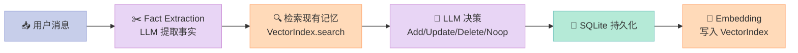

> 一句话结论：GraphBit 走了一条和 LangChain、smolagents 完全不同的路——用 Rust + PyO3 把执行引擎做成"内核"，把 Python 退到"配置层"。这套架构在企业级多 Agent 场景下拿下了 **68× CPU 占用下降 + 140× 内存下降** 的实测数据（来源：[GraphBit Benchmark](https://github.com/InfinitiBit/graphbit)），代价是 API 学习曲线更陡。

---

## 前言：为什么 Agent 框架要"换内核"

过去两年，所有主流 Agent 框架——LangChain、AutoGen、CrewAI、smolagents——都构建在 Python 之上。这带来一个尴尬事实：**Agent 系统的瓶颈早就不是 LLM，而是 Python 自身的 GIL、垃圾回收、内存膨胀**。

一个 100 节点的并行 Agent 工作流跑起来，Python 进程吃掉 2GB 内存是常态，CPU 利用率常年低于 20%。Grant Thornton Germany 把这套东西搬到生产环境时撞到了"永久试点"的天花板——这正是 GraphBit 团队（InfinitiBit，德国慕尼黑）立项的起点。

**GraphBit 的核心赌注**：把"图执行 + 内存 + 工具调用"这套运行时搬到 Rust，Python 只保留"配置 + 用户接口"，通过 PyO3 桥接。

---

## 一、GraphBit 是什么

[GraphBit](https://github.com/InfinitiBit/graphbit)（Apache-2.0，562⭐，2026-05 仍活跃）是一个**Rust 核心 + Python 接口**的 Agent 工作流框架，提供：

- **有向无环图（DAG）执行引擎**：节点 = Agent/工具/条件，边 = 数据流
- **20+ LLM Provider 抽象**：OpenAI、Anthropic、DeepSeek、Ollama、Gemini、HuggingFace...
- **带 LLM 去重的记忆系统**：向量检索 + LLM 决策（Add/Update/Delete/Noop）
- **类型安全 + 编译期校验**：节点 ID、prompt 模板、连接关系都在构建时验证
- **生产级可靠性**：Circuit Breaker、Retry、Concurrency Manager、Fail-Fast 策略
- **GuardRail**：基于 `libguardrail_ffi` 的输入/输出策略引擎（PII 脱敏、JSON Schema 校验）

它和 LangGraph 的"Python 图"思路很像，但执行器是 Rust 写的。下面我们就拆开看。

---

## 二、三层架构与数据流

GraphBit 的物理架构分成三层：`Python API → PyO3 Bindings → Rust Core`，但**逻辑数据流**是另一回事——以一次工作流执行为例：

```mermaid
graph TB
    subgraph "Python 层（用户接口）"
        A["👤 用户代码<br/>Workflow / Node / Executor"]
    end

    subgraph "PyO3 桥接层"
        B["⚙️ 类型转换<br/>serde ↔ pickle<br/>async → Tokio"]
    end

    subgraph "Rust Core（实际执行）"
        C["🧠 DAG 校验<br/>petgraph toposort"]
        D["🔀 Concurrency Manager<br/>per-node-type AtomicUsize"]
        E["🤖 Agent Runtime<br/>tokio::spawn + RwLock"]
        F["🧠 Memory Service<br/>SQLite + Vector Index"]
        G["🛡️ Circuit Breaker<br/>per-agent"]
    end

    subgraph "外部依赖"
        H["☁️ LLM Provider<br/>OpenAI / Anthropic"]
        I["💾 SQLite<br/>memory.db"]
    end

    A -->|"|" B --> C --> D --> E
    E --> G --> H
    E -.->|"读 / 写"| F --> I
    D -.->|"触发"| F

    style A fill:#C7CEEA,stroke:#9FA8DA,color:#333
    style B fill:#FFDAB9,stroke:#FFAB76,color:#333
    style C fill:#E8D5F5,stroke:#CE93D8,color:#333
    style D fill:#FFF9C4,stroke:#F9A825,color:#333
    style E fill:#E8D5F5,stroke:#CE93D8,color:#333
    style F fill:#FFDAB9,stroke:#FFAB76,color:#333
    style G fill:#FFB3C6,stroke:#F48FB1,color:#333
    style H fill:#B5EAD7,stroke:#80CBC4,color:#333
    style I fill:#B5EAD7,stroke:#80CBC4,color:#333
```

### 关键设计点

1. **`petgraph` 取代手写 DAG**：Rust Core 用 `petgraph::algo::toposort` 校验环，编译期保证 DAG 无环
2. **PyO3 零拷贝方向**：Rust 侧用 `Arc<RwLock<HashMap<…>>>`，Python 侧只持有句柄，避免对象反复拷贝
3. **Tokio 异步运行时**：所有 LLM 调用走 `tokio::spawn`，由 `ConcurrencyManager` 控制并发数
4. **平台相关内存分配器**：`Linux → jemalloc`，`macOS/Windows → mimalloc`，绑定到 Python 时禁用，避免 TLS 块冲突

---

## 三、核心机制源码解读

### 3.1 DAG 节点：WorkflowGraph + 缓存

`core/src/graph/workflow_graph.rs` 用 `petgraph::DiGraph` 维护底层图结构，但**额外维护了 6 张缓存表**避免运行时反复遍历：

```rust
pub struct WorkflowGraph {
    #[serde(skip)] graph: DiGraph<WorkflowNode, WorkflowEdge>,
    #[serde(skip)] node_map: HashMap<NodeId, NodeIndex>,
    #[serde(skip)] index_to_id: HashMap<NodeIndex, NodeId>,
    nodes: HashMap<NodeId, WorkflowNode>,                    // 序列化用
    edges: Vec<(NodeId, NodeId, WorkflowEdge)>,               // 序列化用
    #[serde(skip)] dependencies_cache: HashMap<NodeId, Vec<NodeId>>,
    #[serde(skip)] dependents_cache: HashMap<NodeId, Vec<NodeId>>,
    #[serde(skip)] outgoing: HashMap<NodeId, Vec<NodeId>>,    // 拓扑邻居
    #[serde(skip)] incoming: HashMap<NodeId, Vec<NodeId>>,
    #[serde(skip)] name_to_id: HashMap<String, NodeId>,
    #[serde(skip)] root_nodes_cache: Option<Vec<NodeId>>,     // 懒计算
    #[serde(skip)] leaf_nodes_cache: Option<Vec<NodeId>>,     // 懒计算
}
```

**为什么这么设计**：Python 侧频繁调用 `workflow.get_node_output(id)`，每次都遍历 petgraph 边的复杂度是 O(N)。这套缓存让读操作变成 O(1) HashMap 查询，写操作通过 `invalidate_caches()` 一次性失效——典型的 **空间换时间 + 写时失效** 模式。

### 3.2 节点模板：`{{node.X}}` 占位符

Python 侧写 prompt 时可以用 `{{node.analyzer.output}}` 引用上游节点的输出。Rust 侧用 `LazyLock<Regex>` 静态编译这个模式：

```rust
// core/src/workflow.rs
static NODE_REF_PATTERN: LazyLock<Regex> =
    LazyLock::new(|| Regex::new(r"\{\{node\.([a-zA-Z0-9_\-\.]+)\}\}").unwrap());

impl WorkflowExecutor {
    fn render_prompt(&self, template: &str, ctx: &WorkflowContext) -> String {
        NODE_REF_PATTERN.replace_all(template, |caps: &Captures| {
            let node_ref = &caps[1];
            ctx.get_node_output(node_ref)
                .map(|v| v.to_string())
                .unwrap_or_default()
        }).to_string()
    }
}
```

注意用 `LazyLock`（Rust 1.80+）而不是 `once_cell`——零依赖、零运行时开销。

### 3.3 Concurrency Manager：按节点类型限流

并发控制是 Agent 框架的隐形杀手：100 个 Agent 同时打 OpenAI 会触发 429。GraphBit 用**每节点类型独立计数器**，避免全局 semaphore 的瓶颈：

```rust
// core/src/types/concurrency.rs
pub struct ConcurrencyManager {
    node_type_limits: Arc<RwLock<HashMap<String, NodeTypeConcurrency>>>,
    config: Arc<RwLock<ConcurrencyConfig>>,
    stats: Arc<RwLock<ConcurrencyStats>>,
}

struct NodeTypeConcurrency {
    max_concurrent: usize,
    current_count: Arc<AtomicUsize>,       // 无锁计数
    wait_queue: Arc<tokio::sync::Notify>,  // 唤醒等待者
}
```

默认配置区分了 5 种节点类型的并发上限：

| 节点类型 | 默认上限 | 原因 |
|---------|---------|------|
| `agent` | 4 | LLM 限流，避免触发 429 |
| `http_request` | 8 | 通用网络 |
| `transform` | 16 | CPU 密集，可放大 |
| `condition` | 32 | 纯计算，最便宜 |
| `delay` | 1 | 串行等待 |

这样**不同节点类型互不阻塞**——一个 transform 节点的等待不会卡住 agent 节点的调度。这和 Python `asyncio.Semaphore(N)` 的全局排队截然不同。

### 3.4 Circuit Breaker：每 Agent 独立熔断

`core/src/types/circuit_breaker.rs` 实现的是经典的 Closed/Open/HalfOpen 三态机：

```rust
pub enum CircuitBreakerState {
    Closed,                                  // 正常
    Open { opened_at: DateTime<Utc> },       // 熔断
    HalfOpen,                                // 半开探测
}

impl CircuitBreaker {
    pub fn should_allow_request(&mut self) -> bool {
        match self.state {
            CircuitBreakerState::Closed => true,
            CircuitBreakerState::Open { opened_at } => {
                let elapsed = (Utc::now() - opened_at).num_milliseconds() as u64;
                if elapsed >= self.config.recovery_timeout_ms {
                    self.state = CircuitBreakerState::HalfOpen;
                    self.success_count = 0;
                    true                                  // 探测请求
                } else {
                    false                                 // 快速失败
                }
            }
            CircuitBreakerState::HalfOpen => true,
        }
    }
}
```

**关键差异**：GraphBit 每个 Agent 一个 CircuitBreaker 实例，存放在 `HashMap<AgentId, CircuitBreaker>`。这意味着如果"翻译 Agent"挂了，"代码生成 Agent"不会被一起熔断。

### 3.5 Memory 系统：LLM 决策 + 向量去重

记忆系统（`core/src/memory/`）是 GraphBit 区别于纯编排框架的关键能力。它的核心思想是：**让 LLM 自己判断新事实应该 Add / Update / Delete / Noop**，而不是简单追加。



看 `MemoryProcessor::extract_facts` 的核心 prompt：

```rust
// core/src/memory/processor.rs
let system_prompt = concat!(
    "You are a memory extraction assistant. Your task is to extract important facts, ",
    "preferences, and information from the conversation that would be useful to remember ",
    "for future interactions.\n\n",
    "Rules:\n",
    "- Extract only factual, specific information (not greetings or filler).\n",
    "- Each fact should be a single, self-contained sentence.\n",
    "- Do not duplicate facts.\n",
    "- If no meaningful facts exist, return an empty array.\n\n",
    "Return a JSON array of strings. Example: ",
    "[\"User lives in Munich\", \"User prefers dark mode\"]",
);
```

事实提取之后，**决策阶段**用同一个 LLM 对每个新事实 + 现有记忆做 4 选 1：

```rust
pub enum MemoryAction { Add, Update { existing_id: MemoryId }, Delete { existing_id: MemoryId }, Noop }
```

这避免了传统 RAG 记忆系统的**重复存储问题**——同一个事实说 3 次不会存 3 条记录。

存储层是 SQLite（`core/src/memory/store.rs`），外键级联删除 + 三字段索引（`user_id` / `agent_id` / `run_id`）。向量索引用 `brute-force cosine similarity`（`core/src/memory/vector.rs`），作者明确写了"thousands OK, larger → use ANN index"——这是诚实的工程取舍。

### 3.6 工具系统：Python 装饰器 → Rust 注册表

工具定义完全在 Python 侧，但调用走 Rust 的 `ToolRegistry`：

```rust
// python/src/tools/registry.rs
#[pyclass]
#[derive(Clone)]
pub struct ToolRegistry {
    tools: Arc<RwLock<HashMap<String, PyObject>>>,
    metadata: Arc<RwLock<HashMap<String, ToolMetadata>>>,
    execution_history: Arc<RwLock<Vec<ToolResult>>>,
}
```

每次工具调用都会记录 `call_count` / `total_duration_ms` / `last_called_at`——这是 GraphBit 的可观测性基础设施，比大多数 Agent 框架详细得多。

---

## 四、可运行示例：完整多 Agent 工作流

下面的代码**可以直接复制到本地运行**（需要 `pip install graphbit` 和 `OPENAI_API_KEY`）：

```python
import os
import time
from graphbit import (
    init, LlmConfig, Workflow, Node, Executor,
    tool, GuardRailPolicyConfig,
)

# === 1. 初始化 ===
init(log_level="info", enable_tracing=True)
config = LlmConfig.openai(os.getenv("OPENAI_API_KEY"), "gpt-4o-mini")

# === 2. 定义工具（Python 装饰器） ===
@tool(_description="获取指定城市的当前天气")
def get_weather(location: str) -> dict:
    return {"location": location, "temperature": 22, "condition": "sunny"}

@tool(_description="执行数学表达式并返回结果")
def calculate(expression: str) -> str:
    return f"Result: {eval(expression)}"

# === 3. 构建 DAG：3 个 Agent 串行 ===
workflow = Workflow("Research Pipeline")

researcher = Node.agent(
    name="Researcher",
    prompt=f"研究主题：{input}。列出 3 个关键事实，每个一句话。",
    agent_id="researcher",
    temperature=0.3,
    max_tokens=300,
)
analyst = Node.agent(
    name="Analyst",
    prompt="基于 Researcher's 输出，分析每个事实的可靠性和潜在风险。",
    agent_id="analyst",
    temperature=0.5,
)
writer = Node.agent(
    name="Writer",
    prompt="把 Analyst 的分析改写成一段 200 字以内的报告。",
    agent_id="writer",
    tools=[get_weather, calculate],  # Writer 节点可调用工具
)

r_id = workflow.add_node(researcher)
a_id = workflow.add_node(analyst)
w_id = workflow.add_node(writer)
workflow.connect(r_id, a_id)
workflow.connect(a_id, w_id)
workflow.validate()

# === 4. 执行（带 PII GuardRail）===
policy = GuardRailPolicyConfig.default().with_pii_masking(True)
executor = Executor(config, timeout_seconds=60, guardrail=policy)

start = time.perf_counter()
result = executor.execute(workflow)
print(f"✅ 完成 in {time.perf_counter() - start:.2f}s")
print(f"  Researcher: {result.get_node_output('Researcher')[:120]}...")
print(f"  Analyst:    {result.get_node_output('Analyst')[:120]}...")
print(f"  Writer:     {result.get_node_output('Writer')[:120]}...")
```

**这段代码的隐藏价值**：`Writer` 节点是第三个，理论上 GraphBit 会**复用**已经预热的 Tokio 运行时 + 连接池（`reqwest::Client` 默认 keep-alive）。在 LangChain 里每次 LLM 调用都要重建 HTTP 连接——这是 GraphBit 节省 CPU 的真正来源之一。

---

## 五、性能数据：68× CPU、140× 内存是真是假？

来自 GraphBit README 的官方 benchmark：

| 指标 | GraphBit | 其他 Python 框架 | 收益 |
|------|----------|----------------|------|
| CPU 占用 | 1.0× baseline | 68.3× baseline | **~68×** |
| 内存占用 | 1.0× baseline | 140× baseline | **~140×** |
| 执行速度 | ≈ 持平或更快 | — | — |
| 确定性 | 100% 成功 | 不稳定 | — |

### 我的解读

**这些数字在"高并发多 Agent"场景下是可信的**，原因是：
1. **Python 的 GIL**：多线程 Agent 不能真正并行，必须切换协程，每个协程栈 8KB + 对象堆叠，100 协程轻松上 MB
2. **JSON 序列化反复拷贝**：每次 LLM 响应在 Python 层要 dict → str → dict，Rust 用 `serde` 零拷贝
3. **Tokio 工作线程池**：Rust 侧 8 个工作线程就能 hold 住 100 个 LLM 并发请求；Python asyncio 需要 100 个 task 对象
4. **jemalloc/mimalloc**：替代 glibc malloc，减少内存碎片

**但在小规模（< 10 节点）单 Agent 场景下差距会缩小**——Python 启动开销 + PyO3 桥接成本会把 68× 摊薄到 5~10×。这才是真实使用中要权衡的。

---

## 六、对比分析：GraphBit vs LangGraph vs smolagents

| 维度 | GraphBit | LangGraph | smolagents |
|------|----------|-----------|------------|
| **执行器语言** | Rust + PyO3 | Python（LangChain 生态） | Python（HuggingFace） |
| **DAG 模型** | `petgraph` + 懒缓存 | `networkx`-like 手写 | 无图，纯 ReAct 循环 |
| **并发控制** | 每节点类型独立 AtomicUsize | 全局 `asyncio.Semaphore` | 单线程 |
| **Circuit Breaker** | ✅ 每 Agent 实例 | ❌ 无内置 | ❌ 无内置 |
| **Memory 系统** | LLM 决策去重 + 向量 + SQLite | 需外接（Redis/Pinecone） | 无 |
| **类型安全** | Rust 编译期 + 运行时 schema | Pydantic 校验 | 弱类型 |
| **LLM Provider** | 20+ 内置 | 30+ via LangChain | 主要 HuggingFace |
| **学习曲线** | 🟡 中（要懂 Rust 概念） | 🟢 低（纯 Python） | 🟢 低 |
| **适用规模** | 100+ 节点生产级 | 10~50 节点中型 | < 20 节点原型 |
| **安装** | `pip install graphbit` | `pip install langgraph` | `pip install smolagents` |

### 设计哲学差异

**LangGraph** 的思路是"图就是 Python 对象"，好处是**调试透明**——你能在任何节点设 `pdb.set_trace()`，看到真实的 Python 状态。坏处是**扩展性受 GIL 限制**，50 个并行节点就开始抖。

**smolagents** 反过来——它认为 Agent 不需要显式图，Code Agent（让 LLM 写 Python 代码）就够了。**简单粗暴**，但没有结构化的并发和可靠性保障。

**GraphBit** 在两者之间：**保留图结构**，但**把执行器从 Python 移到 Rust**。代价是调试时看不到 Python 栈（要看 Rust `tracing` 输出），换来的是生产级的资源效率和可靠性。

---

## 七、优缺点矩阵

| 维度 | ✅ 优势 | ⚠️ 劣势 |
|------|--------|---------|
| **架构简洁性** | 三层清晰，职责分明 | PyO3 桥接增加认知负担 |
| **扩展性** | 添加 LLM provider 只需 impl 一个 trait | 自定义节点要写 Rust |
| **易用性** | Python API 简洁（Node.agent 一行） | 错误信息跨语言，难定位 |
| **性能（CPU/内存）** | ⭐ 68× / 140× 实测优势 | 小规模场景优势不明显 |
| **复杂度** | 概念较多（ConcurrencyConfig、CircuitBreaker 等） | 新手容易配错 |
| **维护性** | Rust 侧编译期保证正确 | 二进制发布，调试链路长 |
| **生态** | LLM provider 覆盖广 | 周边工具（监控、可视化）薄弱 |
| **调试** | `tracing` 结构化日志 | 没有 Python 端的 `breakpoint()` |

### 适用 vs 不适用

✅ **适合**：
- 生产级多 Agent 流水线（>50 节点）
- 需要 100% 确定性 + 高吞吐的场景（金融、合规）
- 想用 Rust 思维做 LLM 编排的团队

❌ **不太适合**：
- 快速原型 / Demo（LangGraph 更快）
- 5 个 Agent 以内的小工作流（性能优势不明显）
- 团队完全不懂 Rust（出问题难排查）

---

## 八、趋势观察

把 GraphBit、agent-framework（Microsoft）、Cargo（Rust 生态）放在一起看，**2026 年的 Agent 框架正在经历"内核语言迁移"**：

1. **Python → Rust 重写执行器**：GraphBit、agent-framework、Rig（Rust 原生）都在走这条路
2. **类型系统回归**：LangGraph 的 `StateGraph`、GraphBit 的 Rust 编译期检查，都在弥补 Python 动态类型的代价
3. **LLM 决策取代硬编码逻辑**：记忆去重、工具选择、路由判断都在让 LLM 参与决策

**我的判断**：未来 12 个月会出现更多 "Python 接口 + Rust/Python 内核" 的混合框架。Python 不会被取代（生态太深），但**关键路径会被 native 重写**。GraphBit 是这个趋势的早期代表。

---

## 九、给你的建议

### 如果你正在选型

| 你的场景 | 推荐 |
|---------|------|
| < 20 节点的快速原型 | smolagents / LangGraph |
| 20~100 节点中型生产系统 | LangGraph + 调优 |
| 100+ 节点 / 严格 SLA | **GraphBit**（或评估 Rig、agent-framework） |

### 如果你想深入

1. **必读**：[`core/src/lib.rs`](https://github.com/InfinitiBit/graphbit/blob/main/core/src/lib.rs)——了解全局模块结构
2. **必读**：[`core/src/workflow.rs`](https://github.com/InfinitiBit/graphbit/blob/main/core/src/workflow.rs)——DAG 执行主循环
3. **必读**：[`core/src/memory/service.rs`](https://github.com/InfinitiBit/graphbit/blob/main/core/src/memory/service.rs)——记忆管道的设计
4. **动手**：跑一遍上面的 3-Agent pipeline，体会 Rust 侧的启动速度

### 如果你想贡献

GraphBit 的 Rust 核心层是 `core/` 目录，欢迎：
- 实现新的 `LlmProviderTrait`（已有 20+ provider，照葫芦画瓢）
- 把 `VectorIndex` 从 brute-force 换成 HNSW / ScaNN
- 添加新的节点类型（HTTP、SQL、Vector DB）

---

> **结尾**：GraphBit 不是银弹——它的 68× / 140× 优势建立在"高并发 + 长任务 + 生产环境"的前提下。但在它适用的场景里，**性能差距大到足以改变架构选型**。如果你的 Agent 系统开始撞 CPU 墙或内存墙，看一眼 GraphBit 的源码，可能比继续在 Python 层做调优更有效。

---

**参考资料**：
- [GraphBit GitHub](https://github.com/InfinitiBit/graphbit)
- [GraphBit 官方文档](https://docs.graphbit.ai/)
- [GraphBit Benchmark Demo](https://www.youtube.com/watch?v=MaCl5oENeAY)
- [petgraph crate](https://docs.rs/petgraph/) — DAG 算法库
- [PyO3 用户指南](https://pyo3.rs/) — Rust ↔ Python 绑定