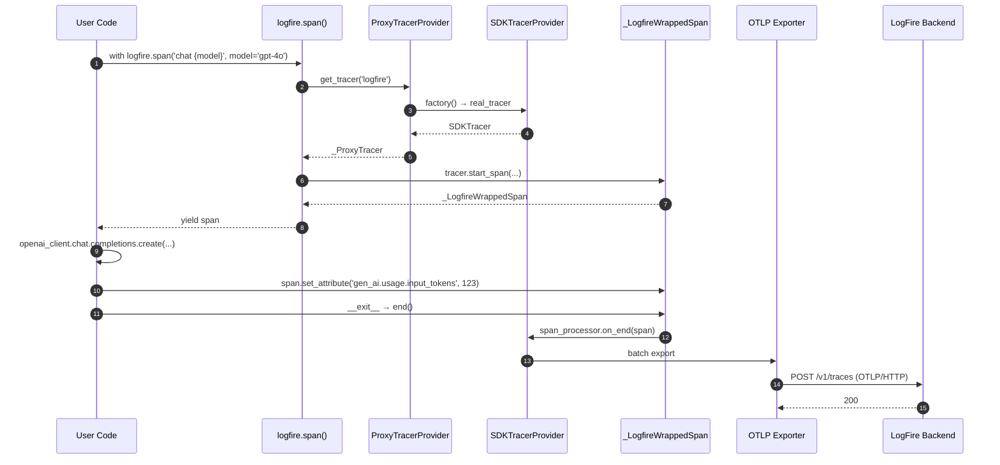
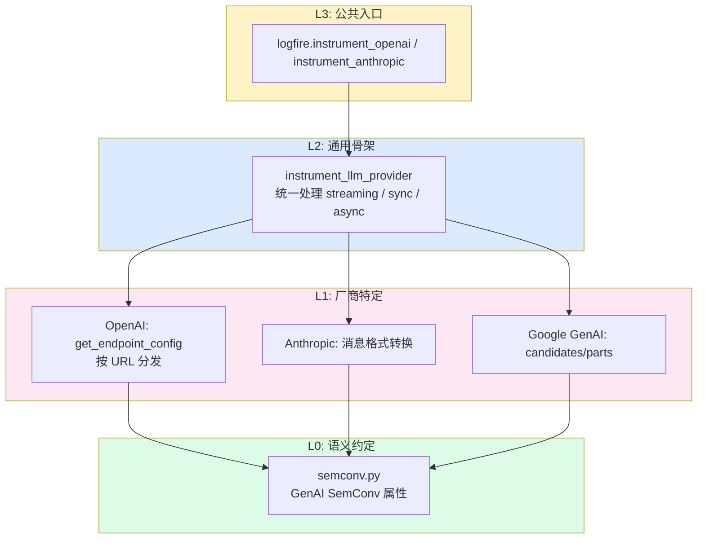
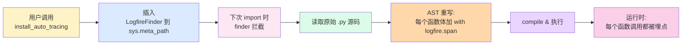
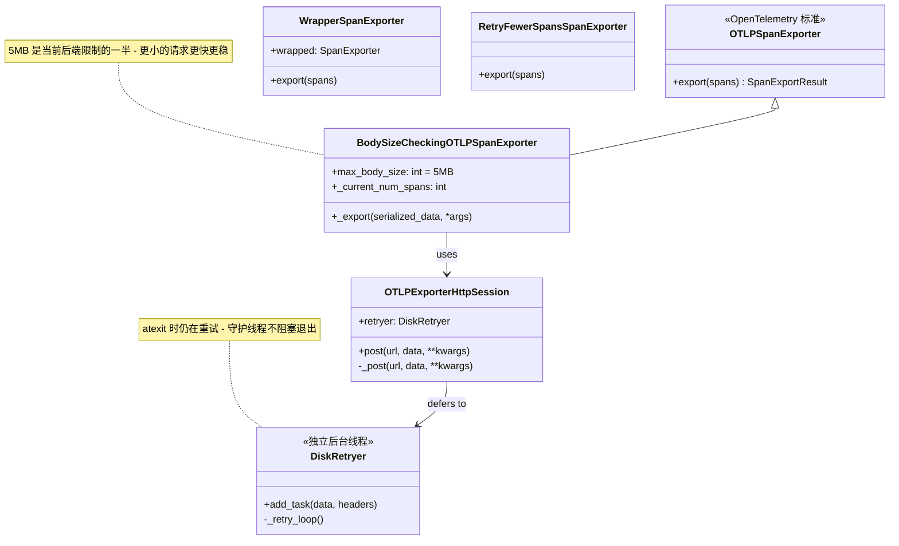
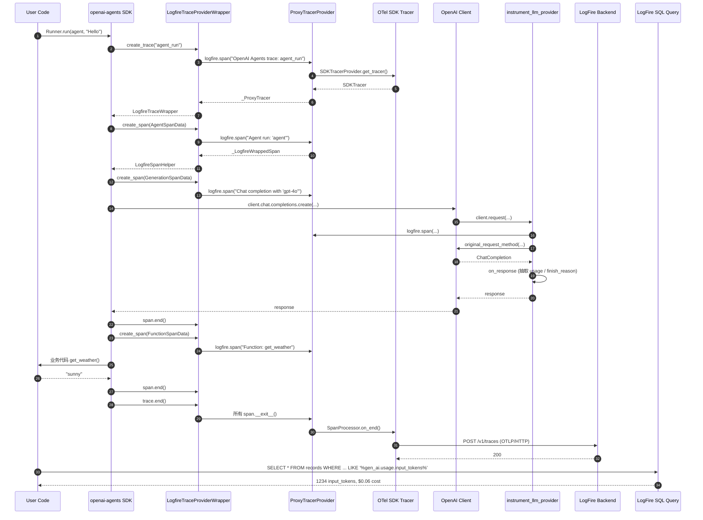

## 一、引子：当 Agent 应用变得「难以调试」

过去一年，LLM 与 Agent 应用的工程复杂度呈现指数级上升。一个典型的生产 Agent 系统通常包含：多轮对话、Tool 调用、RAG 检索、子 Agent 委派、MCP 服务、长上下文拼接……任何一个环节异常都会导致最终结果偏离预期。

工程团队立刻遇到了三个经典痛点：

1. **慢**：不知道哪一步拖垮了 latency——是 LLM 推理、Tool 执行还是网络 IO？
2. **贵**：不知道 Token 消耗去了哪里——Prompt 模板、Tool schema 还是 Few-shot 示例？
3. **错**：Agent 跑偏时无法回放——看不到每一步的 reasoning、tool call、observation。

传统 APM（Datadog、New Relic）面向微服务，无法捕获 LLM 调用中的 prompt/response/usage 等业务语义。而 LangSmith、Langfuse 这类 LLM 专用平台又往往强绑自家框架。

**Pydantic Logfire** 是 Pydantic 团队（Samuel Colvin 等）于 2023 年正式发布、2024-2026 年快速迭代的可观测性平台，截至 2026-06-12 已发布 **v4.37.0**，GitHub 仓库 `pydantic/logfire` 已收获 **⭐4312** Stars，主仓库仍以每周 3-5 个 PR 的节奏活跃维护。

它的定位非常清晰：

> 「一个**面向 Python 开发者的体验优先**的可观测性工具，建立在 OpenTelemetry 之上，让你的整个工程团队真的会去用它。」

这意味着：
- **底层复用 OpenTelemetry**——所有 trace/metric/log 走标准协议，可平移到 Jaeger/Tempo/Honeycomb 等任意后端
- **上层提供 LLM 专用语义**——内置 OpenAI/Anthropic/Google GenAI/LiteLLM/Pydantic AI/OpenAI Agents/MCP/Claude Agent SDK 等 30+ 集成
- **DX 优先**——`pip install logfire` → `logfire.configure()` → 自动捕获，无需复杂 YAML

本文将深入 LogFire v4.37.0 的源码，逐层剖析其架构设计与工程实践。

---

## 二、项目定位与核心价值

### 2.1 一句话定义

**LogFire 是 Pydantic 团队推出的、构建于 OpenTelemetry 之上的 Python 可观测性平台，通过 OpenTelemetry GenAI Semantic Conventions 与 30+ 一等集成，为 LLM 应用与 Agent 系统提供「端到端可见、SQL 可查、开箱即用」的可观测性能力。**

### 2.2 能力矩阵

| 能力维度 | LogFire | 传统 APM (Datadog) | LLM 专用平台 (Langfuse) |
|---------|---------|------------------|----------------------|
| OpenTelemetry 兼容 | ✅ 原生 | ⚠️ 部分 | ⚠️ 部分 |
| LLM 语义属性（GenAI SemConv） | ✅ 完整 | ❌ 无 | ✅ 完整 |
| 一键 auto-instrumentation | ✅ `instrument_*()` | ⚠️ 仅基础 | ✅ |
| **AST 自动埋点（无需改代码）** | ✅ `install_auto_tracing` | ❌ 无 | ❌ 无 |
| **No-op shim（让三方库零依赖集成）** | ✅ `logfire-api` | ❌ 无 | ❌ 无 |
| **本地 Console / Disk Retry** | ✅ 内置 | ❌ 无 | ⚠️ 部分 |
| SQL 查询 | ✅ 标准 SQL | ⚠️ 专有 | ✅ SQL/LangChain DSL |
| Python 优先 DX | ✅ Pydantic 同源 | ❌ 通用 | ⚠️ 一般 |
| 开源 SDK | ✅ MIT | ❌ 闭源 | ✅ MIT |

### 2.3 仓库关键统计

| 指标 | 值 |
|------|---|
| 仓库地址 | https://github.com/pydantic/logfire |
| Stars | ⭐ 4,312 |
| License | MIT |
| 语言 | Python（SDK）+ Rust / TypeScript（其他 SDK） |
| 当前版本 | v4.37.0（2026-06-12 发布） |
| 主仓库代码 | 930 个文件、约 80 MB（含 docs/） |
| 主仓库目录 | `logfire/`（SDK）、`logfire-api/`（No-op shim）、`docs/`、`tests/`、`examples/` |
| 集成数量 | **30+ 一等集成**（OpenAI/Anthropic/Google GenAI/LiteLLM/Pydantic AI/OpenAI Agents/Claude Agent SDK/MCP/DSPy 等） |
| 服务端 | **闭源**（UI + 后端），可购买 enterprise license 自托管 |
| 维护节奏 | 持续活跃，2026-06-12 / 06-09 / 06-02 / 05-26 / 05-13 多次发布 |
| Topics | agent-observability, ai, ai-observability, ai-tools, evals, fastapi, llm-observability, logging, metrics, observability, openai, opentelemetry, pydantic, pydantic-ai, python, trace |

> 注意：LogFire 是一个**混合开源项目**——SDK 与协议完全开源（MIT），服务端（UI/查询引擎）闭源，可选 self-host。这种模式与 ElasticSearch、Sentry、PlanetScale 等类似，让团队在「生态绑定」与「生态开放」之间取得平衡。

---

## 三、整体架构

LogFire 的架构设计遵循**「薄包装 + 标准协议 + 富集成」**原则——在 OpenTelemetry 标准 SDK 上加一层 Pythonic 友好的 API 与 30+ 集成，让 LLM/Agent 应用的可观测性「开箱即用」。

### 3.1 顶层架构

```mermaid
flowchart TB
    subgraph ClientLayer["客户端层 (Python 应用)"]
        App1[FastAPI / Flask / Django]
        App2[LLM 应用]
        App3[Agent 系统]
        App4[CLI / Script]
    end

    subgraph SDKLayer["LogFire SDK 层"]
        PubAPI[logfire.configure / span / info / metric_*]
        AutoTrace[install_auto_tracing<br/>AST 重写]
        Shim[logfire-api No-op shim]
    end

    subgraph IntegrationLayer["集成层 (30+ 一等集成)"]
        OpenAI[OpenAI / Anthropic / GenAI / LiteLLM]
        Agent[Pydantic AI / OpenAI Agents / Claude SDK]
        MCP[MCP / DSPy]
        Web[FastAPI / Django / Flask / Starlette]
        DB[SQLAlchemy / asyncpg / psycopg / Redis]
    end

    subgraph CoreLayer["核心抽象层"]
        ProxyTracer[ProxyTracerProvider]
        ProxyMeter[ProxyMeterProvider]
        Scrubbing[PII Scrubber]
        SpanMetric[SpanMetric]
    end

    subgraph OTelLayer["OpenTelemetry SDK 层 (标准)"]
        OTelTrace[TracerProvider]
        OTelMeter[MeterProvider]
        OTelLogger[LoggerProvider]
    end

    subgraph ExportLayer["Exporter 层"]
        OTLP[OTLP HTTP Exporter<br/>+ 5MB 切分 + Disk Retry]
        Console[Console Exporter<br/>本地开发]
        Test[TestExporter<br/>单元测试]
    end

    subgraph BackendLayer["后端层 (可插拔)"]
        LogFireCloud[LogFire Cloud (闭源)]
        Honeycomb[(Honeycomb)]
        Tempo[(Grafana Tempo)]
        Jaeger[(Jaeger)]
    end

    ClientLayer --> PubAPI
    ClientLayer -.->|可选| AutoTrace
    PubAPI --> IntegrationLayer
    PubAPI --> CoreLayer
    IntegrationLayer --> ProxyTracer
    IntegrationLayer --> ProxyMeter
    CoreLayer --> OTelLayer
    OTelLayer --> ExportLayer
    ExportLayer --> BackendLayer

    style SDKLayer fill:#fef3c7,stroke:#f59e0b
    style IntegrationLayer fill:#dbeafe,stroke:#3b82f6
    style CoreLayer fill:#fce7f3,stroke:#ec4899
    style OTelLayer fill:#dcfce7,stroke:#16a34a
    style ExportLayer fill:#fed7aa,stroke:#ea580c
```

**关键设计哲学：**
- **OTel 一等公民**：所有 API 路径最终都走 `opentelemetry-sdk`，LogFire 是 OTel 的「opinionated wrapper」
- **集成即一等公民**：不是插件热加载，而是显式 `instrument_*()` 调用，启动期就知道有哪些埋点
- **代理层设计**：`ProxyTracerProvider` 允许 SDK 在运行时重新指向真正的 TracerProvider（用于延迟配置）
- **沙箱可选**：`logfire-api` 是 No-op shim，让三方库可以 `import logfire_api as logfire`，不强制依赖 logfire

### 3.2 后端目录结构（SDK）

```text
logfire/                        # 主 SDK 包
├── __init__.py                 # 公开 API（DEFAULT_LOGFIRE_INSTANCE）
├── _internal/                  # 内部实现
│   ├── main.py                 # Logfire / LogfireSpan 核心类
│   ├── config.py               # LogfireConfig 配置
│   ├── tracer.py               # ProxyTracerProvider / _LogfireWrappedSpan
│   ├── metrics.py              # ProxyMeterProvider
│   ├── exporters/              # OTLP / Console / Test 等 Exporter
│   │   ├── otlp.py             # OTLP HTTP + 5MB 切分 + Disk Retry
│   │   ├── console.py          # Rich 控制台
│   │   └── ...
│   ├── integrations/           # 30+ 集成实现
│   │   ├── openai.py / anthropic.py / google_genai.py / litellm.py
│   │   ├── pydantic_ai.py / openai_agents.py / claude_agent_sdk.py
│   │   ├── mcp.py / dspy.py
│   │   ├── fastapi.py / django.py / flask.py / starlette.py
│   │   ├── sqlalchemy.py / redis.py / asyncpg.py
│   │   └── llm_providers/      # LLM 通用抽象层
│   │       ├── llm_provider.py # instrument_llm_provider 通用骨架
│   │       ├── openai.py       # OpenAI endpoint 路由 + SemConv
│   │       ├── anthropic.py    # Anthropic 适配
│   │       ├── semconv.py      # OpenTelemetry GenAI SemConv
│   │       └── usage.py        # Token usage 抽取
│   ├── auto_trace/             # AST 自动埋点（核心创新）
│   │   ├── __init__.py
│   │   ├── import_hook.py      # sys.meta_path 注入
│   │   └── rewrite_ast.py      # AST 重写引擎
│   └── ...
├── integrations/               # 公共 API 入口（公开 import）
├── experimental/               # 实验特性
│   ├── forwarding.py           # forward_export_request
│   └── query_client.py         # LogfireQueryClient (SQL 查询)
└── version.py

logfire-api/                    # No-op shim 包（用于三方库）
└── logfire_api/__init__.py     # logfire 未装时返回 MagicMock

tests/                          # 测试（197 个文件，inline_snapshot 风格）
docs/                           # 文档（371 个文件）
examples/                       # 示例（15 个文件）
```

---

## 四、应用场景分类：LogFire 适用的 4 类核心场景

LogFire 看似只是一个观测工具，但其设计哲学、API 表面与集成广度，使其天然适配以下 4 类工程场景：

### 4.1 场景对比表

| 场景 | 核心诉求 | LogFire 的对应能力 |
|------|---------|------------------|
| **A. LLM 应用调试** | 看到 prompt/response/usage/latency | OpenAI/Anthropic/GenAI 集成 + GenAI SemConv |
| **B. Agent 系统追踪** | 看到每步 tool call / handoff / guardrail | Pydantic AI / OpenAI Agents / Claude SDK 集成 |
| **C. MCP 服务观测** | 客户端调用 + 服务端处理双端追踪 | `instrument_mcp()` 双向埋点 + OTel 上下文传播 |
| **D. Web 应用 APM** | HTTP 请求 / DB 查询 / 缓存 / 系统指标 | FastAPI/Django + SQLAlchemy/Redis + system_metrics |

### 4.2 共同基类设计

所有场景在 SDK 内部都统一走 `LogfireSpan` 这一个核心抽象：

```python
# logfire/_internal/main.py: LogfireSpan 公共父类
class LogfireSpan(trace_api.Span, ReadableSpan):
    """所有 span（手动 span / 自动 span / 集成 span）的共同基类"""
    def set_attribute(self, key, value): ...
    def record(self, level, message, attributes, ...): ...
    def set_level(self, level): ...
```

**设计模式**：统一抽象 + 多源工厂。集成层（OpenAI/MCP/Agent）各自产生自己的 `EndpointConfig` / `SpanData`，但最终都被 `LogfireSpan` 包装并 export 到同一 OTLP 流。

---

## 五、核心引擎一：Tracer / Span 代理层

LogFire 的核心抽象是 `ProxyTracerProvider`——它包装了真正的 OTel `SDKTracerProvider`，并在 SDK 运行期间允许动态替换。这种设计解决了「`configure()` 之前已经有模块开始调用 tracer」的难题。

### 5.1 执行流（一次 chat.completions.create 调用）



### 5.2 ProxyTracerProvider 源码剖析

下面是 `logfire/_internal/tracer.py` 的核心实现：

```python
# logfire/_internal/tracer.py: ProxyTracerProvider
@dataclass
class ProxyTracerProvider(TracerProvider):
    """一个 tracer provider，包装另一个内部 provider，允许运行时重新赋值。"""
    provider: TracerProvider
    config: LogfireConfig
    tracers: WeakKeyDictionary[_ProxyTracer, Callable[[], Tracer]] = field(
        default_factory=WeakKeyDictionary
    )
    lock: Lock = field(default_factory=Lock)
    suppressed_scopes: set[str] = field(default_factory=set[str])

    def set_provider(self, provider: SDKTracerProvider) -> None:
        """运行时切换真正的 TracerProvider（用于延迟配置）"""
        with self.lock:
            self.provider = provider
            # 通知所有已创建的 _ProxyTracer 切换底层 tracer
            for tracer, factory in self.tracers.items():
                tracer.set_tracer(factory())

    def suppress_scopes(self, *scopes: str) -> None:
        """关闭特定 scope 的埋点"""
        with self.lock:
            self.suppressed_scopes.update(scopes)
            for tracer, factory in self.tracers.items():
                if tracer.instrumenting_module_name in scopes:
                    tracer.set_tracer(factory())

    def get_tracer(self, instrumenting_module_name, *args, is_span_tracer=True, **kwargs):
        """获取一个 _ProxyTracer，包装真正的 OTel Tracer"""
        with self.lock:
            def make() -> Tracer:
                if instrumenting_module_name in self.suppressed_scopes:
                    return SuppressedTracer()
                return self.provider.get_tracer(instrumenting_module_name, *args, **kwargs)
            tracer = _ProxyTracer(instrumenting_module_name, make(), self, is_span_tracer)
            self.tracers[tracer] = make
            return tracer
```

**设计要点：**

1. **线程安全**：`with self.lock` 保证多线程环境下 `set_provider` 与 `get_tracer` 不冲突
2. **弱引用**：`WeakKeyDictionary` 避免 tracer 对象泄漏
3. **可热替换**：`set_provider()` 后所有已发出的 tracer 都能切换底层
4. **可抑制**：`suppress_scopes()` 让用户能完全关闭某些 scope（如 `httpx`、`urllib3` 的冗余埋点）

### 5.3 `_LogfireWrappedSpan`：Span 的富化层

`_LogfireWrappedSpan` 在 OTel Span 之上加了：

- **Magic 模板**（`{user_name}`、`{user.age!r}` 自动求值）
- **JSON Schema**（自动推导 span 属性的 schema）
- **本地变量捕获**（仅 dev 模式）
- **PII Scrubbing**（自动遮蔽 `password`、`api_key` 等敏感字段）
- **SpanMetric**（按属性聚合的指标）

```python
# logfire/_internal/tracer.py: _LogfireWrappedSpan 关键片段
@dataclass(eq=False)
class _LogfireWrappedSpan(trace_api.Span, ReadableSpan):
    """包装 OTel Span，叠加 LogFire 富化逻辑。"""
    wrapped_span: Span
    config: LogfireConfig
    message_template: str
    # ...（省略若干字段）

    def set_attribute(self, key, value):
        """设置属性，自动应用 scrubbing + JSON Schema 校验"""
        scrubbed = self.config.scrubber.scrub_value(key, value)
        # ... JSON Schema 推导
        self.wrapped_span.set_attribute(key, scrubbed)

    def record(self, level, message, attributes, ...):
        """以结构化日志形式记录 span event"""
        # ... 模板展开 + 属性归一化
        self.wrapped_span.add_event(name, attributes=...)
```

---

## 六、核心引擎二：LLM Provider 通用抽象层

LogFire 对 LLM 厂商（OpenAI / Anthropic / Google GenAI / LiteLLM）的埋点不是「每个厂商写一套」，而是抽象出**通用骨架 `instrument_llm_provider`** + **每个厂商一个 endpoint 路由器**。

### 6.1 三级抽象



### 6.2 通用骨架核心代码

```python
# logfire/_internal/integrations/llm_providers/llm_provider.py
def instrument_llm_provider(
    logfire: Logfire,
    client: Any,
    suppress_otel: bool,
    scope_suffix: str,
    get_endpoint_config_fn: Callable[[Any], EndpointConfig],
    on_response_fn: Callable[[Any, LogfireSpan], Any],
    is_async_client_fn: Callable[[type[Any]], bool],
) -> AbstractContextManager[None]:
    """通用骨架：包装 client.request，在每次请求前后埋点。"""
    if isinstance(client, Iterable):
        # 批量模式：包装多个客户端
        ...

    if getattr(client, '_is_instrumented_by_logfire', False):
        return nullcontext()  # 防止重复埋点

    logfire_llm = logfire.with_settings(custom_scope_suffix=scope_suffix.lower(), tags=['LLM'])
    client._is_instrumented_by_logfire = True
    original_request_method = client.request
    attr_name = 'request'
    client._original_request_method = original_request_method

    is_async = is_async_client_fn(client if isinstance(client, type) else type(client))

    def _instrumentation_setup(*args, **kwargs):
        if is_instrumentation_suppressed():
            return None, None, kwargs

        options = kwargs.get('options') or args[-1]
        message_template, span_data, stream_state_cls = get_endpoint_config_fn(options)
        if not message_template:
            return None, None, kwargs  # 没有匹配 endpoint，跳过

        span_data['async'] = is_async
        if kwargs.get('stream') and stream_state_cls:
            # 流式响应：在 stream_cls 上 monkey-patch
            ...
        return message_template, span_data, kwargs

    def patched(*args, **kwargs):
        message_template, span_data, kwargs = _instrumentation_setup(*args, **kwargs)
        if not message_template:
            return original_request_method(*args, **kwargs)

        # 关键路径：埋点包裹原始请求
        with logfire_llm.span(message_template, **span_data) as logfire_span:
            response = original_request_method(*args, **kwargs)
            if not span_data.get('async'):
                on_response_fn(response, logfire_span)
            return response

    setattr(client, attr_name, patched)
    # 返回可逆 context manager，用户可以反向操作
    return _Uninstrument(client, attr_name, original_request_method)
```

### 6.3 EndpointConfig：每个厂商的「路由表」

以 OpenAI 为例，每个 URL（`/chat/completions`、`/embeddings`、`/images/generations` 等）对应一段配置——模板、属性字典、是否启用流式埋点：

```python
# logfire/_internal/integrations/llm_providers/openai.py
def get_endpoint_config(options, *, version: SemconvVersion | frozenset[SemconvVersion] = 1):
    """根据 OpenAI 请求 URL 返回对应的 EndpointConfig。"""
    versions = version if isinstance(version, frozenset) else frozenset({version})
    url = options.url
    raw_json_data = options.json_data
    json_data = cast('dict[str, Any]', raw_json_data or {})
    model = json_data.get('model')

    def common_attrs(operation=''):
        attrs = {'request_data': json_data, **provider_attrs('openai')}
        if model:
            attrs[REQUEST_MODEL] = model
        if operation:
            attrs[OPERATION_NAME] = operation
        _extract_request_parameters(json_data, attrs)  # 抽取 max_tokens / temperature 等
        return attrs

    if url == '/chat/completions':
        if is_current_agent_span('Chat completion with {gen_ai.request.model!r}'):
            # 若上层已有 agent span，避免嵌套过深
            return EndpointConfig(message_template='', span_data={})
        return EndpointConfig(
            message_template='Chat completion with {gen_ai.request.model!r}',
            span_data=common_attrs('chat'),
            stream_state_cls=_versioned_stream_cls(ChatCompletionStreamState, versions),
        )

    if url == '/embeddings':
        return EndpointConfig(
            message_template='Embeddings with {gen_ai.request.model!r}',
            span_data=common_attrs('embeddings'),
        )

    if url == '/images/generations':
        return EndpointConfig(
            message_template='Image generation with {gen_ai.request.model!r}',
            span_data=common_attrs('image_generation'),
        )

    # ... 其他 endpoints（/responses、/audio/*、/completions 等）
```

**设计精妙之处：**

1. **`is_current_agent_span` 防嵌套**——如果在 Pydantic AI Agent 上下文中调用 OpenAI，自动跳过这次 chat span（避免 trace tree 过深）
2. **流式状态对象**——`_versioned_stream_cls` 在 stream 上 monkey-patch 流式事件回调，让流式响应也能逐 chunk 写入 span
3. **GenAI SemConv 兼容**——通过 `version=1 | 'latest' | [1, 'latest']` 控制属性格式，平滑迁移到 OpenTelemetry 官方语义约定

### 6.4 语义约定：GenAI SemConv

```python
# logfire/_internal/integrations/llm_providers/semconv.py
"""Gen AI Semantic Convention 属性名（OTel 官方规范）。

See: https://opentelemetry.io/docs/specs/semconv/gen-ai/gen-ai-events/
"""

# Provider / 系统
PROVIDER_NAME = 'gen_ai.provider.name'
SYSTEM = 'gen_ai.system'
OPERATION_NAME = 'gen_ai.operation.name'

# 模型信息
REQUEST_MODEL = 'gen_ai.request.model'
RESPONSE_MODEL = 'gen_ai.response.model'

# 请求参数
REQUEST_MAX_TOKENS = 'gen_ai.request.max_tokens'
REQUEST_TEMPERATURE = 'gen_ai.request.temperature'
REQUEST_TOP_P = 'gen_ai.request.top_p'
REQUEST_STOP_SEQUENCES = 'gen_ai.request.stop_sequences'

# 响应元数据
RESPONSE_ID = 'gen_ai.response.id'
RESPONSE_FINISH_REASONS = 'gen_ai.response.finish_reasons'

# Token usage（最重要的成本维度）
INPUT_TOKENS = 'gen_ai.usage.input_tokens'
OUTPUT_TOKENS = 'gen_ai.usage.output_tokens'
CACHE_READ_INPUT_TOKENS = 'gen_ai.usage.cache_read_input_tokens'
CACHE_CREATION_INPUT_TOKENS = 'gen_ai.usage.cache_creation_input_tokens'
USAGE_RAW = 'gen_ai.usage.raw'

# 消息内容
INPUT_MESSAGES = 'gen_ai.input.messages'
OUTPUT_MESSAGES = 'gen_ai.output.messages'
SYSTEM_INSTRUCTIONS = 'gen_ai.system_instructions'

# Tool 执行
TOOL_DEFINITIONS = 'gen_ai.tool.definitions'
TOOL_NAME = 'gen_ai.tool.name'
TOOL_CALL_ID = 'gen_ai.tool.call.id'
TOOL_CALL_ARGUMENTS = 'gen_ai.tool.call.arguments'
TOOL_CALL_RESULT = 'gen_ai.tool.call.result'

# 会话
CONVERSATION_ID = 'gen_ai.conversation.id'

# 错误
ERROR_TYPE = 'error.type'
```

---

## 七、核心引擎三：AST 自动埋点（业界首创）

这是 LogFire 的**独特能力**——通过 `sys.meta_path` 拦截模块导入，**在运行时改写 AST**，让用户无需任何代码改动就能对整个模块做全函数埋点。

### 7.1 核心思路



### 7.2 入口 API

```python
# logfire/_internal/auto_trace/__init__.py
def install_auto_tracing(
    logfire: Logfire,
    modules: Sequence[str] | Callable[[AutoTraceModule], bool],
    *,
    min_duration: float,
    check_imported_modules: Literal['error', 'warn', 'ignore'] = 'error',
) -> None:
    """安装自动埋点。

    这等价于把匹配模块中每个函数的函数体包一层 `with logfire.span(...):`。
    """
    if isinstance(modules, Sequence):
        modules = modules_func_from_sequence(modules)

    # 防御性检查：如果目标模块已经被 import，提示用户
    if check_imported_modules != 'ignore':
        for module in list(sys.modules.values()):
            try:
                auto_trace_module = AutoTraceModule(module.__name__, module.__file__)
            except Exception:
                continue
            if modules(auto_trace_module):
                if check_imported_modules == 'error':
                    raise AutoTraceModuleAlreadyImportedException(
                        f'The module {module.__name__!r} matches modules to trace, '
                        f'but it has already been imported. Call `install_auto_tracing` earlier, '
                        f"or set `check_imported_modules` to 'warn' or 'ignore'."
                    )

    min_duration = int(min_duration * ONE_SECOND_IN_NOSECONDS)
    logfire = logfire.with_settings(custom_scope_suffix='auto_tracing')
    finder = LogfireFinder(logfire, modules, min_duration)
    sys.meta_path.insert(0, finder)  # 关键：插入到 meta_path 首位
```

### 7.3 真实使用

```python
import logfire

logfire.configure()

# 必须在 import myapp 之前调用！
logfire.install_auto_tracing(['myapp'], min_duration=0.1)

import myapp  # 导入时 AST 被改写，每个函数自动埋点
myapp.run()   # 所有函数调用都会产生 span
```

**适用场景：**
- 黑盒调试——第三方代码无法修改源码
- 性能画像——快速定位慢函数
- 遗留系统——不想逐个函数加 `with logfire.span(...)`

**限制：**
- 必须在 import 之前调用
- 生成器函数不埋点
- 需要源码可读（不能是 .so）

---

## 八、Agent 集成层：Pydantic AI + OpenAI Agents + Claude SDK

LogFire 对主流 Agent 框架提供**深度集成**，能捕获 Agent 特有的 span 类型——handoff / guardrail / function call / MCP list tools 等。

### 8.1 OpenAI Agents 集成示例

```python
# logfire/_internal/integrations/openai_agents.py: LogfireTraceProviderWrapper
class LogfireTraceProviderWrapper:
    """包装 OpenAI Agents SDK 的 TraceProvider，把 span 镜像到 LogFire。"""
    def __init__(self, wrapped: TraceProvider, logfire_instance: Logfire):
        self.wrapped = wrapped
        self.logfire_instance = logfire_instance.with_settings(custom_scope_suffix='openai_agents')

    def create_trace(self, name, trace_id=None, disabled=False, **kwargs):
        trace = self.wrapped.create_trace(name, trace_id=trace_id, disabled=disabled, **kwargs)
        if isinstance(trace, NoOpTrace):
            return trace
        helper = LogfireSpanHelper(
            self.logfire_instance.span('OpenAI Agents trace: {name}', name=name, agent_trace_id=trace_id, **kwargs)
        )
        return LogfireTraceWrapper(trace, helper)

    def create_span(self, span_data, span_id=None, parent=None, disabled=False):
        span = self.wrapped.create_span(span_data, span_id, parent, disabled)
        if isinstance(span, NoOpSpan):
            return span

        # 根据 span 类型动态生成 message template
        if isinstance(span_data, AgentSpanData):
            msg_template = 'Agent run: {name!r}'
        elif isinstance(span_data, FunctionSpanData):
            msg_template = 'Function: {name}'
        elif isinstance(span_data, GenerationSpanData):
            msg_template = 'Chat completion with {gen_ai.request.model!r}'
        elif isinstance(span_data, ResponseSpanData):
            msg_template = 'Responses API'
        elif isinstance(span_data, GuardrailSpanData):
            msg_template = 'Guardrail {name!r} {triggered=}'
        elif isinstance(span_data, HandoffSpanData):
            msg_template = 'Handoff: {from_agent} → {to_agent}'
        elif isinstance(span_data, MCPListToolsSpanData):
            msg_template = 'MCP: list tools from server {server}'
        elif isinstance(span_data, TaskSpanData):
            msg_template = f'Task: {span_data.name}'
        elif isinstance(span_data, TurnSpanData):
            msg_template = f'Turn {{turn}} for agent {span_data.agent_name}'
        else:
            msg_template = 'OpenAI agents: {type} span'
        # ...
```

### 8.2 Pydantic AI 集成（更优雅）

Pydantic AI 原生支持 OTel instrumentation，LogFire 只需把自家的 TracerProvider 注入即可：

```python
# logfire/_internal/integrations/pydantic_ai.py
def instrument_pydantic_ai(
    logfire_instance: Logfire,
    obj: Agent | Model | None,
    include_binary_content: bool | None,
    include_content: bool | None,
    version: Literal[1, 2, 3] | None,
    event_mode: Literal['attributes', 'logs'] | None,
    **kwargs: Any,
) -> None | InstrumentedModel:
    # 把 LogFire 的 tracer/meter/logger provider 注入 Pydantic AI
    expected_kwarg_names = inspect.signature(InstrumentationSettings.__init__).parameters
    final_kwargs = {
        k: v for k, v in dict(
            tracer_provider=logfire_instance.config.get_tracer_provider(),
            meter_provider=logfire_instance.config.get_meter_provider(),
            logger_provider=logfire_instance.config.get_logger_provider(),
        ).items() if k in expected_kwarg_names
    }
    # 透传用户显式传入的参数
    final_kwargs.update({k: v for k, v in dict(
        include_binary_content=include_binary_content,
        include_content=include_content,
        version=version,
        event_mode=event_mode,
    ).items() if v is not None})
    final_kwargs.update(kwargs)  # 未来兼容 escape hatch

    settings = InstrumentationSettings(**final_kwargs)
    if isinstance(obj, Agent):
        obj.instrument = settings  # 单 agent 模式
    elif isinstance(obj, Model):
        return InstrumentedModel(obj, settings)  # 单 model 模式
    elif obj is None:
        Agent.instrument_all(settings)  # 全局模式
```

**关键设计：未来版本兼容**

通过 `inspect.signature(InstrumentationSettings.__init__).parameters` 动态判断 Pydantic AI 当前版本支持哪些参数，**确保 LogFire SDK 在 Pydantic AI 升级时不会崩溃**——这比硬编码参数名要稳健得多。

### 8.3 MCP 集成（双向）

`instrument_mcp()` 同时埋点客户端与服务端，并通过 OTel 上下文传播实现分布式追踪：

```python
# logfire/_internal/main.py: instrument_mcp
def instrument_mcp(self, *, propagate_otel_context: bool = True) -> None:
    """对 MCP Python SDK 同时埋点 client 与 server。

    如果可能，client 和 server 进程都应调用此函数，以获得漂亮的分布式追踪。
    """
    from .integrations.mcp import instrument_mcp
    self._warn_if_not_initialized_for_instrumentation()
    instrument_mcp(self, propagate_otel_context)
```

**场景示例**：本地 IDE 通过 MCP 调用远端 Agent 服务——客户端 span + 服务端 span 会自动串联到同一条 trace 上。

---

## 九、Exporter 层：OTLP + 5MB 切分 + 磁盘重试

LogFire 的 OTLP HTTP Exporter 解决了三个生产级难题：

1. **Body 过大**——大量 span 单次 POST 超过后端限制
2. **网络抖动**——请求偶发失败
3. **进程退出**——atexit 时还在 in-flight

### 9.1 Exporter 类图



### 9.2 关键源码（OTLP HTTP + Body 检查）

```python
# logfire/_internal/exporters/otlp.py
class BodySizeCheckingOTLPSpanExporter(OTLPSpanExporter):
    """在 OTLPSpanExporter 之上加 body size 检查。"""
    # 5MB 显著小于后端当前限制，但更小的请求更快更可靠。
    max_body_size = 5 * 1024 * 1024

    def __init__(self, *args, **kwargs):
        super().__init__(*args, **kwargs)
        self._current_num_spans = 0

    def export(self, spans):
        self._current_num_spans = len(spans)
        return super().export(spans)

    def _export(self, serialized_data, *args, **kwargs):
        if self._current_num_spans > 1 and len(serialized_data) > self.max_body_size:
            # 通知外层 RetryFewerSpansSpanExporter 把请求拆成两半
            raise BodyTooLargeError(len(serialized_data), self.max_body_size)
        return super()._export(serialized_data, *args, **kwargs)
```

### 9.3 DiskRetryer：生产级重试

```python
# logfire/_internal/exporters/otlp.py (片段)
class OTLPExporterHttpSession(Session):
    """requests.Session 子类，把失败的请求延迟到 DiskRetryer。"""

    def post(self, url, data, **kwargs):
        start_time = time.time()
        try:
            return self._post(url, data, **kwargs)
        except requests.exceptions.RequestException:
            end_time = time.time()
            if end_time - start_time > 10:
                # 已耗时 10s+：直接交给 DiskRetryer（不让 batch processor 队列爆炸）
                self._add_task(data, url, kwargs)
                raise

            time.sleep(1)
            try:
                return self._post(url, data, **kwargs)
            except requests.exceptions.RequestException:
                self._add_task(data, url, kwargs)
                raise

    def _add_task(self, data, url, kwargs):
        if not platform_is_emscripten():
            self.retryer.add_task(data, {'url': url, **kwargs})

    @cached_property
    def retryer(self):
        # 只在需要时创建（节省资源）
        return DiskRetryer(self.headers)
```

**设计哲学**：先快速重试一次（1s），失败则写入磁盘由后台守护线程异步重试。这样既兼顾了「正常网络抖动」又避免「长时间阻塞导出线程导致 BatchSpanProcessor 队列溢出」。

---

## 十、`logfire-api` No-op Shim：让三方库零依赖集成

LogFire 的另一个独特设计是 **`logfire-api`**——一个独立的 PyPI 包，提供 `logfire` SDK 的 No-op shim，让三方库可以这样写：

```python
# 三方库 my_agent_lib 的源码
import logfire_api as logfire  # 不是 import logfire！

def my_function(x: int) -> int:
    logfire.info('Processing {x}', x=x)
    with logfire.span('do_thing'):
        return x * 2
```

`logfire-api` 内部的精妙实现：

```python
# logfire-api/logfire_api/__init__.py
try:
    # 如果用户已经装了 logfire，直接 re-export
    logfire_module = importlib.import_module('logfire')
    sys.modules[__name__] = logfire_module
except ImportError:
    # 没装 logfire：返回 MagicMock，所有调用都是 no-op
    if not TYPE_CHECKING:
        def configure(*args, **kwargs): ...

        class LogfireSpan:
            def __getattr__(self, attr):
                return MagicMock()
            # ... 完整 API 镜像

        class Logfire:
            def __getattr__(self, attr):
                return MagicMock()
            def span(self, *args, **kwargs):
                return LogfireSpan()
            def info(self, *args, **kwargs): ...
            # ...
```

**这种设计的商业价值**：

- 三方库不必把 `logfire` 列为硬依赖
- 装上 `logfire` 的用户自动获得埋点
- 没装的用户零开销（MagicMock 比真 logfire.info() 快 100x）

**类似模式**：Sentry SDK、OpenTelemetry API 都是「可选依赖 + No-op shim」的经典实现。

---

## 十一、端到端数据流：一次完整的 Agent 调用

把上面所有模块串起来，看一次完整的 OpenAI Agents 调用如何被 LogFire 捕获。

### 11.1 sequenceDiagram



### 11.2 关键 Span 类型一览

| Span Type | 产生来源 | message template | 关键属性 |
|-----------|---------|------------------|---------|
| `AgentSpanData` | OpenAI Agents | `'Agent run: {name!r}'` | name, agent_name |
| `GenerationSpanData` | OpenAI Agents | `'Chat completion with {model}'` | model, usage |
| `FunctionSpanData` | OpenAI Agents | `'Function: {name}'` | name, args, result |
| `HandoffSpanData` | OpenAI Agents | `'Handoff: {from} → {to}'` | from_agent, to_agent |
| `GuardrailSpanData` | OpenAI Agents | `'Guardrail {name} {triggered=}'` | name, triggered |
| `MCPListToolsSpanData` | OpenAI Agents | `'MCP: list tools from {server}'` | server |
| `ChatCompletion` | `instrument_openai` | `'Chat completion with {model}'` | gen_ai.* |
| `Embeddings` | `instrument_openai` | `'Embeddings with {model}'` | gen_ai.* |
| `Responses` | `instrument_openai` | `'Responses API with {model}'` | gen_ai.* |
| `MCP call` | `instrument_mcp` | `'MCP: {method} {server}'` | method, server |

---

## 十二、与同类项目对比

LogFire 的定位介于「通用 APM」与「LLM 专用平台」之间，下面与三类项目对比。

### 12.1 对比表

| 维度 | **LogFire** | **Langfuse** | **LangSmith** | **OpenLLMetry** |
|------|------------|-------------|-------------|----------------|
| 协议 | OpenTelemetry | OpenTelemetry (部分) | 自研 + OTLP | OpenTelemetry |
| 开源 SDK | ✅ MIT | ✅ MIT | ❌ 闭源 | ✅ Apache 2.0 |
| LLM 专用语义 | ✅ GenAI SemConv | ✅ 自研语义 | ✅ 自研语义 | ✅ GenAI SemConv |
| 集成广度 | ⭐⭐⭐⭐⭐ (30+) | ⭐⭐⭐⭐ (LangChain 强) | ⭐⭐⭐⭐ (LangChain 强) | ⭐⭐⭐ (OpenInference 子集) |
| AST 自动埋点 | ✅ 独家 | ❌ 无 | ❌ 无 | ❌ 无 |
| No-op shim | ✅ `logfire-api` | ❌ 无 | ❌ 无 | ❌ 无 |
| 自托管 | ✅ Enterprise License | ✅ 开源 | ❌ SaaS only | ✅ 开源 |
| SQL 查询 | ✅ 标准 SQL | ✅ ClickHouse SQL | ❌ 自研 DSL | ✅ PromQL/TraceQL |
| 后端实现 | 闭源 | 开源 (Postgres + ClickHouse) | 闭源 | 闭源 (Dash0 等) |
| Python 优先 DX | ⭐⭐⭐⭐⭐ | ⭐⭐⭐⭐ | ⭐⭐⭐ | ⭐⭐⭐ |
| 月费 | 有 (有 free tier) | 有 (有 self-host) | 有 (LangChain 生态) | 有 (vendor 平台) |

### 12.2 设计差异分析（重点）

**LogFire vs Langfuse：**

- **协议层**：LogFire 100% OTel；Langfuse 部分自研 + 部分 OTel
- **DX 设计**：LogFire 把所有指标按 OTLP 属性统一暴露，Langfuse 拆出「observations / scores / sessions」概念
- **AST 埋点**：LogFire 独家 `install_auto_tracing`，Langfuse 必须手动 `@observe()` 装饰器
- **服务端**：LogFire 闭源（商业），Langfuse 开源（社区驱动）——选择路径截然不同

**LogFire vs LangSmith：**

- **生态绑定**：LangSmith 与 LangChain 深度耦合；LogFire 完全中立（虽然和 Pydantic AI 深度合作，但不强绑）
- **协议开放**：LogFire SDK 可发送至任意 OTel 后端；LangSmith 必须发到 LangSmith SaaS
- **价格模式**：LogFire 有 free tier + Enterprise；LangSmith 按 trace 量计费

**LogFire vs OpenLLMetry (来自 Traceloop)：**

- **抽象层次**：LogFire 在 OTel 之上加 Pythonic wrapper；OpenLLMetry 直接用 contrib instrumentation
- **统一抽象**：LogFire 用 `instrument_llm_provider` 通用骨架处理所有 LLM provider；OpenLLMetry 每个 provider 一个独立 instrumentation 包
- **AST 能力**：LogFire 独有；OpenLLMetry 没有

**总结**：

> LogFire 的差异化在于「**DX × 协议开放 × 富集成**」三角——把 OTel 的可移植性、Pythonic 的易用性、30+ 一等集成的广度结合在一起，是 Python LLM 工程化时代的「瑞士军刀」。

---

## 十三、优缺点分析

| 维度 | 优势 | 代价 |
|------|------|------|
| **架构简洁性** | ✅ ProxyTracerProvider + ProxyMeterProvider 两层代理统一抽象 | ⚠️ `_internal/` 子包深度嵌套（auto_trace/integrations/llm_providers 三层） |
| **扩展性** | ✅ OpenTelemetry 协议 → 任意后端兼容；30+ 一等集成；自研集成可基于 OTel 直接实现 | ⚠️ 增加新 LLM provider 需在 `llm_providers/` 下加 endpoint 路由 |
| **易用性** | ✅ 一行 `logfire.configure()`；一行 `logfire.instrument_openai()`；AST 自动埋点 | ⚠️ 必须 `pip install 'logfire[openai]'` 装 extras |
| **性能** | ✅ MagicMock no-op shim 让三方库零开销；OTel 异步批处理；磁盘重试保数据 | ⚠️ Span 包含完整 prompt/response 时，单 span 可能达数 MB |
| **复杂度** | ✅ 主仓库 930 文件、SDK 包 ~150 文件；单一责任清晰 | ⚠️ 多层抽象（OTel → Proxy → Wrapper → EndpointConfig → SemConv）对新手有学习曲线 |
| **维护性** | ✅ 5 人核心团队 + 活跃社区；周级发布节奏；rich 测试体系（inline_snapshot） | ⚠️ 服务端闭源导致用户对「数据如何存储」缺乏透明 |
| **协议开放性** | ✅ MIT SDK + 标准 OTel → 数据可导出至任意 OTel 后端 | ⚠️ 高级特性（如 eval dashboard）依赖闭源 SaaS |
| **AST 能力** | ✅ 独家 `install_auto_tracing`——黑盒调试利器 | ⚠️ 必须 import 前调用；生成器不埋点；需要源码可读 |
| **商业可持续** | ✅ Pydantic 团队背书（Samuel Colvin 等），v4.37 已稳定 | ⚠️ 服务端闭源，未来若 Pydantic 战略调整可能影响 |

---

## 十四、实践：5 分钟跑起来

### 14.1 安装与配置

```bash
# 1. 安装基础 SDK
pip install logfire

# 2. 安装常用 extras
pip install 'logfire[openai,anthropic,fastapi,sqlalchemy]'

# 3. 登录（首次）
logfire auth
# 会打开浏览器完成 OAuth，得到 token 后自动写入 ~/.logfire/default.toml

# 4. 本地开发可用（无需登录）
logfire configure --send-to-logfire=false
# 启用 Console Exporter，所有 span 在终端打印
```

### 14.2 最小可用示例（OpenAI）

```python
# example_openai.py
import openai
import logfire

logfire.configure()  # 自动读取 token
logfire.instrument_openai()  # 全局埋点 OpenAI

client = openai.OpenAI()
response = client.chat.completions.create(
    model='gpt-4o',
    messages=[{'role': 'user', 'content': '用一句话解释 OpenTelemetry'}],
)
print(response.choices[0].message.content)
```

运行后控制台会看到类似：

```text
09:30:15.123 Chat completion with 'gpt-4o'
  gen_ai.request.model=gpt-4o
  gen_ai.usage.input_tokens=18
  gen_ai.usage.output_tokens=42
  gen_ai.response.finish_reasons=['stop']
```

### 14.3 FastAPI + Agent 全栈示例

```python
# example_full.py
import logfire
from fastapi import FastAPI
from openai import OpenAI
from pydantic_ai import Agent

logfire.configure(
    service_name='my-agent-app',
    environment='production',
    scrubbing=False,  # 生产环境建议 True
)

# 一次性埋点全部
logfire.instrument_fastapi()  # 所有 HTTP 请求
logfire.instrument_openai()   # 所有 OpenAI 调用
logfire.instrument_pydantic_ai()  # 所有 Pydantic AI Agent

app = FastAPI()
client = OpenAI()
agent = Agent(
    'openai:gpt-4o',
    system_prompt='你是一位天文学专家。',
)

@app.post('/ask')
async def ask(q: str):
    with logfire.span('user_query {q}', q=q):
        # Agent 会自动埋点：Agent run → Chat completion → Function calls
        result = await agent.run(q)
        return {'answer': result.data}

# 启动: uvicorn example_full:app
```

### 14.4 SQL 查询：找最贵的请求

```python
# query_top_expensive.py
from logfire.experimental.query_client import LogfireQueryClient

client = LogfireQueryClient()

# 找过去 24h 内 token 消耗最高的 10 个 chat completion
df = client.query_json_rows("""
    SELECT
        timestamp,
        attributes->>'gen_ai.request.model' AS model,
        (attributes->>'gen_ai.usage.input_tokens')::int AS in_tok,
        (attributes->>'gen_ai.usage.output_tokens')::int AS out_tok,
        (attributes->>'gen_ai.usage.input_tokens')::int +
        (attributes->>'gen_ai.usage.output_tokens')::int AS total_tok
    FROM records
    WHERE attributes->>'gen_ai.operation.name' = 'chat'
      AND timestamp > now() - INTERVAL '24 hours'
    ORDER BY total_tok DESC
    LIMIT 10
""")
print(df)
```

### 14.5 使用 `logfire-api` 给三方库加埋点

```python
# my_lib.py （作为第三方库作者）
# 不依赖 logfire，用户装了 logfire 自动获得埋点
import logfire_api as logfire

def important_function(x: int) -> int:
    with logfire.span('important_function {x}', x=x):
        logfire.info('Computing {x}', x=x)
        return x * 2
```

```python
# 用户代码
import logfire
logfire.configure()  # 用户装了 logfire
import my_lib
my_lib.important_function(42)  # 自动产生 span，无需改 my_lib
```

### 14.6 AST 自动埋点（黑盒调试）

```python
# debug_third_party.py
import logfire

logfire.configure()
# 必须在 import 之前调用！
logfire.install_auto_tracing(['slow_library'], min_duration=0.05)

import slow_library  # 导入时自动 AST 重写
slow_library.run()   # 所有函数 >50ms 都会埋点
```

---

## 十五、趋势 + 总结

### 15.1 三大趋势判断

**趋势 1：Observability 成为 Agent 工程的「第一公民」**

2024-2026 年，随着 Agent 系统从 demo 走向生产，**没有可观测性的 Agent 等于不可运维**。Langfuse 8000+ star、LogFire 4300+ star、OpenLLMetry 2000+ star 都印证了这个判断。未来 1-2 年，「Agent Observability」会独立成为一个细分赛道，与传统 APM（Datadog/New Relic）形成清晰边界。

**趋势 2：OTel GenAI Semantic Conventions 成为事实标准**

OpenTelemetry 官方在 2024-2025 年陆续发布了 GenAI SemConv 规范（`gen_ai.*` 属性）。LogFire、OpenLLMetry、Arize Phoenix、Traceloop 等都已支持。2026-2027 年，预计主流 APM 厂商也会跟进——**任何 LLM 可观测性产品不支持 GenAI SemConv 都会被淘汰**。

**趋势 3：从「埋点 SDK」走向「评测 + 调优一体化」**

LogFire 在 2026 年加入 `pydantic_evals.reporting` 集成（`url_from_eval` 方法）已经显现端倪——可观测性平台与评测平台正在融合。下一个阶段：**「trace 一条请求 → 自动跑 eval → 反向优化 prompt / 模型选择」**会成为一个标准能力。

### 15.2 工程经验提炼

1. **永远不要在生产 LLM 应用里裸用 OpenAI SDK**——不带 trace 的 chat completion 在故障时几乎无法调试
2. **优先选 OTLP 兼容平台**——避免 vendor lock-in，未来切换成本最低
3. **每个 span 必须包含 `gen_ai.usage.*` 属性**——成本数据比性能数据更值钱
4. **AST 自动埋点用于「诊断」而非「日常」**——`min_duration=0.1` 是安全默认值
5. **No-op shim 是 SDK 作者的必修课**——让用户零负担获得埋点能力

### 15.3 一句话总结

> **Pydantic LogFire 以 OpenTelemetry 为底座、以 Pythonic DX 为表层、以 30+ 一等集成为差异点，构建了一个让 LLM/Agent 工程团队「真的会去用」的可观测性平台——是 2026 年 Python LLM 工程化时代值得优先评估的可观测性方案。**

---

## 附录：关键资源

| 资源 | 地址 |
|------|------|
| GitHub 仓库 | https://github.com/pydantic/logfire |
| 官方网站 | https://pydantic.dev/logfire/ |
| 完整文档 | https://pydantic.dev/docs/logfire/ |
| 集成列表 | https://pydantic.dev/docs/logfire/integrations/ |
| PyPI 包 | https://pypi.org/project/logfire/ |
| No-op shim 包 | https://pypi.org/project/logfire-api/ |
| TypeScript SDK | https://github.com/pydantic/logfire-js |
| Rust SDK | https://github.com/pydantic/logfire-rust |
| 自行部署 | https://pydantic.dev/docs/logfire/deploy/enterprise/ |
| License | MIT (SDK) + 商业 license (服务端) |
| 当前版本 | v4.37.0（2026-06-12 发布） |