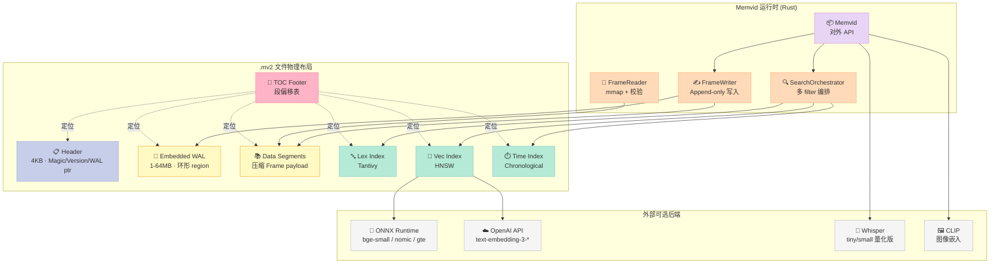
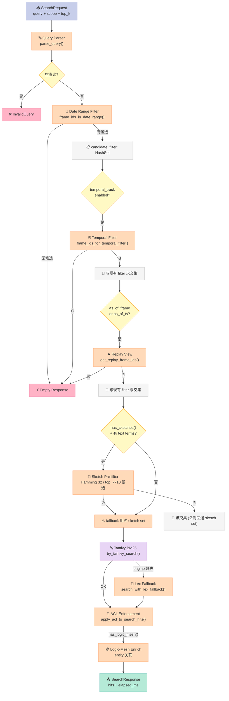
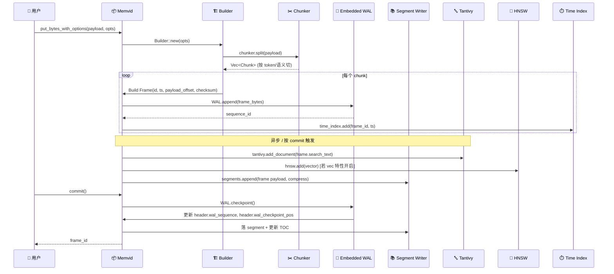

> 一份 `.mv2` 文件 = 整个 AI Agent 的长期记忆——文本、嵌入、全文索引、时间索引、加密、WAL 全部内嵌，零 sidecar。

## 前言

当你给一个 LLM Agent 配长期记忆时，传统方案往往是这样的组合拳：Postgres 存元数据、FAISS/Qdrant 存向量、Tantivy/Lucene 存全文、对象存储存原文，再加上一堆 `.wal`/`.lock`/`.shm` 侧车文件。**Memvid v2** 的目标就一句话——把这堆东西压成一个文件，能像 SQLite 那样 `cp` 着走。

截至 2026 年 6 月，这个由 Rust 编写、Python/Node/CLI 多 SDK 的项目在 GitHub 拿到了 **15.7k ⭐**，官方 benchmark 里 LoCoMo 长程对话召回 **+35% SOTA**、多跳推理 **+76%**、P99 延迟 **0.075ms**。这组数字背后到底是什么样的架构？本文就把它拆开。

读完之后你能拿到：
- `.mv2` 文件的 7 段物理布局是怎么设计的
- "Smart Frame" 这个不可变单元为什么借鉴了视频编码思路
- 嵌入式 WAL 如何做到单文件 crash-safe
- `search()` 入口的 4 层 candidate filter 是怎么把延迟压到亚毫秒的
- 它和 Mem0、Letta、Cognee 这类 Agent 记忆方案的本质设计差异

## 一、Memvid 是什么

**Memvid** 是一个把 AI Agent 持久化记忆所需的全部数据结构（原始文本 + 嵌入向量 + 全文索引 + 时间索引 + 元数据 + 校验和 + 可选加密 + WAL）打包进单一 `.mv2` 文件的 Rust 引擎。它的核心卖点不是某个独立算法，而是一种"**单文件、自描述、可 time-travel**"的容器思路。

### 1.1 关键能力一览

| 能力 | 实现机制 | 性能指标 |
|---|---|---|
| 全文本检索 | 内嵌 Tantivy (BM25) | 与独立 Tantivy 一致 |
| 向量检索 | 内嵌 HNSW (可选 `vec` 特性) | P50 0.025ms / P99 0.075ms |
| 时间检索 | 自定义 time index + chrono | "last Tuesday" 类自然语言查询 |
| 多模态 | CLIP 图像嵌入 + Whisper 转写 | feature flag 控制 |
| Crash safety | 内嵌 WAL (1-64MB) | region 写满自动 grow |
| 加密 | `.mv2e` 加密胶囊 (AES-GCM) | password-based |
| Time-travel | Frame-level 时间戳 + 不可变追加 | 可查询 `as_of_frame` / `as_of_ts` |
| Time-line | BTreeMap-backed 时间线 | reverse chronological browse |

### 1.2 跑得起来的最短代码

下面这段来自 `examples/basic_usage.rs`，不省略一行：

```rust
use memvid_core::{Memvid, PutOptions, Result, SearchRequest, TimelineQuery};

fn main() -> Result<()> {
    // 1. CREATE — 一个文件就是一整个 memory
    let mut mem = Memvid::create("knowledge.mv2")?;

    // 2. PUT — 追加不可变 Smart Frame
    let opts = PutOptions::builder()
        .title("Meeting Notes")
        .uri("mv2://meetings/2024-01-15")
        .tag("project", "alpha")
        .build();
    mem.put_bytes_with_options(b"Q4 planning discussion...", opts)?;
    mem.commit()?;  // 触发 checkpoint，把 pending WAL 落到 segment

    // 3. SEARCH — 关键词 + scope + 时间过滤一锅出
    let resp = mem.search(SearchRequest {
        query: "planning".into(),
        top_k: 10,
        snippet_chars: 200,
        scope: Some("mv2://meetings/".into()),
        ..Default::default()
    })?;
    for hit in resp.hits {
        println!("{}: {}", hit.title.unwrap_or_default(), hit.text);
    }

    // 4. TIMELINE — 像翻朋友圈一样翻 memory
    let tl = mem.timeline(TimelineQuery::default())?;
    for entry in tl {
        println!("[{}] {}", entry.frame_id, entry.preview);
    }
    Ok(())
}
```

读完你会发现：**API 表面就 4 个动词**——`create / put / search / timeline`。其余所有高级能力（向量、ACL、加密、time-travel）都是通过 feature flag 暴露的内部开关。

## 二、文件格式：7 段物理布局

`.mv2` 是 Memvid 自定义的容器格式，物理结构如下（README 原图）：

```
┌────────────────────────────┐
│ Header (4KB)               │  Magic, version, capacity
├────────────────────────────┤
│ Embedded WAL (1-64MB)      │  Crash recovery
├────────────────────────────┤
│ Data Segments              │  Compressed frames
├────────────────────────────┤
│ Lex Index                  │  Tantivy full-text
├────────────────────────────┤
│ Vec Index                  │  HNSW vectors
├────────────────────────────┤
│ Time Index                 │  Chronological ordering
├────────────────────────────┤
│ TOC (Footer)               │  Segment offsets
└────────────────────────────┘
```

### 2.1 为什么是 "Smart Frame" 而非 "Document"

传统向量数据库的最小存储单位是 "chunk + embedding"。Memvid 引入了 **Smart Frame** 概念，这是它和 Mem0/Letta/Cognee 最本质的设计分歧：

```rust
// src/types/frame.rs 截选
pub struct Frame {
    pub id: FrameId,
    pub timestamp: i64,           // 写入时刻
    pub anchor_ts: Option<i64>,   // 内容时间（如邮件发送时间，可手动锚定）
    pub anchor_source: Option<AnchorSource>,  // Explicit / Metadata / IngestionClock
    pub payload_offset: u64,      // 在 .mv2 文件中的物理偏移
    pub payload_length: u64,
    pub checksum: [u8; 32],       // SHA-256 内容校验
    pub uri: Option<String>,      // 虚拟 URI, 支持 mv2://scope/
    pub title: Option<String>,
    pub canonical_encoding: CanonicalEncoding,
    pub metadata: Option<DocMetadata>,
    pub search_text: Option<String>,  // 抽取的 search-friendly 文本
    pub tags: Vec<String>,
    pub labels: Vec<String>,
    pub role: FrameRole,          // Document / Chunk / Summary / ACL
    pub parent_id: Option<FrameId>,   // 支持父子 frame (文档-分块)
    pub chunk_index: Option<u32>,
    pub chunk_count: Option<u32>,
    pub status: FrameStatus,      // Active / Superseded / Deleted
    pub supersedes: Option<FrameId>,     // 替代谁
    pub superseded_by: Option<FrameId>, // 被谁替代
    pub enrichment_state: EnrichmentState,  // Searchable → Enriched (后台渐进增强)
}
```

**关键设计点：**

1. **不可变 (append-only)** —— Frame 一旦写入就不修改。纠错靠 `supersedes / superseded_by` 链表实现，相当于 git 的 commit chain。
2. **双时间戳** —— `timestamp` 是机器写入时间（系统时钟），`anchor_ts` 是内容语义时间（从邮件/日志抽取）。这两个分离让 "查找去年 10 月的项目会议" 这种语义查询成为可能。
3. **内容寻址** —— `checksum: [u8;32]` 让 Frame 可以被验证、去重、跨文件 merge。这是从 Git/内容寻址存储借来的思路。
4. **父子 frame** —— `parent_id + chunk_index/chunk_count` 让大文档分块后还能溯源。这对长 PDF 检索特别重要。
5. **渐进增强状态** —— `enrichment_state` 字段让 "刚 put 进去就能搜，背景线程慢慢做 NER/temporal/embedding" 成为可能，避免了 1GB PDF 一行 `put` 卡 30 秒。

### 2.2 物理层 Mermaid



## 三、嵌入式 WAL：单文件也能 crash-safe

普通单文件数据库（SQLite）解决 crash-safe 的方案是 WAL 文件 + 主数据库文件两个。Memvid 的卖点是 **零 sidecar**——WAL 必须嵌进 `.mv2` 自己。这给 `src/io/wal.rs` 带来了一堆有趣的边界条件。

### 3.1 WAL 记录格式

```rust
// 每条 WAL record = 48 字节 header + payload
const ENTRY_HEADER_SIZE: usize = 48;
// [seq: u64][len: u32][reserved: 4 bytes][checksum: 32 bytes]

pub struct WalRecord {
    pub sequence: u64,
    pub payload: Vec<u8>,
}
```

环形 region 设计：

```rust
pub struct EmbeddedWal {
    file: File,
    region_offset: u64,        // WAL 区域在 .mv2 文件中的起始字节
    region_size: u64,          // 1-64MB, Header 里写死
    write_head: u64,           // 当前写指针（ring 内偏移）
    checkpoint_head: u64,       // 已 checkpoint 的起点
    pending_bytes: u64,        // 未 checkpoint 的字节数
    sequence: u64,             // 单调递增 seq
    checkpoint_sequence: u64,
    appends_since_checkpoint: u64,
    read_only: bool,
    skip_sync: bool,
}
```

### 3.2 写入时的边界条件处理

最有意思的是 wrap-around 处理——当写入追尾 checkpoint 时，必须 fail-fast 而不是悄悄覆盖：

```rust
// src/io/wal.rs 截选
let wrapping = self.write_head + entry_size > self.region_size;
if wrapping {
    if self.pending_bytes > 0 {
        // 有未提交数据时不能覆盖，必须触发 WAL grow
        return Err(MemvidError::CheckpointFailed {
            reason: "embedded WAL region full".into(),
        });
    }
    self.write_head = 0;  // 没有 pending 数据时才允许绕回
}
```

**触发 checkpoint 的两个条件**（来自 `should_checkpoint()`）：

```rust
pub fn should_checkpoint(&self) -> bool {
    if self.read_only || self.region_size == 0 { return false; }
    let occupancy = self.pending_bytes as f64 / self.region_size as f64;
    occupancy >= WAL_CHECKPOINT_THRESHOLD        // 空间占用阈值
        || self.appends_since_checkpoint >= WAL_CHECKPOINT_PERIOD  // 写入条数阈值
}
```

**这套设计的精妙之处**：

| 场景 | 行为 |
|---|---|
| 正常 put + commit | WAL append → checkpoint → pending 释放 |
| put 到一半进程崩了 | 重启时 `scan_records` 重放 WAL，按 checksum 跳过损坏 record |
| WAL region 满了 | fail-fast 报错，触发上层 grow region（修改 header.wal_size） |
| 多读单写 | `open_read_only` 路径，`assert_writable` 守住 |
| `skip_sync = true` | 批量导入场景，绕过 fsync 拿性能 |

## 四、Search 编排：4 层 candidate filter

`search()` 是整个 Memvid 最复杂的入口（302 行），它做了一件很聪明的事——**多层 filter 串联，最后只剩一小撮候选交给 BM25**。这是它能把 P99 压到 0.075ms 的根本原因。

### 4.1 完整 filter pipeline

从 `src/memvid/search/mod.rs` 抠出来的真实逻辑流：



### 4.2 Sketch 预过滤：性能关键

上面流程里最容易看漏的一环是 **Sketch Pre-filter**。这段逻辑是 Memvid P50 0.025ms 的关键：

```rust
// search/mod.rs 截选
if self.has_sketches() && has_text_terms && !request.no_sketch {
    let sketch_start = Instant::now();
    let sketch_options = crate::SketchSearchOptions {
        hamming_threshold: 32,                          // 宽松阈值
        max_candidates: (params.top_k * 10).max(500),  // 多取候选让 BM25 精排
        min_score: 0.0,
    };
    let sketch_candidates = self.find_sketch_candidates(&request.query, Some(sketch_options));
    // ...用 sketch 集合与已有 candidate_filter 求交集
}
```

Sketch 本质上是一份**轻量指纹索引**——对 Frame 的核心词项做 MinHash / Hamming 编码。Sketch filter 先用 O(1) 时间筛掉 90% 不相关 Frame，再把剩下的扔给 BM25。这套 "粗排+精排" 的双层架构正是工业搜索系统的标配。

### 4.3 Replay：time-travel 的实现

```rust
// REPLAY: Filter by as_of_frame or as_of_ts for time-travel views
if request.as_of_frame.is_some() || request.as_of_ts.is_some() {
    let replay_ids = self.get_replay_frame_ids(&request)?;
    // ...用 replay_ids 进一步缩 candidate_filter
}
```

通过把搜索限定在 `as_of_frame <= N` 的 frame 子集上，Memvid 直接实现了 **"穿越回上个月的我看到的 memory"** 这种能力。这对 Agent 调试和合规审计场景价值巨大——你能问"系统在 6 月 1 日的时候，如果查询 '客户 X' 会返回什么？"

## 五、Code Path：put 一次到底发生什么

下面把 `mem.put_bytes_with_options(b"...", opts)?;` 这行展开成完整的物理动作：



**几个隐藏细节**：

1. **Chunker 默认行为** —— 大文档会被结构感知地切分（`src/structure/detector.rs` 支持按章节/表格/页切），保留 `parent_id` 让检索时能溯源。
2. **search_text 抽取** —— 写入时立刻做一遍文本规范化（小写、unicode NFKC、PDF 文本修复走 SymSpell），保证后续 Tantivy 索引质量。
3. **可选压缩** —— segment 层有压缩（从 `compression_ratio_percent` 字段可见），省 IO 但吃 CPU。
4. **commit 是显式的** —— 不像 SQLite 默认 auto-commit，Memvid 让用户控制批量边界，这对批量 import 友好。

## 六、与其他 Agent 记忆方案对比

| 维度 | **Memvid** | **Mem0** | **Letta** | **Cognee** |
|---|---|---|---|---|
| 核心抽象 | Smart Frame (.mv2 文件) | Memory Item (JSON + 向量) | Agent + Block (上下文窗口) | Knowledge Graph (节点+边) |
| 存储形式 | 单文件 / 零 sidecar | 外部 DB (PG/Redis/Qdrant) | 外部 PG | 外部图存储 |
| 全文检索 | 内嵌 Tantivy ✅ | 需自接 | 需自接 | 需自接 |
| 向量检索 | 内嵌 HNSW ✅ | 需外部 Qdrant/pgvector | 需外部 | 需外部 |
| Time-travel | 原生 (as_of_frame) ❌ | ❌ | ❌ | ❌ |
| 多模态 | CLIP + Whisper ✅ | 仅文本 | 仅文本 | 仅文本 |
| 加密 | AES-GCM (.mv2e) ✅ | 应用层 | 应用层 | 应用层 |
| Crash safety | 内嵌 WAL ✅ | 依赖外部 DB | 依赖外部 DB | 依赖外部 DB |
| LLM 抽取 | 客户端做 | 服务端自动 (extractor LLM) | 服务端自动 | 服务端自动 (graph builder) |
| 部署形态 | 单二进制 / 文件 | 服务 (HTTP API) | 服务 + UI | 服务 + UI |
| 横向扩展 | ❌ 单机 | ✅ 分布式 | ✅ 分布式 | ✅ 分布式 |

**最本质的设计差异**：

- **Mem0 / Letta / Cognee** 把记忆视为 **"应用层的服务"**——用户调用 API 存一条，系统帮你做 LLM 抽取/去重/graph 构建，存到 PG+Qdrant+FalkorDB 三个后端。优点是自动、易扩展，缺点是部署重、跨服务一致性靠应用层保证。
- **Memvid** 把记忆视为 **"应用层的一个文件格式"**——像 SQLite 之于 RDBMS 那样，把整套数据结构做到一个可 `cp`/`scp`/`git lfs` 的 `.mv2` 里。优点是零运维、可嵌入、time-travel 原生，缺点是单机、横向扩展要靠应用层拆文件。

打个比方：Mem0 是 "云盘版记忆"（协作强但要联网），Memvid 是 "Git 仓库版记忆"（本地强、版本化、可 fork）。两个思路各有适配场景。

## 七、优缺点

### 7.1 ✅ 优点

1. **零 sidecar 的工程美学** —— 一个 `.mv2` 文件就能跑起来，备份/迁移/容器化都极简单。对比 SQLite + WALite + SHM 三件套，少了一堆心智负担。
2. **Time-travel 原生** —— `as_of_frame` / `as_of_ts` 不是后加的功能，而是 Frame 不可变 + checkpoint 双时间戳设计的自然结果。
3. **多模态开箱即用** —— CLIP + Whisper 通过 feature flag 接入，写一段 PDF + 一段录音 + 一张照片，都能搜。Mem0/Letta 至今还卡在文本。
4. **API 极简** —— 4 个动词 (`create/put/search/timeline`) 覆盖 90% 用例，新人 10 分钟上手。
5. **跨语言 SDK** —— Rust 是核心保证性能，Python/Node SDK 让数据科学家也能用。
6. **加密 + ACL** —— `.mv2e` + ACL context 满足企业级合规场景。

### 7.2 ❌ 缺点 / 待观察

1. **单机上限** —— 单文件就锁死了横向扩展。100GB 单文件在 ext4 上没问题，但跨节点同步要应用层自己设计。
2. **Rust 门槛** —— 核心是 Rust，二次开发或修 bug 的门槛比纯 Python 项目高不少。Python SDK 是 wrapper，无法扩展内部能力。
3. **bench 数据自报** —— README 里的 +35% SOTA / +76% multi-hop 都是项目方在 LoCoMo 上自测的，缺乏第三方独立复现报告。
4. **生态还在早期** —— 缺乏 LangChain/LlamaIndex/CrewAI 的一等公民集成，要接入主流 Agent 框架需要写胶水代码。
5. **WAL grow 策略隐式** —— 满了才 grow，但 grow 本身是 header 修改，频繁 grow 会引发 header 抖动（虽然比 PostgreSQL 的 vacuum 好得多）。
6. **加密 .mv2e 不可增量搜索** —— 一旦加密，向量索引必须解密才能查（除非专门做 homomorphic 或 secure index，目前没有）。

## 八、实际应用：3 个真实场景

### 场景 1：本地 RAG 知识库（替代 PG+Qdrant 组合）

```python
# Python SDK 风格（伪代码，展示调用形态）
from memvid import Memvid

# 一行创建、单文件落地
mem = Memvid.create("research.mv2")

# 灌入论文 PDF（自动 chunk + search_text 抽取）
for pdf_path in glob.glob("papers/*.pdf"):
    mem.put_file(pdf_path, tags={"topic": "transformer"})

mem.commit()

# 像查数据库一样查
hits = mem.search("attention mechanism", top_k=5, scope="papers/")
for h in hits:
    print(f"[{h.frame_id}] {h.title} (score={h.score:.3f})")
    print(f"    {h.text[:200]}...")
```

整个项目可以装在一个 Docker volume 里，跟随代码仓库走。

### 场景 2：长期 Agent 的"可调试记忆"

把 Agent 的所有对话轮次 put 进 `.mv2`，调试时用 time-travel 回到任意时刻查看 Agent 当时看到了什么：

```rust
// 调试：复盘 Agent 在 N 时刻的行为
let resp = mem.search(SearchRequest {
    query: "客户投诉的处理方案".into(),
    as_of_frame: Some(1500),  // "回到第 1500 个 frame 时刻"
    top_k: 10,
    ..Default::default()
})?;
```

### 场景 3：边缘/离线 AI 设备

把 `.mv2` 烧进嵌入式设备的 flash，设备没网时也能跑完整 RAG。`memvid-core` 编译后是单个静态二进制，对 ARM/RISC-V 都友好。

## 九、行动建议

如果你正在为 AI Agent 选记忆后端，按这个决策树走：

| 你的情况 | 推荐方案 |
|---|---|
| 团队 < 5 人、单机部署、知识库 < 10GB | ✅ **Memvid**（最少运维） |
| 已有 PG + Qdrant 基础设施、要求横向扩展 | ✅ Mem0 / Letta |
| 强需要 graph / triplet 抽取 | ✅ Cognee |
| 多模态（图像/音频）必须能搜 | ✅ Memvid（原生 CLIP+Whisper） |
| 需要审计 / 合规 / time-travel | ✅ Memvid（原生） |
| 要在生产里跑 < 6 个月 | ⚠️ Memvid 较新，建议先小流量灰度 |

**具体下一步**：
- 想试水：直接 `cargo install memvid-core`，跑 `examples/basic_usage.rs`，把 5MB 文本灌进去看 `stats()`
- 想集成：先做 Python SDK 包装一层，把 `.mv2` 当成"项目根目录的一个文件"管
- 想压测：用 `benchmarks/` 下的脚本测你的真实 workload，对比独立 Qdrant 部署的 P99
- 想贡献：TODO 里 feature flag 拼装是相对友好的切入点（不需要碰 WAL 核心）

## 结语

Memvid 不是"又一个向量数据库"。它的本质赌注是：**AI Agent 的长期记忆会像 git 仓库那样，成为可版本化、可 fork、可 time-travel 的一等公民**。这条路线和 Mem0 / Letta 的"记忆即服务"路线是平行的设计哲学分歧，不是技术优劣问题。

如果你认同"agent 应该像开发者那样管理自己的记忆"——`.mv2` 文件就是一个值得长期跟踪的方向。

---

> **参考资源**：
> - 仓库：https://github.com/memvid/memvid （15.7k ⭐）
> - 文档站：https://docs.memvid.com
> - MV2 规范：`MV2_SPEC.md`（在仓库根目录）
> - 关键源码：`src/types/frame.rs` (Frame 数据模型) · `src/memvid/search/mod.rs` (搜索编排) · `src/io/wal.rs` (嵌入式 WAL)