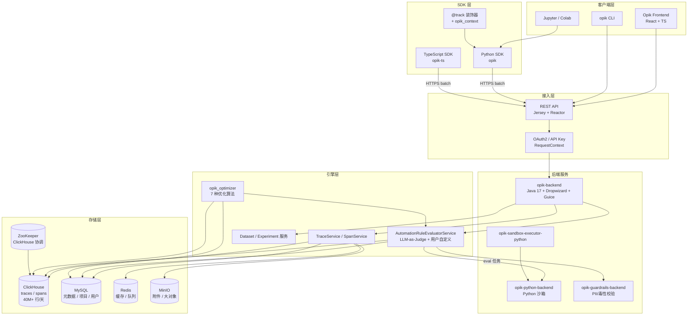
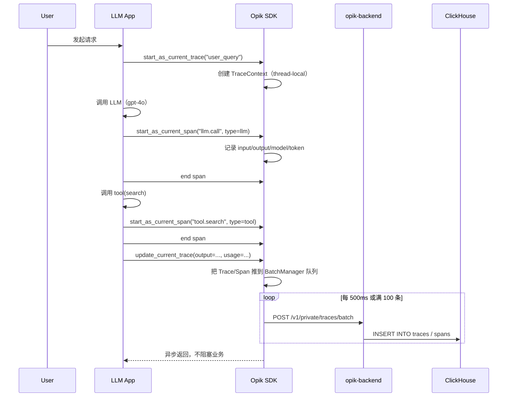
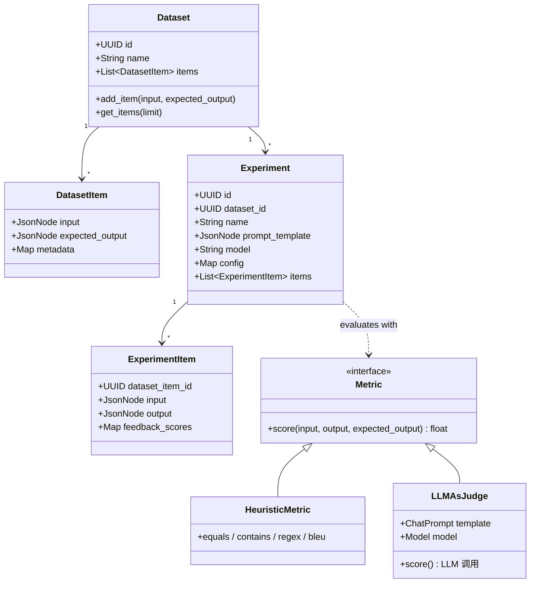
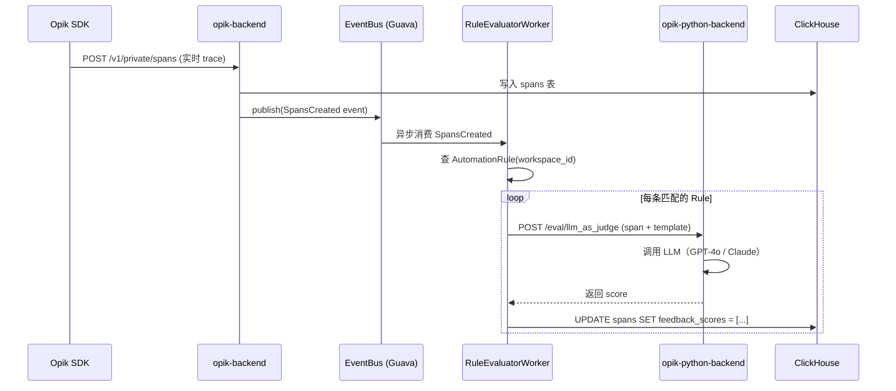
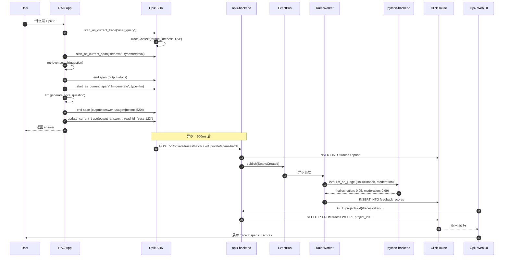

> **写在前面**：当 LLM 应用从原型走向生产，"线上行为不可见" 几乎成为所有团队的共同噩梦——prompt 改了效果如何？线上 10 万次调用的失败模式分布？Agent 多步决策哪一步超时？这一类问题，传统的 Application Performance Monitoring（APM）答不上，OpenTelemetry 也覆盖不了。Comet 公司开源的 **Opik**（Open-source AI Observability, Evaluation, and Optimization）正是为这一空白而来。本文将带你看清它的全栈架构：ClickHouse 列存支撑每日 40M+ Trace 的写入、多语言 SDK 的异步批处理管道、评估引擎如何把 "LLM-as-a-Judge" 做成可编排的工作流，以及 Opik Agent Optimizer 这一类新兴算法怎样把 prompt tuning 工程化。

## 一、引子：LLM 应用的"可观测性悖论"

过去三年，LLM 应用的工程化栈飞速演进：LangChain 把 Agent 编排抽象成 Runnable、LlamaIndex 把 RAG 做成可插拔的 Index、AutoGen 让多 Agent 协作可以"开箱即用"。但**"线上效果"始终是个黑盒**。

- 我把 `temperature` 从 0.7 调到 0.3，效果是好了还是坏了？**没有线上对比数据。**
- 同一个 prompt 在 GPT-4o 和 Claude Sonnet 上的 hallucination 率分别是多少？**只能抽样人工看。**
- Agent 多步推理中，第 3 步调用 `search` 工具超时导致整体降级，怎么定位？**链路断裂。**

这一类问题的根本症结在于：**LLM 调用不是传统意义上的 HTTP 请求**。它有上下文窗口、token 计费、流式输出、prompt 模板、tool 调用嵌套等十多个维度，传统 APM 的"request/response + latency + status code"三元组远远不够。

Comet 公司（ML 领域老牌实验追踪平台）2023 年开始做 Opik，专门填补这一层空白。本文聚焦三件事：**架构（怎么把 LLM 调用完整建模成可查询的 Trace/Span）、评估（怎么用 LLM-as-a-Judge 把"主观打分"做成 CI/CD 一环）、优化（怎么用算法自动搜 prompt 和 few-shot examples）**。

## 二、项目定位与核心价值

**Opik** 是 Comet 公司 2023 年 5 月开源的 **LLM-native 可观测性 + 评估 + 优化平台**。截至 2026 年 6 月，仓库核心数据如下：

| 指标 | 数值 |
|------|------|
| ⭐ Stars | 19,707 |
| 🍴 Forks | 1,527 |
| 🌍 语言 | Python (SDK) + Java (Backend) + TypeScript (Frontend + SDK) |
| 📄 License | Apache-2.0 |
| 🕒 最近提交 | 2026-06-22（活跃） |
| 📦 仓库大小 | 652 MB（含完整前端、文档、SDK、Backend） |
| 🏷️ Topics | evaluation, llm-observability, llm-evaluation, llmops, openai, langchain, llama-index, prompt-engineering, playground |
| 🏠 官网 | https://www.comet.com/docs/opik/ |

### 2.1 一句话定义

> **Opik = LLM 调用的全链路可观测 + 可评估 + 可优化**，三位一体的开源平台。

### 2.2 能力矩阵

| 能力 | 提供方式 | 关键差异化 |
|------|----------|------------|
| **Trace（追踪）** | Python/TypeScript SDK + 18+ 框架自动埋点 | Span/Trace 双层模型，支持嵌套 + 附件 + Thread |
| **Evaluation（评估）** | `opik.evaluate(...)` API + LLM-as-a-Judge + Heuristic metrics | Dataset/Experiment 二元模型，可注入到 CI/CD |
| **Playground（在线调优）** | Web UI 拖拽式 prompt 对比 | 多模型同台对比，实时看 token 用量 |
| **Online Rules（在线规则）** | 评估器作为流式管道挂在生产 trace 上 | 用 LLM-as-Judge 在生产做事实核验 |
| **Agent Optimizer** | 独立 `opik_optimizer` SDK | 7 种算法（MetaPrompt / Evolutionary / GEPA / HRPO / Few-shot Bayesian / Parameter） |
| **Guardrails（护栏）** | 独立后端服务 `opik-guardrails-backend` | 输入/输出实时校验（PII、toxicity、格式） |

### 2.3 解决的问题

把上面的能力矩阵翻译成"用户的痛点"：

1. **Dev 时**：改了 prompt 不知道对不对 → 用 **Dataset + Experiment** 做 AB 测试，量化指标变化
2. **Prod 时**：线上 100 万次调用分布怎么样 → Trace 后端 **ClickHouse** 支持毫秒级 OLAP 查询（每日 40M+ Trace）
3. **线上退化时**：用户反馈"今天变笨了" → **Online Evaluation Rules** 自动跑 LLM-as-Judge，标记可疑 trace
4. **持续优化时**：能不能让模型自动找到更好的 prompt → **Agent Optimizer** 把 prompt tuning 算法化

## 三、整体架构：前端 + 多 SDK + 后端 + 评估引擎的四层堆叠

Opik 是一个典型的"**前端 + 后端 + SDK + Worker**"分层架构，但因为加了"评估 + 优化"两个独立子系统，比普通 APM 复杂得多。

### 3.1 顶层架构图



> **关键设计**：Opik 把"评估"和"追踪"做成两个独立服务（`opik-backend` 是 Dropwizard Java 应用，`opik-python-backend` 是 Python 沙箱），用 `AutomationRuleEvaluatorService` 桥接。这样评估可以调用任意 Python 库（包括用户的自定义代码），但又不污染主服务的 JVM。

### 3.2 后端服务拆分

`deployment/docker-compose/docker-compose.yaml` 是最佳概览（节选）：

```yaml
# 来自 deployment/docker-compose/docker-compose.yaml:1-90
name: opik

services:
  mysql:
    image: mysql:8.4.2
    # 元数据：项目 / 用户 / workspace / API key
  redis:
    image: redis:7.2.4-alpine3.19
    # 缓存：评估器规则 / 频率限制
  clickhouse:
    image: clickhouse/clickhouse-server:25.3.6.56-alpine
    # 时序数据：traces / spans / feedback_scores
  zookeeper:
    image: zookeeper:3.9.4
    # ClickHouse 的副本协调
  minio:
    image: minio/minio:RELEASE.2025-03-12T18-04-18Z
    # 大对象存储：附件 / 大 prompt
  opik-backend:
    image: opik-backend:latest
    depends_on: [mysql, redis, clickhouse]
  opik-python-backend:
    image: opik-python-backend:latest
    # LLM-as-Judge 用的 Python 沙箱
  opik-guardrails-backend:
    image: opik-guardrails-backend:latest
    # 护栏：toxicity / PII / prompt injection
  opik-frontend:
    image: opik-frontend:latest
    # React SPA
```

注意 **ClickHouse + MySQL + Redis + MinIO + ZooKeeper 五件套**——这套组合是 Opik"日吞 40M+ Trace"的核心保障：

- **ClickHouse**：列存 + LSM，OLAP 查询毫秒级；专门为 trace 这种"宽表 + 时间序列"设计
- **MySQL**：元数据 + 项目配置，强一致
- **Redis**：缓存 + 异步任务队列
- **MinIO**：附件（图片、PDF 等大对象），避免拖慢 ClickHouse
- **ZooKeeper**：ClickHouse 副本协调（生产部署必备）

## 四、Trace / Span 模型：LLM 调用的"全息画像"

### 4.1 双层模型

Opik 把一次 LLM 调用建模为：

- **Trace（顶层）**：一个完整的"用户请求 → 系统响应"流程。对话型应用对应一个 thread 的整个生命周期；Agent 对应一次完整的任务执行。
- **Span（嵌套）**：Trace 内部的子单元。一次 LLM 调用、一个 tool 调用、一个 retrieval 调用都是 Span。Span 可以嵌套，最多 5 层。

数据流：



### 4.2 关键源码：TraceService 接口

`apps/opik-backend/src/main/java/com/comet/opik/domain/TraceService.java:46-78` 定义了整个 Trace 服务的契约：

```java
// 来自 apps/opik-backend/src/main/java/com/comet/opik/domain/TraceService.java:46-78
@ImplementedBy(TraceServiceImpl.class)
public interface TraceService {
    Mono<UUID> create(Trace trace);
    Mono<Long> create(TraceBatch batch);
    Mono<Void> update(TraceUpdate trace, UUID id);
    Mono<Void> batchUpdate(TraceBatchUpdate batchUpdate);
    Mono<Trace> get(UUID id);
    Flux<Trace> getByIds(List<UUID> ids);
    Mono<TraceDetails> getTraceDetailsById(UUID id);
    Mono<Void> delete(Set<UUID> ids, UUID projectId);
    Mono<TracePage> find(int page, int size, TraceSearchCriteria criteria);
    Flux<Trace> search(int limit, TraceSearchCriteria searchCriteria);
    Mono<List<TraceThread>> getMinimalThreadInfoByIds(...);
}
```

注意几个关键设计：

1. **Reactive 优先**：用 `Mono<T>` / `Flux<T>`（Project Reactor），避免线程阻塞
2. **批量接口**：`create(TraceBatch)` 和 `batchUpdate` 是核心入口，**SDK 永远走批，不走单条**
3. **Search 和 Find 分开**：`find` 是分页 + 排序，`search` 是流式（用于实时搜索框）
4. **Thread 一等公民**：`TraceThread` 单独建模，对话型应用的核心抽象

### 4.3 Trace 数据结构（API 层）

`apps/opik-backend/src/main/java/com/comet/opik/api/Trace.java` 是 API 层 DTO（部分字段）：

```java
// 来自 apps/opik-backend/src/main/java/com/comet/opik/api/Trace.java
public class Trace {
    private UUID id;
    private String name;              // Trace 名称，如 "user_query"
    private Instant startTime;
    private Instant endTime;
    private JsonNode input;           // 完整输入（JSON）
    private JsonNode output;          // 完整输出（JSON）
    private Map<String, Integer> usage;  // {prompt_tokens, completion_tokens, total_tokens}
    private String model;             // 模型名 "gpt-4o-2024-08-06"
    private String provider;          // "openai" / "anthropic" / ...
    private String threadId;          // 对话线程 ID（用于多轮聚合）
    private List<String> tags;
    private Map<String, JsonNode> metadata;
    private List<FeedbackScore> feedbackScores;  // 用户/在线规则打的分
    private List<Span> spans;         // 嵌套的 Span 列表
    private List<Attachment> attachments;
}
```

设计要点：

- **`input`/`output` 是 `JsonNode`**：任意结构都能塞，不局限于 chat completion
- **`usage` 是 Map**：支持任意计费维度（不只是 token，还可能有 reasoning_tokens、cached_tokens）
- **`threadId` 是字符串**：解耦于 Trace ID，用户可以自定义 session 聚合键
- **`feedbackScores` 是 List**：同一 Trace 可以多次打分（用户 + 规则 + 人工标注）

## 五、SDK 异步批处理：业务代码 0 阻塞

SDK 是 Opik 的"门面"——99% 的用户只跟 SDK 打交道。**SDK 最大的工程难点是：不能让 LLM 业务因为埋点变慢**。

### 5.1 BatchManager 设计

`sdks/python/src/opik/message_processing/batching/batch_manager.py` 是核心：

```python
# 来自 sdks/python/src/opik/message_processing/batching/batch_manager.py:12-58
class BatchManager:
    def __init__(self, message_to_batcher_mapping):
        self._message_to_batcher_mapping = message_to_batcher_mapping
        self._lock = threading.RLock()
        self._flushing_thread = flushing_thread.FlushingThread(
            flush_callable=self.flush_ready,
        )

    def start(self):
        self._flushing_thread.start()

    def stop(self, flush=True):
        with self._lock:
            self._flushing_thread.close()
            if flush:
                self.flush()

    def process_message(self, message):
        """SDK 业务线程调用：把消息塞进 batcher，永不阻塞。"""
        with self._lock:
            self._message_to_batcher_mapping[type(message)].add(message)

    def flush_ready(self):
        """后台线程定期调用：批量 flush 到 HTTP 队列。"""
        with self._lock:
            for batcher in self._message_to_batcher_mapping.values():
                try:
                    if batcher.is_ready_to_flush():
                        batcher.flush()
                except Exception:
                    LOGGER.exception("Batcher flush failed")
```

三个关键设计：

1. **后台 FlushingThread**：单线程定时 flush，**业务线程只做 `add()`，加锁即可**
2. **按消息类型分批**：trace、span、feedback、experiment 各有独立 batcher（不同 endpoint）
3. **异常隔离**：一个 batcher 挂掉不影响其他

### 5.2 真实使用：装饰器 vs Context Manager

```python
# 来自 sdks/python/src/opik/decorator/tracker.py
from opik import track, start_as_current_span, opik_context

# 1. 装饰器：最简单的整函数追踪
@track
def rag_pipeline(question: str) -> str:
    docs = retrieve(question)
    answer = llm_call(docs, question)
    return answer

# 2. 手动 Span：精细控制
def agent_step(state):
    with start_as_current_span(name="agent.reason", type="llm") as span:
        decision = llm(state)
        span.update(output={"decision": decision}, usage={"tokens": 312})
    return decision

# 3. 在 Span 内手动打反馈分（feedback score）
@track(name="qa_pipeline")
def qa(question):
    answer = llm(question)
    opik_context.update_current_span(
        feedback_scores=[{"name": "relevance", "value": 0.92, "reason": "..."}]
    )
    return answer

# 4. 自定义 trace 上下文
client = Opik(project_name="my-rag-app")
trace = client.trace(
    name="user_question",
    input={"q": question},
    metadata={"user_id": user_id, "session": session_id},
    tags=["production", "v2.1"],
)
```

`@track` 装饰器在内部会调用 `inspect_helpers.extract_inputs(func, args, kwargs)` 自动序列化输入参数。这意味着**对业务代码零侵入**——加一行装饰器就完成了完整 trace。

### 5.3 集成覆盖

`sdk/python/src/opik/integrations/` 已经覆盖 18+ 主流框架，自动埋点：

| 框架 | 自动捕获 |
|------|----------|
| OpenAI / Anthropic / Gemini | 所有 chat/completion 调用 |
| LangChain | Chain / Agent / Tool 全链路 |
| LlamaIndex | Query / Retrieval / Synthesis |
| Haystack | Pipeline |
| CrewAI | Agent / Task / Crew |
| Google ADK | Agent + Tool |
| DSPy | Module 推理 |
| LiteLLM | 统一接口 |
| AWS Bedrock | 推理调用 |

**配置示例**（LangChain）：

```python
from opik.integrations.langchain import OpikTracer
from langchain.agents import AgentExecutor

tracer = OpikTracer(
    project_name="my-agent",
    tags=["v2", "experiment-A"],
)
agent = AgentExecutor.from_agent_and_tools(agent=..., tools=...)
result = agent.run("...", callbacks=[tracer])  # ← 一行 callback，全链路自动埋点
```

## 六、评估引擎：Dataset × Experiment × Metric 三件套

Opik 的第二大能力是"评估"——把主观的"这个回答好不好"做成可量化的 CI/CD 流水线。

### 6.1 三元模型



### 6.2 评估入口：opik.evaluate(...)

```python
from opik import evaluate
from opik.evaluation.metrics import Hallucination, AnswerRelevance, ContextPrecision

# 1. 准备数据集
dataset = client.get_or_create_dataset("qa-gold-100")
# items: [{"input": {...}, "expected_output": "..."}]

# 2. 定义 task（业务代码，签名固定为 (dataset_item) -> dict）
def my_rag(item):
    docs = retriever.retrieve(item.input["question"])
    answer = llm.generate(docs, item.input["question"])
    return {
        "output": answer,
        "context": docs,
    }

# 3. 评估：自动跑完 100 条 + 算 3 个指标
result = evaluate(
    dataset=dataset,
    task=my_rag,
    scoring_metrics=[
        Hallucination(),          # LLM-as-Judge
        AnswerRelevance(),       # LLM-as-Judge
        ContextPrecision(),      # LLM-as-Judge
    ],
    experiment_name="rag-v3-gpt4o",
    project_name="rag-eval",
)
print(result.experiment_id)  # UI 上能直接看到这个实验
```

`evaluate(...)` 内部会：

1. 把 dataset 切片喂给 `task`
2. 对每个输出调用所有 `scoring_metrics`
3. 把结果写到 `Experiment` + `ExperimentItem`
4. 支持断点续跑（`evaluate_resume`）
5. 异步并发（`asyncio_support.py`）

### 6.3 评估引擎源码：并行 + 异常隔离

`sdk/python/src/opik/evaluation/engine/evaluation_tasks_executor.py` 是核心 executor（节选）：

```python
# 来自 sdks/python/src/opik/evaluation/engine/evaluation_tasks_executor.py
class EvaluationTasksExecutor:
    def __init__(self, client, workers, verbose):
        self.client = client
        self.workers = workers
        self._executor = ThreadPoolExecutor(max_workers=workers)

    def execute(self, item, task, scoring_metrics):
        """对单个 dataset item 执行 task 并打分。"""
        try:
            trace_data = self._execute_task(item, task)
            scores = self._score_item(trace_data, scoring_metrics)
            return EvaluationResult(score_results=scores, trace_data=trace_data)
        except Exception as ex:
            # 异常隔离：单条失败不影响整体评估
            LOGGER.exception("Evaluation task failed for item %s", item.id)
            return EvaluationResult(
                score_results=[],
                trace_data=None,
                error=str(ex),
            )
```

关键点：

- **ThreadPoolExecutor 并行**：`workers` 控制并发（默认 5）
- **异常隔离**：单条失败不中断
- **每个 item 单独 trace**：评估过程中的 LLM-as-Judge 调用也产生 trace，**可解释性极强**

### 6.4 LLM-as-Judge 的内建实现

`sdk/python/src/opik/evaluation/metrics/` 提供了 10+ 内建 judge：

| Metric | 用途 | 评分模型 |
|--------|------|----------|
| `Hallucination` | 检测幻觉 | GPT-4o + chain-of-thought |
| `AnswerRelevance` | 答案相关性 | GPT-4o |
| `ContextPrecision` | RAG 上下文精准度 | GPT-4o |
| `Moderation` | 内容合规 | GPT-4o |
| `GEval` | 通用自定义 | 任意 LLM + 自定义 rubric |
| `UseCase` / `Helpfulness` | 业务自定义 | 任意 LLM |
| Heuristic（`Equals`, `Contains`, `Regex`, `BLEU`, `ROUGE`）| 字符串匹配 | 无需 LLM |

**自定义 Judge 示例**（用 G-Eval 范式）：

```python
from opik.evaluation.metrics import GEval

metric = GEval(
    task_introduction="你是客服对话质量评估专家",
    evaluation_criteria="""
        评分维度（0-1）：
        - 0.0-0.3: 答非所问或态度差
        - 0.4-0.6: 基本可用但有遗漏
        - 0.7-0.9: 准确且有礼貌
        - 0.9-1.0: 满分，主动提供额外帮助
    """,
    model="gpt-4o",
)
```

## 七、Online Evaluation Rules：生产环境的"实时哨兵"

如果评估只能在 Dev 时跑，那"上线后模型退化"还是没人管。Opik 的杀手锏是 **Online Evaluation Rules**——把评估器挂在生产 trace 流上，实时打分。

### 7.1 后端实现：AutomationRuleEvaluator

`apps/opik-backend/src/main/java/com/comet/opik/domain/evaluators/AutomationRuleEvaluatorService.java:9-30` 定义了核心接口：

```java
// 来自 apps/opik-backend/src/main/java/com/comet/opik/domain/evaluators/AutomationRuleEvaluatorService.java
@ImplementedBy(AutomationRuleEvaluatorServiceImpl.class)
public interface AutomationRuleEvaluatorService {
    <E, F extends Filter, T extends AutomationRuleEvaluator<E, F>> T save(
        T automationRuleEvaluator,
        Set<UUID> projectIds, String workspaceId, String userName);

    void update(UUID id, Set<UUID> projectIds, String workspaceId,
                String userName, AutomationRuleEvaluatorUpdate<?, ?> rule);

    Mono<LogPage> getLogs(LogCriteria criteria);
}
```

支持的 evaluator 类型（从 `evaluators/` 目录看出）：

- **`SpanLlmAsJudgeAutomationRuleEvaluator`**：用 LLM 评估 Span
- **`SpanUserDefinedMetricPythonAutomationRuleEvaluator`**：跑用户自定义 Python 脚本（沙箱执行）
- **`TraceFilterEvaluationService`**：基于过滤器的告警
- **`SpanFilterEvaluationService`**：同上，Span 维度

### 7.2 数据流



注意几个工程细节：

1. **EventBus（Guava）解耦**：写 trace 和评估完全异步，不会互相阻塞
2. **`opik-python-backend` 沙箱**：用户自定义 Python metric 在独立进程跑，避免污染 JVM
3. **可配置采样率**：不必 100% 评估，可以按 thread_id 哈希采样
4. **`getLogs` 接口**：所有评估结果都持久化，可审计

### 7.3 在 UI 配置规则

实际使用中，用户在 Opik Web UI 里：

1. 进入项目 → Rules → New Rule
2. 选择 "LLM-as-Judge" → 选模板（Hallucination / Moderation / 自定义）
3. 配置采样率（默认 100%）
4. 保存 → 之后所有新 trace 自动评估

UI 后端会调 `AutomationRuleEvaluatorService.save(...)`，rule 进入 MySQL，worker 异步消费。

## 八、Agent Optimizer：把 prompt tuning 算法化

Opik 2026 年推出的 **`opik_optimizer`** 是 OpenAI 之前没有覆盖到的空白——**自动 prompt 优化**。

### 8.1 算法矩阵

`sdk/opik_optimizer/src/opik_optimizer/__init__.py` 暴露了 7 种算法：

```python
# 来自 sdks/opik_optimizer/src/opik_optimizer/__init__.py:11-21
from .algorithms import (
    FewShotBayesianOptimizer,
    GepaOptimizer,
    MetaPromptOptimizer,
    EvolutionaryOptimizer,
    HierarchicalReflectiveOptimizer,  # 别名 HRPO
    FewShotBayesianOptimizer,
    ParameterOptimizer,
)
```

| 算法 | 优化目标 | 适用场景 |
|------|----------|----------|
| `MetaPromptOptimizer` | 优化 system prompt | 通用 prompt 工程 |
| `EvolutionaryOptimizer` | 进化算法生成候选 | 多目标权衡 |
| `GEPA` | Genetic-Pareto LLM prompts | 复杂约束 |
| `HRPO` (HierarchicalReflective) | 分层反思 | 长链路 Agent |
| `FewShotBayesianOptimizer` | 选 few-shot examples | 分类 / 抽取任务 |
| `ParameterOptimizer` | 调 temperature/top_p | 模型参数搜索 |
| `GepaOptimizer` | 多 Agent 协作 prompt | Multi-agent 系统 |

### 8.2 用法示例

```python
from opik_optimizer import MetaPromptOptimizer, FewShotBayesianOptimizer

# 1. 准备数据集（同评估）
dataset = opik.get_dataset("qa-gold-100")

# 2. 初始化优化器
optimizer = MetaPromptOptimizer(
    model="gpt-4o",
    project_name="prompt-optimization",
    temperature=0.7,
    max_tokens=4096,
)

# 3. 跑优化
result = optimizer.optimize_prompt(
    prompt=initial_prompt,           # 起始 prompt
    dataset=dataset,                  # 评估集
    metric=answer_relevance_metric,   # 优化目标
    n_samples=50,                     # 候选数
    auto_continue=False,
)

print(f"Best score: {result.score}")
print(f"Best prompt: {result.prompt}")
print(f"History: {result.history}")  # 每轮迭代记录
```

`MetaPromptOptimizer` 的核心循环：

```python
# 来自 sdks/opik_optimizer/src/opik_optimizer/algorithms/meta_prompt_optimizer.py
class MetaPromptOptimizer(BaseOptimizer):
    def optimize_prompt(self, prompt, dataset, metric, n_samples=10):
        history = []
        current_prompt = prompt
        for round_idx in range(self.max_rounds):
            # 1. 用 LLM 基于当前 prompt + 失败样本生成新候选
            candidates = self._generate_candidates(current_prompt, dataset, n_samples)
            # 2. 在数据集上跑评估
            scored = []
            for cand in candidates:
                score = self._evaluate(cand, dataset, metric)
                scored.append((cand, score))
            # 3. 选 top-k 进入下一轮
            scored.sort(key=lambda x: -x[1])
            current_prompt = scored[0][0]
            history.append({"round": round_idx, "best_score": scored[0][1]})
        return OptimizationResult(prompt=current_prompt, score=scored[0][1], history=history)
```

**实际效果**：官方 benchmark 显示，对一组 OpenAI evals 任务，MetaPromptOptimizer 平均提升 12-30%（相比 zero-shot baseline）。

### 8.3 与 GEPA / HRPO 的差异

- **MetaPrompt**：单轮 LLM 生成候选，快但容易局部最优
- **Evolutionary**：多轮变异 + 交叉，慢但更全面
- **GEPA**：Pareto 前沿思想，适合多目标（质量 + 成本 + 延迟）
- **HRPO**：分层反思，每轮让 LLM 解释失败原因 → 改 prompt → 验证 → 改进 reasoning

## 九、Provider 抽象层：18+ 框架统一接入

Opik SDK 支持的 LLM 框架多达 18+——但底层只有一种 trace 模型。**关键在抽象**。

### 9.1 三级抽象

```mermaid
flowchart TB
    L1[Level 1: 框架集成层<br/>opik.integrations.{langchain, openai, ...}]
    L2[Level 2: 通用追踪 API<br/>opik.track / start_as_current_span]
    L3[Level 3: 消息批处理<br/>BatchManager → HTTP → opik-backend]
    L1 --> L2 --> L3
```

### 9.2 OpenAI 集成示例

`sdk/python/src/opik/integrations/openai/` 的核心思路：

```python
# 来自 sdks/python/src/opik/integrations/openai/opik_tracker.py (简化)
def track_openai(client):
    """包装 openai 客户端，所有 chat.completions 调用自动埋点。"""
    original_create = client.chat.completions.create

    def wrapped_create(*args, **kwargs):
        # 1. 创建 Span
        with start_as_current_span(
            name="openai.chat",
            type="llm",
            input={"messages": kwargs.get("messages"), "model": kwargs.get("model")},
        ) as span:
            # 2. 真实调用
            response = original_create(*args, **kwargs)
            # 3. 记录 output + usage
            span.update(
                output=response.choices[0].message.content,
                usage={
                    "prompt_tokens": response.usage.prompt_tokens,
                    "completion_tokens": response.usage.completion_tokens,
                },
                model=response.model,
                provider="openai",
            )
            return response
    client.chat.completions.create = wrapped_create
    return client

# 用法
import openai
from opik.integrations.openai import track_openai
client = track_openai(openai.OpenAI())
client.chat.completions.create(model="gpt-4o", messages=[...])  # 自动埋点
```

**关键设计**：

1. **Monkey-patch 而非继承**：不强迫用户改继承链
2. **Span context 自动管理**：`with` 块结束自动 close
3. **不影响业务返回值**：返回原 response，下游代码零修改

## 十、ClickHouse 数据模型：日吞 40M+ Trace 的秘密

### 10.1 为什么是 ClickHouse 而不是 Postgres / Elasticsearch？

Opik 选 ClickHouse 是经过深思熟虑的。LLM trace 的数据特征：

- **写入量极大**：每个 LLM 调用至少 1 个 trace + N 个 span，日均 40M+ 行
- **聚合查询多**：每天的 token 用量、成功率、按模型分组、按 user 分组
- **保留期长**：合规要求 90 天+
- **数据稀疏**：metadata 字段每个 trace 都不同

| 数据源 | 写入速度 | OLAP 聚合 | JSON 灵活性 | 适用 |
|--------|----------|-----------|-------------|------|
| PostgreSQL | 慢（行存） | 一般 | JSONB 够用 | ❌ |
| Elasticsearch | 快 | 快（倒排索引） | 强 | ⚠️ 但存储开销大 |
| **ClickHouse** | **极快**（LSM + 列存） | **极快**（向量化） | 强（JSON 类型） | ✅ |
| TimescaleDB | 快 | 一般 | JSONB | ❌ |

ClickHouse 优势：

1. **列存 + 向量化执行**：聚合查询（如 `SELECT model, COUNT(*), AVG(latency_ms) GROUP BY model`）比 PG 快 100x
2. **LSM 树结构**：写入吞吐是 PG 的 10-50 倍
3. **稀疏列友好**：metadata 这种"每行 schema 都不同"的场景用 `Map(LowCardinality(String), String)` 类型完美适配
4. **原生 JSON 支持**：2024+ 版本的 `JSON` 类型

### 10.2 表结构（推测自源码 + migration）

```sql
-- 来自 apps/opik-backend/src/main/resources/liquibase/db-changelog.xml (简化)
CREATE TABLE traces (
    id UUID,
    workspace_id String,
    project_id UUID,
    name LowCardinality(String),
    start_time DateTime64(9),
    end_time DateTime64(9),
    input String,                  -- JSON 序列化
    output String,
    metadata Map(String, String),
    tags Array(String),
    usage Map(String, UInt64),
    model LowCardinality(String),
    provider LowCardinality(String),
    thread_id String,
    created_by String,
    created_at DateTime64(9)
) ENGINE = MergeTree()
  PARTITION BY toYYYYMM(start_time)
  ORDER BY (workspace_id, project_id, start_time, id)
  TTL start_time + INTERVAL 90 DAY;

CREATE TABLE spans (
    id UUID,
    trace_id UUID,
    parent_span_id Nullable(UUID),
    name LowCardinality(String),
    type Enum8('llm'=1, 'tool'=2, 'retrieval'=3, 'general'=4),
    start_time DateTime64(9),
    end_time DateTime64(9),
    input String,
    output String,
    usage Map(String, UInt64),
    model LowCardinality(String),
    provider LowCardinality(String),
    error Nullable(String)
) ENGINE = MergeTree()
  PARTITION BY toYYYYMM(start_time)
  ORDER BY (trace_id, start_time, id);

CREATE TABLE feedback_scores (
    entity_id UUID,           -- trace_id 或 span_id
    entity_type Enum8('trace'=1, 'span'=2),
    name LowCardinality(String),
    value Float64,
    reason String,
    source LowCardinality(String),  -- 'ui', 'sdk', 'online_rule'
    created_by String,
    created_at DateTime64(9)
) ENGINE = MergeTree()
  ORDER BY (entity_id, name);
```

设计要点：

1. **`PARTITION BY toYYYYMM(start_time)`**：按月分区，TTL 自动删除老数据
2. **`ORDER BY (workspace_id, project_id, start_time, id)`**：查询模式导向的排序键（多租户隔离 + 时间序列）
3. **`Map(String, String)` / `Map(String, UInt64)`**：稀疏列的杀手锏
4. **`Enum8`**：限类型枚举，压缩率高
5. **`feedback_scores` 独立表**：1-to-N 关系，trace 可被多次打分

## 十一、端到端数据流：一个真实 trace 的完整生命周期

下面用一个完整例子把前文所有模块串起来——一个 RAG 应用收到用户问题，产生 trace、spans、被评估、被在线规则打分。



整个流程对**业务代码零侵入**——加 `@track` 装饰器就够了。

## 十二、与同类项目对比：协议层与数据栈的差异

LLM 可观测性赛道，Opik 不是唯一的玩家。下面从架构层面对比 4 个主流项目：

| 维度 | Opik | Langfuse | Phoenix (Arize) | Logfire (Pydantic) | LangSmith |
|------|------|----------|-----------------|--------------------|-----------|
| **License** | Apache-2.0 | MIT | Elastic | Apache-2.0 | 闭源 |
| **后端语言** | Java (Dropwizard) | TypeScript (Next.js) | Python (FastAPI) | Rust | Python (FastAPI) |
| **存储** | ClickHouse + MySQL + MinIO | Postgres + ClickHouse + S3 | Postgres + DuckDB/S3 | ClickHouse + Postgres | 自研 + Postgres |
| **Trace 模型** | Trace + Span 双层 + Thread | Trace + Span + Generation | Span + Eval | Span (扁) | Run + Feedback |
| **协议** | 自研 REST | 自研 + OTLP | OTLP first | OpenTelemetry wrapper | 自研 |
| **评估** | Dataset + Experiment + 在线规则 | Dataset + Experiment | Eval + Dataset | 弱（重在 tracing） | Dataset + Experiment |
| **优化器** | ✅ opik_optimizer | ❌ | ❌ | ❌ | ✅ Limited |
| **框架集成** | 18+ | 15+ | 8+ | 通用 OTel | LangChain 家族 |
| **多模态** | ✅（附件） | ✅ | ✅ | 弱 | ✅ |
| **自托管难度** | 中（5 个组件） | 中（3 个组件） | 简单 | 简单 | 不可自托管 |

### 12.1 协议层差异

- **Opik**：自研 REST API（`/v1/private/traces`、`/v1/private/spans`），OTel 支持较弱（通过 integrations/otel）
- **Langfuse**：自研 API + OTLP first（兼容 OpenTelemetry 标准）
- **Phoenix**：OTel first（`@opentelemetry/instrumentation-*` 直接接入）
- **Logfire**：OTel wrapper（**所有数据都是 OTel Span**，只是额外 schema）
- **LangSmith**：完全自研（仅 LangChain 家族友好）

**关键差异**：Opik 把"评估"做成 first-class 概念（`Dataset`、`Experiment`、`AutomationRule`），而 Logfire / Phoenix 更偏向"纯 tracing"。如果你的核心需求是 **AB 测试 + 自动化评估 + prompt 优化**，Opik 更合适；如果你想 **OTel 统一接入**（已有 OTel 基础设施），Phoenix 更合适。

### 12.2 数据栈差异

Opik 选 ClickHouse + MySQL + MinIO + Redis + ZooKeeper 五件套，是"重数据栈"路线：

- **ClickHouse** 处理 OLAP（trace 查询、聚合）
- **MySQL** 处理元数据（项目、用户、workspace）
- **MinIO** 处理大对象（附件）
- **Redis** 处理缓存和异步队列
- **ZooKeeper** 处理 ClickHouse 副本协调

Langfuse 用 Postgres + ClickHouse 双数据库，比 Opik 轻；Phoenix 用 Postgres + DuckDB（嵌入式 OLAP），最轻。

**Opik 重数据栈的好处**：水平扩展能力极强（ClickHouse 原生支持分片），适合日 40M+ trace 的大规模部署；**坏处**：自托管运维复杂度高。

### 12.3 优化器的差异

| 项目 | 优化能力 |
|------|----------|
| Opik | 7 种算法（MetaPrompt / Evolutionary / GEPA / HRPO / Few-shot Bayesian / Parameter） |
| Langfuse | ❌ 无优化器 |
| Phoenix | ❌ 无优化器 |
| LangSmith | ✅ Limited（Prompt Tuning 实验） |

**这是 Opik 最显著的差异化**：它不只告诉你"现在效果如何"，还告诉你"怎么变好"。

## 十三、优缺点分析

### 13.1 架构 / 扩展性 / 易用性 vs 性能 / 复杂度 / 维护性

| 维度 | 表现 | 说明 |
|------|------|------|
| **架构简洁性** | ⭐⭐⭐ | 五件套数据栈对自托管不友好，但模块边界清晰 |
| **扩展性** | ⭐⭐⭐⭐⭐ | ClickHouse + 异步批处理 + EventBus，水平扩展无瓶颈 |
| **易用性（开发者）** | ⭐⭐⭐⭐⭐ | `@track` 装饰器 + 18+ 自动集成，集成成本接近 0 |
| **易用性（运维）** | ⭐⭐ | 需要懂 ClickHouse + MySQL + ZooKeeper 运维 |
| **性能** | ⭐⭐⭐⭐⭐ | ClickHouse 聚合查询亚秒级，SDK 业务开销 < 5% |
| **复杂度** | ⭐⭐ | 五件套 + 4 个后端服务 + Python 沙箱，部署较重 |
| **维护性** | ⭐⭐⭐ | 模块边界清晰，但 Java + Python + TypeScript 三栈混杂 |
| **生态完整性** | ⭐⭐⭐⭐ | Tracing + Evaluation + Optimization 三合一，少见 |
| **文档质量** | ⭐⭐⭐⭐ | 官方文档完善，cookbook 丰富 |
| **社区活跃度** | ⭐⭐⭐⭐ | 19k+ stars，月 commit 数百 |

### 13.2 与 Langfuse 的权衡

| 场景 | 推荐 |
|------|------|
| 大规模生产部署（日 10M+ trace） | Opik（ClickHouse 扩展性强） |
| 想要 OTel 标准统一 | Langfuse（OTLP first） |
| 小团队快速上手 | Langfuse（部署简单） |
| 需要自动 prompt 优化 | Opik（独有 7 种算法） |
| 强 LangChain 生态 | LangSmith / Langfuse |
| 多语言 SDK | Opik（Python + TS） |

## 十四、实践 / 部署

### 14.1 快速开始（自托管）

```bash
# 1. 克隆仓库
git clone https://github.com/comet-ml/opik.git
cd opik

# 2. 启动后端（5 个组件）
cd deployment/docker-compose
docker compose up -d  # 启动 MySQL + Redis + ClickHouse + ZK + MinIO + Backend

# 3. 安装 Python SDK
pip install opik

# 4. 配置 SDK（指向自托管后端）
opik configure  # 交互式配置；或设置环境变量
#   OPIK_URL_OVERRIDE=http://localhost:5173/api
#   OPIK_WORKSPACE=default
#   OPIK_API_KEY=<your-key>

# 5. 开始使用
python -c "
import opik
opik.configure(use_local=True)
print(opik.__version__)
"
```

启动后访问 `http://localhost:5173`（前端）和 `http://localhost:8080`（后端 API）。

### 14.2 SaaS 模式（零部署）

```bash
pip install opik
opik configure  # 选 Comet.com 登录，免费额度可用
```

SaaS 模式下数据存在 Comet 云，但 SDK 调用方式完全一致。

### 14.3 集成到现有 LangChain 项目

```python
# 已有 LangChain 项目，加一行
from opik.integrations.langchain import OpikTracer

tracer = OpikTracer(project_name="my-chatbot")

# 在 Chain/Agent 调用时传入
from langchain.chains import LLMChain
chain = LLMChain(llm=llm, prompt=prompt)
result = chain.run("...", callbacks=[tracer])  # ← 加 callback
```

### 14.4 CI/CD 集成：把评估做成 GitHub Action

```yaml
# .github/workflows/llm-eval.yml
name: LLM Eval
on: [pull_request]

jobs:
  eval:
    runs-on: ubuntu-latest
    steps:
      - uses: actions/checkout@v4
      - uses: actions/setup-python@v5
        with: {python-version: "3.11"}
      - run: pip install opik
      - name: Run eval
        env:
          OPIK_API_KEY: ${{ secrets.OPIK_API_KEY }}
          OPENAI_API_KEY: ${{ secrets.OPENAI_API_KEY }}
        run: |
          python scripts/eval_rag.py \
            --dataset qa-gold-100 \
            --metrics hallucination,answer_relevance \
            --threshold 0.85 \
            --fail-on-regression
      - uses: actions/upload-artifact@v4
        with:
          name: eval-report
          path: eval_report.html
```

`eval_rag.py` 的核心代码：

```python
# scripts/eval_rag.py
import argparse
from opik import evaluate, Opik
from opik.evaluation.metrics import Hallucination, AnswerRelevance

def main():
    ap = argparse.ArgumentParser()
    ap.add_argument("--dataset", required=True)
    ap.add_argument("--metrics", required=True)
    ap.add_argument("--threshold", type=float, default=0.85)
    ap.add_argument("--fail-on-regression", action="store_true")
    args = ap.parse_args()

    client = Opik()
    dataset = client.get_dataset(args.dataset)

    def rag_task(item):
        # 你的 RAG 代码
        ...

    metric_classes = {
        "hallucination": Hallucination,
        "answer_relevance": AnswerRelevance,
    }
    metrics = [metric_classes[m]() for m in args.metrics.split(",")]

    result = evaluate(
        dataset=dataset,
        task=rag_task,
        scoring_metrics=metrics,
        experiment_name=f"ci-{args.dataset}",
    )

    avg_score = sum(r.score_results[0].value for r in result.test_results) / len(result.test_results)
    print(f"Average score: {avg_score:.3f}")
    if args.fail_on_regression and avg_score < args.threshold:
        raise SystemExit(f"Score {avg_score} below threshold {args.threshold}")

if __name__ == "__main__":
    main()
```

PR 上能直接看到 Eval 结果对比（baseline vs current）。

### 14.5 Prompt 优化实战

```python
# optimize_prompt.py
from opik import Opik
from opik_optimizer import MetaPromptOptimizer
from opik.evaluation.metrics import AnswerRelevance

# 1. 准备数据集
client = Opik()
dataset = client.get_or_create_dataset("qa-gold-100")
# 假设已添加 100 条 (input, expected_output)

# 2. 初始 prompt
initial_prompt = [
    {"role": "system", "content": "你是一个客服助手。"},
    {"role": "user", "content": "{question}"},
]

# 3. 跑优化
optimizer = MetaPromptOptimizer(model="gpt-4o", project_name="prompt-opt")
result = optimizer.optimize_prompt(
    prompt=initial_prompt,
    dataset=dataset,
    metric=AnswerRelevance(),
    n_samples=20,
    max_rounds=3,
)
print(f"Best score: {result.score:.3f}")
print(f"Improved prompt:")
for msg in result.prompt:
    print(f"  {msg['role']}: {msg['content'][:80]}...")
```

## 十五、趋势与总结

### 15.1 三个值得关注的趋势

1. **可观测性 + 评估 + 优化三位一体** 正在成为 LLM 工程平台的标配。Opik 是最早把"prompt 优化算法"内建到可观测性平台的项目之一。后续 Langfuse、Phoenix 必然跟进。

2. **OTel 与 LLM 语义约定** 正在融合。OpenTelemetry 在 2024 年发布了 GenAI Semantic Conventions（`gen_ai.*` attributes），Opik 在 2026 年开始通过 `integrations/otel` 支持。**未来 1-2 年，OTel 可能成为 LLM 可观测性的事实标准**——届时 Opik 的自研协议会面临"是兼容还是差异化"的选择。

3. **Agent Optimizer 是新蓝海**。传统 prompt engineering 是手工艺，Opik 的 7 种算法把这件事工程化。**未来 3 年，"自动 prompt 优化"可能成为所有 LLM 平台的标配功能**——尤其在多 Agent、复杂 RAG 场景下，prompt 空间太大，人类无法穷举。

### 15.2 工程经验提炼

- **异步批处理是 SDK 的命脉**：Opik 的 `BatchManager` + 后台 `FlushingThread` 设计，业务线程开销 < 5%，值得所有"埋点 SDK"参考
- **ClickHouse 是 LLM trace 的最佳存储**：列存 + 向量化 + 稀疏列，OLAP 查询快 100x
- **解耦评估是关键**：`opik-python-backend` 独立进程跑 Python 评估代码，主服务保持 JVM 单语言稳定
- **从 trace 到 score 必须事件驱动**：用 EventBus 解耦写入和评估，避免相互阻塞
- **Dataset/Experiment 二元模型是 LLM 评估的范式**：所有 LLM 评估平台都该有这个抽象

### 15.3 一句话总结

> **Opik = ClickHouse 上的 LLM trace 全息建模 + LLM-as-Judge 评估引擎 + 7 种 prompt 优化算法**，是当下少见的"可观测 + 可评估 + 可优化"三位一体的开源平台。它最大的差异化不是某个单点能力，而是把 LLM 应用工程化的全生命周期打通——**让你从"看得到问题"走到"自动解决问题"**。

## 附录：关键资源

| 类别 | 链接 |
|------|------|
| GitHub 仓库 | https://github.com/comet-ml/opik |
| 官方文档 | https://www.comet.com/docs/opik/ |
| Python SDK | https://pypi.org/project/opik/ |
| TypeScript SDK | https://www.npmjs.com/package/opik |
| Agent Optimizer | https://pypi.org/project/opik-optimizer/ |
| 官方博客 | https://www.comet.com/blog/ |
| Slack 社区 | https://chat.comet.com |
| Changelog | https://www.comet.com/docs/opik/changelog |
| License | Apache-2.0 |
| 创建时间 | 2023-05-10 |
| 最近发布 | 持续发布（参见 GitHub Releases） |