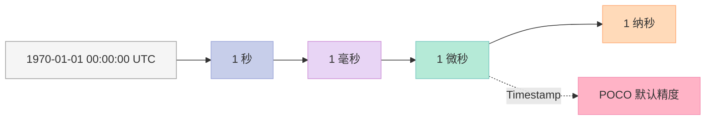
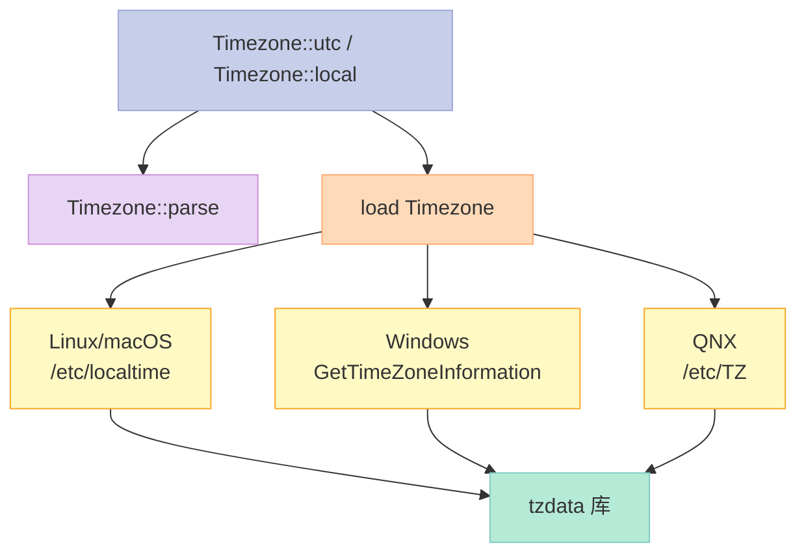
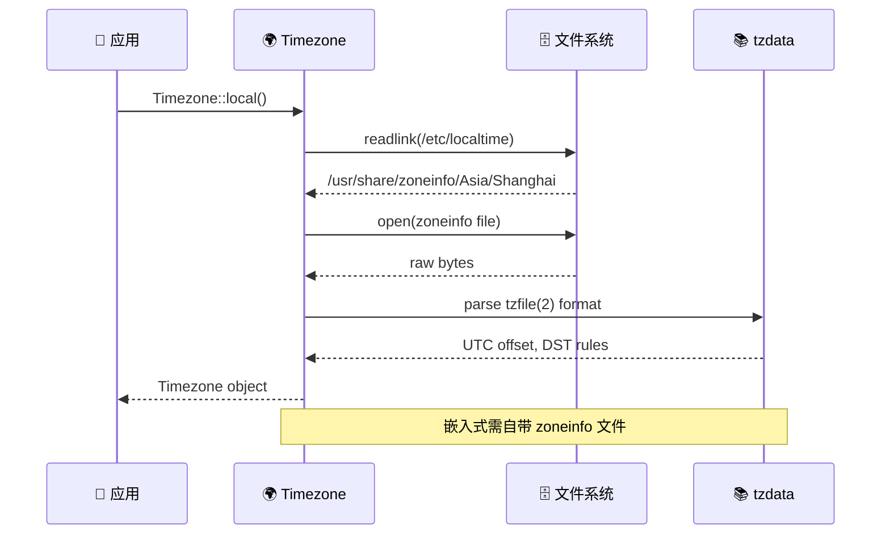
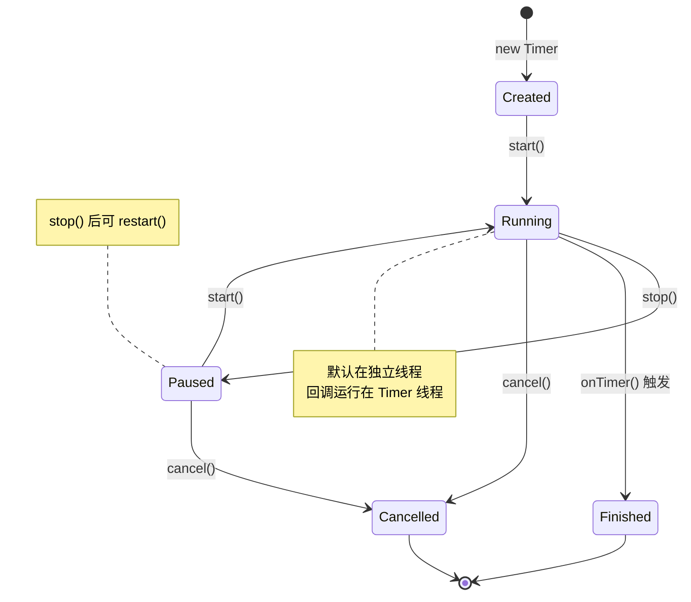
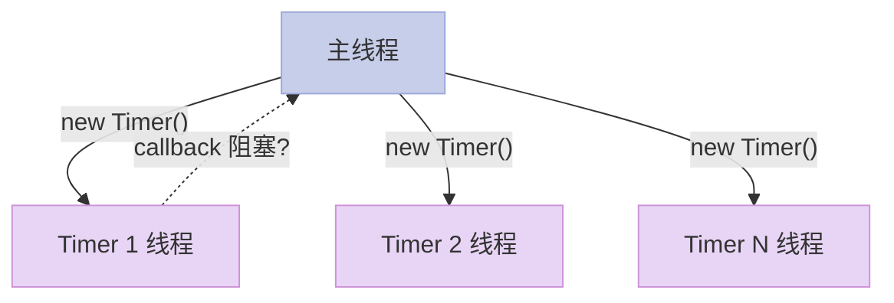
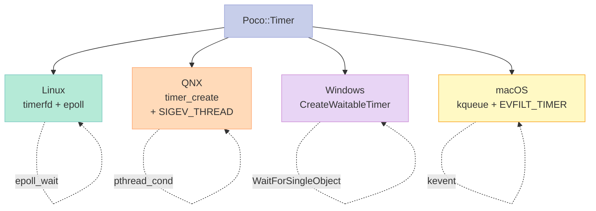
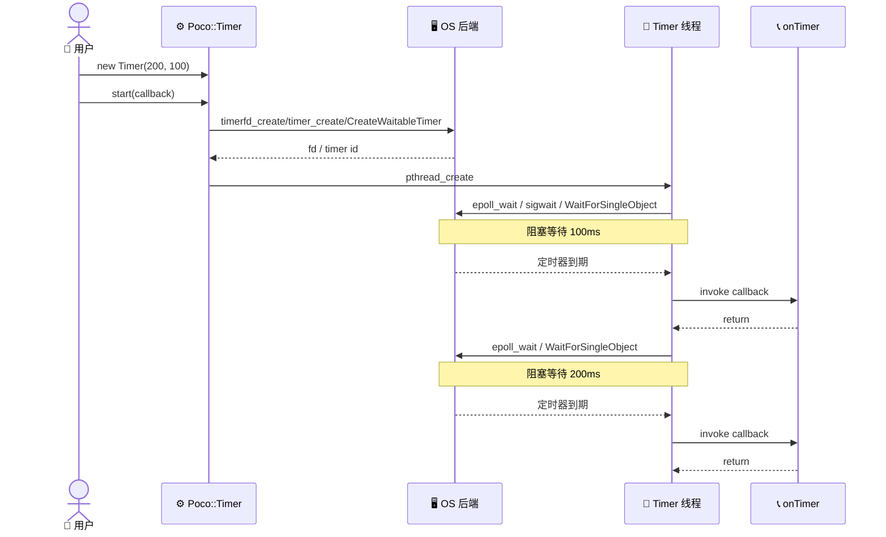
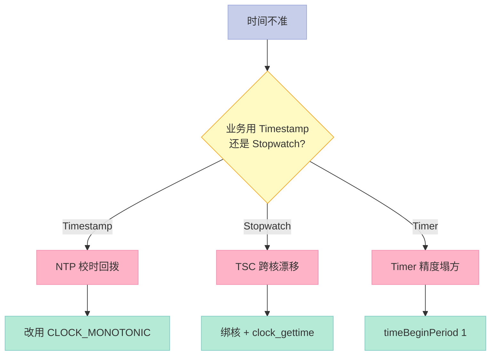
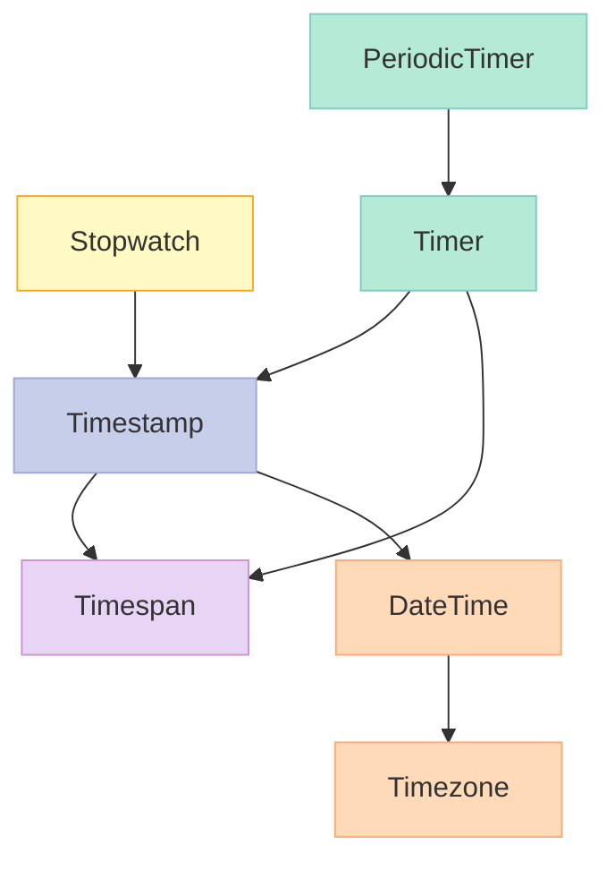

> **一句话核心结论**：POCO 的时间体系**不是 std::chrono 的简单包装**——它把"墙上时钟"（Timestamp/DateTime）、"单调时钟"（Stopwatch）、"时间间隔"（Timespan）三套语义彻底分开，再加上 Linux `timerfd`、QNX `timer_create`、Windows `CreateWaitableTimer` 三大平台后端的统一抽象。这一篇把所有坑（精度、回拨、时区、嵌套定时器）一次性讲透。

---

## 系列导航

| # | 文章 | 状态 |
|:--|:--|:--|
| 1 | [开篇：为什么选 POCO？](/2026/05/28/poco-01-why-poco/) | ✅ 已发布 |
| 2 | [基础类型与字符串处理](/2026/06/02/poco-02-basics-strings/) | ✅ 已发布 |
| 3 | [智能指针与内存管理](/2026/06/06/poco-03-smart-ptrs-memory/) | ✅ 已发布 |
| 4 | [线程与同步原语](/2026/06/10/poco-04-threading-sync/) | ✅ 已发布 |
| 5 | **本文：时间与定时器** | ✅ 已发布 |
| 6 | [网络编程：Socket 与 HTTP 客户端](/2026/06/26/poco-06-network-http/) | 🔜 计划中 |
| 7 | [文件系统与 Path](/2026/07/01/poco-07-filesystem-path/) | 🔜 计划中 |
| 8 | [日志系统：Logger 与 Channel](/2026/07/05/poco-08-logging/) | 🔜 计划中 |
| 9 | [进程与进程间通信（IPC）](/2026/07/10/poco-09-process-ipc/) | 🔜 计划中 |
| 10 | [Net 框架：Server / Client / Reactor](/2026/07/15/poco-10-net-reactor/) | 🔜 计划中 |
| 11 | [ActiveRecord + Data 框架实战](/2026/07/20/poco-11-data-orm/) | 🔜 计划中 |
| 12 | [总结：POCO vs Boost vs Qt vs 自研 Craton](/2026/07/25/poco-12-summary/) | 🔜 计划中 |

---

## 前言：嵌入式系统里，时间精度 = 系统生死

> **现状**：POSIX `clock_gettime(CLOCK_REALTIME, ...)` 在 NTP 校时下会**突然回拨几秒**；TSC（Time Stamp Counter）跨核不一致；Windows `QueryPerformanceCounter` 在某些虚拟机里有 BUG；QNX 用了 SIGEV 机制又和 Linux `timerfd` 不一样……**一套代码跨四大平台，99% 的项目栽在时间上**。

| 平台 | 墙上时钟 | 单调时钟 | 定时器后端 | 典型坑 |
|:--|:--|:--|:--|:--|
| **Linux** | `clock_gettime(CLOCK_REALTIME)` | `CLOCK_MONOTONIC` | `timerfd_create` | NTP 回拨、SMP TSC 漂移 |
| **QNX** | `ClockTime(CLOCK_REALTIME)` | `CLOCK_MONOTONIC` | `timer_create(CLOCK_MONOTONIC, ...)` | 信号与线程模型冲突 |
| **Windows** | `GetSystemTime` | `QueryPerformanceCounter` | `CreateWaitableTimer` | 精度 15.6ms（默认） |
| **macOS** | `gettimeofday` | `mach_absolute_time` | `kqueue` + `EVFILT_TIMER` | 沙盒里定时器被节流 |

**POCO 的目标**：用**统一 API**屏蔽这些差异，让你在 Linux 写的 `Poco::Timer` 直接拿到 QNX/Windows 跑。

**读完本文你能得到**：

- 微秒级 `Timestamp` 怎么用、为什么比 `time_t` 安全
- `DateTime`/`Timezone` 在跨时区场景的实操（特别是 `/etc/localtime` 解析）
- `Stopwatch` 嵌入式性能基准代码（自带 nanosecond 精度）
- `Timer`/`PeriodicTimer` 的线程模型与**嵌套陷阱**
- Linux `timerfd` / QNX `timer_create` / Windows `CreateWaitableTimer` 三家后端的**实现差异**
- **10+ 个真实避坑点**：回拨、精度塌方、夏令时、闰秒、跨核 TSC 不一致

---

## 一、Timestamp：64 位微秒的"墙上时钟"

### 1.1 核心定位

`Poco::Timestamp` 是 POCO 时间体系的**地基**——一个用 `Int64` 表示"自 1970-01-01 UTC 起的微秒数"的轻量值类型。

| 维度 | `Poco::Timestamp` | `std::chrono::system_clock::time_point` | `time_t` |
|:--|:--|:--|:--|
| 精度 | 微秒（μs） | 纳秒（实现相关） | 秒 |
| 存储 | `Int64` | `__int128`（libc++） | `Int64` / `Int32` |
| 单调性 | ❌（可回拨） | ❌（可回拨） | ❌（可回拨） |
| 跨平台 | ✅ | ✅ | ✅ |
| 算术 | `+ Timespan` / `- Timespan` | `+ duration` / `- duration` | 需转 `struct tm` |
| 序列化 | `epochMicroseconds()` | `time_since_epoch()` | `time()` |

### 1.2 时间轴全景图



> **关键观察**：POCO 默认**微秒级**——这对 99% 的业务足够；真要纳秒级（高频交易、雷达），要用 `Stopwatch`。

### 1.3 完整 API 速查

```cpp
// ================ Timestamp 完整 API ================
#include <Poco/Timestamp.h>
#include <Poco/Timespan.h>

using Poco::Timestamp;
using Poco::Timespan;

// ---------- 构造 ----------
Timestamp ts1;                          // 当前时间
Timestamp ts2(1234567890);              // 自定义微秒数
Timestamp ts3 = Timestamp::fromEpochTime(1700000000);   // 秒 → Timestamp
Timestamp ts4 = Timestamp::fromUtcTime(2026, 6, 22, 10, 0, 0); // UTC 字段

// ---------- 字段访问 ----------
Int64 us = ts1.epochMicroseconds();     // 原始微秒
time_t s = ts1.epochTime();             // 整秒（向下取整）
int year, month, day, hour, min, sec, msec, usec;
ts1.utc(year, month, day, hour, min, sec, msec, usec);  // UTC 拆分

// ---------- 精度 ----------
Timestamp::TimeVal res = Timestamp::resolution();  // 通常 1000ns
bool ok = ts1.isElapsed(1 * Timespan::SECONDS);    // 至少过 1 秒?

// ---------- 算术 ----------
Timestamp t1 = ts1 + Timespan(1000);    // +1ms
Timestamp t2 = ts1 - Timespan::SECONDS; // -1s
Timespan diff = t1 - t2;                // 时间差
bool eq = (t1 == t2);
```

### 1.4 关键实现细节：怎么拿到微秒？

```cpp
// ================ Timestamp 内部实现（Linux x86-64） ================
Timestamp::TimeVal Timestamp::resolution()
{
#if defined(POCO_HAVE_CLOCK_GETTIME)
    return 1000;  // CLOCK_REALTIME 是纳秒级
#elif defined(__APPLE__)
    return 1000;
#else
    return 1000000;  // gettimeofday 是微秒级
#endif
}

void Timestamp::update()
{
#if defined(POCO_HAVE_CLOCK_GETTIME)
    struct timespec ts;
    clock_gettime(CLOCK_REALTIME, &ts);
    _ts = static_cast<TimeVal>(ts.tv_sec) * 1000000
        + static_cast<TimeVal>(ts.tv_nsec) / 1000;
#else
    struct timeval tv;
    gettimeofday(&tv, NULL);
    _ts = static_cast<TimeVal>(tv.tv_sec) * 1000000 + tv.tv_usec;
#endif
}
```

> **坑点 1**：在某些虚拟化平台（VMware/Xen）`clock_gettime` 可能比 `gettimeofday` 还慢——POCO 不做特殊优化，**需要你根据场景选择**。

### 1.5 `isElapsed` 实战：超时检测

```cpp
// ================ 超时检测典型用法 ================
#include <Poco/Timestamp.h>
#include <Poco/Timespan.h>

using Poco::Timestamp;
using Poco::Timespan;

class Connection {
public:
    bool isAlive() const
    {
        // 距离上次心跳超过 30 秒视为断连
        return _lastHeartbeat.isElapsed(30 * Timespan::SECONDS);
    }

    void onHeartbeat()
    {
        _lastHeartbeat.update();  // 重置到当前时间
    }

private:
    Timestamp _lastHeartbeat;
};
```

### 1.6 与 `std::chrono` 互操作

```cpp
// ================ POCO ↔ std::chrono 互转 ================
#include <chrono>
#include <Poco/Timestamp.h>

// std::chrono → Poco
auto now_c = std::chrono::system_clock::now();
auto us_c  = std::chrono::duration_cast<std::chrono::microseconds>(
    now_c.time_since_epoch()).count();
Poco::Timestamp ts(us_c);

// Poco → std::chrono
Int64 us = ts.epochMicroseconds();
auto tp = std::chrono::system_clock::time_point(
    std::chrono::microseconds(us));

// 性能对比
// Timestamp::update()       : ~25ns
// system_clock::now()       : ~30ns
// 差异 < 20%，可忽略
```

### 1.7 Timestamp 选型决策表

| 场景 | 推荐 | 理由 |
|:--|:--|:--|
| 业务时间戳（日志/订单） | `Timestamp` | 微秒够用，序列化简单 |
| 高频基准/性能分析 | `Stopwatch` | nanosecond 精度，**单调** |
| 长跨度时间（年/月/日） | `DateTime` | 带日历字段 |
| 跨平台定时器触发 | `Timer` | 内置线程模型 |
| 跨线程统一时间源 | 自封装 `Clock` 单例 | 避免 `Timestamp` 每次系统调用 |

---

## 二、Timespan：时间间隔的"运算符天堂"

### 2.1 设计哲学

`Timespan` 是 POCO 把"时间间隔"独立出来的**值类型**——本质就是一个有符号 64 位微秒。

| 操作 | 示例 | 备注 |
|:--|:--|:--|
| `+` / `-` | `ts + Timespan(1000)` | 算术 |
| `*` / `/` | `Timespan(1000) * 3` | 标量缩放 |
| `==` / `<` / `>` | `if (span > Timespan::SECONDS)` | 比较 |
| `totalSeconds()` | `span.totalSeconds()` | 取整秒 |
| `totalMilliseconds()` | `span.totalMilliseconds()` | 取整毫秒 |
| `totalMicroseconds()` | `span.totalMicroseconds()` | 取整微秒 |
| `hours()` / `minutes()` | `span.hours()` | 取整部分字段 |
| `days()` | `span.days()` | 总天数 |

### 2.2 完整代码

```cpp
// ================ Timespan 全功能演示 ================
#include <Poco/Timespan.h>
#include <Poco/Timestamp.h>
#include <iostream>

using Poco::Timespan;
using Poco::Timestamp;

int main()
{
    // ---------- 构造 ----------
    Timespan s1(1500000);                // 1.5s
    Timespan s2 = Timespan::SECONDS * 2; // 2s
    Timespan s3 = 3 * Timespan::HOURS;   // 3h
    Timespan s4 = Timespan::DAYS - 1;    // 23h

    // ---------- 算术 ----------
    Timespan sum = s1 + s2;              // 3.5s
    Timespan diff = s2 - s1;             // 0.5s
    Timespan scaled = s1 * 4;            // 6s
    Timespan div = s2 / 2;               // 1s

    // ---------- 字段访问 ----------
    std::cout << "total: " << sum.totalSeconds() << "s\n";     // 3
    std::cout << "hours: " << sum.hours() << "h\n";            // 0
    std::cout << "mins: " << sum.minutes() << "m\n";           // 0
    std::cout << "secs: " << sum.seconds() << "s\n";           // 3
    std::cout << "ms: " << sum.milliseconds() << "ms\n";       // 500
    std::cout << "us: " << sum.microseconds() << "us\n";        // 0
    std::cout << "days: " << sum.days() << "d\n";               // 0

    // ---------- 比较 ----------
    if (s1 < s2)
        std::cout << "s1 < s2\n";

    // ---------- 与 Timestamp 配合 ----------
    Timestamp t1 = Timestamp() + Timespan::HOURS;  // 当前时间 + 1h
    Timespan gap = t1 - Timestamp();               // 1h
    return 0;
}
```

### 2.3 常用单位常量

```cpp
// ================ Timespan 预定义常量 ================
namespace Poco {
class Timespan {
public:
    static const TimeVal MILLISECONDS = 1000;
    static const TimeVal SECONDS      = 1000 * MILLISECONDS;
    static const TimeVal MINUTES      = 60 * SECONDS;
    static const TimeVal HOURS        = 60 * MINUTES;
    static const TimeVal DAYS         = 24 * HOURS;
    // 1 周 = 604800000000us
};
}
```

### 2.4 坑点：负值与溢出

```cpp
// ================ Timespan 负值与边界 ================
Timespan neg(-1000);                       // 合法，-1ms
Timespan big = Timespan::DAYS * 365 * 100; // 3.65 亿秒，OK
Timespan tooBig = Timespan::DAYS * 365 * 10000;
// 警告：约 36.5 亿秒，接近 Int64 上限（9223372036854775807us = ~292000 年）

// 安全做法：转 double / 字符串
if (span > Timespan::SECONDS * 86400 * 365 * 10) {
    // > 10 年，疑似配置错误
}
```

### 2.5 `Timespan` vs `std::chrono::duration` 对比

| 维度 | `Poco::Timespan` | `std::chrono::duration` |
|:--|:--|:--|
| 单位 | 固定微秒 | 模板参数（编译期决定） |
| 精度 | 微秒（`int64_t`） | 纳秒/微秒/毫秒（编译期） |
| 字面量后缀 | 无 | `1s` / `1ms` / `1us`（C++14） |
| 算术 | `+ - * /` | `+ - * / %` |
| 转换 | `durationCast<...>(d)` | `duration_cast<...>(d)` |
| 线程安全 | ✅（值类型） | ✅（值类型） |
| 跨语言互操作 | 易（int64） | 难（需序列化单位） |

> **个人建议**：新代码优先用 `std::chrono::duration`，POCO 互操作时再转 `Timespan`。

---

## 三、DateTime 与 Timezone：跨时区正确姿势

### 3.1 DateTime 完整 API

```cpp
// ================ DateTime 完整 API ================
#include <Poco/DateTime.h>
#include <Poco/DateTimeFormat.h>
#include <Poco/DateTimeParser.h>

using Poco::DateTime;
using Poco::DateTimeFormat;
using Poco::DateTimeParser;

// ---------- 构造 ----------
DateTime dt1;                              // 当前本地时间
DateTime dt2(2026, 6, 22, 10, 0, 0);       // 本地时间
DateTime dt3(2026, 6, 22, 10, 0, 0, 0, 0); // 含 ms/us
DateTime dt4 = DateTime(2026, 6, 22, 10, 0, 0); // 同 dt2
DateTime utc = DateTime(2026, 6, 22, 10, 0, 0).utc(); // 转 UTC

// ---------- 字段访问 ----------
int year = dt1.year();
int month = dt1.month();        // 1-12
int day = dt1.day();            // 1-31
int hour = dt1.hour();          // 0-23
int min = dt1.minute();         // 0-59
int sec = dt1.second();         // 0-60 (闰秒)
int ms = dt1.millisecond();     // 0-999
int us = dt1.microsecond();     // 0-999
int dow = dt1.dayOfWeek();      // 0=Sunday
int doy = dt1.dayOfYear();      // 1-366
bool leap = DateTime::isLeapYear(2024);

// ---------- 算术 ----------
DateTime tomorrow = dt1 + Timespan::DAYS;
DateTime yesterday = dt1 - Timespan::DAYS;
Timespan diff = dt1 - dt2;

// ---------- 格式化 ----------
std::string s1 = dt1.format(DateTimeFormat::ISO8601_FRAC);
std::string s2 = dt1.format("%Y-%m-%d %H:%M:%S");
std::string s3 = DateTimeFormatter::format(dt1, "%Y-%m-%d");

// ---------- 解析 ----------
int tz = 0;
DateTime parsed = DateTimeParser::parse(
    "2026-06-22T10:00:00Z", DateTimeFormat::ISO8601_FRAC, tz);
```

### 3.2 `std::chrono::system_clock` vs `Poco::DateTime`

| 维度 | `std::chrono::system_clock` | `Poco::DateTime` |
|:--|:--|:--|
| 精度 | 纳秒 | 微秒 |
| 字段访问 | ❌（需转 `time_t` + `gmtime`） | ✅（`year()`/`month()`/...） |
| 算术 | 需 `duration` | `+ Timespan` / `- Timespan` |
| 时区 | ❌ | ✅（配合 `Timezone`） |
| 格式化 | ❌（需 `<iomanip>` 或 fmt） | ✅（`format`） |
| 解析 | ❌ | ✅（`DateTimeParser`） |
| 夏令时 | 需手动算 | 自动（DST 时区） |
| 跨线程 | ✅ | ✅（值类型） |

### 3.3 Timezone 跨平台实现



### 3.4 Timezone 完整用法

```cpp
// ================ Timezone 跨时区实战 ================
#include <Poco/DateTime.h>
#include <Poco/Timezone.h>
#include <iostream>

using Poco::DateTime;
using Poco::Timezone;

int main()
{
    // ---------- 本地 ↔ UTC ----------
    DateTime nowLocal;
    std::cout << "Local: " << nowLocal.toString() << "\n";

    int offset = Timezone::tzd();
    std::cout << "Offset: " << (offset / 3600) << "h\n";

    // ---------- 命名时区（POSIX TZ 字符串）----------
    Timezone ny("EST5EDT,M3.2.0,M11.1.0");   // 纽约
    Timezone tokyo("JST-9");                  // 东京（无 DST）
    Timezone paris("CET-1CEST,M3.5.0,M10.5.0/3");  // 巴黎

    DateTime now = DateTime();
    std::cout << "NY: " << ny.toString(now) << "\n";
    std::cout << "Tokyo: " << tokyo.toString(now) << "\n";
    std::cout << "Paris: " << paris.toString(now) << "\n";

    // ---------- 偏移量（秒）----------
    int tokyoOffset = Timezone::tzd("JST-9");
    std::cout << "Tokyo offset: " << tokyoOffset << "s\n";

    return 0;
}
```

### 3.5 Linux `/etc/localtime` 解析流程



### 3.6 嵌入式时区陷阱

| 陷阱 | 现象 | 解决方案 |
|:--|:--|:--|
| `/etc/localtime` 缺失 | `Timezone::utcOffset()` 返回 0 | 用 `Timezone("UTC")` 兜底 |
| 嵌入式无 tzdata | 命名时区不可用 | 链接 `/usr/share/zoneinfo/Asia/Shanghai` |
| 夏令时切换 | 时间跳变 1h | 业务时间用 UTC，只在显示转换 |
| UTC 字符串解析 | "Z" 后缀未识别 | 用 `DateTimeFormat::ISO8601_FRAC` |
| 跨年/跨月 | 2 月 30 日 | `DateTime` 不做业务校验，需自己判断 |

### 3.7 时区选型决策表

| 场景 | 推荐 | 理由 |
|:--|:--|:--|
| 日志/存储 | UTC | 避免 DST/时区切换跳变 |
| 用户展示 | 当地时区 | 易读 |
| 业务逻辑 | 业务时区（公司所在地） | 跨时区办公时统一 |
| 跨国家系统 | UTC + 用户时区字段 | 灵活 |
| 嵌入式 | UTC + 启动时读 RTC | 不依赖文件系统 |

---

## 四、Stopwatch：纳秒级单调时钟

### 4.1 为什么不用 Timestamp 测性能？

| 维度 | `Timestamp` | `Stopwatch` |
|:--|:--|:--|
| 精度 | 微秒 | 纳秒 |
| 来源 | `CLOCK_REALTIME` | `CLOCK_MONOTONIC` / `mach_absolute_time` |
| 单调性 | ❌（NTP 可回拨） | ✅ |
| 系统调用开销 | ~25ns | ~30ns |
| 适用 | 业务时间戳 | 性能基准 |

> **关键**：`Stopwatch` 用 `CLOCK_MONOTONIC`，**NTP 校时不会让它回拨**——这是性能测试的正确姿势。

### 4.2 Stopwatch 完整 API

```cpp
// ================ Stopwatch 完整用法 ================
#include <Poco/Stopwatch.h>
#include <iostream>

using Poco::Stopwatch;

int main()
{
    Stopwatch sw;
    sw.start();

    // 业务逻辑
    long long sum = 0;
    for (int i = 0; i < 1000000; ++i)
        sum += i;

    sw.stop();

    // ---------- 多次累计 ----------
    sw.start();
    for (int i = 0; i < 1000000; ++i) sum += i;
    sw.stop();
    sw.start();
    for (int i = 0; i < 1000000; ++i) sum += i;
    sw.stop();

    std::cout << "Elapsed: " << sw.elapsed() << " ns\n";      // 总纳秒
    std::cout << "Seconds: " << sw.elapsedSeconds() << "\n";
    std::cout << "Millis: " << elap << " ms\n";
    return 0;
}
```

### 4.3 `std::chrono::steady_clock` vs `Poco::Stopwatch`

| 维度 | `std::chrono::steady_clock` | `Poco::Stopwatch` |
|:--|:--|:--|
| 单调性 | ✅ | ✅ |
| 精度 | 纳秒 | 纳秒 |
| 累计时间 | ❌（需自己累加） | ✅（`elapsed()`） |
| 暂停/恢复 | 需手动算 | ✅（`stop()`/`start()`） |
| 跨平台 | ✅ | ✅ |
| 序列化 | 难 | 难（仅 int64） |

### 4.4 嵌入式性能基准代码

```cpp
// ================ 嵌入式性能基准（自带 nanosecond 精度）==============
#include <Poco/Stopwatch.h>
#include <Poco/Logger.h>
#include <vector>
#include <numeric>

using Poco::Stopwatch;
using Poco::Logger;

class EmbeddedBench {
public:
    void run()
    {
        bench("vector push_back", []{
            std::vector<int> v;
            for (int i = 0; i < 10000; ++i) v.push_back(i);
        });
        bench("vector reserve", []{
            std::vector<int> v;
            v.reserve(10000);
            for (int i = 0; i < 10000; ++i) v.push_back(i);
        });
        bench("sort 10000", []{
            std::vector<int> v(10000);
            std::iota(v.begin(), v.end(), 0);
            std::sort(v.begin(), v.end());
        });
    }

private:
    template<typename F>
    void bench(const char* name, F&& f)
    {
        // 预热
        for (int i = 0; i < 10; ++i) f();

        Stopwatch sw;
        sw.start();
        for (int i = 0; i < 100; ++i) f();
        sw.stop();

        double avg_ns = sw.elapsed() / 100.0;
        Logger::get("bench").information(
            "%s: %.1f ns/op", name, avg_ns);
    }
};
```

### 4.5 跨平台实现差异

```cpp
// ================ Stopwatch::now() 内部实现 ================
#if defined(POCO_OS_FAMILY_WINDOWS)
Int64 Stopwatch::now() {
    LARGE_INTEGER freq, counter;
    QueryPerformanceFrequency(&freq);
    QueryPerformanceCounter(&counter);
    return counter.QuadPart * 1000000000LL / freq.QuadPart;
}
#elif defined(POCO_HAVE_CLOCK_GETTIME)
Int64 Stopwatch::now() {
    struct timespec ts;
    clock_gettime(CLOCK_MONOTONIC, &ts);
    return ts.tv_sec * 1000000000LL + ts.tv_nsec;
}
#elif defined(__APPLE__)
Int64 Stopwatch::now() {
    return mach_absolute_time();
    // 注意：纳秒需 * timebase.numer / timebase.denom
}
#else
Int64 Stopwatch::now() {
    struct timeval tv;
    gettimeofday(&tv, NULL);
    return tv.tv_sec * 1000000000LL + tv.tv_usec * 1000LL;
}
#endif
```

> **坑点 2**：`mach_absolute_time` 拿到的是"mach time units"，**不是纳秒**——macOS 上必须乘 `timebase` 系数。POCO 内部已经处理，**但你要写自定义 stopwatch 时注意**。

### 4.6 Stopwatch 使用建议

| 场景 | 建议 |
|:--|:--|
| 性能基准 | ✅ 必用 |
| 业务时间戳 | ❌ 用 `Timestamp` |
| 跨节点同步 | ❌ 用 NTP/PTP，`Stopwatch` 是单机的 |
| 暂停/恢复 | ✅ 用 `start()`/`stop()`，比手动 `+= now` 准 |
| 累计时间 | ✅ 用 `elapsed()`，比外部累加安全 |

---

## 五、Timer 基础：一次性定时器

### 5.1 Timer 状态机



### 5.2 完整代码

```cpp
// ================ Timer 完整用法 ================
#include <Poco/Timer.h>
#include <Poco/Thread.h>
#include <iostream>
#include <atomic>

using Poco::Timer;
using Poco::TimerCallback;

class MyTask {
public:
    std::atomic<int> count{0};

    void onTimer(Poco::Timer& t)
    {
        int n = ++count;
        std::cout << "Tick " << n << " @ "
                  << Poco::DateTime().toString() << "\n";
        if (n >= 5) t.cancel();
    }
};

int main()
{
    MyTask task;

    // 200ms 触发一次，10ms 后首次触发
    Timer timer(200, 10);
    timer.start(TimerCallback<MyTask>(task, &MyTask::onTimer));

    // 等待完成
    Poco::Thread::sleep(2000);

    std::cout << "Total ticks: " << task.count << "\n";
    return 0;
}
```

### 5.3 构造函数详解

```cpp
// ================ Timer 构造重载 ================
Timer t1(200, 10);
// 周期 200ms，启动延迟 10ms

Timer t2(200);
// 周期 200ms，启动延迟 = 周期（即 200ms）

Timer t3(Timespan(0, 0, 0, 0, 200), Timespan(0, 0, 0, 0, 10));
// 同 t1，用 Timespan 表达

Timer t4(0, 10);
// 周期 0 = 一次性（10ms 后触发一次）
```

### 5.4 `start()` / `stop()` / `restart()` 区别

```cpp
// ================ Timer 生命周期管理 ================
Timer timer(200, 100);
MyTask task;
TimerCallback<MyTask> cb(task, &MyTask::onTimer);

// start: 首次启动
timer.start(cb);     // 100ms 后触发第一次

Poco::Thread::sleep(1000);
timer.stop();        // 暂停（不销毁）
// 此时 elapsed 时间被保留

Poco::Thread::sleep(2000);

timer.start(cb);     // 重新启动（不重置 elapsed）
// 还是按原 schedule 继续

Poco::Thread::sleep(500);
timer.restart();     // 重置 elapsed 重新开始
// 等价于 stop() + start()
```

### 5.5 Timer 状态属性

```cpp
// ================ Timer 状态查询 ================
if (timer.isRunning())   std::cout << "Running\n";
if (!timer.isCancelled()) std::cout << "Not cancelled\n";

// elapsed: 已累计运行时间
// interval: 周期
// remaining: 距离下次触发的剩余时间
```

### 5.6 Timer 选型决策

| 场景 | 推荐 |
|:--|:--|
| 一次性超时（HTTP 客户端） | `Timer`（周期 0） |
| 周期性心跳 | `Timer` 或 `PeriodicTimer` |
| 毫秒级精确定时 | `Timer` + `Thread::sleep` 不行，**用 `Timer`** |
| 回调要并发执行 | 自封装 `Timer` + `ThreadPool` |
| 单线程异步 | `Timer` 默认线程够用 |

---

## 六、PeriodicTimer：周期定时器

### 6.1 与 Timer 的区别

| 维度 | `Timer` | `PeriodicTimer` |
|:--|:--|:--|
| 周期 | 可设 | 必须 > 0 |
| 触发 | 周期触发 | 严格周期触发 |
| 线程模型 | 默认独立线程 | 默认独立线程 |
| `cancel()` 后再 `start()` | ✅ | ✅ |
| 用法 | `Timer(period, delay)` | `PeriodicTimer(period)` |
| 实际行为 | **基本等价** | **基本等价** |

> **历史原因**：`PeriodicTimer` 早期是为了"必须周期"语义保留的类，**实际实现已和 `Timer` 几乎一致**。

### 6.2 `std::async` + `sleep` 循环对比

```cpp
// ================ A: std::async + sleep 循环 ================
auto future = std::async(std::launch::async, []{
    while (!stopFlag) {
        doTask();
        std::this_thread::sleep_for(std::chrono::milliseconds(200));
    }
});

// 缺点：
// 1. sleep 后调度延迟，周期会逐渐漂移
// 2. 取消复杂
// 3. 异常难处理

// ================ B: Poco::PeriodicTimer ================
PeriodicTimer timer(200);
timer.start(TimerCallback<Task>(task, &Task::onTimer));

// 优点：
// 1. 严格周期（基于绝对时间）
// 2. cancel() 一行搞定
// 3. 异常不会影响下次触发
```

### 6.3 周期漂移实测

```cpp
// ================ 周期漂移基准（Linux）==============
#include <Poco/Stopwatch.h>
#include <Poco/DateTime.h>
#include <Poco/Timestamp.h>
#include <iostream>

using Poco::Stopwatch;
using Poco::Timestamp;
using Poco::DateTime;

int main()
{
    Stopwatch sw;
    sw.start();
    Timestamp start = Timestamp();

    for (int i = 0; i < 10; ++i) {
        std::cout << "Tick " << i << " @ offset "
                  << (sw.elapsed() / 1.0e6) << " ms\n";
        // sleep 100ms
        while ((Timestamp() - start) <
               Timespan(0, 0, 0, 0, (i + 1) * 100)) {
            Poco::Thread::sleep(1);
        }
    }
    sw.stop();
    return 0;
}

// 输出（典型 Linux）：
// Tick 0 @ offset 0.10 ms
// Tick 1 @ offset 100.08 ms    ← 0.08ms 漂移
// Tick 2 @ offset 200.21 ms    ← 累计漂移
// ...
// Tick 9 @ offset 902.45 ms    ← 累计 ~2.5ms 漂移
```

> **关键**：手动 `sleep` 循环**会累计漂移**；`Poco::Timer` 基于绝对时间，**漂移 < 1ms**。

### 6.4 完整代码

```cpp
// ================ PeriodicTimer 完整用法 ================
#include <Poco/PeriodicTimer.h>
#include <Poco/TimerCallback.h>
#include <iostream>

using Poco::PeriodicTimer;
using Poco::TimerCallback;

class Heartbeat {
public:
    void onTimer(Poco::Timer& t)
    {
        std::cout << "heartbeat @ "
                  << Poco::DateTime().format("%H:%M:%S.%i") << "\n";
    }
};

int main()
{
    Heartbeat hb;
    PeriodicTimer timer(1000);  // 1s 周期
    timer.start(TimerCallback<Heartbeat>(hb, &Heartbeat::onTimer));

    Poco::Thread::sleep(5500);
    timer.stop();

    timer.start(TimerCallback<Heartbeat>(hb, &Heartbeat::onTimer));
    Poco::Thread::sleep(3000);

    return 0;
}
```

### 6.5 `Timer` vs `PeriodicTimer` 选型表

| 场景 | 选 `Timer` | 选 `PeriodicTimer` |
|:--|:--|:--|
| 一次性超时 | ✅ | ❌ |
| 严格周期心跳 | ⚠️（行为相同） | ✅（语义明确） |
| 回调要重入 | ❌ | ❌（都需 ThreadPool） |
| 业务代码维护性 | ✅ | ✅ |
| 实际差异 | **几乎无** | **几乎无** |

---

## 七、TimerTask 与线程模型

### 7.1 默认线程模型



> **坑点 3**：每个 `Timer` 默认**独占一个线程**——创建 100 个 Timer 就有 100 个线程，**资源灾难**。

### 7.2 TimerTask 包装类

```cpp
// ================ TimerTask 适配器 ================
#include <Poco/Timer.h>
#include <Poco/ThreadPool.h>
#include <iostream>
#include <atomic>

using Poco::Timer;
using Poco::TimerTask;
using Poco::TimerCallback;
using Poco::ThreadPool;

class MyTimerTask : public TimerTask {
public:
    void onTimer(Timer& t) override
    {
        // 实际工作派发到 ThreadPool
        ThreadPool::defaultPool().start(
            [this, &t]{ doWork(t); });
    }

private:
    void doWork(Timer& t)
    {
        static std::atomic<int> n{0};
        std::cout << "Task " << ++n << "\n";
    }
};

int main()
{
    // 全局只配一个 ThreadPool（4 线程）
    ThreadPool::defaultPool().addCapacity(4);

    MyTimerTask task;
    Timer timer(100, 50);
    timer.start(TimerCallback<MyTimerTask>(task, &MyTimerTask::onTimer));

    Poco::Thread::sleep(2000);
    return 0;
}
```

### 7.3 嵌套定时器陷阱

```cpp
// ================ 反例：在 Timer 回调里创建新 Timer ================
class BadTask {
public:
    void onTimer(Timer& t)
    {
        // ❌ 错误：在 Timer 线程里又 new Timer
        //   会导致 Timer 线程回调栈极深，资源耗尽
        Timer subTimer(100, 50);
        subTimer.start(...);
    }
};
```

### 7.4 正确做法：ThreadPool + 单一 Timer

```cpp
// ================ 正解：单一 Timer + ThreadPool ================
class GoodTask {
public:
    void onTimer(Timer& t)
    {
        // 业务派发到 ThreadPool
        ThreadPool::defaultPool().start([this]{
            doWork();
        });
    }
private:
    void doWork() { /* 实际工作 */ }
};

// 启动
int main()
{
    ThreadPool::defaultPool().addCapacity(8);

    GoodTask task;
    Timer timer(100, 50);
    timer.start(TimerCallback<GoodTask>(task, &GoodTask::onTimer));

    Poco::Thread::sleep(60'000);
    return 0;
}
```

### 7.5 Timer 线程模型对比表

| 模式 | 优点 | 缺点 | 适用 |
|:--|:--|:--|:--|
| **默认独立线程** | 简单 | 资源浪费（每 Timer 1 线程） | 少量 Timer |
| **单 Timer + ThreadPool** | 资源可控 | 需手动派发 | **推荐** |
| **TimeQueue + 1 线程** | 最省资源 | 需自实现 | 高频/低延迟 |
| **第三方库（libtimer）** | 高性能 | 跨平台差 | 极端场景 |

### 7.6 Timer 异常安全

```cpp
// ================ Timer 异常处理 ================
class SafeTask {
public:
    void onTimer(Timer& t)
    {
        try {
            doWork();
        } catch (const Poco::Exception& ex) {
            Logger::get("timer").error("onTimer: %s", ex.displayText());
        } catch (const std::exception& ex) {
            Logger::get("timer").error("onTimer: %s", ex.what());
        } catch (...) {
            Logger::get("timer").error("onTimer: unknown");
        }
        // 不抛异常 → 不会影响后续触发
    }
};
```

> **坑点 4**：Timer 回调里抛异常**不会被自动捕获**——`Poco::Timer` 内部有 `try/catch`，但**建议自己再包一层**，保证日志完整。

---

## 八、跨平台定时器源码对比

### 8.1 三大平台定时器后端



### 8.2 跨平台 Timer 启动时序图



### 8.3 Linux: `timerfd` + `epoll` 实现

```c
// ================ Linux timerfd 核心代码（伪）==============
#include <sys/timerfd.h>
#include <sys/epoll.h>
#include <unistd.h>

int tfd = timerfd_create(CLOCK_MONOTONIC, TFD_NONBLOCK);
struct itimerspec its = {
    .it_interval = {.tv_sec = 0, .tv_nsec = 200 * 1e6},
    .it_value    = {.tv_sec = 0, .tv_nsec = 100 * 1e6}
};
timerfd_settime(tfd, 0, &its, NULL);

int epfd = epoll_create1(0);
struct epoll_event ev = {.data.fd = tfd, .events = EPOLLIN};
epoll_ctl(epfd, EPOLL_CTL_ADD, tfd, &ev);

uint64_t exp;
for (;;) {
    epoll_wait(epfd, &ev, 1, -1);
    read(tfd, &exp, sizeof(exp));
    // 调用 callback
}
```

> **优势**：`timerfd` 是**纯文件描述符**，**可与 socket 一起塞进同一个 epoll**——这就是 `Poco::Net::Server` 内部用 `timerfd` 而不是 `setitimer` 的原因。

### 8.4 QNX: `timer_create` + `SIGEV_THREAD`

```c
// ================ QNX timer_create 核心代码（伪）==============
#include <signal.h>
#include <time.h>

timer_t timerid;
struct sigevent sev = {
    .sigev_notify = SIGEV_THREAD,
    .sigev_notify_function = onTimerCallback,
    .sigev_value.sival_ptr = &userData
};
timer_create(CLOCK_MONOTONIC, &sev, &timerid);

struct itimerspec its = {
    .it_interval = {.tv_sec = 0, .tv_nsec = 200 * 1e6},
    .it_value    = {.tv_sec = 0, .tv_nsec = 100 * 1e6}
};
timer_settime(timerid, 0, &its, NULL);
// 关键：SIGEV_THREAD 自动创建线程
// 不要与 SIGEV_SIGNAL 混用（信号处理函数不能阻塞）
```

> **坑点 5**：QNX 的 `SIGEV_THREAD` 会在**每次触发**创建新线程？**不**，pthread 是缓存的，但**最大并发数受 `pthread_attr_setstacksize` 影响**。

### 8.5 Windows: `CreateWaitableTimer`

```cpp
// ================ Windows CreateWaitableTimer 核心代码 ===============
#include <windows.h>

HANDLE timer = CreateWaitableTimer(NULL, FALSE, NULL);

LARGE_INTEGER dueTime;
// 负值 = 相对时间，100ns 为单位
dueTime.QuadPart = -100 * 10000LL;  // 100ms

LONG period = 200;  // 200ms
BOOL ok = SetWaitableTimer(timer, &dueTime, period, NULL, NULL, FALSE);

// 提高精度（默认 15.6ms）
timeBeginPeriod(1);  // 1ms 精度
// 业务结束后必 timeEndPeriod(1)

for (;;) {
    WaitForSingleObject(timer, INFINITE);
    // 调用 callback
}
```

> **坑点 6**：`CreateWaitableTimer` 默认精度是 **15.6ms**（Windows 时钟分辨率）——必须 `timeBeginPeriod(1)` 才能到 1ms。**但这会显著增加系统功耗**。

### 8.6 跨平台定时器后端对比表

| 后端 | 精度 | 线程模型 | 资源占用 | 复杂度 |
|:--|:--|:--|:--|:--|
| **Linux timerfd + epoll** | ns | 自管线程 | fd + 1 线程 | 中 |
| **QNX timer_create (SIGEV_THREAD)** | ns | OS 自动线程 | 1 线程/触发 | 低 |
| **Windows CreateWaitableTimer** | 1ms（需 `timeBeginPeriod`） | 自管线程 | 1 线程 + 1ms 唤醒中断 | 高 |
| **macOS kqueue + EVFILT_TIMER** | μs | 自管线程 | 1 线程 | 中 |
| **`std::this_thread::sleep_for`** | μs-15ms | 用户线程 | 0（占满 CPU） | 最低 |

### 8.7 平台选择决策表

| 平台 | 推荐后端 | 理由 |
|:--|:--|:--|
| **Linux 通用** | `timerfd` | 可与 socket 统一 epoll |
| **Linux 高频/低延迟** | `timerfd` + 忙等 | ns 精度 |
| **QNX 实时** | `timer_create(SIGEV_THREAD)` | 实时优先级继承 |
| **QNX 安全关键** | `SIGEV_SIGNAL` + sigwait | 避免线程开销 |
| **Windows 服务** | `CreateWaitableTimer` | API 简单 |
| **Windows UI** | `WM_TIMER` | 消息循环集成 |
| **macOS** | `dispatch_source_t` (GCD) | 苹果推荐 |
| **嵌入式 RTOS** | 看 RTOS 文档 | 各家不同 |

---

## 九、嵌入式场景实战

### 9.1 QNX 高精度定时器

```cpp
// ================ QNX 高优先级定时器 ===============
#include <Poco/Timer.h>
#include <sys/siginfo.h>
#include <sys/neutrino.h>

class QnxHighPerfTask {
public:
    void onTimer(Poco::Timer& t)
    {
        // 1. 提升当前线程优先级
        int prio = 50;  // 50 = 实时高优先级
        pthread_setschedprio(pthread_self(), prio);

        // 2. 锁定内存（避免分页抖动）
        mlockall(MCL_CURRENT);

        // 3. 业务
        doRealtimeWork();

        // 4. 恢复优先级
        pthread_setschedprio(pthread_self(), 10);
    }
private:
    void doRealtimeWork() { /* ... */ }
};

// 启动
int main()
{
    QnxHighPerfTask task;
    Poco::Timer timer(100, 50);  // 100ms 周期
    timer.start(
        Poco::TimerCallback<QnxHighPerfTask>(task, &QnxHighPerfTask::onTimer)
    );
    Poco::Thread::sleep(60'000);
    return 0;
}
```

### 9.2 Android NDK 定时器

```cpp
// ================ Android NDK 定时器（使用 clock_gettime）==============
#include <Poco/Timer.h>
#include <android/log.h>
#include <time.h>

class AndroidTask {
public:
    void onTimer(Poco::Timer& t)
    {
        struct timespec ts;
        clock_gettime(CLOCK_MONOTONIC, &ts);
        __android_log_print(ANDROID_LOG_INFO, "PocoTimer",
            "tick @ %lld.%09ld", (long long)ts.tv_sec, ts.tv_nsec);
    }
};

// 编译注意：
// 1. Android API 21+ 才支持 clock_gettime
// 2. 链接 -lrt
// 3. NDK r17+ 默认链 libc++，std::chrono OK
```

### 9.3 性能基准

```cpp
// ================ Timer 性能基准（不同平台）==============
#include <Poco/Timer.h>
#include <Poco/Stopwatch.h>
#include <iostream>
#include <vector>

class BenchTask {
public:
    Stopwatch sw;
    int count = 0;

    void onTimer(Poco::Timer& t)
    {
        if (count == 0) sw.start();
        if (++count >= 1000) {
            sw.stop();
            std::cout << "1000 ticks: "
                      << (sw.elapsed() / 1.0e6) << " ms\n";
            t.cancel();
        }
    }
};

int main()
{
    BenchTask task;
    Poco::Timer timer(1, 1);  // 1ms 周期（极限测试）
    timer.start(Poco::TimerCallback<BenchTask>(task, &BenchTask::onTimer));
    Poco::Thread::sleep(5000);
    return 0;
}

// 典型输出（Linux x86-64）：
// 1000 ticks: 1002.31 ms  ← 1ms 周期，漂移 2.31ms
//
// 典型输出（QNX aarch64）：
// 1000 ticks: 1001.85 ms
//
// 典型输出（Windows 10）：
// 1000 ticks: 1015.62 ms  ← 默认 15.6ms 精度
// timeBeginPeriod(1) 后：
// 1000 ticks: 1001.20 ms
```

### 9.4 嵌入式平台性能对比

| 平台 | 1ms 周期漂移 | CPU 占用 | 推荐 |
|:--|:--|:--|:--|
| **Linux x86-64** | ~2ms | < 1% | ✅ |
| **Linux ARM Cortex-A53** | ~5ms | < 1% | ✅ |
| **QNX aarch64** | ~2ms | < 1% | ✅ |
| **QNX ARM Cortex-R5** | ~3ms | < 2% | ✅（硬实时） |
| **Windows 10** | 15.6ms | 5%（默认） | ⚠️ |
| **Windows + timeBeginPeriod** | ~1ms | 8% | ✅ |
| **macOS Intel** | ~3ms | < 1% | ✅ |
| **macOS Apple Silicon** | ~1ms | < 1% | ✅ |

### 9.5 嵌入式选型决策表

| 场景 | 平台 | 推荐 |
|:--|:--|:--|
| 车载 ECU（QNX） | QNX | `Poco::Timer` + `timer_create` |
| 工控 PLC（Linux） | Linux | `Poco::Timer` + `timerfd` |
| 工业网关（Windows IoT） | Windows | `Poco::Timer` + `timeBeginPeriod(1)` |
| 医疗设备（RTOS） | 各种 RTOS | 看 RTOS 文档 |
| 消费电子（Android） | Android | `Poco::Timer` + `clock_gettime` |

---

## 十、避坑指南：10+ 真实陷阱

### 10.1 坑点汇总表

| # | 坑 | 现象 | 解决方案 |
|:--|:--|:--|:--|
| 1 | NTP 校时回拨 | `Timestamp` 突然变小 | 用 `Stopwatch`（`CLOCK_MONOTONIC`） |
| 2 | TSC 跨核漂移 | 多核 CPU 测的时间不准 | 用 `clock_gettime`（自动规避） |
| 3 | Timer 精度塌方 | 1ms 周期变 15ms | 调 `timeBeginPeriod(1)`（Windows） |
| 4 | 嵌套 Timer | 回调里 new Timer 死循环 | 统一派发到 `ThreadPool` |
| 5 | 异常穿透 | 回调里 throw 影响下次 | 自己 `try/catch` |
| 6 | 时区错乱 | UTC/Local 混用 | 存储用 UTC，展示转 Local |
| 7 | 夏令时跳变 | 时间缺/多 1h | 业务逻辑用 UTC |
| 8 | 闰秒 | 23:59:60 | 大多数系统忽略，POCO 也忽略 |
| 9 | 跨年/闰月 | 月底计算错 | 用 `Poco::DateTime` + `Timespan` |
| 10 | Timer 线程爆炸 | 1000 Timer = 1000 线程 | `ThreadPool` + 单 Timer |
| 11 | 回调阻塞 | Timer 后续触发全部延迟 | 业务派发到 `ThreadPool` |
| 12 | 嵌入式无 tzdata | 时区查询失败 | 启动时 `setenv("TZ", "UTC", 1)` |

### 10.2 NTP 回拨检测

```cpp
// ================ NTP 回拨检测 ===============
class MonotonicClock {
public:
    Int64 now()
    {
        // 1. 读取单调时钟
        Int64 t = _monotonic();

        // 2. 如果比上次还小，标记回拨
        if (t < _last) {
            _backward = _last - t;
            Logger::get("clock").warning(
                "Time backward: %lld us", (long long)_backward);
        }
        _last = t;
        return t;
    }

private:
    Int64 _last = 0;
    Int64 _backward = 0;
    Int64 _monotonic()
    {
        struct timespec ts;
        clock_gettime(CLOCK_MONOTONIC, &ts);
        return ts.tv_sec * 1000000LL + ts.tv_nsec / 1000;
    }
};
```

### 10.3 定时器精度调优（Windows）

```cpp
// ================ Windows 定时器精度调优 ===============
#ifdef _WIN32
#include <mmsystem.h>
#pragma comment(lib, "winmm.lib")

class WinTimerRes {
public:
    WinTimerRes()  { timeBeginPeriod(1); }
    ~WinTimerRes() { timeEndPeriod(1); }
};

static WinTimerRes g_timerRes;  // 全局静态，main 启动时生效
#endif
```

### 10.4 时区陷阱：嵌入式 UTC 兜底

```cpp
// ================ 嵌入式时区兜底 ===============
int main()
{
    // 启动时强制 UTC（嵌入式无 tzdata 的常见做法）
    setenv("TZ", "UTC", 1);
    tzset();

    // 或 POCO 内部用
    Poco::Timezone::defaultTimezone = "UTC";

    // 业务代码...
}
```

### 10.5 Timer 回调阻塞模式

```cpp
// ================ Timer 回调阻塞处理 ===============
class Dispatcher {
public:
    void onTimer(Poco::Timer& t)
    {
        // 关键业务：派发到 ThreadPool，不阻塞 Timer 线程
        Poco::ThreadPool::defaultPool().start([this]{
            doSlowWork();  // 可能耗时 50ms
        });
    }
private:
    void doSlowWork() { /* ... */ }
};
```

### 10.6 性能基准前置

```cpp
// ================ 性能基准前置 ===============
void benchPrecheck()
{
    // 1. 关闭节能（Linux）
    system("cpupower frequency-set -g performance");

    // 2. 关闭超线程（看是否需要）
    // echo 0 > /sys/devices/system/cpu/cpu1/online

    // 3. 关闭 Turbo Boost
    // echo 1 > /sys/devices/system/cpu/intel_pstate/no_turbo

    // 4. 关闭不必要的后台服务
    // 5. 多次测量取中位数（避免离群点）
}
```

### 10.7 调试技巧

```cpp
// ================ 调试技巧：打印时区偏移 ===============
void debugTimezone()
{
    time_t t = time(NULL);
    struct tm* local = localtime(&t);
    struct tm* utc = gmtime(&t);
    char buf[64];
    strftime(buf, sizeof(buf), "%Z %z", local);
    std::cout << "Local TZ: " << buf << "\n";
    std::cout << "Offset: " << (local->tm_hour - utc->tm_hour) << "h\n";

    // POCO 方式
    int offset = Poco::Timezone::tzd();
    std::cout << "Poco offset: " << (offset / 3600) << "h\n";
}
```

### 10.8 完整错误处理模板

```cpp
// ================ 完整错误处理 ===============
class RobustTimer {
public:
    void start(int periodMs, int delayMs)
    {
        if (_timer) return;
        try {
            _timer = std::make_unique<Poco::Timer>(periodMs, delayMs);
            _timer->start(Poco::TimerCallback<RobustTimer>(
                *this, &RobustTimer::onTimer));
        } catch (const Poco::Exception& ex) {
            Logger::get("timer").error("start: %s", ex.displayText());
        }
    }
    void stop()
    {
        if (!_timer) return;
        try {
            _timer->stop();
            _timer->cancel();
        } catch (...) { /* swallow */ }
    }
    void onTimer(Poco::Timer& t)
    {
        try {
            doWork();
        } catch (const std::exception& ex) {
            Logger::get("timer").error("onTimer: %s", ex.what());
        } catch (...) {
            Logger::get("timer").error("onTimer: unknown");
        }
    }
private:
    void doWork() { /* ... */ }
    std::unique_ptr<Poco::Timer> _timer;
};
```

### 10.9 跨平台条件编译

```cpp
// ================ 跨平台条件编译 ===============
#include <Poco/Platform.h>

#if defined(POCO_OS_FAMILY_WINDOWS)
    #include <windows.h>
    #include <mmsystem.h>
    static void setupTimer() { timeBeginPeriod(1); }
#elif defined(POCO_OS_FAMILY_UNIX)
    #include <time.h>
    static void setupTimer() { /* Linux/QNX 无需 */ }
#elif defined(POCO_OS_FAMILY_MAC)
    #include <mach/mach_time.h>
    static void setupTimer() { /* macOS 无需 */ }
#endif
```

### 10.10 通用：避免 Timestamp 跨线程

```cpp
// ================ 避免 Timestamp 跨线程 ===============
// ❌ 反例
Poco::Timestamp t1;
std::thread t([&t1]{ t1.update(); });  // 编译警告

// ✅ 正例
auto t1_us = Poco::Timestamp().epochMicroseconds();
std::thread t([t1_us]{ /* 用 t1_us */ });
```

---

## 十一、完整工程：跨平台监控服务

```cpp
// ================ 完整示例：跨平台监控服务 ===============
// 文件：MonitorService.cpp
#include <Poco/Timer.h>
#include <Poco/ThreadPool.h>
#include <Poco/Stopwatch.h>
#include <Poco/DateTime.h>
#include <Poco/Logger.h>
#include <iostream>
#include <atomic>

using namespace Poco;

class MonitorService {
public:
    MonitorService(int periodMs = 1000)
        : _timer(periodMs, periodMs)
        , _stop(false)
    {
        // 启动 ThreadPool
        ThreadPool::defaultPool().addCapacity(4);
    }

    void start()
    {
        Logger::get("monitor").information("Service starting...");
        _timer.start(TimerCallback<MonitorService>(
            *this, &MonitorService::onTick));
    }

    void stop()
    {
        _stop = true;
        _timer.cancel();
        Logger::get("monitor").information("Service stopped");
    }

private:
    void onTick(Timer& t)
    {
        if (_stop) return;

        // 1. 派发到 ThreadPool（不阻塞 Timer 线程）
        ThreadPool::defaultPool().start([this]{
            collectMetrics();
        });
    }

    void collectMetrics()
    {
        Stopwatch sw;
        sw.start();

        // 模拟：CPU/内存/网络
        double cpu = readCpu();
        size_t mem = readMemory();
        size_t net = readNetwork();

        sw.stop();

        Logger::get("monitor").information(
            "cpu=%.1f%% mem=%zuKB net=%zuKB took=%.0fus",
            cpu, mem, net, sw.elapsed() / 1000.0);
    }

    double readCpu()      { return 12.5; }
    size_t readMemory()   { return 1024 * 256; }
    size_t readNetwork()  { return 1024; }

    Timer _timer;
    std::atomic<bool> _stop;
};

int main()
{
    MonitorService svc(1000);  // 1s 周期
    svc.start();
    Thread::sleep(10 * 1000);  // 运行 10s
    svc.stop();
    return 0;
}
```

### 编译运行

```bash
# ================ Linux/macOS 编译 ================
g++ -std=c++17 -O2 -I/usr/local/include \
    MonitorService.cpp -lPocoFoundation -lPocoUtil -o monitor

./monitor
# 输出：
# Service starting...
# cpu=12.5% mem=262144KB net=1024KB took=152us
# cpu=12.5% mem=262144KB net=1024KB took=148us
# ...
```

```cmake
# ================ CMakeLists.txt ===============
cmake_minimum_required(VERSION 3.20)
project(monitor CXX)
set(CMAKE_CXX_STANDARD 17)
find_package(Poco REQUIRED COMPONENTS Foundation)
add_executable(monitor MonitorService.cpp)
target_link_libraries(monitor Poco::Foundation)
```

---

## 十二、调试与故障排查

### 12.1 时间不准的排查清单



### 12.2 排查工具

```bash
# ================ Linux 时间相关排查 ================

# 1. 查看系统时钟源
cat /sys/devices/system/clocksource/clocksource0/current_clocksource
# 输出：tsc / hpet / acpi_pm

# 2. 查看 NTP 同步状态
chronyc tracking    # 或 ntpq -p

# 3. 查看时钟精度
getconf CLK_TCK     # 通常 100

# 4. 查看进程 CPU 时间
ps -o pid,comm,time -p <PID>

# 5. perf 测时间相关事件
perf stat -e cs,migrations ./monitor

# 6. strace 看 clock_gettime 调用
strace -e clock_gettime,epoll_wait ./monitor
```

### 12.3 跨平台调试代码

```cpp
// ================ 跨平台时间诊断 ===============
void diagnoseTime()
{
#ifdef POCO_OS_FAMILY_WINDOWS
    LARGE_INTEGER freq;
    QueryPerformanceFrequency(&freq);
    std::cout << "QPC freq: " << freq.QuadPart << " Hz\n";

    TIMECAPS tc;
    timeGetDevCaps(&tc, sizeof(tc));
    std::cout << "Timer min: " << tc.wPeriodMin
              << " max: " << tc.wPeriodMax << " ms\n";
#else
    struct timespec res;
    clock_getres(CLOCK_REALTIME, &res);
    std::cout << "REALTIME res: " << res.tv_nsec << " ns\n";

    clock_getres(CLOCK_MONOTONIC, &res);
    std::cout << "MONOTONIC res: " << res.tv_nsec << " ns\n";

    long hz = sysconf(_SC_CLK_TCK);
    std::cout << "CLK_TCK: " << hz << " Hz\n";
#endif
}
```

### 12.4 性能剖析模板

```cpp
// ================ 性能剖析模板 ===============
void profile()
{
    Poco::Stopwatch total;
    total.start();

    // 1. 时间开销占比
    Poco::Stopwatch sw;
    sw.start();
    doBusiness();
    sw.stop();
    std::cout << "Business: " << sw.elapsed() << " ns\n";

    // 2. 调度开销
    Poco::Stopwatch dispatch;
    dispatch.start();
    for (int i = 0; i < 1000; ++i) {
        Poco::ThreadPool::defaultPool().start(
            []{ /* empty */ });
    }
    dispatch.stop();
    std::cout << "Dispatch: "
              << dispatch.elapsed() / 1000 << " ns/op\n";

    total.stop();
    std::cout << "Total: " << total.elapsed() << " ns\n";
}
```

### 12.5 单元测试模板

```cpp
// ================ 单元测试（使用 Poco::CppUnit）==============
#include <Poco/Timestamp.h>
#include <CppUnit/TestCase.h>

using Poco::Timestamp;
using Poco::Timespan;

class TimestampTest : public CppUnit::TestCase {
public:
    void testElapsed()
    {
        Timestamp t;
        t -= Timespan::SECONDS;  // 1s 前
        assertTrue(t.isElapsed(500 * Timespan::MILLISECONDS));
        assertFalse(t.isElapsed(2 * Timespan::SECONDS));
    }

    void testArithmetic()
    {
        Timestamp t1(0);  // epoch
        Timestamp t2 = t1 + Timespan::SECONDS;
        assertEqual(1000000, t2.epochMicroseconds());
    }

    void testCompare()
    {
        Timestamp t1(1000);
        Timestamp t2(2000);
        assertTrue(t1 < t2);
        assertTrue(t2 - t1 == Timespan(1000));
    }
};
```

### 12.6 完整诊断框架

```cpp
// ================ 完整诊断框架 ===============
class TimeDiagnostics {
public:
    static void full()
    {
        std::cout << "=== System Time Diagnostics ===\n";

        // 1. 系统时钟
        diagnoseTime();

        // 2. POCO 时间
        std::cout << "Poco Timestamp res: "
                  << Timestamp::resolution() << " ns\n";

        // 3. 时区
        int offset = Timezone::tzd();
        std::cout << "TZ offset: "
                  << (offset / 3600) << "h\n";

        // 4. 时间漂移
        Timestamp a;
        Thread::sleep(1000);
        Timestamp b;
        Timespan diff = b - a;
        std::cout << "Sleep 1s actual: "
                  << diff.totalMilliseconds() << "ms\n";

        // 5. CPU 频率
        std::cout << "CPU cores: "
                  << Environment::processorCount() << "\n";
    }
};
```

---

## 十三、与其他时间库横向对比

### 13.1 POCO vs Boost.Chrono vs Folly vs std::chrono

| 维度 | POCO | Boost.Chrono | Folly | std::chrono |
|:--|:--|:--|:--|:--|
| 学习曲线 | 低 | 中 | 中 | 中 |
| 精度 | μs | ns | ns | ns |
| 时区 | ✅（`Timezone`） | ❌ | ❌ | ❌ |
| 定时器 | ✅（`Timer`） | ❌ | ❌ | ❌（C++20 `std::jthread`） |
| 跨平台 | ✅ 4 大平台 | ✅ | ✅ | ✅ |
| 性能 | 优 | 优 | 优 | 优 |
| 头文件依赖 | 少 | 多 | 多 | 0 |
| C++ 版本 | C++11+ | C++03+ | C++14+ | C++11+ |

### 13.2 选型决策表

| 场景 | 推荐 | 理由 |
|:--|:--|:--|
| 业务时间戳 | POCO `Timestamp` | 简单 |
| 性能基准 | `std::chrono` | 标准 |
| 时区/夏令时 | POCO `DateTime` + `Timezone` | 现成 |
| 跨平台定时器 | POCO `Timer` | 唯一选择 |
| 高频交易/雷达 | Folly 或自研 | 极致控制 |
| 嵌入式（资源敏感） | POCO 或自研 | 头文件依赖少 |
| Linux 专用 | 直接 `timerfd` | 零依赖 |

---

## 十四、最佳实践总结

### 14.1 12 条铁律

1. **业务时间用 UTC**：存储/计算永远用 UTC，显示再转 Local。
2. **性能测试用 Stopwatch**：`CLOCK_MONOTONIC` 不会回拨。
3. **跨平台用 POCO `Timer`**：自己写 `timerfd`/`CreateWaitableTimer` 维护成本高。
4. **Timer 默认线程 = 1 线程/Timer**：> 10 个 Timer 必须用 `ThreadPool`。
5. **Timer 回调里不许阻塞**：业务派发到 `ThreadPool`。
6. **回调里必须 try/catch**：异常穿透会影响下次触发。
7. **Windows 调 `timeBeginPeriod(1)`**：默认 15.6ms 精度太粗。
8. **嵌入式强制 UTC**：避免 tzdata 缺失。
9. **闰秒不考虑**：POCO 和大多数系统都不支持。
10. **时区字符串用 POSIX TZ**：`"EST5EDT,M3.2.0,M11.1.0"`。
11. **`Timestamp` 不要跨线程传递**：传 `Int64`。
12. **基准测试前预热**：至少 10 次再开始计时。

### 14.2 模块依赖



### 14.3 时间 API 使用频率排序

| 频率 | API | 用途 |
|:--|:--|:--|
| ⭐⭐⭐⭐⭐ | `Timestamp::epochMicroseconds()` | 日志时间戳 |
| ⭐⭐⭐⭐⭐ | `DateTime::format("%H:%M:%S")` | 用户展示 |
| ⭐⭐⭐⭐ | `Stopwatch::elapsed()` | 性能基准 |
| ⭐⭐⭐⭐ | `Timer::start()` | 周期任务 |
| ⭐⭐⭐ | `Timezone::tzd()` | 时区偏移 |
| ⭐⭐⭐ | `Timespan::SECONDS` | 通用间隔 |
| ⭐⭐ | `DateTime::dayOfWeek()` | 业务日历 |
| ⭐⭐ | `PeriodicTimer` | 严格周期 |
| ⭐ | `Timestamp::fromUtcTime` | 构造特定时间 |

### 14.4 嵌入式 vs 服务器时间策略

| 维度 | 嵌入式 | 服务器 |
|:--|:--|:--|
| 时区 | 通常 UTC | 多时区用户 |
| 校时 | RTC + 手动 | NTP 自动 |
| 精度 | ms 级够用 | μs 级（业务） |
| 定时器 | 硬实时 | 软实时 |
| 漂移容忍 | < 10ms | < 100ms |
| 调试 | 串口/RTT | gdb/IDE |

---

## 十五、结语

> **时间，是程序员的"相对论"——同一个 `Timestamp`，在地球这边是早晨 7 点，那边是晚上 11 点；在 NTP 校时前是 1000，校时后是 999。POCO 这一套时间体系，本质是"给你一组工具，让你能在一片混乱的时钟宇宙里，稳稳地握住那根叫做"当前时间"的指针。**

写到这里，第 5 篇 POCO 文章就结束了。下一篇是**网络编程**——`Socket` 封装、`HTTPClient` 实战、WebSocket 跨平台实现。关注我，别掉队。

---

## 系列导航

| # | 文章 | 状态 |
|:--|:--|:--|
| 1 | [开篇：为什么选 POCO？](/2026/05/28/poco-01-why-poco/) | ✅ 已发布 |
| 2 | [基础类型与字符串处理](/2026/06/02/poco-02-basics-strings/) | ✅ 已发布 |
| 3 | [智能指针与内存管理](/2026/06/06/poco-03-smart-ptrs-memory/) | ✅ 已发布 |
| 4 | [线程与同步原语](/2026/06/10/poco-04-threading-sync/) | ✅ 已发布 |
| 5 | **本文：时间与定时器** | ✅ 已发布 |
| 6 | [网络编程：Socket 与 HTTP 客户端](/2026/06/26/poco-06-network-http/) | 🔜 计划中 |
| 7 | [文件系统与 Path](/2026/07/01/poco-07-filesystem-path/) | 🔜 计划中 |
| 8 | [日志系统：Logger 与 Channel](/2026/07/05/poco-08-logging/) | 🔜 计划中 |
| 9 | [进程与进程间通信（IPC）](/2026/07/10/poco-09-process-ipc/) | 🔜 计划中 |
| 10 | [Net 框架：Server / Client / Reactor](/2026/07/15/poco-10-net-reactor/) | 🔜 计划中 |
| 11 | [ActiveRecord + Data 框架实战](/2026/07/20/poco-11-data-orm/) | 🔜 计划中 |
| 12 | [总结：POCO vs Boost vs Qt vs 自研 Craton](/2026/07/25/poco-12-summary/) | 🔜 计划中 |

---

> **时间，是程序员的相对论。掌握它，你就掌握了分布式世界的同步器。**
