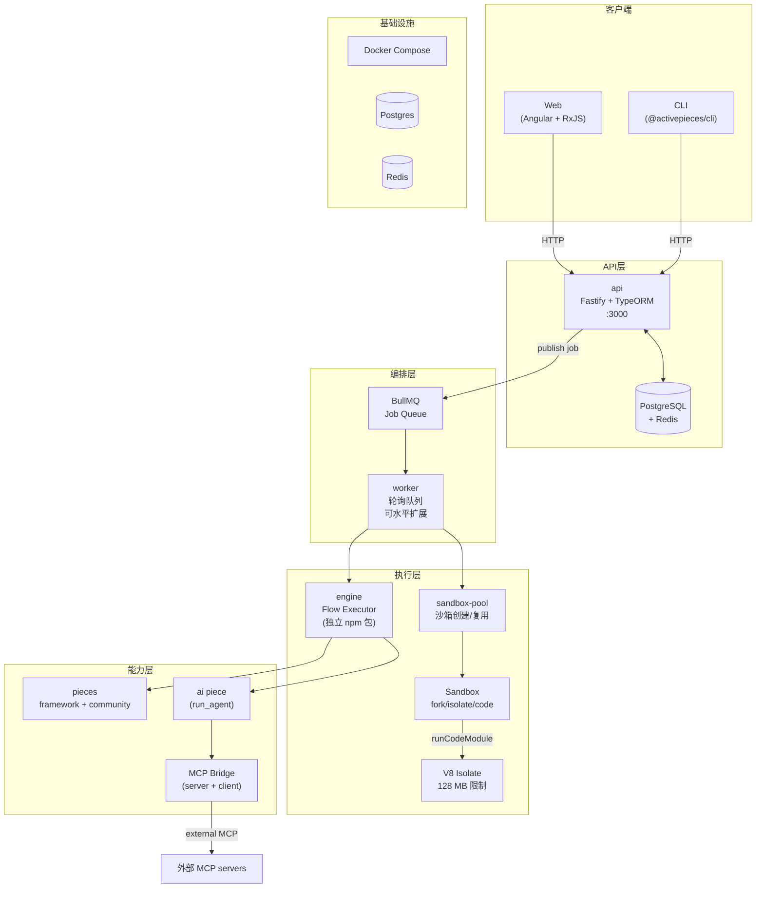
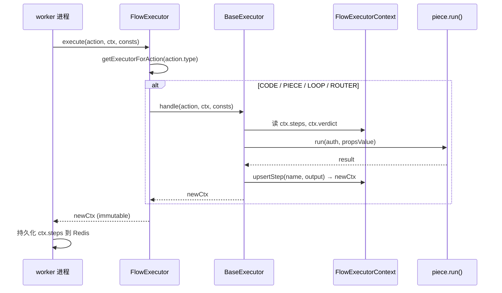
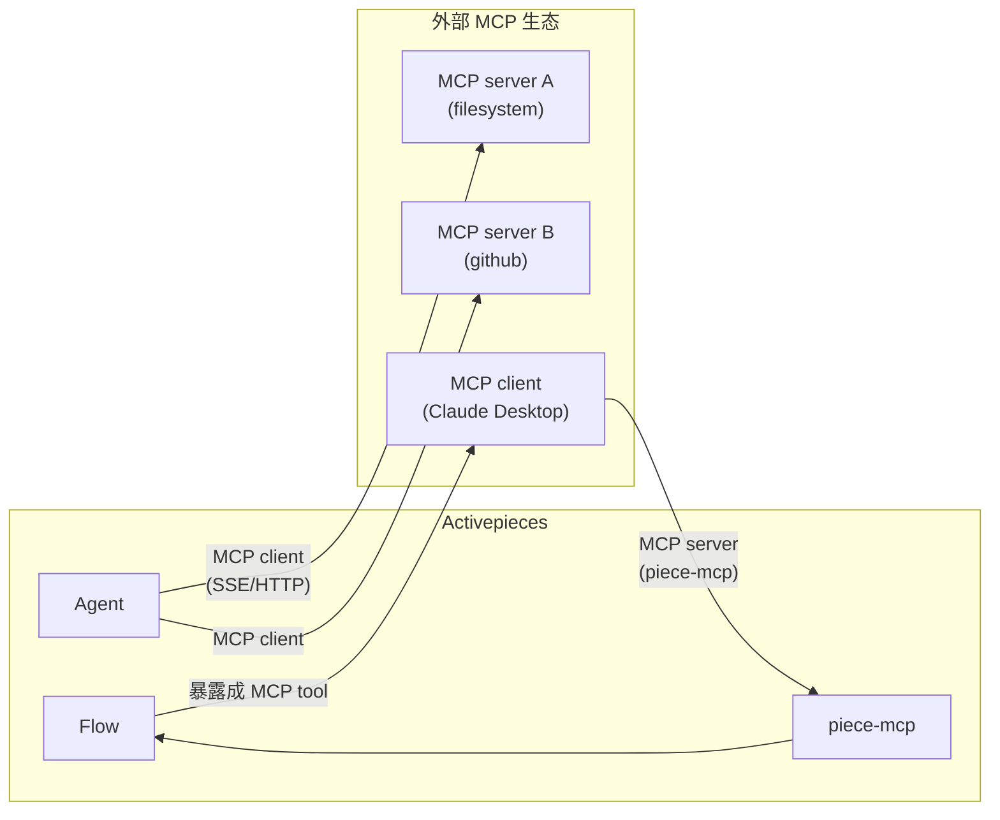
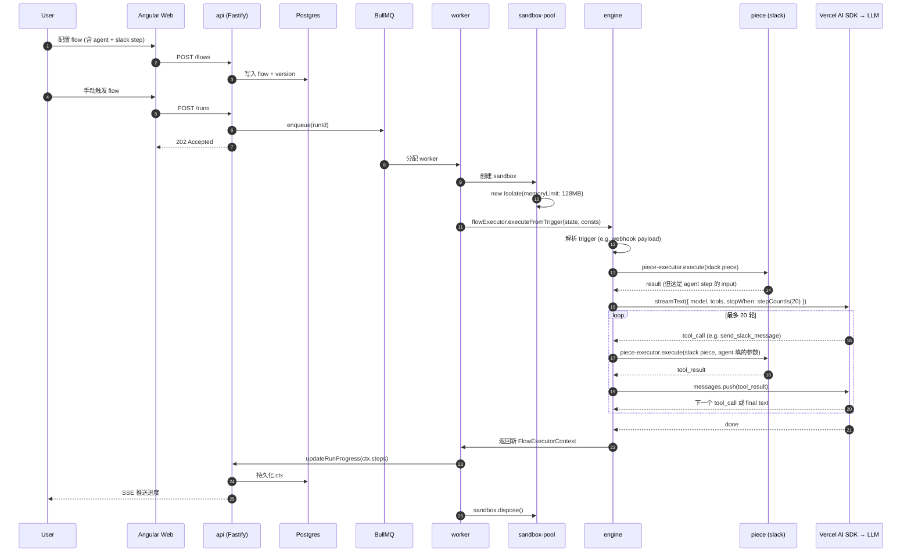

## 一、引子：当自动化平台遇上 AI Agent

2025 年开始，自动化赛道出现了一个清晰的分水岭：传统的 n8n、Zapier、Make 解决的是「触发 → 动作 → 触发」的确定型工作流，而 2025-2026 年兴起的 AI Agent 需求——「我描述目标，模型自己决定调什么 API、跑几次循环」——正在把这条赛道重新洗牌。

[activepieces/activepieces](https://github.com/activepieces/activepieces) 给出了一个非常工程化的答案：**把已有的 720+ 集成（pieces）同时暴露给两种调用方——确定性 flow 的 step 和非确定性 agent 的 tool**。一条 flow 里既可以编排一段精确的「Webhook → Slack → 写数据库」流水线，又能在某个 step 里塞进一个 AI agent，让 LLM 自己选 piece 当工具调用。

截至 2026-06-22，该项目 ⭐22,930 / forks 3,841，TypeScript 单语言，**最新提交就在当天**，license 是 MIT（仓库无显式 SPDX，根目录 LICENSE 文件是 MIT）。本文不堆功能列表，而是把它当一个 TypeScript 工程样本——讲清楚：

- 它的 **四进程 monorepo** 怎么把 HTTP API、长任务 worker、流程执行引擎、沙箱隔离四件事拆开
- **BaseExecutor 多态 + FlowExecutorContext 不可变状态** 的执行引擎设计
- **V8 Isolate 沙箱** 怎么承载用户写的 JavaScript code step
- **Piece → AI Agent Tool** 的双向桥（Vercel AI SDK + 4 类 tool union）
- **MCP 双向集成**（同时是 MCP server 和 MCP client）

读完后你应该能回答：**为什么 Activepieces 在 TypeScript 生态里是「AI-First workflow automation」这个细分赛道的工程模板**——以及它的取舍代价在哪。

## 二、项目定位与核心价值

**一句话定义**：Activepieces 是开源的「AI-First」工作流自动化平台，让开发者用 720+ 现成 pieces + AI Agent + MCP 在可视化画布上编排复杂任务。

仓库元信息（取自 GitHub API，2026-06-23）：

| 指标 | 数值 |
|------|------|
| Stars | 22,930 |
| Forks | 3,841 |
| 语言 | TypeScript (100% monorepo) |
| License | MIT |
| 最近 commit | 2026-06-22 22:59 UTC |
| 仓库体积 | ~580 MB（包含 720 个 community pieces 的源码） |
| topics | ai-agent, mcp, mcp-server, n8n-alternative, no-code-automation, workflow |
| Homepage | https://www.activepieces.com |

**核心能力矩阵**：

| 能力 | 形态 | 说明 |
|------|------|------|
| 集成生态 | 720+ community pieces | 每个 piece = 一个 npm package，独立版本号 |
| AI 编排 | `ai` piece 的 `run_agent` action | 包装 Vercel AI SDK，支持 4 类 tool |
| MCP | 双向：server + client | flow → MCP server；agent → MCP client |
| 执行沙箱 | V8 Isolate + isolated-vm | 用户 code step 跑在独立 V8 实例，128 MB 内存上限 |
| 沙箱拓扑 | sandbox-pool + worker | `EXECUTION_MODE` 切换 fork / isolate / 完全模拟 |
| 部署形态 | Docker / 自托管 / SaaS | 三种 edition: `CE`、`EE`、`Cloud` |

它和 n8n、Zapier 最大的差别在哪？**AI Agent 不是外挂，而是 first-class action**——flow step 里能直接调用一个 agent，agent 内部又能把 piece 当 tool 用。这种「flow ↔ agent ↔ piece」的三层递归，是 Activepieces 区别于其他 workflow 工具的核心架构选择。

## 三、整体架构

打开仓库第一眼看到的是 Bun + Turbo 的 monorepo：`packages/` 目录下七个 workspace，每个都有独立 `package.json`。



**关键解耦点**：

1. **`engine` 是独立 npm 包**——可以在 worker 内嵌，也可以被远程 API 单独调用。这种「执行逻辑与 HTTP 服务解耦」让引擎可以被前端预览、test runner、CLI 共享。
2. **`sandbox-pool` 单独成包**——因为它依赖 `isolated-vm`（C++ 扩展），把它隔离到独立进程方便按需加载，避免污染 worker 主进程的 V8。
3. **Piece framework 与 Engine 分层**——`packages/pieces/framework` 定义 Action/Trigger/Property 的契约，`packages/server/engine` 只负责按契约执行。

**docker-compose.yml 摘录**（仓库根目录）：

```yaml
services:
  app:
    image: ghcr.io/activepieces/activepieces:0.83.0
    container_name: activepieces-app
    restart: unless-stopped
    ports:
      - '8080:80'
    depends_on:
      - postgres
      - redis
    env_file: .env
    environment:
      - AP_CONTAINER_TYPE=APP
    volumes:
      - ./cache:/usr/src/app/cache

  worker:
    image: ghcr.io/activepieces/activepieces:0.83.0
    restart: unless-stopped
    depends_on:
      - app
    env_file: .env
    environment:
      - AP_CONTAINER_TYPE=WORKER
    deploy:
      replicas: 5              # 默认 5 个 worker 副本
```

`AP_CONTAINER_TYPE` 是「同镜像多角色」的关键——同一个 docker 镜像根据环境变量切成 app / worker 两种身份，避免维护两套镜像。

## 四、应用类型：Piece 的双形态契约

在 Activepieces 里，一个 piece 同时是**两件事**：

1. **Flow 里的 Action/Trigger**：可视化画布上一个节点，用户拖拽配置参数
2. **Agent 的 Tool**：被 AI agent 当作函数调用

这两件事对应 piece framework 里两个不同但并列的抽象：

```typescript
// packages/pieces/framework/src/lib/piece.ts（核心类）
export class Piece<PieceAuth> {
  private readonly _actions: Record<string, Action> = {};
  private readonly _triggers: Record<string, Trigger> = {};

  constructor(
    public readonly displayName: string,
    public readonly logoUrl: string,
    public readonly authors: string[],
    public readonly events: PieceEventProcessors | undefined,
    actions: Action[],
    triggers: Trigger[],
    public readonly categories: PieceCategory[],
    public readonly auth?: PieceAuth,
    public readonly description = '',
  ) {
    actions.forEach((action) => (this._actions[action.name] = action));
    triggers.forEach((trigger) => (this._triggers[trigger.name] = trigger));
  }

  getAction(actionName: string): Action | undefined { return this._actions[actionName]; }
  getTrigger(triggerName: string): Trigger | undefined { return this._triggers[triggerName]; }
}
```

piece 本身只是个**注册表**，真正的行为在 `Action` 和 `Trigger` 里。看一个真实 piece（Slack 的 `send-message` action）：

```typescript
// packages/pieces/community/slack/src/lib/actions/send-message.ts
import { createAction, Property } from '@activepieces/pieces-framework';
import { slackAuth } from '../auth';
import { WebClient } from '@slack/web-api';

export const sendMessageAction = createAction({
  name: 'send_message',
  displayName: 'Send Message',
  description: 'Send a message to a Slack channel',
  auth: slackAuth,
  props: {
    channel: Property.Dropdown({ ... }),
    text: Property.LongText({ displayName: 'Message', required: true }),
  },
  async run({ auth, propsValue }) {
    const client = new WebClient(auth.access_token);
    return await client.chat.postMessage({
      channel: propsValue.channel as string,
      text: propsValue.text as string,
    });
  },
});
```

**Action 的运行时契约**只有两个：

- `props`：参数 schema（Property DSL，框架会反射生成前端表单）
- `run(context)`：接收 auth + 用户填的 propsValue，返回任意 JSON

这种极简契约是 piece 生态能扩到 720+ 的根本原因——开发者不需要懂 flow、不需要懂 agent，**只要写一个普通 async function**。

**Audience 字段的隐藏含义**：

```typescript
// packages/pieces/framework/src/lib/piece-metadata.ts
export const Audience = z.enum(['human', 'ai', 'both']);
```

每个 action 可以声明 `audience`：
- `'human'`：只出现在画布上让用户手动配
- `'ai'`：只对 agent 暴露（user 不能在 UI 配）
- `'both'`：两者都能用

这个字段是 Activepieces 把 piece **同时接入两种调用方**的关键开关。

## 五、核心引擎一：FlowExecutor 与多态执行器

Activepieces 的 flow 执行引擎是其最精彩的部分。设计目标是：**同一段代码能执行 4 种语义完全不同的 step（code、piece、loop、router），但保持上下文状态一致**。

### 5.1 BaseExecutor 多态抽象

每个 step 类型都实现一个 `BaseExecutor<T>` 接口：

```typescript
// packages/server/engine/src/lib/handler/base-executor.ts
export interface BaseExecutor<T extends FlowAction> {
  handle(params: {
    action: T;
    executionState: FlowExecutorContext;
    constants: EngineConstants;
  }): Promise<FlowExecutorContext>;
}
```

`FlowExecutorContext` 是**不可变状态对象**——每次执行后返回一个新的 context，原 context 不修改。

### 5.2 FlowExecutor 注册表

```typescript
// packages/server/engine/src/lib/handler/flow-executor.ts
function getExecuteFunction(): Record<FlowActionType, BaseExecutor<FlowAction>> {
  return {
    [FlowActionType.CODE]: codeExecutor,
    [FlowActionType.LOOP_ON_ITEMS]: loopExecutor,
    [FlowActionType.PIECE]: pieceExecutor,
    [FlowActionType.ROUTER]: routerExecuter,
  };
}

export const flowExecutor = {
  getExecutorForAction(type: FlowActionType): BaseExecutor<FlowAction> {
    const executor = getExecuteFunction()[type];
    if (isNil(executor)) {
      throw new EngineGenericError('ExecutorNotFoundError',
        `Executor not found for action type: ${type}`);
    }
    return executor;
  },

  async execute({ action, executionState, constants }: {
    action: FlowAction | null | undefined;
    executionState: FlowExecutorContext;
    constants: EngineConstants;
  }): Promise<FlowExecutorContext> {
    if (isNil(action)) return executionState.finishExecution();
    const executor = flowExecutor.getExecutorForAction(action.type);
    return await executor.handle({ action, executionState, constants });
  },
};
```



**为什么用 immutable state 而不是 mutable 引用？** 因为 flow 可能被暂停（webhook 回调、AI 流式输出），恢复时需要回放历史——不可变状态天然支持「checkpoint + replay」。

### 5.3 FlowExecutorContext 内部结构

```typescript
// packages/server/engine/src/lib/handler/context/flow-execution-context.ts
export class FlowExecutorContext {
  tags: readonly string[];
  steps: Readonly<Record<string, StepOutput>>;
  verdict: FlowVerdict;
  currentPath: StepExecutionPath;        // 用于嵌套 loop 定位
  stepNameToTest?: boolean;
  stepsCount: number;
  resolvedStepOutputCache: Map<string, Promise<unknown>>;  // Promise cache!
  slicingEnabled: boolean;              // 大日志自动切片
  duration: number;

  static empty(params?: FlowExecutorContextInit): FlowExecutorContext {
    return new FlowExecutorContext({
      engineApi: params?.engineApi,
      slicingEnabled: params?.slicingEnabled,
    });
  }

  public upsertStep(stepName: string, output: StepOutput): FlowExecutorContext {
    return new FlowExecutorContext({
      ...this,
      steps: { ...this.steps, [stepName]: output },
    });
  }
}
```

注意 `resolvedStepOutputCache: Map<string, Promise<unknown>>`——**值是 Promise 而不是值本身**。这意味着同一 step 的同一参数只解析一次，并发的多个 step 引用同一 promise，**自动去重 + 失败一次全部失败**。

### 5.4 RouterExecutor：分支选择器

Router 是 Activepieces 的「if-else」step。看实现：

```typescript
// packages/server/engine/src/lib/handler/router-executor.ts
export const routerExecuter: BaseExecutor<RouterAction> = {
  async handle({ action, executionState, constants }) {
    const { resolvedInput } = await constants.getPropsResolver(...).resolve({
      unresolvedInput: { ...action.settings },
      executionState,
    });

    switch (resolvedInput.executionType) {
      case RouterExecutionType.EXECUTE_ALL_MATCH:
        return handleRouterExecution({ ..., routerExecutionType: RouterExecutionType.EXECUTE_ALL_MATCH });
      case RouterExecutionType.EXECUTE_FIRST_MATCH:
        return handleRouterExecution({ ..., routerExecutionType: RouterExecutionType.EXECUTE_FIRST_MATCH });
      default:
        throw new EngineGenericError(...);
    }
  },
};
```

支持两种分支策略：
- `EXECUTE_ALL_MATCH`：所有条件为 true 的 branch 全部执行（并行）
- `EXECUTE_FIRST_MATCH`：只执行第一个匹配（短路）

`evaluateConditions` 用递归下降解析条件树，支持 AND/OR/NOT 嵌套。

### 5.5 LoopExecutor：嵌套循环的路径追踪

Loop 是 Activepieces 里最容易出 bug 的地方——嵌套循环需要**路径追踪**才能正确恢复上下文。看核心代码：

```typescript
// packages/server/engine/src/lib/handler/loop-executor.ts
for (let i = 0; i < resolvedInput.items.length; ++i) {
  const newCurrentPath = newExecutionContext.currentPath.loopIteration({
    loopName: action.name,
    iteration: i,
  });

  stepOutput = stepOutput.setItemAndIndex({ item: resolvedInput.items[i], index: i + 1 });

  // 关键：每次迭代 upsertStep 都更新 currentPath
  newExecutionContext = (await newExecutionContext
    .upsertStep(action.name, stepOutput))
    .setCurrentPath(newCurrentPath);

  // 递归调用 flowExecutor 执行 firstLoopAction
  newExecutionContext = await flowExecutor.execute({
    action: nextAction,
    executionState: newExecutionContext,
    constants,
  });
}
```

`StepExecutionPath` 用类似 `loop1.iter3.loop2.iter1` 的字符串路径定位嵌套位置，配合 `executionJournal.getStateAtPath()` 在嵌套结构里精准定位 step 输出。

## 六、核心引擎二：V8 Isolate 沙箱与 Code Executor

用户写在 flow 里的「Code step」是 JavaScript 脚本——**这玩意执行时不能 crash 整个 worker，更不能访问宿主的 Node 模块**。Activepieces 的解决方案是 `isolated-vm`（Laverdet/isolated-vm，Node 上唯一的 C++ V8 Isolate 绑定）。

### 6.1 沙箱入口

```typescript
// packages/server/engine/src/lib/core/code/v8-isolate-code-sandbox.ts
const ONE_HUNDRED_TWENTY_EIGHT_MEGABYTES = 128;

export const v8IsolateCodeSandbox: CodeSandbox = {
  async runCodeModule({ codeFilePath, inputs }) {
    const ivm = getIvm();
    const isolate = new ivm.Isolate({ memoryLimit: ONE_HUNDRED_TWENTY_EIGHT_MEGABYTES });

    try {
      const isolateContext = await initIsolateContext({
        isolate,
        codeContext: { inputs },
      });
      const source = await readFile(codeFilePath, 'utf8');
      return await executeIsolate({
        isolate,
        isolateContext,
        code: wrapCjsModule(source),
      });
    }
    finally {
      isolate.dispose();   // 关键：每次都 dispose，强制回收内存
    }
  },
  // ...
};
```

**关键设计决策**：

1. **每次 runCodeModule 都 `new ivm.Isolate(...)`**——完全隔离，连全局变量都不共享。这是为了防止恶意 piece 污染同进程其他 task。
2. **`memoryLimit: 128`**——128 MB 硬上限，超出 OOM。这是 `isolated-vm` 的杀手锏特性：纯 Node 进程的 `vm.runInNewContext` 无法限制内存。
3. **`finally { isolate.dispose() }`**——必须手动释放，否则 C++ 侧 Isolate 对象会泄漏。

### 6.2 Sandbox 的三种执行模式

Activepieces 的沙箱不止 V8 Isolate。看 `ExecutionMode` 枚举：

```typescript
// packages/server/sandbox-pool/src/lib/create-sandbox-for-job.ts
export function isIsolateMode(mode: ExecutionMode): boolean {
  return mode === ExecutionMode.SANDBOX_PROCESS
      || mode === ExecutionMode.SANDBOX_CODE_AND_PROCESS;
}

function getProcessMaker(executionMode: string, log: ApLogger, boxId: number, paths: ...) {
  // 根据 EXECUTION_MODE 选择不同 processMaker
  // - SANDBOX_PROCESS: 用 isolateProcess（OS 级进程隔离）
  // - SANDBOX_CODE_AND_PROCESS: V8 Isolate + 进程隔离
  // - UNSANDBOX: 直接跑（开发模式）
}
```

| 模式 | 隔离粒度 | 性能开销 | 适用场景 |
|------|----------|----------|----------|
| `UNSANDBOX` | 无 | 0 | 本地开发 |
| `SANDBOX_PROCESS` | OS 进程 | 中等 | 生产环境 piece 执行 |
| `SANDBOX_CODE_AND_PROCESS` | 进程 + V8 Isolate | 较高 | 高安全要求 + code step 频繁 |

### 6.3 真实的 code step

用户在画布里写的 code step 会被编译到一个文件，然后传给沙箱执行：

```javascript
// 用户在画布里写：
export const code = async (inputs) => {
  const items = inputs.items;
  return {
    summary: items.filter(x => x.active).length,
    total: items.length,
  };
};
```

`Code Executor` 会：
1. 把用户代码 + 自动生成的 `import` + `export` 包装成 CommonJS 模块
2. 写到临时文件（`codeFilePath`）
3. 调用 `v8IsolateCodeSandbox.runCodeModule({ codeFilePath, inputs })`
4. 把 sandbox 的返回值通过 `JSON.parse(JSON.stringify(...))` 序列化回主进程（structuredClone 限制）

## 七、核心引擎三：AI Agent 与 Vercel AI SDK 桥接

Activepieces 的 AI Agent 不是自研——它**直接包装 Vercel AI SDK 的 `streamText`**，然后把 piece / flow / MCP / Knowledge Base 翻译成 AI SDK 的 `tools`。

### 7.1 Agent Tool 的四类型 Union

```typescript
// packages/core/execution/src/lib/agents/tools.ts
export enum AgentToolType {
  PIECE = 'PIECE',
  FLOW = 'FLOW',
  MCP = 'MCP',
  KNOWLEDGE_BASE = 'KNOWLEDGE_BASE',
}

export const AgentMcpTool = z.object({
  type: z.literal(AgentToolType.MCP),
  toolName: z.string().min(1),
  serverUrl: z.string().url(),
  protocol: z.nativeEnum(McpProtocol),     // SSE / streamable-http / http
  auth: McpAuthConfig,                     // discriminated union: 4 种鉴权
});

export const AgentPieceTool = z.object({
  type: z.literal(AgentToolType.PIECE),
  toolName: z.string(),
  pieceMetadata: AgentPieceToolMetadata,   // pieceName + actionName + 版本
  predefinedInput: PredefinedInputsStructure.optional(),  // 预填值
});
```

**`predefinedInput` 字段是 Activepieces 的亮点设计**——它允许「piece 已经被配好一半参数，agent 只填剩下的」。这就是为什么用户在画布里可以拖一个 Slack piece 给 agent 用，但不让 agent 决定 channel（channel 是预填的）。

### 7.2 run_agent action 的实现骨架

```typescript
// packages/pieces/community/ai/src/lib/actions/agents/run-agent.ts
export const runAgent = createAction({
  name: 'run_agent',
  displayName: 'Run Agent',
  description: 'Handles complex, multi-step tasks by reasoning through problems...',
  auth: PieceAuth.None(),
  props: {
    [AgentPieceProps.PROMPT]: Property.LongText({ ..., required: true }),
    [AgentPieceProps.AI_PROVIDER_MODEL]: Property.Object({ ..., required: true }),
    [AgentPieceProps.AGENT_TOOLS]: Property.Array({ ... }),
    [AgentPieceProps.STRUCTURED_OUTPUT]: Property.Array({ ... }),
    [AgentPieceProps.MAX_STEPS]: Property.Number({ defaultValue: 20 }),
    [AgentPieceProps.WEB_SEARCH]: Property.Checkbox({ defaultValue: false }),
  },
  async run({ auth, propsValue }) {
    const { model } = createAIModel(propsValue.aiProviderModel);
    const tools = constructAgentTools(propsValue.agentTools);

    const result = streamText({
      model,
      prompt: propsValue.prompt,
      tools,
      stopWhen: stepCountIs(propsValue.maxSteps),  // 关键：循环上限
    });

    return agentOutputBuilder.build(result);  // 流式聚合 + 工具调用记录
  },
});
```

**用 Vercel AI SDK 的 `streamText` 而不是 LangChain**——因为 AI SDK 原生支持 tool union 和 stopWhen 控制，对 LLM tool calling 的支持是「第一公民」，不是「中间层翻译」。

### 7.3 MCP 双向集成

Activepieces 是 MCP 生态里少见的「双向桥」：



**Activepieces 当 MCP Server**：

```typescript
// packages/core/shared/src/lib/automation/mcp/mcp.ts
export const MCP_TRIGGER_PIECE_NAME = '@activepieces/piece-mcp';

export enum McpServerType {
  PLATFORM = 'PLATFORM',    // 全平台共享
  PROJECT = 'PROJECT',      // 项目级私有
}

export type McpToolDefinition = {
  title: string;
  description: string;
  inputSchema: Record<string, z.ZodTypeAny>;
  annotations?: {
    readOnlyHint?: boolean;
    destructiveHint?: boolean;
    idempotentHint?: boolean;
    openWorldHint?: boolean;
  };
  permission?: Permission;
  execute: (args: Record<string, unknown>) => Promise<McpToolResult>;
};
```

平台级的 MCP server 可以让 Claude Desktop 直接调 Activepieces 里的 flow，每个 flow 自动转成一个 MCP tool（annotations 标记可读/可破坏/幂等/是否需要外部网络）。

**Activepieces 当 MCP Client**：

```typescript
// packages/core/execution/src/lib/agents/mcp.ts
export function buildAuthHeaders(authConfig: McpAuthConfig): Record<string, string> {
  switch (authConfig.type) {
    case McpAuthType.NONE: break;
    case McpAuthType.HEADERS: return authConfig.headers;
    case McpAuthType.ACCESS_TOKEN:
      return { 'Authorization': `Bearer ${authConfig.accessToken}` };
    case McpAuthType.API_KEY:
      return { [authConfig.apiKeyHeader]: authConfig.apiKey };
  }
}
```

Agent 工具声明里的 `AgentMcpTool` 直接被翻译成 MCP client call——`serverUrl` + `protocol`（SSE/streamable-http/HTTP） + 4 种 auth（None/Headers/Bearer/APIKey）。

## 八、Provider 抽象层：10+ 家 LLM 的统一接口

Activepieces 支持的 AI provider 不止 OpenAI / Anthropic——它内置了 11 种：

```typescript
// packages/core/shared/src/lib/management/ai-providers/index.ts
export enum AIProviderName {
  ACTIVEPIECES = 'activepieces',
  ANTHROPIC = 'anthropic',
  AZURE = 'azure',
  BEDROCK = 'bedrock',
  CLOUDFLARE_GATEWAY = 'cloudflare-gateway',
  GOOGLE = 'google',
  MISTRAL = 'mistral',
  OPENAI = 'openai',
  OPENAI_COMPATIBLE = 'openai-compatible',   // 任意 OpenAI 协议
  OPENROUTER = 'openrouter',
  // ...
}

export const OpenAICompatibleProviderConfig = z.object({
  apiKeyHeader: z.string(),
  baseUrl: z.string(),
  models: z.array(ProviderModelConfig),
  defaultHeaders: z.record(z.string(), z.string()).optional(),
});

export const BedrockProviderAuthConfig = z.object({
  accessKeyId: z.string().min(1),
  secretAccessKey: z.string().min(1),
});
```

**两个值得注意的设计**：

1. **`OPENAI_COMPATIBLE` provider**——任何走 OpenAI Chat Completions 协议的 LLM（Ollama、vLLM、DeepSeek、自部署 Qwen）都可以零代码接入。用户填 `baseUrl` + `models` 列表就行。
2. **`CLOUDFLARE_GATEWAY`**——通过 Cloudflare AI Gateway 转发，享受缓存 + 限流 + 成本分析。这是个企业级 feature，小项目一般用不到。

## 九、端到端数据流

把前面所有模块串起来，看一个真实的 AI Agent + Slack 通知场景：



**几个关键观察**：

1. **同一个 piece 同时被两个执行器用**——flow 编排时是确定性 step；agent 决定调它是 tool call。piece 不感知差异。
2. **Sandbox 复用**：根据 `reusable: true` 决定是否复用 Isolate（高频短任务减少开销）。
3. **Progress 通过 worker → API 反向推送**（不是 DB 轮询），所以前端能 SSE 流式看到每一步完成。

## 十、与同类项目对比

| 维度 | Activepieces | n8n | Zapier | Flowise | Langflow |
|------|--------------|-----|--------|---------|----------|
| **核心形态** | 工作流 + Agent | 工作流 | 工作流 (SaaS) | Agent + Chain | Agent + Chain |
| **语言** | TypeScript | TypeScript | n/a | TypeScript | Python |
| **集成数量** | 720+ | 400+ | 7000+ | ~50 | ~30 |
| **AI Agent** | first-class | 外挂 (LangChain) | 弱 | 第一公民 | 第一公民 |
| **MCP 支持** | 双向 | 仅 client | 无 | 无 | 无 |
| **Code 沙箱** | V8 Isolate + 进程 | subprocess | n/a | subprocess | subprocess |
| **部署** | 自托管 + 云 | 自托管 + 云 | 仅云 | 自托管 + 云 | 自托管 + 云 |
| **可定制 piece** | 极简 TS 函数 | 中等 | 闭源 | 需改源码 | 需改源码 |
| **License** | MIT | Sustainable Use | 商业 | Apache 2.0 | MIT |

**设计差异分析**：

1. **vs n8n**：n8n 把 AI 能力做成「AI node」，每个 node 调一次 LLM；Activepieces 把整段 flow 包装成 agent，agent 内部可以用任意 piece。**Activepieces 的 piece-to-tool 桥比 n8n 的 node-encapsulation 更通用**——同一个 Slack piece 既能被 flow 确定性用，也能被 agent 非确定性用。
2. **vs Langflow / Flowise**：它们是 LLM chain 编排工具，集成数量少（30-50）；Activepieces 走的是「先集成生态，再 AI 化」路线。**当你的需求是「混合确定性流 + AI 步骤」时 Activepieces 更合适**；纯 LLM 应用 Langflow 更聚焦。
3. **vs Zapier**：Zapier 闭源 + SaaS only；Activepieces 自托管 + MIT。**企业级数据合规场景 Activepieces 是目前唯一可选**。

## 十一、优缺点分析

| 维度 | Activepieces | 评价 |
|------|--------------|------|
| **架构简洁性** | ✅ TypeScript monorepo 单语言，BaseExecutor 多态清晰 | 4 进程（api/worker/engine/sandbox-pool）分层合理 |
| **可扩展性** | ✅ 720+ piece 生态，piece 框架极简（createAction + props + run） | 加一个新集成只需 ~50 行 TS |
| **易用性** | ✅ Angular Web 拖拽，AI agent 是 first-class action | 学习曲线：理解 piece / flow / agent / sandbox 四个抽象 |
| **性能** | ⚠️ V8 Isolate 创建开销不可忽略；flow checkpoint 频繁落 DB | 高并发场景需要调 worker replicas 和 Isolate 复用 |
| **复杂度** | ⚠️ 三层递归（flow ↔ agent ↔ piece）调试链路长 | bug 可能出现在 piece / sandbox / AI SDK / worker 任意一层 |
| **维护性** | ✅ CE/EE/Cloud 三 edition 隔离，AGENTS.md 写明 hook 注入点 | 仓库 580 MB，clone 慢 |
| **MCP 协议** | ✅ 双向（server + client） | 业界少见的「既是 MCP 用户又是 MCP 服务商」 |
| **生态广度** | ⚠️ 720 pieces vs Zapier 7000+，垂直领域仍缺 | 医疗/法律/金融垂直集成少 |

**最关键的取舍**：Activepieces 把「flow ↔ agent ↔ piece」设计成递归结构，**结果是任何一方升级都会牵动另两方**。比如把 piece 改成支持流式输出，需要同步改 piece executor、agent tool 调用、flow UI。这是 n8n/Zapier 走「扁平 node」路线没有的代价。

## 十二、实践：本地启动一个 AI Agent flow

下面展示一个完整可运行的最小例子：本地启动 Activepieces，创建一个含 AI agent 的 flow。

### 12.1 docker-compose 启动

```bash
git clone https://github.com/activepieces/activepieces.git
cd activepieces
cp .env.example .env
docker compose up -d
```

启动后访问 `http://localhost:8080`，首次进入会引导创建账号。

### 12.2 添加 OpenAI Provider

Settings → AI Providers → Add：

```yaml
Provider: OpenAI
API Key: sk-xxx
Models:
  - gpt-4o
  - gpt-4o-mini
```

### 12.3 创建 AI Agent flow

UI 操作（无法用 CLI 替代）：

1. 新建 Flow → 选 Trigger = `Schedule`（每 5 分钟）
2. 添加 Step → 选 `AI` piece → `Run Agent`
3. 配置：
   - **Prompt**: "Search Hacker News for the latest AI news, summarize top 3, post to Slack #ai-news"
   - **AI Model**: gpt-4o
   - **Agent Tools**: 加 3 个
     - `@activepieces/slack` → `send_message`（预填 channel = `#ai-news`）
     - Web Search（内置）
     - `@activepieces/http` → `http_request`（Hacker News API）
   - **Max Steps**: 20
4. 保存并启用

执行后：

- agent 调 web search → 拿到 Hacker News 链接
- agent 调 http_request 抓 HTML
- agent 决定调用 slack.send_message，预填 channel + 自动填 text
- flow 完成，前端看到 20 步内的 tool_call 链

### 12.4 用 API 创建 Flow（可选）

```bash
curl -X POST http://localhost:8080/api/v1/flows \
  -H "Authorization: Bearer <YOUR_API_KEY>" \
  -H "Content-Type: application/json" \
  -d '{
    "displayName": "AI News Daily",
    "trigger": {
      "type": "SCHEDULE",
      "settings": { "cron": "0 9 * * *" }
    },
    "steps": [
      {
        "type": "PIECE",
        "settings": {
          "pieceName": "@activepieces/ai",
          "actionName": "run_agent",
          "pieceVersion": "0.78.2",
          "input": {
            "prompt": "Find AI news, post to Slack #ai-news",
            "aiProviderModel": { "provider": "openai", "model": "gpt-4o" },
            "maxSteps": 20,
            "agentTools": [
              {
                "type": "PIECE",
                "toolName": "send_message",
                "pieceMetadata": {
                  "pieceName": "@activepieces/slack",
                  "actionName": "send_message",
                  "pieceVersion": "0.30.0",
                  "predefinedInput": {
                    "fields": {
                      "channel": { "mode": "choose-yourself", "value": "#ai-news" }
                    }
                  }
                }
              }
            ]
          }
        }
      }
    ]
  }'
```

### 12.5 MCP server 暴露（高级）

Settings → MCP Servers → Create：

```typescript
{
  name: "ai-news-flow",
  type: "PROJECT",
  // 自动把这个 flow 暴露成 MCP tool
  // Claude Desktop / Cursor 可以直接调用
}
```

Claude Desktop 的 `claude_desktop_config.json`：

```json
{
  "mcpServers": {
    "activepieces": {
      "url": "http://localhost:8080/api/v1/mcp/<SERVER_ID>/sse",
      "transport": "sse"
    }
  }
}
```

启动 Claude Desktop 后，它会看到 Activepieces 里的所有 flow 作为 tool，可以直接调。

## 十三、趋势与总结

### 13.1 三个值得关注的趋势

1. **「Flow-as-MCP-Tool」成为新标准**：随着 MCP 协议被 ChatGPT / Claude / Cursor 全面支持，把已有 flow 暴露成 MCP server 是最低成本的 AI 化路径。Activepieces 已经支持，但 n8n 还没原生支持，这是它的差异化优势。
2. **「Piece-to-Tool」的 audience 模式可能成为行业范式**：Activepieces 用一个 `audience: 'human' | 'ai' | 'both'` 字段同时接入 UI 和 LLM，比 LangChain 的 Tool 抽象 + 独立 UI 抽象更简洁。预计 2026 下半年会有更多自动化平台跟进这个设计。
3. **V8 Isolate 取代 subprocess 成为默认沙箱**：`isolated-vm` 解决了 Node 生态长期缺乏内存硬上限的问题。随着 AI agent 需要频繁执行用户代码（code step），V8 Isolate 的延迟优势（微秒级 vs 进程级毫秒）会越来越明显。

### 13.2 工程经验提炼

读这个项目的源码，最大的三个工程教训：

1. **「不可变状态 + checkpoint + replay」是长任务编排的通用解**。Activepieces 把 `FlowExecutorContext` 设计成 immutable 看似浪费内存，实际上换来「暂停 + 恢复 + 多 worker 接手」的免费支持——同样的模式在 Temporal、Inngest 里也能看到。
2. **「同镜像多角色 + env 切身份」比维护多镜像简单**。`AP_CONTAINER_TYPE=APP|WORKER` 让一个 docker 镜像覆盖两种部署形态，减少构建链复杂度。
3. **「piece DSL 反射生成 UI」是低代码平台的可扩展关键**。`Property.Dropdown / LongText / Json` 这种极简 DSL 既能被前端解析成表单，又能被 agent 解析成 tool schema——一份 schema 服务两种调用方。

### 13.3 总结

Activepieces 在 2026 年的 AI workflow 赛道里走了一条**中间路线**：既不像 n8n 那样把 AI 当外挂，也不像 Langflow 那样完全围绕 LLM。它把 720+ 的集成生态 + AI Agent + MCP 协议桥 + V8 Isolate 沙箱**编织成一个递归结构**，让确定性流程和非确定性决策在同一画布上共存。

**适合用 Activepieces 的场景**：
- 企业需要自托管 + 数据合规 + AI Agent
- 已有 100+ 内部 API 想统一接入 AI
- 需要把现有流程暴露给 Claude Desktop / Cursor

**不适合的场景**：
- 纯 LLM 应用（用 Langflow / Flowise 更聚焦）
- 需要 7000+ SaaS 集成（用 Zapier）
- 团队是 Python 重度用户（Activepieces 是 100% TS）

如果你正在调研 workflow 平台，不妨从它的 [pieces/framework](https://github.com/activepieces/activepieces/tree/main/packages/pieces/framework) 开始读——30 个 TypeScript 文件能让你理解「怎么设计一个能被 agent 调用的工具契约」，这个抽象比任何具体框架都更值得长期持有。

---

## 附录：关键资源

- **GitHub**: https://github.com/activepieces/activepieces
- **官网**: https://www.activepieces.com
- **文档**: https://www.activepieces.com/docs
- **Piece 开发指南**: https://www.activepieces.com/docs/build-pieces/building-pieces/overview
- **部署文档**: https://www.activepieces.com/docs/install/overview
- **Discord**: https://discord.gg/2jUXBKDdP8
- **License**: MIT
- **关键源码路径**：
  - `packages/server/engine/src/lib/handler/flow-executor.ts`
  - `packages/server/engine/src/lib/handler/loop-executor.ts`
  - `packages/server/engine/src/lib/handler/router-executor.ts`
  - `packages/server/engine/src/lib/core/code/v8-isolate-code-sandbox.ts`
  - `packages/pieces/framework/src/lib/piece.ts`
  - `packages/pieces/community/ai/src/lib/actions/agents/run-agent.ts`
  - `packages/core/execution/src/lib/agents/tools.ts`
  - `packages/core/shared/src/lib/automation/mcp/mcp.ts`
  - `packages/server/sandbox-pool/src/lib/create-sandbox-for-job.ts`