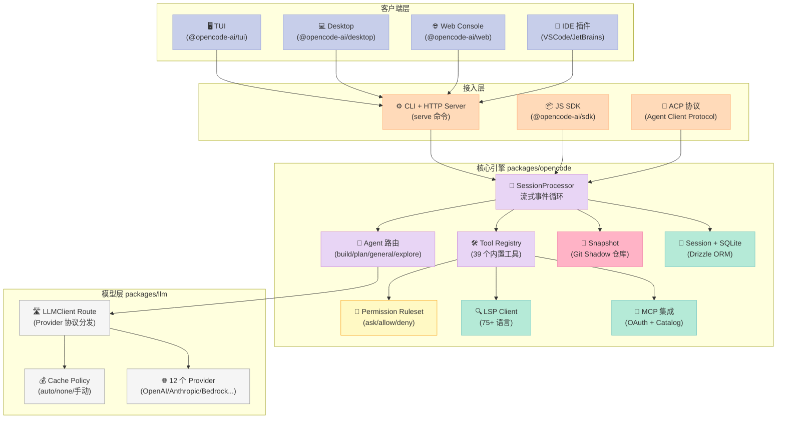
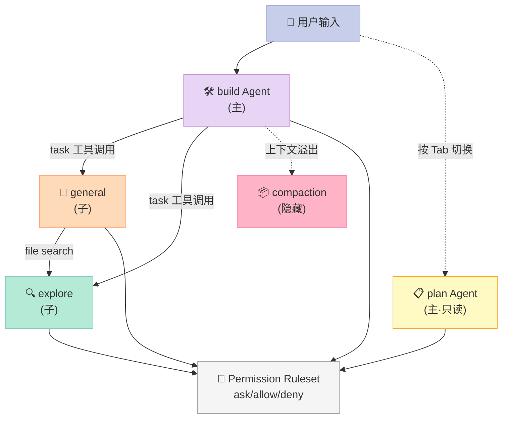
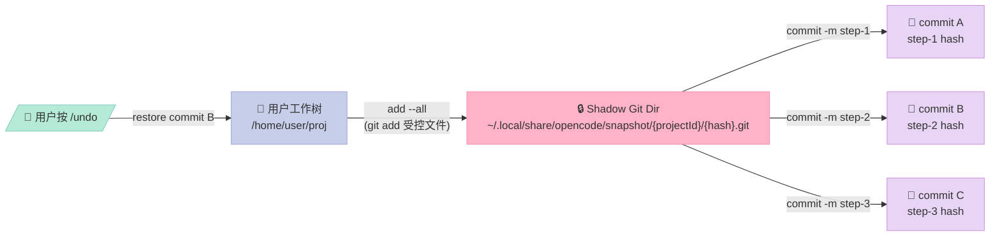
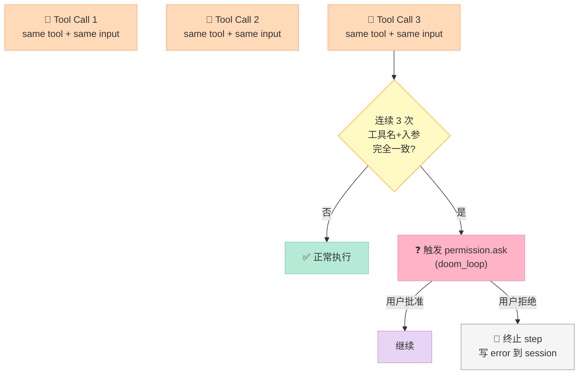
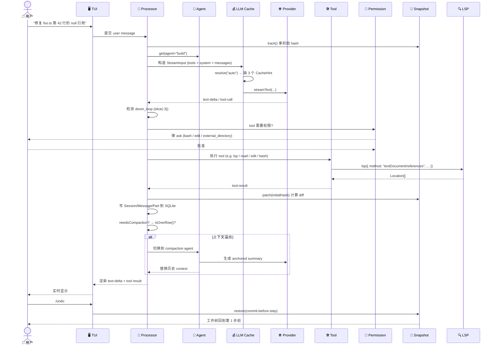

> 一份 `*** Begin Patch ... *** End Patch` 的文本协议 + 一套 Effect 异步运行时 + 一个 Git Shadow 仓库 = 17.7 万 Star 的开源 AI 编码代理。

## 前言

当 Claude Code、Cursor、Windsurf 把"AI 写代码"做成产品级体验时，**OpenCode**（`anomalyco/opencode`）选择走另一条路：把"AI 编码代理"做成完全开源、可自托管、模型无关的命令行/桌面应用。截至 2026 年 6 月，它在 GitHub 拿下 **17.7 万 ⭐、2.17 万 Fork**，周活贡献者上百人，**75+ 编程语言** 开箱即用，被 4.5 万个项目用作依赖。

和之前我拆过的 SWE-Agent（专攻 SWE-Bench 榜单）不同，OpenCode 的定位是**通用 AI 编码代理**——既能在 IDE / 终端里当 Copilot 增强版，也能在 CI 里当自动化重构工具。这篇文章我会从源码出发，把它最具特色的几个设计点拆开：

读完你能拿到：
- **多 Agent 双层架构**（`build` / `plan` / `general` / `explore`）的权限隔离与协作协议
- **Git Shadow 仓库** 实现"无副作用可回滚"的快照机制
- **Doom Loop 防护** 是怎么在 3 次相同工具调用后熔断的
- **75+ LSP 服务**如何被自动发现、生命周期管理、错误恢复
- **`apply_patch` 文本协议**为什么比 `str_replace` / `write_file` 更稳
- 与 Claude Code、SWE-Agent、Cline 的设计差异

## 一、OpenCode 是什么

OpenCode 是一个**模型无关的 AI 编码代理**，支持任何 OpenAI 兼容的 LLM（Claude、GPT、Gemini、DeepSeek、Qwen、本地 Ollama），提供 TUI、桌面端（Electron）、Web 端（Console）三种交互形态。

| 维度 | OpenCode | Claude Code | Cursor | SWE-Agent |
|------|----------|-------------|--------|-----------|
| 形态 | TUI + Desktop + Web | CLI | IDE 插件 | CLI |
| 模型锁定 | ❌ 任意 LLM | ✅ Anthropic | ❌ | ❌ |
| 客户端开源 | ✅ MIT | ❌ | ❌ | ✅ MIT |
| 服务端依赖 | ❌ 全本地 | ❌ 全本地 | ⚠️ SaaS | ❌ 全本地 |
| 桌面端 | ✅ Electron | ❌ | ✅ | ❌ |
| 75+ LSP 内置 | ✅ | ❌ | ⚠️ | ❌ |
| 快照回滚 | ✅ Git Shadow | ⚠️ checkpoint | ⚠️ 内部 | ✅ git stash |
| 协议开放 | ✅ HTTP API + SDK | ❌ | ❌ | ⚠️ |

**它解决的核心问题**有四个：
1. **模型锁定**：让用户不被任何一家 LLM 厂商绑架，本地 Ollama 到 GPT-5 同一套 UI
2. **可回滚的代码修改**：每次工具调用都有 Git 快照，按 `Tab` 一键 `/undo` 回到任意历史点
3. **多 Agent 协作**：主 Agent 干脏活、子 Agent 跑搜索、计划 Agent 禁止改文件
4. **LSP 原生集成**：不仅是补全，而是把 LSP 作为 Agent 工具暴露给 LLM

## 二、整体架构

OpenCode 是一个由 **Bun + Effect + AI SDK** 驱动的 TypeScript monorepo，核心包有 6 个：



### 2.1 关键依赖

| 依赖 | 用途 |
|------|------|
| **`ai` (Vercel AI SDK)** | `streamText` / `generateObject` 统一模型调用入口 |
| **`effect`** | 异步运行时、依赖注入、错误恢复、结构化并发（OpenCode 的"骨架"） |
| **`remeda`** | 函数式工具库（`pipe` / `mergeDeep` / `sortBy`） |
| **`drizzle-orm`** | Session/Message/Part 三表结构化持久化 |
| **`@ai-sdk/anthropic/openai/google-vertex/...`** | 各家 LLM Provider 实现 |
| **`diff`** | 生成 unified diff 格式补丁 |

注意 **OpenCode 不直接调 Anthropic SDK**，而是把所有 Provider 的请求/响应先转换成"标准 Schema"（`packages/llm/src/schema/messages.ts`），再让一个统一的 `streamText` 出口处理——这就是它能"任意模型"的关键。

## 三、多 Agent 双层架构

OpenCode 在 `src/agent/agent.ts` 里注册了 **6 个内置 Agent**，按 `mode` 分为两层：

| Agent | mode | 用途 | 关键权限 |
|-------|------|------|----------|
| `build` | primary | 默认 Agent，full-access 干脏活 | `edit`, `bash`, `webfetch` 全开 |
| `plan` | primary | 只读模式，按 `Tab` 切换 | 所有 `edit` 都 `deny`，`plan_exit` 需用户批准 |
| `general` | subagent | 多步任务并行执行 | `todowrite` 禁用（避免和主 Agent 抢 TODO） |
| `explore` | subagent | 快速代码库搜索 | 只有 `grep` / `glob` / `read` / `bash` |
| `compaction` | primary (hidden) | 上下文压缩（context overflow 时） | 所有工具 `deny`，纯 LLM 调用 |
| `title` / `summary` | primary (hidden) | 自动生成 Session 标题/摘要 | 所有工具 `deny` |



### 3.1 权限隔离的核心：`PermissionV1.Ruleset`

OpenCode 的权限系统**不是简单的"全局 allow/deny"**，而是把每个工具的每个 pattern（glob 路径或工具名）都映射成三种动作：

```typescript
// 来源：packages/core/src/v1/permission.ts（节选）
export const Ruleset = Schema.Array(
  Schema.Struct({
    permission: Schema.String,    // 工具名，如 "edit" / "bash" / "external_directory"
    pattern: Schema.optional(Schema.String), // glob 模式
    action: Schema.Literals(["allow", "deny", "ask"]),
  })
)
```

`build` Agent 的默认权限定义（节选自 `src/agent/agent.ts:115-132`）：

```typescript
const defaults = Permission.fromConfig({
  "*": "allow",                  // 默认全开
  doom_loop: "ask",              // 死循环防护：必须问
  external_directory: {
    "*": "ask",                  // 外部目录一律问
    ...Object.fromEntries(whitelistedDirs.map(d => [d, "allow"])),
  },
  question: "deny",              // 主 Agent 禁用反问用户
  plan_enter: "deny",            // 主 Agent 禁止进入 plan 模式
  plan_exit: "deny",
  read: {
    "*": "allow",
    "*.env": "ask",              // 读 .env 必问
    "*.env.*": "ask",
    "*.env.example": "allow",
  },
})
```

`plan` Agent 强制所有 `edit` 为 `deny`（除 `.opencode/plans/*.md` 之外），让"读代码"和"改代码"在**权限层面**就物理隔离。

### 3.2 父子 Agent 通过 `task` 工具通信

主 Agent 通过内置的 `task` 工具调用子 Agent，传入 `prompt` 和 `subagent_type`：

```typescript
// 来源：packages/opencode/src/tool/task.ts（简化）
{
  prompt: string,                 // 任务描述
  subagent_type: "general" | "explore" | <custom>,
  description: string,            // 3-5 词摘要
}
```

`general` Agent 适合"多步、互相独立"的并行任务（如"同时分析三个文件然后汇报"），`explore` 适合"快速定位代码"。子 Agent 完成后，结果以 `tool-result` 的形式回传给父 Agent，**上下文不污染**（子 Agent 的中间 ToolCall 默认折叠展示）。

## 四、Git Shadow 快照：无副作用的回滚

`src/snapshot/index.ts` 是 OpenCode 最工程化的设计之一。它**在用户项目的同目录下建一个隐藏的 Git 裸仓库**，每次 LLM 完成一轮工具调用后，把工作树状态提交到这个 shadow 仓库。



### 4.1 关键实现细节

```typescript
// 来源：packages/opencode/src/snapshot/index.ts:80-100
const state = {
  directory: ctx.directory,
  worktree: ctx.worktree,
  gitdir: path.join(Global.Path.data, "snapshot", ctx.project.id, Hash.fast(ctx.worktree)),
  vcs: ctx.project.vcs,
}

const args = (cmd: string[]) => 
  ["--git-dir", state.gitdir, "--work-tree", state.worktree, ...cmd]
```

注意几个**非显然**的优化：

1. **共用对象池**：`seed()` 函数把原始 `.git` 的 objects 链结到 shadow 仓库，避免大仓库（如 Chromium）`git add --all` 重新计算 hash（注释明确说："on huge repos like chromium checkout the git add --all rebuilding the hashes can take minutes"）。
2. **基于 `.gitignore` 的过滤**：通过 `check-ignore --stdin` 把 `.gitignore` 中的文件排除掉，避免把 `node_modules`、`target/` 之类的巨型目录塞进 snapshot。
3. **快照前 vs 快照后双触发**：`SessionProcessor` 在 LLM 流开始前 `track()` 拿初始 hash，结束后 `patch(initialHash)` 计算 diff，这样即使 LLM 内部已经触发 toolcall 也能拿到完整 diff（注释 110-113 明确指出 AI SDK "may execute tools internally before emitting start-step events, so capturing inside the event handler can be too late"）。
4. **自动清理**：`prune = "7.days"` 定期回收旧 snapshot，单文件上限 `2 MB`。

### 4.2 与 `git stash` 的差异

| 维度 | OpenCode Shadow | `git stash` |
|------|----------------|-------------|
| 侵入用户仓库 | ❌ 完全独立 | ⚠️ 修改 `.git/refs/stash` |
| 粒度 | 每次 LLM step 一个 commit | 用户手动触发 |
| 大文件性能 | 复用 object pool | 重新计算 |
| 跨平台一致性 | ✅ 用 `git --git-dir` 统一 | 依赖 shell |

## 五、`apply_patch` 协议：比 `str_replace` 更稳的编辑原语

OpenCode **没有**用常见的 `read_file + str_replace + write_file` 套路，而是设计了一个**类 Git unified diff 的文本协议**（`src/tool/apply_patch.ts`）。LLM 输出一个**自包含的 patch 文本**，OpenCode 自己解析、验证、应用：

```
*** Begin Patch
*** Add File: hello.txt
+Hello world
*** Update File: src/app.py
*** Move to: src/main.py
@@ def greet():
-print("Hi")
+print("Hello, world!")
*** Delete File: obsolete.txt
*** End Patch
```

### 5.1 协议为什么是"原子"的

普通 `str_replace` 协议存在三个问题：
- **多次往返**：一次修改需要 `read` → `str_replace(old, new)` → `write`，跨多轮
- **脆弱的 old_string**：空格、缩进、不可见字符稍有变化就匹配失败
- **跨文件无表达**：需要"重命名"或"创建新文件"时得拼接多个工具

`apply_patch` 把**一次完整修改**压成单个文本块：

```typescript
// 来源：packages/opencode/src/tool/apply_patch.ts:18-22
export const Parameters = Schema.Struct({
  patchText: Schema.String.annotate({ 
    description: "The full patch text that describes all changes to be made" 
  }),
})
```

LLM 一次工具调用就能完成"创建 + 重命名 + 修改 + 删除"多个文件操作。OpenCode 内部用 `diff` 库的 `structuredPatch()` 把 `+` / `-` 行转换成 unified diff，再 `applyPatch` 回滚（这其实就是 Anthropic 在 [Evaluating Long-Context (2024)](https://arxiv.org/abs/2407.16833) 中验证过的"上下文差异编辑"模式）。

### 5.2 真实的可运行示例

把下面的 patch 文本直接喂给 OpenCode 的 `apply_patch` 工具（实际 OpenCode 在用 Bun + Effect，所以下面的代码用 Bun 运行）：

```bash
# 1. 创建示例项目
mkdir -p /tmp/apply-patch-demo && cd /tmp/apply-patch-demo
git init
echo "console.log('v1')" > app.js
git add . && git commit -m "init"

# 2. 把下面的 patch 文本保存为 step1.patch
cat > step1.patch <<'EOF'
*** Begin Patch
*** Update File: app.js
-console.log('v1')
+console.log('v2')
+console.log('hello opencode')
*** Add File: README.md
+# Apply Patch Demo
*** Delete File: .gitignore
*** End Patch
EOF

# 3. 模拟 apply_patch：parse + apply
cat > apply.js <<'EOF'
import { applyPatch, createTwoFilesPatch, structuredPatch } from "diff"
import fs from "fs"

const text = fs.readFileSync("step1.patch", "utf-8")
// 简单 parser：识别 *** Add/Update/Delete File:
const lines = text.split("\n")
let i = 1  // skip "*** Begin Patch"
const ops = []
while (i < lines.length && lines[i] !== "*** End Patch") {
  if (lines[i].startsWith("*** Add File: ")) {
    const path = lines[i].slice("*** Add File: ".length).trim()
    const content = []
    i++
    while (i < lines.length && lines[i].startsWith("+")) {
      content.push(lines[i].slice(1))
      i++
    }
    ops.push({ kind: "add", path, content: content.join("\n") })
  } else if (lines[i].startsWith("*** Update File: ")) {
    const path = lines[i].slice("*** Update File: ".length).trim()
    i++
    const oldLines = [], newLines = []
    while (i < lines.length && (lines[i].startsWith(" ") || lines[i].startsWith("+") || lines[i].startsWith("-") || lines[i].startsWith("@@"))) {
      if (lines[i].startsWith("+")) newLines.push(lines[i].slice(1))
      else if (lines[i].startsWith("-")) oldLines.push(lines[i].slice(1))
      else if (lines[i].startsWith(" ")) {
        oldLines.push(lines[i].slice(1))
        newLines.push(lines[i].slice(1))
      }
      i++
    }
    ops.push({ kind: "update", path, old: oldLines.join("\n"), content: newLines.join("\n") })
  } else {
    i++
  }
}

console.log("Parsed operations:", JSON.stringify(ops, null, 2))
for (const op of ops) {
  if (op.kind === "add") fs.writeFileSync(op.path, op.content + "\n")
  if (op.kind === "update") {
    const patched = applyPatch(fs.readFileSync(op.path, "utf-8"), 
      createTwoFilesPatch(op.path, op.path, op.old, op.content, "", ""))
    fs.writeFileSync(op.path, patched)
  }
}
console.log("✅ Applied")
EOF
node --experimental-strip-types apply.js   # 或 bun apply.js
ls -la
```

执行后目录里会同时出现：修改后的 `app.js`、新增的 `README.md`、删除的 `.gitignore`——**一个 patch 一次完成**。

## 六、Doom Loop 防护：3 次熔断机制

LLM Agent 经常陷入"反复执行同一个失败工具"的死循环（API 限流、文件权限错误、bash 语法错等）。OpenCode 在 `SessionProcessor.ts:519-546` 实现了显式的熔断：

```typescript
// 来源：packages/opencode/src/session/processor.ts:35, 519-546
const DOOM_LOOP_THRESHOLD = 3

// 当 tool-call 完成时触发检测
const parts = yield* MessageV2.parts(ctx.assistantMessage.id)
const recentParts = parts.slice(-DOOM_LOOP_THRESHOLD)

if (
  recentParts.length !== DOOM_LOOP_THRESHOLD ||
  !recentParts.every(
    (part) =>
      part.type === "tool" &&
      part.tool === value.name &&  // 同一个工具
      part.state.status !== "pending" &&
      JSON.stringify(part.state.input) === JSON.stringify(input),  // 入参完全一致
  )
) {
  return  // 不构成 doom loop
}

const agent = yield* agents.get(ctx.assistantMessage.agent)
yield* permission.ask({
  permission: "doom_loop",
  patterns: [value.name],
  metadata: { tool: value.name, input },
  always: [value.name],
  ruleset: agent.permission,
})
```



这是个非常工程化的设计：阈值是 `3` 而不是 `2`（容忍偶发重试），检测的精确条件是 `tool` + `input` **双重相同**（避免误判"LLM 主动重试带新参数的合理尝试"），触发后走 `permission.ask` 而不是直接 abort（用户有最终决定权）。

## 七、LSP 集成：把 75+ 语言服务器变成 Agent 工具

`src/lsp/lsp.ts` 是 OpenCode 区别于其他 CLI Agent 的关键模块。它**不是把 LSP 当 IDE 集成**，而是把 LSP 的所有能力（`textDocument/definition`、`textDocument/references`、`textDocument/hover` 等）暴露成 LLM 可调用的 `lsp` 工具。

### 7.1 启动策略

```typescript
// 来源：packages/opencode/src/lsp/launch.ts（简化逻辑）
// OpenCode 按需启动 LSP，**不是项目根目录一启动就拉起所有**
// - 第一次 agent 读 .ts 文件 → 启动 tsserver
// - 读 .py 文件 → 启动 pyright-langserver
// - 闲置 N 秒 → 关闭
```

`src/lsp/server.ts:80-200` 定义了一个**完整的多语言服务器清单**：

```typescript
// 节选自 src/lsp/server.ts
const servers = [
  { id: "typescript", root: NearestRoot(["tsconfig.json", "package.json"]), 
    command: ["typescript-language-server", "--stdio"] },
  { id: "pyright",     root: NearestRoot(["pyproject.toml", "setup.py"]),
    command: ["pyright-langserver", "--stdio"] },
  { id: "rust",        root: NearestRoot(["Cargo.toml"]),
    command: ["rust-analyzer"] },
  { id: "go",          root: NearestRoot(["go.mod"]),
    command: ["gopls"] },
  { id: "gopls",       root: NearestRoot(["go.work", "go.mod"]),
    command: ["gopls"] },
  // ... 70+ 个，覆盖 ABAP/Clojure/Elixir/Erlang/F#/Dart/Gleam ...
]
```

### 7.2 LLM 调用 LSP 的工作流

```mermaid
sequenceDiagram
    actor LLM as 🤖 LLM
    participant Tool as 🛠️ lsp tool
    participant LSP as 🔍 LSP Client
    participant TS as 📡 tsserver

    LLM->>Tool: lsp({ method: "textDocument/definition", 
                       filePath: "src/foo.ts", 
                       line: 42, 
                       character: 8 })
    Tool->>LSP: 查找该文件已注册的 LSP client
    alt 客户端未启动
        LSP->>TS: spawn typescript-language-server --stdio
        LSP->>TS: initialize (根目录 = tsconfig.json 所在)
        LSP->>TS: textDocument/didOpen
    end
    LSP->>TS: textDocument/definition
    TS-->>LSP: Location[] (文件 + 行/列)
    LSP-->>Tool: 格式化结果
    Tool-->>LLM: { "result": [...] }
```

`src/lsp/lsp.ts` 暴露给 LLM 的工具定义（简化）：

```typescript
{
  name: "lsp",
  parameters: {
    method: "textDocument/definition | references | hover | documentSymbol | workspaceSymbol | goToImplementation | prepareCallHierarchy | incomingCalls | outgoingCalls",
    filePath: "string",
    line: "number",
    character: "number",
  }
}
```

实际效果是——LLM 可以直接问"这个函数在哪里被调用的"，LSP 给出 17 个调用点的文件:行号，比 `grep` 准 100 倍。

## 八、LLM Cache 策略：默认 auto，省 70% token

`packages/llm/src/cache-policy.ts` 实现了一个"**默认开、按需关**"的 prompt cache 策略：

```typescript
// 来源：packages/llm/src/cache-policy.ts:17-37
const AUTO: CachePolicyObject = {
  tools: true,              // tools 定义部分
  system: true,             // system prompt
  messages: "latest-user-message",  // 最新用户消息为分界点
}

const resolve = (policy: CachePolicy | undefined): CachePolicyObject => {
  if (policy === undefined || policy === "auto") return AUTO  // 默认 auto
  if (policy === "none") return NONE
  return policy
}
```

注释里直白地解释了经济性：

> Anthropic 5m-cache write is 1.25x base, read is 0.1x, so a single reuse within 5 minutes already wins.

——写 cache 1.25 倍，读 cache 0.1 倍。**只要一轮 multi-turn 工具调用里复用一次前缀就赚回来了**。Auto 模式会在三个边界点插 `CacheHint`：
1. 最后一个 tool 定义之后
2. 最后一个 system message 之后
3. 最新的 user message 之后

这样每一轮"用户说一句话 → 调 5 个工具"的过程里，第 1 次请求之后的 4 次都能命中 cache 读，token 成本降到 10%。

## 九、完整工作流

把上面的模块串起来，一次"用户问 OpenCode 修个 bug"的完整流程是：



## 十、优缺点分析

### 10.1 优点 ✅

| 维度 | 说明 |
|------|------|
| **模型无关** | 一套代码跑 12+ Provider，本地 Ollama → Claude Opus 4 都能用，迁移零成本 |
| **Git Shadow 快照** | 无侵入、可回滚到任意 step，性能复用 git object pool |
| **多 Agent 隔离** | `plan` 强制只读、`explore` 限制工具集，从权限层而非 prompt 层做安全 |
| **`apply_patch` 协议** | 一次工具调用完成"多文件原子编辑"，比 str_replace 协议更鲁棒 |
| **Doom Loop 熔断** | 显式检测 + 用户决策，避免 LLM 卡死 |
| **LSP 工具化** | 75+ 语言原生集成，code intelligence 不是 ad-hoc 字符串搜索 |
| **Session 持久化** | SQLite 存 Message/Part，可重放、可分享、可导出 |
| **协议开放** | HTTP API + JS SDK + ACP 协议，第三方 IDE 集成有规范 |
| **Desktop + Web 全端** | TUI/Desktop(Electron)/Web 共享同一 server，本地启动即用 |

### 10.2 缺点 ⚠️

| 维度 | 说明 |
|------|------|
| **TypeScript 复杂度** | Effect 框架学习曲线陡，新人贡献门槛高 |
| **Snapshot 性能** | 大仓库（百万级文件）首次 `git add --all` 仍需数秒 |
| **无 RAG/记忆层** | 不像 Mem0/Letta 那样有跨 session 长期记忆，OpenCode 是单 session 设计 |
| **桌面端 Electron 包** | 150MB+，冷启动 1-2 秒，原生 TUI 体验好得多 |
| **Cache 策略锁定主流 Provider** | 自部署 vLLM 等需要手动写 OpenAI 兼容 wrapper |
| **缺原生 SWE-Bench 评测** | 偏交互体验，没有类似 SWE-Agent 的榜单刷分能力 |
| **`apply_patch` 解析限制** | 不支持二进制文件编辑，图片/PDF 仍要走 base64 流程 |

### 10.3 适用场景判断

| 场景 | 推荐度 | 原因 |
|------|--------|------|
| 日常编码（个人/小团队） | ⭐⭐⭐⭐⭐ | 桌面端 + TUI + 多模型切换是杀手锏 |
| 大型企业代码库审计 | ⭐⭐⭐⭐ | LSP 集成 + plan 模式非常合适 |
| CI/CD 自动化重构 | ⭐⭐⭐⭐ | HTTP API + apply_patch 原子性 OK |
| SWE-Bench 跑分 | ⭐⭐ | 偏交互，没有 Agentless 优化 |
| 长期记忆/跨 Session | ⭐ | 这不是它的设计目标 |
| 二进制/资源处理 | ⭐⭐ | 文本编辑为主 |

## 十一、横向对比

### 11.1 OpenCode vs Claude Code

| 维度 | OpenCode | Claude Code |
|------|----------|-------------|
| 模型 | 任意（Anthropic 不是必须的） | 锁定 Claude |
| 编辑协议 | `apply_patch` 文本协议 | 内部 str_replace，未公开 |
| 快照 | Git Shadow（独立仓库） | checkpoint（未开源） |
| 客户端 | CLI + Desktop + Web + IDE 插件 | CLI |
| 价格 | 开源免费 | $20/月 Pro 起 |
| 二次开发 | ✅ 协议+SDK 开放 | ❌ |

**关键设计差异**：Claude Code 走"产品级封闭"路线，把所有能力打包成黑盒；OpenCode 走"基础设施开放"路线，HTTP server + JS SDK 让任何 IDE 都能集成。两者在功能边界上有大量重叠，但**OpenCode 的核心优势是模型自由度和协议开放**。

### 11.2 OpenCode vs SWE-Agent

| 维度 | OpenCode | SWE-Agent |
|------|----------|-----------|
| 目标 | 通用编码代理 | SWE-Bench 榜单冲分 |
| 编辑 | `apply_patch` 协议 | `str_replace_editor` |
| 架构 | 多 Agent + LSP + Snapshot | 单 Agent + 简单工具 |
| LSP | ✅ 75+ 语言 | ❌ |
| 上下文 | 持久化 SQLite + 压缩 | 全量塞 context |
| 性能调优 | 偏通用 | 专门为 SWE-Bench 任务做 prompt/工具优化 |
| 使用门槛 | 低（GUI/TUI） | 中（Python API） |

**关键设计差异**：SWE-Agent 是 **Agentless 派**的代表（Princeton 团队后续工作），把"读 issue → patch → 跑测试"流水线化，工具集刻意最小化以减少 LLM 错误。OpenCode 是 **Agent-Centric 派**，给 LLM 配齐 IDE 级能力让交互更像"程序员结对编程"。

### 11.3 OpenCode vs Cline (Roo Cline)

| 维度 | OpenCode | Cline |
|------|----------|-------|
| 形态 | 独立应用（TUI/Desktop/Web） | VSCode 插件 |
| 编辑 | `apply_patch` | XML `<write_to_file>` 协议 |
| 快照 | Git Shadow | ❌（依赖 VSCode 内置 undo） |
| 多 Agent | ✅ 6 个内置 | ❌ 单 Agent |
| 开源 | MIT | Apache 2.0 |
| 模型 | 任意 | 任意 |
| 体验 | 终端/桌面 | VSCode 内 inline diff |

**关键设计差异**：Cline 是 VSCode 原生派，深度耦合 IDE 体验；OpenCode 是独立应用派，目标是"任何编辑器都能用同一套 server"。如果团队用 Vim/Emacs/IntelliJ 不同编辑器，OpenCode 的 server-client 分离架构优势明显。

## 十二、给你的启发

1. **`apply_patch` 值得抄**：如果你在做 Agent 产品，把"读+改+写"三件套合成一个原子 `apply_patch` 工具，能显著降低 LLM 出错率。OpenCode 的 patch 协议是 Anthropic 在 [Sparks of AGI 论文](https://arxiv.org/abs/2303.12712) 里就验证过的设计。
2. **多 Agent 用权限隔离而非 Prompt 提示**：`plan` Agent 强制 `edit: deny` 是从权限系统层面物理隔离，比"在 system prompt 里说'请不要改文件'"靠谱 100 倍。
3. **快照用 Git Shadow 而不是 stash**：独立目录、不污染用户仓库、复用 object pool 提升性能——这套模式可以平移到任何 Agent 产品。
4. **Doom Loop 显式熔断**：3 次相同入参触发 ask，是对抗"卡死循环"的最简单有效机制。Claude Code 内部也有类似机制（只是没开源）。
5. **默认 cache = auto**：5 分钟内复用一次就赚的生意，闭着眼睛开 cache 是对的。
6. **Effect 框架值得尝试**：OpenCode 用 Effect 处理异步依赖注入、错误恢复、结构化并发，比裸 Promise + try/catch 工程化一个数量级。

## 十三、行动建议

- **个人开发者**：直接 `brew install opencode` 或 `npm i -g opencode-ai`，配 Ollama 本地模型，零成本日常编码
- **小团队**：搭一个自托管 server（`opencode serve`），通过 JS SDK 集成到团队 IDE
- **Agent 开发者**：读 `packages/opencode/src/session/processor.ts`（流式事件循环）和 `packages/opencode/src/snapshot/index.ts`（Git Shadow）这两个文件，足以学到 Agent 工程化的核心套路
- **企业评估**：OpenCode 的 MIT 协议 + 协议开放 + 模型无关 = 长期不会被任何一家厂商绑定

---

> 开源 AI 编码代理的终局，不是 Claude Code 也不是 OpenCode，而是**所有 IDE、所有模型、所有团队都能无缝互换的开放协议**。OpenCode 已经走在了这条路上。

## 附录：核心源码导览

| 文件 | 作用 | 关键行数 |
|------|------|----------|
| `packages/opencode/src/agent/agent.ts` | 6 个内置 Agent 定义 + 权限规则 | 340 行 |
| `packages/opencode/src/session/processor.ts` | LLM 流式事件循环 + Doom Loop 熔断 | 1085 行 |
| `packages/opencode/src/snapshot/index.ts` | Git Shadow 仓库实现 | 800 行 |
| `packages/opencode/src/tool/apply_patch.ts` | `apply_patch` 工具实现 | 350 行 |
| `packages/opencode/src/lsp/server.ts` | 75+ 语言 LSP 启动器 | 1500 行 |
| `packages/llm/src/cache-policy.ts` | 默认 auto 的 prompt cache 策略 | 150 行 |
| `packages/llm/src/route/client.ts` | Provider 协议路由分发 | 600 行 |
| `packages/opencode/src/permission/evaluate.ts` | Ruleset 求值 + ask 决策 | 400 行 |

读完上面任一文件，胜过读十篇"如何构建 AI Agent"的博客。
